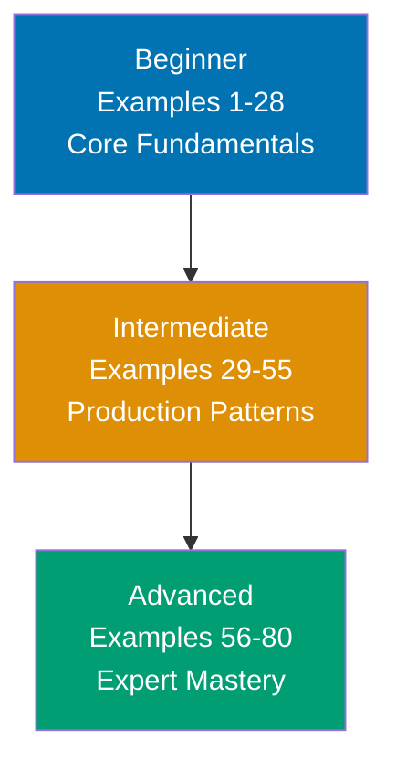

**Want to quickly master Testing Library through working examples?** This by-example guide teaches 95% of Testing Library (React Testing Library focus) through 80 annotated code examples organized by complexity level.

## What Is By-Example Learning?

By-example learning is an **example-first approach** where you learn through annotated, runnable code rather than narrative explanations. Each example is self-contained, runnable with your test runner (Jest/Vitest), and heavily commented to show:

- **What each line does** - Inline comments explain the purpose and mechanism
- **Expected behaviors** - Using `// =>` notation to show test outcomes
- **Intermediate states** - DOM states and query results made visible
- **Key takeaways** - 1-2 sentence summaries of core concepts

This approach is **ideal for experienced developers** (React developers, developers familiar with Enzyme, or software engineers new to Testing Library) who want to quickly understand Testing Library's API, accessibility-first philosophy, and unique patterns through working code.

Unlike narrative tutorials that build understanding through explanation and storytelling, by-example learning lets you **see the code first, run it second, and understand it through direct interaction**. You learn by doing, not by reading about doing.

## Learning Path



Progress from fundamentals through practical async testing to advanced production patterns. Each level builds on the previous, increasing in sophistication and introducing more Testing Library-specific idioms.

## Coverage Philosophy

This by-example guide provides **95% coverage of Testing Library** through practical, annotated examples. The 95% figure represents the depth and breadth of concepts covered—focus is on **outcomes and understanding**, not duration.

### What's Covered

- **Core queries** - getBy*, queryBy*, findBy\* with all query types (role, text, label, placeholder, alt, testId)
- **User events** - userEvent setup, click, type, keyboard, mouse, clipboard interactions
- **Async testing** - waitFor, waitForElementToBeRemoved, findBy\* queries, async user actions
- **Custom renders** - Wrapping with providers (context, Redux, Router, theme)
- **Hook testing** - renderHook, act, custom hook patterns
- **Form testing** - Controlled inputs, validation, submission, reset
- **Accessibility** - Accessible queries, jest-axe integration, ARIA patterns
- **Advanced patterns** - MSW for API mocking, within() scoping, custom queries
- **Context and state** - React Context, Redux, Zustand store testing
- **Error handling** - Error boundaries, async errors, retry patterns
- **Production patterns** - Custom render utilities, test data builders, large-scale strategies

### What's NOT Covered

This guide focuses on **learning-oriented examples**, not problem-solving recipes or production deployment:

- **Framework-specific setup** - Vite/CRA/Next.js configuration differences beyond basics
- **Non-React frameworks** - Vue Testing Library, Angular Testing Library (different libraries)
- **Native mobile testing** - React Native Testing Library (separate package)

The 95% coverage goal maintains humility—no tutorial can cover everything. This guide teaches the **core concepts that unlock the remaining 5%** through your own exploration and project work.

## How to Use This Guide

1. **Sequential or selective** - Read examples in order for progressive learning, or jump to specific topics when you need a specific pattern
2. **Run everything** - Execute examples with `npx jest` or `npx vitest` to see results yourself. Experimentation solidifies understanding.
3. **Modify and explore** - Change queries, add assertions, break tests intentionally. Learn through experimentation.
4. **Use as reference** - Bookmark examples for quick lookups when you forget syntax or patterns
5. **Complement with narrative tutorials** - By-example learning is code-first; pair with comprehensive tutorials for deeper explanations

**Best workflow**: Open your editor in one window, this guide in another, terminal in a third. Run each example as you read it. When you encounter something unfamiliar, run the example, modify it, see what changes.

## Relationship to Other Tutorials

Understanding where by-example fits in the tutorial ecosystem helps you choose the right learning path:

| Tutorial Type    | Coverage                | Approach                       | Target Audience                   | When to Use                                 |
| ---------------- | ----------------------- | ------------------------------ | --------------------------------- | ------------------------------------------- |
| **By Example**   | 95% through 80 examples | Code-first, annotated examples | Experienced developers            | Quick Testing Library pickup, reference     |
| **Quick Start**  | 5-30% touchpoints       | Hands-on first test            | Newcomers to Testing Library      | First taste, decide if worth learning       |
| **Beginner**     | 0-60% comprehensive     | Narrative, explanatory         | Complete testing beginners        | Deep understanding, first component testing |
| **Intermediate** | 60-85%                  | Practical applications         | Past basics                       | Production patterns, async testing          |
| **Advanced**     | 85-95%                  | Complex systems                | Experienced Testing Library users | Custom queries, scale patterns              |
| **Cookbook**     | Problem-specific        | Recipe-based                   | All levels                        | Solve specific component testing problems   |

**By Example vs. Enzyme**: Testing Library's philosophy is "test behavior, not implementation." Enzyme's `wrapper.state()` and `wrapper.instance()` test internals; Testing Library's `getByRole()` tests what users experience. By Example teaches this philosophy through code, not lectures.

**By Example vs. React Testing Docs**: Official docs explain what APIs do; By Example shows how to combine them in real patterns with annotation density that builds intuition.

## Prerequisites

**Required**:

- Experience with React components (functional components, hooks)
- Ability to run Node.js commands and npm/npx
- Basic understanding of HTML and DOM structure
- Familiarity with Jest or Vitest test runner basics

**Recommended (helpful but not required)**:

- Familiarity with async/await in JavaScript/TypeScript
- Experience with another testing approach (Enzyme, manual testing)
- Understanding of accessibility concepts (ARIA roles, labels)

**No prior Testing Library experience required** - This guide assumes you're new to Testing Library but experienced with React development. You should be comfortable reading TypeScript/JavaScript code, understanding basic testing concepts (assertions, test structure), and learning through hands-on experimentation.

## Structure of Each Example

Every example follows a **mandatory five-part format**:

````markdown
### Example N: Concept Name

**Part 1: Brief Explanation** (2-3 sentences)
Explains what the concept is, why it matters in component testing, and when to use it.

**Part 2: Mermaid Diagram** (when appropriate)
Visual representation of concept relationships - query selection flow, render lifecycle, or async wait behavior. Not every example needs a diagram; they're used strategically to enhance understanding.

**Part 3: Heavily Annotated Code**

```typescript
import { render, screen } from "@testing-library/react";
// => Imports core Testing Library utilities
// => render: mounts component into jsdom
// => screen: global query object bound to document.body

import userEvent from "@testing-library/user-event";
// => userEvent: simulates real browser interactions
// => More realistic than fireEvent (dispatches full event sequences)

test("button click changes text", async () => {
  const user = userEvent.setup();
  // => Creates userEvent instance with shared state
  // => Enables clipboard, pointer state across interactions

  render(<Counter />);
  // => Mounts Counter component into jsdom
  // => Makes DOM available via screen queries

  await user.click(screen.getByRole("button", { name: "Increment" }));
  // => Finds button by accessible role and name
  // => Simulates full click sequence (pointerdown, mousedown, click, pointerup, mouseup)

  expect(screen.getByText("Count: 1")).toBeInTheDocument();
  // => Asserts text is present in document
  // => jest-dom matcher from @testing-library/jest-dom
});
```

**Part 4: Key Takeaway** (1-2 sentences)
Distills the core insight: the most important pattern, when to apply it in production, or common pitfalls to avoid.

**Part 5: Why It Matters** (2-3 sentences, 50-100 words)
Connects the concept to production relevance - why professionals care, how it compares to alternatives, and consequences for quality/performance/maintainability.
````

Each example follows this structure consistently, maintaining annotation density of 1.0-2.25 comment lines per code line. The **brief explanation** provides context, the **code** is heavily annotated with inline comments and `// =>` output notation, the **key takeaway** distills the concept, and **why it matters** shows production relevance.

## Learning Strategies

### For Enzyme Users

You're used to `shallow()`, `wrapper.find()`, and implementation testing. Testing Library teaches a different philosophy:

- **Accessibility-first queries**: `getByRole('button')` instead of `find('button')`
- **No implementation access**: No `wrapper.state()`, `wrapper.instance()`, or prop inspection
- **Behavior testing**: Test what users see and do, not how components are implemented

Focus on Examples 1-10 (queries and screen object) and Examples 17-20 (text matching) to build the accessibility-first query intuition.

### For Jest/Vanilla DOM Users

You understand testing frameworks but may be new to component testing:

- **jsdom integration**: Tests run in Node.js but with real DOM APIs
- **React lifecycle**: `render()` handles mounting, updates, and cleanup automatically
- **Async awareness**: React state updates require async handling (see Examples 29-35)

Focus on Examples 1-5 (render basics) and Examples 29-35 (async testing) to understand React's async nature.

### For React Developers New to Testing

You build React apps but haven't tested them deeply:

- **Accessible markup**: Testing Library rewards semantic HTML (roles, labels, headings)
- **User perspective**: Write tests from the user's point of view, not the developer's
- **Confidence over coverage**: One behavior test beats ten implementation tests

Focus on Examples 1-15 (core queries) and Examples 21-28 (user events) to build testing intuition fast.

### For TypeScript Developers

You appreciate type safety and want typed test utilities:

- **Typed queries**: All query functions are fully typed with element types
- **Component props**: Type your render helpers and test data builders
- **Generic patterns**: `renderHook<T>()` and custom query types

Focus on Examples 29-40 (custom render and providers) and Examples 56-65 (advanced patterns) to leverage TypeScript in tests.

## Core Philosophy

Testing Library exists to encourage writing tests that resemble how users use your software. This means:

- **Query by what users see**: text, role, label, placeholder—not `data-testid` as a first resort
- **Test behavior, not implementation**: Does it work? Not: is the state correct?
- **Accessibility is the path**: Semantic HTML that Testing Library can query is accessible HTML
- **User events over fireEvent**: Real interaction sequences reveal real bugs

This philosophy shows in every example. By the end of this guide, accessible-first testing will be your default instinct.

## Ready to Start?

Jump into the beginner examples to start learning Testing Library through code:

- [Beginner Examples (1-28)](/en/learn/software-engineering/automation-testing/tools/testing-library/by-example/beginner) - Core queries, screen object, user events, text matching, form basics
- [Intermediate Examples (29-55)](/en/learn/software-engineering/automation-testing/tools/testing-library/by-example/intermediate) - Async testing, custom render, hooks, context, Redux, accessibility
- [Advanced Examples (56-80)](/en/learn/software-engineering/automation-testing/tools/testing-library/by-example/advanced) - MSW, drag-and-drop, virtualized lists, i18n, custom queries, scale patterns

Each example is self-contained and runnable. Start with Example 1, or jump to topics that interest you most.

## Examples by Level

### Beginner (Examples 1–28)

- [Example 1: First Test with render() and screen](/en/learn/software-engineering/automation-testing/tools/testing-library/by-example/beginner#example-1-first-test-with-render-and-screen)
- [Example 2: screen Object and Cleanup](/en/learn/software-engineering/automation-testing/tools/testing-library/by-example/beginner#example-2-screen-object-and-cleanup)
- [Example 3: Rendering with Props](/en/learn/software-engineering/automation-testing/tools/testing-library/by-example/beginner#example-3-rendering-with-props)
- [Example 4: render() Return Values](/en/learn/software-engineering/automation-testing/tools/testing-library/by-example/beginner#example-4-render-return-values)
- [Example 5: Rendering Lists and Multiple Elements](/en/learn/software-engineering/automation-testing/tools/testing-library/by-example/beginner#example-5-rendering-lists-and-multiple-elements)
- [Example 6: getByRole - Buttons and Links](/en/learn/software-engineering/automation-testing/tools/testing-library/by-example/beginner#example-6-getbyrole---buttons-and-links)
- [Example 7: getByRole - Headings and Structure](/en/learn/software-engineering/automation-testing/tools/testing-library/by-example/beginner#example-7-getbyrole---headings-and-structure)
- [Example 8: getByRole - Form Elements](/en/learn/software-engineering/automation-testing/tools/testing-library/by-example/beginner#example-8-getbyrole---form-elements)
- [Example 9: getByRole - Tables and Navigation](/en/learn/software-engineering/automation-testing/tools/testing-library/by-example/beginner#example-9-getbyrole---tables-and-navigation)
- [Example 10: getByRole - Dialogs and Alerts](/en/learn/software-engineering/automation-testing/tools/testing-library/by-example/beginner#example-10-getbyrole---dialogs-and-alerts)
- [Example 11: getByText - Exact and Partial Matching](/en/learn/software-engineering/automation-testing/tools/testing-library/by-example/beginner#example-11-getbytext---exact-and-partial-matching)
- [Example 12: getByText - Function Matchers and Normalization](/en/learn/software-engineering/automation-testing/tools/testing-library/by-example/beginner#example-12-getbytext---function-matchers-and-normalization)
- [Example 13: getByLabelText - Form Label Queries](/en/learn/software-engineering/automation-testing/tools/testing-library/by-example/beginner#example-13-getbylabeltext---form-label-queries)
- [Example 14: getByPlaceholderText and getByAltText](/en/learn/software-engineering/automation-testing/tools/testing-library/by-example/beginner#example-14-getbyplaceholdertext-and-getbyalttext)
- [Example 15: getByTestId - Test ID Escape Hatch](/en/learn/software-engineering/automation-testing/tools/testing-library/by-example/beginner#example-15-getbytestid---test-id-escape-hatch)
- [Example 16: within() - Scoped Queries](/en/learn/software-engineering/automation-testing/tools/testing-library/by-example/beginner#example-16-within---scoped-queries)
- [Example 17: queryBy*and findBy* Introduction](/en/learn/software-engineering/automation-testing/tools/testing-library/by-example/beginner#example-17-querybyand-findby-introduction)
- [Example 18: userEvent.setup() and click()](/en/learn/software-engineering/automation-testing/tools/testing-library/by-example/beginner#example-18-usereventsetup-and-click)
- [Example 19: userEvent.type() and Keyboard Input](/en/learn/software-engineering/automation-testing/tools/testing-library/by-example/beginner#example-19-usereventtype-and-keyboard-input)
- [Example 20: userEvent.keyboard() - Special Keys](/en/learn/software-engineering/automation-testing/tools/testing-library/by-example/beginner#example-20-usereventkeyboard---special-keys)
- [Example 21: userEvent.selectOptions() and Form Controls](/en/learn/software-engineering/automation-testing/tools/testing-library/by-example/beginner#example-21-usereventselectoptions-and-form-controls)
- [Example 22: userEvent - Hover and Focus Events](/en/learn/software-engineering/automation-testing/tools/testing-library/by-example/beginner#example-22-userevent---hover-and-focus-events)
- [Example 23: Form Submission Testing](/en/learn/software-engineering/automation-testing/tools/testing-library/by-example/beginner#example-23-form-submission-testing)
- [Example 24: Input Validation and Error Messages](/en/learn/software-engineering/automation-testing/tools/testing-library/by-example/beginner#example-24-input-validation-and-error-messages)
- [Example 25: Checkbox and Multi-Select Form Testing](/en/learn/software-engineering/automation-testing/tools/testing-library/by-example/beginner#example-25-checkbox-and-multi-select-form-testing)
- [Example 26: Visibility and Presence Assertions](/en/learn/software-engineering/automation-testing/tools/testing-library/by-example/beginner#example-26-visibility-and-presence-assertions)
- [Example 27: Value and Attribute Assertions](/en/learn/software-engineering/automation-testing/tools/testing-library/by-example/beginner#example-27-value-and-attribute-assertions)
- [Example 28: Focus, Required, and Disabled Assertions](/en/learn/software-engineering/automation-testing/tools/testing-library/by-example/beginner#example-28-focus-required-and-disabled-assertions)

### Intermediate (Examples 29–55)

- [Example 29: waitFor - Waiting for DOM Updates](/en/learn/software-engineering/automation-testing/tools/testing-library/by-example/intermediate#example-29-waitfor---waiting-for-dom-updates)
- [Example 30: findBy\* Queries - Built-in Async Queries](/en/learn/software-engineering/automation-testing/tools/testing-library/by-example/intermediate#example-30-findby-queries---built-in-async-queries)
- [Example 31: waitForElementToBeRemoved](/en/learn/software-engineering/automation-testing/tools/testing-library/by-example/intermediate#example-31-waitforelementtoberemoved)
- [Example 32: Async User Events and Timing](/en/learn/software-engineering/automation-testing/tools/testing-library/by-example/intermediate#example-32-async-user-events-and-timing)
- [Example 33: act() - Manual React Update Batching](/en/learn/software-engineering/automation-testing/tools/testing-library/by-example/intermediate#example-33-act---manual-react-update-batching)
- [Example 34: Testing Async Error States](/en/learn/software-engineering/automation-testing/tools/testing-library/by-example/intermediate#example-34-testing-async-error-states)
- [Example 35: findAllBy\* and Multiple Async Elements](/en/learn/software-engineering/automation-testing/tools/testing-library/by-example/intermediate#example-35-findallby-and-multiple-async-elements)
- [Example 36: Custom render() with Context Providers](/en/learn/software-engineering/automation-testing/tools/testing-library/by-example/intermediate#example-36-custom-render-with-context-providers)
- [Example 37: Testing Components with React Router](/en/learn/software-engineering/automation-testing/tools/testing-library/by-example/intermediate#example-37-testing-components-with-react-router)
- [Example 38: renderHook - Testing Custom Hooks](/en/learn/software-engineering/automation-testing/tools/testing-library/by-example/intermediate#example-38-renderhook---testing-custom-hooks)
- [Example 39: renderHook with Providers and Async](/en/learn/software-engineering/automation-testing/tools/testing-library/by-example/intermediate#example-39-renderhook-with-providers-and-async)
- [Example 40: Testing React Context Consumer Components](/en/learn/software-engineering/automation-testing/tools/testing-library/by-example/intermediate#example-40-testing-react-context-consumer-components)
- [Example 41: Testing Form Validation Workflows](/en/learn/software-engineering/automation-testing/tools/testing-library/by-example/intermediate#example-41-testing-form-validation-workflows)
- [Example 42: Testing Modal Dialogs](/en/learn/software-engineering/automation-testing/tools/testing-library/by-example/intermediate#example-42-testing-modal-dialogs)
- [Example 43: Testing Navigation and Route Changes](/en/learn/software-engineering/automation-testing/tools/testing-library/by-example/intermediate#example-43-testing-navigation-and-route-changes)
- [Example 44: Accessible Queries as Accessibility Tests](/en/learn/software-engineering/automation-testing/tools/testing-library/by-example/intermediate#example-44-accessible-queries-as-accessibility-tests)
- [Example 45: jest-axe for Automated Accessibility Auditing](/en/learn/software-engineering/automation-testing/tools/testing-library/by-example/intermediate#example-45-jest-axe-for-automated-accessibility-auditing)
- [Example 46: Testing ARIA Live Regions and Announcements](/en/learn/software-engineering/automation-testing/tools/testing-library/by-example/intermediate#example-46-testing-aria-live-regions-and-announcements)
- [Example 47: Testing Error Boundaries](/en/learn/software-engineering/automation-testing/tools/testing-library/by-example/intermediate#example-47-testing-error-boundaries)
- [Example 48: Testing Suspense and Lazy Loading](/en/learn/software-engineering/automation-testing/tools/testing-library/by-example/intermediate#example-48-testing-suspense-and-lazy-loading)
- [Example 49: Testing Custom Hooks with Error Handling](/en/learn/software-engineering/automation-testing/tools/testing-library/by-example/intermediate#example-49-testing-custom-hooks-with-error-handling)
- [Example 50: Testing React.memo Components](/en/learn/software-engineering/automation-testing/tools/testing-library/by-example/intermediate#example-50-testing-reactmemo-components)
- [Example 51: Testing useCallback and useMemo](/en/learn/software-engineering/automation-testing/tools/testing-library/by-example/intermediate#example-51-testing-usecallback-and-usememo)
- [Example 52: Testing Context with useReducer](/en/learn/software-engineering/automation-testing/tools/testing-library/by-example/intermediate#example-52-testing-context-with-usereducer)
- [Example 53: Testing with MSW (Mock Service Worker) Basics](/en/learn/software-engineering/automation-testing/tools/testing-library/by-example/intermediate#example-53-testing-with-msw-mock-service-worker-basics)
- [Example 54: Testing List Components with Dynamic Data](/en/learn/software-engineering/automation-testing/tools/testing-library/by-example/intermediate#example-54-testing-list-components-with-dynamic-data)
- [Example 55: Testing Controlled vs Uncontrolled Inputs](/en/learn/software-engineering/automation-testing/tools/testing-library/by-example/intermediate#example-55-testing-controlled-vs-uncontrolled-inputs)

### Advanced (Examples 56–80)

- [Example 56: MSW Handler Overrides Per Test](/en/learn/software-engineering/automation-testing/tools/testing-library/by-example/advanced#example-56-msw-handler-overrides-per-test)
- [Example 57: MSW Network Delay Simulation](/en/learn/software-engineering/automation-testing/tools/testing-library/by-example/advanced#example-57-msw-network-delay-simulation)
- [Example 58: MSW for Complex API Workflows](/en/learn/software-engineering/automation-testing/tools/testing-library/by-example/advanced#example-58-msw-for-complex-api-workflows)
- [Example 59: MSW WebSocket Mocking](/en/learn/software-engineering/automation-testing/tools/testing-library/by-example/advanced#example-59-msw-websocket-mocking)
- [Example 60: MSW Request Assertions](/en/learn/software-engineering/automation-testing/tools/testing-library/by-example/advanced#example-60-msw-request-assertions)
- [Example 61: Building Custom Query Functions](/en/learn/software-engineering/automation-testing/tools/testing-library/by-example/advanced#example-61-building-custom-query-functions)
- [Example 62: Testing Drag-and-Drop Interactions](/en/learn/software-engineering/automation-testing/tools/testing-library/by-example/advanced#example-62-testing-drag-and-drop-interactions)
- [Example 63: Testing Virtualized Lists](/en/learn/software-engineering/automation-testing/tools/testing-library/by-example/advanced#example-63-testing-virtualized-lists)
- [Example 64: Custom Render Utilities for Large Codebases](/en/learn/software-engineering/automation-testing/tools/testing-library/by-example/advanced#example-64-custom-render-utilities-for-large-codebases)
- [Example 65: Test Data Builders](/en/learn/software-engineering/automation-testing/tools/testing-library/by-example/advanced#example-65-test-data-builders)
- [Example 66: Snapshot Testing with Caution](/en/learn/software-engineering/automation-testing/tools/testing-library/by-example/advanced#example-66-snapshot-testing-with-caution)
- [Example 67: Testing with Real Timers vs Fake Timers](/en/learn/software-engineering/automation-testing/tools/testing-library/by-example/advanced#example-67-testing-with-real-timers-vs-fake-timers)
- [Example 68: Parallel Test Organization for Large Suites](/en/learn/software-engineering/automation-testing/tools/testing-library/by-example/advanced#example-68-parallel-test-organization-for-large-suites)
- [Example 69: Internationalization (i18n) Testing](/en/learn/software-engineering/automation-testing/tools/testing-library/by-example/advanced#example-69-internationalization-i18n-testing)
- [Example 70: Performance Testing - Render Count Verification](/en/learn/software-engineering/automation-testing/tools/testing-library/by-example/advanced#example-70-performance-testing---render-count-verification)
- [Example 71: Testing Portals](/en/learn/software-engineering/automation-testing/tools/testing-library/by-example/advanced#example-71-testing-portals)
- [Example 72: Testing with React Query](/en/learn/software-engineering/automation-testing/tools/testing-library/by-example/advanced#example-72-testing-with-react-query)
- [Example 73: Accessibility - Testing Complete User Flows](/en/learn/software-engineering/automation-testing/tools/testing-library/by-example/advanced#example-73-accessibility---testing-complete-user-flows)
- [Example 74: Testing with Zustand State Management](/en/learn/software-engineering/automation-testing/tools/testing-library/by-example/advanced#example-74-testing-with-zustand-state-management)
- [Example 75: CI Integration and Test Configuration](/en/learn/software-engineering/automation-testing/tools/testing-library/by-example/advanced#example-75-ci-integration-and-test-configuration)
- [Example 76: Debugging Failed Tests](/en/learn/software-engineering/automation-testing/tools/testing-library/by-example/advanced#example-76-debugging-failed-tests)
- [Example 77: Testing with Redux Toolkit](/en/learn/software-engineering/automation-testing/tools/testing-library/by-example/advanced#example-77-testing-with-redux-toolkit)
- [Example 78: Testing Component Libraries Integration](/en/learn/software-engineering/automation-testing/tools/testing-library/by-example/advanced#example-78-testing-component-libraries-integration)
- [Example 79: Testing Forms with File Uploads](/en/learn/software-engineering/automation-testing/tools/testing-library/by-example/advanced#example-79-testing-forms-with-file-uploads)
- [Example 80: Testing Patterns Summary - The Testing Trophy](/en/learn/software-engineering/automation-testing/tools/testing-library/by-example/advanced#example-80-testing-patterns-summary---the-testing-trophy)
