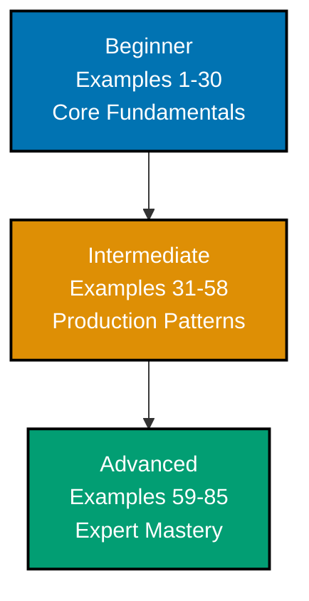

**Want to quickly master Vitest through working examples?** This by-example guide teaches 95% of Vitest through 85 annotated code examples organized by complexity level.

## What Is By-Example Learning?

By-example learning is an **example-first approach** where you learn through annotated, runnable code rather than narrative explanations. Each example is self-contained, immediately executable with `npx vitest run`, and heavily commented to show:

- **What each line does** - Inline comments explain the purpose and mechanism
- **Expected behaviors** - Using `// =>` notation to show test outcomes
- **Intermediate states** - Mock states, assertion results, and configuration effects made visible
- **Key takeaways** - 1-2 sentence summaries of core concepts

This approach is **ideal for experienced developers** (Jest users, testing library veterans, or software engineers) who are familiar with testing concepts and want to quickly understand Vitest's API, Vite-native features, and unique capabilities through working code.

Unlike narrative tutorials that build understanding through explanation and storytelling, by-example learning lets you **see the code first, run it second, and understand it through direct interaction**. You learn by doing, not by reading about doing.

## Learning Path



Progress from fundamentals through production patterns to expert mastery. Each level builds on the previous, increasing in sophistication and introducing more Vitest-specific features.

## Coverage Philosophy

This by-example guide provides **95% coverage of Vitest** through practical, annotated examples. The 95% figure represents the depth and breadth of concepts covered, not a time estimate -- focus is on **outcomes and understanding**, not duration.

### What's Covered

- **Core fundamentals** - test/it/describe, expect assertions, test lifecycle hooks
- **Assertion matchers** - Truthiness, numbers, strings, arrays, objects, exceptions, snapshots
- **Test organization** - skip, only, todo, each, concurrent, test context
- **Mocking** - vi.fn, vi.spyOn, vi.mock, module mocking, timer mocks, mock implementations
- **Async testing** - Promises, async/await, callback-based tests, concurrent execution
- **DOM testing** - happy-dom/jsdom environments, React component testing, hook testing
- **Coverage** - c8/istanbul providers, threshold configuration, reporting
- **Advanced configuration** - Workspaces, reporters, environments, pool configuration
- **Type testing** - expectTypeOf, assertType for compile-time verification
- **Custom matchers** - expect.extend for domain-specific assertions
- **Performance** - Benchmarking, test sharding, dependency optimization
- **CI/CD integration** - Reporter configuration, parallel execution, watch mode patterns

### What's NOT Covered

This guide focuses on **learning-oriented examples**, not problem-solving recipes or production deployment. For additional topics:

- **Deep framework integrations** - Specific CI/CD platforms, cloud testing services
- **Storybook integration** - Storybook-specific test configurations
- **Legacy migration** - Detailed Jest-to-Vitest migration scripts

The 95% coverage goal maintains humility -- no tutorial can cover everything. This guide teaches the **core concepts that unlock the remaining 5%** through your own exploration and project work.

## How to Use This Guide

1. **Sequential or selective** - Read examples in order for progressive learning, or jump to specific topics when switching from Jest
2. **Run everything** - Execute examples with `npx vitest run` to see results yourself. Experimentation solidifies understanding.
3. **Modify and explore** - Change assertions, add mocks, break tests intentionally. Learn through experimentation.
4. **Use as reference** - Bookmark examples for quick lookups when you forget syntax or patterns
5. **Complement with narrative tutorials** - By-example learning is code-first; pair with comprehensive tutorials for deeper explanations

**Best workflow**: Open your editor in one window, this guide in another, terminal in a third. Run each example as you read it. When you encounter something unfamiliar, run the example, modify it, see what changes.

## Relationship to Other Tutorials

Understanding where by-example fits in the tutorial ecosystem helps you choose the right learning path:

| Tutorial Type    | Coverage                | Approach                       | Target Audience            | When to Use                                       |
| ---------------- | ----------------------- | ------------------------------ | -------------------------- | ------------------------------------------------- |
| **By Example**   | 95% through 85 examples | Code-first, annotated examples | Experienced developers     | Quick framework pickup, reference, tool switching |
| **Quick Start**  | 5-30% touchpoints       | Hands-on first test            | Newcomers to Vitest        | First taste, decide if worth learning             |
| **Beginner**     | 0-60% comprehensive     | Narrative, explanatory         | Complete testing beginners | Deep understanding, first testing framework       |
| **Intermediate** | 60-85%                  | Practical applications         | Past basics                | Production patterns, CI/CD integration            |
| **Advanced**     | 85-95%                  | Complex systems                | Experienced Vitest users   | Custom reporters, advanced mocking, browser mode  |
| **Cookbook**     | Problem-specific        | Recipe-based                   | All levels                 | Solve specific testing problems                   |

**By Example vs. Quick Start**: By Example provides 95% coverage through examples vs. Quick Start's 5-30% through your first test. By Example is code-first reference; Quick Start is hands-on introduction.

**By Example vs. Beginner Tutorial**: By Example is code-first for experienced developers; Beginner Tutorial is narrative-first for complete testing beginners. By Example shows patterns; Beginner Tutorial explains concepts.

**By Example vs. Cookbook**: By Example is learning-oriented (understand concepts); Cookbook is problem-solving oriented (fix specific issues). By Example teaches patterns; Cookbook provides solutions.

## Prerequisites

**Required**:

- Experience with JavaScript/TypeScript development
- Ability to run Node.js commands and npm/npx
- Basic understanding of testing concepts (assertions, test structure)

**Recommended (helpful but not required)**:

- Familiarity with Vite build tool
- Experience with another testing framework (Jest, Mocha, Jasmine)
- Understanding of ES modules vs CommonJS

**No prior Vitest experience required** -- This guide assumes you're new to Vitest but experienced with JavaScript/TypeScript development in general. You should be comfortable reading TypeScript code, understanding basic testing concepts (assertions, mocks, test lifecycle), and learning through hands-on experimentation.

## Structure of Each Example

Every example follows a **mandatory five-part format**:

````markdown
### Example N: Concept Name

**Part 1: Brief Explanation** (2-3 sentences)
Explains what the concept is, why it matters in testing, and when to use it.

**Part 2: Mermaid Diagram** (when appropriate)
Visual representation of concept relationships - test flow, mock hierarchies, or configuration composition. Not every example needs a diagram; they're used strategically to enhance understanding.

**Part 3: Heavily Annotated Code**

```typescript
import { describe, it, expect } from "vitest";
// => Vitest test framework imports
// => describe: group tests, it: define test, expect: assertions

describe("example suite", () => {
  // => describe() groups related tests
  // => String label appears in test output

  it("should demonstrate concept", () => {
    // => it() defines a single test case
    // => String describes expected behavior

    const result = 2 + 2;
    // => Performs calculation
    // => result is 4 (type: number)

    expect(result).toBe(4);
    // => Asserts result equals 4 (strict equality)
    // => Test passes when values match
  });
});
```

**Part 4: Key Takeaway** (1-2 sentences)
Distills the core insight: the most important pattern, when to apply it in production, or common pitfalls to avoid.

**Part 5: Why It Matters** (2-3 sentences, 50-100 words)
Connects the concept to production relevance - why professionals care, how it compares to alternatives, and consequences for quality/performance/maintainability.
````

Each example follows this structure consistently, maintaining annotation density of 1.0-2.25 comment lines per code line. The **brief explanation** provides context, the **code** is heavily annotated with inline comments and `// =>` output notation, the **key takeaway** distills the concept, and **why it matters** shows production relevance.

## Learning Strategies

### For Jest Users

You're familiar with Jest's API and patterns. Vitest provides near-identical API with Vite-native performance:

- **Same API**: describe, it, expect, vi (replaces jest) -- minimal rewriting
- **Native ESM**: No transform configuration for ES modules
- **Vite integration**: Shared config with your build tool, HMR-powered watch mode

Focus on Examples 1-5 (basic setup and API differences) and Examples 31-40 (module mocking with vi.mock) to identify key differences from Jest.

### For Mocha/Chai Users

You understand BDD-style testing and assertion libraries. Vitest combines test runner and assertions:

- **Built-in assertions**: No separate assertion library needed
- **BDD syntax**: describe/it work exactly as expected
- **Integrated mocking**: vi.fn, vi.mock built into the framework

Focus on Examples 6-15 (assertion matchers) and Examples 20-25 (mocking basics) to see how Vitest unifies the testing experience.

### For Frontend Developers

You build with Vite and want testing that matches your build tool:

- **Shared configuration**: vitest.config.ts extends vite.config.ts
- **Same transforms**: TypeScript, JSX, CSS modules work identically in tests
- **Component testing**: First-class happy-dom/jsdom support

Focus on Examples 44-48 (DOM and component testing) and Examples 50-53 (coverage configuration) to integrate testing into your Vite workflow.

### For Backend/Node.js Developers

You test APIs, services, and utilities. Vitest provides fast, modern testing:

- **TypeScript native**: No separate ts-jest configuration
- **Fast execution**: Vite's transformation pipeline is significantly faster
- **Module mocking**: vi.mock handles ESM and CJS modules cleanly

Focus on Examples 16-19 (async testing) and Examples 31-38 (advanced mocking) to apply Vitest to backend code.

## Code-First Philosophy

This tutorial prioritizes working code over theoretical discussion:

- **No lengthy prose**: Concepts are demonstrated, not explained at length
- **Runnable examples**: Every example runs with `npx vitest run`
- **Learn by doing**: Understanding comes from running and modifying code
- **Pattern recognition**: See the same patterns in different contexts across 85 examples

If you prefer narrative explanations, complement this guide with comprehensive tutorials. By-example learning works best when you learn through experimentation.

## Ready to Start?

Jump into the beginner examples to start learning Vitest through code:

- [Beginner Examples (1-30)](/en/learn/software-engineering/automation-testing/tools/vitest/by-example/beginner) - Core fundamentals, assertions, mocking basics, async testing
- [Intermediate Examples (31-58)](/en/learn/software-engineering/automation-testing/tools/vitest/by-example/intermediate) - Module mocking, DOM testing, coverage, workspaces, custom matchers
- [Advanced Examples (59-85)](/en/learn/software-engineering/automation-testing/tools/vitest/by-example/advanced) - Benchmarking, browser mode, sharding, CI/CD, advanced patterns

Each example is self-contained and runnable. Start with Example 1, or jump to topics that interest you most.

## Examples by Level

### Beginner (Examples 1–30)

- [Example 1: Hello World - Your First Vitest Test](/en/learn/software-engineering/automation-testing/tools/vitest/by-example/beginner#example-1-hello-world---your-first-vitest-test)
- [Example 2: Using it() and describe() for BDD Structure](/en/learn/software-engineering/automation-testing/tools/vitest/by-example/beginner#example-2-using-it-and-describe-for-bdd-structure)
- [Example 3: Test Configuration with vitest.config.ts](/en/learn/software-engineering/automation-testing/tools/vitest/by-example/beginner#example-3-test-configuration-with-vitestconfigts)
- [Example 4: Test File Conventions and Discovery](/en/learn/software-engineering/automation-testing/tools/vitest/by-example/beginner#example-4-test-file-conventions-and-discovery)
- [Example 5: Running Tests - CLI Options](/en/learn/software-engineering/automation-testing/tools/vitest/by-example/beginner#example-5-running-tests---cli-options)
- [Example 6: Equality Matchers - toBe vs toEqual](/en/learn/software-engineering/automation-testing/tools/vitest/by-example/beginner#example-6-equality-matchers---tobe-vs-toequal)
- [Example 7: Truthiness Matchers](/en/learn/software-engineering/automation-testing/tools/vitest/by-example/beginner#example-7-truthiness-matchers)
- [Example 8: Number Matchers](/en/learn/software-engineering/automation-testing/tools/vitest/by-example/beginner#example-8-number-matchers)
- [Example 9: String Matchers](/en/learn/software-engineering/automation-testing/tools/vitest/by-example/beginner#example-9-string-matchers)
- [Example 10: Array and Object Matchers](/en/learn/software-engineering/automation-testing/tools/vitest/by-example/beginner#example-10-array-and-object-matchers)
- [Example 11: Exception Matchers](/en/learn/software-engineering/automation-testing/tools/vitest/by-example/beginner#example-11-exception-matchers)
- [Example 12: Snapshot Testing](/en/learn/software-engineering/automation-testing/tools/vitest/by-example/beginner#example-12-snapshot-testing)
- [Example 13: not Modifier for Negative Assertions](/en/learn/software-engineering/automation-testing/tools/vitest/by-example/beginner#example-13-not-modifier-for-negative-assertions)
- [Example 14: expect.any and expect.anything Wildcards](/en/learn/software-engineering/automation-testing/tools/vitest/by-example/beginner#example-14-expectany-and-expectanything-wildcards)
- [Example 15: Chained Matchers with expect.stringContaining and expect.objectContaining](/en/learn/software-engineering/automation-testing/tools/vitest/by-example/beginner#example-15-chained-matchers-with-expectstringcontaining-and-expectobjectcontaining)
- [Example 16: beforeEach and afterEach Hooks](/en/learn/software-engineering/automation-testing/tools/vitest/by-example/beginner#example-16-beforeeach-and-aftereach-hooks)
- [Example 17: beforeAll and afterAll Hooks](/en/learn/software-engineering/automation-testing/tools/vitest/by-example/beginner#example-17-beforeall-and-afterall-hooks)
- [Example 18: Nested Lifecycle Hook Execution Order](/en/learn/software-engineering/automation-testing/tools/vitest/by-example/beginner#example-18-nested-lifecycle-hook-execution-order)
- [Example 19: Async Lifecycle Hooks](/en/learn/software-engineering/automation-testing/tools/vitest/by-example/beginner#example-19-async-lifecycle-hooks)
- [Example 20: test.skip - Temporarily Disabling Tests](/en/learn/software-engineering/automation-testing/tools/vitest/by-example/beginner#example-20-testskip---temporarily-disabling-tests)
- [Example 21: test.only - Focused Test Execution](/en/learn/software-engineering/automation-testing/tools/vitest/by-example/beginner#example-21-testonly---focused-test-execution)
- [Example 22: test.todo - Placeholder Tests](/en/learn/software-engineering/automation-testing/tools/vitest/by-example/beginner#example-22-testtodo---placeholder-tests)
- [Example 23: test.each - Parameterized Tests](/en/learn/software-engineering/automation-testing/tools/vitest/by-example/beginner#example-23-testeach---parameterized-tests)
- [Example 24: Testing Async/Await Functions](/en/learn/software-engineering/automation-testing/tools/vitest/by-example/beginner#example-24-testing-asyncawait-functions)
- [Example 25: Testing Promise Rejection Patterns](/en/learn/software-engineering/automation-testing/tools/vitest/by-example/beginner#example-25-testing-promise-rejection-patterns)
- [Example 26: Testing Callbacks and Event Emitters](/en/learn/software-engineering/automation-testing/tools/vitest/by-example/beginner#example-26-testing-callbacks-and-event-emitters)
- [Example 27: vi.fn() - Creating Mock Functions](/en/learn/software-engineering/automation-testing/tools/vitest/by-example/beginner#example-27-vifn---creating-mock-functions)
- [Example 28: Mock Return Values and Implementations](/en/learn/software-engineering/automation-testing/tools/vitest/by-example/beginner#example-28-mock-return-values-and-implementations)
- [Example 29: vi.spyOn - Spying on Existing Methods](/en/learn/software-engineering/automation-testing/tools/vitest/by-example/beginner#example-29-vispyon---spying-on-existing-methods)
- [Example 30: Timer Mocks - vi.useFakeTimers](/en/learn/software-engineering/automation-testing/tools/vitest/by-example/beginner#example-30-timer-mocks---viusefaketimers)

### Intermediate (Examples 31–58)

- [Example 31: vi.mock - Mocking Entire Modules](/en/learn/software-engineering/automation-testing/tools/vitest/by-example/intermediate#example-31-vimock---mocking-entire-modules)
- [Example 32: vi.mock with Auto-Mocking](/en/learn/software-engineering/automation-testing/tools/vitest/by-example/intermediate#example-32-vimock-with-auto-mocking)
- [Example 33: Manual Mocks with **mocks** Directory](/en/learn/software-engineering/automation-testing/tools/vitest/by-example/intermediate#example-33-manual-mocks-with-mocks-directory)
- [Example 34: Mocking Module Factories with Partial Mocking](/en/learn/software-engineering/automation-testing/tools/vitest/by-example/intermediate#example-34-mocking-module-factories-with-partial-mocking)
- [Example 35: Mocking Classes](/en/learn/software-engineering/automation-testing/tools/vitest/by-example/intermediate#example-35-mocking-classes)
- [Example 36: Mock Implementations for Complex Scenarios](/en/learn/software-engineering/automation-testing/tools/vitest/by-example/intermediate#example-36-mock-implementations-for-complex-scenarios)
- [Example 37: Mocking Global Functions - fetch](/en/learn/software-engineering/automation-testing/tools/vitest/by-example/intermediate#example-37-mocking-global-functions---fetch)
- [Example 38: vi.mocked - Type-Safe Mock Access](/en/learn/software-engineering/automation-testing/tools/vitest/by-example/intermediate#example-38-vimocked---type-safe-mock-access)
- [Example 39: DOM Testing with happy-dom](/en/learn/software-engineering/automation-testing/tools/vitest/by-example/intermediate#example-39-dom-testing-with-happy-dom)
- [Example 40: Testing with jsdom Environment](/en/learn/software-engineering/automation-testing/tools/vitest/by-example/intermediate#example-40-testing-with-jsdom-environment)
- [Example 41: Testing React Components with Vitest](/en/learn/software-engineering/automation-testing/tools/vitest/by-example/intermediate#example-41-testing-react-components-with-vitest)
- [Example 42: Testing Custom Hooks Pattern](/en/learn/software-engineering/automation-testing/tools/vitest/by-example/intermediate#example-42-testing-custom-hooks-pattern)
- [Example 43: Testing Async Components](/en/learn/software-engineering/automation-testing/tools/vitest/by-example/intermediate#example-43-testing-async-components)
- [Example 44: Inline Test Environment with @vitest-environment](/en/learn/software-engineering/automation-testing/tools/vitest/by-example/intermediate#example-44-inline-test-environment-with-vitest-environment)
- [Example 45: Testing with Cleanup Patterns](/en/learn/software-engineering/automation-testing/tools/vitest/by-example/intermediate#example-45-testing-with-cleanup-patterns)
- [Example 46: Coverage Configuration](/en/learn/software-engineering/automation-testing/tools/vitest/by-example/intermediate#example-46-coverage-configuration)
- [Example 47: In-Source Testing](/en/learn/software-engineering/automation-testing/tools/vitest/by-example/intermediate#example-47-in-source-testing)
- [Example 48: Workspace Configuration](/en/learn/software-engineering/automation-testing/tools/vitest/by-example/intermediate#example-48-workspace-configuration)
- [Example 49: Test Filtering and Reporters](/en/learn/software-engineering/automation-testing/tools/vitest/by-example/intermediate#example-49-test-filtering-and-reporters)
- [Example 50: Concurrent Tests](/en/learn/software-engineering/automation-testing/tools/vitest/by-example/intermediate#example-50-concurrent-tests)
- [Example 51: expectTypeOf - Compile-Time Type Assertions](/en/learn/software-engineering/automation-testing/tools/vitest/by-example/intermediate#example-51-expecttypeof---compile-time-type-assertions)
- [Example 52: Complex Type Testing Patterns](/en/learn/software-engineering/automation-testing/tools/vitest/by-example/intermediate#example-52-complex-type-testing-patterns)
- [Example 53: assertType for Runtime Type Narrowing](/en/learn/software-engineering/automation-testing/tools/vitest/by-example/intermediate#example-53-asserttype-for-runtime-type-narrowing)
- [Example 54: expect.extend - Creating Custom Matchers](/en/learn/software-engineering/automation-testing/tools/vitest/by-example/intermediate#example-54-expectextend---creating-custom-matchers)
- [Example 55: Custom Matchers for Objects](/en/learn/software-engineering/automation-testing/tools/vitest/by-example/intermediate#example-55-custom-matchers-for-objects)
- [Example 56: Asymmetric Custom Matchers](/en/learn/software-engineering/automation-testing/tools/vitest/by-example/intermediate#example-56-asymmetric-custom-matchers)
- [Example 57: Test Context and Fixtures](/en/learn/software-engineering/automation-testing/tools/vitest/by-example/intermediate#example-57-test-context-and-fixtures)
- [Example 58: Test Retry Configuration](/en/learn/software-engineering/automation-testing/tools/vitest/by-example/intermediate#example-58-test-retry-configuration)

### Advanced (Examples 59–85)

- [Example 59: Basic Benchmarking with bench()](/en/learn/software-engineering/automation-testing/tools/vitest/by-example/advanced#example-59-basic-benchmarking-with-bench)
- [Example 60: Comparing Benchmark Results](/en/learn/software-engineering/automation-testing/tools/vitest/by-example/advanced#example-60-comparing-benchmark-results)
- [Example 61: Benchmark Baselines and Regression Detection](/en/learn/software-engineering/automation-testing/tools/vitest/by-example/advanced#example-61-benchmark-baselines-and-regression-detection)
- [Example 62: Browser Mode Configuration](/en/learn/software-engineering/automation-testing/tools/vitest/by-example/advanced#example-62-browser-mode-configuration)
- [Example 63: Browser Mode with Component Testing](/en/learn/software-engineering/automation-testing/tools/vitest/by-example/advanced#example-63-browser-mode-with-component-testing)
- [Example 64: Test Sharding for CI](/en/learn/software-engineering/automation-testing/tools/vitest/by-example/advanced#example-64-test-sharding-for-ci)
- [Example 65: Pool Configuration](/en/learn/software-engineering/automation-testing/tools/vitest/by-example/advanced#example-65-pool-configuration)
- [Example 66: Isolate and Sequence Configuration](/en/learn/software-engineering/automation-testing/tools/vitest/by-example/advanced#example-66-isolate-and-sequence-configuration)
- [Example 67: Custom Snapshot Serializers](/en/learn/software-engineering/automation-testing/tools/vitest/by-example/advanced#example-67-custom-snapshot-serializers)
- [Example 68: Snapshot Property Matchers](/en/learn/software-engineering/automation-testing/tools/vitest/by-example/advanced#example-68-snapshot-property-matchers)
- [Example 69: Debugging Tests with Node Inspector](/en/learn/software-engineering/automation-testing/tools/vitest/by-example/advanced#example-69-debugging-tests-with-node-inspector)
- [Example 70: Watch Mode Patterns](/en/learn/software-engineering/automation-testing/tools/vitest/by-example/advanced#example-70-watch-mode-patterns)
- [Example 71: Vitest UI - Visual Test Dashboard](/en/learn/software-engineering/automation-testing/tools/vitest/by-example/advanced#example-71-vitest-ui---visual-test-dashboard)
- [Example 72: Testing Error Boundaries and Edge Cases](/en/learn/software-engineering/automation-testing/tools/vitest/by-example/advanced#example-72-testing-error-boundaries-and-edge-cases)
- [Example 73: GitHub Actions Integration](/en/learn/software-engineering/automation-testing/tools/vitest/by-example/advanced#example-73-github-actions-integration)
- [Example 74: Coverage Enforcement in CI](/en/learn/software-engineering/automation-testing/tools/vitest/by-example/advanced#example-74-coverage-enforcement-in-ci)
- [Example 75: Reporter Configuration for Different Environments](/en/learn/software-engineering/automation-testing/tools/vitest/by-example/advanced#example-75-reporter-configuration-for-different-environments)
- [Example 76: Watch Mode in CI - Preventing Accidental Hangs](/en/learn/software-engineering/automation-testing/tools/vitest/by-example/advanced#example-76-watch-mode-in-ci---preventing-accidental-hangs)
- [Example 77: Mocking Complex Dependencies - File System](/en/learn/software-engineering/automation-testing/tools/vitest/by-example/advanced#example-77-mocking-complex-dependencies---file-system)
- [Example 78: Mocking Environment Variables](/en/learn/software-engineering/automation-testing/tools/vitest/by-example/advanced#example-78-mocking-environment-variables)
- [Example 79: Mocking Date and Random Values](/en/learn/software-engineering/automation-testing/tools/vitest/by-example/advanced#example-79-mocking-date-and-random-values)
- [Example 80: Integration Testing with MSW (Mock Service Worker)](/en/learn/software-engineering/automation-testing/tools/vitest/by-example/advanced#example-80-integration-testing-with-msw-mock-service-worker)
- [Example 81: Monorepo Testing Strategies](/en/learn/software-engineering/automation-testing/tools/vitest/by-example/advanced#example-81-monorepo-testing-strategies)
- [Example 82: Dependency Optimization](/en/learn/software-engineering/automation-testing/tools/vitest/by-example/advanced#example-82-dependency-optimization)
- [Example 83: Testing with Module Graph Awareness](/en/learn/software-engineering/automation-testing/tools/vitest/by-example/advanced#example-83-testing-with-module-graph-awareness)
- [Example 84: Testing Vite Plugins](/en/learn/software-engineering/automation-testing/tools/vitest/by-example/advanced#example-84-testing-vite-plugins)
- [Example 85: Test Isolation Patterns - Preventing State Leaks](/en/learn/software-engineering/automation-testing/tools/vitest/by-example/advanced#example-85-test-isolation-patterns---preventing-state-leaks)
