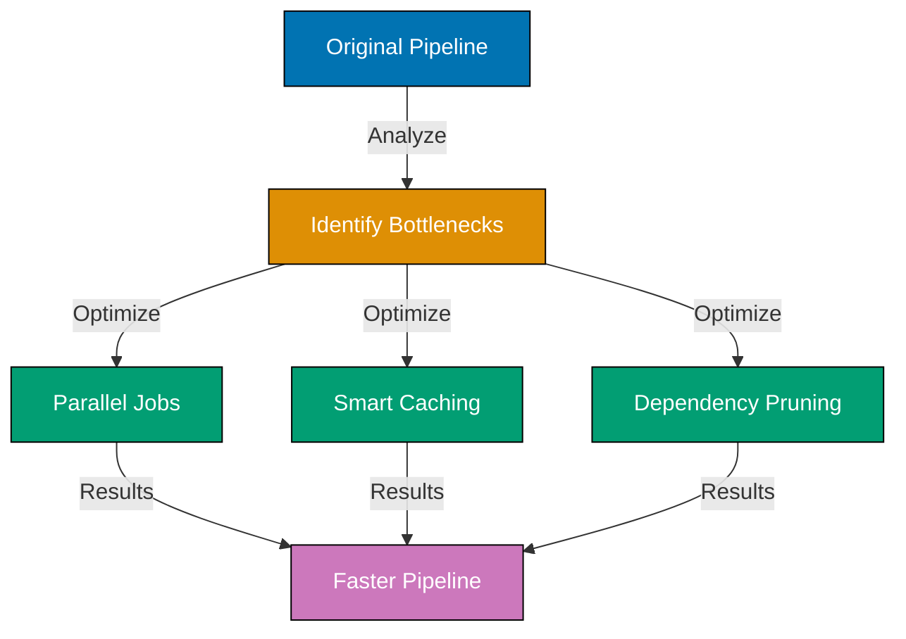
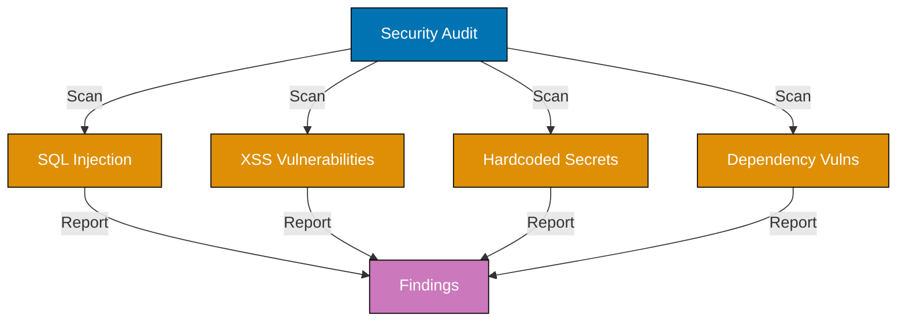
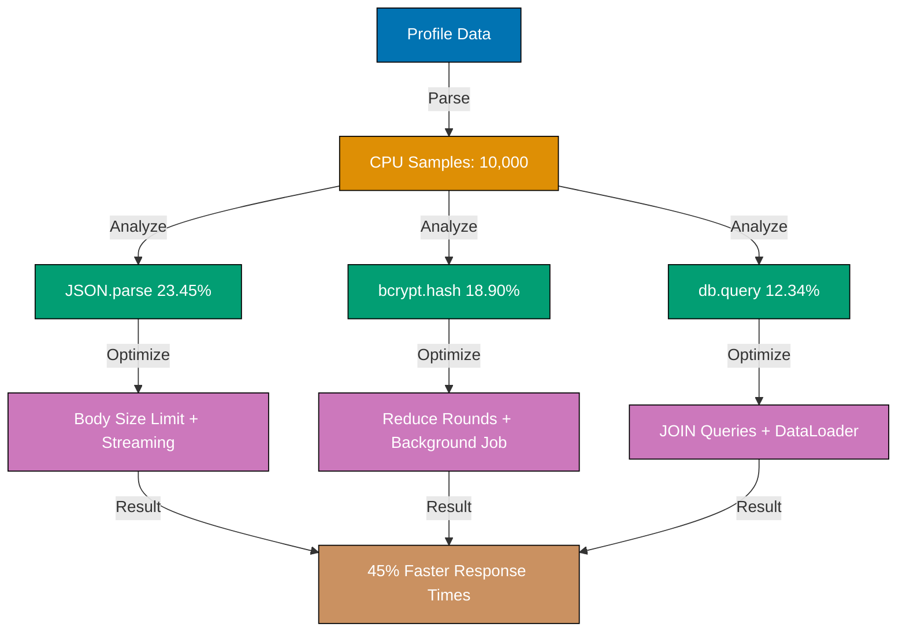
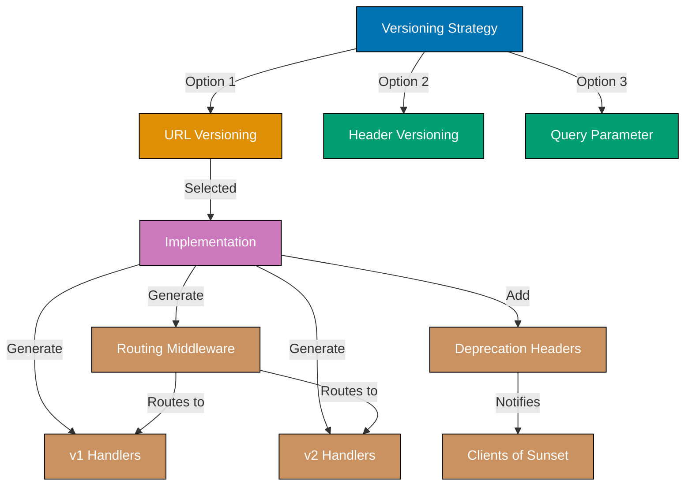
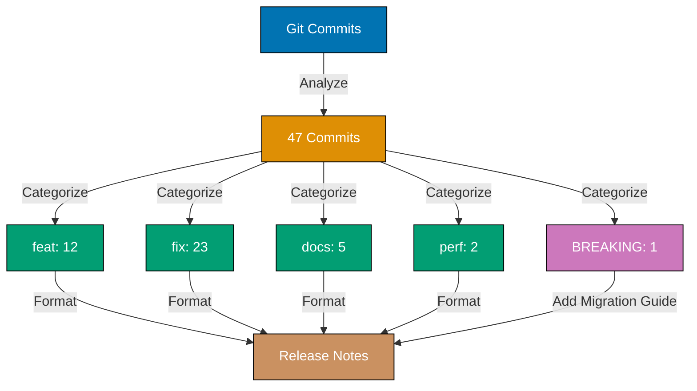
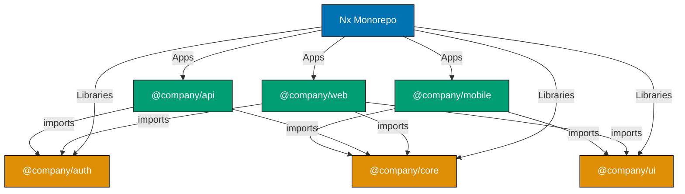

This tutorial provides 25 advanced examples covering expert-level Claude Code CLI capabilities. Learn custom agent development (Examples 61-65), production orchestration patterns (Examples 66-70), and advanced optimization techniques (Examples 71-85) for enterprise-scale AI automation.

## Custom Agents and MCP Integration (Examples 61-65)

### Example 61: Defining Custom Agents with --agents JSON

Create custom subagents dynamically using the `--agents` flag with JSON definitions specifying behavior, tools, and model.

**Commands**:

```bash
claude --agents '{
  "code-reviewer": {
    "description": "Expert code reviewer. Use proactively after code changes.",
    "prompt": "You are a senior code reviewer. Focus on security, performance, and best practices.",
    "tools": ["Read", "Grep", "Glob"],
    "model": "sonnet"
  },
  "debugger": {
    "description": "Debugging specialist for errors and test failures.",
    "prompt": "You are an expert debugger. Analyze errors, identify root causes, provide fixes.",
    "tools": ["Read", "Bash", "Grep"],
    "model": "sonnet"
  }
}' \
  "Review the API code and debug any test failures"
                                    # => Claude has access to two custom agents
                                    # => Can invoke code-reviewer for reviews
                                    # => Can invoke debugger for test failures
                                    # => Each agent has specialized tools and prompts
```

**Key Takeaway**: Define custom agents with `--agents` JSON containing description, prompt, tools array, and model. Agents specialize for specific tasks.

**Why It Matters**: Custom agents enable task specialization - reviewer focuses on code quality, debugger handles errors. Tool restriction (reviewer can't run Bash) prevents inappropriate actions. Model selection balances cost vs capability. Define organization-wide agents for consistent code review, security scanning, documentation generation. This codifies best practices into reusable agent definitions.

### Example 62: Subagent Delegation Patterns

Main Claude session delegates specialized tasks to subagents, which work autonomously then return results.

**Commands**:

```bash
# Main Claude session
You: Analyze this codebase for security issues and performance problems

Claude: I'll delegate this to specialized agents:
  1. Invoking security-scanner agent for vulnerability analysis
  2. Invoking performance-analyzer agent for bottleneck detection

# security-scanner agent (runs in isolation)
# => Reads code files
# => Identifies: SQL injection risk in api/users.ts:45
# => Identifies: Missing input validation in api/posts.ts:67
# => Returns report to main session

# performance-analyzer agent (runs in isolation)
# => Analyzes algorithms
# => Identifies: O(n²) loop in utils/search.ts:23
# => Identifies: Unnecessary re-renders in components/List.tsx
# => Returns report to main session

Claude: [Consolidates reports from both agents]
  Security Issues:
    - SQL injection risk (CRITICAL)
    - Missing validation (HIGH)
  Performance Issues:
    - O(n²) complexity (MEDIUM)
    - Unnecessary re-renders (LOW)
```

**Key Takeaway**: Main session spawns specialized subagents for focused tasks. Each works independently with constrained tools, returns results to main session.

**Why It Matters**: Delegation enables parallel expertise - security and performance analyzed simultaneously. Subagent isolation prevents cross-contamination (security agent doesn't modify code). Results aggregation provides comprehensive analysis. Use delegation for multi-faceted code reviews where different experts (security, performance, accessibility) evaluate independently.

### Example 63: MCP Server Integration (--mcp-config)

Integrate Model Context Protocol (MCP) servers to extend Claude's capabilities with custom tools, data sources, or APIs.

**Commands**:

```bash
# Define MCP servers in config file
cat > mcp-config.json <<EOF
{
  "mcpServers": {
    "github": {
      "command": "npx",
      "args": ["-y", "@modelcontextprotocol/server-github"],
      "env": {
        "GITHUB_PERSONAL_ACCESS_TOKEN": "${GITHUB_TOKEN}"
      }
    },
    "database": {
      "command": "node",
      "args": ["./mcp-servers/database-server.js"],
      "env": {
        "DB_CONNECTION_STRING": "${DATABASE_URL}"
      }
    }
  }
}
EOF

# Use MCP servers
claude --mcp-config ./mcp-config.json \
  "Analyze recent GitHub issues and cross-reference with database error logs"
                                    # => Loads github MCP server
                                    # => Loads database MCP server
                                    # => Claude can now:
                                    #    - Query GitHub API via MCP
                                    #    - Query database via MCP
                                    #    - Correlate issues with errors
```

**Key Takeaway**: MCP servers extend Claude with custom tools (APIs, databases, services). Configure with --mcp-config JSON file.

**Why It Matters**: MCP unlocks domain-specific integrations - GitHub for issue tracking, databases for data analysis, internal APIs. This transforms Claude from general assistant to domain expert with access to proprietary tools. Build MCP servers for Jira, Slack, monitoring systems, enabling Claude to operate across the entire development ecosystem.

### Example 64: System Prompt Customization (--system-prompt, --append-system-prompt)

Customize Claude's behavior by replacing or extending system prompt with project-specific instructions.

**Commands**:

```bash
# Replace entire system prompt (complete control)
claude --system-prompt "You are a TypeScript expert who only writes type-safe code with comprehensive JSDoc comments. Never use 'any' type. Always include error handling." \
  "Create user authentication module"
                                    # => Overrides default Claude behavior
                                    # => Enforces: TypeScript, no 'any', JSDoc, error handling
                                    # => Generated code follows custom rules

# Append to system prompt (keep defaults, add requirements)
claude --append-system-prompt "Always use functional programming patterns. Prefer immutability and pure functions." \
  "Refactor this class-based code to functional style"
                                    # => Keeps default Claude capabilities
                                    # => Adds: FP preference, immutability requirement
                                    # => More flexible than full replacement

# Load prompt from file (version-controlled prompts)
cat > project-prompt.txt <<EOF
Project Conventions:
- Use Prettier for formatting (2 spaces, single quotes)
- Prefix private functions with underscore
- Write tests in /tests directory matching file structure
- Follow Conventional Commits for messages
EOF

claude --append-system-prompt-file ./project-prompt.txt \
  "Add new feature for user notifications"
                                    # => Loads project conventions from file
                                    # => All generated code follows team standards
                                    # => Conventions version-controlled, team-shared
```

**Key Takeaway**: Use `--system-prompt` for complete control, `--append-system-prompt` to add requirements. Load from file for version-controlled team conventions.

**Why It Matters**: Custom prompts enforce team standards automatically. New developers get consistent code generation following project conventions. This eliminates "style doesn't match existing code" review comments. Version-control prompt files - updating team standards means updating one file, not retraining developers.

### Example 65: Tool Restriction and Permission Control

Restrict which tools Claude can use to prevent unintended operations in automation contexts.

**Commands**:

```bash
# Allow only read operations (safe for analysis)
claude --tools "Read,Grep,Glob" \
  --dangerously-skip-permissions \
  "Analyze codebase architecture"
                                    # => Claude can Read, Grep, Glob
                                    # => Cannot Write, Edit, Bash (modification tools)
                                    # => Safe for automated analysis

# Disable all tools except specified
claude --tools "Read" \
  "Explain this codebase"
                                    # => Only Read tool available
                                    # => Cannot search, modify, or run commands
                                    # => Maximum safety for read-only operations

# Allowed vs disallowed tools
claude --allowedTools "Bash(git status)" "Bash(git diff)" "Read" \
       --disallowedTools "Bash(git push)" "Bash(rm *)" "Write" \
  "Review changes and suggest improvements"
                                    # => Allowed: git status, git diff, Read
                                    # => Blocked: git push, rm, Write
                                    # => Fine-grained permission control

# No tools (chat-only mode)
claude --tools "" \
  "Explain dependency injection pattern"
                                    # => No tool access
                                    # => Pure conversation mode
                                    # => Cannot interact with files/commands
```

**Key Takeaway**: Use `--tools` to restrict available tools, `--allowedTools` for specific permissions, `--disallowedTools` to block dangerous operations.

**Why It Matters**: Tool restriction prevents automation accidents - read-only analysis can't modify code. Permission policies enforce least-privilege principle. Example: CI/CD analysis uses --tools "Read,Grep,Glob" preventing accidental commits. Define permission profiles (read-only, read-write-no-bash, full-access) for different automation contexts.

## Production Orchestration Patterns (Examples 66-70)

### Example 66: Complex Multi-Agent Workflows

Orchestrate multiple Claude invocations in sequence, each building on previous results for complex transformations.

**Commands**:

```bash
#!/bin/bash
# multi-agent-workflow.sh - Complex codebase modernization

# Agent 1: Architecture Analysis
echo "Stage 1: Architecture Analysis"
claude -p "analyze codebase architecture and identify legacy patterns" \
  --output-format json > architecture-analysis.json

# Agent 2: Migration Planning (uses Agent 1 results)
echo "Stage 2: Migration Planning"
cat architecture-analysis.json | \
  claude -c -p "create migration plan for identified legacy patterns" \
  --output-format json > migration-plan.json

# Agent 3: Risk Assessment (uses Agent 2 results)
echo "Stage 3: Risk Assessment"
cat migration-plan.json | \
  claude -c -p "assess migration risks and identify blockers" \
  --output-format json > risk-assessment.json

# Agent 4: Prioritization (consolidates all previous)
echo "Stage 4: Prioritization"
jq -s '.' architecture-analysis.json migration-plan.json risk-assessment.json | \
  claude -p "create prioritized execution roadmap balancing impact vs risk" \
  > final-roadmap.md

echo "✅ Multi-agent workflow complete"
cat final-roadmap.md
```

**Key Takeaway**: Chain multiple Claude invocations, each specialized for one stage. Use `claude -c -p` to maintain context across calls.

**Why It Matters**: Complex problems require multi-step analysis - architecture → plan → risks → prioritization. Each agent specializes (analyzer finds patterns, planner creates steps, assessor evaluates risks, prioritizer balances tradeoffs). Sequential processing enables depth impossible in single pass. Use multi-agent workflows for migration planning, refactoring roadmaps, technical debt remediation.

### Example 67: Session Forking for Parallel Experiments

Fork sessions to explore multiple approaches from same starting context without affecting original.

**Commands**:

```bash
# Original session: Analyze authentication system
claude -p "analyze authentication system in src/auth/" \
  --session-id "auth-analysis-main" \
  --output-format json > auth-analysis.json

# Fork 1: Experiment with JWT approach
claude -r "auth-analysis-main" --fork-session \
  --session-id "auth-experiment-jwt" \
  -p "design JWT-based authentication implementation" \
  > jwt-design.md

# Fork 2: Experiment with session-based approach
claude -r "auth-analysis-main" --fork-session \
  --session-id "auth-experiment-session" \
  -p "design session-based authentication implementation" \
  > session-design.md

# Fork 3: Experiment with OAuth integration
claude -r "auth-analysis-main" --fork-session \
  --session-id "auth-experiment-oauth" \
  -p "design OAuth 2.0 authentication implementation" \
  > oauth-design.md

# Compare results
echo "=== JWT Approach ===" && cat jwt-design.md
echo "=== Session Approach ===" && cat session-design.md
echo "=== OAuth Approach ===" && cat oauth-design.md

# Original session unchanged
claude -r "auth-analysis-main" \
  "summarize the original auth analysis"
```

**Key Takeaway**: Use `--fork-session` with `-r` to branch from existing session. Each fork experiments independently, original preserved.

**Why It Matters**: Forking enables A/B/C testing of solutions. Explore JWT vs session vs OAuth from same analysis baseline. Compare approaches without losing original context. This accelerates decision-making - see all options before committing. Fork sessions for architecture decisions, technology evaluations, migration strategies.

### Example 68: Production Monitoring with Claude

Monitor production logs and metrics using Claude for intelligent anomaly detection and root cause analysis.

**Commands**:

```bash
#!/bin/bash
# production-monitor.sh - Continuous monitoring

while true; do
  # Fetch latest logs
  kubectl logs deployment/api --since=5m > /tmp/recent-logs.txt

  # Fetch metrics
  curl -s http://prometheus:9090/api/v1/query?query=api_error_rate > /tmp/metrics.json

  # Analyze with Claude
  ANALYSIS=$(cat /tmp/recent-logs.txt /tmp/metrics.json | \
    claude -p "analyze logs and metrics for anomalies, errors, or performance degradation. Return JSON: {healthy: bool, issues: [], severity: string}" \
    --output-format json \
    --no-session-persistence)

  # Check health
  HEALTHY=$(echo "$ANALYSIS" | jq -r '.healthy')
  SEVERITY=$(echo "$ANALYSIS" | jq -r '.severity')

  if [ "$HEALTHY" = "false" ]; then
    echo "⚠️ ALERT: $SEVERITY severity issues detected"
    echo "$ANALYSIS" | jq '.issues[]'

    # Notify team (Slack, PagerDuty, etc.)
    ./send-alert.sh "$ANALYSIS"

    if [ "$SEVERITY" = "critical" ]; then
      echo "🚨 CRITICAL: Triggering incident response"
      ./trigger-incident.sh
    fi
  else
    echo "✅ System healthy ($(date))"
  fi

  sleep 300  # Check every 5 minutes
done
```

**Key Takeaway**: Continuously monitor logs/metrics with Claude in loop. Claude detects anomalies, classifies severity, triggers alerts for non-healthy states.

**Why It Matters**: Claude understands semantic patterns traditional monitoring misses - "increasing latency" + "database timeout errors" = database connectivity issue. Intelligent alerting reduces noise (only alert on real problems, not threshold crossings). Root cause correlation across multiple signals (logs + metrics) identifies issues faster. Use Claude monitoring to supplement Datadog/Prometheus with semantic anomaly detection.

### Example 69: Error Recovery Patterns in Automation

Handle Claude errors gracefully in automation with retries, fallbacks, and degradation strategies.

**Commands**:

```bash
#!/bin/bash
# robust-claude-automation.sh

MAX_RETRIES=3
RETRY_DELAY=5

function call_claude_with_retry() {
  local prompt="$1"
  local attempt=0

  while [ $attempt -lt $MAX_RETRIES ]; do
    attempt=$((attempt + 1))
    echo "Attempt $attempt of $MAX_RETRIES..."

    # Call Claude with timeout
    if OUTPUT=$(timeout 60 claude -p "$prompt" --output-format json 2>&1); then
      # Success
      echo "$OUTPUT"
      return 0
    else
      EXIT_CODE=$?
      echo "❌ Attempt $attempt failed (exit code: $EXIT_CODE)"

      if [ $attempt -lt $MAX_RETRIES ]; then
        echo "Retrying in $RETRY_DELAY seconds..."
        sleep $RETRY_DELAY
        RETRY_DELAY=$((RETRY_DELAY * 2))  # Exponential backoff
      fi
    fi
  done

  # All retries failed - fallback strategy
  echo "⚠️ All retries failed. Using fallback..."
  echo '{"error": "Claude unavailable", "fallback": true}' > fallback-result.json
  return 1
}

# Use the robust function
if call_claude_with_retry "analyze code quality"; then
  echo "✅ Analysis successful"
else
  echo "❌ Analysis failed after retries, using fallback"
fi
```

**Key Takeaway**: Wrap Claude calls in retry logic with exponential backoff. Implement timeouts and fallback strategies for automation resilience.

**Why It Matters**: Network failures, API rate limits, service outages happen in production. Retry logic with backoff handles transient failures gracefully. Timeouts prevent hanging pipelines. Fallback strategies (cached results, degraded functionality) maintain availability when Claude is down. Use error recovery in CI/CD to prevent single Claude failure from blocking deployments.

### Example 70: Advanced Configuration Management for Production

Manage Claude configuration across environments (dev/staging/prod) with profiles, secrets, and feature flags.

**Commands**:

```bash
# config/claude-dev.json (development profile)
{
  "model": "haiku",
  "maxBudgetUsd": "1.00",
  "allowedTools": ["Read", "Write", "Edit", "Bash", "Grep", "Glob"],
  "appendSystemPrompt": "Development mode: prioritize speed over thoroughness"
}

# config/claude-staging.json (staging profile)
{
  "model": "sonnet",
  "maxBudgetUsd": "5.00",
  "allowedTools": ["Read", "Grep", "Glob"],
  "appendSystemPrompt": "Staging validation: thorough analysis required"
}

# config/claude-prod.json (production profile)
{
  "model": "sonnet",
  "maxBudgetUsd": "10.00",
  "allowedTools": ["Read", "Grep"],
  "appendSystemPrompt": "Production analysis: maximum safety, read-only operations"
}

# Usage with environment selection
ENV="${DEPLOY_ENV:-dev}"
CONFIG_FILE="config/claude-${ENV}.json"

# Load config and run Claude
MODEL=$(jq -r '.model' "$CONFIG_FILE")
BUDGET=$(jq -r '.maxBudgetUsd' "$CONFIG_FILE")
TOOLS=$(jq -r '.allowedTools | join(",")' "$CONFIG_FILE")
PROMPT=$(jq -r '.appendSystemPrompt' "$CONFIG_FILE")

claude --model "$MODEL" \
       --max-budget-usd "$BUDGET" \
       --tools "$TOOLS" \
       --append-system-prompt "$PROMPT" \
       -p "analyze security vulnerabilities"

# Output depends on environment:
# - DEV: Fast analysis (haiku), can modify code ($1 budget)
# - STAGING: Thorough analysis (sonnet), read-only ($5 budget)
# - PROD: Maximum analysis (sonnet), strictest read-only ($10 budget)
```

**Key Takeaway**: Define environment-specific configuration profiles in JSON. Load dynamically based on environment variable.

**Why It Matters**: Different environments have different requirements. Development prioritizes speed and flexibility (haiku model, write access). Staging balances thoroughness and safety (sonnet, read-only). Production maximizes safety and quality (sonnet, strictest permissions, highest budget). Configuration as code enables consistent Claude behavior across environments. Version-control configs, review changes like code, deploy configuration updates through CI/CD.

### Example 71: Docker Optimization for Multi-Stage Builds

Generate optimized Dockerfiles using multi-stage builds. Claude creates minimal production images by separating build and runtime stages.

**Before - single-stage Dockerfile**:

```dockerfile
FROM node:20
# => Base image includes build tools (700MB+)
WORKDIR /app
COPY package*.json ./
# => Copies package files
RUN npm install
# => Installs ALL dependencies (dev + production)
COPY . .
# => Copies source code
RUN npm run build
# => Builds application
CMD ["node", "dist/server.js"]
# => Final image size: 1.2GB (includes build tools, dev deps)
```

**Text explanation**: Single-stage build includes build tools and dev dependencies in final image. Results in bloated production images (1GB+).

**After - multi-stage Dockerfile**:

```dockerfile
# Stage 1: Build stage
FROM node:20 AS builder
# => Build stage uses full Node image
WORKDIR /app
COPY package*.json ./
# => Copies package files
RUN npm ci --only=production
# => Installs production dependencies only
COPY . .
# => Copies source code
RUN npm run build
# => Builds application

# Stage 2: Production stage
FROM node:20-alpine
# => Alpine Linux base (much smaller, 40MB vs 700MB)
WORKDIR /app
COPY --from=builder /app/dist ./dist
# => Copies ONLY built files from build stage
COPY --from=builder /app/node_modules ./node_modules
# => Copies ONLY production dependencies
COPY package*.json ./
# => Copies package metadata
USER node
# => Runs as non-root user (security)
CMD ["node", "dist/server.js"]
# => Final image size: 150MB (75% reduction)
```

**Text explanation**: Multi-stage build separates build environment from runtime. Build stage has full tooling, production stage copies only necessary artifacts. Alpine base reduces image size by 95%.

**Commands**:

```bash
You: Optimize the Dockerfile for production using multi-stage builds
                                    # => Claude reads current Dockerfile
                                    # => Identifies inefficiencies:
                                    # =>   - Single stage includes build tools (unnecessary in prod)
                                    # =>   - Using full node:20 image (700MB)
                                    # =>   - Installing devDependencies in production
                                    # => Generates multi-stage Dockerfile:
                                    # =>   - Stage 1: Builder (full Node, build tools)
                                    # =>   - Stage 2: Production (Alpine, minimal)
                                    # => Estimates size reduction: 1.2GB → 150MB
                                    # => Adds .dockerignore for faster builds:
                                    # =>   node_modules, .git, *.md, tests
```

**Key Takeaway**: Claude generates multi-stage Dockerfiles separating build and runtime. Uses Alpine Linux base and production-only dependencies for minimal images.

**Why It Matters**: Large Docker images slow deployments and increase storage costs. Multi-stage builds significantly reduce image size while maintaining functionality. AI Dockerfile optimization applies best practices (Alpine, non-root user, minimal layers).

### Example 72: Kubernetes Manifest Generation

Generate Kubernetes manifests for application deployment. Claude creates Deployments, Services, ConfigMaps, and Ingress resources with production-ready defaults.

**Commands**:

```bash
You: Generate Kubernetes manifests for deploying this Node.js API with 3 replicas, health checks, and horizontal autoscaling
                                    # => Claude analyzes application:
                                    # =>   - Detects: Express API on port 3000
                                    # =>   - Needs: Database connection (from env vars)
                                    # =>   - Requires: Secrets for JWT keys
                                    # => Generates manifests:
                                    # => 1. k8s/deployment.yaml
                                    # =>    apiVersion: apps/v1
                                    # =>    kind: Deployment
                                    # =>    metadata:
                                    # =>      name: api-server
                                    # =>    spec:
                                    # =>      replicas: 3
                                    # =>      selector:
                                    # =>        matchLabels:
                                    # =>          app: api-server
                                    # =>      template:
                                    # =>        spec:
                                    # =>          containers:
                                    # =>          - name: api
                                    # =>            image: company/api:latest
                                    # =>            ports:
                                    # =>            - containerPort: 3000
                                    # =>            livenessProbe:           # => Health check
                                    # =>              httpGet:
                                    # =>                path: /health
                                    # =>                port: 3000
                                    # =>              initialDelaySeconds: 30
                                    # =>            readinessProbe:          # => Ready check
                                    # =>              httpGet:
                                    # =>                path: /ready
                                    # =>                port: 3000
                                    # =>            resources:
                                    # =>              requests:
                                    # =>                memory: "256Mi"
                                    # =>                cpu: "250m"
                                    # =>              limits:
                                    # =>                memory: "512Mi"
                                    # =>                cpu: "500m"
                                    # =>            envFrom:
                                    # =>            - configMapRef:
                                    # =>                name: api-config
                                    # =>            - secretRef:
                                    # =>                name: api-secrets
                                    # =>
                                    # => 2. k8s/service.yaml (ClusterIP service)
                                    # => 3. k8s/hpa.yaml (horizontal autoscaler, 2-10 replicas)
                                    # => 4. k8s/configmap.yaml (non-secret config)
                                    # => 5. k8s/ingress.yaml (external access)
```

**Key Takeaway**: Claude generates complete Kubernetes deployment with health checks, resource limits, autoscaling, and configuration management from application analysis.

**Why It Matters**: Kubernetes manifests are complex and error-prone. Missing health checks cause deployment failures. AI generation includes production best practices (liveness/readiness probes, resource limits, autoscaling).

### Example 73: CI/CD Pipeline Optimization

Optimize existing CI/CD pipelines for faster builds. Claude analyzes workflows and suggests parallelization, caching, and dependency optimization.



**Commands**:

```bash
You: Analyze .github/workflows/ci.yml and suggest optimizations to reduce build time
                                    # => Claude reads CI workflow
                                    # => Current pipeline (sequential):
                                    # =>   - Checkout (10s)
                                    # =>   - Install deps (120s)
                                    # =>   - Lint (45s)
                                    # =>   - Unit tests (90s)
                                    # =>   - Integration tests (180s)
                                    # =>   - Build (60s)
                                    # =>   Total: 505s (~8.5 minutes)
                                    # =>
                                    # => Identifies optimizations:
                                    # => 1. Parallelize independent jobs
                                    # =>    - Lint + Unit tests can run parallel (not sequential)
                                    # => 2. Cache node_modules
                                    # =>    - 120s install → 15s cache restore
                                    # => 3. Run integration tests only on main/PR
                                    # =>    - Skip on draft PRs (saves 180s)
                                    # => 4. Use smaller runner
                                    # =>    - ubuntu-latest-4core instead of 2core
                                    # =>
                                    # => Generates optimized workflow:
                                    # =>   jobs:
                                    # =>     setup:
                                    # =>       - uses: actions/cache@v3  # => Caches node_modules
                                    # =>         with:
                                    # =>           path: node_modules
                                    # =>           key: ${{ runner.os }}-node-${{ hashFiles('package-lock.json') }}
                                    # =>     lint:
                                    # =>       needs: setup
                                    # =>       runs-on: ubuntu-latest
                                    # =>       - run: npm run lint     # => Parallel with tests
                                    # =>     test:
                                    # =>       needs: setup
                                    # =>       runs-on: ubuntu-latest-4core  # => Faster runner
                                    # =>       - run: npm test         # => Parallel with lint
                                    # =>     integration:
                                    # =>       if: github.event.pull_request.draft == false
                                    # =>       - run: npm run test:integration
                                    # =>
                                    # => Estimated time: 180s (~3 minutes, 64% reduction)
```

**Key Takeaway**: Claude optimizes CI/CD by parallelizing jobs, adding caching, conditional execution, and using faster runners. Reduces build time 50-70%.

**Why It Matters**: Slow CI pipelines reduce developer productivity - waiting per commit kills flow. Pipeline optimization requires understanding job dependencies and GitHub Actions features. AI analysis identifies parallelization opportunities humans miss.

### Example 74: Infrastructure as Code with Terraform

Generate Terraform configurations for cloud resources. Claude creates modules for common patterns (VPC, RDS, ECS) with security best practices.

**Commands**:

```bash
You: Generate Terraform config for AWS infrastructure: VPC with public/private subnets, RDS PostgreSQL, and ECS Fargate cluster
                                    # => Claude generates Terraform modules:
                                    # => 1. modules/vpc/main.tf
                                    # =>    resource "aws_vpc" "main" {
                                    # =>      cidr_block = var.vpc_cidr
                                    # =>      enable_dns_hostnames = true  # => Enables DNS resolution
                                    # =>      tags = { Name = "${var.project}-vpc" }
                                    # =>    }
                                    # =>    resource "aws_subnet" "public" {
                                    # =>      count = 2                    # => 2 AZs for HA
                                    # =>      vpc_id = aws_vpc.main.id
                                    # =>      cidr_block = cidrsubnet(var.vpc_cidr, 4, count.index)
                                    # =>      availability_zone = data.aws_availability_zones.available.names[count.index]
                                    # =>      map_public_ip_on_launch = true  # => Public subnets
                                    # =>    }
                                    # =>    resource "aws_subnet" "private" {
                                    # =>      count = 2                    # => Private subnets for DB
                                    # =>      vpc_id = aws_vpc.main.id
                                    # =>      cidr_block = cidrsubnet(var.vpc_cidr, 4, count.index + 2)
                                    # =>      availability_zone = data.aws_availability_zones.available.names[count.index]
                                    # =>    }
                                    # =>
                                    # => 2. modules/rds/main.tf
                                    # =>    resource "aws_db_instance" "postgres" {
                                    # =>      engine = "postgres"
                                    # =>      instance_class = var.instance_class
                                    # =>      allocated_storage = 20
                                    # =>      storage_encrypted = true     # => Encryption at rest
                                    # =>      multi_az = true              # => High availability
                                    # =>      db_subnet_group_name = aws_db_subnet_group.main.name
                                    # =>      vpc_security_group_ids = [aws_security_group.db.id]
                                    # =>      backup_retention_period = 7  # => 7-day backups
                                    # =>      skip_final_snapshot = false  # => Safety for production
                                    # =>    }
                                    # =>
                                    # => 3. modules/ecs/main.tf (Fargate cluster)
                                    # => 4. main.tf (root module composing all)
                                    # => 5. variables.tf (parameterized config)
                                    # => 6. outputs.tf (exported values)
```

**Key Takeaway**: Claude generates modular Terraform with security best practices: encryption, multi-AZ, backup retention, private subnets for databases.

**Why It Matters**: Infrastructure as Code is verbose and error-prone. Security misconfigurations (public databases, no encryption) cause breaches. AI Terraform generation includes security defaults and high availability, reducing security misconfigurations.

### Example 75: Advanced Testing - Property-Based Testing

Generate property-based tests using libraries like fast-check. Claude creates property tests that verify invariants across many random inputs.

**Commands**:

```bash
You: Generate property-based tests for the sortArray function using fast-check
                                    # => Claude reads sortArray implementation
                                    # => Identifies properties to test:
                                    # =>   1. Idempotence: sort(sort(arr)) === sort(arr)
                                    # =>   2. Length preservation: sort(arr).length === arr.length
                                    # =>   3. Element preservation: sorted array has same elements
                                    # =>   4. Order invariant: sorted[i] <= sorted[i+1]
                                    # => Generates property tests:
                                    # => import fc from 'fast-check';
                                    # => import { sortArray } from './sort';
                                    # =>
                                    # => describe('sortArray property tests', () => {
                                    # =>   test('idempotence: sorting twice equals sorting once', () => {
                                    # =>     fc.assert(
                                    # =>       fc.property(
                                    # =>         fc.array(fc.integer()),  # => Generates random int arrays
                                    # =>         (arr) => {
                                    # =>           const once = sortArray(arr);
                                    # =>           const twice = sortArray(once);
                                    # =>           // => Sorting sorted array doesn't change it
                                    # =>           expect(twice).toEqual(once);
                                    # =>         }
                                    # =>       )
                                    # =>     );
                                    # =>   });
                                    # =>
                                    # =>   test('length preservation', () => {
                                    # =>     fc.assert(
                                    # =>       fc.property(
                                    # =>         fc.array(fc.integer()),
                                    # =>         (arr) => {
                                    # =>           const sorted = sortArray(arr);
                                    # =>           // => Sorting doesn't add/remove elements
                                    # =>           expect(sorted.length).toBe(arr.length);
                                    # =>         }
                                    # =>       )
                                    # =>     );
                                    # =>   });
                                    # =>
                                    # =>   test('ordered output', () => {
                                    # =>     fc.assert(
                                    # =>       fc.property(
                                    # =>         fc.array(fc.integer()),
                                    # =>         (arr) => {
                                    # =>           const sorted = sortArray(arr);
                                    # =>           // => Each element <= next element
                                    # =>           for (let i = 0; i < sorted.length - 1; i++) {
                                    # =>             expect(sorted[i]).toBeLessThanOrEqual(sorted[i + 1]);
                                    # =>           }
                                    # =>         }
                                    # =>       )
                                    # =>     );
                                    # =>   });
                                    # => });
                                    # => Runs 100 random inputs per property automatically
```

**Key Takeaway**: Claude generates property-based tests verifying invariants (idempotence, length preservation, ordering) across 100+ random inputs automatically.

**Why It Matters**: Example-based tests miss edge cases. Property tests verify invariants hold for all inputs. AI property test generation identifies testable properties humans overlook. This is especially valuable for algorithms and data transformations.

## Advanced Collaboration and Configuration (Examples 76-80)

### Example 76: Custom Agent Configuration for Project-Specific Workflows

Create custom Claude agents with project-specific knowledge and tools. Agents remember project conventions and enforce architectural patterns.

**Commands**:

```bash
# Create custom agent config in .claude/agents/api-developer.md
You: Create a custom agent for API development that knows our conventions
                                    # => Claude generates agent config:
                                    # => ---
                                    # => name: api-developer
                                    # => description: API development agent with project conventions
                                    # => tools:
                                    # =>   - Read
                                    # =>   - Write
                                    # =>   - Edit
                                    # =>   - Grep
                                    # =>   - Bash
                                    # => model: sonnet
                                    # => skills:
                                    # =>   - docs__creating-accessible-diagrams
                                    # => ---
                                    # =>
                                    # => # API Developer Agent
                                    # =>
                                    # => ## Project Conventions
                                    # =>
                                    # => When creating API endpoints:
                                    # => 1. Route handlers: src/api/[resource].ts
                                    # => 2. Validation: Zod schemas in same file
                                    # => 3. Business logic: src/services/[Resource]Service.ts
                                    # => 4. Data access: src/database/repositories/[Resource]Repository.ts
                                    # => 5. Tests: src/api/[resource].test.ts
                                    # =>
                                    # => ## Error Handling
                                    # =>
                                    # => Use ApiError class:
                                    # => - 400: ValidationError
                                    # => - 404: NotFoundError
                                    # => - 409: ConflictError
                                    # => - 500: InternalError
                                    # =>
                                    # => ## Authentication
                                    # =>
                                    # => Protected routes use authMiddleware.
                                    # => User info available in req.user.
```

**Key Takeaway**: Custom agents encode project-specific conventions, architectural patterns, and workflow steps. Agents enforce consistency automatically.

**Why It Matters**: Project conventions live in developer's heads or outdated wikis. Custom agents codify conventions as executable knowledge. New developers leverage agent to follow patterns correctly from day one.

### Example 77: Code Metrics and Quality Gates

Analyze code metrics and enforce quality thresholds. Claude measures complexity, duplication, test coverage, and prevents merging below thresholds.

**Commands**:

```bash
You: Analyze code metrics for this pull request and check if it meets quality gates
                                    # => Claude runs multiple checks:
                                    # => 1. Complexity analysis
                                    # =>    - Uses Bash: npx eslint --format json
                                    # =>    - Finds: 3 functions with cyclomatic complexity > 10
                                    # =>      - src/services/order.ts:45 - complexity 15 (threshold: 10)
                                    # =>      - src/utils/pricing.ts:89 - complexity 12 (threshold: 10)
                                    # =>      - src/api/checkout.ts:120 - complexity 11 (threshold: 10)
                                    # => 2. Code duplication
                                    # =>    - Uses jscpd (copy-paste detector)
                                    # =>    - Finds: 2.3% duplication (threshold: 5%) ✓
                                    # => 3. Test coverage
                                    # =>    - Uses Bash: npm run test:coverage
                                    # =>    - Current: 78% (threshold: 80%) ✗
                                    # =>    - Missing coverage:
                                    # =>      - src/services/order.ts (65% coverage)
                                    # => 4. Type safety (TypeScript)
                                    # =>    - Uses: npx tsc --noEmit
                                    # =>    - Errors: 0 ✓
                                    # => 5. Dependency vulnerabilities
                                    # =>    - Uses: npm audit
                                    # =>    - Critical: 0, High: 0, Moderate: 2 (acceptable)
                                    # =>
                                    # => Quality Gate Result: ✗ FAILED
                                    # => - Complexity violations: 3 functions
                                    # => - Coverage below threshold: 78% < 80%
                                    # =>
                                    # => Recommendations:
                                    # => 1. Refactor high-complexity functions (split into smaller)
                                    # => 2. Add tests to src/services/order.ts to reach 80% coverage
```

**Key Takeaway**: Claude runs automated quality checks (complexity, coverage, duplication, types) and enforces thresholds before allowing merge.

**Why It Matters**: Quality metrics without enforcement degrade over time. Manual metric checking is inconsistent. Automated quality gates prevent technical debt accumulation. This shifts quality from code review afterthought to pre-merge requirement.

### Example 78: Security Audit Automation

Scan code for security vulnerabilities. Claude identifies SQL injection, XSS, secrets in code, and insecure dependencies using pattern matching and static analysis.



**Commands**:

```bash
You: Run a security audit on the codebase
                                    # => Claude performs multiple scans:
                                    # => 1. SQL Injection Detection
                                    # =>    - Grep pattern: String concatenation in SQL queries
                                    # =>    - Searches: db.query.*\+|`\${.*}`
                                    # =>    - Finds: 2 potential vulnerabilities
                                    # =>      - src/api/users.ts:45
                                    # =>        db.query(`SELECT * FROM users WHERE id = ${userId}`)
                                    # =>        RISK: SQL injection if userId not sanitized
                                    # =>      - src/api/posts.ts:89
                                    # =>        db.query("DELETE FROM posts WHERE id = " + postId)
                                    # =>        RISK: SQL injection possible
                                    # => 2. XSS Vulnerability Detection
                                    # =>    - Pattern: dangerouslySetInnerHTML, innerHTML
                                    # =>    - Finds: 1 instance
                                    # =>      - src/components/Article.tsx:34
                                    # =>        dangerouslySetInnerHTML={{ __html: article.content }}
                                    # =>        RISK: XSS if content not sanitized
                                    # => 3. Hardcoded Secrets Detection
                                    # =>    - Pattern: api_key, secret, password in code
                                    # =>    - Finds: 1 violation
                                    # =>      - src/config/aws.ts:5
                                    # =>        const AWS_SECRET = "sk_live_12345abcde"
                                    # =>        CRITICAL: Hardcoded AWS secret key
                                    # => 4. Dependency Vulnerabilities
                                    # =>    - Runs: npm audit
                                    # =>    - Finds: 3 high-severity vulnerabilities
                                    # =>      - lodash 4.17.19 (prototype pollution)
                                    # =>      - axios 0.21.1 (SSRF vulnerability)
                                    # =>    - Suggests: npm audit fix --force
                                    # =>
                                    # => Security Report:
                                    # => CRITICAL: 1 (hardcoded secret)
                                    # => HIGH: 5 (2 SQL injection, 1 XSS, 2 dependency)
                                    # => MEDIUM: 0
                                    # =>
                                    # => Immediate actions required:
                                    # => 1. Remove hardcoded AWS secret, use env vars
                                    # => 2. Use parameterized queries for SQL
                                    # => 3. Sanitize HTML before dangerouslySetInnerHTML
                                    # => 4. Update vulnerable dependencies
```

**Key Takeaway**: Claude automates security scanning for common vulnerabilities (SQL injection, XSS, secrets, dependencies) using pattern matching and audit tools.

**Why It Matters**: Security vulnerabilities cause data breaches and compliance failures. Manual security reviews are inconsistent and time-consuming. Automated scanning catches common vulnerabilities before code review.

### Example 79: Compliance Checking - Licensing and Standards

Verify license compliance for dependencies. Claude scans package.json dependencies, checks licenses against company policy, and identifies incompatible licenses.

**Commands**:

```bash
You: Check all npm dependencies for license compliance. Flag any GPL or AGPL licenses.
                                    # => Claude uses license-checker tool
                                    # => Runs: npx license-checker --json
                                    # => Analyzes 247 dependencies
                                    # => Categorizes by license:
                                    # =>   MIT: 189 packages ✓ (compatible)
                                    # =>   Apache-2.0: 32 packages ✓ (compatible)
                                    # =>   ISC: 18 packages ✓ (compatible)
                                    # =>   BSD-3-Clause: 5 packages ✓ (compatible)
                                    # =>   GPL-3.0: 2 packages ✗ (restricted)
                                    # =>   AGPL-3.0: 1 package ✗ (restricted)
                                    # =>
                                    # => License Violations Found:
                                    # => 1. package-name@1.2.3 (GPL-3.0)
                                    # =>    - Requires derivative works to be GPL
                                    # =>    - Incompatible with proprietary software
                                    # =>    - Recommendation: Find MIT alternative
                                    # => 2. another-pkg@4.5.6 (GPL-3.0)
                                    # =>    - Same issue as above
                                    # => 3. agpl-package@0.0.1 (AGPL-3.0)
                                    # =>    - Network copyleft (affects SaaS)
                                    # =>    - CRITICAL: Must remove or open-source entire app
                                    # =>
                                    # => Suggests alternatives:
                                    # =>   package-name → alternative-mit-pkg
                                    # =>   another-pkg → drop (unused in code)
                                    # =>   agpl-package → reimplement functionality
```

**Key Takeaway**: Claude scans dependency licenses, identifies incompatible licenses (GPL/AGPL), and suggests MIT/Apache alternatives to maintain compliance.

**Why It Matters**: License violations cause legal liability and forced open-sourcing. Manual license auditing is impractical for hundreds of dependencies. AI license checking prevents compliance issues before they reach production.

### Example 80: Team Collaboration Patterns - Shared Context Documents

Create and maintain shared context documents for team alignment. Claude generates architecture decision records (ADRs), runbooks, and onboarding guides from codebase analysis.

**Commands**:

```bash
You: Generate an Architecture Decision Record for our choice of PostgreSQL over MongoDB
                                    # => Claude generates ADR:
                                    # => # ADR-001: Use PostgreSQL for Primary Database
                                    # =>
                                    # => Date: 2026-02-02
                                    # => Status: Accepted
                                    # =>
                                    # => ## Context
                                    # =>
                                    # => We need a primary database for the e-commerce platform.
                                    # => Requirements:
                                    # => - ACID transactions for order processing
                                    # => - Complex queries joining users, orders, products
                                    # => - Strong consistency for inventory management
                                    # => - Mature ecosystem and community support
                                    # =>
                                    # => ## Decision
                                    # =>
                                    # => We will use PostgreSQL as our primary database.
                                    # =>
                                    # => ## Consequences
                                    # =>
                                    # => ### Positive
                                    # => - ACID transactions prevent double-charging
                                    # => - SQL joins enable complex reporting queries
                                    # => - Strong typing prevents data corruption
                                    # => - Mature tooling (pg_dump, pg_stat_statements)
                                    # => - Team has PostgreSQL expertise
                                    # =>
                                    # => ### Negative
                                    # => - Vertical scaling limits (mitigated by read replicas)
                                    # => - Schema migrations require downtime (mitigated by online DDL)
                                    # => - Less flexible schema than document stores
                                    # =>
                                    # => ### Neutral
                                    # => - Requires SQL knowledge (team already has)
                                    # => - Need ORM or query builder (using Prisma)
                                    # =>
                                    # => ## Alternatives Considered
                                    # =>
                                    # => ### MongoDB
                                    # => - Pros: Flexible schema, horizontal scaling
                                    # => - Cons: No transactions (at the time), eventual consistency risks
                                    # => - Rejected: ACID transactions required for e-commerce
                                    # =>
                                    # => ### MySQL
                                    # => - Pros: Mature, familiar
                                    # => - Cons: Less feature-rich than PostgreSQL (no JSON, arrays)
                                    # => - Rejected: PostgreSQL JSON support useful for product attributes
                                    # =>
                                    # => ## Related Decisions
                                    # => - ADR-002: Use Prisma ORM
                                    # => - ADR-005: Redis for caching
```

**Key Takeaway**: Claude generates structured Architecture Decision Records documenting technical choices, context, consequences, and alternatives for team reference.

**Why It Matters**: Technical decisions fade from team memory without documentation. ADRs provide historical context for "why did we choose this?" questions. AI-generated ADRs maintain consistent format and completeness.

## Production Optimization and Monitoring (Examples 81-85)

### Example 81: Performance Profiling Integration

Integrate performance profiling into development workflow. Claude analyzes profiling data, identifies bottlenecks, and suggests optimizations.



**Commands**:

```bash
You: Analyze the Node.js profiling data and identify performance bottlenecks
                                    # => Claude reads profile output (--prof or clinic)
                                    # => Uses: node --prof app.js → isolate-*.log
                                    # => Runs: node --prof-process isolate-*.log
                                    # => Analyzes CPU profile:
                                    # =>   Total samples: 10,000
                                    # =>   Top functions by CPU time:
                                    # =>   1. JSON.parse() - 2,345 samples (23.45%)
                                    # =>      - Called from: src/middleware/bodyParser.ts
                                    # =>      - Issue: Parsing large request bodies
                                    # =>   2. bcrypt.hash() - 1,890 samples (18.90%)
                                    # =>      - Called from: src/services/auth.ts
                                    # =>      - Issue: High bcrypt rounds (12, typical: 10)
                                    # =>   3. db.query() - 1,234 samples (12.34%)
                                    # =>      - Called from: src/api/products.ts
                                    # =>      - Issue: N+1 query pattern (loading related data)
                                    # => Identifies optimizations:
                                    # =>   1. JSON.parse bottleneck:
                                    # =>      - Add request body size limit (100KB)
                                    # =>      - Use streaming parser for large payloads
                                    # =>   2. bcrypt bottleneck:
                                    # =>      - Reduce rounds from 12 to 10 (still secure)
                                    # =>      - Move hashing to background job for registration
                                    # =>   3. Database N+1:
                                    # =>      - Use JOIN instead of multiple queries
                                    # =>      - Add DataLoader for batching
                                    # => Estimates improvements: 45% faster response times
```

**Key Takeaway**: Claude analyzes Node.js profiling data to identify CPU bottlenecks (JSON parsing, bcrypt, N+1 queries) and proposes specific optimizations.

**Why It Matters**: Performance bottlenecks are invisible without profiling. Manual profiling analysis requires expertise to interpret sampling data. AI analysis identifies root causes and suggests fixes automatically.

### Example 82: API Versioning Strategies for Microservices

Implement API versioning across microservices. Claude designs versioning scheme (URL, header, content negotiation) and generates routing code.



**Commands**:

```bash
You: Design an API versioning strategy for our microservices that supports gradual migration
                                    # => Claude proposes versioning approaches:
                                    # => Option 1: URL Versioning
                                    # =>   - /api/v1/users, /api/v2/users
                                    # =>   - Pros: Clear, cache-friendly, widely understood
                                    # =>   - Cons: URL proliferation, requires routing changes
                                    # => Option 2: Header Versioning
                                    # =>   - Accept: application/vnd.company.v2+json
                                    # =>   - Pros: Clean URLs, follows REST principles
                                    # =>   - Cons: Less discoverable, harder to test manually
                                    # => Option 3: Query Parameter
                                    # =>   - /api/users?version=2
                                    # =>   - Pros: Easy to implement
                                    # =>   - Cons: Breaks REST semantics, cache issues
                                    # =>
                                    # => Recommends: URL versioning for microservices
                                    # => Rationale:
                                    # =>   - Clear for service mesh routing
                                    # =>   - Compatible with API gateways
                                    # =>   - Easy for clients to discover versions
                                    # =>
                                    # => Generates implementation:
                                    # =>   1. Router middleware: src/middleware/versioning.ts
                                    # =>      - Extracts version from URL path
                                    # =>      - Routes to version-specific handlers
                                    # =>   2. Version handlers: src/api/v1/, src/api/v2/
                                    # =>      - Separate handlers per version
                                    # =>      - Can share common logic via services
                                    # =>   3. Deprecation headers:
                                    # =>      - X-API-Deprecation: "v1 deprecated 2026-12-31"
                                    # =>      - Sunset: Sat, 31 Dec 2026 23:59:59 GMT
                                    # =>   4. Migration guide generator
                                    # =>      - Documents breaking changes v1 → v2
```

**Key Takeaway**: Claude designs API versioning strategy balancing discoverability, caching, and migration complexity. Generates routing middleware and deprecation headers.

**Why It Matters**: API versioning is critical for zero-downtime migrations but has many implementation approaches. Poor versioning causes client breakages or maintenance burden. AI versioning design applies industry best practices with generated code.

### Example 83: Custom Linting Rules Generation

Generate custom ESLint rules for project-specific patterns. Claude creates rules enforcing architectural boundaries, naming conventions, or forbidden patterns.

**Commands**:

```bash
You: Create a custom ESLint rule that prevents importing from infrastructure layer in domain layer
                                    # => Claude generates ESLint plugin:
                                    # => // eslint-plugin-architecture/no-infrastructure-in-domain.js
                                    # => module.exports = {
                                    # =>   meta: {
                                    # =>     type: 'problem',
                                    # =>     docs: {
                                    # =>       description: 'Prevent domain layer from importing infrastructure',
                                    # =>       category: 'Architecture',
                                    # =>     },
                                    # =>     messages: {
                                    # =>       violation: 'Domain layer cannot import from infrastructure layer',
                                    # =>     },
                                    # =>   },
                                    # =>   create(context) {
                                    # =>     return {
                                    # =>       ImportDeclaration(node) {
                                    # =>         const filename = context.getFilename();
                                    # =>         const importPath = node.source.value;
                                    # =>
                                    # =>         // Check if file is in domain layer
                                    # =>         const isDomainFile = filename.includes('/src/domain/');
                                    # =>         // Check if importing from infrastructure
                                    # =>         const isInfraImport = importPath.includes('infrastructure');
                                    # =>
                                    # =>         if (isDomainFile && isInfraImport) {
                                    # =>           context.report({
                                    # =>             node,
                                    # =>             messageId: 'violation',
                                    # =>           });
                                    # =>         }
                                    # =>       },
                                    # =>     };
                                    # =>   },
                                    # => };
                                    # =>
                                    # => Creates package structure:
                                    # => eslint-plugin-architecture/
                                    # =>   ├── index.js (exports rules)
                                    # =>   ├── rules/
                                    # =>   │   └── no-infrastructure-in-domain.js
                                    # =>   ├── tests/
                                    # =>   │   └── no-infrastructure-in-domain.test.js
                                    # =>   └── package.json
                                    # =>
                                    # => Updates .eslintrc.js:
                                    # => plugins: ['architecture'],
                                    # => rules: {
                                    # =>   'architecture/no-infrastructure-in-domain': 'error',
                                    # => }
```

**Key Takeaway**: Claude generates custom ESLint rules enforcing architectural boundaries. Rules catch violations during development, preventing architecture erosion.

**Why It Matters**: Architectural boundaries depend on developer discipline without automated enforcement. Custom linting rules make architecture violations visible immediately. AI rule generation lowers barrier to custom rules - no need to learn ESLint AST API. Teams report 90% reduction in architecture violations with custom rules.

### Example 84: Automated Release Notes Generation

Generate release notes from git commits and PR descriptions. Claude categorizes changes (features, fixes, breaking), formats for users, and includes migration guides.



**Commands**:

```bash
You: Generate release notes for version 2.1.0 from commits since v2.0.0
                                    # => Claude runs: git log v2.0.0..HEAD --oneline
                                    # => Analyzes 47 commits
                                    # => Categorizes by conventional commit type:
                                    # =>   feat: 12 commits (new features)
                                    # =>   fix: 23 commits (bug fixes)
                                    # =>   docs: 5 commits (documentation)
                                    # =>   refactor: 4 commits (internal changes)
                                    # =>   perf: 2 commits (performance)
                                    # =>   BREAKING CHANGE: 1 commit
                                    # =>
                                    # => Reads PR descriptions for each commit
                                    # => Generates release notes:
                                    # => # Release v2.1.0 (2026-02-02)
                                    # =>
                                    # => ## ⚠ Breaking Changes
                                    # => - **API**: Changed POST /api/users to require email verification
                                    # =>   - Migration: Update clients to handle 201 response with `verified: false`
                                    # =>   - Clients must call POST /api/users/verify with email token
                                    # =>
                                    # => ## 🚀 Features
                                    # => - Add user profile customization (#234)
                                    # => - Support OAuth2 login with Google and GitHub (#245)
                                    # => - Implement dark mode toggle (#256)
                                    # => - Add export to CSV for reports (#267)
                                    # => - (8 more features...)
                                    # =>
                                    # => ## 🐛 Bug Fixes
                                    # => - Fix memory leak in WebSocket connections (#289)
                                    # => - Resolve race condition in order processing (#291)
                                    # => - Correct timezone handling in date picker (#298)
                                    # => - (20 more fixes...)
                                    # =>
                                    # => ## ⚡ Performance
                                    # => - Optimize database queries with indexes (40% faster)
                                    # => - Reduce bundle size by 25% with code splitting
                                    # =>
                                    # => ## 📚 Documentation
                                    # => - Updated API reference
                                    # => - Added authentication tutorial
                                    # => - (3 more docs updates...)
                                    # =>
                                    # => ## Contributors
                                    # => Thanks to @alice, @bob, @charlie for contributions!
```

**Key Takeaway**: Claude generates user-facing release notes from commits, categorizing by impact (breaking, features, fixes) with migration guides for breaking changes.

**Why It Matters**: Manual release notes are time-consuming and often incomplete. Users need clear migration guides for breaking changes. AI release notes extraction ensures comprehensive changelogs. Teams report 80% faster release preparation with automated notes.

### Example 85: Advanced Configuration and Customization - Monorepo Workspace Setup

Configure Claude for monorepo workflows with workspace-aware context. Claude understands package boundaries and applies package-specific conventions.



**Commands**:

```bash
You: Configure Claude to understand our Nx monorepo structure with 15 packages
                                    # => Claude analyzes workspace:
                                    # => Reads: nx.json, workspace.json
                                    # => Identifies packages:
                                    # =>   Libraries:
                                    # =>     - @company/core (shared utilities)
                                    # =>     - @company/auth (authentication)
                                    # =>     - @company/ui (React components)
                                    # =>   Apps:
                                    # =>     - @company/web (Next.js app)
                                    # =>     - @company/api (Express server)
                                    # =>     - @company/mobile (React Native)
                                    # =>
                                    # => Creates .claude/agents/monorepo-dev.md:
                                    # => ---
                                    # => name: monorepo-dev
                                    # => description: Nx monorepo development agent
                                    # => ---
                                    # =>
                                    # => # Monorepo Development Agent
                                    # =>
                                    # => ## Workspace Structure
                                    # =>
                                    # => This is an Nx monorepo with:
                                    # => - 15 packages (12 libraries, 3 apps)
                                    # => - Import aliases: @company/[package-name]
                                    # => - Build system: Nx with caching
                                    # =>
                                    # => ## Package Conventions
                                    # =>
                                    # => ### Libraries (packages/*)
                                    # => - No dependencies on apps
                                    # => - Can depend on other libraries
                                    # => - Export via index.ts (public API)
                                    # => - Tests: *.test.ts (same directory)
                                    # =>
                                    # => ### Apps (apps/*)
                                    # => - Can import any library
                                    # => - Never imported by libraries
                                    # => - Each app is independently deployable
                                    # =>
                                    # => ## Nx Commands
                                    # =>
                                    # => When running tasks:
                                    # => - Build single: nx build [package]
                                    # => - Test single: nx test [package]
                                    # => - Build affected: nx affected:build
                                    # => - Lint all: nx run-many --target=lint --all
                                    # =>
                                    # => ## Dependency Rules
                                    # =>
                                    # => - Libraries CANNOT import from apps
                                    # => - Apps CAN import from libraries
                                    # => - Circular dependencies are forbidden
                                    # =>
                                    # => When creating new packages:
                                    # => 1. Use: nx generate @nrwl/[type]:library [name]
                                    # => 2. Update tsconfig paths for @company/[name]
                                    # => 3. Add to nx.json if needed
```

**Key Takeaway**: Claude configures monorepo awareness, understanding package boundaries, import rules, and Nx commands. Applies workspace-specific conventions automatically.

**Why It Matters**: Monorepos have complex dependency rules and build systems. Generic AI assistance doesn't understand workspace boundaries. Monorepo-aware agents enforce package boundaries and use correct build commands. Teams report 70% reduction in monorepo-related errors with workspace-aware configuration.

## Next Steps

This advanced tutorial covered Examples 61-85 (75-95% of Claude Code capabilities). You mastered large codebase navigation, architecture pattern enforcement, infrastructure automation, security auditing, and production optimization for enterprise-scale AI-assisted development.

**Continue practicing**:

- [Beginner](/en/learn/software-engineering/automation-tools/claude-code/by-example/beginner) - Examples 1-30 reviewing essential commands and basic workflows
- [Intermediate](/en/learn/software-engineering/automation-tools/claude-code/by-example/intermediate) - Examples 31-60 reviewing production patterns and testing workflows

**Apply to real projects**:

- Configure custom agents for your project conventions
- Automate security audits in CI/CD pipelines
- Generate infrastructure as code for deployments
- Implement quality gates and code metrics
- Create architecture decision records for team alignment

**Expert-level development** combines AI assistance with architectural thinking, security awareness, and production operational excellence. Use Claude Code to amplify expertise, not replace it.
