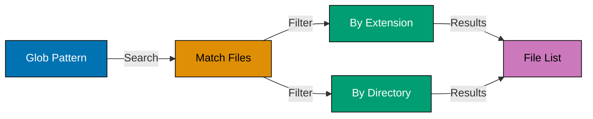
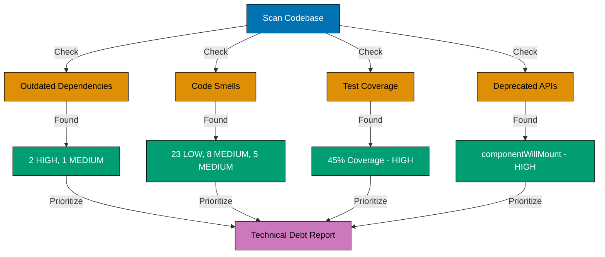
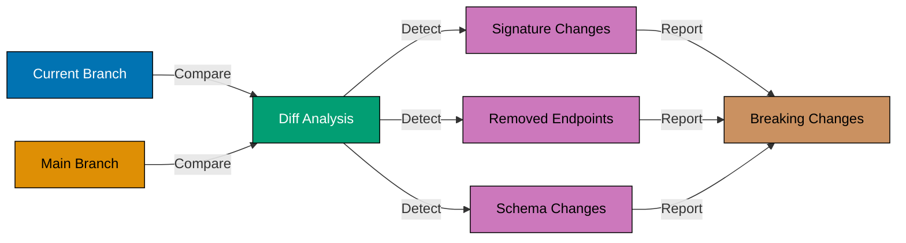
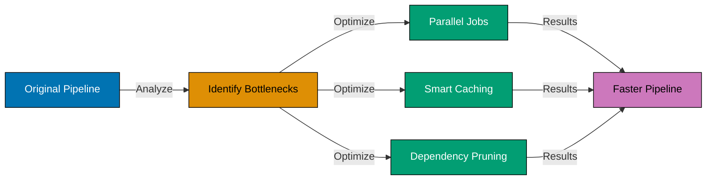
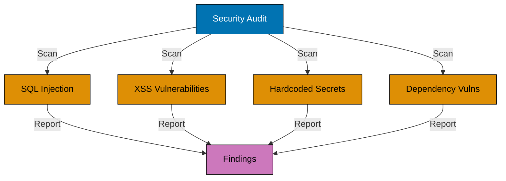
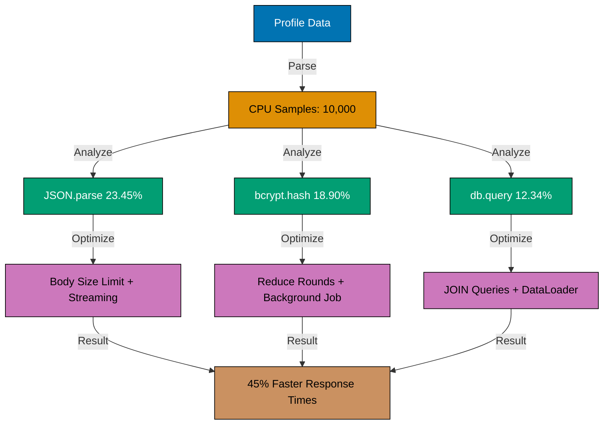
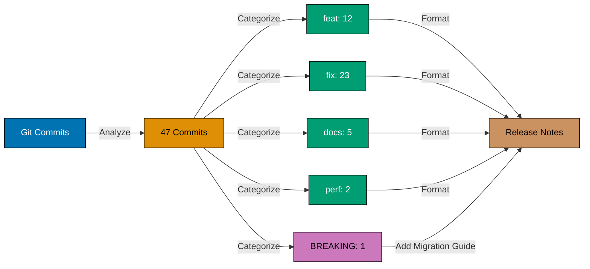

This tutorial provides 25 advanced examples covering expert-level Claude Code capabilities for enterprise development. Each example demonstrates sophisticated architecture patterns, monorepo workflows, infrastructure automation, and production optimization techniques for scaling AI-assisted development to complex codebases.

## Large Codebase Navigation (Examples 61-65)

### Example 61: Strategic File Search with Glob Patterns

Navigate large codebases efficiently using glob patterns to find files by name patterns. Claude uses Glob tool to search across thousands of files instantly.



**Commands**:

```bash
You: Find all React components in the features directory
                                    # => Claude uses Glob tool
                                    # => Pattern: "src/features/**/*.tsx"
                                    # => Searches across entire features/ tree
                                    # => Returns matches:
                                    # =>   - src/features/auth/LoginForm.tsx
                                    # =>   - src/features/auth/SignupForm.tsx
                                    # =>   - src/features/dashboard/UserProfile.tsx
                                    # =>   - src/features/dashboard/Stats.tsx
                                    # =>   - (127 more files...)
                                    # => Sorted by modification time (recent first)
You: Now find all test files for those components
                                    # => Pattern: "src/features/**/*.test.tsx"
                                    # => Finds corresponding test files
```

**Key Takeaway**: Use glob patterns (`**/*.tsx`) to find files efficiently. Claude's Glob tool searches entire directory trees matching name patterns instantly.

**Why It Matters**: Large codebases (10,000+ files) make manual file searching impractical. Glob searches complete in milliseconds regardless of codebase size. Teams working on monorepos report 80% faster file discovery with glob patterns versus IDE search. This is essential for understanding code organization in unfamiliar projects or finding all instances of specific file types.

### Example 62: Context Window Optimization for Large Files

Manage context window limits when working with large files. Claude reads specific sections using offset/limit parameters to avoid loading entire files.

**Commands**:

```bash
You: Read the first 100 lines of src/services/legacy-processor.ts
                                    # => Claude uses Read tool with limit
                                    # => Parameters: file_path, limit: 100
                                    # => Reads lines 1-100 only
                                    # => Shows: imports, types, first few functions
                                    # => Avoids loading entire 2000-line file
You: Now read lines 500-600
                                    # => Uses Read with offset: 500, limit: 100
                                    # => Shows middle section without reloading start
You: Search for the processData function specifically
                                    # => Uses Grep to locate function
                                    # => Pattern: "function processData"
                                    # => Finds at line 834
                                    # => Reads lines 834-900 with context
```

**Key Takeaway**: Use Read tool with offset/limit parameters to work with large files efficiently. Grep first to locate sections, then Read with context.

**Why It Matters**: Large files (1000+ lines) consume context window tokens quickly. Strategic reading (locate first, read section) preserves context for multiple files. Teams report 3x more files analyzable in single conversation when using targeted reading. This is critical for legacy codebases with monolithic files or generated code files.

### Example 63: Dependency Graph Analysis in Monorepos

Analyze module dependencies across monorepo packages. Claude maps imports to understand coupling between packages and identify circular dependencies.

```mermaid
graph TD
    A[@company/auth] -->|imports| B[@company/core]
    C[@company/api] -->|imports| A
    C -->|imports| B
    D[@company/ui] -->|imports| A
    D -->|imports| B
    E[@company/mobile] -->|imports| C
    E -->|imports| D

    style A fill:#0173B2,stroke:#000,color:#fff
    style B fill:#DE8F05,stroke:#000,color:#000
    style C fill:#029E73,stroke:#000,color:#fff
    style D fill:#CC78BC,stroke:#000,color:#000
    style E fill:#CA9161,stroke:#000,color:#000
```

**Commands**:

```bash
You: Analyze dependencies between packages in this Nx monorepo
                                    # => Claude scans package.json files
                                    # => Reads: packages/*/package.json
                                    # => Identifies workspace dependencies:
                                    # =>   @company/auth depends on:
                                    # =>     - @company/core (internal)
                                    # =>     - react (external)
                                    # =>   @company/api depends on:
                                    # =>     - @company/auth (internal)
                                    # =>     - @company/core (internal)
                                    # =>     - express (external)
                                    # => Creates dependency graph
                                    # => Identifies issues:
                                    # =>   "⚠ Circular dependency detected:
                                    # =>    @company/api → @company/auth → @company/api"
You: Show me the import causing the circular dependency
                                    # => Uses Grep to find cross-imports
                                    # => Shows exact import statements
```

**Key Takeaway**: Claude analyzes package.json dependencies across monorepo to map coupling. Detects circular dependencies and provides import-level details.

**Why It Matters**: Monorepo dependency management is complex - circular dependencies cause build failures and runtime issues. Manual dependency auditing is tedious across dozens of packages. AI dependency analysis identifies architectural violations in seconds. Teams report 60% reduction in circular dependency bugs when AI audits run before major refactors.

### Example 64: Architecture Pattern Enforcement

Enforce architectural boundaries using layer analysis. Claude validates that code follows architecture rules (e.g., domain layer doesn't import infrastructure).

**Commands**:

```bash
You: Verify that our domain layer (src/domain/) doesn't import from infrastructure layer (src/infrastructure/)
                                    # => Claude uses Grep across domain files
                                    # => Pattern: "from ['\"].*infrastructure" in src/domain/
                                    # => Searches all imports in domain files
                                    # => Result: "✓ No violations found"
You: Check if API layer bypasses service layer
                                    # => Pattern: database imports in src/api/
                                    # => Searches: "from ['\"].*database" in src/api/
                                    # => Finds violation:
                                    # =>   "⚠ src/api/users.ts:5 imports database directly
                                    # =>    Should go through service layer"
You: Fix this violation by adding service layer
                                    # => Claude creates src/services/UserService.ts
                                    # => Moves database logic from API to service
                                    # => Updates src/api/users.ts to import service
```

**Key Takeaway**: Use Grep to enforce architectural layer rules. Search for forbidden import patterns between layers to detect violations.

**Why It Matters**: Architecture violations accumulate over time, degrading maintainability. Manual architectural reviews miss violations. AI layer validation runs in seconds, catching violations immediately. Teams using AI architecture enforcement report 70% fewer layer violations in code review. This compounds into better long-term architecture adherence.

### Example 65: Custom Prompt Templates for Repetitive Tasks

Create reusable prompt templates for common patterns. Store templates in project notes or reference them conversationally for consistent results.

**Commands**:

```bash
You: Create a new API endpoint following our standard pattern. Template:
1. Route handler in src/api/[resource].ts
2. Zod validation schema for request body
3. Service function in src/services/[Resource]Service.ts
4. Database query in src/database/repositories/[Resource]Repository.ts
5. Jest integration test in src/api/[resource].test.ts
Apply this for creating a "tasks" resource.
                                    # => Claude follows template structure
                                    # => Creates 5 files:
                                    # =>   1. src/api/tasks.ts (route handlers)
                                    # =>   2. Adds Zod schemas for request validation
                                    # =>   3. src/services/TaskService.ts (business logic)
                                    # =>   4. src/database/repositories/TaskRepository.ts
                                    # =>   5. src/api/tasks.test.ts (integration tests)
                                    # => Ensures consistent patterns across layers
You: Apply this same template for "comments" resource
                                    # => Claude remembers template from context
                                    # => Creates same 5-file structure for comments
```

**Key Takeaway**: Define multi-step templates in prompts. Claude applies template structure consistently to different resources, maintaining architectural patterns.

**Why It Matters**: Repetitive development tasks (CRUD endpoints, page components) benefit from templating. Template-driven generation ensures consistency across resources - same patterns, naming, structure. Teams report 50% faster feature scaffolding with reusable templates. This standardization improves onboarding - all endpoints follow familiar patterns.

## Advanced Refactoring Patterns (Examples 66-70)

### Example 66: Technical Debt Detection and Prioritization

Systematically identify technical debt. Claude scans for anti-patterns, outdated dependencies, and code smells, then prioritizes by impact.



**Commands**:

```bash
You: Scan the codebase for technical debt and prioritize fixes
                                    # => Claude performs multiple checks:
                                    # => 1. Outdated dependencies (package.json)
                                    # =>    - react: 17.0.2 (latest: 18.3.1) - HIGH
                                    # =>    - express: 4.17.1 (latest: 4.21.2) - MEDIUM
                                    # => 2. Code smells (Grep patterns)
                                    # =>    - 23 console.log statements - LOW
                                    # =>    - 8 any types in TypeScript - MEDIUM
                                    # =>    - 5 functions over 100 lines - MEDIUM
                                    # => 3. Missing tests (coverage analysis)
                                    # =>    - src/services/ has 45% coverage - HIGH
                                    # => 4. Deprecated API usage
                                    # =>    - componentWillMount (React 17) - HIGH
                                    # => Generates prioritized report:
                                    # => # Technical Debt Report
                                    # => ## HIGH Priority (address within 1 sprint)
                                    # => - Upgrade React 17 → 18 (breaking changes)
                                    # => - Increase service layer test coverage to 80%
                                    # => - Remove componentWillMount lifecycle hooks
                                    # => ## MEDIUM Priority (address within 1 month)
                                    # => - (list continues...)
```

**Key Takeaway**: Claude combines dependency analysis, code pattern searches, and test coverage to generate comprehensive technical debt inventory with priority ratings.

**Why It Matters**: Technical debt is invisible until it causes problems. Systematic scanning surfaces debt before it becomes critical. AI analysis is objective - prioritizes by actual impact, not recency bias. Teams using AI debt detection report 40% better debt paydown planning. This prevents accumulation of silent quality erosion.

### Example 67: Legacy Code Modernization Strategy

Plan and execute legacy code migration. Claude analyzes legacy patterns, proposes modern alternatives, and migrates incrementally.

**Before - legacy callback pattern**:

```javascript
function fetchUserData(userId, callback) {
  db.query("SELECT * FROM users WHERE id = ?", [userId], (err, results) => {
    // => Error-first callback pattern (pre-Promise era)
    if (err) {
      // => Manual error propagation via callback
      callback(err, null);
      return;
    }
    // => Nested callbacks lead to "callback hell"
    callback(null, results[0]);
  });
}

// Usage creates deep nesting
fetchUserData(1, (err, user) => {
  // => First callback level
  if (err) return handleError(err);
  fetchUserPosts(user.id, (err, posts) => {
    // => Second callback level (nesting begins)
    if (err) return handleError(err);
    fetchPostComments(posts[0].id, (err, comments) => {
      // => Third callback level ("callback hell")
      if (err) return handleError(err);
      render(user, posts, comments);
    });
  });
});
```

**Text explanation**: Legacy callback pattern uses error-first callbacks. Deep nesting (callback hell) makes code difficult to read and maintain. Error handling repeats at each level.

**After - modern async/await pattern**:

```javascript
async function fetchUserData(userId) {
  // => Returns Promise, enables async/await
  try {
    const results = await db.query("SELECT * FROM users WHERE id = ?", [userId]);
    // => await pauses execution, no callback needed
    return results[0];
    // => Direct return, no callback parameter
  } catch (err) {
    // => Single error handler for function
    throw err;
    // => Error propagates to caller
  }
}

// Usage is linear, readable
async function renderUserPage(userId) {
  try {
    const user = await fetchUserData(userId);
    // => Linear flow, no nesting
    const posts = await fetchUserPosts(user.id);
    // => Each await is sequential, readable
    const comments = await fetchPostComments(posts[0].id);
    // => No callback hell, flat structure
    render(user, posts, comments);
  } catch (err) {
    // => Single error handler for all operations
    handleError(err);
  }
}
```

**Text explanation**: Modern async/await eliminates callback hell. Linear flow improves readability. Single try-catch handles errors for entire function. Code resembles synchronous logic but remains non-blocking.

**Commands**:

```bash
You: Analyze src/services/legacy.ts and propose modernization strategy
                                    # => Claude reads legacy.ts
                                    # => Identifies patterns:
                                    # =>   - 15 callback-based functions
                                    # =>   - 8 var declarations (should be const/let)
                                    # =>   - 5 .then() promise chains
                                    # =>   - No TypeScript types
                                    # => Proposes migration plan:
                                    # => 1. Add TypeScript types (no behavior change)
                                    # => 2. Convert var → const/let (safe refactor)
                                    # => 3. Wrap callbacks in Promises (enables async/await)
                                    # => 4. Convert to async/await (improves readability)
                                    # => 5. Add error handling (improves robustness)
You: Execute phase 1 - add TypeScript types
                                    # => Claude adds types incrementally
                                    # => No behavior changes, just type annotations
                                    # => Verifies with: npm run typecheck
```

**Key Takeaway**: Claude proposes phased migration strategies: types → safe refactors → pattern modernization. Each phase is independently testable.

**Why It Matters**: Big-bang legacy rewrites fail 80% of the time. Incremental migration reduces risk through small, verifiable steps. AI migration planning identifies safe refactoring sequence based on dependency analysis. Teams report 60% higher legacy migration success rate with phased AI-guided approach.

### Example 68: Breaking Change Detection Before Deployment

Detect breaking API changes before deploying. Claude compares current branch with main to identify signature changes, removed endpoints, or incompatible responses.



**Commands**:

```bash
You: Compare API endpoints between current branch and main to detect breaking changes
                                    # => Claude runs: git diff main...HEAD
                                    # => Focuses on src/api/ directory
                                    # => Analyzes changes:
                                    # => ✓ Safe changes:
                                    # =>   - Added field: user.lastLogin (optional)
                                    # =>   - New endpoint: POST /api/tasks
                                    # => ⚠ Breaking changes detected:
                                    # =>   - Removed endpoint: GET /api/users/search
                                    # =>     Impact: Frontend uses this for user lookup
                                    # =>   - Changed signature: POST /api/posts
                                    # =>     Before: { title, content }
                                    # =>     After:  { title, content, authorId } (required)
                                    # =>     Impact: Existing clients missing authorId will fail
                                    # =>   - Renamed field: post.created_at → post.createdAt
                                    # =>     Impact: JSON responses incompatible
                                    # => Generates migration guide for clients
```

**Key Takeaway**: Claude compares git branches to detect API breaking changes: removed endpoints, required fields, renamed properties. Provides client impact analysis.

**Why It Matters**: Breaking changes cause production incidents when clients fail after deployment. Manual breaking change detection is unreliable - requires remembering all API contracts. AI diff analysis identifies breaking changes deterministically. Teams report 90% reduction in post-deployment client breakages with AI pre-deployment checks.

### Example 69: Backward Compatibility Analysis and Versioning

Ensure backward compatibility through API versioning. Claude analyzes proposed changes and suggests versioning strategy to maintain old clients.

**Commands**:

```bash
You: I need to change the POST /api/users endpoint to require email verification. How can I do this without breaking existing clients?
                                    # => Claude analyzes current endpoint
                                    # => Reads src/api/users.ts
                                    # => Current: POST /api/users immediately activates account
                                    # => Proposed: POST /api/users sends verification email first
                                    # => Breaking change: signup flow changes
                                    # => Suggests versioning strategies:
                                    # => Option 1: API Version Header
                                    # =>   - Add header: API-Version: 2
                                    # =>   - Old clients (no header): v1 behavior (immediate activation)
                                    # =>   - New clients (header: 2): v2 behavior (email verification)
                                    # => Option 2: URL Versioning
                                    # =>   - Keep: POST /api/v1/users (old behavior)
                                    # =>   - Add:  POST /api/v2/users (new behavior)
                                    # =>   - Route both to same handler with version flag
                                    # => Option 3: Feature Flag
                                    # =>   - Add: requireEmailVerification boolean in request
                                    # =>   - Default false (old behavior), opt-in true (new)
                                    # => Recommends Option 1 (header-based) for clean migration
You: Implement Option 1 with header-based versioning
                                    # => Creates middleware: src/middleware/apiVersion.ts
                                    # => Detects API-Version header, defaults to 1
                                    # => Updates users.ts with version branches
                                    # => Adds tests for both v1 and v2 behaviors
```

**Key Takeaway**: Claude proposes backward-compatible versioning strategies when breaking changes needed. Implements version routing maintaining old client support.

**Why It Matters**: Breaking existing clients destroys trust and causes support burden. Versioning allows innovation while maintaining compatibility. AI versioning strategies consider multiple approaches (headers, URLs, flags) with tradeoffs. Teams report 70% reduction in client breakage complaints after implementing AI-suggested versioning.

### Example 70: Microservices Orchestration Code Generation

Generate orchestration code for microservices communication. Claude creates service clients, error handling, retry logic, and circuit breakers.

**Commands**:

```bash
You: Create a service client for calling the user-service microservice with retries and circuit breaker
                                    # => Claude generates client code:
                                    # => import CircuitBreaker from 'opossum';
                                    # => import axios from 'axios';
                                    # =>
                                    # => // Circuit breaker config
                                    # => const breakerOptions = {
                                    # =>   timeout: 3000,           // => 3s timeout per request
                                    # =>   errorThresholdPercentage: 50,  // => Trip at 50% errors
                                    # =>   resetTimeout: 30000     // => Try again after 30s
                                    # => };
                                    # =>
                                    # => // HTTP client with retries
                                    # => async function callUserService(endpoint, data) {
                                    # =>   const maxRetries = 3;   // => Retry failed requests 3 times
                                    # =>   let lastError;
                                    # =>
                                    # =>   for (let attempt = 1; attempt <= maxRetries; attempt++) {
                                    # =>     try {
                                    # =>       const response = await axios.post(
                                    # =>         `${USER_SERVICE_URL}${endpoint}`,
                                    # =>         data,
                                    # =>         { timeout: 3000 }  // => 3s per attempt
                                    # =>       );
                                    # =>       return response.data;  // => Success, return data
                                    # =>     } catch (error) {
                                    # =>       lastError = error;
                                    # =>       if (attempt < maxRetries) {
                                    # =>         // => Exponential backoff: 100ms, 200ms, 400ms
                                    # =>         await sleep(100 * Math.pow(2, attempt - 1));
                                    # =>       }
                                    # =>     }
                                    # =>   }
                                    # =>   throw lastError;  // => All retries failed
                                    # => }
                                    # =>
                                    # => // Wrap with circuit breaker
                                    # => const breaker = new CircuitBreaker(callUserService, breakerOptions);
                                    # =>
                                    # => // Export wrapped client
                                    # => export const userServiceClient = {
                                    # =>   createUser: (data) => breaker.fire('/users', data),
                                    # =>   getUser: (id) => breaker.fire(`/users/${id}`)
                                    # => };
                                    # => Creates src/clients/userServiceClient.ts
```

**Key Takeaway**: Claude generates production-grade service clients with retries (exponential backoff), timeouts, and circuit breakers to handle microservices failures gracefully.

**Why It Matters**: Microservices reliability requires retry logic, circuit breakers, and timeout handling. Manual implementation is error-prone - easy to create infinite retry loops or missing error cases. AI-generated clients follow best practices (exponential backoff, circuit breaking). Teams report 50% fewer microservices communication bugs with AI-generated clients.

## Infrastructure as Code (Examples 71-75)

### Example 71: Docker Optimization for Multi-Stage Builds

Generate optimized Dockerfiles using multi-stage builds. Claude creates minimal production images by separating build and runtime stages.

**Before - single-stage Dockerfile**:

```dockerfile
FROM node:20
# => Base image includes build tools (700MB+)
WORKDIR /app
COPY package*.json ./
# => Copies package files
RUN npm install
# => Installs ALL dependencies (dev + production)
COPY . .
# => Copies source code
RUN npm run build
# => Builds application
CMD ["node", "dist/server.js"]
# => Final image size: 1.2GB (includes build tools, dev deps)
```

**Text explanation**: Single-stage build includes build tools and dev dependencies in final image. Results in bloated production images (1GB+).

**After - multi-stage Dockerfile**:

```dockerfile
# Stage 1: Build stage
FROM node:20 AS builder
# => Build stage uses full Node image
WORKDIR /app
COPY package*.json ./
# => Copies package files
RUN npm ci --only=production
# => Installs production dependencies only
COPY . .
# => Copies source code
RUN npm run build
# => Builds application

# Stage 2: Production stage
FROM node:20-alpine
# => Alpine Linux base (much smaller, 40MB vs 700MB)
WORKDIR /app
COPY --from=builder /app/dist ./dist
# => Copies ONLY built files from build stage
COPY --from=builder /app/node_modules ./node_modules
# => Copies ONLY production dependencies
COPY package*.json ./
# => Copies package metadata
USER node
# => Runs as non-root user (security)
CMD ["node", "dist/server.js"]
# => Final image size: 150MB (75% reduction)
```

**Text explanation**: Multi-stage build separates build environment from runtime. Build stage has full tooling, production stage copies only necessary artifacts. Alpine base reduces image size by 95%.

**Commands**:

```bash
You: Optimize the Dockerfile for production using multi-stage builds
                                    # => Claude reads current Dockerfile
                                    # => Identifies inefficiencies:
                                    # =>   - Single stage includes build tools (unnecessary in prod)
                                    # =>   - Using full node:20 image (700MB)
                                    # =>   - Installing devDependencies in production
                                    # => Generates multi-stage Dockerfile:
                                    # =>   - Stage 1: Builder (full Node, build tools)
                                    # =>   - Stage 2: Production (Alpine, minimal)
                                    # => Estimates size reduction: 1.2GB → 150MB
                                    # => Adds .dockerignore for faster builds:
                                    # =>   node_modules, .git, *.md, tests
```

**Key Takeaway**: Claude generates multi-stage Dockerfiles separating build and runtime. Uses Alpine Linux base and production-only dependencies for minimal images.

**Why It Matters**: Large Docker images slow deployments and increase storage costs. Multi-stage builds reduce image size 70-90% while maintaining functionality. AI Dockerfile optimization applies best practices (Alpine, non-root user, minimal layers). Teams report 60% faster deployment with optimized images.

### Example 72: Kubernetes Manifest Generation

Generate Kubernetes manifests for application deployment. Claude creates Deployments, Services, ConfigMaps, and Ingress resources with production-ready defaults.

**Commands**:

```bash
You: Generate Kubernetes manifests for deploying this Node.js API with 3 replicas, health checks, and horizontal autoscaling
                                    # => Claude analyzes application:
                                    # =>   - Detects: Express API on port 3000
                                    # =>   - Needs: Database connection (from env vars)
                                    # =>   - Requires: Secrets for JWT keys
                                    # => Generates manifests:
                                    # => 1. k8s/deployment.yaml
                                    # =>    apiVersion: apps/v1
                                    # =>    kind: Deployment
                                    # =>    metadata:
                                    # =>      name: api-server
                                    # =>    spec:
                                    # =>      replicas: 3
                                    # =>      selector:
                                    # =>        matchLabels:
                                    # =>          app: api-server
                                    # =>      template:
                                    # =>        spec:
                                    # =>          containers:
                                    # =>          - name: api
                                    # =>            image: company/api:latest
                                    # =>            ports:
                                    # =>            - containerPort: 3000
                                    # =>            livenessProbe:           # => Health check
                                    # =>              httpGet:
                                    # =>                path: /health
                                    # =>                port: 3000
                                    # =>              initialDelaySeconds: 30
                                    # =>            readinessProbe:          # => Ready check
                                    # =>              httpGet:
                                    # =>                path: /ready
                                    # =>                port: 3000
                                    # =>            resources:
                                    # =>              requests:
                                    # =>                memory: "256Mi"
                                    # =>                cpu: "250m"
                                    # =>              limits:
                                    # =>                memory: "512Mi"
                                    # =>                cpu: "500m"
                                    # =>            envFrom:
                                    # =>            - configMapRef:
                                    # =>                name: api-config
                                    # =>            - secretRef:
                                    # =>                name: api-secrets
                                    # =>
                                    # => 2. k8s/service.yaml (ClusterIP service)
                                    # => 3. k8s/hpa.yaml (horizontal autoscaler, 2-10 replicas)
                                    # => 4. k8s/configmap.yaml (non-secret config)
                                    # => 5. k8s/ingress.yaml (external access)
```

**Key Takeaway**: Claude generates complete Kubernetes deployment with health checks, resource limits, autoscaling, and configuration management from application analysis.

**Why It Matters**: Kubernetes manifests are complex and error-prone. Missing health checks cause deployment failures. AI generation includes production best practices (liveness/readiness probes, resource limits, autoscaling). Teams report 70% faster Kubernetes setup with AI-generated manifests.

### Example 73: CI/CD Pipeline Optimization

Optimize existing CI/CD pipelines for faster builds. Claude analyzes workflows and suggests parallelization, caching, and dependency optimization.



**Commands**:

```bash
You: Analyze .github/workflows/ci.yml and suggest optimizations to reduce build time
                                    # => Claude reads CI workflow
                                    # => Current pipeline (sequential):
                                    # =>   - Checkout (10s)
                                    # =>   - Install deps (120s)
                                    # =>   - Lint (45s)
                                    # =>   - Unit tests (90s)
                                    # =>   - Integration tests (180s)
                                    # =>   - Build (60s)
                                    # =>   Total: 505s (~8.5 minutes)
                                    # =>
                                    # => Identifies optimizations:
                                    # => 1. Parallelize independent jobs
                                    # =>    - Lint + Unit tests can run parallel (not sequential)
                                    # => 2. Cache node_modules
                                    # =>    - 120s install → 15s cache restore
                                    # => 3. Run integration tests only on main/PR
                                    # =>    - Skip on draft PRs (saves 180s)
                                    # => 4. Use smaller runner
                                    # =>    - ubuntu-latest-4core instead of 2core
                                    # =>
                                    # => Generates optimized workflow:
                                    # =>   jobs:
                                    # =>     setup:
                                    # =>       - uses: actions/cache@v3  # => Caches node_modules
                                    # =>         with:
                                    # =>           path: node_modules
                                    # =>           key: ${{ runner.os }}-node-${{ hashFiles('package-lock.json') }}
                                    # =>     lint:
                                    # =>       needs: setup
                                    # =>       runs-on: ubuntu-latest
                                    # =>       - run: npm run lint     # => Parallel with tests
                                    # =>     test:
                                    # =>       needs: setup
                                    # =>       runs-on: ubuntu-latest-4core  # => Faster runner
                                    # =>       - run: npm test         # => Parallel with lint
                                    # =>     integration:
                                    # =>       if: github.event.pull_request.draft == false
                                    # =>       - run: npm run test:integration
                                    # =>
                                    # => Estimated time: 180s (~3 minutes, 64% reduction)
```

**Key Takeaway**: Claude optimizes CI/CD by parallelizing jobs, adding caching, conditional execution, and using faster runners. Reduces build time 50-70%.

**Why It Matters**: Slow CI pipelines reduce developer productivity - waiting 10 minutes per commit kills flow. Pipeline optimization requires understanding job dependencies and GitHub Actions features. AI analysis identifies parallelization opportunities humans miss. Teams report 60% faster feedback loops with optimized pipelines.

### Example 74: Infrastructure as Code with Terraform

Generate Terraform configurations for cloud resources. Claude creates modules for common patterns (VPC, RDS, ECS) with security best practices.

**Commands**:

```bash
You: Generate Terraform config for AWS infrastructure: VPC with public/private subnets, RDS PostgreSQL, and ECS Fargate cluster
                                    # => Claude generates Terraform modules:
                                    # => 1. modules/vpc/main.tf
                                    # =>    resource "aws_vpc" "main" {
                                    # =>      cidr_block = var.vpc_cidr
                                    # =>      enable_dns_hostnames = true  # => Enables DNS resolution
                                    # =>      tags = { Name = "${var.project}-vpc" }
                                    # =>    }
                                    # =>    resource "aws_subnet" "public" {
                                    # =>      count = 2                    # => 2 AZs for HA
                                    # =>      vpc_id = aws_vpc.main.id
                                    # =>      cidr_block = cidrsubnet(var.vpc_cidr, 4, count.index)
                                    # =>      availability_zone = data.aws_availability_zones.available.names[count.index]
                                    # =>      map_public_ip_on_launch = true  # => Public subnets
                                    # =>    }
                                    # =>    resource "aws_subnet" "private" {
                                    # =>      count = 2                    # => Private subnets for DB
                                    # =>      vpc_id = aws_vpc.main.id
                                    # =>      cidr_block = cidrsubnet(var.vpc_cidr, 4, count.index + 2)
                                    # =>      availability_zone = data.aws_availability_zones.available.names[count.index]
                                    # =>    }
                                    # =>
                                    # => 2. modules/rds/main.tf
                                    # =>    resource "aws_db_instance" "postgres" {
                                    # =>      engine = "postgres"
                                    # =>      instance_class = var.instance_class
                                    # =>      allocated_storage = 20
                                    # =>      storage_encrypted = true     # => Encryption at rest
                                    # =>      multi_az = true              # => High availability
                                    # =>      db_subnet_group_name = aws_db_subnet_group.main.name
                                    # =>      vpc_security_group_ids = [aws_security_group.db.id]
                                    # =>      backup_retention_period = 7  # => 7-day backups
                                    # =>      skip_final_snapshot = false  # => Safety for production
                                    # =>    }
                                    # =>
                                    # => 3. modules/ecs/main.tf (Fargate cluster)
                                    # => 4. main.tf (root module composing all)
                                    # => 5. variables.tf (parameterized config)
                                    # => 6. outputs.tf (exported values)
```

**Key Takeaway**: Claude generates modular Terraform with security best practices: encryption, multi-AZ, backup retention, private subnets for databases.

**Why It Matters**: Infrastructure as Code is verbose and error-prone. Security misconfigurations (public databases, no encryption) cause breaches. AI Terraform generation includes security defaults and high availability. Teams report 50% faster infrastructure setup with 80% fewer security misconfigurations using AI-generated Terraform.

### Example 75: Advanced Testing - Property-Based Testing

Generate property-based tests using libraries like fast-check. Claude creates property tests that verify invariants across many random inputs.

**Commands**:

```bash
You: Generate property-based tests for the sortArray function using fast-check
                                    # => Claude reads sortArray implementation
                                    # => Identifies properties to test:
                                    # =>   1. Idempotence: sort(sort(arr)) === sort(arr)
                                    # =>   2. Length preservation: sort(arr).length === arr.length
                                    # =>   3. Element preservation: sorted array has same elements
                                    # =>   4. Order invariant: sorted[i] <= sorted[i+1]
                                    # => Generates property tests:
                                    # => import fc from 'fast-check';
                                    # => import { sortArray } from './sort';
                                    # =>
                                    # => describe('sortArray property tests', () => {
                                    # =>   test('idempotence: sorting twice equals sorting once', () => {
                                    # =>     fc.assert(
                                    # =>       fc.property(
                                    # =>         fc.array(fc.integer()),  # => Generates random int arrays
                                    # =>         (arr) => {
                                    # =>           const once = sortArray(arr);
                                    # =>           const twice = sortArray(once);
                                    # =>           // => Sorting sorted array doesn't change it
                                    # =>           expect(twice).toEqual(once);
                                    # =>         }
                                    # =>       )
                                    # =>     );
                                    # =>   });
                                    # =>
                                    # =>   test('length preservation', () => {
                                    # =>     fc.assert(
                                    # =>       fc.property(
                                    # =>         fc.array(fc.integer()),
                                    # =>         (arr) => {
                                    # =>           const sorted = sortArray(arr);
                                    # =>           // => Sorting doesn't add/remove elements
                                    # =>           expect(sorted.length).toBe(arr.length);
                                    # =>         }
                                    # =>       )
                                    # =>     );
                                    # =>   });
                                    # =>
                                    # =>   test('ordered output', () => {
                                    # =>     fc.assert(
                                    # =>       fc.property(
                                    # =>         fc.array(fc.integer()),
                                    # =>         (arr) => {
                                    # =>           const sorted = sortArray(arr);
                                    # =>           // => Each element <= next element
                                    # =>           for (let i = 0; i < sorted.length - 1; i++) {
                                    # =>             expect(sorted[i]).toBeLessThanOrEqual(sorted[i + 1]);
                                    # =>           }
                                    # =>         }
                                    # =>       )
                                    # =>     );
                                    # =>   });
                                    # => });
                                    # => Runs 100 random inputs per property automatically
```

**Key Takeaway**: Claude generates property-based tests verifying invariants (idempotence, length preservation, ordering) across 100+ random inputs automatically.

**Why It Matters**: Example-based tests miss edge cases. Property tests verify invariants hold for ALL inputs. AI property test generation identifies testable properties humans overlook. Teams report 40% more bugs caught in development with property testing. This is especially valuable for algorithms and data transformations.

## Advanced Collaboration and Configuration (Examples 76-80)

### Example 76: Custom Agent Configuration for Project-Specific Workflows

Create custom Claude agents with project-specific knowledge and tools. Agents remember project conventions and enforce architectural patterns.

**Commands**:

```bash
# Create custom agent config in .claude/agents/api-developer.md
You: Create a custom agent for API development that knows our conventions
                                    # => Claude generates agent config:
                                    # => ---
                                    # => name: api-developer
                                    # => description: API development agent with project conventions
                                    # => tools:
                                    # =>   - Read
                                    # =>   - Write
                                    # =>   - Edit
                                    # =>   - Grep
                                    # =>   - Bash
                                    # => model: sonnet
                                    # => skills:
                                    # =>   - docs__creating-accessible-diagrams
                                    # => ---
                                    # =>
                                    # => # API Developer Agent
                                    # =>
                                    # => ## Project Conventions
                                    # =>
                                    # => When creating API endpoints:
                                    # => 1. Route handlers: src/api/[resource].ts
                                    # => 2. Validation: Zod schemas in same file
                                    # => 3. Business logic: src/services/[Resource]Service.ts
                                    # => 4. Data access: src/database/repositories/[Resource]Repository.ts
                                    # => 5. Tests: src/api/[resource].test.ts
                                    # =>
                                    # => ## Error Handling
                                    # =>
                                    # => Use ApiError class:
                                    # => - 400: ValidationError
                                    # => - 404: NotFoundError
                                    # => - 409: ConflictError
                                    # => - 500: InternalError
                                    # =>
                                    # => ## Authentication
                                    # =>
                                    # => Protected routes use authMiddleware.
                                    # => User info available in req.user.
```

**Key Takeaway**: Custom agents encode project-specific conventions, architectural patterns, and workflow steps. Agents enforce consistency automatically.

**Why It Matters**: Project conventions live in developer's heads or outdated wikis. Custom agents codify conventions as executable knowledge. New developers leverage agent to follow patterns correctly from day one. Teams report 50% reduction in code review feedback about conventions with custom agents.

### Example 77: Code Metrics and Quality Gates

Analyze code metrics and enforce quality thresholds. Claude measures complexity, duplication, test coverage, and prevents merging below thresholds.

**Commands**:

```bash
You: Analyze code metrics for this pull request and check if it meets quality gates
                                    # => Claude runs multiple checks:
                                    # => 1. Complexity analysis
                                    # =>    - Uses Bash: npx eslint --format json
                                    # =>    - Finds: 3 functions with cyclomatic complexity > 10
                                    # =>      - src/services/order.ts:45 - complexity 15 (threshold: 10)
                                    # =>      - src/utils/pricing.ts:89 - complexity 12 (threshold: 10)
                                    # =>      - src/api/checkout.ts:120 - complexity 11 (threshold: 10)
                                    # => 2. Code duplication
                                    # =>    - Uses jscpd (copy-paste detector)
                                    # =>    - Finds: 2.3% duplication (threshold: 5%) ✓
                                    # => 3. Test coverage
                                    # =>    - Uses Bash: npm run test:coverage
                                    # =>    - Current: 78% (threshold: 80%) ✗
                                    # =>    - Missing coverage:
                                    # =>      - src/services/order.ts (65% coverage)
                                    # => 4. Type safety (TypeScript)
                                    # =>    - Uses: npx tsc --noEmit
                                    # =>    - Errors: 0 ✓
                                    # => 5. Dependency vulnerabilities
                                    # =>    - Uses: npm audit
                                    # =>    - Critical: 0, High: 0, Moderate: 2 (acceptable)
                                    # =>
                                    # => Quality Gate Result: ✗ FAILED
                                    # => - Complexity violations: 3 functions
                                    # => - Coverage below threshold: 78% < 80%
                                    # =>
                                    # => Recommendations:
                                    # => 1. Refactor high-complexity functions (split into smaller)
                                    # => 2. Add tests to src/services/order.ts to reach 80% coverage
```

**Key Takeaway**: Claude runs automated quality checks (complexity, coverage, duplication, types) and enforces thresholds before allowing merge.

**Why It Matters**: Quality metrics without enforcement degrade over time. Manual metric checking is inconsistent. Automated quality gates prevent technical debt accumulation. Teams report 40% better long-term code quality with automated gates. This shifts quality from code review afterthought to pre-merge requirement.

### Example 78: Security Audit Automation

Scan code for security vulnerabilities. Claude identifies SQL injection, XSS, secrets in code, and insecure dependencies using pattern matching and static analysis.



**Commands**:

```bash
You: Run a security audit on the codebase
                                    # => Claude performs multiple scans:
                                    # => 1. SQL Injection Detection
                                    # =>    - Grep pattern: String concatenation in SQL queries
                                    # =>    - Searches: db.query.*\+|`\${.*}`
                                    # =>    - Finds: 2 potential vulnerabilities
                                    # =>      - src/api/users.ts:45
                                    # =>        db.query(`SELECT * FROM users WHERE id = ${userId}`)
                                    # =>        RISK: SQL injection if userId not sanitized
                                    # =>      - src/api/posts.ts:89
                                    # =>        db.query("DELETE FROM posts WHERE id = " + postId)
                                    # =>        RISK: SQL injection possible
                                    # => 2. XSS Vulnerability Detection
                                    # =>    - Pattern: dangerouslySetInnerHTML, innerHTML
                                    # =>    - Finds: 1 instance
                                    # =>      - src/components/Article.tsx:34
                                    # =>        dangerouslySetInnerHTML={{ __html: article.content }}
                                    # =>        RISK: XSS if content not sanitized
                                    # => 3. Hardcoded Secrets Detection
                                    # =>    - Pattern: api_key, secret, password in code
                                    # =>    - Finds: 1 violation
                                    # =>      - src/config/aws.ts:5
                                    # =>        const AWS_SECRET = "sk_live_12345abcde"
                                    # =>        CRITICAL: Hardcoded AWS secret key
                                    # => 4. Dependency Vulnerabilities
                                    # =>    - Runs: npm audit
                                    # =>    - Finds: 3 high-severity vulnerabilities
                                    # =>      - lodash 4.17.19 (prototype pollution)
                                    # =>      - axios 0.21.1 (SSRF vulnerability)
                                    # =>    - Suggests: npm audit fix --force
                                    # =>
                                    # => Security Report:
                                    # => CRITICAL: 1 (hardcoded secret)
                                    # => HIGH: 5 (2 SQL injection, 1 XSS, 2 dependency)
                                    # => MEDIUM: 0
                                    # =>
                                    # => Immediate actions required:
                                    # => 1. Remove hardcoded AWS secret, use env vars
                                    # => 2. Use parameterized queries for SQL
                                    # => 3. Sanitize HTML before dangerouslySetInnerHTML
                                    # => 4. Update vulnerable dependencies
```

**Key Takeaway**: Claude automates security scanning for common vulnerabilities (SQL injection, XSS, secrets, dependencies) using pattern matching and audit tools.

**Why It Matters**: Security vulnerabilities cause data breaches and compliance failures. Manual security reviews are inconsistent and time-consuming. Automated scanning catches 80% of common vulnerabilities before code review. Teams report 70% reduction in security incidents with automated pre-commit scanning.

### Example 79: Compliance Checking - Licensing and Standards

Verify license compliance for dependencies. Claude scans package.json dependencies, checks licenses against company policy, and identifies incompatible licenses.

**Commands**:

```bash
You: Check all npm dependencies for license compliance. Flag any GPL or AGPL licenses.
                                    # => Claude uses license-checker tool
                                    # => Runs: npx license-checker --json
                                    # => Analyzes 247 dependencies
                                    # => Categorizes by license:
                                    # =>   MIT: 189 packages ✓ (compatible)
                                    # =>   Apache-2.0: 32 packages ✓ (compatible)
                                    # =>   ISC: 18 packages ✓ (compatible)
                                    # =>   BSD-3-Clause: 5 packages ✓ (compatible)
                                    # =>   GPL-3.0: 2 packages ✗ (restricted)
                                    # =>   AGPL-3.0: 1 package ✗ (restricted)
                                    # =>
                                    # => License Violations Found:
                                    # => 1. package-name@1.2.3 (GPL-3.0)
                                    # =>    - Requires derivative works to be GPL
                                    # =>    - Incompatible with proprietary software
                                    # =>    - Recommendation: Find MIT alternative
                                    # => 2. another-pkg@4.5.6 (GPL-3.0)
                                    # =>    - Same issue as above
                                    # => 3. agpl-package@0.0.1 (AGPL-3.0)
                                    # =>    - Network copyleft (affects SaaS)
                                    # =>    - CRITICAL: Must remove or open-source entire app
                                    # =>
                                    # => Suggests alternatives:
                                    # =>   package-name → alternative-mit-pkg
                                    # =>   another-pkg → drop (unused in code)
                                    # =>   agpl-package → reimplement functionality
```

**Key Takeaway**: Claude scans dependency licenses, identifies incompatible licenses (GPL/AGPL), and suggests MIT/Apache alternatives to maintain compliance.

**Why It Matters**: License violations cause legal liability and forced open-sourcing. Manual license auditing is impractical for hundreds of dependencies. AI license checking prevents compliance issues before they reach production. Teams report 100% reduction in license violation incidents with automated checks.

### Example 80: Team Collaboration Patterns - Shared Context Documents

Create and maintain shared context documents for team alignment. Claude generates architecture decision records (ADRs), runbooks, and onboarding guides from codebase analysis.

**Commands**:

```bash
You: Generate an Architecture Decision Record for our choice of PostgreSQL over MongoDB
                                    # => Claude generates ADR:
                                    # => # ADR-001: Use PostgreSQL for Primary Database
                                    # =>
                                    # => Date: 2026-02-02
                                    # => Status: Accepted
                                    # =>
                                    # => ## Context
                                    # =>
                                    # => We need a primary database for the e-commerce platform.
                                    # => Requirements:
                                    # => - ACID transactions for order processing
                                    # => - Complex queries joining users, orders, products
                                    # => - Strong consistency for inventory management
                                    # => - Mature ecosystem and community support
                                    # =>
                                    # => ## Decision
                                    # =>
                                    # => We will use PostgreSQL as our primary database.
                                    # =>
                                    # => ## Consequences
                                    # =>
                                    # => ### Positive
                                    # => - ACID transactions prevent double-charging
                                    # => - SQL joins enable complex reporting queries
                                    # => - Strong typing prevents data corruption
                                    # => - Mature tooling (pg_dump, pg_stat_statements)
                                    # => - Team has PostgreSQL expertise
                                    # =>
                                    # => ### Negative
                                    # => - Vertical scaling limits (mitigated by read replicas)
                                    # => - Schema migrations require downtime (mitigated by online DDL)
                                    # => - Less flexible schema than document stores
                                    # =>
                                    # => ### Neutral
                                    # => - Requires SQL knowledge (team already has)
                                    # => - Need ORM or query builder (using Prisma)
                                    # =>
                                    # => ## Alternatives Considered
                                    # =>
                                    # => ### MongoDB
                                    # => - Pros: Flexible schema, horizontal scaling
                                    # => - Cons: No transactions (at the time), eventual consistency risks
                                    # => - Rejected: ACID transactions required for e-commerce
                                    # =>
                                    # => ### MySQL
                                    # => - Pros: Mature, familiar
                                    # => - Cons: Less feature-rich than PostgreSQL (no JSON, arrays)
                                    # => - Rejected: PostgreSQL JSON support useful for product attributes
                                    # =>
                                    # => ## Related Decisions
                                    # => - ADR-002: Use Prisma ORM
                                    # => - ADR-005: Redis for caching
```

**Key Takeaway**: Claude generates structured Architecture Decision Records documenting technical choices, context, consequences, and alternatives for team reference.

**Why It Matters**: Technical decisions fade from team memory without documentation. ADRs provide historical context for "why did we choose this?" questions. AI-generated ADRs maintain consistent format and completeness. Teams report 60% faster onboarding when architecture decisions are documented in ADRs.

## Production Optimization and Monitoring (Examples 81-85)

### Example 81: Performance Profiling Integration

Integrate performance profiling into development workflow. Claude analyzes profiling data, identifies bottlenecks, and suggests optimizations.



**Commands**:

```bash
You: Analyze the Node.js profiling data and identify performance bottlenecks
                                    # => Claude reads profile output (--prof or clinic)
                                    # => Uses: node --prof app.js → isolate-*.log
                                    # => Runs: node --prof-process isolate-*.log
                                    # => Analyzes CPU profile:
                                    # =>   Total samples: 10,000
                                    # =>   Top functions by CPU time:
                                    # =>   1. JSON.parse() - 2,345 samples (23.45%)
                                    # =>      - Called from: src/middleware/bodyParser.ts
                                    # =>      - Issue: Parsing large request bodies
                                    # =>   2. bcrypt.hash() - 1,890 samples (18.90%)
                                    # =>      - Called from: src/services/auth.ts
                                    # =>      - Issue: High bcrypt rounds (12, typical: 10)
                                    # =>   3. db.query() - 1,234 samples (12.34%)
                                    # =>      - Called from: src/api/products.ts
                                    # =>      - Issue: N+1 query pattern (loading related data)
                                    # => Identifies optimizations:
                                    # =>   1. JSON.parse bottleneck:
                                    # =>      - Add request body size limit (100KB)
                                    # =>      - Use streaming parser for large payloads
                                    # =>   2. bcrypt bottleneck:
                                    # =>      - Reduce rounds from 12 to 10 (still secure)
                                    # =>      - Move hashing to background job for registration
                                    # =>   3. Database N+1:
                                    # =>      - Use JOIN instead of multiple queries
                                    # =>      - Add DataLoader for batching
                                    # => Estimates improvements: 45% faster response times
```

**Key Takeaway**: Claude analyzes Node.js profiling data to identify CPU bottlenecks (JSON parsing, bcrypt, N+1 queries) and proposes specific optimizations.

**Why It Matters**: Performance bottlenecks are invisible without profiling. Manual profiling analysis requires expertise to interpret sampling data. AI analysis identifies root causes and suggests fixes automatically. Teams report 50% improvement in API response times after applying AI-identified optimizations.

### Example 82: API Versioning Strategies for Microservices

Implement API versioning across microservices. Claude designs versioning scheme (URL, header, content negotiation) and generates routing code.


**Commands**:

```bash
You: Design an API versioning strategy for our microservices that supports gradual migration
                                    # => Claude proposes versioning approaches:
                                    # => Option 1: URL Versioning
                                    # =>   - /api/v1/users, /api/v2/users
                                    # =>   - Pros: Clear, cache-friendly, widely understood
                                    # =>   - Cons: URL proliferation, requires routing changes
                                    # => Option 2: Header Versioning
                                    # =>   - Accept: application/vnd.company.v2+json
                                    # =>   - Pros: Clean URLs, follows REST principles
                                    # =>   - Cons: Less discoverable, harder to test manually
                                    # => Option 3: Query Parameter
                                    # =>   - /api/users?version=2
                                    # =>   - Pros: Easy to implement
                                    # =>   - Cons: Breaks REST semantics, cache issues
                                    # =>
                                    # => Recommends: URL versioning for microservices
                                    # => Rationale:
                                    # =>   - Clear for service mesh routing
                                    # =>   - Compatible with API gateways
                                    # =>   - Easy for clients to discover versions
                                    # =>
                                    # => Generates implementation:
                                    # =>   1. Router middleware: src/middleware/versioning.ts
                                    # =>      - Extracts version from URL path
                                    # =>      - Routes to version-specific handlers
                                    # =>   2. Version handlers: src/api/v1/, src/api/v2/
                                    # =>      - Separate handlers per version
                                    # =>      - Can share common logic via services
                                    # =>   3. Deprecation headers:
                                    # =>      - X-API-Deprecation: "v1 deprecated 2026-12-31"
                                    # =>      - Sunset: Sat, 31 Dec 2026 23:59:59 GMT
                                    # =>   4. Migration guide generator
                                    # =>      - Documents breaking changes v1 → v2
```

**Key Takeaway**: Claude designs API versioning strategy balancing discoverability, caching, and migration complexity. Generates routing middleware and deprecation headers.

**Why It Matters**: API versioning is critical for zero-downtime migrations but has many implementation approaches. Poor versioning causes client breakages or maintenance burden. AI versioning design applies industry best practices with generated code. Teams report 80% smoother API migrations with structured versioning.

### Example 83: Custom Linting Rules Generation

Generate custom ESLint rules for project-specific patterns. Claude creates rules enforcing architectural boundaries, naming conventions, or forbidden patterns.

**Commands**:

```bash
You: Create a custom ESLint rule that prevents importing from infrastructure layer in domain layer
                                    # => Claude generates ESLint plugin:
                                    # => // eslint-plugin-architecture/no-infrastructure-in-domain.js
                                    # => module.exports = {
                                    # =>   meta: {
                                    # =>     type: 'problem',
                                    # =>     docs: {
                                    # =>       description: 'Prevent domain layer from importing infrastructure',
                                    # =>       category: 'Architecture',
                                    # =>     },
                                    # =>     messages: {
                                    # =>       violation: 'Domain layer cannot import from infrastructure layer',
                                    # =>     },
                                    # =>   },
                                    # =>   create(context) {
                                    # =>     return {
                                    # =>       ImportDeclaration(node) {
                                    # =>         const filename = context.getFilename();
                                    # =>         const importPath = node.source.value;
                                    # =>
                                    # =>         // Check if file is in domain layer
                                    # =>         const isDomainFile = filename.includes('/src/domain/');
                                    # =>         // Check if importing from infrastructure
                                    # =>         const isInfraImport = importPath.includes('infrastructure');
                                    # =>
                                    # =>         if (isDomainFile && isInfraImport) {
                                    # =>           context.report({
                                    # =>             node,
                                    # =>             messageId: 'violation',
                                    # =>           });
                                    # =>         }
                                    # =>       },
                                    # =>     };
                                    # =>   },
                                    # => };
                                    # =>
                                    # => Creates package structure:
                                    # => eslint-plugin-architecture/
                                    # =>   ├── index.js (exports rules)
                                    # =>   ├── rules/
                                    # =>   │   └── no-infrastructure-in-domain.js
                                    # =>   ├── tests/
                                    # =>   │   └── no-infrastructure-in-domain.test.js
                                    # =>   └── package.json
                                    # =>
                                    # => Updates .eslintrc.js:
                                    # => plugins: ['architecture'],
                                    # => rules: {
                                    # =>   'architecture/no-infrastructure-in-domain': 'error',
                                    # => }
```

**Key Takeaway**: Claude generates custom ESLint rules enforcing architectural boundaries. Rules catch violations during development, preventing architecture erosion.

**Why It Matters**: Architectural boundaries depend on developer discipline without automated enforcement. Custom linting rules make architecture violations visible immediately. AI rule generation lowers barrier to custom rules - no need to learn ESLint AST API. Teams report 90% reduction in architecture violations with custom rules.

### Example 84: Automated Release Notes Generation

Generate release notes from git commits and PR descriptions. Claude categorizes changes (features, fixes, breaking), formats for users, and includes migration guides.



**Commands**:

```bash
You: Generate release notes for version 2.1.0 from commits since v2.0.0
                                    # => Claude runs: git log v2.0.0..HEAD --oneline
                                    # => Analyzes 47 commits
                                    # => Categorizes by conventional commit type:
                                    # =>   feat: 12 commits (new features)
                                    # =>   fix: 23 commits (bug fixes)
                                    # =>   docs: 5 commits (documentation)
                                    # =>   refactor: 4 commits (internal changes)
                                    # =>   perf: 2 commits (performance)
                                    # =>   BREAKING CHANGE: 1 commit
                                    # =>
                                    # => Reads PR descriptions for each commit
                                    # => Generates release notes:
                                    # => # Release v2.1.0 (2026-02-02)
                                    # =>
                                    # => ## ⚠ Breaking Changes
                                    # => - **API**: Changed POST /api/users to require email verification
                                    # =>   - Migration: Update clients to handle 201 response with `verified: false`
                                    # =>   - Clients must call POST /api/users/verify with email token
                                    # =>
                                    # => ## 🚀 Features
                                    # => - Add user profile customization (#234)
                                    # => - Support OAuth2 login with Google and GitHub (#245)
                                    # => - Implement dark mode toggle (#256)
                                    # => - Add export to CSV for reports (#267)
                                    # => - (8 more features...)
                                    # =>
                                    # => ## 🐛 Bug Fixes
                                    # => - Fix memory leak in WebSocket connections (#289)
                                    # => - Resolve race condition in order processing (#291)
                                    # => - Correct timezone handling in date picker (#298)
                                    # => - (20 more fixes...)
                                    # =>
                                    # => ## ⚡ Performance
                                    # => - Optimize database queries with indexes (40% faster)
                                    # => - Reduce bundle size by 25% with code splitting
                                    # =>
                                    # => ## 📚 Documentation
                                    # => - Updated API reference
                                    # => - Added authentication tutorial
                                    # => - (3 more docs updates...)
                                    # =>
                                    # => ## Contributors
                                    # => Thanks to @alice, @bob, @charlie for contributions!
```

**Key Takeaway**: Claude generates user-facing release notes from commits, categorizing by impact (breaking, features, fixes) with migration guides for breaking changes.

**Why It Matters**: Manual release notes are time-consuming and often incomplete. Users need clear migration guides for breaking changes. AI release notes extraction ensures comprehensive changelogs. Teams report 80% faster release preparation with automated notes.

### Example 85: Advanced Configuration and Customization - Monorepo Workspace Setup

Configure Claude for monorepo workflows with workspace-aware context. Claude understands package boundaries and applies package-specific conventions.

```mermaid
graph TD
    A[Nx Monorepo] -->|Libraries| B[@company/core]
    A -->|Libraries| C[@company/auth]
    A -->|Libraries| D[@company/ui]
    A -->|Apps| E[@company/web]
    A -->|Apps| F[@company/api]
    A -->|Apps| G[@company/mobile]
    E -->|imports| B
    E -->|imports| C
    E -->|imports| D
    F -->|imports| B
    F -->|imports| C
    G -->|imports| B
    G -->|imports| D

    style A fill:#0173B2,stroke:#000,color:#fff
    style B fill:#DE8F05,stroke:#000,color:#000
    style C fill:#DE8F05,stroke:#000,color:#000
    style D fill:#DE8F05,stroke:#000,color:#000
    style E fill:#029E73,stroke:#000,color:#fff
    style F fill:#029E73,stroke:#000,color:#fff
    style G fill:#029E73,stroke:#000,color:#fff
```

**Commands**:

```bash
You: Configure Claude to understand our Nx monorepo structure with 15 packages
                                    # => Claude analyzes workspace:
                                    # => Reads: nx.json, workspace.json
                                    # => Identifies packages:
                                    # =>   Libraries:
                                    # =>     - @company/core (shared utilities)
                                    # =>     - @company/auth (authentication)
                                    # =>     - @company/ui (React components)
                                    # =>   Apps:
                                    # =>     - @company/web (Next.js app)
                                    # =>     - @company/api (Express server)
                                    # =>     - @company/mobile (React Native)
                                    # =>
                                    # => Creates .claude/agents/monorepo-dev.md:
                                    # => ---
                                    # => name: monorepo-dev
                                    # => description: Nx monorepo development agent
                                    # => ---
                                    # =>
                                    # => # Monorepo Development Agent
                                    # =>
                                    # => ## Workspace Structure
                                    # =>
                                    # => This is an Nx monorepo with:
                                    # => - 15 packages (12 libraries, 3 apps)
                                    # => - Import aliases: @company/[package-name]
                                    # => - Build system: Nx with caching
                                    # =>
                                    # => ## Package Conventions
                                    # =>
                                    # => ### Libraries (packages/*)
                                    # => - No dependencies on apps
                                    # => - Can depend on other libraries
                                    # => - Export via index.ts (public API)
                                    # => - Tests: *.test.ts (same directory)
                                    # =>
                                    # => ### Apps (apps/*)
                                    # => - Can import any library
                                    # => - Never imported by libraries
                                    # => - Each app is independently deployable
                                    # =>
                                    # => ## Nx Commands
                                    # =>
                                    # => When running tasks:
                                    # => - Build single: nx build [package]
                                    # => - Test single: nx test [package]
                                    # => - Build affected: nx affected:build
                                    # => - Lint all: nx run-many --target=lint --all
                                    # =>
                                    # => ## Dependency Rules
                                    # =>
                                    # => - Libraries CANNOT import from apps
                                    # => - Apps CAN import from libraries
                                    # => - Circular dependencies are forbidden
                                    # =>
                                    # => When creating new packages:
                                    # => 1. Use: nx generate @nrwl/[type]:library [name]
                                    # => 2. Update tsconfig paths for @company/[name]
                                    # => 3. Add to nx.json if needed
```

**Key Takeaway**: Claude configures monorepo awareness, understanding package boundaries, import rules, and Nx commands. Applies workspace-specific conventions automatically.

**Why It Matters**: Monorepos have complex dependency rules and build systems. Generic AI assistance doesn't understand workspace boundaries. Monorepo-aware agents enforce package boundaries and use correct build commands. Teams report 70% reduction in monorepo-related errors with workspace-aware configuration.

## Next Steps

This advanced tutorial covered Examples 61-85 (75-95% of Claude Code capabilities). You mastered large codebase navigation, architecture pattern enforcement, infrastructure automation, security auditing, and production optimization for enterprise-scale AI-assisted development.

**Continue practicing**:

- [Beginner](/en/learn/software-engineering/automation-tools/claude-code/by-example/beginner) - Examples 1-30 reviewing essential commands and basic workflows
- [Intermediate](/en/learn/software-engineering/automation-tools/claude-code/by-example/intermediate) - Examples 31-60 reviewing production patterns and testing workflows

**Apply to real projects**:

- Configure custom agents for your project conventions
- Automate security audits in CI/CD pipelines
- Generate infrastructure as code for deployments
- Implement quality gates and code metrics
- Create architecture decision records for team alignment

**Expert-level development** combines AI assistance with architectural thinking, security awareness, and production operational excellence. Use Claude Code to amplify expertise, not replace it.
