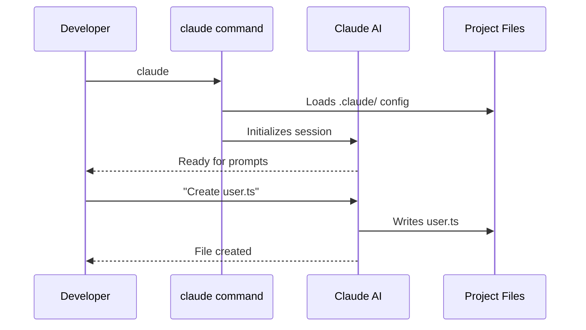
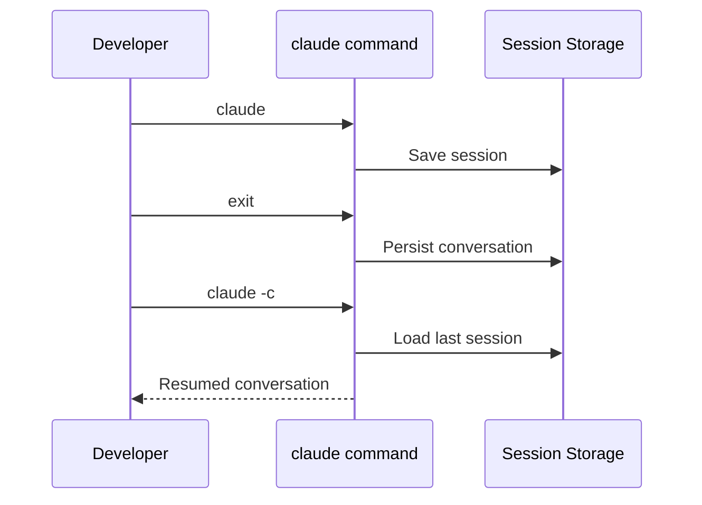
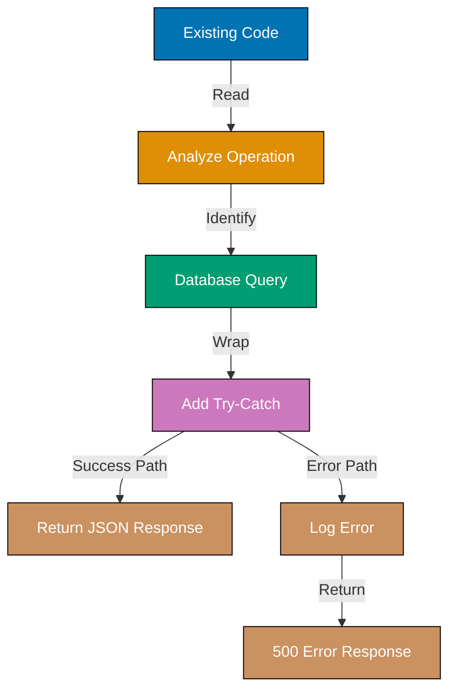

This tutorial provides 30 foundational examples covering the Claude Code CLI tool - the AI coding assistant controlled through the `claude` command. Learn interactive usage (Examples 1-6), non-interactive print mode (Examples 7-12), npm scripts integration (Examples 13-18), git hooks (Examples 19-20), and workflow management (Examples 21-30).

## What is Claude Code (Examples 1-6)

### Example 1: What is Claude Code

Claude Code is an AI-powered coding assistant you run from the command line using the `claude` command. It reads and writes files, runs commands, and helps you build software through natural language conversation. Think of it as a senior developer available 24/7 via your terminal.

**Key Features**:

- **Interactive mode**: Conversational development (`claude` → chat interface)
- **Print mode**: Non-interactive automation (`claude -p "query"` → exits after response)
- **File operations**: Read, write, edit files based on natural language requests
- **Command execution**: Run bash commands, git operations, build scripts
- **Context awareness**: Understands project structure, existing patterns, coding conventions

**Key Takeaway**: Claude Code is a CLI tool (`claude` command) that brings AI assistance to software development through file operations and command execution.

**Why It Matters**: Traditional AI assistants require copying code between browser and editor. Claude Code works directly in your codebase - it reads files, makes changes, runs tests, and commits results. This eliminates context switching and enables true AI-assisted development workflows when handling boilerplate, refactoring, and test generation.

### Example 2: Starting Interactive Session

The `claude` command without arguments starts interactive mode - a conversational interface where you describe what you want and Claude Code generates code, edits files, or runs commands.



**Commands**:

```bash
claude                              # => Launches Claude Code CLI
                                    # => Loads project config (.claude/)
                                    # => Enters interactive conversation mode
                                    # => Displays welcome message
                                    # => Ready for natural language prompts
```

**Key Takeaway**: Run `claude` to start interactive mode. You'll get a conversational interface that maintains context across requests.

**Why It Matters**: Interactive mode enables iterative development through conversation. Ask Claude to create a file, review the result, request changes, add tests - all without leaving the terminal. Context persistence means Claude remembers earlier decisions and code it generated. This reduces the cognitive load of tracking changes across multiple files.

### Example 3: Interactive Session with Initial Prompt

Launch Claude Code with an initial prompt to start working immediately without entering interactive mode first. Useful for quick questions or focused tasks.

**Commands**:

```bash
claude "explain the authentication flow"
                                    # => Launches Claude with prompt
                                    # => Analyzes auth-related files
                                    # => Provides explanation
                                    # => Remains in interactive mode for follow-ups
```

**Key Takeaway**: Pass initial prompt as argument to `claude "your prompt"`. Claude executes the prompt then stays in interactive mode.

**Why It Matters**: Initial prompts eliminate the startup step - you jump straight into work. This is faster for focused tasks like "explain this function" or "fix this bug". The session remains interactive for follow-up questions, maintaining context. Use this pattern for rapid code investigations where you know the first question but expect follow-ups.

### Example 4: Understanding Claude's Tool Usage

Claude Code uses tools (Read, Write, Edit, Bash, etc.) to interact with your codebase. Understanding tools helps you predict what Claude will do and provide better prompts.

**Commands**:

```bash
# In Claude interactive session
You: Add error handling to src/api/users.ts
                                    # => Claude announces: "I'll use Read to view the file"
                                    # => Tool: Read(src/api/users.ts)
                                    # => Claude announces: "I'll use Edit to add try-catch"
                                    # => Tool: Edit(src/api/users.ts, old_string, new_string)
                                    # => Changes made, file updated
```

**Key Takeaway**: Claude announces tool usage before acting. Main tools: Read (view files), Write (create files), Edit (modify files), Bash (run commands).

**Why It Matters**: Tool announcements give you control - approve or reject operations before execution. Understanding tools helps you write better prompts ("Read auth.ts and add tests" vs "Add tests" where Claude might guess the wrong file). This transparency prevents unwanted changes. Configure permission policies to auto-approve safe tools (Read) while prompting for destructive ones (Edit, Bash).

### Example 5: File Operations in Interactive Mode

Claude Code can read, create, and edit files through natural language requests. You describe the operation, Claude executes it using appropriate tools.

**Commands**:

```bash
# In Claude interactive session
You: Create src/models/user.ts with User interface
                                    # => Claude uses Write tool
                                    # => Creates file with TypeScript interface
                                    # => Confirms: "Created src/models/user.ts"

You: Add a createdAt timestamp field
                                    # => Claude uses Read to view current file
                                    # => Uses Edit to add field
                                    # => Shows diff of changes
```

**Key Takeaway**: Claude handles file creation (Write), reading (Read), and editing (Edit) through conversational requests.

**Why It Matters**: Conversational file operations eliminate context switching between editor and terminal. Describe the change, Claude makes it. This is powerful for multi-file changes - "Add User import to all files using it" touches multiple files in one request.

### Example 6: Exiting and Resuming Sessions

Exit Claude with `exit` command or Ctrl+D. Resume previous conversations with `claude -c` (continue) or `claude -r <session>` (resume specific session).



**Commands**:

```bash
# In Claude session
You: exit                           # => Exits Claude
                                    # => Session saved to disk

# Later...
claude -c                           # => Continues last conversation
                                    # => Loads previous context
                                    # => Ready for follow-ups

claude -r "auth-refactor"           # => Resumes named session
                                    # => Loads that specific conversation
```

**Key Takeaway**: Exit with `exit` or Ctrl+D. Resume with `claude -c` (last conversation) or `claude -r <session>` (specific session).

**Why It Matters**: Session persistence enables long-running projects across multiple work sessions. Start feature development Monday, resume same conversation Wednesday. Context preserved means no re-explanation of requirements. Named sessions (`-r`) let you manage multiple parallel workstreams.

## Non-Interactive Print Mode (Examples 7-12)

### Example 7: Basic Print Mode (`-p`)

Print mode (`claude -p`) runs non-interactively - executes query, prints response, exits. Essential for scripts and automation.

**Commands**:

```bash
claude -p "explain the authentication flow"
                                    # => Claude analyzes auth files
                                    # => Prints explanation to stdout
                                    # => Exits (does NOT enter interactive mode)
                                    # => Exit code 0 on success
```

**Key Takeaway**: Use `claude -p "query"` for non-interactive execution. Claude processes query, prints response, exits immediately.

**Why It Matters**: Print mode enables CLI automation - call Claude from scripts, CI/CD, git hooks. Non-interactive execution is essential for automated workflows. Output goes to stdout (capture with `>` or pipes). Exit codes indicate success/failure for script error handling. This is the foundation for all Claude Code automation patterns.

### Example 8: Piping Content to Claude

Pipe file contents or command output to Claude via stdin. Useful for analyzing logs, processing data, or batch operations.

**Commands**:

```bash
cat src/api/users.ts | claude -p "add error handling"
                                    # => Claude receives file via stdin
                                    # => Analyzes TypeScript code
                                    # => Adds try-catch blocks
                                    # => Prints modified code to stdout

git diff | claude -p "summarize these changes"
                                    # => Claude receives git diff
                                    # => Analyzes changes
                                    # => Prints summary
```

**Key Takeaway**: Pipe content to Claude with `cat file | claude -p "query"` or `command | claude -p "query"`.

**Why It Matters**: Piping enables batch processing - analyze multiple files, process command output, transform data. This integrates Claude into Unix pipelines. Common pattern: `find . -name "*.ts" | xargs -I{} claude -p "add types to {}"` for batch operations. Use piping for automated code analysis in CI/CD.

### Example 9: Output Formats (text vs json)

Control output format with `--output-format`. Options: `text` (default), `json` (structured), `stream-json` (streaming events).

**Commands**:

```bash
claude -p "list all API endpoints" --output-format json
                                    # => Claude analyzes routes
                                    # => Returns JSON: {"endpoints": [...]}
                                    # => Parseable by jq, scripts

claude -p "list all API endpoints"
                                    # => Default text format
                                    # => Human-readable output
                                    # => Not structured for parsing
```

**Key Takeaway**: Use `--output-format json` for machine-parseable output. Default is human-readable text.

**Why It Matters**: JSON output enables downstream processing - parse with `jq`, pass to other tools, store in databases. Critical for automation pipelines. Example: `claude -p "extract function names" --output-format json | jq '.functions[]'` for programmatic code analysis. Use JSON output for generating reports, validating codebases, extracting metadata.

### Example 10: Continuing Conversations Non-Interactively

Use `claude -c -p` to continue previous conversation in print mode. Useful for multi-step automation maintaining context.

**Commands**:

```bash
claude -p "analyze src/auth.ts and suggest improvements"
                                    # => Claude analyzes auth code
                                    # => Suggests: Add rate limiting, improve validation
                                    # => Saves session

claude -c -p "implement the rate limiting suggestion"
                                    # => Continues previous conversation
                                    # => Remembers auth.ts analysis
                                    # => Implements rate limiting
                                    # => Prints modified code
```

**Key Takeaway**: Use `claude -c -p` to continue last conversation in non-interactive mode. Context preserved across print mode calls.

**Why It Matters**: Context continuation enables multi-step automation scripts. Build complex workflows where each step builds on previous analysis. Example script: analyze → suggest → implement → test - each step uses `claude -c -p` to maintain context. Use this for automated refactoring pipelines maintaining state across multiple operations.

### Example 11: JSON Output Parsing in Scripts

Parse Claude's JSON output with `jq` or programming language JSON parsers for automated decision making.

**Commands**:

```bash
# Extract function names from code analysis
FUNCTIONS=$(claude -p "list all exported functions in src/utils.ts" --output-format json | jq -r '.functions[]')

# Count TypeScript errors
ERROR_COUNT=$(claude -p "check for type errors" --output-format json | jq '.errors | length')

# Extract specific field
COMPLEXITY=$(claude -p "calculate cyclomatic complexity" --output-format json | jq '.complexity')
```

**Key Takeaway**: Pipe Claude JSON output to `jq` for field extraction. Use in scripts for automated decision making.

**Why It Matters**: JSON parsing enables conditional logic in automation - "if complexity > 10, reject PR". Extract specific metrics for reporting dashboards. Common in CI/CD: `if [ $ERROR_COUNT -gt 0 ]; then exit 1; fi` to fail builds on Claude-detected issues. Build custom quality gates using Claude analysis with jq parsing.

### Example 12: Session Management in Automation

Control session behavior with `--session-id` (explicit ID), `--no-session-persistence` (don't save), `--fork-session` (branch from existing).

**Commands**:

```bash
# Explicit session ID for reproducibility
claude -p "analyze code" --session-id "550e8400-e29b-41d4-a716-446655440000"
                                    # => Uses specific UUID
                                    # => Resumable with same ID

# Don't save session (one-off operation)
claude -p "quick check" --no-session-persistence
                                    # => Runs query
                                    # => Does NOT save to disk
                                    # => No session recovery

# Fork from existing session
claude -r "main-session" --fork-session -p "experiment with new approach"
                                    # => Loads main-session context
                                    # => Creates new session ID
                                    # => Original session unchanged
```

**Key Takeaway**: Control session lifecycle with `--session-id`, `--no-session-persistence`, `--fork-session`.

**Why It Matters**: Session management enables advanced automation patterns. Explicit IDs make builds reproducible. No-persistence for one-off checks doesn't pollute session history. Forking enables experimentation - try different approaches from same starting context without affecting original. Use forking for A/B testing code solutions.

## npm Scripts Integration (Examples 13-18)

### Example 13: npm Script Calling Claude for Code Generation

Wrap Claude commands in package.json scripts for team-wide automation. Everyone runs same Claude operations consistently.

**Commands**:

```json
// package.json
{
  "scripts": {
    "generate:model": "claude -p 'create User model with TypeScript types'"
  }
}
```

```bash
npm run generate:model             # => Executes Claude command
                                    # => Generates User model
                                    # => Output to stdout
                                    # => Team uses same command
```

**Key Takeaway**: Add Claude commands to package.json scripts. Standardizes automation across team.

**Why It Matters**: npm scripts document Claude usage patterns. New team members discover available automations via `npm run`. Consistency - everyone uses same prompts, gets same results. Version control tracks changes to automation commands. This lowers the barrier to AI adoption - team members don't need to remember Claude flags, just run `npm run <task>`.

### Example 14: npm Script for Documentation Generation

Automate documentation generation with npm scripts calling Claude to analyze code and generate docs.

**Commands**:

```json
// package.json
{
  "scripts": {
    "docs:generate": "claude -p 'generate API documentation from src/api/*.ts' --output-format json > docs/api.json"
  }
}
```

```bash
npm run docs:generate              # => Claude analyzes API files
                                    # => Generates JSON documentation
                                    # => Saves to docs/api.json
                                    # => Automated doc generation
```

**Key Takeaway**: npm scripts + Claude enable automated documentation generation. Output to files with `>` redirection.

**Why It Matters**: Manual documentation falls out of sync with code. Automated generation keeps docs current. Run `npm run docs:generate` before releases to update docs. CI/CD can validate docs match code.

### Example 15: npm Script with Environment Variables

Pass configuration to Claude via environment variables. Useful for model selection, custom prompts, or feature flags.

**Commands**:

```json
// package.json
{
  "scripts": {
    "analyze:fast": "CLAUDE_MODEL=haiku npm run analyze",
    "analyze:thorough": "CLAUDE_MODEL=sonnet npm run analyze",
    "analyze": "claude -p 'analyze codebase for issues' --model $CLAUDE_MODEL"
  }
}
```

```bash
npm run analyze:fast               # => Uses Haiku model (faster, cheaper)
npm run analyze:thorough           # => Uses Sonnet model (thorough, slower)
```

**Key Takeaway**: Use environment variables to configure Claude commands. Different scripts can customize behavior.

**Why It Matters**: Environment variables enable flexible automation. Same base command with different configurations (models, prompts, output paths). Example: fast analysis in development, thorough analysis in CI/CD. Balance speed vs accuracy by selecting appropriate model per use case.

### Example 16: npm Script Error Handling

Handle Claude errors in npm scripts with exit codes and conditional logic. Fail builds on Claude-detected issues.

**Commands**:

```json
// package.json
{
  "scripts": {
    "validate": "claude -p 'check for type errors' --output-format json > errors.json && [ $(jq '.errors | length' errors.json) -eq 0 ]",
    "test:ai": "claude -p 'validate test coverage' || (echo 'AI validation failed' && exit 1)"
  }
}
```

```bash
npm run validate                   # => Runs Claude validation
                                    # => Exits 0 if no errors
                                    # => Exits 1 if errors found
                                    # => npm reports success/failure
```

**Key Takeaway**: Use exit codes for error handling. Chain commands with `&&` (success) or `||` (failure).

**Why It Matters**: Error handling enables quality gates. Fail CI/CD builds on Claude-detected issues (type errors, missing tests, security problems). Automated quality enforcement - code can't merge if Claude validation fails.

### Example 17: npm Script Chaining Multiple Claude Commands

Chain multiple Claude commands in sequence. Each step uses output from previous step.

**Commands**:

```json
// package.json
{
  "scripts": {
    "full-analysis": "claude -p 'analyze architecture' > arch.txt && claude -c -p 'suggest improvements based on analysis' > improvements.txt && claude -c -p 'prioritize improvements by impact' > priorities.txt"
  }
}
```

```bash
npm run full-analysis              # => Step 1: Analyze architecture → arch.txt
                                    # => Step 2: Suggest improvements → improvements.txt
                                    # => Step 3: Prioritize → priorities.txt
                                    # => Each step continues previous conversation
```

**Key Takeaway**: Chain commands with `&&`. Use `claude -c -p` for context continuation across commands.

**Why It Matters**: Multi-step pipelines enable complex automation. Each step refines previous output. Example: analyze → identify issues → suggest fixes → implement → test. Context preservation means Claude remembers earlier analysis. Build comprehensive quality pipelines using command chaining.

### Example 18: npm Script Output Capture and Processing

Capture Claude output to files, then process with standard Unix tools or other scripts.

**Commands**:

```json
// package.json
{
  "scripts": {
    "extract-deps": "claude -p 'list all npm dependencies with versions' --output-format json > deps.json && jq '.dependencies[]' deps.json > deps-list.txt"
  }
}
```

```bash
npm run extract-deps               # => Claude analyzes package.json
                                    # => Outputs JSON to deps.json
                                    # => jq extracts dependency list
                                    # => Saves to deps-list.txt
```

**Key Takeaway**: Capture Claude output with `>`, process with downstream tools (`jq`, `grep`, custom scripts).

**Why It Matters**: Output capture enables integration with existing toolchains. Claude becomes one stage in larger pipeline. Example: Claude analysis → jq filtering → dashboard upload. This leverages Unix philosophy - combine simple tools for complex workflows. Integrate Claude into existing CI/CD without rewriting pipelines.

## Git Hooks with Claude Code (Examples 19-20)

### Example 19: Pre-commit Hook Using Claude for Validation

Run Claude validation before commits. Prevents committing code with detected issues.

**Commands**:

```bash
# .husky/pre-commit
#!/bin/bash
claude -p "validate staged files for issues" --output-format json > /tmp/validation.json

ISSUES=$(jq '.issues | length' /tmp/validation.json)

if [ "$ISSUES" -gt 0 ]; then
  echo "❌ Claude detected issues:"
  jq '.issues[]' /tmp/validation.json
  exit 1
fi

echo "✅ Claude validation passed"
```

```bash
git add src/api/users.ts
git commit -m "add user endpoint"
                                    # => Pre-commit hook runs
                                    # => Claude validates users.ts
                                    # => If issues: blocks commit, shows errors
                                    # => If clean: allows commit
```

**Key Takeaway**: Use Claude in pre-commit hooks to validate code before committing. Exit 1 blocks commit, exit 0 allows it.

**Why It Matters**: Pre-commit validation prevents bad code from entering version control. Catch issues immediately vs during CI/CD (faster feedback). Claude validates for type errors, missing tests, security issues. This shifts quality left - problems caught at commit time, not review time.

### Example 20: Pre-push Hook Using Claude for Code Review

Run Claude code review before pushing. Ensures code quality before sharing with team.

**Commands**:

```bash
# .husky/pre-push
#!/bin/bash
FILES=$(git diff --name-only origin/main...HEAD)

for FILE in $FILES; do
  REVIEW=$(claude -p "review $FILE for code quality issues" --output-format json)
  SEVERITY=$(echo "$REVIEW" | jq -r '.max_severity')

  if [ "$SEVERITY" = "high" ] || [ "$SEVERITY" = "critical" ]; then
    echo "❌ Critical issues in $FILE"
    echo "$REVIEW" | jq '.issues[]'
    exit 1
  fi
done

echo "✅ Claude review passed"
```

```bash
git push                           # => Pre-push hook runs
                                    # => Claude reviews changed files
                                    # => If critical issues: blocks push
                                    # => If acceptable: allows push
```

**Key Takeaway**: Use Claude in pre-push hooks to review code before sharing. Block push on critical issues.

**Why It Matters**: Pre-push review provides automated code review before code reaches team. Catches quality issues, security problems, anti-patterns. This reduces human review burden - reviewers focus on architecture and logic, not style or common mistakes.

## Workflow Management (Examples 21-30)

### Example 21: Managing Conversation History

View previous messages to recall earlier decisions or code snippets. Conversation history helps maintain continuity across sessions.

**Commands**:

```bash
# In Claude session - scroll up to view history
                                    # => Terminal shows previous messages
                                    # => Your prompts and Claude responses
                                    # => Code blocks generated earlier
                                    # => Tool usage logs (Read, Write, Edit, Bash)
                                    # => Useful for recalling earlier implementations
```

**Key Takeaway**: Scroll terminal to review conversation history. Helpful for recalling earlier code or decisions before making related changes.

**Why It Matters**: Conversation history serves as session documentation. When debugging, review what Claude changed to identify regression points. This makes AI conversations auditable - decisions have traceable rationale.

### Example 22: Asking Follow-Up Questions

Chain questions for deeper understanding. Follow-ups clarify details, explore alternatives, or request elaboration on initial responses.

**Commands**:

```bash
You: Explain the difference between map and forEach in JavaScript
                                    # => Claude explains: map returns array, forEach returns undefined
You: When should I use map over forEach?
                                    # => Claude explains: Use map for transformations, forEach for side effects
You: Show me an example of each
                                    # => Claude provides code examples:
                                    # =>   map: const doubled = nums.map(n => n * 2);
                                    # =>   forEach: nums.forEach(n => console.log(n));
You: What about performance differences?
                                    # => Claude discusses: Minimal difference, choice is semantic
```

**Key Takeaway**: Ask follow-up questions to explore topics deeply. Each question builds on previous context without re-explaining.

**Why It Matters**: Follow-up questioning enables Socratic learning - iteratively refine understanding through dialogue. This learning mode is more engaging than passive documentation reading. The interactive format mirrors pair programming knowledge transfer.

### Example 23: Canceling Operations

Stop Claude mid-execution if you realize the request is incorrect or unnecessary. Ctrl+C cancels current operation.

**Commands**:

```bash
You: Delete all files in src/components/
                                    # => Claude starts analyzing files to delete
                                    # => You realize this was wrong request
^C                                  # => Press Ctrl+C to cancel
                                    # => Claude stops execution
                                    # => No files deleted (operation interrupted)
You: Sorry, I meant to say: delete only the unused components
                                    # => Claude asks: "Which components are unused?"
```

**Key Takeaway**: Press Ctrl+C to cancel operations in progress. Useful when you realize request was wrong or too broad.

**Why It Matters**: Cancel capability prevents destructive operations from completing when you catch errors mid-request. This safety net encourages experimentation - you can cancel if the request goes in the wrong direction.

### Example 24: Checking Project Status

Request git status or file listings to understand current project state before making changes.

**Commands**:

```bash
You: Show me git status
                                    # => Claude runs: git status
                                    # => Output:
                                    # => On branch feature/user-auth
                                    # => Changes not staged for commit:
                                    # =>   modified:   src/api/auth.ts
                                    # =>   modified:   src/models/User.ts
                                    # => Untracked files:
                                    # =>   src/middleware/authenticate.ts
You: List files in src/components/
                                    # => Claude runs: ls src/components/
                                    # => Output: Button.tsx  Input.tsx  Modal.tsx
```

**Key Takeaway**: Request status checks before making changes. Claude uses Bash tool to run git status, ls, or other inspection commands.

**Why It Matters**: Status checks prevent working on wrong branch or overwriting uncommitted changes. AI-driven status checks integrate context gathering into conversation flow. This is especially valuable when returning to project after break - ask AI for status summary rather than running multiple terminal commands manually.

### Example 25: Clearing Context for Fresh Start

Exit and restart Claude to clear conversation context. Useful when switching to unrelated task or after very long conversation.

**Commands**:

```bash
You: exit                           # => Exits Claude session
                                    # => All conversation context cleared
                                    # => Returns to regular terminal
claude                              # => Start fresh session
                                    # => New conversation with empty context
                                    # => Loads .claude/ config again
You: Create a Python script for data analysis
                                    # => No context from previous TypeScript work
                                    # => Fresh start for Python project
```

**Key Takeaway**: Exit and restart Claude to clear conversation context. Useful for switching projects or tasks.

**Why It Matters**: Fresh context prevents AI from applying patterns from previous conversation to new unrelated task. When working on multiple projects, separate sessions maintain task isolation. However, exiting loses conversation history - balance between context cleanup and history preservation based on task continuity needs.

### Example 26: Basic Refactoring - Extract Variable

Request variable extraction to improve code readability. Claude names extracted variable semantically based on value or usage.

**Commands**:

```bash
You: Extract the magic number 86400 into a named constant in src/utils/time.ts
                                    # => Claude reads file
                                    # => Sees: const expiresIn = currentTime + 86400;
                                    # => Extracts constant:
                                    # =>   const SECONDS_PER_DAY = 86400;
                                    # => Updates usage:
                                    # =>   const expiresIn = currentTime + SECONDS_PER_DAY;
                                    # => Adds constant at top of file
```

**Key Takeaway**: Claude extracts magic numbers/strings into named constants. Chooses semantic names based on value meaning and usage context.

**Why It Matters**: Named constants improve code maintainability - change value once rather than hunting for magic numbers. AI extraction identifies all occurrences of literal values across files. This compounds readability improvements over time.

### Example 27: Adding Error Handling

Request error handling additions to existing code. Claude wraps operations in try-catch blocks and adds appropriate error logging or user feedback.



**Commands**:

```bash
You: Add error handling to the database query in src/api/users.ts
                                    # => Claude reads file
                                    # => Finds: const users = await db.query('SELECT * FROM users');
                                    # => Wraps in try-catch:
                                    # =>   try {
                                    # =>     const users = await db.query('SELECT * FROM users');
                                    # =>     return res.json(users);
                                    # =>   } catch (error) {
                                    # =>     console.error('Database query failed:', error);
                                    # =>     return res.status(500).json({ error: 'Internal server error' });
                                    # =>   }
```

**Key Takeaway**: Claude adds try-catch blocks with appropriate error responses. Considers operation type (API vs utility) for error handling strategy.

**Why It Matters**: Comprehensive error handling is tedious to add manually but critical for production robustness. AI adds error handling consistently across codebase following project patterns. This improves production reliability without extensive manual time investment.

### Example 28: Generating README Files

Request README generation for projects or modules. Claude analyzes code structure to create documentation with setup instructions, usage examples, and API references.

**Commands**:

```bash
You: Create a README.md for this project
                                    # => Claude analyzes project:
                                    # =>   - Reads package.json (name, description, scripts)
                                    # =>   - Scans src/ structure
                                    # =>   - Identifies main entry points
                                    # => Generates README with:
                                    # =>   # Project Name
                                    # =>   Description from package.json
                                    # =>   ## Installation: npm install
                                    # =>   ## Usage: npm start
                                    # =>   ## Project Structure: overview of src/
                                    # =>   ## Scripts: npm test, npm build
```

**Key Takeaway**: Claude generates README by analyzing project structure, package.json, and code organization. Includes setup, usage, and structure sections.

**Why It Matters**: README generation from actual project structure ensures documentation accuracy. Manual README writing is often outdated - AI generates current snapshot. Generated READMEs serve as a starting point for adding project-specific context.

### Example 29: Creating .gitignore Files

Request .gitignore generation matching project technology stack. Claude includes common ignore patterns for detected languages and frameworks.

**Commands**:

```bash
You: Create a .gitignore file for this Node.js project
                                    # => Claude detects: Node.js + TypeScript
                                    # => Generates .gitignore:
                                    # => # Node
                                    # => node_modules/
                                    # => npm-debug.log*
                                    # =>
                                    # => # TypeScript
                                    # => dist/
                                    # => *.tsbuildinfo
                                    # =>
                                    # => # Environment
                                    # => .env
                                    # => .env.local
                                    # =>
                                    # => # IDE
                                    # => .vscode/
                                    # => .idea/
```

**Key Takeaway**: Claude generates .gitignore with patterns for detected tech stack. Includes node_modules, build outputs, environment files, and IDE folders.

**Why It Matters**: Comprehensive .gitignore files prevent committing sensitive data (env files, credentials) and bloating repos with build artifacts. AI-generated ignores include common patterns developers often forget. This prevents security incidents and repo bloat from accidental commits of node_modules or .env files.

### Example 30: Exiting Claude Sessions

Exit interactive mode to return to regular terminal. Session context is lost, but can restart Claude anytime.

**Commands**:

```bash
You: exit                           # => Exits Claude Code session
                                    # => Returns to regular terminal prompt
                                    # => All conversation context cleared
                                    # => Files created/modified remain
                                    # => Can restart with: claude
$ pwd                               # => Back in normal terminal
/home/user/projects/my-app          # => Regular shell commands work
$ claude                            # => Restart Claude for new session
                                    # => Fresh context, no memory of previous session
```

**Key Takeaway**: Use `exit` command or Ctrl+D to leave Claude session. Returns to regular terminal, conversation context cleared.

**Why It Matters**: Explicit exit allows controlled session boundaries. Work with AI for focused tasks, then return to terminal for git operations, deployment, or other manual work. Clean separation between AI-assisted and manual workflows prevents over-reliance on AI for simple tasks. Balance AI assistance with maintaining core terminal proficiency.

## Next Steps

This beginner tutorial covered Examples 1-30 (0-40% of Claude Code capabilities). You learned interactive session management, basic code generation, file operations, and essential workflows for AI-assisted development.

**Continue learning**:

- [Intermediate](/en/learn/software-engineering/automation-tools/claude-code/by-example/intermediate) - Examples 31-60 covering agent configuration, advanced refactoring, and testing workflows
- [Advanced](/en/learn/software-engineering/automation-tools/claude-code/by-example/advanced) - Examples 61-90 covering custom agents, skill development, and enterprise integration patterns
