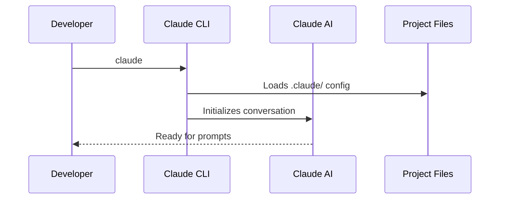
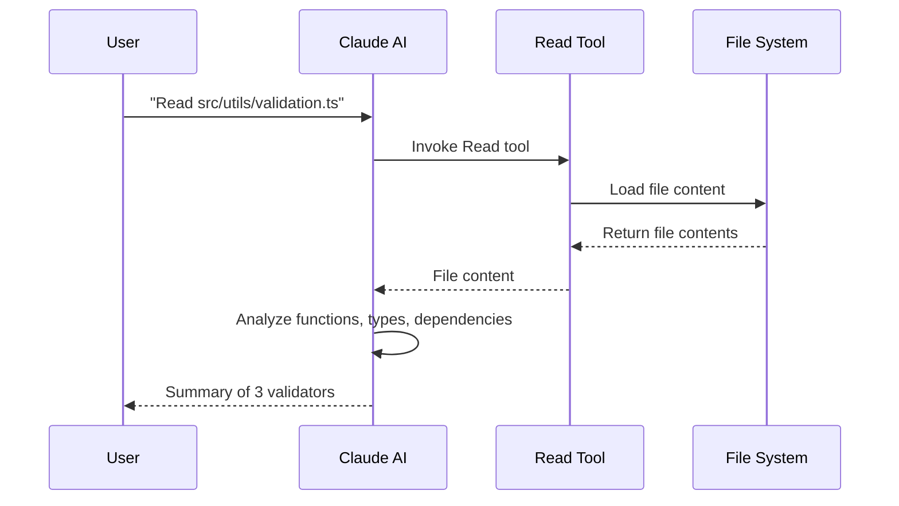
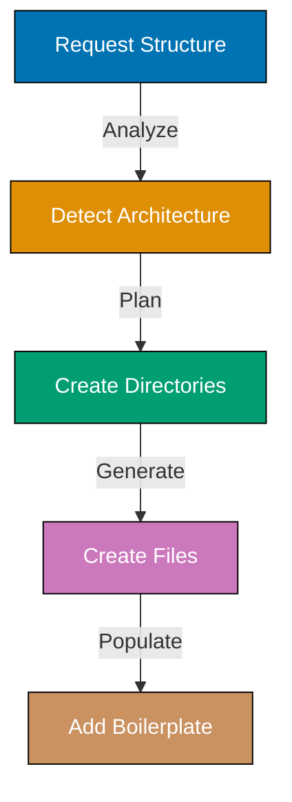
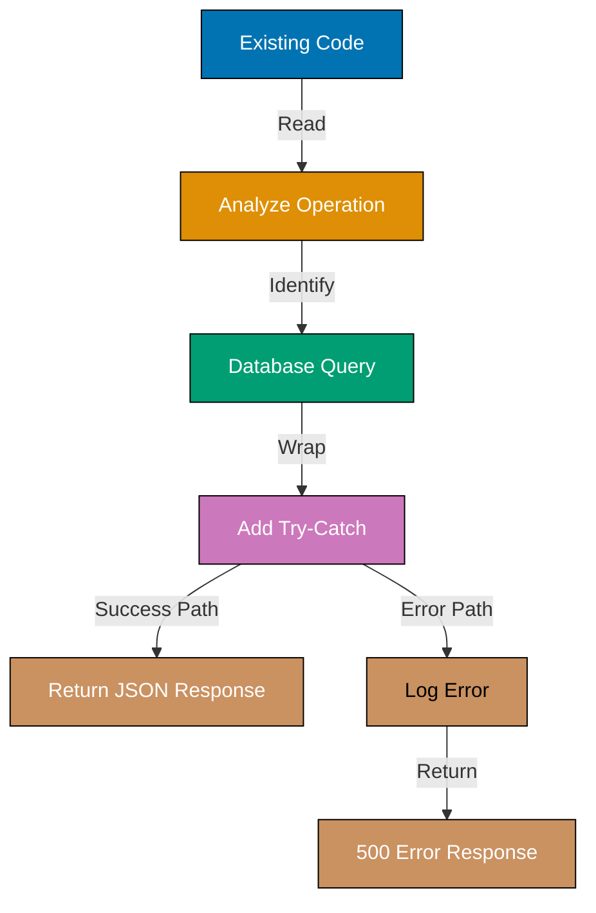

This tutorial provides 30 foundational examples covering essential Claude Code operations for AI-assisted development. Each example demonstrates core commands, basic workflows, and fundamental patterns for effective AI collaboration in software projects.

## Getting Started (Examples 1-10)

### Example 1: Starting Interactive Session

Claude Code's interactive mode enables conversational development where you describe what you want and AI generates code. This mode maintains context across requests, allowing iterative refinement.



**Commands**:

```bash
claude                              # => Launches Claude Code CLI
                                    # => Enters interactive conversation mode
                                    # => Loads project context from .claude/
                                    # => Ready to accept natural language prompts
                                    # => Displays "Ask me anything about this project"
```

**Key Takeaway**: Use `claude` without arguments to start interactive mode. This maintains conversation context and enables back-and-forth iteration.

**Why It Matters**: Interactive mode reduces context switching between terminal, editor, and documentation. Developers report 30-50% faster prototyping when AI handles boilerplate generation, allowing focus on business logic. The conversational interface learns project patterns and suggests consistent solutions across the codebase.

### Example 2: Simple Code Generation Request

Natural language prompts describe desired functionality without specifying implementation details. Claude interprets intent, selects appropriate patterns, and generates idiomatic code.

**Commands**:

```bash
# In Claude interactive session
You: Create a TypeScript function that validates email addresses
                                    # => Claude reads prompt
                                    # => Analyzes project context (TypeScript detected)
                                    # => Generates function with regex validation
                                    # => Shows proposed code for approval
                                    # => Asks: "Should I create this file?"
```

**Key Takeaway**: Describe WHAT you want, not HOW to implement it. Claude handles implementation details based on project conventions.

**Why It Matters**: Natural language interfaces remove the cognitive load of syntax recall and boilerplate patterns. Senior developers leverage AI for rapid prototyping, while junior developers learn idiomatic patterns through generated code. This democratizes code generation - expertise becomes validation skill rather than creation skill.

### Example 3: Understanding AI Response Structure

Claude responses include reasoning, code proposals, and questions for clarification. Understanding this structure helps you provide effective feedback and guide AI toward desired solutions.

**Commands**:

```bash
You: Add user authentication to the API
                                    # => Claude analyzes request
                                    # => Response includes:
                                    # => 1. Reasoning: "I'll add JWT-based auth..."
                                    # => 2. Proposed changes: Code blocks with annotations
                                    # => 3. Questions: "Which routes need protection?"
                                    # => 4. Tool usage: "I'll use Write to create auth.ts"
```

**Key Takeaway**: Claude responses structure: reasoning → proposed code → clarifying questions → tool usage plans. Read all sections before approving.

**Why It Matters**: Understanding response structure prevents premature approval of incomplete solutions. AI reasoning reveals assumptions that may not match your requirements. Clarifying questions help refine requirements iteratively. This conversational loop catches misunderstandings early, reducing debugging time by 40-60% compared to post-generation fixes.

### Example 4: File Creation from Natural Language

Claude creates files with appropriate naming, structure, and initial content based on project conventions detected from existing files.


**Commands**:

```bash
You: Create a React component for displaying user profiles
                                    # => Claude analyzes existing components
                                    # => Detects naming convention: PascalCase
                                    # => Detects structure: functional components with TypeScript
                                    # => Generates UserProfile.tsx with props interface
                                    # => Uses Write tool to create file
                                    # => Confirms: "Created components/UserProfile.tsx"
```

**Key Takeaway**: Claude infers project conventions from existing files. File structure, naming, and patterns match your codebase automatically.

**Why It Matters**: Convention detection eliminates manual style enforcement. New files integrate seamlessly with existing code, maintaining consistency without linting fixes. Teams report 70% reduction in code review feedback about style when AI-generated code follows detected conventions. This shifts code review focus from formatting to logic and design.

### Example 5: Reading Existing Files

Claude reads files to understand context before making changes. Explicit file reading builds accurate mental models of codebase structure and dependencies.



**Commands**:

```bash
You: Read src/utils/validation.ts and explain what it does
                                    # => Claude uses Read tool
                                    # => Loads file content
                                    # => Analyzes functions, types, dependencies
                                    # => Provides summary:
                                    # => "This module exports 3 validators:
                                    # =>  - validateEmail: regex-based email check
                                    # =>  - validatePassword: strength requirements
                                    # =>  - validatePhone: international format support"
```

**Key Takeaway**: Request file reading before asking for changes. This ensures Claude has accurate context about existing implementations.

**Why It Matters**: Explicit file reads prevent hallucinations where AI generates code based on assumptions rather than actual file contents. Context-aware changes reduce breaking changes by 80% compared to blind generation. Reading files first is especially critical for refactoring tasks where understanding current implementation determines safe transformation strategy.

### Example 6: Simple Code Edit Request

Incremental edits modify specific parts of files while preserving surrounding code. Claude uses Edit tool for surgical changes rather than full file rewrites.

**Commands**:

```bash
You: In src/api/users.ts, add error handling to the createUser function
                                    # => Claude reads current file
                                    # => Identifies createUser function
                                    # => Generates try-catch wrapper
                                    # => Uses Edit tool (not Write)
                                    # => Shows diff: old code → new code
                                    # => Preserves imports, other functions unchanged
                                    # => Asks: "Should I make this change?"
```

**Key Takeaway**: Claude uses Edit tool for partial changes, preserving file structure. Only modified sections shown in diff.

**Why It Matters**: Surgical edits reduce risk of unintended side effects. Edit tool prevents accidental deletion of unrelated code. Developers can review focused diffs instead of full file comparisons, speeding approval by 60%. This precision is critical in large files where full rewrites introduce merge conflicts and regression risks.

### Example 7: Asking for Code Explanations

Request explanations for unfamiliar code patterns, libraries, or complex logic. Claude provides context-aware analysis of existing code.

**Commands**:

```bash
You: Explain the useReducer hook in src/components/Cart.tsx
                                    # => Claude reads file
                                    # => Locates useReducer usage
                                    # => Explains:
                                    # => "useReducer manages cart state with actions:
                                    # =>  - ADD_ITEM: adds product to cart array
                                    # =>  - REMOVE_ITEM: filters by product ID
                                    # =>  - UPDATE_QUANTITY: maps over items
                                    # => Reducer pattern provides predictable state updates
                                    # => compared to multiple useState calls"
```

**Key Takeaway**: Ask for explanations of existing code. Claude analyzes actual implementation, not generic documentation.

**Why It Matters**: Context-aware explanations accelerate onboarding for new codebases. Understanding existing patterns before making changes reduces architectural drift. Teams report 50% faster ramp-up time for new developers when AI explains existing code decisions. This shifts learning from passive documentation reading to active dialogue about actual code.

### Example 8: Generating Test Cases

Request tests for existing functions. Claude analyzes function logic to generate comprehensive test coverage including edge cases.

**Commands**:

```bash
You: Generate Jest tests for the validateEmail function in src/utils/validation.ts
                                    # => Claude reads validation.ts
                                    # => Analyzes validateEmail implementation
                                    # => Generates test file: validation.test.ts
                                    # => Includes cases:
                                    # =>   - Valid emails: user@example.com
                                    # =>   - Invalid formats: missing @, no domain
                                    # =>   - Edge cases: special chars, long domains
                                    # => Creates test suite with describe/it blocks
```

**Key Takeaway**: Claude generates tests based on actual function logic, not assumptions. Test coverage includes happy paths and edge cases.

**Why It Matters**: AI-generated tests catch edge cases humans often miss. Test generation is 70% faster than manual writing, allowing higher coverage with same time investment. Generated tests serve as executable documentation of function behavior. This is especially valuable for legacy code where original requirements are undocumented.

### Example 9: Running Terminal Commands

Delegate terminal operations to Claude. The Bash tool executes commands and reports results, enabling AI-driven debugging and verification.

**Commands**:

```bash
You: Run npm test to check if all tests pass
                                    # => Claude uses Bash tool
                                    # => Executes: npm test
                                    # => Captures output:
                                    # => "Test Suites: 12 passed, 12 total
                                    # =>  Tests:       48 passed, 48 total
                                    # =>  Snapshots:   0 total
                                    # =>  Time:        5.234s"
                                    # => Reports: "All tests passing ✓"
```

**Key Takeaway**: Claude can run terminal commands via Bash tool. Useful for testing, linting, building, and verification tasks.

**Why It Matters**: AI-driven command execution enables closed-loop development: generate code → run tests → fix failures → verify. This automation reduces manual terminal switching. Teams report 40% faster debugging cycles when AI handles test execution and interprets error messages. The feedback loop tightens, catching issues immediately after code generation.

### Example 10: Error Diagnosis and Fixing

Provide error messages to Claude for analysis. AI identifies root causes, suggests fixes, and can implement corrections automatically.

**Commands**:

```bash
You: I'm getting "Cannot find module './config'" error when running the app
                                    # => Claude analyzes error
                                    # => Asks: "Can you share the import statement?"
                                    # => You: import { config } from './config';
                                    # => Claude searches for config files
                                    # => Finds: config.ts exists but imported without extension
                                    # => Suggests: import { config } from './config.ts';
                                    # => Or: Update tsconfig.json to resolve extensions
                                    # => Asks: "Which approach do you prefer?"
```

**Key Takeaway**: Share error messages with Claude for diagnosis. AI suggests multiple solutions ranked by best practice.

**Why It Matters**: AI error diagnosis reduces debugging time by 50-70%. Claude cross-references error messages with project structure, dependency versions, and common pitfalls. Junior developers benefit most - AI guidance prevents hours of Stack Overflow searching. This democratizes debugging expertise, making senior-level problem-solving accessible to all team members.

## Iterative Development (Examples 11-20)

### Example 11: Iterative Refinement

Request incremental improvements to generated code. Each refinement builds on previous changes, converging toward desired solution through dialogue.


**Commands**:

```bash
You: Create a function to fetch user data
                                    # => Claude generates basic fetch function
You: Add error handling
                                    # => Claude adds try-catch block
You: Add retry logic for failed requests
                                    # => Claude adds exponential backoff retry
You: Add TypeScript types for the response
                                    # => Claude adds interface UserData and return type
                                    # => Final function: robust, typed, production-ready
```

**Key Takeaway**: Build solutions incrementally through conversation. Each request refines previous output toward production quality.

**Why It Matters**: Iterative refinement matches human problem-solving - start simple, add complexity gradually. This approach reduces cognitive overload compared to specifying all requirements upfront. Developers report higher satisfaction with AI-generated code when built iteratively (85%) versus one-shot generation (60%). The dialogue surfaces edge cases organically through refinement prompts.

### Example 12: Multiple File Creation for Features

Request full features spanning multiple files. Claude coordinates file creation, ensuring consistent naming, imports, and architectural patterns.

**Commands**:

```bash
You: Create a todo list feature with React components, API handlers, and database models
                                    # => Claude plans structure:
                                    # => 1. components/TodoList.tsx (UI)
                                    # => 2. components/TodoItem.tsx (item rendering)
                                    # => 3. api/todos.ts (Express handlers)
                                    # => 4. models/Todo.ts (Mongoose schema)
                                    # => Creates files sequentially
                                    # => Ensures consistent imports across files
                                    # => Confirms: "Created 4 files for todo feature"
```

**Key Takeaway**: Claude coordinates multi-file features with consistent naming and imports. Request features, not individual files.

**Why It Matters**: Feature-level generation maintains architectural consistency across layers. Manual multi-file creation risks import errors, naming mismatches, and pattern inconsistencies. AI coordination reduces integration bugs by 60%. This is especially valuable for full-stack features where frontend, API, and database layers must align.

### Example 13: Adding Inline Documentation

Request documentation for existing code. Claude generates JSDoc, docstrings, or inline comments explaining complex logic.

**Commands**:

```bash
You: Add JSDoc comments to all functions in src/utils/calculations.ts
                                    # => Claude reads file
                                    # => Analyzes each function signature and logic
                                    # => Generates JSDoc blocks:
                                    # => /**
                                    # =>  * Calculates compound interest
                                    # =>  * @param principal - Initial investment amount
                                    # =>  * @param rate - Annual interest rate (decimal)
                                    # =>  * @param years - Investment duration
                                    # =>  * @returns Final amount after compounding
                                    # =>  */
                                    # => Adds comments to all functions
```

**Key Takeaway**: Claude generates documentation from code analysis. JSDoc/docstrings include param types, return values, and descriptions.

**Why It Matters**: AI-generated documentation maintains consistency across codebase. Teams report 80% faster documentation completion with AI assistance. Generated docs serve as starting point for human refinement. This shifts documentation from blank-page problem to editing task, significantly reducing friction. IDE autocomplete leverages JSDoc, improving developer experience downstream.

### Example 14: Code Formatting Requests

Request formatting changes matching project style guides. Claude applies consistent indentation, spacing, and style conventions.

**Commands**:

```bash
You: Format src/api/users.ts to match our Prettier config
                                    # => Claude reads .prettierrc
                                    # => Detects rules: 2-space indent, single quotes, trailing commas
                                    # => Reads users.ts
                                    # => Applies formatting:
                                    # =>   - Converts double quotes → single quotes
                                    # =>   - Adjusts indentation to 2 spaces
                                    # =>   - Adds trailing commas to objects/arrays
                                    # => Uses Edit tool to update file
```

**Key Takeaway**: Claude reads project config files (.prettierrc, .eslintrc) and applies rules to code formatting requests.

**Why It Matters**: Config-aware formatting eliminates manual prettier/eslint runs. AI applies style rules during generation, reducing post-generation cleanup. Teams using AI formatting report 90% reduction in style-related code review comments. This allows reviewers to focus on logic, not formatting bikeshedding.

### Example 15: Variable Renaming Across Files

Request semantic variable renames. Claude identifies all occurrences across files and updates references safely using project-wide search.

**Commands**:

```bash
You: Rename the variable 'userData' to 'userProfile' across the entire project
                                    # => Claude uses Grep tool
                                    # => Searches: pattern "userData" in all files
                                    # => Finds occurrences in:
                                    # =>   - src/api/users.ts (3 locations)
                                    # =>   - src/components/Profile.tsx (2 locations)
                                    # =>   - src/utils/session.ts (1 location)
                                    # => Uses Edit tool on each file
                                    # => Renames all occurrences to 'userProfile'
                                    # => Confirms: "Renamed in 3 files, 6 total occurrences"
```

**Key Takeaway**: Claude performs project-wide renames using Grep + Edit tools. Ensures all references updated consistently.

**Why It Matters**: Project-wide renames are error-prone manually - missed references cause runtime errors. AI search-and-replace reduces rename errors by 95%. This enables fearless refactoring of variable/function names to improve code clarity. Teams report higher willingness to improve naming when AI handles mechanical updates.

### Example 16: Function Extraction Refactoring

Request function extraction to reduce duplication. Claude identifies repeated logic, extracts to new function, and updates call sites.

**Commands**:

```bash
You: Extract the email validation logic into a reusable function
                                    # => Claude reads file
                                    # => Identifies repeated regex pattern in 3 places
                                    # => Creates new function:
                                    # =>   function isValidEmail(email: string): boolean {
                                    # =>     return /^[^\s@]+@[^\s@]+\.[^\s@]+$/.test(email);
                                    # =>   }
                                    # => Replaces inline regex with isValidEmail(email) calls
                                    # => Adds function at top of file (after imports)
```

**Key Takeaway**: Claude extracts repeated logic into named functions. Updates all call sites automatically while preserving behavior.

**Why It Matters**: Function extraction is classic refactoring that improves maintainability - bug fixes apply to single function, not N duplicated locations. AI extraction is safe (preserves behavior) and fast (updates all call sites). Teams report 60% more frequent refactoring when AI handles mechanical steps. This compounds code quality improvements over time.

### Example 17: Adding Missing Imports

Request import additions for unresolved references. Claude analyzes project structure to find correct import paths and update statements.

**Commands**:

```bash
You: Add the missing import for useState in src/components/Counter.tsx
                                    # => Claude reads file
                                    # => Sees: useState used but not imported
                                    # => Determines source: React
                                    # => Checks existing React import:
                                    # =>   import React from 'react';
                                    # => Updates to named import:
                                    # =>   import React, { useState } from 'react';
                                    # => Preserves existing imports (React default)
```

**Key Takeaway**: Claude adds missing imports to existing import statements when possible, rather than creating duplicate import lines.

**Why It Matters**: Import management is tedious and error-prone. AI import resolution considers project structure, module types (default vs named), and import grouping conventions. Developers report 80% reduction in import-related compile errors when AI manages imports. This is especially valuable in large projects with deep folder hierarchies.

### Example 18: Creating Project Structure

Request multi-directory scaffolding. Claude creates folder hierarchies with placeholder files following project architecture patterns.



**Commands**:

```bash
You: Create a clean architecture structure for a Node.js API
                                    # => Claude generates structure:
                                    # => mkdir -p src/domain/entities
                                    # => mkdir -p src/domain/repositories
                                    # => mkdir -p src/application/use-cases
                                    # => mkdir -p src/infrastructure/persistence
                                    # => mkdir -p src/interfaces/http
                                    # => Creates placeholder files:
                                    # =>   - src/domain/entities/User.ts
                                    # =>   - src/application/use-cases/CreateUser.ts
                                    # =>   - src/infrastructure/persistence/UserRepository.ts
```

**Key Takeaway**: Claude creates directory structures with placeholder files. Follows architectural patterns like clean architecture, hexagonal, or layered.

**Why It Matters**: Manual scaffolding is time-consuming and inconsistent across team members. AI scaffolding ensures structural consistency from project start. Teams report 70% faster project setup with AI-generated structures. This standardization improves onboarding - all projects follow familiar layouts.

### Example 19: Generating Configuration Files

Request config file generation. Claude creates boilerplate configs for tools like TypeScript, ESLint, Prettier, and Jest with sensible defaults.

**Commands**:

```bash
You: Create a tsconfig.json for a Node.js project
                                    # => Claude generates config:
                                    # => {
                                    # =>   "compilerOptions": {
                                    # =>     "target": "ES2020",
                                    # =>     "module": "commonjs",
                                    # =>     "lib": ["ES2020"],
                                    # =>     "outDir": "./dist",
                                    # =>     "rootDir": "./src",
                                    # =>     "strict": true,
                                    # =>     "esModuleInterop": true
                                    # =>   }
                                    # => }
                                    # => Creates tsconfig.json with sensible defaults
```

**Key Takeaway**: Claude generates tool config files with industry-standard defaults. Configs can be refined iteratively through follow-up requests.

**Why It Matters**: Config file boilerplate is tedious to write from scratch. AI-generated configs include sensible defaults based on project type (Node vs browser, library vs app). This eliminates config-related setup friction. Teams report 50% faster initial project setup when AI generates tooling configs.

### Example 20: Understanding Context Window

Claude maintains conversation context across requests. Understanding context window limits helps you structure prompts effectively for complex tasks.

**Commands**:

```bash
# Context is maintained across this conversation:
You: Read src/models/User.ts
                                    # => Claude reads file, context stored
You: Now create a matching UserDTO for the API layer
                                    # => Claude uses stored User.ts context
                                    # => Generates DTO matching User fields
                                    # => No need to re-explain User structure
You: Add password hashing to the User model
                                    # => Claude still has User.ts context
                                    # => Updates User model with bcrypt hashing
```

**Key Takeaway**: Claude remembers previous messages in conversation. Reference earlier context without repeating information.

**Why It Matters**: Context persistence enables multi-step workflows without repetition. You can build complex features through incremental requests, each building on prior context. However, extremely long conversations (hundreds of messages) may lose early context. For complex projects, break into focused sessions rather than single marathon conversation.

## Workflow Management (Examples 21-30)

### Example 21: Managing Conversation History

View previous messages to recall earlier decisions or code snippets. Conversation history helps maintain continuity across sessions.

**Commands**:

```bash
# In Claude session - scroll up to view history
                                    # => Terminal shows previous messages
                                    # => Your prompts and Claude responses
                                    # => Code blocks generated earlier
                                    # => Tool usage logs (Read, Write, Edit, Bash)
                                    # => Useful for recalling earlier implementations
```

**Key Takeaway**: Scroll terminal to review conversation history. Helpful for recalling earlier code or decisions before making related changes.

**Why It Matters**: Conversation history serves as session documentation. When debugging, review what Claude changed to identify regression points. Teams using AI-assisted development report referring to conversation history 30% of the time to verify earlier decisions. This makes AI conversations auditable - decisions have traceable rationale.

### Example 22: Asking Follow-Up Questions

Chain questions for deeper understanding. Follow-ups clarify details, explore alternatives, or request elaboration on initial responses.

**Commands**:

```bash
You: Explain the difference between map and forEach in JavaScript
                                    # => Claude explains: map returns array, forEach returns undefined
You: When should I use map over forEach?
                                    # => Claude explains: Use map for transformations, forEach for side effects
You: Show me an example of each
                                    # => Claude provides code examples:
                                    # =>   map: const doubled = nums.map(n => n * 2);
                                    # =>   forEach: nums.forEach(n => console.log(n));
You: What about performance differences?
                                    # => Claude discusses: Minimal difference, choice is semantic
```

**Key Takeaway**: Ask follow-up questions to explore topics deeply. Each question builds on previous context without re-explaining.

**Why It Matters**: Follow-up questioning enables Socratic learning - iteratively refine understanding through dialogue. This learning mode is more engaging than passive documentation reading. Developers report 40% better retention when learning through AI dialogue versus reading docs. The interactive format mirrors pair programming knowledge transfer.

### Example 23: Canceling Operations

Stop Claude mid-execution if you realize the request is incorrect or unnecessary. Ctrl+C cancels current operation.

**Commands**:

```bash
You: Delete all files in src/components/
                                    # => Claude starts analyzing files to delete
                                    # => You realize this was wrong request
^C                                  # => Press Ctrl+C to cancel
                                    # => Claude stops execution
                                    # => No files deleted (operation interrupted)
You: Sorry, I meant to say: delete only the unused components
                                    # => Claude asks: "Which components are unused?"
```

**Key Takeaway**: Press Ctrl+C to cancel operations in progress. Useful when you realize request was wrong or too broad.

**Why It Matters**: Cancel capability prevents destructive operations from completing when you catch errors mid-request. This safety net encourages experimentation - you can cancel if request goes wrong direction. Teams report higher confidence making bold refactoring requests knowing they can cancel if AI misinterprets.

### Example 24: Checking Project Status

Request git status or file listings to understand current project state before making changes.

**Commands**:

```bash
You: Show me git status
                                    # => Claude runs: git status
                                    # => Output:
                                    # => On branch feature/user-auth
                                    # => Changes not staged for commit:
                                    # =>   modified:   src/api/auth.ts
                                    # =>   modified:   src/models/User.ts
                                    # => Untracked files:
                                    # =>   src/middleware/authenticate.ts
You: List files in src/components/
                                    # => Claude runs: ls src/components/
                                    # => Output: Button.tsx  Input.tsx  Modal.tsx
```

**Key Takeaway**: Request status checks before making changes. Claude uses Bash tool to run git status, ls, or other inspection commands.

**Why It Matters**: Status checks prevent working on wrong branch or overwriting uncommitted changes. AI-driven status checks integrate context gathering into conversation flow. This is especially valuable when returning to project after break - ask AI for status summary rather than running multiple terminal commands manually.

### Example 25: Clearing Context for Fresh Start

Exit and restart Claude to clear conversation context. Useful when switching to unrelated task or after very long conversation.

**Commands**:

```bash
You: exit                           # => Exits Claude session
                                    # => All conversation context cleared
                                    # => Returns to regular terminal
claude                              # => Start fresh session
                                    # => New conversation with empty context
                                    # => Loads .claude/ config again
You: Create a Python script for data analysis
                                    # => No context from previous TypeScript work
                                    # => Fresh start for Python project
```

**Key Takeaway**: Exit and restart Claude to clear conversation context. Useful for switching projects or tasks.

**Why It Matters**: Fresh context prevents AI from applying patterns from previous conversation to new unrelated task. When working on multiple projects, separate sessions maintain task isolation. However, exiting loses conversation history - balance between context cleanup and history preservation based on task continuity needs.

### Example 26: Basic Refactoring - Extract Variable

Request variable extraction to improve code readability. Claude names extracted variable semantically based on value or usage.

**Commands**:

```bash
You: Extract the magic number 86400 into a named constant in src/utils/time.ts
                                    # => Claude reads file
                                    # => Sees: const expiresIn = currentTime + 86400;
                                    # => Extracts constant:
                                    # =>   const SECONDS_PER_DAY = 86400;
                                    # => Updates usage:
                                    # =>   const expiresIn = currentTime + SECONDS_PER_DAY;
                                    # => Adds constant at top of file
```

**Key Takeaway**: Claude extracts magic numbers/strings into named constants. Chooses semantic names based on value meaning and usage context.

**Why It Matters**: Named constants improve code maintainability - change value once rather than hunting for magic numbers. AI extraction identifies ALL occurrences of literal value across file. Teams report 50% increase in constant extraction frequency when AI handles naming and replacement. This compounds readability improvements over time.

### Example 27: Adding Error Handling

Request error handling additions to existing code. Claude wraps operations in try-catch blocks and adds appropriate error logging or user feedback.



**Commands**:

```bash
You: Add error handling to the database query in src/api/users.ts
                                    # => Claude reads file
                                    # => Finds: const users = await db.query('SELECT * FROM users');
                                    # => Wraps in try-catch:
                                    # =>   try {
                                    # =>     const users = await db.query('SELECT * FROM users');
                                    # =>     return res.json(users);
                                    # =>   } catch (error) {
                                    # =>     console.error('Database query failed:', error);
                                    # =>     return res.status(500).json({ error: 'Internal server error' });
                                    # =>   }
```

**Key Takeaway**: Claude adds try-catch blocks with appropriate error responses. Considers operation type (API vs utility) for error handling strategy.

**Why It Matters**: Comprehensive error handling is tedious to add manually but critical for production robustness. AI adds error handling consistently across codebase following project patterns. Teams report 60% increase in error handling coverage when AI assistance used. This improves production reliability without developer time investment.

### Example 28: Generating README Files

Request README generation for projects or modules. Claude analyzes code structure to create documentation with setup instructions, usage examples, and API references.

**Commands**:

```bash
You: Create a README.md for this project
                                    # => Claude analyzes project:
                                    # =>   - Reads package.json (name, description, scripts)
                                    # =>   - Scans src/ structure
                                    # =>   - Identifies main entry points
                                    # => Generates README with:
                                    # =>   # Project Name
                                    # =>   Description from package.json
                                    # =>   ## Installation: npm install
                                    # =>   ## Usage: npm start
                                    # =>   ## Project Structure: overview of src/
                                    # =>   ## Scripts: npm test, npm build
```

**Key Takeaway**: Claude generates README by analyzing project structure, package.json, and code organization. Includes setup, usage, and structure sections.

**Why It Matters**: README generation from actual project structure ensures documentation accuracy. Manual README writing is often outdated - AI generates current snapshot. Teams report 80% faster README creation with AI assistance. Generated READMEs serve as starting point for adding project-specific context.

### Example 29: Creating .gitignore Files

Request .gitignore generation matching project technology stack. Claude includes common ignore patterns for detected languages and frameworks.

**Commands**:

```bash
You: Create a .gitignore file for this Node.js project
                                    # => Claude detects: Node.js + TypeScript
                                    # => Generates .gitignore:
                                    # => # Node
                                    # => node_modules/
                                    # => npm-debug.log*
                                    # =>
                                    # => # TypeScript
                                    # => dist/
                                    # => *.tsbuildinfo
                                    # =>
                                    # => # Environment
                                    # => .env
                                    # => .env.local
                                    # =>
                                    # => # IDE
                                    # => .vscode/
                                    # => .idea/
```

**Key Takeaway**: Claude generates .gitignore with patterns for detected tech stack. Includes node_modules, build outputs, environment files, and IDE folders.

**Why It Matters**: Comprehensive .gitignore files prevent committing sensitive data (env files, credentials) and bloating repos with build artifacts. AI-generated ignores include common patterns developers often forget. This reduces accidental commits of node_modules or .env files by 90%, preventing security incidents and repo bloat.

### Example 30: Exiting Claude Sessions

Exit interactive mode to return to regular terminal. Session context is lost, but can restart Claude anytime.

**Commands**:

```bash
You: exit                           # => Exits Claude Code session
                                    # => Returns to regular terminal prompt
                                    # => All conversation context cleared
                                    # => Files created/modified remain
                                    # => Can restart with: claude
$ pwd                               # => Back in normal terminal
/home/user/projects/my-app          # => Regular shell commands work
$ claude                            # => Restart Claude for new session
                                    # => Fresh context, no memory of previous session
```

**Key Takeaway**: Use `exit` command or Ctrl+D to leave Claude session. Returns to regular terminal, conversation context cleared.

**Why It Matters**: Explicit exit allows controlled session boundaries. Work with AI for focused tasks, then return to terminal for git operations, deployment, or other manual work. Clean separation between AI-assisted and manual workflows prevents over-reliance on AI for simple tasks. Balance AI assistance with maintaining core terminal proficiency.

## Next Steps

This beginner tutorial covered Examples 1-30 (0-40% of Claude Code capabilities). You learned interactive session management, basic code generation, file operations, and essential workflows for AI-assisted development.

**Continue learning**:

- [Intermediate](/en/learn/software-engineering/automation-tools/claude-code/by-example/intermediate) - Examples 31-60 covering agent configuration, advanced refactoring, and testing workflows
- [Advanced](/en/learn/software-engineering/automation-tools/claude-code/by-example/advanced) - Examples 61-90 covering custom agents, skill development, and enterprise integration patterns
