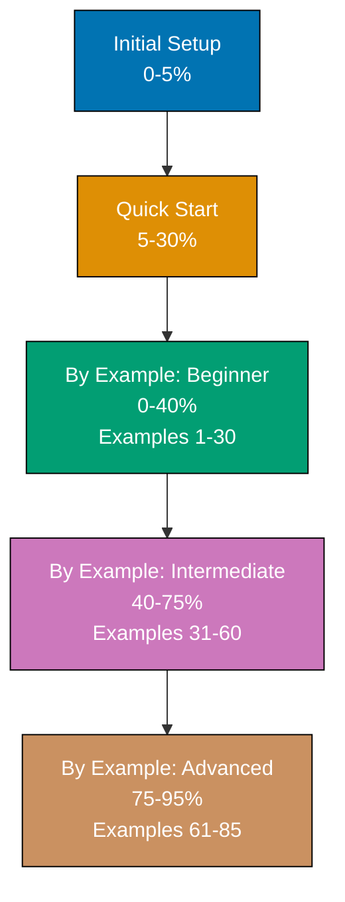

**Learn the Claude Code CLI by doing.** This by-example tutorial teaches the `claude` command - the AI coding assistant you control from the terminal - through 85 heavily annotated, self-contained examples achieving 95% coverage. Master interactive usage, non-interactive automation (`-p` flag), npm scripts, git hooks, GitHub Actions, and custom agent patterns.

## What is By Example?

By Example is a **code-first learning approach** designed for experienced developers who want to master Claude Code efficiently. Instead of lengthy explanations followed by examples, you'll see complete, runnable command sequences with inline annotations explaining what each interaction does and why it matters.

**Target audience**: Developers with command-line experience who want to integrate AI assistance into their workflow and understand Claude Code's full capabilities.

## How This Tutorial Works

### Structure

- **[Beginner](/en/learn/software-engineering/automation-tools/claude-code/by-example/beginner)** (Examples 1-30): `claude` command fundamentals, interactive mode, print mode (`-p`), npm scripts, git hooks - 0-40% coverage
- **[Intermediate](/en/learn/software-engineering/automation-tools/claude-code/by-example/intermediate)** (Examples 31-60): GitHub Actions, CI/CD pipelines, multi-language subprocess integration (Python/Node/Java/Go) - 40-75% coverage
- **[Advanced](/en/learn/software-engineering/automation-tools/claude-code/by-example/advanced)** (Examples 61-85): Custom agents (`--agents`), MCP servers, production orchestration, configuration management - 75-95% coverage

### Example Format

Each example follows a five-part structure:

1. **Brief explanation** (2-3 sentences) - What is this pattern and why does it matter?
2. **Diagram** (when appropriate) - Visual representation of workflow or interaction
3. **Heavily annotated commands/code** - Complete, runnable examples with inline `# =>` annotations
4. **Key takeaway** (1-2 sentences) - The essential insight distilled
5. **Why it matters** (50-100 words) - Production relevance and real-world impact

### Example: Annotation Style

```bash
# Start interactive session
claude                              # => Launches Claude Code CLI
                                    # => Enters conversation mode
                                    # => Ready to accept natural language prompts

# Ask for code generation
You: Create a Python function to validate email addresses
                                    # => Claude Code analyzes request
                                    # => Generates function with regex validation
                                    # => Offers to explain or create tests

# Review generated code
                                    # => Claude Code shows complete function
                                    # => Includes imports, docstring, examples
                                    # => Asks for confirmation before writing

# Accept and write file
You: Yes, write it to utils/validation.py
                                    # => Creates utils/ directory if needed
                                    # => Writes function to file
                                    # => Updates project index
                                    # => Confirms completion
```

## What You'll Learn

### Coverage: 95% of Claude Code for Production Work

**Included**:

- Core commands (interactive mode, file operations, status checks)
- Conversation patterns (asking questions, refining requests, context management)
- Code generation (functions, classes, modules, tests)
- File operations (read, write, edit, search, refactor)
- Terminal integration (running commands, interpreting output)
- Workflow patterns (debugging, refactoring, documentation)
- Multi-file operations (codebase analysis, coordinated changes)
- Advanced prompting (context injection, style guides, constraints)
- Error handling (understanding failures, iteration strategies)
- Best practices (security, performance, maintainability)

**Excluded (the 5% edge cases)**:

- Rarely-used configuration options
- Platform-specific advanced features
- Internal API implementation details
- Experimental or deprecated features

## Self-Contained Examples

**Every example is copy-paste-runnable.** Each example includes:

- Complete command sequences
- All necessary context and setup
- Expected outputs and responses
- No references to previous examples (you can start anywhere)

**Example independence**: You can jump to Example 42, copy the commands, run them, and understand the pattern without reading Examples 1-41.

## Why Command-First?

Traditional tutorials explain concepts, then show commands. By Example inverts this:

1. **See the commands first** - Complete, working interaction
2. **Run it immediately** - Verify it works in your environment
3. **Read annotations** - Understand what each step does
4. **Absorb the pattern** - Internalize through direct interaction

**Benefits**:

- **Faster learning** - No walls of text before seeing actual commands
- **Immediate verification** - Run commands to confirm understanding
- **Reference-friendly** - Come back later to find specific patterns
- **Production-focused** - Examples use real-world workflows, not toy scenarios

## How to Use This Tutorial

### If You're New to AI Coding Tools

Start with [Quick Start](/en/learn/software-engineering/automation-tools/claude-code/quick-start) first, then return to By Example for comprehensive coverage.

### If You Know Command-Line Tools

Jump straight into **Beginner** examples. You'll recognize command patterns but see AI-specific workflows and best practices.

### If You've Used AI Assistants Before

Start with **Intermediate** or **Advanced** based on your comfort level. Each example is self-contained, so you won't get lost.

### As a Reference

Use the example index to find specific topics (e.g., "How do I debug with Claude Code?" → Example 47).

## Comparison to Narrative Tutorials

| Aspect               | By Example (This Tutorial)         | Narrative Tutorial                  |
| -------------------- | ---------------------------------- | ----------------------------------- |
| **Approach**         | Command-first (show, then explain) | Explanation-first (tell, then show) |
| **Target Audience**  | Experienced developers             | Beginners and intermediate          |
| **Coverage**         | 95% (comprehensive)                | 60-85% (focused depth)              |
| **Example Count**    | 85 examples                        | 15-30 examples                      |
| **Learning Style**   | Run commands, understand output    | Read explanation, see examples      |
| **Use as Reference** | Excellent (self-contained)         | Moderate (sequential narrative)     |

**Both are valid approaches.** Choose based on your learning style and experience level.

## Diagrams and Visualizations

Approximately 40% of examples include Mermaid diagrams visualizing:

- Conversation flow (user request → AI response → file operation)
- Multi-file refactoring workflows
- Context management and indexing
- Error handling and iteration patterns
- Workflow optimization strategies

All diagrams use a color-blind friendly palette (Blue #0173B2, Orange #DE8F05, Teal #029E73, Purple #CC78BC, Brown #CA9161) meeting WCAG AA accessibility standards.

## Prerequisites

- **Claude Code installed and configured** - See [Initial Setup](/en/learn/software-engineering/automation-tools/claude-code/initial-setup)
- **Command-line experience** - Comfortable using terminal, running commands
- **Programming knowledge** - Familiarity with at least one programming language
- **Git basics** - Understanding version control for experimentation

**No prior AI coding experience required** - Examples start from fundamentals.

## Learning Path


```mermaid
%% Color Palette: Blue #0173B2, Orange #DE8F05, Teal #029E73, Purple #CC78BC, Brown #CA9161
graph TD
    A["Initial Setup<br/>0-5%"]
    B["Quick Start<br/>5-30%"]
    C["By Example: Beginner<br/>0-40%<br/>Examples 1-30"]
    D["By Example: Intermediate<br/>40-75%<br/>Examples 31-60"]
    E["By Example: Advanced<br/>75-95%<br/>Examples 61-85"]

    A --> B
    B --> C
    C --> D
    D --> E

    style A fill:#0173B2,stroke:#000,color:#fff
    style B fill:#DE8F05,stroke:#000,color:#fff
    style C fill:#029E73,stroke:#000,color:#fff
    style D fill:#CC78BC,stroke:#000,color:#fff
    style E fill:#CA9161,stroke:#000,color:#fff
```

## What's Next?

Ready to start learning? Choose your entry point:

- **New to Claude Code?** → [Beginner Examples (1-30)](/en/learn/software-engineering/automation-tools/claude-code/by-example/beginner)
- **Know the basics?** → [Intermediate Examples (31-60)](/en/learn/software-engineering/automation-tools/claude-code/by-example/intermediate)
- **Experienced with AI tools?** → [Advanced Examples (61-85)](/en/learn/software-engineering/automation-tools/claude-code/by-example/advanced)

## Learning Progression

We measure progress by **coverage depth**, not time:

- **Beginner**: 0-40% coverage through 30 examples (essential commands, basic workflows)
- **Intermediate**: 40-75% coverage through 30 examples (production patterns, advanced features)
- **Advanced**: 75-95% coverage through 25 examples (expert techniques, optimization)

Work at your own pace. Move through examples as you build confidence with each pattern.

## Key Principles

1. **Every example is runnable** - Copy, paste, run, verify
2. **Annotations explain WHY** - Understand the reasoning, not just commands
3. **Self-contained is non-negotiable** - No hunting for context in other examples
4. **Production patterns, not toys** - Real-world workflows you'll actually use
5. **Modern Claude Code** - Latest CLI version, contemporary best practices

## AI-Assisted Development Benefits

Throughout examples, you'll see how Claude Code provides:

- **Speed** - Generate boilerplate and common patterns instantly
- **Understanding** - Explain unfamiliar code in plain language
- **Quality** - Follow best practices automatically
- **Learning** - Discover new patterns and techniques
- **Confidence** - Validate approaches before implementation
- **Efficiency** - Reduce context switching and manual work

## Feedback and Improvements

Found an error? See a better way to use Claude Code? Examples are continuously improved based on user feedback and new Claude Code features.

**Let's start coding with AI!** Choose your level and dive into the examples.

## Examples by Level

### Beginner (Examples 1–30)

- [Example 1: What is Claude Code](/en/learn/software-engineering/automation-tools/claude-code/by-example/beginner#example-1-what-is-claude-code)
- [Example 2: Starting Interactive Session](/en/learn/software-engineering/automation-tools/claude-code/by-example/beginner#example-2-starting-interactive-session)
- [Example 3: Interactive Session with Initial Prompt](/en/learn/software-engineering/automation-tools/claude-code/by-example/beginner#example-3-interactive-session-with-initial-prompt)
- [Example 4: Understanding Claude's Tool Usage](/en/learn/software-engineering/automation-tools/claude-code/by-example/beginner#example-4-understanding-claudes-tool-usage)
- [Example 5: File Operations in Interactive Mode](/en/learn/software-engineering/automation-tools/claude-code/by-example/beginner#example-5-file-operations-in-interactive-mode)
- [Example 6: Exiting and Resuming Sessions](/en/learn/software-engineering/automation-tools/claude-code/by-example/beginner#example-6-exiting-and-resuming-sessions)
- [Example 7: Basic Print Mode (`-p`)](/en/learn/software-engineering/automation-tools/claude-code/by-example/beginner#example-7-basic-print-mode--p)
- [Example 8: Piping Content to Claude](/en/learn/software-engineering/automation-tools/claude-code/by-example/beginner#example-8-piping-content-to-claude)
- [Example 9: Output Formats (text vs json)](/en/learn/software-engineering/automation-tools/claude-code/by-example/beginner#example-9-output-formats-text-vs-json)
- [Example 10: Continuing Conversations Non-Interactively](/en/learn/software-engineering/automation-tools/claude-code/by-example/beginner#example-10-continuing-conversations-non-interactively)
- [Example 11: JSON Output Parsing in Scripts](/en/learn/software-engineering/automation-tools/claude-code/by-example/beginner#example-11-json-output-parsing-in-scripts)
- [Example 12: Session Management in Automation](/en/learn/software-engineering/automation-tools/claude-code/by-example/beginner#example-12-session-management-in-automation)
- [Example 13: npm Script Calling Claude for Code Generation](/en/learn/software-engineering/automation-tools/claude-code/by-example/beginner#example-13-npm-script-calling-claude-for-code-generation)
- [Example 14: npm Script for Documentation Generation](/en/learn/software-engineering/automation-tools/claude-code/by-example/beginner#example-14-npm-script-for-documentation-generation)
- [Example 15: npm Script with Environment Variables](/en/learn/software-engineering/automation-tools/claude-code/by-example/beginner#example-15-npm-script-with-environment-variables)
- [Example 16: npm Script Error Handling](/en/learn/software-engineering/automation-tools/claude-code/by-example/beginner#example-16-npm-script-error-handling)
- [Example 17: npm Script Chaining Multiple Claude Commands](/en/learn/software-engineering/automation-tools/claude-code/by-example/beginner#example-17-npm-script-chaining-multiple-claude-commands)
- [Example 18: npm Script Output Capture and Processing](/en/learn/software-engineering/automation-tools/claude-code/by-example/beginner#example-18-npm-script-output-capture-and-processing)
- [Example 19: Pre-commit Hook Using Claude for Validation](/en/learn/software-engineering/automation-tools/claude-code/by-example/beginner#example-19-pre-commit-hook-using-claude-for-validation)
- [Example 20: Pre-push Hook Using Claude for Code Review](/en/learn/software-engineering/automation-tools/claude-code/by-example/beginner#example-20-pre-push-hook-using-claude-for-code-review)
- [Example 21: Managing Conversation History](/en/learn/software-engineering/automation-tools/claude-code/by-example/beginner#example-21-managing-conversation-history)
- [Example 22: Asking Follow-Up Questions](/en/learn/software-engineering/automation-tools/claude-code/by-example/beginner#example-22-asking-follow-up-questions)
- [Example 23: Canceling Operations](/en/learn/software-engineering/automation-tools/claude-code/by-example/beginner#example-23-canceling-operations)
- [Example 24: Checking Project Status](/en/learn/software-engineering/automation-tools/claude-code/by-example/beginner#example-24-checking-project-status)
- [Example 25: Clearing Context for Fresh Start](/en/learn/software-engineering/automation-tools/claude-code/by-example/beginner#example-25-clearing-context-for-fresh-start)
- [Example 26: Basic Refactoring - Extract Variable](/en/learn/software-engineering/automation-tools/claude-code/by-example/beginner#example-26-basic-refactoring---extract-variable)
- [Example 27: Adding Error Handling](/en/learn/software-engineering/automation-tools/claude-code/by-example/beginner#example-27-adding-error-handling)
- [Example 28: Generating README Files](/en/learn/software-engineering/automation-tools/claude-code/by-example/beginner#example-28-generating-readme-files)
- [Example 29: Creating .gitignore Files](/en/learn/software-engineering/automation-tools/claude-code/by-example/beginner#example-29-creating-gitignore-files)
- [Example 30: Exiting Claude Sessions](/en/learn/software-engineering/automation-tools/claude-code/by-example/beginner#example-30-exiting-claude-sessions)

### Intermediate (Examples 31–60)

- [Example 31: Basic GitHub Actions Workflow with Claude](/en/learn/software-engineering/automation-tools/claude-code/by-example/intermediate#example-31-basic-github-actions-workflow-with-claude)
- [Example 32: Matrix Strategy with Claude - Testing Across Node Versions](/en/learn/software-engineering/automation-tools/claude-code/by-example/intermediate#example-32-matrix-strategy-with-claude---testing-across-node-versions)
- [Example 33: Artifact Generation in CI/CD](/en/learn/software-engineering/automation-tools/claude-code/by-example/intermediate#example-33-artifact-generation-in-cicd)
- [Example 34: Secret Management for Claude API Keys](/en/learn/software-engineering/automation-tools/claude-code/by-example/intermediate#example-34-secret-management-for-claude-api-keys)
- [Example 35: Conditional Workflow Execution](/en/learn/software-engineering/automation-tools/claude-code/by-example/intermediate#example-35-conditional-workflow-execution)
- [Example 36: Multi-Stage Pipeline (Lint → Test → Claude Analysis → Deploy)](/en/learn/software-engineering/automation-tools/claude-code/by-example/intermediate#example-36-multi-stage-pipeline-lint--test--claude-analysis--deploy)
- [Example 37: PR Comment Generation with Claude](/en/learn/software-engineering/automation-tools/claude-code/by-example/intermediate#example-37-pr-comment-generation-with-claude)
- [Example 38: Release Notes Automation](/en/learn/software-engineering/automation-tools/claude-code/by-example/intermediate#example-38-release-notes-automation)
- [Example 39: Deployment Approval Gates with Claude Risk Assessment](/en/learn/software-engineering/automation-tools/claude-code/by-example/intermediate#example-39-deployment-approval-gates-with-claude-risk-assessment)
- [Example 40: Automated Rollback with Claude Failure Detection](/en/learn/software-engineering/automation-tools/claude-code/by-example/intermediate#example-40-automated-rollback-with-claude-failure-detection)
- [Example 41: Python Subprocess Calling Claude](/en/learn/software-engineering/automation-tools/claude-code/by-example/intermediate#example-41-python-subprocess-calling-claude)
- [Example 42: Node.js Child Process with Claude](/en/learn/software-engineering/automation-tools/claude-code/by-example/intermediate#example-42-nodejs-child-process-with-claude)
- [Example 43: Java ProcessBuilder with Claude](/en/learn/software-engineering/automation-tools/claude-code/by-example/intermediate#example-43-java-processbuilder-with-claude)
- [Example 44: Go exec.Command with Claude](/en/learn/software-engineering/automation-tools/claude-code/by-example/intermediate#example-44-go-execcommand-with-claude)
- [Example 45: Advanced Piping - Multi-Stage Claude Processing](/en/learn/software-engineering/automation-tools/claude-code/by-example/intermediate#example-45-advanced-piping---multi-stage-claude-processing)
- [Example 46: Async/Await Migration from Callbacks](/en/learn/software-engineering/automation-tools/claude-code/by-example/intermediate#example-46-asyncawait-migration-from-callbacks)
- [Example 47: Error Handling Pattern Standardization](/en/learn/software-engineering/automation-tools/claude-code/by-example/intermediate#example-47-error-handling-pattern-standardization)
- [Example 48: Configuration Extraction and Environment Variables](/en/learn/software-engineering/automation-tools/claude-code/by-example/intermediate#example-48-configuration-extraction-and-environment-variables)
- [Example 49: Design Pattern Implementation - Strategy Pattern](/en/learn/software-engineering/automation-tools/claude-code/by-example/intermediate#example-49-design-pattern-implementation---strategy-pattern)
- [Example 50: Dead Code Elimination](/en/learn/software-engineering/automation-tools/claude-code/by-example/intermediate#example-50-dead-code-elimination)
- [Example 51: Automated Git Workflow - Branch Creation and Commits](/en/learn/software-engineering/automation-tools/claude-code/by-example/intermediate#example-51-automated-git-workflow---branch-creation-and-commits)
- [Example 52: Commit Message Generation from Changes](/en/learn/software-engineering/automation-tools/claude-code/by-example/intermediate#example-52-commit-message-generation-from-changes)
- [Example 53: Pull Request Description Generation](/en/learn/software-engineering/automation-tools/claude-code/by-example/intermediate#example-53-pull-request-description-generation)
- [Example 54: Merge Conflict Resolution Assistance](/en/learn/software-engineering/automation-tools/claude-code/by-example/intermediate#example-54-merge-conflict-resolution-assistance)
- [Example 55: CI/CD Configuration Generation](/en/learn/software-engineering/automation-tools/claude-code/by-example/intermediate#example-55-cicd-configuration-generation)
- [Example 56: Automated API Documentation Generation](/en/learn/software-engineering/automation-tools/claude-code/by-example/intermediate#example-56-automated-api-documentation-generation)
- [Example 57: Architecture Diagram Generation with Mermaid](/en/learn/software-engineering/automation-tools/claude-code/by-example/intermediate#example-57-architecture-diagram-generation-with-mermaid)
- [Example 58: Code Comment and Docstring Addition](/en/learn/software-engineering/automation-tools/claude-code/by-example/intermediate#example-58-code-comment-and-docstring-addition)
- [Example 59: Performance Optimization Suggestions](/en/learn/software-engineering/automation-tools/claude-code/by-example/intermediate#example-59-performance-optimization-suggestions)
- [Example 60: Accessibility Audit and Improvements](/en/learn/software-engineering/automation-tools/claude-code/by-example/intermediate#example-60-accessibility-audit-and-improvements)

### Advanced (Examples 61–85)

- [Example 61: Defining Custom Agents with --agents JSON](/en/learn/software-engineering/automation-tools/claude-code/by-example/advanced#example-61-defining-custom-agents-with---agents-json)
- [Example 62: Subagent Delegation Patterns](/en/learn/software-engineering/automation-tools/claude-code/by-example/advanced#example-62-subagent-delegation-patterns)
- [Example 63: MCP Server Integration (--mcp-config)](/en/learn/software-engineering/automation-tools/claude-code/by-example/advanced#example-63-mcp-server-integration---mcp-config)
- [Example 64: System Prompt Customization (--system-prompt, --append-system-prompt)](/en/learn/software-engineering/automation-tools/claude-code/by-example/advanced#example-64-system-prompt-customization---system-prompt---append-system-prompt)
- [Example 65: Tool Restriction and Permission Control](/en/learn/software-engineering/automation-tools/claude-code/by-example/advanced#example-65-tool-restriction-and-permission-control)
- [Example 66: Complex Multi-Agent Workflows](/en/learn/software-engineering/automation-tools/claude-code/by-example/advanced#example-66-complex-multi-agent-workflows)
- [Example 67: Session Forking for Parallel Experiments](/en/learn/software-engineering/automation-tools/claude-code/by-example/advanced#example-67-session-forking-for-parallel-experiments)
- [Example 68: Production Monitoring with Claude](/en/learn/software-engineering/automation-tools/claude-code/by-example/advanced#example-68-production-monitoring-with-claude)
- [Example 69: Error Recovery Patterns in Automation](/en/learn/software-engineering/automation-tools/claude-code/by-example/advanced#example-69-error-recovery-patterns-in-automation)
- [Example 70: Advanced Configuration Management for Production](/en/learn/software-engineering/automation-tools/claude-code/by-example/advanced#example-70-advanced-configuration-management-for-production)
- [Example 71: Docker Optimization for Multi-Stage Builds](/en/learn/software-engineering/automation-tools/claude-code/by-example/advanced#example-71-docker-optimization-for-multi-stage-builds)
- [Example 72: Kubernetes Manifest Generation](/en/learn/software-engineering/automation-tools/claude-code/by-example/advanced#example-72-kubernetes-manifest-generation)
- [Example 73: CI/CD Pipeline Optimization](/en/learn/software-engineering/automation-tools/claude-code/by-example/advanced#example-73-cicd-pipeline-optimization)
- [Example 74: Infrastructure as Code with Terraform](/en/learn/software-engineering/automation-tools/claude-code/by-example/advanced#example-74-infrastructure-as-code-with-terraform)
- [Example 75: Advanced Testing - Property-Based Testing](/en/learn/software-engineering/automation-tools/claude-code/by-example/advanced#example-75-advanced-testing---property-based-testing)
- [Example 76: Custom Agent Configuration for Project-Specific Workflows](/en/learn/software-engineering/automation-tools/claude-code/by-example/advanced#example-76-custom-agent-configuration-for-project-specific-workflows)
- [Example 77: Code Metrics and Quality Gates](/en/learn/software-engineering/automation-tools/claude-code/by-example/advanced#example-77-code-metrics-and-quality-gates)
- [Example 78: Security Audit Automation](/en/learn/software-engineering/automation-tools/claude-code/by-example/advanced#example-78-security-audit-automation)
- [Example 79: Compliance Checking - Licensing and Standards](/en/learn/software-engineering/automation-tools/claude-code/by-example/advanced#example-79-compliance-checking---licensing-and-standards)
- [Example 80: Team Collaboration Patterns - Shared Context Documents](/en/learn/software-engineering/automation-tools/claude-code/by-example/advanced#example-80-team-collaboration-patterns---shared-context-documents)
- [Example 81: Performance Profiling Integration](/en/learn/software-engineering/automation-tools/claude-code/by-example/advanced#example-81-performance-profiling-integration)
- [Example 82: API Versioning Strategies for Microservices](/en/learn/software-engineering/automation-tools/claude-code/by-example/advanced#example-82-api-versioning-strategies-for-microservices)
- [Example 83: Custom Linting Rules Generation](/en/learn/software-engineering/automation-tools/claude-code/by-example/advanced#example-83-custom-linting-rules-generation)
- [Example 84: Automated Release Notes Generation](/en/learn/software-engineering/automation-tools/claude-code/by-example/advanced#example-84-automated-release-notes-generation)
- [Example 85: Advanced Configuration and Customization - Monorepo Workspace Setup](/en/learn/software-engineering/automation-tools/claude-code/by-example/advanced#example-85-advanced-configuration-and-customization---monorepo-workspace-setup)
