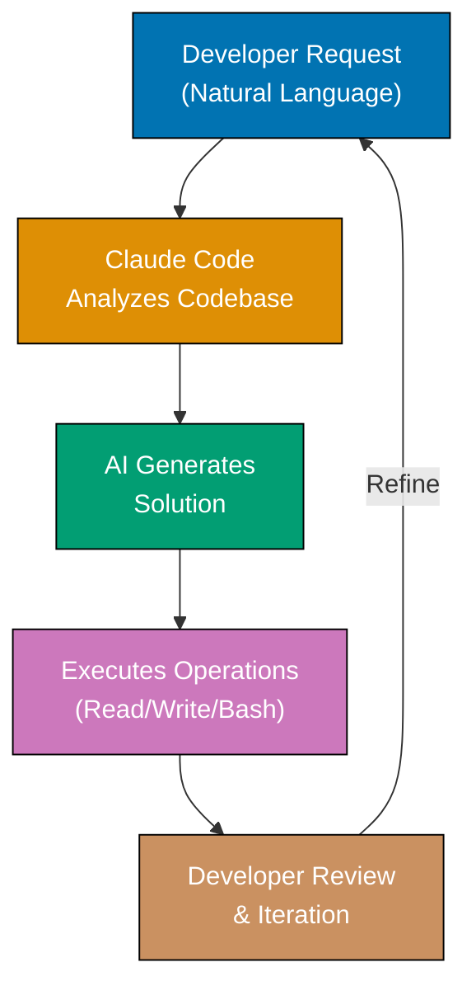
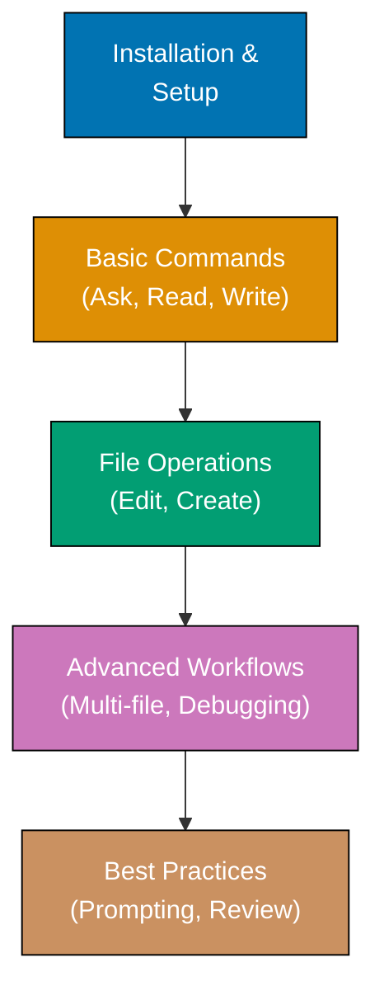

**Claude Code is Anthropic's AI-powered coding assistant that understands entire codebases.** Unlike simple code completion tools, Claude Code reads your project files, understands context, and helps you write, explain, refactor, and debug code through natural language conversation.

## What is Claude Code?

Claude Code is a command-line tool that brings Claude AI's capabilities directly into your development workflow. It combines:

- **Deep codebase understanding** - Reads and indexes your entire project
- **Natural language interface** - Describe what you want, get working code
- **File operations** - Creates, reads, edits files with AI assistance
- **Bash integration** - Executes terminal commands when needed
- **Web search** - Looks up current documentation and best practices
- **Context awareness** - Remembers conversation history for multi-step tasks

**Model**: Powered by Claude 3.7 Sonnet (claude-sonnet-4-5-20250929), Anthropic's most capable AI model for coding tasks.

## How Claude Code Works



**Example workflow**:

1. You: "Add a function to validate email addresses"
2. Claude Code: Reads your codebase, understands project patterns
3. Claude Code: Generates function matching your code style
4. Claude Code: Creates or edits appropriate file
5. You: Review, test, iterate if needed

## Core Capabilities

### Code Generation

**Natural language to code** - Describe functionality, get implementation:

- "Create a REST API endpoint for user registration"
- "Add unit tests for the authentication service"
- "Write a database migration to add a users table"

**Pattern matching** - Claude Code learns your project's conventions and generates code that matches your existing style.

### Code Explanation

**Understand complex code** - Ask Claude to explain any code:

- "Explain what this recursive function does"
- "Why is this async function using Promise.all?"
- "What's the purpose of this class decorator?"

**Documentation** - Generate docstrings, comments, and README sections based on code analysis.

### Refactoring

**Improve code quality** - Modernize and optimize implementations:

- "Refactor this class to use composition instead of inheritance"
- "Convert this callback-based code to async/await"
- "Extract this logic into a reusable utility function"

**Safety** - Claude Code understands context and suggests safe refactorings that preserve behavior.

### Debugging

**Find and fix bugs** - Diagnose issues through conversation:

- "Why is this test failing?"
- "Debug the null pointer exception in getUserById"
- "Find race conditions in this concurrent code"

**Root cause analysis** - Claude Code traces through execution flow to identify underlying problems.

### File Operations

**Automated file management** - Create, read, edit, delete files:

- Create new files with boilerplate
- Edit existing files with surgical precision
- Read files to understand context
- Search across codebase for specific patterns

**Multi-file changes** - Coordinate changes across multiple files while maintaining consistency.

### Terminal Integration

**Execute commands** - Claude Code can run terminal commands:

- Install dependencies (`npm install`, `pip install`)
- Run tests (`pytest`, `npm test`)
- Git operations (`git commit`, `git push`)
- Build scripts (`npm run build`, `cargo build`)

**Output interpretation** - Reads command output and suggests fixes for errors.

## Why Claude Code?

Traditional coding requires switching between:

- Code editor (writing code)
- Documentation websites (looking up APIs)
- Stack Overflow (finding solutions)
- Terminal (running commands)
- Git (version control)

**Claude Code consolidates these workflows**:

1. **Single interface** - Natural language conversation covers all tasks
2. **Context retention** - Remembers previous interactions
3. **Proactive assistance** - Suggests improvements and best practices
4. **Learning your codebase** - Understands project-specific patterns

**Benefits**:

- **Faster development** - Generate boilerplate and common patterns instantly
- **Better understanding** - Explain unfamiliar code in plain language
- **Fewer context switches** - Stay in terminal, let AI handle searches
- **Consistent quality** - AI follows project conventions automatically
- **Reduced cognitive load** - Offload routine tasks to AI

## Key Principles

### AI as Pair Programmer

**Claude Code is your pair programming partner** - It assists, suggests, and explains, but you remain in control:

- You decide what to build
- Claude Code suggests how to build it
- You review and approve all changes
- Claude Code learns from your feedback

### Codebase Awareness

**Context is everything** - Claude Code reads your project to provide relevant suggestions:

- Understands project structure
- Follows existing patterns
- Suggests appropriate libraries already in use
- Maintains consistency with existing code

### Iterative Refinement

**Perfect on first try is rare** - Claude Code supports iteration:

- Initial implementation based on request
- Review and feedback
- Refinement and improvement
- Multiple rounds until satisfied

### Tool Integration

**Leverages existing tools** - Claude Code doesn't replace your development environment:

- Works with your code editor (VS Code, Vim, etc.)
- Integrates with version control (Git)
- Uses your build tools (npm, cargo, gradle)
- Respects your linters and formatters

## Use Cases

### Rapid Prototyping

**Build MVPs quickly**:

- Generate API endpoints, database schemas, and frontend components
- Scaffold complete features from descriptions
- Iterate based on feedback without manual rewrites

**Example**: "Create a todo list API with CRUD operations and PostgreSQL"

### Learning New Technologies

**Understand unfamiliar code**:

- Ask Claude to explain framework-specific patterns
- Generate examples of library usage
- Understand legacy code in new projects

**Example**: "Explain how React hooks work in this component"

### Code Maintenance

**Improve existing codebases**:

- Refactor legacy code to modern patterns
- Add missing tests
- Update deprecated API usage
- Fix security vulnerabilities

**Example**: "Update this code to use the latest Axios API"

### Documentation

**Generate and maintain docs**:

- Write docstrings for functions
- Create README sections
- Generate API documentation
- Add inline comments explaining complex logic

**Example**: "Add JSDoc comments to all public methods in this file"

### Test Generation

**Automate test writing**:

- Generate unit tests for existing functions
- Create integration tests for API endpoints
- Write E2E tests for user flows
- Add edge case coverage

**Example**: "Generate pytest tests for the user authentication module"

## Comparison: Claude Code vs. Other Tools

| Feature                  | Claude Code           | GitHub Copilot    | ChatGPT           |
| ------------------------ | --------------------- | ----------------- | ----------------- |
| **Codebase Awareness**   | Full project indexing | Current file only | No code access    |
| **File Operations**      | Creates/edits files   | Suggestions only  | No file access    |
| **Terminal Integration** | Runs commands         | No                | No                |
| **Conversation Memory**  | Multi-turn context    | Limited           | Yes (in chat)     |
| **Natural Language**     | Full conversations    | Code completion   | Yes               |
| **Offline Mode**         | No (API required)     | Limited           | No (API required) |
| **Model**                | Claude 3.7 Sonnet     | GPT-4 Turbo       | GPT-4             |

**Choose Claude Code when**:

- You need to understand large codebases
- You want AI to perform file operations
- You prefer conversational workflows
- You need context across multiple files

**Choose GitHub Copilot when**:

- You want inline code completion in editor
- You prefer quick suggestions over conversations
- You work in single files at a time

**Choose ChatGPT when**:

- You need general programming help
- You're learning concepts, not coding
- You want to discuss architecture without code access

## Prerequisites

Before using Claude Code, ensure you have:

- **Anthropic API access** - Claude Code requires API authentication
- **Node.js** (recommended) - For JavaScript/TypeScript projects
- **Terminal skills** - Comfort running CLI commands
- **Git knowledge** - Basic version control operations
- **Code editor** - VS Code, Vim, or your preferred editor

**No prior AI experience required** - Claude Code is designed for developers of all backgrounds.

## Learning Path



## What You'll Learn

This section provides comprehensive tutorials on using Claude Code:

### Installation and Setup

- Installing Claude Code CLI
- API authentication and configuration
- Project initialization
- Basic configuration options

### Basic Usage

- Starting conversations
- Asking questions about code
- Generating simple functions
- Reading and understanding code

### File Operations

- Creating new files
- Editing existing files
- Multi-file operations
- Search and replace patterns

### Advanced Workflows

- Refactoring large codebases
- Debugging complex issues
- Test generation
- Documentation automation

### Best Practices

- Writing effective prompts
- Reviewing AI-generated code
- Managing conversation context
- Security considerations

## Example Session

Here's a typical Claude Code interaction:

```bash
$ claude

You: Add a function to validate email addresses in utils/validation.js

Claude Code: I'll create a robust email validation function. Let me read the
existing utils/validation.js file first.

[Reads file]

I see you're using regex for phone validation. I'll add an email validator
with similar style:

[Shows generated code]

export function isValidEmail(email) {
  const emailRegex = /^[^\s@]+@[^\s@]+\.[^\s@]+$/;
  return emailRegex.test(email);
}

Should I add this to utils/validation.js?

You: Yes, and add JSDoc comments

Claude Code: [Updates file with commented function]

Done! The isValidEmail function is now in utils/validation.js with JSDoc
documentation. Would you like me to generate unit tests for it?

You: Yes, using Jest

Claude Code: [Creates tests in utils/__tests__/validation.test.js]

Created 5 test cases covering:
- Valid email formats
- Invalid formats (missing @, missing domain, etc.)
- Edge cases (empty string, null, undefined)

Run tests with: npm test validation.test.js
```

## What's Next?

Ready to start using Claude Code?

- **New users** → Coming soon: Initial Setup
- **Quick start** → Coming soon: Quick Start Tutorial
- **Code-first learning** → Coming soon: By Example (75+ examples)

## Current Status

**Documentation in progress** - Claude Code tutorials are being developed:

- ✅ Overview (this page)
- 🚧 Initial Setup - Coming soon
- 🚧 Quick Start - Coming soon
- 🚧 By Example - Coming soon

## Feedback and Improvements

Claude Code is actively developed by Anthropic. Content will be updated as new features are released and based on learner feedback.

**Let's start coding with AI!** Claude Code brings the power of Claude AI directly into your development workflow.
