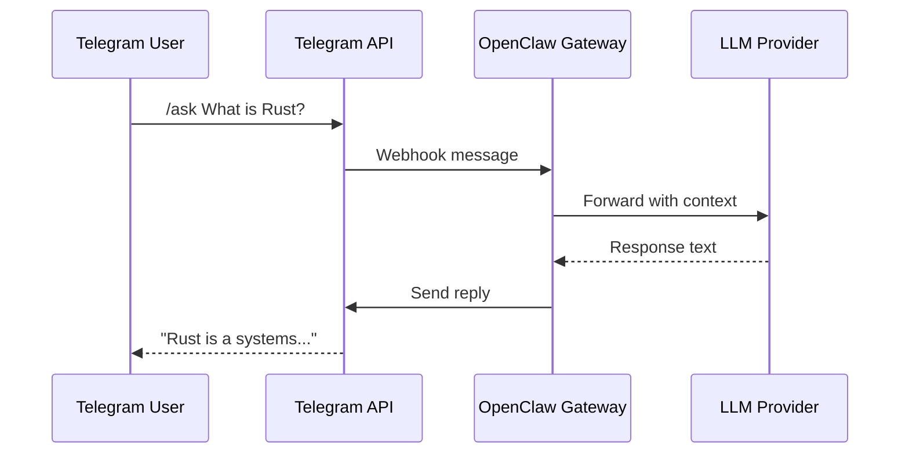
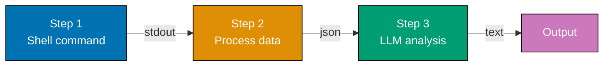
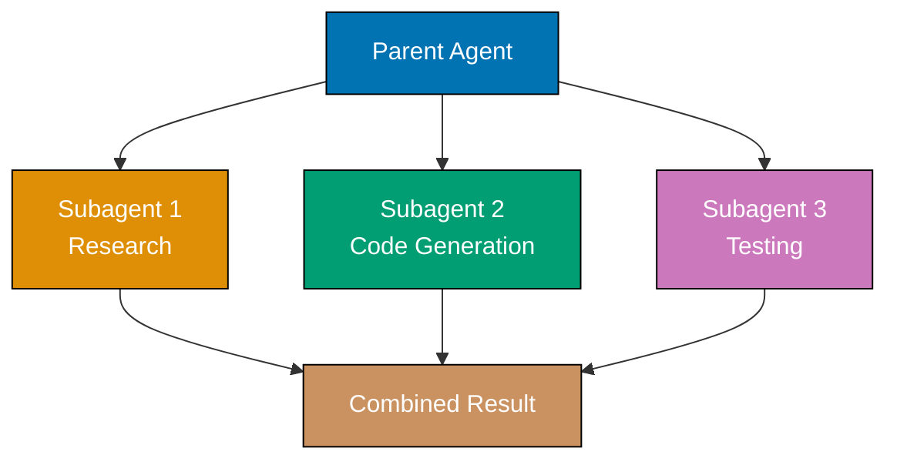

This tutorial provides 27 intermediate examples covering OpenClaw's channel integrations (Examples 28-34), advanced skill patterns (Examples 35-40), session management (Examples 41-44), Lobster workflow engine (Examples 45-51), and multi-agent patterns (Examples 52-54).

## Channel Integration (Examples 28-34)

### Example 28: Telegram Channel Setup

Telegram is the most common channel for OpenClaw. Configuration requires a bot token from BotFather and a channel entry in `openclaw.json`. The gateway connects to Telegram's API and routes messages to the LLM.



**Configuration**:

```json5
// ~/.openclaw/openclaw.json
{
  channels: {
    telegram: {
      enabled: true, // => Activates Telegram channel
      // => Gateway connects on start
      botToken: "${TELEGRAM_BOT_TOKEN}",
      // => From @BotFather on Telegram
      // => Format: "123456789:ABCdefGHIjklMNO..."
      dmPolicy: "pairing", // => "pairing": requires user approval
      // => "open": anyone can DM the bot
      // => "closed": DMs disabled
      allowFrom: [
        "tg:123456789", // => Whitelist by Telegram user ID
        // => Only these users can interact
        "tg:987654321", // => Multiple users supported
      ],
    },
  },
}
```

```bash
openclaw gateway restart                # => Reconnects with Telegram config
                                        # => Output: "Telegram channel connected"
                                        # => Bot now responds to allowed users
```

**Key Takeaway**: Configure Telegram with a BotFather token, set `dmPolicy` for access control, and whitelist users with `allowFrom`. Restart the gateway after channel config changes.

**Why It Matters**: Telegram's lightweight clients (mobile + desktop) make it the fastest path from "idea" to "AI interaction" — message your bot from your phone while commuting, and it executes tasks on your home server. The `pairing` DM policy prevents random Telegram users from consuming your API tokens if they discover your bot's username. The `allowFrom` whitelist adds a second layer: even paired users must be in the list, implementing defense-in-depth for access control.

### Example 29: Slack Channel Setup

Slack integration lets the agent respond in workspace channels and DMs. Requires a Slack app with bot token and appropriate OAuth scopes.

```json5
// ~/.openclaw/openclaw.json
{
  channels: {
    slack: {
      enabled: true, // => Activates Slack channel
      botToken: "${SLACK_BOT_TOKEN}", // => From Slack App settings
      // => Starts with "xoxb-"
      // => Requires scopes: chat:write, channels:history
      appToken: "${SLACK_APP_TOKEN}", // => Socket mode token
      // => Starts with "xapp-"
      // => Enables WebSocket connection (no public URL needed)
      activation: "mention", // => "mention": responds when @mentioned
      // => "always": responds to every message in channel
      // => "mention" recommended for shared channels
      allowChannels: [
        "#dev-ai", // => Only respond in these channels
        "#ops-alerts", // => Prevents noise in unrelated channels
      ],
    },
  },
}
```

**Key Takeaway**: Slack requires both `botToken` (xoxb) and `appToken` (xapp) for Socket Mode. Use `activation: "mention"` in shared channels to avoid responding to every message.

**Why It Matters**: Slack is where most engineering teams already live — integrating OpenClaw there puts AI assistance in the same flow as code reviews, incident response, and standup discussions. Socket Mode (via `appToken`) eliminates the need for a public URL or ngrok tunnel, making local development seamless. The `activation: "mention"` pattern prevents the bot from hijacking conversations — it only speaks when spoken to, maintaining channel signal-to-noise ratio that teams fiercely protect.

### Example 30: Discord Channel Setup

Discord integration connects OpenClaw to a Discord server. Configuration requires a bot token from the Discord Developer Portal and guild (server) permissions.

```json5
// ~/.openclaw/openclaw.json
{
  channels: {
    discord: {
      enabled: true, // => Activates Discord channel
      botToken: "${DISCORD_BOT_TOKEN}", // => From Discord Developer Portal
      // => Bot > Token section
      activation: "mention", // => Responds when @mentioned
      // => "always" for dedicated bot channels
      allowGuilds: [
        "1234567890", // => Discord server (guild) ID
        // => Restricts bot to specific servers
      ],
      allowChannels: [
        "ai-assistant", // => Channel names (not IDs) where bot responds
        "dev-help", // => Ignored in other channels even if mentioned
      ],
    },
  },
}
```

**Key Takeaway**: Discord uses `botToken` from the Developer Portal. Restrict access with `allowGuilds` (server-level) and `allowChannels` (channel-level).

**Why It Matters**: Discord communities (open-source projects, developer groups, gaming teams) benefit from always-available AI assistance without building custom bots. OpenClaw's Discord channel provides the same LLM capabilities as Telegram or Slack with Discord-native features — thread replies, embed formatting, and role-based access. Open-source maintainers use it to answer community questions automatically, reducing maintainer burden while keeping response times under minutes instead of hours.

### Example 31: WhatsApp Channel Setup

WhatsApp integration requires the WhatsApp Business API (via Meta Cloud API or a local bridge). This channel enables personal or business AI assistants on the world's most popular messaging platform.

```json5
// ~/.openclaw/openclaw.json
{
  channels: {
    whatsapp: {
      enabled: true, // => Activates WhatsApp channel
      provider: "meta-cloud", // => "meta-cloud": Meta's official Cloud API
      // => "whatsapp-web": local browser bridge (unofficial)
      phoneNumberId: "${WA_PHONE_ID}", // => From Meta Business Suite
      accessToken: "${WA_ACCESS_TOKEN}", // => Meta Cloud API access token
      verifyToken: "${WA_VERIFY_TOKEN}", // => Webhook verification token (you choose)
      webhookUrl: "https://your-domain.com/webhook/whatsapp",
      // => Public URL for Meta to send messages to
      // => Requires HTTPS (use ngrok for development)
      allowFrom: [
        "+1234567890", // => Phone numbers allowed to interact
        "+0987654321", // => E.164 format required
      ],
    },
  },
}
```

**Key Takeaway**: WhatsApp requires either Meta Cloud API (official, needs business account) or a local web bridge (unofficial). Set `allowFrom` with phone numbers in E.164 format.

**Why It Matters**: WhatsApp has 2.7 billion active users — more than Telegram, Slack, and Discord combined. For businesses in regions where WhatsApp dominates communication (Latin America, South Asia, Europe), an AI assistant on WhatsApp meets users where they already are. Customer service teams deploy OpenClaw on WhatsApp to handle first-line queries (order status, FAQs, scheduling) before escalating to humans, reducing response time from hours to seconds while keeping the familiar WhatsApp experience.

### Example 32: Signal Channel Setup

Signal integration provides end-to-end encrypted AI assistance. Uses the `signal-cli` bridge to connect OpenClaw to Signal's protocol without compromising encryption.

```json5
// ~/.openclaw/openclaw.json
{
  channels: {
    signal: {
      enabled: true, // => Activates Signal channel
      signalCliBin: "/usr/local/bin/signal-cli",
      // => Path to signal-cli binary
      // => Install: brew install signal-cli (macOS)
      phoneNumber: "+1234567890", // => Signal phone number for the bot
      // => Must be registered with Signal
      allowFrom: [
        "+0987654321", // => Allowed contacts (E.164 format)
      ],
    },
  },
}
```

```bash
# Register signal-cli first (one-time setup):
signal-cli -u +1234567890 register     # => Sends verification SMS
signal-cli -u +1234567890 verify 123456 # => Completes registration
openclaw gateway restart                # => Connects to Signal via signal-cli
```

**Key Takeaway**: Signal requires `signal-cli` installed and registered separately. OpenClaw bridges through it, maintaining Signal's end-to-end encryption for the messaging layer.

**Why It Matters**: Signal's end-to-end encryption means message content is invisible to anyone except sender and recipient — including Signal's servers. For AI assistants handling sensitive data (medical information, legal consultations, financial details), Signal ensures the transport layer is encrypted. Note that messages are still sent to LLM providers for processing — the encryption covers Telegram-equivalent transit, not the AI processing step. Organizations with strict data handling requirements pair Signal with local models (Ollama) to keep data entirely on-premise.

### Example 33: Channel-Specific Model Overrides

Different channels can use different LLM models. A quick-response Slack channel might use a fast, cheap model while a dedicated analysis channel uses a powerful, expensive one.

```json5
// ~/.openclaw/openclaw.json
{
  agents: {
    defaults: {
      model: {
        primary: "anthropic/claude-sonnet-4-6",
        // => Global default: balanced cost/quality
      },
    },
  },
  channels: {
    telegram: {
      enabled: true,
      botToken: "${TELEGRAM_BOT_TOKEN}",
      model: {
        primary: "anthropic/claude-haiku-4-5",
        // => Override: fast and cheap for Telegram
        // => Good for quick queries on mobile
      },
    },
    slack: {
      enabled: true,
      botToken: "${SLACK_BOT_TOKEN}",
      appToken: "${SLACK_APP_TOKEN}",
      model: {
        primary: "anthropic/claude-opus-4-6",
        // => Override: highest quality for Slack
        // => Team channel gets best model
      },
    },
  },
}
```

**Key Takeaway**: Set `model.primary` inside a channel config to override the global default. Each channel independently selects its LLM model.

**Why It Matters**: LLM costs vary dramatically — Opus costs ~15x more than Haiku per token. Using the same model everywhere either overspends (Opus for "what time is it?") or under-delivers (Haiku for "design a microservice architecture"). Channel-specific models match cost to context: personal Telegram chats use cheap models for casual queries, team Slack channels use powerful models for technical discussions, and automated webhook channels use the cheapest model for high-volume log processing. This per-channel optimization can reduce monthly LLM costs by 60-80% without sacrificing quality where it matters.

### Example 34: Channel Access Control Patterns

Combine `dmPolicy`, `allowFrom`, `activation`, and `allowChannels` to implement fine-grained access control across channels.

```json5
// ~/.openclaw/openclaw.json
{
  channels: {
    // Pattern 1: Private assistant (single user)
    telegram: {
      enabled: true,
      botToken: "${TELEGRAM_BOT_TOKEN}",
      dmPolicy: "closed", // => No new DM conversations allowed
      allowFrom: ["tg:MY_USER_ID"], // => Only your Telegram ID
      // => Maximum restriction: one user only
    },

    // Pattern 2: Team assistant (approved members)
    slack: {
      enabled: true,
      botToken: "${SLACK_BOT_TOKEN}",
      appToken: "${SLACK_APP_TOKEN}",
      activation: "mention", // => Must @mention to activate
      allowChannels: ["#dev-ai"], // => Only responds in specific channel
      // => Team members in channel can use it
    },

    // Pattern 3: Public bot (open access, limited tools)
    discord: {
      enabled: true,
      botToken: "${DISCORD_BOT_TOKEN}",
      activation: "mention", // => Must @mention to activate
      allowGuilds: ["SERVER_ID"], // => Restricted to one server
      // => But anyone in server can use it
    },
  },

  // Complement channel access with tool restrictions
  tools: {
    allow: ["web_search", "web_fetch"], // => Safe tools only for open channels
    deny: ["exec", "group:fs"], // => No shell or file access
    // => Prevents abuse from public channels
  },
}
```

**Key Takeaway**: Layer access controls: `dmPolicy` controls who can start conversations, `allowFrom` whitelists specific users, `activation` controls when the bot responds, and `allowChannels` restricts to specific rooms. Complement with tool restrictions.

**Why It Matters**: Access control failures are the most common OpenClaw security incident — a bot meant for private use gets discovered on Telegram and strangers consume your API quota. Layered controls (channel-level access + tool-level restrictions) implement defense-in-depth: even if an unauthorized user reaches the bot, restricted tools limit damage. The "public bot with safe tools only" pattern enables community-facing bots (FAQ, documentation search) without risking shell access or file system exposure.

## Advanced Skill Patterns (Examples 35-40)

### Example 35: Skills with Context Files

Skills can include additional context files beyond `SKILL.md`. These reference files provide domain knowledge, templates, or data that the agent uses when the skill activates.

```bash
~/.openclaw/workspace/skills/
└── code-review/
    ├── SKILL.md                        # => Main skill instructions
    ├── style-guide.md                  # => Coding standards reference
    ├── review-checklist.md             # => Checklist template
    └── common-issues.md                # => Known anti-patterns database
```

```markdown
# ~/.openclaw/workspace/skills/code-review/SKILL.md

---

name: code_review
description: Reviews code against team coding standards and common issue patterns

---

# Code Review Skill

When reviewing code, reference these files in your workspace:

- **style-guide.md**: Team coding standards (naming, formatting, patterns)
- **review-checklist.md**: Step-by-step review process
- **common-issues.md**: Known anti-patterns to flag

## Process

1. Read the code to review (user provides file or diff)
2. Check against style-guide.md standards
3. Walk through review-checklist.md items
4. Flag any matches from common-issues.md
5. Format findings as actionable review comments # => Agent reads companion files for context # => Files loaded from same skill directory # => Updates to reference files hot-reload
```

**Key Takeaway**: Place companion files (`.md`, `.txt`, `.json`) alongside `SKILL.md` in the skill directory. Reference them by name in instructions. They hot-reload with the skill.

**Why It Matters**: Companion files separate volatile domain knowledge from stable skill logic. The review checklist changes monthly as the team discovers new patterns, but the review process stays the same. Without companion files, every checklist update means editing `SKILL.md` and potentially breaking instructions. With them, a project manager updates `review-checklist.md` without touching agent logic. This separation of concerns mirrors the software architecture principle of decoupling configuration from code.

### Example 36: Conditional Skill Behavior

Skills can define different behaviors for different triggers or contexts. Use markdown headings and conditional language to create branching logic within a single skill.

```markdown
# ~/.openclaw/workspace/skills/deploy/SKILL.md

---

name: deploy_assistant
description: Assists with deployment tasks across staging and production environments
metadata:
openclaw:
commands: - name: deploy-staging
description: Deploy to staging environment - name: deploy-prod
description: Deploy to production (requires confirmation)

---

# Deploy Assistant Skill

## When /deploy-staging is triggered:

1. Run `git status` to check for uncommitted changes
2. Run `npm run build` to create production build
3. Run `npm run deploy:staging` to deploy
4. Report build output and deployment URL # => Staging: no confirmation needed # => Fast feedback loop for testing

## When /deploy-prod is triggered:

1. Run `git status` to check for uncommitted changes
2. **STOP and ask user for explicit confirmation**: "You are about to deploy to PRODUCTION. Type 'confirm' to proceed."
3. Only after receiving "confirm": run `npm run build && npm run deploy:prod`
4. Report build output, deployment URL, and rollback instructions # => Production: mandatory confirmation gate # => Never auto-deploy to production

## Rules

- NEVER deploy to production without explicit user confirmation
- NEVER deploy with uncommitted git changes
- Always show the git diff summary before deploying
```

**Key Takeaway**: Use separate markdown sections with slash commands for different behaviors. Add confirmation gates for dangerous operations like production deployments.

**Why It Matters**: A single skill with branching behavior replaces multiple single-purpose skills, reducing skill proliferation. The confirmation gate for production deployment is a safety pattern — it prevents the catastrophic scenario where a casual "deploy this" in Telegram accidentally pushes untested code to production. By encoding deployment safety into the skill itself (not relying on the user to remember), you make the safe path the default path. This "pit of success" design is how mature DevOps teams prevent deployment incidents.

### Example 37: Skills with Environment Variables

Skills can reference environment variables for configuration that varies between environments — API endpoints, database URLs, service names — without hardcoding values.

```markdown
# ~/.openclaw/workspace/skills/health-monitor/SKILL.md

---

name: health_monitor
description: Monitors service health endpoints and reports status
metadata:
openclaw:
requires:
tools: ["exec", "web_fetch"]
env: ["MONITOR_TARGETS"] # => Skill requires this env var # => Gateway skips skill if var unset

---

# Health Monitor Skill

Monitor the services listed in $MONITOR_TARGETS environment variable.

## Instructions

1. Parse $MONITOR_TARGETS as comma-separated URLs
   - Example: "https://api.example.com/health,https://web.example.com/ping"
2. Use web_fetch to check each endpoint
3. Report status for each:
   - ✓ Healthy (200 OK, response < 2s)
   - ⚠ Degraded (200 OK, response > 2s)
   - ✗ Down (non-200 or timeout)
4. If any service is down, recommend checking logs with:
   `exec: docker logs <service-name> --tail 50`
```

```bash
# Set environment variable before starting gateway
export MONITOR_TARGETS="https://api.example.com/health,https://web.example.com/ping"
openclaw gateway restart                # => Gateway resolves env vars
                                        # => health_monitor skill activates
                                        # => $MONITOR_TARGETS available to skill
```

**Key Takeaway**: Declare required environment variables in `metadata.openclaw.requires.env`. Reference them with `$VAR_NAME` in instructions. Gateway skips skills with unset required vars.

**Why It Matters**: Environment variables decouple skill logic from environment-specific configuration. The same health monitor skill works in dev (monitoring localhost services), staging (monitoring staging URLs), and production (monitoring production endpoints) by changing a single env var. This follows twelve-factor app principles applied to AI skills. Without env vars, teams maintain separate skills per environment or hardcode URLs that break during environment migrations.

### Example 38: Skills Chaining — One Skill Calling Another

Skills can reference other skills, creating composable workflows where one skill's output feeds into another. This enables modular skill design — small, focused skills combined into complex behaviors.

```markdown
# ~/.openclaw/workspace/skills/incident-response/SKILL.md

---

name: incident_response
description: Orchestrates incident response workflow using other skills
metadata:
openclaw:
commands: - name: incident
description: Start incident response workflow

---

# Incident Response Skill

When /incident is triggered with a description of the issue:

## Phase 1: Diagnosis

Use the **health_monitor** skill to check all service endpoints.
Use the **log_analyzer** skill to scan recent logs for errors. # => References other skills by name # => Agent activates them in sequence # => Each skill runs independently

## Phase 2: Communication

Use the **message** tool to post incident status to #ops-alerts Slack channel:

- Include: affected services, error summary, estimated scope
- Format as incident template # => Cross-channel notification

## Phase 3: Documentation

Create an incident report file with:

- Timeline of events
- Affected services (from Phase 1)
- Error logs (from Phase 1)
- Actions taken
  Save to `incidents/YYYY-MM-DD-incident.md` # => Persistent record for postmortem
```

**Key Takeaway**: Reference other skills by name in instructions. The agent activates them sequentially, using each skill's output to inform the next step.

**Why It Matters**: Skill chaining is the composition pattern — small, testable, reusable skills combined into complex workflows. The health monitor, log analyzer, and message tools are useful independently, but chained into an incident response workflow they provide a complete automated response. This mirrors microservice architecture principles: each skill has a single responsibility, skills communicate through the agent's context, and you can swap implementations without changing the orchestrating skill. Teams build skill libraries of primitives, then compose them into domain-specific workflows.

### Example 39: Skills with Output Formatting Rules

Control how the agent formats responses when a skill is active. Formatting rules ensure consistent output structure across different LLM models and interaction contexts.

````markdown
# ~/.openclaw/workspace/skills/api-docs/SKILL.md

---

name: api_docs_generator
description: Generates API documentation in OpenAPI format from code

---

# API Documentation Generator

When generating API documentation:

## Output Format Rules

- Always output valid YAML (not JSON) # => Consistent format regardless of LLM model
- Use OpenAPI 3.1 specification # => Specific version, not "latest"
- Include descriptions for every endpoint, parameter, and response
- Use examples for all request/response bodies
- Group endpoints by resource (users, orders, products)

## Structure Template

```yaml
openapi: "3.1.0"
info:
  title: "{service-name} API"
  version: "{semver}"
paths:
  /{resource}:
    get:
      summary: "List {resources}"
      description: "Returns paginated list of {resources}"
      parameters: [...]
      responses:
        "200":
          description: "Successful response"
          content:
            application/json:
              schema: { ... }
              example: { ... }
```
````

## Rules

- NEVER omit the `description` field on any object
- NEVER use `$ref` to external files (self-contained spec)
- Always include error responses (400, 401, 404, 500)
- Use plural nouns for resource paths (/users not /user)

````

**Key Takeaway**: Use formatting rules and templates in skills to ensure consistent output structure. This prevents LLM model differences from producing inconsistent formats.

**Why It Matters**: Different LLM models have different default formatting preferences — Claude favors markdown, GPT favors bullet points, and local models vary wildly. Without explicit formatting rules, switching models (or fallback activation) produces differently formatted output that breaks downstream consumers. If a CI pipeline parses the generated OpenAPI spec, format consistency is not aesthetic — it's functional. Formatting rules in skills act as output contracts, decoupling the skill's behavior from the LLM's formatting tendencies.

### Example 40: Skills with Error Handling Instructions

Teach the agent how to handle errors gracefully within a skill — retry strategies, fallback behaviors, and user-facing error messages.

```markdown
# ~/.openclaw/workspace/skills/data-fetcher/SKILL.md
---
name: data_fetcher
description: Fetches and processes data from external APIs with retry logic
metadata:
  openclaw:
    requires:
      tools: ["web_fetch", "exec"]
---

# Data Fetcher Skill

When the user asks to fetch data from an API:

## Happy Path

1. Use web_fetch to retrieve data from the URL
2. Parse the response (JSON, CSV, XML)
3. Present formatted results to user

## Error Handling

### If web_fetch returns HTTP 429 (rate limited):
- Tell the user: "API rate limited. Waiting 30 seconds before retry."
- Wait 30 seconds using exec: `sleep 30`
- Retry the fetch (maximum 3 attempts)
                                        # => Explicit retry strategy
                                        # => Bounded retries prevent infinite loops

### If web_fetch returns HTTP 5xx (server error):
- Tell the user: "API server error (HTTP {code}). This is usually temporary."
- Suggest trying again in 5 minutes
- Do NOT retry automatically (server needs time to recover)
                                        # => Different strategy for server vs client errors

### If web_fetch times out:
- Tell the user: "Request timed out after 30 seconds."
- Suggest: check if the URL is correct, try a smaller data range
- Do NOT retry (timeout suggests overloaded server)
                                        # => Informative error with actionable suggestions

### If response is not valid JSON/CSV/XML:
- Show the first 200 characters of the response
- Tell the user: "Unexpected response format. Expected {format}, got: ..."
- Suggest: check API documentation for correct endpoint
                                        # => Helps debug wrong-endpoint issues
````

**Key Takeaway**: Define explicit error handling in skills — different strategies for different error types. Include retry limits, wait times, and user-facing messages.

**Why It Matters**: Without error handling instructions, LLMs handle errors inconsistently — sometimes retrying infinitely, sometimes silently failing, sometimes hallucinating success. Explicit error handling transforms the agent from "it broke, I don't know why" to "rate limited, retrying in 30 seconds (attempt 2/3)." This transparency builds user trust and enables debugging. The bounded retry strategy (max 3 attempts) prevents the cost trap where a broken API endpoint triggers infinite LLM calls, each consuming tokens for the retry conversation.

## Session Management (Examples 41-44)

### Example 41: Session Lifecycle

Every conversation in OpenClaw creates a session — a persistent context that remembers previous messages. Understanding session lifecycle helps manage memory usage and conversation coherence.

```bash
# Sessions are created automatically when conversation starts
openclaw agent -m "Hello"               # => Creates new session
                                        # => Session ID assigned (UUID)
                                        # => Context: just this message

# In Telegram/Slack, sessions persist per-user
# User sends: "What is Rust?"
                                        # => Session created or resumed for this user
                                        # => Previous messages in context

# List active sessions
openclaw sessions list                  # => Output: table of active sessions
                                        # => Shows: session ID, channel, user, message count
                                        # => Shows: last activity timestamp

# View session history
openclaw sessions history <session-id>  # => Shows all messages in session
                                        # => Output: timestamped conversation log
                                        # => Includes tool calls and responses

# Clear a session (reset context)
openclaw sessions clear <session-id>    # => Deletes session history
                                        # => Next message starts fresh context
                                        # => Output: "Session cleared"
```

**Key Takeaway**: Sessions are created per-user per-channel automatically. Use `sessions list` to monitor, `sessions history` to inspect, and `sessions clear` to reset context.

**Why It Matters**: Session context is what makes AI assistants useful for multi-turn conversations — "now change the function we discussed earlier" only works if the session remembers "earlier." But sessions grow without bound, eventually exceeding LLM context limits and increasing costs. Monitoring sessions (`sessions list`) reveals which conversations consume the most context. Teams implement session TTLs (auto-clear after 24 hours) to prevent unbounded growth, balancing conversation continuity against resource usage.

### Example 42: The /new Command — Resetting Sessions

The `/new` command resets the current session, clearing all previous context. Use it when switching topics or when accumulated context confuses the agent's responses.

```bash
# In any messaging channel:
/new                                    # => Clears current session history
                                        # => Next message starts with empty context
                                        # => Output: "Session reset. Starting fresh."

# Common workflow:
# 1. Discuss Python debugging (messages 1-20)
# 2. /new (reset context)
# 3. Discuss Kubernetes deployment (messages 1-N)
                                        # => Clean context for new topic
                                        # => No Python debugging context bleeding in
```

**Key Takeaway**: Type `/new` to reset session context. Use it when switching topics or when the agent seems confused by accumulated context.

**Why It Matters**: Context contamination is a subtle LLM failure mode — after 50 messages about Python, the agent starts suggesting Python patterns when you ask about Go. The context window is finite; old messages compete for attention with new ones, causing the agent to mix concepts. `/new` is the fix: explicitly clear context when changing domains. Experienced users develop the habit of `/new` before major topic switches, treating it like opening a new browser tab. Teams often automate session resets on a schedule (e.g., daily) to prevent context rot.

### Example 43: Cross-Session Message Sending

The `sessions_send` tool lets the agent send messages to other active sessions, enabling coordination between conversations happening on different channels.

```json5
// Enable session management tools
{
  tools: {
    allow: [
      "sessions_list", // => List active sessions
      "sessions_history", // => Read session history
      "sessions_send", // => Send to other sessions
    ],
  },
}
```

```bash
# In Telegram conversation:
You: Send a summary of our discussion to my Slack session
                                        # => Agent uses sessions_list to find Slack session
                                        # => Agent uses sessions_send to forward summary
                                        # => Slack receives: "Summary from Telegram: ..."

# Use case: incident coordination
You: Tell my Discord session to start monitoring logs
                                        # => Agent sends instruction to Discord session
                                        # => Discord session activates log_analyzer skill
```

**Key Takeaway**: Enable `sessions_list` and `sessions_send` tools for cross-session communication. The agent discovers sessions by channel and sends messages between them.

**Why It Matters**: Real workflows span multiple sessions — you research on Telegram (mobile), implement on Slack (desktop), and coordinate on Discord (team). Cross-session messaging eliminates manual copy-paste between platforms. During incidents, a single command can fan out instructions to monitoring sessions on multiple channels. This creates a unified AI workspace where context flows between platforms rather than being siloed per-channel, matching how humans actually work across devices and contexts.

### Example 44: Session-Scoped Tool Overrides

Override tool permissions for specific sessions without changing global config. Useful for temporarily granting elevated access during debugging or maintenance windows.

```bash
# In conversation:
/verbose on                             # => Enables verbose output for this session
                                        # => Shows tool calls, timing, token usage
                                        # => Useful for debugging skill behavior

/trace on                               # => Enables detailed execution trace
                                        # => Shows every internal decision
                                        # => High output volume — use sparingly

/think high                             # => Override thinking level for this session
                                        # => Only affects current conversation
                                        # => Does not change global config

/verbose off                            # => Disables verbose output
/trace off                              # => Disables trace output
```

**Key Takeaway**: Use `/verbose`, `/trace`, and `/think` commands to override session behavior without changing global config. Changes apply only to the current session.

**Why It Matters**: Global config changes affect all channels and sessions — turning on verbose mode globally floods every channel with debug output. Session-scoped overrides let you debug one conversation while others run normally. During incident response, the on-call engineer turns on `/trace` in their session to diagnose a skill failure without impacting the team's regular bot usage. This isolation principle — per-session overrides without global side effects — prevents the "I was debugging and accidentally broke everyone's experience" scenario.

## Lobster Workflow Engine (Examples 45-51)

### Example 45: Your First Lobster Workflow

Lobster is OpenClaw's companion workflow engine — a typed, local-first "macro engine" for composable automation pipelines. Workflows are YAML files defining sequential steps with data passing.



**Workflow file**:

```yaml
# ~/.openclaw/workspace/workflows/hello.yaml
name:
  hello-workflow # => Workflow identifier
  # => Used in: lobster run hello-workflow
description: A simple workflow that greets and reports system info

steps:
  - id: greet # => Step identifier (referenced by other steps)
    run:
      echo "Hello from Lobster!" # => Shell command to execute
      # => Output captured as $greet.stdout

  - id: sysinfo # => Second step runs after first completes
    run:
      uname -a # => Captures system information
      # => Output: $sysinfo.stdout

  - id: report # => Third step uses previous outputs
    run: |
      echo "Greeting: $greet.stdout"
      echo "System: $sysinfo.stdout"
                                        # => References previous step outputs
                                        # => $step_id.stdout accesses step's stdout
```

```bash
lobster run hello-workflow              # => Executes workflow sequentially
                                        # => Step 1: greet → "Hello from Lobster!"
                                        # => Step 2: sysinfo → "Darwin 24.5.0..."
                                        # => Step 3: report → combines outputs
                                        # => Output: final report
```

**Key Takeaway**: Lobster workflows are YAML files with sequential steps. Each step runs a shell command and captures output as `$step_id.stdout` for use in later steps.

**Why It Matters**: Shell scripts handle simple automation, but they lack typing, data passing, visualization, and error handling. Lobster fills the gap between "bash script" and "full CI/CD pipeline" — it's powerful enough for multi-step automation but simple enough to write in YAML. The declarative format makes workflows readable, versionable, and shareable. Teams use Lobster for tasks too complex for a single shell command but too simple to justify a CI pipeline: daily data processing, environment setup, deployment orchestration.

### Example 46: Lobster Workflow Arguments

Workflows accept typed arguments with defaults, making them reusable across different contexts without modifying the YAML file.

```yaml
# ~/.openclaw/workspace/workflows/deploy.yaml
name: deploy
description: Deploy application to specified environment

args:
  environment: # => Argument name
    type: string # => Type validation (string, number, boolean)
    default: staging # => Default value if not provided
    enum: [staging, production] # => Allowed values (validation)
  branch:
    type: string
    default: main # => Default branch to deploy
  dry_run:
    type: boolean
    default: true # => Safe default: dry run enabled

steps:
  - id: validate
    run: |
      echo "Deploying ${branch} to ${environment}"
      echo "Dry run: ${dry_run}"
                                        # => Arguments accessed as ${arg_name}
                                        # => Validated before workflow starts

  - id: build
    run:
      npm run build -- --env=${environment}
      # => Build with environment-specific config

  - id: deploy
    run: |
      if [ "${dry_run}" = "true" ]; then
        echo "[DRY RUN] Would deploy to ${environment}"
      else
        npm run deploy:${environment}
      fi
                                        # => Conditional execution based on argument
```

```bash
lobster run deploy                      # => Uses defaults: staging, main, dry_run=true
lobster run deploy --environment=production --dry_run=false
                                        # => Override: deploy to production for real
lobster run deploy --branch=feature/new-ui
                                        # => Override: deploy specific branch
```

**Key Takeaway**: Define `args` with types, defaults, and enums for reusable workflows. Access arguments as `${arg_name}` in step commands.

**Why It Matters**: Arguments transform one-off scripts into reusable tools. Without arguments, you need separate workflows for staging and production, or you edit YAML before each run. With typed arguments and enum validation, the workflow refuses invalid inputs (deploy to "prduction" — typo caught) before executing any steps. The `dry_run: true` default implements "safe by default" — accidental workflow runs produce harmless output instead of unintended deployments. This pattern converts risky manual processes into validated, repeatable automation.

### Example 47: Lobster Data Passing Between Steps

Steps pass data to subsequent steps using `$step_id.stdout` and `$step_id.json` references. JSON output enables structured data passing without string parsing.

```yaml
# ~/.openclaw/workspace/workflows/weather-advisor.yaml
name: weather-advisor
description: Fetches weather data and generates clothing advice

args:
  location:
    default: "New York"

steps:
  - id: fetch
    run:
      curl -s "https://wttr.in/${location}?format=j1"
      # => Fetches weather data as JSON
      # => Output stored in $fetch.stdout
      # => Parsed JSON available as $fetch.json

  - id: extract
    run: |
      echo '{"temp": "'$(echo '$fetch.json' | jq -r '.current_condition[0].temp_C')'", "desc": "'$(echo '$fetch.json' | jq -r '.current_condition[0].weatherDesc[0].value')'"}'
                                        # => Extracts specific fields from JSON
                                        # => Creates new JSON for next step
    stdin:
      $fetch.json # => Pipes previous step's JSON as stdin
      # => Alternative to $step_id references in run

  - id: advise
    pipeline: |
      llm.invoke --prompt "Given this weather data, what should I wear? Be concise."
                                        # => pipeline type: sends to LLM instead of shell
                                        # => LLM receives weather data as context
    stdin: $extract.json # => Structured weather data as LLM input
```

```bash
lobster run weather-advisor --location="Tokyo"
                                        # => Step 1: fetch Tokyo weather JSON
                                        # => Step 2: extract temp and description
                                        # => Step 3: LLM advises based on weather
                                        # => Output: "It's 22°C and sunny. Light jacket..."
```

**Key Takeaway**: Use `$step_id.stdout` for raw text and `$step_id.json` for parsed JSON data. The `stdin` field pipes data between steps. The `pipeline` type sends data to LLM instead of shell.

**Why It Matters**: Structured data passing eliminates the fragile string parsing that plagues shell scripts. When step 1 outputs JSON and step 2 accesses `$fetch.json.current_condition[0].temp_C`, a schema change (field renamed) produces a clear error instead of a silent empty string. The `pipeline` step type — sending data to an LLM — is what makes Lobster unique: you can mix shell commands (deterministic data gathering) with AI analysis (intelligent synthesis) in the same workflow. This hybrid pattern is the foundation of reliable AI automation.

### Example 48: Lobster Approval Gates

Approval gates pause workflow execution and wait for human confirmation before proceeding. Essential for workflows that modify production systems or incur significant costs.

```yaml
# ~/.openclaw/workspace/workflows/database-migration.yaml
name: database-migration
description: Runs database migration with approval gate before production

args:
  migration_file:
    type: string

steps:
  - id: preview
    run: |
      echo "=== Migration Preview ==="
      cat ${migration_file}
      echo "=== Affected Tables ==="
      grep -i "ALTER\|CREATE\|DROP" ${migration_file} || echo "No DDL statements"
                                        # => Shows what the migration will do
                                        # => No changes applied yet

  - id: confirm
    approval: |
      Review the migration above.
      This will modify the PRODUCTION database.
      Type 'approve' to proceed or 'reject' to cancel.
                                        # => approval type: pauses workflow
                                        # => Waits for human input
                                        # => Result: $confirm.approved (boolean)

  - id: apply
    run: psql $DATABASE_URL -f ${migration_file}
    when:
      $confirm.approved # => Only runs if human approved
      # => Skipped entirely if rejected
      # => when clause: conditional execution

  - id: verify
    run: psql $DATABASE_URL -c "SELECT count(*) FROM pg_stat_activity"
    when: $confirm.approved # => Verification only after successful apply
```

```bash
lobster run database-migration --migration_file=migrations/002_add_index.sql
                                        # => Step 1: preview migration content
                                        # => Step 2: PAUSE — wait for human approval
                                        # => (human types 'approve')
                                        # => Step 3: apply migration to database
                                        # => Step 4: verify database health
```

**Key Takeaway**: Use `approval` step type for human-in-the-loop gates. The `when` clause conditionally executes steps based on approval result (`$step_id.approved`).

**Why It Matters**: Fully automated database migrations are a production risk — a bad migration can corrupt data, lock tables, or take down services. Approval gates insert a human checkpoint at exactly the right moment: after showing what will happen, before doing it. The workflow still automates preview, verification, and post-migration checks — the human only decides "go/no-go." This pattern applies to any high-stakes operation: infrastructure changes, financial transactions, customer data exports. The `when` clause prevents the "approved but crashed before completion" problem by gating all subsequent steps.

### Example 49: Lobster Conditional Execution

Steps can be conditionally executed based on previous step results, argument values, or environment variables. This enables branching logic within linear workflows.

```yaml
# ~/.openclaw/workspace/workflows/ci-check.yaml
name: ci-check
description: Runs CI checks with conditional steps based on file changes

steps:
  - id: changes
    run:
      git diff --name-only HEAD~1 # => List files changed in last commit
      # => Output: one file path per line

  - id: has_ts
    run:
      echo '$changes.stdout' | grep -q '\.ts$' && echo "true" || echo "false"
      # => Check if TypeScript files changed
      # => Output: "true" or "false"

  - id: has_go
    run:
      echo '$changes.stdout' | grep -q '\.go$' && echo "true" || echo "false"
      # => Check if Go files changed

  - id: lint_ts
    run: npm run lint # => Run TypeScript linting
    when:
      $has_ts.stdout == "true" # => Only if TS files changed
      # => Skipped otherwise (saves time)

  - id: lint_go
    run: golangci-lint run ./... # => Run Go linting
    when: $has_go.stdout == "true" # => Only if Go files changed

  - id: test_ts
    run: npm run test # => Run TypeScript tests
    when: $has_ts.stdout == "true"

  - id: test_go
    run: go test ./... # => Run Go tests
    when: $has_go.stdout == "true"

  - id: report
    run: echo "CI complete. TS=$has_ts.stdout GO=$has_go.stdout"
```

**Key Takeaway**: Use `when` clauses for conditional step execution. Compare step outputs (`$step_id.stdout == "true"`) to create branching logic in otherwise linear workflows.

**Why It Matters**: Running all checks on every commit wastes time — a documentation-only change doesn't need Go tests. Conditional execution implements the "affected only" pattern common in modern CI/CD (Nx `affected`, Bazel targets). Lobster workflows bring this efficiency to local development: only run checks relevant to what changed. In monorepos with multiple languages, conditional workflows can reduce CI time from 15 minutes (full suite) to 2 minutes (affected checks only), tightening the feedback loop developers depend on.

### Example 50: Lobster Retry and Timeout

Steps can have retry policies and timeouts to handle transient failures — flaky API calls, network glitches, and overloaded services.

```yaml
# ~/.openclaw/workspace/workflows/api-sync.yaml
name: api-sync
description: Syncs data from external API with retry logic

steps:
  - id: fetch
    run: curl -sf "https://api.example.com/data"
    retry:
      max_attempts: 3 # => Retry up to 3 times on failure
      delay: 5s # => Wait 5 seconds between retries
      backoff:
        exponential # => 5s, 10s, 20s (exponential backoff)
        # => Alternatives: fixed, linear
    timeout:
      30s # => Kill step if not complete in 30 seconds
      # => Prevents hanging on unresponsive APIs

  - id: validate
    run: echo '$fetch.stdout' | jq '.data | length'
    timeout:
      5s # => JSON parsing should be instant
      # => 5s timeout catches malformed data loops

  - id: store
    run: echo '$fetch.stdout' > data/latest.json
    retry:
      max_attempts: 2 # => Retry file writes (disk might be busy)
      delay: 1s
      backoff: fixed # => Fixed 1s delay between retries
```

**Key Takeaway**: Add `retry` (max_attempts, delay, backoff) and `timeout` to steps for resilient workflows. Exponential backoff prevents overwhelming failing services.

**Why It Matters**: Transient failures are normal in distributed systems — APIs rate-limit, networks blip, disks stall. Without retry logic, a single network glitch at 3 AM fails the entire workflow, requiring manual re-run in the morning. With bounded retries and exponential backoff, the workflow self-heals for transient issues while still failing fast for persistent problems (service down after 3 attempts = alert human). The timeout prevents a subtler failure: a hanging HTTP connection that never completes, keeping the workflow "running" forever and blocking subsequent steps.

### Example 51: Lobster Workflow Visualization

Lobster can generate visual representations of workflows — Mermaid diagrams, Graphviz DOT files, or ASCII art — for documentation and debugging.

```bash
lobster visualize api-sync              # => Generates Mermaid diagram of workflow
                                        # => Output: mermaid code block
                                        # => Paste into markdown for rendered diagram

lobster visualize api-sync --format=dot # => Graphviz DOT format
                                        # => Pipe to: dot -Tpng -o workflow.png

lobster visualize api-sync --format=ascii
                                        # => ASCII art for terminal display
                                        # => Output:
                                        # =>   [fetch] → [validate] → [store]
                                        # =>     ↻ retry:3    timeout:5s

lobster run api-sync --dry-run          # => Simulates workflow without executing
                                        # => Shows: which steps would run
                                        # => Shows: data flow between steps
                                        # => Shows: conditional branches taken
```

**Key Takeaway**: Use `lobster visualize` for workflow diagrams (Mermaid, DOT, ASCII) and `--dry-run` to simulate execution without side effects.

**Why It Matters**: Complex workflows with conditionals, retries, and data passing become difficult to reason about from YAML alone. Visualization reveals the actual execution graph — which steps depend on which, where data flows, and where branches diverge. During code review, a Mermaid diagram of a proposed workflow communicates intent faster than reading 100 lines of YAML. The `--dry-run` flag is equally important: it validates workflow syntax and logic without executing side-effect-producing steps (API calls, file writes, database changes), catching errors before they reach production.

## Multi-Agent Patterns (Examples 52-54)

### Example 52: Subagents — Delegating Tasks

Subagents are independent agent instances spawned by a parent agent to handle subtasks. Each subagent has its own session, context, and optional tool restrictions.



**Configuration**:

```json5
// Enable subagent tools
{
  tools: {
    allow: ["subagents"], // => Enables subagent spawning
    // => Parent agent can create child agents
  },
}
```

```bash
# In conversation with agent:
You: Research React vs Vue, write a comparison, and test the code examples.
     Use subagents to do this in parallel.
                                        # => Parent agent spawns 3 subagents:
                                        # => Subagent 1: web_search for React vs Vue research
                                        # => Subagent 2: generate comparison code examples
                                        # => Subagent 3: test code examples
                                        # => Parent waits for all to complete
                                        # => Parent combines results into final answer
```

**Key Takeaway**: Enable the `subagents` tool to let agents spawn independent child agents for parallel subtasks. Subagents have isolated sessions and return results to the parent.

**Why It Matters**: Complex tasks are naturally decomposable — a code review involves reading code, checking tests, verifying style, and assessing architecture. Sequential processing takes N × single-task time. Subagents run these subtasks in parallel, reducing wall-clock time to max(single-task times). The isolation model (separate sessions per subagent) prevents context contamination: the research subagent's web search results don't pollute the code generation subagent's context. This mirrors the manager-worker pattern in distributed systems, applied to AI task decomposition.

### Example 53: Named Agent Profiles

Define named agent profiles with different models, tools, and system prompts. Switch between profiles for different task types without reconfiguring globally.

```json5
// ~/.openclaw/openclaw.json
{
  agents: {
    defaults: {
      model: { primary: "anthropic/claude-sonnet-4-6" },
    },
    profiles: {
      researcher: {
        // => Named profile: "researcher"
        model: {
          primary: "anthropic/claude-opus-4-6",
          // => Powerful model for deep analysis
        },
        systemPrompt: "You are a thorough researcher. Always cite sources.",
        tools: {
          allow: ["web_search", "web_fetch", "group:fs"],
          deny: ["exec"], // => No shell access for research
        },
      },
      coder: {
        // => Named profile: "coder"
        model: {
          primary: "anthropic/claude-sonnet-4-6",
          // => Balanced model for code tasks
        },
        systemPrompt: "You are a senior software engineer. Write clean, tested code.",
        tools: {
          allow: ["group:fs", "exec"], // => Full dev access
        },
      },
      ops: {
        // => Named profile: "ops"
        model: {
          primary: "anthropic/claude-haiku-4-5",
          // => Fast model for operational queries
        },
        systemPrompt: "You are a DevOps engineer. Prioritize safety and monitoring.",
        tools: {
          allow: ["exec", "web_fetch", "cron"],
          deny: ["group:fs"], // => No file writes for ops queries
        },
      },
    },
  },
}
```

```bash
openclaw agent --profile=researcher -m "Research Kubernetes vs Nomad"
                                        # => Uses Opus model, research system prompt
                                        # => web_search + web_fetch available, no exec

openclaw agent --profile=coder -m "Implement binary search in Go"
                                        # => Uses Sonnet model, coding system prompt
                                        # => Full file system + exec access

openclaw agent --profile=ops -m "Check if port 8080 is in use"
                                        # => Uses Haiku model, ops system prompt
                                        # => exec available, no file writes
```

**Key Takeaway**: Define agent profiles in `agents.profiles` with per-profile model, system prompt, and tool permissions. Switch profiles with `--profile=<name>`.

**Why It Matters**: One-size-fits-all agent configuration is inefficient — using Opus for "is port 8080 free?" wastes money, while using Haiku for "design a microservice architecture" produces shallow answers. Named profiles let you match model power, tool access, and behavioral instructions to task type. The tool restrictions per profile implement least-privilege: the researcher doesn't need shell access, the ops agent doesn't need file writes. This prevents accidental cross-domain tool usage and reduces the blast radius of prompt injection attacks targeting specific profiles.

### Example 54: Multi-Agent Coordination via Sessions

Multiple agents (running as separate gateway connections or profiles) can coordinate through session tools — reading each other's history, sending instructions, and sharing findings.

```json5
// Enable coordination tools
{
  tools: {
    allow: [
      "sessions_list", // => Discover other active sessions
      "sessions_history", // => Read other session conversations
      "sessions_send", // => Send messages to other sessions
      "subagents", // => Spawn child agents
    ],
  },
}
```

```bash
# Scenario: Coordinated incident response
# Agent 1 (Telegram, ops profile): detects issue
# Agent 2 (Slack, researcher profile): investigates
# Agent 3 (Discord, coder profile): implements fix

# In Telegram (ops agent):
You: Production error rate spiked. Coordinate investigation.
                                        # => Ops agent uses sessions_list to find other agents
                                        # => Sends to Slack researcher: "Investigate error spike"
                                        # => Sends to Discord coder: "Stand by for fix implementation"
                                        # => Ops agent monitors metrics while others work

# Slack researcher reports findings back to Telegram
# Discord coder receives findings and implements fix
# All agents share context through sessions_send
```

**Key Takeaway**: Agents coordinate through `sessions_list` (discover), `sessions_history` (read context), and `sessions_send` (communicate). Each agent maintains its own profile and permissions.

**Why It Matters**: Real incident response involves multiple roles — monitoring, investigation, remediation, communication — each requiring different skills and tool access. Multi-agent coordination lets each role run as a separate agent with appropriate permissions while sharing findings through session messaging. The ops agent sees metrics but can't write code; the coder writes fixes but can't access production monitoring; the researcher finds root causes but can't execute commands. This role-based separation mirrors how human incident teams operate, with the added benefit of agents working in parallel across time zones and channels.
