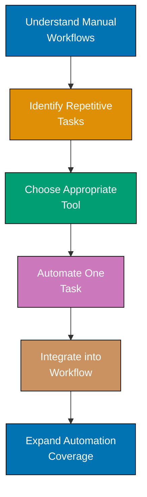

**Automation tools transform repetitive development tasks into streamlined workflows.** This section covers modern automation tools that boost developer productivity, reduce errors, and enable teams to focus on high-value work instead of manual operations.

## What Are Automation Tools?

Automation tools are software applications that execute repetitive tasks automatically, replacing manual effort with programmatic execution. In software engineering, these tools span:

- **Code generation** - AI-powered assistants that write code, tests, and documentation
- **Build automation** - Tools that compile, test, and package applications
- **Deployment automation** - Systems that deploy applications to production environments
- **Infrastructure automation** - Tools that provision and configure servers
- **Testing automation** - Frameworks that execute test suites automatically

## Why Automation Tools Matter

**Manual tasks cost time and introduce errors.** Every minute spent on repetitive work is a minute not spent solving complex problems or building features. Automation tools provide:

1. **Consistency** - Automated processes execute the same way every time, eliminating human error
2. **Speed** - Tools complete tasks in seconds that would take humans minutes or hours
3. **Scalability** - One automation script can handle 10 or 10,000 operations
4. **Documentation** - Automation code serves as executable documentation of processes
5. **Developer experience** - Removing drudgery makes development more enjoyable

## Categories of Automation Tools

### AI-Powered Code Assistants

Modern AI tools understand natural language and codebases to generate code, explain implementations, and suggest improvements:

- **Claude Code** - Anthropic's AI-powered coding assistant with deep codebase understanding
- **GitHub Copilot** - AI pair programmer suggesting code completions
- **Cursor** - AI-first code editor with context-aware assistance

**Use cases**: Writing boilerplate, explaining complex code, refactoring, test generation

### Build and Task Runners

Tools that automate compilation, testing, and packaging:

- **Make** - Classic Unix build automation tool
- **Gradle** - Modern build automation for JVM projects
- **npm scripts** - JavaScript task automation
- **Nx** - Monorepo build orchestration

**Use cases**: Building projects, running tests, linting code, generating documentation

### CI/CD Platforms

Continuous Integration and Continuous Deployment tools that automate the entire software delivery pipeline:

- **GitHub Actions** - Cloud-native CI/CD integrated with GitHub
- **GitLab CI/CD** - Integrated DevOps platform
- **Jenkins** - Open-source automation server
- **CircleCI** - Cloud-based CI/CD platform

**Use cases**: Running tests on every commit, deploying to staging/production, security scanning

### Infrastructure Automation

Tools that treat infrastructure as code:

- **Terraform** - Infrastructure provisioning using declarative configuration
- **Ansible** - Configuration management and application deployment
- **Docker** - Container automation for consistent environments
- **Kubernetes** - Container orchestration at scale

**Use cases**: Provisioning cloud resources, configuring servers, deploying containerized applications

### Testing Automation

Frameworks that automate software testing:

- **Playwright** - Browser automation for end-to-end testing
- **Selenium** - Web application testing framework
- **JUnit/pytest/Jest** - Unit testing frameworks
- **k6** - Performance testing tool

**Use cases**: Regression testing, load testing, UI testing, API testing

## Learning Path

## What You'll Learn

This section provides comprehensive tutorials on automation tools used in modern software development:

### Claude Code

AI-powered coding assistant that understands entire codebases:

- Initial setup and authentication
- Writing code with AI assistance
- Explaining existing implementations
- Refactoring and optimization
- Generating tests and documentation

**Coverage**: Installation, basic commands, advanced workflows, best practices

### Coming Soon

Additional automation tools planned for this section:

- **GitHub Actions** - CI/CD workflow automation
- **Nx** - Monorepo task orchestration
- **Playwright** - Browser automation (cross-referenced from automation-testing)
- **Docker** - Container automation (cross-referenced from infrastructure)

## Prerequisites

**General automation knowledge**:

- Basic command line skills (running commands, understanding file paths)
- Understanding of software development workflows (build, test, deploy)
- Familiarity with your development environment (terminal, code editor)

**Tool-specific prerequisites** are listed in each tool's overview page.

## How to Use This Section

### If You're New to Automation

Start with **Claude Code** to experience AI-powered automation firsthand. Modern AI assistants provide the fastest path to understanding automation benefits.

### If You Know Some Automation

Jump directly to specific tools based on your needs:

- Need AI assistance? → **Claude Code**
- Automating deployments? → **GitHub Actions** (coming soon)
- Managing monorepos? → **Nx** (coming soon)

### As a Reference

Use tool-specific pages to find setup instructions, common commands, and best practices when integrating tools into your workflow.

## Comparison: Manual vs. Automated Workflows

| Aspect             | Manual Workflow        | Automated Workflow              |
| ------------------ | ---------------------- | ------------------------------- |
| **Speed**          | Minutes to hours       | Seconds to minutes              |
| **Consistency**    | Varies by execution    | Identical every time            |
| **Error Rate**     | Human mistakes occur   | Only errors in automation code  |
| **Scalability**    | Linear effort increase | Handles 10x or 100x same effort |
| **Documentation**  | Often outdated/missing | Code serves as executable docs  |
| **Developer Time** | High ongoing cost      | Upfront cost, then nearly free  |

**Both approaches have value.** Manual workflows work for rarely-executed tasks. Automate anything you do more than 3 times.

## Key Principles

1. **Automate repetitive tasks** - If you do it more than 3 times, automate it
2. **Start small** - Automate one task at a time, build momentum
3. **Make it robust** - Add error handling, logging, and validation
4. **Document automation** - Future you will thank present you
5. **Iterate and improve** - Automation code needs maintenance like any code

## Why Start with Claude Code?

**AI-powered tools lower the automation barrier.** Traditional automation requires:

1. Identifying the task to automate
2. Learning the automation tool syntax
3. Writing the automation script
4. Debugging when it fails
5. Maintaining the script over time

**Claude Code simplifies this**:

1. Describe what you want in natural language
2. AI generates the code or performs the task
3. Iterate with conversational feedback

This makes automation accessible to developers at all skill levels.

## What's Next?

Ready to start automating? Choose your first tool:

- **New to AI coding assistants?** → [Claude Code](/en/learn/software-engineering/automation-tools/claude-code)
- **Need to automate deployments?** → Coming soon (GitHub Actions)
- **Managing complex builds?** → Coming soon (Nx)

## Feedback and Improvements

Automation tools evolve rapidly. Content is continuously updated based on new tool releases and learner feedback.

**Let's automate!** Choose a tool and start eliminating repetitive tasks from your workflow.
