## Example 61: Environment Variables and Configuration Management

Production workflows require environment-specific configuration without hardcoding values.

```json
{
  "nodes": [
    {
      "parameters": {
        "values": {
          "string": [
            {
              "name": "API_URL",
              "value": "={{$env.API_URL}}"
            },
            {
              "name": "API_KEY",
              "value": "={{$env.API_KEY}}"
            }
          ]
        }
      },
      "name": "Set Environment Config",
      "type": "n8n-nodes-base.set",
      "position": [250, 300]
    }
  ]
}
```

**Key Takeaway**: Use `$env` to access environment variables set in Docker or deployment platform. Never hardcode credentials or environment-specific URLs in workflows.

## Example 62: Workflow Error Handling with Fallback

Handle API failures gracefully with fallback data sources.

```json
{
  "nodes": [
    {
      "parameters": {
        "url": "={{$env.PRIMARY_API}}/data",
        "options": {}
      },
      "name": "Primary API",
      "type": "n8n-nodes-base.httpRequest",
      "continueOnFail": true,
      "position": [250, 200]
    },
    {
      "parameters": {
        "conditions": {
          "boolean": [
            {
              "value1": "={{$node['Primary API'].json.error}}",
              "value2": true
            }
          ]
        }
      },
      "name": "Check If Failed",
      "type": "n8n-nodes-base.if",
      "position": [450, 200]
    },
    {
      "parameters": {
        "url": "={{$env.FALLBACK_API}}/data",
        "options": {}
      },
      "name": "Fallback API",
      "type": "n8n-nodes-base.httpRequest",
      "position": [650, 300]
    }
  ],
  "connections": {
    "Primary API": {
      "main": [[{ "node": "Check If Failed", "type": "main", "index": 0 }]]
    },
    "Check If Failed": {
      "main": [[], [{ "node": "Fallback API", "type": "main", "index": 0 }]]
    }
  }
}
```

**Key Takeaway**: Set `continueOnFail: true` on nodes that might fail, then route failures to alternative paths. Essential for resilient production workflows.

## Example 63: Batch Processing with Loop

Process large datasets in batches to avoid memory issues and rate limits.

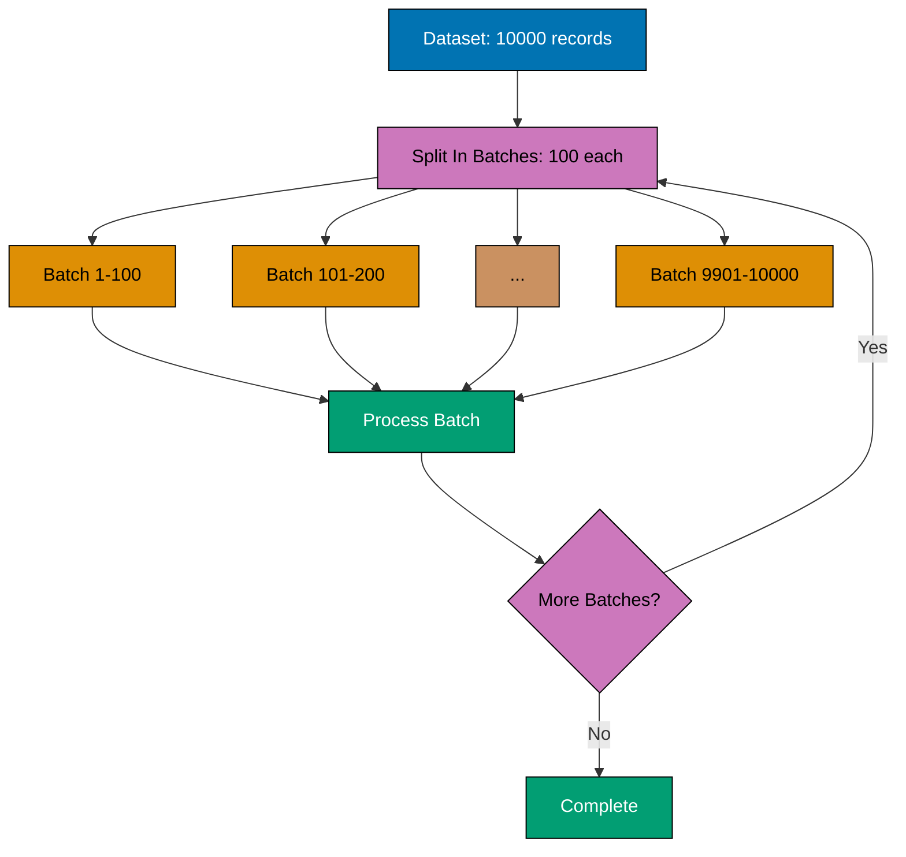

```json
{
  "nodes": [
    {
      "parameters": {
        "batchSize": 100,
        "options": {}
      },
      "name": "Split In Batches",
      "type": "n8n-nodes-base.splitInBatches",
      "position": [250, 300]
    },
    {
      "parameters": {
        "url": "https://api.example.com/process",
        "options": {
          "batching": {
            "batch": {
              "batchSize": "100"
            }
          }
        }
      },
      "name": "Process Batch",
      "type": "n8n-nodes-base.httpRequest",
      "position": [450, 300]
    },
    {
      "parameters": {
        "amount": 1000,
        "unit": "milliseconds"
      },
      "name": "Wait Between Batches",
      "type": "n8n-nodes-base.wait",
      "position": [650, 300]
    }
  ],
  "connections": {
    "Split In Batches": {
      "main": [[{ "node": "Process Batch", "type": "main", "index": 0 }]]
    },
    "Process Batch": {
      "main": [[{ "node": "Wait Between Batches", "type": "main", "index": 0 }]]
    },
    "Wait Between Batches": {
      "main": [[{ "node": "Split In Batches", "type": "main", "index": 0 }]]
    }
  }
}
```

**Key Takeaway**: Use Split In Batches node for large datasets, add Wait nodes between batches to respect API rate limits.

## Example 64: Monitoring with Webhook Notifications

Send alerts when workflows fail or meet specific conditions.

```json
{
  "nodes": [
    {
      "parameters": {
        "functionCode": "return items.map(item => ({\n  json: {\n    alert: 'Workflow Failed',\n    workflow: $workflow.name,\n    execution: $execution.id,\n    error: item.json.error\n  }\n}));"
      },
      "name": "Format Alert",
      "type": "n8n-nodes-base.function",
      "position": [250, 300]
    },
    {
      "parameters": {
        "url": "={{$env.SLACK_WEBHOOK_URL}}",
        "options": {
          "bodyParametersJson": "={{ JSON.stringify($json) }}"
        }
      },
      "name": "Send to Slack",
      "type": "n8n-nodes-base.httpRequest",
      "position": [450, 300]
    }
  ]
}
```

**Key Takeaway**: Use `$workflow` and `$execution` variables to include workflow context in alerts. Essential for production monitoring.

## Example 65: Caching API Responses

Cache expensive API calls to improve performance and reduce costs.

```json
{
  "nodes": [
    {
      "parameters": {
        "key": "cache:{{$json.userId}}:profile",
        "ttl": 3600,
        "operation": "get"
      },
      "name": "Check Cache",
      "type": "n8n-nodes-base.redis",
      "continueOnFail": true,
      "position": [250, 200]
    },
    {
      "parameters": {
        "conditions": {
          "boolean": [
            {
              "value1": "={{!$json.value}}",
              "value2": true
            }
          ]
        }
      },
      "name": "Cache Miss?",
      "type": "n8n-nodes-base.if",
      "position": [450, 200]
    },
    {
      "parameters": {
        "url": "https://api.example.com/users/{{$json.userId}}",
        "options": {}
      },
      "name": "Fetch from API",
      "type": "n8n-nodes-base.httpRequest",
      "position": [650, 300]
    },
    {
      "parameters": {
        "key": "cache:{{$json.userId}}:profile",
        "value": "={{JSON.stringify($json)}}",
        "ttl": 3600,
        "operation": "set"
      },
      "name": "Store in Cache",
      "type": "n8n-nodes-base.redis",
      "position": [850, 300]
    }
  ]
}
```

**Key Takeaway**: Use Redis or similar caching layer for expensive operations. Set appropriate TTL based on data freshness requirements.

## Example 66: OAuth 2.0 Flow with Token Refresh

Implement OAuth 2.0 authentication with automatic token refresh for long-running workflows.

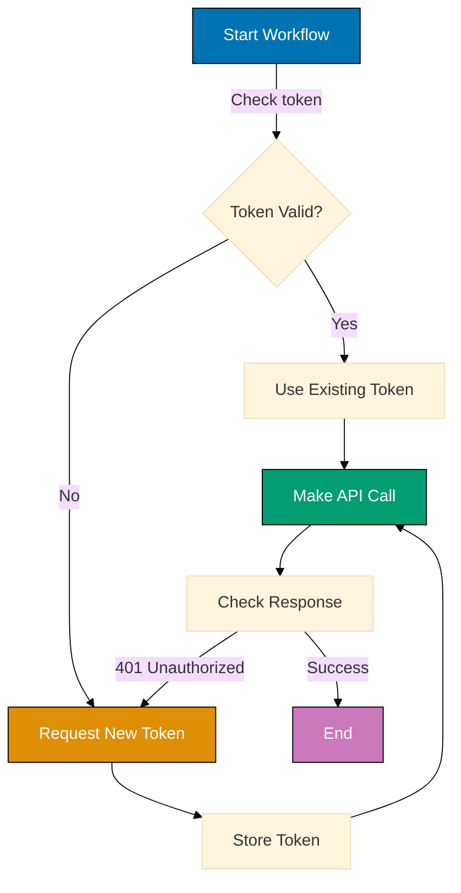

%% Color Palette: Blue #0173B2, Orange #DE8F05, Teal #029E73, Purple #CC78BC

```json
{
  "nodes": [
    {
      "parameters": {
        "key": "oauth:{{$env.CLIENT_ID}}:token", // => Cache key for OAuth token
        "operation": "get" // => Retrieve cached token
      },
      "name": "Check Cached Token",
      "type": "n8n-nodes-base.redis",
      "continueOnFail": true, // => Don't fail if cache miss
      "position": [250, 200]
    },
    {
      "parameters": {
        "conditions": {
          "string": [
            {
              "value1": "={{$json.value}}", // => Cached token value
              "operation": "isEmpty" // => Check if token exists
            }
          ]
        }
      },
      "name": "Token Missing?",
      "type": "n8n-nodes-base.if", // => Route based on cache status
      "position": [450, 200]
    },
    {
      "parameters": {
        "url": "={{$env.OAUTH_TOKEN_URL}}", // => OAuth2 token endpoint
        "sendBody": true,
        "bodyParameters": {
          "parameters": [
            {
              "name": "grant_type",
              "value": "client_credentials" // => OAuth2 grant type
            },
            {
              "name": "client_id",
              "value": "={{$env.CLIENT_ID}}" // => OAuth2 client ID
            },
            {
              "name": "client_secret",
              "value": "={{$env.CLIENT_SECRET}}" // => OAuth2 secret (from env)
            },
            {
              "name": "scope",
              "value": "read write" // => Requested permissions
            }
          ]
        },
        "options": {}
      },
      "name": "Request OAuth Token",
      "type": "n8n-nodes-base.httpRequest", // => POST to OAuth server
      "position": [650, 300] // => Execution result: {"access_token": "eyJ...", "expires_in": 3600}
    },
    {
      "parameters": {
        "key": "oauth:{{$env.CLIENT_ID}}:token", // => Same cache key
        "value": "={{$json.access_token}}", // => Store access token
        "ttl": "={{$json.expires_in - 60}}", // => Cache until 60s before expiry
        "operation": "set" // => Store in Redis
      },
      "name": "Cache Token",
      "type": "n8n-nodes-base.redis",
      "position": [850, 300]
    },
    {
      "parameters": {
        "url": "={{$env.API_BASE_URL}}/protected/resource", // => API endpoint requiring OAuth
        "authentication": "genericCredentialType",
        "genericAuthType": "oAuth2Api",
        "sendHeaders": true,
        "headerParameters": {
          "parameters": [
            {
              "name": "Authorization",
              "value": "Bearer {{$node['Cache Token'].json.value || $node['Check Cached Token'].json.value}}" // => Use fresh or cached token
            }
          ]
        },
        "options": {}
      },
      "name": "Call Protected API",
      "type": "n8n-nodes-base.httpRequest",
      "position": [1050, 200] // => Execution result: {"data": [...], "status": 200}
    }
  ],
  "connections": {
    "Check Cached Token": {
      "main": [[{ "node": "Token Missing?", "type": "main", "index": 0 }]]
    },
    "Token Missing?": {
      "main": [
        [{ "node": "Call Protected API", "type": "main", "index": 0 }], // => Use cached token (true branch)
        [{ "node": "Request OAuth Token", "type": "main", "index": 0 }] // => Request new token (false branch)
      ]
    },
    "Request OAuth Token": {
      "main": [[{ "node": "Cache Token", "type": "main", "index": 0 }]]
    },
    "Cache Token": {
      "main": [[{ "node": "Call Protected API", "type": "main", "index": 0 }]]
    }
  }
}
```

**Key Takeaway**: Cache OAuth tokens with TTL slightly less than expiry time to avoid using expired tokens. Always handle 401 responses by requesting a new token and retrying the request.

## Example 67: API Rate Limiting with Exponential Backoff

Handle API rate limits gracefully with exponential backoff retry logic.

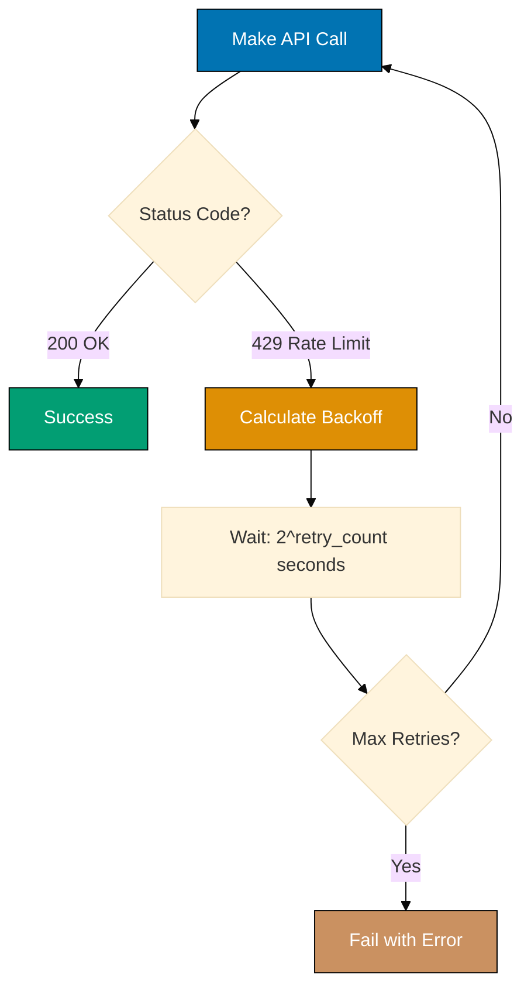

%% Color Palette: Blue #0173B2, Orange #DE8F05, Teal #029E73, Brown #CA9161

```json
{
  "nodes": [
    {
      "parameters": {
        "values": {
          "number": [
            {
              "name": "retryCount",
              "value": "={{$node['Wait'].json.retryCount + 1 || 0}}" // => Increment retry counter
            },
            {
              "name": "maxRetries",
              "value": 5 // => Maximum retry attempts
            }
          ]
        }
      },
      "name": "Initialize Retry",
      "type": "n8n-nodes-base.set",
      "position": [250, 200]
    },
    {
      "parameters": {
        "url": "https://api.example.com/data", // => Rate-limited API endpoint
        "options": {
          "timeout": 30000 // => 30 second timeout
        }
      },
      "name": "Call API",
      "type": "n8n-nodes-base.httpRequest",
      "continueOnFail": true, // => Don't stop on 429 errors
      "position": [450, 200] // => Execution result: {"statusCode": 429, "headers": {"retry-after": "60"}}
    },
    {
      "parameters": {
        "conditions": {
          "number": [
            {
              "value1": "={{$json.statusCode}}", // => HTTP status code
              "operation": "equal",
              "value2": 429 // => Rate limit error code
            }
          ]
        }
      },
      "name": "Rate Limited?",
      "type": "n8n-nodes-base.if",
      "position": [650, 200]
    },
    {
      "parameters": {
        "conditions": {
          "number": [
            {
              "value1": "={{$node['Initialize Retry'].json.retryCount}}", // => Current retry count
              "operation": "smaller",
              "value2": "={{$node['Initialize Retry'].json.maxRetries}}" // => Max retries allowed
            }
          ]
        }
      },
      "name": "Should Retry?",
      "type": "n8n-nodes-base.if",
      "position": [850, 300]
    },
    {
      "parameters": {
        "amount": "={{Math.pow(2, $node['Initialize Retry'].json.retryCount) * 1000}}", // => Exponential backoff: 2^n seconds
        "unit": "milliseconds" // => Wait in milliseconds
      },
      "name": "Wait",
      "type": "n8n-nodes-base.wait",
      "position": [1050, 400] // => Wait time increases: 1s, 2s, 4s, 8s, 16s
    },
    {
      "parameters": {
        "values": {
          "string": [
            {
              "name": "error",
              "value": "Max retries exceeded. API rate limit persists." // => Error message
            }
          ]
        }
      },
      "name": "Max Retries Exceeded",
      "type": "n8n-nodes-base.set",
      "position": [1050, 200]
    }
  ],
  "connections": {
    "Initialize Retry": {
      "main": [[{ "node": "Call API", "type": "main", "index": 0 }]]
    },
    "Call API": {
      "main": [[{ "node": "Rate Limited?", "type": "main", "index": 0 }]]
    },
    "Rate Limited?": {
      "main": [
        [], // => Success path (false branch)
        [{ "node": "Should Retry?", "type": "main", "index": 0 }] // => Rate limited (true branch)
      ]
    },
    "Should Retry?": {
      "main": [
        [{ "node": "Max Retries Exceeded", "type": "main", "index": 0 }], // => Stop retrying (false)
        [{ "node": "Wait", "type": "main", "index": 0 }] // => Retry with backoff (true)
      ]
    },
    "Wait": {
      "main": [[{ "node": "Initialize Retry", "type": "main", "index": 0 }]] // => Loop back to retry
    }
  }
}
```

**Key Takeaway**: Use exponential backoff (2^n) for retries to avoid overwhelming rate-limited APIs. Always respect `Retry-After` headers if provided by the API.

## Example 68: Multi-Tenant API Integration with Credential Isolation

Securely handle multiple client credentials in a single workflow without credential leakage.

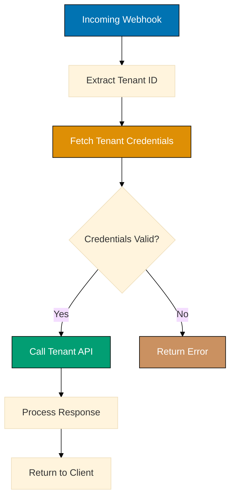

%% Color Palette: Blue #0173B2, Orange #DE8F05, Teal #029E73, Brown #CA9161

```json
{
  "nodes": [
    {
      "parameters": {
        "path": "webhook", // => Webhook endpoint path
        "responseMode": "responseNode",
        "options": {}
      },
      "name": "Webhook",
      "type": "n8n-nodes-base.webhook",
      "position": [250, 200] // => Execution result: {"headers": {"x-tenant-id": "tenant-123"}, "body": {...}}
    },
    {
      "parameters": {
        "values": {
          "string": [
            {
              "name": "tenantId",
              "value": "={{$json.headers['x-tenant-id']}}" // => Extract tenant identifier from header
            }
          ]
        }
      },
      "name": "Extract Tenant ID",
      "type": "n8n-nodes-base.set",
      "position": [450, 200]
    },
    {
      "parameters": {
        "key": "credentials:{{$json.tenantId}}", // => Tenant-specific credential key
        "operation": "get" // => Retrieve from secure store
      },
      "name": "Fetch Credentials",
      "type": "n8n-nodes-base.redis",
      "continueOnFail": true, // => Don't fail if credentials missing
      "position": [650, 200]
    },
    {
      "parameters": {
        "conditions": {
          "string": [
            {
              "value1": "={{$json.value}}", // => Retrieved credentials
              "operation": "isNotEmpty" // => Verify credentials exist
            }
          ]
        }
      },
      "name": "Credentials Valid?",
      "type": "n8n-nodes-base.if",
      "position": [850, 200]
    },
    {
      "parameters": {
        "url": "={{JSON.parse($json.value).apiUrl}}/resource", // => Tenant-specific API URL
        "authentication": "genericCredentialType",
        "sendHeaders": true,
        "headerParameters": {
          "parameters": [
            {
              "name": "Authorization",
              "value": "Bearer {{JSON.parse($json.value).apiKey}}" // => Tenant-specific API key
            }
          ]
        },
        "options": {}
      },
      "name": "Call Tenant API",
      "type": "n8n-nodes-base.httpRequest",
      "position": [1050, 100] // => Execution result: {"data": [...], "tenant": "tenant-123"}
    },
    {
      "parameters": {
        "values": {
          "string": [
            {
              "name": "error",
              "value": "Invalid or missing tenant credentials" // => Error message
            }
          ],
          "number": [
            {
              "name": "statusCode",
              "value": 401 // => Unauthorized status
            }
          ]
        }
      },
      "name": "Return Error",
      "type": "n8n-nodes-base.set",
      "position": [1050, 300]
    },
    {
      "parameters": {
        "respondWith": "json",
        "responseBody": "={{$json}}", // => Return API response
        "options": {}
      },
      "name": "Respond to Webhook",
      "type": "n8n-nodes-base.respondToWebhook",
      "position": [1250, 200]
    }
  ],
  "connections": {
    "Webhook": {
      "main": [[{ "node": "Extract Tenant ID", "type": "main", "index": 0 }]]
    },
    "Extract Tenant ID": {
      "main": [[{ "node": "Fetch Credentials", "type": "main", "index": 0 }]]
    },
    "Fetch Credentials": {
      "main": [[{ "node": "Credentials Valid?", "type": "main", "index": 0 }]]
    },
    "Credentials Valid?": {
      "main": [
        [{ "node": "Return Error", "type": "main", "index": 0 }], // => Invalid credentials (false)
        [{ "node": "Call Tenant API", "type": "main", "index": 0 }] // => Valid credentials (true)
      ]
    },
    "Call Tenant API": {
      "main": [[{ "node": "Respond to Webhook", "type": "main", "index": 0 }]]
    },
    "Return Error": {
      "main": [[{ "node": "Respond to Webhook", "type": "main", "index": 0 }]]
    }
  }
}
```

**Key Takeaway**: Store tenant credentials in Redis or encrypted database, never in workflow variables. Always validate tenant ID before credential retrieval to prevent unauthorized access.

## Example 69: Environment-Based Configuration (Dev/Staging/Prod)

Manage different configurations for development, staging, and production environments safely.

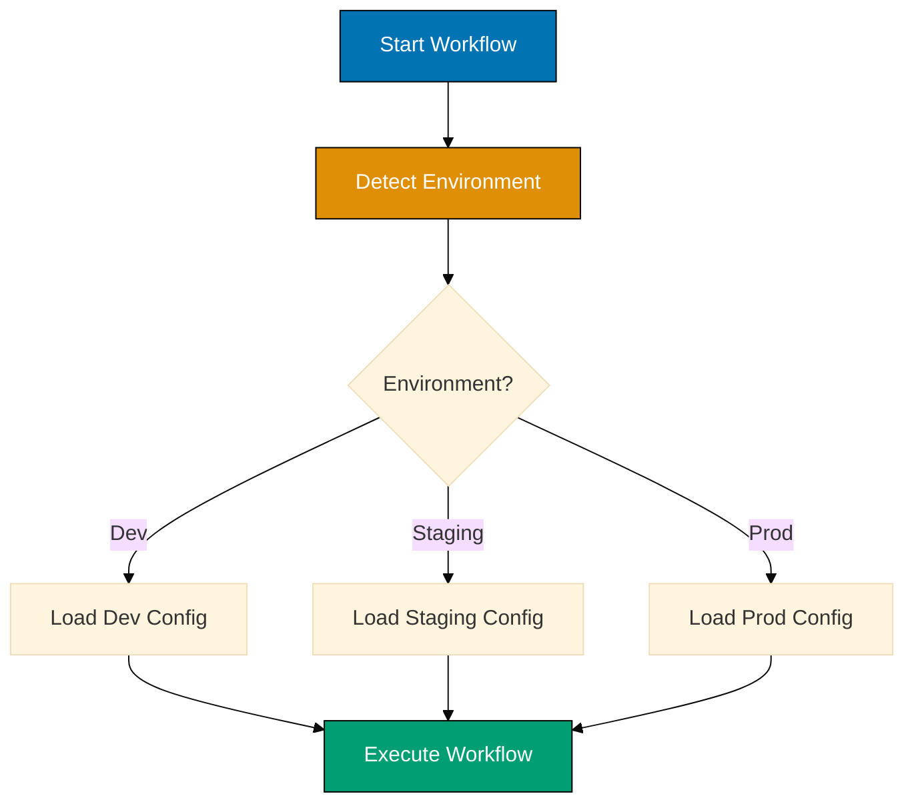

%% Color Palette: Blue #0173B2, Orange #DE8F05, Teal #029E73

```json
{
  "nodes": [
    {
      "parameters": {
        "values": {
          "string": [
            {
              "name": "environment",
              "value": "={{$env.NODE_ENV || 'development'}}" // => Current environment (from env var)
            }
          ]
        }
      },
      "name": "Detect Environment",
      "type": "n8n-nodes-base.set",
      "position": [250, 200]
    },
    {
      "parameters": {
        "conditions": {
          "string": [
            {
              "value1": "={{$json.environment}}", // => Environment name
              "operation": "equals",
              "value2": "production" // => Check if production
            }
          ]
        }
      },
      "name": "Is Production?",
      "type": "n8n-nodes-base.switch",
      "position": [450, 200]
    },
    {
      "parameters": {
        "values": {
          "string": [
            {
              "name": "apiUrl",
              "value": "={{$env.DEV_API_URL}}" // => Development API endpoint
            },
            {
              "name": "dbHost",
              "value": "localhost" // => Local database
            },
            {
              "name": "logLevel",
              "value": "debug" // => Verbose logging
            }
          ],
          "boolean": [
            {
              "name": "debugMode",
              "value": true // => Enable debug features
            }
          ]
        }
      },
      "name": "Dev Config",
      "type": "n8n-nodes-base.set",
      "position": [650, 100]
    },
    {
      "parameters": {
        "values": {
          "string": [
            {
              "name": "apiUrl",
              "value": "={{$env.STAGING_API_URL}}" // => Staging API endpoint
            },
            {
              "name": "dbHost",
              "value": "={{$env.STAGING_DB_HOST}}" // => Staging database
            },
            {
              "name": "logLevel",
              "value": "info" // => Standard logging
            }
          ],
          "boolean": [
            {
              "name": "debugMode",
              "value": false // => Disable debug features
            }
          ]
        }
      },
      "name": "Staging Config",
      "type": "n8n-nodes-base.set",
      "position": [650, 200]
    },
    {
      "parameters": {
        "values": {
          "string": [
            {
              "name": "apiUrl",
              "value": "={{$env.PROD_API_URL}}" // => Production API endpoint
            },
            {
              "name": "dbHost",
              "value": "={{$env.PROD_DB_HOST}}" // => Production database
            },
            {
              "name": "logLevel",
              "value": "error" // => Error-only logging
            }
          ],
          "boolean": [
            {
              "name": "debugMode",
              "value": false // => Disable debug features
            }
          ]
        }
      },
      "name": "Prod Config",
      "type": "n8n-nodes-base.set",
      "position": [650, 300]
    },
    {
      "parameters": {
        "url": "={{$json.apiUrl}}/endpoint", // => Use environment-specific URL
        "options": {
          "timeout": "={{$json.environment === 'production' ? 10000 : 30000}}" // => Stricter timeout in prod
        }
      },
      "name": "Execute API Call",
      "type": "n8n-nodes-base.httpRequest",
      "position": [850, 200]
    }
  ],
  "connections": {
    "Detect Environment": {
      "main": [[{ "node": "Is Production?", "type": "main", "index": 0 }]]
    },
    "Is Production?": {
      "main": [
        [{ "node": "Dev Config", "type": "main", "index": 0 }], // => Development
        [{ "node": "Staging Config", "type": "main", "index": 1 }], // => Staging
        [{ "node": "Prod Config", "type": "main", "index": 2 }] // => Production
      ]
    },
    "Dev Config": {
      "main": [[{ "node": "Execute API Call", "type": "main", "index": 0 }]]
    },
    "Staging Config": {
      "main": [[{ "node": "Execute API Call", "type": "main", "index": 0 }]]
    },
    "Prod Config": {
      "main": [[{ "node": "Execute API Call", "type": "main", "index": 0 }]]
    }
  }
}
```

**Key Takeaway**: Use `NODE_ENV` environment variable to switch configurations. Never commit production credentials to version control - always use environment variables.

## Example 70: Blue-Green Deployment Strategy

Implement zero-downtime deployments using blue-green pattern with traffic switching.

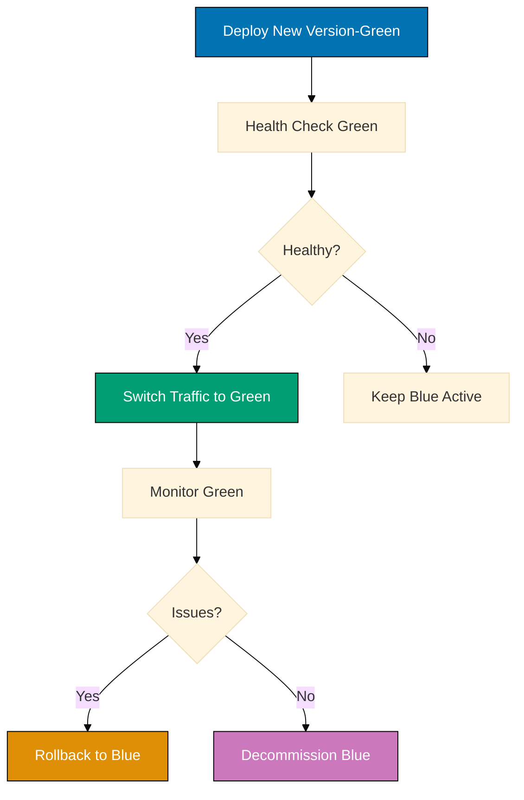

%% Color Palette: Blue #0173B2, Teal #029E73, Orange #DE8F05, Purple #CC78BC

```json
{
  "nodes": [
    {
      "parameters": {
        "values": {
          "string": [
            {
              "name": "blueUrl",
              "value": "={{$env.BLUE_INSTANCE_URL}}" // => Current active version
            },
            {
              "name": "greenUrl",
              "value": "={{$env.GREEN_INSTANCE_URL}}" // => New deployment version
            },
            {
              "name": "loadBalancerUrl",
              "value": "={{$env.LOAD_BALANCER_API}}" // => Load balancer API endpoint
            }
          ]
        }
      },
      "name": "Initialize Deployment",
      "type": "n8n-nodes-base.set",
      "position": [250, 200]
    },
    {
      "parameters": {
        "url": "={{$json.greenUrl}}/health", // => Health check endpoint
        "options": {
          "timeout": 5000, // => 5 second timeout
          "retry": {
            "maxRetries": 3, // => Retry 3 times
            "retryDelay": 2000 // => 2 seconds between retries
          }
        }
      },
      "name": "Health Check Green",
      "type": "n8n-nodes-base.httpRequest",
      "continueOnFail": true, // => Don't fail deployment on health check failure
      "position": [450, 200] // => Execution result: {"status": "healthy", "version": "2.0.0"}
    },
    {
      "parameters": {
        "conditions": {
          "string": [
            {
              "value1": "={{$json.status}}", // => Health check status
              "operation": "equals",
              "value2": "healthy" // => Expected health status
            }
          ]
        }
      },
      "name": "Is Healthy?",
      "type": "n8n-nodes-base.if",
      "position": [650, 200]
    },
    {
      "parameters": {
        "url": "={{$node['Initialize Deployment'].json.loadBalancerUrl}}/switch", // => Load balancer API
        "method": "POST",
        "sendBody": true,
        "bodyParameters": {
          "parameters": [
            {
              "name": "target",
              "value": "green" // => Switch traffic to green
            },
            {
              "name": "percentage",
              "value": "100" // => Full traffic cutover
            }
          ]
        },
        "options": {}
      },
      "name": "Switch to Green",
      "type": "n8n-nodes-base.httpRequest",
      "position": [850, 100] // => Execution result: {"switched": true, "activeTarget": "green"}
    },
    {
      "parameters": {
        "amount": 300, // => Monitor for 5 minutes
        "unit": "seconds"
      },
      "name": "Monitor Period",
      "type": "n8n-nodes-base.wait",
      "position": [1050, 100]
    },
    {
      "parameters": {
        "url": "={{$node['Initialize Deployment'].json.greenUrl}}/metrics", // => Check error rate
        "options": {}
      },
      "name": "Check Metrics",
      "type": "n8n-nodes-base.httpRequest",
      "position": [1250, 100] // => Execution result: {"errorRate": 0.01, "responseTime": 150}
    },
    {
      "parameters": {
        "conditions": {
          "number": [
            {
              "value1": "={{$json.errorRate}}", // => Current error rate
              "operation": "largerEqual",
              "value2": 0.05 // => 5% error threshold
            }
          ]
        }
      },
      "name": "High Error Rate?",
      "type": "n8n-nodes-base.if",
      "position": [1450, 100]
    },
    {
      "parameters": {
        "url": "={{$node['Initialize Deployment'].json.loadBalancerUrl}}/switch", // => Rollback endpoint
        "method": "POST",
        "sendBody": true,
        "bodyParameters": {
          "parameters": [
            {
              "name": "target",
              "value": "blue" // => Rollback to blue (old version)
            },
            {
              "name": "percentage",
              "value": "100" // => Immediate full rollback
            }
          ]
        },
        "options": {}
      },
      "name": "Rollback to Blue",
      "type": "n8n-nodes-base.httpRequest",
      "position": [1650, 200]
    },
    {
      "parameters": {
        "values": {
          "string": [
            {
              "name": "status",
              "value": "Deployment successful. Blue instance can be decommissioned." // => Success message
            }
          ]
        }
      },
      "name": "Deployment Complete",
      "type": "n8n-nodes-base.set",
      "position": [1650, 100]
    }
  ],
  "connections": {
    "Initialize Deployment": {
      "main": [[{ "node": "Health Check Green", "type": "main", "index": 0 }]]
    },
    "Health Check Green": {
      "main": [[{ "node": "Is Healthy?", "type": "main", "index": 0 }]]
    },
    "Is Healthy?": {
      "main": [
        [], // => Unhealthy (false) - keep blue active
        [{ "node": "Switch to Green", "type": "main", "index": 0 }] // => Healthy (true) - proceed
      ]
    },
    "Switch to Green": {
      "main": [[{ "node": "Monitor Period", "type": "main", "index": 0 }]]
    },
    "Monitor Period": {
      "main": [[{ "node": "Check Metrics", "type": "main", "index": 0 }]]
    },
    "Check Metrics": {
      "main": [[{ "node": "High Error Rate?", "type": "main", "index": 0 }]]
    },
    "High Error Rate?": {
      "main": [
        [{ "node": "Deployment Complete", "type": "main", "index": 0 }], // => Low errors (false) - success
        [{ "node": "Rollback to Blue", "type": "main", "index": 0 }] // => High errors (true) - rollback
      ]
    }
  }
}
```

**Key Takeaway**: Always validate new deployments with health checks before switching traffic. Monitor error rates after cutover and have automatic rollback ready for production safety.

## Example 71: Health Checks and Monitoring with Alerting

Implement comprehensive health monitoring with multi-channel alerting for production systems.

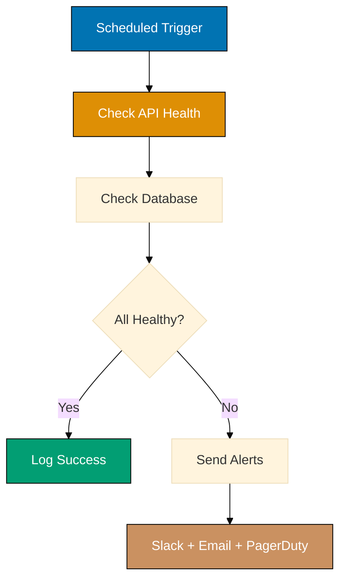

%% Color Palette: Blue #0173B2, Orange #DE8F05, Teal #029E73, Brown #CA9161

```json
{
  "nodes": [
    {
      "parameters": {
        "rule": {
          "interval": [{ "field": "minutes", "minutesInterval": 5 }] // => Check every 5 minutes
        }
      },
      "name": "Schedule",
      "type": "n8n-nodes-base.scheduleTrigger",
      "position": [250, 200]
    },
    {
      "parameters": {
        "url": "={{$env.API_URL}}/health", // => Health endpoint
        "options": { "timeout": 5000 } // => 5 second timeout
      },
      "name": "API Health",
      "type": "n8n-nodes-base.httpRequest",
      "continueOnFail": true, // => Continue even if health check fails
      "position": [450, 200] // => Execution result: {"status": "unhealthy", "error": "DB connection timeout"}
    },
    {
      "parameters": {
        "operation": "executeQuery",
        "query": "SELECT 1", // => Simple connectivity test
        "options": {}
      },
      "name": "DB Health",
      "type": "n8n-nodes-base.postgres",
      "continueOnFail": true, // => Continue on DB failure
      "position": [650, 200]
    },
    {
      "parameters": {
        "conditions": {
          "boolean": [
            {
              "value1": "={{$node['API Health'].json.status === 'healthy' && $node['DB Health'].json.length > 0}}", // => Both checks passed
              "value2": true
            }
          ]
        }
      },
      "name": "All Healthy?",
      "type": "n8n-nodes-base.if",
      "position": [850, 200]
    },
    {
      "parameters": {
        "functionCode": "// => Prepare alert payload\nconst alerts = [];\nif ($node['API Health'].json.status !== 'healthy') alerts.push('API unhealthy');\nif (!$node['DB Health'].json.length) alerts.push('DB unreachable');\nreturn [{json: {message: alerts.join(', '), severity: 'critical', timestamp: new Date().toISOString()}}];" // => Format multi-channel alert
      },
      "name": "Format Alerts",
      "type": "n8n-nodes-base.function",
      "position": [1050, 300]
    },
    {
      "parameters": {
        "url": "={{$env.SLACK_WEBHOOK}}", // => Slack webhook
        "sendBody": true,
        "body": "={{JSON.stringify({text: `🚨 Health Check Failed: ${$json.message}`})}}" // => Slack notification
      },
      "name": "Alert Slack",
      "type": "n8n-nodes-base.httpRequest",
      "position": [1250, 300]
    }
  ],
  "connections": {
    "Schedule": { "main": [[{ "node": "API Health", "type": "main", "index": 0 }]] },
    "API Health": { "main": [[{ "node": "DB Health", "type": "main", "index": 0 }]] },
    "DB Health": { "main": [[{ "node": "All Healthy?", "type": "main", "index": 0 }]] },
    "All Healthy?": { "main": [[], [{ "node": "Format Alerts", "type": "main", "index": 0 }]] }, // => Unhealthy path
    "Format Alerts": { "main": [[{ "node": "Alert Slack", "type": "main", "index": 0 }]] }
  }
}
```

**Key Takeaway**: Monitor critical dependencies every 5-10 minutes with multi-channel alerting (Slack, email, PagerDuty). Use `continueOnFail: true` to ensure all health checks execute even if one fails.

## Example 72: Data Encryption at Rest and in Transit

Encrypt sensitive data before storing and ensure encrypted transmission to external services.

```json
{
  "nodes": [
    {
      "parameters": {
        "functionCode": "// => Encrypt using AES-256\nconst crypto = require('crypto');\nconst algorithm = 'aes-256-gcm';\nconst key = Buffer.from($env.ENCRYPTION_KEY, 'hex'); // => 32-byte encryption key from env\nconst iv = crypto.randomBytes(16); // => Initialization vector\nconst cipher = crypto.createCipheriv(algorithm, key, iv);\nlet encrypted = cipher.update($json.sensitiveData, 'utf8', 'hex');\nencrypted += cipher.final('hex');\nconst authTag = cipher.getAuthTag(); // => Authentication tag for integrity\nreturn [{json: {encrypted, iv: iv.toString('hex'), authTag: authTag.toString('hex')}}];" // => Returns encrypted data + IV + auth tag
      },
      "name": "Encrypt Data",
      "type": "n8n-nodes-base.function",
      "position": [250, 200]
    },
    {
      "parameters": {
        "operation": "insert",
        "table": "encrypted_records", // => Store in database
        "columns": "encrypted_data,iv,auth_tag", // => Store encryption metadata
        "options": {}
      },
      "name": "Store Encrypted",
      "type": "n8n-nodes-base.postgres",
      "position": [450, 200] // => Data stored encrypted at rest
    },
    {
      "parameters": {
        "url": "={{$env.API_URL}}/secure-endpoint", // => External API over HTTPS
        "authentication": "genericCredentialType",
        "sendHeaders": true,
        "headerParameters": {
          "parameters": [
            { "name": "X-Encryption-Version", "value": "AES-256-GCM" } // => Indicate encryption method
          ]
        },
        "sendBody": true,
        "body": "={{JSON.stringify($json)}}", // => Send encrypted payload
        "options": { "useSSL": true } // => TLS 1.3 for transit encryption
      },
      "name": "Send Over TLS",
      "type": "n8n-nodes-base.httpRequest",
      "position": [650, 200] // => Encrypted in transit via HTTPS
    }
  ],
  "connections": {
    "Encrypt Data": { "main": [[{ "node": "Store Encrypted", "type": "main", "index": 0 }]] },
    "Store Encrypted": { "main": [[{ "node": "Send Over TLS", "type": "main", "index": 0 }]] }
  }
}
```

**Key Takeaway**: Use AES-256-GCM for encryption at rest with unique IVs per record. Always transmit sensitive data over TLS 1.2+ and never log encryption keys or unencrypted sensitive data.

## Example 73: Audit Logging and Compliance Reporting

Track all workflow actions with immutable audit logs for compliance requirements (GDPR, SOC 2, HIPAA).

```json
{
  "nodes": [
    {
      "parameters": {
        "functionCode": "// => Create audit log entry\nreturn [{json: {\n  auditId: crypto.randomUUID(), // => Unique audit ID\n  timestamp: new Date().toISOString(), // => ISO 8601 timestamp\n  workflowId: $workflow.id, // => Workflow identifier\n  executionId: $execution.id, // => Execution identifier\n  userId: $json.userId, // => Acting user\n  action: $json.action, // => Action performed (READ/WRITE/DELETE)\n  resource: $json.resource, // => Resource accessed\n  ipAddress: $json.headers['x-forwarded-for'], // => Client IP\n  userAgent: $json.headers['user-agent'], // => Client user agent\n  result: 'success', // => Action result\n  metadata: JSON.stringify($json.metadata) // => Additional context\n}}];" // => Comprehensive audit record
      },
      "name": "Create Audit Log",
      "type": "n8n-nodes-base.function",
      "position": [250, 200]
    },
    {
      "parameters": {
        "operation": "insert",
        "table": "audit_logs", // => Append-only audit table
        "columns": "audit_id,timestamp,workflow_id,execution_id,user_id,action,resource,ip_address,user_agent,result,metadata",
        "options": { "transactionMode": "appendOnly" } // => Prevent updates/deletes
      },
      "name": "Store Audit Log",
      "type": "n8n-nodes-base.postgres",
      "position": [450, 200]
    },
    {
      "parameters": {
        "functionCode": "// => Hash audit log for tamper detection\nconst crypto = require('crypto');\nconst logString = JSON.stringify($json); // => Serialize log entry\nconst hash = crypto.createHash('sha256').update(logString).digest('hex'); // => SHA-256 hash\nreturn [{json: {...$json, logHash: hash}}];" // => Add integrity hash
      },
      "name": "Add Integrity Hash",
      "type": "n8n-nodes-base.function",
      "position": [650, 200]
    },
    {
      "parameters": {
        "url": "={{$env.SIEM_ENDPOINT}}", // => Security Information and Event Management system
        "method": "POST",
        "sendBody": true,
        "body": "={{JSON.stringify($json)}}", // => Forward to SIEM for analysis
        "options": {}
      },
      "name": "Forward to SIEM",
      "type": "n8n-nodes-base.httpRequest",
      "position": [850, 200]
    }
  ],
  "connections": {
    "Create Audit Log": { "main": [[{ "node": "Store Audit Log", "type": "main", "index": 0 }]] },
    "Store Audit Log": { "main": [[{ "node": "Add Integrity Hash", "type": "main", "index": 0 }]] },
    "Add Integrity Hash": { "main": [[{ "node": "Forward to SIEM", "type": "main", "index": 0 }]] }
  }
}
```

**Key Takeaway**: Use append-only audit logs with SHA-256 integrity hashes to detect tampering. Include user ID, IP, action, resource, and timestamp for complete audit trails required by compliance frameworks.

## Example 74: Complex JSONata Transformations

Transform deeply nested API responses into normalized data structures using JSONata expressions.

```json
{
  "nodes": [
    {
      "parameters": {
        "url": "https://api.example.com/complex-data", // => Nested API response
        "options": {}
      },
      "name": "Fetch Complex Data",
      "type": "n8n-nodes-base.httpRequest",
      "position": [250, 200] // => Result: {"users": [{"profile": {"name": {"first": "John", "last": "Doe"}, "contacts": [...]}}]}
    },
    {
      "parameters": {
        "functionCode": "// => Complex JSONata transformation\nconst jsonata = require('jsonata');\nconst expression = jsonata(`\n  users.{\n    'id': $string(profile.id), /* => Convert to string */\n    'fullName': profile.name.first & ' ' & profile.name.last, /* => Concatenate first + last */\n    'primaryEmail': contacts[type='email'][0].value, /* => Extract first email */\n    'phoneNumbers': contacts[type='phone'].value, /* => Array of phone numbers */\n    'address': profile.location.street & ', ' & profile.location.city, /* => Format address */\n    'metadata': {\n      'createdAt': $fromMillis(profile.timestamps.created), /* => Unix to ISO date */\n      'isActive': profile.status = 'active', /* => Boolean conversion */\n      'tags': $distinct(profile.tags) /* => Remove duplicates */\n    }\n  }\n`);\nconst transformed = expression.evaluate($json); // => Apply transformation\nreturn [{json: {normalized: transformed}}];" // => Execution result: Flat, normalized records
      },
      "name": "JSONata Transform",
      "type": "n8n-nodes-base.function",
      "position": [450, 200]
    },
    {
      "parameters": {
        "functionCode": "// => Validate transformation\nconst errors = [];\n$json.normalized.forEach((record, i) => { // => Check each record\n  if (!record.id) errors.push(`Record ${i}: missing ID`);\n  if (!record.fullName) errors.push(`Record ${i}: missing fullName`);\n  if (!record.primaryEmail) errors.push(`Record ${i}: missing primaryEmail`);\n});\nif (errors.length > 0) throw new Error(`Validation failed: ${errors.join(', ')}`); // => Fail on invalid data\nreturn items;" // => Pass through if valid
      },
      "name": "Validate Schema",
      "type": "n8n-nodes-base.function",
      "position": [650, 200]
    }
  ],
  "connections": {
    "Fetch Complex Data": { "main": [[{ "node": "JSONata Transform", "type": "main", "index": 0 }]] },
    "JSONata Transform": { "main": [[{ "node": "Validate Schema", "type": "main", "index": 0 }]] }
  }
}
```

**Key Takeaway**: Use JSONata for complex nested transformations instead of multiple Set nodes. Always validate transformed data schema before downstream processing to catch transformation errors early.

## Example 75: Stream Processing for Large Datasets

Process large datasets in streaming fashion to avoid memory exhaustion and enable real-time processing.

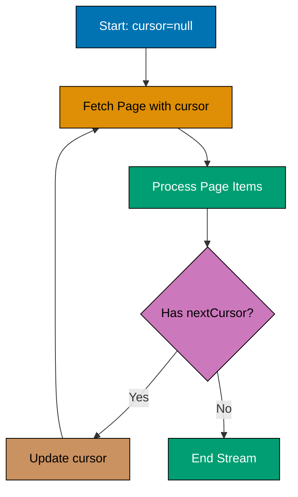

```json
{
  "nodes": [
    {
      "parameters": {
        "url": "https://api.example.com/large-dataset?cursor={{$json.cursor}}", // => Paginated API with cursor
        "options": {}
      },
      "name": "Fetch Page",
      "type": "n8n-nodes-base.httpRequest",
      "position": [250, 200] // => Returns: {"data": [...100 items...], "nextCursor": "abc123"}
    },
    {
      "parameters": {
        "functionCode": "// => Process items in streaming fashion\nreturn $json.data.map(item => ({ // => Transform each item\n  json: {\n    id: item.id,\n    processed: true,\n    timestamp: new Date().toISOString(), // => Add processing timestamp\n    transformedData: item.value * 2 // => Business logic transformation\n  }\n}));" // => Outputs multiple items (one per array element)
      },
      "name": "Process Stream",
      "type": "n8n-nodes-base.function",
      "position": [450, 200]
    },
    {
      "parameters": {
        "operation": "insert",
        "table": "processed_items", // => Write to database
        "columns": "id,processed,timestamp,transformed_data",
        "options": { "batching": { "batchSize": 100 } } // => Batch inserts for efficiency
      },
      "name": "Bulk Insert",
      "type": "n8n-nodes-base.postgres",
      "position": [650, 200]
    },
    {
      "parameters": {
        "conditions": {
          "string": [
            {
              "value1": "={{$node['Fetch Page'].json.nextCursor}}", // => Check for next page
              "operation": "isNotEmpty"
            }
          ]
        }
      },
      "name": "Has Next Page?",
      "type": "n8n-nodes-base.if",
      "position": [850, 200]
    },
    {
      "parameters": {
        "values": {
          "string": [
            {
              "name": "cursor",
              "value": "={{$node['Fetch Page'].json.nextCursor}}" // => Update cursor for next iteration
            }
          ]
        }
      },
      "name": "Update Cursor",
      "type": "n8n-nodes-base.set",
      "position": [1050, 300]
    },
    {
      "parameters": {
        "amount": 100, // => Rate limit: wait 100ms between pages
        "unit": "milliseconds"
      },
      "name": "Rate Limit",
      "type": "n8n-nodes-base.wait",
      "position": [1250, 300]
    }
  ],
  "connections": {
    "Fetch Page": { "main": [[{ "node": "Process Stream", "type": "main", "index": 0 }]] },
    "Process Stream": { "main": [[{ "node": "Bulk Insert", "type": "main", "index": 0 }]] },
    "Bulk Insert": { "main": [[{ "node": "Has Next Page?", "type": "main", "index": 0 }]] },
    "Has Next Page?": {
      "main": [
        [], // => No more pages (done)
        [{ "node": "Update Cursor", "type": "main", "index": 0 }] // => Continue pagination
      ]
    },
    "Update Cursor": { "main": [[{ "node": "Rate Limit", "type": "main", "index": 0 }]] },
    "Rate Limit": { "main": [[{ "node": "Fetch Page", "type": "main", "index": 0 }]] } // => Loop back
  }
}
```

**Key Takeaway**: Use cursor-based pagination with streaming processing to handle datasets larger than memory. Always add rate limiting between pages to respect API limits and use batch inserts for database efficiency.

## Example 76: Circuit Breaker Pattern with Fallback

Prevent cascading failures by implementing circuit breaker pattern that fails fast when downstream services are unavailable.

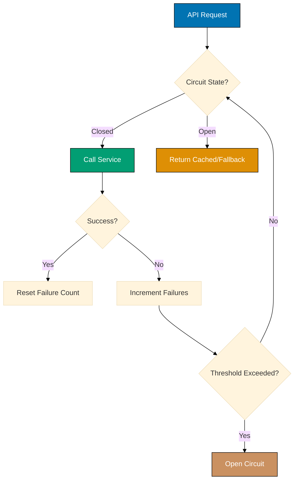

%% Color Palette: Blue #0173B2, Teal #029E73, Brown #CA9161, Orange #DE8F05

```json
{
  "nodes": [
    {
      "parameters": {
        "key": "circuit:api-service:state", // => Circuit breaker state key
        "operation": "get"
      },
      "name": "Check Circuit",
      "type": "n8n-nodes-base.redis",
      "continueOnFail": true, // => Default to closed if cache miss
      "position": [250, 200]
    },
    {
      "parameters": {
        "conditions": {
          "string": [
            {
              "value1": "={{$json.value}}", // => Circuit state: 'open' or 'closed'
              "operation": "notEquals",
              "value2": "open" // => Allow traffic if closed
            }
          ]
        }
      },
      "name": "Circuit Closed?",
      "type": "n8n-nodes-base.if",
      "position": [450, 200]
    },
    {
      "parameters": {
        "url": "https://api.example.com/service", // => Downstream service
        "options": { "timeout": 3000 } // => 3 second timeout
      },
      "name": "Call Service",
      "type": "n8n-nodes-base.httpRequest",
      "continueOnFail": true, // => Don't fail workflow on service error
      "position": [650, 100] // => Execution: Could succeed or fail
    },
    {
      "parameters": {
        "conditions": {
          "number": [
            {
              "value1": "={{$json.statusCode}}", // => HTTP status
              "operation": "equal",
              "value2": 200 // => Success status
            }
          ]
        }
      },
      "name": "Success?",
      "type": "n8n-nodes-base.if",
      "position": [850, 100]
    },
    {
      "parameters": {
        "key": "circuit:api-service:failures", // => Failure counter
        "operation": "incr" // => Increment failures
      },
      "name": "Increment Failures",
      "type": "n8n-nodes-base.redis",
      "position": [1050, 200]
    },
    {
      "parameters": {
        "key": "circuit:api-service:failures",
        "operation": "get"
      },
      "name": "Get Failure Count",
      "type": "n8n-nodes-base.redis",
      "position": [1250, 200]
    },
    {
      "parameters": {
        "conditions": {
          "number": [
            {
              "value1": "={{parseInt($json.value)}}", // => Current failures
              "operation": "largerEqual",
              "value2": 5 // => Threshold: 5 failures
            }
          ]
        }
      },
      "name": "Threshold Exceeded?",
      "type": "n8n-nodes-base.if",
      "position": [1450, 200]
    },
    {
      "parameters": {
        "key": "circuit:api-service:state",
        "value": "open", // => Open circuit
        "ttl": 60, // => Auto-close after 60 seconds
        "operation": "set"
      },
      "name": "Open Circuit",
      "type": "n8n-nodes-base.redis",
      "position": [1650, 300]
    },
    {
      "parameters": {
        "values": {
          "string": [
            {
              "name": "data",
              "value": "{{$env.FALLBACK_DATA}}" // => Static fallback data
            },
            {
              "name": "source",
              "value": "fallback" // => Indicate fallback source
            }
          ]
        }
      },
      "name": "Return Fallback",
      "type": "n8n-nodes-base.set",
      "position": [650, 300]
    }
  ],
  "connections": {
    "Check Circuit": { "main": [[{ "node": "Circuit Closed?", "type": "main", "index": 0 }]] },
    "Circuit Closed?": {
      "main": [
        [{ "node": "Return Fallback", "type": "main", "index": 0 }], // => Open: use fallback
        [{ "node": "Call Service", "type": "main", "index": 0 }] // => Closed: call service
      ]
    },
    "Call Service": { "main": [[{ "node": "Success?", "type": "main", "index": 0 }]] },
    "Success?": {
      "main": [
        [{ "node": "Increment Failures", "type": "main", "index": 0 }], // => Failed
        [] // => Succeeded: reset handled separately
      ]
    },
    "Increment Failures": { "main": [[{ "node": "Get Failure Count", "type": "main", "index": 0 }]] },
    "Get Failure Count": { "main": [[{ "node": "Threshold Exceeded?", "type": "main", "index": 0 }]] },
    "Threshold Exceeded?": {
      "main": [
        [], // => Below threshold
        [{ "node": "Open Circuit", "type": "main", "index": 0 }] // => Open circuit
      ]
    }
  }
}
```

**Key Takeaway**: Open circuit after 5 consecutive failures with 60-second TTL for automatic retry. Circuit breaker prevents wasting resources on unavailable services and provides fast failure response to clients.

## Example 77: Dead Letter Queue with Retry Logic

Handle failed message processing with exponential backoff and dead letter queue for manual intervention.

```json
{
  "nodes": [
    {
      "parameters": {
        "functionCode": "// => Process message with potential failure\nif (Math.random() < 0.3) throw new Error('Random processing failure'); // => Simulate 30% failure rate\nreturn [{json: {processed: true, data: $json}}];" // => Success case
      },
      "name": "Process Message",
      "type": "n8n-nodes-base.function",
      "continueOnFail": true, // => Capture failures for retry
      "position": [250, 200]
    },
    {
      "parameters": {
        "conditions": {
          "boolean": [
            {
              "value1": "={{$json.error}}", // => Check for error
              "value2": true
            }
          ]
        }
      },
      "name": "Failed?",
      "type": "n8n-nodes-base.if",
      "position": [450, 200]
    },
    {
      "parameters": {
        "values": {
          "number": [
            {
              "name": "retryCount",
              "value": "={{($json.retryCount || 0) + 1}}" // => Increment retry counter
            },
            {
              "name": "maxRetries",
              "value": 3 // => Max retry attempts
            }
          ]
        }
      },
      "name": "Track Retries",
      "type": "n8n-nodes-base.set",
      "position": [650, 300]
    },
    {
      "parameters": {
        "conditions": {
          "number": [
            {
              "value1": "={{$json.retryCount}}", // => Current retry count
              "operation": "smallerEqual",
              "value2": "={{$json.maxRetries}}" // => Check against max
            }
          ]
        }
      },
      "name": "Can Retry?",
      "type": "n8n-nodes-base.if",
      "position": [850, 300]
    },
    {
      "parameters": {
        "amount": "={{Math.pow(2, $json.retryCount) * 1000}}", // => Exponential backoff: 2^n seconds
        "unit": "milliseconds"
      },
      "name": "Backoff Wait",
      "type": "n8n-nodes-base.wait",
      "position": [1050, 400]
    },
    {
      "parameters": {
        "operation": "insert",
        "table": "dead_letter_queue", // => Permanent failure storage
        "columns": "message_id,original_data,error,retry_count,failed_at",
        "options": {}
      },
      "name": "Move to DLQ",
      "type": "n8n-nodes-base.postgres",
      "position": [1050, 200] // => Manual intervention required
    },
    {
      "parameters": {
        "url": "={{$env.ALERT_WEBHOOK}}", // => Alert on DLQ insertion
        "sendBody": true,
        "body": "={{JSON.stringify({message: 'Message moved to DLQ after ' + $json.retryCount + ' retries', data: $json})}}"
      },
      "name": "Alert on DLQ",
      "type": "n8n-nodes-base.httpRequest",
      "position": [1250, 200]
    }
  ],
  "connections": {
    "Process Message": { "main": [[{ "node": "Failed?", "type": "main", "index": 0 }]] },
    "Failed?": {
      "main": [
        [], // => Success path
        [{ "node": "Track Retries", "type": "main", "index": 0 }] // => Failed path
      ]
    },
    "Track Retries": { "main": [[{ "node": "Can Retry?", "type": "main", "index": 0 }]] },
    "Can Retry?": {
      "main": [
        [{ "node": "Move to DLQ", "type": "main", "index": 0 }], // => Max retries exceeded
        [{ "node": "Backoff Wait", "type": "main", "index": 0 }] // => Retry with backoff
      ]
    },
    "Backoff Wait": { "main": [[{ "node": "Process Message", "type": "main", "index": 0 }]] }, // => Loop back
    "Move to DLQ": { "main": [[{ "node": "Alert on DLQ", "type": "main", "index": 0 }]] }
  }
}
```

**Key Takeaway**: Retry failed messages up to 3 times with exponential backoff before moving to dead letter queue. Always alert when messages reach DLQ for manual investigation and intervention.

## Example 78: Integration Testing with Mock Services

Test workflows against mock services before deploying to production environments.

```json
{
  "nodes": [
    {
      "parameters": {
        "values": {
          "string": [
            {
              "name": "testMode",
              "value": "={{$env.TEST_MODE || 'false'}}" // => Enable test mode via env var
            }
          ]
        }
      },
      "name": "Detect Test Mode",
      "type": "n8n-nodes-base.set",
      "position": [250, 200]
    },
    {
      "parameters": {
        "conditions": {
          "string": [
            {
              "value1": "={{$json.testMode}}", // => Check test mode
              "operation": "equals",
              "value2": "true"
            }
          ]
        }
      },
      "name": "Is Test?",
      "type": "n8n-nodes-base.if",
      "position": [450, 200]
    },
    {
      "parameters": {
        "functionCode": "// => Mock service response\nconst mockResponses = { // => Predefined test scenarios\n  'user-1': {id: 'user-1', name: 'Test User', status: 'active'},\n  'user-2': {id: 'user-2', name: 'Inactive User', status: 'inactive'},\n  'error': {error: 'Not Found', code: 404}\n};\nconst userId = $json.userId || 'user-1'; // => Get test user ID\nreturn [{json: mockResponses[userId] || mockResponses['user-1']}];" // => Return mock data
      },
      "name": "Mock Service",
      "type": "n8n-nodes-base.function",
      "position": [650, 100]
    },
    {
      "parameters": {
        "url": "={{$env.PROD_API_URL}}/users/{{$json.userId}}", // => Real production API
        "options": {}
      },
      "name": "Real Service",
      "type": "n8n-nodes-base.httpRequest",
      "position": [650, 300]
    },
    {
      "parameters": {
        "functionCode": "// => Validate response schema\nconst required = ['id', 'name', 'status']; // => Required fields\nconst missing = required.filter(field => !$json[field]); // => Check for missing fields\nif (missing.length > 0) throw new Error(`Schema validation failed: missing ${missing.join(', ')}`); // => Fail on invalid schema\nif (!['active', 'inactive'].includes($json.status)) throw new Error('Invalid status value'); // => Enum validation\nreturn items;" // => Pass through if valid
      },
      "name": "Validate Schema",
      "type": "n8n-nodes-base.function",
      "position": [850, 200]
    }
  ],
  "connections": {
    "Detect Test Mode": { "main": [[{ "node": "Is Test?", "type": "main", "index": 0 }]] },
    "Is Test?": {
      "main": [
        [{ "node": "Real Service", "type": "main", "index": 0 }], // => Production path
        [{ "node": "Mock Service", "type": "main", "index": 0 }] // => Test path
      ]
    },
    "Mock Service": { "main": [[{ "node": "Validate Schema", "type": "main", "index": 0 }]] },
    "Real Service": { "main": [[{ "node": "Validate Schema", "type": "main", "index": 0 }]] }
  }
}
```

**Key Takeaway**: Use environment variable `TEST_MODE=true` to route workflow through mock services during testing. Validate response schemas in both test and production paths to catch integration issues early.

## Example 79: Workflow Regression Testing

Automatically test workflows after changes to detect regressions before production deployment.

```json
{
  "nodes": [
    {
      "parameters": {
        "functionCode": "// => Define test cases\nconst testCases = [\n  {input: {userId: 1}, expected: {name: 'John', status: 'active'}},\n  {input: {userId: 2}, expected: {name: 'Jane', status: 'inactive'}},\n  {input: {userId: 999}, expected: {error: 'Not Found'}}\n]; // => Test scenarios covering happy path and edge cases\nreturn testCases.map(tc => ({json: tc}));" // => Output: 3 test cases
      },
      "name": "Load Test Cases",
      "type": "n8n-nodes-base.function",
      "position": [250, 200]
    },
    {
      "parameters": {
        "url": "http://localhost:5678/webhook-test/user-workflow", // => Workflow under test
        "method": "POST",
        "sendBody": true,
        "body": "={{JSON.stringify($json.input)}}", // => Send test input
        "options": {}
      },
      "name": "Execute Workflow",
      "type": "n8n-nodes-base.httpRequest",
      "position": [450, 200]
    },
    {
      "parameters": {
        "functionCode": "// => Compare actual vs expected\nconst actual = $json; // => Workflow response\nconst expected = $node['Load Test Cases'].json.expected; // => Expected output\nconst differences = []; // => Track differences\nObject.keys(expected).forEach(key => { // => Check each field\n  if (JSON.stringify(actual[key]) !== JSON.stringify(expected[key])) { // => Deep comparison\n    differences.push(`${key}: expected ${JSON.stringify(expected[key])}, got ${JSON.stringify(actual[key])}`);\n  }\n});\nreturn [{json: {\n  testCase: $node['Load Test Cases'].json.input, // => Original input\n  passed: differences.length === 0, // => Pass/fail result\n  differences: differences.length > 0 ? differences : null // => Diff details\n}}];" // => Test result
      },
      "name": "Assert Results",
      "type": "n8n-nodes-base.function",
      "position": [650, 200]
    },
    {
      "parameters": {
        "functionCode": "// => Aggregate test results\nconst results = items.map(i => i.json); // => All test results\nconst passed = results.filter(r => r.passed).length; // => Count passes\nconst failed = results.filter(r => !r.passed).length; // => Count failures\nconst failures = results.filter(r => !r.passed); // => Failed test details\nif (failed > 0) { // => Fail workflow if any test failed\n  throw new Error(`Regression detected: ${failed}/${results.length} tests failed. Details: ${JSON.stringify(failures)}`);\n}\nreturn [{json: {totalTests: results.length, passed, failed, status: 'ALL TESTS PASSED'}}];" // => Summary report
      },
      "name": "Report Results",
      "type": "n8n-nodes-base.function",
      "position": [850, 200]
    }
  ],
  "connections": {
    "Load Test Cases": { "main": [[{ "node": "Execute Workflow", "type": "main", "index": 0 }]] },
    "Execute Workflow": { "main": [[{ "node": "Assert Results", "type": "main", "index": 0 }]] },
    "Assert Results": { "main": [[{ "node": "Report Results", "type": "main", "index": 0 }]] }
  }
}
```

**Key Takeaway**: Define test cases covering happy paths and edge cases. Run regression tests automatically in CI/CD pipeline before production deployment to catch breaking changes early.

## Example 80: Parallel Execution Optimization

Execute independent operations in parallel to reduce overall workflow execution time.

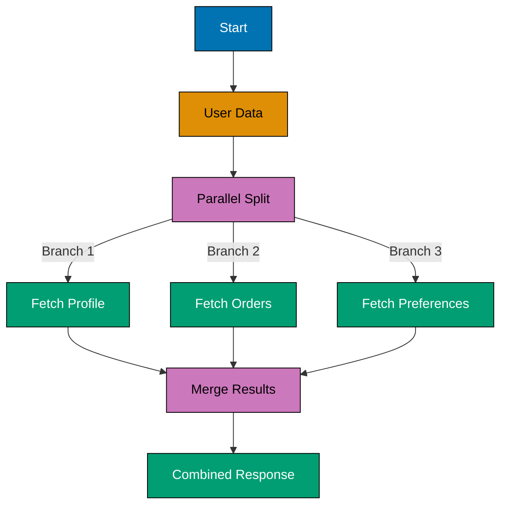

```json
{
  "nodes": [
    {
      "parameters": {
        "values": {
          "string": [
            {
              "name": "userId",
              "value": "user-123" // => User identifier
            }
          ]
        }
      },
      "name": "Input",
      "type": "n8n-nodes-base.set",
      "position": [250, 200]
    },
    {
      "parameters": {
        "url": "https://api-1.example.com/users/{{$json.userId}}/profile", // => First API call
        "options": {}
      },
      "name": "API 1: Profile",
      "type": "n8n-nodes-base.httpRequest",
      "position": [450, 100] // => Executes in parallel with API 2 & 3
    },
    {
      "parameters": {
        "url": "https://api-2.example.com/users/{{$json.userId}}/orders", // => Second API call
        "options": {}
      },
      "name": "API 2: Orders",
      "type": "n8n-nodes-base.httpRequest",
      "position": [450, 200] // => Executes in parallel with API 1 & 3
    },
    {
      "parameters": {
        "url": "https://api-3.example.com/users/{{$json.userId}}/preferences", // => Third API call
        "options": {}
      },
      "name": "API 3: Preferences",
      "type": "n8n-nodes-base.httpRequest",
      "position": [450, 300] // => Executes in parallel with API 1 & 2
    },
    {
      "parameters": {
        "mode": "mergeByPosition", // => Merge parallel results
        "options": {}
      },
      "name": "Merge Results",
      "type": "n8n-nodes-base.merge",
      "position": [650, 200]
    },
    {
      "parameters": {
        "functionCode": "// => Combine parallel results\nreturn [{json: {\n  userId: $json.userId, // => From original input\n  profile: $node['API 1: Profile'].json, // => Profile data\n  orders: $node['API 2: Orders'].json, // => Orders data\n  preferences: $node['API 3: Preferences'].json, // => Preferences data\n  executionTime: $execution.resumeFormData?.duration || 'parallel' // => Timing info\n}}];" // => Combined result
      },
      "name": "Combine Data",
      "type": "n8n-nodes-base.function",
      "position": [850, 200]
    }
  ],
  "connections": {
    "Input": {
      "main": [
        // => Fan-out to 3 parallel paths
        [{ "node": "API 1: Profile", "type": "main", "index": 0 }],
        [{ "node": "API 2: Orders", "type": "main", "index": 0 }],
        [{ "node": "API 3: Preferences", "type": "main", "index": 0 }]
      ]
    },
    "API 1: Profile": { "main": [[{ "node": "Merge Results", "type": "main", "index": 0 }]] },
    "API 2: Orders": { "main": [[{ "node": "Merge Results", "type": "main", "index": 1 }]] },
    "API 3: Preferences": { "main": [[{ "node": "Merge Results", "type": "main", "index": 2 }]] },
    "Merge Results": { "main": [[{ "node": "Combine Data", "type": "main", "index": 0 }]] }
  }
}
```

**Key Takeaway**: Split independent operations into parallel paths using multiple connections from a single node. Use Merge node to combine results. Parallel execution can reduce workflow time by up to 70% for I/O-bound operations.

## Example 81: Custom Node Creation with TypeScript

Create reusable custom nodes for organization-specific business logic using n8n's node development framework.

```json
{
  "nodes": [
    {
      "parameters": {
        "functionCode": "// => Custom node implementation (simplified)\n// Real custom nodes are TypeScript packages installed in n8n\n// This example shows the business logic that would go in a custom node\n\nclass CustomBusinessLogic {\n  async execute(items) { // => Main execution method\n    const results = [];\n    for (const item of items) { // => Process each item\n      const validated = this.validateInput(item.json); // => Input validation\n      const transformed = await this.applyBusinessRules(validated); // => Business logic\n      const enriched = await this.enrichData(transformed); // => Data enrichment\n      results.push({json: enriched}); // => Collect results\n    }\n    return results;\n  }\n\n  validateInput(data) { // => Schema validation\n    if (!data.customerId) throw new Error('customerId required');\n    if (!data.amount || data.amount <= 0) throw new Error('Invalid amount');\n    return data;\n  }\n\n  async applyBusinessRules(data) { // => Organization-specific logic\n    let discount = 0;\n    if (data.amount > 1000) discount = 0.1; // => Volume discount\n    if (data.loyaltyTier === 'gold') discount += 0.05; // => Loyalty discount\n    return {...data, discount, finalAmount: data.amount * (1 - discount)};\n  }\n\n  async enrichData(data) { // => External data enrichment\n    // Would call internal APIs or databases\n    return {...data, processedAt: new Date().toISOString(), nodeVersion: '1.0.0'};\n  }\n}\n\nconst logic = new CustomBusinessLogic(); // => Initialize\nreturn logic.execute(items); // => Execute\n" // => Execution result: Validated, transformed, and enriched data
      },
      "name": "Custom Business Node",
      "type": "n8n-nodes-base.function",
      "position": [250, 200]
    },
    {
      "parameters": {
        "functionCode": "// => Testing custom node behavior\nconst testCases = [\n  {customerId: 'C001', amount: 500, loyaltyTier: 'silver'}, // => Standard case\n  {customerId: 'C002', amount: 1500, loyaltyTier: 'gold'}, // => Volume + loyalty discount\n  {customerId: 'C003', amount: 2000, loyaltyTier: 'bronze'} // => Volume discount only\n];\nreturn testCases.map(tc => ({json: tc}));"
      },
      "name": "Test Data",
      "type": "n8n-nodes-base.function",
      "position": [50, 200]
    }
  ],
  "connections": {
    "Test Data": { "main": [[{ "node": "Custom Business Node", "type": "main", "index": 0 }]] }
  }
}
```

**Key Takeaway**: Encapsulate complex organization-specific logic in custom nodes for reusability across workflows. Use TypeScript for type safety and publish as npm packages. Custom nodes improve maintainability and standardization.

## Example 82: Function Node Patterns for Complex Logic

Implement advanced data processing using Function nodes with best practices for performance and maintainability.

```json
{
  "nodes": [
    {
      "parameters": {
        "functionCode": "// => Advanced function node patterns\n\n// Pattern 1: Async/await for external calls\nasync function fetchExternalData(id) { // => Helper function\n  const response = await fetch(`https://api.example.com/data/${id}`);\n  return response.json();\n}\n\n// Pattern 2: Error handling\ntry { // => Robust error handling\n  const results = [];\n  \n  // Pattern 3: Batch processing\n  const batchSize = 10; // => Process in batches\n  for (let i = 0; i < items.length; i += batchSize) { // => Chunk items\n    const batch = items.slice(i, i + batchSize);\n    \n    // Pattern 4: Parallel processing within batch\n    const batchResults = await Promise.all( // => Parallel API calls\n      batch.map(item => fetchExternalData(item.json.id))\n    );\n    \n    results.push(...batchResults.map((data, idx) => ({ // => Combine results\n      json: {\n        originalId: batch[idx].json.id,\n        externalData: data,\n        processedAt: new Date().toISOString()\n      }\n    })));\n    \n    // Pattern 5: Rate limiting\n    if (i + batchSize < items.length) { // => Don't wait after last batch\n      await new Promise(resolve => setTimeout(resolve, 100)); // => 100ms between batches\n    }\n  }\n  \n  return results;\n  \n} catch (error) { // => Error handling\n  console.error('Processing failed:', error); // => Log error\n  throw new Error(`Batch processing failed: ${error.message}`); // => Re-throw with context\n}\n" // => Returns: Processed items with external data
      },
      "name": "Advanced Function",
      "type": "n8n-nodes-base.function",
      "position": [250, 200]
    },
    {
      "parameters": {
        "functionCode": "// => Performance monitoring\nconst startTime = Date.now(); // => Track execution time\nconst results = items; // => Pass through\nconst endTime = Date.now();\nconst duration = endTime - startTime; // => Calculate duration\nconsole.log(`Processed ${items.length} items in ${duration}ms`); // => Log performance\nif (duration > 5000) console.warn('Performance threshold exceeded'); // => Alert on slow execution\nreturn results.map(item => ({ // => Add metadata\n  json: {...item.json, executionDuration: duration, itemsProcessed: items.length}\n}));"
      },
      "name": "Performance Monitor",
      "type": "n8n-nodes-base.function",
      "position": [450, 200]
    }
  ],
  "connections": {
    "Advanced Function": { "main": [[{ "node": "Performance Monitor", "type": "main", "index": 0 }]] }
  }
}
```

**Key Takeaway**: Use async/await for external calls, Promise.all for parallel processing, batch operations for large datasets, and always implement error handling. Monitor performance with execution time tracking.

## Example 83: Parent-Child Workflow Coordination

Orchestrate complex business processes by coordinating multiple child workflows from a parent workflow.

```json
{
  "nodes": [
    {
      "parameters": {
        "values": {
          "string": [
            {
              "name": "orderId",
              "value": "ORDER-123" // => Main order ID
            }
          ]
        }
      },
      "name": "Parent Workflow Start",
      "type": "n8n-nodes-base.set",
      "position": [250, 200]
    },
    {
      "parameters": {
        "workflowId": "{{$env.WORKFLOW_PAYMENT}}", // => Child workflow: Payment processing
        "parameters": {
          "orderId": "={{$json.orderId}}",
          "amount": 100 // => Payment amount
        }
      },
      "name": "Execute Payment",
      "type": "n8n-nodes-base.executeWorkflow",
      "position": [450, 100] // => Execution result: {"paymentId": "PAY-456", "status": "completed"}
    },
    {
      "parameters": {
        "workflowId": "={{$env.WORKFLOW_INVENTORY}}", // => Child workflow: Inventory update
        "parameters": {
          "orderId": "={{$json.orderId}}",
          "items": ["item1", "item2"] // => Items to reserve
        }
      },
      "name": "Reserve Inventory",
      "type": "n8n-nodes-base.executeWorkflow",
      "position": [450, 200] // => Execution result: {"reservationId": "RES-789", "status": "reserved"}
    },
    {
      "parameters": {
        "workflowId": "={{$env.WORKFLOW_SHIPPING}}", // => Child workflow: Shipping label
        "parameters": {
          "orderId": "={{$json.orderId}}",
          "address": "123 Main St" // => Shipping address
        }
      },
      "name": "Create Shipping Label",
      "type": "n8n-nodes-base.executeWorkflow",
      "position": [450, 300] // => Execution result: {"labelId": "SHIP-321", "trackingNumber": "TRACK-999"}
    },
    {
      "parameters": {
        "functionCode": "// => Coordinate child workflow results\nconst payment = $node['Execute Payment'].json; // => Payment result\nconst inventory = $node['Reserve Inventory'].json; // => Inventory result\nconst shipping = $node['Create Shipping Label'].json; // => Shipping result\n\nconst allSuccessful = [ // => Check all child workflows succeeded\n  payment.status === 'completed',\n  inventory.status === 'reserved',\n  shipping.trackingNumber\n].every(Boolean);\n\nif (!allSuccessful) { // => Rollback on failure\n  throw new Error('Order processing failed - rollback required');\n}\n\nreturn [{json: { // => Aggregate results\n  orderId: $node['Parent Workflow Start'].json.orderId,\n  paymentId: payment.paymentId,\n  reservationId: inventory.reservationId,\n  trackingNumber: shipping.trackingNumber,\n  status: 'order-completed',\n  completedAt: new Date().toISOString()\n}}];" // => Final order status
      },
      "name": "Coordinate Results",
      "type": "n8n-nodes-base.function",
      "position": [650, 200]
    }
  ],
  "connections": {
    "Parent Workflow Start": {
      "main": [
        // => Fan-out to child workflows
        [{ "node": "Execute Payment", "type": "main", "index": 0 }],
        [{ "node": "Reserve Inventory", "type": "main", "index": 0 }],
        [{ "node": "Create Shipping Label", "type": "main", "index": 0 }]
      ]
    },
    "Execute Payment": { "main": [[{ "node": "Coordinate Results", "type": "main", "index": 0 }]] },
    "Reserve Inventory": { "main": [[{ "node": "Coordinate Results", "type": "main", "index": 1 }]] },
    "Create Shipping Label": { "main": [[{ "node": "Coordinate Results", "type": "main", "index": 2 }]] }
  }
}
```

**Key Takeaway**: Use Execute Workflow node to orchestrate child workflows for modularity. Parent workflows coordinate multiple child workflows and handle success/failure aggregation. Implement rollback logic for transactional consistency.

## Example 84: Event-Driven Architecture with Webhooks

Build event-driven systems where workflows react to external events via webhook triggers and emit events to other systems.

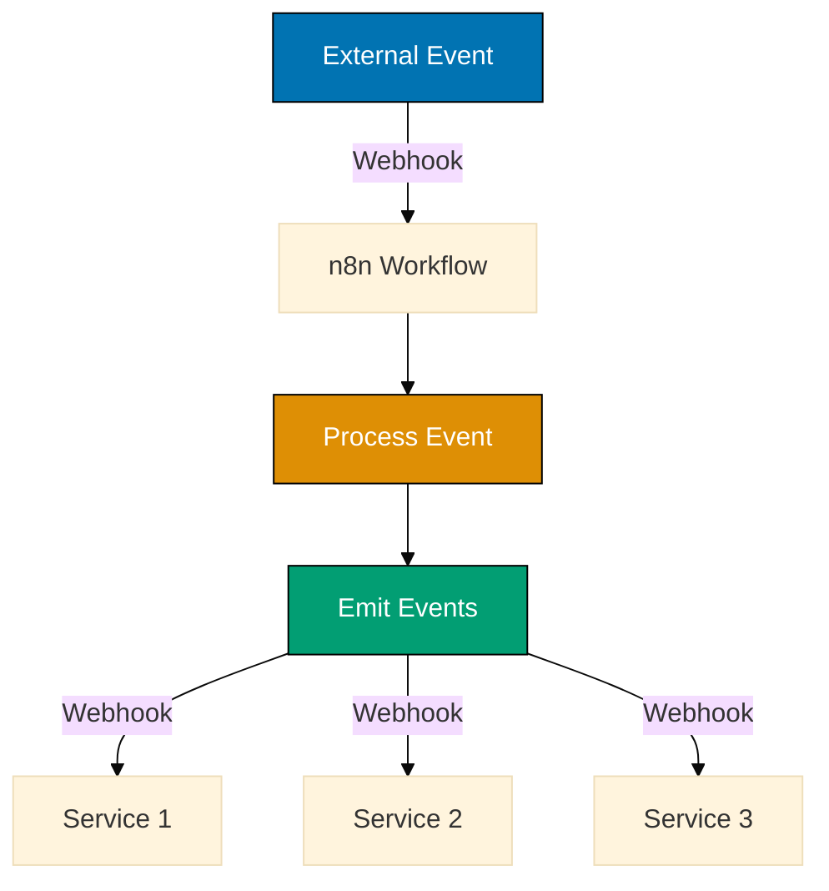

%% Color Palette: Blue #0173B2, Orange #DE8F05, Teal #029E73

```json
{
  "nodes": [
    {
      "parameters": {
        "path": "order-events", // => Webhook path: /webhook/order-events
        "responseMode": "responseNode",
        "options": {}
      },
      "name": "Incoming Event",
      "type": "n8n-nodes-base.webhook",
      "position": [250, 200] // => Receives: {"eventType": "order.created", "orderId": "123", "customerId": "C001"}
    },
    {
      "parameters": {
        "values": {
          "string": [
            {
              "name": "eventId",
              "value": "={{crypto.randomUUID()}}" // => Unique event ID
            },
            {
              "name": "eventType",
              "value": "={{$json.eventType}}" // => Event type from payload
            },
            {
              "name": "timestamp",
              "value": "={{new Date().toISOString()}}" // => Event timestamp
            },
            {
              "name": "correlationId",
              "value": "={{$json.orderId}}" // => Track related events
            }
          ]
        }
      },
      "name": "Enrich Event",
      "type": "n8n-nodes-base.set",
      "position": [450, 200]
    },
    {
      "parameters": {
        "operation": "insert",
        "table": "event_log", // => Store all events
        "columns": "event_id,event_type,correlation_id,timestamp,payload",
        "options": {}
      },
      "name": "Log Event",
      "type": "n8n-nodes-base.postgres",
      "position": [650, 200]
    },
    {
      "parameters": {
        "url": "https://inventory-service.example.com/webhooks/order-created", // => Inventory service
        "method": "POST",
        "sendBody": true,
        "body": "={{JSON.stringify({eventId: $json.eventId, orderId: $json.orderId})}}", // => Event payload
        "options": { "timeout": 5000 }
      },
      "name": "Notify Inventory",
      "type": "n8n-nodes-base.httpRequest",
      "position": [850, 100]
    },
    {
      "parameters": {
        "url": "https://shipping-service.example.com/webhooks/order-created", // => Shipping service
        "method": "POST",
        "sendBody": true,
        "body": "={{JSON.stringify({eventId: $json.eventId, orderId: $json.orderId})}}",
        "options": { "timeout": 5000 }
      },
      "name": "Notify Shipping",
      "type": "n8n-nodes-base.httpRequest",
      "position": [850, 200]
    },
    {
      "parameters": {
        "url": "https://analytics-service.example.com/webhooks/order-created", // => Analytics service
        "method": "POST",
        "sendBody": true,
        "body": "={{JSON.stringify({eventId: $json.eventId, orderId: $json.orderId, customerId: $json.customerId})}}",
        "options": { "timeout": 5000 }
      },
      "name": "Notify Analytics",
      "type": "n8n-nodes-base.httpRequest",
      "position": [850, 300]
    },
    {
      "parameters": {
        "respondWith": "json",
        "responseBody": "={{JSON.stringify({eventId: $json.eventId, status: 'accepted'})}}", // => Acknowledge receipt
        "options": { "responseCode": 202 } // => 202 Accepted
      },
      "name": "Respond to Webhook",
      "type": "n8n-nodes-base.respondToWebhook",
      "position": [1050, 200]
    }
  ],
  "connections": {
    "Incoming Event": { "main": [[{ "node": "Enrich Event", "type": "main", "index": 0 }]] },
    "Enrich Event": { "main": [[{ "node": "Log Event", "type": "main", "index": 0 }]] },
    "Log Event": {
      "main": [
        // => Fan-out to multiple services
        [{ "node": "Notify Inventory", "type": "main", "index": 0 }],
        [{ "node": "Notify Shipping", "type": "main", "index": 0 }],
        [{ "node": "Notify Analytics", "type": "main", "index": 0 }]
      ]
    },
    "Notify Inventory": { "main": [[{ "node": "Respond to Webhook", "type": "main", "index": 0 }]] },
    "Notify Shipping": { "main": [[{ "node": "Respond to Webhook", "type": "main", "index": 1 }]] },
    "Notify Analytics": { "main": [[{ "node": "Respond to Webhook", "type": "main", "index": 2 }]] }
  }
}
```

**Key Takeaway**: Use webhook triggers to receive events and fan-out to multiple downstream services via webhooks. Always log events with unique IDs and correlation IDs for tracing. Return 202 Accepted immediately for async processing.

## Example 85: Saga Pattern for Distributed Transactions

Implement long-running distributed transactions with compensating actions to maintain consistency across services.

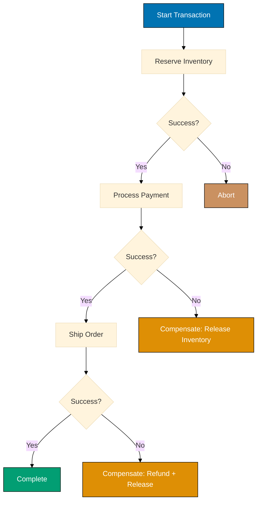

%% Color Palette: Blue #0173B2, Teal #029E73, Brown #CA9161, Orange #DE8F05

```json
{
  "nodes": [
    {
      "parameters": {
        "values": {
          "string": [
            {
              "name": "sagaId",
              "value": "={{crypto.randomUUID()}}" // => Unique saga transaction ID
            },
            {
              "name": "orderId",
              "value": "ORDER-123"
            }
          ]
        }
      },
      "name": "Start Saga",
      "type": "n8n-nodes-base.set",
      "position": [250, 200]
    },
    {
      "parameters": {
        "url": "https://inventory-service.example.com/reserve", // => Step 1: Reserve inventory
        "method": "POST",
        "sendBody": true,
        "body": "={{JSON.stringify({sagaId: $json.sagaId, orderId: $json.orderId, items: ['item1']})}}",
        "options": {}
      },
      "name": "Reserve Inventory",
      "type": "n8n-nodes-base.httpRequest",
      "continueOnFail": true, // => Continue on failure for compensation
      "position": [450, 200] // => Returns: {"reservationId": "RES-123", "status": "reserved"}
    },
    {
      "parameters": {
        "conditions": {
          "string": [
            {
              "value1": "={{$json.status}}", // => Check reservation status
              "operation": "equals",
              "value2": "reserved"
            }
          ]
        }
      },
      "name": "Inventory Reserved?",
      "type": "n8n-nodes-base.if",
      "position": [650, 200]
    },
    {
      "parameters": {
        "url": "https://payment-service.example.com/charge", // => Step 2: Process payment
        "method": "POST",
        "sendBody": true,
        "body": "={{JSON.stringify({sagaId: $json.sagaId, orderId: $json.orderId, amount: 100})}}",
        "options": {}
      },
      "name": "Process Payment",
      "type": "n8n-nodes-base.httpRequest",
      "continueOnFail": true,
      "position": [850, 100] // => Returns: {"paymentId": "PAY-456", "status": "charged"}
    },
    {
      "parameters": {
        "conditions": {
          "string": [
            {
              "value1": "={{$json.status}}",
              "operation": "equals",
              "value2": "charged"
            }
          ]
        }
      },
      "name": "Payment Successful?",
      "type": "n8n-nodes-base.if",
      "position": [1050, 100]
    },
    {
      "parameters": {
        "url": "https://shipping-service.example.com/ship", // => Step 3: Ship order
        "method": "POST",
        "sendBody": true,
        "body": "={{JSON.stringify({sagaId: $json.sagaId, orderId: $json.orderId})}}",
        "options": {}
      },
      "name": "Ship Order",
      "type": "n8n-nodes-base.httpRequest",
      "continueOnFail": true,
      "position": [1250, 50]
    },
    {
      "parameters": {
        "url": "https://inventory-service.example.com/release", // => Compensating action 1
        "method": "POST",
        "sendBody": true,
        "body": "={{JSON.stringify({sagaId: $node['Start Saga'].json.sagaId, reservationId: $node['Reserve Inventory'].json.reservationId})}}",
        "options": {}
      },
      "name": "Compensate: Release Inventory",
      "type": "n8n-nodes-base.httpRequest",
      "position": [1250, 200] // => Rollback inventory reservation
    },
    {
      "parameters": {
        "url": "https://payment-service.example.com/refund", // => Compensating action 2
        "method": "POST",
        "sendBody": true,
        "body": "={{JSON.stringify({sagaId: $node['Start Saga'].json.sagaId, paymentId: $node['Process Payment'].json.paymentId})}}",
        "options": {}
      },
      "name": "Compensate: Refund Payment",
      "type": "n8n-nodes-base.httpRequest",
      "position": [1450, 200]
    },
    {
      "parameters": {
        "values": {
          "string": [
            {
              "name": "status",
              "value": "saga-completed" // => Success status
            },
            {
              "name": "sagaId",
              "value": "={{$node['Start Saga'].json.sagaId}}"
            }
          ]
        }
      },
      "name": "Saga Completed",
      "type": "n8n-nodes-base.set",
      "position": [1450, 50]
    },
    {
      "parameters": {
        "values": {
          "string": [
            {
              "name": "status",
              "value": "saga-failed" // => Failure status
            },
            {
              "name": "sagaId",
              "value": "={{$node['Start Saga'].json.sagaId}}"
            }
          ]
        }
      },
      "name": "Saga Failed",
      "type": "n8n-nodes-base.set",
      "position": [1650, 200]
    }
  ],
  "connections": {
    "Start Saga": { "main": [[{ "node": "Reserve Inventory", "type": "main", "index": 0 }]] },
    "Reserve Inventory": { "main": [[{ "node": "Inventory Reserved?", "type": "main", "index": 0 }]] },
    "Inventory Reserved?": {
      "main": [
        [{ "node": "Saga Failed", "type": "main", "index": 0 }], // => Failed to reserve
        [{ "node": "Process Payment", "type": "main", "index": 0 }] // => Continue to payment
      ]
    },
    "Process Payment": { "main": [[{ "node": "Payment Successful?", "type": "main", "index": 0 }]] },
    "Payment Successful?": {
      "main": [
        [{ "node": "Compensate: Release Inventory", "type": "main", "index": 0 }], // => Payment failed, compensate
        [{ "node": "Ship Order", "type": "main", "index": 0 }] // => Continue to shipping
      ]
    },
    "Ship Order": { "main": [[{ "node": "Saga Completed", "type": "main", "index": 0 }]] }, // => Success or trigger compensation
    "Compensate: Release Inventory": { "main": [[{ "node": "Saga Failed", "type": "main", "index": 0 }]] },
    "Compensate: Refund Payment": { "main": [[{ "node": "Saga Failed", "type": "main", "index": 0 }]] }
  }
}
```

**Key Takeaway**: Use Saga pattern for distributed transactions requiring compensation logic. Each forward step (reserve, charge, ship) must have a corresponding compensating action (release, refund, cancel). Track saga with unique ID for correlation and idempotency.
