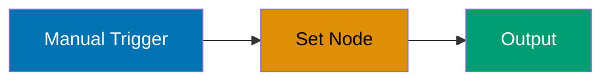
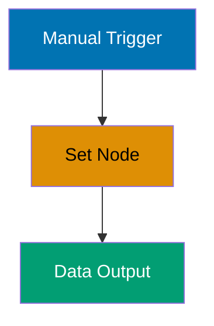
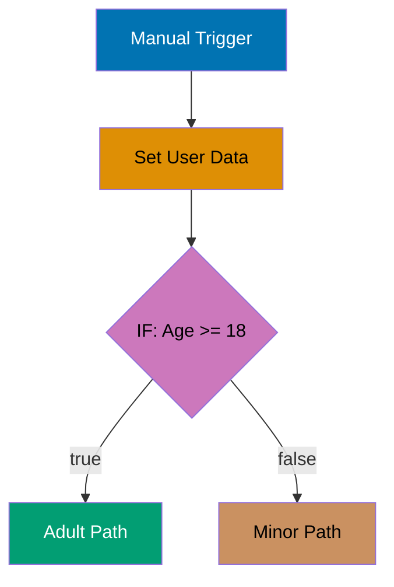
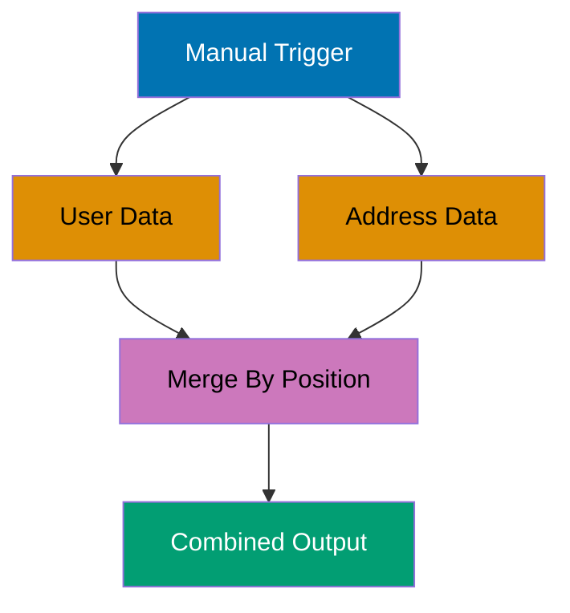
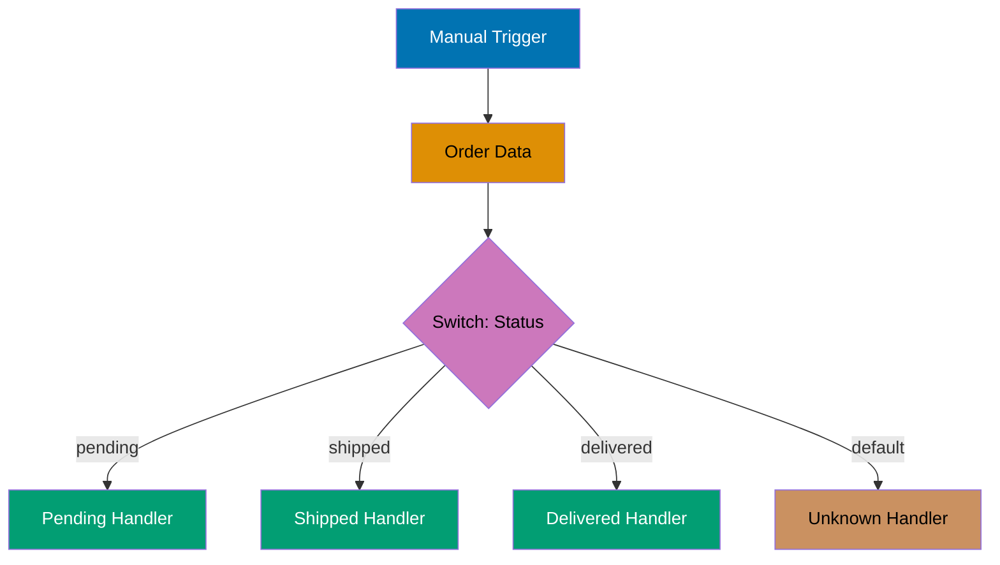
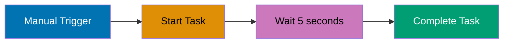

## Example 1: First Manual Workflow

A manual trigger workflow executes when you click "Execute Workflow" in the n8n editor. This is the simplest workflow type, ideal for testing and one-off operations that don't require automation.



```json
{
  "name": "First Manual Workflow",
  "nodes": [
    {
      "parameters": {},
      "name": "When clicking 'Test workflow'", // => Manual trigger node
      "type": "n8n-nodes-base.manualTrigger", // => Node type identifier
      "typeVersion": 1,
      "position": [250, 300], // => X, Y position in editor
      "id": "1" // => Unique node ID
    },
    {
      "parameters": {
        "values": {
          "string": [
            {
              "name": "message", // => Field name
              "value": "Hello from n8n!" // => Static value
            }
          ]
        },
        "options": {}
      },
      "name": "Set Message", // => Node display name
      "type": "n8n-nodes-base.set", // => Set node for data transformation
      "typeVersion": 1,
      "position": [450, 300],
      "id": "2"
    }
  ],
  "connections": {
    "When clicking 'Test workflow'": {
      "main": [
        [
          {
            "node": "Set Message", // => Connect manual trigger to Set node
            "type": "main", // => Main execution path
            "index": 0 // => Output index (0 = first output)
          }
        ]
      ]
    }
  }
}
// => Execution result: { "message": "Hello from n8n!" }
```

**Key Takeaway**: Manual trigger workflows are perfect for testing and development. Use them to validate node configurations before adding automated triggers.

---

## Example 2: HTTP Request to Public API

HTTP Request nodes fetch data from external APIs. This example demonstrates GET requests without authentication, the most common starting point for API integration.

```json
{
  "name": "Fetch Public API",
  "nodes": [
    {
      "parameters": {},
      "name": "Manual Trigger",
      "type": "n8n-nodes-base.manualTrigger",
      "typeVersion": 1,
      "position": [250, 300],
      "id": "1"
    },
    {
      "parameters": {
        "url": "https://api.github.com/users/n8n-io", // => Public GitHub API endpoint
        "options": {}
      },
      "name": "Get GitHub Profile",
      "type": "n8n-nodes-base.httpRequest", // => HTTP Request node
      "typeVersion": 3,
      "position": [450, 300],
      "id": "2"
    }
  ],
  "connections": {
    "Manual Trigger": {
      "main": [
        [
          {
            "node": "Get GitHub Profile",
            "type": "main",
            "index": 0
          }
        ]
      ]
    }
  }
}
// => HTTP GET to https://api.github.com/users/n8n-io
// => Response: { "login": "n8n-io", "name": "n8n", "public_repos": 150, ... }
// => Status code: 200 (success)
```

**Key Takeaway**: HTTP Request nodes are fundamental to n8n workflows. Start with public APIs (no authentication) to understand request/response patterns before adding credentials.

---

## Example 3: Data Inspection with Set Node

Set nodes create or modify data fields. This example shows how to build structured data from scratch, essential for understanding n8n's data model.



```json
{
  "name": "Create Structured Data",
  "nodes": [
    {
      "parameters": {},
      "name": "Manual Trigger",
      "type": "n8n-nodes-base.manualTrigger",
      "typeVersion": 1,
      "position": [250, 300],
      "id": "1"
    },
    {
      "parameters": {
        "values": {
          "string": [
            {
              "name": "firstName",
              "value": "Alice" // => String field
            },
            {
              "name": "lastName",
              "value": "Johnson"
            }
          ],
          "number": [
            {
              "name": "age",
              "value": 30 // => Number field
            }
          ],
          "boolean": [
            {
              "name": "active",
              "value": true // => Boolean field
            }
          ]
        },
        "options": {}
      },
      "name": "Build User Object",
      "type": "n8n-nodes-base.set",
      "typeVersion": 1,
      "position": [450, 300],
      "id": "2"
    }
  ],
  "connections": {
    "Manual Trigger": {
      "main": [[{ "node": "Build User Object", "type": "main", "index": 0 }]]
    }
  }
}
// => Output structure:
// => {
// =>   "firstName": "Alice",
// =>   "lastName": "Johnson",
// =>   "age": 30,
// =>   "active": true
// => }
```

**Key Takeaway**: Set nodes are the primary way to create and modify data in n8n. Use them to build structured objects, add fields, or transform data between nodes.

---

## Example 4: Basic Expressions

Expressions access data from previous nodes using `{{ }}` syntax. This example demonstrates reading fields and performing simple transformations.

```json
{
  "name": "Basic Expressions",
  "nodes": [
    {
      "parameters": {},
      "name": "Manual Trigger",
      "type": "n8n-nodes-base.manualTrigger",
      "typeVersion": 1,
      "position": [250, 300],
      "id": "1"
    },
    {
      "parameters": {
        "values": {
          "string": [
            {
              "name": "firstName",
              "value": "Bob"
            },
            {
              "name": "lastName",
              "value": "Smith"
            }
          ]
        }
      },
      "name": "Source Data",
      "type": "n8n-nodes-base.set",
      "typeVersion": 1,
      "position": [450, 300],
      "id": "2"
    },
    {
      "parameters": {
        "values": {
          "string": [
            {
              "name": "fullName",
              "value": "={{ $json.firstName }} {{ $json.lastName }}" // => Access fields from previous node
            },
            {
              "name": "initials",
              "value": "={{ $json.firstName.charAt(0) }}{{ $json.lastName.charAt(0) }}" // => JavaScript methods
            }
          ]
        }
      },
      "name": "Transform Data",
      "type": "n8n-nodes-base.set",
      "typeVersion": 1,
      "position": [650, 300],
      "id": "3"
    }
  ],
  "connections": {
    "Manual Trigger": {
      "main": [[{ "node": "Source Data", "type": "main", "index": 0 }]]
    },
    "Source Data": {
      "main": [[{ "node": "Transform Data", "type": "main", "index": 0 }]]
    }
  }
}
// => Source Data output: { "firstName": "Bob", "lastName": "Smith" }
// => Transform Data output: { "fullName": "Bob Smith", "initials": "BS" }
// => $json refers to current item's data from previous node
// => JavaScript methods (charAt, etc.) work inside expressions
```

**Key Takeaway**: Use `{{ $json.fieldName }}` to access data from the previous node. All JavaScript string/number/array methods work inside expressions.

---

## Example 5: IF Node for Conditional Logic

IF nodes route data based on conditions. This example shows basic conditional branching, essential for building decision-making workflows.



```json
{
  "name": "Conditional Routing",
  "nodes": [
    {
      "parameters": {},
      "name": "Manual Trigger",
      "type": "n8n-nodes-base.manualTrigger",
      "typeVersion": 1,
      "position": [250, 300],
      "id": "1"
    },
    {
      "parameters": {
        "values": {
          "number": [{ "name": "age", "value": 25 }]
        }
      },
      "name": "User Data",
      "type": "n8n-nodes-base.set",
      "typeVersion": 1,
      "position": [450, 300],
      "id": "2"
    },
    {
      "parameters": {
        "conditions": {
          "number": [
            {
              "value1": "={{ $json.age }}", // => Field to check
              "operation": "largerEqual", // => Comparison operator
              "value2": 18 // => Comparison value
            }
          ]
        }
      },
      "name": "Check Age",
      "type": "n8n-nodes-base.if", // => IF node for conditional routing
      "typeVersion": 1,
      "position": [650, 300],
      "id": "3"
    },
    {
      "parameters": {
        "values": {
          "string": [{ "name": "status", "value": "Adult" }]
        }
      },
      "name": "Adult",
      "type": "n8n-nodes-base.set",
      "typeVersion": 1,
      "position": [850, 250], // => True branch position (higher)
      "id": "4"
    },
    {
      "parameters": {
        "values": {
          "string": [{ "name": "status", "value": "Minor" }]
        }
      },
      "name": "Minor",
      "type": "n8n-nodes-base.set",
      "typeVersion": 1,
      "position": [850, 350], // => False branch position (lower)
      "id": "5"
    }
  ],
  "connections": {
    "Manual Trigger": {
      "main": [[{ "node": "User Data", "type": "main", "index": 0 }]]
    },
    "User Data": {
      "main": [[{ "node": "Check Age", "type": "main", "index": 0 }]]
    },
    "Check Age": {
      "main": [
        [{ "node": "Adult", "type": "main", "index": 0 }], // => Output 0: true condition
        [{ "node": "Minor", "type": "main", "index": 0 }] // => Output 1: false condition
      ]
    }
  }
}
// => Age 25 >= 18: true
// => Routes to Adult node (output 0)
// => Result: { "status": "Adult" }
```

**Key Takeaway**: IF nodes have two outputs: index 0 for true conditions, index 1 for false. Always connect both paths to handle all cases.

---

## Example 6: Webhook Trigger

Webhook triggers receive HTTP requests from external systems. This example creates a simple webhook endpoint that accepts POST requests.

```json
{
  "name": "Webhook Receiver",
  "nodes": [
    {
      "parameters": {
        "httpMethod": "POST", // => Accept POST requests
        "path": "user-created", // => Webhook path: /webhook/user-created
        "responseMode": "responseNode", // => Use Respond to Webhook node for response
        "options": {}
      },
      "name": "Webhook",
      "type": "n8n-nodes-base.webhook", // => Webhook trigger node
      "typeVersion": 1,
      "position": [250, 300],
      "webhookId": "abc123", // => Unique webhook identifier
      "id": "1"
    },
    {
      "parameters": {
        "values": {
          "string": [
            {
              "name": "receivedData",
              "value": "={{ JSON.stringify($json.body) }}" // => Access webhook body data
            }
          ]
        }
      },
      "name": "Process Webhook",
      "type": "n8n-nodes-base.set",
      "typeVersion": 1,
      "position": [450, 300],
      "id": "2"
    },
    {
      "parameters": {
        "respondWith": "json", // => Return JSON response
        "responseBody": "={{ { \"status\": \"received\", \"id\": $json.body.id } }}"
      },
      "name": "Respond to Webhook",
      "type": "n8n-nodes-base.respondToWebhook", // => Send HTTP response
      "typeVersion": 1,
      "position": [650, 300],
      "id": "3"
    }
  ],
  "connections": {
    "Webhook": {
      "main": [[{ "node": "Process Webhook", "type": "main", "index": 0 }]]
    },
    "Process Webhook": {
      "main": [[{ "node": "Respond to Webhook", "type": "main", "index": 0 }]]
    }
  }
}
// => Webhook URL: http://localhost:5678/webhook/user-created
// => POST request body: { "id": 123, "name": "Alice" }
// => $json.body contains: { "id": 123, "name": "Alice" }
// => Response: { "status": "received", "id": 123 }
```

**Key Takeaway**: Webhook triggers enable real-time integrations. Use `responseNode` mode with Respond to Webhook node to send custom HTTP responses back to the caller.

---

## Example 7: Schedule Trigger (Cron)

Schedule triggers execute workflows at specific times. This example runs every day at 9 AM using cron syntax.


```json
{
  "name": "Daily Report",
  "nodes": [
    {
      "parameters": {
        "rule": {
          "interval": [
            {
              "field": "cronExpression",
              "expression": "0 9 * * *" // => Cron: At 9:00 AM every day
            }
          ]
        }
      },
      "name": "Schedule Trigger",
      "type": "n8n-nodes-base.scheduleTrigger", // => Schedule/cron trigger node
      "typeVersion": 1,
      "position": [250, 300],
      "id": "1"
    },
    {
      "parameters": {
        "values": {
          "string": [
            {
              "name": "task",
              "value": "Generate daily report"
            },
            {
              "name": "timestamp",
              "value": "={{ new Date().toISOString() }}" // => Current timestamp when executed
            }
          ]
        }
      },
      "name": "Report Task",
      "type": "n8n-nodes-base.set",
      "typeVersion": 1,
      "position": [450, 300],
      "id": "2"
    }
  ],
  "connections": {
    "Schedule Trigger": {
      "main": [[{ "node": "Report Task", "type": "main", "index": 0 }]]
    }
  }
}
// => Cron format: minute hour day month weekday
// => "0 9 * * *" means: minute=0, hour=9, any day, any month, any weekday
// => Executes automatically at 9:00 AM server time every day
// => Output: { "task": "Generate daily report", "timestamp": "2025-12-29T02:00:00.000Z" }
```

**Key Takeaway**: Use cron expressions for precise scheduling. Test with "Execute Workflow" before enabling to verify the workflow logic.

---

## Example 8: Multiple Items Processing

n8n processes data as arrays of items. This example shows how Set nodes handle multiple items simultaneously.

```json
{
  "name": "Process Multiple Items",
  "nodes": [
    {
      "parameters": {},
      "name": "Manual Trigger",
      "type": "n8n-nodes-base.manualTrigger",
      "typeVersion": 1,
      "position": [250, 300],
      "id": "1"
    },
    {
      "parameters": {
        "values": {
          "string": [
            {
              "name": "items",
              "value": "={{ JSON.stringify([{\"name\": \"Alice\", \"age\": 30}, {\"name\": \"Bob\", \"age\": 25}]) }}"
            }
          ]
        },
        "options": {}
      },
      "name": "Create Items",
      "type": "n8n-nodes-base.set",
      "typeVersion": 1,
      "position": [450, 300],
      "id": "2"
    },
    {
      "parameters": {
        "functionCode": "// => Split JSON string into individual items\nconst items = JSON.parse($json.items);\nreturn items.map(item => ({ json: item }));"
        // => Input: Single item with JSON string
        // => Output: Multiple items (one per user)
      },
      "name": "Split Into Items",
      "type": "n8n-nodes-base.function", // => Function node for custom JavaScript
      "typeVersion": 1,
      "position": [650, 300],
      "id": "3"
    },
    {
      "parameters": {
        "values": {
          "string": [
            {
              "name": "greeting",
              "value": "={{ \"Hello, \" + $json.name }}" // => Processed for each item
            }
          ]
        }
      },
      "name": "Add Greeting",
      "type": "n8n-nodes-base.set",
      "typeVersion": 1,
      "position": [850, 300],
      "id": "4"
    }
  ],
  "connections": {
    "Manual Trigger": {
      "main": [[{ "node": "Create Items", "type": "main", "index": 0 }]]
    },
    "Create Items": {
      "main": [[{ "node": "Split Into Items", "type": "main", "index": 0 }]]
    },
    "Split Into Items": {
      "main": [[{ "node": "Add Greeting", "type": "main", "index": 0 }]]
    }
  }
}
// => Create Items output: 1 item with JSON string
// => Split Into Items output: 2 items
// =>   Item 0: { "name": "Alice", "age": 30 }
// =>   Item 1: { "name": "Bob", "age": 25 }
// => Add Greeting output: 2 items
// =>   Item 0: { "name": "Alice", "age": 30, "greeting": "Hello, Alice" }
// =>   Item 1: { "name": "Bob", "age": 25, "greeting": "Hello, Bob" }
```

**Key Takeaway**: n8n automatically processes all items through each node. Use Function nodes to split single items into multiple items when needed.

---

## Example 9: Error Handling with Continue On Fail

Workflows stop on errors by default. This example shows how to continue execution when errors occur, essential for robust workflows.

```json
{
  "name": "Error Handling",
  "nodes": [
    {
      "parameters": {},
      "name": "Manual Trigger",
      "type": "n8n-nodes-base.manualTrigger",
      "typeVersion": 1,
      "position": [250, 300],
      "id": "1"
    },
    {
      "parameters": {
        "url": "https://api.invalid-domain-that-does-not-exist.com/data", // => Invalid URL
        "options": {}
      },
      "continueOnFail": true, // => Continue workflow even if this node fails
      "name": "Failing Request",
      "type": "n8n-nodes-base.httpRequest",
      "typeVersion": 3,
      "position": [450, 300],
      "id": "2"
    },
    {
      "parameters": {
        "conditions": {
          "boolean": [
            {
              "value1": "={{ $json.error !== undefined }}", // => Check if error exists
              "value2": true
            }
          ]
        }
      },
      "name": "Check Error",
      "type": "n8n-nodes-base.if",
      "typeVersion": 1,
      "position": [650, 300],
      "id": "3"
    },
    {
      "parameters": {
        "values": {
          "string": [
            {
              "name": "message",
              "value": "={{ \"Error occurred: \" + $json.error.message }}"
            }
          ]
        }
      },
      "name": "Handle Error",
      "type": "n8n-nodes-base.set",
      "typeVersion": 1,
      "position": [850, 250],
      "id": "4"
    },
    {
      "parameters": {
        "values": {
          "string": [{ "name": "message", "value": "Success" }]
        }
      },
      "name": "Success Path",
      "type": "n8n-nodes-base.set",
      "typeVersion": 1,
      "position": [850, 350],
      "id": "5"
    }
  ],
  "connections": {
    "Manual Trigger": {
      "main": [[{ "node": "Failing Request", "type": "main", "index": 0 }]]
    },
    "Failing Request": {
      "main": [[{ "node": "Check Error", "type": "main", "index": 0 }]]
    },
    "Check Error": {
      "main": [
        [{ "node": "Handle Error", "type": "main", "index": 0 }],
        [{ "node": "Success Path", "type": "main", "index": 0 }]
      ]
    }
  }
}
// => Failing Request: HTTP error (DNS resolution failed)
// => continueOnFail: true prevents workflow from stopping
// => Output includes error: { "error": { "message": "getaddrinfo ENOTFOUND...", ... } }
// => Check Error: true branch (error exists)
// => Result: { "message": "Error occurred: getaddrinfo ENOTFOUND..." }
```

**Key Takeaway**: Enable `continueOnFail` on nodes that might fail. Check for `$json.error` in downstream nodes to detect and handle failures.

---

## Example 10: Function Node Basics

Function nodes execute custom JavaScript code. This example shows basic data transformation using JavaScript.

```json
{
  "name": "Function Node Basics",
  "nodes": [
    {
      "parameters": {},
      "name": "Manual Trigger",
      "type": "n8n-nodes-base.manualTrigger",
      "typeVersion": 1,
      "position": [250, 300],
      "id": "1"
    },
    {
      "parameters": {
        "values": {
          "number": [
            { "name": "price", "value": 100 },
            { "name": "quantity", "value": 3 }
          ]
        }
      },
      "name": "Order Data",
      "type": "n8n-nodes-base.set",
      "typeVersion": 1,
      "position": [450, 300],
      "id": "2"
    },
    {
      "parameters": {
        "functionCode": "// => Access input data via $input.item.json\nconst price = $input.item.json.price;\nconst quantity = $input.item.json.quantity;\n\n// => Calculate total\nconst total = price * quantity;\n\n// => Return new item with calculated field\nreturn {\n  ...($input.item.json),  // => Spread existing fields\n  total: total,           // => Add new field\n  currency: 'USD'\n};"
      },
      "name": "Calculate Total",
      "type": "n8n-nodes-base.code", // => Code node (newer version of Function node)
      "typeVersion": 2,
      "position": [650, 300],
      "id": "3"
    }
  ],
  "connections": {
    "Manual Trigger": {
      "main": [[{ "node": "Order Data", "type": "main", "index": 0 }]]
    },
    "Order Data": {
      "main": [[{ "node": "Calculate Total", "type": "main", "index": 0 }]]
    }
  }
}
// => Order Data output: { "price": 100, "quantity": 3 }
// => Calculate Total: price * quantity = 300
// => Function output: { "price": 100, "quantity": 3, "total": 300, "currency": "USD" }
// => $input.item.json contains data from previous node
```

**Key Takeaway**: Use Code/Function nodes for complex transformations that expressions can't handle. Access input data via `$input.item.json` and return JavaScript objects.

---

## Example 11: Working with Arrays

Arrays are common in API responses. This example shows how to iterate over arrays and extract data.

```json
{
  "name": "Array Processing",
  "nodes": [
    {
      "parameters": {},
      "name": "Manual Trigger",
      "type": "n8n-nodes-base.manualTrigger",
      "typeVersion": 1,
      "position": [250, 300],
      "id": "1"
    },
    {
      "parameters": {
        "functionCode": "// => Create sample array data\nconst users = [\n  { id: 1, name: 'Alice', active: true },\n  { id: 2, name: 'Bob', active: false },\n  { id: 3, name: 'Charlie', active: true }\n];\n\n// => Return array as multiple items\nreturn users.map(user => ({ json: user }));"
      },
      "name": "Generate Users",
      "type": "n8n-nodes-base.code",
      "typeVersion": 2,
      "position": [450, 300],
      "id": "2"
    },
    {
      "parameters": {
        "conditions": {
          "boolean": [
            {
              "value1": "={{ $json.active }}",
              "value2": true
            }
          ]
        }
      },
      "name": "Filter Active",
      "type": "n8n-nodes-base.if",
      "typeVersion": 1,
      "position": [650, 300],
      "id": "3"
    },
    {
      "parameters": {
        "values": {
          "string": [
            {
              "name": "userName",
              "value": "={{ $json.name }}"
            }
          ]
        }
      },
      "name": "Extract Names",
      "type": "n8n-nodes-base.set",
      "typeVersion": 1,
      "position": [850, 250],
      "id": "4"
    }
  ],
  "connections": {
    "Manual Trigger": {
      "main": [[{ "node": "Generate Users", "type": "main", "index": 0 }]]
    },
    "Generate Users": {
      "main": [[{ "node": "Filter Active", "type": "main", "index": 0 }]]
    },
    "Filter Active": {
      "main": [[{ "node": "Extract Names", "type": "main", "index": 0 }]]
    }
  }
}
// => Generate Users output: 3 items (Alice, Bob, Charlie)
// => Filter Active: Check each item's active field
// =>   Item 0 (Alice): active=true → true output
// =>   Item 1 (Bob): active=false → false output (filtered out)
// =>   Item 2 (Charlie): active=true → true output
// => Extract Names output: 2 items
// =>   Item 0: { "userName": "Alice" }
// =>   Item 1: { "userName": "Charlie" }
```

**Key Takeaway**: n8n processes arrays as separate items automatically. Use IF nodes to filter items, and downstream nodes only receive the filtered subset.

---

## Example 12: Merge Node - Combine Data

Merge nodes combine data from multiple branches. This example shows the "Merge By Position" mode, which pairs items by their index.



```json
{
  "name": "Merge Data",
  "nodes": [
    {
      "parameters": {},
      "name": "Manual Trigger",
      "type": "n8n-nodes-base.manualTrigger",
      "typeVersion": 1,
      "position": [250, 300],
      "id": "1"
    },
    {
      "parameters": {
        "functionCode": "return [\n  { json: { name: 'Alice', age: 30 } },\n  { json: { name: 'Bob', age: 25 } }\n];"
      },
      "name": "User Data",
      "type": "n8n-nodes-base.code",
      "typeVersion": 2,
      "position": [450, 250],
      "id": "2"
    },
    {
      "parameters": {
        "functionCode": "return [\n  { json: { city: 'New York', zip: '10001' } },\n  { json: { city: 'Boston', zip: '02101' } }\n];"
      },
      "name": "Address Data",
      "type": "n8n-nodes-base.code",
      "typeVersion": 2,
      "position": [450, 350],
      "id": "3"
    },
    {
      "parameters": {
        "mode": "combine", // => Merge mode: combine fields from both inputs
        "mergeByFields": {
          "values": []
        },
        "options": {}
      },
      "name": "Merge",
      "type": "n8n-nodes-base.merge", // => Merge node combines data from multiple inputs
      "typeVersion": 2,
      "position": [650, 300],
      "id": "4"
    }
  ],
  "connections": {
    "Manual Trigger": {
      "main": [
        [{ "node": "User Data", "type": "main", "index": 0 }],
        [{ "node": "Address Data", "type": "main", "index": 0 }]
      ]
    },
    "User Data": {
      "main": [[{ "node": "Merge", "type": "main", "index": 0 }]] // => Input 1
    },
    "Address Data": {
      "main": [[{ "node": "Merge", "type": "main", "index": 1 }]] // => Input 2
    }
  }
}
// => User Data output: 2 items
// =>   Item 0: { "name": "Alice", "age": 30 }
// =>   Item 1: { "name": "Bob", "age": 25 }
// => Address Data output: 2 items
// =>   Item 0: { "city": "New York", "zip": "10001" }
// =>   Item 1: { "city": "Boston", "zip": "02101" }
// => Merge output: 2 items (combined by position)
// =>   Item 0: { "name": "Alice", "age": 30, "city": "New York", "zip": "10001" }
// =>   Item 1: { "name": "Bob", "age": 25, "city": "Boston", "zip": "02101" }
```

**Key Takeaway**: Merge nodes have multiple input connectors. Use "Combine" mode to merge fields from items at the same position across inputs.

---

## Example 13: HTTP Request with Headers

Custom HTTP headers enable authentication and API-specific requirements. This example demonstrates adding headers to requests.

```json
{
  "name": "HTTP with Headers",
  "nodes": [
    {
      "parameters": {},
      "name": "Manual Trigger",
      "type": "n8n-nodes-base.manualTrigger",
      "typeVersion": 1,
      "position": [250, 300],
      "id": "1"
    },
    {
      "parameters": {
        "url": "https://api.github.com/repos/n8n-io/n8n",
        "options": {
          "headers": {
            "parameters": [
              {
                "name": "User-Agent", // => GitHub requires User-Agent header
                "value": "n8n-workflow"
              },
              {
                "name": "Accept",
                "value": "application/vnd.github.v3+json" // => API version header
              }
            ]
          }
        }
      },
      "name": "GitHub API",
      "type": "n8n-nodes-base.httpRequest",
      "typeVersion": 3,
      "position": [450, 300],
      "id": "2"
    }
  ],
  "connections": {
    "Manual Trigger": {
      "main": [[{ "node": "GitHub API", "type": "main", "index": 0 }]]
    }
  }
}
// => Request headers:
// =>   User-Agent: n8n-workflow
// =>   Accept: application/vnd.github.v3+json
// => Response: Repository data with API version 3 format
// => { "name": "n8n", "full_name": "n8n-io/n8n", "stargazers_count": 45000, ... }
```

**Key Takeaway**: Add custom headers in HTTP Request node options. Many APIs require specific headers like User-Agent, Accept, or Content-Type.

---

## Example 14: POST Request with JSON Body

POST requests send data to APIs. This example demonstrates sending JSON payloads in request bodies.

```json
{
  "name": "POST with JSON",
  "nodes": [
    {
      "parameters": {},
      "name": "Manual Trigger",
      "type": "n8n-nodes-base.manualTrigger",
      "typeVersion": 1,
      "position": [250, 300],
      "id": "1"
    },
    {
      "parameters": {
        "url": "https://jsonplaceholder.typicode.com/posts", // => Test API endpoint
        "method": "POST", // => HTTP POST method
        "sendBody": true, // => Enable request body
        "bodyParameters": {
          "parameters": [
            {
              "name": "title",
              "value": "Test Post"
            },
            {
              "name": "body",
              "value": "This is a test post body"
            },
            {
              "name": "userId",
              "value": "1"
            }
          ]
        },
        "options": {
          "headers": {
            "parameters": [
              {
                "name": "Content-Type",
                "value": "application/json" // => JSON content type
              }
            ]
          }
        }
      },
      "name": "Create Post",
      "type": "n8n-nodes-base.httpRequest",
      "typeVersion": 3,
      "position": [450, 300],
      "id": "2"
    }
  ],
  "connections": {
    "Manual Trigger": {
      "main": [[{ "node": "Create Post", "type": "main", "index": 0 }]]
    }
  }
}
// => Request method: POST
// => Request body: { "title": "Test Post", "body": "This is a test post body", "userId": "1" }
// => Request header: Content-Type: application/json
// => Response: { "id": 101, "title": "Test Post", "body": "This is a test post body", "userId": "1" }
// => Status: 201 Created
```

**Key Takeaway**: Enable "Send Body" and add body parameters for POST requests. Set Content-Type header to application/json when sending JSON data.

---

## Example 15: Query Parameters in URLs

Query parameters filter or configure API requests. This example shows how to add query parameters to GET requests.

```json
{
  "name": "URL Query Parameters",
  "nodes": [
    {
      "parameters": {},
      "name": "Manual Trigger",
      "type": "n8n-nodes-base.manualTrigger",
      "typeVersion": 1,
      "position": [250, 300],
      "id": "1"
    },
    {
      "parameters": {
        "url": "https://api.github.com/search/repositories",
        "options": {
          "queryParameters": {
            "parameters": [
              {
                "name": "q", // => Search query parameter
                "value": "language:typescript stars:>1000"
              },
              {
                "name": "sort", // => Sort parameter
                "value": "stars"
              },
              {
                "name": "order",
                "value": "desc"
              },
              {
                "name": "per_page", // => Results per page
                "value": "5"
              }
            ]
          }
        }
      },
      "name": "Search Repos",
      "type": "n8n-nodes-base.httpRequest",
      "typeVersion": 3,
      "position": [450, 300],
      "id": "2"
    }
  ],
  "connections": {
    "Manual Trigger": {
      "main": [[{ "node": "Search Repos", "type": "main", "index": 0 }]]
    }
  }
}
// => Final URL: https://api.github.com/search/repositories?q=language:typescript+stars:>1000&sort=stars&order=desc&per_page=5
// => Query parameters encoded and appended automatically
// => Response: { "total_count": 5432, "items": [ {...}, {...}, ... ] }
// => items array contains 5 repositories
```

**Key Takeaway**: Use Query Parameters option instead of manually constructing URLs. n8n handles URL encoding and formatting automatically.

---

## Example 16: Reading Credentials

Credentials store authentication details securely. This example shows how to create and reference credentials.

```json
{
  "name": "Using Credentials",
  "nodes": [
    {
      "parameters": {},
      "name": "Manual Trigger",
      "type": "n8n-nodes-base.manualTrigger",
      "typeVersion": 1,
      "position": [250, 300],
      "id": "1"
    },
    {
      "parameters": {
        "url": "https://api.example.com/protected",
        "authentication": "predefinedCredentialType", // => Use credential instead of manual auth
        "nodeCredentialType": "httpHeaderAuth", // => Credential type: Header Auth
        "options": {}
      },
      "credentials": {
        "httpHeaderAuth": {
          "id": "1",
          "name": "API Key Credential" // => Reference to stored credential
        }
      },
      "name": "Authenticated Request",
      "type": "n8n-nodes-base.httpRequest",
      "typeVersion": 3,
      "position": [450, 300],
      "id": "2"
    }
  ],
  "connections": {
    "Manual Trigger": {
      "main": [[{ "node": "Authenticated Request", "type": "main", "index": 0 }]]
    }
  }
}
// => Credential configuration (created in n8n UI):
// =>   Type: Header Auth
// =>   Name: X-API-Key
// =>   Value: your-secret-key-here (encrypted in database)
// => Request header: X-API-Key: your-secret-key-here
// => Credentials are encrypted and reusable across workflows
```

**Key Takeaway**: Store API keys and tokens as credentials, not hardcoded values. Credentials are encrypted and can be shared across multiple workflows.

---

## Example 17: Switch Node for Multiple Conditions

Switch nodes route data to different paths based on multiple conditions. This is more efficient than chaining multiple IF nodes.



```json
{
  "name": "Switch Routing",
  "nodes": [
    {
      "parameters": {},
      "name": "Manual Trigger",
      "type": "n8n-nodes-base.manualTrigger",
      "typeVersion": 1,
      "position": [250, 300],
      "id": "1"
    },
    {
      "parameters": {
        "values": {
          "string": [
            { "name": "orderId", "value": "ORD-123" },
            { "name": "status", "value": "shipped" }
          ]
        }
      },
      "name": "Order",
      "type": "n8n-nodes-base.set",
      "typeVersion": 1,
      "position": [450, 300],
      "id": "2"
    },
    {
      "parameters": {
        "dataType": "string",
        "value1": "={{ $json.status }}", // => Field to check
        "rules": {
          "rules": [
            {
              "value2": "pending", // => Output 0: pending status
              "output": 0
            },
            {
              "value2": "shipped", // => Output 1: shipped status
              "output": 1
            },
            {
              "value2": "delivered", // => Output 2: delivered status
              "output": 2
            }
          ]
        },
        "fallbackOutput": 3 // => Output 3: default/unknown (if no rules match)
      },
      "name": "Route By Status",
      "type": "n8n-nodes-base.switch", // => Switch node for multiple conditions
      "typeVersion": 1,
      "position": [650, 300],
      "id": "3"
    },
    {
      "parameters": {
        "values": {
          "string": [{ "name": "action", "value": "Send pending notification" }]
        }
      },
      "name": "Pending",
      "type": "n8n-nodes-base.set",
      "typeVersion": 1,
      "position": [850, 200],
      "id": "4"
    },
    {
      "parameters": {
        "values": {
          "string": [{ "name": "action", "value": "Update tracking info" }]
        }
      },
      "name": "Shipped",
      "type": "n8n-nodes-base.set",
      "typeVersion": 1,
      "position": [850, 280],
      "id": "5"
    },
    {
      "parameters": {
        "values": {
          "string": [{ "name": "action", "value": "Request review" }]
        }
      },
      "name": "Delivered",
      "type": "n8n-nodes-base.set",
      "typeVersion": 1,
      "position": [850, 360],
      "id": "6"
    },
    {
      "parameters": {
        "values": {
          "string": [{ "name": "action", "value": "Log unknown status" }]
        }
      },
      "name": "Unknown",
      "type": "n8n-nodes-base.set",
      "typeVersion": 1,
      "position": [850, 440],
      "id": "7"
    }
  ],
  "connections": {
    "Manual Trigger": {
      "main": [[{ "node": "Order", "type": "main", "index": 0 }]]
    },
    "Order": {
      "main": [[{ "node": "Route By Status", "type": "main", "index": 0 }]]
    },
    "Route By Status": {
      "main": [
        [{ "node": "Pending", "type": "main", "index": 0 }], // => Output 0
        [{ "node": "Shipped", "type": "main", "index": 0 }], // => Output 1
        [{ "node": "Delivered", "type": "main", "index": 0 }], // => Output 2
        [{ "node": "Unknown", "type": "main", "index": 0 }] // => Output 3 (fallback)
      ]
    }
  }
}
// => Order status: "shipped"
// => Switch evaluates rules in order
// =>   Rule 0: "shipped" == "pending"? false
// =>   Rule 1: "shipped" == "shipped"? true → output 1
// => Routes to Shipped node (output 1)
// => Result: { "orderId": "ORD-123", "status": "shipped", "action": "Update tracking info" }
```

**Key Takeaway**: Use Switch nodes instead of multiple IF nodes when routing based on discrete values. Configure fallback output to handle unexpected values.

---

## Example 18: Item Lists Node

Item Lists nodes create multiple items from single inputs or aggregate multiple items. This example shows splitting a string into items.

```json
{
  "name": "Item Lists",
  "nodes": [
    {
      "parameters": {},
      "name": "Manual Trigger",
      "type": "n8n-nodes-base.manualTrigger",
      "typeVersion": 1,
      "position": [250, 300],
      "id": "1"
    },
    {
      "parameters": {
        "values": {
          "string": [
            {
              "name": "emails",
              "value": "alice@example.com,bob@example.com,charlie@example.com"
            }
          ]
        }
      },
      "name": "Email List",
      "type": "n8n-nodes-base.set",
      "typeVersion": 1,
      "position": [450, 300],
      "id": "2"
    },
    {
      "parameters": {
        "operation": "split", // => Split operation
        "fieldToSplitOut": "emails", // => Field containing delimited string
        "options": {
          "destinationFieldName": "email", // => Name for each split item
          "separator": "," // => Delimiter
        }
      },
      "name": "Split Emails",
      "type": "n8n-nodes-base.itemLists", // => Item Lists node
      "typeVersion": 1,
      "position": [650, 300],
      "id": "3"
    }
  ],
  "connections": {
    "Manual Trigger": {
      "main": [[{ "node": "Email List", "type": "main", "index": 0 }]]
    },
    "Email List": {
      "main": [[{ "node": "Split Emails", "type": "main", "index": 0 }]]
    }
  }
}
// => Email List output: 1 item
// =>   { "emails": "alice@example.com,bob@example.com,charlie@example.com" }
// => Split Emails output: 3 items
// =>   Item 0: { "email": "alice@example.com" }
// =>   Item 1: { "email": "bob@example.com" }
// =>   Item 2: { "email": "charlie@example.com" }
```

**Key Takeaway**: Use Item Lists node to split delimited strings into separate items. Each item can then be processed independently by downstream nodes.

---

## Example 19: Aggregate Node (Sum)

Aggregate nodes perform calculations across multiple items. This example sums numeric values.

```json
{
  "name": "Aggregate Sum",
  "nodes": [
    {
      "parameters": {},
      "name": "Manual Trigger",
      "type": "n8n-nodes-base.manualTrigger",
      "typeVersion": 1,
      "position": [250, 300],
      "id": "1"
    },
    {
      "parameters": {
        "functionCode": "return [\n  { json: { product: 'A', price: 100 } },\n  { json: { product: 'B', price: 150 } },\n  { json: { product: 'C', price: 200 } }\n];"
      },
      "name": "Sales Data",
      "type": "n8n-nodes-base.code",
      "typeVersion": 2,
      "position": [450, 300],
      "id": "2"
    },
    {
      "parameters": {
        "aggregate": "sum", // => Aggregation type: sum
        "fieldsToAggregate": {
          "fields": [
            {
              "fieldToAggregate": "price", // => Field to sum
              "outputFieldName": "totalRevenue" // => Output field name
            }
          ]
        },
        "options": {}
      },
      "name": "Calculate Total",
      "type": "n8n-nodes-base.aggregate", // => Aggregate node
      "typeVersion": 1,
      "position": [650, 300],
      "id": "3"
    }
  ],
  "connections": {
    "Manual Trigger": {
      "main": [[{ "node": "Sales Data", "type": "main", "index": 0 }]]
    },
    "Sales Data": {
      "main": [[{ "node": "Calculate Total", "type": "main", "index": 0 }]]
    }
  }
}
// => Sales Data output: 3 items (prices: 100, 150, 200)
// => Calculate Total: sum of all price fields
// =>   100 + 150 + 200 = 450
// => Output: 1 item
// =>   { "totalRevenue": 450 }
```

**Key Takeaway**: Aggregate nodes reduce multiple items to a single item with calculated values. Use for sum, average, min, max, and count operations.

---

## Example 20: Date & Time Formatting

Working with dates is common in workflows. This example shows date formatting and manipulation.

```json
{
  "name": "Date Formatting",
  "nodes": [
    {
      "parameters": {},
      "name": "Manual Trigger",
      "type": "n8n-nodes-base.manualTrigger",
      "typeVersion": 1,
      "position": [250, 300],
      "id": "1"
    },
    {
      "parameters": {
        "values": {
          "string": [
            {
              "name": "currentDate",
              "value": "={{ new Date().toISOString() }}" // => Current date in ISO format
            },
            {
              "name": "formatted",
              "value": "={{ new Date().toLocaleDateString('en-US') }}" // => US date format
            },
            {
              "name": "timestamp",
              "value": "={{ Date.now() }}" // => Unix timestamp (milliseconds)
            },
            {
              "name": "tomorrow",
              "value": "={{ new Date(Date.now() + 86400000).toISOString() }}" // => Add 1 day (86400000 ms)
            }
          ]
        }
      },
      "name": "Date Operations",
      "type": "n8n-nodes-base.set",
      "typeVersion": 1,
      "position": [450, 300],
      "id": "2"
    }
  ],
  "connections": {
    "Manual Trigger": {
      "main": [[{ "node": "Date Operations", "type": "main", "index": 0 }]]
    }
  }
}
// => Output (example):
// =>   currentDate: "2025-12-29T04:09:00.000Z"
// =>   formatted: "12/29/2025"
// =>   timestamp: 1735449540000
// =>   tomorrow: "2025-12-30T04:09:00.000Z"
```

**Key Takeaway**: Use JavaScript Date object in expressions for date operations. Common methods: toISOString(), toLocaleDateString(), Date.now(), and arithmetic for date math.

---

## Example 21: Environment Variables

Environment variables store configuration that varies between environments (dev, staging, production). This example accesses environment variables.

```json
{
  "name": "Environment Variables",
  "nodes": [
    {
      "parameters": {},
      "name": "Manual Trigger",
      "type": "n8n-nodes-base.manualTrigger",
      "typeVersion": 1,
      "position": [250, 300],
      "id": "1"
    },
    {
      "parameters": {
        "values": {
          "string": [
            {
              "name": "apiUrl",
              "value": "={{ $env.API_BASE_URL }}" // => Access environment variable
            },
            {
              "name": "environment",
              "value": "={{ $env.NODE_ENV || 'development' }}" // => With default value
            }
          ]
        }
      },
      "name": "Config",
      "type": "n8n-nodes-base.set",
      "typeVersion": 1,
      "position": [450, 300],
      "id": "2"
    }
  ],
  "connections": {
    "Manual Trigger": {
      "main": [[{ "node": "Config", "type": "main", "index": 0 }]]
    }
  }
}
// => Environment variables set in Docker:
// =>   docker run -e API_BASE_URL=https://api.prod.com -e NODE_ENV=production n8nio/n8n
// => $env.API_BASE_URL resolves to: "https://api.prod.com"
// => $env.NODE_ENV resolves to: "production"
// => Output: { "apiUrl": "https://api.prod.com", "environment": "production" }
```

**Key Takeaway**: Use `$env.VARIABLE_NAME` to access environment variables. Set variables via Docker -e flag or .env file for different environments.

---

## Example 22: Regex Matching

Regular expressions extract or validate patterns in strings. This example demonstrates regex matching in expressions.

```json
{
  "name": "Regex Matching",
  "nodes": [
    {
      "parameters": {},
      "name": "Manual Trigger",
      "type": "n8n-nodes-base.manualTrigger",
      "typeVersion": 1,
      "position": [250, 300],
      "id": "1"
    },
    {
      "parameters": {
        "values": {
          "string": [
            {
              "name": "text",
              "value": "Contact us at support@example.com or sales@example.com"
            }
          ]
        }
      },
      "name": "Source Text",
      "type": "n8n-nodes-base.set",
      "typeVersion": 1,
      "position": [450, 300],
      "id": "2"
    },
    {
      "parameters": {
        "values": {
          "string": [
            {
              "name": "firstEmail",
              "value": "={{ $json.text.match(/[a-zA-Z0-9._%+-]+@[a-zA-Z0-9.-]+\\.[a-zA-Z]{2,}/)?.[0] }}"
              // => Extract first email using regex
            },
            {
              "name": "allEmails",
              "value": "={{ JSON.stringify($json.text.match(/[a-zA-Z0-9._%+-]+@[a-zA-Z0-9.-]+\\.[a-zA-Z]{2,}/g)) }}"
              // => Extract all emails with /g flag
            },
            {
              "name": "isValidEmail",
              "value": "={{ /^[a-zA-Z0-9._%+-]+@[a-zA-Z0-9.-]+\\.[a-zA-Z]{2,}$/.test('test@example.com') }}"
              // => Validate email format
            }
          ]
        }
      },
      "name": "Extract Emails",
      "type": "n8n-nodes-base.set",
      "typeVersion": 1,
      "position": [650, 300],
      "id": "3"
    }
  ],
  "connections": {
    "Manual Trigger": {
      "main": [[{ "node": "Source Text", "type": "main", "index": 0 }]]
    },
    "Source Text": {
      "main": [[{ "node": "Extract Emails", "type": "main", "index": 0 }]]
    }
  }
}
// => firstEmail: "support@example.com" (first match)
// => allEmails: ["support@example.com", "sales@example.com"] (all matches)
// => isValidEmail: true (test() returns boolean)
// => Regex methods: match() extracts, test() validates, replace() transforms
```

**Key Takeaway**: JavaScript regex methods (match, test, replace) work in expressions. Use `?.[0]` for safe access to first match (returns undefined if no match).

---

## Example 23: No Op Node

No Op (No Operation) nodes are placeholders that pass data through unchanged. Useful for workflow structure and testing.

```json
{
  "name": "No Op Node",
  "nodes": [
    {
      "parameters": {},
      "name": "Manual Trigger",
      "type": "n8n-nodes-base.manualTrigger",
      "typeVersion": 1,
      "position": [250, 300],
      "id": "1"
    },
    {
      "parameters": {
        "values": {
          "string": [{ "name": "data", "value": "test" }]
        }
      },
      "name": "Create Data",
      "type": "n8n-nodes-base.set",
      "typeVersion": 1,
      "position": [450, 300],
      "id": "2"
    },
    {
      "parameters": {},
      "name": "No Operation",
      "type": "n8n-nodes-base.noOp", // => No Op node (does nothing, passes data through)
      "typeVersion": 1,
      "position": [650, 300],
      "id": "3"
    }
  ],
  "connections": {
    "Manual Trigger": {
      "main": [[{ "node": "Create Data", "type": "main", "index": 0 }]]
    },
    "Create Data": {
      "main": [[{ "node": "No Operation", "type": "main", "index": 0 }]]
    }
  }
}
// => Create Data output: { "data": "test" }
// => No Operation output: { "data": "test" } (unchanged)
// => Use cases: workflow structure, debugging, placeholders for future nodes
```

**Key Takeaway**: No Op nodes are useful during development as placeholders or to test data flow without performing operations.

---

## Example 24: Wait Node

Wait nodes pause workflow execution for a duration or until a specific time. This example demonstrates timed delays.



```json
{
  "name": "Wait Delay",
  "nodes": [
    {
      "parameters": {},
      "name": "Manual Trigger",
      "type": "n8n-nodes-base.manualTrigger",
      "typeVersion": 1,
      "position": [250, 300],
      "id": "1"
    },
    {
      "parameters": {
        "values": {
          "string": [
            {
              "name": "startTime",
              "value": "={{ new Date().toISOString() }}"
            }
          ]
        }
      },
      "name": "Start",
      "type": "n8n-nodes-base.set",
      "typeVersion": 1,
      "position": [450, 300],
      "id": "2"
    },
    {
      "parameters": {
        "amount": 5, // => Wait duration
        "unit": "seconds" // => Time unit (seconds, minutes, hours)
      },
      "name": "Wait",
      "type": "n8n-nodes-base.wait", // => Wait node
      "typeVersion": 1,
      "position": [650, 300],
      "webhookId": "wait123",
      "id": "3"
    },
    {
      "parameters": {
        "values": {
          "string": [
            {
              "name": "endTime",
              "value": "={{ new Date().toISOString() }}"
            }
          ]
        }
      },
      "name": "Complete",
      "type": "n8n-nodes-base.set",
      "typeVersion": 1,
      "position": [850, 300],
      "id": "4"
    }
  ],
  "connections": {
    "Manual Trigger": {
      "main": [[{ "node": "Start", "type": "main", "index": 0 }]]
    },
    "Start": {
      "main": [[{ "node": "Wait", "type": "main", "index": 0 }]]
    },
    "Wait": {
      "main": [[{ "node": "Complete", "type": "main", "index": 0 }]]
    }
  }
}
// => Start output: { "startTime": "2025-12-29T04:09:00.000Z" }
// => Wait: Execution pauses for 5 seconds
// => Complete output: { "endTime": "2025-12-29T04:09:05.000Z" }
// => Time difference: approximately 5 seconds
```

**Key Takeaway**: Wait nodes pause execution without blocking other workflows. Use for rate limiting, delayed actions, or waiting for external processes.

---

## Example 25: Stop and Error Node

Stop and Error nodes terminate workflow execution. Use Stop for normal termination and Error for failure scenarios.

```json
{
  "name": "Stop and Error",
  "nodes": [
    {
      "parameters": {},
      "name": "Manual Trigger",
      "type": "n8n-nodes-base.manualTrigger",
      "typeVersion": 1,
      "position": [250, 300],
      "id": "1"
    },
    {
      "parameters": {
        "values": {
          "number": [{ "name": "value", "value": 15 }]
        }
      },
      "name": "Input",
      "type": "n8n-nodes-base.set",
      "typeVersion": 1,
      "position": [450, 300],
      "id": "2"
    },
    {
      "parameters": {
        "conditions": {
          "number": [
            {
              "value1": "={{ $json.value }}",
              "operation": "larger",
              "value2": 10
            }
          ]
        }
      },
      "name": "Check Value",
      "type": "n8n-nodes-base.if",
      "typeVersion": 1,
      "position": [650, 300],
      "id": "3"
    },
    {
      "parameters": {
        "message": "={{ \"Value too large: \" + $json.value }}" // => Error message
      },
      "name": "Error",
      "type": "n8n-nodes-base.stopAndError", // => Stop execution with error
      "typeVersion": 1,
      "position": [850, 250],
      "id": "4"
    },
    {
      "parameters": {
        "values": {
          "string": [{ "name": "status", "value": "Success" }]
        }
      },
      "name": "Success",
      "type": "n8n-nodes-base.set",
      "typeVersion": 1,
      "position": [850, 350],
      "id": "5"
    }
  ],
  "connections": {
    "Manual Trigger": {
      "main": [[{ "node": "Input", "type": "main", "index": 0 }]]
    },
    "Input": {
      "main": [[{ "node": "Check Value", "type": "main", "index": 0 }]]
    },
    "Check Value": {
      "main": [
        [{ "node": "Error", "type": "main", "index": 0 }], // => True: value > 10
        [{ "node": "Success", "type": "main", "index": 0 }] // => False: value <= 10
      ]
    }
  }
}
// => Input: value = 15
// => Check Value: 15 > 10? true
// => Routes to Error node
// => Workflow stops with error: "Value too large: 15"
// => Execution marked as failed in n8n UI
```

**Key Takeaway**: Use Stop and Error node to terminate workflows with custom error messages. Workflow execution status will show as failed.

---

## Example 26: Sticky Notes for Documentation

Sticky notes add comments and documentation to workflows. They don't affect execution but improve readability.

```json
{
  "name": "Documented Workflow",
  "nodes": [
    {
      "parameters": {
        "content": "## Workflow Purpose\nThis workflow processes customer orders.\n\n**Steps:**\n1. Receive webhook\n2. Validate data\n3. Save to database",
        "height": 200,
        "width": 300
      },
      "name": "Documentation",
      "type": "n8n-nodes-base.stickyNote", // => Sticky note node
      "typeVersion": 1,
      "position": [250, 200],
      "id": "sticky1"
    },
    {
      "parameters": {},
      "name": "Manual Trigger",
      "type": "n8n-nodes-base.manualTrigger",
      "typeVersion": 1,
      "position": [250, 450],
      "id": "1"
    },
    {
      "parameters": {
        "values": {
          "string": [{ "name": "data", "value": "test" }]
        }
      },
      "name": "Process",
      "type": "n8n-nodes-base.set",
      "typeVersion": 1,
      "position": [450, 450],
      "id": "2"
    }
  ],
  "connections": {
    "Manual Trigger": {
      "main": [[{ "node": "Process", "type": "main", "index": 0 }]]
    }
  }
}
// => Sticky notes are visual only (not executed)
// => Support markdown formatting
// => Use for: workflow documentation, TODOs, decision rationale
```

**Key Takeaway**: Add sticky notes to complex workflows for documentation. They support markdown and help team members understand workflow logic.

---

## Example 27: Execute Workflow Node

Execute Workflow nodes call other workflows. This enables workflow modularity and reuse.

```json
{
  "name": "Execute Sub-Workflow",
  "nodes": [
    {
      "parameters": {},
      "name": "Manual Trigger",
      "type": "n8n-nodes-base.manualTrigger",
      "typeVersion": 1,
      "position": [250, 300],
      "id": "1"
    },
    {
      "parameters": {
        "values": {
          "string": [{ "name": "email", "value": "user@example.com" }]
        }
      },
      "name": "User Data",
      "type": "n8n-nodes-base.set",
      "typeVersion": 1,
      "position": [450, 300],
      "id": "2"
    },
    {
      "parameters": {
        "source": "database", // => Load workflow from database
        "workflowId": "={{ 5 }}", // => Workflow ID to execute
        "options": {}
      },
      "name": "Call Validation Workflow",
      "type": "n8n-nodes-base.executeWorkflow", // => Execute Workflow node
      "typeVersion": 1,
      "position": [650, 300],
      "id": "3"
    }
  ],
  "connections": {
    "Manual Trigger": {
      "main": [[{ "node": "User Data", "type": "main", "index": 0 }]]
    },
    "User Data": {
      "main": [[{ "node": "Call Validation Workflow", "type": "main", "index": 0 }]]
    }
  }
}
// => User Data output: { "email": "user@example.com" }
// => Execute Workflow: Calls workflow ID 5 with input data
// => Sub-workflow receives: { "email": "user@example.com" }
// => Sub-workflow returns validated result
// => Output: Result from sub-workflow execution
```

**Key Takeaway**: Use Execute Workflow nodes to break complex workflows into smaller, reusable pieces. Each sub-workflow is independently testable.

---

## Example 28: Workflow Settings - Timezone

Workflow settings control execution behavior. This example shows timezone configuration for schedule triggers.

```json
{
  "name": "Timezone Example",
  "nodes": [
    {
      "parameters": {
        "rule": {
          "interval": [
            {
              "field": "cronExpression",
              "expression": "0 9 * * *" // => 9 AM in workflow timezone
            }
          ]
        }
      },
      "name": "Daily at 9 AM",
      "type": "n8n-nodes-base.scheduleTrigger",
      "typeVersion": 1,
      "position": [250, 300],
      "id": "1"
    },
    {
      "parameters": {
        "values": {
          "string": [
            {
              "name": "executionTime",
              "value": "={{ new Date().toISOString() }}"
            }
          ]
        }
      },
      "name": "Log Time",
      "type": "n8n-nodes-base.set",
      "typeVersion": 1,
      "position": [450, 300],
      "id": "2"
    }
  ],
  "connections": {
    "Daily at 9 AM": {
      "main": [[{ "node": "Log Time", "type": "main", "index": 0 }]]
    }
  },
  "settings": {
    "timezone": "America/New_York" // => Workflow timezone (affects schedule triggers)
  }
}
// => Workflow timezone: America/New_York (EST/EDT)
// => Schedule trigger uses workflow timezone
// => "0 9 * * *" executes at 9 AM New York time
// => Without timezone setting, uses server timezone (default: UTC)
```

**Key Takeaway**: Set workflow timezone in settings for consistent schedule trigger behavior across different server locations.

---

## Example 29: Workflow Settings - Error Workflow

Error workflows execute when other workflows fail. This example shows error workflow configuration.

```json
{
  "name": "Main Workflow",
  "nodes": [
    {
      "parameters": {},
      "name": "Manual Trigger",
      "type": "n8n-nodes-base.manualTrigger",
      "typeVersion": 1,
      "position": [250, 300],
      "id": "1"
    },
    {
      "parameters": {
        "url": "https://api.invalid-domain.com/data"
      },
      "name": "Failing Request",
      "type": "n8n-nodes-base.httpRequest",
      "typeVersion": 3,
      "position": [450, 300],
      "id": "2"
    }
  ],
  "connections": {
    "Manual Trigger": {
      "main": [[{ "node": "Failing Request", "type": "main", "index": 0 }]]
    }
  },
  "settings": {
    "errorWorkflow": "6" // => Workflow ID 6 executes on error
  }
}
// => Failing Request: Error occurs (invalid domain)
// => Main workflow execution fails
// => Error workflow (ID 6) automatically executes
// => Error workflow receives error details via $json
// => Use for: error logging, notifications, cleanup actions
```

**Key Takeaway**: Configure error workflows in settings to handle failures globally. Error workflows receive error details and can notify or log issues.

---

## Example 30: Execution Data and $execution Variable

The `$execution` variable provides metadata about the current workflow execution. This example demonstrates accessing execution context.

```json
{
  "name": "Execution Context",
  "nodes": [
    {
      "parameters": {},
      "name": "Manual Trigger",
      "type": "n8n-nodes-base.manualTrigger",
      "typeVersion": 1,
      "position": [250, 300],
      "id": "1"
    },
    {
      "parameters": {
        "values": {
          "string": [
            {
              "name": "executionId",
              "value": "={{ $execution.id }}" // => Unique execution ID
            },
            {
              "name": "workflowId",
              "value": "={{ $workflow.id }}" // => Current workflow ID
            },
            {
              "name": "workflowName",
              "value": "={{ $workflow.name }}" // => Workflow name
            },
            {
              "name": "mode",
              "value": "={{ $execution.mode }}" // => Execution mode (manual, trigger, webhook)
            },
            {
              "name": "resumeUrl",
              "value": "={{ $execution.resumeUrl }}" // => Resume URL (for Wait nodes)
            }
          ]
        }
      },
      "name": "Execution Info",
      "type": "n8n-nodes-base.set",
      "typeVersion": 1,
      "position": [450, 300],
      "id": "2"
    }
  ],
  "connections": {
    "Manual Trigger": {
      "main": [[{ "node": "Execution Info", "type": "main", "index": 0 }]]
    }
  }
}
// => Output (example):
// =>   executionId: "12345"
// =>   workflowId: "1"
// =>   workflowName: "Execution Context"
// =>   mode: "manual" (manual execution via "Test workflow")
// =>   resumeUrl: null (only set when using Wait nodes)
// => Use cases: logging, debugging, conditional logic based on execution mode
```

**Key Takeaway**: Use `$execution` and `$workflow` variables to access execution metadata. Useful for logging, debugging, and building dynamic workflows.

---

**End of Beginner Examples (1-30)**

These 30 beginner examples cover n8n fundamentals: triggers, basic nodes, data manipulation, conditional logic, error handling, and core concepts. You now understand how to build simple workflows and are ready for intermediate production patterns.
