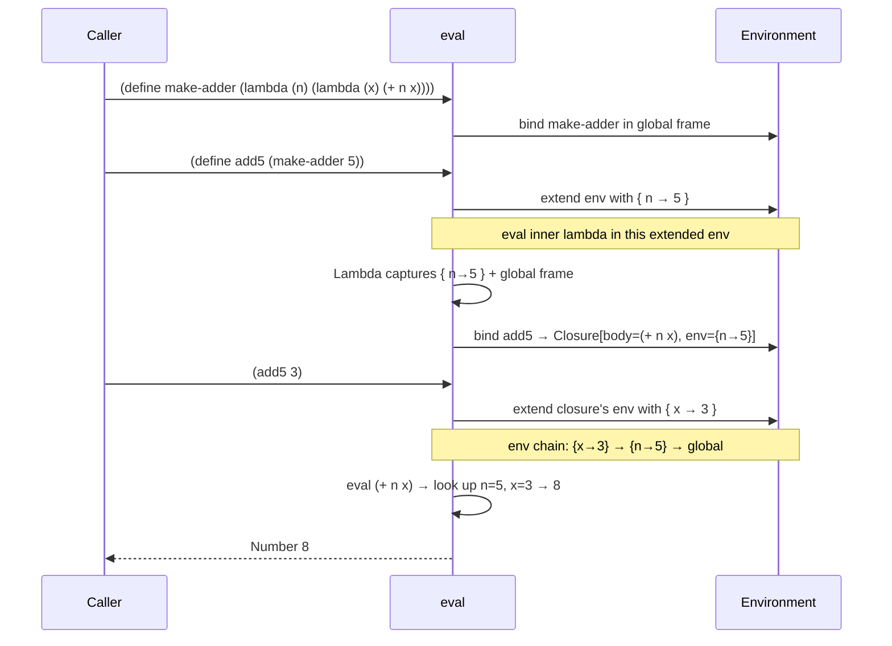
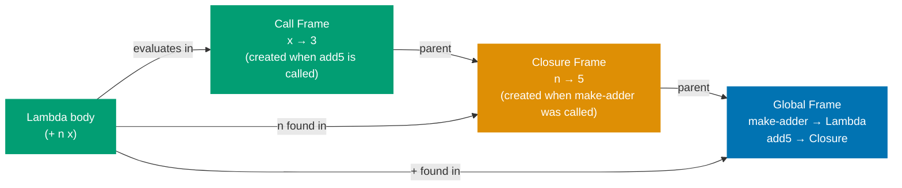
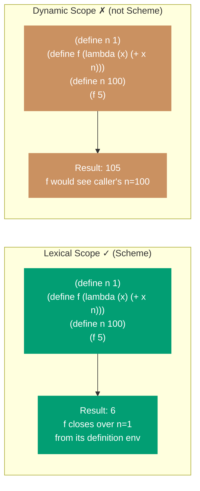
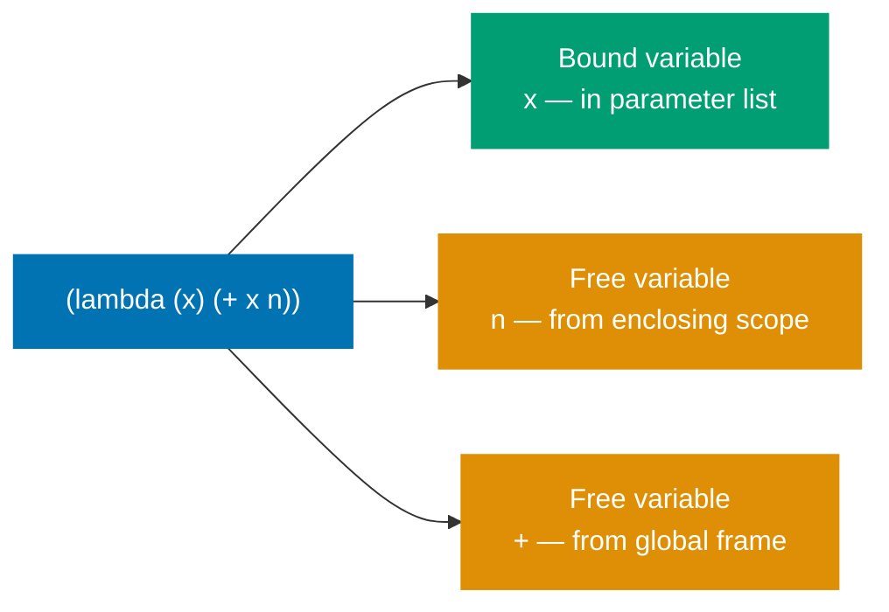
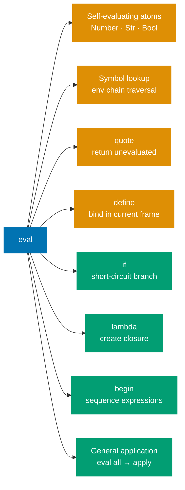

Part 3's evaluator handles function application and symbol lookup. It cannot yet define variables, branch conditionally, or create functions. This part adds the four **special forms** that make the interpreter Turing-complete: `define`, `if`, `lambda`, and `begin`.

## CS Concept: Why Special Forms Are Special

In Part 3, general application follows one rule: evaluate every subexpression, then apply the operator. This rule breaks for some constructs.

```mermaid
%% Color palette: Blue #0173B2, Orange #DE8F05, Teal #029E73, Purple #CC78BC, Brown #CA9161, Gray #808080
flowchart LR
    subgraph Normal["Normal Application — evaluate ALL args first"]
        N1["(+ x y)"]
        N2["eval x → value"]
        N3["eval y → value"]
        N4["apply + to values"]
        N1 --> N2
        N1 --> N3
        N2 --> N4
        N3 --> N4
    end

    subgraph If["if — must NOT evaluate both branches"]
        I1["(if (= x 0)\n  \"zero\"\n  (/ 1 x))"]
        I2["eval test only"]
        I3["eval consequent\nOR alternate\nnever both"]
        I1 --> I2 --> I3
    end

    subgraph Def["define — must NOT eval the name"]
        D1["(define x 10)"]
        D2["x is a name to BIND\nnot a value to LOOK UP"]
        D1 --> D2
    end

    classDef blue fill:#0173B2,color:#fff,stroke:#0173B2
    classDef teal fill:#029E73,color:#fff,stroke:#029E73
    classDef orange fill:#DE8F05,color:#fff,stroke:#DE8F05

    class N1,N2,N3,N4 blue
    class I1,I2,I3 teal
    class D1,D2 orange
```

These forms are **special** because they require control over _which_ subexpressions are evaluated and _when_. Every programming language has them, though they go by different names: keywords, reserved words, syntax forms.

## Extending the Evaluator

We extend the `eval` function's `List (head :: args)` branch to check for special form keywords before falling through to general application:

```fsharp
| List (Symbol "define" :: rest) -> evalDefine rest env
| List (Symbol "if" :: rest)     -> evalIf rest env
| List (Symbol "lambda" :: rest) -> evalLambda rest env
| List (Symbol "begin" :: rest)  -> evalBegin rest env
| List (head :: args) ->
    // General application (unchanged from Part 3)
    let proc = eval head env
    let evaluatedArgs = List.map (fun a -> eval a env) args
    apply proc evaluatedArgs env
```

The pattern match on `Symbol "define"` fires before the general case, so `define` is never treated as a variable lookup.

## Implementing `define`

```fsharp
and evalDefine (args: LispVal list) (env: Env list) : LispVal =
    match args, env with
    | [Symbol name; valueExpr], currentFrame :: _ ->
        let value = eval valueExpr env
        envDefine name value (ref currentFrame)
        Symbol name
    | _ -> failwith "define: expects (define <name> <expr>)"
```

`define` binds a name in the _current_ (innermost) frame. It does not look up or evaluate the name — it creates a new binding.

## Implementing `if`

```fsharp
and evalIf (args: LispVal list) (env: Env list) : LispVal =
    match args with
    | [test; consequent; alternate] ->
        match eval test env with
        | Bool false -> eval alternate env
        | _          -> eval consequent env  // anything except #f is truthy
    | [test; consequent] ->
        match eval test env with
        | Bool false -> Nil
        | _          -> eval consequent env
    | _ -> failwith "if: expects (if <test> <consequent> [<alternate>])"
```

Scheme's truthiness rule: only `#f` is false. Every other value — including `0`, `""`, and `()` — is truthy.

## CS Concept: Closures

A **closure** is a function paired with the environment in which it was defined. When a `lambda` is evaluated, it captures a snapshot of the current environment chain.



## How a Closure Captures Its Environment



**The critical point**: the captured environment is the environment at _definition_ time, not at _call_ time. If `make-adder` has returned, the frame where `n = 5` lives is still alive — referenced by the closure — even though `make-adder`'s call has completed.

## Implementing `lambda`

```fsharp
and evalLambda (args: LispVal list) (env: Env list) : LispVal =
    match args with
    | List parms :: body :: [] ->
        let paramNames =
            parms
            |> List.map (function
                | Symbol s -> s
                | _ -> failwith "lambda: parameters must be symbols")
        Lambda (paramNames, body, env)  // capture env at definition time
    | _ -> failwith "lambda: expects (lambda (<params>) <body>)"
```

The key is `Lambda (paramNames, body, env)` — `env` here is the environment at the point where `lambda` is evaluated. When `apply` later invokes this `Lambda`, it extends `closureEnv`, not the caller's environment.

## CS Concept: Lexical vs Dynamic Scope



## CS Concept: Free Variables and Variable Capture

A **free variable** in a function body is one not in the parameter list — it must be looked up in an enclosing scope.



When a closure is created, all free variables become "captured" — accessible via the closure's environment chain for as long as the closure lives.

## Implementing `begin`

```fsharp
and evalBegin (args: LispVal list) (env: Env list) : LispVal =
    match args with
    | [] -> Nil
    | _  ->
        args
        |> List.map (fun e -> eval e env)
        |> List.last
```

`begin` sequences expressions and returns the value of the last one. Essential for function bodies that need side effects before returning.

## Testing Closures

```fsharp
let env = makeGlobalEnv ()

// Simple function
eval (read "(define square (lambda (x) (* x x)))") env
eval (read "(square 5)") env
// → Number 25.0

// Closure over a free variable
eval (read "(define make-adder (lambda (n) (lambda (x) (+ n x))))") env
eval (read "(define add10 (make-adder 10))") env
eval (read "(add10 7)") env
// → Number 17.0

// Recursive function
eval (read "(define fact (lambda (n) (if (= n 0) 1 (* n (fact (- n 1))))))") env
eval (read "(fact 5)") env
// → Number 120.0
```

## What the Evaluator Can Now Do



This is a complete interpreter — it can express any computable function. What it lacks is convenience (`let`, `cond`) and stack safety (TCO). Parts 5 and 6 address these.

In [Part 5](/en/learn/software-engineering/compilers-and-interpreters/lisp-interpreter-in-fsharp/part-5-derived-forms-and-repl), we add `let` and `cond` as **derived forms** — showing how macro expansion reduces language surface area — and wire up the REPL.
