The interpreter from Part 5 is correct but fragile: deep recursion overflows the F# call stack. This is not an implementation detail — Scheme's R5RS standard mandates that tail calls must not consume stack space. This part explains why, and implements TCO by transforming the evaluator into a loop.

## CS Concept: The Call Stack

When a function calls another function, the runtime pushes a **stack frame** onto the call stack. The frame stores the caller's local variables and the return address — where execution should resume after the callee returns.

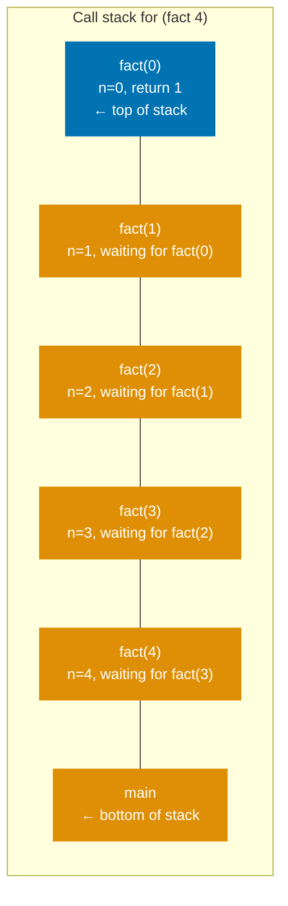

For `fact(5)` that is 6 frames. For `fact(1000000)`, it is one million frames — and a stack overflow.

## CS Concept: Tail Position

A **tail call** is a function call that is the _last thing a function does before returning_. Its result becomes the caller's result with no further computation.

**NOT a tail call** — result of recursive call is used in a further multiplication:

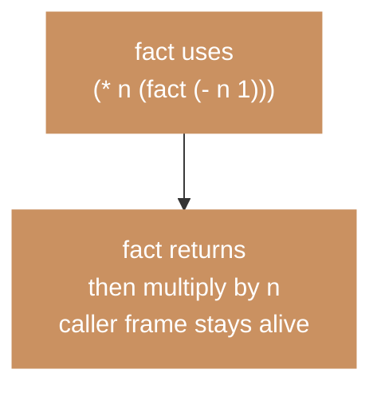

**Tail call** — recursive call is the last thing; result returned directly:

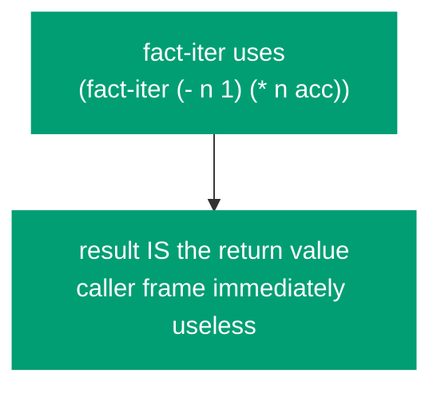

**Tail-call optimization** replaces the recursive call with a jump back to the start of the function, reusing the existing frame. Stack depth stays constant regardless of iteration count.

**Without TCO** — each call pushes a new frame, O(n) stack:

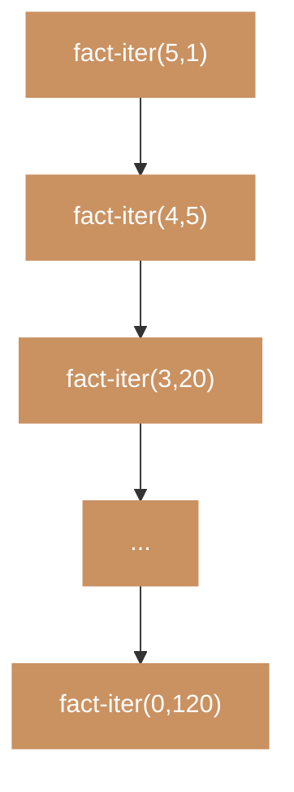

**With TCO** — same frame reused each iteration, O(1) stack:

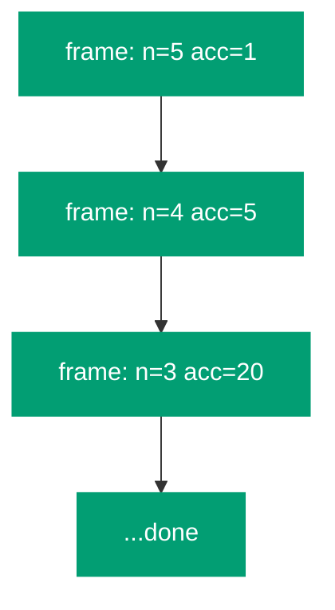

## Why F# TCO Is Not Enough

F# natively supports tail recursion — the compiler emits a `tail.` IL instruction for tail-recursive `let rec` functions. So why does our Scheme interpreter still overflow?

**F# tail call** — handled automatically by the F# compiler:

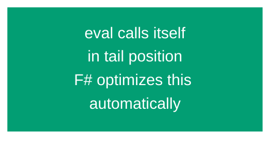

**Scheme tail call** — must be implemented explicitly in the interpreter:

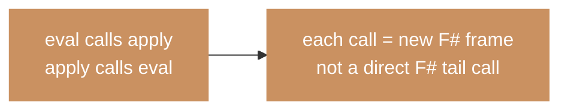

F# TCO operates on _F# functions_. Scheme's TCO guarantee must be implemented explicitly by the interpreter — it is a property of the _hosted_ language, not the _host_ language. Both F# and Scheme have TCO, but they are different guarantees at different levels of abstraction.

## Identifying Tail Positions in the Evaluator

Before transforming the evaluator, we must identify which `eval` calls are in tail position — those whose result is returned directly without further computation.

**NOT tail position** — `eval` result is used for further computation:

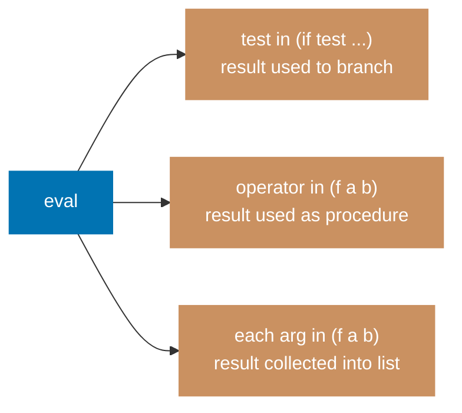

**Tail position** — `eval` result is returned directly, no further computation:

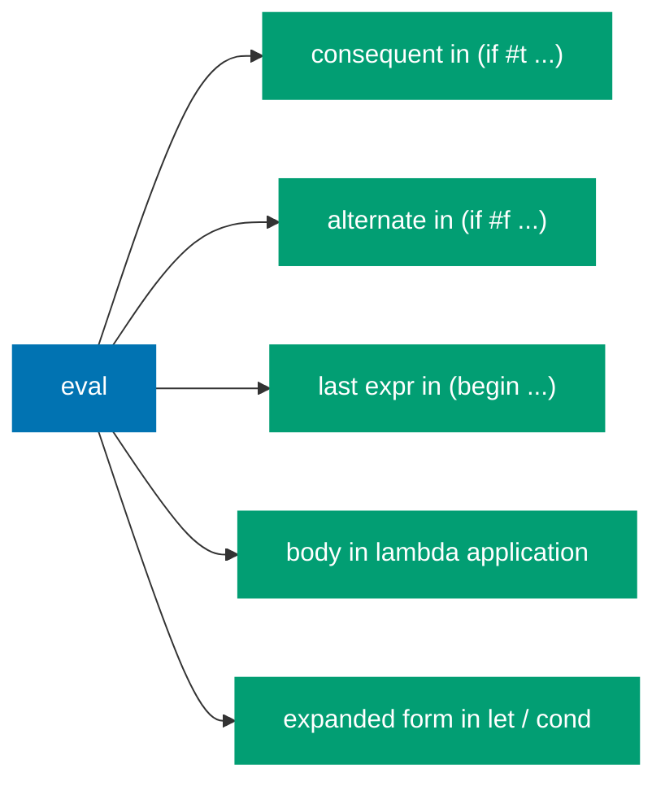

## The Loop Transform

Instead of calling `eval` recursively at tail positions, we update `currentExpr` and `currentEnv` and let the `while` loop restart. No new stack frame is created.

**Before** — recursive call creates a new stack frame:

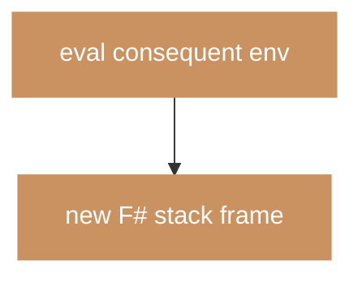

**After** — update variables and let the `while` loop restart instead:

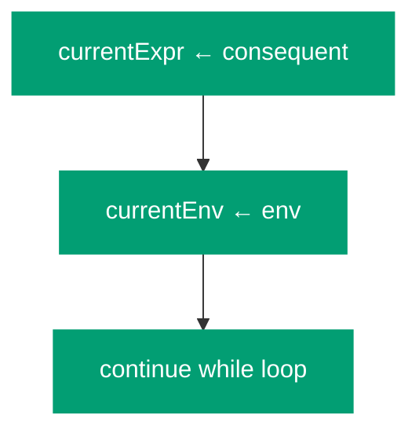

```fsharp
let rec eval (expr: LispVal) (env: Env list) : LispVal =
    let mutable currentExpr = expr
    let mutable currentEnv  = env
    let mutable result      = None

    while result.IsNone do
        match currentExpr with
        | Number _ | Str _ | Bool _ ->
            result <- Some currentExpr

        | Symbol name ->
            result <- Some (envLookup name currentEnv)

        | List [] -> result <- Some Nil

        | List (Symbol "if" :: rest) ->
            match rest with
            | [test; consequent; alternate] ->
                match eval test currentEnv with   // test: NOT tail position
                | Bool false -> currentExpr <- alternate    // LOOP
                | _          -> currentExpr <- consequent   // LOOP
            | [test; consequent] ->
                match eval test currentEnv with
                | Bool false -> result <- Some Nil
                | _          -> currentExpr <- consequent   // LOOP
            | _ -> failwith "if: bad syntax"

        | List (Symbol "begin" :: exprs) ->
            match exprs with
            | [] -> result <- Some Nil
            | _  ->
                List.take (exprs.Length - 1) exprs
                |> List.iter (fun e -> eval e currentEnv |> ignore)
                currentExpr <- List.last exprs              // LOOP

        | List (Symbol "define" :: rest) ->
            evalDefine rest currentEnv |> ignore
            result <- Some Nil

        | List (Symbol "lambda" :: rest) ->
            result <- Some (evalLambda rest currentEnv)

        | List (Symbol "let"  :: rest)    -> currentExpr <- desugarLet rest    // LOOP
        | List (Symbol "cond" :: clauses) -> currentExpr <- desugarCond clauses // LOOP

        | List (Symbol "quote" :: [x]) -> result <- Some x

        | List (head :: args) ->
            let proc          = eval head currentEnv
            let evaluatedArgs = List.map (fun a -> eval a currentEnv) args
            match proc with
            | Builtin f -> result <- Some (f evaluatedArgs)
            | Lambda (parms, body, closureEnv) ->
                if parms.Length <> evaluatedArgs.Length then
                    failwith $"Arity mismatch: expected {parms.Length}, got {evaluatedArgs.Length}"
                currentEnv  <- envExtend (List.zip parms evaluatedArgs) closureEnv
                currentExpr <- body                          // LOOP — the key!
            | _ -> failwith $"Not a procedure: {proc}"

        | _ -> failwith $"Cannot evaluate: {currentExpr}"

    result.Value
```

## The Trampoline Pattern

The loop transform keeps `eval` iterative internally. An alternative that keeps `eval` recursive is the **trampoline**: a loop that repeatedly calls a function as long as it returns a deferred computation (a thunk) rather than a final value.

**The trampoline loop** — keeps calling until a `Done` value, not a `Bounce` thunk:

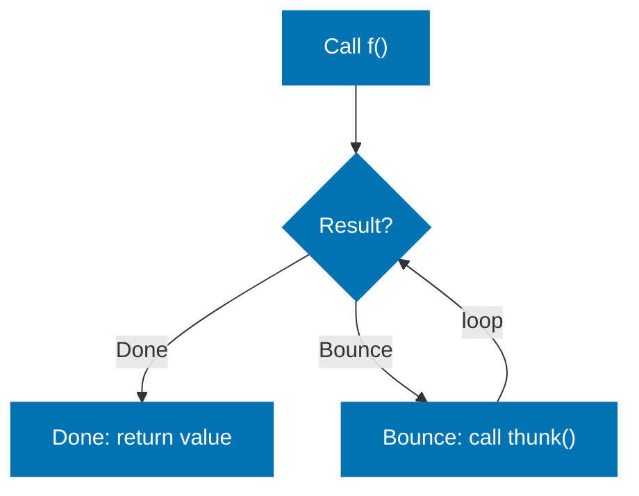

**Tail call in eval with trampoline** — return a thunk instead of recursing:

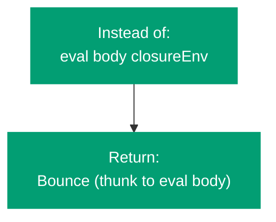

```fsharp
type EvalResult =
    | Done   of LispVal
    | Bounce of (unit -> EvalResult)

let trampoline (f: unit -> EvalResult) : LispVal =
    let mutable result = f ()
    while (match result with Bounce _ -> true | _ -> false) do
        result <- match result with Bounce thunk -> thunk () | r -> r
    match result with Done v -> v | _ -> failwith "impossible"
```

## Loop Transform vs Trampoline

**Loop transform:**

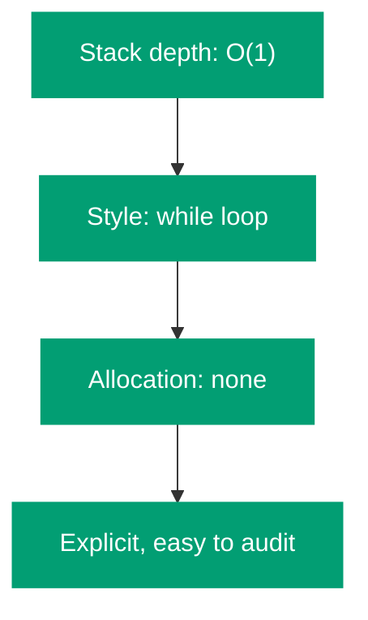

**Trampoline:**

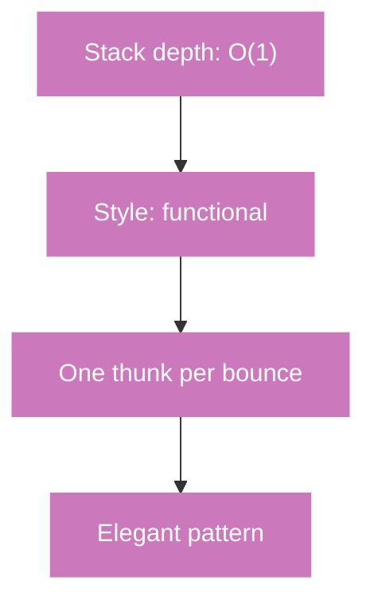

Both are correct. The loop transform is what Norvig uses in lispy2; the trampoline is more common in functional language implementations.

## Demonstrating Stack Safety

Without TCO:

```scheme
(define count-down
  (lambda (n)
    (if (= n 0) "done"
      (count-down (- n 1)))))

(count-down 1000000)  ; Stack overflow without TCO
```

With the loop transform, `count-down` runs in O(1) stack space:

**Without TCO** — each call creates a new frame, 1,000,000 frames total:

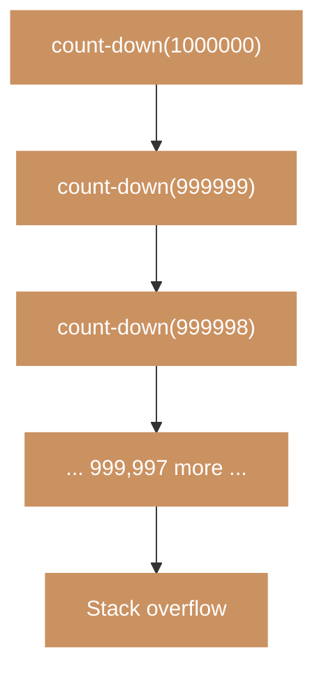

**With TCO** — while loop updates one frame 1,000,000 times:

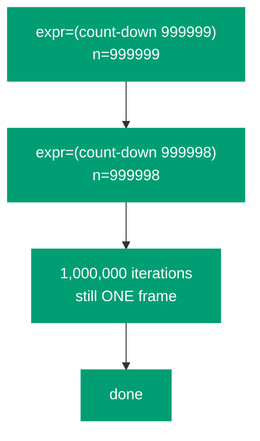

```scheme
(count-down 1000000)
; → "done"  (no overflow, O(1) stack)
```

## CS Concept: Continuation-Passing Style

The trampoline is closely related to **continuation-passing style** (CPS) — a program transformation where every function takes an extra argument (the continuation) representing "what to do next". CPS makes all calls tail calls by construction.

**Direct style** — result flows backward through the call stack:

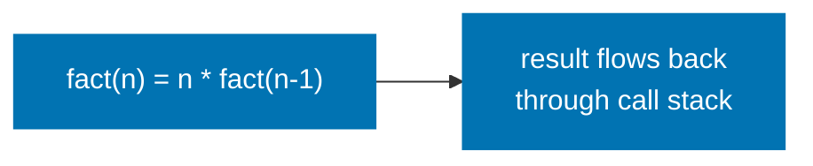

**Continuation-passing style** — result passed forward to a continuation:

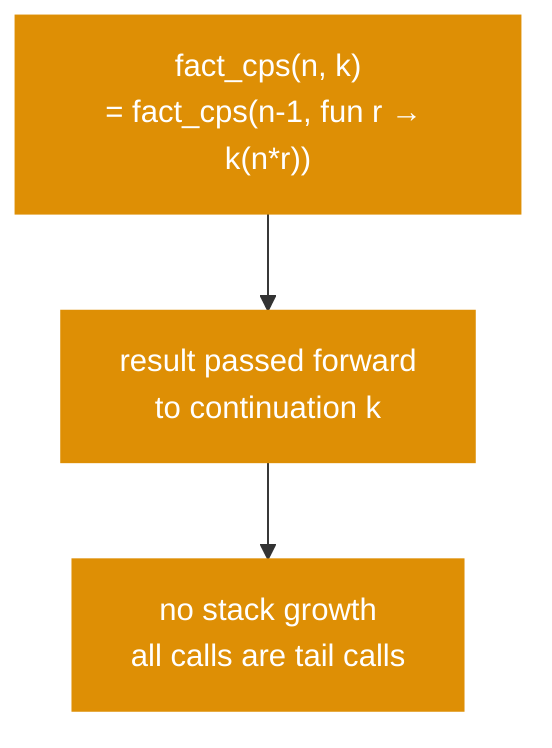

**CPS enables:**

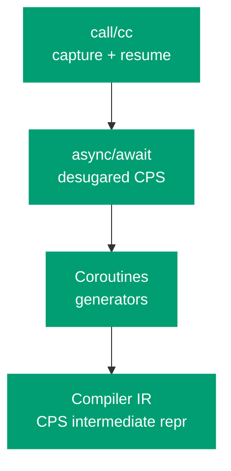

Our interpreter does not implement `call/cc`, but the trampoline pattern gives a taste of the underlying idea: instead of returning a value, you return a description of what to compute next.

## The Complete Interpreter: All Six Parts

```mermaid
%% Color palette: Blue #0173B2, Orange #DE8F05, Teal #029E73, Purple #CC78BC, Brown #CA9161, Gray #808080
flowchart TB
    subgraph P2["Part 2: Front End"]
        direction LR
        src["(fact 5)"] --> tok["tokenize"] --> par["parse"] --> ast["LispVal tree"]
    end

    subgraph P3["Part 3: Eval/Apply Core"]
        direction LR
        ev["eval"] <-->|"mutual recursion"| ap["apply"]
        en["Env chain"] --> ev
    end

    subgraph P4["Part 4: Special Forms"]
        direction LR
        sf["define · if · lambda · begin"] --> cl["Closures\ncapture env"]
    end

    subgraph P5["Part 5: Sugar + REPL"]
        direction LR
        ds["let · cond\n(desugar)"] --> rp["REPL loop\nread→eval→print"]
    end

    subgraph P6["Part 6: TCO"]
        direction LR
        lp["while loop\nreplace tail eval calls"] --> ss["O(1) stack\nfor tail calls"]
    end

    P2 --> P3 --> P4 --> P5 --> P6

    classDef blue fill:#0173B2,color:#fff,stroke:#0173B2
    classDef orange fill:#DE8F05,color:#fff,stroke:#DE8F05
    classDef teal fill:#029E73,color:#fff,stroke:#029E73
    classDef purple fill:#CC78BC,color:#fff,stroke:#CC78BC
    classDef gray fill:#808080,color:#fff,stroke:#808080

    class P2 blue
    class P3 orange
    class P4 teal
    class P5 purple
    class P6 gray
```

## Summary

| Concept        | What it means                                                         | How we implemented it                                 |
| -------------- | --------------------------------------------------------------------- | ----------------------------------------------------- |
| Tail position  | A call whose result is returned directly, with no further computation | Identified in `if`, `begin`, `lambda` application     |
| TCO obligation | R5RS requires tail calls not grow the stack                           | Loop transform in `eval`                              |
| Host vs hosted | F#'s own TCO ≠ Scheme's TCO                                           | Explicit `while` loop; F# can't do this automatically |
| Loop transform | Replace tail-position `eval` calls with variable updates + loop       | `currentExpr <- body` instead of `eval body env`      |
| Trampoline     | Return thunks at tail positions; loop re-invokes them                 | Alternative functional approach; same O(1) depth      |

**Next steps** (not covered in this series):

- **Macros** — `define-macro` or `define-syntax`: user-defined syntactic transformations
- **Continuations** — `call/cc`: capture and resume the call stack as a first-class value
- **The full R5RS library** — strings, characters, vectors, ports, I/O procedures
- **Proper tail recursion in `map`** — the builtin `map` above is not itself tail-recursive
