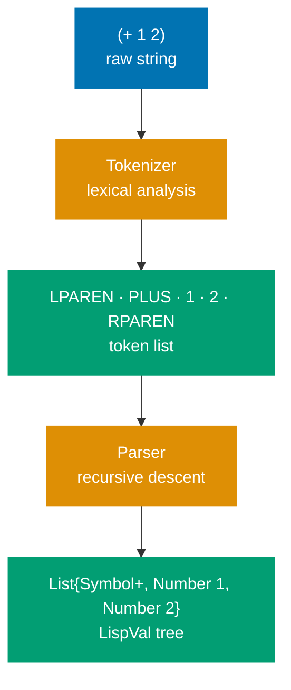
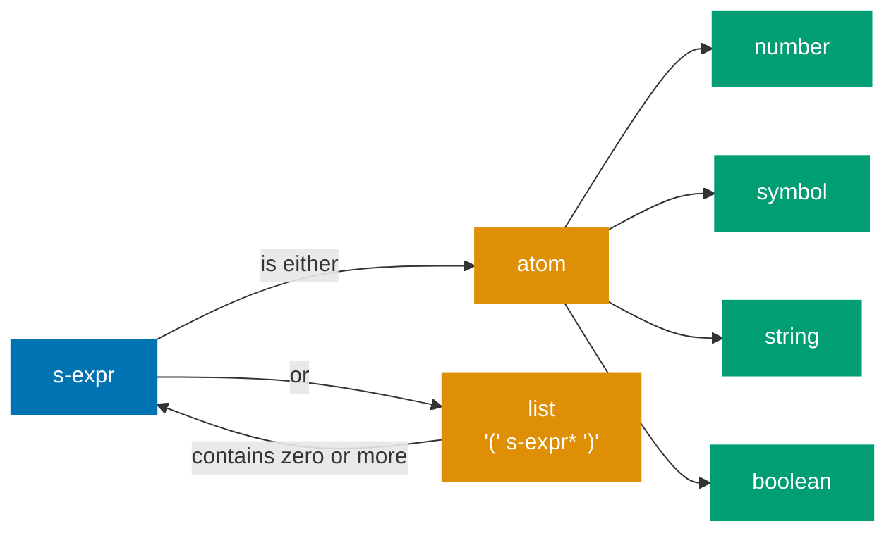
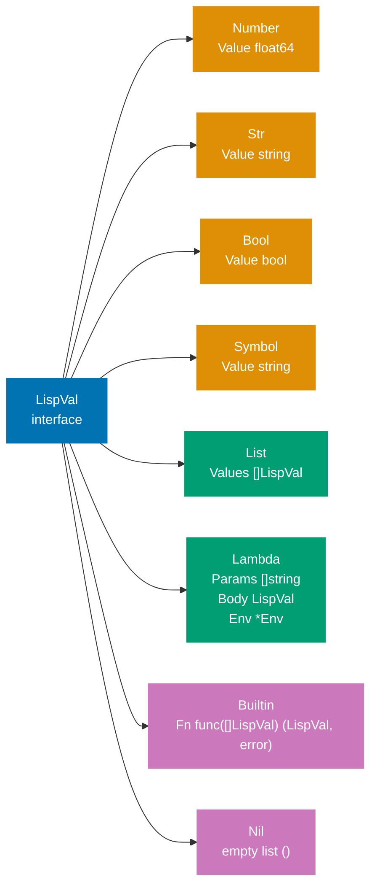
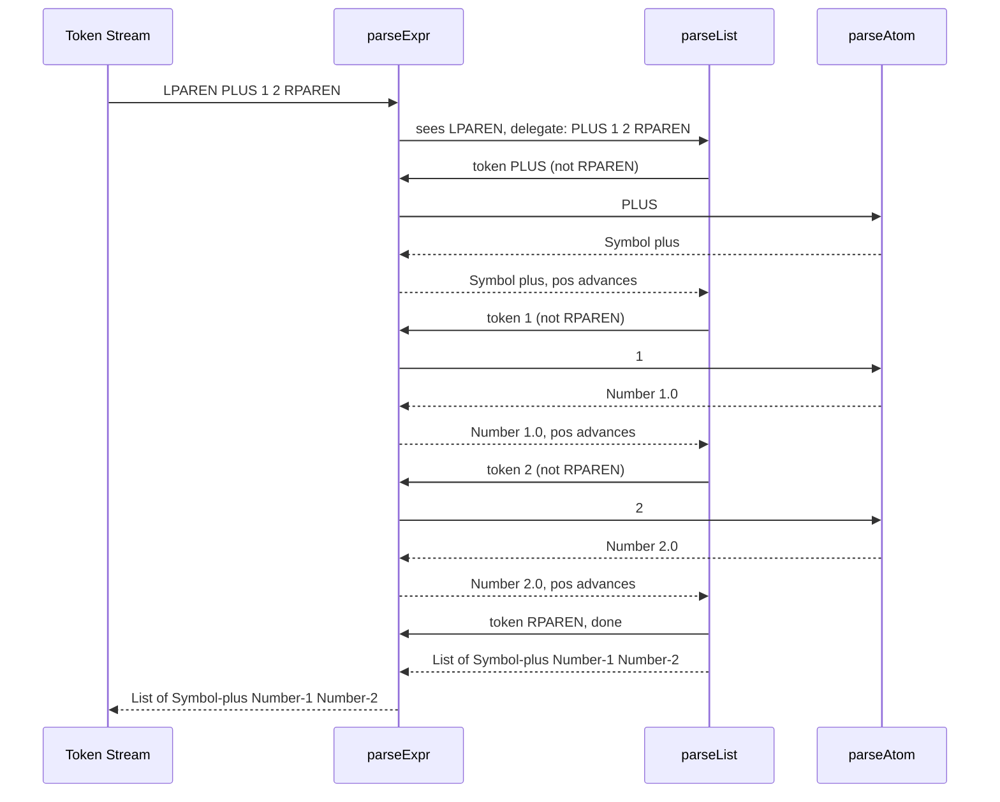
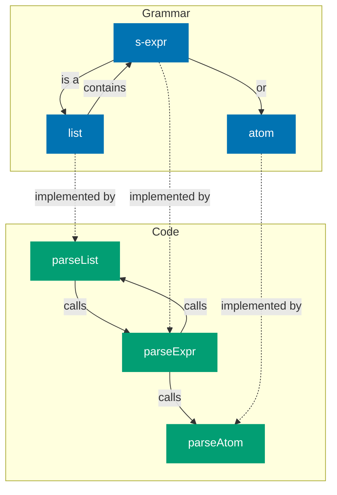
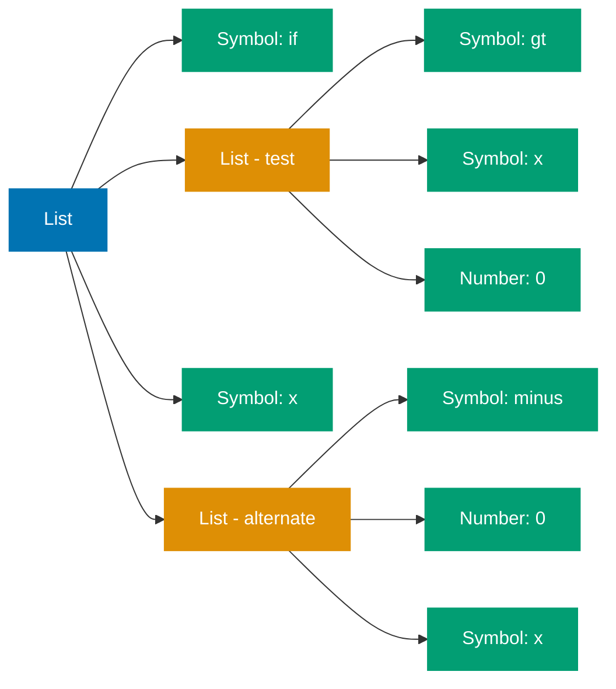

Every interpreter starts the same way: raw text goes in, structured data comes out. This phase has two stages — **tokenizing** (breaking text into tokens) and **reading** (assembling tokens into nested structures). Together they constitute the **front end** of our interpreter.

## The Front-End Pipeline



## CS Concept: Lexical Analysis

**Lexical analysis** (or lexing, or tokenizing) is the process of grouping a stream of characters into meaningful units called **tokens**. A token is the smallest unit of syntax — a number, a string, a symbol, a parenthesis.

Lexical analysis answers: "what are the words?"
Parsing answers: "what do the words mean structurally?"

For Scheme, the token types are:

| Token       | Examples                     |
| ----------- | ---------------------------- |
| Left paren  | `(`                          |
| Right paren | `)`                          |
| Number      | `42`, `-7`, `3.14`           |
| String      | `"hello"`, `"world"`         |
| Boolean     | `#t`, `#f`                   |
| Symbol      | `+`, `define`, `x`, `my-var` |

No keywords — `define`, `if`, `lambda` are just symbols. The interpreter, not the lexer, gives them special meaning.

## CS Concept: Context-Free Grammars

The structure of S-expressions can be described as a **context-free grammar** (CFG):

```
s-expr  ::= atom | list
list    ::= '(' s-expr* ')'
atom    ::= number | string | boolean | symbol
```



This grammar is recursive: a list contains zero or more S-expressions, each of which may itself be a list. This recursive structure is what makes a recursive descent parser the natural implementation strategy.

**Context-free** means the rule for expanding a non-terminal does not depend on what surrounds it. This is a weaker requirement than natural languages but sufficient for all programming languages.

## The LispVal Type

Before parsing, we define the type that represents all Lisp values throughout the interpreter. In Go, we use an **interface** with a marker method — a technique for creating closed sum types without language-level discriminated unions.

```go
// LispVal is the sum type for all Scheme values.
// The lispVal() marker method prevents accidental implementations.
type LispVal interface {
    lispVal()
}

type Number  struct{ Value float64 }
type Symbol  struct{ Value string }
type Str     struct{ Value string }
type Bool    struct{ Value bool }
type List    struct{ Values []LispVal }
type Lambda  struct {
    Params []string
    Body   LispVal
    Env    *Env
}
type Builtin struct{ Fn func([]LispVal) (LispVal, error) }
type Nil     struct{}

func (Number)  lispVal() {}
func (Symbol)  lispVal() {}
func (Str)     lispVal() {}
func (Bool)    lispVal() {}
func (List)    lispVal() {}
func (Lambda)  lispVal() {}
func (Builtin) lispVal() {}
func (Nil)     lispVal() {}
```



**Why an interface with a marker method?** It restricts the type switch in `eval` to known cases. Any type that accidentally satisfies `LispVal` will only do so by explicitly implementing `lispVal()` — an intentional act. In F#, this exhaustiveness is enforced by the compiler on discriminated unions; in Go, we enforce it by convention.

## Tokenizer

The tokenizer takes a string and produces a flat list of token strings. Go's `strings` package makes this concise:

```go
func tokenize(input string) []string {
    // Insert spaces around parens so Split works uniformly
    s := strings.NewReplacer("(", " ( ", ")", " ) ").Replace(input)
    var tokens []string
    for _, tok := range strings.Fields(s) {
        tokens = append(tokens, tok)
    }
    return tokens
}
```

`strings.Fields` splits on any whitespace and discards empty strings — it handles tabs, newlines, and multiple spaces automatically.

**What the tokenizer does NOT do:** it does not assign types to tokens. The string `"42"` comes out as the string `"42"`, not as a number. Typing happens in the next stage.

For string literals with spaces (e.g., `"hello world"`), a more sophisticated tokenizer is needed. The version above handles the core Scheme subset covered in this series.

## Parser: Recursive Descent

The parser converts a flat list of token strings into a nested `LispVal`. The algorithm is a classic **recursive descent parser** — each grammar rule corresponds to a function.

```go
func parseAtom(token string) LispVal {
    if token == "#t" {
        return Bool{Value: true}
    }
    if token == "#f" {
        return Bool{Value: false}
    }
    if f, err := strconv.ParseFloat(token, 64); err == nil {
        return Number{Value: f}
    }
    return Symbol{Value: token}
}

func parseExpr(tokens []string, pos int) (LispVal, int, error) {
    if pos >= len(tokens) {
        return nil, pos, fmt.Errorf("unexpected end of input")
    }
    tok := tokens[pos]
    switch tok {
    case "(":
        return parseList(tokens, pos+1)
    case ")":
        return nil, pos, fmt.Errorf("unexpected ')'")
    default:
        return parseAtom(tok), pos + 1, nil
    }
}

func parseList(tokens []string, pos int) (LispVal, int, error) {
    var values []LispVal
    for pos < len(tokens) && tokens[pos] != ")" {
        val, newPos, err := parseExpr(tokens, pos)
        if err != nil {
            return nil, newPos, err
        }
        values = append(values, val)
        pos = newPos
    }
    if pos >= len(tokens) {
        return nil, pos, fmt.Errorf("missing closing ')'")
    }
    return List{Values: values}, pos + 1, nil
}
```

Unlike the F# version which returns `(LispVal, remaining tokens)`, the Go version passes a positional index through the token slice. This avoids allocating new slices at each recursive step.

## Parsing `(+ 1 2)` Step by Step



## Recursive Descent = Grammar as Code

The mutual recursion between `parseExpr` and `parseList` mirrors the grammar's mutual recursion between `s-expr` and `list`:



## Putting It Together: The Read Function

```go
func read(input string) (LispVal, error) {
    tokens := tokenize(input)
    if len(tokens) == 0 {
        return nil, fmt.Errorf("empty input")
    }
    expr, pos, err := parseExpr(tokens, 0)
    if err != nil {
        return nil, err
    }
    if pos != len(tokens) {
        return nil, fmt.Errorf("unexpected tokens after expression")
    }
    return expr, nil
}
```

Test it:

```go
v, _ := read("(+ 1 2)")
// → List{Values: []LispVal{Symbol{Value:"+"}, Number{Value:1}, Number{Value:2}}}

v, _ = read("(define x 10)")
// → List{Values: []LispVal{Symbol{"define"}, Symbol{"x"}, Number{10}}}

v, _ = read("(lambda (x y) (* x y))")
// → List{Values: []LispVal{Symbol{"lambda"}, List{[]LispVal{Symbol{"x"}, Symbol{"y"}}}, ...}}
```

The parser has no knowledge of what `define` or `lambda` mean — those are just symbols. The evaluator (Part 3) gives them meaning.

## CS Concept: Why Recursive Descent?

Recursive descent is not the only parsing algorithm. There are table-driven parsers (LL, LR, LALR) used by most production compiler generators. Why recursive descent here?

1. **Simplicity** — each grammar rule is a function. The code structure mirrors the grammar exactly.
2. **Scheme's grammar is LL(1)** — at every point, one token of lookahead is sufficient to decide which rule applies.
3. **Good error messages** — the call stack tells you exactly where in the grammar parsing failed.
4. **Hand-written = transparent** — reading a hand-written recursive descent parser is much more instructive than reading a generated parser.

## What We Have

After Part 2, we can transform any valid Scheme expression from text into a structured `LispVal` tree:



In [Part 3](/en/learn/software-engineering/compilers-and-interpreters/lisp-interpreter-in-golang/part-3-environments-and-evaluation), we implement the environment model and the core `eval`/`apply` loop that gives these trees meaning.
