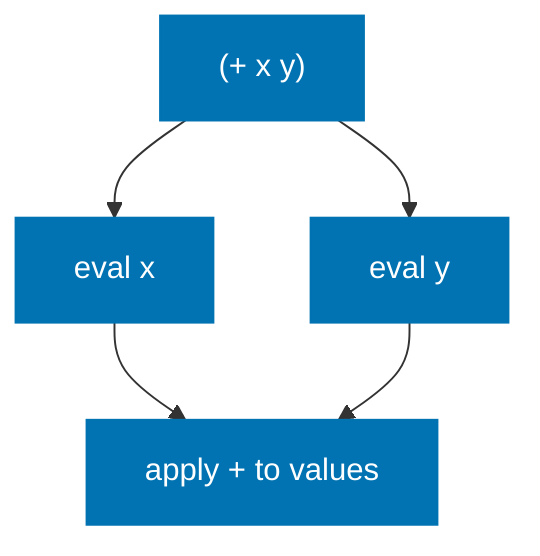
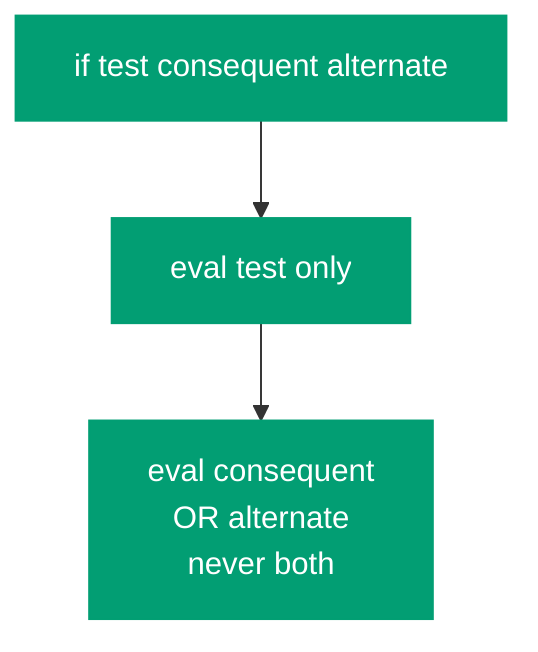
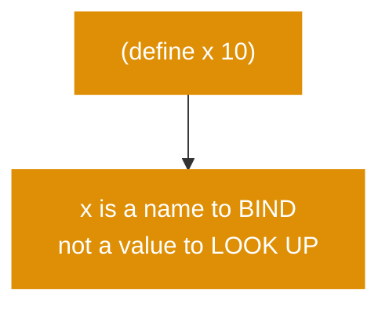
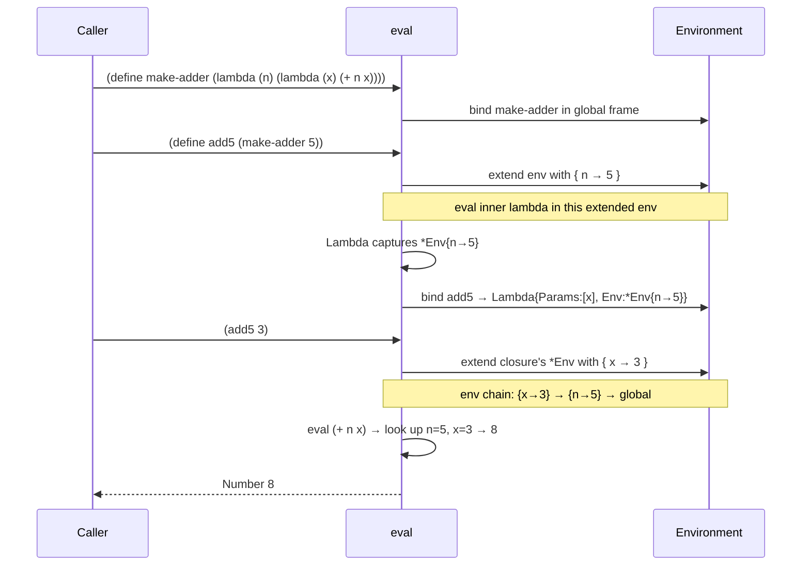
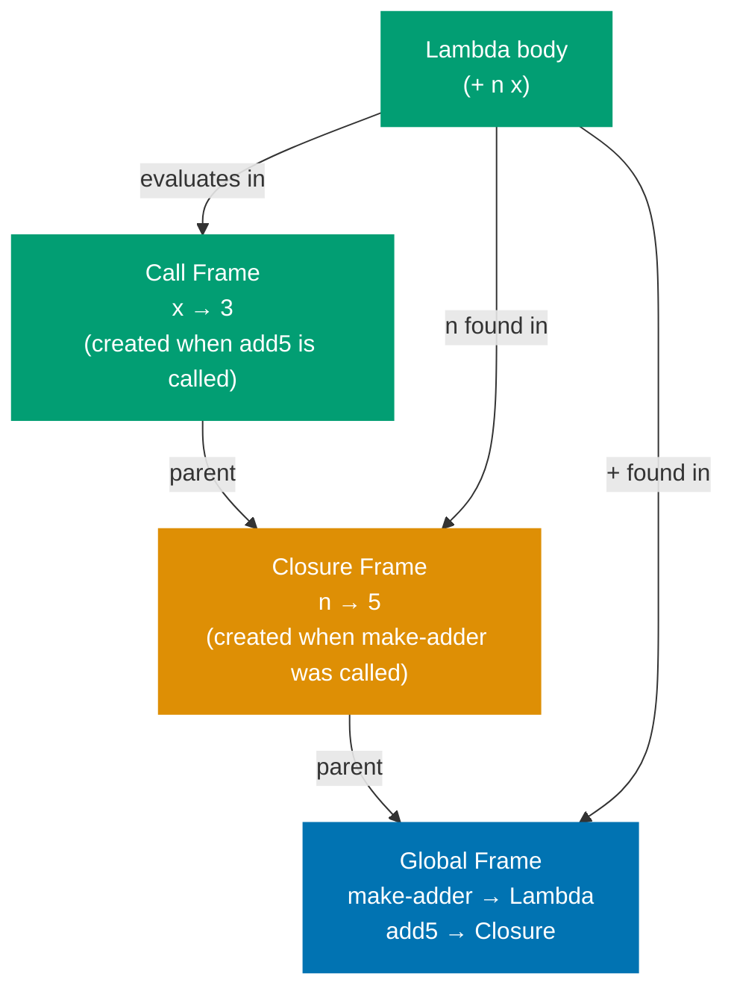
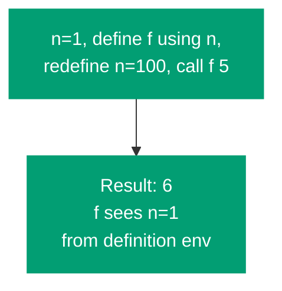
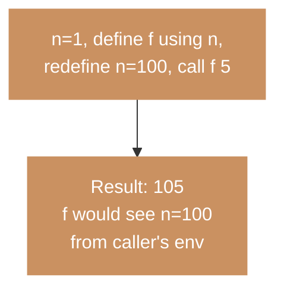
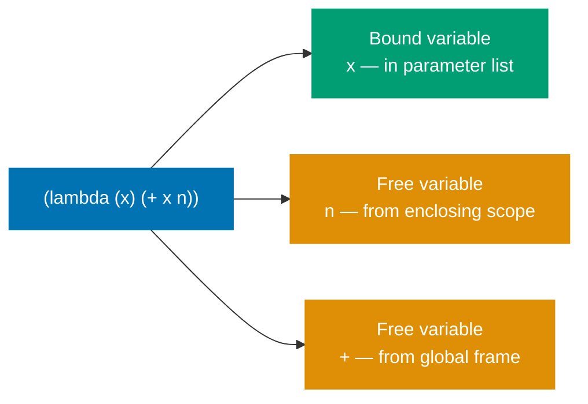
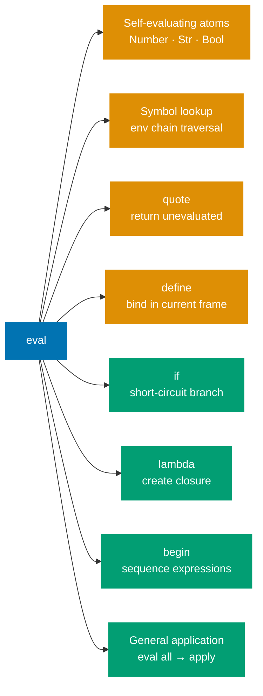

Part 3's evaluator handles function application and symbol lookup. It cannot yet define variables, branch conditionally, or create functions. This part adds the four **special forms** that make the interpreter Turing-complete: `define`, `if`, `lambda`, and `begin`.

## CS Concept: Why Special Forms Are Special

In Part 3, general application follows one rule: evaluate every subexpression, then apply the operator. This rule breaks for some constructs.

**Normal application** — evaluates ALL arguments before calling:



**`if` special form** — evaluates test first, then exactly one branch:



**`define` special form** — binds a name, never evaluates it as a lookup:



These forms are **special** because they require control over _which_ subexpressions are evaluated and _when_. Every programming language has them, though they go by different names: keywords, reserved words, syntax forms.

## Extending the Evaluator

We extend the `eval` function's `List` branch to check for special form keywords before falling through to general application. In Go, this is a string switch inside the `Symbol` case check:

```go
case List:
    if len(e.Values) == 0 {
        return Nil{}, nil
    }
    head := e.Values[0]
    args := e.Values[1:]

    if sym, ok := head.(Symbol); ok {
        switch sym.Value {
        case "define":
            return evalDefine(args, env)
        case "if":
            return evalIf(args, env)
        case "lambda":
            return evalLambda(args, env)
        case "begin":
            return evalBegin(args, env)
        case "quote":
            if len(args) != 1 {
                return nil, fmt.Errorf("quote: expects 1 argument")
            }
            return args[0], nil
        }
    }

    // General application (unchanged from Part 3)
    proc, err := eval(head, env)
    ...
```

The string switch on `sym.Value` fires before the general application case, so `define` is never treated as a variable lookup.

## Implementing `define`

```go
func evalDefine(args []LispVal, env *Env) (LispVal, error) {
    if len(args) != 2 {
        return nil, fmt.Errorf("define: expects (define <name> <expr>)")
    }
    sym, ok := args[0].(Symbol)
    if !ok {
        return nil, fmt.Errorf("define: first argument must be a symbol")
    }
    value, err := eval(args[1], env)
    if err != nil {
        return nil, err
    }
    env.define(sym.Value, value)
    return Symbol{Value: sym.Value}, nil
}
```

`define` binds a name in the _current_ (innermost) frame. It does not look up or evaluate the name — it creates a new binding.

## Implementing `if`

```go
func evalIf(args []LispVal, env *Env) (LispVal, error) {
    if len(args) < 2 || len(args) > 3 {
        return nil, fmt.Errorf("if: expects (if <test> <consequent> [<alternate>])")
    }
    test, err := eval(args[0], env)
    if err != nil {
        return nil, err
    }
    isFalse := func(v LispVal) bool {
        b, ok := v.(Bool)
        return ok && !b.Value
    }
    if isFalse(test) {
        if len(args) == 3 {
            return eval(args[2], env)
        }
        return Nil{}, nil
    }
    return eval(args[1], env)
}
```

Scheme's truthiness rule: only `#f` is false. Every other value — including `0`, `""`, and `()` — is truthy.

## CS Concept: Closures

A **closure** is a function paired with the environment in which it was defined. When a `lambda` is evaluated, it captures a snapshot of the current `*Env` pointer.



## How a Closure Captures Its Environment



**The critical point**: the captured `*Env` is the environment at _definition_ time, not at _call_ time. If `make-adder` has returned, the frame where `n = 5` lives is still alive — referenced by the closure — even though `make-adder`'s call has completed.

## Implementing `lambda`

```go
func evalLambda(args []LispVal, env *Env) (LispVal, error) {
    if len(args) < 2 {
        return nil, fmt.Errorf("lambda: expects (lambda (<params>) <body>)")
    }
    paramList, ok := args[0].(List)
    if !ok {
        return nil, fmt.Errorf("lambda: first argument must be a parameter list")
    }
    params := make([]string, len(paramList.Values))
    for i, p := range paramList.Values {
        sym, ok := p.(Symbol)
        if !ok {
            return nil, fmt.Errorf("lambda: parameters must be symbols")
        }
        params[i] = sym.Value
    }
    body := args[1]
    return Lambda{Params: params, Body: body, Env: env}, nil // capture env!
}
```

The key is `Env: env` — `env` here is the `*Env` pointer at the point where `lambda` is evaluated. When `apply` later invokes this `Lambda`, it calls `extendEnv(p.Params, args, p.Env)` — extending the closure's env, not the caller's.

## CS Concept: Lexical vs Dynamic Scope

**Lexical scope** (Scheme — correct) — f closes over n=1 at definition time:



**Dynamic scope** (not Scheme) — f would see the caller's n=100:



## CS Concept: Free Variables and Variable Capture

A **free variable** in a function body is one not in the parameter list — it must be looked up in an enclosing scope.



When a closure is created, all free variables become "captured" — accessible via the closure's `*Env` chain for as long as the closure lives.

## Implementing `begin`

```go
func evalBegin(args []LispVal, env *Env) (LispVal, error) {
    if len(args) == 0 {
        return Nil{}, nil
    }
    var result LispVal
    var err error
    for _, expr := range args {
        result, err = eval(expr, env)
        if err != nil {
            return nil, err
        }
    }
    return result, nil
}
```

`begin` sequences expressions and returns the value of the last one. Essential for function bodies that need side effects before returning.

## Testing Closures

```go
env := makeGlobalEnv()

eval(mustRead("(define square (lambda (x) (* x x)))"), env)
v, _ := eval(mustRead("(square 5)"), env)
// → Number{Value: 25}

eval(mustRead("(define make-adder (lambda (n) (lambda (x) (+ n x))))"), env)
eval(mustRead("(define add10 (make-adder 10))"), env)
v, _ = eval(mustRead("(add10 7)"), env)
// → Number{Value: 17}

eval(mustRead("(define fact (lambda (n) (if (= n 0) 1 (* n (fact (- n 1))))))"), env)
v, _ = eval(mustRead("(fact 5)"), env)
// → Number{Value: 120}
```

## What the Evaluator Can Now Do



This is a complete interpreter — it can express any computable function. What it lacks is convenience (`let`, `cond`) and stack safety (TCO). Parts 5 and 6 address these.

In [Part 5](/en/learn/software-engineering/compilers-and-interpreters/lisp-interpreter-in-golang/part-5-derived-forms-and-repl), we add `let` and `cond` as **derived forms** — showing how macro expansion reduces language surface area — and wire up the REPL.
