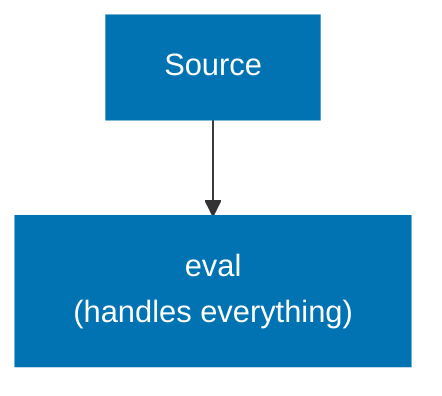
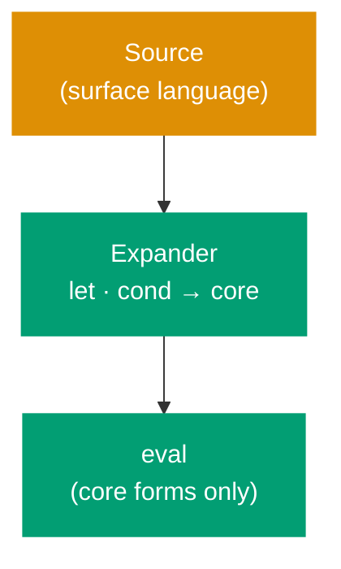
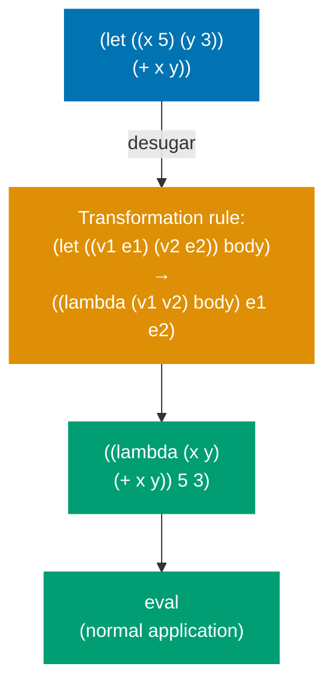
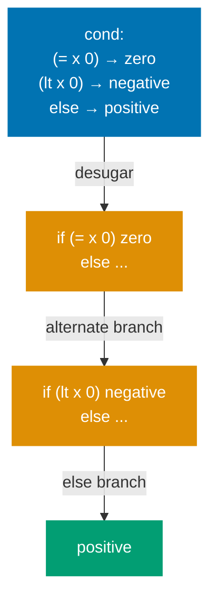
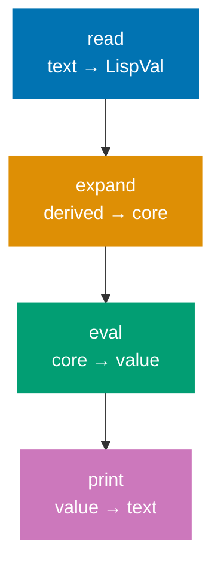
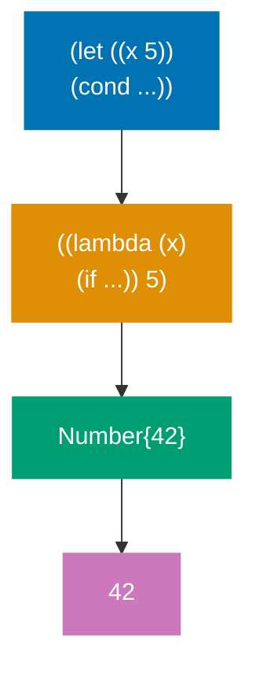
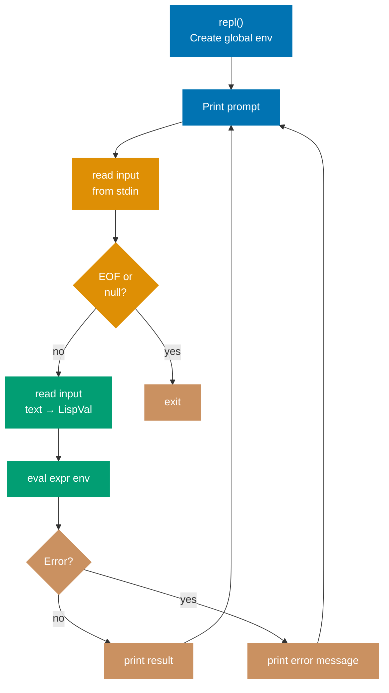
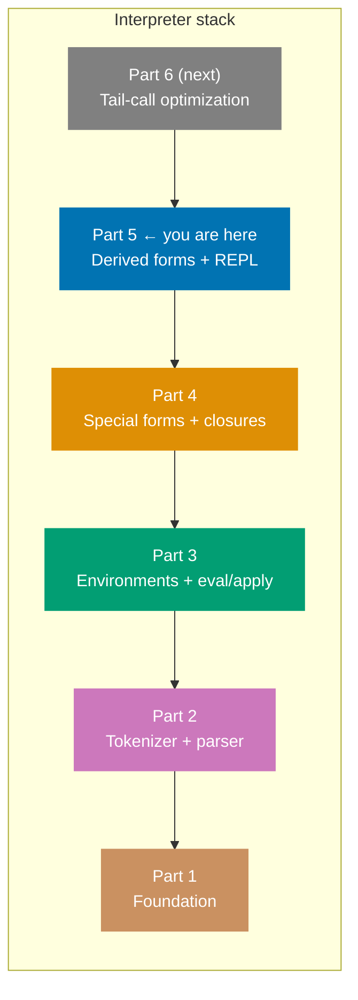

The interpreter from Part 4 is complete — it can express any computable function. But it is inconvenient to use. `let` bindings and `cond` branches are patterns programmers reach for constantly. This part adds them as **derived forms**: transformations that rewrite surface syntax into the core forms the evaluator already handles.

## CS Concept: Syntactic Sugar and Derived Forms

**Syntactic sugar** is syntax that adds no expressive power — anything written with it can be written without it — but makes programs easier to read and write.

**Derived forms** implement syntactic sugar by transforming the sugared form into a desugared equivalent _before_ evaluation. The evaluator never sees the sugared form.

**Without derived forms** — `eval` must handle every surface form directly:



**With derived forms** — an expansion phase rewrites sugar before `eval` ever sees it:



The insight from SICP Chapter 4: you can define an arbitrarily rich surface language on top of a tiny primitive core, as long as every surface form can be mechanically rewritten into primitive forms. This is the foundation of Lisp's macro systems and of how languages like Haskell (`do` notation), Rust (procedural macros), and Kotlin (coroutines) implement syntactic extensions.

## `let` as a Derived Form

`let` introduces local bindings:

```scheme
(let ((x 5) (y 3))
  (+ x y))
```

This is identical in meaning to immediately invoking a lambda:

```scheme
((lambda (x y) (+ x y)) 5 3)
```



In Go:

```go
func desugarLet(args []LispVal) (LispVal, error) {
    if len(args) < 2 {
        return nil, fmt.Errorf("let: expects (let ((var val) ...) body)")
    }
    bindingList, ok := args[0].(List)
    if !ok {
        return nil, fmt.Errorf("let: first argument must be a binding list")
    }

    var params, vals []LispVal
    for _, binding := range bindingList.Values {
        pair, ok := binding.(List)
        if !ok || len(pair.Values) != 2 {
            return nil, fmt.Errorf("let: malformed binding")
        }
        params = append(params, pair.Values[0])
        vals = append(vals, pair.Values[1])
    }

    body := args[1]
    lambdaExpr := List{Values: append(
        []LispVal{Symbol{Value: "lambda"}, List{Values: params}, body},
    )}
    call := List{Values: append([]LispVal{lambdaExpr}, vals...)}
    return call, nil
}
```

This produces a `LispVal` representing the lambda application, which `eval` then processes normally. The evaluator never learns that `let` existed.

## `cond` as a Derived Form

`cond` is a multi-branch conditional:

```scheme
(cond
  ((= x 0) "zero")
  ((< x 0) "negative")
  (else    "positive"))
```

This desugars to nested `if` expressions:



In Go:

```go
func desugarCond(clauses []LispVal) (LispVal, error) {
    if len(clauses) == 0 {
        return Nil{}, nil
    }
    clause, ok := clauses[0].(List)
    if !ok || len(clause.Values) < 2 {
        return nil, fmt.Errorf("cond: malformed clause")
    }
    test := clause.Values[0]
    body := clause.Values[1]

    if sym, ok := test.(Symbol); ok && sym.Value == "else" {
        return body, nil
    }

    rest, err := desugarCond(clauses[1:])
    if err != nil {
        return nil, err
    }
    return List{Values: []LispVal{Symbol{Value: "if"}, test, body, rest}}, nil
}
```

## Hooking Derived Forms into the Evaluator

Add cases _before_ the general application case in the `sym.Value` switch:

```go
case "let":
    expanded, err := desugarLet(args)
    if err != nil {
        return nil, err
    }
    return eval(expanded, env)  // expand then re-enter eval

case "cond":
    expanded, err := desugarCond(args)
    if err != nil {
        return nil, err
    }
    return eval(expanded, env)  // expand then re-enter eval
```

The desugared form is passed back to `eval` recursively. The evaluator processes only core forms; all surface syntax is rewritten away.

## CS Concept: The Expansion Phase

**The phases:**



**What each phase processes:**



What we have implemented manually is a rudimentary **expansion phase**. Production Lisp implementations (Racket, Guile, SBCL) have a full macro expander as a separate phase between parsing and evaluation. A macro expander can apply user-defined transformations (`define-syntax`, `syntax-rules`), not just built-in ones.

## Adding More Primitives

Before wiring up the REPL, we add more primitives to `makeGlobalEnv`:

```go
env.define("list", Builtin{Fn: func(args []LispVal) (LispVal, error) {
    return List{Values: args}, nil
}})

env.define("length", Builtin{Fn: func(args []LispVal) (LispVal, error) {
    lst, ok := args[0].(List)
    if !ok {
        return nil, fmt.Errorf("length: expects a list")
    }
    return Number{Value: float64(len(lst.Values))}, nil
}})

env.define("append", Builtin{Fn: func(args []LispVal) (LispVal, error) {
    a, ok1 := args[0].(List)
    b, ok2 := args[1].(List)
    if !ok1 || !ok2 {
        return nil, fmt.Errorf("append: expects two lists")
    }
    combined := make([]LispVal, len(a.Values)+len(b.Values))
    copy(combined, a.Values)
    copy(combined[len(a.Values):], b.Values)
    return List{Values: combined}, nil
}})

env.define("not", Builtin{Fn: func(args []LispVal) (LispVal, error) {
    if b, ok := args[0].(Bool); ok && !b.Value {
        return Bool{Value: true}, nil
    }
    return Bool{Value: false}, nil
}})

env.define("display", Builtin{Fn: func(args []LispVal) (LispVal, error) {
    fmt.Print(printVal(args[0]))
    return Nil{}, nil
}})

env.define("newline", Builtin{Fn: func(args []LispVal) (LispVal, error) {
    fmt.Println()
    return Nil{}, nil
}})
```

## The REPL



```go
func printVal(v LispVal) string {
    switch val := v.(type) {
    case Number:
        if val.Value == math.Trunc(val.Value) {
            return fmt.Sprintf("%d", int(val.Value))
        }
        return fmt.Sprintf("%g", val.Value)
    case Str:
        return fmt.Sprintf("%q", val.Value)
    case Bool:
        if val.Value {
            return "#t"
        }
        return "#f"
    case Symbol:
        return val.Value
    case List:
        strs := make([]string, len(val.Values))
        for i, v := range val.Values {
            strs[i] = printVal(v)
        }
        return "(" + strings.Join(strs, " ") + ")"
    case Lambda:
        return "#<procedure>"
    case Builtin:
        return "#<builtin>"
    case Nil:
        return "()"
    default:
        return fmt.Sprintf("%v", v)
    }
}

func repl() {
    env := makeGlobalEnv()
    reader := bufio.NewReader(os.Stdin)
    fmt.Println("Scheme interpreter. Ctrl+D to exit.")
    for {
        fmt.Print("> ")
        line, err := reader.ReadString('\n')
        if err != nil {
            break // EOF
        }
        line = strings.TrimSpace(line)
        if line == "" {
            continue
        }
        expr, err := read(line)
        if err != nil {
            fmt.Printf("Parse error: %v\n", err)
            continue
        }
        result, err := eval(expr, env)
        if err != nil {
            fmt.Printf("Error: %v\n", err)
            continue
        }
        fmt.Println(printVal(result))
    }
}
```

The REPL maintains a single `env` across iterations — definitions made in one iteration persist to the next.

## Testing a Complete Session

```scheme
> (define fib
    (lambda (n)
      (cond
        ((= n 0) 0)
        ((= n 1) 1)
        (else (+ (fib (- n 1)) (fib (- n 2)))))))
fib

> (fib 10)
55

> (let ((x 3) (y 4))
    (* x y))
12

> (map (lambda (x) (* x x)) (list 1 2 3 4 5))
(1 4 9 16 25)
```

## What We Have Built After Part 5



One correctness property is still missing: **tail-call optimization**. A deeply recursive program using tail calls will overflow the Go call stack. Go does not perform tail-call optimization — the runtime always pushes a new stack frame for every function call.

In [Part 6](/en/learn/software-engineering/compilers-and-interpreters/lisp-interpreter-in-golang/part-6-tail-call-optimization), we implement TCO by transforming the evaluator's tail positions into an explicit `for` loop.
