The interpreter from Part 5 is correct but fragile: deep recursion overflows the Go call stack. This is not an implementation detail — Scheme's R5RS standard mandates that tail calls must not consume stack space. This part explains why, and implements TCO by transforming the evaluator into a `for` loop.

## CS Concept: The Call Stack

When a function calls another function, the runtime pushes a **stack frame** onto the call stack. The frame stores the caller's local variables and the return address — where execution should resume after the callee returns.

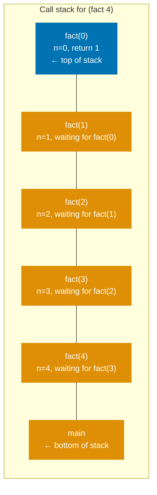

For `fact(5)` that is 6 frames. For `fact(1000000)`, it is one million frames — and a stack overflow.

## CS Concept: Tail Position

A **tail call** is a function call that is the _last thing a function does before returning_. Its result becomes the caller's result with no further computation.

**NOT a tail call** — result of recursive call is used in a further multiplication:

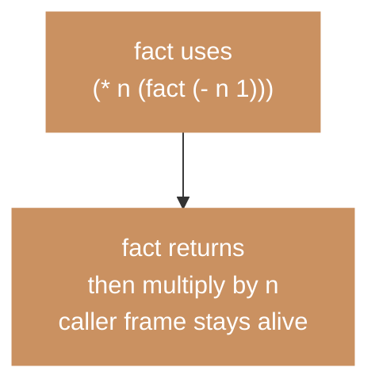

**Tail call** — recursive call is the last thing; result returned directly:

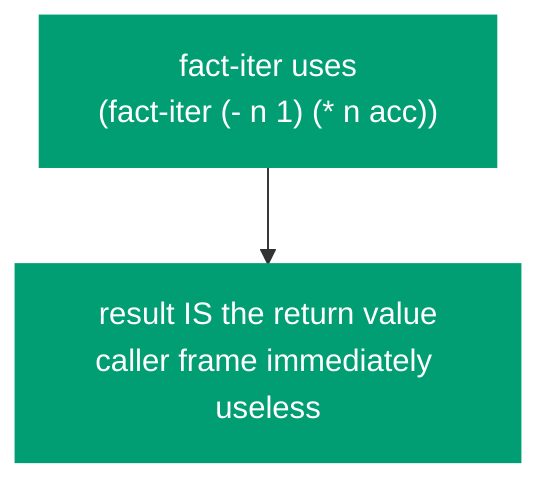

**Tail-call optimization** replaces the recursive call with a jump back to the start of the function, reusing the existing frame. Stack depth stays constant regardless of iteration count.

**Without TCO** — each call pushes a new frame, O(n) stack:

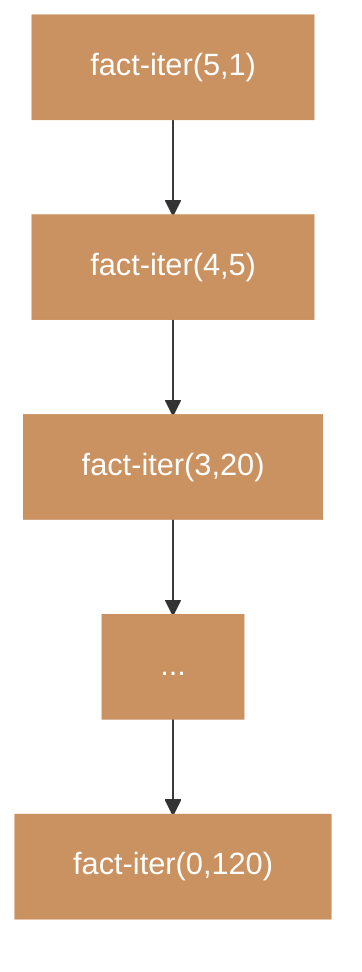

**With TCO** — same frame reused each iteration, O(1) stack:

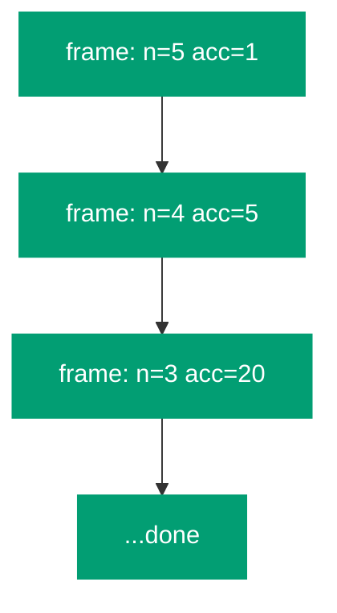

## Why Go's Runtime Gives Us No Help

Go does not perform tail-call optimization. Every function call — including a tail call — pushes a new goroutine stack frame. Go's goroutine stacks _grow dynamically_ (starting at 8KB, growing as needed), so you won't see a stack overflow as quickly as in languages with fixed stacks. But a loop over one million tail calls still allocates one million frames on the heap — memory, not immediate overflow.

**Go function call** — no TCO, every call grows the goroutine stack:

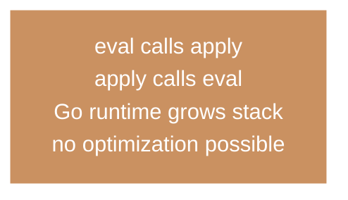

**Scheme tail call** — must be implemented explicitly in the interpreter:

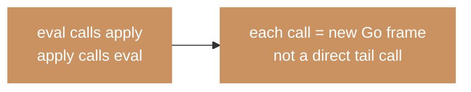

Go TCO operates on _Go functions_. Scheme's TCO guarantee must be implemented explicitly by the interpreter — it is a property of the _hosted_ language, not the _host_ language.

## Identifying Tail Positions in the Evaluator

Before transforming the evaluator, we must identify which `eval` calls are in tail position — those whose result is returned directly without further computation.

**NOT tail position** — `eval` result is used for further computation:

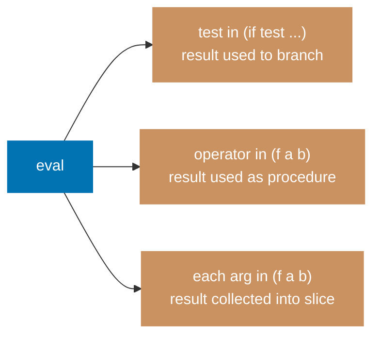

**Tail position** — `eval` result is returned directly, no further computation:

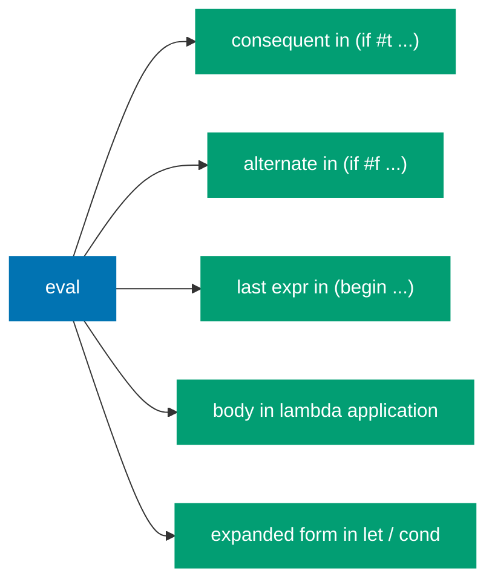

## The Loop Transform

Instead of calling `eval` recursively at tail positions, we update `expr` and `env` variables and `continue` the `for` loop. No new Go stack frame is created.

**Before** — recursive call creates a new Go stack frame:

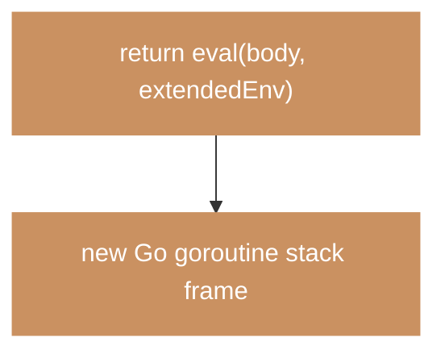

**After** — update variables and `continue` the `for` loop instead:

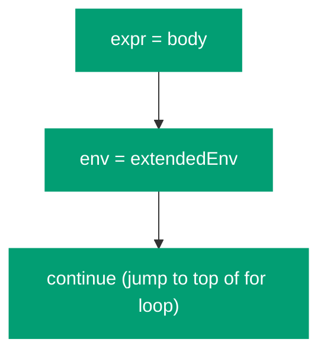

```go
func eval(expr LispVal, env *Env) (LispVal, error) {
    for {
        switch e := expr.(type) {
        case Number, Str, Bool, Nil:
            return expr, nil

        case Symbol:
            return env.lookup(e.Value)

        case List:
            if len(e.Values) == 0 {
                return Nil{}, nil
            }
            head := e.Values[0]
            args := e.Values[1:]

            if sym, ok := head.(Symbol); ok {
                switch sym.Value {
                case "if":
                    test, err := eval(args[0], env)  // NOT tail position
                    if err != nil {
                        return nil, err
                    }
                    if b, ok := test.(Bool); ok && !b.Value {
                        if len(args) < 3 {
                            return Nil{}, nil
                        }
                        expr = args[2]  // LOOP ← tail call
                    } else {
                        expr = args[1]  // LOOP ← tail call
                    }
                    continue

                case "begin":
                    for _, subExpr := range args[:len(args)-1] {
                        _, err := eval(subExpr, env)  // NOT tail position
                        if err != nil {
                            return nil, err
                        }
                    }
                    expr = args[len(args)-1]  // LOOP ← tail call
                    continue

                case "define":
                    return evalDefine(args, env)

                case "lambda":
                    return evalLambda(args, env)

                case "let":
                    expanded, err := desugarLet(args)
                    if err != nil {
                        return nil, err
                    }
                    expr = expanded  // LOOP ← tail call
                    continue

                case "cond":
                    expanded, err := desugarCond(args)
                    if err != nil {
                        return nil, err
                    }
                    expr = expanded  // LOOP ← tail call
                    continue

                case "quote":
                    return args[0], nil
                }
            }

            // General application
            proc, err := eval(head, env)  // NOT tail position
            if err != nil {
                return nil, err
            }
            evaluatedArgs := make([]LispVal, len(args))
            for i, arg := range args {
                evaluatedArgs[i], err = eval(arg, env)  // NOT tail position
                if err != nil {
                    return nil, err
                }
            }

            switch p := proc.(type) {
            case Builtin:
                return p.Fn(evaluatedArgs)
            case Lambda:
                if len(p.Params) != len(evaluatedArgs) {
                    return nil, fmt.Errorf("arity mismatch: expected %d, got %d",
                        len(p.Params), len(evaluatedArgs))
                }
                env = extendEnv(p.Params, evaluatedArgs, p.Env)
                expr = p.Body  // LOOP ← the key tail call!
                continue
            default:
                return nil, fmt.Errorf("not a procedure: %T", proc)
            }

        default:
            return nil, fmt.Errorf("cannot evaluate: %T", expr)
        }
    }
}
```

The critical lines are:

- `expr = args[1]; continue` — `if` consequent tail call
- `expr = args[len(args)-1]; continue` — `begin` last expression
- `expr = p.Body; continue` — lambda body, the most important one

None of these create a Go stack frame. The `for` loop restarts with new values of `expr` and `env`.

## The Trampoline Pattern

The loop transform keeps `eval` iterative internally. An alternative that keeps `eval` recursive is the **trampoline**: a loop that repeatedly calls a function as long as it returns a deferred computation (a thunk) rather than a final value.

**The trampoline loop** — keeps calling until a `Done` value, not a `Bounce` thunk:

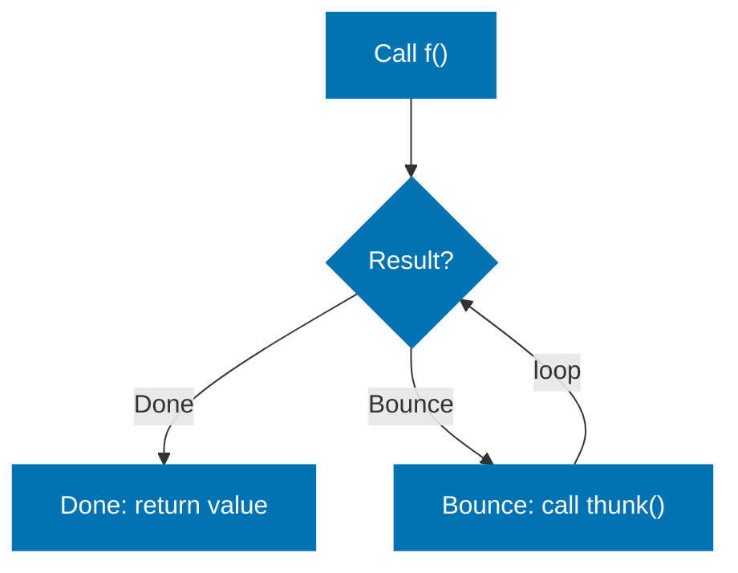

**Tail call in eval with trampoline** — return a thunk instead of recursing:

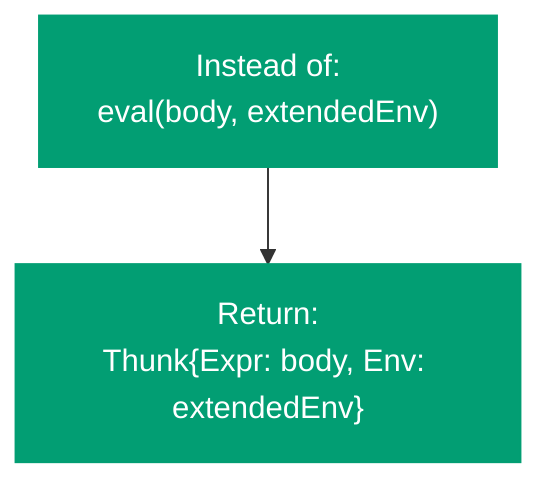

```go
type Thunk struct {
    Expr LispVal
    Env  *Env
}

func trampoline(expr LispVal, env *Env) (LispVal, error) {
    current := expr
    currentEnv := env
    for {
        result, thunk, err := evalStep(current, currentEnv)
        if err != nil {
            return nil, err
        }
        if thunk == nil {
            return result, nil
        }
        current = thunk.Expr
        currentEnv = thunk.Env
    }
}
```

In this approach, `evalStep` returns either a final `LispVal` (with `thunk == nil`) or a `*Thunk` (indicating "continue from here"). The trampoline loop drives the computation without growing the call stack.

## Loop Transform vs Trampoline

**Loop transform:**

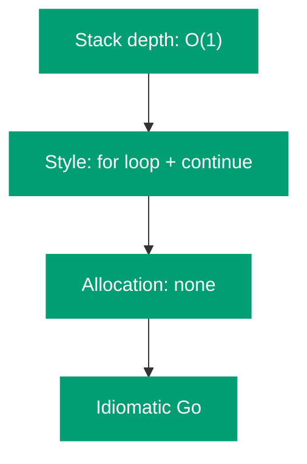

**Trampoline:**

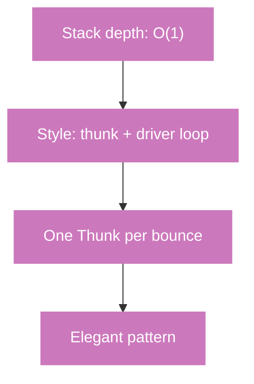

Both are correct. The loop transform is idiomatic Go; the trampoline is more common in functional language implementations and directly mirrors the CPS transform.

## Demonstrating Stack Safety

Without TCO:

```scheme
(define count-down
  (lambda (n)
    (if (= n 0) "done"
      (count-down (- n 1)))))

(count-down 1000000)  ; Stack overflow without TCO
```

With the loop transform, `count-down` runs in O(1) stack space:

**Without TCO** — each call creates a new frame, 1,000,000 frames total:

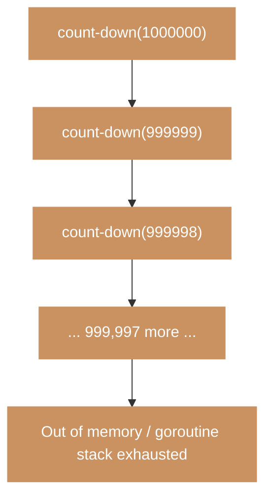

**With TCO** — for loop updates one frame 1,000,000 times:

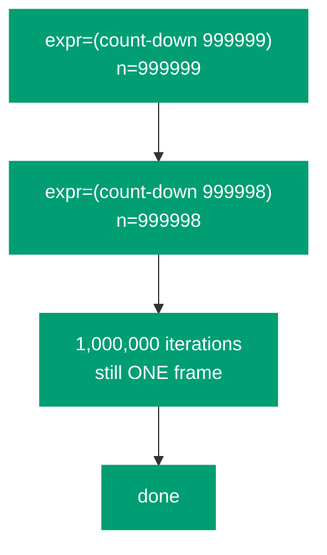

```scheme
(count-down 1000000)
; → "done"  (no overflow, O(1) stack)
```

## CS Concept: Continuation-Passing Style

The trampoline is closely related to **continuation-passing style** (CPS) — a program transformation where every function takes an extra argument (the continuation) representing "what to do next". CPS makes all calls tail calls by construction.

**Direct style** — result flows backward through the call stack:

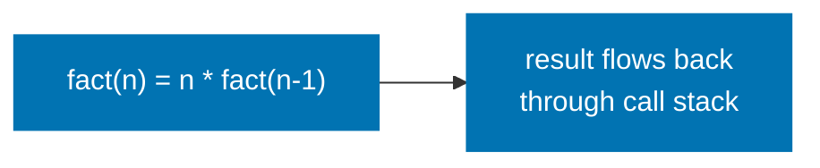

**Continuation-passing style** — result passed forward to a continuation:

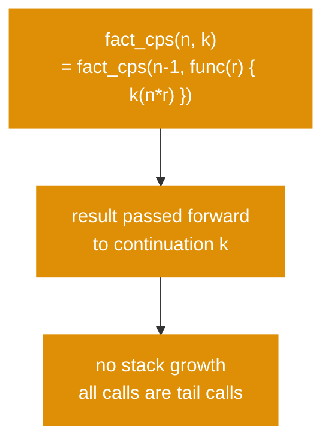

**CPS enables:**

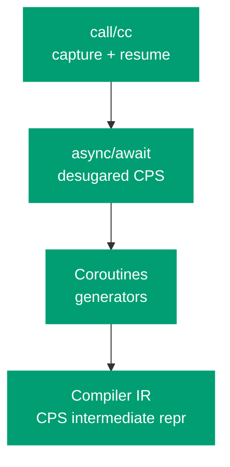

Our interpreter does not implement `call/cc`, but the trampoline pattern gives a taste of the underlying idea: instead of returning a value, you return a description of what to compute next.

## The Complete Interpreter: All Six Parts

```mermaid
%% Color palette: Blue #0173B2, Orange #DE8F05, Teal #029E73, Purple #CC78BC, Brown #CA9161, Gray #808080
flowchart TB
    subgraph P2["Part 2: Front End"]
        direction LR
        src["(fact 5)"] --> tok["tokenize"] --> par["parse"] --> ast["LispVal tree"]
    end

    subgraph P3["Part 3: Eval/Apply Core"]
        direction LR
        ev["eval"] <-->|"mutual recursion"| ap["apply"]
        en["*Env chain"] --> ev
    end

    subgraph P4["Part 4: Special Forms"]
        direction LR
        sf["define · if · lambda · begin"] --> cl["Closures\ncapture *Env"]
    end

    subgraph P5["Part 5: Sugar + REPL"]
        direction LR
        ds["let · cond\n(desugar)"] --> rp["REPL loop\nread→eval→print"]
    end

    subgraph P6["Part 6: TCO"]
        direction LR
        lp["for loop + continue\nreplace tail eval calls"] --> ss["O(1) stack\nfor tail calls"]
    end

    P2 --> P3 --> P4 --> P5 --> P6

    classDef blue fill:#0173B2,color:#fff,stroke:#0173B2
    classDef orange fill:#DE8F05,color:#fff,stroke:#DE8F05
    classDef teal fill:#029E73,color:#fff,stroke:#029E73
    classDef purple fill:#CC78BC,color:#fff,stroke:#CC78BC
    classDef gray fill:#808080,color:#fff,stroke:#808080

    class P2 blue
    class P3 orange
    class P4 teal
    class P5 purple
    class P6 gray
```

## Summary

| Concept        | What it means                                                         | How we implemented it                                       |
| -------------- | --------------------------------------------------------------------- | ----------------------------------------------------------- |
| Tail position  | A call whose result is returned directly, with no further computation | Identified in `if`, `begin`, lambda application             |
| TCO obligation | R5RS requires tail calls not grow the stack                           | Loop transform in `eval`                                    |
| Host vs hosted | Go's own stack growth ≠ Scheme's TCO                                  | Explicit `for` loop; Go runtime can't do this automatically |
| Loop transform | Replace tail-position `eval` calls with variable updates + continue   | `expr = body; continue` instead of `return eval(body, env)` |
| Trampoline     | Return thunks at tail positions; driver loop re-invokes them          | Alternative; same O(1) depth, more functional style         |

**Next steps** (not covered in this series):

- **Macros** — `define-macro` or `define-syntax`: user-defined syntactic transformations
- **Continuations** — `call/cc`: capture and resume the call stack as a first-class value
- **The full R5RS library** — strings, characters, vectors, ports, I/O procedures
- **Proper tail recursion in `map`** — the builtin `map` above is not itself tail-recursive
