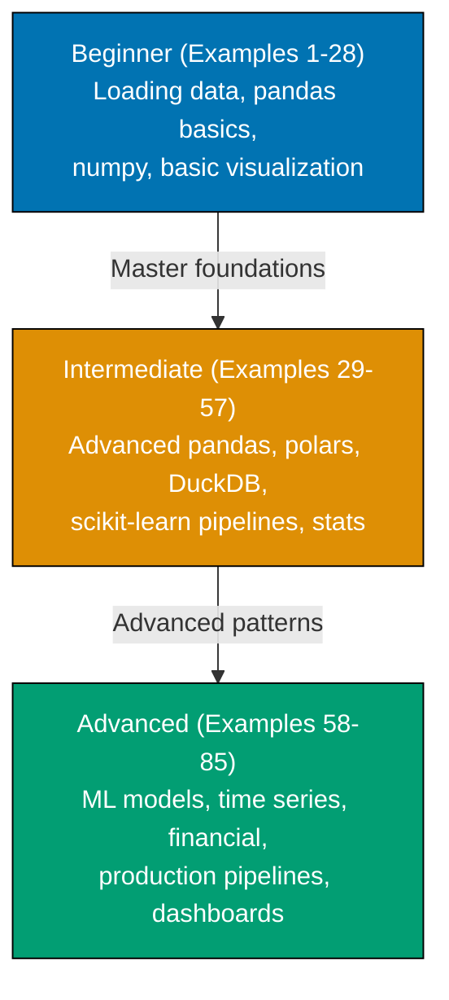
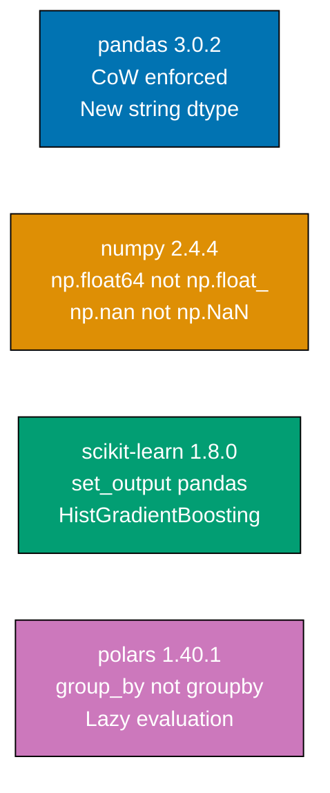

**Want to quickly master Python data analytics through working examples?** This by-example guide teaches 95% of practical data analytics through 85 annotated examples organized by complexity level, targeting pandas 3.0.2, numpy 2.4.4, scikit-learn 1.8.0, and polars 1.40.1.

## What Is By-Example Learning?

By-example learning is an **example-first approach** where you learn through annotated, runnable Python code rather than narrative explanations. Each example is self-contained, immediately executable, and heavily commented to show:

- **What each operation does** - Inline `# =>` comments explain the purpose and mechanism
- **Expected outputs** - Show actual values, shapes, and types after each operation
- **Breaking changes** - Critical version differences for pandas 3.0.2 and numpy 2.4.4
- **Key takeaways** - 1-2 sentence summaries of core concepts

This approach is **ideal for experienced developers** who know at least one programming language and want to quickly understand Python data analytics syntax, library conventions, and patterns through working code.

## Learning Path

The tutorial guides you through 85 examples organized into three progressive levels.



## Version Landscape

This tutorial targets the current major versions as of 2026. Understanding breaking changes is critical — several libraries have major API shifts that break older code.



## What This Tutorial Covers

### Core Libraries

- **pandas 3.0.2** - DataFrame operations, Copy-on-Write, new string dtype, deprecated freq aliases
- **numpy 2.4.4** - Arrays, broadcasting, new random API, updated type names
- **scikit-learn 1.8.0** - Preprocessing, pipelines, classification, regression, clustering
- **polars 1.40.1** - High-performance DataFrames with lazy evaluation and SIMD acceleration

### Visualization

- **matplotlib 3.10.x** - Foundation plotting with `fig, ax = plt.subplots()` pattern
- **seaborn 0.13.2** - Statistical visualization including the new `sns.objects` interface
- **plotly 6.x** - Interactive charts with `px.scatter()`, `px.line()`, `go.Figure()`

### Data Sources and Storage

- **DuckDB 1.2.x** - In-process SQL analytics on DataFrames and Parquet files
- **PyArrow 20.0.0** - Apache Arrow format, Parquet reading, Arrow-backed DataFrames
- **yfinance 0.2.x** - Financial data fetching from Yahoo Finance

### Statistical Analysis

- **scipy 1.15.x** - Statistical tests, hypothesis testing, optimization
- **statsmodels 0.14.x** - OLS regression, time series ARIMA, seasonal decomposition

### Production Patterns

- Reproducible pipelines with type hints and docstrings
- Data validation with pandera
- Streamlit dashboards
- Packaging with `pyproject.toml` and `uv`

## Critical Breaking Changes to Know

Before writing any code, understand these breaking changes in pandas 3.0.2 and numpy 2.4.4:

### pandas 3.0.2 Breaking Changes

**Copy-on-Write (CoW) is now enforced**:

```python
# WRONG in pandas 3.0.2 - raises ChainedAssignmentError
df["subset"]["col"] = value

# CORRECT - use df.loc for modifications
df.loc[mask, "col"] = value
```

**New string dtype** - strings no longer use `object` dtype:

```python
# pandas 3.0.2 default string storage
df["name"].dtype  # => StringDtype (not object)
```

**Deprecated frequency aliases changed**:

```python
# WRONG (pandas 2.x aliases)
df.resample("M")   # Month-end was "M"
df.resample("Y")   # Year-end was "Y"
df.resample("Q")   # Quarter-end was "Q"

# CORRECT (pandas 3.0.2 aliases)
df.resample("ME")  # Month-end is now "ME"
df.resample("YE")  # Year-end is now "YE"
df.resample("QE")  # Quarter-end is now "QE"
```

**`applymap()` replaced by `map()`**:

```python
# WRONG (deprecated in pandas 3.x)
df.applymap(lambda x: x * 2)

# CORRECT (pandas 3.0.2)
df.map(lambda x: x * 2)
```

### numpy 2.4.4 Breaking Changes

**Type alias names changed**:

```python
# WRONG (numpy 1.x aliases, removed in 2.x)
np.float_   # Removed
np.int_     # Removed (means intp now, not int64)
np.complex_ # Removed
np.NaN      # Removed (was alias for float("nan"))

# CORRECT (numpy 2.4.4)
np.float64  # Explicit 64-bit float
np.intp     # Platform pointer integer
np.complex128  # 128-bit complex
np.nan      # Lowercase nan (built-in float)
```

**New random API (use this, not deprecated `np.random.seed()`)**:

```python
# WRONG (deprecated, non-reproducible across processes)
np.random.seed(42)
np.random.normal(0, 1, 100)

# CORRECT (numpy 2.4.4 style)
rng = np.random.default_rng(seed=42)
rng.normal(0, 1, 100)
```

## Prerequisites

This tutorial assumes you:

- Know at least one programming language (Python experience helpful but not required)
- Understand basic programming concepts (loops, functions, data structures)
- Have Python 3.11+ installed with pip or uv

**Installation**:

```bash
pip install pandas==3.0.2 numpy==2.4.4 scikit-learn==1.8.0 polars==1.40.1
pip install matplotlib seaborn plotly scipy statsmodels
pip install pyarrow duckdb yfinance pandera streamlit
```

Or with uv (faster):

```bash
uv pip install pandas numpy scikit-learn polars matplotlib seaborn plotly scipy statsmodels pyarrow duckdb yfinance pandera streamlit
```

## How to Use This Guide

Each example follows a consistent five-part structure:

1. **Brief explanation** - What this example demonstrates (1-3 sentences)
2. **Optional diagram** - Visual representation for complex concepts
3. **Heavily annotated code** - Working Python with `# =>` comments showing values and outputs
4. **Key takeaway** - 1-2 sentence lesson summary
5. **Why It Matters** - 50-100 words on practical significance

The `# =>` annotation pattern documents what happens at each step:

```python
import pandas as pd                    # => pandas 3.0.2

df = pd.read_csv("sales.csv")         # => loads CSV into DataFrame
print(df.shape)                        # => (1000, 8) - rows, columns
print(df.dtypes)                       # => shows column types per column
```

Work through examples sequentially within each level, or jump directly to the example that covers your immediate need. Each example is self-contained.

## Examples by Level

### Beginner (Examples 1–28)

- [Example 1: Loading CSV with pandas 3.0.2](/en/learn/software-engineering/data/analytics/by-example/beginner#example-1-loading-csv-with-pandas-302)
- [Example 2: DataFrame Basics — Shape, Info, Describe](/en/learn/software-engineering/data/analytics/by-example/beginner#example-2-dataframe-basics--shape-info-describe)
- [Example 3: Selecting Columns and Rows — loc, iloc, Single/Multi-Column](/en/learn/software-engineering/data/analytics/by-example/beginner#example-3-selecting-columns-and-rows--loc-iloc-singlemulti-column)
- [Example 4: Copy-on-Write in pandas 3.0.2 — ChainedAssignmentError](/en/learn/software-engineering/data/analytics/by-example/beginner#example-4-copy-on-write-in-pandas-302--chainedassignmenterror)
- [Example 5: Filtering Rows — Boolean Indexing](/en/learn/software-engineering/data/analytics/by-example/beginner#example-5-filtering-rows--boolean-indexing)
- [Example 6: Handling Missing Values](/en/learn/software-engineering/data/analytics/by-example/beginner#example-6-handling-missing-values)
- [Example 7: Data Types — astype, StringDtype, Safe Conversion](/en/learn/software-engineering/data/analytics/by-example/beginner#example-7-data-types--astype-stringdtype-safe-conversion)
- [Example 8: Sorting — sort_values with Single and Multiple Keys](/en/learn/software-engineering/data/analytics/by-example/beginner#example-8-sorting--sort_values-with-single-and-multiple-keys)
- [Example 9: Adding and Removing Columns](/en/learn/software-engineering/data/analytics/by-example/beginner#example-9-adding-and-removing-columns)
- [Example 10: Aggregations with groupby](/en/learn/software-engineering/data/analytics/by-example/beginner#example-10-aggregations-with-groupby)
- [Example 11: Renaming and Reindexing](/en/learn/software-engineering/data/analytics/by-example/beginner#example-11-renaming-and-reindexing)
- [Example 12: Merging DataFrames — pd.merge Join Types](/en/learn/software-engineering/data/analytics/by-example/beginner#example-12-merging-dataframes--pdmerge-join-types)
- [Example 13: Concatenating DataFrames — pd.concat](/en/learn/software-engineering/data/analytics/by-example/beginner#example-13-concatenating-dataframes--pdconcat)
- [Example 14: String Operations with pandas](/en/learn/software-engineering/data/analytics/by-example/beginner#example-14-string-operations-with-pandas)
- [Example 15: Date and Time — pd.to_datetime, dt Accessor, New Freq Aliases](/en/learn/software-engineering/data/analytics/by-example/beginner#example-15-date-and-time--pdto_datetime-dt-accessor-new-freq-aliases)
- [Example 16: numpy Arrays — Creating and Inspecting](/en/learn/software-engineering/data/analytics/by-example/beginner#example-16-numpy-arrays--creating-and-inspecting)
- [Example 17: numpy Arithmetic — Element-wise Operations and Broadcasting](/en/learn/software-engineering/data/analytics/by-example/beginner#example-17-numpy-arithmetic--element-wise-operations-and-broadcasting)
- [Example 18: numpy 2.4.4 Random — default_rng (New API)](/en/learn/software-engineering/data/analytics/by-example/beginner#example-18-numpy-244-random--default_rng-new-api)
- [Example 19: numpy 2.4.4 Type Names — Breaking Changes from 1.x](/en/learn/software-engineering/data/analytics/by-example/beginner#example-19-numpy-244-type-names--breaking-changes-from-1x)
- [Example 20: Basic matplotlib Plot — fig, ax Pattern](/en/learn/software-engineering/data/analytics/by-example/beginner#example-20-basic-matplotlib-plot--fig-ax-pattern)
- [Example 21: Scatter Plot with matplotlib and pandas](/en/learn/software-engineering/data/analytics/by-example/beginner#example-21-scatter-plot-with-matplotlib-and-pandas)
- [Example 22: Bar Chart — Grouped and Stacked](/en/learn/software-engineering/data/analytics/by-example/beginner#example-22-bar-chart--grouped-and-stacked)
- [Example 23: Histogram — Understanding Distributions](/en/learn/software-engineering/data/analytics/by-example/beginner#example-23-histogram--understanding-distributions)
- [Example 24: seaborn Basics — scatterplot, lineplot, histplot](/en/learn/software-engineering/data/analytics/by-example/beginner#example-24-seaborn-basics--scatterplot-lineplot-histplot)
- [Example 25: seaborn Heatmap — Correlation Matrix](/en/learn/software-engineering/data/analytics/by-example/beginner#example-25-seaborn-heatmap--correlation-matrix)
- [Example 26: Saving Plots — savefig with DPI and Layout](/en/learn/software-engineering/data/analytics/by-example/beginner#example-26-saving-plots--savefig-with-dpi-and-layout)
- [Example 27: Jupyter Notebook Setup — Display and Magic Commands](/en/learn/software-engineering/data/analytics/by-example/beginner#example-27-jupyter-notebook-setup--display-and-magic-commands)
- [Example 28: Data Summary Report — Combining Describe, value_counts, and Missing Analysis](/en/learn/software-engineering/data/analytics/by-example/beginner#example-28-data-summary-report--combining-describe-value_counts-and-missing-analysis)

### Intermediate (Examples 29–57)

- [Example 29: DataFrame.map() — Replacing Deprecated applymap()](/en/learn/software-engineering/data/analytics/by-example/intermediate#example-29-dataframemap--replacing-deprecated-applymap)
- [Example 30: pd.col() Expression Syntax — Lazy Column References](/en/learn/software-engineering/data/analytics/by-example/intermediate#example-30-pdcol-expression-syntax--lazy-column-references)
- [Example 31: apply() vs map() vs Vectorized Operations — Performance](/en/learn/software-engineering/data/analytics/by-example/intermediate#example-31-apply-vs-map-vs-vectorized-operations--performance)
- [Example 32: Pivot Tables — pd.pivot_table](/en/learn/software-engineering/data/analytics/by-example/intermediate#example-32-pivot-tables--pdpivot_table)
- [Example 33: Melt and Stack/Unstack — Wide to Long Reshaping](/en/learn/software-engineering/data/analytics/by-example/intermediate#example-33-melt-and-stackunstack--wide-to-long-reshaping)
- [Example 34: Window Functions — Rolling, Expanding, EWM](/en/learn/software-engineering/data/analytics/by-example/intermediate#example-34-window-functions--rolling-expanding-ewm)
- [Example 35: Time Series Resampling — New Freq Aliases (pandas 3.0.2)](/en/learn/software-engineering/data/analytics/by-example/intermediate#example-35-time-series-resampling--new-freq-aliases-pandas-302)
- [Example 36: Multi-level Indexing — MultiIndex Creation and Slicing](/en/learn/software-engineering/data/analytics/by-example/intermediate#example-36-multi-level-indexing--multiindex-creation-and-slicing)
- [Example 37: Reading Parquet with PyArrow](/en/learn/software-engineering/data/analytics/by-example/intermediate#example-37-reading-parquet-with-pyarrow)
- [Example 38: polars 1.40.1 Basics — API Differences from pandas](/en/learn/software-engineering/data/analytics/by-example/intermediate#example-38-polars-1401-basics--api-differences-from-pandas)
- [Example 39: polars Lazy Evaluation — scan_csv + collect](/en/learn/software-engineering/data/analytics/by-example/intermediate#example-39-polars-lazy-evaluation--scan_csv--collect)
- [Example 40: polars Expressions — str, cast, when/then/otherwise](/en/learn/software-engineering/data/analytics/by-example/intermediate#example-40-polars-expressions--str-cast-whenthenotherwise)
- [Example 41: polars vs pandas Performance — When to Use Each](/en/learn/software-engineering/data/analytics/by-example/intermediate#example-41-polars-vs-pandas-performance--when-to-use-each)
- [Example 42: DuckDB 1.2.x — In-process SQL on DataFrames](/en/learn/software-engineering/data/analytics/by-example/intermediate#example-42-duckdb-12x--in-process-sql-on-dataframes)
- [Example 43: DuckDB Reading Parquet and CSV Directly](/en/learn/software-engineering/data/analytics/by-example/intermediate#example-43-duckdb-reading-parquet-and-csv-directly)
- [Example 44: Feature Engineering — Binning with pd.cut and pd.qcut](/en/learn/software-engineering/data/analytics/by-example/intermediate#example-44-feature-engineering--binning-with-pdcut-and-pdqcut)
- [Example 45: Outlier Detection — IQR Method and Z-Score](/en/learn/software-engineering/data/analytics/by-example/intermediate#example-45-outlier-detection--iqr-method-and-z-score)
- [Example 46: Encoding Categorical Variables](/en/learn/software-engineering/data/analytics/by-example/intermediate#example-46-encoding-categorical-variables)
- [Example 47: Scaling Features — StandardScaler and MinMaxScaler](/en/learn/software-engineering/data/analytics/by-example/intermediate#example-47-scaling-features--standardscaler-and-minmaxscaler)
- [Example 48: scikit-learn Pipeline — Preprocessing + Model in One Object](/en/learn/software-engineering/data/analytics/by-example/intermediate#example-48-scikit-learn-pipeline--preprocessing--model-in-one-object)
- [Example 49: scikit-learn set_output — pandas-native Pipeline Output](/en/learn/software-engineering/data/analytics/by-example/intermediate#example-49-scikit-learn-set_output--pandas-native-pipeline-output)
- [Example 50: Train/Test Split — Stratification and Random State](/en/learn/software-engineering/data/analytics/by-example/intermediate#example-50-traintest-split--stratification-and-random-state)
- [Example 51: Cross-Validation — cross_val_score and StratifiedKFold](/en/learn/software-engineering/data/analytics/by-example/intermediate#example-51-cross-validation--cross_val_score-and-stratifiedkfold)
- [Example 52: plotly Interactive Charts — px.scatter, px.line, px.bar](/en/learn/software-engineering/data/analytics/by-example/intermediate#example-52-plotly-interactive-charts--pxscatter-pxline-pxbar)
- [Example 53: plotly Subplots — Multiple Chart Types in One Figure](/en/learn/software-engineering/data/analytics/by-example/intermediate#example-53-plotly-subplots--multiple-chart-types-in-one-figure)
- [Example 54: seaborn objects Interface — sns.objects (0.13.2)](/en/learn/software-engineering/data/analytics/by-example/intermediate#example-54-seaborn-objects-interface--snsobjects-0132)
- [Example 55: Statistical Testing — scipy.stats.ttest_ind](/en/learn/software-engineering/data/analytics/by-example/intermediate#example-55-statistical-testing--scipystatsttest_ind)
- [Example 56: Chi-Square Test — Categorical Independence](/en/learn/software-engineering/data/analytics/by-example/intermediate#example-56-chi-square-test--categorical-independence)
- [Example 57: Correlation Analysis — Pearson and Spearman](/en/learn/software-engineering/data/analytics/by-example/intermediate#example-57-correlation-analysis--pearson-and-spearman)

### Advanced (Examples 58–85)

- [Example 58: Linear Regression with scikit-learn](/en/learn/software-engineering/data/analytics/by-example/advanced#example-58-linear-regression-with-scikit-learn)
- [Example 59: Logistic Regression — Classification Report and Confusion Matrix](/en/learn/software-engineering/data/analytics/by-example/advanced#example-59-logistic-regression--classification-report-and-confusion-matrix)
- [Example 60: HistGradientBoostingClassifier — NaN-Native Gradient Boosting](/en/learn/software-engineering/data/analytics/by-example/advanced#example-60-histgradientboostingclassifier--nan-native-gradient-boosting)
- [Example 61: Hyperparameter Tuning — GridSearchCV and RandomizedSearchCV](/en/learn/software-engineering/data/analytics/by-example/advanced#example-61-hyperparameter-tuning--gridsearchcv-and-randomizedsearchcv)
- [Example 62: Feature Importance — permutation_importance](/en/learn/software-engineering/data/analytics/by-example/advanced#example-62-feature-importance--permutation_importance)
- [Example 63: Unsupervised Learning — KMeans and Silhouette Score](/en/learn/software-engineering/data/analytics/by-example/advanced#example-63-unsupervised-learning--kmeans-and-silhouette-score)
- [Example 64: Dimensionality Reduction — PCA and t-SNE](/en/learn/software-engineering/data/analytics/by-example/advanced#example-64-dimensionality-reduction--pca-and-t-sne)
- [Example 65: Time Series Analysis with statsmodels — ARIMA](/en/learn/software-engineering/data/analytics/by-example/advanced#example-65-time-series-analysis-with-statsmodels--arima)
- [Example 66: ARIMA Forecasting and Residual Diagnostics](/en/learn/software-engineering/data/analytics/by-example/advanced#example-66-arima-forecasting-and-residual-diagnostics)
- [Example 67: Seasonal Decomposition — Trend, Seasonality, Residual](/en/learn/software-engineering/data/analytics/by-example/advanced#example-67-seasonal-decomposition--trend-seasonality-residual)
- [Example 68: yfinance 0.2.x — Fetching Financial Data](/en/learn/software-engineering/data/analytics/by-example/advanced#example-68-yfinance-02x--fetching-financial-data)
- [Example 69: Financial Analysis — Returns, Rolling Volatility, Sharpe Ratio](/en/learn/software-engineering/data/analytics/by-example/advanced#example-69-financial-analysis--returns-rolling-volatility-sharpe-ratio)
- [Example 70: Working with Large Datasets — Chunked Reading and Dask Basics](/en/learn/software-engineering/data/analytics/by-example/advanced#example-70-working-with-large-datasets--chunked-reading-and-dask-basics)
- [Example 71: PyArrow 20.0.0 — Reading Parquet and Schema Inspection](/en/learn/software-engineering/data/analytics/by-example/advanced#example-71-pyarrow-2000--reading-parquet-and-schema-inspection)
- [Example 72: Arrow-backed DataFrames — 2-5x Memory Reduction](/en/learn/software-engineering/data/analytics/by-example/advanced#example-72-arrow-backed-dataframes--2-5x-memory-reduction)
- [Example 73: Data Validation with pandera](/en/learn/software-engineering/data/analytics/by-example/advanced#example-73-data-validation-with-pandera)
- [Example 74: Advanced Aggregations — Named Agg and Custom Functions](/en/learn/software-engineering/data/analytics/by-example/advanced#example-74-advanced-aggregations--named-agg-and-custom-functions)
- [Example 75: String Matching and Fuzzy Join](/en/learn/software-engineering/data/analytics/by-example/advanced#example-75-string-matching-and-fuzzy-join)
- [Example 76: Geospatial Basics with geopandas](/en/learn/software-engineering/data/analytics/by-example/advanced#example-76-geospatial-basics-with-geopandas)
- [Example 77: NetworkX — Graph Analytics](/en/learn/software-engineering/data/analytics/by-example/advanced#example-77-networkx--graph-analytics)
- [Example 78: A/B Testing Analysis — t-test, Effect Size, Sample Size](/en/learn/software-engineering/data/analytics/by-example/advanced#example-78-ab-testing-analysis--t-test-effect-size-sample-size)
- [Example 79: Survival Analysis Basics with lifelines](/en/learn/software-engineering/data/analytics/by-example/advanced#example-79-survival-analysis-basics-with-lifelines)
- [Example 80: Reproducible Analytics Pipeline — Functions, Type Hints, Tests](/en/learn/software-engineering/data/analytics/by-example/advanced#example-80-reproducible-analytics-pipeline--functions-type-hints-tests)
- [Example 81: Exporting Results — CSV, Excel, Parquet, Styled HTML](/en/learn/software-engineering/data/analytics/by-example/advanced#example-81-exporting-results--csv-excel-parquet-styled-html)
- [Example 82: Scheduling Analytics — schedule Library and Cron Patterns](/en/learn/software-engineering/data/analytics/by-example/advanced#example-82-scheduling-analytics--schedule-library-and-cron-patterns)
- [Example 83: Streamlit Analytics Dashboard](/en/learn/software-engineering/data/analytics/by-example/advanced#example-83-streamlit-analytics-dashboard)
- [Example 84: Packaging an Analytics Project — pyproject.toml and uv](/en/learn/software-engineering/data/analytics/by-example/advanced#example-84-packaging-an-analytics-project--pyprojecttoml-and-uv)
- [Example 85: Data Analytics Production Checklist](/en/learn/software-engineering/data/analytics/by-example/advanced#example-85-data-analytics-production-checklist)
