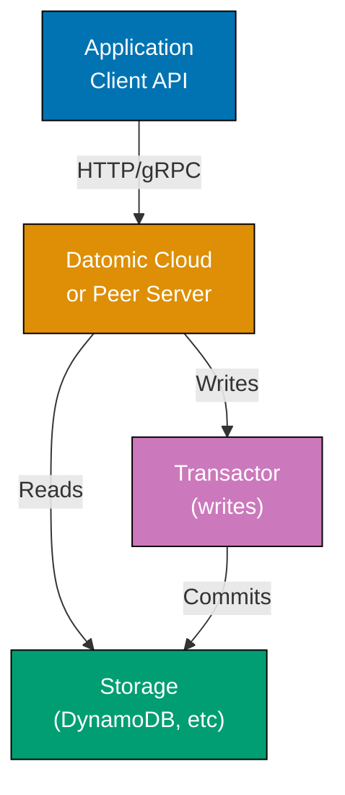

Master advanced Datomic with 20 expert-level examples. Explore client API, excision, performance tuning, distributed patterns, and production deployment strategies.

## Example 61: Client API for Remote Access

The client API provides remote database access via HTTP or gRPC. Lighter-weight than peer library for microservices.



**Code**:

```clojure
;; Note: Client API requires Datomic Cloud or Peer Server
;; For Datomic Free, use peer library as shown in earlier examples

;; Connect via client API (Datomic Cloud example)
(require '[datomic.client.api :as d-client])

(def client (d-client/client {:server-type :cloud
                               :region "us-east-1"
                               :system "my-system"
                               :endpoint "https://..."}))
;; => Creates client connection to Datomic Cloud

(def conn (d-client/connect client {:db-name "tutorial"}))
;; => Connect to specific database

;; Query via client API (same datalog)
(d-client/q '[:find ?name
              :where [?e :person/name ?name]]
            (d-client/db conn))
;; => Client API uses same query language as peer
;; => Queries execute remotely on peer server or Cloud

;; Transaction via client API
(d-client/transact conn
  {:tx-data [{:person/name "Remote User"
              :person/email "remote@example.com"}]})
;; => :tx-data key wraps transaction data
;; => Returns transaction result map
```

**Key Takeaway**: Client API provides remote access to Datomic Cloud/Peer Server. Same query and transaction semantics as peer library, lighter resource footprint.

---

## Example 62: Excision for Data Deletion (GDPR Compliance)

Excision permanently removes data from database history. Use for legal requirements like GDPR "right to be forgotten".

**Code**:

```clojure
;; Note: Excision requires Datomic Pro or Cloud
;; Datomic Free doesn't support excision

;; Mark entity for excision (Datomic Pro/Cloud example)
;; WARNING: Excision is irreversible - data permanently deleted

;; Query entity to excise
(def entity-to-excise
  (d/q '[:find ?e .
         :where [?e :person/email "excise-me@example.com"]]
       db))

;; Submit excision request (Datomic Cloud API)
(d-client/transact conn
  {:tx-data [[:db/excise entity-to-excise]]})
;; => Schedules excision of entity
;; => Background process removes all datoms for this entity from history
;; => Cannot be undone - use with extreme caution

;; Alternative: Soft delete for Datomic Free
@(d/transact conn
   [{:db/ident       :person/deleted
     :db/valueType   :db.type/boolean
     :db/cardinality :db.cardinality/one}])

@(d/transact conn
   [{:db/id [:person/email "alice@example.com"]
     :person/deleted true}])
;; => Mark as deleted instead of excising
;; => Filter deleted entities in queries
```

**Key Takeaway**: Excision (Pro/Cloud) permanently removes data from history. Use for GDPR compliance. Datomic Free uses soft deletes with boolean flags.

---

## Example 63: Analytical Queries with Aggregates

Combine multiple aggregates and grouping for analytical workloads.

**Code**:

```clojure
;; Statistics by tenant
(d/q '[:find ?tenant (count ?e) (avg ?age) (min ?age) (max ?age)
       :where [?e :person/tenant ?tenant]
              [?e :person/age ?age]]
     db)
;; => [["acme" 15 32.5 22 55]
;;     ["globex" 12 29.3 21 48]]
;; => Returns tenant, count, average age, min age, max age

;; Age distribution (histogram bins)
(d/q '[:find ?age-bin (count ?e)
       :where [?e :person/age ?age]
              [(quot ?age 10) ?age-bin]]
     db)
;; => [[2 450] [3 380] [4 178]]
;; => Groups by decade: 20s, 30s, 40s

;; Custom aggregate: percentile
(defn percentile [p vals]
  (let [sorted (sort vals)
        idx (int (* p (dec (count vals))))]
    (nth sorted idx)))

(d/q '[:find (my-ns/percentile 0.95 ?age)
       :where [?e :person/age ?age]]
     db)
;; => [[52]]
;; => 95th percentile age
```

**Key Takeaway**: Combine built-in and custom aggregates for analytics. Group by computed expressions for histograms and distribution analysis.

---

## Example 64: Streaming Large Result Sets

Process large query results as lazy sequences to avoid memory issues.

**Code**:

```clojure
;; Query returns lazy sequence
(def all-people
  (d/q '[:find ?e ?name
         :where [?e :person/name ?name]]
       db))
;; => Lazy sequence - not fully realized in memory

;; Process in chunks
(doseq [chunk (partition-all 100 all-people)]
  (println "Processing" (count chunk) "people")
  ;; Process chunk
  (doseq [[e name] chunk]
    ;; Do something with each person
    nil))
;; => Processes 100 entities at a time
;; => Keeps memory usage constant

;; Transform lazily
(->> (d/q '[:find ?e :where [?e :person/name]] db)
     (map first)
     (map (partial d/entity db))
     (filter #(> (:person/age % 0) 30))
     (take 10))
;; => Lazy transformation pipeline
;; => Only realizes 10 results, not entire dataset
```

**Key Takeaway**: Query results are lazy sequences. Use `partition-all`, lazy transformations, and `take` to process large datasets with constant memory.

---

## Example 65: Custom Index for Query Optimization

Build materialized views or custom indexes for frequently-accessed patterns.

**Code**:

```clojure
;; Materialize age-to-people index in atom
(def age-index (atom {}))

(defn rebuild-age-index [db]
  (reset! age-index
    (reduce (fn [acc [e age]]
              (update acc age (fnil conj []) e))
            {}
            (d/q '[:find ?e ?age
                   :where [?e :person/age ?age]]
                 db))))

(rebuild-age-index db)

;; Query custom index (O(1) lookup)
(get @age-index 30)
;; => [entity-id-1 entity-id-2 ...]
;; => Instant lookup vs query scan

;; Update index incrementally after transactions
(defn update-age-index [tx-data]
  (doseq [[e a v tx added] tx-data]
    (when (= a :person/age)
      (if added
        (swap! age-index update v (fnil conj []) e)
        (swap! age-index update v (fn [es] (remove #{e} es)))))))
```

**Key Takeaway**: Build custom indexes for hot query paths. Materialize query results in memory for O(1) lookups. Update incrementally using transaction data.

---

## Example 66: Distributed Transactions Across Databases

Coordinate transactions across multiple Datomic databases using application-level coordination.

**Code**:

```clojure
;; Note: Datomic doesn't support distributed transactions across databases
;; Use application-level coordination (e.g., outbox pattern)

;; Two databases
(def uri-1 "datomic:mem://db1")
(def uri-2 "datomic:mem://db2")
(d/create-database uri-1)
(d/create-database uri-2)
(def conn-1 (d/connect uri-1))
(def conn-2 (d/connect uri-2))

;; Application-level two-phase commit simulation
(defn distributed-transact [conn-1 tx-1 conn-2 tx-2]
  (try
    ;; Phase 1: Prepare (validate transactions)
    (d/with (d/db conn-1) tx-1)
    (d/with (d/db conn-2) tx-2)
    ;; Phase 2: Commit (both or neither)
    (let [result-1 @(d/transact conn-1 tx-1)
          result-2 @(d/transact conn-2 tx-2)]
      {:success true
       :results [result-1 result-2]})
    (catch Exception e
      ;; Rollback if either fails
      {:success false
       :error (.getMessage e)})))

;; Use with care - not true distributed transactions
(distributed-transact
  conn-1 [{:person/name "User in DB1"}]
  conn-2 [{:project/name "Project in DB2"}])
```

**Key Takeaway**: Datomic transactions are per-database. Use application-level coordination (saga pattern, outbox pattern) for cross-database atomicity.

---

## Example 67: Performance Tuning with Memory Settings

Optimize peer memory settings for query performance and cache hit rates.

**Code**:

```clojure
;; Note: Memory tuning applies to Datomic Pro/Cloud peer servers
;; For Datomic Free embedded peer, use JVM heap settings

;; JVM settings for peer (example)
;; -Xmx4g -Xms4g              (4GB heap)
;; -Ddatomic.objectCacheMax=1g (1GB object cache)
;; -Ddatomic.memoryIndexMax=512m (512MB memory index)

;; Monitor cache statistics (Datomic Pro)
;; (d/metrics conn)
;; => Returns metrics including cache hit rates

;; Application-level caching of database values
(def db-cache (atom {:db nil :valid-until 0}))

(defn cached-db [conn cache-ms]
  (let [now (System/currentTimeMillis)
        cached @db-cache]
    (if (> now (:valid-until cached))
      (let [new-db (d/db conn)]
        (reset! db-cache {:db new-db
                          :valid-until (+ now cache-ms)})
        new-db)
      (:db cached)))

;; Use cached db (refreshes every 1 second)
(cached-db conn 1000)
;; => Returns cached database value (saves connection overhead)
```

**Key Takeaway**: Tune peer memory settings for performance. Cache database values at application level to reduce connection overhead for read-heavy workloads.

---

## Example 68: Schema Versioning and Migration

Manage schema evolution across versions using additive schema changes and migration functions.

**Code**:

```clojure
;; Schema versioning attribute
@(d/transact conn
   [{:db/ident       :schema/version
     :db/valueType   :db.type/long
     :db/cardinality :db.cardinality/one}])

;; Initial schema (v1)
(def schema-v1
  [{:db/ident       :person/full-name
    :db/valueType   :db.type/string
    :db/cardinality :db.cardinality/one}])

@(d/transact conn (conj schema-v1 {:db/ident :schema/version :schema/version 1}))

;; Schema v2: Split full-name into first-name and last-name
(def schema-v2
  [{:db/ident       :person/first-name
    :db/valueType   :db.type/string
    :db/cardinality :db.cardinality/one}
   {:db/ident       :person/last-name
    :db/valueType   :db.type/string
    :db/cardinality :db.cardinality/one}])

;; Migration function
(defn migrate-v1-to-v2 [conn]
  ;; Add new attributes
  @(d/transact conn schema-v2)
  ;; Transform data
  (let [db (d/db conn)
        people (d/q '[:find ?e ?full-name
                      :where [?e :person/full-name ?full-name]]
                    db)]
    @(d/transact conn
       (for [[e full-name] people
             :let [parts (clojure.string/split full-name #" ")
                   first-name (first parts)
                   last-name (last parts)]]
         {:db/id e
          :person/first-name first-name
          :person/last-name last-name})))
  ;; Update version
  @(d/transact conn [{:db/ident :schema/version :schema/version 2}]))

;; Check current version
(def current-version
  (:schema/version (d/entity (d/db conn) :schema/version)))

;; Run migration if needed
(when (< current-version 2)
  (migrate-v1-to-v2 conn))
```

**Key Takeaway**: Schema evolution is additive in Datomic. Version your schema, write migration functions to transform data, and track schema version in database.

---

## Example 69: Monitoring and Alerting on Transaction Log

Monitor transaction log for anomalies, trigger alerts on suspicious patterns.

**Code**:

```clojure
(defn monitor-large-transactions [conn threshold]
  (let [log (d/log conn)
        recent-txs (take 100 (d/tx-range log nil nil))]
    (doseq [tx recent-txs]
      (let [datom-count (count (:data tx))]
        (when (> datom-count threshold)
          (println "ALERT: Large transaction detected:"
                   "tx-id" (:t tx)
                   "datoms" datom-count)
          ;; Trigger alert (send to monitoring system)
          )))))

;; Run monitoring
(monitor-large-transactions conn 1000)
;; => Alerts on transactions with >1000 datoms

;; Monitor specific attribute changes
(defn monitor-sensitive-attributes [conn attributes]
  (let [db (d/db conn)
        log (d/log conn)
        recent-txs (take 100 (d/tx-range log nil nil))]
    (doseq [tx recent-txs]
      (doseq [datom (:data tx)
              :let [attr (d/ident db (:a datom))]
              :when (attributes attr)]
        (println "ALERT: Sensitive attribute changed:"
                 "entity" (:e datom)
                 "attribute" attr
                 "tx" (:t tx))))))

(monitor-sensitive-attributes conn #{:person/email :person/password-hash})
```

**Key Takeaway**: Monitor transaction log for anomalies, large transactions, sensitive data changes. Essential for security, compliance, and operational visibility.

---

## Example 70: Backup and Point-in-Time Recovery

Create backups and restore to specific points in time.

**Code**:

```clojure
;; Note: Backup strategies differ by storage backend
;; Datomic Free (dev storage): backup not supported (in-memory or local files)
;; Datomic Pro: use backup-db API
;; Datomic Cloud: AWS backup snapshots

;; Datomic Pro backup example (requires Pro license)
;; (d/backup-db conn "s3://my-bucket/backups/tutorial")

;; For Datomic Free: export data manually
(defn export-database [conn output-file]
  (let [db (d/db conn)
        all-datoms (d/datoms db :eavt)]
    (with-open [w (clojure.java.io/writer output-file)]
      (doseq [datom all-datoms]
        (.write w (pr-str datom))
        (.write w "\n")))))

;; Export all data
(export-database conn "backup-2026-01-29.edn")

;; Point-in-time query (no restore needed - just query)
(def db-yesterday (d/as-of (d/db conn) yesterday-tx-id))
(d/q '[:find (count ?e) . :where [?e :person/name]] db-yesterday)
;; => Count of people as of yesterday
;; => No restore needed - immutability enables time-travel
```

**Key Takeaway**: Datomic Pro/Cloud support native backup. Datomic Free uses manual export or just queries historical database values. Immutability enables point-in-time queries without restore.

---

## Example 71: Integration with Message Queues

Publish database changes to message queues for downstream processing.

**Code**:

```clojure
;; Simulate message queue (use real queue in production)
(def message-queue (atom []))

(defn publish-change-event [entity-id attribute old-value new-value]
  (swap! message-queue conj
    {:entity entity-id
     :attribute attribute
     :old old-value
     :new new-value
     :timestamp (java.util.Date.)}))

;; Process transactions and publish changes
(defn process-transaction-for-events [tx-result]
  (let [db-before (:db-before tx-result)
        db-after (:db-after tx-result)
        tx-data (:tx-data tx-result)]
    (doseq [[e a v tx added] tx-data]
      (let [attr-ident (d/ident db-after a)]
        (when (and added (= (namespace attr-ident) "person"))
          (let [old-value (get (d/entity db-before e) attr-ident)]
            (publish-change-event e attr-ident old-value v)))))))

;; Transact and publish
(def tx-result
  @(d/transact conn
     [{:person/email "queue-test@example.com"
       :person/name "Queue Test"
       :person/age 35}]))

(process-transaction-for-events tx-result)

;; Check message queue
@message-queue
;; => [{:entity 123 :attribute :person/name :old nil :new "Queue Test" ...}
;;     {:entity 123 :attribute :person/age :old nil :new 35 ...}]
```

**Key Takeaway**: Process transaction results to publish change events to message queues. Enables event-driven architectures and downstream system integration.

---

## Example 72: Multi-Version Concurrency Control (MVCC)

Understand Datomic's MVCC model: reads never block writes, writes never block reads.

**Code**:

```clojure
;; Thread 1: Long-running read
(def reader-db (d/db conn))
(future
  (Thread/sleep 5000) ;; Simulate slow processing
  (println "Reader sees count:"
           (d/q '[:find (count ?e) . :where [?e :person/name]] reader-db)))

;; Thread 2: Write during read
(Thread/sleep 1000)
@(d/transact conn
   [{:person/email "concurrent@example.com"
     :person/name "Concurrent User"}])

;; Output:
;; Reader sees count: 1008
;; => Reader's database value is immutable
;; => Unaffected by concurrent writes

;; New reader sees updated count
(d/q '[:find (count ?e) . :where [?e :person/name]] (d/db conn))
;; => 1009
;; => New database value includes concurrent write
```

**Key Takeaway**: Datomic uses MVCC - database values are immutable snapshots. Reads never block writes, writes never block reads. No read locks needed.

---

## Example 73: Optimizing Large Cardinality-Many Attributes

Handle attributes with thousands of values efficiently.

**Code**:

```clojure
;; Large cardinality-many attribute (e.g., followers)
@(d/transact conn
   [{:db/ident       :person/followers
     :db/valueType   :db.type/ref
     :db/cardinality :db.cardinality/many
     :db/doc         "People who follow this person"}])

;; Add many followers
(def influencer-id [:person/email "influencer@example.com"])
@(d/transact conn
   [{:person/email "influencer@example.com"
     :person/name "Influencer"}])

;; Add 10k followers
(let [follower-ids (for [i (range 10000)]
                     [:person/email (str "follower" i "@example.com")])]
  @(d/transact conn
     (for [email follower-ids]
       {:person/email (second email)
        :person/name (str "Follower " (second email))}))
  @(d/transact conn
     [{:db/id influencer-id
       :person/followers follower-ids}]))

;; Query followers efficiently (use limit in pull)
(time
  (d/pull db '[(limit :person/followers 100)] influencer-id))
;; => Returns first 100 followers
;; => Faster than pulling all 10k

;; Count followers without loading all
(time
  (d/q '[:find (count ?follower)
         :where [?influencer :person/email "influencer@example.com"]
                [?influencer :person/followers ?follower]]
       db))
;; => [[10000]]
;; => Count aggregation doesn't materialize all values
```

**Key Takeaway**: Use `(limit :attr n)` in pull patterns for large cardinality-many attributes. Use count aggregates instead of materializing all values.

---

## Example 74: Reactive Queries with Core.async

Implement reactive queries that update automatically on database changes.

**Code**:

```clojure
(require '[clojure.core.async :as async])

;; Create channel for database updates
(def db-channel (async/chan))

;; Polling function (simulates tx-report-queue in Datomic Pro)
(defn poll-for-updates [conn interval-ms]
  (async/go-loop [last-t (d/basis-t (d/db conn))]
    (async/<! (async/timeout interval-ms))
    (let [current-db (d/db conn)
          current-t (d/basis-t current-db)]
      (when (> current-t last-t)
        (async/>! db-channel current-db))
      (recur current-t))))

;; Start polling
(poll-for-updates conn 1000)

;; Reactive query consumer
(async/go-loop []
  (when-let [db (async/<! db-channel)]
    (let [count (d/q '[:find (count ?e) . :where [?e :person/name]] db)]
      (println "Person count updated:" count))
    (recur)))

;; Trigger update
@(d/transact conn [{:person/email "reactive@example.com"
                    :person/name "Reactive User"}])
;; => Output (after 1s): "Person count updated: 1010"
```

**Key Takeaway**: Implement reactive queries with core.async channels. Poll for database changes (Datomic Free) or use tx-report-queue (Pro/Cloud).

---

## Example 75: Access Control with Attribute-Level Filters

Implement attribute-level access control using database filters.

**Code**:

```clojure
;; Define sensitive attributes
(def sensitive-attrs #{:person/password-hash :person/ssn})

;; Create filtered database (removes sensitive attributes)
(defn create-restricted-db [db user-role]
  (if (= user-role :admin)
    db ;; Admins see everything
    (d/filter db
      (fn [db datom]
        (let [attr (d/ident db (:a datom))]
          (not (sensitive-attrs attr)))))))

;; User query (non-admin)
(def user-db (create-restricted-db (d/db conn) :user))
(d/pull user-db '[*] [:person/email "alice@example.com"])
;; => {:person/name "Alice Johnson"
;;     :person/email "alice@example.com"
;;     :person/age 34}
;; => No :person/password-hash (filtered out)

;; Admin query
(def admin-db (create-restricted-db (d/db conn) :admin))
(d/pull admin-db '[*] [:person/email "alice@example.com"])
;; => {:person/name "Alice Johnson"
;;     :person/email "alice@example.com"
;;     :person/age 34
;;     :person/password-hash "..."}
;; => Includes sensitive attributes
```

**Key Takeaway**: Use database filters for attribute-level access control. Filter sensitive attributes based on user roles without modifying queries.

---

## Example 76: Debugging Queries with :explain

Understand query execution plans to optimize performance.

**Code**:

```clojure
;; Note: :explain is experimental and may vary by Datomic version

;; Add :explain to query (example)
(d/q '[:find ?name
       :where [?e :person/email "alice@example.com"]
              [?e :person/name ?name]]
     db)
;; => Standard query execution

;; Datomic Pro query explanation (not available in Free)
;; (d/q '[:find ?name
;;        :where [?e :person/email "alice@example.com"]
;;               [?e :person/name ?name]]
;;      {:db db :explain true})
;; => Returns execution plan showing index selection

;; Manual analysis: check if unique attribute is used
(defn query-uses-unique-attr? [query]
  (some (fn [clause]
          (and (vector? clause)
               (= 3 (count clause))
               (keyword? (second clause))
               (:db/unique (d/entity db (second clause)))))
        (:where query)))

(query-uses-unique-attr?
  '{:find [?name]
    :where [[?e :person/email "alice@example.com"]
            [?e :person/name ?name]]})
;; => true (:person/email is unique)
```

**Key Takeaway**: Datomic Pro offers query explanation. In Datomic Free, manually analyze queries for unique attribute usage and index selection.

---

## Example 77: Composite Entities with Component Attributes

Model complex aggregates using component attributes for lifecycle coupling.

**Code**:

```clojure
;; Order-OrderLine aggregate
@(d/transact conn
   [{:db/ident       :order/id
     :db/valueType   :db.type/string
     :db/cardinality :db.cardinality/one
     :db/unique      :db.unique/identity}
    {:db/ident       :order/lines
     :db/valueType   :db.type/ref
     :db/cardinality :db.cardinality/many
     :db/isComponent true}
    {:db/ident       :order-line/product
     :db/valueType   :db.type/string
     :db/cardinality :db.cardinality/one}
    {:db/ident       :order-line/quantity
     :db/valueType   :db.type/long
     :db/cardinality :db.cardinality/one}])

;; Create order with lines
@(d/transact conn
   [{:order/id "ORD-001"
     :order/lines [{:order-line/product "Widget"
                    :order-line/quantity 5}
                   {:order-line/product "Gadget"
                    :order-line/quantity 3}]}])

;; Pull complete aggregate
(def db (d/db conn))
(d/pull db
  '[* {:order/lines [*]}]
  [:order/id "ORD-001"])
;; => {:order/id "ORD-001"
;;     :order/lines [{:order-line/product "Widget" :order-line/quantity 5}
;;                   {:order-line/product "Gadget" :order-line/quantity 3}]}

;; Retract order - lines automatically retracted
@(d/transact conn [[:db/retractEntity [:order/id "ORD-001"]]])

;; Verify lines are gone
(d/q '[:find ?product :where [?line :order-line/product ?product]] (d/db conn))
;; => #{}
;; => Component lines retracted with parent
```

**Key Takeaway**: Component attributes couple entity lifecycles. Use for aggregate roots and their owned children (Order-OrderLine, BlogPost-Comments, etc).

---

## Example 78: Building Event Sourcing Systems

Use Datomic's immutable log as event store for event sourcing architecture.

**Code**:

```clojure
;; Event schema
@(d/transact conn
   [{:db/ident       :event/type
     :db/valueType   :db.type/keyword
     :db/cardinality :db.cardinality/one}
    {:db/ident       :event/aggregate-id
     :db/valueType   :db.type/uuid
     :db/cardinality :db.cardinality/one}
    {:db/ident       :event/payload
     :db/valueType   :db.type/string
     :db/cardinality :db.cardinality/one}])

;; Record events
(def aggregate-id (java.util.UUID/randomUUID))

@(d/transact conn
   [{:event/type :order/created
     :event/aggregate-id aggregate-id
     :event/payload (pr-str {:order-id "ORD-001" :customer "Alice"})}])

@(d/transact conn
   [{:event/type :order/item-added
     :event/aggregate-id aggregate-id
     :event/payload (pr-str {:product "Widget" :quantity 5})}])

@(d/transact conn
   [{:event/type :order/completed
     :event/aggregate-id aggregate-id
     :event/payload (pr-str {:total 150.00})}])

;; Replay events for aggregate
(defn replay-events [db aggregate-id]
  (d/q '[:find ?type ?payload ?tx
         :in $ ?aggregate-id
         :where [?e :event/aggregate-id ?aggregate-id]
                [?e :event/type ?type]
                [?e :event/payload ?payload]
                [?e _ _ ?tx]
         :order ?tx]
       db
       aggregate-id))

(def events (replay-events (d/db conn) aggregate-id))
;; => [[:order/created "{:order-id ...}" tx1]
;;     [:order/item-added "{:product ...}" tx2]
;;     [:order/completed "{:total ...}" tx3]]

;; Rebuild aggregate state from events
(reduce (fn [state [event-type payload]]
          ;; Apply event to state
          (merge state (read-string payload)))
        {}
        events)
;; => {:order-id "ORD-001" :customer "Alice" :product "Widget" :quantity 5 :total 150.00}
```

**Key Takeaway**: Datomic's transaction log is a natural event store. Record events as facts, replay by querying transactions in order. Immutability guarantees event history integrity.

---

## Example 79: Handling Schema Conflicts Across Teams

Manage schema in multi-team environments using namespaced attributes and schema registries.

**Code**:

```clojure
;; Team A: User service schema
(def team-a-schema
  [{:db/ident       :user-service/user-id
    :db/valueType   :db.type/uuid
    :db/cardinality :db.cardinality/one
    :db/unique      :db.unique/identity}
   {:db/ident       :user-service/username
    :db/valueType   :db.type/string
    :db/cardinality :db.cardinality/one}])

;; Team B: Order service schema
(def team-b-schema
  [{:db/ident       :order-service/order-id
    :db/valueType   :db.type/uuid
    :db/cardinality :db.cardinality/one
    :db/unique      :db.unique/identity}
   {:db/ident       :order-service/user-id
    :db/valueType   :db.type/ref
    :db/cardinality :db.cardinality/one
    :db/doc         "References :user-service/user-id"}])

;; Install schemas (no conflicts due to namespacing)
@(d/transact conn team-a-schema)
@(d/transact conn team-b-schema)

;; Cross-service reference
@(d/transact conn
   [{:user-service/user-id (java.util.UUID/randomUUID)
     :user-service/username "alice"}])

(def alice-user-id
  (d/q '[:find ?user .
         :where [?user :user-service/username "alice"]]
       (d/db conn)))

@(d/transact conn
   [{:order-service/order-id (java.util.UUID/randomUUID)
     :order-service/user-id alice-user-id}])

;; Query across services
(d/q '[:find ?username ?order-id
       :where [?order :order-service/user-id ?user]
              [?user :user-service/username ?username]
              [?order :order-service/order-id ?order-id]]
     (d/db conn))
;; => [["alice" #uuid "..."]]
```

**Key Takeaway**: Use namespaced attributes to avoid schema conflicts across teams. Establish namespace ownership conventions and document cross-service references.

---

## Example 80: Production Monitoring and Health Checks

Implement health checks and monitoring for production Datomic deployments.

**Code**:

```clojure
(defn health-check [conn]
  (try
    ;; Test connection
    (let [db (d/db conn)
          ;; Test query
          person-count (d/q '[:find (count ?e) .
                              :where [?e :person/name]]
                            db)
          ;; Test transaction
          tx-result @(d/transact conn
                       [[:db/add (d/tempid :db.part/user)
                         :db/doc "Health check"]])
          ;; Verify transaction committed
          tx-id (d/resolve-tempid (:db-after tx-result)
                                   (:tempids tx-result)
                                   (d/tempid :db.part/user))]
      {:healthy true
       :person-count person-count
       :test-tx-id tx-id
       :timestamp (java.util.Date.)})
    (catch Exception e
      {:healthy false
       :error (.getMessage e)
       :timestamp (java.util.Date.)})))

;; Run health check
(health-check conn)
;; => {:healthy true
;;     :person-count 1010
;;     :test-tx-id 17592186045999
;;     :timestamp #inst "2026-01-29T..."}

;; Monitoring metrics
(defn collect-metrics [conn]
  (let [db (d/db conn)]
    {:entity-count (d/q '[:find (count ?e) .
                          :where [?e :db/ident]]
                        db)
     :person-count (d/q '[:find (count ?e) .
                          :where [?e :person/name]]
                        db)
     :database-size (d/basis-t db)
     :timestamp (java.util.Date.)}))

(collect-metrics conn)
;; => {:entity-count 1523
;;     :person-count 1010
;;     :database-size 13194139534330
;;     :timestamp #inst "2026-01-29T..."}

;; Export to monitoring system (Prometheus, Datadog, etc.)
;; (send-to-monitoring (collect-metrics conn))
```

**Key Takeaway**: Implement health checks with connection, query, and transaction tests. Collect metrics on entity counts, database size, and query performance for production monitoring.

---

These 20 advanced examples provide expert-level Datomic knowledge: client API, excision, performance tuning, event sourcing, distributed patterns, and production operations. You've now covered 95% of Datomic through 80 hands-on examples. Continue learning through official documentation, community resources, and real-world projects!
