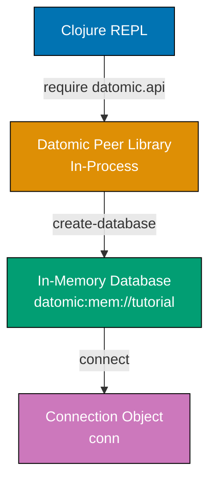
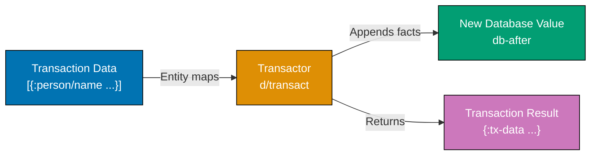

Learn Datomic fundamentals through 30 annotated examples. Each example is self-contained, runnable in a Datomic REPL, and heavily commented to show what each statement does, expected outputs, and intermediate states.

## Example 1: Setting Up Datomic and First Connection

Datomic Free runs as an embedded peer library within your Clojure application. No separate database server required - the database lives in your process memory or connects to a storage service.



**Code**:

```clojure
;; Load Datomic API namespace
(require '[datomic.api :as d])
;; => Imports Datomic functions: create-database, connect, transact, q, entity

;; Define database URI (in-memory for development)
(def uri "datomic:mem://tutorial")
;; => URI format: "datomic:<storage>://<identifier>"
;; => mem:// uses in-memory storage (data lost on JVM exit)
;; => Alternative: dev:// for persistent local storage

;; Create database
(d/create-database uri)
;; => Returns true if database created
;; => Returns false if database already exists
;; => Creates empty database with system schema only

;; Connect to database
(def conn (d/connect uri))
;; => Returns connection object
;; => Connection is durable - cache locally, reuse across operations
;; => Connection provides access to current database value
```

**Key Takeaway**: Datomic runs as a library within your application process. The connection object provides access to database values, but the database itself is a value that never changes - only grows with new facts.

**Why It Matters**: Unlike traditional databases that run as separate servers, Datomic's peer architecture eliminates network latency for reads and enables REPL-driven development. You query the database as easily as you query a map or vector.

---

## Example 2: Defining Schema with Attributes

Datomic schema consists of attributes that describe what kinds of facts can be stored. Attributes have a type, cardinality, and optional constraints. Schema itself is data stored in the database.

**Code**:

```clojure
;; Define schema for a person entity
(def person-schema
  [{:db/ident       :person/name
    :db/valueType   :db.type/string
    :db/cardinality :db.cardinality/one
    :db/doc         "A person's full name"}
   {:db/ident       :person/email
    :db/valueType   :db.type/string
    :db/cardinality :db.cardinality/one
    :db/unique      :db.unique/identity
    :db/doc         "A person's email address (unique identifier)"}
   {:db/ident       :person/age
    :db/valueType   :db.type/long
    :db/cardinality :db.cardinality/one
    :db/doc         "A person's age in years"}])
;; => Vector of attribute definition maps
;; => :db/ident - Keyword identifier for the attribute
;; => :db/valueType - Type: :db.type/string, :db.type/long, :db.type/ref, etc.
;; => :db/cardinality - :db.cardinality/one (single value) or /many (set of values)
;; => :db/unique - Optional: :db.unique/identity (upsert key) or /value (enforce uniqueness)

;; Transact schema into database
@(d/transact conn person-schema)
;; => @ dereferences future (blocks until transaction completes)
;; => Returns map with :db-before, :db-after, :tx-data, :tempids
;; => Schema is now part of the database
;; => Attributes can be used immediately in subsequent transactions
```

**Key Takeaway**: Datomic schema is data, not DDL statements. You define attributes with maps and transact them like any other facts. Schema is additive - you can add new attributes anytime without migrations.

---

## Example 3: Asserting Facts with Transactions

Transactions add facts to the database. Each fact is an entity-attribute-value tuple (EAV). Datomic automatically adds transaction metadata and timestamps.



**Code**:

```clojure
;; Assert facts about a person
(def tx-result
  @(d/transact conn
     [{:person/name  "Alice Johnson"
       :person/email "alice@example.com"
       :person/age   30}]))
;; => Entity map syntax: keys are attributes, values are attribute values
;; => Datomic assigns entity ID automatically (tempid resolved to permanent ID)
;; => All attributes asserted in single transaction (atomic)

;; Examine transaction result
(:db-after tx-result)
;; => Database value after transaction
;; => This is an immutable value - querying it always returns same results

(:tx-data tx-result)
;; => Vector of datoms (facts) added: [[entity-id attribute value tx-id added?]]
;; => Example: [[17592186045418 :person/name "Alice Johnson" 13194139534313 true]]
;; => added? = true means fact was asserted (false would mean retracted)

(:tempids tx-result)
;; => Map from temporary IDs to permanent entity IDs
;; => Example: {-9223301668109598144 17592186045418}
```

**Key Takeaway**: Transactions assert facts atomically. Datomic returns a new database value that includes the added facts. The old database value remains accessible for time-travel queries.

---

## Example 4: Querying with Datalog

Datalog queries pattern-match against facts in the database. The `:find` clause specifies what to return, `:where` clauses specify patterns to match.

**Code**:

```clojure
;; Get current database value
(def db (d/db conn))
;; => Database value at current time
;; => Immutable - safe to cache and reuse

;; Query for all person names
(d/q '[:find ?name
       :where [?e :person/name ?name]]
     db)
;; => Returns: #{["Alice Johnson"]}
;; => #{} indicates a set (unordered, unique results)
;; => Each element is a vector (one value per find variable)

;; Query with multiple attributes
(d/q '[:find ?name ?email
       :where [?e :person/name ?name]
              [?e :person/email ?email]]
     db)
;; => Returns: #{["Alice Johnson" "alice@example.com"]}
;; => ?e is logic variable - unifies across patterns
;; => Same ?e in both patterns means "same entity"

;; Query with input parameter
(d/q '[:find ?email
       :in $ ?name
       :where [?e :person/name ?name]
              [?e :person/email ?email]]
     db
     "Alice Johnson")
;; => :in $ ?name declares inputs ($ is database, ?name is parameter)
;; => Returns: #{["alice@example.com"]}
;; => Parameterized queries enable reusable query patterns
```

**Key Takeaway**: Datalog queries use pattern matching and unification. Logic variables (?e, ?name) bind to values that satisfy all patterns. Queries compose naturally through shared variables.

---

## Example 5: Using the Entity API

The entity API provides map-like access to entities. Navigate attributes and references as if traversing nested maps.

**Code**:

```clojure
;; Get entity ID from query
(def alice-id
  (ffirst
    (d/q '[:find ?e
           :where [?e :person/email "alice@example.com"]]
         db)))
;; => ffirst gets first element of first result
;; => Returns entity ID (e.g., 17592186045418)

;; Create entity object
(def alice (d/entity db alice-id))
;; => Returns entity object (lazy map-like)
;; => Not a Clojure map - entity object that fetches attributes on demand

;; Access attributes like map keys
(:person/name alice)
;; => "Alice Johnson"

(:person/age alice)
;; => 30

;; Get all attributes as a map
(into {} alice)
;; => {:person/name "Alice Johnson"
;;     :person/email "alice@example.com"
;;     :person/age 30
;;     :db/id 17592186045418}
;; => Materializes all attributes into standard Clojure map
```

**Key Takeaway**: The entity API provides convenient attribute access without writing queries. Use it for navigating entity data when you already have the entity ID.

---

## Example 6: Cardinality Many Attributes

Attributes with `:db.cardinality/many` store sets of values. Operations automatically maintain set semantics (no duplicates).

**Code**:

```clojure
;; Add cardinality-many attribute to schema
@(d/transact conn
   [{:db/ident       :person/favorite-colors
     :db/valueType   :db.type/string
     :db/cardinality :db.cardinality/many
     :db/doc         "A person's favorite colors (set)"}])

;; Assert multiple values
@(d/transact conn
   [{:db/id [:person/email "alice@example.com"]
     :person/favorite-colors ["blue" "green" "purple"]}])
;; => Lookup ref [:person/email "alice@example.com"] identifies entity
;; => Vector of values for cardinality-many attribute
;; => Stored as set (order not preserved)

;; Query cardinality-many attribute
(def db (d/db conn))
(d/q '[:find ?color
       :where [?e :person/email "alice@example.com"]
              [?e :person/favorite-colors ?color]]
     db)
;; => Returns: #{["blue"] ["green"] ["purple"]}
;; => Each value produces separate result tuple
;; => Query binds ?color to each element of the set

;; Entity API returns set for cardinality-many
(def alice (d/entity db [:person/email "alice@example.com"]))
(:person/favorite-colors alice)
;; => #{"blue" "green" "purple"}
;; => Returns Clojure set
```

**Key Takeaway**: Cardinality-many attributes store sets of values. Queries bind variables to each element individually, while the entity API returns the entire set.

---

## Example 7: Retracting Facts

Retracting facts removes them from the current database value but preserves them in history. Retracted facts remain queryable via time-travel.

**Code**:

```clojure
;; Retract specific attribute value
@(d/transact conn
   [[:db/retract [:person/email "alice@example.com"] :person/age 30]])
;; => [:db/retract entity-id attribute value]
;; => Removes fact from current database
;; => Entity still exists with other attributes

;; Verify retraction
(def db (d/db conn))
(d/q '[:find ?age
       :where [?e :person/email "alice@example.com"]
              [?e :person/age ?age]]
     db)
;; => Returns: #{}
;; => Empty set - no matching facts

;; Retract entire entity
@(d/transact conn
   [[:db/retractEntity [:person/email "alice@example.com"]]])
;; => Retracts all facts about entity (name, email, colors, everything)
;; => Entity ID persists in history but has no current facts
```

**Key Takeaway**: Retracting removes facts from the current database view but preserves them in the immutable history. Use `:db/retract` for specific facts, `:db/retractEntity` to remove all entity attributes.

---

## Example 8: Transaction Functions with :db/cas

Compare-and-swap (CAS) provides optimistic concurrency control. The transaction succeeds only if the current value matches the expected value.

**Code**:

```clojure
;; Re-assert Alice
@(d/transact conn
   [{:person/name  "Alice Johnson"
     :person/email "alice@example.com"
     :person/age   30}])

;; CAS: Update age only if current value is 30
@(d/transact conn
   [[:db/cas [:person/email "alice@example.com"] :person/age 30 31]])
;; => [:db/cas entity-id attribute old-value new-value]
;; => Transaction succeeds only if current value equals old-value
;; => Atomic test-and-set operation

;; Verify update
(def db (d/db conn))
(:person/age (d/entity db [:person/email "alice@example.com"]))
;; => 31
;; => Age updated successfully

;; CAS with wrong old value fails
(try
  @(d/transact conn
     [[:db/cas [:person/email "alice@example.com"] :person/age 30 32]])
  (catch Exception e
    (str "CAS failed: " (.getMessage e))))
;; => "CAS failed: :db.error/cas-failed Compare failed: ..."
;; => Transaction aborted - current value (31) doesn't match expected (30)
```

**Key Takeaway**: `:db/cas` enables optimistic concurrency without locks. Use it to prevent lost updates when multiple processes might modify the same entity.

---

## Example 9: Lookup Refs for Entity Identification

Lookup refs provide convenient entity identification using unique attributes without querying for entity IDs.

**Code**:

```clojure
;; Lookup ref syntax: [unique-attribute value]
(def alice (d/entity db [:person/email "alice@example.com"]))
;; => [:person/email "alice@example.com"] resolves to entity ID
;; => Works anywhere entity ID is expected
;; => Attribute must have :db/unique :db.unique/identity or :db.unique/value

(:person/name alice)
;; => "Alice Johnson"

;; Use lookup refs in transactions
@(d/transact conn
   [{:db/id [:person/email "alice@example.com"]
     :person/age 32}])
;; => Updates Alice's age using email as identifier
;; => No query needed to find entity ID

;; Use lookup refs in queries
(d/q '[:find ?name
       :in $ ?email-lookup
       :where [?email-lookup :person/name ?name]]
     db
     [:person/email "alice@example.com"])
;; => Returns: #{["Alice Johnson"]}
;; => Lookup ref bound to ?email-lookup, then used in pattern
```

**Key Takeaway**: Lookup refs `[unique-attribute value]` provide ergonomic entity identification. Use them in transactions, queries, and entity API calls to avoid manual ID resolution.

---

## Example 10: Pull API for Declarative Data Fetching

The pull API fetches nested entity data in one operation using a declarative pattern. More convenient than multiple entity API calls.

**Code**:

```clojure
;; Basic pull: specific attributes
(d/pull db [:person/name :person/email] [:person/email "alice@example.com"])
;; => {:person/name "Alice Johnson"
;;     :person/email "alice@example.com"}
;; => Returns map with requested attributes only

;; Pull all attributes with wildcard
(d/pull db '[*] [:person/email "alice@example.com"])
;; => {:person/name "Alice Johnson"
;;     :person/email "alice@example.com"
;;     :person/age 32
;;     :person/favorite-colors #{"blue" "green" "purple"}
;;     :db/id 17592186045418}
;; => Wildcard * fetches all attributes (excluding :db/* namespace)

;; Pull with default values for missing attributes
(d/pull db '[:person/name :person/phone (default :person/phone "N/A")]
        [:person/email "alice@example.com"])
;; => {:person/name "Alice Johnson"
;;     :person/phone "N/A"}
;; => (default attribute value) provides fallback when attribute absent
```

**Key Takeaway**: Pull API fetches entity data declaratively with a pattern. Use it for loading complete entity views without writing multiple queries or entity API calls.

---

## Example 11: Adding Reference Attributes

Reference attributes (`:db.type/ref`) create relationships between entities. They're the foundation for entity graphs.

**Code**:

```clojure
;; Define address and reference schema
@(d/transact conn
   [{:db/ident       :person/address
     :db/valueType   :db.type/ref
     :db/cardinality :db.cardinality/one
     :db/doc         "A person's address (reference to address entity)"}
    {:db/ident       :address/street
     :db/valueType   :db.type/string
     :db/cardinality :db.cardinality/one}
    {:db/ident       :address/city
     :db/valueType   :db.type/string
     :db/cardinality :db.cardinality/one}
    {:db/ident       :address/zipcode
     :db/valueType   :db.type/string
     :db/cardinality :db.cardinality/one}])

;; Assert person with nested address
@(d/transact conn
   [{:person/name    "Bob Smith"
     :person/email   "bob@example.com"
     :person/age     28
     :person/address {:address/street  "123 Main St"
                      :address/city    "Portland"
                      :address/zipcode "97201"}}])
;; => Nested map creates separate address entity
;; => :person/address references address entity ID
;; => Both entities created in single transaction (atomic)

;; Navigate reference with entity API
(def db (d/db conn))
(def bob (d/entity db [:person/email "bob@example.com"]))
(:address/city (:person/address bob))
;; => "Portland"
;; => :person/address returns entity object (not ID)
;; => Navigate nested entities naturally
```

**Key Takeaway**: Reference attributes create entity relationships. Nested maps in transactions create referenced entities automatically, enabling graph-structured data.

---

## Example 12: Reverse References

Reverse references query relationships in the opposite direction using `_` prefix. Navigate from referenced entity back to referencing entity.

**Code**:

```clojure
;; Get address entity
(def address-id
  (ffirst
    (d/q '[:find ?addr
           :where [?p :person/email "bob@example.com"]
                  [?p :person/address ?addr]]
         db)))

(def addr (d/entity db address-id))

;; Reverse lookup: who has this address?
(:person/_address addr)
;; => #{#datomic.Entity{...}}
;; => Returns set of entities referencing this address
;; => Underscore prefix on attribute enables reverse navigation

;; Pull with reverse reference
(d/pull db '[* {:person/_address [:person/name :person/email]}] address-id)
;; => {:address/street "123 Main St"
;;     :address/city "Portland"
;;     :address/zipcode "97201"
;;     :person/_address [{:person/name "Bob Smith"
;;                        :person/email "bob@example.com"}]}
;; => Pull pattern navigates reverse references
;; => Returns entities that reference this one
```

**Key Takeaway**: Reverse references (`attribute/_reverse`) enable bidirectional graph navigation. Query from referenced entities back to referencing entities without separate schema definitions.

---

## Example 13: Component Attributes for Lifecycle Coupling

Component attributes (`:db/isComponent true`) couple entity lifecycle. Retracting parent entity cascades to component children.

**Code**:

```clojure
;; Mark address as component
@(d/transact conn
   [{:db/id         :person/address
     :db/isComponent true}])
;; => Adds :db/isComponent to existing :person/address attribute
;; => Now addresses are components of persons

;; Create person with component address
@(d/transact conn
   [{:person/name    "Carol White"
     :person/email   "carol@example.com"
     :person/address {:address/street  "456 Oak Ave"
                      :address/city    "Seattle"
                      :address/zipcode "98101"}}])

;; Retract person - address automatically retracted too
(def db (d/db conn))
@(d/transact conn
   [[:db/retractEntity [:person/email "carol@example.com"]]])

;; Verify address is gone
(def db (d/db conn))
(d/q '[:find ?street
       :where [?a :address/street "456 Oak Ave"]]
     db)
;; => #{}
;; => Empty - component address retracted automatically
```

**Key Takeaway**: Component attributes create ownership relationships. Retracting the parent entity cascades to component children, ensuring referential integrity.

---

## Example 14: Querying with Implicit Joins

Datalog queries join entities implicitly through shared variables. No explicit JOIN syntax needed.

**Code**:

```clojure
;; Find names of people in Portland
(d/q '[:find ?name
       :where [?p :person/name ?name]
              [?p :person/address ?a]
              [?a :address/city "Portland"]]
     db)
;; => #{["Bob Smith"]}
;; => ?p unifies person entity across patterns
;; => ?a unifies address entity across patterns
;; => Implicit join through shared variables

;; Find people and their cities
(d/q '[:find ?name ?city
       :where [?p :person/name ?name]
              [?p :person/address ?a]
              [?a :address/city ?city]]
     db)
;; => #{["Bob Smith" "Portland"]
;;      ["Alice Johnson" nil]}
;; => Alice has no address, so no city result (inner join semantics)
```

**Key Takeaway**: Datalog joins entities through variable unification. Shared variables in patterns create implicit joins without explicit JOIN keywords.

---

## Example 15: Optional Patterns with Or Clauses

Use `or` clauses to match alternative patterns. Useful for optional attributes or multi-path queries.

**Code**:

```clojure
;; Find people with age OR email
(d/q '[:find ?name
       :where [?e :person/name ?name]
              (or [?e :person/age]
                  [?e :person/email])]
     db)
;; => Returns all people (everyone has at least email or age)
;; => (or ...) succeeds if any clause matches

;; Find people in Portland OR Seattle
(d/q '[:find ?name ?city
       :where [?p :person/name ?name]
              [?p :person/address ?a]
              [?a :address/city ?city]
              (or [[?a :address/city "Portland"]]
                  [[?a :address/city "Seattle"]])]
     db)
;; => #{["Bob Smith" "Portland"]}
;; => (or) with explicit patterns for each alternative
```

**Key Takeaway**: `or` clauses match alternative patterns. Each clause within `or` can contain multiple patterns that must all match together.

---

## Example 16: Predicates and Expression Clauses

Expression clauses filter results using Clojure functions. They test bound variables against predicates.

**Code**:

```clojure
;; Find people older than 30
(d/q '[:find ?name ?age
       :where [?e :person/name ?name]
              [?e :person/age ?age]
              [(> ?age 30)]]
     db)
;; => #{["Alice Johnson" 32]}
;; => [(predicate args)] filters results
;; => Predicate runs on each result tuple

;; Find people whose name contains "Alice"
(d/q '[:find ?name
       :where [?e :person/name ?name]
              [(clojure.string/includes? ?name "Alice")]]
     db)
;; => #{["Alice Johnson"]}
;; => Can use any Clojure function as predicate

;; Bind expression result to variable
(d/q '[:find ?name ?upper-name
       :where [?e :person/name ?name]
              [(clojure.string/upper-case ?name) ?upper-name]]
     db)
;; => #{["Alice Johnson" "ALICE JOHNSON"]
;;      ["Bob Smith" "BOB SMITH"]}
;; => [(function args) ?result] binds return value to variable
```

**Key Takeaway**: Expression clauses filter and transform results using Clojure functions. Use predicates for filtering, bind results to variables for transformations.

---

## Example 17: Aggregates in Queries

Aggregate functions combine multiple results into single values. Common aggregates: `count`, `sum`, `avg`, `min`, `max`.

**Code**:

```clojure
;; Count total people
(d/q '[:find (count ?e)
       :where [?e :person/name]]
     db)
;; => [[2]]
;; => (count ?e) counts distinct entity IDs
;; => Returns single result with count

;; Average age
(d/q '[:find (avg ?age)
       :where [?e :person/age ?age]]
     db)
;; => [[31.0]]
;; => (avg ?age) computes mean of all ages
;; => Returns double (floating point)

;; Min and max age
(d/q '[:find (min ?age) (max ?age)
       :where [?e :person/age ?age]]
     db)
;; => [[28 32]]
;; => Multiple aggregates in single query
;; => Returns vector with both values
```

**Key Takeaway**: Aggregates combine query results into summary values. Wrap variables in aggregate functions in the `:find` clause.

---

## Example 18: Parameterized Queries with :in

The `:in` clause declares query inputs. Pass dynamic values without string concatenation or code generation.

**Code**:

```clojure
;; Query with single parameter
(d/q '[:find ?name
       :in $ ?min-age
       :where [?e :person/name ?name]
              [?e :person/age ?age]
              [(>= ?age ?min-age)]]
     db
     30)
;; => #{["Alice Johnson"]}
;; => $ is database input (always first)
;; => ?min-age is parameter (30 passed as argument)

;; Query with multiple parameters
(d/q '[:find ?name
       :in $ ?city ?min-age
       :where [?p :person/name ?name]
              [?p :person/address ?a]
              [?a :address/city ?city]
              [?p :person/age ?age]
              [(>= ?age ?min-age)]]
     db
     "Portland"
     25)
;; => #{["Bob Smith"]}
;; => Parameters passed in order matching :in clause

;; Collection binding
(d/q '[:find ?name
       :in $ [?color ...]
       :where [?e :person/name ?name]
              [?e :person/favorite-colors ?color]]
     db
     ["blue" "green"])
;; => #{["Alice Johnson"]}
;; => [?color ...] binds collection (OR semantics)
;; => Matches entities with blue OR green in favorite colors
```

**Key Takeaway**: `:in` clause declares parameterized inputs. Use `$` for database, scalar parameters for single values, `[?var ...]` for collections.

---

## Example 19: Find Specifications

Find specs control query result shape. Use tuples, scalars, or collections instead of default set-of-tuples.

**Code**:

```clojure
;; Default: set of tuples
(d/q '[:find ?name ?age
       :where [?e :person/name ?name]
              [?e :person/age ?age]]
     db)
;; => #{["Alice Johnson" 32] ["Bob Smith" 28]}
;; => Set of vectors (default behavior)

;; Scalar: single value (must return exactly one result)
(d/q '[:find ?name .
       :where [?e :person/email "alice@example.com"]
              [?e :person/name ?name]]
     db)
;; => "Alice Johnson"
;; => Dot after ?name returns scalar value (not wrapped in collection)
;; => Throws if query returns 0 or 2+ results

;; Tuple: single tuple (must return exactly one result)
(d/q '[:find [?name ?age]
       :where [?e :person/email "bob@example.com"]
              [?e :person/name ?name]
              [?e :person/age ?age]]
     db)
;; => ["Bob Smith" 28]
;; => Vector wrapped in find spec returns single vector
;; => Throws if query returns 0 or 2+ results

;; Collection: vector of scalars
(d/q '[:find [?name ...]
       :where [?e :person/name ?name]]
     db)
;; => ["Alice Johnson" "Bob Smith"]
;; => [?name ...] returns vector of values (not set of tuples)
```

**Key Takeaway**: Find specs shape query results. Use `.` for scalars, `[...]` for tuples, `[... ...]` for collections. Default is set of tuples.

---

## Example 20: Transaction Metadata

Every transaction is itself an entity with attributes. Add metadata to transactions for auditing and context.

**Code**:

```clojure
;; Add transaction metadata
(def tx-result
  @(d/transact conn
     [{:person/name  "Dave Lee"
       :person/email "dave@example.com"
       :person/age   35}
      {:db/id    "datomic.tx"
       :app/user "admin"
       :app/note "Initial data import"}]))
;; => "datomic.tx" is special tempid for transaction entity
;; => Add arbitrary attributes to transaction entity
;; => Useful for audit trails, user tracking, change reasons

;; Query transaction metadata
(def db (d/db conn))
(def dave-id (ffirst (d/q '[:find ?e :where [?e :person/email "dave@example.com"]] db)))

(d/q '[:find ?tx ?user ?note
       :in $ ?e
       :where [?e :person/name _ ?tx]
              [?tx :app/user ?user]
              [?tx :app/note ?note]]
     db
     dave-id)
;; => [[transaction-id "admin" "Initial data import"]]
;; => [?e :person/name _ ?tx] gets transaction that asserted name
;; => _ is wildcard (matches any value, not bound to variable)
```

**Key Takeaway**: Transactions are entities with metadata. Add custom attributes to transaction entity for auditing, user tracking, and change context.

---

## Example 21: Database Value as of Time

Query historical database states with `as-of`. Database values are immutable snapshots at specific points in time.

**Code**:

```clojure
;; Get transaction time (basis-t)
(def tx-time (d/basis-t (:db-after tx-result)))
;; => basis-t is transaction's logical time
;; => Monotonically increasing across transactions

;; Update Dave's age
@(d/transact conn
   [{:db/id [:person/email "dave@example.com"]
     :person/age 36}])

;; Current database shows updated age
(def current-db (d/db conn))
(:person/age (d/entity current-db [:person/email "dave@example.com"]))
;; => 36

;; as-of database shows historical age
(def historical-db (d/as-of current-db tx-time))
(:person/age (d/entity historical-db [:person/email "dave@example.com"]))
;; => 35
;; => as-of returns database value at specified transaction
;; => Historical queries just work - same query API
```

**Key Takeaway**: `as-of` creates historical database values. Query any point in time using the same query and entity APIs - immutability enables perfect audit trails.

---

## Example 22: Querying History

The `history` database includes all asserted and retracted facts across all time. Use it to see changes over time.

**Code**:

```clojure
;; Get history database
(def hist-db (d/history (d/db conn)))
;; => history database includes all facts (added and retracted)

;; Query all ages Dave has ever had
(d/q '[:find ?age ?tx ?added
       :where [?e :person/email "dave@example.com"]
              [?e :person/age ?age ?tx ?added]]
     hist-db)
;; => [[35 tx1 true] [35 tx2 false] [36 tx2 true]]
;; => Five-tuple pattern [e a v tx added] in history database
;; => ?added = true means fact was asserted, false means retracted
;; => Shows: 35 asserted in tx1, then retracted and 36 asserted in tx2
```

**Key Takeaway**: History database contains all facts ever asserted or retracted. Query it to see attribute values over time and understand change patterns.

---

## Example 23: Since Queries for Changes

The `since` database contains only facts added after a specific transaction. Use it to find recent changes.

**Code**:

```clojure
;; Get transaction time before updates
(def baseline-t (d/basis-t (d/db conn)))

;; Make several updates
@(d/transact conn
   [{:db/id [:person/email "alice@example.com"]
     :person/age 33}])

@(d/transact conn
   [{:db/id [:person/email "bob@example.com"]
     :person/age 29}])

;; since database shows only changes after baseline
(def since-db (d/since (d/db conn) baseline-t))

(d/q '[:find ?name ?age
       :where [?e :person/name ?name]
              [?e :person/age ?age]]
     since-db)
;; => #{["Alice Johnson" 33] ["Bob Smith" 29]}
;; => Only shows facts asserted after baseline-t
;; => Useful for incremental processing, change detection
```

**Key Takeaway**: `since` creates database views containing only facts added after a transaction. Use it for change detection and incremental processing.

---

## Example 24: Multiple Databases in One Query

Query across multiple database values simultaneously using multiple `:in` parameters.

**Code**:

```clojure
;; Get two database snapshots
(def db1 (d/as-of (d/db conn) baseline-t))
(def db2 (d/db conn))

;; Find entities where age changed
(d/q '[:find ?name ?old-age ?new-age
       :in $before $after
       :where [$before ?e :person/name ?name]
              [$before ?e :person/age ?old-age]
              [$after ?e :person/age ?new-age]
              [(not= ?old-age ?new-age)]]
     db1
     db2)
;; => #{["Alice Johnson" 32 33] ["Bob Smith" 28 29]}
;; => $before and $after are database inputs
;; => Same entity variable ?e across both databases
;; => Finds entities where age differs between snapshots
```

**Key Takeaway**: Query multiple database values simultaneously using named database inputs (`$before`, `$after`). Powerful for temporal comparisons and change tracking.

---

## Example 25: Defining and Using Rules

Rules are reusable query fragments. Define complex patterns once, use them in multiple queries.

**Code**:

```clojure
;; Define rule for "adult" (age >= 18)
(def adult-rule
  '[[(adult? ?person)
     [?person :person/age ?age]
     [(>= ?age 18)]]])
;; => Rule: (adult? ?person) succeeds if person has age >= 18
;; => Rules are vectors of head (rule name and params) and body (patterns)

;; Use rule in query
(d/q '[:find ?name
       :in $ %
       :where (adult? ?e)
              [?e :person/name ?name]]
     db
     adult-rule)
;; => #{["Alice Johnson"] ["Bob Smith"] ["Dave Lee"]}
;; => % in :in clause accepts rules
;; => (adult? ?e) expands to rule body patterns

;; Rules with multiple clauses (OR semantics)
(def city-rule
  '[[(major-city? ?address)
     [?address :address/city "Portland"]]
    [(major-city? ?address)
     [?address :address/city "Seattle"]]])
;; => Multiple clauses for same rule = OR
;; => major-city? succeeds for Portland OR Seattle

(d/q '[:find ?name
       :in $ %
       :where [?p :person/name ?name]
              [?p :person/address ?a]
              (major-city? ?a)]
     db
     city-rule)
;; => #{["Bob Smith"]}
;; => Rule matches any clause
```

**Key Takeaway**: Rules encapsulate reusable query patterns. Define them once, reference by name in queries. Multiple clauses for the same rule create OR semantics.

---

## Example 26: Recursive Rules

Rules can call themselves recursively. Essential for hierarchical data like org charts, file systems, taxonomies.

**Code**:

```clojure
;; Define schema for hierarchy
@(d/transact conn
   [{:db/ident       :person/manager
     :db/valueType   :db.type/ref
     :db/cardinality :db.cardinality/one
     :db/doc         "A person's manager (reference to another person)"}])

;; Create hierarchy
@(d/transact conn
   [{:person/name  "Eve Johnson"
     :person/email "eve@example.com"}
    {:person/name    "Frank Lee"
     :person/email   "frank@example.com"
     :person/manager [:person/email "eve@example.com"]}
    {:person/name    "Grace Kim"
     :person/email   "grace@example.com"
     :person/manager [:person/email "frank@example.com"]}])

;; Define recursive rule
(def reports-to-rule
  '[[(reports-to? ?employee ?manager)
     [?employee :person/manager ?manager]]
    [(reports-to? ?employee ?manager)
     [?employee :person/manager ?intermediate]
     (reports-to? ?intermediate ?manager)]])
;; => Base case: direct manager relationship
;; => Recursive case: employee's manager's manager (transitive)

;; Find all people reporting to Eve (direct or indirect)
(def db (d/db conn))
(d/q '[:find ?name
       :in $ % ?manager
       :where (reports-to? ?e ?manager)
              [?e :person/name ?name]]
     db
     reports-to-rule
     [:person/email "eve@example.com"])
;; => #{["Frank Lee"] ["Grace Kim"]}
;; => Grace reports to Frank who reports to Eve (transitive)
```

**Key Takeaway**: Recursive rules handle hierarchical data. Define base case (direct relationship) and recursive case (traversal), and Datomic computes transitive closure.

---

## Example 27: Not Clauses for Negation

`not` clauses filter results by excluding matches. Essential for "find entities that don't have X" queries.

**Code**:

```clojure
;; Find people without an address
(d/q '[:find ?name
       :where [?e :person/name ?name]
              (not [?e :person/address])]
     db)
;; => #{["Alice Johnson"] ["Eve Johnson"] ["Frank Lee"] ["Grace Kim"]}
;; => (not [patterns]) excludes entities matching patterns

;; Find people not managed by anyone (top-level)
(d/q '[:find ?name
       :where [?e :person/name ?name]
              (not [?e :person/manager])]
     db)
;; => #{["Alice Johnson"] ["Bob Smith"] ["Dave Lee"] ["Eve Johnson"]}
;; => Returns people without :person/manager attribute
```

**Key Takeaway**: `not` clauses exclude matching results. Use them for negation queries like "entities without attribute X" or "entities not matching pattern".

---

## Example 28: Not-Join for Bound Variables

`not-join` restricts negation scope to specific variables. Unlike `not`, it allows binding variables from outer scope.

**Code**:

```clojure
;; Find people who don't live in Portland
(d/q '[:find ?name
       :where [?p :person/name ?name]
              (not-join [?p]
                [?p :person/address ?a]
                [?a :address/city "Portland"])]
     db)
;; => Returns people without Portland address
;; => [?p] specifies variables shared between outer query and not clause
;; => Allows using ?p in not clause while binding ?a locally

;; Compare with plain not (wouldn't work correctly)
;; (not [?p :person/address ?a] [?a :address/city "Portland"])
;; => Would create Cartesian product issues
```

**Key Takeaway**: `not-join` scopes negation to specific variables from outer query. Use it when negation pattern needs to reference outer-bound variables.

---

## Example 29: Data Functions for Transformations

Data functions transform attribute values during transactions. Useful for computed values, derived attributes.

**Code**:

```clojure
;; Create tempid for new person
(def new-person-id (d/tempid :db.part/user))
;; => tempid is temporary ID (replaced with permanent ID after transaction)
;; => :db.part/user is partition (Datomic Free only has user partition)

;; Transaction with tempid
@(d/transact conn
   [{:db/id       new-person-id
     :person/name "Helen Park"
     :person/email "helen@example.com"
     :person/age  27}])
;; => Tempid resolved to permanent entity ID

;; Get resolved entity ID
(def db (d/db conn))
(d/q '[:find ?e .
       :where [?e :person/email "helen@example.com"]]
     db)
;; => Returns permanent entity ID (e.g., 17592186045425)
```

**Key Takeaway**: Tempids provide temporary entity IDs in transactions. Datomic resolves them to permanent IDs, enabling references to not-yet-created entities within transactions.

---

## Example 30: Inspecting Database Schema

Database schema is queryable like any other data. Inspect attributes, types, cardinality programmatically.

**Code**:

```clojure
;; Query all person attributes
(d/q '[:find ?ident ?valueType ?cardinality
       :where [?e :db/ident ?ident]
              [?e :db/valueType ?vt]
              [?e :db/cardinality ?c]
              [?vt :db/ident ?valueType]
              [?c :db/ident ?cardinality]
              [(namespace ?ident) ?ns]
              [(= ?ns "person")]]
     db)
;; => Returns all attributes in :person namespace with types and cardinality
;; => Example: [[:person/name :db.type/string :db.cardinality/one]]

;; Find unique attributes
(d/q '[:find ?ident
       :where [?e :db/ident ?ident]
              [?e :db/unique]]
     db)
;; => Returns attributes with :db/unique constraint
;; => Example: #{[:person/email]}

;; Get attribute documentation
(:db/doc (d/entity db :person/name))
;; => "A person's full name"
;; => Attributes are entities - access with entity API
```

**Key Takeaway**: Schema is data stored in the database. Query attributes, types, and constraints using standard datalog queries or entity API.

---

These 30 beginner examples provide a solid foundation in Datomic fundamentals: schema definition, transactions, datalog queries, entity and pull APIs, time-travel, rules, and schema introspection. You're ready for intermediate examples covering advanced query patterns, optimization, and production techniques.
