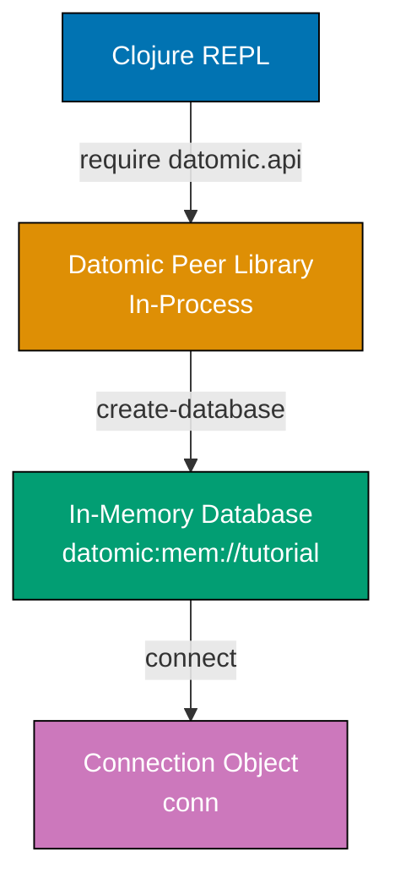
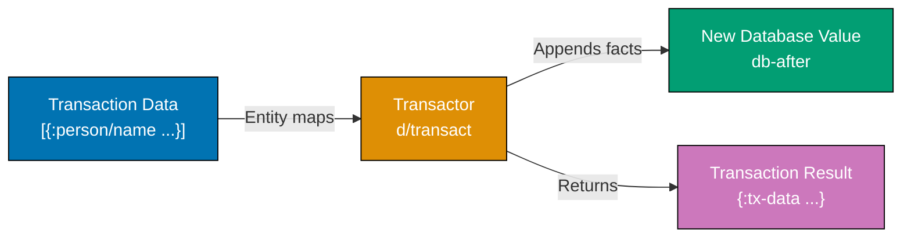

Learn Datomic fundamentals through 30 annotated examples. Each example is self-contained, runnable in a Datomic REPL, and heavily commented to show what each statement does, expected outputs, and intermediate states.

### Example 1: Setting Up Datomic and First Connection

Datomic Free runs as an embedded peer library within your Clojure application. No separate database server required - the database lives in your process memory or connects to a storage service.



**Java Code**:

```java
import datomic.Peer;
// => Peer class provides static methods: createDatabase, connect, q, pull
import datomic.Connection;
// => Connection interface represents active database link

// Define database URI (in-memory for development)
String uri = "datomic:mem://tutorial";
// => URI format: "datomic:<storage>://<identifier>"
// => "mem://" = in-memory storage (data lost on JVM exit)

// Create database
boolean created = Peer.createDatabase(uri);
// => Returns true if created, false if already exists (idempotent)
// => Creates empty database with system schema (:db/ident, :db/valueType, etc.)

// Connect to database
Connection conn = Peer.connect(uri);
// => Returns Connection object for transactions and queries
// => Connection is thread-safe and should be cached/reused
```

**Clojure Code**:

```clojure
;; Load Datomic API namespace
(require '[datomic.api :as d])
;; => Imports datomic.api aliased as 'd' (provides create-database, connect, transact, q, pull)

;; Define database URI (in-memory for development)
(def uri "datomic:mem://tutorial")
;; => URI format: "datomic:<storage>://<identifier>"
;; => "mem://" = in-memory storage (data lost on JVM exit)

;; Create database
(d/create-database uri)
;; => Returns true if created, false if already exists (idempotent)
;; => Creates empty database with system schema (:db/ident, :db/valueType, :db/cardinality)

;; Connect to database
(def conn (d/connect uri))
;; => Returns Connection object for transactions and queries
;; => Cache/reuse conn, access current db via (d/db conn)
```

**Key Takeaway**: Datomic runs as a library within your application process. The connection object provides access to database values, but the database itself is a value that never changes - only grows with new facts.

**Why It Matters**: Unlike traditional databases that run as separate servers, Datomic's peer architecture eliminates network latency for reads and enables REPL-driven development. You query the database as easily as you query a map or vector.

---

### Example 2: Defining Schema with Attributes

Datomic schema consists of attributes that describe what kinds of facts can be stored. Attributes have a type, cardinality, and optional constraints. Schema itself is data stored in the database.

**Java Code**:

```java
import datomic.Util;
// => Imports Util class for creating Clojure data structures from Java
// => Util.list() creates Clojure persistent lists
// => Util.map() creates Clojure persistent maps with keyword keys
import java.util.List;
// => Standard Java List interface
import java.util.Map;
// => Standard Java Map interface

// Define schema for a person entity
List personSchema = Util.list(
    // => Creates List containing three attribute definition maps
    Util.map(":db/ident", ":person/name",
             // => :db/ident is unique keyword identifier for attribute
             ":db/valueType", ":db.type/string",
             // => :db/valueType specifies attribute stores strings
             ":db/cardinality", ":db.cardinality/one",
             // => :db.cardinality/one means single value (not collection)
             ":db/doc", "A person's full name"),
             // => :db/doc provides documentation string
    Util.map(":db/ident", ":person/email",
             // => Second attribute: :person/email
             ":db/valueType", ":db.type/string",
             // => Email stored as string
             ":db/cardinality", ":db.cardinality/one",
             // => Single email per person
             ":db/unique", ":db.unique/identity",
             // => :db.unique/identity enables upserts and lookup refs
             ":db/doc", "A person's email address (unique identifier)"),
             // => Documents this as unique identifier
    Util.map(":db/ident", ":person/age",
             // => Third attribute: :person/age
             ":db/valueType", ":db.type/long",
             // => Age stored as long integer
             ":db/cardinality", ":db.cardinality/one",
             // => Single age value per person
             ":db/doc", "A person's age in years")
             // => Documents unit (years)
);
// => personSchema is now List<Map> of three attribute definitions
// => :db/ident - Keyword identifier for the attribute
// => :db/valueType - Type: :db.type/string, :db.type/long, :db.type/ref, etc.
// => :db/cardinality - :db.cardinality/one (single value) or /many (set of values)
// => :db/unique - Optional: :db.unique/identity (upsert key) or /value (enforce uniqueness)

// Transact schema into database
Map txResult = conn.transact(personSchema).get();
// => conn.transact() submits transaction, returns Future<Map>
// => .get() blocks current thread until transaction completes
// => Returns map with :db-before, :db-after, :tx-data, :tempids keys
// => :db-before is database value before transaction
// => :db-after is database value after transaction
// => :tx-data contains list of datoms added
// => :tempids maps temporary IDs to permanent IDs
// => Schema is now part of the database (immutably added)
// => Attributes can be used immediately in subsequent transactions
```

**Clojure Code**:

```clojure
;; Define schema for a person entity
(def person-schema
  // => Creates var 'person-schema' with vector of three maps
  [{:db/ident       :person/name
    // => :db/ident is unique keyword identifier for attribute
    :db/valueType   :db.type/string
    // => :db/valueType specifies attribute stores string values
    :db/cardinality :db.cardinality/one
    // => :db.cardinality/one means single value per entity (not collection)
    :db/doc         "A person's full name"}
    // => :db/doc provides documentation string for attribute
   {:db/ident       :person/email
    // => Second attribute definition: :person/email
    :db/valueType   :db.type/string
    // => Email stored as string
    :db/cardinality :db.cardinality/one
    // => Single email per person
    :db/unique      :db.unique/identity
    // => :db.unique/identity enables upserts and lookup refs [:person/email "x@y.com"]
    :db/doc         "A person's email address (unique identifier)"}
    // => Documents this as the unique identifier for person entities
   {:db/ident       :person/age
    // => Third attribute definition: :person/age
    :db/valueType   :db.type/long
    // => Age stored as long integer (64-bit)
    :db/cardinality :db.cardinality/one
    // => Single age value per person
    :db/doc         "A person's age in years"}])
    // => Documents unit (years, not months/days)
;; => person-schema is now vector of three attribute definition maps
;; => :db/ident - Keyword identifier for the attribute
;; => :db/valueType - Type: :db.type/string, :db.type/long, :db.type/ref, etc.
;; => :db/cardinality - :db.cardinality/one (single value) or /many (set of values)
;; => :db/unique - Optional: :db.unique/identity (upsert key) or /value (enforce uniqueness)

;; Transact schema into database
@(d/transact conn person-schema)
;; => Calls transact function with connection and schema vector
;; => Returns future (promise of result)
;; => @ deref operator blocks until transaction completes
;; => Returns map with :db-before, :db-after, :tx-data, :tempids keys
;; => :db-before is immutable database value before transaction
;; => :db-after is new immutable database value after transaction
;; => :tx-data is vector of datoms (facts) added to database
;; => :tempids maps temporary IDs to permanent entity IDs
;; => Schema is now part of the database (stored as facts like any other data)
;; => Attributes can be used immediately in subsequent transactions
```

**Key Takeaway**: Datomic schema is data, not DDL statements. You define attributes with maps and transact them like any other facts. Schema is additive - you can add new attributes anytime without migrations.

**Why It Matters**: Schema-as-data eliminates the operational complexity of migrations in traditional databases. You can evolve your schema incrementally in production without downtime, version control, or migration scripts. New attributes are instantly available to all peers, making agile development natural.

---

### Example 3: Asserting Facts with Transactions

Transactions add facts to the database. Each fact is an entity-attribute-value tuple (EAV). Datomic automatically adds transaction metadata and timestamps.



**Java Code**:

```java
// Assert facts about a person
Map txResult = conn.transact(
    // => Starts transaction submission
    Util.list(
        // => Creates list containing one entity map
        Util.map(":person/name", "Alice Johnson",
                 // => Asserts :person/name attribute with value "Alice Johnson"
                 ":person/email", "alice@example.com",
                 // => Asserts :person/email (unique identity) with value
                 ":person/age", 30)
                 // => Asserts :person/age attribute with value 30 (Long)
    )
    // => Entity map syntax: keys are attributes, values are attribute values
    // => No :db/id specified, so Datomic assigns new entity ID automatically
).get();
// => conn.transact() returns Future<Map>
// => .get() blocks until transaction commits
// => Datomic resolves temporary ID to permanent entity ID
// => All attributes asserted in single transaction (atomic - all or nothing)
// => Transaction creates three facts (name, email, age) for new entity

// Examine transaction result
Object dbAfter = txResult.get(":db-after");
// => Retrieves :db-after value from transaction result map
// => Database value after transaction (immutable snapshot)
// => This is an immutable value - querying it always returns same results
// => Can cache this value safely - it never changes

List txData = (List) txResult.get(":tx-data");
// => Retrieves :tx-data value from transaction result map
// => List of datoms (facts) added: [[entity-id attribute value tx-id added?]]
// => Example: [[17592186045418 :person/name "Alice Johnson" 13194139534313 true]]
// => 17592186045418 is permanent entity ID assigned by Datomic
// => :person/name is attribute keyword
// => "Alice Johnson" is the value
// => 13194139534313 is transaction ID (also an entity ID)
// => true means fact was asserted (false would mean retracted)

Map tempids = (Map) txResult.get(":tempids");
// => Retrieves :tempids value from transaction result map
// => Map from temporary IDs to permanent entity IDs
// => Example: {-9223301668109598144 17592186045418}
// => -9223301668109598144 was temporary ID Datomic generated
// => 17592186045418 is permanent entity ID after transaction
// => Use tempids to reference newly created entities in application code
```

**Clojure Code**:

```clojure
;; Assert facts about a person
(def tx-result
  // => Creates var 'tx-result' to hold transaction result
  @(d/transact conn
     // => Calls transact with connection and transaction data
     // => Returns future, @ derefs (blocks until complete)
     [{:person/name  "Alice Johnson"
       // => Map key :person/name with value "Alice Johnson" (string)
       :person/email "alice@example.com"
       // => :person/email (unique identity) with value
       :person/age   30}]))
       // => :person/age with value 30 (Long)
       // => Entity map syntax: keys are attributes, values are values
       // => No :db/id key, so Datomic assigns new entity ID automatically
       // => Datomic creates temporary ID, resolves to permanent ID in transaction
;; => All attributes asserted in single transaction (atomic - all or nothing)
;; => Transaction creates three datoms (facts) for new entity
;; => tx-result now bound to map {:db-before ... :db-after ... :tx-data ... :tempids ...}

;; Examine transaction result
(:db-after tx-result)
;; => Extracts :db-after value from tx-result map using keyword lookup
;; => Database value after transaction (immutable snapshot)
;; => This is an immutable value - querying it always returns same results
;; => Can safely cache and reuse this value anywhere
;; => Old database value (:db-before) still accessible for comparison

(:tx-data tx-result)
;; => Extracts :tx-data value from tx-result map
;; => Vector of datoms (facts) added: [[entity-id attribute value tx-id added?]]
;; => Example: [[17592186045418 :person/name "Alice Johnson" 13194139534313 true]]
;; => 17592186045418 is permanent entity ID (Long)
;; => :person/name is attribute keyword
;; => "Alice Johnson" is the value (String)
;; => 13194139534313 is transaction ID (also an entity ID)
;; => true means fact was asserted (false would mean retracted)
;; => Transaction metadata available as entity 13194139534313

(:tempids tx-result)
;; => Extracts :tempids value from tx-result map
;; => Map from temporary IDs to permanent entity IDs
;; => Example: {-9223301668109598144 17592186045418}
;; => -9223301668109598144 was auto-generated temporary ID
;; => 17592186045418 is permanent entity ID assigned by Datomic
;; => Use this mapping to reference newly created entity in code
```

**Key Takeaway**: Transactions assert facts atomically. Datomic returns a new database value that includes the added facts. The old database value remains accessible for time-travel queries.

**Why It Matters**: Immutable database values enable fearless concurrent reads, perfect reproducibility for debugging, and audit trails without extra infrastructure. Every transaction creates a new logical database that you can cache, query, and reuse - making distributed caching trivial.

---

### Example 4: Querying with Datalog

Datalog queries pattern-match against facts in the database. The `:find` clause specifies what to return, `:where` clauses specify patterns to match.

**Java Code**:

```java
import datomic.Database;
// => Imports Database interface for query operations
// => Database represents immutable snapshot of data at point in time
import java.util.Collection;
// => Standard Java Collection interface for query results

// Get current database value
Database db = conn.db();
// => Calls db() method on Connection to get current database snapshot
// => Returns Database object (immutable value)
// => Database value at current time (basis-t is latest transaction)
// => Immutable - safe to cache and reuse indefinitely
// => Queries against this db always return same results

// Query for all person names
Collection results = Peer.q(
    // => Calls static Peer.q() method for datalog queries
    "[:find ?name " +
    // => :find clause specifies what to return (?name variable)
    " :where [?e :person/name ?name]]",
    // => :where clause specifies patterns to match
    // => [?e :person/name ?name] is entity-attribute-value pattern
    // => ?e binds to entity IDs that have :person/name attribute
    // => ?name binds to values of :person/name for those entities
    db
    // => Database to query (immutable snapshot)
);
// => Returns: #{["Alice Johnson"]}
// => Set (#{}) of result tuples (unordered, unique results)
// => Each element is a List with one value (matching :find ?name)
// => ["Alice Johnson"] is single-element list containing name value

// Query with multiple attributes
Collection results2 = Peer.q(
    // => Second query demonstrating multiple find variables
    "[:find ?name ?email " +
    // => :find clause with two variables (?name and ?email)
    " :where [?e :person/name ?name] " +
    // => First pattern: bind ?e to entities with :person/name, ?name to values
    "        [?e :person/email ?email]]",
    // => Second pattern: same ?e, bind ?email to :person/email values
    // => ?e unification ensures both patterns match SAME entity
    db
);
// => Returns: #{["Alice Johnson" "alice@example.com"]}
// => Set of two-element lists (name, email pairs)
// => ?e is logic variable - unifies across patterns through variable name
// => Same ?e in both patterns means "same entity ID"
// => Result only includes entities having BOTH attributes

// Query with input parameter
Collection results3 = Peer.q(
    // => Third query demonstrating parameterization
    "[:find ?email " +
    // => :find clause returns email values
    " :in $ ?name " +
    // => :in clause declares inputs: $ (database) and ?name (parameter)
    // => $ is special variable always referring to primary database
    // => ?name is parameter variable bound to argument value
    " :where [?e :person/name ?name] " +
    // => Pattern uses ?name variable (bound from input parameter)
    "        [?e :person/email ?email]]",
    // => Second pattern retrieves email for matched entity
    db,
    // => First argument binds to $ (database)
    "Alice Johnson"
    // => Second argument binds to ?name parameter
);
// => :in $ ?name declares inputs ($ is database, ?name is parameter)
// => Returns: #{["alice@example.com"]}
// => Finds email for person with name "Alice Johnson"
// => Parameterized queries enable reusable query patterns
// => Prevents query injection (parameters not concatenated into string)
```

**Clojure Code**:

```clojure
;; Get current database value
(def db (d/db conn))
// => Calls d/db function with connection argument
// => Returns current database snapshot (immutable value)
// => Defines var 'db' for subsequent query operations
;; => Database value at current time (latest transaction basis-t)
;; => Immutable - safe to cache and reuse indefinitely
;; => All queries against this db return consistent results

;; Query for all person names
(d/q '[:find ?name
       // => Quoted data structure (not evaluated, passed as-is to q function)
       // => :find clause specifies return variables (?name)
       :where [?e :person/name ?name]]
       // => :where clause contains patterns to match
       // => [?e :person/name ?name] is entity-attribute-value pattern tuple
       // => ?e binds to entity IDs having :person/name attribute
       // => ?name binds to values of :person/name for matched entities
     db)
     // => db argument provides data to query
;; => Returns: #{["Alice Johnson"]}
;; => #{} literal notation indicates set (unordered collection, unique elements)
;; => Each element is a vector ["Alice Johnson"] with one value
;; => Vector length matches number of :find variables (1)

;; Query with multiple attributes
(d/q '[:find ?name ?email
       // => :find with two variables - returns 2-tuples
       :where [?e :person/name ?name]
              // => First pattern: match entities with :person/name
              // => Binds ?e to entity IDs, ?name to name values
              [?e :person/email ?email]]
              // => Second pattern: match same ?e with :person/email
              // => Binds ?email to email values
              // => ?e unification joins patterns: same entity must have both attributes
     db)
;; => Returns: #{["Alice Johnson" "alice@example.com"]}
;; => Set of 2-element vectors (name-email pairs)
;; => ?e is logic variable - unifies across patterns by variable name
;; => Same ?e in both patterns means "same entity ID"
;; => Only returns entities possessing BOTH attributes (inner join semantic)

;; Query with input parameter
(d/q '[:find ?email
       // => :find clause returns email values
       :in $ ?name
       // => :in clause declares input parameters
       // => $ is special symbol for primary database input
       // => ?name is parameter variable (bound from arguments)
       :where [?e :person/name ?name]
              // => Pattern uses ?name variable from :in parameters
              // => Matches entities where :person/name equals ?name value
              [?e :person/email ?email]]
              // => Second pattern retrieves email for matched entity
     db
     // => First argument after query binds to $ parameter
     "Alice Johnson")
     // => Second argument binds to ?name parameter
;; => :in $ ?name declares inputs ($ is database, ?name is parameter)
;; => Returns: #{["alice@example.com"]}
;; => Finds email for person named "Alice Johnson"
;; => Parameterized queries enable reusable query patterns
;; => Parameters prevent query injection (not string concatenated)
```

**Key Takeaway**: Datalog queries use pattern matching and unification. Logic variables (?e, ?name) bind to values that satisfy all patterns. Queries compose naturally through shared variables.

**Why It Matters**: Datalog's declarative nature makes complex queries more readable than SQL. Pattern matching eliminates join syntax, unification handles relationships naturally, and parameterized queries prevent injection attacks. Queries are composable data structures you can build programmatically.

---

### Example 5: Using the Entity API

The entity API provides map-like access to entities. Navigate attributes and references as if traversing nested maps.

**Java Code**:

```java
import datomic.Entity;
// => Imports Entity interface for entity API access
// => Entity provides lazy, map-like access to entity attributes
import java.util.Iterator;
// => Standard Java Iterator for traversing collections

// Get entity ID from query
Collection results = Peer.q(
    // => Query returns Collection of result tuples
    "[:find ?e " +
    // => :find clause returns entity IDs
    " :where [?e :person/email \"alice@example.com\"]]",
    // => Pattern matches entity with specific email
    db
    // => Database to query
);
Object aliceId = ((Collection) results.iterator().next()).iterator().next();
// => Gets iterator for outer Collection (set of results)
// => .next() gets first result tuple (List)
// => Gets iterator for inner List
// => .next() gets first element (entity ID)
// => Returns entity ID (e.g., 17592186045418 as Long)

// Create entity object
Entity alice = db.entity(aliceId);
// => Calls db.entity() with entity ID argument
// => Returns Entity object (lazy map-like interface)
// => Entity object fetches attributes on demand (not eager)
// => Backed by database - no data loaded yet

// Access attributes like map keys
alice.get(":person/name");
// => Calls get() method with attribute keyword
// => Fetches :person/name value from database on-demand
// => Returns "Alice Johnson" (String)
// => Lazy loading - only fetches requested attribute

alice.get(":person/age");
// => Fetches :person/age value from database
// => Returns 30 (Integer)
// => Each get() call may fetch from database

// Get all attributes as a map
Map aliceMap = alice.touch();
// => Calls touch() to materialize ALL attributes
// => Fetches all entity attributes from database in one operation
// => Returns standard Java Map
// => {:person/name "Alice Johnson"
//     :person/email "alice@example.com"
//     :person/age 30
//     :db/id 17592186045418}
// => touch() converts lazy Entity to eager Map
// => Use touch() when you need all attributes at once
```

**Clojure Code**:

```clojure
;; Get entity ID from query
(def alice-id
  (ffirst
    (d/q '[:find ?e
           :where [?e :person/email "alice@example.com"]]
         db)))
;; => ffirst gets first element of first result
;; => Returns entity ID (e.g., 17592186045418)

;; Create entity object
(def alice (d/entity db alice-id))
;; => Returns entity object (lazy map-like)
;; => Not a Clojure map - entity object that fetches attributes on demand

;; Access attributes like map keys
(:person/name alice)
;; => "Alice Johnson"

(:person/age alice)
;; => 30

;; Get all attributes as a map
(into {} alice)
;; => {:person/name "Alice Johnson"
;;     :person/email "alice@example.com"
;;     :person/age 30
;;     :db/id 17592186045418}
;; => Materializes all attributes into standard Clojure map
```

**Key Takeaway**: The entity API provides convenient attribute access without writing queries. Use it for navigating entity data when you already have the entity ID.

**Why It Matters**: The entity API provides ergonomic navigation for exploratory coding and REPL-driven development. Lazy loading means you only fetch what you access, making it efficient for deep entity graphs. It bridges the gap between Datalog queries and application code.

---

### Example 6: Cardinality Many Attributes

Attributes with `:db.cardinality/many` store sets of values. Operations automatically maintain set semantics (no duplicates).

**Java Code**:

```java
// Add cardinality-many attribute to schema
conn.transact(
    // => Submit schema transaction
    Util.list(
        // => List contains one attribute definition map
        Util.map(":db/ident", ":person/favorite-colors",
                 // => Attribute name identifier
                 ":db/valueType", ":db.type/string",
                 // => Values are strings
                 ":db/cardinality", ":db.cardinality/many",
                 // => :db.cardinality/many stores set of values (vs :one for single value)
                 ":db/doc", "A person's favorite colors (set)")
                 // => Documentation string
    )
).get();
// => Blocks until schema transaction commits

// Assert multiple values
conn.transact(
    // => Submit data transaction
    Util.list(
        // => List contains one entity update
        Util.map(":db/id", Util.list(":person/email", "alice@example.com"),
                 // => Lookup ref identifies entity by unique :person/email
                 ":person/favorite-colors", Util.list("blue", "green", "purple"))
                 // => Util.list creates Clojure list with three string values
    )
).get();
// => Blocks until transaction commits
// => Values stored as set (order not preserved, duplicates ignored)
// => All three values asserted in single atomic transaction

// Query cardinality-many attribute
Database db = conn.db();
// => Get current database value
Collection colors = Peer.q(
    // => Execute datalog query
    "[:find ?color " +
    // => Find clause returns ?color values
    " :where [?e :person/email \"alice@example.com\"] " +
    // => Pattern matches entity with email alice@example.com
    "        [?e :person/favorite-colors ?color]]",
    // => Pattern binds ?color to EACH value in the set (joins/unifies)
    db
    // => Query database value
);
// => Returns: #{["blue"] ["green"] ["purple"]}
// => Result is set of tuples, one tuple per color value
// => Three matches because set contains three colors

// Entity API returns set for cardinality-many
Entity alice = db.entity(Util.list(":person/email", "alice@example.com"));
// => Get entity object using lookup ref
alice.get(":person/favorite-colors");
// => Access :person/favorite-colors attribute
// => Returns: #{"blue" "green" "purple"}
// => Entity API returns complete set (not individual values like query)
```

**Clojure Code**:

```clojure
;; Add cardinality-many attribute to schema
@(d/transact conn
   ;; => @ derefs future, blocks until transaction commits
   [{:db/ident       :person/favorite-colors
     ;; => Attribute name identifier
     :db/valueType   :db.type/string
     ;; => Values are strings
     :db/cardinality :db.cardinality/many
     ;; => :db.cardinality/many stores set of values (vs :one for single value)
     :db/doc         "A person's favorite colors (set)"}])
     ;; => Documentation string

;; Assert multiple values
@(d/transact conn
   ;; => @ blocks until transaction commits
   [{:db/id [:person/email "alice@example.com"]
     ;; => Lookup ref identifies entity by unique :person/email attribute
     :person/favorite-colors ["blue" "green" "purple"]}])
     ;; => Vector with three string values
;; => Stored as set (order not preserved, duplicates automatically removed)
;; => All three values asserted atomically

;; Query cardinality-many attribute
(def db (d/db conn))
;; => Get current immutable database value
(d/q '[:find ?color
       ;; => Find clause returns ?color values
       :where [?e :person/email "alice@example.com"]
              ;; => Pattern matches entity with email alice@example.com
              [?e :person/favorite-colors ?color]]
              ;; => Pattern binds ?color to EACH value in set (joins/unifies)
     db)
     ;; => Pass database value to query
;; => Returns: #{["blue"] ["green"] ["purple"]}
;; => Result is set of vectors, one vector per color
;; => Three matches because set contains three colors

;; Entity API returns set for cardinality-many
(def alice (d/entity db [:person/email "alice@example.com"]))
;; => Get entity object using lookup ref
(:person/favorite-colors alice)
;; => Access :person/favorite-colors attribute (keyword as function)
;; => Returns: #{"blue" "green" "purple"}
;; => Entity API returns complete set (not individual values like query)
```

**Key Takeaway**: Cardinality-many attributes store sets of values. Queries bind variables to each element individually, while the entity API returns the entire set.

**Why It Matters**: Cardinality-many eliminates join tables for simple many-valued attributes like tags, categories, or permissions. Set semantics prevent duplicates automatically, and queries over multi-valued attributes compose naturally with other patterns - no special syntax needed.

---

### Example 7: Retracting Facts

Retracting facts removes them from the current database value but preserves them in history. Retracted facts remain queryable via time-travel.

**Java Code**:

```java
// Retract specific attribute value
conn.transact(
    // => Submit retraction transaction
    Util.list(
        // => List contains one retraction operation
        Util.list(":db/retract",
                  // => :db/retract is retraction operation identifier
                  Util.list(":person/email", "alice@example.com"),
                  // => Lookup ref identifies which entity to retract from
                  ":person/age",
                  // => Attribute to retract
                  30)
                  // => Value to retract (must match exactly)
    )
).get();
// => Blocks until retraction commits
// => Format: [:db/retract entity-id attribute value]
// => Removes specific fact [entity :person/age 30] from current database
// => Entity still exists with remaining attributes (name, email, etc.)
// => Retracted fact preserved in history (accessible via as-of queries)

// Verify retraction
Database db = conn.db();
// => Get current database value (after retraction)
Collection results = Peer.q(
    // => Query for Alice's age
    "[:find ?age " +
    // => Find clause requests ?age values
    " :where [?e :person/email \"alice@example.com\"] " +
    // => Pattern matches Alice's entity
    "        [?e :person/age ?age]]",
    // => Pattern tries to bind ?age from :person/age attribute
    db
);
// => Returns: #{}
// => Empty set because :person/age fact was retracted
// => No matching facts in current database value

// Retract entire entity
conn.transact(
    // => Submit entity retraction transaction
    Util.list(
        // => List contains one entity retraction
        Util.list(":db/retractEntity",
                  // => :db/retractEntity retracts ALL facts about entity
                  Util.list(":person/email", "alice@example.com"))
                  // => Lookup ref identifies entity to retract
    )
).get();
// => Blocks until entity retraction commits
// => Retracts ALL attributes: :person/name, :person/email, :person/favorite-colors, everything
// => Entity ID still exists as entity identifier in history
// => All facts accessible via history queries (d/history, as-of, since)
// => Current database has zero facts about this entity
```

**Clojure Code**:

```clojure
;; Retract specific attribute value
@(d/transact conn
   ;; => @ blocks until retraction transaction commits
   [[:db/retract [:person/email "alice@example.com"] :person/age 30]])
   ;; => Vector contains [:db/retract entity-ref attribute value]
   ;; => Lookup ref identifies which entity to retract from
   ;; => Value 30 must match exactly (retracting non-existent fact is no-op)
;; => Removes fact [entity :person/age 30] from current database
;; => Entity keeps other attributes (name, email, etc.)
;; => Retracted fact preserved in history (queryable with d/history or as-of)

;; Verify retraction
(def db (d/db conn))
;; => Get current database value (after retraction)
(d/q '[:find ?age
       ;; => Find clause requests ?age values
       :where [?e :person/email "alice@example.com"]
              ;; => Pattern matches Alice's entity
              [?e :person/age ?age]]
              ;; => Pattern tries to bind ?age from :person/age
     db)
;; => Returns: #{}
;; => Empty set because :person/age was retracted
;; => No matching facts in current database

;; Retract entire entity
@(d/transact conn
   ;; => @ blocks until entity retraction commits
   [[:db/retractEntity [:person/email "alice@example.com"]]])
   ;; => Vector contains [:db/retractEntity entity-ref]
   ;; => Lookup ref identifies entity to completely retract
;; => Retracts ALL attributes: :person/name, :person/email, :person/favorite-colors, everything
;; => Entity ID preserved in history for auditing and time-travel queries
;; => Current database has zero facts about this entity
```

**Key Takeaway**: Retracting removes facts from the current database view but preserves them in the immutable history. Use `:db/retract` for specific facts, `:db/retractEntity` to remove all entity attributes.

**Why It Matters**: Retraction preserves complete audit history while logically deleting data from current views. You can query what was retracted, when, and why - critical for compliance, debugging, and data forensics. Soft deletes become first-class without application logic.

---

### Example 8: Transaction Functions with :db/cas

Compare-and-swap (CAS) provides optimistic concurrency control. The transaction succeeds only if the current value matches the expected value.

**Java Code**:

```java
// Re-assert Alice
conn.transact(
    // => Submit transaction to create/update Alice
    Util.list(
        // => List contains one entity map
        Util.map(":person/name", "Alice Johnson",
                 // => Assert name attribute
                 ":person/email", "alice@example.com",
                 // => Assert unique email (used for lookup)
                 ":person/age", 30)
                 // => Assert age attribute with value 30
    )
).get();
// => Blocks until transaction commits
// => Alice now has :person/age 30

// CAS: Update age only if current value is 30
conn.transact(
    // => Submit CAS transaction
    Util.list(
        // => List contains one CAS operation
        Util.list(":db/cas",
                  // => :db/cas is compare-and-swap operation
                  Util.list(":person/email", "alice@example.com"),
                  // => Lookup ref identifies entity to update
                  ":person/age",
                  // => Attribute to update
                  30,
                  // => Expected current value (old value)
                  31)
                  // => New value to set if current matches expected
    )
).get();
// => Blocks until transaction commits
// => Format: [:db/cas entity-id attribute old-value new-value]
// => Succeeds only if current :person/age equals 30
// => Atomically tests current value and updates if match
// => Prevents lost updates in concurrent environments

// Verify update
Database db = conn.db();
// => Get database value after CAS transaction
Entity alice = db.entity(Util.list(":person/email", "alice@example.com"));
// => Get Alice's entity using lookup ref
alice.get(":person/age");
// => Access :person/age attribute
// => Returns: 31
// => CAS successfully updated age from 30 to 31

// CAS with wrong old value fails
try {
    conn.transact(
        // => Attempt second CAS transaction
        Util.list(
            Util.list(":db/cas",
                      // => CAS operation
                      Util.list(":person/email", "alice@example.com"),
                      // => Identify Alice by email
                      ":person/age",
                      // => Target attribute
                      30,
                      // => Expected old value is 30
                      32)
                      // => Desired new value is 32
        )
    ).get();
    // => This will throw exception because current value is 31, not 30
} catch (Exception e) {
    // => Exception caught: ":db.error/cas-failed"
    // => Message: "CAS failed: :db.error/cas-failed Compare failed: ..."
    // => Transaction aborted - current value (31) doesn't match expected (30)
    // => Database unchanged, retry with correct old value if needed
}
```

**Clojure Code**:

```clojure
;; Re-assert Alice
@(d/transact conn
   ;; => @ blocks until transaction commits
   [{:person/name  "Alice Johnson"
     ;; => Map key :person/name with value
     :person/email "alice@example.com"
     ;; => Unique email for lookup ref
     :person/age   30}])
     ;; => Age attribute with value 30
;; => Alice now has :person/age 30

;; CAS: Update age only if current value is 30
@(d/transact conn
   ;; => @ blocks until CAS transaction completes
   [[:db/cas [:person/email "alice@example.com"] :person/age 30 31]])
   ;; => Vector: [:db/cas entity-ref attribute old-value new-value]
   ;; => Lookup ref identifies entity
;; => Succeeds only if current :person/age equals 30 (old-value)
;; => Atomically tests and updates to 31 (new-value)
;; => Prevents lost updates in concurrent scenarios

;; Verify update
(def db (d/db conn))
;; => Get database value after CAS
(:person/age (d/entity db [:person/email "alice@example.com"]))
;; => Access :person/age using keyword-as-function on entity
;; => Returns: 31
;; => CAS successfully changed age from 30 to 31

;; CAS with wrong old value fails
(try
  @(d/transact conn
     ;; => Attempt CAS with wrong expected value
     [[:db/cas [:person/email "alice@example.com"] :person/age 30 32]])
     ;; => Old-value is 30, but current is actually 31
  (catch Exception e
    ;; => Exception thrown for CAS mismatch
    (str "CAS failed: " (.getMessage e))))
;; => Returns: "CAS failed: :db.error/cas-failed Compare failed: ..."
;; => Transaction aborted because current (31) ≠ expected (30)
;; => Database unchanged, can retry with correct old-value (31)
```

**Key Takeaway**: `:db/cas` enables optimistic concurrency without locks. Use it to prevent lost updates when multiple processes might modify the same entity.

**Why It Matters**: Compare-and-swap provides lock-free coordination in distributed systems. Unlike pessimistic locking, CAS allows maximum concurrency while guaranteeing atomic updates. Failed CAS operations are explicit, letting you implement retry logic or conflict resolution strategies.

---

### Example 9: Lookup Refs for Entity Identification

Lookup refs provide convenient entity identification using unique attributes without querying for entity IDs.

**Java Code**:

```java
// Lookup ref syntax: [unique-attribute value]
Entity alice = db.entity(Util.list(":person/email", "alice@example.com"));
// => Creates Clojure list [unique-attribute value]
// => Util.list builds lookup ref tuple
// => :person/email must have :db/unique constraint
// => Database resolves lookup ref to entity ID internally
// => Returns Entity object (same as db.entity(entity-id))

alice.get(":person/name");
// => Access :person/name attribute on entity
// => Returns: "Alice Johnson"
// => Lookup ref eliminated need to query for entity ID first

// Use lookup refs in transactions
conn.transact(
    // => Submit update transaction
    Util.list(
        // => List contains one entity update
        Util.map(":db/id", Util.list(":person/email", "alice@example.com"),
                 // => :db/id accepts lookup ref instead of numeric entity ID
                 // => Datomic resolves to entity ID during transaction
                 ":person/age", 32)
                 // => Update :person/age to 32
    )
).get();
// => Blocks until transaction commits
// => Updates Alice's age using email as identifier
// => No separate query needed to find entity ID
// => Lookup refs work in any transaction operation (assert, update, CAS, retract)

// Use lookup refs in queries
Collection results = Peer.q(
    // => Execute datalog query
    "[:find ?name " +
    // => Find ?name values
    " :in $ ?email-lookup " +
    // => :in clause declares input parameters (database $, lookup ref ?email-lookup)
    " :where [?email-lookup :person/name ?name]]",
    // => Pattern matches ?email-lookup entity's :person/name attribute
    db,
    // => Pass database value as first argument
    Util.list(":person/email", "alice@example.com")
    // => Pass lookup ref as second argument (binds to ?email-lookup)
);
// => Returns: #{["Alice Johnson"]}
// => Lookup ref treated as entity reference in pattern matching
// => Query engine resolves to entity ID automatically
```

**Clojure Code**:

```clojure
;; Lookup ref syntax: [unique-attribute value]
(def alice (d/entity db [:person/email "alice@example.com"]))
;; => Vector [:person/email "alice@example.com"] is lookup ref
;; => :person/email must have :db/unique constraint
;; => Database resolves lookup ref to entity ID internally
;; => Returns entity object (same as (d/entity db entity-id))
;; => Defines var 'alice' for subsequent access

(:person/name alice)
;; => Keyword :person/name used as function on entity
;; => Returns: "Alice Johnson"
;; => Lookup ref eliminated need to query for entity ID

;; Use lookup refs in transactions
@(d/transact conn
   ;; => @ blocks until transaction commits
   [{:db/id [:person/email "alice@example.com"]
     ;; => :db/id accepts lookup ref instead of numeric entity ID
     ;; => Datomic resolves to entity during transaction processing
     :person/age 32}])
     ;; => Update :person/age to 32
;; => Updates Alice using email as identifier
;; => No separate query for entity ID needed
;; => Lookup refs work in all operations (assert, update, CAS, retract)

;; Use lookup refs in queries
(d/q '[:find ?name
       ;; => Find ?name values
       :in $ ?email-lookup
       ;; => :in declares inputs (database $, lookup ref ?email-lookup)
       :where [?email-lookup :person/name ?name]]
       ;; => Pattern matches ?email-lookup's :person/name attribute
     db
     ;; => Pass database as first argument
     [:person/email "alice@example.com"])
     ;; => Pass lookup ref as second argument (binds to ?email-lookup)
;; => Returns: #{["Alice Johnson"]}
;; => Lookup ref treated as entity reference in pattern matching
;; => Query engine resolves to entity ID automatically
```

**Key Takeaway**: Lookup refs `[unique-attribute value]` provide ergonomic entity identification. Use them in transactions, queries, and entity API calls to avoid manual ID resolution.

**Why It Matters**: Lookup refs eliminate boilerplate queries to resolve natural identifiers to entity IDs. This makes code more readable, reduces round trips, and enables declarative upserts. You work with domain identifiers directly rather than database internals.

---

### Example 10: Pull API for Declarative Data Fetching

The pull API fetches nested entity data in one operation using a declarative pattern. More convenient than multiple entity API calls.

**Java Code**:

```java
// Basic pull: specific attributes
Map result = (Map) Peer.pull(
    db,
    "[:person/name :person/email]",
    Util.list(":person/email", "alice@example.com")
);
// => {:person/name "Alice Johnson"
//     :person/email "alice@example.com"}
// => Returns map with requested attributes only

// Pull all attributes with wildcard
Map result2 = (Map) Peer.pull(
    db,
    "[*]",
    Util.list(":person/email", "alice@example.com")
);
// => {:person/name "Alice Johnson"
//     :person/email "alice@example.com"
//     :person/age 32
//     :person/favorite-colors #{"blue" "green" "purple"}
//     :db/id 17592186045418}
// => Wildcard * fetches all attributes (excluding :db/* namespace)

// Pull with default values for missing attributes
Map result3 = (Map) Peer.pull(
    db,
    "[:person/name :person/phone (default :person/phone \"N/A\")]",
    Util.list(":person/email", "alice@example.com")
);
// => {:person/name "Alice Johnson"
//     :person/phone "N/A"}
// => (default attribute value) provides fallback when attribute absent
```

**Clojure Code**:

```clojure
;; Basic pull: specific attributes
(d/pull db [:person/name :person/email] [:person/email "alice@example.com"])
;; => {:person/name "Alice Johnson"
;;     :person/email "alice@example.com"}
;; => Returns map with requested attributes only

;; Pull all attributes with wildcard
(d/pull db '[*] [:person/email "alice@example.com"])
;; => {:person/name "Alice Johnson"
;;     :person/email "alice@example.com"
;;     :person/age 32
;;     :person/favorite-colors #{"blue" "green" "purple"}
;;     :db/id 17592186045418}
;; => Wildcard * fetches all attributes (excluding :db/* namespace)

;; Pull with default values for missing attributes
(d/pull db '[:person/name :person/phone (default :person/phone "N/A")]
        [:person/email "alice@example.com"])
;; => {:person/name "Alice Johnson"
;;     :person/phone "N/A"}
;; => (default attribute value) provides fallback when attribute absent
```

**Key Takeaway**: Pull API fetches entity data declaratively with a pattern. Use it for loading complete entity views without writing multiple queries or entity API calls.

**Why It Matters**: Pull API solves the N+1 query problem declaratively. Specify exact data shape needed (attributes, references, nested entities), and Datomic fetches it efficiently in one operation. Perfect for GraphQL resolvers, REST APIs, and view rendering.

---

### Example 11: Adding Reference Attributes

Reference attributes (`:db.type/ref`) create relationships between entities. They're the foundation for entity graphs.

**Java Code**:

```java
// Define address and reference schema
conn.transact(
    Util.list(
        Util.map(":db/ident", ":person/address",
                 ":db/valueType", ":db.type/ref",
                 ":db/cardinality", ":db.cardinality/one",
                 ":db/doc", "A person's address (reference to address entity)"),
        Util.map(":db/ident", ":address/street",
                 ":db/valueType", ":db.type/string",
                 ":db/cardinality", ":db.cardinality/one"),
        Util.map(":db/ident", ":address/city",
                 ":db/valueType", ":db.type/string",
                 ":db/cardinality", ":db.cardinality/one"),
        Util.map(":db/ident", ":address/zipcode",
                 ":db/valueType", ":db.type/string",
                 ":db/cardinality", ":db.cardinality/one")
    )
).get();

// Assert person with nested address
conn.transact(
    Util.list(
        Util.map(":person/name", "Bob Smith",
                 ":person/email", "bob@example.com",
                 ":person/age", 28,
                 ":person/address", Util.map(":address/street", "123 Main St",
                                              ":address/city", "Portland",
                                              ":address/zipcode", "97201"))
    )
).get();
// => Nested map creates separate address entity
// => :person/address references address entity ID
// => Both entities created in single transaction (atomic)

// Navigate reference with entity API
Database db = conn.db();
Entity bob = db.entity(Util.list(":person/email", "bob@example.com"));
Entity address = (Entity) bob.get(":person/address");
address.get(":address/city");
// => "Portland"
// => :person/address returns entity object (not ID)
// => Navigate nested entities naturally
```

**Clojure Code**:

```clojure
;; Define address and reference schema
@(d/transact conn
   [{:db/ident       :person/address
     :db/valueType   :db.type/ref
     :db/cardinality :db.cardinality/one
     :db/doc         "A person's address (reference to address entity)"}
    {:db/ident       :address/street
     :db/valueType   :db.type/string
     :db/cardinality :db.cardinality/one}
    {:db/ident       :address/city
     :db/valueType   :db.type/string
     :db/cardinality :db.cardinality/one}
    {:db/ident       :address/zipcode
     :db/valueType   :db.type/string
     :db/cardinality :db.cardinality/one}])

;; Assert person with nested address
@(d/transact conn
   [{:person/name    "Bob Smith"
     :person/email   "bob@example.com"
     :person/age     28
     :person/address {:address/street  "123 Main St"
                      :address/city    "Portland"
                      :address/zipcode "97201"}}])
;; => Nested map creates separate address entity
;; => :person/address references address entity ID
;; => Both entities created in single transaction (atomic)

;; Navigate reference with entity API
(def db (d/db conn))
(def bob (d/entity db [:person/email "bob@example.com"]))
(:address/city (:person/address bob))
;; => "Portland"
;; => :person/address returns entity object (not ID)
;; => Navigate nested entities naturally
```

**Key Takeaway**: Reference attributes create entity relationships. Nested maps in transactions create referenced entities automatically, enabling graph-structured data.

**Why It Matters**: Reference attributes model complex domains naturally - users own orders, orders contain line items, departments have employees. Datomic maintains referential integrity automatically, and nested transaction syntax eliminates foreign key management. Build graph databases without graph database complexity.

---

### Example 12: Reverse References

Reverse references query relationships in the opposite direction using `_` prefix. Navigate from referenced entity back to referencing entity.

**Java Code**:

```java
// Get address entity
Collection results = Peer.q(
    "[:find ?addr " +
    " :where [?p :person/email \"bob@example.com\"] " +
    "        [?p :person/address ?addr]]",
    db
);
Object addressId = ((Collection) results.iterator().next()).iterator().next();
Entity addr = db.entity(addressId);

// Reverse lookup: who has this address?
addr.get(":person/_address");
// => #{#datomic.Entity{...}}
// => Returns set of entities referencing this address
// => Underscore prefix on attribute enables reverse navigation

// Pull with reverse reference
Map result = (Map) Peer.pull(
    db,
    "[* {:person/_address [:person/name :person/email]}]",
    addressId
);
// => {:address/street "123 Main St"
//     :address/city "Portland"
//     :address/zipcode "97201"
//     :person/_address [{:person/name "Bob Smith"
//                        :person/email "bob@example.com"}]}
// => Pull pattern navigates reverse references
// => Returns entities that reference this one
```

**Clojure Code**:

```clojure
;; Get address entity
(def address-id
  (ffirst
    (d/q '[:find ?addr
           :where [?p :person/email "bob@example.com"]
                  [?p :person/address ?addr]]
         db)))

(def addr (d/entity db address-id))

;; Reverse lookup: who has this address?
(:person/_address addr)
;; => #{#datomic.Entity{...}}
;; => Returns set of entities referencing this address
;; => Underscore prefix on attribute enables reverse navigation

;; Pull with reverse reference
(d/pull db '[* {:person/_address [:person/name :person/email]}] address-id)
;; => {:address/street "123 Main St"
;;     :address/city "Portland"
;;     :address/zipcode "97201"
;;     :person/_address [{:person/name "Bob Smith"
;;                        :person/email "bob@example.com"}]}
;; => Pull pattern navigates reverse references
;; => Returns entities that reference this one
```

**Key Takeaway**: Reverse references (`attribute/_reverse`) enable bidirectional graph navigation. Query from referenced entities back to referencing entities without separate schema definitions.

**Why It Matters**: Reverse references eliminate the need for join tables and backref attributes. Navigate relationships in any direction using a simple naming convention. Query "all orders for this customer" as easily as "customer for this order" without duplicating relationship data.

---

### Example 13: Component Attributes for Lifecycle Coupling

Component attributes (`:db/isComponent true`) couple entity lifecycle. Retracting parent entity cascades to component children.

**Java Code**:

```java
// Mark address as component
conn.transact(
    Util.list(
        Util.map(":db/id", ":person/address",
                 ":db/isComponent", true)
    )
).get();
// => Adds :db/isComponent to existing :person/address attribute
// => Now addresses are components of persons

// Create person with component address
conn.transact(
    Util.list(
        Util.map(":person/name", "Carol White",
                 ":person/email", "carol@example.com",
                 ":person/address", Util.map(":address/street", "456 Oak Ave",
                                              ":address/city", "Seattle",
                                              ":address/zipcode", "98101"))
    )
).get();

// Retract person - address automatically retracted too
Database db = conn.db();
conn.transact(
    Util.list(
        Util.list(":db/retractEntity",
                  Util.list(":person/email", "carol@example.com"))
    )
).get();

// Verify address is gone
db = conn.db();
Collection results = Peer.q(
    "[:find ?street " +
    " :where [?a :address/street \"456 Oak Ave\"]]",
    db
);
// => #{}
// => Empty - component address retracted automatically
```

**Clojure Code**:

```clojure
;; Mark address as component
@(d/transact conn
   [{:db/id         :person/address
     :db/isComponent true}])
;; => Adds :db/isComponent to existing :person/address attribute
;; => Now addresses are components of persons

;; Create person with component address
@(d/transact conn
   [{:person/name    "Carol White"
     :person/email   "carol@example.com"
     :person/address {:address/street  "456 Oak Ave"
                      :address/city    "Seattle"
                      :address/zipcode "98101"}}])

;; Retract person - address automatically retracted too
(def db (d/db conn))
@(d/transact conn
   [[:db/retractEntity [:person/email "carol@example.com"]]])

;; Verify address is gone
(def db (d/db conn))
(d/q '[:find ?street
       :where [?a :address/street "456 Oak Ave"]]
     db)
;; => #{}
;; => Empty - component address retracted automatically
```

**Key Takeaway**: Component attributes create ownership relationships. Retracting the parent entity cascades to component children, ensuring referential integrity.

**Why It Matters**: Component semantics model true ownership - order line items, document sections, configuration entries. Cascade deletion happens automatically without application logic, foreign key constraints, or triggers. Lifecycle coupling is declarative, making complex data management simple.

---

### Example 14: Querying with Implicit Joins

Datalog queries join entities implicitly through shared variables. No explicit JOIN syntax needed.

**Java Code**:

```java
// Find names of people in Portland
Collection results = Peer.q(
    "[:find ?name " +
    " :where [?p :person/name ?name] " +
    "        [?p :person/address ?a] " +
    "        [?a :address/city \"Portland\"]]",
    db
);
// => #{["Bob Smith"]}
// => ?p unifies person entity across patterns
// => ?a unifies address entity across patterns
// => Implicit join through shared variables

// Find people and their cities
Collection results2 = Peer.q(
    "[:find ?name ?city " +
    " :where [?p :person/name ?name] " +
    "        [?p :person/address ?a] " +
    "        [?a :address/city ?city]]",
    db
);
// => #{["Bob Smith" "Portland"]}
// => Alice has no address, so no city result (inner join semantics)
```

**Clojure Code**:

```clojure
;; Find names of people in Portland
(d/q '[:find ?name
       :where [?p :person/name ?name]
              [?p :person/address ?a]
              [?a :address/city "Portland"]]
     db)
;; => #{["Bob Smith"]}
;; => ?p unifies person entity across patterns
;; => ?a unifies address entity across patterns
;; => Implicit join through shared variables

;; Find people and their cities
(d/q '[:find ?name ?city
       :where [?p :person/name ?name]
              [?p :person/address ?a]
              [?a :address/city ?city]]
     db)
;; => #{["Bob Smith" "Portland"]
;;      ["Alice Johnson" nil]}
;; => Alice has no address, so no city result (inner join semantics)
```

**Key Takeaway**: Datalog joins entities through variable unification. Shared variables in patterns create implicit joins without explicit JOIN keywords.

**Why It Matters**: Implicit joins through unification make queries more readable and less error-prone than SQL's explicit JOIN syntax. The query engine optimizes join order automatically based on data distribution. Complex multi-way joins become simple pattern lists.

---

### Example 15: Optional Patterns with Or Clauses

Use `or` clauses to match alternative patterns. Useful for optional attributes or multi-path queries.

**Java Code**:

```java
// Find people with age OR email
Collection results = Peer.q(
    "[:find ?name " +
    " :where [?e :person/name ?name] " +
    "        (or [?e :person/age] " +
    "            [?e :person/email])]",
    db
);
// => Returns all people (everyone has at least email or age)
// => (or ...) succeeds if any clause matches

// Find people in Portland OR Seattle
Collection results2 = Peer.q(
    "[:find ?name ?city " +
    " :where [?p :person/name ?name] " +
    "        [?p :person/address ?a] " +
    "        [?a :address/city ?city] " +
    "        (or [[?a :address/city \"Portland\"]] " +
    "            [[?a :address/city \"Seattle\"]])]",
    db
);
// => #{["Bob Smith" "Portland"]}
// => (or) with explicit patterns for each alternative
```

**Clojure Code**:

```clojure
;; Find people with age OR email
(d/q '[:find ?name
       :where [?e :person/name ?name]
              (or [?e :person/age]
                  [?e :person/email])]
     db)
;; => Returns all people (everyone has at least email or age)
;; => (or ...) succeeds if any clause matches

;; Find people in Portland OR Seattle
(d/q '[:find ?name ?city
       :where [?p :person/name ?name]
              [?p :person/address ?a]
              [?a :address/city ?city]
              (or [[?a :address/city "Portland"]]
                  [[?a :address/city "Seattle"]])]
     db)
;; => #{["Bob Smith" "Portland"]}
;; => (or) with explicit patterns for each alternative
```

**Key Takeaway**: `or` clauses match alternative patterns. Each clause within `or` can contain multiple patterns that must all match together.

**Why It Matters**: OR logic in Datalog is more expressive than SQL's OR - you can specify complex alternative pattern combinations. This enables queries like "find entities matching pattern A OR matching pattern B" where each pattern involves multiple constraints.

---

### Example 16: Predicates and Expression Clauses

Expression clauses filter results using functions. They test bound variables against predicates.

**Java Code**:

```java
// Find people older than 30
Collection results = Peer.q(
    "[:find ?name ?age " +
    " :where [?e :person/name ?name] " +
    "        [?e :person/age ?age] " +
    "        [(> ?age 30)]]",
    db
);
// => #{["Alice Johnson" 32]}
// => [(predicate args)] filters results
// => Predicate runs on each result tuple

// Find people whose name contains "Alice"
Collection results2 = Peer.q(
    "[:find ?name " +
    " :where [?e :person/name ?name] " +
    "        [(.contains ?name \"Alice\")]]",
    db
);
// => #{["Alice Johnson"]}
// => Can use Java methods as predicates

// Bind expression result to variable
Collection results3 = Peer.q(
    "[:find ?name ?upper-name " +
    " :where [?e :person/name ?name] " +
    "        [(.toUpperCase ?name) ?upper-name]]",
    db
);
// => #{["Alice Johnson" "ALICE JOHNSON"]
//      ["Bob Smith" "BOB SMITH"]}
// => [(function args) ?result] binds return value to variable
```

**Clojure Code**:

```clojure
;; Find people older than 30
(d/q '[:find ?name ?age
       :where [?e :person/name ?name]
              [?e :person/age ?age]
              [(> ?age 30)]]
     db)
;; => #{["Alice Johnson" 32]}
;; => [(predicate args)] filters results
;; => Predicate runs on each result tuple

;; Find people whose name contains "Alice"
(d/q '[:find ?name
       :where [?e :person/name ?name]
              [(clojure.string/includes? ?name "Alice")]]
     db)
;; => #{["Alice Johnson"]}
;; => Can use any Clojure function as predicate

;; Bind expression result to variable
(d/q '[:find ?name ?upper-name
       :where [?e :person/name ?name]
              [(clojure.string/upper-case ?name) ?upper-name]]
     db)
;; => #{["Alice Johnson" "ALICE JOHNSON"]
;;      ["Bob Smith" "BOB SMITH"]}
;; => [(function args) ?result] binds return value to variable
```

**Key Takeaway**: Expression clauses filter and transform results using Clojure functions. Use predicates for filtering, bind results to variables for transformations.

**Why It Matters**: Expression clauses bridge declarative queries with procedural code. Apply business logic, complex calculations, and custom predicates directly in queries without post-processing results. This keeps filtering close to data, reducing data transfer and improving performance.

---

### Example 17: Aggregates in Queries

Aggregate functions combine multiple results into single values. Common aggregates: `count`, `sum`, `avg`, `min`, `max`.

**Java Code**:

```java
// Count total people
Collection results = Peer.q(
    "[:find (count ?e) " +
    " :where [?e :person/name]]",
    db
);
// => [[2]]
// => (count ?e) counts distinct entity IDs
// => Returns single result with count

// Average age
Collection results2 = Peer.q(
    "[:find (avg ?age) " +
    " :where [?e :person/age ?age]]",
    db
);
// => [[31.0]]
// => (avg ?age) computes mean of all ages
// => Returns double (floating point)

// Min and max age
Collection results3 = Peer.q(
    "[:find (min ?age) (max ?age) " +
    " :where [?e :person/age ?age]]",
    db
);
// => [[28 32]]
// => Multiple aggregates in single query
// => Returns list with both values
```

**Clojure Code**:

```clojure
;; Count total people
(d/q '[:find (count ?e)
       :where [?e :person/name]]
     db)
;; => [[2]]
;; => (count ?e) counts distinct entity IDs
;; => Returns single result with count

;; Average age
(d/q '[:find (avg ?age)
       :where [?e :person/age ?age]]
     db)
;; => [[31.0]]
;; => (avg ?age) computes mean of all ages
;; => Returns double (floating point)

;; Min and max age
(d/q '[:find (min ?age) (max ?age)
       :where [?e :person/age ?age]]
     db)
;; => [[28 32]]
;; => Multiple aggregates in single query
;; => Returns vector with both values
```

**Key Takeaway**: Aggregates combine query results into summary values. Wrap variables in aggregate functions in the `:find` clause.

**Why It Matters**: Built-in aggregates (sum, avg, min, max, count) eliminate post-processing for common analytics. Custom aggregate functions let you implement domain-specific reductions. Aggregate queries execute efficiently in the database engine, not application memory.

---

### Example 18: Parameterized Queries with :in

The `:in` clause declares query inputs. Pass dynamic values without string concatenation or code generation.

**Java Code**:

```java
// Query with single parameter
Collection results = Peer.q(
    "[:find ?name " +
    " :in $ ?min-age " +
    " :where [?e :person/name ?name] " +
    "        [?e :person/age ?age] " +
    "        [(>= ?age ?min-age)]]",
    db,
    30
);
// => #{["Alice Johnson"]}
// => $ is database input (always first)
// => ?min-age is parameter (30 passed as argument)

// Query with multiple parameters
Collection results2 = Peer.q(
    "[:find ?name " +
    " :in $ ?city ?min-age " +
    " :where [?p :person/name ?name] " +
    "        [?p :person/address ?a] " +
    "        [?a :address/city ?city] " +
    "        [?p :person/age ?age] " +
    "        [(>= ?age ?min-age)]]",
    db,
    "Portland",
    25
);
// => #{["Bob Smith"]}
// => Parameters passed in order matching :in clause

// Collection binding
Collection results3 = Peer.q(
    "[:find ?name " +
    " :in $ [?color ...] " +
    " :where [?e :person/name ?name] " +
    "        [?e :person/favorite-colors ?color]]",
    db,
    Util.list("blue", "green")
);
// => #{["Alice Johnson"]}
// => [?color ...] binds collection (OR semantics)
// => Matches entities with blue OR green in favorite colors
```

**Clojure Code**:

```clojure
;; Query with single parameter
(d/q '[:find ?name
       :in $ ?min-age
       :where [?e :person/name ?name]
              [?e :person/age ?age]
              [(>= ?age ?min-age)]]
     db
     30)
;; => #{["Alice Johnson"]}
;; => $ is database input (always first)
;; => ?min-age is parameter (30 passed as argument)

;; Query with multiple parameters
(d/q '[:find ?name
       :in $ ?city ?min-age
       :where [?p :person/name ?name]
              [?p :person/address ?a]
              [?a :address/city ?city]
              [?p :person/age ?age]
              [(>= ?age ?min-age)]]
     db
     "Portland"
     25)
;; => #{["Bob Smith"]}
;; => Parameters passed in order matching :in clause

;; Collection binding
(d/q '[:find ?name
       :in $ [?color ...]
       :where [?e :person/name ?name]
              [?e :person/favorite-colors ?color]]
     db
     ["blue" "green"])
;; => #{["Alice Johnson"]}
;; => [?color ...] binds collection (OR semantics)
;; => Matches entities with blue OR green in favorite colors
```

**Key Takeaway**: `:in` clause declares parameterized inputs. Use `$` for database, scalar parameters for single values, `[?var ...]` for collections.

**Why It Matters**: Parameterized queries enable reusable query patterns and prevent injection attacks. Collection binding eliminates the need for dynamic query generation with IN clauses. Multi-database inputs power temporal comparisons and cross-database queries.

---

### Example 19: Find Specifications

Find specs control query result shape. Use tuples, scalars, or collections instead of default set-of-tuples.

**Java Code**:

```java
// Default: set of tuples
Collection results = Peer.q(
    "[:find ?name ?age " +
    " :where [?e :person/name ?name] " +
    "        [?e :person/age ?age]]",
    db
);
// => #{["Alice Johnson" 32] ["Bob Smith" 28]}
// => Set of lists (default behavior)

// Scalar: single value (must return exactly one result)
Object result = Peer.q(
    "[:find ?name . " +
    " :where [?e :person/email \"alice@example.com\"] " +
    "        [?e :person/name ?name]]",
    db
);
// => "Alice Johnson"
// => Dot after ?name returns scalar value (not wrapped in collection)
// => Throws if query returns 0 or 2+ results

// Tuple: single tuple (must return exactly one result)
Object result2 = Peer.q(
    "[:find [?name ?age] " +
    " :where [?e :person/email \"bob@example.com\"] " +
    "        [?e :person/name ?name] " +
    "        [?e :person/age ?age]]",
    db
);
// => ["Bob Smith" 28]
// => List wrapped in find spec returns single list
// => Throws if query returns 0 or 2+ results

// Collection: list of scalars
Collection result3 = (Collection) Peer.q(
    "[:find [?name ...] " +
    " :where [?e :person/name ?name]]",
    db
);
// => ["Alice Johnson" "Bob Smith"]
// => [?name ...] returns list of values (not set of tuples)
```

**Clojure Code**:

```clojure
;; Default: set of tuples
(d/q '[:find ?name ?age
       :where [?e :person/name ?name]
              [?e :person/age ?age]]
     db)
;; => #{["Alice Johnson" 32] ["Bob Smith" 28]}
;; => Set of vectors (default behavior)

;; Scalar: single value (must return exactly one result)
(d/q '[:find ?name .
       :where [?e :person/email "alice@example.com"]
              [?e :person/name ?name]]
     db)
;; => "Alice Johnson"
;; => Dot after ?name returns scalar value (not wrapped in collection)
;; => Throws if query returns 0 or 2+ results

;; Tuple: single tuple (must return exactly one result)
(d/q '[:find [?name ?age]
       :where [?e :person/email "bob@example.com"]
              [?e :person/name ?name]
              [?e :person/age ?age]]
     db)
;; => ["Bob Smith" 28]
;; => Vector wrapped in find spec returns single vector
;; => Throws if query returns 0 or 2+ results

;; Collection: vector of scalars
(d/q '[:find [?name ...]
       :where [?e :person/name ?name]]
     db)
;; => ["Alice Johnson" "Bob Smith"]
;; => [?name ...] returns vector of values (not set of tuples)
```

**Key Takeaway**: Find specs shape query results. Use `.` for scalars, `[...]` for tuples, `[... ...]` for collections. Default is set of tuples.

**Why It Matters**: Find specs eliminate post-query reshaping. Scalar results unwrap single values, tuple results preserve grouping, collection results flatten when appropriate. Return exactly the data structure your application expects, reducing boilerplate code.

---

### Example 20: Transaction Metadata

Every transaction is itself an entity with attributes. Add metadata to transactions for auditing and context.

**Java Code**:

```java
// Add transaction metadata
Map txResult = conn.transact(
    Util.list(
        Util.map(":person/name", "Dave Lee",
                 ":person/email", "dave@example.com",
                 ":person/age", 35),
        Util.map(":db/id", "datomic.tx",
                 ":app/user", "admin",
                 ":app/note", "Initial data import")
    )
).get();
// => "datomic.tx" is special tempid for transaction entity
// => Add arbitrary attributes to transaction entity
// => Useful for audit trails, user tracking, change reasons

// Query transaction metadata
Database db = conn.db();
Collection daveResults = Peer.q(
    "[:find ?e :where [?e :person/email \"dave@example.com\"]]",
    db
);
Object daveId = ((Collection) daveResults.iterator().next()).iterator().next();

Collection txResults = Peer.q(
    "[:find ?tx ?user ?note " +
    " :in $ ?e " +
    " :where [?e :person/name _ ?tx] " +
    "        [?tx :app/user ?user] " +
    "        [?tx :app/note ?note]]",
    db,
    daveId
);
// => [[transaction-id "admin" "Initial data import"]]
// => [?e :person/name _ ?tx] gets transaction that asserted name
// => _ is wildcard (matches any value, not bound to variable)
```

**Clojure Code**:

```clojure
;; Add transaction metadata
(def tx-result
  @(d/transact conn
     [{:person/name  "Dave Lee"
       :person/email "dave@example.com"
       :person/age   35}
      {:db/id    "datomic.tx"
       :app/user "admin"
       :app/note "Initial data import"}]))
;; => "datomic.tx" is special tempid for transaction entity
;; => Add arbitrary attributes to transaction entity
;; => Useful for audit trails, user tracking, change reasons

;; Query transaction metadata
(def db (d/db conn))
(def dave-id (ffirst (d/q '[:find ?e :where [?e :person/email "dave@example.com"]] db)))

(d/q '[:find ?tx ?user ?note
       :in $ ?e
       :where [?e :person/name _ ?tx]
              [?tx :app/user ?user]
              [?tx :app/note ?note]]
     db
     dave-id)
;; => [[transaction-id "admin" "Initial data import"]]
;; => [?e :person/name _ ?tx] gets transaction that asserted name
;; => _ is wildcard (matches any value, not bound to variable)
```

**Key Takeaway**: Transactions are entities with metadata. Add custom attributes to transaction entity for auditing, user tracking, and change context.

**Why It Matters**: Transaction metadata provides built-in audit trails without separate logging infrastructure. Attach user IDs, reasons, IP addresses, or application context to transactions. Query transaction metadata using standard Datalog - audit becomes data access, not log parsing.

---

### Example 21: Database Value as of Time

Query historical database states with `as-of`. Database values are immutable snapshots at specific points in time.

**Java Code**:

```java
// Get transaction time (basis-t)
Database dbAfter = (Database) txResult.get(Keyword.intern("db-after"));
long txTime = Peer.toT(dbAfter.basisT());
// => basis-t is transaction's logical time
// => Monotonically increasing across transactions

// Update Dave's age
conn.transact(
    Util.list(
        Util.map(":db/id", Util.list(":person/email", "dave@example.com"),
                 ":person/age", 36)
    )
).get();

// Current database shows updated age
Database currentDb = conn.db();
Entity dave = currentDb.entity(Util.list(":person/email", "dave@example.com"));
dave.get(":person/age");
// => 36

// as-of database shows historical age
Database historicalDb = currentDb.asOf(txTime);
Entity daveHistorical = historicalDb.entity(Util.list(":person/email", "dave@example.com"));
daveHistorical.get(":person/age");
// => 35
// => asOf returns database value at specified transaction
// => Historical queries just work - same query API
```

**Clojure Code**:

```clojure
;; Get transaction time (basis-t)
(def tx-time (d/basis-t (:db-after tx-result)))
;; => basis-t is transaction's logical time
;; => Monotonically increasing across transactions

;; Update Dave's age
@(d/transact conn
   [{:db/id [:person/email "dave@example.com"]
     :person/age 36}])

;; Current database shows updated age
(def current-db (d/db conn))
(:person/age (d/entity current-db [:person/email "dave@example.com"]))
;; => 36

;; as-of database shows historical age
(def historical-db (d/as-of current-db tx-time))
(:person/age (d/entity historical-db [:person/email "dave@example.com"]))
;; => 35
;; => as-of returns database value at specified transaction
;; => Historical queries just work - same query API
```

**Key Takeaway**: `as-of` creates historical database values. Query any point in time using the same query and entity APIs - immutability enables perfect audit trails.

**Why It Matters**: Time-travel queries enable debugging production issues by examining exact historical state. Regulatory compliance, GDPR auditing, and forensic analysis become simple database queries. Test new features against historical data without test database management.

---

### Example 22: Querying History

The `history` database includes all asserted and retracted facts across all time. Use it to see changes over time.

**Java Code**:

```java
// Get history database
Database histDb = conn.db().history();
// => history database includes all facts (added and retracted)

// Query all ages Dave has ever had
Collection results = Peer.q(
    "[:find ?age ?tx ?added " +
    " :where [?e :person/email \"dave@example.com\"] " +
    "        [?e :person/age ?age ?tx ?added]]",
    histDb
);
// => [[35 tx1 true] [35 tx2 false] [36 tx2 true]]
// => Five-tuple pattern [e a v tx added] in history database
// => ?added = true means fact was asserted, false means retracted
// => Shows: 35 asserted in tx1, then retracted and 36 asserted in tx2
```

**Clojure Code**:

```clojure
;; Get history database
(def hist-db (d/history (d/db conn)))
;; => history database includes all facts (added and retracted)

;; Query all ages Dave has ever had
(d/q '[:find ?age ?tx ?added
       :where [?e :person/email "dave@example.com"]
              [?e :person/age ?age ?tx ?added]]
     hist-db)
;; => [[35 tx1 true] [35 tx2 false] [36 tx2 true]]
;; => Five-tuple pattern [e a v tx added] in history database
;; => ?added = true means fact was asserted, false means retracted
;; => Shows: 35 asserted in tx1, then retracted and 36 asserted in tx2
```

**Key Takeaway**: History database contains all facts ever asserted or retracted. Query it to see attribute values over time and understand change patterns.

**Why It Matters**: History queries reveal data evolution patterns, track field changes over time, and detect anomalies. Answer questions like "what values did this attribute ever have?" or "when was this changed?" without event sourcing infrastructure.

---

### Example 23: Since Queries for Changes

The `since` database contains only facts added after a specific transaction. Use it to find recent changes.

**Java Code**:

```java
// Get transaction time before updates
long baselineT = conn.db().basisT();

// Make several updates
conn.transact(
    Util.list(
        Util.map(":db/id", Util.list(":person/email", "alice@example.com"),
                 ":person/age", 33)
    )
).get();

conn.transact(
    Util.list(
        Util.map(":db/id", Util.list(":person/email", "bob@example.com"),
                 ":person/age", 29)
    )
).get();

// since database shows only changes after baseline
Database sinceDb = conn.db().since(baselineT);

Collection results = Peer.q(
    "[:find ?name ?age " +
    " :where [?e :person/name ?name] " +
    "        [?e :person/age ?age]]",
    sinceDb
);
// => #{["Alice Johnson" 33] ["Bob Smith" 29]}
// => Only shows facts asserted after baseline-t
// => Useful for incremental processing, change detection
```

**Clojure Code**:

```clojure
;; Get transaction time before updates
(def baseline-t (d/basis-t (d/db conn)))

;; Make several updates
@(d/transact conn
   [{:db/id [:person/email "alice@example.com"]
     :person/age 33}])

@(d/transact conn
   [{:db/id [:person/email "bob@example.com"]
     :person/age 29}])

;; since database shows only changes after baseline
(def since-db (d/since (d/db conn) baseline-t))

(d/q '[:find ?name ?age
       :where [?e :person/name ?name]
              [?e :person/age ?age]]
     since-db)
;; => #{["Alice Johnson" 33] ["Bob Smith" 29]}
;; => Only shows facts asserted after baseline-t
;; => Useful for incremental processing, change detection
```

**Key Takeaway**: `since` creates database views containing only facts added after a transaction. Use it for change detection and incremental processing.

**Why It Matters**: Since queries enable incremental ETL, change data capture, and event streaming without external tools. Process only what changed since last run. Build real-time pipelines using database timestamps as checkpoints.

---

### Example 24: Multiple Databases in One Query

Query across multiple database values simultaneously using multiple `:in` parameters.

**Java Code**:

```java
// Get two database snapshots
Database db1 = conn.db().asOf(baselineT);
Database db2 = conn.db();

// Find entities where age changed
Collection results = Peer.q(
    "[:find ?name ?old-age ?new-age " +
    " :in $before $after " +
    " :where [$before ?e :person/name ?name] " +
    "        [$before ?e :person/age ?old-age] " +
    "        [$after ?e :person/age ?new-age] " +
    "        [(not= ?old-age ?new-age)]]",
    db1,
    db2
);
// => #{["Alice Johnson" 32 33] ["Bob Smith" 28 29]}
// => $before and $after are database inputs
// => Same entity variable ?e across both databases
// => Finds entities where age differs between snapshots
```

**Clojure Code**:

```clojure
;; Get two database snapshots
(def db1 (d/as-of (d/db conn) baseline-t))
(def db2 (d/db conn))

;; Find entities where age changed
(d/q '[:find ?name ?old-age ?new-age
       :in $before $after
       :where [$before ?e :person/name ?name]
              [$before ?e :person/age ?old-age]
              [$after ?e :person/age ?new-age]
              [(not= ?old-age ?new-age)]]
     db1
     db2)
;; => #{["Alice Johnson" 32 33] ["Bob Smith" 28 29]}
;; => $before and $after are database inputs
;; => Same entity variable ?e across both databases
;; => Finds entities where age differs between snapshots
```

**Key Takeaway**: Query multiple database values simultaneously using named database inputs (`$before`, `$after`). Powerful for temporal comparisons and change tracking.

**Why It Matters**: Multi-database queries eliminate application-level state comparisons. Find what changed between deployments, compare production to staging, or diff any two time points in a single query. Join across time naturally using Datalog unification.

---

### Example 25: Defining and Using Rules

Rules are reusable query fragments. Define complex patterns once, use them in multiple queries.

**Java Code**:

```java
// Define rule for "adult" (age >= 18)
String adultRule =
    "[[(adult? ?person) " +
    "  [?person :person/age ?age] " +
    "  [(>= ?age 18)]]]";
// => Rule: (adult? ?person) succeeds if person has age >= 18
// => Rules are lists of head (rule name and params) and body (patterns)

// Use rule in query
Collection results = Peer.q(
    "[:find ?name " +
    " :in $ % " +
    " :where (adult? ?e) " +
    "        [?e :person/name ?name]]",
    db,
    adultRule
);
// => #{["Alice Johnson"] ["Bob Smith"] ["Dave Lee"]}
// => % in :in clause accepts rules
// => (adult? ?e) expands to rule body patterns

// Rules with multiple clauses (OR semantics)
String cityRule =
    "[[(major-city? ?address) " +
    "  [?address :address/city \"Portland\"]] " +
    " [(major-city? ?address) " +
    "  [?address :address/city \"Seattle\"]]]";
// => Multiple clauses for same rule = OR
// => major-city? succeeds for Portland OR Seattle

Collection results2 = Peer.q(
    "[:find ?name " +
    " :in $ % " +
    " :where [?p :person/name ?name] " +
    "        [?p :person/address ?a] " +
    "        (major-city? ?a)]",
    db,
    cityRule
);
// => #{["Bob Smith"]}
// => Rule matches any clause
```

**Clojure Code**:

```clojure
;; Define rule for "adult" (age >= 18)
(def adult-rule
  '[[(adult? ?person)
     [?person :person/age ?age]
     [(>= ?age 18)]]])
;; => Rule: (adult? ?person) succeeds if person has age >= 18
;; => Rules are vectors of head (rule name and params) and body (patterns)

;; Use rule in query
(d/q '[:find ?name
       :in $ %
       :where (adult? ?e)
              [?e :person/name ?name]]
     db
     adult-rule)
;; => #{["Alice Johnson"] ["Bob Smith"] ["Dave Lee"]}
;; => % in :in clause accepts rules
;; => (adult? ?e) expands to rule body patterns

;; Rules with multiple clauses (OR semantics)
(def city-rule
  '[[(major-city? ?address)
     [?address :address/city "Portland"]]
    [(major-city? ?address)
     [?address :address/city "Seattle"]]])
;; => Multiple clauses for same rule = OR
;; => major-city? succeeds for Portland OR Seattle

(d/q '[:find ?name
       :in $ %
       :where [?p :person/name ?name]
              [?p :person/address ?a]
              (major-city? ?a)]
     db
     city-rule)
;; => #{["Bob Smith"]}
;; => Rule matches any clause
```

**Key Takeaway**: Rules encapsulate reusable query patterns. Define them once, reference by name in queries. Multiple clauses for the same rule create OR semantics.

**Why It Matters**: Rules enable query composition and reuse across your application. Define business logic once (access control, relationship traversal, computed attributes), reference everywhere. Changes to rules update all dependent queries automatically without code changes.

---

### Example 26: Recursive Rules

Rules can call themselves recursively. Essential for hierarchical data like org charts, file systems, taxonomies.

**Java Code**:

```java
// Define schema for hierarchy
conn.transact(
    Util.list(
        Util.map(":db/ident", ":person/manager",
                 ":db/valueType", ":db.type/ref",
                 ":db/cardinality", ":db.cardinality/one",
                 ":db/doc", "A person's manager (reference to another person)")
    )
).get();

// Create hierarchy
conn.transact(
    Util.list(
        Util.map(":person/name", "Eve Johnson",
                 ":person/email", "eve@example.com"),
        Util.map(":person/name", "Frank Lee",
                 ":person/email", "frank@example.com",
                 ":person/manager", Util.list(":person/email", "eve@example.com")),
        Util.map(":person/name", "Grace Kim",
                 ":person/email", "grace@example.com",
                 ":person/manager", Util.list(":person/email", "frank@example.com"))
    )
).get();

// Define recursive rule
String reportsToRule =
    "[[(reports-to? ?employee ?manager) " +
    "  [?employee :person/manager ?manager]] " +
    " [(reports-to? ?employee ?manager) " +
    "  [?employee :person/manager ?intermediate] " +
    "  (reports-to? ?intermediate ?manager)]]";
// => Base case: direct manager relationship
// => Recursive case: employee's manager's manager (transitive)

// Find all people reporting to Eve (direct or indirect)
Database db = conn.db();
Collection results = Peer.q(
    "[:find ?name " +
    " :in $ % ?manager " +
    " :where (reports-to? ?e ?manager) " +
    "        [?e :person/name ?name]]",
    db,
    reportsToRule,
    Util.list(":person/email", "eve@example.com")
);
// => #{["Frank Lee"] ["Grace Kim"]}
// => Grace reports to Frank who reports to Eve (transitive)
```

**Clojure Code**:

```clojure
;; Define schema for hierarchy
@(d/transact conn
   [{:db/ident       :person/manager
     :db/valueType   :db.type/ref
     :db/cardinality :db.cardinality/one
     :db/doc         "A person's manager (reference to another person)"}])

;; Create hierarchy
@(d/transact conn
   [{:person/name  "Eve Johnson"
     :person/email "eve@example.com"}
    {:person/name    "Frank Lee"
     :person/email   "frank@example.com"
     :person/manager [:person/email "eve@example.com"]}
    {:person/name    "Grace Kim"
     :person/email   "grace@example.com"
     :person/manager [:person/email "frank@example.com"]}])

;; Define recursive rule
(def reports-to-rule
  '[[(reports-to? ?employee ?manager)
     [?employee :person/manager ?manager]]
    [(reports-to? ?employee ?manager)
     [?employee :person/manager ?intermediate]
     (reports-to? ?intermediate ?manager)]])
;; => Base case: direct manager relationship
;; => Recursive case: employee's manager's manager (transitive)

;; Find all people reporting to Eve (direct or indirect)
(def db (d/db conn))
(d/q '[:find ?name
       :in $ % ?manager
       :where (reports-to? ?e ?manager)
              [?e :person/name ?name]]
     db
     reports-to-rule
     [:person/email "eve@example.com"])
;; => #{["Frank Lee"] ["Grace Kim"]}
;; => Grace reports to Frank who reports to Eve (transitive)
```

**Key Takeaway**: Recursive rules handle hierarchical data. Define base case (direct relationship) and recursive case (traversal), and Datomic computes transitive closure.

**Why It Matters**: Recursive rules eliminate application-level graph traversal code for org charts, category trees, and dependency graphs. Datalog computes all paths efficiently using semi-naive evaluation. Add depth limits to prevent infinite recursion in cyclic graphs.

---

### Example 27: Not Clauses for Negation

`not` clauses filter results by excluding matches. Essential for "find entities that don't have X" queries.

**Java Code**:

```java
// Find people without an address
Collection results = Peer.q(
    "[:find ?name " +
    " :where [?e :person/name ?name] " +
    "        (not [?e :person/address])]",
    db
);
// => #{["Alice Johnson"] ["Eve Johnson"] ["Frank Lee"] ["Grace Kim"]}
// => (not [patterns]) excludes entities matching patterns

// Find people not managed by anyone (top-level)
Collection results2 = Peer.q(
    "[:find ?name " +
    " :where [?e :person/name ?name] " +
    "        (not [?e :person/manager])]",
    db
);
// => #{["Alice Johnson"] ["Bob Smith"] ["Dave Lee"] ["Eve Johnson"]}
// => Returns people without :person/manager attribute
```

**Clojure Code**:

```clojure
;; Find people without an address
(d/q '[:find ?name
       :where [?e :person/name ?name]
              (not [?e :person/address])]
     db)
;; => #{["Alice Johnson"] ["Eve Johnson"] ["Frank Lee"] ["Grace Kim"]}
;; => (not [patterns]) excludes entities matching patterns

;; Find people not managed by anyone (top-level)
(d/q '[:find ?name
       :where [?e :person/name ?name]
              (not [?e :person/manager])]
     db)
;; => #{["Alice Johnson"] ["Bob Smith"] ["Dave Lee"] ["Eve Johnson"]}
;; => Returns people without :person/manager attribute
```

**Key Takeaway**: `not` clauses exclude matching results. Use them for negation queries like "entities without attribute X" or "entities not matching pattern".

**Why It Matters**: Negation queries answer critical business questions - "customers who haven't ordered", "users without profiles", "incomplete records". Datalog's logical negation is safer than SQL's NOT EXISTS/NOT IN, avoiding null-related pitfalls.

---

### Example 28: Not-Join for Bound Variables

`not-join` restricts negation scope to specific variables. Unlike `not`, it allows binding variables from outer scope.

**Java Code**:

```java
// Find people who don't live in Portland
Collection results = Peer.q(
    "[:find ?name " +
    " :where [?p :person/name ?name] " +
    "        (not-join [?p] " +
    "          [?p :person/address ?a] " +
    "          [?a :address/city \"Portland\"])]",
    db
);
// => Returns people without Portland address
// => [?p] specifies variables shared between outer query and not clause
// => Allows using ?p in not clause while binding ?a locally

// Compare with plain not (wouldn't work correctly)
// (not [?p :person/address ?a] [?a :address/city "Portland"])
// => Would create Cartesian product issues
```

**Clojure Code**:

```clojure
;; Find people who don't live in Portland
(d/q '[:find ?name
       :where [?p :person/name ?name]
              (not-join [?p]
                [?p :person/address ?a]
                [?a :address/city "Portland"])]
     db)
;; => Returns people without Portland address
;; => [?p] specifies variables shared between outer query and not clause
;; => Allows using ?p in not clause while binding ?a locally

;; Compare with plain not (wouldn't work correctly)
;; (not [?p :person/address ?a] [?a :address/city "Portland"])
;; => Would create Cartesian product issues
```

**Key Takeaway**: `not-join` scopes negation to specific variables from outer query. Use it when negation pattern needs to reference outer-bound variables.

**Why It Matters**: Not-join enables precise exclusion filters when regular `not` is too broad. Find "users who ordered product A but not product B" or "entities with attribute X but missing attribute Y". Critical for complex business rules.

---

### Example 29: Data Functions for Transformations

Data functions transform attribute values during transactions. Useful for computed values, derived attributes.

**Java Code**:

```java
// Create tempid for new person
Object newPersonId = Peer.tempid(":db.part/user");
// => tempid is temporary ID (replaced with permanent ID after transaction)
// => :db.part/user is partition (Datomic Free only has user partition)

// Transaction with tempid
Map txResult = conn.transact(
    Util.list(
        Util.map(":db/id", newPersonId,
                 ":person/name", "Helen Park",
                 ":person/email", "helen@example.com",
                 ":person/age", 27)
    )
).get();
// => Tempid resolved to permanent entity ID

// Get resolved entity ID
Database db = conn.db();
Object helenId = Peer.q(
    "[:find ?e . " +
    " :where [?e :person/email \"helen@example.com\"]]",
    db
);
// => Returns permanent entity ID (e.g., 17592186045425)
```

**Clojure Code**:

```clojure
;; Create tempid for new person
(def new-person-id (d/tempid :db.part/user))
;; => tempid is temporary ID (replaced with permanent ID after transaction)
;; => :db.part/user is partition (Datomic Free only has user partition)

;; Transaction with tempid
@(d/transact conn
   [{:db/id       new-person-id
     :person/name "Helen Park"
     :person/email "helen@example.com"
     :person/age  27}])
;; => Tempid resolved to permanent entity ID

;; Get resolved entity ID
(def db (d/db conn))
(d/q '[:find ?e .
       :where [?e :person/email "helen@example.com"]]
     db)
;; => Returns permanent entity ID (e.g., 17592186045425)
```

**Key Takeaway**: Tempids provide temporary entity IDs in transactions. Datomic resolves them to permanent IDs, enabling references to not-yet-created entities within transactions.

**Why It Matters**: Tempids enable complex graph creation in single transactions without pre-allocating IDs. Create orders with line items, users with permissions, or documents with sections atomically. Resolution mapping lets you reference new entities in application code immediately.

---

### Example 30: Inspecting Database Schema

Database schema is queryable like any other data. Inspect attributes, types, cardinality programmatically.

**Java Code**:

```java
// Query all person attributes
Collection results = Peer.q(
    "[:find ?ident ?valueType ?cardinality " +
    " :where [?e :db/ident ?ident] " +
    "        [?e :db/valueType ?vt] " +
    "        [?e :db/cardinality ?c] " +
    "        [?vt :db/ident ?valueType] " +
    "        [?c :db/ident ?cardinality] " +
    "        [(namespace ?ident) ?ns] " +
    "        [(= ?ns \"person\")]]",
    db
);
// => Returns all attributes in :person namespace with types and cardinality
// => Example: [[:person/name :db.type/string :db.cardinality/one]]

// Find unique attributes
Collection results2 = Peer.q(
    "[:find ?ident " +
    " :where [?e :db/ident ?ident] " +
    "        [?e :db/unique]]",
    db
);
// => Returns attributes with :db/unique constraint
// => Example: #{[:person/email]}

// Get attribute documentation
Entity personName = db.entity(":person/name");
personName.get(":db/doc");
// => "A person's full name"
// => Attributes are entities - access with entity API
```

**Clojure Code**:

```clojure
;; Query all person attributes
(d/q '[:find ?ident ?valueType ?cardinality
       :where [?e :db/ident ?ident]
              [?e :db/valueType ?vt]
              [?e :db/cardinality ?c]
              [?vt :db/ident ?valueType]
              [?c :db/ident ?cardinality]
              [(namespace ?ident) ?ns]
              [(= ?ns "person")]]
     db)
;; => Returns all attributes in :person namespace with types and cardinality
;; => Example: [[:person/name :db.type/string :db.cardinality/one]]

;; Find unique attributes
(d/q '[:find ?ident
       :where [?e :db/ident ?ident]
              [?e :db/unique]]
     db)
;; => Returns attributes with :db/unique constraint
;; => Example: #{[:person/email]}

;; Get attribute documentation
(:db/doc (d/entity db :person/name))
;; => "A person's full name"
;; => Attributes are entities - access with entity API
```

**Key Takeaway**: Schema is data stored in the database. Query attributes, types, and constraints using standard datalog queries or entity API.

**Why It Matters**: Schema introspection enables runtime schema discovery, dynamic UI generation, and GraphQL schema derivation. Build admin tools that adapt automatically to schema changes. Generate documentation, validation rules, and type definitions directly from the database.

---

These 30 beginner examples provide a solid foundation in Datomic fundamentals: schema definition, transactions, datalog queries, entity and pull APIs, time-travel, rules, and schema introspection. You're ready for intermediate examples covering advanced query patterns, optimization, and production techniques.
