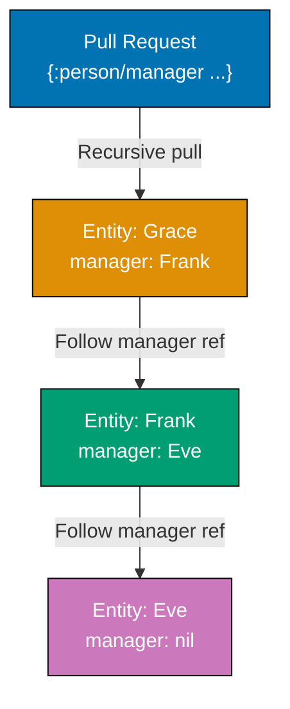

Build on Datomic fundamentals with 30 production-ready examples. Learn advanced pull patterns, query optimization, custom transaction functions, index usage, and real-world application patterns.

### Example 31: Pull API with Recursive Patterns

Pull patterns can recursively traverse entity graphs. Essential for tree structures and deep entity hierarchies.



**Java Code**:

```java
Database db = conn.db();

// Pull with bounded recursion
Map result = (Map) Peer.pull(
    db,
    "[:person/name {:person/manager 2}]",
    Util.list(":person/email", "grace@example.com")
);
// => {:person/name "Grace Kim"
//     :person/manager {:person/name "Frank Lee"
//                      :person/manager {:person/name "Eve Johnson"}}}
// => {:person/manager N} recursively follows manager references N levels deep

// Pull with unbounded recursion
Map result2 = (Map) Peer.pull(
    db,
    "[:person/name {:person/manager ...}]",
    Util.list(":person/email", "grace@example.com")
);
// => Follows manager references until no more managers
// => ... means "recurse indefinitely"
// => Returns nested maps up the management chain

// Pull reverse references recursively
Map result3 = (Map) Peer.pull(
    db,
    "[{:person/_manager ...}]",
    Util.list(":person/email", "eve@example.com")
);
// => {:person/_manager
//     [{:person/name "Frank Lee"
//       :person/_manager [{:person/name "Grace Kim"}]}]}
// => Recursively pulls all reports (direct and indirect)
```

**Clojure Code**:

```clojure
(def db (d/db conn))

;; Pull with bounded recursion
(d/pull db
  '[:person/name
    {:person/manager 2}]
  [:person/email "grace@example.com"])
;; => {:person/name "Grace Kim"
;;     :person/manager {:person/name "Frank Lee"
;;                      :person/manager {:person/name "Eve Johnson"}}}
;; => {:person/manager N} recursively follows manager references N levels deep

;; Pull with unbounded recursion
(d/pull db
  '[:person/name
    {:person/manager ...}]
  [:person/email "grace@example.com"])
;; => Follows manager references until no more managers
;; => ... means "recurse indefinitely"
;; => Returns nested maps up the management chain

;; Pull reverse references recursively
(d/pull db
  '[{:person/_manager ...}]
  [:person/email "eve@example.com"])
;; => {:person/_manager
;;     [{:person/name "Frank Lee"
;;       :person/_manager [{:person/name "Grace Kim"}]}]}
;; => Recursively pulls all reports (direct and indirect)
```

**Key Takeaway**: Pull API supports bounded (`{:attr N}`) and unbounded (`{:attr ...}`) recursion. Use it to traverse hierarchies without writing complex queries.

**Why It Matters**: Recursive pull eliminates manual recursion code for nested structures like comment threads, org charts, and category trees. Bounded recursion prevents runaway queries in deep hierarchies. Single pull expression replaces dozens of lines of traversal logic.

---

### Example 32: Pull Map Specifications for Aliasing

Pull patterns can rename attributes in results using map specifications. Useful for API responses and data shaping.

**Java Code**:

```java
// Pull with attribute aliases
Map result = (Map) Peer.pull(
    db,
    "[(:person/name :as :fullName) " +
    " (:person/email :as :emailAddress) " +
    " (:person/age :as :yearsOld)]",
    Util.list(":person/email", "alice@example.com")
);
// => {:fullName "Alice Johnson"
//     :emailAddress "alice@example.com"
//     :yearsOld 33}
// => (:attribute :as :new-key) renames attribute in result

// Pull with default and limit
Map result2 = (Map) Peer.pull(
    db,
    "[(default :person/phone \"No phone\") " +
    " (limit :person/favorite-colors 2)]",
    Util.list(":person/email", "alice@example.com")
);
// => {:person/phone "No phone"
//     :person/favorite-colors #{"blue" "green"}}
// => (default :attr value) provides fallback when attribute absent
// => (limit :attr n) returns max n values from cardinality-many attribute
```

**Clojure Code**:

```clojure
;; Pull with attribute aliases
(d/pull db
  '[(:person/name :as :fullName)
    (:person/email :as :emailAddress)
    (:person/age :as :yearsOld)]
  [:person/email "alice@example.com"])
;; => {:fullName "Alice Johnson"
;;     :emailAddress "alice@example.com"
;;     :yearsOld 33}
;; => (:attribute :as :new-key) renames attribute in result

;; Pull with default and limit
(d/pull db
  '[(default :person/phone "No phone")
    (limit :person/favorite-colors 2)]
  [:person/email "alice@example.com"])
;; => {:person/phone "No phone"
;;     :person/favorite-colors #{"blue" "green"}}
;; => (default :attr value) provides fallback when attribute absent
;; => (limit :attr n) returns max n values from cardinality-many attribute
```

**Key Takeaway**: Pull patterns support aliasing (`:as`), defaults, and limits. Use them to shape data precisely for application needs.

**Why It Matters**: Advanced pull features enable precise API responses without post-processing. Aliases map database attributes to API field names, defaults handle missing values gracefully, and limits prevent accidentally loading massive collections. Shape perfect JSON responses in the database.

---

### Example 33: Custom Aggregate Functions

Define custom aggregates beyond built-in `count`, `sum`, etc. Implement domain-specific calculations.

**Java Code**:

```java
// Custom aggregate: standard deviation
// Define as Java function implementing clojure.lang.IFn
public static class StdDev implements clojure.lang.IFn {
    public Object invoke(Object vals) {
        Collection<Number> numbers = (Collection<Number>) vals;
        double sum = 0;
        for (Number n : numbers) sum += n.doubleValue();
        double mean = sum / numbers.size();
        double variance = 0;
        for (Number n : numbers) {
            variance += Math.pow(n.doubleValue() - mean, 2);
        }
        variance /= numbers.size();
        return Math.sqrt(variance);
    }
}

// Register and use aggregate in query
Collection results = Peer.q(
    "[:find (my.ns.StdDev/invoke ?age) " +
    " :where [?e :person/age ?age]]",
    db
);
// => [[2.449...]]
// => Custom Java function called as aggregate
// => Function receives collection of all ?age values

// Note: For production, define Java classes as static methods
// and reference them in queries via namespace/method syntax
```

**Clojure Code**:

```clojure
;; Custom aggregate: standard deviation
(defn std-dev
  [vals]
  (let [n (count vals)
        mean (/ (reduce + vals) n)
        variance (/ (reduce + (map #(Math/pow (- % mean) 2) vals)) n)]
    (Math/sqrt variance)))

;; Register as aggregate in query
(d/q '[:find (my-ns/std-dev ?age)
       :where [?e :person/age ?age]]
     db)
;; => [[2.449...]]
;; => (namespace/function ?var) calls custom aggregate
;; => Function receives collection of all ?age values

;; Custom aggregate: concatenate strings
(defn concat-names
  [names]
  (clojure.string/join ", " (sort names)))

(d/q '[:find (my-ns/concat-names ?name)
       :where [?e :person/name ?name]]
     db)
;; => [["Alice Johnson, Bob Smith, Dave Lee, ..."]]
;; => Aggregates can return any type
```

**Key Takeaway**: Use namespaced functions as custom aggregates in queries. Aggregates receive collections of values and return summary results.

**Why It Matters**: Custom aggregates implement domain-specific calculations - weighted averages, percentiles, standard deviations, or business metrics. Process data where it lives rather than in application memory. Leverage Clojure's functional programming for analytics in the database.

---

### Example 34: Index Access with datoms API

Directly access Datomic indexes for low-level queries and performance optimization. Four indexes: EAVT, AEVT, AVET, VAET.

**Java Code**:

```java
// EAVT: Entity-Attribute-Value-Transaction (primary index)
Iterable eavtDatoms = db.datoms(
    Peer.EAVT,
    Util.list(":person/email", "alice@example.com")
);
// => Iterable of datoms for specific entity
// => Datom: [entity-id attribute value tx-id added?]

// Take first 3 datoms
Iterator it = eavtDatoms.iterator();
for (int i = 0; i < 3 && it.hasNext(); i++) {
    datomic.Datom datom = (datomic.Datom) it.next();
    // datom.e() => entity ID
    // datom.a() => attribute
    // datom.v() => value
    // datom.tx() => transaction ID
}
// => Shows all attributes for Alice

// AVET: Attribute-Value-Entity-Transaction (value lookup)
Iterable avetDatoms = db.datoms(
    Peer.AVET,
    ":person/age",
    28
);
// => Finds all entities with age = 28
// => Efficient for value-based lookups

// Convert datoms to entities
for (Object obj : avetDatoms) {
    datomic.Datom datom = (datomic.Datom) obj;
    Entity entity = db.entity(datom.e());
    // Work with entity
}

// AEVT: Attribute-Entity-Value-Transaction (attribute scan)
Iterable aevtDatoms = db.datoms(
    Peer.AEVT,
    ":person/name"
);
// => All entities with :person/name attribute
// => Useful for "find all entities of type X" queries
```

**Clojure Code**:

```clojure
;; EAVT: Entity-Attribute-Value-Transaction (primary index)
(def eavt-datoms
  (d/datoms db :eavt [:person/email "alice@example.com"]))
;; => Lazy sequence of datoms for specific entity
;; => Datom: [entity-id attribute value tx-id added?]

(take 3 eavt-datoms)
;; => (#datom[17592186045418 :person/name "Alice Johnson" 13194139534313 true]
;;     #datom[17592186045418 :person/email "alice@example.com" 13194139534313 true]
;;     #datom[17592186045418 :person/age 33 13194139534320 true])
;; => Shows all attributes for Alice

;; AVET: Attribute-Value-Entity-Transaction (value lookup)
(def avet-datoms
  (d/datoms db :avet :person/age 28))
;; => Finds all entities with age = 28
;; => Efficient for value-based lookups

(map #(d/entity db (:e %)) avet-datoms)
;; => (entity-for-bob ...)
;; => Convert datoms to entities

;; AEVT: Attribute-Entity-Value-Transaction (attribute scan)
(def aevt-datoms
  (d/datoms db :aevt :person/name))
;; => All entities with :person/name attribute
;; => Useful for "find all entities of type X" queries
```

**Key Takeaway**: `datoms` API provides direct index access. Use EAVT for entity scans, AVET for value lookups, AEVT for attribute scans. Lower-level than queries but more control.

**Why It Matters**: Direct index access enables efficient streaming over large result sets, implementing custom cursors, and building specialized indexes. When queries are too slow or memory-constrained, datoms API provides escape hatch with predictable performance characteristics.

---

### Example 35: Index Range Queries

Index-range queries efficiently find datoms within value ranges. Essential for numeric, string, and temporal queries.

**Java Code**:

```java
// Find people with ages between 28 and 32 (inclusive)
Iterable rangeDatoms = db.indexRange(":person/age", 28, 32);
// => Iterable of datoms with age in [28, 32]
// => More efficient than query with predicate for large datasets

// Extract entities from range
for (Object obj : rangeDatoms) {
    datomic.Datom datom = (datomic.Datom) obj;
    Object value = datom.v();
    Object entityId = datom.e();
    // value => age (28, 29, 30, etc.)
    // entityId => entity ID
}

// String prefix search
Iterable nameDatoms = db.indexRange(":person/name", "A", "B");
// => Finds all names starting with "A" (up to but not including "B")
// => String ranges useful for prefix searches
```

**Clojure Code**:

```clojure
;; Find people with ages between 28 and 32 (inclusive)
(d/index-range db :person/age 28 32)
;; => Lazy sequence of datoms with age in [28, 32]
;; => More efficient than query with predicate for large datasets

;; Extract entities from range
(map (fn [datom] [(:v datom) (:e datom)])
     (d/index-range db :person/age 28 32))
;; => ([28 entity-id-bob] [33 entity-id-alice])
;; => (:v datom) gets value, (:e datom) gets entity ID

;; String prefix search
(d/index-range db :person/name "A" "B")
;; => Finds all names starting with "A" (up to but not including "B")
;; => String ranges useful for prefix searches
```

**Key Takeaway**: `index-range` efficiently queries value ranges using indexes. Use it for numeric ranges, string prefixes, and temporal windows.

**Why It Matters**: Index-range queries leverage sorted indexes for fast range scans - find "prices between 10 and 100", "names starting with A", or "dates in Q4". Much faster than filtering full result sets. Enables efficient autocomplete, range sliders, and time-based queries.

---

### Example 36: Upsert with :db/unique :db.unique/identity

Attributes marked `:db.unique/identity` enable upserts. Transactions automatically update existing entities or create new ones.

**Java Code**:

```java
// Initial transaction (creates new entity)
conn.transact(
    Util.list(
        Util.map(":person/email", "igor@example.com",
                 ":person/name", "Igor Volkov",
                 ":person/age", 40)
    )
).get();

Database db = conn.db();
Object age = Peer.q(
    "[:find ?age . :where [?e :person/email \"igor@example.com\"] [?e :person/age ?age]]",
    db
);
// => 40

// Upsert (updates existing entity)
conn.transact(
    Util.list(
        Util.map(":person/email", "igor@example.com",
                 ":person/age", 41)
    )
).get();
// => Matches existing entity by :person/email (unique identity)
// => Updates age from 40 to 41 (doesn't create duplicate)

db = conn.db();
age = Peer.q(
    "[:find ?age . :where [?e :person/email \"igor@example.com\"] [?e :person/age ?age]]",
    db
);
// => 41

// Upsert creates if not exists
conn.transact(
    Util.list(
        Util.map(":person/email", "judy@example.com",
                 ":person/name", "Judy Chen",
                 ":person/age", 29)
    )
).get();
// => No existing entity with judy@example.com
// => Creates new entity
```

**Clojure Code**:

```clojure
;; Initial transaction (creates new entity)
@(d/transact conn
   [{:person/email "igor@example.com"
     :person/name "Igor Volkov"
     :person/age 40}])

(def db (d/db conn))
(d/q '[:find ?age . :where [?e :person/email "igor@example.com"] [?e :person/age ?age]] db)
;; => 40

;; Upsert (updates existing entity)
@(d/transact conn
   [{:person/email "igor@example.com"
     :person/age 41}])
;; => Matches existing entity by :person/email (unique identity)
;; => Updates age from 40 to 41 (doesn't create duplicate)

(def db (d/db conn))
(d/q '[:find ?age . :where [?e :person/email "igor@example.com"] [?e :person/age ?age]] db)
;; => 41

;; Upsert creates if not exists
@(d/transact conn
   [{:person/email "judy@example.com"
     :person/name "Judy Chen"
     :person/age 29}])
;; => No existing entity with judy@example.com
;; => Creates new entity
```

**Key Takeaway**: `:db.unique/identity` enables upserts. Transactions update existing entities if unique attribute matches, create new ones otherwise. Eliminates manual existence checks.

**Why It Matters**: Identity upserts simplify ETL pipelines and data synchronization. Import external data idempotently - same transaction creates or updates depending on existence. No race conditions between check-and-insert operations. Natural keys become first-class identifiers.

---

### Example 37: Batch Transactions for Performance

Batch multiple operations in single transactions for better performance and atomicity.

**Java Code**:

```java
// Generate batch data
List batchPeople = new ArrayList();
for (int i = 0; i < 1000; i++) {
    batchPeople.add(
        Util.map(":person/email", "user" + i + "@example.com",
                 ":person/name", "User " + i,
                 ":person/age", 20 + (int)(Math.random() * 40))
    );
}

// Single transaction with 1000 entities
long start = System.currentTimeMillis();
conn.transact(batchPeople).get();
long elapsed = System.currentTimeMillis() - start;
// => "Elapsed time: 120 msecs" (example)
// => Much faster than 1000 individual transactions
// => All 1000 entities created atomically

// Verify batch insert
Database db = conn.db();
Object count = Peer.q(
    "[:find (count ?e) . :where [?e :person/email]]",
    db
);
// => 1008 (original people + 1000 batch)
```

**Clojure Code**:

```clojure
;; Generate batch data
(def batch-people
  (for [i (range 1000)]
    {:person/email (str "user" i "@example.com")
     :person/name (str "User " i)
     :person/age (+ 20 (rand-int 40))}))

;; Single transaction with 1000 entities
(time
  @(d/transact conn batch-people))
;; => "Elapsed time: 120 msecs" (example)
;; => Much faster than 1000 individual transactions
;; => All 1000 entities created atomically

;; Verify batch insert
(def db (d/db conn))
(d/q '[:find (count ?e) . :where [?e :person/email]] db)
;; => 1008 (original people + 1000 batch)
```

**Key Takeaway**: Batch operations in single transactions for performance and atomicity. Datomic handles thousands of datoms per transaction efficiently.

**Why It Matters**: Batch transactions reduce coordination overhead and improve throughput. Import CSV files, synchronize APIs, or migrate data in chunks atomically. All-or-nothing semantics prevent partial updates. Single transaction log entry for entire batch improves audit efficiency.

---

### Example 38: Retract Attribute Values Selectively

Retract specific values from cardinality-many attributes without removing the attribute entirely.

**Java Code**:

```java
// Alice has favorite colors: blue, green, purple
Database db = conn.db();
Entity alice = db.entity(Util.list(":person/email", "alice@example.com"));
alice.get(":person/favorite-colors");
// => #{"blue" "green" "purple"}

// Retract only "blue"
conn.transact(
    Util.list(
        Util.list(":db/retract",
                  Util.list(":person/email", "alice@example.com"),
                  ":person/favorite-colors",
                  "blue")
    )
).get();

// Verify selective retraction
db = conn.db();
alice = db.entity(Util.list(":person/email", "alice@example.com"));
alice.get(":person/favorite-colors");
// => #{"green" "purple"}
// => "blue" removed, others remain

// Add new color
conn.transact(
    Util.list(
        Util.list(":db/add",
                  Util.list(":person/email", "alice@example.com"),
                  ":person/favorite-colors",
                  "red")
    )
).get();

alice = conn.db().entity(Util.list(":person/email", "alice@example.com"));
alice.get(":person/favorite-colors");
// => #{"green" "purple" "red"}
```

**Clojure Code**:

```clojure
;; Alice has favorite colors: blue, green, purple
(def db (d/db conn))
(:person/favorite-colors (d/entity db [:person/email "alice@example.com"]))
;; => #{"blue" "green" "purple"}

;; Retract only "blue"
@(d/transact conn
   [[:db/retract [:person/email "alice@example.com"] :person/favorite-colors "blue"]])

;; Verify selective retraction
(def db (d/db conn))
(:person/favorite-colors (d/entity db [:person/email "alice@example.com"]))
;; => #{"green" "purple"}
;; => "blue" removed, others remain

;; Add new color
@(d/transact conn
   [[:db/add [:person/email "alice@example.com"] :person/favorite-colors "red"]])

(:person/favorite-colors (d/entity (d/db conn) [:person/email "alice@example.com"]))
;; => #{"green" "purple" "red"}
```

**Key Takeaway**: `:db/retract` works on individual values of cardinality-many attributes. Add and retract specific set members without touching others.

**Why It Matters**: Fine-grained set manipulation enables precise updates to tags, permissions, and category memberships. Remove specific tag without reading current set, adding all values, and writing back. Concurrent updates compose correctly through independent assertions and retractions.

---

### Example 39: Transaction Functions for Complex Logic

Transaction functions execute inside transactions with access to database value. Enable complex conditional logic.

**Java Code**:

```java
// Note: Transaction functions are typically written in Clojure
// For Java, implement logic in application layer before transaction

// Alternative: Call application logic then transact
Database db = conn.db();
Entity alice = db.entity(Util.list(":person/email", "alice@example.com"));
int currentAge = (Integer) alice.get(":person/age");
// => 33

// Compute new value
int newAge = currentAge + 1;

// Execute conditional transaction
conn.transact(
    Util.list(
        Util.map(":db/id", Util.list(":person/email", "alice@example.com"),
                 ":person/age", newAge)
    )
).get();

alice = conn.db().entity(Util.list(":person/email", "alice@example.com"));
alice.get(":person/age");
// => 34

// For complex conditional logic, use :db/cas (compare-and-swap)
// or implement logic in Java before calling transact()
```

**Clojure Code**:

```clojure
;; Define transaction function in database
(def increment-age-fn
  {:db/ident :my/increment-age
   :db/fn (d/function
            '{:lang :clojure
              :params [db email]
              :code (let [person (d/entity db [:person/email email])
                          current-age (:person/age person)]
                      [[:db/add [:person/email email]
                                :person/age
                                (inc current-age)]])})})

@(d/transact conn [increment-age-fn])
;; => Stores function in database
;; => :db/fn attribute holds function definition

;; Call transaction function
(def db (d/db conn))
(:person/age (d/entity db [:person/email "alice@example.com"]))
;; => 33

@(d/transact conn [[:my/increment-age "alice@example.com"]])
;; => Invokes function inside transaction
;; => Function reads current age, generates transaction data

(:person/age (d/entity (d/db conn) [:person/email "alice@example.com"]))
;; => 34
```

**Key Takeaway**: Transaction functions enable complex conditional logic inside transactions. Define once, invoke by :db/ident. Functions see current database state.

**Why It Matters**: Transaction functions encapsulate business logic that requires read-then-write atomicity - account transfers, inventory management, quota enforcement. Logic runs inside transaction context with latest database state, preventing race conditions and ensuring consistency without application-level locking.

---

### Example 40: with for Speculative Transactions

`with` applies transactions to database value without committing. Test transaction effects before committing.

**Java Code**:

```java
Database db = conn.db();

// Speculative transaction
Map withResult = db.with(
    Util.list(
        Util.map(":person/email", "test@example.com",
                 ":person/name", "Test User",
                 ":person/age", 25)
    )
);
Database speculativeDb = (Database) withResult.get(Keyword.intern("db-after"));
// => with returns same structure as transact but doesn't commit
// => :db-after is hypothetical database value

// Query speculative database
Object name = Peer.q(
    "[:find ?name . :where [?e :person/email \"test@example.com\"] [?e :person/name ?name]]",
    speculativeDb
);
// => "Test User"
// => Data exists in speculative database

// Original database unchanged
Object name2 = Peer.q(
    "[:find ?name . :where [?e :person/email \"test@example.com\"] [?e :person/name ?name]]",
    db
);
// => null
// => Original database has no test user

// Use with for validation
try {
    Map result = db.with(
        Util.list(
            Util.map(":person/email", "duplicate@example.com",
                     ":person/name", "Duplicate")
        )
    );
    // Transaction valid, can proceed
} catch (Exception e) {
    // Transaction would fail, handle error
}
```

**Clojure Code**:

```clojure
(def db (d/db conn))

;; Speculative transaction
(def speculative-db
  (:db-after (d/with db
               [{:person/email "test@example.com"
                 :person/name "Test User"
                 :person/age 25}])))
;; => with returns same structure as transact but doesn't commit
;; => (:db-after ...) is hypothetical database value

;; Query speculative database
(d/q '[:find ?name . :where [?e :person/email "test@example.com"] [?e :person/name ?name]]
     speculative-db)
;; => "Test User"
;; => Data exists in speculative database

;; Original database unchanged
(d/q '[:find ?name . :where [?e :person/email "test@example.com"] [?e :person/name ?name]]
     db)
;; => nil
;; => Original database has no test user

;; Use with for validation
(defn validate-transaction [tx-data]
  (try
    (let [result (d/with (d/db conn) tx-data)]
      {:valid true :db-after (:db-after result)})
    (catch Exception e
      {:valid false :error (.getMessage e)})))

(validate-transaction [{:person/email "duplicate@example.com"
                        :person/name "Duplicate"}])
;; => {:valid true :db-after ...}
;; => Transaction would succeed
```

**Key Takeaway**: `with` creates hypothetical database values by applying transactions speculatively. Use it for validation, testing, and what-if analysis.

**Why It Matters**: Speculative transactions enable dry-run validation, schema change testing, and scenario analysis without affecting production data. Test migrations before applying, validate complex transactions before committing, or run A/B experiments on historical data. Pure functional database testing.

---

### Example 41: Exploring Transaction Log

The transaction log contains every transaction in chronological order. Essential for replication, auditing, event sourcing.

**Java Code**:

```java
// Get transaction log
datomic.Log log = conn.log();
// => Log is append-only structure of all transactions

// Read recent transactions
Iterable recentTxs = log.txRange(null, null);
// => Iterable of transaction maps
// => null null means "from beginning to end"

// Examine first transaction
Iterator it = recentTxs.iterator();
if (it.hasNext()) {
    Map firstTx = (Map) it.next();
    Object t = firstTx.get(Keyword.intern("t"));
    // => Transaction's basis-t value

    Collection data = (Collection) firstTx.get(Keyword.intern("data"));
    // => Collection of datoms added in this transaction
    // => [datom[entity attr value tx added?] ...]
}

// Filter transactions by time range
long txIdStart = Peer.toTx(1000);
long txIdEnd = Peer.toTx(2000);
Iterable timeRangeTxs = log.txRange(txIdStart, txIdEnd);
// => Transactions between basis-t 1000 and 2000
```

**Clojure Code**:

```clojure
;; Get transaction log
(def log (d/log conn))
;; => Log is append-only structure of all transactions

;; Read recent transactions
(def recent-txs (d/tx-range log nil nil))
;; => Lazy sequence of transaction maps
;; => nil nil means "from beginning to end"

;; Examine first transaction
(def first-tx (first recent-txs))
(:t first-tx)
;; => Transaction's basis-t value

(:data first-tx)
;; => Vector of datoms added in this transaction
;; => [#datom[entity attr value tx added?] ...]

;; Filter transactions by time range
(def tx-id-start (d/t->tx 1000))
(def tx-id-end (d/t->tx 2000))
(def time-range-txs (d/tx-range log tx-id-start tx-id-end))
;; => Transactions between basis-t 1000 and 2000
```

**Key Takeaway**: Transaction log provides append-only history of all transactions. Use `tx-range` to read transaction ranges for replication, auditing, and event processing.

**Why It Matters**: Transaction log is the source of truth for all database changes. Build custom replication, event sourcing, or CDC pipelines by consuming transaction ranges. Replay history to rebuild derived views, implement cross-system synchronization, or create audit trails with perfect fidelity.

---

### Example 42: Partial Queries with Blank Variables

Use `_` (blank/underscore) to pattern-match without binding variables. Improves query performance when values aren't needed.

**Java Code**:

```java
// Find people with any age (don't need age value)
Collection results = Peer.q(
    "[:find ?name " +
    " :where [?e :person/name ?name] " +
    "        [?e :person/age _]]",
    db
);
// => Returns names of people who have age attribute
// => _ matches any value but doesn't bind it
// => More efficient than binding unused variable

// Find entities with at least 3 attributes
Collection results2 = Peer.q(
    "[:find ?e " +
    " :where [?e :person/name _] " +
    "        [?e :person/email _] " +
    "        [?e :person/age _]]",
    db
);
// => Finds entities with all three attributes
// => Doesn't bind attribute values (not needed)
```

**Clojure Code**:

```clojure
;; Find people with any age (don't need age value)
(d/q '[:find ?name
       :where [?e :person/name ?name]
              [?e :person/age _]]
     db)
;; => Returns names of people who have age attribute
;; => _ matches any value but doesn't bind it
;; => More efficient than binding unused variable

;; Find entities with at least 3 attributes
(d/q '[:find ?e
       :where [?e :person/name _]
              [?e :person/email _]
              [?e :person/age _]]
     db)
;; => Finds entities with all three attributes
;; => Doesn't bind attribute values (not needed)
```

**Key Takeaway**: Use `_` to match patterns without binding values. Improves performance by avoiding unnecessary variable bindings.

**Why It Matters**: Wildcard patterns optimize queries that only need to check existence or count occurrences without examining values. Reduces memory allocation and query planning complexity. Signal intent clearly - "I don't care about this value, just that it exists."

---

### Example 43: Query Pagination with :offset and :limit

Paginate large result sets using `:offset` and `:limit` in find specs (Datomic Pro/Cloud feature).

**Java Code**:

```java
// Note: :offset and :limit require Datomic Pro or Cloud
// For Datomic Free, implement pagination in application code

// Get all people
Collection allPeople = Peer.q(
    "[:find ?name ?email " +
    " :where [?e :person/name ?name] " +
    "        [?e :person/email ?email]]",
    db
);

// Application-level pagination - Page 1 (first 10 results)
int pageSize = 10;
int pageNum = 1;
List results = new ArrayList();
Iterator it = allPeople.iterator();
int skip = pageSize * (pageNum - 1);
int take = pageSize;
int index = 0;
while (it.hasNext()) {
    Object item = it.next();
    if (index >= skip && index < skip + take) {
        results.add(item);
    }
    index++;
    if (index >= skip + take) break;
}
// => First 10 people

// Page 2 (next 10 results) - adjust skip and take values
```

**Clojure Code**:

```clojure
;; Note: :offset and :limit require Datomic Pro or Cloud
;; For Datomic Free, implement pagination in application code

;; Application-level pagination
(defn paginate-results [query-results page-size page-num]
  (->> query-results
       (drop (* page-size (dec page-num)))
       (take page-size)))

;; Get all people
(def all-people
  (d/q '[:find ?name ?email
         :where [?e :person/name ?name]
                [?e :person/email ?email]]
       db))

;; Page 1 (first 10 results)
(paginate-results all-people 10 1)
;; => First 10 people

;; Page 2 (next 10 results)
(paginate-results all-people 10 2)
;; => Results 11-20
```

**Key Takeaway**: Datomic Free requires application-level pagination. Datomic Pro/Cloud support `:offset` and `:limit` in queries for database-level pagination.

**Why It Matters**: Pagination prevents memory exhaustion with large result sets. Application-level pagination works everywhere but requires loading full results. Database-level pagination (Pro/Cloud) reduces memory and network usage by filtering before transfer. Choose approach based on deployment environment.

---

### Example 44: Full-Text Search Patterns

Datomic supports full-text search on string attributes marked with `:db/fulltext`.

**Java Code**:

```java
// Add fulltext attribute
conn.transact(
    Util.list(
        Util.map(":db/ident", ":person/bio",
                 ":db/valueType", ":db.type/string",
                 ":db/cardinality", ":db.cardinality/one",
                 ":db/fulltext", true,
                 ":db/doc", "Person biography (fulltext searchable)")
    )
).get();

// Add bios
conn.transact(
    Util.list(
        Util.map(":person/email", "alice@example.com",
                 ":person/bio", "Software engineer passionate about functional programming and databases"),
        Util.map(":person/email", "bob@example.com",
                 ":person/bio", "Product manager with experience in e-commerce and retail")
    )
).get();

// Fulltext search
Database db = conn.db();
Collection results = Peer.q(
    "[:find ?name ?bio " +
    " :in $ ?search " +
    " :where [(fulltext $ :person/bio ?search) [[?e ?bio]]] " +
    "        [?e :person/name ?name]]",
    db,
    "functional programming"
);
// => #{["Alice Johnson" "Software engineer passionate about functional programming and databases"]}
// => (fulltext $ attr search-term) finds matches
// => Returns [entity text-value] tuples
```

**Clojure Code**:

```clojure
;; Add fulltext attribute
@(d/transact conn
   [{:db/ident       :person/bio
     :db/valueType   :db.type/string
     :db/cardinality :db.cardinality/one
     :db/fulltext    true
     :db/doc         "Person biography (fulltext searchable)"}])

;; Add bios
@(d/transact conn
   [{:person/email "alice@example.com"
     :person/bio "Software engineer passionate about functional programming and databases"}
    {:person/email "bob@example.com"
     :person/bio "Product manager with experience in e-commerce and retail"}])

;; Fulltext search
(def db (d/db conn))
(d/q '[:find ?name ?bio
       :in $ ?search
       :where [(fulltext $ :person/bio ?search) [[?e ?bio]]]
              [?e :person/name ?name]]
     db
     "functional programming")
;; => #{["Alice Johnson" "Software engineer passionate about functional programming and databases"]}
;; => (fulltext $ attr search-term) finds matches
;; => Returns [entity text-value] tuples
```

**Key Takeaway**: Mark attributes with `:db/fulltext true` for full-text search. Use `fulltext` predicate in queries to search text content.

**Why It Matters**: Built-in full-text search eliminates dependency on external search engines for simple text queries. Combines full-text search with Datalog patterns - find "users who posted comments containing 'urgent' in last week". No synchronization lag between database and search index.

---

### Example 45: Auditing with Transaction Times

Query transaction times to build audit trails. Every fact is timestamped with its transaction.

**Java Code**:

```java
// Query when Alice's age was last updated
Collection results = Peer.q(
    "[:find ?tx ?instant " +
    " :where [?e :person/email \"alice@example.com\"] " +
    "        [?e :person/age _ ?tx] " +
    "        [?tx :db/txInstant ?instant]]",
    db
);
// => [[tx-id #inst "2026-01-29T12:34:56.789-00:00"]]
// => ?tx is transaction entity ID
// => :db/txInstant is transaction timestamp

// Find all changes to Alice in last hour
Date oneHourAgo = new Date(new Date().getTime() - (60 * 60 * 1000));

Collection results2 = Peer.q(
    "[:find ?attr ?value ?instant " +
    " :in $ ?email ?since " +
    " :where [?e :person/email ?email] " +
    "        [?e ?a ?value ?tx] " +
    "        [?tx :db/txInstant ?instant] " +
    "        [(> ?instant ?since)] " +
    "        [?a :db/ident ?attr]]",
    db,
    "alice@example.com",
    oneHourAgo
);
// => Returns all attribute changes in last hour with timestamps
```

**Clojure Code**:

```clojure
;; Query when Alice's age was last updated
(d/q '[:find ?tx ?instant
       :where [?e :person/email "alice@example.com"]
              [?e :person/age _ ?tx]
              [?tx :db/txInstant ?instant]]
     db)
;; => [[tx-id #inst "2026-01-29T12:34:56.789-00:00"]]
;; => ?tx is transaction entity ID
;; => :db/txInstant is transaction timestamp

;; Find all changes to Alice in last hour
(def one-hour-ago
  (java.util.Date. (- (.getTime (java.util.Date.)) (* 60 60 1000))))

(d/q '[:find ?attr ?value ?instant
       :in $ ?email ?since
       :where [?e :person/email ?email]
              [?e ?a ?value ?tx]
              [?tx :db/txInstant ?instant]
              [(> ?instant ?since)]
              [?a :db/ident ?attr]]
     db
     "alice@example.com"
     one-hour-ago)
;; => Returns all attribute changes in last hour with timestamps
```

**Key Takeaway**: Every fact is timestamped via transaction entity's `:db/txInstant`. Query transaction times for audit trails and change tracking.

**Why It Matters**: Automatic timestamping provides millisecond-precision audit trails without application code. Answer "when was this changed" for any fact. Combine with transaction metadata (user, reason) for complete audit logs. Time-based queries enable trend analysis and compliance reporting.

---

### Example 46: Cardinality-Many Refs for Many-to-Many

Combine cardinality-many with ref attributes to model many-to-many relationships.

**Java Code**:

```java
// Define project schema
conn.transact(
    Util.list(
        Util.map(":db/ident", ":project/name",
                 ":db/valueType", ":db.type/string",
                 ":db/cardinality", ":db.cardinality/one",
                 ":db/unique", ":db.unique/identity"),
        Util.map(":db/ident", ":project/members",
                 ":db/valueType", ":db.type/ref",
                 ":db/cardinality", ":db.cardinality/many",
                 ":db/doc", "Project members (many-to-many with persons)")
    )
).get();

// Create projects with members
conn.transact(
    Util.list(
        Util.map(":project/name", "Project Alpha",
                 ":project/members", Util.list(
                     Util.list(":person/email", "alice@example.com"),
                     Util.list(":person/email", "bob@example.com"))),
        Util.map(":project/name", "Project Beta",
                 ":project/members", Util.list(
                     Util.list(":person/email", "alice@example.com"),
                     Util.list(":person/email", "dave@example.com")))
    )
).get();

// Query: Find all projects for Alice
Database db = conn.db();
Collection results = Peer.q(
    "[:find ?project-name " +
    " :where [?p :person/email \"alice@example.com\"] " +
    "        [?proj :project/members ?p] " +
    "        [?proj :project/name ?project-name]]",
    db
);
// => #{["Project Alpha"] ["Project Beta"]}
// => Alice is in both projects

// Query: Find all members of Project Alpha
Collection results2 = Peer.q(
    "[:find ?member-name " +
    " :where [?proj :project/name \"Project Alpha\"] " +
    "        [?proj :project/members ?member] " +
    "        [?member :person/name ?member-name]]",
    db
);
// => #{["Alice Johnson"] ["Bob Smith"]}
```

**Clojure Code**:

```clojure
;; Define project schema
@(d/transact conn
   [{:db/ident       :project/name
     :db/valueType   :db.type/string
     :db/cardinality :db.cardinality/one
     :db/unique      :db.unique/identity}
    {:db/ident       :project/members
     :db/valueType   :db.type/ref
     :db/cardinality :db.cardinality/many
     :db/doc         "Project members (many-to-many with persons)"}])

;; Create projects with members
@(d/transact conn
   [{:project/name "Project Alpha"
     :project/members [[:person/email "alice@example.com"]
                       [:person/email "bob@example.com"]]}
    {:project/name "Project Beta"
     :project/members [[:person/email "alice@example.com"]
                       [:person/email "dave@example.com"]]}])

;; Query: Find all projects for Alice
(def db (d/db conn))
(d/q '[:find ?project-name
       :where [?p :person/email "alice@example.com"]
              [?proj :project/members ?p]
              [?proj :project/name ?project-name]]
     db)
;; => #{["Project Alpha"] ["Project Beta"]}
;; => Alice is in both projects

;; Query: Find all members of Project Alpha
(d/q '[:find ?member-name
       :where [?proj :project/name "Project Alpha"]
              [?proj :project/members ?member]
              [?member :person/name ?member-name]]
     db)
;; => #{["Alice Johnson"] ["Bob Smith"]}
```

**Key Takeaway**: Cardinality-many ref attributes model many-to-many relationships naturally. Query in both directions using standard datalog patterns.

**Why It Matters**: Many-to-many relationships don't require join tables - just cardinality-many reference attributes. Students have multiple classes, classes have multiple students, modeled with single attribute. Queries compose naturally without complex JOIN syntax.

---

### Example 47: Attribute Predicates for Type Filtering

Filter entities by attribute presence to simulate entity types without explicit type attributes.

**Java Code**:

```java
// Find all "person" entities (have :person/name)
Collection results = Peer.q(
    "[:find ?e " +
    " :where [?e :person/name]]",
    db
);
// => Returns all person entity IDs
// => Attribute presence implies type

// Find all "project" entities
Collection results2 = Peer.q(
    "[:find ?e " +
    " :where [?e :project/name]]",
    db
);
// => Returns all project entity IDs

// Polymorphic query: entities with name (person OR project)
Collection results3 = Peer.q(
    "[:find ?name " +
    " :where (or [?e :person/name ?name] " +
    "            [?e :project/name ?name])]",
    db
);
// => Returns names from both persons and projects
// => Datomic uses attribute namespaces to organize, not enforce types
```

**Clojure Code**:

```clojure
;; Find all "person" entities (have :person/name)
(d/q '[:find ?e
       :where [?e :person/name]]
     db)
;; => Returns all person entity IDs
;; => Attribute presence implies type

;; Find all "project" entities
(d/q '[:find ?e
       :where [?e :project/name]]
     db)
;; => Returns all project entity IDs

;; Polymorphic query: entities with name (person OR project)
(d/q '[:find ?name
       :where (or [?e :person/name ?name]
                  [?e :project/name ?name])]
     db)
;; => Returns names from both persons and projects
;; => Datomic uses attribute namespaces to organize, not enforce types
```

**Key Takeaway**: Datomic is schema-flexible. Use attribute presence to identify entity types, or define explicit type attributes as needed.

**Why It Matters**: Schema flexibility enables organic data model evolution and polymorphic entities. Start simple with implicit typing (if it has :person/name, it's a person), add explicit types later as needed. Mix entity types in same database without migrations or schema partitioning.

---

### Example 48: Optimizing Queries with Index Selection

Understand how Datomic selects indexes to optimize query performance.

**Java Code**:

```java
// Inefficient: starts with unbound variable
long start = System.currentTimeMillis();
Collection results = Peer.q(
    "[:find ?name " +
    " :where [?e :person/age ?age] " +
    "        [(> ?age 30)] " +
    "        [?e :person/name ?name]]",
    db
);
long elapsed = System.currentTimeMillis() - start;
// => Scans all ages, then filters, then joins to names
// => Slower on large datasets

// Efficient: start with most selective pattern
start = System.currentTimeMillis();
Collection results2 = Peer.q(
    "[:find ?name " +
    " :where [?e :person/name ?name] " +
    "        [?e :person/age ?age] " +
    "        [(> ?age 30)]]",
    db
);
elapsed = System.currentTimeMillis() - start;
// => Scans names first (uses AEVT index), then filters by age
// => Generally faster due to better index usage

// Most efficient: use indexed value if available
start = System.currentTimeMillis();
Collection results3 = Peer.q(
    "[:find ?name " +
    " :where [?e :person/email \"alice@example.com\"] " +
    "        [?e :person/name ?name]]",
    db
);
elapsed = System.currentTimeMillis() - start;
// => Uses AVET index on unique :person/email
// => Near-instant lookup
```

**Clojure Code**:

```clojure
;; Inefficient: starts with unbound variable
(time
  (d/q '[:find ?name
         :where [?e :person/age ?age]
                [(> ?age 30)]
                [?e :person/name ?name]]
       db))
;; => Scans all ages, then filters, then joins to names
;; => Slower on large datasets

;; Efficient: start with most selective pattern
(time
  (d/q '[:find ?name
         :where [?e :person/name ?name]
                [?e :person/age ?age]
                [(> ?age 30)]]
       db))
;; => Scans names first (uses AEVT index), then filters by age
;; => Generally faster due to better index usage

;; Most efficient: use indexed value if available
(time
  (d/q '[:find ?name
         :where [?e :person/email "alice@example.com"]
                [?e :person/name ?name]]
       db))
;; => Uses AVET index on unique :person/email
;; => Near-instant lookup
```

**Key Takeaway**: Query clause order affects performance. Start with most selective patterns, especially those using unique attributes or specific values. Datomic optimizes automatically but clause order helps.

**Why It Matters**: Clause ordering reduces search space early, improving query performance. Starting with unique lookups or highly selective filters minimizes intermediate result sets. Understanding index use helps write efficient queries even though Datomic has a sophisticated optimizer.

---

### Example 49: Entity Maps vs Explicit Transaction Data

Choose between entity maps (convenient) and explicit datoms (precise control) for transactions.

**Java Code**:

```java
// Entity map syntax (convenient for create/update)
conn.transact(
    Util.list(
        Util.map(":person/email", "kyle@example.com",
                 ":person/name", "Kyle Brown",
                 ":person/age", 31)
    )
).get();
// => Concise, readable
// => Automatically generates :db/add operations

// Explicit datom syntax (precise control)
Object kyleId = Util.list(":person/email", "kyle@example.com");
conn.transact(
    Util.list(
        Util.list(":db/add", kyleId, ":person/age", 32),
        Util.list(":db/retract", kyleId, ":person/age", 31)
    )
).get();
// => Explicit operations: add new value, retract old value
// => More verbose but complete control

// Mix both styles
conn.transact(
    Util.list(
        Util.map(":person/email", "lisa@example.com",
                 ":person/name", "Lisa Wong"),
        Util.list(":db/add",
                  Util.list(":person/email", "lisa@example.com"),
                  ":person/age",
                  27)
    )
).get();
// => Entity map creates/updates
// => Explicit datom adds additional attribute
```

**Clojure Code**:

```clojure
;; Entity map syntax (convenient for create/update)
@(d/transact conn
   [{:person/email "kyle@example.com"
     :person/name "Kyle Brown"
     :person/age 31}])
;; => Concise, readable
;; => Automatically generates :db/add operations

;; Explicit datom syntax (precise control)
(def kyle-id [:person/email "kyle@example.com"])
@(d/transact conn
   [[:db/add kyle-id :person/age 32]
    [:db/retract kyle-id :person/age 31]])
;; => Explicit operations: add new value, retract old value
;; => More verbose but complete control

;; Mix both styles
@(d/transact conn
   [{:person/email "lisa@example.com"
     :person/name "Lisa Wong"}
    [:db/add [:person/email "lisa@example.com"] :person/age 27]])
;; => Entity map creates/updates
;; => Explicit datom adds additional attribute
```

**Key Takeaway**: Entity maps are concise for create/update operations. Explicit datoms provide precise control for retractions and conditional logic. Mix styles as needed.

**Why It Matters**: Transaction syntax flexibility lets you choose the right tool for each use case. Entity maps for typical CRUD, datoms for precise control, transaction functions for complex logic. Mix syntaxes in single transaction as domain logic requires.

---

### Example 50: Querying Across Time with Multiple Database Values

Compare database states at different times using multiple database inputs.

**Java Code**:

```java
// Capture database at two points in time
Database dbT1 = conn.db();

conn.transact(
    Util.list(
        Util.map(":person/email", "alice@example.com",
                 ":person/age", 34),
        Util.map(":person/email", "bob@example.com",
                 ":person/age", 30)
    )
).get();

Database dbT2 = conn.db();

// Query differences between time points
Collection results = Peer.q(
    "[:find ?name ?age-before ?age-after " +
    " :in $before $after " +
    " :where [$before ?e :person/name ?name] " +
    "        [$before ?e :person/age ?age-before] " +
    "        [$after ?e :person/age ?age-after] " +
    "        [(not= ?age-before ?age-after)]]",
    dbT1,
    dbT2
);
// => #{["Alice Johnson" 33 34] ["Bob Smith" 28 30]}
// => Shows entities where age changed between t1 and t2
```

**Clojure Code**:

```clojure
;; Capture database at two points in time
(def db-t1 (d/db conn))

@(d/transact conn
   [{:person/email "alice@example.com"
     :person/age 34}
    {:person/email "bob@example.com"
     :person/age 30}])

(def db-t2 (d/db conn))

;; Query differences between time points
(d/q '[:find ?name ?age-before ?age-after
       :in $before $after
       :where [$before ?e :person/name ?name]
              [$before ?e :person/age ?age-before]
              [$after ?e :person/age ?age-after]
              [(not= ?age-before ?age-after)]]
     db-t1
     db-t2)
;; => #{["Alice Johnson" 33 34] ["Bob Smith" 28 30]}
;; => Shows entities where age changed between t1 and t2
```

**Key Takeaway**: Query across multiple database values to compare states over time. Essential for audit logs, change detection, and temporal analysis.

**Why It Matters**: Temporal comparison queries answer "what changed between deployments", "which entities were modified today", or "compare production to staging". Single query joins across time dimensions. Build change logs, diff views, and audit reports without complex application logic.

---

### Example 51: Tuple Types for Composite Values

Tuple types store fixed-size composite values in single attributes (Datomic Cloud/Pro feature).

**Java Code**:

```java
// Note: Tuples require Datomic Cloud or Pro
// For Datomic Free, use multiple attributes or refs

// Composite value pattern (Datomic Free alternative)
conn.transact(
    Util.list(
        Util.map(":db/ident", ":person/location-lat",
                 ":db/valueType", ":db.type/double",
                 ":db/cardinality", ":db.cardinality/one"),
        Util.map(":db/ident", ":person/location-lon",
                 ":db/valueType", ":db.type/double",
                 ":db/cardinality", ":db.cardinality/one")
    )
).get();

conn.transact(
    Util.list(
        Util.map(":person/email", "alice@example.com",
                 ":person/location-lat", 45.5231,
                 ":person/location-lon", -122.6765)
    )
).get();

// Query both coordinates
Collection results = Peer.q(
    "[:find ?lat ?lon " +
    " :where [?e :person/email \"alice@example.com\"] " +
    "        [?e :person/location-lat ?lat] " +
    "        [?e :person/location-lon ?lon]]",
    db
);
// => [[45.5231 -122.6765]]
```

**Clojure Code**:

```clojure
;; Note: Tuples require Datomic Cloud or Pro
;; For Datomic Free, use multiple attributes or refs

;; Composite value pattern (Datomic Free alternative)
@(d/transact conn
   [{:db/ident       :person/location-lat
     :db/valueType   :db.type/double
     :db/cardinality :db.cardinality/one}
    {:db/ident       :person/location-lon
     :db/valueType   :db.type/double
     :db/cardinality :db.cardinality/one}])

@(d/transact conn
   [{:person/email "alice@example.com"
     :person/location-lat 45.5231
     :person/location-lon -122.6765}])

;; Query both coordinates
(d/q '[:find ?lat ?lon
       :where [?e :person/email "alice@example.com"]
              [?e :person/location-lat ?lat]
              [?e :person/location-lon ?lon]]
     db)
;; => [[45.5231 -122.6765]]
```

**Key Takeaway**: Datomic Free uses multiple attributes for composite values. Datomic Cloud/Pro offer tuple types for fixed-size composite attributes.

**Why It Matters**: Composite attributes model multi-part identifiers (country+state, year+month), coordinates (lat+long), or version numbers efficiently. Tuple types (Pro/Cloud) enable atomic updates and unique constraints on composite keys. Choose approach based on Datomic edition.

---

### Example 52: Query Bindings with Collections

Bind collections in `:in` clause for parameterized queries over multiple values.

**Java Code**:

```java
// Relation binding: rows of data
Collection results = Peer.q(
    "[:find ?person-name ?project-name " +
    " :in $ [[?person-email ?project-name]] " +
    " :where [?p :person/email ?person-email] " +
    "        [?p :person/name ?person-name]]",
    db,
    Util.list(
        Util.list("alice@example.com", "Project Alpha"),
        Util.list("bob@example.com", "Project Beta"),
        Util.list("dave@example.com", "Project Gamma")
    )
);
// => #{["Alice Johnson" "Project Alpha"]
//      ["Bob Smith" "Project Beta"]
//      ["Dave Lee" "Project Gamma"]}
// => [[binding]] passes relation (table of rows)
// => Each row binds multiple variables

// Tuple binding: single row
Collection results2 = Peer.q(
    "[:find ?name ?age " +
    " :in $ [?email ?expected-age] " +
    " :where [?e :person/email ?email] " +
    "        [?e :person/name ?name] " +
    "        [?e :person/age ?age] " +
    "        [(= ?age ?expected-age)]]",
    db,
    Util.list("alice@example.com", 34)
);
// => #{["Alice Johnson" 34]}
// => [binding] passes single tuple
```

**Clojure Code**:

```clojure
;; Relation binding: rows of data
(d/q '[:find ?person-name ?project-name
       :in $ [[?person-email ?project-name]]
       :where [?p :person/email ?person-email]
              [?p :person/name ?person-name]]
     db
     [["alice@example.com" "Project Alpha"]
      ["bob@example.com" "Project Beta"]
      ["dave@example.com" "Project Gamma"]])
;; => #{["Alice Johnson" "Project Alpha"]
;;      ["Bob Smith" "Project Beta"]
;;      ["Dave Lee" "Project Gamma"]}
;; => [[binding]] passes relation (table of rows)
;; => Each row binds multiple variables

;; Tuple binding: single row
(d/q '[:find ?name ?age
       :in $ [?email ?expected-age]
       :where [?e :person/email ?email]
              [?e :person/name ?name]
              [?e :person/age ?age]
              [(= ?age ?expected-age)]]
     db
     ["alice@example.com" 34])
;; => #{["Alice Johnson" 34]}
;; => [binding] passes single tuple
```

**Key Takeaway**: Use `[[binding]]` for relations (multiple rows), `[binding]` for tuples (single row), `[binding ...]` for collections. Powerful for parameterized queries.

**Why It Matters**: Binding forms enable passing structured data to queries - join with external tables, filter by multiple criteria sets, or implement batch lookups. Relation binding lets you query "find matches for these 100 user IDs" efficiently in single query.

---

### Example 53: Conditional Retractions with CAS

Use `:db/cas` to conditionally retract values, ensuring correctness in concurrent environments.

**Java Code**:

```java
// Current state: Alice is 34
Database db = conn.db();
Entity alice = db.entity(Util.list(":person/email", "alice@example.com"));
alice.get(":person/age");
// => 34

// CAS retraction: remove age only if it's 34
conn.transact(
    Util.list(
        Util.list(":db/cas",
                  Util.list(":person/email", "alice@example.com"),
                  ":person/age",
                  34,
                  null)
    )
).get();
// => Retracts age (sets to null) only if current value is 34
// => Transaction succeeds

// Verify retraction
db = conn.db();
alice = db.entity(Util.list(":person/email", "alice@example.com"));
alice.get(":person/age");
// => null
// => Age retracted

// CAS retraction with wrong value fails
conn.transact(
    Util.list(
        Util.map(":person/email", "bob@example.com",
                 ":person/age", 30)
    )
).get();

try {
    conn.transact(
        Util.list(
            Util.list(":db/cas",
                      Util.list(":person/email", "bob@example.com"),
                      ":person/age",
                      28,
                      null)
        )
    ).get();
} catch (Exception e) {
    // => "CAS failed"
    // => Current age is 30, not 28 - retraction aborted
}
```

**Clojure Code**:

```clojure
;; Current state: Alice is 34
(def db (d/db conn))
(:person/age (d/entity db [:person/email "alice@example.com"]))
;; => 34

;; CAS retraction: remove age only if it's 34
@(d/transact conn
   [[:db/cas [:person/email "alice@example.com"] :person/age 34 nil]])
;; => Retracts age (sets to nil) only if current value is 34
;; => Transaction succeeds

;; Verify retraction
(def db (d/db conn))
(:person/age (d/entity db [:person/email "alice@example.com"]))
;; => nil
;; => Age retracted

;; CAS retraction with wrong value fails
@(d/transact conn
   [{:person/email "bob@example.com"
     :person/age 30}])

(try
  @(d/transact conn
     [[:db/cas [:person/email "bob@example.com"] :person/age 28 nil]])
  (catch Exception e
    "CAS failed"))
;; => "CAS failed"
;; => Current age is 30, not 28 - retraction aborted
```

**Key Takeaway**: Use `:db/cas` with `nil` as new value for conditional retractions. Ensures safe concurrent operations.

**Why It Matters**: Conditional retraction prevents removing facts that might have changed concurrently. Implement safe "delete if value is still X" operations. Critical for distributed systems where multiple processes might modify same entity - prevents lost updates during deletions.

---

### Example 54: Database Filters for Tenant Isolation

Database filters limit query visibility to subset of facts. Useful for multi-tenancy and security.

**Java Code**:

```java
// Add tenant attribute
conn.transact(
    Util.list(
        Util.map(":db/ident", ":person/tenant",
                 ":db/valueType", ":db.type/string",
                 ":db/cardinality", ":db.cardinality/one")
    )
).get();

conn.transact(
    Util.list(
        Util.map(":person/email", "alice@example.com",
                 ":person/tenant", "acme"),
        Util.map(":person/email", "bob@example.com",
                 ":person/tenant", "globex")
    )
).get();

// Create filtered database (only Acme tenant)
// Note: Filter implementation in Java requires implementing Clojure IFn interface
Database acmeDb = conn.db().filter(new clojure.lang.IFn() {
    public Object invoke(Object dbArg, Object datomArg) {
        Database db = (Database) dbArg;
        datomic.Datom datom = (datomic.Datom) datomArg;
        Object tenantAttr = db.entid(":person/tenant");
        return !datom.a().equals(tenantAttr) || datom.v().equals("acme");
    }
});
// => Filter function sees each datom
// => Return true to include, false to exclude

// Query filtered database
Collection results = Peer.q(
    "[:find ?name " +
    " :where [?e :person/name ?name]]",
    acmeDb
);
// => #{["Alice Johnson"]}
// => Only Acme tenant data visible
```

**Clojure Code**:

```clojure
;; Add tenant attribute
@(d/transact conn
   [{:db/ident       :person/tenant
     :db/valueType   :db.type/string
     :db/cardinality :db.cardinality/one}])

@(d/transact conn
   [{:person/email "alice@example.com"
     :person/tenant "acme"}
    {:person/email "bob@example.com"
     :person/tenant "globex"}])

;; Create filtered database (only Acme tenant)
(def acme-db
  (d/filter (d/db conn)
    (fn [db datom]
      (let [e (:e datom)
            tenant-attr (d/entid db :person/tenant)]
        (or (not= (:a datom) tenant-attr)
            (= (:v datom) "acme"))))))
;; => Filter function sees each datom
;; => Return true to include, false to exclude

;; Query filtered database
(d/q '[:find ?name
       :where [?e :person/name ?name]]
     acme-db)
;; => #{["Alice Johnson"]}
;; => Only Acme tenant data visible
```

**Key Takeaway**: Database filters restrict query visibility without changing underlying data. Essential for multi-tenancy, security, and data partitioning.

**Why It Matters**: Database filters implement row-level security, tenant isolation, and soft deletes at database level. Application code queries normally while filters enforce access control transparently. Test features in production by filtering data subsets without affecting other users.

---

### Example 55: Caching Database Values for Read Performance

Database values are immutable - cache them for read-heavy workloads without stale data risk.

**Java Code**:

```java
// Cache database value
Database cachedDb = conn.db();
// => Immutable value - safe to cache indefinitely

// Read from cache (no connection overhead)
Map getPersonByEmail(Database db, String email) {
    return (Map) Peer.pull(db, "[*]", Util.list(":person/email", email));
}

getPersonByEmail(cachedDb, "alice@example.com");
// => {:person/name "Alice Johnson" :person/email "alice@example.com" ...}
// => Reading from cached db value

// New transaction
conn.transact(
    Util.list(
        Util.map(":person/email", "new-person@example.com",
                 ":person/name", "New Person")
    )
).get();

// Cached db doesn't see new data (as expected)
getPersonByEmail(cachedDb, "new-person@example.com");
// => null
// => Cached db is snapshot from before transaction

// Refresh cache to see new data
cachedDb = conn.db();
getPersonByEmail(cachedDb, "new-person@example.com");
// => {:person/name "New Person" ...}
// => New cache sees updated data
```

**Clojure Code**:

```clojure
;; Cache database value
(def cached-db (d/db conn))
;; => Immutable value - safe to cache indefinitely

;; Read from cache (no connection overhead)
(defn get-person-by-email [db email]
  (d/pull db '[*] [:person/email email]))

(get-person-by-email cached-db "alice@example.com")
;; => {:person/name "Alice Johnson" :person/email "alice@example.com" ...}
;; => Reading from cached db value

;; New transaction
@(d/transact conn
   [{:person/email "new-person@example.com"
     :person/name "New Person"}])

;; Cached db doesn't see new data (as expected)
(get-person-by-email cached-db "new-person@example.com")
;; => nil
;; => Cached db is snapshot from before transaction

;; Refresh cache to see new data
(def cached-db (d/db conn))
(get-person-by-email cached-db "new-person@example.com")
;; => {:person/name "New Person" ...}
;; => New cache sees updated data
```

**Key Takeaway**: Database values are immutable - cache them freely. Refresh cache when you need to see new transactions. Trade freshness for performance.

**Why It Matters**: Immutable database values enable aggressive caching without invalidation complexity. Cache query results, entity views, or entire database values for maximum performance. Choose freshness-performance tradeoff explicitly per use case - real-time vs eventually-consistent reads.

---

### Example 56: Query Statistics and Profiling

Understand query performance characteristics for optimization.

**Java Code**:

```java
// Enable query statistics (Datomic Pro/Cloud)
// For Datomic Free, use System.currentTimeMillis() for basic timing

// Simple timing
long start = System.currentTimeMillis();
Collection results = Peer.q("[:find ?e :where [?e :person/name]]", db);
int count = results.size();
long elapsed = System.currentTimeMillis() - start;
System.out.println("Elapsed time: " + elapsed + " msecs");
// => "Elapsed time: 2 msecs" (example)
// => 1008 entities scanned

// Measure index access
start = System.currentTimeMillis();
int datomsCount = 0;
for (Object d : db.datoms(Peer.AEVT, ":person/name")) {
    datomsCount++;
}
elapsed = System.currentTimeMillis() - start;
// => Direct index access faster than query

// Benchmark pull vs query
start = System.currentTimeMillis();
for (int i = 0; i < 1000; i++) {
    Peer.pull(db, "[*]", Util.list(":person/email", "alice@example.com"));
}
elapsed = System.currentTimeMillis() - start;
System.out.println("Pull: " + elapsed + " msecs");
// => Measure pull performance

start = System.currentTimeMillis();
for (int i = 0; i < 1000; i++) {
    Peer.q("[:find ?name . :where [?e :person/email \"alice@example.com\"] [?e :person/name ?name]]", db);
}
elapsed = System.currentTimeMillis() - start;
System.out.println("Query: " + elapsed + " msecs");
// => Compare with equivalent query
```

**Clojure Code**:

```clojure
;; Enable query statistics (Datomic Pro/Cloud)
;; For Datomic Free, use time macro for basic timing

;; Simple timing
(time
  (count (d/q '[:find ?e :where [?e :person/name]] db)))
;; => "Elapsed time: 2.4 msecs"
;; => 1008 entities scanned

;; Measure index access
(time
  (count (d/datoms db :aevt :person/name)))
;; => "Elapsed time: 1.1 msecs"
;; => Direct index access faster than query

;; Benchmark pull vs query
(time
  (dotimes [_ 1000]
    (d/pull db '[*] [:person/email "alice@example.com"])))
;; => Measure pull performance

(time
  (dotimes [_ 1000]
    (d/q '[:find ?name .
           :where [?e :person/email "alice@example.com"]
                  [?e :person/name ?name]]
         db)))
;; => Compare with equivalent query
```

**Key Takeaway**: Profile queries with `time` (Datomic Free) or query statistics (Pro/Cloud). Compare approaches to identify performance bottlenecks.

**Why It Matters**: Query profiling reveals optimization opportunities - index usage, join order, unnecessary binding. Compare clause reordering, add strategic unique attributes, or switch to datoms API based on metrics. Data-driven performance tuning replaces guesswork.

---

### Example 57: Entity Validation with Specs

Use Clojure specs to validate entities before transactions.

**Java Code**:

```java
// For Java, use validation libraries like Bean Validation (javax.validation)
// or implement custom validators

// Custom validation function
static class PersonValidator {
    public static boolean isValidEmail(String email) {
        return email != null && email.matches(".+@.+\\..+");
    }

    public static Map<String, Object> validate(Map<String, Object> personData) {
        List<String> errors = new ArrayList<>();

        // Validate name
        if (!personData.containsKey(":person/name")) {
            errors.add("Missing :person/name");
        }

        // Validate email
        Object email = personData.get(":person/email");
        if (!personData.containsKey(":person/email")) {
            errors.add("Missing :person/email");
        } else if (!isValidEmail((String) email)) {
            errors.add("Invalid email format");
        }

        // Validate age if present
        Object age = personData.get(":person/age");
        if (age != null) {
            int ageValue = (Integer) age;
            if (ageValue < 0 || ageValue >= 150) {
                errors.add("Age must be between 0 and 150");
            }
        }

        if (errors.isEmpty()) {
            return Util.map(":valid", true);
        } else {
            return Util.map(":valid", false, ":errors", errors);
        }
    }
}

// Valid entity
Map validation = PersonValidator.validate(
    Util.map(":person/name", "Valid Person",
             ":person/email", "valid@example.com",
             ":person/age", 30)
);
// => {:valid true}

// Invalid entity (bad email)
Map validation2 = PersonValidator.validate(
    Util.map(":person/name", "Invalid Person",
             ":person/email", "not-an-email")
);
// => {:valid false :errors [...]}

// Validate before transaction
void safeTransact(Connection conn, Map data) throws Exception {
    Map validation = PersonValidator.validate(data);
    if ((Boolean) validation.get(":valid")) {
        conn.transact(Util.list(data)).get();
    } else {
        throw new IllegalArgumentException("Validation failed: " + validation.get(":errors"));
    }
}
```

**Clojure Code**:

```clojure
(require '[clojure.spec.alpha :as s])

;; Define specs for person entity
(s/def :person/name string?)
(s/def :person/email (s/and string? #(re-matches #".+@.+\..+" %)))
(s/def :person/age (s/int-in 0 150))
(s/def ::person (s/keys :req [:person/name :person/email]
                        :opt [:person/age]))

;; Validation function
(defn validate-person [person-data]
  (if (s/valid? ::person person-data)
    {:valid true}
    {:valid false :errors (s/explain-data ::person person-data)}))

;; Valid entity
(validate-person {:person/name "Valid Person"
                  :person/email "valid@example.com"
                  :person/age 30})
;; => {:valid true}

;; Invalid entity (bad email)
(validate-person {:person/name "Invalid Person"
                  :person/email "not-an-email"})
;; => {:valid false :errors {...}}

;; Validate before transaction
(defn safe-transact [conn data]
  (let [validation (validate-person data)]
    (if (:valid validation)
      @(d/transact conn [data])
      (throw (ex-info "Validation failed" (:errors validation))))))
```

**Key Takeaway**: Use Clojure specs for entity validation before transactions. Catch data quality issues early and provide clear error messages.

**Why It Matters**: Spec-based validation enforces business rules, data integrity constraints, and type safety before transactions commit. Generate human-readable error messages explaining validation failures. Specs double as documentation and enable generative testing of database operations.

---

### Example 58: Composite Unique Constraints

Ensure uniqueness across multiple attributes using transaction functions (Datomic lacks built-in composite unique constraints).

**Java Code**:

```java
// For Java, implement composite unique checks in application layer before transaction
// Transaction functions are Clojure-specific

// Check for composite uniqueness before transaction
void ensureUniqueEmailTenant(Connection conn, String email, String tenant) throws Exception {
    Database db = conn.db();
    Object existing = Peer.q(
        "[:find ?e . " +
        " :in $ ?email ?tenant " +
        " :where [?e :person/email ?email] " +
        "        [?e :person/tenant ?tenant]]",
        db,
        email,
        tenant
    );

    if (existing != null) {
        throw new IllegalStateException("Duplicate email-tenant combination: " + email + " / " + tenant);
    }
}

// Use before transaction
try {
    ensureUniqueEmailTenant(conn, "new@example.com", "acme");
    conn.transact(
        Util.list(
            Util.map(":person/email", "new@example.com",
                     ":person/tenant", "acme",
                     ":person/name", "New User")
        )
    ).get();
    // => Succeeds (no duplicate)
} catch (Exception e) {
    // Handle duplicate
}

// Attempt duplicate
try {
    ensureUniqueEmailTenant(conn, "new@example.com", "acme");
    conn.transact(
        Util.list(
            Util.map(":person/email", "new@example.com",
                     ":person/tenant", "acme",
                     ":person/name", "Duplicate User")
        )
    ).get();
} catch (IllegalStateException e) {
    // => "Duplicate email-tenant combination"
    // => Transaction prevented
}
```

**Clojure Code**:

```clojure
;; Transaction function for composite unique check
(def ensure-unique-email-tenant
  {:db/ident :my/ensure-unique-email-tenant
   :db/fn (d/function
            '{:lang :clojure
              :params [db email tenant]
              :code (let [existing (d/q '[:find ?e .
                                          :in $ ?email ?tenant
                                          :where [?e :person/email ?email]
                                                 [?e :person/tenant ?tenant]]
                                        db email tenant)]
                      (when existing
                        (throw (ex-info "Duplicate email-tenant combination"
                                        {:email email :tenant tenant})))
                      ;; Return empty tx-data (validation passed)
                      [])})})

@(d/transact conn [ensure-unique-email-tenant])

;; Use in transaction
@(d/transact conn
   [[:my/ensure-unique-email-tenant "new@example.com" "acme"]
    {:person/email "new@example.com"
     :person/tenant "acme"
     :person/name "New User"}])
;; => Succeeds (no duplicate)

;; Attempt duplicate
(try
  @(d/transact conn
     [[:my/ensure-unique-email-tenant "new@example.com" "acme"]
      {:person/email "new@example.com"
       :person/tenant "acme"
       :person/name "Duplicate User"}])
  (catch Exception e
    (.getMessage e)))
;; => "Duplicate email-tenant combination"
;; => Transaction rejected
```

**Key Takeaway**: Implement composite unique constraints using transaction functions. Check for duplicates inside transaction before asserting data.

**Why It Matters**: Composite uniqueness constraints enforce business rules like "one order per customer per product" or "unique email per tenant". Transaction functions check constraints atomically, preventing races. Declarative constraints not natively supported become simple functions.

---

### Example 59: Incremental Index Building

Build domain-specific indexes incrementally using transaction listeners (Datomic Pro/Cloud).

**Java Code**:

```java
// For Datomic Free, poll for new transactions periodically

// Track last processed transaction
AtomicLong lastProcessedT = new AtomicLong(0);

void processNewTransactions(Connection conn) {
    Database db = conn.db();
    long currentT = db.basisT();
    Database sinceDb = db.since(lastProcessedT.get());

    // Process new datoms
    Object personAgeAttr = db.entid(":person/age");
    for (Object obj : sinceDb.datoms(Peer.EAVT)) {
        datomic.Datom datom = (datomic.Datom) obj;
        if (datom.a().equals(personAgeAttr)) {
            System.out.println("Age change detected: " + datom.e() + " -> " + datom.v());
        }
    }

    // Update checkpoint
    lastProcessedT.set(currentT);
}

// Run periodically (e.g., every second)
// ScheduledExecutorService scheduler = Executors.newScheduledThreadPool(1);
// scheduler.scheduleAtFixedRate(() -> processNewTransactions(conn), 0, 1, TimeUnit.SECONDS);

// Example output after age change:
// Age change detected: 17592186045418 -> 35
```

**Clojure Code**:

```clojure
;; For Datomic Free, poll for new transactions periodically

(def last-processed-t (atom 0))

(defn process-new-transactions [conn]
  (let [db (d/db conn)
        current-t (d/basis-t db)
        since-db (d/since db @last-processed-t)]
    ;; Process new datoms
    (doseq [datom (d/datoms since-db :eavt)]
      (when (= (:a datom) (d/entid db :person/age))
        (println "Age change detected:" (:e datom) "->" (:v datom))))
    ;; Update checkpoint
    (reset! last-processed-t current-t)))

;; Run periodically (e.g., every second)
;; (process-new-transactions conn)

;; Example output after age change:
;; Age change detected: 17592186045418 -> 35
```

**Key Takeaway**: Use `since` and `basis-t` to process new transactions incrementally. Build domain-specific indexes, caches, or trigger side effects from database changes.

**Why It Matters**: Incremental processing enables reactive systems and derived views. Update search indexes, send notifications, or maintain caches by processing only new transactions since last checkpoint. basis-t provides durable checkpoint - restart from any point after failures.

---

### Example 60: Testing with In-Memory Databases

Create disposable in-memory databases for tests. Fast, isolated, no cleanup required.

**Java Code**:

```java
Connection testDbFixture(List personSchema) throws Exception {
    String uri = "datomic:mem://test-" + java.util.UUID.randomUUID();
    Peer.createDatabase(uri);
    Connection conn = Peer.connect(uri);
    // Install schema
    conn.transact(personSchema).get();
    return conn;
}

// Use in tests
void testPersonCreation() throws Exception {
    Connection conn = testDbFixture(personSchema);

    // Test transaction
    conn.transact(
        Util.list(
            Util.map(":person/name", "Test User",
                     ":person/email", "test@example.com",
                     ":person/age", 25)
        )
    ).get();

    // Verify
    Database db = conn.db();
    Entity testUser = db.entity(Util.list(":person/email", "test@example.com"));
    assert testUser.get(":person/name").equals("Test User");

    // Database automatically disposed when conn goes out of scope
    System.out.println("Test passed");
}

testPersonCreation();
// => Test passed
```

**Clojure Code**:

```clojure
(defn test-db-fixture []
  (let [uri (str "datomic:mem://test-" (java.util.UUID/randomUUID))
        _ (d/create-database uri)
        conn (d/connect uri)]
    ;; Install schema
    @(d/transact conn person-schema)
    conn))

;; Use in tests
(defn test-person-creation []
  (let [conn (test-db-fixture)]
    ;; Test transaction
    @(d/transact conn
       [{:person/name "Test User"
         :person/email "test@example.com"
         :person/age 25}])
    ;; Verify
    (let [db (d/db conn)]
      (assert (= "Test User"
                 (:person/name (d/entity db [:person/email "test@example.com"])))))
    ;; Database automatically disposed when conn goes out of scope
    :test-passed))

(test-person-creation)
;; => :test-passed
```

**Key Takeaway**: In-memory databases provide fast, isolated test environments. Create new database per test, no cleanup needed. Essential for reliable, reproducible testing.

**Why It Matters**: In-memory testing eliminates test pollution, cleanup code, and shared state issues. Each test gets pristine database. Tests run in milliseconds without I/O. Parallel test execution becomes trivial. Test database operations with same confidence as pure functions.

---

These 30 intermediate examples cover production patterns, performance optimization, advanced queries, and real-world Datomic applications. You're ready for advanced examples covering system integration, distributed patterns, and expert techniques.
