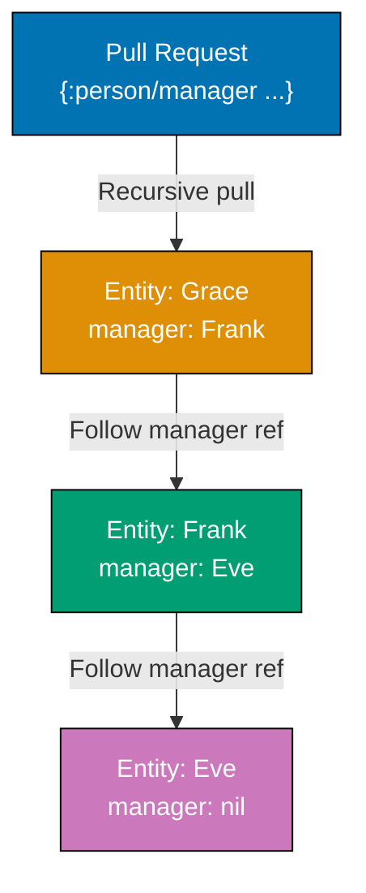

Build on Datomic fundamentals with 30 production-ready examples. Learn advanced pull patterns, query optimization, custom transaction functions, index usage, and real-world application patterns.

## Example 31: Pull API with Recursive Patterns

Pull patterns can recursively traverse entity graphs. Essential for tree structures and deep entity hierarchies.



**Code**:

```clojure
(def db (d/db conn))

;; Pull with bounded recursion
(d/pull db
  '[:person/name
    {:person/manager 2}]
  [:person/email "grace@example.com"])
;; => {:person/name "Grace Kim"
;;     :person/manager {:person/name "Frank Lee"
;;                      :person/manager {:person/name "Eve Johnson"}}}
;; => {:person/manager N} recursively follows manager references N levels deep

;; Pull with unbounded recursion
(d/pull db
  '[:person/name
    {:person/manager ...}]
  [:person/email "grace@example.com"])
;; => Follows manager references until no more managers
;; => ... means "recurse indefinitely"
;; => Returns nested maps up the management chain

;; Pull reverse references recursively
(d/pull db
  '[{:person/_manager ...}]
  [:person/email "eve@example.com"])
;; => {:person/_manager
;;     [{:person/name "Frank Lee"
;;       :person/_manager [{:person/name "Grace Kim"}]}]}
;; => Recursively pulls all reports (direct and indirect)
```

**Key Takeaway**: Pull API supports bounded (`{:attr N}`) and unbounded (`{:attr ...}`) recursion. Use it to traverse hierarchies without writing complex queries.

---

## Example 32: Pull Map Specifications for Aliasing

Pull patterns can rename attributes in results using map specifications. Useful for API responses and data shaping.

**Code**:

```clojure
;; Pull with attribute aliases
(d/pull db
  '[(:person/name :as :fullName)
    (:person/email :as :emailAddress)
    (:person/age :as :yearsOld)]
  [:person/email "alice@example.com"])
;; => {:fullName "Alice Johnson"
;;     :emailAddress "alice@example.com"
;;     :yearsOld 33}
;; => (:attribute :as :new-key) renames attribute in result

;; Pull with default and limit
(d/pull db
  '[(default :person/phone "No phone")
    (limit :person/favorite-colors 2)]
  [:person/email "alice@example.com"])
;; => {:person/phone "No phone"
;;     :person/favorite-colors #{"blue" "green"}}
;; => (default :attr value) provides fallback when attribute absent
;; => (limit :attr n) returns max n values from cardinality-many attribute
```

**Key Takeaway**: Pull patterns support aliasing (`:as`), defaults, and limits. Use them to shape data precisely for application needs.

---

## Example 33: Custom Aggregate Functions

Define custom aggregates beyond built-in `count`, `sum`, etc. Implement domain-specific calculations.

**Code**:

```clojure
;; Custom aggregate: standard deviation
(defn std-dev
  [vals]
  (let [n (count vals)
        mean (/ (reduce + vals) n)
        variance (/ (reduce + (map #(Math/pow (- % mean) 2) vals)) n)]
    (Math/sqrt variance)))

;; Register as aggregate in query
(d/q '[:find (my-ns/std-dev ?age)
       :where [?e :person/age ?age]]
     db)
;; => [[2.449...]]
;; => (namespace/function ?var) calls custom aggregate
;; => Function receives collection of all ?age values

;; Custom aggregate: concatenate strings
(defn concat-names
  [names]
  (clojure.string/join ", " (sort names)))

(d/q '[:find (my-ns/concat-names ?name)
       :where [?e :person/name ?name]]
     db)
;; => [["Alice Johnson, Bob Smith, Dave Lee, ..."]]
;; => Aggregates can return any type
```

**Key Takeaway**: Use namespaced functions as custom aggregates in queries. Aggregates receive collections of values and return summary results.

---

## Example 34: Index Access with datoms API

Directly access Datomic indexes for low-level queries and performance optimization. Four indexes: EAVT, AEVT, AVET, VAET.

**Code**:

```clojure
;; EAVT: Entity-Attribute-Value-Transaction (primary index)
(def eavt-datoms
  (d/datoms db :eavt [:person/email "alice@example.com"]))
;; => Lazy sequence of datoms for specific entity
;; => Datom: [entity-id attribute value tx-id added?]

(take 3 eavt-datoms)
;; => (#datom[17592186045418 :person/name "Alice Johnson" 13194139534313 true]
;;     #datom[17592186045418 :person/email "alice@example.com" 13194139534313 true]
;;     #datom[17592186045418 :person/age 33 13194139534320 true])
;; => Shows all attributes for Alice

;; AVET: Attribute-Value-Entity-Transaction (value lookup)
(def avet-datoms
  (d/datoms db :avet :person/age 28))
;; => Finds all entities with age = 28
;; => Efficient for value-based lookups

(map #(d/entity db (:e %)) avet-datoms)
;; => (entity-for-bob ...)
;; => Convert datoms to entities

;; AEVT: Attribute-Entity-Value-Transaction (attribute scan)
(def aevt-datoms
  (d/datoms db :aevt :person/name))
;; => All entities with :person/name attribute
;; => Useful for "find all entities of type X" queries
```

**Key Takeaway**: `datoms` API provides direct index access. Use EAVT for entity scans, AVET for value lookups, AEVT for attribute scans. Lower-level than queries but more control.

---

## Example 35: Index Range Queries

Index-range queries efficiently find datoms within value ranges. Essential for numeric, string, and temporal queries.

**Code**:

```clojure
;; Find people with ages between 28 and 32 (inclusive)
(d/index-range db :person/age 28 32)
;; => Lazy sequence of datoms with age in [28, 32]
;; => More efficient than query with predicate for large datasets

;; Extract entities from range
(map (fn [datom] [(:v datom) (:e datom)])
     (d/index-range db :person/age 28 32))
;; => ([28 entity-id-bob] [33 entity-id-alice])
;; => (:v datom) gets value, (:e datom) gets entity ID

;; String prefix search
(d/index-range db :person/name "A" "B")
;; => Finds all names starting with "A" (up to but not including "B")
;; => String ranges useful for prefix searches
```

**Key Takeaway**: `index-range` efficiently queries value ranges using indexes. Use it for numeric ranges, string prefixes, and temporal windows.

---

## Example 36: Upsert with :db/unique :db.unique/identity

Attributes marked `:db.unique/identity` enable upserts. Transactions automatically update existing entities or create new ones.

**Code**:

```clojure
;; Initial transaction (creates new entity)
@(d/transact conn
   [{:person/email "igor@example.com"
     :person/name "Igor Volkov"
     :person/age 40}])

(def db (d/db conn))
(d/q '[:find ?age . :where [?e :person/email "igor@example.com"] [?e :person/age ?age]] db)
;; => 40

;; Upsert (updates existing entity)
@(d/transact conn
   [{:person/email "igor@example.com"
     :person/age 41}])
;; => Matches existing entity by :person/email (unique identity)
;; => Updates age from 40 to 41 (doesn't create duplicate)

(def db (d/db conn))
(d/q '[:find ?age . :where [?e :person/email "igor@example.com"] [?e :person/age ?age]] db)
;; => 41

;; Upsert creates if not exists
@(d/transact conn
   [{:person/email "judy@example.com"
     :person/name "Judy Chen"
     :person/age 29}])
;; => No existing entity with judy@example.com
;; => Creates new entity
```

**Key Takeaway**: `:db.unique/identity` enables upserts. Transactions update existing entities if unique attribute matches, create new ones otherwise. Eliminates manual existence checks.

---

## Example 37: Batch Transactions for Performance

Batch multiple operations in single transactions for better performance and atomicity.

**Code**:

```clojure
;; Generate batch data
(def batch-people
  (for [i (range 1000)]
    {:person/email (str "user" i "@example.com")
     :person/name (str "User " i)
     :person/age (+ 20 (rand-int 40))}))

;; Single transaction with 1000 entities
(time
  @(d/transact conn batch-people))
;; => "Elapsed time: 120 msecs" (example)
;; => Much faster than 1000 individual transactions
;; => All 1000 entities created atomically

;; Verify batch insert
(def db (d/db conn))
(d/q '[:find (count ?e) . :where [?e :person/email]] db)
;; => 1008 (original people + 1000 batch)
```

**Key Takeaway**: Batch operations in single transactions for performance and atomicity. Datomic handles thousands of datoms per transaction efficiently.

---

## Example 38: Retract Attribute Values Selectively

Retract specific values from cardinality-many attributes without removing the attribute entirely.

**Code**:

```clojure
;; Alice has favorite colors: blue, green, purple
(def db (d/db conn))
(:person/favorite-colors (d/entity db [:person/email "alice@example.com"]))
;; => #{"blue" "green" "purple"}

;; Retract only "blue"
@(d/transact conn
   [[:db/retract [:person/email "alice@example.com"] :person/favorite-colors "blue"]])

;; Verify selective retraction
(def db (d/db conn))
(:person/favorite-colors (d/entity db [:person/email "alice@example.com"]))
;; => #{"green" "purple"}
;; => "blue" removed, others remain

;; Add new color
@(d/transact conn
   [[:db/add [:person/email "alice@example.com"] :person/favorite-colors "red"]])

(:person/favorite-colors (d/entity (d/db conn) [:person/email "alice@example.com"]))
;; => #{"green" "purple" "red"}
```

**Key Takeaway**: `:db/retract` works on individual values of cardinality-many attributes. Add and retract specific set members without touching others.

---

## Example 39: Transaction Functions for Complex Logic

Transaction functions execute inside transactions with access to database value. Enable complex conditional logic.

**Code**:

```clojure
;; Define transaction function in database
(def increment-age-fn
  {:db/ident :my/increment-age
   :db/fn (d/function
            '{:lang :clojure
              :params [db email]
              :code (let [person (d/entity db [:person/email email])
                          current-age (:person/age person)]
                      [[:db/add [:person/email email]
                                :person/age
                                (inc current-age)]])})})

@(d/transact conn [increment-age-fn])
;; => Stores function in database
;; => :db/fn attribute holds function definition

;; Call transaction function
(def db (d/db conn))
(:person/age (d/entity db [:person/email "alice@example.com"]))
;; => 33

@(d/transact conn [[:my/increment-age "alice@example.com"]])
;; => Invokes function inside transaction
;; => Function reads current age, generates transaction data

(:person/age (d/entity (d/db conn) [:person/email "alice@example.com"]))
;; => 34
```

**Key Takeaway**: Transaction functions enable complex conditional logic inside transactions. Define once, invoke by :db/ident. Functions see current database state.

---

## Example 40: with for Speculative Transactions

`with` applies transactions to database value without committing. Test transaction effects before committing.

**Code**:

```clojure
(def db (d/db conn))

;; Speculative transaction
(def speculative-db
  (:db-after (d/with db
               [{:person/email "test@example.com"
                 :person/name "Test User"
                 :person/age 25}])))
;; => with returns same structure as transact but doesn't commit
;; => (:db-after ...) is hypothetical database value

;; Query speculative database
(d/q '[:find ?name . :where [?e :person/email "test@example.com"] [?e :person/name ?name]]
     speculative-db)
;; => "Test User"
;; => Data exists in speculative database

;; Original database unchanged
(d/q '[:find ?name . :where [?e :person/email "test@example.com"] [?e :person/name ?name]]
     db)
;; => nil
;; => Original database has no test user

;; Use with for validation
(defn validate-transaction [tx-data]
  (try
    (let [result (d/with (d/db conn) tx-data)]
      {:valid true :db-after (:db-after result)})
    (catch Exception e
      {:valid false :error (.getMessage e)})))

(validate-transaction [{:person/email "duplicate@example.com"
                        :person/name "Duplicate"}])
;; => {:valid true :db-after ...}
;; => Transaction would succeed
```

**Key Takeaway**: `with` creates hypothetical database values by applying transactions speculatively. Use it for validation, testing, and what-if analysis.

---

## Example 41: Exploring Transaction Log

The transaction log contains every transaction in chronological order. Essential for replication, auditing, event sourcing.

**Code**:

```clojure
;; Get transaction log
(def log (d/log conn))
;; => Log is append-only structure of all transactions

;; Read recent transactions
(def recent-txs (d/tx-range log nil nil))
;; => Lazy sequence of transaction maps
;; => nil nil means "from beginning to end"

;; Examine first transaction
(def first-tx (first recent-txs))
(:t first-tx)
;; => Transaction's basis-t value

(:data first-tx)
;; => Vector of datoms added in this transaction
;; => [#datom[entity attr value tx added?] ...]

;; Filter transactions by time range
(def tx-id-start (d/t->tx 1000))
(def tx-id-end (d/t->tx 2000))
(def time-range-txs (d/tx-range log tx-id-start tx-id-end))
;; => Transactions between basis-t 1000 and 2000
```

**Key Takeaway**: Transaction log provides append-only history of all transactions. Use `tx-range` to read transaction ranges for replication, auditing, and event processing.

---

## Example 42: Partial Queries with Blank Variables

Use `_` (blank/underscore) to pattern-match without binding variables. Improves query performance when values aren't needed.

**Code**:

```clojure
;; Find people with any age (don't need age value)
(d/q '[:find ?name
       :where [?e :person/name ?name]
              [?e :person/age _]]
     db)
;; => Returns names of people who have age attribute
;; => _ matches any value but doesn't bind it
;; => More efficient than binding unused variable

;; Find entities with at least 3 attributes
(d/q '[:find ?e
       :where [?e :person/name _]
              [?e :person/email _]
              [?e :person/age _]]
     db)
;; => Finds entities with all three attributes
;; => Doesn't bind attribute values (not needed)
```

**Key Takeaway**: Use `_` to match patterns without binding values. Improves performance by avoiding unnecessary variable bindings.

---

## Example 43: Query Pagination with :offset and :limit

Paginate large result sets using `:offset` and `:limit` in find specs (Datomic Pro/Cloud feature).

**Code**:

```clojure
;; Note: :offset and :limit require Datomic Pro or Cloud
;; For Datomic Free, implement pagination in application code

;; Application-level pagination
(defn paginate-results [query-results page-size page-num]
  (->> query-results
       (drop (* page-size (dec page-num)))
       (take page-size)))

;; Get all people
(def all-people
  (d/q '[:find ?name ?email
         :where [?e :person/name ?name]
                [?e :person/email ?email]]
       db))

;; Page 1 (first 10 results)
(paginate-results all-people 10 1)
;; => First 10 people

;; Page 2 (next 10 results)
(paginate-results all-people 10 2)
;; => Results 11-20
```

**Key Takeaway**: Datomic Free requires application-level pagination. Datomic Pro/Cloud support `:offset` and `:limit` in queries for database-level pagination.

---

## Example 44: Full-Text Search Patterns

Datomic supports full-text search on string attributes marked with `:db/fulltext`.

**Code**:

```clojure
;; Add fulltext attribute
@(d/transact conn
   [{:db/ident       :person/bio
     :db/valueType   :db.type/string
     :db/cardinality :db.cardinality/one
     :db/fulltext    true
     :db/doc         "Person biography (fulltext searchable)"}])

;; Add bios
@(d/transact conn
   [{:person/email "alice@example.com"
     :person/bio "Software engineer passionate about functional programming and databases"}
    {:person/email "bob@example.com"
     :person/bio "Product manager with experience in e-commerce and retail"}])

;; Fulltext search
(def db (d/db conn))
(d/q '[:find ?name ?bio
       :in $ ?search
       :where [(fulltext $ :person/bio ?search) [[?e ?bio]]]
              [?e :person/name ?name]]
     db
     "functional programming")
;; => #{["Alice Johnson" "Software engineer passionate about functional programming and databases"]}
;; => (fulltext $ attr search-term) finds matches
;; => Returns [entity text-value] tuples
```

**Key Takeaway**: Mark attributes with `:db/fulltext true` for full-text search. Use `fulltext` predicate in queries to search text content.

---

## Example 45: Auditing with Transaction Times

Query transaction times to build audit trails. Every fact is timestamped with its transaction.

**Code**:

```clojure
;; Query when Alice's age was last updated
(d/q '[:find ?tx ?instant
       :where [?e :person/email "alice@example.com"]
              [?e :person/age _ ?tx]
              [?tx :db/txInstant ?instant]]
     db)
;; => [[tx-id #inst "2026-01-29T12:34:56.789-00:00"]]
;; => ?tx is transaction entity ID
;; => :db/txInstant is transaction timestamp

;; Find all changes to Alice in last hour
(def one-hour-ago
  (java.util.Date. (- (.getTime (java.util.Date.)) (* 60 60 1000))))

(d/q '[:find ?attr ?value ?instant
       :in $ ?email ?since
       :where [?e :person/email ?email]
              [?e ?a ?value ?tx]
              [?tx :db/txInstant ?instant]
              [(> ?instant ?since)]
              [?a :db/ident ?attr]]
     db
     "alice@example.com"
     one-hour-ago)
;; => Returns all attribute changes in last hour with timestamps
```

**Key Takeaway**: Every fact is timestamped via transaction entity's `:db/txInstant`. Query transaction times for audit trails and change tracking.

---

## Example 46: Cardinality-Many Refs for Many-to-Many

Combine cardinality-many with ref attributes to model many-to-many relationships.

**Code**:

```clojure
;; Define project schema
@(d/transact conn
   [{:db/ident       :project/name
     :db/valueType   :db.type/string
     :db/cardinality :db.cardinality/one
     :db/unique      :db.unique/identity}
    {:db/ident       :project/members
     :db/valueType   :db.type/ref
     :db/cardinality :db.cardinality/many
     :db/doc         "Project members (many-to-many with persons)"}])

;; Create projects with members
@(d/transact conn
   [{:project/name "Project Alpha"
     :project/members [[:person/email "alice@example.com"]
                       [:person/email "bob@example.com"]]}
    {:project/name "Project Beta"
     :project/members [[:person/email "alice@example.com"]
                       [:person/email "dave@example.com"]]}])

;; Query: Find all projects for Alice
(def db (d/db conn))
(d/q '[:find ?project-name
       :where [?p :person/email "alice@example.com"]
              [?proj :project/members ?p]
              [?proj :project/name ?project-name]]
     db)
;; => #{["Project Alpha"] ["Project Beta"]}
;; => Alice is in both projects

;; Query: Find all members of Project Alpha
(d/q '[:find ?member-name
       :where [?proj :project/name "Project Alpha"]
              [?proj :project/members ?member]
              [?member :person/name ?member-name]]
     db)
;; => #{["Alice Johnson"] ["Bob Smith"]}
```

**Key Takeaway**: Cardinality-many ref attributes model many-to-many relationships naturally. Query in both directions using standard datalog patterns.

---

## Example 47: Attribute Predicates for Type Filtering

Filter entities by attribute presence to simulate entity types without explicit type attributes.

**Code**:

```clojure
;; Find all "person" entities (have :person/name)
(d/q '[:find ?e
       :where [?e :person/name]]
     db)
;; => Returns all person entity IDs
;; => Attribute presence implies type

;; Find all "project" entities
(d/q '[:find ?e
       :where [?e :project/name]]
     db)
;; => Returns all project entity IDs

;; Polymorphic query: entities with name (person OR project)
(d/q '[:find ?name
       :where (or [?e :person/name ?name]
                  [?e :project/name ?name])]
     db)
;; => Returns names from both persons and projects
;; => Datomic uses attribute namespaces to organize, not enforce types
```

**Key Takeaway**: Datomic is schema-flexible. Use attribute presence to identify entity types, or define explicit type attributes as needed.

---

## Example 48: Optimizing Queries with Index Selection

Understand how Datomic selects indexes to optimize query performance.

**Code**:

```clojure
;; Inefficient: starts with unbound variable
(time
  (d/q '[:find ?name
         :where [?e :person/age ?age]
                [(> ?age 30)]
                [?e :person/name ?name]]
       db))
;; => Scans all ages, then filters, then joins to names
;; => Slower on large datasets

;; Efficient: start with most selective pattern
(time
  (d/q '[:find ?name
         :where [?e :person/name ?name]
                [?e :person/age ?age]
                [(> ?age 30)]]
       db))
;; => Scans names first (uses AEVT index), then filters by age
;; => Generally faster due to better index usage

;; Most efficient: use indexed value if available
(time
  (d/q '[:find ?name
         :where [?e :person/email "alice@example.com"]
                [?e :person/name ?name]]
       db))
;; => Uses AVET index on unique :person/email
;; => Near-instant lookup
```

**Key Takeaway**: Query clause order affects performance. Start with most selective patterns, especially those using unique attributes or specific values. Datomic optimizes automatically but clause order helps.

---

## Example 49: Entity Maps vs Explicit Transaction Data

Choose between entity maps (convenient) and explicit datoms (precise control) for transactions.

**Code**:

```clojure
;; Entity map syntax (convenient for create/update)
@(d/transact conn
   [{:person/email "kyle@example.com"
     :person/name "Kyle Brown"
     :person/age 31}])
;; => Concise, readable
;; => Automatically generates :db/add operations

;; Explicit datom syntax (precise control)
(def kyle-id [:person/email "kyle@example.com"])
@(d/transact conn
   [[:db/add kyle-id :person/age 32]
    [:db/retract kyle-id :person/age 31]])
;; => Explicit operations: add new value, retract old value
;; => More verbose but complete control

;; Mix both styles
@(d/transact conn
   [{:person/email "lisa@example.com"
     :person/name "Lisa Wong"}
    [:db/add [:person/email "lisa@example.com"] :person/age 27]])
;; => Entity map creates/updates
;; => Explicit datom adds additional attribute
```

**Key Takeaway**: Entity maps are concise for create/update operations. Explicit datoms provide precise control for retractions and conditional logic. Mix styles as needed.

---

## Example 50: Querying Across Time with Multiple Database Values

Compare database states at different times using multiple database inputs.

**Code**:

```clojure
;; Capture database at two points in time
(def db-t1 (d/db conn))

@(d/transact conn
   [{:person/email "alice@example.com"
     :person/age 34}
    {:person/email "bob@example.com"
     :person/age 30}])

(def db-t2 (d/db conn))

;; Query differences between time points
(d/q '[:find ?name ?age-before ?age-after
       :in $before $after
       :where [$before ?e :person/name ?name]
              [$before ?e :person/age ?age-before]
              [$after ?e :person/age ?age-after]
              [(not= ?age-before ?age-after)]]
     db-t1
     db-t2)
;; => #{["Alice Johnson" 33 34] ["Bob Smith" 28 30]}
;; => Shows entities where age changed between t1 and t2
```

**Key Takeaway**: Query across multiple database values to compare states over time. Essential for audit logs, change detection, and temporal analysis.

---

## Example 51: Tuple Types for Composite Values

Tuple types store fixed-size composite values in single attributes (Datomic Cloud/Pro feature).

**Code**:

```clojure
;; Note: Tuples require Datomic Cloud or Pro
;; For Datomic Free, use multiple attributes or refs

;; Composite value pattern (Datomic Free alternative)
@(d/transact conn
   [{:db/ident       :person/location-lat
     :db/valueType   :db.type/double
     :db/cardinality :db.cardinality/one}
    {:db/ident       :person/location-lon
     :db/valueType   :db.type/double
     :db/cardinality :db.cardinality/one}])

@(d/transact conn
   [{:person/email "alice@example.com"
     :person/location-lat 45.5231
     :person/location-lon -122.6765}])

;; Query both coordinates
(d/q '[:find ?lat ?lon
       :where [?e :person/email "alice@example.com"]
              [?e :person/location-lat ?lat]
              [?e :person/location-lon ?lon]]
     db)
;; => [[45.5231 -122.6765]]
```

**Key Takeaway**: Datomic Free uses multiple attributes for composite values. Datomic Cloud/Pro offer tuple types for fixed-size composite attributes.

---

## Example 52: Query Bindings with Collections

Bind collections in `:in` clause for parameterized queries over multiple values.

**Code**:

```clojure
;; Relation binding: rows of data
(d/q '[:find ?person-name ?project-name
       :in $ [[?person-email ?project-name]]
       :where [?p :person/email ?person-email]
              [?p :person/name ?person-name]]
     db
     [["alice@example.com" "Project Alpha"]
      ["bob@example.com" "Project Beta"]
      ["dave@example.com" "Project Gamma"]])
;; => #{["Alice Johnson" "Project Alpha"]
;;      ["Bob Smith" "Project Beta"]
;;      ["Dave Lee" "Project Gamma"]}
;; => [[binding]] passes relation (table of rows)
;; => Each row binds multiple variables

;; Tuple binding: single row
(d/q '[:find ?name ?age
       :in $ [?email ?expected-age]
       :where [?e :person/email ?email]
              [?e :person/name ?name]
              [?e :person/age ?age]
              [(= ?age ?expected-age)]]
     db
     ["alice@example.com" 34])
;; => #{["Alice Johnson" 34]}
;; => [binding] passes single tuple
```

**Key Takeaway**: Use `[[binding]]` for relations (multiple rows), `[binding]` for tuples (single row), `[binding ...]` for collections. Powerful for parameterized queries.

---

## Example 53: Conditional Retractions with CAS

Use `:db/cas` to conditionally retract values, ensuring correctness in concurrent environments.

**Code**:

```clojure
;; Current state: Alice is 34
(def db (d/db conn))
(:person/age (d/entity db [:person/email "alice@example.com"]))
;; => 34

;; CAS retraction: remove age only if it's 34
@(d/transact conn
   [[:db/cas [:person/email "alice@example.com"] :person/age 34 nil]])
;; => Retracts age (sets to nil) only if current value is 34
;; => Transaction succeeds

;; Verify retraction
(def db (d/db conn))
(:person/age (d/entity db [:person/email "alice@example.com"]))
;; => nil
;; => Age retracted

;; CAS retraction with wrong value fails
@(d/transact conn
   [{:person/email "bob@example.com"
     :person/age 30}])

(try
  @(d/transact conn
     [[:db/cas [:person/email "bob@example.com"] :person/age 28 nil]])
  (catch Exception e
    "CAS failed"))
;; => "CAS failed"
;; => Current age is 30, not 28 - retraction aborted
```

**Key Takeaway**: Use `:db/cas` with `nil` as new value for conditional retractions. Ensures safe concurrent operations.

---

## Example 54: Database Filters for Tenant Isolation

Database filters limit query visibility to subset of facts. Useful for multi-tenancy and security.

**Code**:

```clojure
;; Add tenant attribute
@(d/transact conn
   [{:db/ident       :person/tenant
     :db/valueType   :db.type/string
     :db/cardinality :db.cardinality/one}])

@(d/transact conn
   [{:person/email "alice@example.com"
     :person/tenant "acme"}
    {:person/email "bob@example.com"
     :person/tenant "globex"}])

;; Create filtered database (only Acme tenant)
(def acme-db
  (d/filter (d/db conn)
    (fn [db datom]
      (let [e (:e datom)
            tenant-attr (d/entid db :person/tenant)]
        (or (not= (:a datom) tenant-attr)
            (= (:v datom) "acme"))))))
;; => Filter function sees each datom
;; => Return true to include, false to exclude

;; Query filtered database
(d/q '[:find ?name
       :where [?e :person/name ?name]]
     acme-db)
;; => #{["Alice Johnson"]}
;; => Only Acme tenant data visible
```

**Key Takeaway**: Database filters restrict query visibility without changing underlying data. Essential for multi-tenancy, security, and data partitioning.

---

## Example 55: Caching Database Values for Read Performance

Database values are immutable - cache them for read-heavy workloads without stale data risk.

**Code**:

```clojure
;; Cache database value
(def cached-db (d/db conn))
;; => Immutable value - safe to cache indefinitely

;; Read from cache (no connection overhead)
(defn get-person-by-email [db email]
  (d/pull db '[*] [:person/email email]))

(get-person-by-email cached-db "alice@example.com")
;; => {:person/name "Alice Johnson" :person/email "alice@example.com" ...}
;; => Reading from cached db value

;; New transaction
@(d/transact conn
   [{:person/email "new-person@example.com"
     :person/name "New Person"}])

;; Cached db doesn't see new data (as expected)
(get-person-by-email cached-db "new-person@example.com")
;; => nil
;; => Cached db is snapshot from before transaction

;; Refresh cache to see new data
(def cached-db (d/db conn))
(get-person-by-email cached-db "new-person@example.com")
;; => {:person/name "New Person" ...}
;; => New cache sees updated data
```

**Key Takeaway**: Database values are immutable - cache them freely. Refresh cache when you need to see new transactions. Trade freshness for performance.

---

## Example 56: Query Statistics and Profiling

Understand query performance characteristics for optimization.

**Code**:

```clojure
;; Enable query statistics (Datomic Pro/Cloud)
;; For Datomic Free, use time macro for basic timing

;; Simple timing
(time
  (count (d/q '[:find ?e :where [?e :person/name]] db)))
;; => "Elapsed time: 2.4 msecs"
;; => 1008 entities scanned

;; Measure index access
(time
  (count (d/datoms db :aevt :person/name)))
;; => "Elapsed time: 1.1 msecs"
;; => Direct index access faster than query

;; Benchmark pull vs query
(time
  (dotimes [_ 1000]
    (d/pull db '[*] [:person/email "alice@example.com"])))
;; => Measure pull performance

(time
  (dotimes [_ 1000]
    (d/q '[:find ?name .
           :where [?e :person/email "alice@example.com"]
                  [?e :person/name ?name]]
         db)))
;; => Compare with equivalent query
```

**Key Takeaway**: Profile queries with `time` (Datomic Free) or query statistics (Pro/Cloud). Compare approaches to identify performance bottlenecks.

---

## Example 57: Entity Validation with Specs

Use Clojure specs to validate entities before transactions.

**Code**:

```clojure
(require '[clojure.spec.alpha :as s])

;; Define specs for person entity
(s/def :person/name string?)
(s/def :person/email (s/and string? #(re-matches #".+@.+\..+" %)))
(s/def :person/age (s/int-in 0 150))
(s/def ::person (s/keys :req [:person/name :person/email]
                        :opt [:person/age]))

;; Validation function
(defn validate-person [person-data]
  (if (s/valid? ::person person-data)
    {:valid true}
    {:valid false :errors (s/explain-data ::person person-data)}))

;; Valid entity
(validate-person {:person/name "Valid Person"
                  :person/email "valid@example.com"
                  :person/age 30})
;; => {:valid true}

;; Invalid entity (bad email)
(validate-person {:person/name "Invalid Person"
                  :person/email "not-an-email"})
;; => {:valid false :errors {...}}

;; Validate before transaction
(defn safe-transact [conn data]
  (let [validation (validate-person data)]
    (if (:valid validation)
      @(d/transact conn [data])
      (throw (ex-info "Validation failed" (:errors validation))))))
```

**Key Takeaway**: Use Clojure specs for entity validation before transactions. Catch data quality issues early and provide clear error messages.

---

## Example 58: Composite Unique Constraints

Ensure uniqueness across multiple attributes using transaction functions (Datomic lacks built-in composite unique constraints).

**Code**:

```clojure
;; Transaction function for composite unique check
(def ensure-unique-email-tenant
  {:db/ident :my/ensure-unique-email-tenant
   :db/fn (d/function
            '{:lang :clojure
              :params [db email tenant]
              :code (let [existing (d/q '[:find ?e .
                                          :in $ ?email ?tenant
                                          :where [?e :person/email ?email]
                                                 [?e :person/tenant ?tenant]]
                                        db email tenant)]
                      (when existing
                        (throw (ex-info "Duplicate email-tenant combination"
                                        {:email email :tenant tenant})))
                      ;; Return empty tx-data (validation passed)
                      [])})})

@(d/transact conn [ensure-unique-email-tenant])

;; Use in transaction
@(d/transact conn
   [[:my/ensure-unique-email-tenant "new@example.com" "acme"]
    {:person/email "new@example.com"
     :person/tenant "acme"
     :person/name "New User"}])
;; => Succeeds (no duplicate)

;; Attempt duplicate
(try
  @(d/transact conn
     [[:my/ensure-unique-email-tenant "new@example.com" "acme"]
      {:person/email "new@example.com"
       :person/tenant "acme"
       :person/name "Duplicate User"}])
  (catch Exception e
    (.getMessage e)))
;; => "Duplicate email-tenant combination"
;; => Transaction rejected
```

**Key Takeaway**: Implement composite unique constraints using transaction functions. Check for duplicates inside transaction before asserting data.

---

## Example 59: Incremental Index Building

Build domain-specific indexes incrementally using transaction listeners (Datomic Pro/Cloud).

**Code**:

```clojure
;; For Datomic Free, poll for new transactions periodically

(def last-processed-t (atom 0))

(defn process-new-transactions [conn]
  (let [db (d/db conn)
        current-t (d/basis-t db)
        since-db (d/since db @last-processed-t)]
    ;; Process new datoms
    (doseq [datom (d/datoms since-db :eavt)]
      (when (= (:a datom) (d/entid db :person/age))
        (println "Age change detected:" (:e datom) "->" (:v datom))))
    ;; Update checkpoint
    (reset! last-processed-t current-t)))

;; Run periodically (e.g., every second)
;; (process-new-transactions conn)

;; Example output after age change:
;; Age change detected: 17592186045418 -> 35
```

**Key Takeaway**: Use `since` and `basis-t` to process new transactions incrementally. Build domain-specific indexes, caches, or trigger side effects from database changes.

---

## Example 60: Testing with In-Memory Databases

Create disposable in-memory databases for tests. Fast, isolated, no cleanup required.

**Code**:

```clojure
(defn test-db-fixture []
  (let [uri (str "datomic:mem://test-" (java.util.UUID/randomUUID))
        _ (d/create-database uri)
        conn (d/connect uri)]
    ;; Install schema
    @(d/transact conn person-schema)
    conn))

;; Use in tests
(defn test-person-creation []
  (let [conn (test-db-fixture)]
    ;; Test transaction
    @(d/transact conn
       [{:person/name "Test User"
         :person/email "test@example.com"
         :person/age 25}])
    ;; Verify
    (let [db (d/db conn)]
      (assert (= "Test User"
                 (:person/name (d/entity db [:person/email "test@example.com"])))))
    ;; Database automatically disposed when conn goes out of scope
    :test-passed))

(test-person-creation)
;; => :test-passed
```

**Key Takeaway**: In-memory databases provide fast, isolated test environments. Create new database per test, no cleanup needed. Essential for reliable, reproducible testing.

---

These 30 intermediate examples cover production patterns, performance optimization, advanced queries, and real-world Datomic applications. You're ready for advanced examples covering system integration, distributed patterns, and expert techniques.
