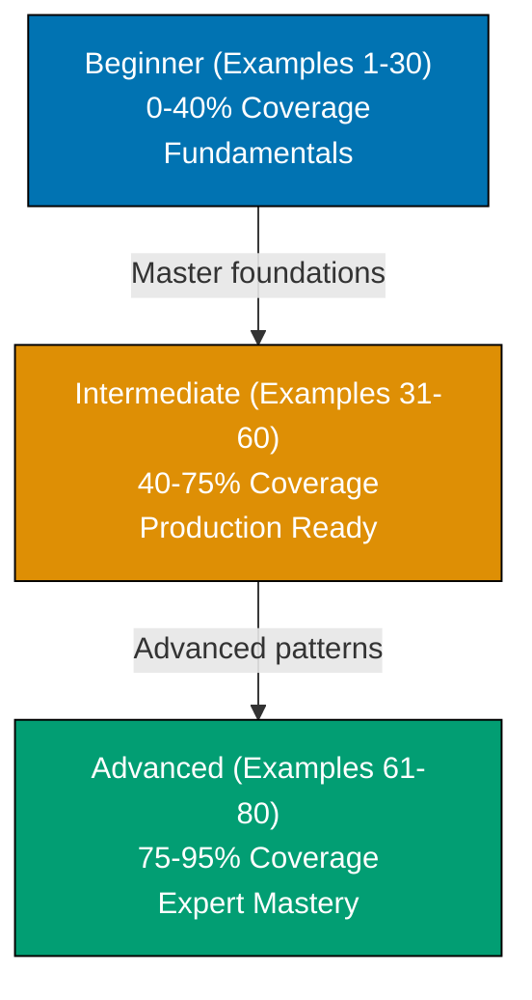

**Want to quickly master Datomic through working examples?** This by-example guide teaches 95% of Datomic through 80 annotated examples in **both Java and Clojure** organized by complexity level.

## What Is By-Example Learning?

By-example learning is an **example-first approach** where you learn through annotated, runnable code rather than narrative explanations. Each example is self-contained, immediately executable with Datomic, and heavily commented to show:

- **What each statement does** - Inline comments explain the purpose and mechanism
- **Expected outputs** - Using `;; =>` notation to show query results
- **Intermediate states** - Database states and data transformations made visible
- **Key takeaways** - 1-2 sentence summaries of core concepts

This approach is **ideal for experienced developers** (seasonal programmers or software engineers) who understand databases or functional programming and want to quickly grasp Datomic's immutable model, datalog queries, and time-travel capabilities through working code.

Unlike narrative tutorials that build understanding through explanation and storytelling, by-example learning lets you **see the code first, run it second, and understand it through direct interaction**. You learn by doing, not by reading about doing.

## Learning Path

The Datomic by-example tutorial guides you through 80 examples organized into three progressive levels, from fundamental concepts to advanced database patterns.



## Coverage Philosophy

This by-example guide provides **95% coverage of Datomic** through practical, annotated examples. The 95% figure represents the depth and breadth of concepts covered, not a time estimate—focus is on **outcomes and understanding**, not duration.

### What's Covered

- **Schema definition** - Attributes with `:db/ident`, `:db/valueType`, `:db/cardinality`, `:db/unique`, `:db/doc`, component attributes
- **Transactions** - Asserting facts with `:db/add`, retracting with `:db/retract`, entity maps, transaction data structures
- **Datalog queries** - Find specs (`:find`, `:where`, `:in`), pattern matching, joins across entities, unification, logic variables
- **Entity API** - Navigating entities as maps, accessing attributes, traversing references, reverse lookups
- **Pull API** - Declarative fetching with pull patterns, wildcards, recursion, component pulls, default values
- **Time queries** - `as-of` for historical queries, `since` for changes, `history` for all datoms, transaction metadata
- **Data types** - Strings, longs, doubles, booleans, instant (dates), UUID, refs (references), keywords, bytes
- **Cardinality** - `:db.cardinality/one` for single values, `:db.cardinality/many` for sets
- **Transactions and functions** - Built-in transaction functions (`:db/cas`, `:db/retractEntity`), custom database functions
- **Indexes** - EAVT, AEVT, AVET, VAET index access, index-range queries
- **Schema evolution** - Adding attributes incrementally, schema migrations, retracting schema
- **Rules** - Recursive datalog rules, parameterized rules, logic programming patterns
- **Aggregates** - Built-in aggregates (`sum`, `count`, `min`, `max`, `avg`), custom aggregate functions
- **Predicates** - Expression clauses, function expressions, filtering in queries
- **Production patterns** - Lookup refs, upserts, tempids, partition management, excision
- **Client API** - Connecting via client library, client vs peer differences
- **Backup and monitoring** - Database snapshots, metrics, connection management

## What This Tutorial Does NOT Cover

**Datomic Cloud-Specific Features**: Ions, analytics support, compute groups - these are Cloud-only extensions

**Storage Backend Configuration**: DynamoDB setup, PostgreSQL configuration, Cassandra tuning - these are infrastructure concerns

**Datomic Pro Enterprise Features**: High availability clusters, horizontal read scaling, multi-region replication - these are operational topics

**Integration Frameworks**: Pedestal integration, Ring middleware, GraphQL adapters - these are application framework concerns

**Deployment Infrastructure**: AWS provisioning, Docker orchestration, Kubernetes StatefulSets - these are DevOps topics

**Datomic Internals**: Storage format, index architecture, transaction log implementation - these are advanced internals beyond practical usage

## How to Use This Guide

1. **Sequential or selective** - Read examples in order for progressive learning, or jump to specific topics when you need a particular feature
2. **Run everything** - Copy and paste examples into your Datomic REPL. Experimentation solidifies understanding.
3. **Modify and explore** - Change queries, add attributes, insert different data, break things intentionally. Learn through experimentation.
4. **Use as reference** - Bookmark examples for quick lookups when you forget syntax or patterns
5. **Complement with narrative tutorials** - By-example learning is code-first; pair with comprehensive tutorials for deeper explanations

**Best workflow**: Open your REPL in one window, this guide in another. Run each example as you read it. When you encounter something unfamiliar, run the example, modify it, see what changes.

**Reference System**: Examples are numbered (1-80) and grouped by level. This numbering appears in other Datomic content at ayokoding.com, allowing you to reference specific examples elsewhere.

## Structure of Each Example

Every example follows a consistent format:

1. **Brief Explanation** (2-3 sentences): What the example demonstrates and why it matters
2. **Mermaid Diagram** (optional): Visual clarification when concept relationships benefit from visualization
3. **Java Implementation**: Heavily annotated Java code with comments explaining each statement
4. **Clojure Implementation**: Heavily annotated Clojure code showing the same concept (using `;; =>` notation for outputs)
5. **Key Takeaway** (1-2 sentences): The core insight you should retain from this example

This structure minimizes context switching - explanation, visual aid, runnable code in both languages, and distilled essence all in one place.

### Dual-Language Approach

**All 80 examples include both Java and Clojure implementations side-by-side.** This allows you to:

- **Learn in your preferred language** - Choose Java or Clojure and focus on those examples
- **Compare idioms** - See how the same Datomic operations look in different languages
- **Switch between languages** - Use Java for production apps while learning Clojure patterns, or vice versa
- **Understand equivalence** - Both APIs access identical Datomic functionality

The Java API and Clojure API are equivalent in power - all Datomic features are available in both languages. Examples demonstrate this equivalence explicitly.

## Execution Environment

All examples use **Datomic Free** for reproducible, accessible execution across all platforms (Windows, macOS, Linux). Datomic Free runs locally via the peer library, requiring no separate server process.

**One-time setup** (run once before starting examples):

**Java Setup:**

```java
// Add to pom.xml (Maven)
<dependency>
  <groupId>com.datomic</groupId>
  <artifactId>datomic-free</artifactId>
  <version>0.9.5697</version>
</dependency>

// Or add to build.gradle (Gradle)
dependencies {
    implementation 'com.datomic:datomic-free:0.9.5697'
}

// Create connection in your Java code
import datomic.Peer;
import datomic.Connection;

String uri = "datomic:mem://tutorial";
Peer.createDatabase(uri);
Connection conn = Peer.connect(uri);
// => conn is your connection for running all examples
```

**Clojure Setup:**

```clojure
;; Add to deps.edn
{:deps {com.datomic/datomic-free {:mvn/version "0.9.5697"}}}

;; Start REPL
clj

;; Load Datomic API
(require '[datomic.api :as d])

;; Create in-memory database
(def uri "datomic:mem://tutorial")
(d/create-database uri)
(def conn (d/connect uri))
;; => conn is your connection for running all examples
```

**Every example is copy-paste runnable** in either language. Each example creates its own database or clearly indicates dependencies on previous examples.

## Relationship to Other Tutorials

This by-example tutorial complements other learning approaches. Choose based on your situation:

| Tutorial Type        | Coverage | Best For                          | Learning Style                       |
| -------------------- | -------- | --------------------------------- | ------------------------------------ |
| **Quick Start**      | 5-30%    | Getting something working quickly | Hands-on with guided structure       |
| **Beginner**         | 0-60%    | Learning from scratch             | Narrative explanations with examples |
| **This: By Example** | 95%      | Rapid depth for experienced devs  | Code-first, minimal explanation      |
| **Cookbook**         | Parallel | Solving specific problems         | Problem-solution recipes             |
| **Advanced**         | 85-95%   | Expert mastery                    | Deep dives and edge cases            |

By-example is ideal if you have programming or database experience. It accelerates learning by leveraging your existing knowledge - you focus on "how Datomic does this" rather than learning database concepts from scratch.

The 95% coverage represents depth and breadth of topics you'll encounter in production Datomic work. It explicitly acknowledges that no tutorial covers everything, but these examples provide the foundation to understand the remaining 5% through official documentation, community resources, and experimentation.

## Prerequisites

**For Java developers:**

- Java 8+ installed (Datomic runs on the JVM)
- Maven or Gradle for dependency management
- Familiarity with Java collections and generics
- IDE with Java support (IntelliJ IDEA, Eclipse, VS Code)

**For Clojure developers:**

- Java 8+ installed (Datomic runs on the JVM)
- Leiningen or Clojure CLI tools for project setup
- Basic Clojure knowledge (let, defn, vectors, maps) or willingness to learn
- Familiarity with REPL-driven development (helpful but not required)

You don't need to understand Datomic's architecture, datalog theory, or distributed systems yet - this tutorial teaches those through examples. Choose your preferred language (Java or Clojure) and follow along with those examples.

## Comparison with By-Example for Other Technologies

Other technologies at ayokoding.com have similar by-example tutorials:

- **PostgreSQL By-Example**: 85 examples covering SQL, indexes, transactions, administration
- **SQL By-Example**: 85 examples covering relational database fundamentals
- **Clojure By-Example**: 85+ examples covering functional programming, macros, concurrency

The Datomic version follows the same philosophy and structure but emphasizes Datomic-specific strengths: immutability, time-travel queries, datalog's expressive power, and the separation of reads from writes.

## Learning Strategies

### For Java Developers

Datomic's Java API provides full access to all features through familiar object-oriented patterns. Focus on schema definition (Examples 1-5), the Peer API (Examples 6-10), and datalog queries (Examples 15-25). The Java examples use standard Java collections (List, Map, Set) for data structures.

### For Clojure Developers

Datomic's datalog queries feel natural in Clojure. Focus on schema definition (Examples 1-5), datalog queries (Examples 15-25), and time queries (Examples 35-45). The Clojure examples leverage immutable data structures and REPL-driven development.

### For SQL Developers

Datomic's datalog differs from SQL but solves similar problems. Focus on query patterns (Examples 15-25), joins (Examples 20-30), and aggregates (Examples 50-60) to see datalog equivalents.

### For Event Sourcing Practitioners

Datomic's immutability aligns with event sourcing principles. Focus on time queries (Examples 35-45), transaction metadata (Examples 40-50), and excision (Examples 70-75).

### For Complete Datomic Beginners

Start from Example 1 and progress through all 30 beginner examples for a structured Datomic foundation.

## Code-First Philosophy

This tutorial prioritizes working code over theoretical discussion:

- **No lengthy prose**: Concepts are demonstrated, not explained at length
- **Runnable examples**: Every example runs with Datomic Free in your preferred language
- **Learn by doing**: Understanding comes from running and modifying code
- **Pattern recognition**: See the same patterns in different contexts across 80 examples
- **Dual-language approach**: All examples provided in both Java and Clojure

If you prefer narrative explanations, consider the **by-concept tutorial** (available separately). By-example learning works best when you learn through experimentation.

## Ready to Start?

Jump into the beginner examples to start learning Datomic through code:

- [Beginner Examples (1-30)](/en/learn/software-engineering/data/databases/datomic/by-example/beginner) - Schema, transactions, entity API, basic datalog
- [Intermediate Examples (31-60)](/en/learn/software-engineering/data/databases/datomic/by-example/intermediate) - Time queries, pull API, rules, aggregates, production patterns
- [Advanced Examples (61-80)](/en/learn/software-engineering/data/databases/datomic/by-example/advanced) - Indexes, custom functions, excision, client API, performance tuning

Each example is self-contained and runnable. Start with Example 1, or jump to topics that interest you most.
