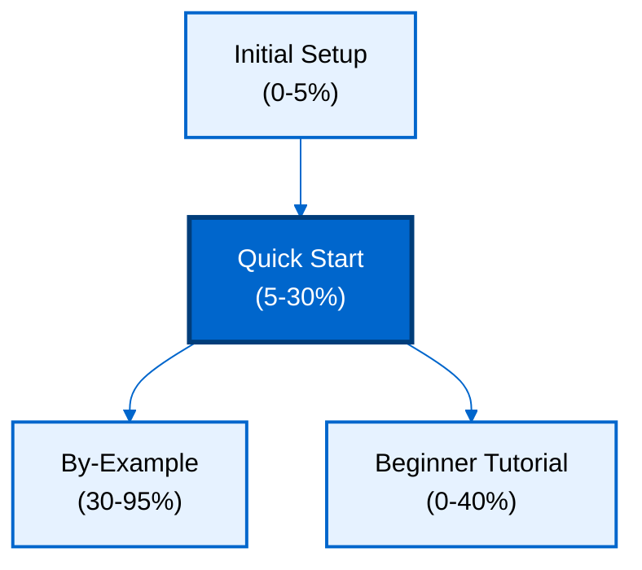

**Want to quickly build applications with immutable data and time-travel queries?** This quick start introduces Datomic's core concepts through a working application. You'll learn schema definition, transactions, datalog queries, and temporal navigation - the essential 5-30% that powers productive Datomic development.

## Prerequisites

Before starting, complete [Initial Setup](/en/learn/software-engineering/data/databases/datomic/initial-setup) to install Datomic Free and verify your environment.

You should have:

- Datomic Free installed and transactor running
- Java 8+ or Clojure environment configured
- Basic understanding of database concepts (tables, queries, relationships)
- Completed "Your First Datomic Program" from Initial Setup

## What You'll Build

You'll create a **blog application** with:

- Posts with titles, content, and authors
- Tags for categorizing posts
- Comments on posts
- Time-travel queries to see historical data
- Transaction metadata for audit trails

This covers 5-30% of Datomic features - enough to build real applications while understanding core concepts.

## Learning Path



## Learning Objectives

By the end of this quick start, you will:

1. **Define schemas** with attributes, cardinality, and value types
2. **Execute transactions** to add, update, and retract facts
3. **Query data** using datalog with pattern matching and joins
4. **Navigate time** with as-of, since, and history queries
5. **Use entity API** for navigation and relationship traversal
6. **Add transaction metadata** for audit trails and context
7. **Query across time** to see how data evolved
8. **Understand immutability** and accumulation of facts

## Schema Definition

Datomic schemas define attributes that describe entities. Unlike SQL, you define attributes independently - not as tables.

### Define Post Schema

**Java**:

```java
import datomic.*;
import java.util.*;

// Schema attributes for blog posts
List<Map<String, Object>> postSchema = Arrays.asList(
    // Post title
    Util.map(
        ":db/ident", ":post/title",
        ":db/valueType", ":db.type/string",
        ":db/cardinality", ":db.cardinality/one",
        ":db/doc", "Post title"
    ),
    // Post content
    Util.map(
        ":db/ident", ":post/content",
        ":db/valueType", ":db.type/string",
        ":db/cardinality", ":db.cardinality/one",
        ":db/doc", "Post content"
    ),
    // Post author (reference to user entity)
    Util.map(
        ":db/ident", ":post/author",
        ":db/valueType", ":db.type/ref",
        ":db/cardinality", ":db.cardinality/one",
        ":db/doc", "Post author"
    ),
    // Post tags (multiple values)
    Util.map(
        ":db/ident", ":post/tags",
        ":db/valueType", ":db.type/string",
        ":db/cardinality", ":db.cardinality/many",
        ":db/doc", "Post tags"
    ),
    // Post published date
    Util.map(
        ":db/ident", ":post/published",
        ":db/valueType", ":db.type/instant",
        ":db/cardinality", ":db.cardinality/one",
        ":db/doc", "Publication timestamp"
    )
);

// Transact schema
Connection conn = Peer.connect("datomic:mem://blog");
conn.transact(postSchema).get();
```

**Clojure**:

```clojure
(require '[datomic.api :as d])

;; Schema attributes for blog posts
(def post-schema
  [;; Post title
   {:db/ident :post/title
    :db/valueType :db.type/string
    :db/cardinality :db.cardinality/one
    :db/doc "Post title"}

   ;; Post content
   {:db/ident :post/content
    :db/valueType :db.type/string
    :db/cardinality :db.cardinality/one
    :db/doc "Post content"}

   ;; Post author (reference to user entity)
   {:db/ident :post/author
    :db/valueType :db.type/ref
    :db/cardinality :db.cardinality/one
    :db/doc "Post author"}

   ;; Post tags (multiple values)
   {:db/ident :post/tags
    :db/valueType :db.type/string
    :db/cardinality :db.cardinality/many
    :db/doc "Post tags"}

   ;; Post published date
   {:db/ident :post/published
    :db/valueType :db.type/instant
    :db/cardinality :db.cardinality/one
    :db/doc "Publication timestamp"}])

;; Transact schema
(def conn (d/connect "datomic:mem://blog"))
@(d/transact conn post-schema)
```

**Key concepts**:

- `:db/ident`: Attribute name (keyword)
- `:db/valueType`: Data type (`:db.type/string`, `:db.type/long`, `:db.type/ref`, `:db.type/instant`)
- `:db/cardinality`: `:db.cardinality/one` (single value) or `:db.cardinality/many` (collection)
- `:db.type/ref`: References another entity (relationships)
- `:db/doc`: Documentation string

### Define User Schema

**Java**:

```java
List<Map<String, Object>> userSchema = Arrays.asList(
    Util.map(
        ":db/ident", ":user/username",
        ":db/valueType", ":db.type/string",
        ":db/cardinality", ":db.cardinality/one",
        ":db/unique", ":db.unique/identity",
        ":db/doc", "Unique username"
    ),
    Util.map(
        ":db/ident", ":user/email",
        ":db/valueType", ":db.type/string",
        ":db/cardinality", ":db.cardinality/one",
        ":db/unique", ":db.unique/value",
        ":db/doc", "User email"
    )
);

conn.transact(userSchema).get();
```

**Clojure**:

```clojure
(def user-schema
  [{:db/ident :user/username
    :db/valueType :db.type/string
    :db/cardinality :db.cardinality/one
    :db/unique :db.unique/identity
    :db/doc "Unique username"}

   {:db/ident :user/email
    :db/valueType :db.type/string
    :db/cardinality :db.cardinality/one
    :db/unique :db.unique/value
    :db/doc "User email"}])

@(d/transact conn user-schema)
```

**Uniqueness constraints**:

- `:db.unique/identity`: Unique identifier (upserts use this)
- `:db.unique/value`: Unique value (prevents duplicates)

## Adding Data with Transactions

Datomic transactions add facts to the database. Facts are never modified or deleted - only accumulated.

### Create Users

**Java**:

```java
// Add users
List<Map<String, Object>> users = Arrays.asList(
    Util.map(
        ":user/username", "alice",
        ":user/email", "alice@example.com"
    ),
    Util.map(
        ":user/username", "bob",
        ":user/email", "bob@example.com"
    )
);

Map txResult = conn.transact(users).get();
Database db = conn.db();

// Find user entity IDs
String query = "[:find ?e :where [?e :user/username \"alice\"]]";
Collection<List<Object>> results = Peer.q(query, db);
Long aliceId = (Long) results.iterator().next().get(0);

System.out.println("Alice ID: " + aliceId);
```

**Clojure**:

```clojure
;; Add users
(def users
  [{:user/username "alice"
    :user/email "alice@example.com"}
   {:user/username "bob"
    :user/email "bob@example.com"}])

(def tx-result @(d/transact conn users))
(def db (d/db conn))

;; Find user entity IDs
(def alice-id
  (ffirst (d/q '[:find ?e
                 :where [?e :user/username "alice"]]
               db)))

(println "Alice ID:" alice-id)
;; Output: Alice ID: 17592186045418
```

**Transaction result**:

- Returns map with `:db-before`, `:db-after`, `:tx-data`, `:tempids`
- `:tempids`: Maps temporary IDs to permanent entity IDs

### Create Posts with Relationships

**Java**:

```java
import java.util.Date;

// Create posts referencing users
List<Map<String, Object>> posts = Arrays.asList(
    Util.map(
        ":post/title", "Getting Started with Datomic",
        ":post/content", "Datomic is an immutable database...",
        ":post/author", aliceId,
        ":post/tags", Arrays.asList("datomic", "database", "tutorial"),
        ":post/published", new Date()
    ),
    Util.map(
        ":post/title", "Time Travel Queries",
        ":post/content", "Query your database at any point in time...",
        ":post/author", aliceId,
        ":post/tags", Arrays.asList("datomic", "temporal"),
        ":post/published", new Date()
    )
);

conn.transact(posts).get();
```

**Clojure**:

```clojure
;; Create posts referencing users
(def posts
  [{:post/title "Getting Started with Datomic"
    :post/content "Datomic is an immutable database..."
    :post/author alice-id
    :post/tags ["datomic" "database" "tutorial"]
    :post/published (java.util.Date.)}

   {:post/title "Time Travel Queries"
    :post/content "Query your database at any point in time..."
    :post/author alice-id
    :post/tags ["datomic" "temporal"]
    :post/published (java.util.Date.)}])

@(d/transact conn posts)
```

**Key concepts**:

- `:post/author` references user entity by ID (`:db.type/ref`)
- `:post/tags` accepts multiple values (`:db.cardinality/many`)
- Relationships are bidirectional (can navigate in both directions)

## Datalog Queries

Datalog is Datomic's declarative query language based on logic programming.

### Find All Posts

**Java**:

```java
// Find all post titles
String query = "[:find ?title :where [?e :post/title ?title]]";
Collection<List<Object>> results = Peer.q(query, db);

for (List<Object> row : results) {
    System.out.println("Post: " + row.get(0));
}
// Output:
// Post: Getting Started with Datomic
// Post: Time Travel Queries
```

**Clojure**:

```clojure
;; Find all post titles
(d/q '[:find ?title
       :where [?e :post/title ?title]]
     db)
;; => #{["Getting Started with Datomic"] ["Time Travel Queries"]}
```

**Query structure**:

- `:find`: Variables to return
- `:where`: Clauses that must be satisfied (patterns)
- `?e`, `?title`: Logic variables (start with `?`)
- `[?e :post/title ?title]`: Pattern matching [entity attribute value]

### Find Posts with Authors

**Java**:

```java
// Find posts with author usernames
String query =
    "[:find ?title ?username " +
    " :where [?post :post/title ?title]" +
    "        [?post :post/author ?author]" +
    "        [?author :user/username ?username]]";

Collection<List<Object>> results = Peer.q(query, db);

for (List<Object> row : results) {
    System.out.println(row.get(0) + " by " + row.get(1));
}
// Output:
// Getting Started with Datomic by alice
// Time Travel Queries by alice
```

**Clojure**:

```clojure
;; Find posts with author usernames
(d/q '[:find ?title ?username
       :where [?post :post/title ?title]
              [?post :post/author ?author]
              [?author :user/username ?username]]
     db)
;; => #{["Getting Started with Datomic" "alice"]
;;      ["Time Travel Queries" "alice"]}
```

**Joins**:

- Join via shared variable (`?post`, `?author`)
- Navigate relationships with `:db.type/ref` attributes
- Automatic bidirectional navigation

### Find Posts by Tag

**Java**:

```java
// Find posts tagged "tutorial"
String query =
    "[:find ?title " +
    " :where [?post :post/tags \"tutorial\"]" +
    "        [?post :post/title ?title]]";

Collection<List<Object>> results = Peer.q(query, db);

for (List<Object> row : results) {
    System.out.println("Tutorial post: " + row.get(0));
}
// Output:
// Tutorial post: Getting Started with Datomic
```

**Clojure**:

```clojure
;; Find posts tagged "tutorial"
(d/q '[:find ?title
       :where [?post :post/tags "tutorial"]
              [?post :post/title ?title]]
     db)
;; => #{["Getting Started with Datomic"]}
```

### Parameterized Queries

**Java**:

```java
// Find posts by specific author (parameterized)
String query =
    "[:find ?title " +
    " :in $ ?username " +
    " :where [?author :user/username ?username]" +
    "        [?post :post/author ?author]" +
    "        [?post :post/title ?title]]";

Collection<List<Object>> results = Peer.q(query, db, "alice");

for (List<Object> row : results) {
    System.out.println("Alice's post: " + row.get(0));
}
```

**Clojure**:

```clojure
;; Find posts by specific author (parameterized)
(d/q '[:find ?title
       :in $ ?username
       :where [?author :user/username ?username]
              [?post :post/author ?author]
              [?post :post/title ?title]]
     db
     "alice")
;; => #{["Getting Started with Datomic"] ["Time Travel Queries"]}
```

**`:in` clause**:

- `$`: Database argument (implicit if omitted)
- `?username`: Query parameter
- Pass parameters after database: `Peer.q(query, db, param1, param2, ...)`

## Entity API

The Entity API provides map-like navigation through entities and relationships.

### Navigate Entity Attributes

**Java**:

```java
import datomic.Entity;

// Get post entity
Long postId = (Long) Peer.q(
    "[:find ?e :where [?e :post/title \"Getting Started with Datomic\"]]",
    db
).iterator().next().get(0);

Entity post = db.entity(postId);

// Access attributes like a map
System.out.println("Title: " + post.get(":post/title"));
System.out.println("Content: " + post.get(":post/content"));
System.out.println("Tags: " + post.get(":post/tags"));

// Navigate relationships
Entity author = (Entity) post.get(":post/author");
System.out.println("Author: " + author.get(":user/username"));

// Output:
// Title: Getting Started with Datomic
// Content: Datomic is an immutable database...
// Tags: [datomic, database, tutorial]
// Author: alice
```

**Clojure**:

```clojure
;; Get post entity
(def post-id
  (ffirst (d/q '[:find ?e
                 :where [?e :post/title "Getting Started with Datomic"]]
               db)))

(def post (d/entity db post-id))

;; Access attributes like a map
(:post/title post)
;; => "Getting Started with Datomic"

(:post/content post)
;; => "Datomic is an immutable database..."

(:post/tags post)
;; => ["datomic" "database" "tutorial"]

;; Navigate relationships
(def author (:post/author post))
(:user/username author)
;; => "alice"
```

**Entity API benefits**:

- Lazy loading (fetches data on access)
- Map-like interface (`:attribute entity` or `entity.get(":attribute")`)
- Automatic reference navigation
- Caches entity data within transaction scope

## Time-Travel Queries

Datomic preserves all history. Query the database at any point in time.

### Update Post

First, let's update a post to create history:

**Java**:

```java
// Update post title
List<Map<String, Object>> update = Arrays.asList(
    Util.map(
        ":db/id", postId,
        ":post/title", "Getting Started with Datomic (Updated)"
    )
);

conn.transact(update).get();
Database currentDb = conn.db();

// Current title
Entity currentPost = currentDb.entity(postId);
System.out.println("Current title: " + currentPost.get(":post/title"));
// Output: Current title: Getting Started with Datomic (Updated)
```

**Clojure**:

```clojure
;; Update post title
@(d/transact conn
             [{:db/id post-id
               :post/title "Getting Started with Datomic (Updated)"}])

(def current-db (d/db conn))

;; Current title
(:post/title (d/entity current-db post-id))
;; => "Getting Started with Datomic (Updated)"
```

### Query Historical Data (as-of)

**Java**:

```java
// Get database value before update
long txBefore = ((Long) txResult.get(":tx-data")).longValue() - 1;
Database oldDb = conn.db().asOf(txBefore);

// Old title
Entity oldPost = oldDb.entity(postId);
System.out.println("Old title: " + oldPost.get(":post/title"));
// Output: Old title: Getting Started with Datomic
```

**Clojure**:

```clojure
;; Get database value before update
(def tx-before (:db-before tx-result))
(def old-db (d/as-of (d/db conn) tx-before))

;; Old title
(:post/title (d/entity old-db post-id))
;; => "Getting Started with Datomic"
```

**`as-of` database**:

- Creates database value at specific transaction time
- Queries see data as it existed at that moment
- Original database unchanged

### Query Historical Changes (history)

**Java**:

```java
// Query history of post title changes
Database histDb = conn.db().history();

String histQuery =
    "[:find ?title ?tx ?added " +
    " :where [?post :post/title ?title ?tx ?added]" +
    "        [?post :db/id " + postId + "]]";

Collection<List<Object>> histResults = Peer.q(histQuery, histDb);

for (List<Object> row : histResults) {
    String title = (String) row.get(0);
    Long tx = (Long) row.get(1);
    Boolean added = (Boolean) row.get(2);
    System.out.println((added ? "Added" : "Retracted") + " at tx " + tx + ": " + title);
}
// Output:
// Added at tx 13194139534313: Getting Started with Datomic
// Retracted at tx 13194139534314: Getting Started with Datomic
// Added at tx 13194139534314: Getting Started with Datomic (Updated)
```

**Clojure**:

```clojure
;; Query history of post title changes
(def hist-db (d/history (d/db conn)))

(d/q '[:find ?title ?tx ?added
       :in $ ?post-id
       :where [?post :post/title ?title ?tx ?added]
              [?post :db/id ?post-id]]
     hist-db
     post-id)
;; => #{["Getting Started with Datomic" 13194139534313 true]
;;      ["Getting Started with Datomic" 13194139534314 false]
;;      ["Getting Started with Datomic (Updated)" 13194139534314 true]}
```

**History database**:

- Contains all datoms ever asserted or retracted
- Five-tuple datoms: `[entity attribute value transaction added?]`
- `added?`: `true` for assertions, `false` for retractions

### Query Changes Since Time (since)

**Java**:

```java
// Query changes since specific transaction
Database sinceDb = conn.db().since(txBefore);

String sinceQuery = "[:find ?title :where [?e :post/title ?title]]";
Collection<List<Object>> sinceResults = Peer.q(sinceQuery, sinceDb);

System.out.println("Posts changed since tx " + txBefore + ":");
for (List<Object> row : sinceResults) {
    System.out.println("  " + row.get(0));
}
// Output:
// Posts changed since tx 13194139534313:
//   Getting Started with Datomic (Updated)
```

**Clojure**:

```clojure
;; Query changes since specific transaction
(def since-db (d/since (d/db conn) (:db-before tx-result)))

(d/q '[:find ?title
       :where [?e :post/title ?title]]
     since-db)
;; => #{["Getting Started with Datomic (Updated)"]}
```

**`since` database**:

- Contains only facts added/retracted after specified transaction
- Useful for change detection and synchronization
- Filters by transaction time

## Transaction Metadata

Add metadata to transactions for audit trails and context.

### Add Transaction Metadata

**Java**:

```java
// Add post with transaction metadata
List<Map<String, Object>> txWithMeta = Arrays.asList(
    Util.map(
        ":post/title", "Advanced Datalog",
        ":post/content", "Recursive rules and aggregates...",
        ":post/author", aliceId,
        ":post/published", new Date()
    ),
    Util.map(
        ":db/id", "datomic.tx",
        ":db/doc", "Created via API",
        ":app/user", "api-service"
    )
);

Map txResult = conn.transact(txWithMeta).get();
Long txId = (Long) txResult.get(":tx-data");

System.out.println("Transaction ID: " + txId);
```

**Clojure**:

```clojure
;; Add post with transaction metadata
(def tx-with-meta
  @(d/transact conn
               [{:post/title "Advanced Datalog"
                 :post/content "Recursive rules and aggregates..."
                 :post/author alice-id
                 :post/published (java.util.Date.)}
                {:db/id "datomic.tx"
                 :db/doc "Created via API"
                 :app/user "api-service"}]))

(def tx-id (:tx tx-with-meta))
(println "Transaction ID:" tx-id)
;; Output: Transaction ID: 13194139534315
```

**Transaction metadata**:

- Use `"datomic.tx"` as `:db/id` to add facts about transaction itself
- Query transaction entity like any other entity
- Useful for audit trails, user tracking, API versioning

### Query Transaction Metadata

**Java**:

```java
// Query transaction that created post
String txQuery =
    "[:find ?doc ?user " +
    " :where [?post :post/title \"Advanced Datalog\" ?tx]" +
    "        [?tx :db/doc ?doc]" +
    "        [?tx :app/user ?user]]";

Collection<List<Object>> txResults = Peer.q(txQuery, conn.db());

for (List<Object> row : txResults) {
    System.out.println("Doc: " + row.get(0));
    System.out.println("User: " + row.get(1));
}
// Output:
// Doc: Created via API
// User: api-service
```

**Clojure**:

```clojure
;; Query transaction that created post
(d/q '[:find ?doc ?user
       :where [?post :post/title "Advanced Datalog" ?tx]
              [?tx :db/doc ?doc]
              [?tx :app/user ?user]]
     (d/db conn))
;; => #{["Created via API" "api-service"]}
```

## Retracting Data

Datomic doesn't delete data - it retracts facts. Original facts remain in history.

### Retract Attribute Value

**Java**:

```java
// Retract a tag from post
List<Object> retraction = Arrays.asList(
    Arrays.asList(":db/retract", postId, ":post/tags", "tutorial")
);

conn.transact(retraction).get();

// Verify tag removed
Entity updatedPost = conn.db().entity(postId);
System.out.println("Tags after retraction: " + updatedPost.get(":post/tags"));
// Output: Tags after retraction: [datomic, database]
```

**Clojure**:

```clojure
;; Retract a tag from post
@(d/transact conn
             [[:db/retract post-id :post/tags "tutorial"]])

;; Verify tag removed
(:post/tags (d/entity (d/db conn) post-id))
;; => ["datomic" "database"]
```

**Retraction**:

- Use `[:db/retract entity attribute value]` to retract specific fact
- For cardinality-one: retract current value before asserting new value
- Original fact remains in history database

### Retract Entity

**Java**:

```java
// Retract entire entity (removes all attributes)
List<Object> retractEntity = Arrays.asList(
    Arrays.asList(":db/retractEntity", postId)
);

conn.transact(retractEntity).get();

// Entity no longer exists in current database
Entity retractedPost = conn.db().entity(postId);
System.out.println("Entity exists: " + (retractedPost.get(":post/title") != null));
// Output: Entity exists: false
```

**Clojure**:

```clojure
;; Retract entire entity (removes all attributes)
@(d/transact conn
             [[:db/retractEntity post-id]])

;; Entity no longer exists in current database
(def retracted-post (d/entity (d/db conn) post-id))
(:post/title retracted-post)
;; => nil
```

**`:db/retractEntity`**:

- Retracts all attribute values for entity
- Entity ID remains valid (can query history)
- Useful for "soft deletes" with audit trail

## Pull API

Pull API provides declarative data fetching with recursive patterns.

### Pull Entity Data

**Java**:

```java
// Pull post with author details
String pullPattern = "[*]";
Map result = (Map) Peer.pull(db, pullPattern, postId);

System.out.println("Pull result: " + result);
// Output: Pull result: {:post/title "Getting Started with Datomic (Updated)",
//                        :post/content "...", :post/author 17592186045418, ...}

// Pull with relationship expansion
String pullWithAuthor = "[* {:post/author [*]}]";
Map resultWithAuthor = (Map) Peer.pull(db, pullWithAuthor, postId);

Map author = (Map) resultWithAuthor.get(":post/author");
System.out.println("Author username: " + author.get(":user/username"));
```

**Clojure**:

```clojure
;; Pull post with author details
(d/pull db '[*] post-id)
;; => {:post/title "Getting Started with Datomic (Updated)"
;;     :post/content "..."
;;     :post/author 17592186045418
;;     :db/id 17592186045419}

;; Pull with relationship expansion
(d/pull db '[* {:post/author [*]}] post-id)
;; => {:post/title "Getting Started with Datomic (Updated)"
;;     :post/content "..."
;;     :post/author {:user/username "alice"
;;                   :user/email "alice@example.com"
;;                   :db/id 17592186045418}
;;     :db/id 17592186045419}
```

**Pull patterns**:

- `[*]`: Pull all attributes
- `[:post/title :post/content]`: Pull specific attributes
- `[{:post/author [*]}]`: Pull relationship with nested attributes
- `[:post/title {:post/author [:user/username]}]`: Select nested attributes

### Pull Multiple Entities

**Java**:

```java
// Pull multiple posts
String pullQuery = "[:find (pull ?e [*]) :where [?e :post/title]]";
Collection<List<Object>> pullResults = Peer.q(pullQuery, db);

for (List<Object> row : pullResults) {
    Map post = (Map) row.get(0);
    System.out.println("Post: " + post.get(":post/title"));
}
```

**Clojure**:

```clojure
;; Pull multiple posts
(d/q '[:find (pull ?e [*])
       :where [?e :post/title]]
     db)
;; => #{[{:post/title "Getting Started with Datomic (Updated)" ...}]
;;      [{:post/title "Time Travel Queries" ...}]
;;      [{:post/title "Advanced Datalog" ...}]}
```

## Common Patterns

### Upsert with Unique Identity

**Java**:

```java
// Upsert user (insert or update based on :user/username)
List<Map<String, Object>> upsertUser = Arrays.asList(
    Util.map(
        ":user/username", "alice",
        ":user/email", "alice.newemail@example.com"
    )
);

conn.transact(upsertUser).get();

// Email updated for existing alice user
Entity alice = conn.db().entity(aliceId);
System.out.println("Alice email: " + alice.get(":user/email"));
// Output: Alice email: alice.newemail@example.com
```

**Clojure**:

```clojure
;; Upsert user (insert or update based on :user/username)
@(d/transact conn
             [{:user/username "alice"
               :user/email "alice.newemail@example.com"}])

;; Email updated for existing alice user
(:user/email (d/entity (d/db conn) alice-id))
;; => "alice.newemail@example.com"
```

**Upsert**:

- Requires `:db.unique/identity` attribute
- Datomic finds existing entity by identity attribute
- Updates attributes if exists, creates if new

### Conditional Transactions (CAS)

**Java**:

```java
// Compare-and-swap: update only if current value matches
List<Object> casUpdate = Arrays.asList(
    Arrays.asList(":db/cas", postId, ":post/title",
                  "Getting Started with Datomic (Updated)",
                  "Getting Started with Datomic (Revised)")
);

try {
    conn.transact(casUpdate).get();
    System.out.println("CAS succeeded");
} catch (Exception e) {
    System.out.println("CAS failed: current value doesn't match");
}
```

**Clojure**:

```clojure
;; Compare-and-swap: update only if current value matches
(try
  @(d/transact conn
               [[:db/cas post-id :post/title
                 "Getting Started with Datomic (Updated)"
                 "Getting Started with Datomic (Revised)"]])
  (println "CAS succeeded")
  (catch Exception e
    (println "CAS failed: current value doesn't match")))
```

**CAS (Compare-And-Swap)**:

- Optimistic concurrency control
- Transaction fails if current value doesn't match expected value
- Prevents lost updates in concurrent scenarios

### Aggregation Queries

**Java**:

```java
// Count posts by author
String aggQuery =
    "[:find ?username (count ?post) " +
    " :where [?post :post/author ?author]" +
    "        [?author :user/username ?username]]";

Collection<List<Object>> aggResults = Peer.q(aggQuery, db);

for (List<Object> row : aggResults) {
    System.out.println(row.get(0) + ": " + row.get(1) + " posts");
}
// Output: alice: 3 posts
```

**Clojure**:

```clojure
;; Count posts by author
(d/q '[:find ?username (count ?post)
       :where [?post :post/author ?author]
              [?author :user/username ?username]]
     db)
;; => #{["alice" 3]}
```

**Aggregates**:

- `count`, `sum`, `avg`, `min`, `max`, `median`
- Applied to `:find` clause
- Group by non-aggregated variables

## Next Steps

You've learned Datomic's core concepts covering 5-30% of the database. Continue learning:

1. **[By-Example Tutorial](/en/learn/software-engineering/data/databases/datomic/by-example)** - 80 annotated examples covering 95% of Datomic (beginner, intermediate, advanced)
2. **Beginner Tutorial** (coming soon) - Narrative-driven comprehensive guide
3. **[Official Datomic Documentation](https://docs.datomic.com/)** - Comprehensive reference

**What you've learned**:

- Schema definition with attributes, cardinality, and types
- Transactions for adding and retracting facts
- Datalog queries with pattern matching and joins
- Time-travel with as-of, since, and history databases
- Entity API for navigation
- Transaction metadata for audit trails
- Pull API for declarative data fetching
- Common patterns (upsert, CAS, aggregation)

**Topics to explore next**:

- Recursive rules for hierarchical queries
- Transaction functions for database-side logic
- Advanced datalog (predicates, functions, subqueries)
- Schema evolution patterns
- Query optimization techniques
- Production deployment patterns

## Summary

This quick start covered essential Datomic concepts through a blog application:

**Schema**: Defined attributes independently with types, cardinality, and uniqueness constraints

**Transactions**: Added facts with assertions, retractions, and transaction metadata

**Queries**: Used datalog for pattern matching, joins, and parameterized queries

**Time Travel**: Queried historical data with as-of, since, and history databases

**Entity API**: Navigated relationships with map-like interface

**Pull API**: Fetched declarative data with recursive patterns

**Patterns**: Applied upsert, compare-and-swap, and aggregation

You're now ready to build applications with immutable data, time-travel queries, and powerful datalog. Continue to By-Example for deeper mastery covering 95% of Datomic features.
