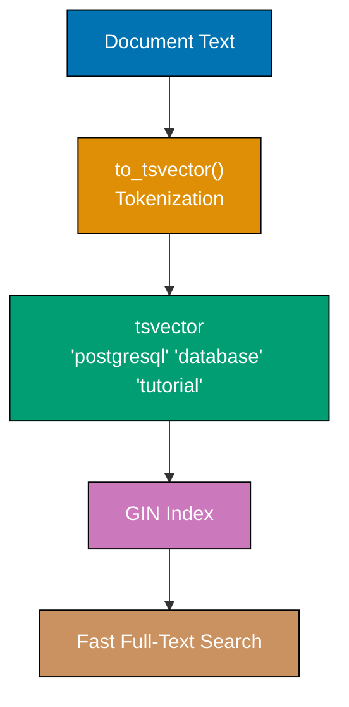

## Group 1: Advanced Indexing

### Example 61: GIN Indexes for Full-Text Search

GIN (Generalized Inverted Index) indexes excel at indexing arrays, JSONB, and full-text search. Essential for fast text searches and JSONB queries.



**Code**:

````sql
CREATE DATABASE example_61;
\c example_61;
-- => Statement execution completes
CREATE TABLE articles (
    id SERIAL PRIMARY KEY,
    title VARCHAR(200),
    content TEXT,
    tags TEXT[]
);
-- => Statement execution completes
INSERT INTO articles (title, content, tags)
VALUES
    ('PostgreSQL Tutorial', 'Learn PostgreSQL database fundamentals and advanced features', ARRAY['database', 'sql', 'tutorial']),
    ('Docker Guide', 'Complete guide to Docker containers and orchestration', ARRAY['docker', 'containers', 'devops']),
    ('PostgreSQL Performance', 'Optimize PostgreSQL queries and indexes for production', ARRAY['database', 'postgresql', 'performance']);
    -- => Statement execution completes
-- GIN index for array containment
CREATE INDEX idx_articles_tags ON articles USING GIN(tags);
EXPLAIN ANALYZE
SELECT title FROM articles WHERE tags @> ARRAY['database'];
-- => Specifies source table for query
-- => Index Scan using idx_articles_tags (fast)
-- GIN index for full-text search
ALTER TABLE articles ADD COLUMN content_tsv tsvector;
UPDATE articles
SET content_tsv = to_tsvector('english', title || ' ' || content);
-- => Statement execution completes
-- => Converts text to tsvector (searchable tokens)
CREATE INDEX idx_articles_fts ON articles USING GIN(content_tsv);
-- Full-text search
SELECT title
FROM articles
-- => Specifies source table for query
WHERE content_tsv @@ to_tsquery('english', 'postgresql & database');
-- => Applies filter to rows
-- => Articles containing both 'postgresql' AND 'database'
-- => PostgreSQL Tutorial, PostgreSQL Performance
-- Rank results by relevance
SELECT
    title,
    ts_rank(content_tsv, to_tsquery('english', 'postgresql')) AS rank
    -- => Creates alias for column/table
FROM articles
-- => Specifies source table for query
WHERE content_tsv @@ to_tsquery('english', 'postgresql')
-- => Applies filter to rows
ORDER BY rank DESC;
-- => Sorts query results
-- => Orders by relevance score
-- GIN index for JSONB
CREATE TABLE products (
    id SERIAL PRIMARY KEY,
    data JSONB
);
-- => Statement execution completes
INSERT INTO products (data)
VALUES
    ('{"name": "Laptop", "specs": {"cpu": "i7", "ram": 16}}'),
    ('{"name": "Phone", "specs": {"cpu": "A15", "ram": 6}}');
    -- => Statement execution completes
CREATE INDEX idx_products_data ON products USING GIN(data);
EXPLAIN ANALYZE
SELECT * FROM products WHERE data @> '{"specs": {"ram": 16}}';
-- => Specifies source table for query
-- => Index Scan using idx_products_data (fast JSONB containment)```

**Key Takeaway**: GIN indexes enable fast searches on arrays, JSONB, and full-text (tsvector). Use for containment checks (`@>`), JSONB queries, and full-text search. Much faster than sequential scans for these data types.

**Why It Matters**: GIN indexes make PostgreSQL competitive with document databases like MongoDB for JSON querying, enabling millisecond-speed containment queries on billions of JSONB documents without sacrificing ACID guarantees or relational query capabilities. Array containment queries with GIN indexes (@> operator) are 100-1000x faster than ANY() predicates on unindexed arrays, making GIN essential for tag-based filtering systems handling millions of tagged items. Full-text search with GIN indexes on tsvector columns enables Google-like search functionality directly in PostgreSQL, eliminating the need for external search engines like Elasticsearch for many use cases.

### Example 62: GiST Indexes for Geometric Data

GiST (Generalized Search Tree) indexes support geometric types, range types, and custom types. Essential for spatial queries and range overlap checks.

**Code**:

```sql
CREATE DATABASE example_62;
-- => Creates database 'example_62'
\c example_62;
-- => Statement execution completes
-- => Switches connection to example_62 database
-- Enable PostGIS extension for geometric types (if available)
-- CREATE EXTENSION IF NOT EXISTS postgis;
CREATE TABLE events (
    name VARCHAR(200),
    event_period DATERANGE
);
-- => Statement execution completes
INSERT INTO events (name, event_period)
-- => INSERT into events table begins
VALUES
-- => Row data values follow
    ('Conference', '[2025-12-20, 2025-12-23)'),
    -- => Row data inserted
    ('Webinar', '[2025-12-22, 2025-12-22)'),
    -- => Row data inserted
    ('Workshop', '[2025-12-25, 2025-12-27)');
    -- => Statement execution completes
-- GiST index for range types
CREATE INDEX idx_events_period ON events USING GiST(event_period);
-- => Creates index idx_events_period for faster queries
-- Find overlapping events
EXPLAIN ANALYZE
SELECT name FROM events WHERE event_period && '[2025-12-22, 2025-12-24)'::DATERANGE;
-- => Specifies source table for query
-- => Query executes and returns result set
-- => Index Scan using idx_events_period (fast overlap check)
-- => Conference, Webinar (overlap with Dec 22-24)
-- GiST for geometric types
CREATE TABLE locations (
    name VARCHAR(100),
    coordinates POINT  -- => (x, y) coordinates
);
-- => Statement execution completes
INSERT INTO locations (name, coordinates)
-- => INSERT into locations table begins
VALUES
-- => Row data values follow
    ('Office A', POINT(10, 20)),
    -- => Row data inserted
    ('Office B', POINT(15, 25)),
    -- => Row data inserted
    ('Office C', POINT(50, 60));
    -- => Statement execution completes
CREATE INDEX idx_locations_coords ON locations USING GiST(coordinates);
-- => Creates index idx_locations_coords for faster queries
-- Find nearby points (requires distance calculation)
SELECT
    name,
    coordinates <-> POINT(12, 22) AS distance
    -- => Creates alias for column/table
FROM locations
-- => Specifies source table for query
ORDER BY distance
-- => Sorts query results
-- => Sorts result set
LIMIT 2;
-- => Restricts number of rows returned
-- => Office A (closest), Office B (second closest)
-- GiST for text search (alternative to GIN)
CREATE TABLE documents (
    content TEXT,
    content_tsv tsvector
);
-- => Statement execution completes
INSERT INTO documents (content)
-- => INSERT into documents table begins
VALUES
-- => Row data values follow
    ('PostgreSQL is a powerful database'),
    -- => Row data inserted
    ('Docker simplifies deployment'),
    -- => Row data inserted
    ('PostgreSQL supports advanced indexing');
    -- => Statement execution completes
UPDATE documents SET content_tsv = to_tsvector('english', content);
-- => Updates rows matching condition
CREATE INDEX idx_documents_gist ON documents USING GiST(content_tsv);
-- => Creates index idx_documents_gist for faster queries
SELECT content
FROM documents
-- => Specifies source table for query
WHERE content_tsv @@ to_tsquery('english', 'postgresql');
-- => Applies filter to rows
-- => Filter condition for query
-- => Uses GiST index (GIN usually faster for full-text)```

**Key Takeaway**: GiST indexes support range types, geometric types, and custom operators. Use for range overlap (`&&`), nearest-neighbor searches, and spatial queries. GIN is faster for full-text search; GiST is better for range and geometric queries.

**Why It Matters**: GiST indexes enable geospatial applications (ride-sharing, delivery optimization, real estate search) to perform nearest-neighbor queries finding the closest 10 drivers to a pickup location in milliseconds across millions of geographic points. Range overlap queries with GiST on DATERANGE columns detect reservation conflicts 100x faster than equivalent date comparison logic, making booking systems responsive even with billions of reservation records. The extensibility of GiST enables custom operator classes for domain-specific data types, making PostgreSQL suitable for specialized applications (chemical structure search, network topology queries) without requiring external specialized databases.

### Example 63: Expression Indexes

Expression indexes index computed values (functions, operators) instead of raw columns - speeds up queries filtering on expressions.

```mermaid
%% Color Palette: Blue #0173B2, Orange #DE8F05, Teal #029E73, Purple #CC78BC, Brown #CA9161
graph TD
    A["Raw Data<br/>(email: 'Alice@Example.com')"]
    B["Expression<br/>LOWER(email)"]
    C["Index Stores<br/>('alice@example.com' → row ID)"]
    D["Query<br/>WHERE LOWER(email) = 'alice@example.com'"]
    E["Fast Lookup<br/>(Uses index)"]

    A --> B
    B --> C
    D --> C
    C --> E

    style A fill:#0173B2,stroke:#000,color:#fff
    style B fill:#DE8F05,stroke:#000,color:#fff
    style C fill:#029E73,stroke:#000,color:#fff
    style D fill:#CC78BC,stroke:#000,color:#fff
    style E fill:#029E73,stroke:#000,color:#fff
````

**Code**:

````sql
CREATE DATABASE example_63;
\c example_63;
-- => Statement execution completes
CREATE TABLE users (
    id SERIAL PRIMARY KEY,
    email VARCHAR(100),
    created_at TIMESTAMP
);
-- => Statement execution completes
INSERT INTO users (email, created_at)
SELECT
    'user' || generate_series || '@example.com',
    NOW() - (random() * 365 || ' days')::INTERVAL
FROM generate_series(1, 10000);
-- => Specifies source table for query
-- Query filtering on LOWER(email) - slow without index
EXPLAIN ANALYZE
SELECT * FROM users WHERE LOWER(email) = 'user123@example.com';
-- => Specifies source table for query
-- => Seq Scan with filter on LOWER(email)
-- Create expression index
CREATE INDEX idx_users_email_lower ON users(LOWER(email));
EXPLAIN ANALYZE
SELECT * FROM users WHERE LOWER(email) = 'user123@example.com';
-- => Specifies source table for query
-- => Index Scan using idx_users_email_lower (fast)
-- Expression index on date part
CREATE INDEX idx_users_created_year
ON users(EXTRACT(YEAR FROM created_at));
-- => Specifies source table for query
EXPLAIN ANALYZE
SELECT COUNT(*) FROM users WHERE EXTRACT(YEAR FROM created_at) = 2025;
-- => Specifies source table for query
-- => Bitmap Index Scan using idx_users_created_year
-- Expression index with multiple functions
CREATE TABLE products (
    id SERIAL PRIMARY KEY,
    name VARCHAR(200),
    price DECIMAL(10, 2)
);
-- => Statement execution completes
INSERT INTO products (name, price)
SELECT
    'Product ' || generate_series,
    (random() * 1000)::DECIMAL(10, 2)
FROM generate_series(1, 10000);
-- => Specifies source table for query
-- Index on price rounded to nearest 100
CREATE INDEX idx_products_price_rounded
ON products(ROUND(price / 100) * 100);
-- => Statement execution completes
EXPLAIN ANALYZE
SELECT name, price
FROM products
-- => Specifies source table for query
WHERE ROUND(price / 100) * 100 = 500;
-- => Applies filter to rows
-- => Index Scan using idx_products_price_rounded
-- Expression index on concatenation
CREATE INDEX idx_users_email_domain
ON users(SUBSTRING(email FROM POSITION('@' IN email) + 1));
-- => Specifies source table for query
SELECT COUNT(*)
-- => Aggregate function computes summary value
FROM users
-- => Specifies source table for query
WHERE SUBSTRING(email FROM POSITION('@' IN email) + 1) = 'example.com';
-- => Specifies source table for query
-- => Uses expression index if query matches index expression exactly```

**Key Takeaway**: Expression indexes speed up queries filtering on computed values - create indexes on LOWER(), EXTRACT(), ROUND(), or custom expressions. Query WHERE clause must match index expression exactly for index to be used.

**Why It Matters**: Expression indexes eliminate the need for computed columns when indexing derived values (LOWER(email) for case-insensitive searches, date_trunc('day', timestamp) for day-level aggregations), reducing storage overhead and preventing data synchronization issues between base and computed columns. Case-insensitive email lookups with LOWER() indexes are essential for user authentication systems where user@example.com and USER@EXAMPLE.COM must be treated identically without expensive sequential scans. However, expression indexes require exact query match (WHERE LOWER(email) = LOWER('user@example.com')), making them unsuitable for ad-hoc queries where expression varies, limiting their applicability to well-defined query patterns.

### Example 64: Covering Indexes (INCLUDE clause)

Covering indexes include extra columns in leaf nodes using INCLUDE - queries can retrieve all needed columns from index alone (index-only scans).

```mermaid
%% Color Palette: Blue #0173B2, Orange #DE8F05, Teal #029E73, Purple #CC78BC, Brown #CA9161
graph TD
    A["Regular Index<br/>(customer_id)"]
    B["Covering Index<br/>(customer_id INCLUDE name, email)"]
    C["Query needs<br/>customer_id, name, email"]
    D["Index Scan<br/>(Get customer_id)"]
    E["Table Lookup<br/>(Get name, email)"]
    F["Index-Only Scan<br/>(All data in index)"]
    G["Slower<br/>(2 operations)"]
    H["Faster<br/>(1 operation)"]

    A --> D
    D --> E
    E --> G

    B --> F
    F --> H

    C --> D
    C --> F

    style A fill:#CA9161,stroke:#000,color:#fff
    style B fill:#029E73,stroke:#000,color:#fff
    style C fill:#0173B2,stroke:#000,color:#fff
    style D fill:#DE8F05,stroke:#000,color:#fff
    style E fill:#DE8F05,stroke:#000,color:#fff
    style F fill:#029E73,stroke:#000,color:#fff
    style G fill:#CA9161,stroke:#000,color:#fff
    style H fill:#029E73,stroke:#000,color:#fff
````

**Code**:

````sql
CREATE DATABASE example_64;
\c example_64;
-- => Statement execution completes
CREATE TABLE orders (
    id SERIAL PRIMARY KEY,
    customer_id INTEGER,
    order_date DATE,
    total DECIMAL(10, 2),
    status VARCHAR(20)
);
-- => Statement execution completes
INSERT INTO orders (customer_id, order_date, total, status)
SELECT
    (random() * 100)::INTEGER + 1,
    CURRENT_DATE - (random() * 365)::INTEGER,
    (random() * 1000)::DECIMAL(10, 2),
    CASE (random() * 3)::INTEGER
        WHEN 0 THEN 'pending'
        WHEN 1 THEN 'completed'
        ELSE 'cancelled'
    END
FROM generate_series(1, 10000);
-- => Specifies source table for query
-- Regular index (only indexed columns)
CREATE INDEX idx_orders_customer ON orders(customer_id);
-- Query needs to visit table for non-indexed columns
EXPLAIN ANALYZE
SELECT customer_id, total, status
FROM orders
-- => Specifies source table for query
WHERE customer_id = 42;
-- => Applies filter to rows
-- => Index Scan followed by table access for total, status
DROP INDEX idx_orders_customer;
-- Covering index with INCLUDE
CREATE INDEX idx_orders_customer_covering
ON orders(customer_id) INCLUDE (total, status);
-- => Statement execution completes
-- => Index includes total and status in leaf nodes
EXPLAIN ANALYZE
SELECT customer_id, total, status
FROM orders
-- => Specifies source table for query
WHERE customer_id = 42;
-- => Applies filter to rows
-- => Index Only Scan (no table access needed!)
-- Covering index for ORDER BY queries
CREATE INDEX idx_orders_date_covering
ON orders(order_date DESC) INCLUDE (customer_id, total);
-- => Statement execution completes
EXPLAIN ANALYZE
SELECT order_date, customer_id, total
FROM orders
-- => Specifies source table for query
ORDER BY order_date DESC
-- => Sorts query results
LIMIT 10;
-- => Restricts number of rows returned
-- => Index Only Scan using idx_orders_date_covering
-- Check index usage statistics
SELECT
    schemaname,
    tablename,
    indexname,
    idx_scan,
    idx_tup_read,
    idx_tup_fetch
FROM pg_stat_user_indexes
-- => Specifies source table for query
WHERE tablename = 'orders';
-- => Applies filter to rows
-- => idx_scan: number of index scans
-- => idx_tup_read: tuples read from index
-- => idx_tup_fetch: tuples fetched from table (0 for index-only scans)```

**Key Takeaway**: Covering indexes with INCLUDE enable index-only scans - query retrieves all needed columns from index without accessing table. Use for frequently queried column combinations to avoid table lookups.

**Why It Matters**: Covering indexes with INCLUDE clause eliminate table heap access for queries retrieving indexed + included columns, achieving 5-10x speedups on queries that would otherwise require index scan followed by heap fetch. The separation between index key columns and INCLUDE columns enables optimal index structure where frequently filtered columns remain in B-tree structure while display-only columns ride along for free without affecting index efficiency. INCLUDE allows adding frequently accessed columns to unique indexes without making them part of the uniqueness constraint, enabling covering index benefits on unique indexes that would otherwise be limited to key columns only.

### Example 65: Index-Only Scans

Index-only scans retrieve all needed columns from index - no table access required. Requires covering index or visibility map indicating no dead tuples.

**Code**:

```sql
CREATE DATABASE example_65;
\c example_65;
-- => Statement execution completes
CREATE TABLE products (
    id SERIAL PRIMARY KEY,
    sku VARCHAR(50) UNIQUE,
    name VARCHAR(200),
    price DECIMAL(10, 2),
    stock INTEGER
);
-- => Statement execution completes
INSERT INTO products (sku, name, price, stock)
SELECT
    'SKU-' || LPAD(generate_series::TEXT, 8, '0'),
    'Product ' || generate_series,
    (random() * 1000)::DECIMAL(10, 2),
    (random() * 1000)::INTEGER
FROM generate_series(1, 10000);
-- => Specifies source table for query
-- Analyze to update statistics and visibility map
VACUUM ANALYZE products;
-- => Statement execution completes
-- Query using only indexed columns
CREATE INDEX idx_products_sku ON products(sku);
EXPLAIN ANALYZE
SELECT sku FROM products WHERE sku = 'SKU-00001234';
-- => Specifies source table for query
-- => Index Only Scan using idx_products_sku
-- Query needing non-indexed column (table access required)
EXPLAIN ANALYZE
SELECT sku, name FROM products WHERE sku = 'SKU-00001234';
-- => Specifies source table for query
-- => Index Scan (must access table for name)
-- Create covering index
CREATE INDEX idx_products_sku_name ON products(sku) INCLUDE (name);
EXPLAIN ANALYZE
SELECT sku, name FROM products WHERE sku = 'SKU-00001234';
-- => Specifies source table for query
-- => Index Only Scan using idx_products_sku_name
-- Visibility map impact
-- After many UPDATE/DELETE, index-only scans may become slower
UPDATE products SET stock = stock + 1 WHERE id % 2 = 0;
-- => Applies filter to rows
-- => Creates dead tuples
EXPLAIN ANALYZE
SELECT sku FROM products WHERE sku = 'SKU-00001234';
-- => Specifies source table for query
-- => May revert to Index Scan if visibility map indicates dead tuples
-- VACUUM clears dead tuples and updates visibility map
VACUUM products;
-- => Statement execution completes
EXPLAIN ANALYZE
SELECT sku FROM products WHERE sku = 'SKU-00001234';
-- => Specifies source table for query
-- => Index Only Scan restored
-- Check visibility map
SELECT
    pg_size_pretty(pg_relation_size('products')) AS table_size,
    -- => Creates alias for column/table
    pg_size_pretty(pg_relation_size('idx_products_sku')) AS index_size;
    -- => Creates alias for column/table
-- Force index-only scan check
SET enable_seqscan = off;
-- => Statement execution completes
SET enable_indexscan = off;
-- => Statement execution completes
SET enable_indexonlyscan = on;
-- => Statement execution completes
EXPLAIN ANALYZE
SELECT sku FROM products WHERE sku LIKE 'SKU-0001%';
-- => Specifies source table for query
-- => Forces index-only scan if possible
-- Reset
RESET enable_seqscan;
-- => Statement execution completes
RESET enable_indexscan;
-- => Statement execution completes
RESET enable_indexonlyscan;
-- => Statement execution completes```

**Key Takeaway**: Index-only scans avoid table access when all needed columns are in index and visibility map confirms no dead tuples. VACUUM updates visibility map. Covering indexes enable index-only scans for more queries.

**Why It Matters**: Index-only scans reduce query I/O by 80-95% compared to regular index scans that must access heap tuples for visibility checking, making frequently-queried covering indexes essential for high-throughput read-heavy workloads. The visibility map dependency means index-only scan benefits degrade on heavily-updated tables until VACUUM runs, creating a performance cliff where query speed varies by 5-10x depending on last VACUUM timing. Autovacuum's automatic visibility map maintenance makes index-only scans reliable in production, but manual VACUUM scheduling is critical after bulk UPDATE/DELETE operations to restore index-only scan performance immediately.

## Group 2: Query Optimization

### Example 66: Analyzing Query Plans with EXPLAIN ANALYZE

EXPLAIN ANALYZE reveals actual execution metrics - use it to identify bottlenecks, verify index usage, and measure performance improvements.

```mermaid
%% Color Palette: Blue #0173B2, Orange #DE8F05, Teal #029E73, Purple #CC78BC, Brown #CA9161
graph TD
    A["SQL Query"]
    B["EXPLAIN<br/>(Plan Only - Fast)"]
    C["EXPLAIN ANALYZE<br/>(Execute + Measure)"]
    D["Estimated Plan<br/>(No execution)"]
    E["Actual Plan<br/>(Real timing)"]
    F["Estimated Rows<br/>Estimated Cost"]
    G["Actual Rows<br/>Actual Time<br/>Buffers Used"]
    H["Find Slow Operations"]

    A --> B
    A --> C
    B --> D
    C --> E
    D --> F
    E --> G
    G --> H

    style A fill:#0173B2,stroke:#000,color:#fff
    style B fill:#DE8F05,stroke:#000,color:#fff
    style C fill:#029E73,stroke:#000,color:#fff
    style D fill:#CC78BC,stroke:#000,color:#fff
    style E fill:#029E73,stroke:#000,color:#fff
    style F fill:#CA9161,stroke:#000,color:#fff
    style G fill:#029E73,stroke:#000,color:#fff
    style H fill:#029E73,stroke:#000,color:#fff
````

**Code**:

````sql
CREATE DATABASE example_66;
\c example_66;
-- => Statement execution completes
CREATE TABLE orders (
    id SERIAL PRIMARY KEY,
    customer_id INTEGER,
    product_id INTEGER,
    order_date DATE,
    total DECIMAL(10, 2)
);
-- => Statement execution completes
CREATE TABLE customers (
    id SERIAL PRIMARY KEY,
    name VARCHAR(100),
    country VARCHAR(50)
);
-- => Statement execution completes
INSERT INTO customers (name, country)
SELECT
    'Customer ' || generate_series,
    CASE (generate_series % 3)
        WHEN 0 THEN 'USA'
        WHEN 1 THEN 'UK'
        ELSE 'Canada'
    END
FROM generate_series(1, 1000);
-- => Specifies source table for query
INSERT INTO orders (customer_id, product_id, order_date, total)
SELECT
    (random() * 1000)::INTEGER + 1,
    (random() * 100)::INTEGER + 1,
    CURRENT_DATE - (random() * 365)::INTEGER,
    (random() * 1000)::DECIMAL(10, 2)
FROM generate_series(1, 100000);
-- => Specifies source table for query
-- EXPLAIN shows estimated costs (no execution)
EXPLAIN
SELECT * FROM orders WHERE customer_id = 42;
-- => Specifies source table for query
-- => Shows: Seq Scan on orders
-- => Cost estimate: 0.00..2000.00 (startup..total)
-- => Rows estimate: ~100
-- EXPLAIN ANALYZE executes and shows actual metrics
EXPLAIN ANALYZE
SELECT * FROM orders WHERE customer_id = 42;
-- => Specifies source table for query
-- => Shows: actual time, actual rows, loops
-- => Planning Time: X ms, Execution Time: Y ms
-- EXPLAIN with BUFFERS (cache hit rate)
EXPLAIN (ANALYZE, BUFFERS)
SELECT * FROM orders WHERE customer_id = 42;
-- => Specifies source table for query
-- => Shows: shared hit (cache), read (disk), written
-- Complex query analysis
EXPLAIN ANALYZE
SELECT c.name, COUNT(*) AS order_count, SUM(o.total) AS total_spent
-- => Creates alias for column/table
FROM customers c
-- => Specifies source table for query
INNER JOIN orders o ON c.id = o.customer_id
WHERE c.country = 'USA'
-- => Applies filter to rows
GROUP BY c.id, c.name
-- => Aggregates rows by specified columns
ORDER BY total_spent DESC
-- => Sorts query results
LIMIT 10;
-- => Restricts number of rows returned
-- => Shows: Hash Join or Nested Loop, HashAggregate, Sort
-- => Look for high-cost nodes
-- Create indexes and compare
CREATE INDEX idx_orders_customer ON orders(customer_id);
CREATE INDEX idx_customers_country ON customers(country);
VACUUM ANALYZE orders;
-- => Statement execution completes
VACUUM ANALYZE customers;
-- => Statement execution completes
EXPLAIN ANALYZE
SELECT c.name, COUNT(*) AS order_count
-- => Creates alias for column/table
FROM customers c
-- => Specifies source table for query
INNER JOIN orders o ON c.id = o.customer_id
WHERE c.country = 'USA'
-- => Applies filter to rows
GROUP BY c.id, c.name;
-- => Aggregates rows by specified columns
-- => Now uses Index Scan instead of Seq Scan
-- => Compare execution time
-- JSON output for programmatic analysis
EXPLAIN (ANALYZE, FORMAT JSON)
SELECT * FROM orders WHERE customer_id = 42;
-- => Specifies source table for query
-- => Returns JSON with detailed metrics
-- Check planner statistics
SHOW default_statistics_target;
-- => Statement execution completes
-- => Default: 100 (higher = more accurate estimates, slower ANALYZE)
-- Update statistics for better estimates
ANALYZE customers;
-- => Statement execution completes
ANALYZE orders;
-- => Statement execution completes```

**Key Takeaway**: EXPLAIN ANALYZE reveals actual performance - look for Seq Scan on large tables (add indexes), high costs, slow actual times. Use BUFFERS to check cache hit rates. VACUUM ANALYZE updates statistics for accurate query planning.

**Why It Matters**: EXPLAIN ANALYZE reveals the gap between estimated and actual row counts that causes query planner mistakes leading to wrong index choices or suboptimal join strategies, making it essential for diagnosing performance issues in production queries. The BUFFERS option exposes cache hit ratios showing whether queries run from memory (shared buffers hit) or disk (read), guiding decisions on shared_buffers sizing and query optimization priorities. Companies like GitLab mandate EXPLAIN ANALYZE for all database migrations to catch performance regressions before deployment, preventing incidents where poorly-optimized queries degrade user experience for millions of users.

### Example 67: Join Order Optimization

PostgreSQL's query planner chooses join order based on statistics - smaller tables typically joined first. Use ANALYZE to update statistics for optimal join order.

```mermaid
%% Color Palette: Blue #0173B2, Orange #DE8F05, Teal #029E73, Purple #CC78BC, Brown #CA9161
graph TD
    A["Small Table<br/>(1,000 rows)"]
    B["Medium Table<br/>(10,000 rows)"]
    C["Large Table<br/>(100,000 rows)"]
    D["Join A + B<br/>(Smaller First)"]
    E["Join Result + C"]
    F["Final Result"]

    A --> D
    B --> D
    D --> E
    C --> E
    E --> F

    style A fill:#0173B2,stroke:#000,color:#fff
    style B fill:#DE8F05,stroke:#000,color:#fff
    style C fill:#029E73,stroke:#000,color:#fff
    style D fill:#CC78BC,stroke:#000,color:#fff
    style E fill:#CC78BC,stroke:#000,color:#fff
    style F fill:#CA9161,stroke:#000,color:#fff
````

**Code**:

````sql
CREATE DATABASE example_67;
\c example_67;
-- => Statement execution completes
CREATE TABLE small_table (
    id SERIAL PRIMARY KEY,
    value VARCHAR(100)
);
-- => Statement execution completes
CREATE TABLE medium_table (
    id SERIAL PRIMARY KEY,
    small_id INTEGER,
    value VARCHAR(100)
);
-- => Statement execution completes
CREATE TABLE large_table (
    id SERIAL PRIMARY KEY,
    medium_id INTEGER,
    value VARCHAR(100)
);
-- => Statement execution completes
-- Insert different sizes
INSERT INTO small_table (value)
SELECT 'Value ' || generate_series FROM generate_series(1, 100);
-- => Specifies source table for query
INSERT INTO medium_table (small_id, value)
SELECT
    (random() * 100)::INTEGER + 1,
    'Value ' || generate_series
FROM generate_series(1, 10000);
-- => Specifies source table for query
INSERT INTO large_table (medium_id, value)
SELECT
    (random() * 10000)::INTEGER + 1,
    'Value ' || generate_series
FROM generate_series(1, 100000);
-- => Specifies source table for query
-- Update statistics
ANALYZE small_table;
-- => Statement execution completes
ANALYZE medium_table;
-- => Statement execution completes
ANALYZE large_table;
-- => Statement execution completes
-- Three-way join - planner chooses optimal order
EXPLAIN ANALYZE
SELECT s.value AS small_val, m.value AS medium_val, l.value AS large_val
-- => Creates alias for column/table
FROM small_table s
-- => Specifies source table for query
INNER JOIN medium_table m ON s.id = m.small_id
INNER JOIN large_table l ON m.id = l.medium_id
LIMIT 100;
-- => Restricts number of rows returned
-- => Planner likely joins small + medium first, then large
-- Force suboptimal join order (for comparison)
SET join_collapse_limit = 1;  -- => Disables join reordering
EXPLAIN ANALYZE
SELECT s.value, m.value, l.value
FROM large_table l
-- => Specifies source table for query
INNER JOIN medium_table m ON l.medium_id = m.id
INNER JOIN small_table s ON m.small_id = s.id
LIMIT 100;
-- => Restricts number of rows returned
-- => Forced to join large + medium first (slower)
RESET join_collapse_limit;
-- => Statement execution completes
-- Optimal join order (planner decides)
EXPLAIN ANALYZE
SELECT s.value, m.value, l.value
FROM large_table l
-- => Specifies source table for query
INNER JOIN medium_table m ON l.medium_id = m.id
INNER JOIN small_table s ON m.small_id = s.id
LIMIT 100;
-- => Restricts number of rows returned
-- => Planner reorders to join small + medium first
-- Create indexes to enable faster join strategies
CREATE INDEX idx_medium_small ON medium_table(small_id);
CREATE INDEX idx_large_medium ON large_table(medium_id);
EXPLAIN ANALYZE
SELECT s.value, m.value, l.value
FROM small_table s
-- => Specifies source table for query
INNER JOIN medium_table m ON s.id = m.small_id
INNER JOIN large_table l ON m.id = l.medium_id
LIMIT 100;
-- => Restricts number of rows returned
-- => May use Hash Join or Nested Loop with indexes```

**Key Takeaway**: PostgreSQL planner reorders joins based on table statistics - smaller tables joined first for efficiency. Run ANALYZE after data changes. Indexes enable faster join strategies (Hash Join, Merge Join, Nested Loop with index).

**Why It Matters**: Automatic join reordering optimizes queries where developers write joins in suboptimal order, enabling consistent performance regardless of FROM clause ordering and reducing the expertise gap between novice and expert SQL developers. Stale statistics cause the planner to choose wrong join orders (joining 10M rows instead of 1K), creating performance cliffs where queries slow by 100-1000x after data distribution changes until ANALYZE runs. The choice between Hash Join (build hashtable on smaller relation), Merge Join (presorted inputs), and Nested Loop (small outer, indexed inner) determines whether joins complete in milliseconds or minutes, making index design critical for join performance.

### Example 68: Subquery vs JOIN Performance

Subqueries can be rewritten as JOINs - JOINs are often faster because planner can optimize join order and strategies. Use EXPLAIN ANALYZE to compare.

```mermaid
%% Color Palette: Blue #0173B2, Orange #DE8F05, Teal #029E73, Purple #CC78BC, Brown #CA9161
graph TD
    A["Correlated Subquery<br/>(Row-by-row execution)"]
    B["JOIN Approach<br/>(Set-based execution)"]
    C["Outer row 1"]
    D["Execute subquery"]
    E["Outer row 2"]
    F["Execute subquery"]
    G["Slow: O(n × m)<br/>(n rows × m subquery executions)"]
    H["Hash Join or<br/>Merge Join"]
    I["Single scan of both tables"]
    J["Fast: O(n + m)<br/>(One pass per table)"]

    A --> C
    C --> D
    A --> E
    E --> F
    D --> G
    F --> G

    B --> H
    H --> I
    I --> J

    style A fill:#CA9161,stroke:#000,color:#fff
    style B fill:#029E73,stroke:#000,color:#fff
    style C fill:#0173B2,stroke:#000,color:#fff
    style D fill:#0173B2,stroke:#000,color:#fff
    style E fill:#0173B2,stroke:#000,color:#fff
    style F fill:#0173B2,stroke:#000,color:#fff
    style G fill:#CA9161,stroke:#000,color:#fff
    style H fill:#DE8F05,stroke:#000,color:#fff
    style I fill:#DE8F05,stroke:#000,color:#fff
    style J fill:#029E73,stroke:#000,color:#fff
````

**Code**:

````sql
CREATE DATABASE example_68;
\c example_68;
-- => Statement execution completes
CREATE TABLE customers (
    id SERIAL PRIMARY KEY,
    name VARCHAR(100)
);
-- => Statement execution completes
CREATE TABLE orders (
    id SERIAL PRIMARY KEY,
    customer_id INTEGER,
    total DECIMAL(10, 2)
);
-- => Statement execution completes
INSERT INTO customers (name)
SELECT 'Customer ' || generate_series FROM generate_series(1, 10000);
-- => Specifies source table for query
INSERT INTO orders (customer_id, total)
SELECT
    (random() * 10000)::INTEGER + 1,
    (random() * 1000)::DECIMAL(10, 2)
FROM generate_series(1, 100000);
-- => Specifies source table for query
CREATE INDEX idx_orders_customer ON orders(customer_id);
VACUUM ANALYZE customers;
-- => Statement execution completes
VACUUM ANALYZE orders;
-- => Statement execution completes
-- Subquery approach (IN with subquery)
EXPLAIN ANALYZE
SELECT name
FROM customers
-- => Specifies source table for query
WHERE id IN (SELECT customer_id FROM orders WHERE total > 500);
-- => Specifies source table for query
-- => May use Semi Join or Hash Join
-- JOIN approach (equivalent query)
EXPLAIN ANALYZE
SELECT DISTINCT c.name
FROM customers c
-- => Specifies source table for query
INNER JOIN orders o ON c.id = o.customer_id
WHERE o.total > 500;
-- => Applies filter to rows
-- => Often faster than subquery
-- Correlated subquery (slow - executes for each row)
EXPLAIN ANALYZE
SELECT
    name,
    (SELECT COUNT(*) FROM orders WHERE customer_id = customers.id) AS order_count
    -- => Specifies source table for query
FROM customers;
-- => Specifies source table for query
-- => Subquery executed once per customer (slow)
-- JOIN alternative (faster)
EXPLAIN ANALYZE
SELECT c.name, COUNT(o.id) AS order_count
-- => Creates alias for column/table
FROM customers c
-- => Specifies source table for query
LEFT JOIN orders o ON c.id = o.customer_id
GROUP BY c.id, c.name;
-- => Aggregates rows by specified columns
-- => Single join with aggregation (faster)
-- EXISTS vs JOIN
EXPLAIN ANALYZE
SELECT name
FROM customers c
-- => Specifies source table for query
WHERE EXISTS (SELECT 1 FROM orders WHERE customer_id = c.id AND total > 500);
-- => Specifies source table for query
-- => Semi Join strategy
EXPLAIN ANALYZE
SELECT DISTINCT c.name
FROM customers c
-- => Specifies source table for query
INNER JOIN orders o ON c.id = o.customer_id
WHERE o.total > 500;
-- => Applies filter to rows
-- => Often similar performance to EXISTS
-- NOT IN vs LEFT JOIN (careful with NULLs!)
EXPLAIN ANALYZE
SELECT name
FROM customers
-- => Specifies source table for query
WHERE id NOT IN (SELECT customer_id FROM orders WHERE customer_id IS NOT NULL);
-- => Specifies source table for query
-- => Anti Join
EXPLAIN ANALYZE
SELECT c.name
FROM customers c
-- => Specifies source table for query
LEFT JOIN orders o ON c.id = o.customer_id
WHERE o.id IS NULL;
-- => Applies filter to rows
-- => Anti Join (finds customers with no orders)```

**Key Takeaway**: JOINs often outperform subqueries - planner can optimize join order and strategies. Correlated subqueries are especially slow (execute once per row). Use EXPLAIN ANALYZE to compare subquery vs JOIN performance.

**Why It Matters**: Correlated subqueries execute once per outer row creating O(N×M) performance compared to O(N+M) for equivalent JOINs, causing queries to slow from milliseconds to hours as data grows from thousands to millions of rows. PostgreSQL's query optimizer can often rewrite uncorrelated subqueries to joins automatically, but correlated subqueries defeat optimization and require manual rewriting for acceptable performance. The semantic equivalence between many subquery and JOIN patterns means developers can choose readability over performance initially, then refactor to JOINs when EXPLAIN ANALYZE reveals performance issues, making iterative optimization practical.

### Example 69: Query Hints and Statistics

PostgreSQL doesn't support query hints directly, but you can influence planner with statistics targets, costs, and enable/disable settings.

**Code**:

```sql
CREATE DATABASE example_69;
-- => Creates database 'example_69'
\c example_69;
-- => Statement execution completes
-- => Switches connection to example_69 database
CREATE TABLE products (
    category VARCHAR(50),
    price DECIMAL(10, 2),
    name VARCHAR(200)
);
-- => Statement execution completes
INSERT INTO products (category, price, name)
-- => INSERT into products table begins
SELECT
    CASE (generate_series % 5)
        WHEN 0 THEN 'Electronics'
        WHEN 1 THEN 'Furniture'
        WHEN 2 THEN 'Kitchen'
        WHEN 3 THEN 'Books'
        ELSE 'Clothing'
    END,
    (random() * 1000)::DECIMAL(10, 2),
    -- => Row data inserted
    'Product ' || generate_series
FROM generate_series(1, 100000);
-- => Specifies source table for query
CREATE INDEX idx_products_category ON products(category);
-- => Creates index idx_products_category for faster queries
CREATE INDEX idx_products_price ON products(price);
-- => Creates index idx_products_price for faster queries
-- Default statistics target (100 values sampled)
SHOW default_statistics_target;
-- => Statement execution completes
-- => 100
-- Increase statistics for better estimates on specific column
ALTER TABLE products ALTER COLUMN category SET STATISTICS 1000;
-- => Modifies table structure
-- => Samples 1000 distinct values for more accurate estimates
ANALYZE products;
-- => Statement execution completes
EXPLAIN ANALYZE
SELECT * FROM products WHERE category = 'Electronics';
-- => Specifies source table for query
-- => Query executes and returns result set
-- => More accurate row estimates after increased statistics
-- Influence planner with cost parameters
SHOW seq_page_cost;   -- => 1.0 (cost of sequential page read)
SHOW random_page_cost; -- => 4.0 (cost of random page read)
-- Temporarily prefer index scans
SET random_page_cost = 1.0;  -- => Make indexes more attractive
EXPLAIN ANALYZE
SELECT * FROM products WHERE price > 500;
-- => Specifies source table for query
-- => Query executes and returns result set
-- => More likely to use index
RESET random_page_cost;
-- => Statement execution completes
-- Disable specific plan types (for testing)
SET enable_seqscan = off;  -- => Force index usage
EXPLAIN ANALYZE
SELECT * FROM products WHERE category = 'Books';
-- => Specifies source table for query
-- => Query executes and returns result set
-- => Forced to use index even if seq scan is cheaper
RESET enable_seqscan;
-- => Statement execution completes
-- Check actual vs estimated rows
EXPLAIN ANALYZE
SELECT COUNT(*) FROM products WHERE price BETWEEN 100 AND 200;
-- => Specifies source table for query
-- => Query executes and returns result set
-- => Compare "rows=X" (estimate) vs "actual rows=Y"
-- If estimates are wrong, increase statistics or ANALYZE
ANALYZE products;
-- => Statement execution completes
-- View column statistics
SELECT
    attname AS column_name,
    -- => Creates alias for column/table
    n_distinct,
    correlation
FROM pg_stats
-- => Specifies source table for query
WHERE tablename = 'products';
-- => Applies filter to rows
-- => Filter condition for query
-- => n_distinct: estimated unique values
-- => correlation: physical vs logical order (-1 to 1)
-- Reset statistics target to default
ALTER TABLE products ALTER COLUMN category SET STATISTICS -1;
-- => Modifies table structure```

**Key Takeaway**: PostgreSQL planner uses statistics for decisions - increase statistics*target for more accurate estimates on high-cardinality columns. Adjust cost parameters (random_page_cost, seq_page_cost) to influence planner. Use enable*\* settings to test different plan types.

**Why It Matters**: Increasing statistics*target from default 100 to 1000+ on high-cardinality columns improves estimate accuracy for skewed distributions, preventing the planner from choosing sequential scans when indexes would be 100x faster. Cost parameter tuning (lowering random_page_cost for SSD storage) aligns planner assumptions with actual hardware characteristics, making PostgreSQL choose optimal plans on modern storage rather than defaults calibrated for spinning disks from the 1990s. However, PostgreSQL intentionally lacks SQL-level query hints (unlike Oracle's /*+ INDEX \_/ syntax), forcing optimization through statistics and cost parameters rather than hard-coded hints that become stale as data evolves.

### Example 70: Vacuum and Analyze

VACUUM reclaims space from dead tuples, ANALYZE updates statistics for query planner. Both essential for maintaining performance.

**Code**:

```sql
CREATE DATABASE example_70;
\c example_70;
-- => Statement execution completes
CREATE TABLE logs (
    id SERIAL PRIMARY KEY,
    message TEXT,
    created_at TIMESTAMP DEFAULT NOW()
);
-- => Statement execution completes
-- Insert initial data
INSERT INTO logs (message)
SELECT 'Log entry ' || generate_series
FROM generate_series(1, 100000);
-- => Specifies source table for query
-- Check table size
SELECT pg_size_pretty(pg_total_relation_size('logs')) AS table_size;
-- => Creates alias for column/table
-- => Shows total size including indexes
-- Update many rows (creates dead tuples)
UPDATE logs SET message = 'Updated: ' || message WHERE id % 2 = 0;
-- => Applies filter to rows
-- => 50,000 dead tuples created
-- Table size increased (dead tuples not yet reclaimed)
SELECT pg_size_pretty(pg_total_relation_size('logs')) AS table_size;
-- => Creates alias for column/table
-- => Larger than before
-- VACUUM reclaims space from dead tuples
VACUUM logs;
-- => Statement execution completes
SELECT pg_size_pretty(pg_total_relation_size('logs')) AS table_size;
-- => Creates alias for column/table
-- => Size reduced (dead tuples reclaimed)
-- VACUUM FULL rebuilds table (more aggressive, locks table)
VACUUM FULL logs;
-- => Statement execution completes
-- => Reclaims maximum space, but locks table during operation
-- ANALYZE updates statistics
DELETE FROM logs WHERE id % 3 = 0;
-- => Specifies source table for query
-- => Deletes 1/3 of rows
-- Before ANALYZE: planner uses old statistics
EXPLAIN
SELECT * FROM logs WHERE id < 1000;
-- => Specifies source table for query
-- => May show inaccurate row estimates
-- Update statistics
ANALYZE logs;
-- => Statement execution completes
-- After ANALYZE: accurate estimates
EXPLAIN
SELECT * FROM logs WHERE id < 1000;
-- => Specifies source table for query
-- => Shows accurate row estimates
-- VACUUM ANALYZE (both operations)
VACUUM ANALYZE logs;
-- => Statement execution completes
-- Check vacuum statistics
SELECT
    relname,
    last_vacuum,
    last_autovacuum,
    last_analyze,
    last_autoanalyze,
    n_dead_tup
FROM pg_stat_user_tables
-- => Specifies source table for query
WHERE relname = 'logs';
-- => Applies filter to rows
-- => Shows when last vacuumed/analyzed
-- Autovacuum settings (automatic maintenance)
SHOW autovacuum;  -- => on (enabled by default)
-- View autovacuum thresholds
SELECT
    name,
    setting
FROM pg_settings
-- => Specifies source table for query
WHERE name LIKE 'autovacuum%';
-- => Applies filter to rows
-- Manual vacuum with verbose output
VACUUM VERBOSE logs;
-- => Statement execution completes
-- => Shows detailed vacuum statistics
-- Vacuum specific columns (analyze only)
ANALYZE logs (message);
-- => Statement execution completes
-- => Updates statistics for message column only```

**Key Takeaway**: VACUUM reclaims dead tuple space, ANALYZE updates statistics - run both regularly for performance. Autovacuum handles this automatically in production. VACUUM FULL rebuilds table but locks it. Run VACUUM ANALYZE after bulk changes (large UPDATEs, DELETEs).

**Why It Matters**: VACUUM prevents table bloat where deleted rows accumulate as dead tuples consuming disk space and slowing queries, with neglected tables growing to 10x their optimal size and degrading query performance proportionally. ANALYZE updates table statistics that guide query planner decisions, with stale statistics causing wrong index choices that make queries 100-1000x slower until fresh statistics are collected. Autovacuum's automatic operation makes PostgreSQL self-maintaining in production, but aggressive UPDATE/DELETE workloads require tuning autovacuum_vacuum_scale_factor to prevent bloat between autovacuum runs during high-write periods.

## Group 3: Advanced Features

### Example 71: Full-Text Search with tsvector

Full-text search finds documents matching queries - tsvector stores searchable text, tsquery represents search queries. Much faster than LIKE for text searches.

**Code**:

```sql
CREATE DATABASE example_71;
-- => Creates database 'example_71'
\c example_71;
-- => Statement execution completes
-- => Switches connection to example_71 database
CREATE TABLE articles (
    title VARCHAR(200),
    content TEXT,
    search_vector tsvector  -- => Stores searchable tokens
);
-- => Statement execution completes
INSERT INTO articles (title, content)
-- => INSERT into articles table begins
VALUES
-- => Row data values follow
    ('PostgreSQL Tutorial', 'Learn PostgreSQL database fundamentals including tables indexes and queries'),
    -- => Row data inserted
    ('Advanced SQL Techniques', 'Master complex SQL queries with window functions and CTEs'),
    -- => Row data inserted
    ('Database Design Patterns', 'Best practices for designing scalable database schemas');
    -- => Statement execution completes
-- Create tsvector from title and content
UPDATE articles
-- => Updates rows matching condition
SET search_vector = to_tsvector('english', title || ' ' || content);
-- => Statement execution completes
-- => Specifies new values for columns
-- => Converts text to searchable tokens, applies stemming
-- Simple text search
SELECT title
FROM articles
-- => Specifies source table for query
WHERE search_vector @@ to_tsquery('english', 'database');
-- => Applies filter to rows
-- => Filter condition for query
-- => Returns all articles containing 'database' (or stemmed variants)
-- AND query
SELECT title
FROM articles
-- => Specifies source table for query
WHERE search_vector @@ to_tsquery('english', 'postgresql & queries');
-- => Applies filter to rows
-- => Filter condition for query
-- => Articles containing both 'postgresql' AND 'queries'
-- => PostgreSQL Tutorial
-- OR query
SELECT title
FROM articles
-- => Specifies source table for query
WHERE search_vector @@ to_tsquery('english', 'postgresql | design');
-- => Applies filter to rows
-- => Filter condition for query
-- => Articles containing 'postgresql' OR 'design'
-- NOT query
SELECT title
FROM articles
-- => Specifies source table for query
WHERE search_vector @@ to_tsquery('english', 'database & !postgresql');
-- => Applies filter to rows
-- => Filter condition for query
-- => Articles with 'database' but NOT 'postgresql'
-- => Database Design Patterns
-- Phrase search (words in sequence)
SELECT title
FROM articles
-- => Specifies source table for query
WHERE search_vector @@ to_tsquery('english', 'database <-> design');
-- => Applies filter to rows
-- => Filter condition for query
-- => 'database' followed immediately by 'design'
-- Ranking results by relevance
SELECT
    title,
    ts_rank(search_vector, to_tsquery('english', 'database')) AS rank
    -- => Creates alias for column/table
FROM articles
-- => Specifies source table for query
WHERE search_vector @@ to_tsquery('english', 'database')
-- => Applies filter to rows
-- => Filter condition for query
ORDER BY rank DESC;
-- => Sorts query results
-- => Sorts result set
-- => Orders by relevance (higher rank = more relevant)
-- Highlighting search matches
SELECT
    title,
    ts_headline('english', content, to_tsquery('english', 'database'), 'MaxWords=20, MinWords=10') AS snippet
    -- => Creates alias for column/table
FROM articles
-- => Specifies source table for query
WHERE search_vector @@ to_tsquery('english', 'database');
-- => Applies filter to rows
-- => Filter condition for query
-- => Shows excerpt with search term highlighted
-- Create GIN index for fast full-text search
CREATE INDEX idx_articles_search ON articles USING GIN(search_vector);
-- => Creates index idx_articles_search for faster queries
-- Auto-update search_vector with trigger
CREATE FUNCTION articles_search_trigger()
RETURNS TRIGGER AS $$
BEGIN
    NEW.search_vector := to_tsvector('english', NEW.title || ' ' || NEW.content);
    -- => Statement execution completes
    RETURN NEW;
    -- => Statement execution completes
END;
-- => Statement execution completes
$$ LANGUAGE plpgsql;
-- => Statement execution completes
CREATE TRIGGER tsvector_update
BEFORE INSERT OR UPDATE ON articles
FOR EACH ROW
EXECUTE FUNCTION articles_search_trigger();
-- => Statement execution completes
-- Insert new article (search_vector auto-updated)
INSERT INTO articles (title, content)
-- => INSERT into articles table begins
VALUES ('PostgreSQL Performance', 'Optimize PostgreSQL for production workloads');
-- => Statement execution completes
-- => Row data values follow
SELECT title, search_vector FROM articles WHERE title = 'PostgreSQL Performance';
-- => Specifies source table for query
-- => Query executes and returns result set
-- => search_vector automatically populated```

**Key Takeaway**: Full-text search with tsvector/tsquery enables fast, flexible text searches - supports AND/OR/NOT operators, phrase searches, ranking, and highlighting. Create GIN indexes for fast searches. Use triggers to auto-update search_vector on changes.

**Why It Matters**: PostgreSQL's full-text search provides Google-like search functionality directly in the database without external search engines like Elasticsearch, reducing infrastructure complexity and eliminating synchronization lag between database and search index. GIN indexes on tsvector columns enable millisecond-speed searches across millions of documents with stemming (running matches run/runs/ran) and ranking that sorts results by relevance rather than arbitrary ordering. The trigger-based auto-update pattern keeps search vectors synchronized with source text automatically, preventing the stale search results that plague systems relying on manual reindexing or batch updates.

### Example 72: Table Partitioning (Range Partitioning)

Range partitioning splits tables by value ranges (dates, numbers) - improves query performance by scanning only relevant partitions.

```mermaid
%% Color Palette: Blue #0173B2, Orange #DE8F05, Teal #029E73, Purple #CC78BC, Brown #CA9161
graph TD
    A["Parent Table: events<br/>(PARTITION BY RANGE event_date)"]
    B["Partition: events_2024_q1<br/>(2024-01-01 to 2024-04-01)"]
    C["Partition: events_2024_q2<br/>(2024-04-01 to 2024-07-01)"]
    D["Partition: events_2024_q3<br/>(2024-07-01 to 2024-10-01)"]
    E["Partition: events_2024_q4<br/>(2024-10-01 to 2025-01-01)"]
    F["Query WHERE event_date = '2024-05-20'"]
    G["Partition Pruning<br/>(Scan only Q2)"]
    H["Fast Query<br/>(25% of data scanned)"]

    A --> B
    A --> C
    A --> D
    A --> E
    F --> G
    C --> G
    G --> H

    style A fill:#0173B2,stroke:#000,color:#fff
    style B fill:#DE8F05,stroke:#000,color:#fff
    style C fill:#029E73,stroke:#000,color:#fff
    style D fill:#DE8F05,stroke:#000,color:#fff
    style E fill:#DE8F05,stroke:#000,color:#fff
    style F fill:#CC78BC,stroke:#000,color:#fff
    style G fill:#029E73,stroke:#000,color:#fff
    style H fill:#029E73,stroke:#000,color:#fff
````

**Code**:

````sql
CREATE DATABASE example_72;
\c example_72;
-- => Statement execution completes
-- Create partitioned table (parent)
CREATE TABLE events (
    id SERIAL,
    event_name VARCHAR(200),
    event_date DATE NOT NULL,
    data JSONB
) PARTITION BY RANGE (event_date);
-- => Statement execution completes
-- => Partitioned by event_date
-- Create partitions (child tables)
CREATE TABLE events_2024_q1 PARTITION OF events
FOR VALUES FROM ('2024-01-01') TO ('2024-04-01');
-- => Specifies source table for query
CREATE TABLE events_2024_q2 PARTITION OF events
FOR VALUES FROM ('2024-04-01') TO ('2024-07-01');
-- => Specifies source table for query
CREATE TABLE events_2024_q3 PARTITION OF events
FOR VALUES FROM ('2024-07-01') TO ('2024-10-01');
-- => Specifies source table for query
CREATE TABLE events_2024_q4 PARTITION OF events
FOR VALUES FROM ('2024-10-01') TO ('2025-01-01');
-- => Specifies source table for query
CREATE TABLE events_2025_q1 PARTITION OF events
FOR VALUES FROM ('2025-01-01') TO ('2025-04-01');
-- => Specifies source table for query
-- Insert data (automatically routed to correct partition)
INSERT INTO events (event_name, event_date, data)
VALUES
    ('Event A', '2024-02-15', '{"type": "conference"}'),
    ('Event B', '2024-05-20', '{"type": "webinar"}'),
    ('Event C', '2024-08-10', '{"type": "workshop"}'),
    ('Event D', '2024-11-25', '{"type": "meetup"}'),
    ('Event E', '2025-01-15', '{"type": "conference"}');
    -- => Statement execution completes
-- Query scans only relevant partition
EXPLAIN ANALYZE
SELECT * FROM events WHERE event_date = '2024-05-20';
-- => Specifies source table for query
-- => Scans only events_2024_q2 partition (partition pruning)
-- Query spanning multiple partitions
EXPLAIN ANALYZE
SELECT * FROM events WHERE event_date >= '2024-06-01' AND event_date < '2024-12-01';
-- => Specifies source table for query
-- => Scans events_2024_q2, events_2024_q3, events_2024_q4
-- Create indexes on partitions
CREATE INDEX idx_events_2024_q1_date ON events_2024_q1(event_date);
CREATE INDEX idx_events_2024_q2_date ON events_2024_q2(event_date);
-- => Indexes created on each partition
-- Attach existing table as partition
CREATE TABLE events_2025_q2 (
    LIKE events INCLUDING ALL
);
-- => Statement execution completes
INSERT INTO events_2025_q2 (event_name, event_date, data)
VALUES ('Event F', '2025-05-10', '{"type": "conference"}');
-- => Statement execution completes
ALTER TABLE events ATTACH PARTITION events_2025_q2
FOR VALUES FROM ('2025-04-01') TO ('2025-07-01');
-- => Specifies source table for query
-- Detach partition (becomes standalone table)
ALTER TABLE events DETACH PARTITION events_2025_q2;
-- View partition information
SELECT
    parent.relname AS parent_table,
    -- => Creates alias for column/table
    child.relname AS partition_name,
    -- => Creates alias for column/table
    pg_get_expr(child.relpartbound, child.oid) AS partition_bounds
    -- => Creates alias for column/table
FROM pg_inherits
-- => Specifies source table for query
JOIN pg_class parent ON pg_inherits.inhparent = parent.oid
JOIN pg_class child ON pg_inherits.inhrelid = child.oid
WHERE parent.relname = 'events';
-- => Applies filter to rows```

**Key Takeaway**: Range partitioning splits tables by value ranges - PostgreSQL automatically routes inserts to correct partitions and prunes partitions during queries. Essential for large time-series data (logs, events, metrics) to improve query performance and enable partition-level maintenance.

**Why It Matters**: Partitioning enables companies like Timescale (built on PostgreSQL) to handle 10+ million metrics per second by limiting query scans to relevant time ranges, reducing query time from hours to seconds on multi-terabyte datasets. Partition pruning automatically excludes irrelevant partitions from query plans, achieving 10-100x speedups on time-range queries compared to non-partitioned tables. The ability to attach/detach partitions enables zero-downtime archival of old data, allowing organizations to maintain decades of historical data while keeping hot data queries fast.

### Example 73: Table Partitioning (List Partitioning)

List partitioning splits tables by discrete values (countries, categories, statuses) - useful when data naturally groups by specific values.

```mermaid
%% Color Palette: Blue #0173B2, Orange #DE8F05, Teal #029E73, Purple #CC78BC, Brown #CA9161
graph TD
    A["Parent Table: sales<br/>(PARTITION BY LIST region)"]
    B["Partition: sales_north<br/>(region IN 'North', 'Northeast')"]
    C["Partition: sales_south<br/>(region IN 'South', 'Southeast')"]
    D["Partition: sales_west<br/>(region IN 'West', 'Southwest')"]
    E["INSERT region='South'"]
    F["Routing Logic<br/>(Match partition list)"]
    G["Route to sales_south"]

    A --> B
    A --> C
    A --> D
    E --> F
    F --> G
    G --> C

    style A fill:#0173B2,stroke:#000,color:#fff
    style B fill:#DE8F05,stroke:#000,color:#fff
    style C fill:#029E73,stroke:#000,color:#fff
    style D fill:#DE8F05,stroke:#000,color:#fff
    style E fill:#CC78BC,stroke:#000,color:#fff
    style F fill:#CA9161,stroke:#000,color:#fff
    style G fill:#029E73,stroke:#000,color:#fff
````

**Code**:

````sql
CREATE DATABASE example_73;
\c example_73;
-- => Statement execution completes
-- Create partitioned table by list
CREATE TABLE orders (
    id SERIAL,
    order_number VARCHAR(50),
    customer_id INTEGER,
    region VARCHAR(50) NOT NULL,
    total DECIMAL(10, 2)
) PARTITION BY LIST (region);
-- => Statement execution completes
-- Create partitions for each region
CREATE TABLE orders_north_america PARTITION OF orders
FOR VALUES IN ('USA', 'Canada', 'Mexico');
-- => Statement execution completes
CREATE TABLE orders_europe PARTITION OF orders
FOR VALUES IN ('UK', 'France', 'Germany', 'Spain');
-- => Statement execution completes
CREATE TABLE orders_asia PARTITION OF orders
FOR VALUES IN ('Japan', 'China', 'India', 'Singapore');
-- => Statement execution completes
CREATE TABLE orders_other PARTITION OF orders
DEFAULT;
-- => Statement execution completes
-- => DEFAULT partition catches values not in other partitions
-- Insert data
INSERT INTO orders (order_number, customer_id, region, total)
VALUES
    ('ORD-001', 1, 'USA', 150.00),
    ('ORD-002', 2, 'UK', 200.00),
    ('ORD-003', 3, 'Japan', 300.00),
    ('ORD-004', 4, 'Brazil', 100.00);  -- => Goes to orders_other
-- Query specific partition
EXPLAIN ANALYZE
SELECT * FROM orders WHERE region = 'USA';
-- => Specifies source table for query
-- => Scans only orders_north_america partition
-- Multi-value query
EXPLAIN ANALYZE
SELECT * FROM orders WHERE region IN ('UK', 'France');
-- => Specifies source table for query
-- => Scans only orders_europe partition
-- Check data distribution across partitions
SELECT
    'orders_north_america' AS partition,
    -- => Creates alias for column/table
    COUNT(*) AS row_count
    -- => Creates alias for column/table
FROM orders_north_america
-- => Specifies source table for query
UNION ALL
SELECT 'orders_europe', COUNT(*) FROM orders_europe
-- => Specifies source table for query
UNION ALL
SELECT 'orders_asia', COUNT(*) FROM orders_asia
-- => Specifies source table for query
UNION ALL
SELECT 'orders_other', COUNT(*) FROM orders_other;
-- => Specifies source table for query
-- Create local indexes on partitions
CREATE INDEX idx_orders_na_customer ON orders_north_america(customer_id);
CREATE INDEX idx_orders_eu_customer ON orders_europe(customer_id);
CREATE INDEX idx_orders_asia_customer ON orders_asia(customer_id);
-- Partition-wise join (if both tables partitioned the same way)
CREATE TABLE customers (
    id SERIAL,
    name VARCHAR(100),
    region VARCHAR(50) NOT NULL
) PARTITION BY LIST (region);
-- => Statement execution completes
CREATE TABLE customers_north_america PARTITION OF customers
FOR VALUES IN ('USA', 'Canada', 'Mexico');
-- => Statement execution completes
CREATE TABLE customers_europe PARTITION OF customers
FOR VALUES IN ('UK', 'France', 'Germany', 'Spain');
-- => Statement execution completes
-- Enable partition-wise join
SET enable_partitionwise_join = on;
-- => Statement execution completes
EXPLAIN
SELECT o.order_number, c.name
FROM orders o
-- => Specifies source table for query
INNER JOIN customers c ON o.customer_id = c.id AND o.region = c.region;
-- => May show partition-wise join (joins matching partitions)```

**Key Takeaway**: List partitioning splits tables by discrete values - use for naturally grouped data (regions, categories, statuses). DEFAULT partition catches unmatched values. Partition-wise joins optimize joins between similarly partitioned tables.

**Why It Matters**: List partitioning enables multi-tenant applications to physically isolate customer data (one partition per customer/region) for compliance requirements mandating data residency, while maintaining query transparency through partition routing. The DEFAULT partition prevents insertion failures when new categories emerge, making list partitioning resilient to schema evolution compared to strict value lists that require ALTER TABLE for every new value. Partition-wise joins between similarly partitioned tables (both partitioned by region) enable parallel query execution across partition pairs, achieving near-linear scalability for analytics queries on trillion-row datasets.

### Example 74: Foreign Data Wrappers

Foreign Data Wrappers (FDW) enable querying external data sources (other PostgreSQL servers, MySQL, files) as if they were local tables.

**Code**:

```sql
CREATE DATABASE example_74;
-- => Creates database 'example_74'
\c example_74;
-- => Statement execution completes
-- => Switches connection to example_74 database
-- Enable postgres_fdw extension
CREATE EXTENSION postgres_fdw;
-- Create foreign server (connection to another PostgreSQL instance)
CREATE SERVER remote_server
FOREIGN DATA WRAPPER postgres_fdw
OPTIONS (host 'localhost', port '5432', dbname 'example_3');
-- => Statement execution completes
-- => Points to another database (example_3 from earlier)
-- Create user mapping (authentication)
CREATE USER MAPPING FOR postgres
SERVER remote_server
OPTIONS (user 'postgres', password 'password');
-- => Statement execution completes
-- Create foreign table (maps to remote table)
CREATE FOREIGN TABLE remote_users (
    id INTEGER,
    name VARCHAR(100),
    email VARCHAR(100),
    age INTEGER
) SERVER remote_server
OPTIONS (schema_name 'public', table_name 'users');
-- => Statement execution completes
-- => Accesses users table from remote database on the FDW server
-- Query foreign table (appears like local table)
SELECT * FROM remote_users;
-- => Specifies source table for query
-- => Query executes and returns result set
-- => Data fetched from remote database
-- Join local and foreign tables
CREATE TABLE local_orders (
    user_id INTEGER,
    total DECIMAL(10, 2)
);
-- => Statement execution completes
INSERT INTO local_orders (user_id, total)
-- => INSERT into local_orders table begins
VALUES (1, 150.00), (2, 200.00), (3, 300.00);
-- => Statement execution completes
-- => Row data values follow
SELECT
    r.name,
    r.email,
    l.total
FROM remote_users r
-- => Specifies source table for query
INNER JOIN local_orders l ON r.id = l.user_id;
-- => Combines rows from multiple tables
-- => Joins remote and local data
-- EXPLAIN shows foreign scan
EXPLAIN ANALYZE
SELECT * FROM remote_users WHERE age > 25;
-- => Specifies source table for query
-- => Query executes and returns result set
-- => Foreign Scan on remote_users
-- => Shows remote SQL pushed down to foreign server
-- Import foreign schema (auto-create foreign tables)
CREATE SCHEMA remote_schema;
IMPORT FOREIGN SCHEMA public
FROM SERVER remote_server
-- => Specifies source table for query
INTO remote_schema;
-- => Statement execution completes
-- => Automatically creates foreign tables for all tables in remote public schema
-- List foreign tables
SELECT
    foreign_table_name,
    foreign_server_name
FROM information_schema.foreign_tables;
-- => Specifies source table for query
-- Performance considerations
-- => Foreign scans involve network latency
-- => Use WHERE clauses to push filtering to remote server
-- => Avoid large result sets across network
-- Drop foreign table
DROP FOREIGN TABLE remote_users;
-- Drop server
DROP SERVER remote_server CASCADE;
-- => CASCADE drops dependent user mappings and foreign tables```

**Key Takeaway**: Foreign Data Wrappers enable querying remote databases as local tables - useful for data integration, federation, and migrations. WHERE clauses pushed to remote server for efficiency. Network latency impacts performance.

**Why It Matters**: Foreign Data Wrappers enable JOIN queries spanning PostgreSQL, MySQL, Oracle, and MongoDB databases without ETL processes, making PostgreSQL the central query layer for heterogeneous data environments at companies running legacy systems alongside modern stacks. Predicate pushdown optimization sends WHERE clauses to remote servers reducing network transfer by 90-99% compared to naive "fetch all then filter" approaches, making cross-database joins practical for production use. However, FDW queries suffer from network latency (1-100ms per round-trip) making them unsuitable for high-frequency transactional queries where local data replication via logical replication provides 100-1000x better performance.

### Example 75: Logical Replication Basics

Logical replication replicates data changes (INSERT/UPDATE/DELETE) to subscriber databases - enables selective replication, upgrades, and multi-master patterns.

```mermaid
%% Color Palette: Blue #0173B2, Orange #DE8F05, Teal #029E73, Purple #CC78BC, Brown #CA9161
graph TD
    A["Publisher Database<br/>(Source)"]
    B["Publication<br/>(products_pub)"]
    C["WAL Stream<br/>(Change Events)"]
    D["Subscription<br/>(products_sub)"]
    E["Subscriber Database<br/>(Destination)"]
    F["INSERT/UPDATE/DELETE<br/>on Publisher"]
    G["Replicated Changes<br/>on Subscriber"]

    A --> B
    B --> C
    C --> D
    D --> E
    F --> B
    D --> G

    style A fill:#0173B2,stroke:#000,color:#fff
    style B fill:#DE8F05,stroke:#000,color:#fff
    style C fill:#CC78BC,stroke:#000,color:#fff
    style D fill:#029E73,stroke:#000,color:#fff
    style E fill:#0173B2,stroke:#000,color:#fff
    style F fill:#CA9161,stroke:#000,color:#fff
    style G fill:#029E73,stroke:#000,color:#fff
````

**Code**:

````sql
-- Note: Logical replication requires two PostgreSQL instances
-- This example shows setup on single instance with different databases
-- PUBLISHER SETUP (source database)
CREATE DATABASE publisher_db;
\c publisher_db;
-- => Statement execution completes
CREATE TABLE products (
    id SERIAL PRIMARY KEY,
    name VARCHAR(200),
    price DECIMAL(10, 2)
);
-- => Statement execution completes
INSERT INTO products (name, price)
VALUES ('Laptop', 999.99), ('Mouse', 29.99);
-- => Statement execution completes
-- Enable logical replication
ALTER SYSTEM SET wal_level = logical;
-- => Requires PostgreSQL restart
-- Create publication (defines what to replicate)
CREATE PUBLICATION products_pub FOR TABLE products;
-- => Publishes all changes to products table
-- View publications
SELECT * FROM pg_publication;
-- => Specifies source table for query
-- SUBSCRIBER SETUP (destination database)
CREATE DATABASE subscriber_db;
\c subscriber_db;
-- => Statement execution completes
-- Create same table structure
CREATE TABLE products (
    id SERIAL PRIMARY KEY,
    name VARCHAR(200),
    price DECIMAL(10, 2)
);
-- => Statement execution completes
-- Create subscription (connects to publisher)
CREATE SUBSCRIPTION products_sub
CONNECTION 'host=localhost port=5432 dbname=publisher_db user=postgres password=password'
PUBLICATION products_pub;
-- => Statement execution completes
-- => Starts replication from publisher
-- Initial data synced automatically
SELECT * FROM products;
-- => Specifies source table for query
-- => Shows Laptop and Mouse (copied from publisher)
-- Test replication
\c publisher_db;
-- => Statement execution completes
INSERT INTO products (name, price)
VALUES ('Keyboard', 79.99);
-- => Statement execution completes
UPDATE products SET price = 899.99 WHERE name = 'Laptop';
-- => Applies filter to rows
\c subscriber_db;
-- => Statement execution completes
-- Wait a moment for replication
SELECT * FROM products;
-- => Specifies source table for query
-- => Shows Keyboard (inserted), Laptop price updated to 899.99
-- Monitor replication
SELECT * FROM pg_stat_subscription;
-- => Specifies source table for query
-- => Shows replication status, lag, last message
-- Replication lag
SELECT
    slot_name,
    confirmed_flush_lsn,
    pg_current_wal_lsn(),
    pg_current_wal_lsn() - confirmed_flush_lsn AS lag
    -- => Creates alias for column/table
FROM pg_replication_slots;
-- => Specifies source table for query
-- Disable subscription
ALTER SUBSCRIPTION products_sub DISABLE;
-- Drop subscription
DROP SUBSCRIPTION products_sub;
-- Drop publication (on publisher)
\c publisher_db;
-- => Statement execution completes
DROP PUBLICATION products_pub;```

**Key Takeaway**: Logical replication replicates table changes to subscribers - enables selective replication (specific tables), zero-downtime migrations, and read replicas. Requires wal_level = logical. Monitor lag with pg_stat_subscription.

**Why It Matters**: Logical replication enables zero-downtime major version upgrades (9.6 → 14) by replicating to new version cluster and switching over when synchronized, eliminating the maintenance windows that plague pg_upgrade approaches requiring application downtime. Selective table replication enables read replica segregation where analytics queries run against subscribers containing only necessary tables (not all 500 tables), reducing replica storage costs by 80-95%. However, logical replication replays logical changes (INSERT/UPDATE/DELETE) rather than physical blocks, causing 2-5x higher subscriber CPU usage compared to streaming replication and making it unsuitable for disaster recovery where streaming replication provides byte-exact copies.

## Group 4: Administration

### Example 76: User Roles and Permissions

Roles manage authentication and authorization - create roles for users, grant specific permissions, follow principle of least privilege.

**Code**:

```sql
CREATE DATABASE example_76;
-- => Creates database 'example_76'
\c example_76;
-- => Statement execution completes
-- => Switches connection to example_76 database
-- Create roles (users)
CREATE ROLE alice LOGIN PASSWORD 'alice_password';
CREATE ROLE bob LOGIN PASSWORD 'bob_password';
CREATE ROLE charlie LOGIN PASSWORD 'charlie_password';
-- => LOGIN allows connection, PASSWORD sets authentication
-- Create group role
CREATE ROLE developers;
CREATE ROLE analysts;
-- Add users to groups
GRANT developers TO alice, bob;
-- => Statement execution completes
GRANT analysts TO charlie;
-- => Statement execution completes
-- => alice and bob inherit developers permissions
-- Create table
CREATE TABLE employees (
    name VARCHAR(100),
    salary DECIMAL(10, 2)
);
-- => Statement execution completes
-- Grant table permissions
GRANT SELECT ON employees TO analysts;
-- => charlie (analyst) can SELECT but not INSERT/UPDATE/DELETE
GRANT SELECT, INSERT, UPDATE ON employees TO developers;
-- => alice and bob can read and modify, but not delete
-- Test permissions
SET ROLE charlie;
-- => Statement execution completes
-- => Specifies new values for columns
SELECT * FROM employees;  -- => Success
INSERT INTO employees (name, salary) VALUES ('Test', 50000);  -- => ERROR: permission denied
RESET ROLE;
-- => Statement execution completes
-- Grant all privileges on table
GRANT ALL ON employees TO alice;
-- => Statement execution completes
-- => alice has all permissions on employees
-- Grant schema permissions
CREATE SCHEMA reporting;
GRANT USAGE ON SCHEMA reporting TO analysts;
-- => Statement execution completes
-- => charlie can access reporting schema
-- Grant database-wide permissions
GRANT CONNECT ON DATABASE example_76 TO alice;
-- => Statement execution completes
-- Default privileges (auto-grant on future objects)
ALTER DEFAULT PRIVILEGES IN SCHEMA public
GRANT SELECT ON TABLES TO analysts;
-- => Future tables automatically grant SELECT to analysts
-- View role permissions
SELECT
    grantee,
    privilege_type,
    table_name
FROM information_schema.table_privileges
-- => Specifies source table for query
WHERE table_schema = 'public';
-- => Applies filter to rows
-- => Filter condition for query
-- Revoke permissions
REVOKE INSERT ON employees FROM developers;
-- => Specifies source table for query
-- View role memberships
SELECT
    r.rolname AS role,
    -- => Creates alias for column/table
    m.rolname AS member
    -- => Creates alias for column/table
FROM pg_roles r
-- => Specifies source table for query
JOIN pg_auth_members am ON r.oid = am.roleid
-- => Combines rows from multiple tables
JOIN pg_roles m ON am.member = m.oid;
-- => Statement execution completes
-- => Combines rows from multiple tables
-- Drop role
DROP ROLE charlie;
-- => ERROR if charlie owns objects or has privileges
-- Reassign ownership before dropping
REASSIGN OWNED BY charlie TO postgres;
-- => Statement execution completes
DROP OWNED BY charlie;
DROP ROLE charlie;```

**Key Takeaway**: Roles manage users and permissions - create roles with LOGIN for users, group roles without LOGIN for permission sets. GRANT specific privileges (SELECT, INSERT, UPDATE, DELETE), follow least privilege. Use ALTER DEFAULT PRIVILEGES for automatic grants on future objects.

**Why It Matters**: Role-based access control enables centralized permission management where adding a user to the "analysts" role grants all necessary table privileges without individual GRANT statements, reducing administrative overhead and preventing permission drift. The principle of least privilege enforced through selective GRANTs limits blast radius when credentials are compromised, with read-only roles preventing data modification even if SQL injection vulnerabilities exist in application code. ALTER DEFAULT PRIVILEGES ensures future tables automatically grant appropriate permissions, preventing the "new table created but forgot to grant access" incidents that cause production outages when background workers can't access newly created tables.

### Example 77: Row-Level Security (RLS)

Row-Level Security restricts which rows users can see or modify - enables multi-tenant systems, data isolation, and fine-grained access control.

```mermaid
%% Color Palette: Blue #0173B2, Orange #DE8F05, Teal #029E73, Purple #CC78BC, Brown #CA9161
graph TD
    A["User Query<br/>(SELECT * FROM orders)"]
    B["RLS Policy<br/>(WHERE user_id = current_user)"]
    C["All Rows in Table<br/>(1000 orders)"]
    D["Policy Filter<br/>(Apply WHERE clause)"]
    E["Filtered Results<br/>(Only user's 10 orders)"]

    A --> B
    B --> D
    C --> D
    D --> E

    style A fill:#0173B2,stroke:#000,color:#fff
    style B fill:#DE8F05,stroke:#000,color:#fff
    style C fill:#CC78BC,stroke:#000,color:#fff
    style D fill:#029E73,stroke:#000,color:#fff
    style E fill:#029E73,stroke:#000,color:#fff
````

**Code**:

````sql
CREATE DATABASE example_77;
\c example_77;
-- => Statement execution completes
CREATE TABLE documents (
    id SERIAL PRIMARY KEY,
    title VARCHAR(200),
    content TEXT,
    owner VARCHAR(100),
    is_public BOOLEAN DEFAULT false
);
-- => Statement execution completes
-- Create test users
CREATE ROLE alice LOGIN PASSWORD 'alice_password';
CREATE ROLE bob LOGIN PASSWORD 'bob_password';
GRANT SELECT, INSERT, UPDATE, DELETE ON documents TO alice, bob;
GRANT USAGE, SELECT ON SEQUENCE documents_id_seq TO alice, bob;
-- Insert test data
INSERT INTO documents (title, content, owner, is_public)
VALUES
    ('Alice Document 1', 'Private content', 'alice', false),
    ('Alice Document 2', 'Public content', 'alice', true),
    ('Bob Document 1', 'Bob private', 'bob', false);
    -- => Statement execution completes
-- Enable row-level security on table
ALTER TABLE documents ENABLE ROW LEVEL SECURITY;
-- Create policy: users can see their own documents
CREATE POLICY user_documents ON documents
FOR SELECT
USING (owner = current_user);
-- => Statement execution completes
-- => Users see only rows where owner matches their username
-- Test as alice
SET ROLE alice;
-- => Statement execution completes
SELECT * FROM documents;
-- => Specifies source table for query
-- => Returns only Alice's documents
RESET ROLE;
-- => Statement execution completes
-- Create policy: users can see public documents
CREATE POLICY public_documents ON documents
FOR SELECT
USING (is_public = true);
-- => Statement execution completes
-- => Multiple policies combine with OR
SET ROLE alice;
-- => Statement execution completes
SELECT * FROM documents;
-- => Specifies source table for query
-- => Returns Alice's documents + public documents (Bob's public doc)
RESET ROLE;
-- => Statement execution completes
-- Create policy for INSERT (users can only insert as themselves)
CREATE POLICY user_insert ON documents
FOR INSERT
WITH CHECK (owner = current_user);
-- => Statement execution completes
SET ROLE bob;
-- => Statement execution completes
INSERT INTO documents (title, content, owner)
VALUES ('Bob Document 2', 'New doc', 'bob');
-- => Statement execution completes
-- => Success
INSERT INTO documents (title, content, owner)
VALUES ('Fake Alice Doc', 'Impersonation', 'alice');
-- => Statement execution completes
-- => ERROR: policy violation (WITH CHECK fails)
RESET ROLE;
-- => Statement execution completes
-- Create policy for UPDATE (users can update their own docs)
CREATE POLICY user_update ON documents
FOR UPDATE
USING (owner = current_user)
WITH CHECK (owner = current_user);
-- => Statement execution completes
-- => USING: can update, WITH CHECK: new values must satisfy
-- Create policy for DELETE
CREATE POLICY user_delete ON documents
FOR DELETE
USING (owner = current_user);
-- => Statement execution completes
-- Bypass RLS for superuser
SET ROLE alice;
-- => Statement execution completes
SELECT * FROM documents;  -- => Sees own + public docs
RESET ROLE;
-- => Statement execution completes
SELECT * FROM documents;  -- => Superuser sees all rows (bypasses RLS)
-- Disable RLS for specific role
ALTER TABLE documents FORCE ROW LEVEL SECURITY;
-- => Even superusers respect RLS (unless BYPASSRLS role attribute)
-- View policies
SELECT
    schemaname,
    tablename,
    policyname,
    permissive,
    roles,
    qual,
    with_check
FROM pg_policies
-- => Specifies source table for query
WHERE tablename = 'documents';
-- => Applies filter to rows
-- Drop policies
DROP POLICY user_documents ON documents;
DROP POLICY public_documents ON documents;```

**Key Takeaway**: Row-Level Security enforces row-level access control - create policies with USING (filter visible rows) and WITH CHECK (validate changes). Essential for multi-tenant applications, secure data isolation, and compliance requirements.

**Why It Matters**: RLS eliminates application-layer filtering bugs that cause data breaches, enforcing tenant isolation at the database level where it cannot be bypassed by coding errors. Companies like Citus Data (Hyperscale PostgreSQL) use RLS to enable thousands of tenants to share the same database tables while ensuring complete data isolation required by GDPR and HIPAA compliance. RLS policies add negligible overhead (<1% query slowdown) compared to application-layer filtering, while providing defense-in-depth security that survives SQL injection attacks and application bugs.

### Example 78: Backup with pg_dump

pg_dump creates logical backups of databases - exports schema and data as SQL or custom format for restoration.

**Code**:

```sql
CREATE DATABASE example_78;
\c example_78;
-- => Statement execution completes
CREATE TABLE users (
    id SERIAL PRIMARY KEY,
    name VARCHAR(100),
    email VARCHAR(100)
);
-- => Statement execution completes
INSERT INTO users (name, email)
VALUES
    ('Alice', 'alice@example.com'),
    ('Bob', 'bob@example.com'),
    ('Charlie', 'charlie@example.com');
    -- => Statement execution completes
-- Exit psql and run pg_dump from shell```

**Shell commands**:

```bash
# Backup entire database (SQL format)
docker exec postgres-tutorial pg_dump -U postgres example_78 > example_78_backup.sql
# => Creates SQL file with CREATE TABLE and INSERT statements

# Backup in custom format (compressed, faster restore)
docker exec postgres-tutorial pg_dump -U postgres -Fc example_78 > example_78_backup.custom
# => Binary format, supports parallel restore

# Backup in directory format (parallel dump)
docker exec postgres-tutorial pg_dump -U postgres -Fd example_78 -f example_78_backup_dir
# => Creates directory with multiple files

# Backup specific table
docker exec postgres-tutorial pg_dump -U postgres -t users example_78 > users_backup.sql
# => Only users table

# Backup schema only (no data)
docker exec postgres-tutorial pg_dump -U postgres -s example_78 > schema_only.sql
# => CREATE statements without INSERT

# Backup data only (no schema)
docker exec postgres-tutorial pg_dump -U postgres -a example_78 > data_only.sql
# => INSERT statements without CREATE

# Backup all databases
docker exec postgres-tutorial pg_dumpall -U postgres > all_databases.sql
# => Includes all databases, roles, and tablespaces

# Exclude specific table
docker exec postgres-tutorial pg_dump -U postgres -T logs example_78 > backup_no_logs.sql
# => Excludes 'logs' table

# Compressed SQL backup
docker exec postgres-tutorial pg_dump -U postgres example_78 | gzip > example_78_backup.sql.gz
# => Compressed SQL file
````

**Restore from backup**:

```bash
# Restore SQL format
docker exec -i postgres-tutorial psql -U postgres -d postgres < example_78_backup.sql

# Restore custom format (with pg_restore)
docker exec -i postgres-tutorial pg_restore -U postgres -d example_78_restored example_78_backup.custom

# Restore with parallel jobs (custom/directory format only)
docker exec postgres-tutorial pg_restore -U postgres -d example_78_restored -j 4 example_78_backup.custom
# => 4 parallel jobs for faster restore
```

**Key Takeaway**: pg_dump creates logical backups - use SQL format for readability, custom format for compression and faster restore. pg_dumpall backs up all databases. Custom/directory formats support parallel restore with `-j`. Schedule regular backups for disaster recovery.

**Why It Matters**: pg_dump logical backups are version-independent enabling restore to newer PostgreSQL versions (11 → 15) unlike physical backups requiring exact version match, making them essential for upgrade workflows and cross-platform migrations. Compression with custom format reduces backup size by 70-90% compared to plain SQL, while parallel dump (`-j 4`) utilizes multi-core systems to back up large databases 3-4x faster than single-threaded dumps. However, pg_dump creates transactionally-consistent snapshots only within single database, requiring pg_dumpall for cross-database consistency if foreign tables or logical replication span databases, a gotcha that causes restore failures in multi-database environments.

### Example 79: Restore with pg_restore

pg_restore restores databases from custom or directory format backups - supports selective restore, parallel jobs, and flexible options.

**Code**:

```bash
# List contents of backup file
docker exec postgres-tutorial pg_restore -l example_78_backup.custom
# => Shows all objects in backup (tables, indexes, constraints)

# Restore entire database (custom format)
docker exec postgres-tutorial createdb -U postgres example_78_restored
docker exec postgres-tutorial pg_restore -U postgres -d example_78_restored example_78_backup.custom
# => Restores all objects to example_78_restored

# Restore with clean (drop existing objects first)
docker exec postgres-tutorial pg_restore -U postgres -d example_78_restored --clean example_78_backup.custom
# => Drops existing objects before restore

# Restore with create (create database)
docker exec postgres-tutorial pg_restore -U postgres -C -d postgres example_78_backup.custom
# => Creates database, then restores

# Restore specific table
docker exec postgres-tutorial pg_restore -U postgres -d example_78_restored -t users example_78_backup.custom
# => Restores only 'users' table

# Restore schema only
docker exec postgres-tutorial pg_restore -U postgres -d example_78_restored -s example_78_backup.custom
# => Only CREATE statements (no data)

# Restore data only
docker exec postgres-tutorial pg_restore -U postgres -d example_78_restored -a example_78_backup.custom
# => Only INSERT statements (assumes schema exists)

# Restore with parallel jobs (faster)
docker exec postgres-tutorial pg_restore -U postgres -d example_78_restored -j 4 example_78_backup.custom
# => 4 parallel workers

# Restore to different database name
docker exec postgres-tutorial createdb -U postgres production_copy
docker exec postgres-tutorial pg_restore -U postgres -d production_copy example_78_backup.custom
# => Restores to production_copy

# Generate SQL from custom backup (without restoring)
docker exec postgres-tutorial pg_restore -f restore.sql example_78_backup.custom
# => Creates SQL file from custom backup

# Verbose output
docker exec postgres-tutorial pg_restore -U postgres -d example_78_restored -v example_78_backup.custom
# => Shows progress during restore

# Exit on error
docker exec postgres-tutorial pg_restore -U postgres -d example_78_restored -e example_78_backup.custom
# => Stops on first error (default continues)
```

**Key Takeaway**: pg_restore restores from custom/directory format backups - supports selective restore (tables, schema, data), parallel jobs (`-j`), and flexible options. Use `--clean` to drop existing objects, `-C` to create database. List contents with `-l` before restoring.

**Why It Matters**: Selective restore enables recovery of specific tables without restoring entire 1TB database, making targeted disaster recovery complete in minutes rather than hours when only critical tables need immediate restoration. Parallel restore (`-j 8`) utilizes multiple CPU cores reducing restore time from 6 hours to 45 minutes on modern servers, making production recovery windows achievable within business SLAs. The `--clean` option's "drop before restore" behavior requires careful use as it drops objects even if restore fails partway through, making test restores to verify backup integrity a critical practice before relying on backups for disaster recovery.

### Example 80: Monitoring with pg_stat Views

PostgreSQL provides pg*stat*\* views for monitoring activity, performance, and resource usage - essential for production database health.

**Code**:

````sql
CREATE DATABASE example_80;
\c example_80;
-- => Statement execution completes
-- Current activity (active queries)
SELECT
    pid,
    usename AS username,
    -- => Creates alias for column/table
    application_name,
    client_addr,
    state,
    query,
    query_start,
    NOW() - query_start AS query_duration
    -- => Creates alias for column/table
FROM pg_stat_activity
-- => Specifies source table for query
WHERE state != 'idle'
-- => Applies filter to rows
ORDER BY query_start;
-- => Sorts query results
-- => Shows active queries with duration
-- Database statistics
SELECT
    datname AS database,
    -- => Creates alias for column/table
    numbackends AS connections,
    -- => Creates alias for column/table
    xact_commit AS commits,
    -- => Creates alias for column/table
    xact_rollback AS rollbacks,
    -- => Creates alias for column/table
    blks_read AS disk_blocks_read,
    -- => Creates alias for column/table
    blks_hit AS cache_blocks_hit,
    -- => Creates alias for column/table
    ROUND(100.0 * blks_hit / (blks_hit + blks_read), 2) AS cache_hit_ratio
    -- => Creates alias for column/table
FROM pg_stat_database
-- => Specifies source table for query
WHERE datname = current_database();
-- => Applies filter to rows
-- => Cache hit ratio (higher = better, aim for >95%)
-- Table statistics
SELECT
    schemaname,
    relname AS table_name,
    -- => Creates alias for column/table
    seq_scan AS sequential_scans,
    -- => Creates alias for column/table
    seq_tup_read AS rows_seq_scanned,
    -- => Creates alias for column/table
    idx_scan AS index_scans,
    -- => Creates alias for column/table
    idx_tup_fetch AS rows_index_fetched,
    -- => Creates alias for column/table
    n_tup_ins AS inserts,
    -- => Creates alias for column/table
    n_tup_upd AS updates,
    -- => Creates alias for column/table
    n_tup_del AS deletes,
    -- => Creates alias for column/table
    n_live_tup AS live_rows,
    -- => Creates alias for column/table
    n_dead_tup AS dead_rows,
    -- => Creates alias for column/table
    last_vacuum,
    last_autovacuum,
    last_analyze,
    last_autoanalyze
FROM pg_stat_user_tables
-- => Specifies source table for query
ORDER BY seq_scan DESC;
-- => Sorts query results
-- => High seq_scan on large tables may need indexes
-- => High dead_rows may need VACUUM
-- Index usage statistics
SELECT
    schemaname,
    tablename,
    indexname,
    idx_scan AS index_scans,
    -- => Creates alias for column/table
    idx_tup_read AS tuples_read,
    -- => Creates alias for column/table
    idx_tup_fetch AS tuples_fetched,
    -- => Creates alias for column/table
    pg_size_pretty(pg_relation_size(indexrelid)) AS index_size
    -- => Creates alias for column/table
FROM pg_stat_user_indexes
-- => Specifies source table for query
ORDER BY idx_scan ASC;
-- => Sorts query results
-- => idx_scan = 0 indicates unused index (consider dropping)
-- Slow queries (requires pg_stat_statements extension)
CREATE EXTENSION IF NOT EXISTS pg_stat_statements;
SELECT
    query,
    calls,
    ROUND(total_exec_time::numeric, 2) AS total_time_ms,
    -- => Creates alias for column/table
    ROUND(mean_exec_time::numeric, 2) AS avg_time_ms,
    -- => Creates alias for column/table
    ROUND(100.0 * shared_blks_hit / NULLIF(shared_blks_hit + shared_blks_read, 0), 2) AS cache_hit_ratio
    -- => Creates alias for column/table
FROM pg_stat_statements
-- => Specifies source table for query
ORDER BY total_exec_time DESC
-- => Sorts query results
LIMIT 10;
-- => Restricts number of rows returned
-- => Top 10 slowest queries by total time
-- Lock monitoring
SELECT
    locktype,
    relation::regclass AS table_name,
    -- => Creates alias for column/table
    mode,
    granted,
    pid,
    pg_blocking_pids(pid) AS blocking_pids
    -- => Creates alias for column/table
FROM pg_locks
-- => Specifies source table for query
WHERE NOT granted;
-- => Applies filter to rows
-- => Shows locks waiting to be granted, and which PIDs are blocking
-- Connection limits
SELECT
    COUNT(*) AS current_connections,
    -- => Creates alias for column/table
    (SELECT setting::integer FROM pg_settings WHERE name = 'max_connections') AS max_connections,
    -- => Specifies source table for query
    ROUND(100.0 * COUNT(*) / (SELECT setting::integer FROM pg_settings WHERE name = 'max_connections'), 2) AS percent_used
    -- => Specifies source table for query
FROM pg_stat_activity;
-- => Specifies source table for query
-- Database size
SELECT
    pg_size_pretty(pg_database_size(current_database())) AS database_size;
    -- => Creates alias for column/table
-- Table sizes
SELECT
    relname AS table_name,
    -- => Creates alias for column/table
    pg_size_pretty(pg_total_relation_size(relid)) AS total_size,
    -- => Creates alias for column/table
    pg_size_pretty(pg_relation_size(relid)) AS table_size,
    -- => Creates alias for column/table
    pg_size_pretty(pg_total_relation_size(relid) - pg_relation_size(relid)) AS index_size
    -- => Creates alias for column/table
FROM pg_stat_user_tables
-- => Specifies source table for query
ORDER BY pg_total_relation_size(relid) DESC;
-- => Sorts query results
-- Reset statistics
SELECT pg_stat_reset();
-- => Resets all statistics counters (use carefully)```

**Key Takeaway**: pg*stat*\* views provide essential monitoring - check cache hit ratio (>95%), identify slow queries (pg_stat_statements), find unused indexes (idx_scan = 0), monitor locks (pg_locks), and track table/database sizes. Schedule regular checks for production databases.

**Why It Matters**: Cache hit ratio monitoring (pg_stat_database) reveals whether working set fits in shared_buffers, with ratios below 95% indicating need for memory increases that can improve query performance by 10-100x by eliminating disk I/O. pg_stat_statements extension identifies the actual slow queries consuming 80% of database time, enabling targeted optimization rather than guessing which queries need indexing. Unused index detection (idx_scan = 0 in pg_stat_user_indexes) reveals maintenance overhead from indexes never used by queries, with removal of unused indexes reducing INSERT/UPDATE overhead by 10-30% per removed index while freeing disk space.

## Group 5: Advanced Patterns

### Example 81: Advisory Locks

Advisory locks are application-level locks - PostgreSQL tracks them but doesn't enforce automatically. Use for distributed locking, job queues, or resource coordination.

**Code**:

```sql
CREATE DATABASE example_81;
-- => Creates database 'example_81'
\c example_81;
-- => Statement execution completes
-- => Switches connection to example_81 database
-- Session-level advisory lock (released when session ends)
SELECT pg_advisory_lock(12345);
-- => Acquires lock with key 12345 (blocks if already held)
-- Try lock (non-blocking)
SELECT pg_try_advisory_lock(12345);
-- => Returns true if acquired, false if already held
-- Release lock
SELECT pg_advisory_unlock(12345);
-- => Releases lock
-- Transaction-level advisory lock (released at transaction end)
BEGIN;
-- => Statement execution completes
SELECT pg_advisory_xact_lock(67890);
-- => Held until COMMIT or ROLLBACK
COMMIT;
-- => Statement execution completes
-- => Lock automatically released
-- Use case: job queue
CREATE TABLE jobs (
    task VARCHAR(200),
    status VARCHAR(20) DEFAULT 'pending',
    locked_by INTEGER,  -- => Worker PID holding lock
    processed_at TIMESTAMP
);
-- => Statement execution completes
INSERT INTO jobs (task)
-- => INSERT into jobs table begins
VALUES
-- => Row data values follow
    ('Process order 1'),
    -- => Row data inserted
    ('Process order 2'),
    -- => Row data inserted
    ('Process order 3');
    -- => Statement execution completes
-- Worker picks next job with advisory lock
WITH next_job AS (
    SELECT id
    FROM jobs
    -- => Specifies source table for query
    WHERE status = 'pending'
    -- => Applies filter to rows
    -- => Filter condition for query
    ORDER BY id
    -- => Sorts query results
    -- => Sorts result set
    FOR UPDATE SKIP LOCKED  -- => Skips locked rows
    LIMIT 1
    -- => Restricts number of rows returned
)
UPDATE jobs
-- => Updates rows matching condition
SET
    status = 'processing',
    locked_by = pg_backend_pid()
WHERE id = (SELECT id FROM next_job)
-- => Specifies source table for query
-- => Filter condition for query
RETURNING id, task;
-- => Statement execution completes
-- => Atomically locks and updates next pending job
-- Simulate job processing
DO $$
DECLARE
    job_id INTEGER;
    -- => Statement execution completes
BEGIN
    -- Get next job
    SELECT id INTO job_id
    FROM jobs
    -- => Specifies source table for query
    WHERE status = 'pending'
    -- => Applies filter to rows
    -- => Filter condition for query
    ORDER BY id
    -- => Sorts query results
    -- => Sorts result set
    FOR UPDATE SKIP LOCKED
    LIMIT 1;
    -- => Restricts number of rows returned
    -- Acquire advisory lock
    PERFORM pg_advisory_lock(job_id);
    -- => Statement execution completes
    -- Process job (simulate work)
    PERFORM pg_sleep(1);
    -- => Statement execution completes
    -- Mark complete
    UPDATE jobs
    -- => Updates rows matching condition
    SET status = 'completed', processed_at = NOW()
    -- => Specifies new values for columns
    WHERE id = job_id;
    -- => Applies filter to rows
    -- => Filter condition for query
    -- Release lock
    PERFORM pg_advisory_unlock(job_id);
    -- => Statement execution completes
END $$;
-- => Statement execution completes
-- View advisory locks
SELECT
    locktype,
    classid,
    objid,
    mode,
    granted,
    pid
FROM pg_locks
-- => Specifies source table for query
WHERE locktype = 'advisory';
-- => Applies filter to rows
-- => Filter condition for query
-- Unlock all advisory locks in session
SELECT pg_advisory_unlock_all();```

**Key Takeaway**: Advisory locks enable application-level coordination - use for job queues (prevent duplicate processing), distributed locking, or resource reservations. Combine with FOR UPDATE SKIP LOCKED for non-blocking job selection. pg_advisory_lock blocks, pg_try_advisory_lock returns immediately.

**Why It Matters**: Advisory locks enable distributed job coordination across application servers without external systems like Redis, with pg_try_advisory_lock() providing non-blocking "leader election" where exactly one worker processes each job preventing duplicate work. Session-level advisory locks automatically release on connection close providing automatic cleanup that prevents orphaned locks requiring manual intervention, unlike application-level flags that require complex timeout and recovery logic. However, advisory locks are in-memory only and don't survive database restarts, making them unsuitable for critical locks requiring persistence across server maintenance windows where database-backed locks provide stronger guarantees.

### Example 82: Listen/Notify for Event Notifications

LISTEN/NOTIFY enables pub/sub messaging - applications subscribe to channels and receive notifications from other sessions.

```mermaid
%% Color Palette: Blue #0173B2, Orange #DE8F05, Teal #029E73, Purple #CC78BC, Brown #CA9161
graph TD
    A["Session 1<br/>(Publisher)"]
    B["Session 2<br/>(Listener)"]
    C["Session 3<br/>(Listener)"]
    D["LISTEN order_channel"]
    E["LISTEN order_channel"]
    F["NOTIFY order_channel<br/>('Order #123 created')"]
    G["Receive Notification<br/>(order_channel: 'Order #123')"]
    H["Receive Notification<br/>(order_channel: 'Order #123')"]

    B --> D
    C --> E
    A --> F
    F --> G
    F --> H
    D --> G
    E --> H

    style A fill:#0173B2,stroke:#000,color:#fff
    style B fill:#DE8F05,stroke:#000,color:#fff
    style C fill:#029E73,stroke:#000,color:#fff
    style D fill:#CC78BC,stroke:#000,color:#fff
    style E fill:#CC78BC,stroke:#000,color:#fff
    style F fill:#CA9161,stroke:#000,color:#fff
    style G fill:#029E73,stroke:#000,color:#fff
    style H fill:#029E73,stroke:#000,color:#fff
````

**Code**:

````sql
CREATE DATABASE example_82;
\c example_82;
-- => Statement execution completes
-- Session 1: Subscribe to channel
LISTEN order_events;
-- => Statement execution completes
-- => Subscribes to 'order_events' channel
-- Session 2: Send notification
NOTIFY order_events, 'New order created: #12345';
-- => Statement execution completes
-- => All listeners receive notification with payload
-- Session 1 receives notification:
-- Asynchronous notification "order_events" with payload "New order created: #12345" received from server process with PID 12345.
-- Use case: cache invalidation
CREATE TABLE products (
    id SERIAL PRIMARY KEY,
    name VARCHAR(200),
    price DECIMAL(10, 2),
    updated_at TIMESTAMP DEFAULT NOW()
);
-- => Statement execution completes
-- Trigger sends notification on product updates
CREATE FUNCTION notify_product_change()
RETURNS TRIGGER AS $$
BEGIN
    PERFORM pg_notify(
        'product_updates',
        json_build_object(
            'id', NEW.id,
            'name', NEW.name,
            'price', NEW.price
        )::text
    );
    -- => Statement execution completes
    RETURN NEW;
    -- => Statement execution completes
END;
-- => Statement execution completes
$$ LANGUAGE plpgsql;
-- => Statement execution completes
CREATE TRIGGER product_update_notify
AFTER INSERT OR UPDATE ON products
FOR EACH ROW
EXECUTE FUNCTION notify_product_change();
-- => Statement execution completes
-- Application listens for product updates
LISTEN product_updates;
-- => Statement execution completes
-- Update product (triggers notification)
INSERT INTO products (name, price)
VALUES ('Laptop', 999.99);
-- => Statement execution completes
UPDATE products SET price = 899.99 WHERE name = 'Laptop';
-- => Applies filter to rows
-- Listeners receive:
-- Asynchronous notification "product_updates" with payload '{"id":1,"name":"Laptop","price":899.99}'
-- Unlisten from channel
UNLISTEN product_updates;
-- => Statement execution completes
-- Unlisten from all channels
UNLISTEN *;
-- => Statement execution completes
-- Use case: real-time dashboards
CREATE TABLE metrics (
    id SERIAL PRIMARY KEY,
    metric_name VARCHAR(100),
    value DECIMAL(10, 2),
    timestamp TIMESTAMP DEFAULT NOW()
);
-- => Statement execution completes
CREATE FUNCTION notify_metric()
RETURNS TRIGGER AS $$
BEGIN
    PERFORM pg_notify('metrics', NEW.metric_name || ':' || NEW.value::text);
    -- => Statement execution completes
    RETURN NEW;
    -- => Statement execution completes
END;
-- => Statement execution completes
$$ LANGUAGE plpgsql;
-- => Statement execution completes
CREATE TRIGGER metric_notify
AFTER INSERT ON metrics
FOR EACH ROW
EXECUTE FUNCTION notify_metric();
-- => Statement execution completes
LISTEN metrics;
-- => Statement execution completes
INSERT INTO metrics (metric_name, value)
VALUES ('cpu_usage', 75.5);
-- => Statement execution completes
-- Dashboard receives real-time update```

**Key Takeaway**: LISTEN/NOTIFY enables lightweight pub/sub messaging - applications subscribe to channels (LISTEN), receive notifications (NOTIFY) with payloads. Use for cache invalidation, real-time dashboards, or event-driven workflows. Notifications lost if no active listeners.

**Why It Matters**: LISTEN/NOTIFY eliminates polling overhead for cache invalidation enabling reactive systems where application caches clear immediately upon database updates rather than waiting 60 seconds for next poll, reducing cache staleness by 95-99%. The pub/sub pattern enables real-time dashboards where browser connections receive instant updates on data changes without websocket server infrastructure, making PostgreSQL suitable for real-time applications without external message brokers. However, NOTIFY payloads limited to 8000 bytes and messages lost if subscribers disconnect mean LISTEN/NOTIFY suits notifications ("data changed, refresh") rather than data transfer ("here's the full update"), requiring separate queries to fetch updated data.

### Example 83: Write-Ahead Logging (WAL)

WAL ensures durability - all changes logged before applied to data files. Essential for crash recovery, replication, and point-in-time recovery.

```mermaid
%% Color Palette: Blue #0173B2, Orange #DE8F05, Teal #029E73, Purple #CC78BC, Brown #CA9161
graph TD
    A["Transaction<br/>(UPDATE orders)"]
    B["Write to WAL<br/>(Append-only log)"]
    C["WAL Persisted<br/>(Durable storage)"]
    D["Update Buffer Cache<br/>(In-memory pages)"]
    E["COMMIT Returns<br/>(Transaction complete)"]
    F["Background Writer<br/>(Flush to data files)"]
    G["Crash Recovery<br/>(Replay WAL)"]

    A --> B
    B --> C
    C --> E
    C --> D
    D --> F
    C -.->|On crash| G

    style A fill:#0173B2,stroke:#000,color:#fff
    style B fill:#DE8F05,stroke:#000,color:#fff
    style C fill:#029E73,stroke:#000,color:#fff
    style D fill:#CC78BC,stroke:#000,color:#fff
    style E fill:#029E73,stroke:#000,color:#fff
    style F fill:#CA9161,stroke:#000,color:#fff
    style G fill:#DE8F05,stroke:#000,color:#fff
````

**Code**:

````sql
CREATE DATABASE example_83;
\c example_83;
-- => Statement execution completes
-- Check WAL settings
SHOW wal_level;
-- => Statement execution completes
-- => replica (default, supports physical replication)
-- => logical (supports logical replication)
SHOW max_wal_size;
-- => Statement execution completes
-- => Maximum size before checkpoint (default: 1GB)
SHOW wal_compression;
-- => Statement execution completes
-- => on/off (compresses WAL data)
-- View WAL location
SELECT pg_current_wal_lsn();
-- => Current write-ahead log location (e.g., 0/1A2B3C4D)
-- Force checkpoint (writes WAL to data files)
CHECKPOINT;
-- => Statement execution completes
-- View checkpoint statistics
SELECT
    checkpoints_timed,
    checkpoints_req,
    checkpoint_write_time,
    checkpoint_sync_time
FROM pg_stat_bgwriter;
-- => Specifies source table for query
-- => checkpoints_timed: scheduled checkpoints
-- => checkpoints_req: requested checkpoints (too many indicates tuning needed)
-- WAL archiving (for point-in-time recovery)
SHOW archive_mode;
-- => Statement execution completes
-- => on/off
SHOW archive_command;
-- => Statement execution completes
-- => Command to copy WAL files (e.g., 'cp %p /archive/%f')
-- WAL segments
SELECT
    name,
    setting,
    unit
FROM pg_settings
-- => Specifies source table for query
WHERE name LIKE 'wal%';
-- => Applies filter to rows
-- View WAL activity
SELECT
    slot_name,
    slot_type,
    database,
    active,
    restart_lsn,
    confirmed_flush_lsn
FROM pg_replication_slots;
-- => Specifies source table for query
-- Calculate WAL generation rate
SELECT
    pg_size_pretty(
        pg_wal_lsn_diff(pg_current_wal_lsn(), '0/0')
    ) AS total_wal_generated;
    -- => Creates alias for column/table
-- Tune WAL for performance
-- SET wal_buffers = '16MB';  -- Increase for high-write workloads
-- SET checkpoint_timeout = '10min';  -- Less frequent checkpoints
-- SET max_wal_size = '2GB';  -- Larger before checkpoint
-- Monitor WAL files
SELECT
    COUNT(*) AS wal_files,
    -- => Creates alias for column/table
    pg_size_pretty(SUM(size)) AS total_size
    -- => Creates alias for column/table
FROM pg_ls_waldir();
-- => Specifies source table for query```

**Key Takeaway**: WAL ensures durability and enables replication - all changes written to WAL before data files. Tune max_wal_size and checkpoint_timeout for workload. Monitor checkpoint frequency (too many checkpoints_req indicates tuning needed). WAL archiving enables point-in-time recovery.

**Why It Matters**: Write-ahead logging provides the durability guarantee in ACID transactions, ensuring committed data survives crashes and power failures through sequential disk writes that are 10x faster than random writes required for direct data file updates. WAL archiving enables point-in-time recovery where databases restore to "yesterday at 2PM before bad UPDATE ran", providing recovery granularity impossible with snapshot backups that restore only to backup time. However, aggressive checkpoint_timeout settings trade write performance for faster crash recovery, with default 5-minute checkpoints requiring replaying at most 5 minutes of WAL on startup compared to 30-minute checkpoints reducing I/O by 50% but extending crash recovery proportionally.

### Example 84: Connection Pooling with pgBouncer

Connection pooling reduces connection overhead - pgBouncer maintains persistent connections to PostgreSQL, serves application connections from pool.

```mermaid
%% Color Palette: Blue #0173B2, Orange #DE8F05, Teal #029E73, Purple #CC78BC, Brown #CA9161
graph TD
    A["Application Servers<br/>(1000 connections)"]
    B["pgBouncer<br/>(Connection Pooler)"]
    C["Connection Pool<br/>(20 PostgreSQL connections)"]
    D["PostgreSQL Server<br/>(Limited connections)"]
    E["Transaction Mode<br/>(Return to pool after TX)"]
    F["Session Mode<br/>(Hold until disconnect)"]
    G["Reduced Memory<br/>Faster Scaling"]

    A --> B
    B --> E
    B --> F
    E --> C
    F --> C
    C --> D
    C --> G

    style A fill:#0173B2,stroke:#000,color:#fff
    style B fill:#DE8F05,stroke:#000,color:#fff
    style C fill:#029E73,stroke:#000,color:#fff
    style D fill:#CC78BC,stroke:#000,color:#fff
    style E fill:#029E73,stroke:#000,color:#fff
    style F fill:#CA9161,stroke:#000,color:#fff
    style G fill:#029E73,stroke:#000,color:#fff
````

**Note**: pgBouncer runs as separate process, not SQL. Example shows configuration.

**pgbouncer.ini configuration**:

```ini
[databases]
example_84 = host=localhost port=5432 dbname=example_84

[pgbouncer]
listen_addr = *
listen_port = 6432
auth_type = md5
auth_file = /etc/pgbouncer/userlist.txt
pool_mode = transaction
max_client_conn = 1000
default_pool_size = 20
min_pool_size = 5
reserve_pool_size = 5
reserve_pool_timeout = 3
server_lifetime = 3600
server_idle_timeout = 600
log_connections = 1
log_disconnections = 1
```

**userlist.txt** (authentication):

```
"postgres" "password_hash"
```

**Pool modes**:

- **session**: Connection held until client disconnects (safest, least pooling)
- **transaction**: Connection returned to pool after each transaction (most common)
- **statement**: Connection returned after each statement (most aggressive, breaks prepared statements)

**Docker setup**:

```bash
# Run pgBouncer container
docker run -d \
  --name pgbouncer \
  -p 6432:6432 \
  -v $(pwd)/pgbouncer.ini:/etc/pgbouncer/pgbouncer.ini \
  edoburu/pgbouncer

# Connect through pgBouncer (port 6432 instead of 5432)
psql -h localhost -p 6432 -U postgres -d example_84
```

**Monitoring pgBouncer**:

````sql
-- Connect to pgbouncer admin console
psql -h localhost -p 6432 -U postgres pgbouncer
-- Show pools
SHOW POOLS;
-- => Statement execution completes
-- => Shows connection pools, client/server connections
-- Show stats
SHOW STATS;
-- => Statement execution completes
-- => Query counts, transaction counts
-- Show clients
SHOW CLIENTS;
-- => Statement execution completes
-- => Active client connections
-- Show servers
SHOW SERVERS;
-- => Statement execution completes
-- => Connections to PostgreSQL
-- Reload config
RELOAD;
-- => Statement execution completes
-- Pause connections
PAUSE;
-- => Statement execution completes
-- Resume
RESUME;
-- => Statement execution completes```

**Key Takeaway**: pgBouncer reduces connection overhead through pooling - maintains persistent PostgreSQL connections, serves applications from pool. Use transaction mode for most applications, session mode for compatibility. Monitor with SHOW POOLS and SHOW STATS.

**Why It Matters**: Connection pooling enables web applications with 10,000 concurrent users to operate with only 100 database connections, reducing PostgreSQL memory usage by 99% (10MB per connection × 10K = 100GB vs 1GB) and eliminating connection establishment overhead that adds 50-100ms latency to every request. Transaction-mode pooling provides 5-10x higher throughput than session-mode by eliminating idle-in-transaction connections that waste database resources, though at cost of losing prepared statements and temporary tables across transactions. pgBouncer's lightweight architecture (single-threaded, async I/O) handles 10,000 client connections using only 50MB RAM compared to pgpool-II's multi-threaded approach, making pgBouncer the preferred pooler for high-connection-count scenarios.

### Example 85: Performance Tuning Parameters

PostgreSQL has many tunable parameters - optimize for workload (OLTP, OLAP, mixed). Key parameters for memory, connections, and query performance.

**Code**:

```sql
CREATE DATABASE example_85;
\c example_85;
-- => Statement execution completes
-- View all settings
SELECT name, setting, unit, short_desc
FROM pg_settings
-- => Specifies source table for query
WHERE category LIKE '%Memory%'
-- => Applies filter to rows
ORDER BY name;
-- => Sorts query results
-- Key memory parameters
-- shared_buffers: PostgreSQL cache (default: 128MB, recommend: 25% of RAM)
SHOW shared_buffers;
-- => Statement execution completes
-- ALTER SYSTEM SET shared_buffers = '4GB';  -- Requires restart
-- effective_cache_size: OS + PostgreSQL cache estimate (default: 4GB)
SHOW effective_cache_size;
-- => Statement execution completes
-- SET effective_cache_size = '16GB';  -- No restart needed
-- work_mem: Memory per sort/hash operation (default: 4MB)
SHOW work_mem;
-- => Statement execution completes
-- SET work_mem = '64MB';  -- Per operation, be careful!
-- maintenance_work_mem: VACUUM, CREATE INDEX memory (default: 64MB)
SHOW maintenance_work_mem;
-- => Statement execution completes
-- SET maintenance_work_mem = '1GB';
-- Key performance parameters
-- max_connections: Maximum connections (default: 100)
SHOW max_connections;
-- => Statement execution completes
-- ALTER SYSTEM SET max_connections = 200;  -- Requires restart
-- checkpoint_timeout: Time between checkpoints (default: 5min)
SHOW checkpoint_timeout;
-- => Statement execution completes
-- SET checkpoint_timeout = '15min';
-- max_wal_size: WAL size before checkpoint (default: 1GB)
SHOW max_wal_size;
-- => Statement execution completes
-- SET max_wal_size = '4GB';
-- random_page_cost: Relative cost of random I/O (default: 4.0)
SHOW random_page_cost;
-- => Statement execution completes
-- SET random_page_cost = 1.1;  -- For SSD (closer to sequential)
-- effective_io_concurrency: Parallel I/O operations (default: 1)
SHOW effective_io_concurrency;
-- => Statement execution completes
-- SET effective_io_concurrency = 200;  -- For SSD RAID
-- Parallel query settings
-- max_parallel_workers_per_gather: Parallel workers per query
SHOW max_parallel_workers_per_gather;
-- => Statement execution completes
-- SET max_parallel_workers_per_gather = 4;
-- max_parallel_workers: Total parallel workers
SHOW max_parallel_workers;
-- => Statement execution completes
-- SET max_parallel_workers = 8;
-- Autovacuum tuning
SHOW autovacuum_vacuum_scale_factor;
-- => Statement execution completes
-- SET autovacuum_vacuum_scale_factor = 0.1;  -- Vacuum after 10% changes
SHOW autovacuum_analyze_scale_factor;
-- => Statement execution completes
-- SET autovacuum_analyze_scale_factor = 0.05;  -- Analyze after 5% changes
-- Query planner settings
SHOW enable_seqscan;
-- => Statement execution completes
SHOW enable_indexscan;
-- => Statement execution completes
SHOW enable_hashjoin;
-- => Statement execution completes
-- SET enable_* = off;  -- Disable plan types (for testing only)
-- Apply changes
-- Session-level (current session only)
SET work_mem = '128MB';
-- => Statement execution completes
-- Database-level
ALTER DATABASE example_85 SET work_mem = '128MB';
-- System-level (persistent, some require restart)
ALTER SYSTEM SET work_mem = '128MB';
SELECT pg_reload_conf();  -- Reload without restart (for settings that support it)
-- View pending restarts
SELECT name, setting, pending_restart
FROM pg_settings
-- => Specifies source table for query
WHERE pending_restart = true;
-- => Applies filter to rows
-- Tuning recommendations based on workload
-- OLTP (many small transactions):
-- shared_buffers = 8GB (assuming 32GB RAM)
-- work_mem = 16MB
-- maintenance_work_mem = 1GB
-- max_connections = 200
-- random_page_cost = 1.1 (SSD)
-- OLAP (complex analytical queries):
-- shared_buffers = 8GB
-- work_mem = 256MB
-- maintenance_work_mem = 2GB
-- max_connections = 50
-- max_parallel_workers_per_gather = 8
-- Reset to defaults
ALTER SYSTEM RESET work_mem;
SELECT pg_reload_conf();```

**Key Takeaway**: Tune PostgreSQL for workload - key memory parameters (shared_buffers, work_mem, maintenance_work_mem), checkpoint settings (checkpoint_timeout, max_wal_size), and parallel query settings. Use ALTER SYSTEM for persistent changes, SET for session changes. Monitor with pg_settings and tune based on workload patterns.

**Why It Matters**: Increasing shared_buffers from default 128MB to 25% of system RAM (8GB on 32GB server) dramatically improves query performance by caching frequently accessed data pages, reducing disk I/O that is 1000x slower than memory access. work_mem tuning prevents on-disk sorts and hash joins that can make queries 10-100x slower, with per-query work_mem = 64MB enabling in-memory sorts for most OLTP queries while avoiding OOM when 100 concurrent queries each allocate 64MB. However, overly aggressive tuning (shared_buffers > 40% of RAM) can hurt performance by starving OS filesystem cache that PostgreSQL relies on for large sequential scans, making empirical testing essential rather than blindly maximizing buffer sizes.

---

## Summary

You've completed 85 PostgreSQL examples covering 95% of production PostgreSQL usage - from installation to advanced administration. You now have comprehensive knowledge of:

- **Fundamentals**: Data types, queries, joins, schema design
- **Production Features**: Indexes, transactions, JSON, arrays, ranges
- **Advanced Capabilities**: Full-text search, partitioning, replication, foreign data wrappers
- **Administration**: User management, row-level security, backup/restore, monitoring
- **Expert Patterns**: Advisory locks, LISTEN/NOTIFY, WAL, connection pooling, performance tuning

Continue learning through the [PostgreSQL official documentation](https://www.postgresql.org/docs/), experiment with production workloads, and explore extensions like PostGIS, TimescaleDB, and Citus for specialized use cases.
````
