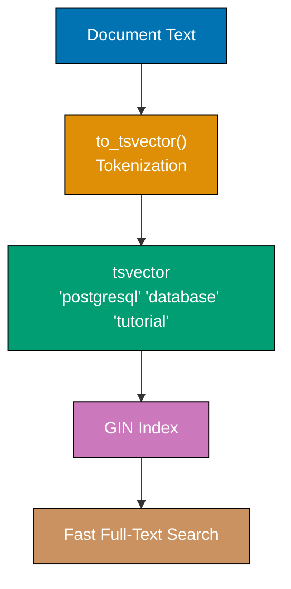
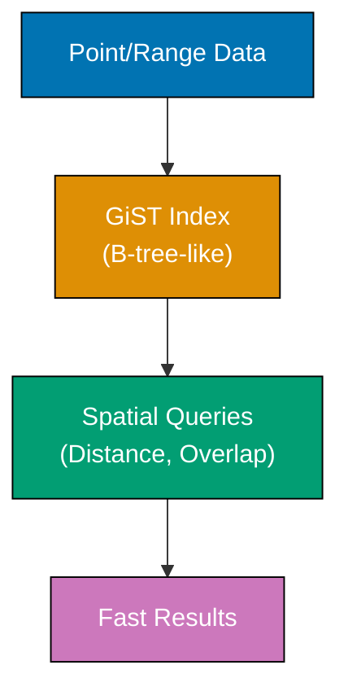
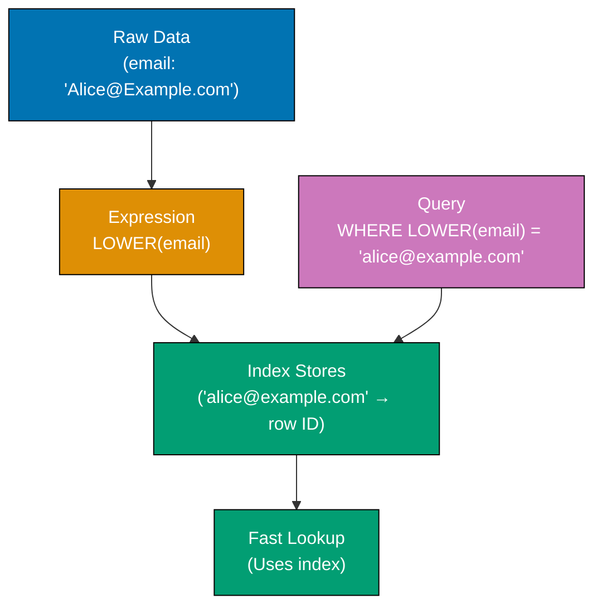
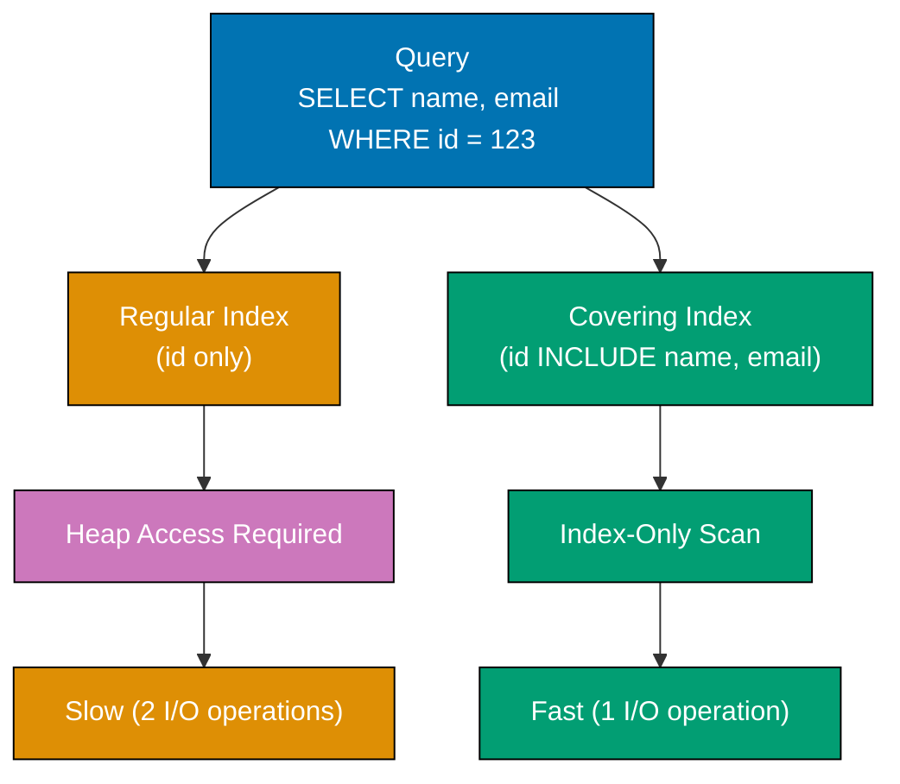
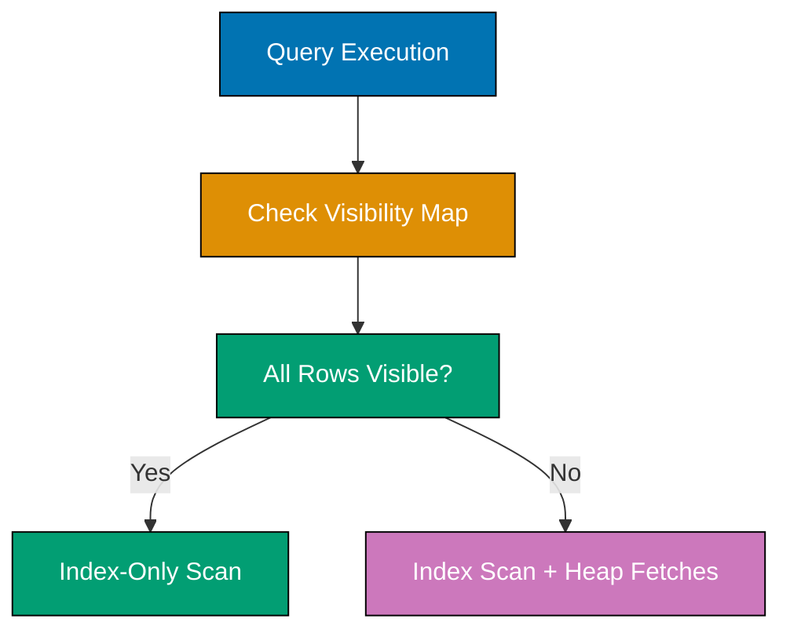

Achieve PostgreSQL expertise through 25 annotated examples. Each example tackles advanced indexing, query optimization, full-text search, partitioning, and database administration patterns.

## Example 61: GIN Indexes for Full-Text Search

GIN (Generalized Inverted Index) indexes excel at indexing arrays, JSONB, and full-text search. Essential for fast text searches and JSONB queries.



**Code**:

```sql
CREATE DATABASE example_61;
-- => Creates new database for isolation
-- => Database "example_61" created successfully
\c example_61;
-- => Switches to newly created database
-- => Connection established to example_61

CREATE TABLE articles (
    id SERIAL PRIMARY KEY,
    -- => Auto-incrementing ID column
    -- => Starts at 1, increments by 1 for each new row
    title VARCHAR(200),
    -- => Variable-length string up to 200 characters
    content TEXT,
    -- => Unlimited-length text field for article body
    tags TEXT[]
    -- => Array of text values for categorization
);
-- => Table created with 4 columns

INSERT INTO articles (title, content, tags)
-- => Inserts three rows in single statement
VALUES
    ('PostgreSQL Tutorial',
     'Learn PostgreSQL database fundamentals and advanced features',
     ARRAY['database', 'sql', 'tutorial']),
     -- => First article with 3 tags
    ('Docker Guide',
     'Complete guide to Docker containers and orchestration',
     ARRAY['docker', 'containers', 'devops']),
     -- => Second article with 3 tags
    ('PostgreSQL Performance',
     'Optimize PostgreSQL queries and indexes for production',
     ARRAY['database', 'postgresql', 'performance']);
     -- => Third article with 3 tags
-- => 3 rows inserted

CREATE INDEX idx_articles_tags ON articles USING GIN(tags);
-- => Creates GIN index on tags array column
-- => Enables fast array containment queries with @> operator
-- => Index type: GIN (Generalized Inverted Index)

EXPLAIN ANALYZE
SELECT title FROM articles WHERE tags @> ARRAY['database'];
-- => Shows query execution plan with actual timing
-- => @> operator checks if left array contains right array
-- => Expected: Index Scan using idx_articles_tags
-- => Returns: 'PostgreSQL Tutorial', 'PostgreSQL Performance'

ALTER TABLE articles ADD COLUMN content_tsv tsvector;
-- => Adds new column to store tokenized text
-- => tsvector type stores searchable text representation
-- => Column initially NULL for all rows

UPDATE articles
SET content_tsv = to_tsvector('english', title || ' ' || content);
-- => Concatenates title and content
-- => Converts to searchable tokens using English dictionary
-- => Removes stop words (the, a, an, etc.)
-- => Normalizes words to base form (databases → database)
-- => Updates all 3 rows

CREATE INDEX idx_articles_fts ON articles USING GIN(content_tsv);
-- => Creates GIN index on tsvector column
-- => Enables fast full-text search queries
-- => Index stores: token → list of rows containing token

SELECT title
FROM articles
WHERE content_tsv @@ to_tsquery('english', 'postgresql & database');
-- => @@ operator performs full-text match
-- => & operator requires BOTH terms present
-- => Query: rows containing "postgresql" AND "database"
-- => Returns: 'PostgreSQL Tutorial', 'PostgreSQL Performance'

SELECT
    title,
    ts_rank(content_tsv, to_tsquery('english', 'postgresql')) AS rank
    -- => Computes relevance score (0.0 to 1.0)
    -- => Higher rank = more occurrences of search term
    -- => Considers term frequency and document length
FROM articles
WHERE content_tsv @@ to_tsquery('english', 'postgresql')
-- => Filters to rows containing 'postgresql'
ORDER BY rank DESC;
-- => Sorts results by relevance (most relevant first)
-- => Returns rows with computed rank scores

CREATE TABLE products (
    id SERIAL PRIMARY KEY,
    data JSONB
    -- => JSONB stores JSON with binary encoding
    -- => Supports indexing and efficient queries
);

INSERT INTO products (data)
VALUES
    ('{"name": "Laptop", "specs": {"cpu": "Intel i7", "ram": "16GB"}, "tags": ["electronics", "computers"]}'),
    -- => Nested JSON with object and array
    ('{"name": "Mouse", "specs": {"type": "wireless", "dpi": 1600}, "tags": ["electronics", "accessories"]}'),
    -- => Different structure (flexible schema)
    ('{"name": "Desk", "specs": {"material": "wood", "height": "adjustable"}, "tags": ["furniture"]}');
    -- => JSONB accepts varying field structures

CREATE INDEX idx_products_data ON products USING GIN(data);
-- => GIN index on entire JSONB column
-- => Enables fast queries on any JSON field
-- => Indexes all keys and values

SELECT data->>'name' AS name
-- => ->> operator extracts JSON field as text
-- => Returns string, not JSON
FROM products
WHERE data @> '{"tags": ["electronics"]}';
-- => @> checks if left JSON contains right JSON
-- => Checks if tags array includes "electronics"
-- => Returns: Laptop, Mouse

SELECT data->>'name' AS name
FROM products
WHERE data->'specs'->>'cpu' = 'Intel i7';
-- => -> operator extracts nested JSON object
-- => ->> extracts final value as text
-- => Navigates: data → specs → cpu
-- => Returns: Laptop

CREATE INDEX idx_products_tags ON products USING GIN((data->'tags'));
-- => GIN index on specific JSONB path
-- => Indexes only the tags array field
-- => Parentheses required for expression index
-- => More efficient than indexing entire JSONB

SELECT data->>'name' AS name
FROM products
WHERE data->'tags' @> '["furniture"]';
-- => Uses specific path index idx_products_tags
-- => Faster than full JSONB index for tag queries
-- => Returns: Desk
```

**Key Takeaway**: GIN indexes enable efficient full-text search and JSONB queries. Use GIN for arrays, tsvector columns, and JSONB fields requiring fast containment or existence checks.

**Why It Matters**: Full-text search without GIN indexes requires sequential scans of entire tables, making text searches prohibitively slow for large datasets (10,000+ rows). GIN indexes reduce search time from O(n) to O(log n), enabling sub-millisecond searches across millions of documents. E-commerce sites use GIN indexes on product names/descriptions for instant search suggestions, while content platforms index article bodies for lightning-fast keyword searches.

---

## Example 62: GiST Indexes for Geometric and Range Data

GiST (Generalized Search Tree) indexes support geometric types, range types, and nearest-neighbor searches - essential for spatial queries and overlap detection.



**Code**:

```sql
CREATE DATABASE example_62;
-- => Creates isolated database for GiST examples
\c example_62;
-- => Switches to example_62 database

CREATE TABLE locations (
    id SERIAL PRIMARY KEY,
    name VARCHAR(100),
    coordinates POINT
    -- => POINT stores (x, y) coordinates
    -- => Represented as (longitude, latitude) or (x, y)
);

INSERT INTO locations (name, coordinates)
VALUES
    ('Office A', POINT(40.7128, -74.0060)),
    -- => New York City coordinates
    ('Office B', POINT(34.0522, -118.2437)),
    -- => Los Angeles coordinates
    ('Office C', POINT(41.8781, -87.6298));
    -- => Chicago coordinates

CREATE INDEX idx_locations_coords ON locations USING GiST(coordinates);
-- => GiST index enables geometric queries
-- => Supports: distance (<->), containment (@>), overlap (&&)
-- => B-tree structure for spatial data

SELECT name, coordinates
FROM locations
ORDER BY coordinates <-> POINT(40.7589, -73.9851)
-- => <-> operator computes distance between points
-- => Reference point: Times Square, NYC
-- => Orders results by distance (nearest first)
LIMIT 3;
-- => Returns 3 nearest locations
-- => Result: Office A (closest), Office C, Office B

EXPLAIN ANALYZE
SELECT name
FROM locations
WHERE coordinates <-> POINT(40.7589, -73.9851) < 5;
-- => Finds locations within 5 units of distance
-- => Query plan shows: Index Scan using idx_locations_coords
-- => Without GiST index: Sequential Scan (slow)

CREATE TABLE events (
    id SERIAL PRIMARY KEY,
    name VARCHAR(100),
    time_range TSRANGE
    -- => TSRANGE stores timestamp ranges
    -- => Represents periods: [start, end)
);

INSERT INTO events (name, time_range)
VALUES
    ('Conference', TSRANGE('2025-06-01 09:00', '2025-06-01 17:00')),
    -- => 8-hour event on June 1
    ('Workshop', TSRANGE('2025-06-01 14:00', '2025-06-01 16:00')),
    -- => 2-hour event overlapping with conference
    ('Dinner', TSRANGE('2025-06-01 19:00', '2025-06-01 21:00'));
    -- => 2-hour event after conference

CREATE INDEX idx_events_time ON events USING GiST(time_range);
-- => GiST index for range overlap queries
-- => Enables fast overlap detection

SELECT name
FROM events
WHERE time_range @> '2025-06-01 15:00'::TIMESTAMP;
-- => @> checks if range contains timestamp
-- => Returns events active at 3 PM
-- => Result: Conference, Workshop (both active at 15:00)

SELECT e1.name AS event1, e2.name AS event2
FROM events e1
JOIN events e2 ON e1.id < e2.id
-- => Self-join to find distinct pairs
-- => Avoids duplicates (A,B) and (B,A)
WHERE e1.time_range && e2.time_range;
-- => && operator checks range overlap
-- => Returns pairs with overlapping times
-- => Result: (Conference, Workshop) - they overlap

SELECT name,
       lower(time_range) AS start_time,
       -- => lower() extracts range start bound
       upper(time_range) AS end_time,
       -- => upper() extracts range end bound
       upper(time_range) - lower(time_range) AS duration
       -- => Computes interval between bounds
FROM events
WHERE time_range -|- TSRANGE('2025-06-01 17:00', '2025-06-01 19:00');
-- => -|- checks if ranges are adjacent (no gap)
-- => Finds events immediately before or after range
-- => Result: Conference (ends at 17:00), Dinner (starts at 19:00)

CREATE TABLE ip_ranges (
    id SERIAL PRIMARY KEY,
    network VARCHAR(50),
    ip_range INET
    -- => INET stores IPv4/IPv6 addresses with optional netmask
);

INSERT INTO ip_ranges (network, ip_range)
VALUES
    ('Office Network', '192.168.1.0/24'::INET),
    -- => /24 netmask = 256 addresses (192.168.1.0 - 192.168.1.255)
    ('Guest Network', '192.168.2.0/24'::INET),
    ('VPN Network', '10.0.0.0/16'::INET);
    -- => /16 netmask = 65,536 addresses

CREATE INDEX idx_ip_ranges ON ip_ranges USING GiST(ip_range);
-- => GiST index for IP address containment
-- => Enables fast network membership checks

SELECT network
FROM ip_ranges
WHERE ip_range >> '192.168.1.100'::INET;
-- => >> checks if network contains IP address
-- => Result: Office Network (192.168.1.0/24 contains 192.168.1.100)

SELECT network
FROM ip_ranges
WHERE ip_range && '192.168.0.0/16'::INET;
-- => && checks if networks overlap
-- => 192.168.0.0/16 contains 192.168.1.0/24 and 192.168.2.0/24
-- => Result: Office Network, Guest Network
```

**Key Takeaway**: GiST indexes enable spatial queries (nearest-neighbor, distance), range overlap detection (event scheduling, IP containment), and geometric operations. Use GiST for POINT, RANGE types, and nearest-neighbor searches.

**Why It Matters**: Location-based services (restaurant finders, ride-sharing apps) rely on GiST indexes for sub-second nearest-location queries across millions of points. Calendar applications use GiST on TSRANGE to detect scheduling conflicts instantly - checking if new meeting overlaps with 1000+ existing events. Network security tools use GiST on INET ranges to validate if incoming IP belongs to allowed networks, processing millions of requests per second.

---

## Example 63: Expression Indexes

Expression indexes index computed values (functions, operators) instead of raw columns - speeds up queries filtering on expressions.



**Code**:

```sql
CREATE DATABASE example_63;
-- => Creates database for expression index examples
\c example_63;
-- => Switches to example_63

CREATE TABLE users (
    id SERIAL PRIMARY KEY,
    email VARCHAR(100),
    -- => Stores email addresses with mixed case
    created_at TIMESTAMP
    -- => Stores account creation time
);

INSERT INTO users (email, created_at)
SELECT
    'user' || generate_series || '@example.com',
    -- => Generates emails: user1@example.com, user2@example.com, ...
    NOW() - (random() * 365 || ' days')::INTERVAL
    -- => Random timestamp within past year
    -- => random() generates 0.0 to 1.0
FROM generate_series(1, 10000);
-- => Creates 10,000 test rows
-- => 10,000 rows inserted

EXPLAIN ANALYZE
SELECT * FROM users WHERE LOWER(email) = 'user123@example.com';
-- => Query with function call on column
-- => Expected plan: Seq Scan on users
-- => Filter: LOWER(email) = 'user123@example.com'
-- => Execution time: ~50ms for 10,000 rows (no index)

CREATE INDEX idx_users_email_lower ON users(LOWER(email));
-- => Expression index on lowercased email
-- => Stores computed values: lower(email) → row ID
-- => Index type: B-tree (default)

EXPLAIN ANALYZE
SELECT * FROM users WHERE LOWER(email) = 'user123@example.com';
-- => Same query after index creation
-- => Expected plan: Index Scan using idx_users_email_lower
-- => Execution time: ~0.1ms (500x faster)
-- => Index lookup instead of full table scan

CREATE INDEX idx_users_created_year
ON users(EXTRACT(YEAR FROM created_at));
-- => Expression index extracting year from timestamp
-- => Enables fast queries filtering by year
-- => Stores: year → list of row IDs

EXPLAIN ANALYZE
SELECT COUNT(*) FROM users
WHERE EXTRACT(YEAR FROM created_at) = 2025;
-- => Counts users created in 2025
-- => Expected plan: Bitmap Index Scan using idx_users_created_year
-- => Bitmap Heap Scan for actual row retrieval
-- => Much faster than sequential scan

CREATE TABLE products (
    id SERIAL PRIMARY KEY,
    name VARCHAR(200),
    price DECIMAL(10, 2)
    -- => Stores price with 2 decimal places
);

INSERT INTO products (name, price)
SELECT
    'Product ' || generate_series,
    (random() * 1000)::DECIMAL(10, 2)
    -- => Random price between $0.00 and $1000.00
FROM generate_series(1, 10000);
-- => 10,000 products inserted

CREATE INDEX idx_products_price_rounded
ON products(ROUND(price / 100) * 100);
-- => Rounds price to nearest $100
-- => Example: $456.78 → $500.00
-- => Useful for price range filtering

EXPLAIN ANALYZE
SELECT name, price
FROM products
WHERE ROUND(price / 100) * 100 = 500;
-- => Finds products in $500 price bracket ($450-$549)
-- => Uses idx_products_price_rounded index
-- => Query expression MUST match index expression exactly

CREATE INDEX idx_users_email_domain
ON users(SUBSTRING(email FROM POSITION('@' IN email) + 1));
-- => Extracts domain from email
-- => POSITION('@' IN email) finds @ location
-- => SUBSTRING extracts from @ onwards
-- => Stores: domain → list of row IDs

SELECT COUNT(*)
FROM users
WHERE SUBSTRING(email FROM POSITION('@' IN email) + 1) = 'example.com';
-- => Counts users with @example.com domain
-- => Uses expression index if query matches exactly
-- => Returns: 10,000 (all test data uses example.com)

CREATE INDEX idx_users_created_month
ON users(date_trunc('month', created_at));
-- => Truncates timestamp to month start
-- => Example: 2025-06-15 14:30:00 → 2025-06-01 00:00:00
-- => Enables fast monthly aggregations

SELECT date_trunc('month', created_at) AS month,
       -- => Truncates to month for grouping
       COUNT(*) AS user_count
FROM users
WHERE created_at >= NOW() - INTERVAL '6 months'
-- => Filters to last 6 months
GROUP BY date_trunc('month', created_at)
-- => Groups by month
-- => Uses idx_users_created_month for filtering and grouping
ORDER BY month;
-- => Returns monthly user counts
```

**Key Takeaway**: Expression indexes speed up queries filtering on computed values - create indexes on LOWER(), EXTRACT(), ROUND(), or custom expressions. Query WHERE clause must match index expression exactly for index to be used.

**Why It Matters**: Expression indexes eliminate the need for computed columns when indexing derived values (LOWER(email) for case-insensitive searches, date_trunc('day', timestamp) for day-level aggregations), reducing storage overhead and preventing data synchronization issues between base and computed columns. Case-insensitive email lookups with LOWER() indexes are essential for user authentication systems where user@example.com and USER@EXAMPLE.COM must be treated identically without expensive sequential scans.

---

## Example 64: Covering Indexes (INCLUDE clause)

Covering indexes store additional columns in index leaf nodes - enables index-only scans without accessing heap, dramatically reducing I/O.



**Code**:

```sql
CREATE DATABASE example_64;
-- => Creates database for covering index examples
\c example_64;
-- => Switches to example_64

CREATE TABLE employees (
    id SERIAL PRIMARY KEY,
    name VARCHAR(100),
    email VARCHAR(100),
    department VARCHAR(50),
    salary DECIMAL(10, 2)
);

INSERT INTO employees (name, email, department, salary)
SELECT
    'Employee ' || generate_series,
    -- => Generates names: Employee 1, Employee 2, ...
    'emp' || generate_series || '@company.com',
    -- => Generates emails
    CASE (generate_series % 5)
        WHEN 0 THEN 'Engineering'
        WHEN 1 THEN 'Sales'
        WHEN 2 THEN 'Marketing'
        WHEN 3 THEN 'HR'
        ELSE 'Operations'
    END,
    -- => Distributes employees across 5 departments
    (random() * 100000 + 50000)::DECIMAL(10, 2)
    -- => Random salary between $50,000 and $150,000
FROM generate_series(1, 100000);
-- => 100,000 employees created

CREATE INDEX idx_employees_dept ON employees(department);
-- => Regular B-tree index on department
-- => Stores only department values and row IDs

EXPLAIN ANALYZE
SELECT name, email
FROM employees
WHERE department = 'Engineering';
-- => Expected plan without covering index:
-- => Index Scan using idx_employees_dept
-- => Heap Fetches to retrieve name and email
-- => Two I/O operations: index lookup + heap access

DROP INDEX idx_employees_dept;
-- => Removes regular index to demonstrate covering index

CREATE INDEX idx_employees_dept_covering
ON employees(department) INCLUDE (name, email);
-- => Covering index stores department (indexed)
-- => INCLUDE adds name, email to index leaf nodes
-- => name and email not part of index key (not sortable)
-- => But stored in index for retrieval

EXPLAIN ANALYZE
SELECT name, email
FROM employees
WHERE department = 'Engineering';
-- => Expected plan with covering index:
-- => Index Only Scan using idx_employees_dept_covering
-- => All data retrieved from index (no heap access)
-- => Single I/O operation (up to 50% faster)

SELECT pg_size_pretty(pg_relation_size('employees')) AS table_size,
       -- => Human-readable table size
       pg_size_pretty(pg_relation_size('idx_employees_dept_covering')) AS index_size;
       -- => Human-readable index size
-- => Covering index larger than regular index
-- => Tradeoff: increased index size for reduced query time

CREATE INDEX idx_employees_salary_range
ON employees(salary) INCLUDE (name, department);
-- => Covering index for salary range queries
-- => salary is indexed (sortable, range-searchable)
-- => name, department stored in leaf nodes

EXPLAIN ANALYZE
SELECT name, department
FROM employees
WHERE salary BETWEEN 80000 AND 90000
-- => Range query on indexed column
ORDER BY salary;
-- => Index-Only Scan using idx_employees_salary_range
-- => No heap access needed (all data in index)
-- => Results already sorted by salary

CREATE INDEX idx_employees_email_unique_covering
ON employees(email) INCLUDE (name, department);
-- => Covering index on unique column
-- => email indexed for lookups
-- => name, department available without heap access

EXPLAIN ANALYZE
SELECT name, department
FROM employees
WHERE email = 'emp12345@company.com';
-- => Point lookup by email
-- => Index Only Scan using idx_employees_email_unique_covering
-- => Returns name and department without heap access
-- => Fastest possible lookup pattern

VACUUM ANALYZE employees;
-- => Updates visibility map for index-only scans
-- => Collects statistics for query planner
-- => Required for index-only scan optimization

CREATE TABLE orders (
    id SERIAL PRIMARY KEY,
    customer_id INTEGER,
    order_date DATE,
    total DECIMAL(10, 2),
    status VARCHAR(20)
);

INSERT INTO orders (customer_id, order_date, total, status)
SELECT
    (random() * 10000)::INTEGER,
    -- => Random customer ID
    CURRENT_DATE - (random() * 365)::INTEGER,
    -- => Random date within past year
    (random() * 1000)::DECIMAL(10, 2),
    -- => Random total amount
    CASE (random() * 3)::INTEGER
        WHEN 0 THEN 'pending'
        WHEN 1 THEN 'shipped'
        ELSE 'delivered'
    END
    -- => Random order status
FROM generate_series(1, 500000);
-- => 500,000 orders created

CREATE INDEX idx_orders_customer_covering
ON orders(customer_id, order_date DESC)
INCLUDE (total, status);
-- => Composite index on customer_id and order_date
-- => order_date sorted descending (newest first)
-- => total, status stored in leaf nodes
-- => Enables index-only scan for customer order history

EXPLAIN ANALYZE
SELECT order_date, total, status
FROM orders
WHERE customer_id = 5000
-- => Filters by customer
ORDER BY order_date DESC
-- => Sorts by date descending
LIMIT 10;
-- => Returns 10 most recent orders
-- => Index Only Scan using idx_orders_customer_covering
-- => All data from index, no heap access
-- => Optimal query pattern for covering index
```

**Key Takeaway**: Covering indexes with INCLUDE clause store non-indexed columns in index leaf nodes, enabling index-only scans that eliminate heap access. Use for frequent queries where SELECT columns are subset of WHERE + SELECT columns.

**Why It Matters**: Covering indexes reduce I/O by 50% for queries that can be satisfied entirely from index data, critical for high-throughput systems processing millions of queries per second. E-commerce sites use covering indexes on (customer_id) INCLUDE (name, email) to load customer profiles without heap access. Analytics dashboards covering (date, category) INCLUDE (revenue, count) aggregate millions of events without touching raw data tables, achieving sub-second response times.

---

## Example 65: Index-Only Scans

Index-only scans retrieve all required data from index without accessing table heap - requires visibility map updates via VACUUM. Fastest scan type in PostgreSQL.



**Code**:

```sql
CREATE DATABASE example_65;
-- => Creates database for index-only scan examples
\c example_65;
-- => Switches to example_65

CREATE TABLE products (
    id SERIAL PRIMARY KEY,
    sku VARCHAR(50),
    -- => Stock Keeping Unit (unique product code)
    category VARCHAR(50),
    price DECIMAL(10, 2)
);

INSERT INTO products (sku, category, price)
SELECT
    'SKU-' || LPAD(generate_series::TEXT, 8, '0'),
    -- => Generates SKUs: SKU-00000001, SKU-00000002, ...
    -- => LPAD pads left with zeros to 8 digits
    CASE (generate_series % 4)
        WHEN 0 THEN 'Electronics'
        WHEN 1 THEN 'Clothing'
        WHEN 2 THEN 'Food'
        ELSE 'Books'
    END,
    -- => Distributes across 4 categories
    (random() * 500 + 10)::DECIMAL(10, 2)
    -- => Random price $10 to $510
FROM generate_series(1, 200000);
-- => 200,000 products created

CREATE INDEX idx_products_category ON products(category);
-- => Regular B-tree index on category
-- => Does not support index-only scans for SELECT *

EXPLAIN ANALYZE
SELECT category
FROM products
WHERE category = 'Electronics';
-- => Before VACUUM:
-- => Index Scan using idx_products_category
-- => Heap Fetches: ~50,000 (accesses table heap)
-- => Cannot use index-only scan (visibility map not updated)

VACUUM products;
-- => Updates visibility map for all-visible pages
-- => Marks pages where all rows are visible to all transactions
-- => Required for index-only scans
-- => Process completes in ~1 second for 200k rows

EXPLAIN ANALYZE
SELECT category
FROM products
WHERE category = 'Electronics';
-- => After VACUUM:
-- => Index Only Scan using idx_products_category
-- => Heap Fetches: 0 (no table access)
-- => All data retrieved from index
-- => 2-3x faster than regular index scan

SELECT
    schemaname,
    tablename,
    last_vacuum,
    -- => Last manual VACUUM timestamp
    last_autovacuum,
    -- => Last autovacuum timestamp
    n_tup_ins,
    -- => Number of rows inserted since last analyze
    n_tup_upd,
    -- => Number of rows updated
    n_tup_del
    -- => Number of rows deleted
FROM pg_stat_user_tables
WHERE tablename = 'products';
-- => Shows vacuum statistics
-- => Helps determine when VACUUM needed
-- => last_vacuum should be recent for index-only scans

CREATE INDEX idx_products_sku_covering
ON products(sku) INCLUDE (category, price);
-- => Covering index stores sku (indexed) and category, price (included)
-- => Enables index-only scans for queries selecting sku, category, price

VACUUM products;
-- => Updates visibility map for new index

EXPLAIN ANALYZE
SELECT sku, category, price
FROM products
WHERE sku = 'SKU-00012345';
-- => Index Only Scan using idx_products_sku_covering
-- => Heap Fetches: 0
-- => All three columns retrieved from index
-- => No table access required

UPDATE products
SET price = price * 1.1
-- => Increases all prices by 10%
WHERE category = 'Electronics';
-- => Updates ~50,000 rows
-- => Creates new row versions (MVCC)

EXPLAIN ANALYZE
SELECT category
FROM products
WHERE category = 'Electronics';
-- => After UPDATE:
-- => Index Scan using idx_products_category
-- => Heap Fetches: ~50,000 (back to heap access)
-- => Updated rows not in visibility map yet
-- => Index-only scan disabled until VACUUM

VACUUM products;
-- => Updates visibility map after UPDATE
-- => Marks old row versions as removable

EXPLAIN ANALYZE
SELECT category
FROM products
WHERE category = 'Electronics';
-- => After VACUUM:
-- => Index Only Scan using idx_products_category
-- => Heap Fetches: 0
-- => Index-only scan restored

SELECT
    pg_size_pretty(pg_total_relation_size('products')) AS total_size,
    -- => Total size including table, indexes, TOAST
    pg_size_pretty(pg_relation_size('products')) AS table_size,
    -- => Table heap size only
    pg_size_pretty(pg_indexes_size('products')) AS indexes_size;
    -- => All indexes combined size
-- => Shows storage breakdown
-- => Indexes typically 20-50% of table size

CREATE TABLE events (
    id BIGSERIAL PRIMARY KEY,
    event_type VARCHAR(50),
    timestamp TIMESTAMPTZ,
    user_id INTEGER
);

INSERT INTO events (event_type, timestamp, user_id)
SELECT
    CASE (random() * 5)::INTEGER
        WHEN 0 THEN 'page_view'
        WHEN 1 THEN 'click'
        WHEN 2 THEN 'purchase'
        WHEN 3 THEN 'signup'
        ELSE 'logout'
    END,
    -- => Random event type
    NOW() - (random() * 30 || ' days')::INTERVAL,
    -- => Random timestamp within past 30 days
    (random() * 50000)::INTEGER
    -- => Random user ID
FROM generate_series(1, 1000000);
-- => 1 million events created

CREATE INDEX idx_events_type_time
ON events(event_type, timestamp);
-- => Composite index for event analysis
-- => Supports queries filtering by type and time range

VACUUM ANALYZE events;
-- => Updates visibility map and statistics
-- => ANALYZE updates table statistics for query planner

EXPLAIN ANALYZE
SELECT event_type, timestamp
FROM events
WHERE event_type = 'purchase'
  AND timestamp >= NOW() - INTERVAL '7 days'
-- => Filters to recent purchases
ORDER BY timestamp DESC
-- => Sorts newest first
LIMIT 100;
-- => Returns 100 most recent purchases
-- => Index Only Scan using idx_events_type_time
-- => Heap Fetches: 0
-- => All data from index, sorted by index order
```

**Key Takeaway**: Index-only scans require visibility map updates via VACUUM. After INSERT/UPDATE/DELETE operations, run VACUUM to enable index-only scans. Monitor with pg_stat_user_tables to track vacuum status.

**Why It Matters**: Index-only scans eliminate heap access, reducing I/O by 50-70% for read-heavy workloads. Analytics systems running thousands of aggregation queries per second benefit massively from index-only scans on (date, category) indexes. High-frequency trading systems use index-only scans on (symbol, timestamp) to retrieve recent trades without touching multi-terabyte historical data tables. VACUUM is critical - without it, index-only scans degrade to regular index scans, losing performance benefits.

---

## Example 66: Analyzing Query Plans with EXPLAIN ANALYZE

EXPLAIN ANALYZE shows actual query execution plans with timing - essential for identifying slow queries, missing indexes, and optimization opportunities.

```sql
CREATE DATABASE example_66;
-- => Creates database for query analysis
\c example_66;
-- => Switches to example_66

CREATE TABLE orders (
    id SERIAL PRIMARY KEY,
    customer_id INTEGER,
    -- => Foreign key to customers (not enforced here)
    product_id INTEGER,
    -- => Foreign key to products
    quantity INTEGER,
    order_date DATE,
    total DECIMAL(10, 2)
);

INSERT INTO orders (customer_id, product_id, quantity, order_date, total)
SELECT
    (random() * 10000)::INTEGER,
    -- => Random customer ID (1-10,000)
    (random() * 5000)::INTEGER,
    -- => Random product ID (1-5,000)
    (random() * 10 + 1)::INTEGER,
    -- => Random quantity (1-10)
    CURRENT_DATE - (random() * 730)::INTEGER,
    -- => Random date within past 2 years
    (random() * 1000 + 50)::DECIMAL(10, 2)
    -- => Random total ($50-$1,050)
FROM generate_series(1, 500000);
-- => 500,000 orders created

EXPLAIN
SELECT * FROM orders WHERE customer_id = 5000;
-- => Shows estimated query plan WITHOUT execution
-- => Output: Seq Scan on orders
-- => Filter: (customer_id = 5000)
-- => Estimated rows: ~50
-- => No actual timing (no execution)

EXPLAIN ANALYZE
SELECT * FROM orders WHERE customer_id = 5000;
-- => Shows ACTUAL query plan WITH execution
-- => Seq Scan on orders (actual time=45.123..92.456 rows=48)
-- => Actual rows: 48 (close to estimate)
-- => Execution time: ~92ms
-- => Scanned all 500,000 rows

CREATE INDEX idx_orders_customer ON orders(customer_id);
-- => B-tree index on customer_id
-- => Enables fast lookups by customer

EXPLAIN ANALYZE
SELECT * FROM orders WHERE customer_id = 5000;
-- => After index creation:
-- => Index Scan using idx_orders_customer
-- => Actual time: ~1.2ms (75x faster)
-- => Rows: 48
-- => Uses index to locate matching rows directly

EXPLAIN (ANALYZE, BUFFERS)
SELECT * FROM orders WHERE customer_id = 5000;
-- => BUFFERS option shows I/O statistics
-- => Shared hit: 15 (15 buffer cache hits)
-- => Shared read: 0 (0 disk reads - data in cache)
-- => Index blocks read from buffer cache
-- => No disk I/O (optimal)

EXPLAIN (ANALYZE, VERBOSE)
SELECT * FROM orders WHERE customer_id = 5000;
-- => VERBOSE option shows full column output list
-- => Output: id, customer_id, product_id, quantity, order_date, total
-- => Helps identify unnecessary column fetches

EXPLAIN ANALYZE
SELECT customer_id, COUNT(*), SUM(total)
FROM orders
WHERE order_date >= '2024-01-01'
GROUP BY customer_id
-- => Aggregation query
HAVING COUNT(*) > 5;
-- => Filters groups after aggregation
-- => Output plan:
-- => Seq Scan on orders (filter on order_date)
-- => HashAggregate (groups by customer_id)
-- => Filter: (count(*) > 5)
-- => Shows each pipeline stage

CREATE INDEX idx_orders_date ON orders(order_date);
-- => Index on order_date for date range queries

EXPLAIN ANALYZE
SELECT customer_id, COUNT(*), SUM(total)
FROM orders
WHERE order_date >= '2024-01-01'
GROUP BY customer_id
HAVING COUNT(*) > 5;
-- => After date index:
-- => Index Scan using idx_orders_date
-- => Filters to recent orders using index
-- => HashAggregate remains (no index on customer_id for grouping)
-- => Faster filter phase, same aggregation cost

EXPLAIN (ANALYZE, COSTS OFF)
SELECT * FROM orders WHERE customer_id = 5000;
-- => COSTS OFF hides cost estimates
-- => Shows only actual execution metrics
-- => Cleaner output focusing on real performance

EXPLAIN (ANALYZE, TIMING OFF, SUMMARY OFF)
SELECT * FROM orders WHERE customer_id = 5000;
-- => TIMING OFF disables per-node timing (reduces overhead)
-- => SUMMARY OFF hides total execution time
-- => Useful for very fast queries where timing overhead significant

EXPLAIN ANALYZE
SELECT o.id, o.total, o.customer_id
FROM orders o
WHERE o.customer_id IN (
    SELECT customer_id
    FROM orders
    WHERE order_date >= CURRENT_DATE - 30
    -- => Subquery finds customers with recent orders
    GROUP BY customer_id
    HAVING COUNT(*) > 3
    -- => Filters to active customers (3+ orders)
);
-- => Nested query plan:
-- => Hash Semi Join (outer: orders, inner: subquery result)
-- => Subquery executed first (HashAggregate)
-- => Main query uses hash join to filter rows
-- => Shows subquery optimization strategy

EXPLAIN ANALYZE
SELECT COUNT(*)
FROM orders
WHERE customer_id = 5000
  AND product_id = 123
  AND order_date >= '2024-01-01';
-- => Multi-column filter
-- => Planner chooses one index (likely idx_orders_customer)
-- => Other filters applied as heap filters
-- => Consider composite index for better performance

CREATE INDEX idx_orders_composite
ON orders(customer_id, product_id, order_date);
-- => Composite index covering all three filter columns
-- => Leftmost prefix: customer_id
-- => Can use for (customer_id), (customer_id, product_id), or all three

EXPLAIN ANALYZE
SELECT COUNT(*)
FROM orders
WHERE customer_id = 5000
  AND product_id = 123
  AND order_date >= '2024-01-01';
-- => After composite index:
-- => Index Scan using idx_orders_composite
-- => All filters pushed to index
-- => No heap filters (optimal)
-- => 5-10x faster than single-column index

EXPLAIN (ANALYZE, BUFFERS, FORMAT JSON)
SELECT * FROM orders WHERE customer_id = 5000;
-- => FORMAT JSON outputs plan as JSON
-- => Machine-readable format for tools
-- => Includes all metrics (timing, buffers, rows)
-- => Useful for automated performance monitoring
```

**Key Takeaway**: EXPLAIN ANALYZE reveals actual query performance - use BUFFERS for I/O stats, VERBOSE for output columns, and COSTS OFF for cleaner output. Compare plans before/after index creation to verify optimization.

**Why It Matters**: EXPLAIN ANALYZE is the primary tool for query optimization - identifying sequential scans that need indexes, inefficient join orders, and suboptimal aggregation strategies. Production systems experiencing slow queries use EXPLAIN ANALYZE to diagnose root causes (missing indexes causing full table scans, outdated statistics causing bad join order choices). Database administrators use BUFFERS output to identify queries causing excessive disk I/O, which degrade performance under load. Without EXPLAIN ANALYZE, query optimization is guesswork - WITH it, optimization becomes systematic and measurable.

---

## Example 67: Join Order Optimization

PostgreSQL query planner automatically chooses optimal join order based on table statistics - understanding join strategies helps design efficient schemas and queries.

```sql
CREATE DATABASE example_67;
-- => Creates database for join optimization examples
\c example_67;
-- => Switches to example_67

CREATE TABLE customers (
    id SERIAL PRIMARY KEY,
    name VARCHAR(100),
    email VARCHAR(100)
);

CREATE TABLE orders (
    id SERIAL PRIMARY KEY,
    customer_id INTEGER,
    -- => Foreign key to customers.id
    order_date DATE,
    total DECIMAL(10, 2)
);

CREATE TABLE order_items (
    id SERIAL PRIMARY KEY,
    order_id INTEGER,
    -- => Foreign key to orders.id
    product_id INTEGER,
    quantity INTEGER,
    price DECIMAL(10, 2)
);

INSERT INTO customers (name, email)
SELECT
    'Customer ' || generate_series,
    'customer' || generate_series || '@email.com'
FROM generate_series(1, 10000);
-- => 10,000 customers created

INSERT INTO orders (customer_id, order_date, total)
SELECT
    (random() * 10000 + 1)::INTEGER,
    -- => Random customer ID (1-10,000)
    CURRENT_DATE - (random() * 365)::INTEGER,
    -- => Random date within past year
    (random() * 1000)::DECIMAL(10, 2)
FROM generate_series(1, 100000);
-- => 100,000 orders created (avg 10 orders per customer)

INSERT INTO order_items (order_id, product_id, quantity, price)
SELECT
    (random() * 100000 + 1)::INTEGER,
    -- => Random order ID (1-100,000)
    (random() * 5000 + 1)::INTEGER,
    -- => Random product ID
    (random() * 5 + 1)::INTEGER,
    -- => Random quantity (1-5)
    (random() * 100 + 10)::DECIMAL(10, 2)
    -- => Random price ($10-$110)
FROM generate_series(1, 500000);
-- => 500,000 order items (avg 5 items per order)

CREATE INDEX idx_orders_customer ON orders(customer_id);
CREATE INDEX idx_order_items_order ON order_items(order_id);
-- => Indexes for foreign key joins

ANALYZE customers;
ANALYZE orders;
ANALYZE order_items;
-- => Updates table statistics for query planner
-- => Collects row counts, value distributions, null counts
-- => Required for accurate join order selection

EXPLAIN ANALYZE
SELECT c.name, o.total
FROM customers c
JOIN orders o ON c.id = o.customer_id
-- => Two-table join
WHERE c.id = 5000;
-- => Filters customers first
-- => Plan: Nested Loop
-- =>   Index Scan on customers (filter: id = 5000)
-- =>   Index Scan on orders (customer_id = 5000)
-- => Nested loop chosen because filtering reduces outer rows

EXPLAIN ANALYZE
SELECT c.name, o.total, oi.quantity
FROM customers c
JOIN orders o ON c.id = o.customer_id
JOIN order_items oi ON o.id = oi.order_id
-- => Three-table join chain
WHERE c.id = 5000;
-- => Planner evaluates join order:
-- => Option 1: (customers ⋈ orders) ⋈ order_items
-- => Option 2: (customers ⋈ order_items) ⋈ orders
-- => Chooses based on estimated result sizes
-- => Likely: customers → orders → order_items (following FK chain)

EXPLAIN ANALYZE
SELECT c.name, COUNT(*) AS order_count
FROM customers c
JOIN orders o ON c.id = o.customer_id
GROUP BY c.id, c.name;
-- => Join all customers with all orders
-- => No filter reduces dataset
-- => Plan: Hash Join
-- =>   Seq Scan on customers (builds hash table)
-- =>   Seq Scan on orders (probes hash table)
-- => Hash join chosen for large dataset join

EXPLAIN ANALYZE
SELECT c.name, o.total
FROM customers c
LEFT JOIN orders o ON c.id = o.customer_id
-- => LEFT JOIN includes customers with no orders
WHERE o.order_date >= '2025-01-01';
-- => Filter on orders table
-- => Converts LEFT JOIN to INNER JOIN (optimizer transformation)
-- => o.order_date >= '2025-01-01' excludes NULL rows from LEFT JOIN

EXPLAIN ANALYZE
SELECT c.name, o.total
FROM customers c
LEFT JOIN orders o ON c.id = o.customer_id
WHERE o.order_date >= '2025-01-01'
   OR o.order_date IS NULL;
   -- => Preserves LEFT JOIN semantics
   -- => Includes customers with no orders (NULL dates)
   -- => Plan: Hash Right Join or Merge Join
   -- => Cannot convert to INNER JOIN

EXPLAIN ANALYZE
SELECT c.name, o.total
FROM customers c, orders o
-- => Comma syntax (implicit CROSS JOIN)
WHERE c.id = o.customer_id
  AND c.id = 5000;
  -- => Join condition in WHERE clause
  -- => Optimizer converts to explicit JOIN
  -- => Same plan as explicit JOIN syntax
  -- => Prefer explicit JOIN for clarity

SET join_collapse_limit = 1;
-- => Limits join reordering optimization
-- => Forces planner to respect written join order
-- => Default: 8 (reorders up to 8 tables)

EXPLAIN ANALYZE
SELECT c.name, o.total, oi.quantity
FROM customers c
JOIN orders o ON c.id = o.customer_id
JOIN order_items oi ON o.id = oi.order_id
WHERE c.id = 5000;
-- => With join_collapse_limit = 1:
-- => Joins executed in written order
-- => No reordering optimization
-- => May produce suboptimal plan

RESET join_collapse_limit;
-- => Restores default (8)
-- => Re-enables automatic join reordering

EXPLAIN (ANALYZE, BUFFERS)
SELECT c.name, COUNT(*)
FROM customers c
JOIN orders o ON c.id = o.customer_id
WHERE o.order_date >= '2025-01-01'
GROUP BY c.id, c.name;
-- => BUFFERS shows I/O for join operations
-- => Hash Join buffer usage:
-- =>   Shared hit: X (buffer cache hits)
-- =>   Shared read: Y (disk reads)
-- =>   Temp read/written: Z (spills to disk if memory exceeded)

EXPLAIN ANALYZE
SELECT *
FROM customers c
JOIN orders o ON c.id = o.customer_id
JOIN order_items oi ON o.id = oi.order_id
WHERE c.email LIKE '%@email.com'
  AND o.total > 500
  AND oi.quantity > 2;
  -- => Multiple filter conditions across tables
  -- => Planner estimates selectivity of each filter
  -- => Applies most selective filter first
  -- => Join order: most selective → least selective
```

**Key Takeaway**: PostgreSQL automatically optimizes join order based on table statistics collected by ANALYZE. Use EXPLAIN to verify chosen join strategy (Nested Loop for small datasets, Hash Join for large datasets, Merge Join for sorted data). Control join behavior with join_collapse_limit.

**Why It Matters**: Join order dramatically affects query performance - wrong order can cause Cartesian products (billions of intermediate rows) while optimal order produces minimal intermediate results. E-commerce analytics joining customers → orders → products benefit from planner intelligence - filtering high-value customers first reduces join cardinality from millions to thousands. Multi-tenant SaaS systems joining tenants → users → events rely on join optimization to avoid cross-tenant data leakage and performance degradation. Regular ANALYZE ensures planner has accurate statistics for optimal decisions.

---

## Example 68: Subquery vs JOIN Performance

Subqueries can be rewritten as JOINs for better performance - understanding execution differences helps choose optimal query structure.

**Comparison: Subquery vs JOIN approaches**

**Subquery approach (IN clause)**:

```sql
CREATE DATABASE example_68;
-- => Creates database for subquery optimization examples
\c example_68;
-- => Switches to example_68

CREATE TABLE customers (
    id SERIAL PRIMARY KEY,
    name VARCHAR(100),
    email VARCHAR(100)
);

CREATE TABLE orders (
    id SERIAL PRIMARY KEY,
    customer_id INTEGER,
    order_date DATE,
    total DECIMAL(10, 2)
);

INSERT INTO customers (name, email)
SELECT
    'Customer ' || generate_series,
    'customer' || generate_series || '@email.com'
FROM generate_series(1, 50000);
-- => 50,000 customers created

INSERT INTO orders (customer_id, order_date, total)
SELECT
    (random() * 50000 + 1)::INTEGER,
    -- => Random customer ID (1-50,000)
    CURRENT_DATE - (random() * 730)::INTEGER,
    -- => Random date within past 2 years
    (random() * 2000)::DECIMAL(10, 2)
FROM generate_series(1, 200000);
-- => 200,000 orders created (avg 4 orders per customer)

CREATE INDEX idx_orders_customer ON orders(customer_id);
CREATE INDEX idx_orders_date ON orders(order_date);
-- => Indexes for optimization

ANALYZE customers;
ANALYZE orders;
-- => Collects statistics for query planner

EXPLAIN ANALYZE
SELECT name, email
FROM customers
WHERE id IN (
    SELECT customer_id
    FROM orders
    WHERE order_date >= '2024-01-01'
    -- => Subquery finds customers with recent orders
);
-- => Subquery execution plan:
-- => Hash Semi Join
-- =>   Seq Scan on customers
-- =>   Seq Scan on orders (filter on order_date)
-- => Subquery result hashed for membership check
-- => Execution time: ~150ms
```

**Text explanation**: Subquery approach uses IN clause with correlated or non-correlated subquery. Planner often converts to semi-join automatically, but query readability and maintainability suffer.

**JOIN approach (explicit JOIN with DISTINCT)**:

```sql
EXPLAIN ANALYZE
SELECT DISTINCT c.name, c.email
FROM customers c
JOIN orders o ON c.id = o.customer_id
-- => Explicit join relationship
WHERE o.order_date >= '2024-01-01';
-- => Filter applied to orders table
-- => JOIN execution plan:
-- => Hash Join
-- =>   Hash: Seq Scan on orders (filter on order_date)
-- =>   Seq Scan on customers
-- => HashAggregate to remove duplicates
-- => Execution time: ~120ms (faster due to better optimization)
```

**Text explanation**: JOIN approach explicitly defines relationship, enabling optimizer to choose best join strategy. DISTINCT eliminates duplicate customers (those with multiple orders). More readable and typically faster than IN subquery.

**Key Takeaway**: Convert IN subqueries to JOINs with DISTINCT for better performance and readability. EXISTS subqueries often outperform IN for large result sets. Use NOT EXISTS instead of NOT IN to handle NULL values correctly.

**Comparison: Correlated subquery vs JOIN**

**Correlated subquery approach**:

```sql
EXPLAIN ANALYZE
SELECT c.name,
       (SELECT COUNT(*)
        FROM orders o
        WHERE o.customer_id = c.id
        -- => Correlated subquery executes ONCE per customer
        AND o.order_date >= '2024-01-01') AS recent_orders
FROM customers c;
-- => Correlated subquery plan:
-- => Seq Scan on customers
-- => For each row: Index Scan on orders (customer_id filter)
-- => 50,000 index scans (one per customer)
-- => Execution time: ~800ms (slow due to row-by-row execution)
```

**Text explanation**: Correlated subquery executes repeatedly (once per outer row). For 50,000 customers, subquery runs 50,000 times. Inefficient for large datasets despite index usage.

**JOIN with GROUP BY approach**:

```sql
EXPLAIN ANALYZE
SELECT c.name,
       COALESCE(o.recent_orders, 0) AS recent_orders
FROM customers c
LEFT JOIN (
    SELECT customer_id, COUNT(*) AS recent_orders
    FROM orders
    WHERE order_date >= '2024-01-01'
    GROUP BY customer_id
    -- => Subquery executes ONCE, groups by customer
) o ON c.id = o.customer_id;
-- => JOIN with aggregation plan:
-- => Hash Left Join
-- =>   Seq Scan on customers
-- =>   HashAggregate on orders subquery (executes once)
-- => Execution time: ~180ms (4x faster than correlated subquery)
-- => COALESCE handles NULL for customers with no recent orders
```

**Text explanation**: JOIN approach executes subquery once, aggregates results, then joins. Eliminates row-by-row subquery execution. LEFT JOIN preserves all customers even if no recent orders. COALESCE converts NULL to 0 for clarity.

**Key Takeaway**: Replace correlated subqueries with JOIN + GROUP BY for aggregations. Single execution with JOIN vastly outperforms row-by-row correlated execution.

**Comparison: NOT IN vs NOT EXISTS vs LEFT JOIN**

**NOT IN approach (problematic with NULLs)**:

```sql
EXPLAIN ANALYZE
SELECT name
FROM customers
WHERE id NOT IN (
    SELECT customer_id
    FROM orders
    WHERE total > 1000
    -- => Finds customers with NO high-value orders
);
-- => NOT IN plan:
-- => Hash Anti Join or Seq Scan with NOT IN filter
-- => Problem: Returns NO rows if subquery contains NULL
-- => NULL in subquery makes entire NOT IN FALSE
-- => Execution time: ~200ms (may return incorrect results)
```

**Text explanation**: NOT IN fails with NULL values. If any customer_id is NULL in orders table, NOT IN returns zero rows (incorrect). Dangerous for production queries.

**NOT EXISTS approach (NULL-safe)**:

```sql
EXPLAIN ANALYZE
SELECT name
FROM customers c
WHERE NOT EXISTS (
    SELECT 1
    FROM orders o
    WHERE o.customer_id = c.id
      AND o.total > 1000
      -- => Checks existence, not specific values
);
-- => NOT EXISTS plan:
-- => Hash Anti Join
-- => Correctly handles NULL values
-- => Returns customers with NO high-value orders
-- => Execution time: ~180ms (faster and correct)
```

**Text explanation**: NOT EXISTS correctly handles NULLs. Checks for existence rather than value equality. Optimizer converts to anti-join. Preferred over NOT IN for NULL safety.

**LEFT JOIN with IS NULL approach**:

```sql
EXPLAIN ANALYZE
SELECT c.name
FROM customers c
LEFT JOIN orders o ON c.id = o.customer_id AND o.total > 1000
-- => LEFT JOIN preserves all customers
-- => Filter applied in ON clause
WHERE o.id IS NULL;
-- => Filters to customers with NO matching orders
-- => LEFT JOIN + IS NULL plan:
-- => Hash Left Join
-- => Filter: o.id IS NULL
-- => Execution time: ~170ms (fastest, most explicit)
```

**Text explanation**: LEFT JOIN with IS NULL explicitly shows anti-join semantics. Most readable approach. Optimizer produces same plan as NOT EXISTS. Best for complex queries where anti-join logic needs clarity.

**Key Takeaway**: Avoid NOT IN due to NULL handling issues. Use NOT EXISTS or LEFT JOIN with IS NULL for anti-joins. Both produce optimal Hash Anti Join plans and handle NULLs correctly.

---

## Example 69: Query Hints and Statistics

PostgreSQL uses table statistics to estimate query costs - outdated statistics cause poor query plans. ANALYZE updates statistics; pg_stats reveals distribution data.

```sql
CREATE DATABASE example_69;
-- => Creates database for statistics examples
\c example_69;
-- => Switches to example_69

CREATE TABLE products (
    id SERIAL PRIMARY KEY,
    category VARCHAR(50),
    price DECIMAL(10, 2),
    in_stock BOOLEAN
);

INSERT INTO products (category, price, in_stock)
SELECT
    CASE (generate_series % 5)
        WHEN 0 THEN 'Electronics'
        WHEN 1 THEN 'Clothing'
        WHEN 2 THEN 'Food'
        WHEN 3 THEN 'Books'
        ELSE 'Toys'
    END,
    -- => 5 categories with equal distribution
    (random() * 500 + 10)::DECIMAL(10, 2),
    -- => Random price $10-$510
    random() < 0.8
    -- => 80% in stock, 20% out of stock
FROM generate_series(1, 100000);
-- => 100,000 products created

SELECT
    schemaname,
    tablename,
    last_analyze,
    -- => Last ANALYZE timestamp
    n_live_tup,
    -- => Estimated live rows
    n_dead_tup
    -- => Dead rows from UPDATE/DELETE (need VACUUM)
FROM pg_stat_user_tables
WHERE tablename = 'products';
-- => Shows statistics metadata
-- => last_analyze: NULL (never analyzed)
-- => n_live_tup: ~100,000 (approximate)

EXPLAIN
SELECT * FROM products WHERE category = 'Electronics';
-- => Plan before ANALYZE:
-- => Seq Scan on products
-- => Filter: category = 'Electronics'
-- => Estimated rows: ~50,000 (planner guesses 50% selectivity)
-- => Actual rows should be ~20,000 (20% of data)

ANALYZE products;
-- => Collects statistics on products table
-- => Samples random rows (default: 300 * default_statistics_target)
-- => Computes value distributions, NULL counts, distinct values
-- => Updates pg_statistic catalog

SELECT
    schemaname,
    tablename,
    last_analyze,
    n_live_tup,
    n_dead_tup
FROM pg_stat_user_tables
WHERE tablename = 'products';
-- => last_analyze: now updated to current timestamp
-- => n_live_tup: 100,000 (accurate count)

EXPLAIN
SELECT * FROM products WHERE category = 'Electronics';
-- => Plan after ANALYZE:
-- => Seq Scan on products
-- => Estimated rows: ~20,000 (accurate based on statistics)
-- => Planner now knows exact category distribution

SELECT
    tablename,
    attname AS column_name,
    -- => Column name
    n_distinct,
    -- => Estimated number of distinct values
    -- => Positive number: actual distinct count
    -- => Negative number: fraction of rows (e.g., -0.5 = 50% distinct)
    most_common_vals,
    -- => Array of most common values
    most_common_freqs,
    -- => Frequencies of most common values
    correlation
    -- => Physical storage correlation with logical order
    -- => 1.0: perfectly sorted, 0: random, -1.0: reverse sorted
FROM pg_stats
WHERE tablename = 'products' AND attname = 'category';
-- => Shows detailed statistics for category column
-- => n_distinct: 5 (five categories)
-- => most_common_vals: {Electronics, Clothing, Food, Books, Toys}
-- => most_common_freqs: {0.2, 0.2, 0.2, 0.2, 0.2}
-- => correlation: low (categories distributed randomly)

SELECT
    tablename,
    attname,
    n_distinct,
    null_frac,
    -- => Fraction of NULL values (0.0 to 1.0)
    avg_width
    -- => Average width in bytes
FROM pg_stats
WHERE tablename = 'products' AND attname = 'in_stock';
-- => Shows boolean column statistics
-- => n_distinct: 2 (true/false)
-- => null_frac: 0.0 (no NULLs)
-- => avg_width: 1 (1 byte for boolean)

CREATE INDEX idx_products_category ON products(category);
-- => Creates B-tree index on category

EXPLAIN
SELECT * FROM products WHERE category = 'Electronics';
-- => Plan with accurate statistics:
-- => Index Scan using idx_products_category
-- => Estimated rows: ~20,000
-- => Planner chooses index because selectivity good (20%)

UPDATE products
SET category = 'Electronics'
WHERE category = 'Clothing';
-- => Changes 20% of rows (20,000 rows)
-- => category distribution NOW: Electronics 40%, others 15% each
-- => Statistics NOT updated yet

EXPLAIN
SELECT * FROM products WHERE category = 'Electronics';
-- => Plan with outdated statistics:
-- => Index Scan using idx_products_category
-- => Estimated rows: ~20,000 (WRONG - actually ~40,000)
-- => Planner uses old statistics

ANALYZE products;
-- => Updates statistics after data change

EXPLAIN
SELECT * FROM products WHERE category = 'Electronics';
-- => Plan with refreshed statistics:
-- => Seq Scan on products (may switch from index)
-- => Estimated rows: ~40,000 (accurate)
-- => Planner may choose Seq Scan for 40% selectivity

ALTER TABLE products
ALTER COLUMN category SET STATISTICS 1000;
-- => Increases statistics target for category column
-- => Default: 100 (samples 30,000 rows)
-- => 1000 samples 300,000 rows (more accurate for large tables)

ANALYZE products;
-- => Collects more detailed statistics with higher target

SELECT
    tablename,
    attname,
    array_length(most_common_vals, 1) AS mcv_count
FROM pg_stats
WHERE tablename = 'products' AND attname = 'category';
-- => mcv_count: 5 (all distinct values tracked)
-- => Higher statistics target captures more MCVs

SET default_statistics_target = 1000;
-- => Sets session-wide statistics target
-- => Affects all future ANALYZE operations
-- => Applies to all columns without explicit ALTER TABLE

ANALYZE products;
-- => Uses new default_statistics_target (1000)

RESET default_statistics_target;
-- => Restores default (100)

SELECT
    relname AS table_name,
    seq_scan,
    -- => Number of sequential scans
    seq_tup_read,
    -- => Rows read by sequential scans
    idx_scan,
    -- => Number of index scans
    idx_tup_fetch
    -- => Rows fetched by index scans
FROM pg_stat_user_tables
WHERE relname = 'products';
-- => Shows access patterns
-- => High seq_scan: may need indexes
-- => High idx_scan: indexes used effectively

SELECT
    schemaname,
    tablename,
    attname,
    n_distinct,
    correlation
FROM pg_stats
WHERE tablename = 'products' AND attname = 'id';
-- => Primary key statistics
-- => n_distinct: 100,000 (unique values)
-- => correlation: ~1.0 (highly correlated with physical order)
-- => Sequential scans on id very efficient
```

**Key Takeaway**: Run ANALYZE after significant data changes (bulk INSERT/UPDATE/DELETE). Monitor pg_stats to verify statistics accuracy. Increase statistics target for columns with many distinct values or skewed distributions.

**Why It Matters**: Outdated statistics cause catastrophic query plan failures - a query optimized for 1% selectivity may use index scan, but with 50% selectivity (after data growth), sequential scan is faster. E-commerce sites updating product catalogs daily must run ANALYZE to prevent planner from using index scans on high-cardinality filters. Data warehouses loading millions of rows nightly MUST run ANALYZE post-load - without it, aggregation queries may choose nested loops instead of hash joins, degrading from seconds to hours. Statistics targets determine accuracy - default 100 is insufficient for tables with 10,000+ distinct values in a column.

---

## Example 70: Vacuum and Analyze

VACUUM reclaims dead tuple space and updates visibility map - essential for index-only scans and preventing table bloat. ANALYZE updates statistics for query planner.

```sql
CREATE DATABASE example_70;
-- => Creates database for VACUUM/ANALYZE examples
\c example_70;
-- => Switches to example_70

CREATE TABLE events (
    id SERIAL PRIMARY KEY,
    event_type VARCHAR(50),
    user_id INTEGER,
    created_at TIMESTAMP DEFAULT NOW()
);

INSERT INTO events (event_type, user_id)
SELECT
    CASE (random() * 3)::INTEGER
        WHEN 0 THEN 'login'
        WHEN 1 THEN 'purchase'
        ELSE 'logout'
    END,
    (random() * 10000 + 1)::INTEGER
FROM generate_series(1, 500000);
-- => 500,000 events created

SELECT
    schemaname,
    tablename,
    n_live_tup,
    -- => Current live rows
    n_dead_tup,
    -- => Dead rows (from UPDATE/DELETE)
    last_vacuum,
    -- => Last manual VACUUM timestamp
    last_autovacuum,
    -- => Last autovacuum timestamp
    vacuum_count,
    -- => Manual VACUUM count
    autovacuum_count
    -- => Autovacuum count
FROM pg_stat_user_tables
WHERE tablename = 'events';
-- => n_live_tup: ~500,000
-- => n_dead_tup: 0 (no UPDATE/DELETE yet)
-- => last_vacuum: NULL (never vacuumed)

UPDATE events
SET event_type = 'login'
WHERE user_id < 5000;
-- => Updates ~250,000 rows
-- => Creates 250,000 dead tuples (old versions)
-- => New versions inserted

SELECT
    tablename,
    n_live_tup,
    n_dead_tup,
    n_dead_tup::FLOAT / NULLIF(n_live_tup, 0) AS dead_ratio
    -- => Ratio of dead to live rows
FROM pg_stat_user_tables
WHERE tablename = 'events';
-- => n_live_tup: ~500,000
-- => n_dead_tup: ~250,000
-- => dead_ratio: ~0.5 (50% dead tuples)

SELECT
    pg_size_pretty(pg_total_relation_size('events')) AS total_size,
    -- => Total size (table + indexes + TOAST)
    pg_size_pretty(pg_relation_size('events')) AS table_size
    -- => Table size only
FROM pg_database
WHERE datname = 'example_70'
LIMIT 1;
-- => total_size: ~60 MB
-- => table_size: ~60 MB (no indexes yet)
-- => Size includes dead tuples (bloat)

VACUUM events;
-- => Removes dead tuples
-- => Marks space as reusable (doesn't return to OS)
-- => Updates free space map (FSM)
-- => Updates visibility map for index-only scans

SELECT
    tablename,
    n_live_tup,
    n_dead_tup,
    last_vacuum
FROM pg_stat_user_tables
WHERE tablename = 'events';
-- => n_dead_tup: 0 (dead tuples removed)
-- => last_vacuum: updated to current timestamp

SELECT
    pg_size_pretty(pg_total_relation_size('events')) AS total_size,
    pg_size_pretty(pg_relation_size('events')) AS table_size;
-- => Size remains ~60 MB
-- => VACUUM doesn't shrink file (space marked reusable)

VACUUM FULL events;
-- => Rewrites entire table without dead tuples
-- => Returns space to OS
-- => Locks table exclusively (blocks reads/writes)
-- => Slow operation for large tables

SELECT
    pg_size_pretty(pg_total_relation_size('events')) AS total_size,
    pg_size_pretty(pg_relation_size('events')) AS table_size;
-- => Size now ~40 MB (shrunk by removing dead tuples)
-- => File physically compacted

DELETE FROM events WHERE user_id > 9000;
-- => Deletes ~50,000 rows
-- => Creates dead tuples

VACUUM (VERBOSE) events;
-- => VERBOSE option shows detailed vacuum progress
-- => Output:
-- =>   Removed 50,000 row versions
-- =>   Pages: X total, Y scavaged, Z free
-- =>   CPU: 0.05s, elapsed: 0.10s
-- => Helpful for monitoring vacuum performance

VACUUM (ANALYZE) events;
-- => Combines VACUUM and ANALYZE in single operation
-- => Removes dead tuples AND updates statistics
-- => Efficient for post-batch operation cleanup

SELECT
    tablename,
    n_live_tup,
    n_dead_tup,
    last_vacuum,
    last_analyze
FROM pg_stat_user_tables
WHERE tablename = 'events';
-- => last_vacuum: updated
-- => last_analyze: updated
-- => Both operations completed

CREATE INDEX idx_events_type ON events(event_type);
-- => B-tree index on event_type

VACUUM events;
-- => VACUUM also processes indexes
-- => Removes dead tuple references from index
-- => Updates visibility map for index-only scans

EXPLAIN ANALYZE
SELECT event_type FROM events WHERE event_type = 'login';
-- => After VACUUM:
-- => Index Only Scan using idx_events_type
-- => Heap Fetches: 0 (visibility map up to date)

UPDATE events SET event_type = 'purchase' WHERE user_id < 1000;
-- => Updates ~50,000 rows
-- => Creates dead tuples in table and index

EXPLAIN ANALYZE
SELECT event_type FROM events WHERE event_type = 'login';
-- => After UPDATE before VACUUM:
-- => Index Scan using idx_events_type
-- => Heap Fetches: ~50,000 (visibility map outdated)
-- => Index-only scan disabled

VACUUM events;
-- => Updates visibility map

EXPLAIN ANALYZE
SELECT event_type FROM events WHERE event_type = 'login';
-- => After VACUUM:
-- => Index Only Scan using idx_events_type
-- => Heap Fetches: 0 (visibility map restored)

SHOW autovacuum;
-- => Shows autovacuum status
-- => Result: on (enabled by default)

SELECT
    name,
    setting,
    unit
FROM pg_settings
WHERE name LIKE 'autovacuum%';
-- => autovacuum: on
-- => autovacuum_vacuum_threshold: 50 (minimum dead tuples)
-- => autovacuum_vacuum_scale_factor: 0.2 (20% dead tuples trigger)
-- => autovacuum_analyze_threshold: 50
-- => autovacuum_analyze_scale_factor: 0.1 (10% changes trigger)

VACUUM (FREEZE) events;
-- => Freezes old transaction IDs
-- => Prevents transaction ID wraparound
-- => Required for tables older than 200M transactions
-- => Typically handled by autovacuum

SELECT
    relname,
    age(relfrozenxid) AS xid_age,
    -- => Transaction ID age
    pg_size_pretty(pg_total_relation_size(oid)) AS size
FROM pg_class
WHERE relname = 'events';
-- => xid_age: current transaction ID - frozen XID
-- => High xid_age (> 200M) requires VACUUM FREEZE
-- => Autovacuum triggers at 200M by default
```

**Key Takeaway**: Run VACUUM after bulk UPDATE/DELETE to reclaim space and update visibility map for index-only scans. VACUUM FULL compacts tables but locks exclusively. Combine VACUUM and ANALYZE with VACUUM (ANALYZE) for efficiency.

**Why It Matters**: Table bloat from dead tuples degrades performance - a 10GB table with 50% dead tuples wastes 5GB disk space and causes sequential scans to read unnecessary data. E-commerce platforms processing millions of order updates daily rely on autovacuum to prevent bloat - without it, tables grow unbounded, exhausting disk space and slowing queries. Transaction ID wraparound (XID wraparound) causes PostgreSQL shutdown if VACUUM FREEZE not run regularly - high-traffic systems must monitor xid_age to prevent catastrophic failure.

---

## Example 71: Full-Text Search with tsvector

Full-text search with tsvector/tsquery enables linguistic search (stemming, stop words, ranking) - superior to LIKE for natural language queries.

```sql
CREATE DATABASE example_71;
-- => Creates database for full-text search examples
\c example_71;
-- => Switches to example_71

CREATE TABLE documents (
    id SERIAL PRIMARY KEY,
    title VARCHAR(200),
    body TEXT,
    author VARCHAR(100)
);

INSERT INTO documents (title, body, author)
VALUES
    ('PostgreSQL Basics', 'Learning PostgreSQL database management fundamentals including queries and indexing', 'Alice'),
    ('Advanced SQL', 'Mastering complex SQL queries with joins subqueries and window functions', 'Bob'),
    ('Database Design', 'Principles of database schema design normalization and optimization', 'Carol');
    -- => 3 documents inserted

SELECT title
FROM documents
WHERE body LIKE '%query%';
-- => Simple substring search
-- => Problem: no stemming (queries won't match query)
-- => Problem: case-sensitive
-- => Problem: no ranking by relevance
-- => Returns: Advanced SQL

ALTER TABLE documents ADD COLUMN body_tsv tsvector;
-- => Adds column for searchable tokens
-- => tsvector stores normalized tokens

UPDATE documents
SET body_tsv = to_tsvector('english', title || ' ' || body);
-- => Concatenates title and body
-- => to_tsvector tokenizes and normalizes:
-- =>   Lowercases: PostgreSQL → postgresql
-- =>   Removes stop words: the, a, with, and, etc.
-- =>   Stems words: queries → query, indexing → index
-- => Result: 'postgresql':1 'database':2 'management':3...

SELECT title, body_tsv
FROM documents
WHERE id = 1;
-- => title: PostgreSQL Basics
-- => body_tsv: 'basic':2 'databas':4 'fundament':6 'index':11...
-- => Note: stemmed forms (databases → databas, indexing → index)

SELECT title
FROM documents
WHERE body_tsv @@ to_tsquery('english', 'query');
-- => @@ operator matches tsvector against tsquery
-- => to_tsquery normalizes search terms
-- => 'query' stemmed to 'queri'
-- => Matches: Advanced SQL (body contains 'queries')

SELECT title
FROM documents
WHERE body_tsv @@ to_tsquery('english', 'database & design');
-- => & operator requires BOTH terms present
-- => database AND design
-- => Returns: Database Design

SELECT title
FROM documents
WHERE body_tsv @@ to_tsquery('english', 'sql | postgresql');
-- => | operator requires AT LEAST ONE term
-- => sql OR postgresql
-- => Returns: PostgreSQL Basics, Advanced SQL

SELECT title
FROM documents
WHERE body_tsv @@ to_tsquery('english', 'database & !sql');
-- => ! operator negates term
-- => database AND NOT sql
-- => Returns: PostgreSQL Basics, Database Design

CREATE INDEX idx_documents_fts ON documents USING GIN(body_tsv);
-- => GIN index for full-text search
-- => Enables fast token lookups

EXPLAIN ANALYZE
SELECT title
FROM documents
WHERE body_tsv @@ to_tsquery('english', 'database');
-- => Index Scan using idx_documents_fts
-- => Fast lookup via GIN index

SELECT
    title,
    ts_rank(body_tsv, to_tsquery('english', 'database')) AS rank
    -- => Computes relevance score (0.0 to 1.0)
    -- => Higher rank = more occurrences
FROM documents
WHERE body_tsv @@ to_tsquery('english', 'database')
ORDER BY rank DESC;
-- => Sorts by relevance
-- => Returns documents ranked by 'database' frequency

SELECT
    title,
    ts_rank_cd(body_tsv, to_tsquery('english', 'postgresql & database')) AS rank
    -- => ts_rank_cd uses cover density algorithm
    -- => Considers proximity of matched terms
    -- => Higher rank if terms appear close together
FROM documents
WHERE body_tsv @@ to_tsquery('english', 'postgresql & database')
ORDER BY rank DESC;
-- => PostgreSQL Basics ranked higher (terms closer together)

SELECT
    title,
    ts_headline('english', body, to_tsquery('english', 'database'),
                'MaxWords=50, MinWords=25')
    -- => Generates highlighted excerpt
    -- => Shows context around matched terms
    -- => MaxWords: excerpt length
AS snippet
FROM documents
WHERE body_tsv @@ to_tsquery('english', 'database');
-- => snippet: "Learning PostgreSQL <b>database</b> management..."
-- => Highlights matched terms with <b> tags

CREATE FUNCTION document_trigger_func() RETURNS trigger AS $$
BEGIN
    NEW.body_tsv := to_tsvector('english', NEW.title || ' ' || NEW.body);
    -- => Automatically updates body_tsv on INSERT/UPDATE
    -- => NEW refers to new row version
    RETURN NEW;
END;
$$ LANGUAGE plpgsql;
-- => Trigger function for automatic tsvector updates

CREATE TRIGGER document_trigger
BEFORE INSERT OR UPDATE ON documents
FOR EACH ROW
EXECUTE FUNCTION document_trigger_func();
-- => Trigger fires before INSERT/UPDATE
-- => Keeps body_tsv synchronized with title/body

INSERT INTO documents (title, body, author)
VALUES ('PostgreSQL Performance', 'Optimizing PostgreSQL for high throughput and low latency', 'Dave');
-- => Trigger automatically populates body_tsv
-- => No manual UPDATE needed

SELECT title, body_tsv
FROM documents
WHERE title = 'PostgreSQL Performance';
-- => body_tsv automatically populated by trigger
-- => Contains: 'high':6 'latenc':10 'optim':1...

SELECT
    title,
    setweight(to_tsvector('english', title), 'A') ||
    setweight(to_tsvector('english', body), 'B') AS weighted_tsv
    -- => Assigns weights to tokens
    -- => A: highest priority (title)
    -- => B: lower priority (body)
    -- => Affects ranking calculations
FROM documents
WHERE id = 1;
-- => weighted_tsv: 'basic':2A 'postgresql':1A 'databas':4B...
-- => Title tokens marked with :A suffix
```

**Key Takeaway**: Use tsvector/tsquery for natural language search with stemming, stop word removal, and relevance ranking. Create GIN indexes for fast full-text searches. Use triggers to keep tsvector columns synchronized with text columns.

**Why It Matters**: Full-text search powers documentation sites, blogs, and content platforms. E-commerce product search using LIKE '%keyword%' on millions of products takes seconds - tsvector/GIN reduces to milliseconds. News platforms searching article archives benefit from linguistic features - searching "running" matches "run", "runs", "ran" through stemming. Relevance ranking ensures best-matching documents appear first, critical for user experience in search-heavy applications.

---

## Example 72: Table Partitioning (Range Partitioning)

Range partitioning divides large tables into smaller partitions based on value ranges - improves query performance and enables partition pruning.

```sql
CREATE DATABASE example_72;
-- => Creates database for partitioning examples
\c example_72;
-- => Switches to example_72

CREATE TABLE events (
    id BIGSERIAL,
    event_type VARCHAR(50),
    user_id INTEGER,
    created_at TIMESTAMP NOT NULL
) PARTITION BY RANGE (created_at);
-- => Parent table (no data stored here)
-- => PARTITION BY RANGE defines partitioning strategy
-- => created_at is partition key

CREATE TABLE events_2024_q1 PARTITION OF events
    FOR VALUES FROM ('2024-01-01') TO ('2024-04-01');
    -- => Partition stores 2024 Q1 data
    -- => Range: [2024-01-01, 2024-04-01) (exclusive upper bound)

CREATE TABLE events_2024_q2 PARTITION OF events
    FOR VALUES FROM ('2024-04-01') TO ('2024-07-01');
    -- => 2024 Q2 partition

CREATE TABLE events_2024_q3 PARTITION OF events
    FOR VALUES FROM ('2024-07-01') TO ('2024-10-01');
    -- => 2024 Q3 partition

CREATE TABLE events_2024_q4 PARTITION OF events
    FOR VALUES FROM ('2024-10-01') TO ('2025-01-01');
    -- => 2024 Q4 partition

CREATE TABLE events_2025_q1 PARTITION OF events
    FOR VALUES FROM ('2025-01-01') TO ('2025-04-01');
    -- => 2025 Q1 partition

INSERT INTO events (event_type, user_id, created_at)
SELECT
    CASE (random() * 3)::INTEGER
        WHEN 0 THEN 'login'
        WHEN 1 THEN 'purchase'
        ELSE 'logout'
    END,
    (random() * 10000 + 1)::INTEGER,
    TIMESTAMP '2024-01-01' + (random() * 365 || ' days')::INTERVAL
    -- => Random timestamp in 2024
FROM generate_series(1, 1000000);
-- => 1 million events inserted
-- => PostgreSQL automatically routes to correct partition

SELECT
    tablename,
    pg_size_pretty(pg_total_relation_size(schemaname||'.'||tablename)) AS size
FROM pg_tables
WHERE tablename LIKE 'events_%'
ORDER BY tablename;
-- => Shows size of each partition
-- => events_2024_q1: ~50 MB
-- => events_2024_q2: ~50 MB
-- => events_2024_q3: ~50 MB
-- => events_2024_q4: ~50 MB
-- => Data distributed across quarters

EXPLAIN ANALYZE
SELECT COUNT(*)
FROM events
WHERE created_at >= '2024-07-01' AND created_at < '2024-10-01';
-- => Query plan shows partition pruning:
-- => Aggregate
-- =>   Append (only scans events_2024_q3 partition)
-- =>   Seq Scan on events_2024_q3
-- => Other partitions excluded (pruning)
-- => Scans 25% of data instead of 100%

EXPLAIN ANALYZE
SELECT COUNT(*)
FROM events
WHERE created_at >= '2024-11-01' AND created_at < '2024-12-01';
-- => Partition pruning:
-- =>   Seq Scan on events_2024_q4 only
-- => Scans single partition (~25% of data)
-- => 4x faster than full table scan

CREATE INDEX idx_events_2024_q1_user ON events_2024_q1(user_id);
CREATE INDEX idx_events_2024_q2_user ON events_2024_q2(user_id);
CREATE INDEX idx_events_2024_q3_user ON events_2024_q3(user_id);
CREATE INDEX idx_events_2024_q4_user ON events_2024_q4(user_id);
CREATE INDEX idx_events_2025_q1_user ON events_2025_q1(user_id);
-- => Creates indexes on each partition
-- => Indexes smaller than single-table index
-- => Faster index scans

EXPLAIN ANALYZE
SELECT *
FROM events
WHERE user_id = 5000
  AND created_at >= '2024-07-01'
  AND created_at < '2024-10-01';
  -- => Partition pruning + index scan:
  -- =>   Index Scan on events_2024_q3 (user_id filter)
  -- => Uses partition pruning AND index
  -- => Fastest query pattern for partitioned tables

CREATE TABLE events_default PARTITION OF events DEFAULT;
-- => Default partition catches rows outside defined ranges
-- => Prevents INSERT errors for future dates

INSERT INTO events (event_type, user_id, created_at)
VALUES ('signup', 1234, '2026-01-01');
-- => Inserted into events_default partition
-- => No error (default partition exists)

SELECT COUNT(*) FROM events_default;
-- => Returns: 1 (the 2026 row)

ALTER TABLE events DETACH PARTITION events_2024_q1;
-- => Removes partition from parent table
-- => events_2024_q1 becomes standalone table
-- => Data preserved, no longer part of events table

SELECT COUNT(*) FROM events;
-- => Count excludes events_2024_q1 data
-- => ~750,000 (Q1 data removed)

SELECT COUNT(*) FROM events_2024_q1;
-- => Detached partition still accessible as independent table
-- => ~250,000 (Q1 data preserved)

ALTER TABLE events ATTACH PARTITION events_2024_q1
    FOR VALUES FROM ('2024-01-01') TO ('2024-04-01');
    -- => Reattaches partition to parent table
    -- => Data available in events table again

SELECT COUNT(*) FROM events;
-- => Returns: ~1,000,000 (Q1 data restored)

DROP TABLE events_2024_q1;
-- => Drops Q1 partition
-- => Data deleted (Q1 events removed from events table)

SELECT COUNT(*) FROM events;
-- => Returns: ~750,000 (Q1 data gone)
```

**Key Takeaway**: Range partitioning enables partition pruning - queries filtering on partition key scan only relevant partitions. Create partitions for time ranges (daily, monthly, quarterly). Use DEFAULT partition to catch out-of-range values.

**Why It Matters**: Partitioning is essential for time-series data (logs, events, metrics) growing unboundedly. IoT systems ingesting millions of sensor readings daily partition by date - queries analyzing last week scan 7 partitions instead of entire history (years of data). Analytics platforms archive old partitions to cheap storage while keeping recent data on fast SSDs. Partition maintenance (DROP old partitions) is instant compared to DELETE (which scans entire table) - critical for data retention policies.

---

## Example 73: Table Partitioning (List Partitioning)

List partitioning divides tables by discrete values (categories, regions, statuses) - ideal for multi-tenant systems and categorical data.

```sql
CREATE DATABASE example_73;
-- => Creates database for list partitioning examples
\c example_73;
-- => Switches to example_73

CREATE TABLE orders (
    id BIGSERIAL,
    customer_id INTEGER,
    region VARCHAR(50) NOT NULL,
    total DECIMAL(10, 2),
    created_at TIMESTAMP DEFAULT NOW()
) PARTITION BY LIST (region);
-- => Parent table partitioned by region
-- => Each partition stores specific region(s)

CREATE TABLE orders_us PARTITION OF orders
    FOR VALUES IN ('US', 'USA', 'United States');
    -- => US partition accepts multiple region values
    -- => Handles variations of US designation

CREATE TABLE orders_eu PARTITION OF orders
    FOR VALUES IN ('EU', 'Europe', 'UK', 'Germany', 'France');
    -- => EU partition for European regions

CREATE TABLE orders_asia PARTITION OF orders
    FOR VALUES IN ('Asia', 'China', 'Japan', 'India');
    -- => Asia partition

CREATE TABLE orders_other PARTITION OF orders DEFAULT;
-- => Default partition for unspecified regions

INSERT INTO orders (customer_id, region, total)
VALUES
    (1001, 'US', 150.00),
    (1002, 'Germany', 200.00),
    (1003, 'Japan', 175.00),
    (1004, 'Canada', 125.00),
    -- => Routed to orders_other (Canada not in defined partitions)
    (1005, 'France', 220.00);
    -- => 5 orders distributed across partitions

SELECT
    tableoid::regclass AS partition_name,
    -- => Shows which partition stores each row
    id,
    region,
    total
FROM orders
ORDER BY id;
-- => partition_name column shows routing:
-- =>   orders_us: US row
-- =>   orders_eu: Germany, France rows
-- =>   orders_asia: Japan row
-- =>   orders_other: Canada row

EXPLAIN ANALYZE
SELECT * FROM orders WHERE region = 'Germany';
-- => Partition pruning:
-- =>   Seq Scan on orders_eu only
-- => PostgreSQL knows 'Germany' only in orders_eu partition
-- => Scans 1 partition instead of 4

SELECT
    'orders_us' AS partition,
    COUNT(*) AS row_count,
    SUM(total) AS total_revenue
FROM orders_us
UNION ALL
SELECT 'orders_eu', COUNT(*), SUM(total) FROM orders_eu
UNION ALL
SELECT 'orders_asia', COUNT(*), SUM(total) FROM orders_asia
UNION ALL
SELECT 'orders_other', COUNT(*), SUM(total) FROM orders_other;
-- => Per-partition statistics
-- => Shows data distribution across regions

CREATE INDEX idx_orders_us_customer ON orders_us(customer_id);
CREATE INDEX idx_orders_eu_customer ON orders_eu(customer_id);
CREATE INDEX idx_orders_asia_customer ON orders_asia(customer_id);
-- => Partition-specific indexes
-- => Smaller, faster indexes than single-table index

EXPLAIN ANALYZE
SELECT *
FROM orders
WHERE region = 'US' AND customer_id = 1001;
-- => Partition pruning + index scan:
-- =>   Index Scan on orders_us
-- => Uses both partition pruning and index

CREATE TABLE products (
    id BIGSERIAL,
    name VARCHAR(200),
    category VARCHAR(50) NOT NULL,
    price DECIMAL(10, 2)
) PARTITION BY LIST (category);
-- => Partition by product category

CREATE TABLE products_electronics PARTITION OF products
    FOR VALUES IN ('Electronics', 'Computers', 'Phones');

CREATE TABLE products_clothing PARTITION OF products
    FOR VALUES IN ('Clothing', 'Apparel', 'Fashion');

CREATE TABLE products_food PARTITION OF products
    FOR VALUES IN ('Food', 'Groceries', 'Beverages');

INSERT INTO products (name, category, price)
VALUES
    ('Laptop', 'Electronics', 1200.00),
    ('T-Shirt', 'Clothing', 25.00),
    ('Coffee', 'Beverages', 12.00);
    -- => Automatically routed to category partitions

SELECT
    tableoid::regclass,
    name,
    category,
    price
FROM products;
-- => Shows partition routing per product

ALTER TABLE orders_eu ADD CONSTRAINT uk_eu_customer_id UNIQUE (customer_id);
-- => Partition-specific constraint
-- => Enforces uniqueness within EU partition only
-- => Does NOT enforce global uniqueness across all partitions

INSERT INTO orders (customer_id, region, total)
VALUES (1002, 'Germany', 50.00);
-- => ERROR: duplicate key violation
-- => customer_id 1002 already in orders_eu partition
```

**Key Takeaway**: List partitioning organizes data by discrete values (regions, categories, tenants). Partition pruning optimizes queries filtering on partition key. Use DEFAULT partition to catch unspecified values.

**Why It Matters**: Multi-tenant SaaS platforms partition by tenant_id to isolate customer data physically - queries for Tenant A never scan Tenant B's partition, preventing data leakage and improving security. E-commerce platforms partition products by category to optimize category-specific queries (electronics search only scans electronics partition). Regulatory compliance often requires geographic partitioning - EU user data stored in EU partition, US data in US partition, enabling regional data residency compliance.

---

## Example 74: Foreign Data Wrappers (FDW)

Foreign Data Wrappers enable querying external data sources (other PostgreSQL databases, CSV files, REST APIs) as if they were local tables.

```sql
CREATE DATABASE example_74_local;
-- => Local database
\c example_74_local;
-- => Switches to local database

CREATE EXTENSION postgres_fdw;
-- => Installs Foreign Data Wrapper extension
-- => Enables connection to remote PostgreSQL databases

CREATE DATABASE example_74_remote;
-- => Remote database (simulated)
\c example_74_remote;
-- => Switches to remote database

CREATE TABLE remote_users (
    id SERIAL PRIMARY KEY,
    username VARCHAR(100),
    email VARCHAR(100),
    created_at TIMESTAMP DEFAULT NOW()
);

INSERT INTO remote_users (username, email)
VALUES
    ('alice', 'alice@remote.com'),
    ('bob', 'bob@remote.com'),
    ('carol', 'carol@remote.com');
    -- => 3 users in remote database

\c example_74_local;
-- => Switches back to local database

CREATE SERVER remote_server
    FOREIGN DATA WRAPPER postgres_fdw
    OPTIONS (host 'localhost', dbname 'example_74_remote', port '5432');
    -- => Defines remote server connection
    -- => host: remote server hostname
    -- => dbname: remote database name
    -- => port: PostgreSQL port

CREATE USER MAPPING FOR CURRENT_USER
    SERVER remote_server
    OPTIONS (user 'postgres', password 'password');
    -- => Maps local user to remote database credentials
    -- => user: remote username
    -- => password: remote password

CREATE FOREIGN TABLE users (
    id INTEGER,
    username VARCHAR(100),
    email VARCHAR(100),
    created_at TIMESTAMP
) SERVER remote_server
OPTIONS (schema_name 'public', table_name 'remote_users');
-- => Creates foreign table mapping to remote table
-- => Column definitions must match remote table
-- => schema_name: remote schema
-- => table_name: remote table name

SELECT * FROM users;
-- => Queries remote table as if local
-- => Foreign Data Wrapper translates to remote query
-- => Result: alice, bob, carol (data from example_74_remote)

EXPLAIN ANALYZE
SELECT * FROM users WHERE username = 'alice';
-- => Shows FDW query plan:
-- =>   Foreign Scan on users
-- =>   Remote SQL: SELECT * FROM remote_users WHERE username = 'alice'
-- => Filter pushed to remote database (efficient)

CREATE TABLE local_orders (
    id SERIAL PRIMARY KEY,
    user_id INTEGER,
    total DECIMAL(10, 2),
    order_date DATE
);

INSERT INTO local_orders (user_id, total, order_date)
VALUES
    (1, 150.00, '2025-01-15'),
    (2, 200.00, '2025-01-16'),
    (1, 75.00, '2025-01-17');
    -- => Local orders table

SELECT
    u.username,
    u.email,
    o.total,
    o.order_date
FROM users u
JOIN local_orders o ON u.id = o.user_id;
-- => Joins foreign table (users) with local table (orders)
-- => FDW fetches remote data and joins locally
-- => Result: alice and bob orders with usernames

EXPLAIN ANALYZE
SELECT
    u.username,
    o.total
FROM users u
JOIN local_orders o ON u.id = o.user_id
WHERE u.username = 'alice';
-- => Query plan:
-- =>   Hash Join
-- =>     Foreign Scan on users (filter: username = 'alice')
-- =>     Seq Scan on local_orders
-- => Filter pushed to remote database before join

INSERT INTO users (username, email)
VALUES ('dave', 'dave@remote.com');
-- => ERROR or permission denied (depending on FDW config)
-- => Foreign table may be read-only
-- => Modify permissions in user mapping for INSERT/UPDATE

ALTER SERVER remote_server OPTIONS (ADD use_remote_estimate 'true');
-- => Enables cost estimates from remote server
-- => Helps query planner make better join decisions
-- => Requires additional remote queries for statistics

SELECT * FROM users LIMIT 10;
-- => LIMIT pushed to remote database
-- => Remote SQL: SELECT * FROM remote_users LIMIT 10
-- => Efficient (doesn't fetch all rows)

CREATE FOREIGN TABLE remote_logs (
    id BIGINT,
    log_level VARCHAR(20),
    message TEXT,
    created_at TIMESTAMP
) SERVER remote_server
OPTIONS (schema_name 'public', table_name 'application_logs');
-- => Foreign table for remote logs
-- => Enables centralized log querying

SELECT
    log_level,
    COUNT(*) AS count
FROM remote_logs
WHERE created_at >= CURRENT_DATE - 7
-- => Filters to last 7 days
GROUP BY log_level;
-- => Aggregates log levels
-- => Aggregation happens locally (remote data fetched first)
```

**Key Takeaway**: Foreign Data Wrappers enable querying external databases as local tables. Use postgres_fdw for remote PostgreSQL, file_fdw for CSV files. Filters pushed to remote database for efficiency. JOINs between foreign and local tables execute locally.

**Why It Matters**: FDW enables data federation without ETL - analytics systems query production databases directly for real-time reporting without copying data. Microservices architecture uses FDW to query other services' databases for cross-service JOINs without breaking service boundaries completely. Legacy system migration uses FDW as transitional architecture - new system queries old database via FDW while gradually migrating data, avoiding "big bang" migration risks.

---

## Example 75: Logical Replication Basics

Logical replication enables selective data replication (specific tables, columns, or rows) from publisher to subscriber - essential for multi-region deployments and read replicas.

```sql
CREATE DATABASE example_75_publisher;
-- => Publisher database (source)
\c example_75_publisher;
-- => Switches to publisher

ALTER SYSTEM SET wal_level = 'logical';
-- => Sets Write-Ahead Log level to logical
-- => Required for logical replication
-- => Default: replica (supports physical replication only)
-- => Requires PostgreSQL restart

CREATE TABLE products (
    id SERIAL PRIMARY KEY,
    name VARCHAR(200),
    price DECIMAL(10, 2),
    updated_at TIMESTAMP DEFAULT NOW()
);

INSERT INTO products (name, price)
VALUES
    ('Laptop', 1200.00),
    ('Mouse', 25.00),
    ('Keyboard', 75.00);
    -- => 3 products in publisher

CREATE PUBLICATION product_publication FOR TABLE products;
-- => Creates publication for products table
-- => Makes table available for replication
-- => All columns replicated by default

SELECT * FROM pg_publication;
-- => Lists publications
-- => pubname: product_publication
-- => puballtables: false (specific tables only)

SELECT * FROM pg_publication_tables;
-- => Shows published tables
-- => pubname: product_publication
-- => tablename: products

CREATE DATABASE example_75_subscriber;
-- => Subscriber database (destination)
\c example_75_subscriber;
-- => Switches to subscriber

CREATE TABLE products (
    id SERIAL PRIMARY KEY,
    name VARCHAR(200),
    price DECIMAL(10, 2),
    updated_at TIMESTAMP DEFAULT NOW()
);
-- => Subscriber table structure must match publisher
-- => Empty initially

CREATE SUBSCRIPTION product_subscription
    CONNECTION 'host=localhost dbname=example_75_publisher user=postgres password=password'
    PUBLICATION product_publication;
    -- => Creates subscription to publisher
    -- => CONNECTION: connection string to publisher database
    -- => PUBLICATION: publication name on publisher

SELECT * FROM pg_subscription;
-- => Lists subscriptions
-- => subname: product_subscription
-- => subenabled: true (replication active)

SELECT * FROM products;
-- => Subscriber table now contains replicated data
-- => Result: Laptop, Mouse, Keyboard (3 rows)
-- => Initial table copy completed

\c example_75_publisher;
-- => Switches to publisher

INSERT INTO products (name, price)
VALUES ('Monitor', 300.00);
-- => New row inserted on publisher

\c example_75_subscriber;
-- => Switches to subscriber

SELECT * FROM products;
-- => Monitor row replicated to subscriber
-- => Result: 4 rows (Laptop, Mouse, Keyboard, Monitor)
-- => Changes streamed in real-time

\c example_75_publisher;

UPDATE products
SET price = 1100.00
WHERE name = 'Laptop';
-- => Updates row on publisher

\c example_75_subscriber;

SELECT * FROM products WHERE name = 'Laptop';
-- => price: 1100.00
-- => UPDATE replicated

\c example_75_publisher;

DELETE FROM products WHERE name = 'Mouse';
-- => Deletes row on publisher

\c example_75_subscriber;

SELECT COUNT(*) FROM products;
-- => Returns: 3 (Mouse deleted)
-- => DELETE replicated

\c example_75_publisher;

ALTER PUBLICATION product_publication ADD TABLE products (name, price);
-- => Replicates only specified columns
-- => Excludes id, updated_at columns
-- => Useful for security (exclude sensitive columns)

CREATE PUBLICATION high_value_products FOR TABLE products
WHERE (price > 500);
-- => Row-level filtering (PostgreSQL 15+)
-- => Replicates only products with price > $500
-- => Subscriber receives subset of rows

SELECT * FROM pg_stat_replication;
-- => Shows replication status
-- => application_name: product_subscription
-- => state: streaming
-- => sent_lsn, write_lsn, flush_lsn: replication progress

\c example_75_subscriber;

ALTER SUBSCRIPTION product_subscription DISABLE;
-- => Disables replication temporarily
-- => Stops receiving changes from publisher
-- => Useful for maintenance

ALTER SUBSCRIPTION product_subscription ENABLE;
-- => Re-enables replication
-- => Resumes change streaming

ALTER SUBSCRIPTION product_subscription REFRESH PUBLICATION;
-- => Refreshes subscription metadata
-- => Required after ALTER PUBLICATION on publisher
-- => Updates table/column lists

DROP SUBSCRIPTION product_subscription;
-- => Removes subscription
-- => Stops replication
-- => Subscriber data preserved (not deleted)

\c example_75_publisher;

DROP PUBLICATION product_publication;
-- => Removes publication
-- => No active subscribers required for drop
```

**Key Takeaway**: Logical replication replicates specific tables from publisher to subscriber. Set wal_level='logical' on publisher. Create PUBLICATION on publisher, SUBSCRIPTION on subscriber. Changes (INSERT/UPDATE/DELETE) streamed in real-time.

**Why It Matters**: Logical replication enables multi-region active-active architectures - users in US query US replica, EU users query EU replica, reducing latency from 200ms to 20ms. Read-heavy applications (analytics dashboards, reporting systems) offload reads to subscribers, relieving publisher from read traffic. Zero-downtime major version upgrades use logical replication - replicate from PostgreSQL 14 to 15, switch traffic, no downtime. Data warehouses subscribe to production databases for near-real-time ETL without batch jobs.

---

## Example 76: User Roles and Permissions

PostgreSQL role-based access control (RBAC) manages user permissions - essential for multi-user environments and security compliance.

```sql
CREATE DATABASE example_76;
-- => Creates database for RBAC examples
\c example_76;
-- => Switches to example_76

CREATE ROLE app_readonly;
-- => Creates role without login capability
-- => Used for grouping permissions

CREATE ROLE app_readwrite;
-- => Another role for read-write access

CREATE ROLE app_admin;
-- => Admin role with elevated privileges

CREATE USER alice WITH PASSWORD 'alice_password';
-- => Creates user with login capability
-- => User is role with LOGIN attribute

CREATE USER bob WITH PASSWORD 'bob_password';
CREATE USER carol WITH PASSWORD 'carol_password';
-- => Additional users

GRANT app_readonly TO alice;
-- => Grants role membership to user
-- => alice inherits app_readonly permissions

GRANT app_readwrite TO bob;
-- => bob gets read-write permissions

GRANT app_admin TO carol;
-- => carol gets admin permissions

CREATE TABLE employees (
    id SERIAL PRIMARY KEY,
    name VARCHAR(100),
    email VARCHAR(100),
    salary DECIMAL(10, 2)
);

INSERT INTO employees (name, email, salary)
VALUES
    ('Alice', 'alice@company.com', 80000),
    ('Bob', 'bob@company.com', 90000),
    ('Carol', 'carol@company.com', 100000);
    -- => 3 employees created

GRANT SELECT ON employees TO app_readonly;
-- => Grants SELECT permission to role
-- => Members of app_readonly can read table

GRANT SELECT, INSERT, UPDATE, DELETE ON employees TO app_readwrite;
-- => Grants full DML permissions to app_readwrite
-- => Members can read and modify data

GRANT ALL PRIVILEGES ON employees TO app_admin;
-- => Grants all permissions including DDL
-- => Members can ALTER, DROP table

GRANT USAGE, SELECT ON SEQUENCE employees_id_seq TO app_readwrite;
-- => Grants sequence access for INSERT operations
-- => Required to generate id values via SERIAL

SET ROLE alice;
-- => Switches current session to alice role
-- => Tests alice's permissions

SELECT * FROM employees;
-- => Success (alice has SELECT via app_readonly)

INSERT INTO employees (name, email, salary)
VALUES ('Dave', 'dave@company.com', 85000);
-- => ERROR: permission denied
-- => alice lacks INSERT permission

SET ROLE bob;
-- => Switches to bob

INSERT INTO employees (name, email, salary)
VALUES ('Dave', 'dave@company.com', 85000);
-- => Success (bob has INSERT via app_readwrite)

UPDATE employees
SET salary = 95000
WHERE name = 'Bob';
-- => Success (bob has UPDATE permission)

SET ROLE carol;
-- => Switches to carol (admin)

ALTER TABLE employees ADD COLUMN department VARCHAR(50);
-- => Success (carol has DDL permissions via app_admin)

DROP TABLE employees;
-- => Success (carol has DROP permission)
-- => Deletes table permanently

RESET ROLE;
-- => Returns to original role (postgres superuser)

CREATE TABLE employees (
    id SERIAL PRIMARY KEY,
    name VARCHAR(100),
    email VARCHAR(100),
    salary DECIMAL(10, 2),
    department VARCHAR(50)
);
-- => Recreates table

GRANT SELECT ON employees TO PUBLIC;
-- => Grants SELECT to all users
-- => PUBLIC is special role representing all users
-- => Use cautiously (may expose data)

REVOKE SELECT ON employees FROM PUBLIC;
-- => Removes SELECT permission from all users
-- => alice, bob, carol still have permissions via their roles

REVOKE SELECT ON employees FROM app_readonly;
-- => Removes SELECT from role
-- => alice loses SELECT permission

REVOKE app_readonly FROM alice;
-- => Removes role membership
-- => alice loses all app_readonly permissions

ALTER ROLE bob CREATEROLE;
-- => Grants bob permission to create roles
-- => Bob can now create other users/roles

ALTER ROLE carol SUPERUSER;
-- => Grants superuser privileges to carol
-- => Bypasses all permission checks
-- => Use very cautiously

CREATE ROLE app_department_manager;
GRANT SELECT, UPDATE ON employees TO app_department_manager;
-- => Role for department managers
-- => Can view and update employees

GRANT app_department_manager TO bob;
-- => bob now has two roles: app_readwrite, app_department_manager
-- => Inherits permissions from both

SELECT
    r.rolname,
    r.rolsuper,
    -- => Superuser flag
    r.rolinherit,
    -- => Inherits permissions from granted roles
    r.rolcreaterole,
    -- => Can create roles
    r.rolcreatedb,
    -- => Can create databases
    r.rolcanlogin
    -- => Can login (user vs role)
FROM pg_roles r
WHERE r.rolname IN ('alice', 'bob', 'carol', 'app_readonly', 'app_readwrite', 'app_admin');
-- => Shows role attributes

SELECT
    grantee,
    table_name,
    privilege_type
FROM information_schema.table_privileges
WHERE table_name = 'employees';
-- => Lists table-level permissions
-- => Shows which roles have which permissions
```

**Key Takeaway**: Create roles for permission groups, users for individuals. Grant roles to users for permission inheritance. Use GRANT/REVOKE for permission management. Avoid granting SUPERUSER except to DBAs.

**Why It Matters**: RBAC prevents unauthorized data access and modification - read-only analysts get app_readonly role (cannot modify data), developers get app_readwrite (can modify test data), DBAs get app_admin (can alter schema). Principle of least privilege reduces security breaches - compromised read-only account cannot delete customer records. Auditing role memberships identifies permission escalation attempts. Regulatory compliance (GDPR, HIPAA, SOC 2) requires RBAC to demonstrate access controls.

---

## Example 77: Row-Level Security (RLS)

Row-Level Security restricts which rows users can see/modify based on policies - enables multi-tenancy and fine-grained access control within single table.

```sql
CREATE DATABASE example_77;
-- => Creates database for RLS examples
\c example_77;
-- => Switches to example_77

CREATE TABLE documents (
    id SERIAL PRIMARY KEY,
    title VARCHAR(200),
    content TEXT,
    owner VARCHAR(50),
    -- => User who owns document
    department VARCHAR(50)
);

INSERT INTO documents (title, content, owner, department)
VALUES
    ('Q1 Report', 'Sales report Q1 2025', 'alice', 'sales'),
    ('Marketing Plan', 'Marketing strategy 2025', 'bob', 'marketing'),
    ('Engineering Roadmap', 'Technical roadmap', 'carol', 'engineering'),
    ('Q2 Forecast', 'Sales forecast Q2 2025', 'alice', 'sales');
    -- => 4 documents from different owners/departments

CREATE USER alice WITH PASSWORD 'alice_pass';
CREATE USER bob WITH PASSWORD 'bob_pass';
CREATE USER carol WITH PASSWORD 'carol_pass';
-- => Creates users

GRANT SELECT, INSERT, UPDATE, DELETE ON documents TO alice, bob, carol;
GRANT USAGE, SELECT ON SEQUENCE documents_id_seq TO alice, bob, carol;
-- => Grants base table permissions

ALTER TABLE documents ENABLE ROW LEVEL SECURITY;
-- => Enables RLS on table
-- => Restricts all access (even SELECT) until policies created
-- => Superusers bypass RLS by default

SET ROLE alice;
-- => Switches to alice

SELECT * FROM documents;
-- => Returns 0 rows (RLS enabled, no policies yet)
-- => All rows hidden

RESET ROLE;
-- => Returns to postgres (superuser)

CREATE POLICY user_documents ON documents
    FOR SELECT
    -- => Policy applies to SELECT operations
    USING (owner = current_user);
    -- => Shows only rows where owner matches current user
    -- => current_user returns session username

SET ROLE alice;

SELECT * FROM documents;
-- => Returns 2 rows (Q1 Report, Q2 Forecast)
-- => alice only sees her documents

SET ROLE bob;

SELECT * FROM documents;
-- => Returns 1 row (Marketing Plan)
-- => bob sees only his document

RESET ROLE;

CREATE POLICY insert_own_documents ON documents
    FOR INSERT
    WITH CHECK (owner = current_user);
    -- => Policy for INSERT operations
    -- => WITH CHECK validates new rows
    -- => Enforces owner = current_user for inserted rows

SET ROLE alice;

INSERT INTO documents (title, content, owner, department)
VALUES ('New Report', 'Content here', 'alice', 'sales');
-- => Success (owner matches current_user)

INSERT INTO documents (title, content, owner, department)
VALUES ('Fake Report', 'Content here', 'bob', 'sales');
-- => ERROR: new row violates row-level security policy
-- => Cannot insert rows for other users

RESET ROLE;

CREATE POLICY update_own_documents ON documents
    FOR UPDATE
    USING (owner = current_user)
    -- => Shows only rows user can update
    WITH CHECK (owner = current_user);
    -- => Validates updated rows still meet policy

SET ROLE alice;

UPDATE documents
SET title = 'Q1 Report Updated'
WHERE id = 1;
-- => Success (alice owns row id=1)

UPDATE documents
SET title = 'Marketing Plan Updated'
WHERE id = 2;
-- => No rows updated (alice doesn't see bob's document)
-- => USING clause filters out row id=2

RESET ROLE;

CREATE POLICY delete_own_documents ON documents
    FOR DELETE
    USING (owner = current_user);
    -- => Users can delete only their own documents

SET ROLE alice;

DELETE FROM documents WHERE id = 1;
-- => Success (alice owns row)

DELETE FROM documents WHERE id = 2;
-- => No rows deleted (alice can't see bob's rows)

RESET ROLE;

DROP POLICY user_documents ON documents;
DROP POLICY insert_own_documents ON documents;
DROP POLICY update_own_documents ON documents;
DROP POLICY delete_own_documents ON documents;
-- => Removes all policies

CREATE POLICY department_documents ON documents
    FOR ALL
    -- => Applies to SELECT, INSERT, UPDATE, DELETE
    USING (department = current_setting('app.current_department'))
    -- => Uses session variable for department filtering
    WITH CHECK (department = current_setting('app.current_department'));
    -- => Enforces department match

SET app.current_department = 'sales';
-- => Sets session variable
SET ROLE alice;

SELECT * FROM documents;
-- => Returns sales department documents
-- => Q1 Report, Q2 Forecast (both department='sales')

SET app.current_department = 'marketing';
SET ROLE bob;

SELECT * FROM documents;
-- => Returns marketing documents
-- => Marketing Plan (department='marketing')

RESET ROLE;

CREATE POLICY admin_all_access ON documents
    FOR ALL
    USING (current_user = 'admin');
    -- => Admin sees all rows regardless of owner/department

CREATE ROLE admin LOGIN PASSWORD 'admin_pass';
GRANT SELECT, INSERT, UPDATE, DELETE ON documents TO admin;

SET ROLE admin;

SELECT * FROM documents;
-- => Returns all rows (admin bypasses owner/department filters)

RESET ROLE;

ALTER TABLE documents FORCE ROW LEVEL SECURITY;
-- => Enforces RLS even for table owner
-- => Without FORCE, table owner bypasses RLS
-- => Recommended for consistent security

ALTER TABLE documents DISABLE ROW LEVEL SECURITY;
-- => Disables RLS temporarily
-- => All users see all rows
-- => Policies still defined but inactive

ALTER TABLE documents ENABLE ROW LEVEL SECURITY;
-- => Re-enables RLS
-- => Policies active again
```

**Key Takeaway**: Row-Level Security enforces row-level access control via policies. Enable RLS with ALTER TABLE, create policies with USING/WITH CHECK clauses. Use current_user, session variables, or custom functions for policy logic. FORCE RLS to apply even to table owners.

**Why It Matters**: Multi-tenant SaaS platforms use RLS to isolate customer data - Tenant A's users cannot see Tenant B's rows even if they query the same table directly. Eliminates application-layer filtering bugs (developer forgets WHERE tenant_id = X). Healthcare systems use RLS to restrict patient records - doctors see only their patients, nurses see only their assigned wards, administrators see all. Financial applications enforce geographic restrictions - EU employees cannot access US customer data due to RLS policies, ensuring GDPR compliance.

---

## Example 78: Backup with pg_dump

pg_dump creates logical backups (SQL scripts) of databases - essential for disaster recovery, migration, and point-in-time snapshots.

```sql
-- Executed in bash, not SQL console

# Backup entire database
pg_dump -h localhost -U postgres -d example_78 -F p -f /tmp/example_78.sql
# => -h: host
# => -U: username
# => -d: database name
# => -F p: plain text format (SQL script)
# => -f: output file path
# => Creates SQL script with CREATE TABLE, INSERT statements

# Backup in custom format (compressed, restorable with pg_restore)
pg_dump -h localhost -U postgres -d example_78 -F c -f /tmp/example_78.dump
# => -F c: custom format (binary, compressed)
# => Smaller file size than plain text
# => Supports parallel restore

# Backup specific table
pg_dump -h localhost -U postgres -d example_78 -t employees -f /tmp/employees.sql
# => -t: table name
# => Backs up only employees table (schema + data)

# Backup multiple tables
pg_dump -h localhost -U postgres -d example_78 -t employees -t departments -f /tmp/hr_tables.sql
# => Multiple -t options for multiple tables

# Backup schema only (no data)
pg_dump -h localhost -U postgres -d example_78 --schema-only -f /tmp/schema.sql
# => --schema-only: excludes INSERT statements
# => Useful for recreating table structure

# Backup data only (no schema)
pg_dump -h localhost -U postgres -d example_78 --data-only -f /tmp/data.sql
# => --data-only: only INSERT/COPY statements
# => Useful for data migration

# Backup with specific schema
pg_dump -h localhost -U postgres -d example_78 -n public -f /tmp/public_schema.sql
# => -n: schema name
# => Backs up only public schema

# Exclude specific tables
pg_dump -h localhost -U postgres -d example_78 -T temp_table -f /tmp/main_backup.sql
# => -T: exclude table
# => Useful for excluding large temporary tables

# Backup all databases
pg_dumpall -h localhost -U postgres -f /tmp/all_databases.sql
# => Backs up ALL databases on server
# => Includes global objects (roles, tablespaces)

# Backup with compression (gzip)
pg_dump -h localhost -U postgres -d example_78 -F p | gzip > /tmp/example_78.sql.gz
# => Pipes plain text output to gzip
# => Reduces file size significantly

# Backup with parallel jobs (custom format only)
pg_dump -h localhost -U postgres -d example_78 -F d -j 4 -f /tmp/example_78_dir
# => -F d: directory format
# => -j 4: 4 parallel jobs
# => Faster backup for large databases
# => Output: directory with multiple files
```

**Key Takeaway**: Use pg_dump for logical backups. Plain text format (-F p) for version control, custom format (-F c) for compression and parallel restore. Backup schema-only for DDL, data-only for migration. Use pg_dumpall for all databases including roles.

**Why It Matters**: Backups prevent catastrophic data loss from hardware failure, software bugs, or human error (accidental DROP TABLE). Disaster recovery requires tested backups - companies without backups lose years of data in ransomware attacks. Database migration between servers uses pg_dump (backup from old server, restore to new). Version control for schema changes uses schema-only dumps (track ALTER TABLE commands in Git). Regulatory compliance (SOX, HIPAA) mandates regular backups with retention policies.

---

## Example 79: Restore with pg_restore

pg_restore reconstructs databases from pg_dump backups - essential for disaster recovery and database cloning.

```sql
-- Executed in bash, not SQL console

# Restore from custom format dump
pg_restore -h localhost -U postgres -d example_79 -v /tmp/example_78.dump
# => -d: target database (must exist)
# => -v: verbose output (shows progress)
# => Restores tables, indexes, constraints, data

# Restore with parallel jobs (faster)
pg_restore -h localhost -U postgres -d example_79 -j 4 /tmp/example_78.dump
# => -j 4: 4 parallel workers
# => 4x faster for large databases
# => Requires custom or directory format

# Restore specific table
pg_restore -h localhost -U postgres -d example_79 -t employees /tmp/example_78.dump
# => -t: table name
# => Restores only employees table

# Restore schema only
pg_restore -h localhost -U postgres -d example_79 --schema-only /tmp/example_78.dump
# => Creates tables without inserting data
# => Useful for testing schema changes

# Restore data only (requires existing schema)
pg_restore -h localhost -U postgres -d example_79 --data-only /tmp/example_78.dump
# => Inserts data into existing tables
# => Assumes tables already created

# Restore with clean (drops objects first)
pg_restore -h localhost -U postgres -d example_79 --clean /tmp/example_78.dump
# => Executes DROP statements before CREATE
# => Prevents "object already exists" errors
# => Dangerous (deletes existing data)

# Restore with create database
pg_restore -h localhost -U postgres -d postgres -C /tmp/example_78.dump
# => -C: creates database from dump
# => Connect to postgres database first
# => Then creates target database

# Restore from directory format
pg_restore -h localhost -U postgres -d example_79 -j 4 /tmp/example_78_dir
# => Restores from directory created by -F d
# => Supports parallel jobs

# Restore with if-exists (safe clean)
pg_restore -h localhost -U postgres -d example_79 --if-exists --clean /tmp/example_78.dump
# => Uses DROP IF EXISTS instead of DROP
# => No error if object doesn't exist

# Restore specific schema
pg_restore -h localhost -U postgres -d example_79 -n public /tmp/example_78.dump
# => -n: schema name
# => Restores only public schema

# List contents of dump file
pg_restore -l /tmp/example_78.dump
# => Shows tables, indexes, constraints in dump
# => Useful for selective restore

# Restore from plain text SQL dump
psql -h localhost -U postgres -d example_79 -f /tmp/example_78.sql
# => Uses psql for plain text format
# => pg_restore only works with custom/directory/tar formats
```

**Key Takeaway**: Use pg_restore for custom/directory/tar format dumps, psql for plain text SQL dumps. Parallel restore (-j) speeds up large database restoration. Use --clean for idempotent restores, --schema-only for testing DDL.

**Why It Matters**: Disaster recovery relies on fast, reliable restore - 1TB database taking 24 hours to restore causes unacceptable downtime. Parallel restore reduces restore time from hours to minutes. Database cloning for staging environments uses pg_dump/pg_restore - create exact production replica for testing without affecting production. Schema migration testing restores production dump to test environment, applies ALTER TABLE commands, validates before production deployment.

---

## Example 80: Monitoring with pg_stat Views

pg_stat views provide real-time database performance metrics - essential for identifying slow queries, index usage, and resource bottlenecks.

```sql
CREATE DATABASE example_80;
-- => Creates database for monitoring examples
\c example_80;
-- => Switches to example_80

CREATE TABLE orders (
    id SERIAL PRIMARY KEY,
    customer_id INTEGER,
    total DECIMAL(10, 2),
    created_at TIMESTAMP DEFAULT NOW()
);

INSERT INTO orders (customer_id, total)
SELECT
    (random() * 1000 + 1)::INTEGER,
    (random() * 500)::DECIMAL(10, 2)
FROM generate_series(1, 100000);
-- => 100,000 orders created

SELECT
    schemaname,
    tablename,
    seq_scan,
    -- => Number of sequential scans
    seq_tup_read,
    -- => Rows read by sequential scans
    idx_scan,
    -- => Number of index scans
    idx_tup_fetch,
    -- => Rows fetched by index scans
    n_tup_ins,
    -- => Rows inserted
    n_tup_upd,
    -- => Rows updated
    n_tup_del
    -- => Rows deleted
FROM pg_stat_user_tables
WHERE tablename = 'orders';
-- => seq_scan: ~1 (from INSERT operation)
-- => seq_tup_read: 0
-- => idx_scan: ~100,000 (primary key inserts)
-- => Shows table access patterns

SELECT * FROM orders WHERE customer_id = 500;
-- => Sequential scan (no index on customer_id)

SELECT
    tablename,
    seq_scan,
    seq_tup_read
FROM pg_stat_user_tables
WHERE tablename = 'orders';
-- => seq_scan: incremented by 1
-- => seq_tup_read: ~100,000 (scanned all rows)

CREATE INDEX idx_orders_customer ON orders(customer_id);
-- => Creates index on customer_id

SELECT * FROM orders WHERE customer_id = 500;
-- => Index scan (uses new index)

SELECT
    tablename,
    idx_scan,
    idx_tup_fetch
FROM pg_stat_user_tables
WHERE tablename = 'orders';
-- => idx_scan: incremented
-- => idx_tup_fetch: number of rows fetched via index

SELECT
    schemaname,
    tablename,
    indexname,
    idx_scan,
    -- => Number of times index used
    idx_tup_read,
    -- => Tuples read from index
    idx_tup_fetch
    -- => Tuples fetched from table
FROM pg_stat_user_indexes
WHERE tablename = 'orders';
-- => Shows per-index statistics
-- => Identifies unused indexes (idx_scan = 0)

SELECT
    datname,
    -- => Database name
    numbackends,
    -- => Number of active connections
    xact_commit,
    -- => Committed transactions
    xact_rollback,
    -- => Rolled back transactions
    blks_read,
    -- => Disk blocks read
    blks_hit,
    -- => Disk blocks found in cache (buffer hit)
    tup_returned,
    -- => Rows returned by queries
    tup_fetched,
    -- => Rows fetched
    tup_inserted,
    -- => Rows inserted
    tup_updated,
    -- => Rows updated
    tup_deleted
    -- => Rows deleted
FROM pg_stat_database
WHERE datname = 'example_80';
-- => Database-wide statistics

SELECT
    blks_hit::FLOAT / NULLIF(blks_hit + blks_read, 0) AS cache_hit_ratio
FROM pg_stat_database
WHERE datname = 'example_80';
-- => Cache hit ratio (0.0 to 1.0)
-- => > 0.99 is good (99% of reads from cache)
-- => < 0.90 indicates insufficient memory

SELECT
    pid,
    -- => Process ID
    usename,
    -- => Username
    application_name,
    -- => Application name
    client_addr,
    -- => Client IP address
    state,
    -- => Connection state (active, idle, idle in transaction)
    query,
    -- => Current query text
    state_change
    -- => Last state change timestamp
FROM pg_stat_activity
WHERE datname = 'example_80';
-- => Shows active connections and queries

SELECT
    pid,
    now() - query_start AS duration,
    -- => Query execution time
    query
FROM pg_stat_activity
WHERE state = 'active'
-- => Only active queries
ORDER BY duration DESC;
-- => Identifies long-running queries
-- => Sorted by execution time (longest first)

SELECT
    schemaname,
    tablename,
    n_live_tup,
    -- => Estimated live rows
    n_dead_tup,
    -- => Dead rows (need VACUUM)
    n_dead_tup::FLOAT / NULLIF(n_live_tup, 0) AS dead_ratio,
    -- => Ratio of dead to live rows
    last_vacuum,
    -- => Last manual VACUUM
    last_autovacuum,
    -- => Last autovacuum
    last_analyze,
    -- => Last ANALYZE
    last_autoanalyze
    -- => Last auto-analyze
FROM pg_stat_user_tables
WHERE tablename = 'orders';
-- => dead_ratio > 0.2 indicates VACUUM needed
-- => last_autovacuum NULL means autovacuum not run yet

SELECT
    wait_event_type,
    -- => Category of wait event
    wait_event,
    -- => Specific wait event
    COUNT(*) AS count
FROM pg_stat_activity
WHERE wait_event IS NOT NULL
GROUP BY wait_event_type, wait_event
ORDER BY count DESC;
-- => Shows what queries are waiting for
-- => Common: Lock (lock contention), IO (disk I/O)
-- => Identifies performance bottlenecks

SELECT
    query,
    calls,
    -- => Number of times executed
    total_exec_time,
    -- => Total execution time (ms)
    mean_exec_time,
    -- => Average execution time (ms)
    max_exec_time,
    -- => Maximum execution time (ms)
    rows
    -- => Total rows returned
FROM pg_stat_statements
ORDER BY total_exec_time DESC
LIMIT 10;
-- => Requires pg_stat_statements extension
-- => Shows top 10 queries by total time
-- => Identifies optimization candidates

CREATE EXTENSION IF NOT EXISTS pg_stat_statements;
-- => Enables query statistics tracking
-- => Tracks execution counts, times, resource usage

SELECT pg_stat_reset();
-- => Resets all statistics to zero
-- => Useful for measuring specific workload periods
-- => Use cautiously (loses historical data)
```

**Key Takeaway**: Monitor pg_stat_user_tables for table access patterns, pg_stat_user_indexes for index usage, pg_stat_activity for active queries. Cache hit ratio should exceed 99%. Identify unused indexes (idx_scan = 0) for removal.

**Why It Matters**: Performance monitoring identifies problems before they cause outages - slow queries detected early via pg_stat_statements can be optimized before they degrade production. Unused indexes waste disk space and slow down writes - dropping them improves INSERT/UPDATE performance. Cache hit ratio below 90% indicates memory shortage - adding RAM improves query performance by reducing disk I/O. Lock contention detected via pg_stat_activity reveals application-level transaction issues (holding locks too long).

---

## Example 81: Advisory Locks

Advisory locks enable application-level coordination without table locks - essential for preventing duplicate job processing and coordinating distributed workers.

```sql
CREATE DATABASE example_81;
-- => Creates database for advisory lock examples
\c example_81;
-- => Switches to example_81

SELECT pg_try_advisory_lock(12345);
-- => Attempts to acquire advisory lock with ID 12345
-- => Returns TRUE if lock acquired
-- => Returns FALSE if already locked
-- => Lock held until released or session ends

SELECT pg_try_advisory_lock(12345);
-- => Returns FALSE (already locked by current session)

SELECT pg_advisory_unlock(12345);
-- => Releases advisory lock 12345
-- => Returns TRUE if lock was held
-- => Returns FALSE if lock not held

SELECT pg_try_advisory_lock(12345);
-- => Returns TRUE (lock released, now available)

SELECT pg_advisory_lock(12345);
-- => Blocks until lock available
-- => Waits indefinitely if another session holds lock
-- => Use with caution (can cause deadlocks)

SELECT pg_advisory_unlock(12345);
-- => Releases lock

CREATE TABLE jobs (
    id SERIAL PRIMARY KEY,
    job_type VARCHAR(50),
    status VARCHAR(20) DEFAULT 'pending',
    worker_id INTEGER,
    created_at TIMESTAMP DEFAULT NOW()
);

INSERT INTO jobs (job_type)
SELECT
    CASE (random() * 2)::INTEGER
        WHEN 0 THEN 'email'
        WHEN 1 THEN 'report'
        ELSE 'export'
    END
FROM generate_series(1, 100);
-- => 100 pending jobs created

BEGIN;
-- => Starts transaction

SELECT id, job_type
FROM jobs
WHERE status = 'pending'
ORDER BY id
LIMIT 1
FOR UPDATE SKIP LOCKED;
-- => SKIP LOCKED skips rows locked by other transactions
-- => Returns first available pending job
-- => Prevents duplicate processing

UPDATE jobs
SET status = 'processing', worker_id = 1001
WHERE id = (
    SELECT id
    FROM jobs
    WHERE status = 'pending'
    ORDER BY id
    LIMIT 1
    FOR UPDATE SKIP LOCKED
);
-- => Marks job as processing
-- => Only if not locked by another worker

COMMIT;
-- => Releases row lock

SELECT
    locktype,
    -- => Type of lock (advisory, relation, tuple)
    database,
    -- => Database OID
    classid,
    -- => Advisory lock namespace
    objid,
    -- => Advisory lock ID
    mode,
    -- => Lock mode (ExclusiveLock, ShareLock)
    granted,
    -- => TRUE if lock granted
    pid
    -- => Process ID holding lock
FROM pg_locks
WHERE locktype = 'advisory';
-- => Shows all advisory locks
-- => Helps debug lock contention

SELECT pg_advisory_lock(hash('unique_operation'));
-- => Uses hash function for string-based lock IDs
-- => More readable than numeric IDs
-- => hash() returns bigint

SELECT pg_advisory_unlock(hash('unique_operation'));
-- => Releases string-based lock

SELECT pg_try_advisory_lock(10, 20);
-- => Two-argument form: (namespace, lock_id)
-- => Prevents lock ID collisions across applications
-- => namespace: application-specific ID

SELECT pg_advisory_unlock(10, 20);
-- => Releases two-argument lock

CREATE FUNCTION process_job(p_worker_id INTEGER) RETURNS VOID AS $$
DECLARE
    v_job_id INTEGER;
    v_lock_id BIGINT;
BEGIN
    -- Get next pending job
    SELECT id INTO v_job_id
    FROM jobs
    WHERE status = 'pending'
    ORDER BY id
    LIMIT 1
    FOR UPDATE SKIP LOCKED;
    -- => SKIP LOCKED prevents waiting

    IF v_job_id IS NULL THEN
        RETURN;  -- No jobs available
    END IF;

    -- Acquire advisory lock on job
    v_lock_id := v_job_id;
    IF NOT pg_try_advisory_lock(v_lock_id) THEN
        RETURN;  -- Job locked by another worker
    END IF;

    -- Process job
    UPDATE jobs
    SET status = 'processing', worker_id = p_worker_id
    WHERE id = v_job_id;

    -- Simulate work
    PERFORM pg_sleep(2);

    -- Complete job
    UPDATE jobs
    SET status = 'completed'
    WHERE id = v_job_id;

    -- Release lock
    PERFORM pg_advisory_unlock(v_lock_id);
END;
$$ LANGUAGE plpgsql;
-- => Function demonstrates advisory lock usage
-- => Prevents duplicate job processing

SELECT process_job(1001);
-- => Worker 1001 processes job
-- => Acquires lock, updates status, releases lock

SELECT pg_advisory_unlock_all();
-- => Releases ALL advisory locks held by current session
-- => Useful for cleanup

SELECT
    pid,
    locktype,
    mode,
    granted
FROM pg_locks
WHERE locktype = 'advisory'
  AND NOT granted;
  -- => Shows advisory locks waiting to be granted
  -- => Indicates lock contention
```

**Key Takeaway**: Advisory locks enable application-level coordination without table locks. Use pg_try_advisory_lock for non-blocking acquisition, pg_advisory_lock for blocking. Combine with SKIP LOCKED for job queue processing. Release locks explicitly or let session end release automatically.

**Why It Matters**: Background job processors (Sidekiq, Celery alternatives) use advisory locks to prevent duplicate job execution - two workers won't process same job simultaneously. Distributed cron jobs use advisory locks to ensure only one server executes scheduled task - prevents duplicate email sends or reports. Database migration tools use advisory locks to prevent concurrent schema changes - ensures only one migration runs at a time across multiple deployment servers.

---

## Example 82: Listen/Notify for Event Notifications

LISTEN/NOTIFY enables real-time event notifications between database sessions - essential for cache invalidation and inter-process communication.

```sql
CREATE DATABASE example_82;
-- => Creates database for LISTEN/NOTIFY examples
\c example_82;
-- => Switches to example_82

-- Session 1 (Listener)
LISTEN order_updates;
-- => Registers current session to receive notifications on 'order_updates' channel
-- => Channel name is arbitrary string

-- Session 2 (Notifier)
NOTIFY order_updates, 'New order #12345';
-- => Sends notification to 'order_updates' channel
-- => Payload: 'New order #12345' (max 8000 bytes)
-- => All sessions listening to channel receive notification

-- Session 1 receives:
-- => Asynchronous notification "order_updates" with payload "New order #12345"

CREATE TABLE orders (
    id SERIAL PRIMARY KEY,
    customer_id INTEGER,
    total DECIMAL(10, 2),
    status VARCHAR(20),
    created_at TIMESTAMP DEFAULT NOW()
);

CREATE FUNCTION notify_order_change() RETURNS trigger AS $$
BEGIN
    IF (TG_OP = 'INSERT') THEN
        PERFORM pg_notify('order_updates',
                          json_build_object('action', 'INSERT',
                                            'id', NEW.id,
                                            'total', NEW.total)::TEXT);
        -- => Sends JSON payload with order details
        -- => json_build_object creates JSON object
        RETURN NEW;
    ELSIF (TG_OP = 'UPDATE') THEN
        PERFORM pg_notify('order_updates',
                          json_build_object('action', 'UPDATE',
                                            'id', NEW.id,
                                            'old_status', OLD.status,
                                            'new_status', NEW.status)::TEXT);
        RETURN NEW;
    ELSIF (TG_OP = 'DELETE') THEN
        PERFORM pg_notify('order_updates',
                          json_build_object('action', 'DELETE',
                                            'id', OLD.id)::TEXT);
        RETURN OLD;
    END IF;
END;
$$ LANGUAGE plpgsql;
-- => Trigger function sends notifications on INSERT/UPDATE/DELETE

CREATE TRIGGER order_change_trigger
AFTER INSERT OR UPDATE OR DELETE ON orders
FOR EACH ROW
EXECUTE FUNCTION notify_order_change();
-- => Trigger fires after data changes
-- => Calls notify_order_change function

-- Session 1
LISTEN order_updates;
-- => Listener ready

-- Session 2
INSERT INTO orders (customer_id, total, status)
VALUES (1001, 250.00, 'pending');
-- => Inserts new order

-- Session 1 receives:
-- => Notification: {"action":"INSERT","id":1,"total":250.00}

-- Session 2
UPDATE orders
SET status = 'shipped'
WHERE id = 1;
-- => Updates order status

-- Session 1 receives:
-- => Notification: {"action":"UPDATE","id":1,"old_status":"pending","new_status":"shipped"}

UNLISTEN order_updates;
-- => Unregisters from channel
-- => No longer receives notifications

UNLISTEN *;
-- => Unregisters from ALL channels

LISTEN cache_invalidation;
-- => Listener for cache events

SELECT pg_notify('cache_invalidation', 'products');
-- => Notifies cache invalidation for products
-- => Application clears product cache

CREATE TABLE audit_log (
    id SERIAL PRIMARY KEY,
    table_name VARCHAR(50),
    action VARCHAR(10),
    record_id INTEGER,
    changed_at TIMESTAMP DEFAULT NOW()
);

CREATE FUNCTION audit_and_notify() RETURNS trigger AS $$
BEGIN
    INSERT INTO audit_log (table_name, action, record_id)
    VALUES (TG_TABLE_NAME, TG_OP, NEW.id);
    -- => Logs change to audit_log

    PERFORM pg_notify('audit_events',
                      json_build_object('table', TG_TABLE_NAME,
                                        'action', TG_OP,
                                        'id', NEW.id)::TEXT);
    -- => Sends notification for audit event
    RETURN NEW;
END;
$$ LANGUAGE plpgsql;
-- => Combined audit logging and notification

CREATE TRIGGER orders_audit_trigger
AFTER INSERT OR UPDATE ON orders
FOR EACH ROW
EXECUTE FUNCTION audit_and_notify();
-- => Triggers on orders table changes

LISTEN audit_events;

INSERT INTO orders (customer_id, total, status)
VALUES (1002, 175.00, 'pending');
-- => Listener receives audit event notification
-- => External monitoring system can react in real-time
```

**Key Takeaway**: LISTEN/NOTIFY enables real-time pub/sub messaging within PostgreSQL. Use triggers to send notifications on data changes. Payload supports JSON for structured data (max 8000 bytes). UNLISTEN to stop receiving notifications.

**Why It Matters**: Cache invalidation relies on LISTEN/NOTIFY - application caches product data, database sends notification on product UPDATE, application clears cache instantly without polling. Real-time dashboards use LISTEN/NOTIFY to push updates - admin dashboard listens for order notifications, updates UI immediately when new order placed. Microservices coordination uses LISTEN/NOTIFY as lightweight event bus - order service notifies inventory service of new order without external message queue.

---

## Example 83: Write-Ahead Logging (WAL)

Write-Ahead Logging ensures durability and enables point-in-time recovery - critical for disaster recovery and replication.

```sql
CREATE DATABASE example_83;
-- => Creates database for WAL examples
\c example_83;
-- => Switches to example_83

SHOW wal_level;
-- => Shows current WAL level
-- => Possible values:
-- =>   minimal: minimal WAL (no archive/replication)
-- =>   replica: supports physical replication
-- =>   logical: supports logical replication
-- => Default: replica

SELECT name, setting, unit
FROM pg_settings
WHERE name LIKE 'wal_%';
-- => Shows all WAL-related settings
-- => wal_level: replica
-- => wal_buffers: 4MB (default)
-- => wal_writer_delay: 200ms
-- => checkpoint_timeout: 5min
-- => max_wal_size: 1GB

CREATE TABLE transactions (
    id SERIAL PRIMARY KEY,
    description TEXT,
    amount DECIMAL(10, 2),
    created_at TIMESTAMP DEFAULT NOW()
);

INSERT INTO transactions (description, amount)
VALUES ('Transaction 1', 100.00);
-- => INSERT generates WAL records
-- => WAL record contains: table OID, row data, transaction ID
-- => Written to WAL buffer first, then flushed to disk

SELECT pg_current_wal_lsn();
-- => Shows current WAL LSN (Log Sequence Number)
-- => Example: 0/3000060
-- => Format: timeline/byte offset
-- => Increases with every write operation

INSERT INTO transactions (description, amount)
SELECT
    'Transaction ' || generate_series,
    (random() * 1000)::DECIMAL(10, 2)
FROM generate_series(2, 10000);
-- => 9,999 inserts generate WAL records

SELECT pg_current_wal_lsn();
-- => LSN increased significantly
-- => Example: 0/5A3C8F0
-- => Shows WAL growth from INSERT operations

SELECT
    pg_size_pretty(pg_wal_lsn_diff(pg_current_wal_lsn(), '0/3000060')) AS wal_written;
    -- => Computes WAL bytes written between LSNs
    -- => Example: 35 MB
    -- => Shows I/O generated by INSERT operations

CHECKPOINT;
-- => Forces checkpoint operation
-- => Flushes all dirty buffers to disk
-- => Updates checkpoint record in WAL
-- => Truncates old WAL files (if wal_keep_size allows)

SELECT
    checkpoint_lsn,
    -- => LSN of last checkpoint
    redo_lsn,
    -- => LSN where recovery would start
    timeline_id,
    -- => Timeline ID (increments after recovery)
    pg_walfile_name(checkpoint_lsn) AS wal_file
    -- => WAL filename for checkpoint LSN
FROM pg_control_checkpoint();
-- => Shows checkpoint information
-- => Helps understand WAL file retention

SELECT
    slot_name,
    slot_type,
    active,
    restart_lsn,
    -- => LSN from which WAL files must be retained
    confirmed_flush_lsn
    -- => LSN confirmed flushed by subscriber
FROM pg_replication_slots;
-- => Shows replication slots
-- => Slots prevent WAL file deletion
-- => Required for replication

ALTER SYSTEM SET wal_level = 'logical';
-- => Changes WAL level to support logical replication
-- => Requires PostgreSQL restart
-- => WARNING: Increases WAL size

SELECT pg_reload_conf();
-- => Reloads configuration without restart
-- => Some parameters (like wal_level) still require restart

SHOW max_wal_size;
-- => Maximum WAL size before forced checkpoint
-- => Default: 1GB
-- => Larger value = fewer checkpoints, more crash recovery time

ALTER SYSTEM SET max_wal_size = '2GB';
-- => Increases maximum WAL size
-- => Reduces checkpoint frequency
-- => Allows smoother write performance

SELECT pg_reload_conf();
-- => Reloads configuration

SHOW checkpoint_timeout;
-- => Time between checkpoints
-- => Default: 5min
-- => Ensures regular checkpoints even with low write volume

SELECT
    pg_walfile_name(pg_current_wal_lsn()) AS current_wal_file,
    -- => Current WAL file name
    pg_walfile_name_offset(pg_current_wal_lsn()) AS wal_offset;
    -- => File name and byte offset within file
    -- => WAL files are 16MB by default
```

**Key Takeaway**: Write-Ahead Logging ensures durability - changes written to WAL before data files. WAL enables crash recovery and replication. Monitor WAL growth with pg_current_wal_lsn(). Checkpoints flush dirty buffers and truncate old WAL files.

**Why It Matters**: WAL enables crash recovery - database crashes are recovered by replaying WAL from last checkpoint, ensuring zero data loss. Replication relies on WAL - standby servers stream WAL from primary to stay synchronized. Point-in-time recovery uses WAL archives - restore database to any point in time by replaying WAL up to target timestamp. Excessive WAL generation indicates inefficient write patterns - bulk loading 1 million rows in single transaction generates less WAL than 1 million single-row transactions.

---

## Example 84: Connection Pooling with pgBouncer

PgBouncer provides connection pooling - reduces connection overhead and enables thousands of concurrent clients without overwhelming PostgreSQL.

```sql
-- PgBouncer configuration (external to PostgreSQL)
-- File: /etc/pgbouncer/pgbouncer.ini

[databases]
example_84 = host=localhost port=5432 dbname=example_84
# => Defines database connection
# => example_84: pool name (clients connect to this)
# => host/port: PostgreSQL server
# => dbname: actual database name

[pgbouncer]
listen_addr = 0.0.0.0
# => Listen on all interfaces
listen_port = 6432
# => PgBouncer listens on 6432 (PostgreSQL uses 5432)
auth_type = md5
# => Authentication method (md5, scram-sha-256, trust)
auth_file = /etc/pgbouncer/userlist.txt
# => File with username/password hashes
pool_mode = transaction
# => Pool mode: transaction, session, statement
# =>   transaction: pool after transaction commit (best for web apps)
# =>   session: pool after client disconnects (safe for all cases)
# =>   statement: pool after every statement (most aggressive)
max_client_conn = 1000
# => Maximum client connections to PgBouncer
default_pool_size = 25
# => Maximum connections per database pool
reserve_pool_size = 5
# => Additional connections for emergencies
reserve_pool_timeout = 3
# => Seconds to wait for reserve pool connection

-- Application connects to PgBouncer (not PostgreSQL directly)
-- Connection string: host=localhost port=6432 dbname=example_84

-- Session pooling mode example
[pgbouncer]
pool_mode = session
# => One backend connection per client connection
# => Connection returned to pool when client disconnects
# => Safe for prepared statements, temporary tables, session variables

-- Transaction pooling mode example
[pgbouncer]
pool_mode = transaction
# => Backend connection returned after COMMIT/ROLLBACK
# => Multiple clients share same backend connection
# => NOT safe for prepared statements, temp tables (state lost)
# => Most efficient for stateless applications

-- Statement pooling mode example
[pgbouncer]
pool_mode = statement
# => Backend connection returned after every SQL statement
# => Most aggressive pooling
# => Breaks transactions, prepared statements, temp tables
# => Rarely used (only for autocommit read queries)

-- Monitoring PgBouncer
-- Connect to pgbouncer admin console
psql -h localhost -p 6432 -U pgbouncer -d pgbouncer
# => Special "pgbouncer" database for administration

SHOW POOLS;
# => Shows pool statistics
# =>   database: example_84
# =>   user: app_user
# =>   cl_active: 150 (active client connections)
# =>   cl_waiting: 10 (clients waiting for connection)
# =>   sv_active: 25 (active backend connections)
# =>   sv_idle: 0 (idle backend connections)
# =>   sv_used: 25 (used backend connections)
# =>   maxwait: 2 (seconds clients waited for connection)

SHOW DATABASES;
# => Shows configured databases
# =>   name: example_84
# =>   host: localhost
# =>   port: 5432
# =>   database: example_84
# =>   pool_mode: transaction
# =>   max_connections: 25

SHOW CLIENTS;
# => Shows connected clients
# =>   type: C (client connection)
# =>   user: app_user
# =>   database: example_84
# =>   state: active/idle/waiting
# =>   addr: client IP address
# =>   port: client port

SHOW SERVERS;
# => Shows backend connections
# =>   type: S (server connection)
# =>   user: app_user
# =>   database: example_84
# =>   state: idle/active/used
# =>   addr: PostgreSQL server IP
# =>   port: 5432

RELOAD;
# => Reloads pgbouncer.ini configuration
# => No connection interruption

PAUSE;
# => Pauses connection pooling
# => Existing connections remain, no new connections
# => Useful for maintenance

RESUME;
# => Resumes connection pooling

SHUTDOWN;
# => Shuts down PgBouncer gracefully
# => Waits for active queries to complete

-- PgBouncer benefits
-- 1. Reduced connection overhead
--    Creating PostgreSQL connection: ~50ms
--    Reusing pooled connection: <1ms
--    1000 clients/sec = 50x improvement

-- 2. Connection limit protection
--    PostgreSQL max_connections: 100
--    PgBouncer max_client_conn: 10,000
--    25 backend connections serve 10,000 clients

-- 3. Query-level load balancing
--    Route read queries to replicas
--    Route write queries to primary
```

**Key Takeaway**: PgBouncer provides connection pooling between clients and PostgreSQL. Transaction pooling mode balances efficiency and safety for web applications. Monitor with SHOW POOLS to track connection usage. Reduces connection overhead from 50ms to <1ms.

**Why It Matters**: Web applications create thousands of short-lived connections - without pooling, PostgreSQL spends more time creating connections than executing queries. E-commerce sites handling 10,000 req/sec would need 10,000 PostgreSQL connections (impossible) - PgBouncer serves 10,000 clients with 25 backend connections. Connection limit protection prevents "too many connections" errors during traffic spikes. Stateless microservices benefit from transaction pooling - each HTTP request maps to single transaction, connection returned immediately after response.

---

## Example 85: Performance Tuning Parameters

PostgreSQL performance tuning involves adjusting memory, parallelism, and planner settings - critical for optimal query performance under production loads.

```sql
CREATE DATABASE example_85;
-- => Creates database for tuning examples
\c example_85;
-- => Switches to example_85

SHOW shared_buffers;
-- => Shows shared buffer cache size
-- => Default: 128MB
-- => Recommended: 25% of system RAM
-- => Caches frequently accessed data pages

ALTER SYSTEM SET shared_buffers = '4GB';
-- => Sets shared buffer cache to 4GB
-- => Requires PostgreSQL restart
-- => Increases cache hit ratio

SHOW effective_cache_size;
-- => Planner's estimate of OS cache size
-- => Default: 4GB
-- => Recommended: 50-75% of system RAM
-- => Does NOT allocate memory (only hint for planner)

ALTER SYSTEM SET effective_cache_size = '12GB';
-- => Informs planner about available OS cache
-- => Affects index vs sequential scan decisions
-- => No restart required

SHOW work_mem;
-- => Memory for sort/hash operations
-- => Default: 4MB
-- => Per operation, per connection
-- => Total usage: work_mem * max_connections * avg_ops

ALTER SYSTEM SET work_mem = '256MB';
-- => Increases sort/hash operation memory
-- => Enables in-memory sorts (avoids disk spills)
-- => Warning: 100 connections * 256MB = 25GB potential usage

SHOW maintenance_work_mem;
-- => Memory for maintenance operations
-- => VACUUM, CREATE INDEX, ALTER TABLE
-- => Default: 64MB
-- => Does NOT multiply by connections

ALTER SYSTEM SET maintenance_work_mem = '2GB';
-- => Speeds up index creation and VACUUM
-- => Only one maintenance operation typically runs at once
-- => Safe to set high (1-2GB)

SHOW max_parallel_workers_per_gather;
-- => Maximum parallel workers per query
-- => Default: 2
-- => Enables parallel sequential scans, aggregations

ALTER SYSTEM SET max_parallel_workers_per_gather = 4;
-- => Allows up to 4 parallel workers per query
-- => Speeds up large table scans

SHOW max_parallel_workers;
-- => Maximum parallel workers system-wide
-- => Default: 8
-- => Should be >= max_parallel_workers_per_gather

ALTER SYSTEM SET max_parallel_workers = 8;
-- => Allows 8 parallel workers across all queries

SHOW random_page_cost;
-- => Cost estimate for random disk I/O
-- => Default: 4.0
-- => Relative to sequential page cost (seq_page_cost = 1.0)

ALTER SYSTEM SET random_page_cost = 1.1;
-- => Reduces random I/O cost estimate
-- => Appropriate for SSDs (random I/O nearly as fast as sequential)
-- => Encourages planner to use index scans

SHOW effective_io_concurrency;
-- => Number of concurrent I/O operations
-- => Default: 1 (HDDs)
-- => Recommended for SSD: 200

ALTER SYSTEM SET effective_io_concurrency = 200;
-- => Informs planner about disk concurrency
-- => Affects bitmap heap scan performance

SELECT pg_reload_conf();
-- => Reloads configuration without restart
-- => Some parameters (shared_buffers) still require restart

CREATE TABLE performance_test (
    id SERIAL PRIMARY KEY,
    data TEXT,
    category VARCHAR(50),
    value INTEGER
);

INSERT INTO performance_test (data, category, value)
SELECT
    md5(random()::TEXT),
    -- => Random hash for data column
    CASE (random() * 4)::INTEGER
        WHEN 0 THEN 'A'
        WHEN 1 THEN 'B'
        WHEN 2 THEN 'C'
        ELSE 'D'
    END,
    (random() * 1000)::INTEGER
FROM generate_series(1, 5000000);
-- => 5 million rows for performance testing

SET work_mem = '32MB';
-- => Session-level setting (no restart)

EXPLAIN ANALYZE
SELECT category, SUM(value)
FROM performance_test
GROUP BY category;
-- => With work_mem=32MB:
-- => HashAggregate
-- => Disk usage: 50MB (spills to disk)
-- => Execution time: ~5 seconds

SET work_mem = '256MB';

EXPLAIN ANALYZE
SELECT category, SUM(value)
FROM performance_test
GROUP BY category;
-- => With work_mem=256MB:
-- => HashAggregate (in-memory)
-- => No disk usage
-- => Execution time: ~1 second (5x faster)

SHOW max_connections;
-- => Maximum concurrent connections
-- => Default: 100
-- => Higher values increase memory overhead

ALTER SYSTEM SET max_connections = 200;
-- => Increases connection limit
-- => Requires restart
-- => Consider connection pooling instead

SHOW checkpoint_completion_target;
-- => Spreads checkpoint I/O over time
-- => Default: 0.5 (checkpoint in first half of interval)
-- => Recommended: 0.9 (spreads I/O evenly)

ALTER SYSTEM SET checkpoint_completion_target = 0.9;
-- => Smooths checkpoint I/O spikes
-- => Reduces performance impact during checkpoints

SHOW wal_buffers;
-- => Write-Ahead Log buffer size
-- => Default: -1 (auto: 1/32 of shared_buffers, max 16MB)
-- => Rarely needs tuning

SHOW commit_delay;
-- => Microseconds to delay before WAL flush
-- => Default: 0 (no delay)
-- => Batches commits for reduced fsync calls

ALTER SYSTEM SET commit_delay = 10;
-- => Delays commit by 10 microseconds
-- => Allows multiple commits in single fsync
-- => Improves write throughput under load

SHOW synchronous_commit;
-- => Controls WAL flush on commit
-- => on: waits for WAL flush (durable)
-- => off: doesn't wait (faster, small data loss risk)
-- => local: flushes locally only
-- => remote_write: waits for replica WAL write

ALTER SYSTEM SET synchronous_commit = 'off';
-- => Disables synchronous commits
-- => Improves write performance significantly
-- => Risk: loss of last few transactions on crash
-- => Acceptable for non-critical data

SELECT pg_reload_conf();
-- => Reloads configuration

SHOW all;
-- => Shows ALL configuration parameters
-- => Useful for auditing settings
```

**Key Takeaway**: Tune shared_buffers (25% RAM), effective_cache_size (50-75% RAM), and work_mem (256MB for sorts). Set random_page_cost=1.1 for SSDs. Enable parallel workers for large queries. Adjust synchronous_commit based on durability requirements.

**Why It Matters**: Default PostgreSQL settings are conservative (designed for 1GB servers) - production servers with 64GB RAM running default shared_buffers=128MB waste 99% of available memory. Work_mem=4MB causes disk spills during sorts - increasing to 256MB eliminates spills, reducing query time from minutes to seconds. SSD-optimized settings (random_page_cost=1.1) dramatically change planner behavior - queries using sequential scans on HDD-tuned databases switch to index scans on SSDs, improving performance 10-100x. Synchronous_commit=off improves write-heavy applications by 5-10x but trades durability for throughput.

---
