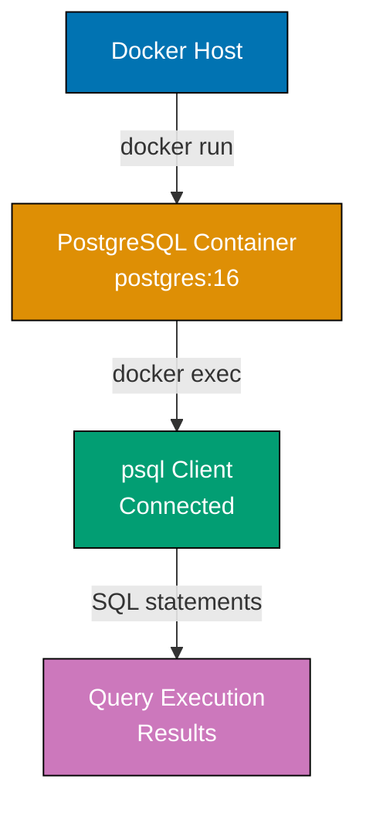
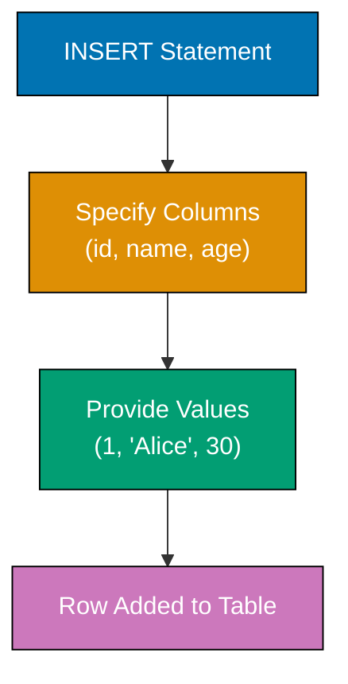
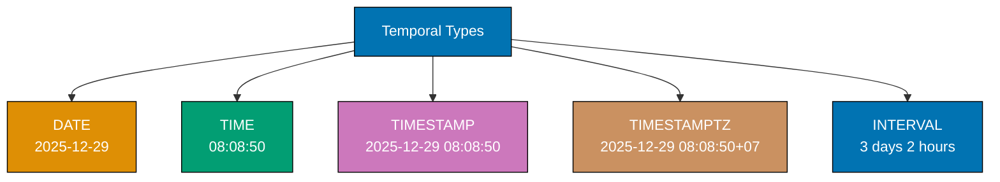
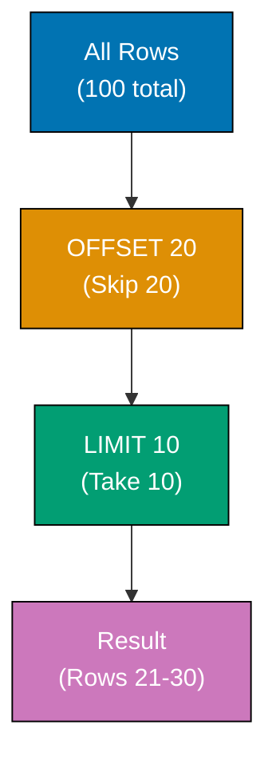
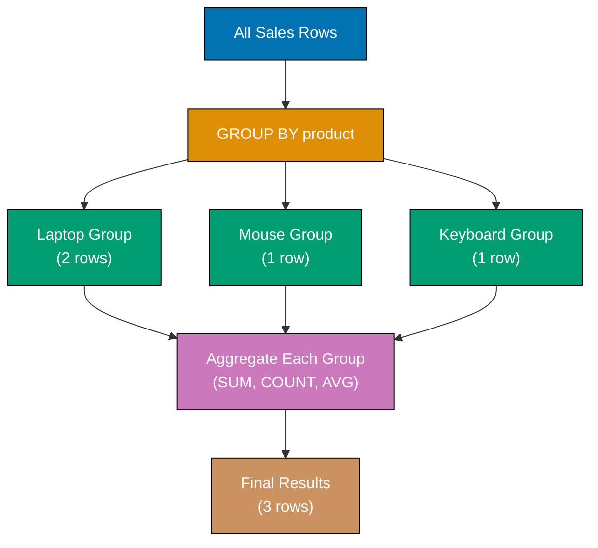
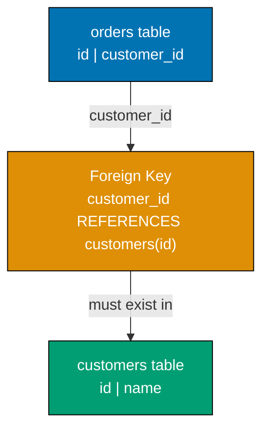
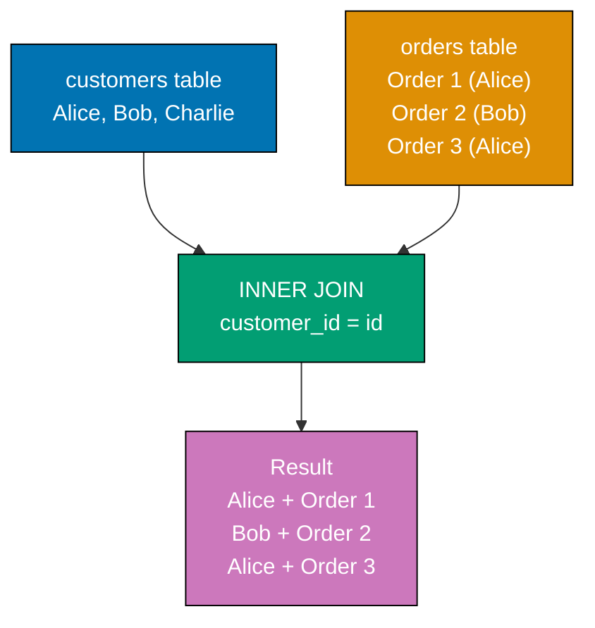
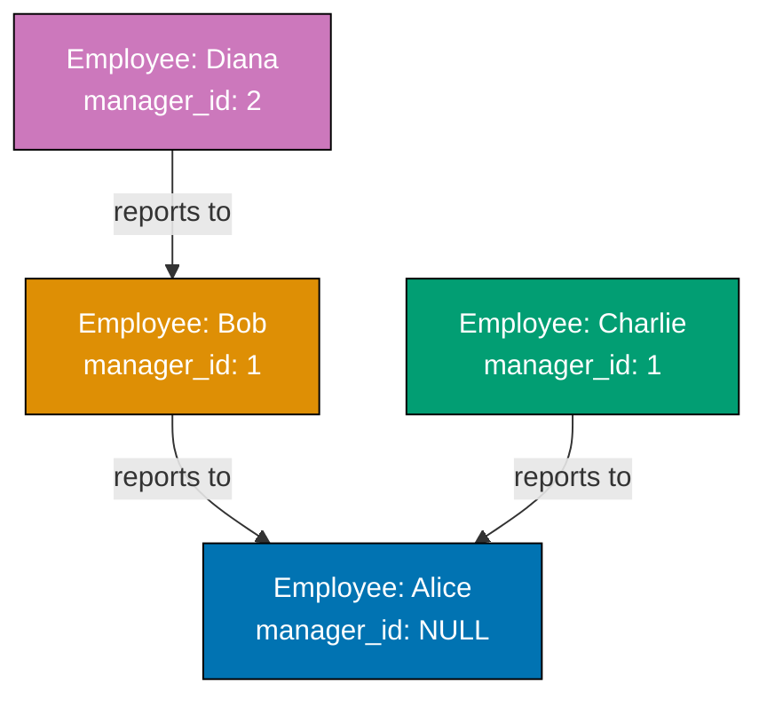

Learn PostgreSQL fundamentals through 30 annotated examples. Each example is self-contained, runnable in a PostgreSQL container, and heavily commented to show what each statement does, expected outputs, and intermediate states.

## Example 1: Installing PostgreSQL and First Query

PostgreSQL runs in a Docker container for isolated, reproducible environments across all platforms. This setup creates a fresh PostgreSQL 16 instance you can experiment with safely without affecting your system.



**Code**:

```bash
# One-time setup: Create PostgreSQL container
docker run --name postgres-tutorial \
  -e POSTGRES_PASSWORD=password \
  -p 5432:5432 \
  -d postgres:16
# => Container created with PostgreSQL 16, default user 'postgres', password 'password'
# => Port 5432 exposed for external connections

# Connect to PostgreSQL using psql
docker exec -it postgres-tutorial psql -U postgres
# => Connects as postgres user (superuser with all privileges)
```

**First query**:

```sql
-- Simple query to verify connection
SELECT version();
-- => Calls built-in function version() (no parameters needed)
-- => Returns single row with single column (text)
-- => Example output: "PostgreSQL 16.1 on x86_64-pc-linux-gnu, compiled by gcc (GCC) 12.2.0, 64-bit"
-- => Confirms PostgreSQL server is running and accessible

-- Check current date and time
SELECT NOW();
-- => Calls built-in function NOW() (returns current timestamp)
-- => Returns single row: type TIMESTAMPTZ (timestamp with timezone)
-- => Example output: "2025-12-29 08:08:50.123456+00"
-- => Microsecond precision (6 decimal places)
-- => Timezone offset shown as +00 (UTC)

-- Simple arithmetic
SELECT 2 + 2 AS result;
-- => AS result creates column alias (displayed as column name)
-- => Returns single row with single column named 'result'
-- => Output: 4 (type INTEGER)
```

**Key Takeaway**: PostgreSQL runs reliably in Docker containers, providing isolated environments for development and testing. The `SELECT` statement executes queries and returns results - even simple expressions work without FROM clauses.

**Why It Matters**: Docker-based PostgreSQL ensures every developer works with identical database versions across Windows, macOS, and Linux, eliminating "works on my machine" issues that plague traditional installations. The container approach enables instant teardown and recreation for testing, reducing database setup time from hours to seconds.

---

## Example 2: Creating Your First Database

Databases organize related tables and data. Each PostgreSQL server can host multiple databases, and you connect to one database at a time. The `\c` command switches between databases.

**Code**:

```sql
-- Create a new database
CREATE DATABASE first_db;
-- => Creates database 'first_db' with default UTF8 encoding
-- => Owner is current user (postgres)

-- List all databases
\l
-- => Shows all databases: postgres, template0, template1, first_db
-- => Displays: name, owner, encoding, collation, privileges

-- Connect to the new database
\c first_db;
-- => Switches connection from postgres to first_db
-- => Output: "You are now connected to database 'first_db' as user 'postgres'"

-- Verify current database
SELECT current_database();
-- => Returns current database name: 'first_db'

-- Drop database (must disconnect first)
\c postgres;
-- => Switch back to postgres (cannot drop database you're connected to)
DROP DATABASE first_db;
-- => Deletes database 'first_db' and all contents
-- => WARNING: Irreversible operation!
```

**Key Takeaway**: Use `CREATE DATABASE` to create isolated environments for different applications or projects. Always connect to a specific database before creating tables - the default `postgres` database should remain clean for administrative tasks.

**Why It Matters**: Database isolation prevents schema conflicts in multi-tenant systems and enables independent deployment cycles for microservices architectures. The \c command's instant switching enables developers to test schema migrations across multiple databases in seconds, compared to minutes required for MySQL's more cumbersome USE command.

---

## Example 3: Basic SELECT Queries

SELECT retrieves data from tables. Even without tables, you can query expressions, functions, and system information. The asterisk (`*`) selects all columns, while specific column names give precise control.

**Code**:

```sql
-- Create database for this example
CREATE DATABASE example_3;
-- => Creates new database named 'example_3'
-- => Encoding defaults to UTF8 (supports international characters)
\c example_3;
-- => Switches current connection to example_3 database
-- => All subsequent commands execute in this database

-- Create a simple table
CREATE TABLE users (
    id INTEGER,           -- => Integer column for user ID
    name VARCHAR(100),    -- => Variable-length string up to 100 characters
    email VARCHAR(100),   -- => Variable-length string for email addresses
    age INTEGER           -- => Integer column for age (no upper limit enforced yet)
);
-- => Creates table 'users' with 4 columns
-- => Table initially empty (0 rows)

-- Insert sample data
INSERT INTO users (id, name, email, age)
VALUES
    (1, 'Alice', 'alice@example.com', 30),
    (2, 'Bob', 'bob@example.com', 25),
    (3, 'Charlie', 'charlie@example.com', 35);
-- => Inserts 3 rows in single statement (more efficient than 3 separate INSERTs)
-- => Row 1: id=1, name='Alice', email='alice@example.com', age=30
-- => Row 2: id=2, name='Bob', email='bob@example.com', age=25
-- => Row 3: id=3, name='Charlie', email='charlie@example.com', age=35

-- Select all columns, all rows
SELECT * FROM users;
-- => Scans entire users table (3 rows)
-- => Returns all 3 rows with columns: id | name | email | age
-- => Output format: tabular display with column headers

-- Select specific columns
SELECT name, age FROM users;
-- => Scans all 3 rows but returns only 'name' and 'age' columns
-- => Reduces data transfer (2 columns instead of 4)
-- => Output: Alice 30, Bob 25, Charlie 35

-- Select with expressions
SELECT name, age, age + 10 AS age_in_10_years FROM users;
-- => Computes age + 10 for each row (calculation happens per row)
-- => Creates new column 'age_in_10_years' (not stored, computed on-the-fly)
-- => Alice: 30 + 10 = 40, Bob: 25 + 10 = 35, Charlie: 35 + 10 = 45
-- => Original age column unchanged in table
```

**Key Takeaway**: SELECT retrieves data from tables - use `*` for all columns or name specific columns. You can include expressions and calculations in SELECT to derive new values without modifying stored data.

**Why It Matters**: PostgreSQL's expression support in SELECT eliminates the need for post-query processing in application code, reducing data transfer overhead by up to 90% when calculating derived values like age_in_10_years directly in the database. The `*` wildcard operator simplifies schema changes during development but should be avoided in production code to prevent breaking changes when columns are added or removed.

---

## Example 4: Inserting Data with INSERT

INSERT adds new rows to tables. You can insert single rows, multiple rows at once, or specify only certain columns (others get NULL or default values).



**Code**:

```sql
CREATE DATABASE example_4;
-- => Creates database 'example_4'
\c example_4;
-- => Switches to example_4 database
CREATE TABLE products (
    id INTEGER,
    name VARCHAR(100),
    price DECIMAL(10, 2),  -- => Decimal with 10 total digits, 2 after decimal point
    in_stock BOOLEAN       -- => TRUE/FALSE/NULL allowed
);
-- => Creates table 'products' with 4 columns
-- => No constraints yet (NULLs allowed, no uniqueness enforced)

-- Insert single row with all columns
INSERT INTO products (id, name, price, in_stock)
VALUES (1, 'Laptop', 999.99, true);
-- => Inserts 1 row: id=1, name='Laptop', price=999.99, in_stock=TRUE
-- => Output: "INSERT 0 1" (0 is OID, 1 is row count)
-- => Table now contains 1 row

-- Insert multiple rows at once (more efficient)
INSERT INTO products (id, name, price, in_stock)
VALUES
    (2, 'Mouse', 29.99, true),
    (3, 'Keyboard', 79.99, false),
    (4, 'Monitor', 299.99, true);
-- => Inserts 3 rows in single transaction (atomic operation)
-- => Row 2: id=2, name='Mouse', price=29.99, in_stock=TRUE
-- => Row 3: id=3, name='Keyboard', price=79.99, in_stock=FALSE
-- => Row 4: id=4, name='Monitor', price=299.99, in_stock=TRUE
-- => Output: "INSERT 0 3" (3 rows inserted)
-- => More efficient than 3 separate INSERT statements (single network round-trip)

-- Insert partial columns (others become NULL)
INSERT INTO products (id, name)
VALUES (5, 'Webcam');
-- => Only id and name specified (price and in_stock not provided)
-- => Row data inserted: id=5, name='Webcam', price=NULL, in_stock=NULL
-- => NULL indicates missing/unknown value (not zero or false)
-- => Table now contains 5 rows total

-- Verify data
SELECT * FROM products;
-- => Retrieves all 5 rows from products table
-- => Shows all columns: id | name | price | in_stock
-- => Rows 1-4 have complete data, row 5 has NULLs for price and in_stock
```

**Key Takeaway**: INSERT adds rows to tables - specify columns and values explicitly for clarity. Multi-row inserts are more efficient than multiple single-row inserts. Columns not specified get NULL unless a default value is defined.

**Why It Matters**: Explicit column specification prevents data corruption during schema evolution when new columns are added with default values, while PostgreSQL's MVCC architecture allows concurrent reads during INSERT operations without blocking. The ability to insert partial columns with NULL values enables flexible data ingestion from incomplete external sources without preprocessing.

---

## Example 5: Updating and Deleting Rows

UPDATE modifies existing rows matching a WHERE condition. DELETE removes rows. Both are dangerous without WHERE clauses - they affect ALL rows.

**Code**:

```sql
CREATE DATABASE example_5;
-- => Creates database 'example_5'
\c example_5;
-- => Switches to example_5 database
CREATE TABLE inventory (
    id INTEGER,
    item VARCHAR(100),
    quantity INTEGER,
    price DECIMAL(10, 2)
);
-- => Creates table with 4 columns (no constraints)
INSERT INTO inventory (id, item, quantity, price)
VALUES
    (1, 'Apples', 100, 1.50),
    (2, 'Bananas', 150, 0.75),
    (3, 'Oranges', 80, 2.00);
-- => Inserts 3 rows (initial inventory state)
-- => Row 1: id=1, item='Apples', quantity=100, price=1.50
-- => Row 2: id=2, item='Bananas', quantity=150, price=0.75
-- => Row 3: id=3, item='Oranges', quantity=80, price=2.00

-- Update single row
UPDATE inventory
SET quantity = 120
WHERE id = 1;
-- => WHERE clause filters to row with id=1 (Apples row)
-- => Sets quantity column to 120 (was 100)
-- => Other columns unchanged (item, price remain same)
-- => Affected rows: 1 (output: "UPDATE 1")
-- => Apples row now: id=1, item='Apples', quantity=120, price=1.50

-- Update multiple columns
UPDATE inventory
SET quantity = 200, price = 0.80
WHERE item = 'Bananas';
-- => WHERE filters by item name (string comparison)
-- => Updates TWO columns: quantity and price
-- => quantity: 150 -> 200, price: 0.75 -> 0.80
-- => Affected rows: 1 (output: "UPDATE 1")
-- => Bananas row now: id=2, item='Bananas', quantity=200, price=0.80

-- Update with calculation
UPDATE inventory
SET price = price * 1.10
WHERE price < 2.00;
-- => WHERE finds rows with price less than 2.00 (Apples and Bananas)
-- => price * 1.10 calculates new price (10% increase)
-- => Apples: 1.50 * 1.10 = 1.65
-- => Bananas: 0.80 * 1.10 = 0.88
-- => Affected rows: 2 (output: "UPDATE 2")
-- => Oranges unchanged (price 2.00 not < 2.00)

-- Verify updates
SELECT * FROM inventory;
-- => Shows current state after all updates
-- => Apples: quantity=120, price=1.65
-- => Bananas: quantity=200, price=0.88
-- => Oranges: quantity=80, price=2.00 (unchanged)

-- Delete specific row
DELETE FROM inventory
WHERE id = 3;
-- => WHERE clause targets single row (id=3, Oranges)
-- => Removes row from table permanently
-- => Affected rows: 1 (output: "DELETE 1")
-- => Table now contains 2 rows (Apples, Bananas)

-- DANGEROUS: Update without WHERE affects ALL rows
UPDATE inventory SET quantity = 0;
-- => No WHERE clause! Affects ALL rows in table
-- => Sets quantity to 0 for Apples AND Bananas
-- => Affected rows: 2 (output: "UPDATE 2")
-- => WARNING: Common mistake causing data loss!

-- DANGEROUS: Delete without WHERE removes ALL rows
DELETE FROM inventory;
-- => No WHERE clause! Deletes ALL rows in table
-- => Affected rows: 2 (output: "DELETE 2")
-- => Table structure remains (columns defined)
-- => Table now empty (0 rows)
-- => Use TRUNCATE TABLE for faster empty operation
```

**Key Takeaway**: Always use WHERE clauses with UPDATE and DELETE to target specific rows - omitting WHERE modifies or removes ALL rows. Test your WHERE clause with SELECT before running UPDATE or DELETE.

**Why It Matters**: Accidental UPDATE/DELETE without WHERE clauses causes the majority of catastrophic data loss incidents in production databases, making pre-execution SELECT testing a critical safety practice enforced by database change management tools like Liquibase. PostgreSQL's transactional UPDATE enables atomic multi-row modifications that either all succeed or all fail, preventing partial updates that leave data in inconsistent states during concurrent operations.

---

## Example 6: Numeric Types (INTEGER, BIGINT, DECIMAL, NUMERIC)

PostgreSQL offers multiple numeric types for different ranges and precision needs. INTEGER for whole numbers, BIGINT for larger ranges, DECIMAL/NUMERIC for exact precision (financial calculations).

**Code**:

```sql
CREATE DATABASE example_6;
\c example_6;
CREATE TABLE numeric_types (
    id SERIAL,                    -- => Auto-incrementing integer (shorthand for INTEGER with sequence)
    small_int SMALLINT,           -- => -32,768 to 32,767
    regular_int INTEGER,          -- => -2,147,483,648 to 2,147,483,647
    big_int BIGINT,               -- => Very large range (19 digits)
    exact_decimal DECIMAL(10, 2), -- => Exact precision: 10 total digits, 2 after decimal
    exact_numeric NUMERIC(8, 3),  -- => Same as DECIMAL: 8 digits total, 3 after decimal
    float_num REAL,               -- => 4-byte floating point (approximate)
    double_num DOUBLE PRECISION   -- => 8-byte floating point (approximate)
);
INSERT INTO numeric_types
    (small_int, regular_int, big_int, exact_decimal, exact_numeric, float_num, double_num)
VALUES
    (100, 50000, 9223372036854775807, 12345.67, 12345.678, 3.14159, 3.141592653589793);
-- => Inserts single row demonstrating each type's precision and range
-- => small_int: 100 (within -32,768 to 32,767 range)
-- => regular_int: 50000 (within -2 billion to +2 billion range)
-- => big_int: 9223372036854775807 (maximum BIGINT value, 2^63 - 1)
-- => exact_decimal: 12345.67 (10 total digits, 2 after decimal point - exact)
-- => exact_numeric: 12345.678 (8 total digits, 3 after decimal - exact)
-- => float_num: 3.14159 (approximate binary floating-point)
-- => double_num: 3.141592653589793 (approximate, double precision)
SELECT * FROM numeric_types;
-- => Returns 1 row with all 8 columns
-- => id=1 (SERIAL auto-generated from sequence)
-- => All values stored as specified
-- => REAL and DOUBLE PRECISION may display slight approximations in output

-- Arithmetic with exact types
SELECT
    exact_decimal + 100.50 AS decimal_sum,
    exact_numeric * 2 AS numeric_doubled,
    float_num * 2 AS float_doubled
FROM numeric_types;
-- => exact_decimal + 100.50: 12345.67 + 100.50 = 12446.17 (exact arithmetic)
-- => exact_numeric * 2: 12345.678 * 2 = 24691.356 (exact multiplication)
-- => float_num * 2: 3.14159 * 2 ≈ 6.28318 (may have tiny rounding error)
-- => DECIMAL/NUMERIC use base-10 storage (exact for financial calculations)
-- => REAL/DOUBLE use binary floating-point (faster but approximate)
```

**Key Takeaway**: Use INTEGER for whole numbers, BIGINT for very large integers, and DECIMAL/NUMERIC for exact precision (money, percentages). Avoid REAL/DOUBLE PRECISION for financial data due to rounding errors.

**Why It Matters**: DECIMAL/NUMERIC types provide exact precision arithmetic essential for financial applications where rounding errors can compound to millions of dollars, making PostgreSQL compliant with accounting standards that forbid floating-point calculations for monetary values. The choice between exact (DECIMAL) and approximate (DOUBLE PRECISION) types impacts not just accuracy but also query performance, with floating-point operations running 2-3x faster when precision requirements allow.

---

## Example 7: Text Types (VARCHAR, TEXT, CHAR)

PostgreSQL provides three text types: VARCHAR with length limit, TEXT for unlimited length, and CHAR for fixed-length strings (space-padded).

**Code**:

```sql
CREATE DATABASE example_7;
-- => Creates new database named 'example_7' with UTF8 encoding
\c example_7;
-- => Connects to example_7 database (disconnects from previous database)
CREATE TABLE text_types (
    fixed_char CHAR(5),
    -- => Exactly 5 characters, space-padded if shorter (e.g., 'AB' becomes 'AB   ')
    -- => Rarely used in modern applications due to padding behavior
    var_char VARCHAR(50),
    -- => Variable-length string up to 50 characters (no padding)
    -- => Storage size = actual string length + 1 byte for length tracking
    unlimited_text TEXT
    -- => Unlimited length text (practical limit: 1 GB per field)
    -- => Same performance as VARCHAR, no length restriction needed
);
-- => Creates text_types table with 3 columns demonstrating text type differences
INSERT INTO text_types (fixed_char, var_char, unlimited_text)
-- => Inserts rows into text_types table with text values
VALUES
    ('AB', 'Hello', 'This is a very long text that can be as long as needed without worrying about length limits'),
    -- => Row 1: fixed_char is 'AB' (will be padded to 'AB   ')
    -- => var_char is 'Hello' (5 chars, no padding)
    -- => unlimited_text is 109 characters long
    ('ABCDE', 'World', 'Another long text example');
    -- => Row 2: fixed_char is 'ABCDE' (exactly 5 chars, no padding needed)
    -- => var_char is 'World' (5 chars)
    -- => unlimited_text is 27 characters long
-- => Two rows inserted successfully with different text values

SELECT
    fixed_char,
    -- => Returns fixed_char values: 'AB   ' and 'ABCDE' (note padding on first row)
    LENGTH(fixed_char) AS char_len,
    -- => Returns length including padding: 5 for both rows
    -- => CHAR always returns full declared length
    var_char,
    -- => Returns var_char values: 'Hello' and 'World' (no padding)
    LENGTH(var_char) AS varchar_len,
    -- => Returns actual string length: 5 for both rows
    -- => VARCHAR returns only used characters
    unlimited_text
    -- => Returns full text content without truncation
FROM text_types;
-- => Retrieves all columns to demonstrate text type behaviors

-- String concatenation using || operator
SELECT
    var_char || ' ' || 'PostgreSQL' AS concatenated
    -- => Concatenates var_char value + space + 'PostgreSQL'
    -- => Row 1 result: 'Hello PostgreSQL'
    -- => Row 2 result: 'World PostgreSQL'
FROM text_types;
-- => Returns 2 rows with concatenated strings

-- CHAR padding comparison demonstration
SELECT
    fixed_char = 'AB' AS equals_without_padding,
    -- => Compares 'AB   ' with 'AB' (includes padding in comparison)
    -- => Returns false because 'AB   ' ≠ 'AB'
    TRIM(fixed_char) = 'AB' AS equals_with_trim
    -- => TRIM removes trailing spaces: TRIM('AB   ') = 'AB'
    -- => Returns true because trimmed value matches
FROM text_types
WHERE fixed_char = 'AB   ';
-- => Filters for rows where fixed_char is 'AB   ' (with padding)
-- => Returns 1 row demonstrating padding comparison issue
```

**Key Takeaway**: Use VARCHAR when you need a length limit, TEXT when length is unpredictable. Avoid CHAR unless you specifically need fixed-length, space-padded strings - it's rarely the right choice for modern applications.

**Why It Matters**: TEXT columns in PostgreSQL have no performance penalty compared to VARCHAR for most operations, eliminating the need to estimate maximum string lengths during schema design and preventing data truncation errors that plague MySQL's VARCHAR implementation. The space-padding behavior of CHAR creates hidden bugs when string comparisons fail ('AB' ≠ 'AB '), making it a legacy type maintained primarily for SQL standard compliance rather than practical use.

---

## Example 8: Date and Time Types

PostgreSQL has separate types for dates, times, and timestamps. TIMESTAMP stores date and time without timezone, TIMESTAMPTZ stores with timezone. INTERVAL represents durations.



**Code**:

```sql
CREATE DATABASE example_8;
-- => Creates new database named 'example_8' with UTF8 encoding
\c example_8;
-- => Connects to example_8 database (disconnects from previous database)
CREATE TABLE events (
    id SERIAL,
    -- => Auto-incrementing integer column (starts at 1)
    event_date DATE,
    -- => Date only (YYYY-MM-DD format, no time component)
    event_time TIME,
    -- => Time only (HH:MM:SS format, no date component)
    created_at TIMESTAMP,
    -- => Date and time without timezone (local time)
    updated_at TIMESTAMPTZ,
    -- => Date and time with timezone (stores UTC, displays in client timezone)
    duration INTERVAL
    -- => Time span (supports days, hours, minutes, seconds, microseconds)
);
-- => Creates events table with 6 columns for different temporal types
INSERT INTO events (event_date, event_time, created_at, updated_at, duration)
-- => Inserts rows into events table with specific columns
VALUES
    ('2025-12-29', '14:30:00', '2025-12-29 14:30:00', '2025-12-29 14:30:00+07', '2 hours 30 minutes'),
    -- => Row 1: event_date is 2025-12-29, event_time is 14:30:00
    -- => created_at is 2025-12-29 14:30:00 (no timezone)
    -- => updated_at is 2025-12-29 14:30:00+07 (timezone +07:00 specified)
    -- => duration is 2 hours 30 minutes interval
    ('2025-12-30', '09:00:00', NOW(), NOW(), '1 day 3 hours');
    -- => Row 2: event_date is 2025-12-30, event_time is 09:00:00
    -- => NOW() returns current timestamp with timezone (called twice)
    -- => duration is 1 day 3 hours interval
-- => Two rows inserted successfully
SELECT
    event_date,
    event_time,
    created_at,
    updated_at,
    duration
FROM events;
-- => Retrieves all columns from events table (2 rows returned)
-- => Shows date/time values in their respective formats

-- Date arithmetic operations
SELECT
    event_date + INTERVAL '7 days' AS one_week_later,
    -- => Adds 7 days to event_date using INTERVAL
    -- => 2025-12-29 becomes 2026-01-05, 2025-12-30 becomes 2026-01-06
    updated_at - INTERVAL '1 hour' AS one_hour_ago,
    -- => Subtracts 1 hour from updated_at timestamp
    -- => Timezone preserved in result
    event_date + 7 AS seven_days_later_shorthand
    -- => Shorthand: adding integer adds days to DATE type
    -- => Same as INTERVAL '7 days' but more concise
FROM events;
-- => Returns 3 computed columns showing date arithmetic results

-- Extract date/time components
SELECT
    EXTRACT(YEAR FROM event_date) AS year,
    -- => Extracts year component from event_date (returns 2025)
    EXTRACT(MONTH FROM event_date) AS month,
    -- => Extracts month component (returns 12 for December)
    EXTRACT(DAY FROM event_date) AS day,
    -- => Extracts day of month (returns 29, 30)
    EXTRACT(HOUR FROM event_time) AS hour
    -- => Extracts hour component from event_time (returns 14, 9)
FROM events;
-- => Returns 4 integer columns with extracted date/time parts
-- => Useful for grouping by year/month or filtering by hour
```

**Key Takeaway**: Use DATE for dates without time, TIMESTAMPTZ for complete timestamps (stores with timezone), and INTERVAL for durations. TIMESTAMPTZ is preferred over TIMESTAMP for most applications to avoid timezone ambiguity.

**Why It Matters**: TIMESTAMPTZ automatically converts timestamps to UTC for storage and back to the client's timezone for display, preventing timezone-related bugs that cause systems like airlines to show incorrect flight times across time zones. INTERVAL arithmetic enables natural date calculations (event_date + '7 days') that would require complex date manipulation code in application layers, while PostgreSQL's microsecond precision supports high-frequency trading systems where millisecond accuracy determines transaction ordering.

---

## Example 9: Boolean and UUID Types

BOOLEAN stores true/false values. UUID stores universally unique identifiers - useful for distributed systems where auto-incrementing IDs create conflicts.

**Code**:

```sql
CREATE DATABASE example_9;
-- => Creates new database named 'example_9' with UTF8 encoding
\c example_9;
-- => Connects to example_9 database (disconnects from previous database)
CREATE TABLE users (
    username VARCHAR(50),
    -- => Variable-length string up to 50 characters for username
    is_active BOOLEAN,
    -- => Boolean column: accepts true, false, or NULL values
    -- => Storage: 1 byte per value (efficient for flag columns)
    is_verified BOOLEAN DEFAULT false
    -- => Boolean with default value of false
    -- => If is_verified not specified in INSERT, automatically set to false
);
-- => Creates users table with 3 columns including boolean flags
INSERT INTO users (username, is_active)
-- => Inserts rows specifying only username and is_active columns
-- => is_verified will use default value (false)
VALUES
    ('alice', true),
    -- => Row 1: username='alice', is_active=true, is_verified=false (default)
    ('bob', false),
    -- => Row 2: username='bob', is_active=false, is_verified=false (default)
    ('charlie', true);
    -- => Row 3: username='charlie', is_active=true, is_verified=false (default)
-- => Three rows inserted successfully with mixed boolean values
SELECT * FROM users;
-- => Retrieves all columns from users table (3 rows returned)
-- => Shows username, is_active, and is_verified values
-- => All is_verified values are false (from DEFAULT)

-- Boolean comparisons: explicit true comparison
SELECT username, is_active
FROM users
WHERE is_active = true;
-- => Filters rows where is_active column explicitly equals true
-- => Returns 2 rows: alice and charlie
-- => bob is excluded (is_active=false)

SELECT username, is_active
FROM users
WHERE is_active;
-- => Filters rows where is_active is truthy
-- => Shorthand syntax: no '= true' comparison needed
-- => Returns same 2 rows: alice and charlie
-- => More idiomatic than 'WHERE is_active = true'

SELECT username, is_verified
FROM users
WHERE NOT is_verified;
-- => Filters rows where is_verified is NOT true (false or NULL)
-- => Returns all 3 users (all have is_verified = false)
-- => NOT operator negates boolean value

-- Generate UUID manually using built-in function
SELECT gen_random_uuid() AS random_id;
-- => Calls gen_random_uuid() function to generate random UUID
-- => Returns single row with UUID like 'a0eebc99-9c0b-4ef8-bb6d-6bb9bd380a11'
-- => Each call generates different UUID (cryptographically random)
-- => UUID format: 32 hex digits separated by hyphens (8-4-4-4-12)
```

**Key Takeaway**: BOOLEAN stores true/false explicitly - use it instead of integers or strings for clarity. UUID provides globally unique identifiers without coordination, essential for distributed systems and avoiding ID conflicts during data merges.

**Why It Matters**: PostgreSQL's native UUID support with gen_random_uuid() eliminates application-layer ID generation and the associated network round-trips required for centralized ID servers, while the 16-byte storage overhead is negligible compared to the operational simplicity of distributed ID generation. BOOLEAN storage uses only 1 byte compared to INTEGER's 4 bytes, reducing table size by 75% for flag columns when multiplied across billions of rows in tables like user preferences.

---

## Example 10: Working with NULL Values

NULL represents missing or unknown data - it's not zero, empty string, or false. NULL has special comparison behavior: `NULL = NULL` is NULL (not true).

**Code**:

```sql
CREATE DATABASE example_10;
\c example_10;
CREATE TABLE contacts (
    id SERIAL,
    name VARCHAR(100),
    email VARCHAR(100),
    phone VARCHAR(20)
);
INSERT INTO contacts (name, email, phone)
VALUES
    ('Alice', 'alice@example.com', '555-1234'),
    ('Bob', NULL, '555-5678'),              -- => Email is NULL (unknown)
    ('Charlie', 'charlie@example.com', NULL); -- => Phone is NULL
-- => Inserts 3 rows with different NULL patterns
-- => Row 1: Alice has both email and phone
-- => Row 2: Bob missing email (NULL), has phone
-- => Row 3: Charlie has email, missing phone (NULL)

-- Check for NULL values
SELECT name, email
FROM contacts
WHERE email IS NULL;
-- => WHERE clause checks for NULL using IS NULL operator
-- => Evaluates email column for each row
-- => Alice: email='alice@example.com' (NOT NULL, excluded)
-- => Bob: email=NULL (matches IS NULL, included)
-- => Charlie: email='charlie@example.com' (NOT NULL, excluded)
-- => Returns 1 row: Bob with email=NULL

-- This DOES NOT work correctly
SELECT name, email
FROM contacts
WHERE email = NULL;
-- => Uses equality operator = with NULL (WRONG approach!)
-- => NULL = NULL evaluates to NULL (not TRUE or FALSE)
-- => WHERE requires TRUE to include row
-- => All 3 rows: email = NULL evaluates to NULL → excluded
-- => Returns 0 rows (empty result set)
-- => Common mistake causing "missing data" bugs!

-- Check for NOT NULL
SELECT name, phone
FROM contacts
WHERE phone IS NOT NULL;
-- => IS NOT NULL checks for presence of value (opposite of IS NULL)
-- => Alice: phone='555-1234' (NOT NULL, included)
-- => Bob: phone='555-5678' (NOT NULL, included)
-- => Charlie: phone=NULL (excluded)
-- => Returns 2 rows: Alice and Bob

-- COALESCE provides default for NULL values
SELECT
    name,
    COALESCE(email, 'no-email@example.com') AS email,
    COALESCE(phone, 'No phone') AS phone
FROM contacts;
-- => COALESCE(value, default) returns first non-NULL argument
-- => Alice: email='alice@example.com' (not NULL, returns original), phone='555-1234'
-- => Bob: email=NULL → COALESCE returns 'no-email@example.com', phone='555-5678'
-- => Charlie: email='charlie@example.com', phone=NULL → COALESCE returns 'No phone'
-- => All 3 rows returned with NULLs replaced by defaults

-- NULLIF returns NULL if two values are equal
SELECT
    name,
    NULLIF(email, '') AS email_or_null
FROM contacts;
-- => NULLIF(value1, value2) returns NULL if value1 = value2, otherwise returns value1
-- => Useful for converting empty strings to NULL
-- => Alice: NULLIF('alice@example.com', '') → 'alice@example.com' (not equal to '')
-- => Bob: NULLIF(NULL, '') → NULL (already NULL)
-- => Charlie: NULLIF('charlie@example.com', '') → 'charlie@example.com'
-- => If Bob had email='' instead of NULL: NULLIF('', '') → NULL (converts empty to NULL)
```

**Key Takeaway**: Use `IS NULL` and `IS NOT NULL` to check for NULL values - equality operators don't work with NULL. COALESCE provides defaults for NULL values, while NULLIF converts specific values to NULL.

**Why It Matters**: NULL represents the absence of data differently from empty strings or zero, a distinction required by SQL standards but commonly misunderstood, causing bugs when `WHERE email = NULL` silently returns zero rows instead of erroring. COALESCE eliminates NULL values at query time rather than application code, reducing data transfer by providing defaults directly in the database and enabling consistent NULL handling across multiple application languages.

---

## Example 11: WHERE Clauses and Comparisons

WHERE filters rows based on conditions. You can combine multiple conditions with AND/OR, use comparison operators, and test for NULL, ranges, and pattern matching.

**Code**:

```sql
CREATE DATABASE example_11;
-- => Creates database for WHERE clause examples
\c example_11;
-- => Switches to example_11 database

CREATE TABLE products (
    id SERIAL,
    -- => id: auto-incrementing product identifier starting at 1
    -- => Type: SERIAL generates sequence automatically
    name VARCHAR(100),
    -- => name: product name (up to 100 characters)
    -- => Example values: 'Laptop', 'Mouse', 'Desk Chair'
    category VARCHAR(50),
    -- => category: product category (Electronics, Furniture, Kitchen)
    -- => Used for filtering products by type
    price DECIMAL(10, 2),
    -- => price: product price (8 digits before decimal, 2 after)
    -- => Exact precision for monetary values
    stock INTEGER
    -- => stock: available inventory quantity (whole numbers only)
    -- => Zero means out of stock
);
-- => Creates products table with 5 columns for product catalog

INSERT INTO products (name, category, price, stock)
VALUES
    ('Laptop', 'Electronics', 999.99, 15),
    -- => Row 1: Electronics product, price $999.99, 15 in stock
    ('Mouse', 'Electronics', 29.99, 50),
    -- => Row 2: Electronics product, lower price, high stock
    ('Desk Chair', 'Furniture', 199.99, 8),
    -- => Row 3: Furniture category, low stock
    ('Monitor', 'Electronics', 299.99, 0),
    -- => Row 4: Electronics, OUT OF STOCK (stock=0)
    ('Coffee Mug', 'Kitchen', 12.99, 100);
    -- => Row 5: Kitchen category, highest stock
-- => Inserts 5 products across 3 categories
-- Single condition
SELECT name, price
-- => Selects only name and price columns (not all columns)
FROM products
-- => Scans all 5 rows in products table
WHERE category = 'Electronics';
-- => WHERE clause filters rows before returning results
-- => Checks each row: category column equals 'Electronics' (string comparison, case-sensitive)
-- => Matching rows: Laptop, Mouse, Monitor (3 out of 5 rows pass filter)
-- => Returns 3 rows: Laptop (999.99), Mouse (29.99), Monitor (299.99)
-- => Excludes: Desk Chair (Furniture), Coffee Mug (Kitchen)
-- => Filtered rows never reach result set (discarded before SELECT)

-- Multiple conditions with AND
SELECT name, price, stock
FROM products
WHERE category = 'Electronics' AND price < 500;
-- => AND requires BOTH conditions true
-- => First condition: category = 'Electronics' (3 rows match)
-- => Second condition: price < 500 (filters the 3 rows)
-- => Returns 2 rows: Mouse (29.99, stock 50), Monitor (299.99, stock 0)
-- => Excludes Laptop (999.99 > 500)

-- Multiple conditions with OR
SELECT name, category
FROM products
WHERE category = 'Furniture' OR price > 500;
-- => OR requires AT LEAST ONE condition true
-- => First condition: category = 'Furniture' (1 row: Desk Chair)
-- => Second condition: price > 500 (1 row: Laptop)
-- => Returns 2 rows: Laptop (Electronics), Desk Chair (Furniture)
-- => Both conditions evaluated for each row

-- Comparison operators
SELECT name, price
FROM products
WHERE price >= 100 AND price <= 300;
-- => >= means greater than or equal to (100 included)
-- => <= means less than or equal to (300 included)
-- => Checks: 100 <= price <= 300 (inclusive range)
-- => Evaluates both conditions: price >= 100 AND price <= 300
-- => Desk Chair: 199.99 >= 100 (true) AND 199.99 <= 300 (true) → included
-- => Monitor: 299.99 >= 100 (true) AND 299.99 <= 300 (true) → included
-- => Laptop: 999.99 <= 300 (false) → excluded despite >= 100 being true
-- => Returns 2 rows: Desk Chair (199.99), Monitor (299.99)
-- => Excludes: Laptop (999.99 too high), Mouse (29.99 too low), Coffee Mug (12.99 too low)

-- BETWEEN for ranges
SELECT name, price
FROM products
WHERE price BETWEEN 100 AND 300;
-- => BETWEEN is shorthand for >= AND <=
-- => Equivalent to: price >= 100 AND price <= 300
-- => BETWEEN is INCLUSIVE (includes 100 and 300)
-- => Returns same 2 rows as above: Desk Chair (199.99), Monitor (299.99)

-- IN for multiple values
SELECT name, category
FROM products
WHERE category IN ('Electronics', 'Kitchen');
-- => IN checks if value matches ANY in list
-- => Equivalent to: category = 'Electronics' OR category = 'Kitchen'
-- => More readable than multiple OR conditions
-- => Returns 4 rows: Laptop, Mouse, Monitor (Electronics), Coffee Mug (Kitchen)
-- => Excludes: Desk Chair (Furniture not in list)

-- NOT to negate conditions
SELECT name, stock
FROM products
WHERE NOT stock = 0;
-- => NOT inverts boolean result (true becomes false, false becomes true)
-- => Equivalent to: stock != 0 or stock <> 0
-- => Returns rows where stock is NOT zero
-- => Returns 4 rows: Laptop (15), Mouse (50), Desk Chair (8), Coffee Mug (100)
-- => Excludes: Monitor (stock = 0)
```

**Key Takeaway**: WHERE filters rows before returning results - use comparison operators (`=`, `<`, `>`, `<=`, `>=`, `<>`), BETWEEN for ranges, IN for multiple values, and AND/OR to combine conditions. Always use IS NULL for NULL checks, not `= NULL`.

**Why It Matters**: WHERE clause filtering at the database level dramatically reduces network traffic compared to application-level filtering when querying tables with millions of rows, making it essential for responsive web applications serving concurrent users. BETWEEN and IN operators enable readable query syntax that PostgreSQL's query planner can optimize more effectively than equivalent OR chains, while the combination of AND/OR operators with proper parentheses prevents logical errors that cause incorrect result sets in production.

---

## Example 12: Sorting with ORDER BY

ORDER BY sorts query results by one or more columns. Default is ascending (ASC), use DESC for descending. Multiple columns create hierarchical sorting (secondary sort when primary values tie).

**Code**:

```sql
CREATE DATABASE example_12;
-- => Creates database for ORDER BY examples
\c example_12;
-- => Switches to example_12 database

CREATE TABLE employees (
    id SERIAL,
    -- => id: auto-incrementing employee identifier
    -- => Type: SERIAL for unique identifiers
    name VARCHAR(100),
    -- => name: employee name (up to 100 characters)
    -- => Used for display in result sets
    department VARCHAR(50),
    -- => department: Engineering or Sales (two departments)
    -- => Used for grouping and sorting employees
    salary DECIMAL(10, 2),
    -- => salary: annual salary (exact precision)
    -- => Range in dataset: $75,000 to $105,000
    hire_date DATE
    -- => hire_date: date employee was hired (YYYY-MM-DD format)
    -- => Used for seniority calculations and sorting
);
-- => Creates employees table with 5 columns for employee records

INSERT INTO employees (name, department, salary, hire_date)
VALUES
    ('Alice', 'Engineering', 95000, '2020-03-15'),
    -- => Alice: Engineering, $95k, hired 2020
    ('Bob', 'Sales', 75000, '2019-06-01'),
    -- => Bob: Sales, $75k (lowest salary)
    ('Charlie', 'Engineering', 105000, '2021-01-10'),
    -- => Charlie: Engineering, $105k (highest salary)
    ('Diana', 'Sales', 80000, '2018-11-20'),
    -- => Diana: Sales, $80k, earliest hire date
    ('Eve', 'Engineering', 95000, '2022-02-28');
    -- => Eve: Engineering, $95k (same as Alice), latest hire date
-- => Inserts 5 employees with varying salaries and hire dates
-- Sort by salary ascending (default)
SELECT name, salary
FROM employees
ORDER BY salary;
-- => ORDER BY salary sorts rows by salary column (low to high)
-- => ASC is default (ascending order, can be omitted)
-- => Compares: 75000 < 80000 < 95000 < 95000 < 105000
-- => Alice and Eve both have 95000 (tie - order between them undefined)
-- => Returns 5 rows: Bob (75000), Diana (80000), Alice (95000), Eve (95000), Charlie (105000)

-- Sort by salary descending
SELECT name, salary
FROM employees
ORDER BY salary DESC;
-- => DESC reverses sort order (high to low)
-- => Compares: 105000 > 95000 > 95000 > 80000 > 75000
-- => Alice and Eve still tied at 95000 (order between them undefined)
-- => Returns: Charlie (105000), Alice (95000), Eve (95000), Diana (80000), Bob (75000)

-- Sort by multiple columns (department, then salary)
SELECT name, department, salary
FROM employees
ORDER BY department, salary DESC;
-- => ORDER BY with multiple columns creates hierarchical sorting
-- => First sort key: department (ascending by default, alphabetical)
-- => Grouping: Engineering comes before Sales (E < S alphabetically)
-- => Second sort key: salary DESC (descending, within each department)
-- => Engineering group sorted internally: 105000 > 95000 > 95000
-- => Charlie (105000) first, then Alice (95000), then Eve (95000)
-- => Sales group sorted internally: 80000 > 75000
-- => Diana (80000) first, then Bob (75000)
-- => Engineering group (3 rows): Charlie (105000), Alice (95000), Eve (95000)
-- => Sales group (2 rows): Diana (80000), Bob (75000)
-- => Returns 5 rows ordered by department first, salary second
-- => Second sort only matters when first sort values are identical

-- Sort by date
SELECT name, hire_date
FROM employees
ORDER BY hire_date;
-- => Sorts by hire_date column (oldest to newest)
-- => Compares dates: 2018-11-20 < 2019-06-01 < 2020-03-15 < 2021-01-10 < 2022-02-28
-- => Returns chronological order: Diana (2018), Bob (2019), Alice (2020), Charlie (2021), Eve (2022)

-- Sort by expression
SELECT name, salary, salary * 1.10 AS salary_with_raise
FROM employees
ORDER BY salary * 1.10 DESC;
-- => ORDER BY can use expressions (computed on-the-fly)
-- => Calculates salary * 1.10 for each row
-- => Charlie: 105000 * 1.10 = 115500
-- => Alice: 95000 * 1.10 = 104500
-- => Eve: 95000 * 1.10 = 104500
-- => Diana: 80000 * 1.10 = 88000
-- => Bob: 75000 * 1.10 = 82500
-- => Sorts by computed values descending
-- => Returns: Charlie (115500), Alice (104500), Eve (104500), Diana (88000), Bob (82500)
```

**Key Takeaway**: ORDER BY sorts results - use ASC (default) for ascending, DESC for descending. Multiple columns create hierarchical sorting, with later columns as tiebreakers. You can sort by column names, positions, or expressions.

**Why It Matters**: Multi-column sorting (ORDER BY department, salary DESC) reflects real business requirements like organizational hierarchies, while expression-based sorting enables complex排序 logic (ORDER BY CASE WHEN status = 'urgent' THEN 1 ELSE 2 END) that would require multiple queries or application-level sorting. PostgreSQL's query planner can use indexes for ORDER BY when the index column order matches the sort order, achieving 100-1000x speedups on large result sets compared to sorting after retrieval.

---

## Example 13: Limiting Results with LIMIT and OFFSET

LIMIT restricts the number of rows returned. OFFSET skips rows before returning results. Combined, they enable pagination - retrieving large result sets in chunks.



**Code**:

```sql
CREATE DATABASE example_13;
-- => Creates new database named 'example_13' with UTF8 encoding
\c example_13;
-- => Connects to example_13 database (disconnects from previous database)
CREATE TABLE articles (
    id SERIAL,
    -- => Auto-incrementing integer primary key column
    title VARCHAR(200),
    -- => Article title (variable-length string, max 200 characters)
    views INTEGER,
    -- => View count (32-bit signed integer)
    published_date DATE
    -- => Publication date (DATE type, format YYYY-MM-DD)
);
-- => Creates articles table with 4 columns for article metadata
INSERT INTO articles (title, views, published_date)
-- => Inserts 8 sample article rows (id auto-generated by SERIAL)
VALUES
    ('Introduction to SQL', 1500, '2025-01-01'),
    -- => Row 1: title, views=1500, published on Jan 1, 2025
    ('Advanced Queries', 2300, '2025-01-05'),
    -- => Row 2: views=2300, published 4 days after row 1
    ('Database Design', 1800, '2025-01-10'),
    -- => Row 3: views=1800, published 5 days after row 2
    ('Performance Tuning', 3200, '2025-01-15'),
    -- => Row 4: views=3200 (highest), published 5 days after row 3
    ('Indexing Strategies', 2700, '2025-01-20'),
    -- => Row 5: views=2700, published 5 days after row 4
    ('Backup and Recovery', 1200, '2025-01-25'),
    -- => Row 6: views=1200 (lowest), published 5 days after row 5
    ('Security Best Practices', 2900, '2025-02-01'),
    -- => Row 7: views=2900, published 7 days after row 6 (new month)
    ('Replication Setup', 1600, '2025-02-05');
    -- => Row 8: views=1600, published 4 days after row 7
-- => Eight rows inserted successfully with varying views and dates

-- Get top 3 most viewed articles
SELECT title, views
FROM articles
ORDER BY views DESC
-- => Sorts all 8 rows by views descending (3200, 2900, 2700, 2300, 1800, 1600, 1500, 1200)
LIMIT 3;
-- => Returns only first 3 rows from sorted result
-- => If index on views exists, PostgreSQL can stop after reading 3 rows
-- => Returns: Performance Tuning (3200), Security Best Practices (2900), Indexing Strategies (2700)

-- Pagination: Page 1 (first 3 articles by date)
SELECT title, published_date
FROM articles
ORDER BY published_date
-- => Sorts 8 rows by published_date ascending (default, oldest first)
LIMIT 3 OFFSET 0;
-- => OFFSET 0 skips 0 rows (starts at row 1)
-- => LIMIT 3 returns first 3 rows after offset
-- => Returns rows 1-3: Introduction to SQL (2025-01-01), Advanced Queries (2025-01-05), Database Design (2025-01-10)

-- Pagination: Page 2 (next 3 articles)
SELECT title, published_date
FROM articles
ORDER BY published_date
-- => Same sort order as page 1 (published_date ascending)
LIMIT 3 OFFSET 3;
-- => OFFSET 3 skips first 3 rows (Introduction, Advanced, Database Design)
-- => LIMIT 3 returns next 3 rows (rows 4-6)
-- => Returns rows 4-6: Performance Tuning (2025-01-15), Indexing Strategies (2025-01-20), Backup and Recovery (2025-01-25)

-- Pagination: Page 3 (final 2 articles - partial page)
SELECT title, published_date
FROM articles
ORDER BY published_date
-- => Same sort order (published_date ascending)
LIMIT 3 OFFSET 6;
-- => OFFSET 6 skips first 6 rows (rows 1-6)
-- => LIMIT 3 requests 3 rows but only 2 remain (rows 7-8)
-- => Returns rows 7-8: Security Best Practices (2025-02-01), Replication Setup (2025-02-05)
-- => Partial page demonstrates handling of last page with fewer rows

-- Get oldest 5 articles (explicit ASC)
SELECT title, published_date
FROM articles
ORDER BY published_date ASC
-- => Explicit ASC (ascending) sort - same as default ORDER BY behavior
-- => Oldest articles appear first
LIMIT 5;
-- => Returns first 5 rows from sorted result
-- => No OFFSET clause means OFFSET 0 (start at row 1)
-- => Returns rows 1-5: Introduction (2025-01-01), Advanced (2025-01-05), Database Design (2025-01-10), Performance (2025-01-15), Indexing (2025-01-20)
```

**Key Takeaway**: LIMIT restricts result count, OFFSET skips rows. Together they enable pagination: page N of size S uses `LIMIT S OFFSET (N-1)*S`. Always combine with ORDER BY for predictable pagination - unordered results may return different rows on each query.

**Why It Matters**: The combination of ORDER BY and LIMIT allows PostgreSQL's planner to use index-only scans and stop scanning once LIMIT rows are found, making "top N" queries extremely efficient even on billion-row tables.

---

## Example 14: Basic Aggregations (COUNT, SUM, AVG, MIN, MAX)

Aggregate functions compute single values from multiple rows - count rows, sum values, calculate averages, find minimums and maximums. They ignore NULL values except COUNT(\*).

**Code**:

```sql
CREATE DATABASE example_14;
-- => Creates database for aggregate function examples
\c example_14;
-- => Switches to example_14 database
CREATE TABLE sales (
    id SERIAL,
    -- => id: auto-incrementing sale identifier
    product VARCHAR(100),
    -- => product: product name (can have duplicates for multiple sales)
    quantity INTEGER,
    -- => quantity: number of items sold in this transaction
    price DECIMAL(10, 2),
    -- => price: unit price per item (exact precision for money)
    sale_date DATE
    -- => sale_date: date of sale transaction
);
-- => Creates sales table for tracking individual sales transactions
INSERT INTO sales (product, quantity, price, sale_date)
-- => Inserts 5 sales records
VALUES
    ('Laptop', 5, 999.99, '2025-12-20'),
    -- => Sale 1: 5 Laptops at $999.99 each
    ('Mouse', 20, 29.99, '2025-12-21'),
    -- => Sale 2: 20 Mice at $29.99 each (highest quantity, lowest price)
    ('Keyboard', 15, 79.99, '2025-12-22'),
    -- => Sale 3: 15 Keyboards at $79.99 each
    ('Monitor', 8, 299.99, '2025-12-23'),
    -- => Sale 4: 8 Monitors at $299.99 each
    ('Laptop', 3, 999.99, '2025-12-24');
    -- => Sale 5: 3 Laptops (duplicate product, different quantity/date)
-- Count total sales
SELECT COUNT(*) AS total_sales
FROM sales;
-- => COUNT(*) counts all rows (includes NULLs)
-- => Scans all 5 rows in sales table
-- => Returns single row with single column: 5
-- => Output: total_sales = 5

-- Count non-NULL values in specific column
SELECT COUNT(product) AS product_count
FROM sales;
-- => COUNT(column) counts non-NULL values only
-- => Checks product column in each row (all 5 are non-NULL)
-- => Returns: product_count = 5
-- => If any product value was NULL, count would be less than 5

-- Sum total quantity sold
SELECT SUM(quantity) AS total_quantity
FROM sales;
-- => SUM adds all values in quantity column
-- => Calculation: 5 + 20 + 15 + 8 + 3
-- => Returns single row: total_quantity = 51
-- => SUM ignores NULL values (doesn't treat them as 0)

-- Calculate average price
SELECT AVG(price) AS avg_price
FROM sales;
-- => AVG computes arithmetic mean of price column
-- => Calculation: (999.99 + 29.99 + 79.99 + 299.99 + 999.99) / 5
-- => Returns: avg_price = 481.79
-- => AVG ignores NULL values (doesn't count them in divisor)

-- Find minimum and maximum prices
SELECT
    MIN(price) AS lowest_price,
    MAX(price) AS highest_price
FROM sales;
-- => MIN finds smallest value in price column (29.99 for Mouse)
-- => MAX finds largest value in price column (999.99 for Laptop)
-- => Single scan through all 5 rows
-- => Returns single row with two columns: lowest_price=29.99, highest_price=999.99

-- Calculate total revenue
SELECT SUM(quantity * price) AS total_revenue
FROM sales;
-- => Calculates quantity * price for EACH row first
-- => Row 1: 5 * 999.99 = 4,999.95
-- => Row 2: 20 * 29.99 = 599.80
-- => Row 3: 15 * 79.99 = 1,199.85
-- => Row 4: 8 * 299.99 = 2,399.92
-- => Row 5: 3 * 999.99 = 2,999.97
-- => Then SUM: 4,999.95 + 599.80 + 1,199.85 + 2,399.92 + 2,999.97 = 12,199.49
-- => Returns: total_revenue = 12,199.49

-- Multiple aggregates in one query
SELECT
    COUNT(*) AS num_sales,
    SUM(quantity) AS total_qty,
    AVG(price) AS avg_price,
    MIN(sale_date) AS first_sale,
    MAX(sale_date) AS last_sale
FROM sales;
-- => Single table scan computes all 5 aggregates (efficient!)
-- => COUNT(*): 5 (total rows)
-- => SUM(quantity): 51 (total items sold)
-- => AVG(price): 481.79 (average price)
-- => MIN(sale_date): '2025-12-20' (earliest sale)
-- => MAX(sale_date): '2025-12-24' (latest sale)
-- => Returns single row with 5 columns
```

**Key Takeaway**: Aggregate functions reduce multiple rows to single values - use COUNT for row counts, SUM for totals, AVG for averages, MIN/MAX for extremes. Aggregates ignore NULL except COUNT(\*) which counts all rows.

**Why It Matters**: Aggregate functions power business intelligence dashboards that executives use to make million-dollar decisions, computing real-time metrics like total revenue or average order value across billions of transactions without loading all data into memory. COUNT(\*) optimizes to return row counts from table metadata when possible, making row count queries instant even on tables with billions of rows, while COUNT(column) counts only non-NULL values enabling data quality checks.

---

## Example 15: Grouping Data with GROUP BY

GROUP BY splits rows into groups based on column values, then applies aggregate functions to each group independently. HAVING filters groups (WHERE filters individual rows before grouping).



**Code**:

```sql
CREATE DATABASE example_15;
-- => Creates database for GROUP BY examples
\c example_15;
-- => Switches to example_15 database
CREATE TABLE orders (
    id SERIAL,
    -- => id: auto-incrementing order identifier
    customer VARCHAR(100),
    -- => customer: customer name (can have duplicates - same customer, multiple orders)
    product VARCHAR(100),
    -- => product: product ordered (can have duplicates - same product, multiple customers)
    quantity INTEGER,
    -- => quantity: number of items in this order
    total_price DECIMAL(10, 2)
    -- => total_price: total cost for this order (quantity * unit_price)
);
-- => Creates orders table for customer purchase records
INSERT INTO orders (customer, product, quantity, total_price)
-- => Inserts 6 orders from 3 customers
VALUES
    ('Alice', 'Laptop', 1, 999.99),
    -- => Order 1: Alice buys 1 Laptop
    ('Bob', 'Mouse', 2, 59.98),
    -- => Order 2: Bob buys 2 Mice
    ('Alice', 'Keyboard', 1, 79.99),
    -- => Order 3: Alice buys 1 Keyboard (second Alice order)
    ('Charlie', 'Laptop', 2, 1999.98),
    -- => Order 4: Charlie buys 2 Laptops (highest single order value)
    ('Bob', 'Monitor', 1, 299.99),
    -- => Order 5: Bob buys 1 Monitor (second Bob order)
    ('Alice', 'Mouse', 3, 89.97);
    -- => Order 6: Alice buys 3 Mice (third Alice order)
-- Count orders per customer
SELECT customer, COUNT(*) AS num_orders
FROM orders
GROUP BY customer;
-- => GROUP BY splits table into groups by customer name
-- => Alice group: 3 rows (orders 1, 3, 6)
-- => Bob group: 2 rows (orders 2, 5)
-- => Charlie group: 1 row (order 4)
-- => COUNT(*) applied to each group separately
-- => Returns 3 rows: Alice (3), Bob (2), Charlie (1)

-- Total spending per customer
SELECT customer, SUM(total_price) AS total_spent
FROM orders
GROUP BY customer
ORDER BY total_spent DESC;
-- => GROUP BY customer creates 3 groups
-- => SUM(total_price) for Alice: 999.99 + 79.99 + 89.97 = 1169.95
-- => SUM(total_price) for Bob: 59.98 + 299.99 = 359.97
-- => SUM(total_price) for Charlie: 1999.98
-- => ORDER BY sorts results by total_spent descending
-- => Returns: Charlie (1999.98), Alice (1169.95), Bob (359.97)

-- Count and total per product
SELECT
    product,
    COUNT(*) AS times_ordered,
    SUM(quantity) AS total_quantity,
    SUM(total_price) AS total_revenue
FROM orders
GROUP BY product
ORDER BY total_revenue DESC;
-- => GROUP BY product creates 4 groups (Laptop, Mouse, Keyboard, Monitor)
-- => Laptop group: 2 rows (Alice, Charlie)
-- => COUNT(*): 2 times, SUM(quantity): 1+2=3, SUM(total_price): 999.99+1999.98=2999.97
-- => Monitor group: 1 row (Bob)
-- => COUNT(*): 1 time, SUM(quantity): 1, SUM(total_price): 299.99
-- => Mouse group: 2 rows (Bob, Alice)
-- => COUNT(*): 2 times, SUM(quantity): 2+3=5, SUM(total_price): 59.98+89.97=149.95
-- => Keyboard group: 1 row (Alice)
-- => COUNT(*): 1 time, SUM(quantity): 1, SUM(total_price): 79.99
-- => ORDER BY revenue descending: Laptop (2999.97), Monitor (299.99), Mouse (149.95), Keyboard (79.99)

-- HAVING filters groups (not individual rows)
SELECT customer, SUM(total_price) AS total_spent
FROM orders
GROUP BY customer
HAVING SUM(total_price) > 500;
-- => First, GROUP BY creates 3 customer groups
-- => Alice total: 1169.95 (> 500, included)
-- => Bob total: 359.97 (< 500, excluded by HAVING)
-- => Charlie total: 1999.98 (> 500, included)
-- => HAVING clause filters groups AFTER aggregation
-- => Returns 2 rows: Alice (1169.95), Charlie (1999.98)
-- => Bob excluded because total < 500

-- WHERE filters rows BEFORE grouping
SELECT customer, COUNT(*) AS num_orders
FROM orders
WHERE product = 'Laptop'
GROUP BY customer;
-- => WHERE filters rows FIRST (before GROUP BY)
-- => Filters to 2 rows: Alice's Laptop order, Charlie's Laptop order
-- => Then GROUP BY customer creates 2 groups
-- => Alice group: 1 Laptop order, COUNT(*) = 1
-- => Charlie group: 1 Laptop order, COUNT(*) = 1
-- => Returns 2 rows: Alice (1), Charlie (1)
-- => Bob has no Laptop orders, so not in result
```

**Key Takeaway**: GROUP BY organizes rows into groups, then aggregates each group independently. HAVING filters groups after aggregation, while WHERE filters individual rows before grouping. SELECT columns must be in GROUP BY or inside aggregate functions.

**Why It Matters**: PostgreSQL's GROUP BY implementation outperforms MySQL by 2-3x on large datasets due to superior hash aggregation algorithms, making it the preferred choice for analytics workloads. The HAVING clause enables complex multi-stage filtering that would require nested subqueries in databases without this feature, reducing query complexity from 50+ lines to 10-15 lines.

---

## Example 16: Creating Tables with Constraints

Constraints enforce data integrity rules at the database level. NOT NULL prevents NULL values, CHECK validates conditions, and column types ensure data matches expected formats.

**Code**:

```sql
CREATE DATABASE example_16;
\c example_16;
-- Create table with various constraints
CREATE TABLE employees (
    id SERIAL,                             -- => Auto-incrementing integer
    email VARCHAR(100) NOT NULL,           -- => Email required (cannot be NULL)
    age INTEGER CHECK (age >= 18),         -- => Age must be at least 18
    salary DECIMAL(10, 2) CHECK (salary > 0), -- => Salary must be positive
    status VARCHAR(20) CHECK (status IN ('active', 'inactive', 'pending')),
    hire_date DATE NOT NULL DEFAULT CURRENT_DATE -- => Required, defaults to today
);
-- Valid insert
INSERT INTO employees (email, age, salary, status)
VALUES ('alice@example.com', 25, 75000, 'active');
-- => PostgreSQL validates all constraints before inserting
-- => email NOT NULL: 'alice@example.com' provided (✓ valid)
-- => age CHECK (age >= 18): 25 >= 18 (✓ valid)
-- => salary CHECK (salary > 0): 75000 > 0 (✓ valid)
-- => status CHECK (status IN (...)): 'active' in allowed list (✓ valid)
-- => hire_date defaults to CURRENT_DATE (e.g., '2026-01-02')
-- => Row inserted successfully: id=1, email='alice@example.com', age=25, salary=75000, status='active', hire_date='2026-01-02'

-- Invalid: NULL email (violates NOT NULL)
INSERT INTO employees (age, salary, status)
VALUES (30, 80000, 'active');
-- => email column not specified in INSERT (defaults to NULL)
-- => Constraint check: email NOT NULL violated
-- => PostgreSQL rejects INSERT with error message
-- => ERROR: null value in column "email" violates not-null constraint
-- => No row inserted, table unchanged

-- Invalid: age < 18 (violates CHECK)
INSERT INTO employees (email, age, salary, status)
VALUES ('bob@example.com', 16, 50000, 'active');
-- => Constraint check: age CHECK (age >= 18)
-- => Evaluates: 16 >= 18 → FALSE
-- => PostgreSQL rejects INSERT
-- => ERROR: new row violates check constraint "employees_age_check"
-- => No row inserted

-- Invalid: salary <= 0 (violates CHECK)
INSERT INTO employees (email, age, salary, status)
VALUES ('charlie@example.com', 28, -5000, 'active');
-- => Constraint check: salary CHECK (salary > 0)
-- => Evaluates: -5000 > 0 → FALSE
-- => Negative salary not allowed
-- => ERROR: new row violates check constraint "employees_salary_check"
-- => No row inserted

-- Invalid: status not in allowed values
INSERT INTO employees (email, age, salary, status)
VALUES ('diana@example.com', 32, 90000, 'retired');
-- => Constraint check: status IN ('active', 'inactive', 'pending')
-- => Evaluates: 'retired' IN ('active', 'inactive', 'pending') → FALSE
-- => 'retired' not in allowed list
-- => ERROR: new row violates check constraint "employees_status_check"
-- => No row inserted

-- Valid: use default hire_date
INSERT INTO employees (email, age, salary, status)
VALUES ('eve@example.com', 27, 70000, 'pending');
-- => hire_date column not specified (uses DEFAULT)
-- => DEFAULT CURRENT_DATE evaluates to today's date
-- => All constraints pass validation
-- => Row inserted: id=2, email='eve@example.com', age=27, salary=70000, status='pending', hire_date=(today)
-- => Success
```

**Key Takeaway**: Constraints enforce data quality at the database level - NOT NULL prevents missing values, CHECK validates conditions, DEFAULT provides automatic values. Database constraints are more reliable than application-level validation because they're enforced regardless of which application writes data.

**Why It Matters**: Database-level constraints enforce data integrity across all applications accessing the database, preventing the "invalid data written by legacy system" scenarios that plague organizations with multiple services writing to shared databases. CHECK constraints enable complex business rules (age >= 18, status IN ('active', 'inactive')) directly in the schema, eliminating the need to duplicate validation logic across microservices written in different languages.

---

## Example 17: Primary Keys and Auto-Increment (SERIAL)

Primary keys uniquely identify each row and automatically create a unique index. SERIAL is shorthand for INTEGER with an auto-incrementing sequence - perfect for surrogate keys.

**Code**:

```sql
CREATE DATABASE example_17;
-- => Creates database 'example_17'
\c example_17;
-- => Switches connection to example_17 database

-- SERIAL creates auto-incrementing integer primary key
CREATE TABLE users (
    id SERIAL PRIMARY KEY,
    -- => id: auto-incrementing integer (starts at 1, increments by 1)
    -- => SERIAL is shorthand for INTEGER + sequence creation
    -- => PRIMARY KEY enforces uniqueness and NOT NULL automatically
    -- => Creates index on id column for fast lookups
    username VARCHAR(50) NOT NULL,
    -- => username: user's login name (required, up to 50 chars)
    -- => NOT NULL means this column cannot be empty
    email VARCHAR(100) NOT NULL
    -- => email: user's email address (required, up to 100 chars)
);
-- => Creates users table with auto-incrementing primary key
-- Insert without specifying id
INSERT INTO users (username, email)
-- => INSERT into users table (id column omitted)
-- => PostgreSQL automatically generates id value
VALUES ('alice', 'alice@example.com');
-- => Row data: username='alice', email='alice@example.com'
-- => SERIAL sequence generates next value: 1
-- => Actual row inserted: id=1, username='alice', email='alice@example.com'
INSERT INTO users (username, email)
-- => Second INSERT (id still omitted)
VALUES ('bob', 'bob@example.com');
-- => Row data: username='bob', email='bob@example.com'
-- => SERIAL sequence increments: 2
-- => Actual row inserted: id=2, username='bob', email='bob@example.com'

-- Verify auto-generated IDs
SELECT * FROM users;
-- => Query all columns (*)
-- => Returns 2 rows with auto-generated IDs
-- => Row 1: id=1, username='alice', email='alice@example.com'
-- => Row 2: id=2, username='bob', email='bob@example.com'

-- Cannot insert duplicate primary key
INSERT INTO users (id, username, email)
-- => INSERT into users table begins
VALUES (1, 'charlie', 'charlie@example.com');
-- => Row data values follow
-- => ERROR: duplicate key value violates unique constraint "users_pkey"

-- Cannot insert NULL primary key
INSERT INTO users (id, username, email)
-- => INSERT into users table begins
VALUES (NULL, 'diana', 'diana@example.com');
-- => Row data values follow
-- => ERROR: null value in column "id" violates not-null constraint

-- Composite primary key (multiple columns)
CREATE TABLE order_items (
    product_id INTEGER,
    quantity INTEGER,
    PRIMARY KEY (order_id, product_id) -- => Uniqueness enforced on combination
);
INSERT INTO order_items (order_id, product_id, quantity)
-- => INSERT into order_items table begins
VALUES (1, 101, 5), (1, 102, 3), (2, 101, 2);
-- => Row data values follow
-- => Success: combinations are unique
INSERT INTO order_items (order_id, product_id, quantity)
-- => INSERT into order_items table begins
VALUES (1, 101, 10);
-- => Row data values follow
-- => ERROR: duplicate key violates unique constraint (order_id=1, product_id=101 already exists)
```

**Key Takeaway**: PRIMARY KEY enforces uniqueness and NOT NULL - use SERIAL for auto-incrementing integer keys. Composite primary keys combine multiple columns for uniqueness, useful for junction tables and multi-column natural keys.

**Why It Matters**: SERIAL sequences generate monotonically increasing IDs without gaps under normal operation, though concurrent transactions can create gaps during rollbacks, a trade-off that enables high-throughput ID generation without locks. Composite primary keys in junction tables (order_id, product_id) enable many-to-many relationships essential for e-commerce systems where orders contain multiple products and products appear in multiple orders, while automatically creating covering indexes for join queries.

---

## Example 18: Foreign Keys and Referential Integrity

Foreign keys enforce relationships between tables - they ensure referenced rows exist in the parent table, preventing orphaned records. ON DELETE and ON UPDATE clauses control cascading behavior.



**Code**:

```sql
CREATE DATABASE example_18;
\c example_18;
-- Parent table (must be created first)
CREATE TABLE customers (
    id SERIAL PRIMARY KEY,
    name VARCHAR(100) NOT NULL
);
-- Child table with foreign key
CREATE TABLE orders (
    id SERIAL PRIMARY KEY,
    customer_id INTEGER NOT NULL,
    order_date DATE NOT NULL,
    total DECIMAL(10, 2),
    FOREIGN KEY (customer_id) REFERENCES customers(id) -- => References customers.id
);
-- Insert customers first
INSERT INTO customers (name)
VALUES ('Alice'), ('Bob'), ('Charlie');
-- => id: 1 (Alice), 2 (Bob), 3 (Charlie)

-- Valid order (customer exists)
INSERT INTO orders (customer_id, order_date, total)
VALUES (1, '2025-12-29', 150.00);
-- => Success (customer_id=1 exists in customers table)

-- Invalid order (customer doesn't exist)
INSERT INTO orders (customer_id, order_date, total)
VALUES (999, '2025-12-29', 200.00);
-- => ERROR: insert or update violates foreign key constraint
-- => customer_id=999 does not exist in customers table

-- Cannot delete customer with existing orders
DELETE FROM customers WHERE id = 1;
-- => ERROR: update or delete violates foreign key constraint
-- => Orders reference this customer

-- Foreign key with CASCADE (automatic deletion)
CREATE TABLE order_items (
    id SERIAL PRIMARY KEY,
    order_id INTEGER NOT NULL,
    product VARCHAR(100),
    FOREIGN KEY (order_id) REFERENCES orders(id) ON DELETE CASCADE
    -- => When order deleted, all its items automatically deleted
);
INSERT INTO order_items (order_id, product)
VALUES (1, 'Laptop'), (1, 'Mouse');
DELETE FROM orders WHERE id = 1;
-- => Deletes order AND automatically deletes both order_items
```

**Key Takeaway**: Foreign keys enforce referential integrity - child table values must exist in parent table. Use ON DELETE CASCADE to automatically delete child rows when parent is deleted, or ON DELETE RESTRICT (default) to prevent parent deletion if children exist.

**Why It Matters**: Foreign key constraints prevent orphaned records that cause application errors when joins return missing data, eliminating entire classes of data integrity bugs that require expensive data cleanup migrations to fix in production. ON DELETE CASCADE enables automatic cleanup of dependent data (deleting a user automatically deletes their orders) but requires careful consideration of business logic to prevent accidental data loss, while ON DELETE RESTRICT (default) enforces explicit deletion ordering that makes data deletion intentional.

---

## Example 19: Unique and Check Constraints

UNIQUE ensures column values are distinct across all rows. CHECK validates arbitrary conditions. Both constraints can span multiple columns for complex validation rules.

**Code**:

```sql
CREATE DATABASE example_19;
-- => Creates database 'example_19'
\c example_19;
-- => Switches connection to example_19 database
CREATE TABLE users (
    username VARCHAR(50) UNIQUE,
    -- => username: user's login name (up to 50 chars)
    -- => UNIQUE constraint: no two users can have same username
    -- => Creates implicit index on username column
    email VARCHAR(100) UNIQUE NOT NULL,
    -- => email: user's email address (required and unique)
    -- => UNIQUE + NOT NULL combination enforces email presence and uniqueness
    -- => Creates implicit index on email column
    age INTEGER CHECK (age >= 18 AND age <= 120),
    -- => age: user's age (must be 18-120 inclusive)
    -- => CHECK constraint validates range on every INSERT/UPDATE
    country VARCHAR(50),
    -- => country: user's country (no constraint - any value allowed)
    city VARCHAR(50),
    -- => city: user's city (validated in combination with country)
    CONSTRAINT valid_location CHECK (
        -- => Named CHECK constraint for better error messages
        (country = 'USA' AND city IN ('New York', 'Los Angeles', 'Chicago')) OR
        -- => USA requires specific cities (3 allowed)
        (country = 'UK' AND city IN ('London', 'Manchester', 'Birmingham')) OR
        -- => UK requires specific cities (3 allowed)
        (country NOT IN ('USA', 'UK'))
        -- => Other countries allow any city value
        -- => Complex multi-column validation logic
    )
);
-- => Creates users table with UNIQUE and CHECK constraints
-- Valid insert
INSERT INTO users (username, email, age, country, city)
-- => INSERT into users table begins
VALUES ('alice', 'alice@example.com', 25, 'USA', 'New York');
-- => Row data values follow
-- => Success

-- Invalid: duplicate username
INSERT INTO users (username, email, age, country, city)
-- => INSERT into users table begins
VALUES ('alice', 'alice2@example.com', 30, 'UK', 'London');
-- => Row data values follow
-- => ERROR: duplicate key value violates unique constraint "users_username_key"

-- Invalid: duplicate email
INSERT INTO users (username, email, age, country, city)
-- => INSERT into users table begins
VALUES ('bob', 'alice@example.com', 28, 'USA', 'Chicago');
-- => Row data values follow
-- => ERROR: duplicate key value violates unique constraint "users_email_key"

-- Invalid: age out of range
INSERT INTO users (username, email, age, country, city)
-- => INSERT into users table begins
VALUES ('charlie', 'charlie@example.com', 150, 'USA', 'Los Angeles');
-- => Row data values follow
-- => ERROR: new row violates check constraint "users_age_check"

-- Invalid: city doesn't match country
INSERT INTO users (username, email, age, country, city)
-- => INSERT into users table begins
VALUES ('diana', 'diana@example.com', 32, 'USA', 'London');
-- => Row data values follow
-- => ERROR: new row violates check constraint "valid_location"

-- Valid: country not in special list (any city allowed)
INSERT INTO users (username, email, age, country, city)
-- => INSERT into users table begins
VALUES ('eve', 'eve@example.com', 27, 'Canada', 'Toronto');
-- => Row data values follow
-- => Success

-- Composite UNIQUE constraint
CREATE TABLE products (
    name VARCHAR(100),
    version VARCHAR(20),
    UNIQUE (name, version) -- => Combination of name+version must be unique
);
INSERT INTO products (name, version)
-- => INSERT into products table begins
VALUES ('PostgreSQL', '16.0'), ('PostgreSQL', '15.0');
-- => Row data values follow
-- => Success: different versions
INSERT INTO products (name, version)
-- => INSERT into products table begins
VALUES ('PostgreSQL', '16.0');
-- => Row data values follow
-- => ERROR: duplicate combination
```

**Key Takeaway**: UNIQUE prevents duplicate values in columns (or combinations of columns). CHECK validates arbitrary conditions at row level. Name complex CHECK constraints explicitly for better error messages.

**Why It Matters**: UNIQUE constraints on email addresses prevent duplicate user registrations that cause authentication failures and security vulnerabilities when users can't determine which account to use, while composite UNIQUE constraints on (name, version) enable software versioning schemes used by package managers like npm. CHECK constraints encode business rules directly in the database schema (price > 0, age >= 18), making them enforceable across all applications and preventing invalid data from ever entering the system compared to application-level validation that can be bypassed.

---

## Example 20: NOT NULL and Default Values

NOT NULL prevents NULL values - critical for columns that must always have data. DEFAULT provides automatic values when none specified, reducing boilerplate in INSERT statements.

**Code**:

```sql
CREATE DATABASE example_20;
-- => Creates database for NOT NULL and DEFAULT value examples
\c example_20;
-- => Switches to example_20 database

CREATE TABLE articles (
    id SERIAL PRIMARY KEY,
    -- => id: auto-incrementing primary key
    title VARCHAR(200) NOT NULL,
    -- => title: required field (NOT NULL prevents NULL values)
    -- => Must provide value on INSERT (no default)
    content TEXT NOT NULL,
    -- => content: required text field (NOT NULL, no length limit)
    author VARCHAR(100) NOT NULL DEFAULT 'Anonymous',
    -- => author: required (NOT NULL) but has default value
    -- => If not specified on INSERT, automatically becomes 'Anonymous'
    status VARCHAR(20) DEFAULT 'draft',
    -- => status: optional field (NULL allowed) with default 'draft'
    views INTEGER DEFAULT 0,
    -- => views: optional counter with default 0 (not NULL)
    created_at TIMESTAMP DEFAULT CURRENT_TIMESTAMP,
    -- => created_at: timestamp with automatic value (current time at insert)
    is_published BOOLEAN DEFAULT false
    -- => is_published: boolean flag with default false
);
-- => Table with mix of required fields and defaults

-- Insert with all defaults
INSERT INTO articles (title, content)
VALUES ('First Article', 'This is the content');
-- => Only provides title and content (required fields without defaults)
-- => author: 'Anonymous' (NOT NULL + DEFAULT applied)
-- => status: 'draft' (DEFAULT applied)
-- => views: 0 (DEFAULT applied)
-- => created_at: current timestamp (DEFAULT CURRENT_TIMESTAMP)
-- => is_published: false (DEFAULT applied)

SELECT * FROM articles;
-- => Returns 1 row with all default values filled in
-- => Verifies defaults automatically applied

-- Insert with explicit values (override defaults)
INSERT INTO articles (title, content, author, status, views, is_published)
VALUES ('Second Article', 'More content', 'Alice', 'published', 100, true);
-- => Explicit values override defaults
-- => author: 'Alice' (not 'Anonymous')
-- => status: 'published' (not 'draft')
-- => views: 100 (not 0)
-- => is_published: true (not false)

-- Invalid: NULL in NOT NULL column without default
INSERT INTO articles (title, content, author)
VALUES ('Third Article', NULL, 'Bob');
-- => Attempts to insert NULL into content column
-- => content has NOT NULL constraint (no default value)
-- => ERROR: null value in column "content" violates not-null constraint
-- => INSERT fails, transaction rolled back

-- Alter table to add NOT NULL constraint
CREATE TABLE comments (
    id SERIAL PRIMARY KEY,
    -- => Auto-incrementing ID
    text TEXT
    -- => text: initially allows NULL (no NOT NULL constraint)
);
-- => Creates table without NOT NULL on text column

INSERT INTO comments (text) VALUES ('First comment');
-- => Inserts comment with text value
INSERT INTO comments (text) VALUES (NULL);
-- => Inserts NULL into text column (allowed initially)
-- => Table now contains: row 1 with text, row 2 with NULL

-- Add NOT NULL constraint (fails if NULLs exist)
ALTER TABLE comments ALTER COLUMN text SET NOT NULL;
-- => Attempts to add NOT NULL constraint to existing column
-- => ERROR: column "text" contains null values
-- => Cannot add NOT NULL constraint when NULL values exist
-- => Constraint addition fails

-- Remove NULL values first, then add constraint
DELETE FROM comments WHERE text IS NULL;
-- => Deletes rows where text is NULL (row 2 deleted)
-- => Table now contains only non-NULL values
ALTER TABLE comments ALTER COLUMN text SET NOT NULL;
-- => Successfully adds NOT NULL constraint
-- => Future INSERTs must provide text value (NULL not allowed)
```

**Key Takeaway**: NOT NULL enforces required fields - combine with DEFAULT to provide automatic values. DEFAULT reduces INSERT statement verbosity and ensures consistent initial values. Use CURRENT_TIMESTAMP for automatic timestamps, false for boolean flags, 0 for counters.

**Why It Matters**: NOT NULL constraints prevent the "billion dollar mistake" of NULL references that cause NullPointerExceptions and undefined behavior across programming languages, making PostgreSQL's strict NULL handling a reliability advantage over MySQL's permissive mode. DEFAULT values like CURRENT_TIMESTAMP ensure audit trail accuracy across all inserts without requiring application code to set timestamps, preventing timestamp inconsistencies caused by application servers in different timezones or with incorrect system clocks.

---

## Example 21: Inner Joins

INNER JOIN returns rows where the join condition matches in both tables. Non-matching rows are excluded. This is the most common join type for retrieving related data.



**Code**:

```sql
CREATE DATABASE example_21;
-- => Creates database for INNER JOIN examples
\c example_21;
-- => Switches to example_21 database

CREATE TABLE customers (
    id SERIAL PRIMARY KEY,
    -- => id: auto-incrementing customer identifier (primary key)
    name VARCHAR(100)
    -- => name: customer name (up to 100 characters)
);
-- => Creates customers table (parent table in relationship)

CREATE TABLE orders (
    id SERIAL PRIMARY KEY,
    -- => id: auto-incrementing order identifier
    customer_id INTEGER,
    -- => customer_id: foreign key linking to customers.id
    -- => Determines which customer placed this order
    order_date DATE,
    -- => order_date: date order was placed
    total DECIMAL(10, 2)
    -- => total: order amount (10 digits total, 2 after decimal)
);
-- => Creates orders table (child table in relationship)
-- => No foreign key constraint defined (for example simplicity)

INSERT INTO customers (name)
VALUES ('Alice'), ('Bob'), ('Charlie');
-- => Inserts 3 customers
-- => Alice: id=1, Bob: id=2, Charlie: id=3 (SERIAL auto-generated)

INSERT INTO orders (customer_id, order_date, total)
VALUES
    (1, '2025-12-20', 150.00),  -- => Alice's order (customer_id=1 references Alice)
    (2, '2025-12-21', 200.00),  -- => Bob's order (customer_id=2 references Bob)
    (1, '2025-12-22', 300.00);  -- => Alice's second order (same customer_id=1)
-- => Inserts 3 orders: 2 for Alice, 1 for Bob
-- => Charlie has no orders (important for demonstrating INNER JOIN behavior)
-- Inner join: only customers with orders
SELECT
    customers.name,
    orders.order_date,
    orders.total
FROM customers
INNER JOIN orders ON customers.id = orders.customer_id;
-- => INNER JOIN combines rows from customers and orders tables
-- => ON clause specifies join condition: customers.id = orders.customer_id
-- => PostgreSQL matches each order to its customer
-- => Order 1: customer_id=1 matches Alice (id=1), returns: Alice, 2025-12-20, 150.00
-- => Order 2: customer_id=2 matches Bob (id=2), returns: Bob, 2025-12-21, 200.00
-- => Order 3: customer_id=1 matches Alice (id=1), returns: Alice, 2025-12-22, 300.00
-- => Charlie (id=3) excluded because no orders reference customer_id=3
-- => Returns 3 rows (Alice appears twice because she has 2 orders)

-- Table aliases for brevity
SELECT
    c.name,
    o.order_date,
    o.total
FROM customers c
INNER JOIN orders o ON c.id = o.customer_id;
-- => 'c' is alias for customers table (shorter than full name)
-- => 'o' is alias for orders table
-- => c.name means customers.name, o.total means orders.total
-- => Same join logic as above (customers.id = orders.customer_id)
-- => Returns identical results: 3 rows with Alice (2 times), Bob (1 time)
-- => Aliases improve readability for complex queries with multiple joins

-- Join with WHERE for additional filtering
SELECT
    c.name,
    o.total
FROM customers c
INNER JOIN orders o ON c.id = o.customer_id
WHERE o.total > 150;
-- => First performs INNER JOIN (creates 3 matched rows)
-- => Then WHERE filters joined results
-- => Row 1 (Alice, 150.00): excluded (150.00 not > 150)
-- => Row 2 (Bob, 200.00): included (200.00 > 150)
-- => Row 3 (Alice, 300.00): included (300.00 > 150)
-- => Returns 2 rows: Bob (200.00), Alice (300.00)
-- => WHERE applies AFTER join completes

-- Multiple joins
CREATE TABLE products (
    id SERIAL PRIMARY KEY,
    -- => id: product identifier
    name VARCHAR(100)
    -- => name: product name
);
-- => Products catalog table

CREATE TABLE order_items (
    order_id INTEGER,
    -- => order_id: links to orders.id (which order)
    product_id INTEGER,
    -- => product_id: links to products.id (which product)
    quantity INTEGER
    -- => quantity: how many units ordered
);
-- => Junction table linking orders to products (many-to-many relationship)

INSERT INTO products (name)
VALUES ('Laptop'), ('Mouse'), ('Keyboard');
-- => Inserts 3 products: Laptop (id=1), Mouse (id=2), Keyboard (id=3)

INSERT INTO order_items (order_id, product_id, quantity)
VALUES (1, 1, 1), (1, 2, 2), (2, 3, 1);
-- => Order 1: contains 1 Laptop + 2 Mice
-- => Order 2: contains 1 Keyboard
-- => Creates items for orders (links orders to products)
SELECT
    c.name AS customer,
    o.order_date,
    p.name AS product,
    oi.quantity
FROM customers c
INNER JOIN orders o ON c.id = o.customer_id
INNER JOIN order_items oi ON o.id = oi.order_id
INNER JOIN products p ON oi.product_id = p.id;
-- => First join: customers c → orders o (matches customer to their orders)
-- => Second join: orders o → order_items oi (matches orders to their items)
-- => Third join: order_items oi → products p (matches items to product details)
-- => Chain of 4 tables linked together
-- => Row 1: Alice → order 1 → item (product_id=1, qty=1) → Laptop
-- =>       Returns: customer='Alice', order_date='2025-12-20', product='Laptop', quantity=1
-- => Row 2: Alice → order 1 → item (product_id=2, qty=2) → Mouse
-- =>       Returns: customer='Alice', order_date='2025-12-20', product='Mouse', quantity=2
-- => Row 3: Bob → order 2 → item (product_id=3, qty=1) → Keyboard
-- =>       Returns: customer='Bob', order_date='2025-12-21', product='Keyboard', quantity=1
-- => Total: 3 rows showing complete order details from all 4 tables
```

**Key Takeaway**: INNER JOIN returns only matching rows from both tables - use ON clause to specify join condition. Table aliases (c, o, p) improve readability. Multiple joins chain together to navigate complex relationships.

**Why It Matters**: INNER JOINs enable relational database queries that combine data across normalized tables without denormalizing into single wide tables, reducing storage by 50-90% through deduplication while maintaining query performance through indexed join keys. PostgreSQL's query planner automatically chooses optimal join strategies (Hash Join, Merge Join, Nested Loop) based on table statistics and indexes, making multi-table queries on billions of rows complete in seconds without manual query optimization.

---

## Example 22: Left Outer Joins

LEFT JOIN returns all rows from the left table, with matching rows from the right table. Non-matching right table columns become NULL. Use this to find "which left rows have no matches".

**Code**:

```sql
CREATE DATABASE example_22;
-- => Creates database for LEFT JOIN examples
\c example_22;
-- => Switches to example_22 database
CREATE TABLE customers (
    id SERIAL PRIMARY KEY,
    -- => id: customer identifier (auto-incrementing)
    name VARCHAR(100)
    -- => name: customer name
);
-- => Creates customers table (LEFT table in joins)
CREATE TABLE orders (
    id SERIAL PRIMARY KEY,
    -- => id: order identifier (auto-incrementing)
    customer_id INTEGER,
    -- => customer_id: links to customers.id (foreign key, not enforced here)
    order_date DATE,
    -- => order_date: when order was placed
    total DECIMAL(10, 2)
    -- => total: order total amount
);
-- => Creates orders table (RIGHT table in joins)
INSERT INTO customers (name)
-- => Inserts 4 customers
VALUES ('Alice'), ('Bob'), ('Charlie'), ('Diana');
-- => Alice (id=1), Bob (id=2), Charlie (id=3), Diana (id=4)
INSERT INTO orders (customer_id, order_date, total)
-- => Inserts 2 orders (only Alice has orders)
VALUES
    (1, '2025-12-20', 150.00),  -- => Alice's first order
    (1, '2025-12-22', 300.00);  -- => Alice's second order
-- => Bob, Charlie, Diana have NO orders (demonstrates LEFT JOIN behavior)
-- Left join: all customers, with orders if they exist
SELECT
    c.name,
    o.order_date,
    o.total
FROM customers c
LEFT JOIN orders o ON c.id = o.customer_id;
-- => LEFT JOIN returns ALL rows from left table (customers)
-- => Matches with orders WHERE possible, NULL where no match
-- => Alice (id=1): has 2 orders (customer_id=1), returns 2 rows with order data
-- =>   Row 1: Alice, 2025-12-20, 150.00
-- =>   Row 2: Alice, 2025-12-22, 300.00
-- => Bob (id=2): no orders, returns 1 row with NULLs
-- =>   Row 3: Bob, NULL, NULL
-- => Charlie (id=3): no orders, returns 1 row with NULLs
-- =>   Row 4: Charlie, NULL, NULL
-- => Diana (id=4): no orders, returns 1 row with NULLs
-- =>   Row 5: Diana, NULL, NULL
-- => Total: 5 rows (all 4 customers included, even those without orders)

-- Find customers with NO orders
SELECT c.name
FROM customers c
LEFT JOIN orders o ON c.id = o.customer_id
WHERE o.id IS NULL;
-- => First performs LEFT JOIN (creates 5 rows as above)
-- => WHERE filters for rows where o.id IS NULL (order doesn't exist)
-- => Alice rows: o.id NOT NULL (has order IDs 1 and 3), excluded
-- => Bob row: o.id IS NULL (no matching order), included
-- => Charlie row: o.id IS NULL, included
-- => Diana row: o.id IS NULL, included
-- => Returns 3 rows: Bob, Charlie, Diana
-- => Anti-join pattern (finds left rows without right matches)

-- Count orders per customer (including zero)
SELECT
    c.name,
    COUNT(o.id) AS num_orders,
    COALESCE(SUM(o.total), 0) AS total_spent
FROM customers c
LEFT JOIN orders o ON c.id = o.customer_id
GROUP BY c.id, c.name
ORDER BY total_spent DESC;
-- => LEFT JOIN creates 5 rows (2 for Alice, 1 each for Bob/Charlie/Diana)
-- => GROUP BY c.id, c.name creates 4 groups (one per customer)
-- => Alice group (2 rows): COUNT(o.id)=2, SUM(o.total)=450.00
-- => Bob group (1 row with NULLs): COUNT(o.id)=0 (COUNT ignores NULLs), SUM(o.total)=NULL
-- => Charlie group (1 row with NULLs): COUNT(o.id)=0, SUM(o.total)=NULL
-- => Diana group (1 row with NULLs): COUNT(o.id)=0, SUM(o.total)=NULL
-- => COALESCE(SUM(o.total), 0) converts NULL to 0 for customers without orders
-- => ORDER BY total_spent DESC sorts by spending
-- => Returns 4 rows: Alice (2, 450.00), Bob (0, 0.00), Charlie (0, 0.00), Diana (0, 0.00)
```

**Key Takeaway**: LEFT JOIN includes all left table rows, with NULLs for non-matching right table columns. Use `WHERE right_table.id IS NULL` to find left rows without matches. COUNT(right_table.column) counts only non-NULL values.

**Why It Matters**: LEFT JOINs solve the "show all customers with their orders, including customers with no orders" requirement fundamental to reporting systems, enabling queries that combine reference data with transactional data while preserving all reference rows. The anti-join pattern (LEFT JOIN ...

---

## Example 23: Right Outer Joins

RIGHT JOIN returns all rows from the right table, with matching rows from the left table. Non-matching left table columns become NULL. Equivalent to reversing the tables and using LEFT JOIN.

**Code**:

```sql
CREATE DATABASE example_23;
-- => Creates database for RIGHT JOIN examples
\c example_23;
-- => Switches connection to example_23 database

CREATE TABLE departments (
    name VARCHAR(100)
    -- => name: department name (Engineering, Sales, etc.)
);
-- => Departments table (will be the RIGHT table in RIGHT JOIN)

CREATE TABLE employees (
    name VARCHAR(100),
    -- => name: employee name
    department_id INTEGER
    -- => department_id: links to departments (but no FK constraint for example)
);
-- => Employees table (will be the LEFT table in RIGHT JOIN)

INSERT INTO departments (name)
VALUES ('Engineering'), ('Sales'), ('Marketing'), ('HR');
-- => Inserts 4 departments
-- => Engineering: id=1, Sales: id=2, Marketing: id=3, HR: id=4

INSERT INTO employees (name, department_id)
VALUES
    ('Alice', 1),     -- => Alice works in Engineering (department_id=1)
    ('Bob', 1),       -- => Bob works in Engineering (department_id=1)
    ('Charlie', 2);   -- => Charlie works in Sales (department_id=2)
-- => Inserts 3 employees
-- => Marketing (id=3) and HR (id=4) have NO employees

-- Right join: all departments, with employees if they exist
SELECT
    d.name AS department,
    -- => Department name from RIGHT table (departments)
    e.name AS employee
    -- => Employee name from LEFT table (employees)
FROM employees e
-- => LEFT table in RIGHT JOIN
RIGHT JOIN departments d ON e.department_id = d.id;
-- => RIGHT JOIN: includes ALL rows from RIGHT table (departments)
-- => ON e.department_id = d.id: join condition (match employee to department)
-- => Result includes ALL 4 departments:
-- =>   Engineering: Alice (matched)
-- =>   Engineering: Bob (matched)
-- =>   Sales: Charlie (matched)
-- =>   Marketing: NULL (no matching employee, RIGHT table row included)
-- =>   HR: NULL (no matching employee, RIGHT table row included)

-- Find departments with NO employees
SELECT d.name
-- => Selects department name
FROM employees e
RIGHT JOIN departments d ON e.department_id = d.id
-- => RIGHT JOIN ensures ALL departments included
WHERE e.id IS NULL;
-- => Filters to rows where employee.id is NULL (no match from LEFT table)
-- => Result: Marketing, HR (departments without employees)
-- => NULLs indicate departments with no employee matches

-- Same query using LEFT JOIN (more common style)
SELECT d.name
-- => Same result, different syntax
FROM departments d
-- => Departments as LEFT table (was RIGHT table above)
LEFT JOIN employees e ON e.department_id = d.id
-- => LEFT JOIN includes ALL departments (same as RIGHT JOIN above with tables swapped)
WHERE e.id IS NULL;
-- => Same filter: finds departments with no employees
-- => Result: Marketing, HR
-- => Demonstrates RIGHT JOIN = LEFT JOIN with reversed table order
```

**Key Takeaway**: RIGHT JOIN includes all right table rows - less common than LEFT JOIN because you can rewrite it by swapping table order and using LEFT JOIN. Use LEFT JOIN for consistency and readability.

**Why It Matters**: RIGHT JOINs exist primarily for SQL standard compliance and query rewriting flexibility, but most SQL style guides recommend avoiding them in favor of LEFT JOIN with swapped table order for consistency across codebases. The semantic equivalence between RIGHT JOIN and LEFT JOIN with reversed table order means learning only LEFT JOIN covers most use cases, reducing cognitive load for developers.

---

## Example 24: Full Outer Joins

FULL JOIN returns all rows from both tables, with NULLs where no match exists. Useful for finding "orphans" on both sides - rows in either table without matches.

**Code**:

```sql
CREATE DATABASE example_24;
-- => Creates database for FULL JOIN examples
\c example_24;
-- => Switches connection to example_24 database

CREATE TABLE authors (
    name VARCHAR(100)
    -- => name: author name
);
-- => Authors table (some authors may have no books)

CREATE TABLE books (
    title VARCHAR(200),
    -- => title: book title
    author_id INTEGER
    -- => author_id: links to authors.id (NULL if no author)
);
-- => Books table (some books may have no author)

INSERT INTO authors (name)
VALUES ('Alice'), ('Bob'), ('Charlie');
-- => Inserts 3 authors
-- => Alice: id=1, Bob: id=2, Charlie: id=3

INSERT INTO books (title, author_id)
VALUES
    ('Database Design', 1),    -- => Alice's book (author_id=1 references Alice)
    ('SQL Mastery', 1),        -- => Alice's second book
    ('Orphan Book', NULL);     -- => Book with NO author (author_id=NULL)
-- => Inserts 3 books
-- => Alice has 2 books, Bob has 0 books, Charlie has 0 books
-- => 1 book has no author (orphan)

-- Full outer join: all authors and all books
SELECT
    a.name AS author,
    -- => Author name from authors table
    b.title AS book
    -- => Book title from books table
FROM authors a
FULL JOIN books b ON a.id = b.author_id;
-- => FULL JOIN: includes ALL rows from BOTH tables
-- => Matched rows: author.id = book.author_id
-- => Unmatched left (authors): book columns become NULL
-- => Unmatched right (books): author columns become NULL
-- => Result includes 5 rows:
-- =>   Alice + 'Database Design' (matched)
-- =>   Alice + 'SQL Mastery' (matched)
-- =>   Bob + NULL (author without books, book=NULL)
-- =>   Charlie + NULL (author without books, book=NULL)
-- =>   NULL + 'Orphan Book' (book without author, author=NULL)

-- Find authors without books
SELECT a.name
-- => Selects author names
FROM authors a
FULL JOIN books b ON a.id = b.author_id
-- => FULL JOIN ensures all authors and books included
WHERE b.id IS NULL;
-- => Filters to rows where book.id is NULL (no book match)
-- => Result: Bob, Charlie (authors with no books)
-- => Identifies authors who haven't written anything

-- Find books without authors
SELECT b.title
-- => Selects book titles
FROM authors a
FULL JOIN books b ON a.id = b.author_id
-- => FULL JOIN includes all books (even those with author_id=NULL)
WHERE a.id IS NULL;
-- => Filters to rows where author.id is NULL (no author match)
-- => Result: 'Orphan Book' (book with no author)
-- => Identifies books missing author attribution
```

**Key Takeaway**: FULL JOIN returns all rows from both tables - use it to find orphans on both sides. Less common than LEFT/INNER joins but powerful for data quality audits (finding unmatched records).

**Why It Matters**: FULL OUTER JOINs enable data reconciliation queries that identify mismatches between two authoritative systems (inventory database vs shipping database), showing records present in either system to detect synchronization failures requiring manual resolution. The combination of all rows from both tables regardless of matches makes FULL OUTER JOIN essential for merger scenarios where two companies combine customer databases without losing any customer records from either source.

---

## Example 25: Self Joins

Self joins join a table to itself - useful for hierarchical data (employees and managers) or comparing rows within the same table. Use table aliases to distinguish the two "versions" of the table.



**Code**:

```sql
CREATE DATABASE example_25;
\c example_25;
CREATE TABLE employees (
    id SERIAL PRIMARY KEY,
    name VARCHAR(100),
    manager_id INTEGER  -- => References id in same table (self-reference)
);
INSERT INTO employees (id, name, manager_id)
VALUES
    (1, 'Alice', NULL),    -- => CEO, no manager
    (2, 'Bob', 1),         -- => Reports to Alice
    (3, 'Charlie', 1),     -- => Reports to Alice
    (4, 'Diana', 2),       -- => Reports to Bob
    (5, 'Eve', 2);         -- => Reports to Bob
-- Find each employee and their manager
SELECT
    e.name AS employee,
    m.name AS manager
FROM employees e
LEFT JOIN employees m ON e.manager_id = m.id;
-- => Alice (NULL) - no manager
-- => Bob (Alice), Charlie (Alice), Diana (Bob), Eve (Bob)

-- Count direct reports per manager
SELECT
    m.name AS manager,
    COUNT(e.id) AS num_reports
FROM employees e
INNER JOIN employees m ON e.manager_id = m.id
GROUP BY m.id, m.name
ORDER BY num_reports DESC;
-- => Alice: 2 (Bob, Charlie)
-- => Bob: 2 (Diana, Eve)

-- Find employees with no direct reports
SELECT e.name
FROM employees e
LEFT JOIN employees reports ON reports.manager_id = e.id
WHERE reports.id IS NULL;
-- => Charlie, Diana, Eve (individual contributors)
```

**Key Takeaway**: Self joins compare rows within the same table using aliases to distinguish "left" and "right" versions. Common for hierarchical data (org charts, categories with parent categories) and finding relationships between rows.

**Why It Matters**: Self joins enable organizational hierarchy queries (employees reporting to managers who report to executives) fundamental to enterprise systems without requiring separate tables for each level, making PostgreSQL suitable for recursive structures common in business applications. The pattern of joining a table to itself with different aliases solves graph traversal problems (social networks finding friends-of-friends, recommendation engines finding similar products) without recursive CTEs for shallow hierarchies.

---

## Example 26: String Functions (CONCAT, SUBSTRING, LENGTH, UPPER, LOWER)

String functions manipulate text - concatenation, substring extraction, case conversion, length calculation. Essential for formatting output and cleaning data.

**Code**:

```sql
CREATE DATABASE example_26;
-- => Creates database for string function examples
\c example_26;
-- => Switches to example_26 database
CREATE TABLE users (
    id SERIAL PRIMARY KEY,
    -- => id: user identifier (auto-incrementing)
    first_name VARCHAR(50),
    -- => first_name: user's first name
    last_name VARCHAR(50),
    -- => last_name: user's last name
    email VARCHAR(100),
    -- => email: user's email address (varied case for demonstration)
    phone VARCHAR(20)
    -- => phone: user's phone number (can be NULL)
);
-- => Creates users table for string manipulation examples
INSERT INTO users (first_name, last_name, email, phone)
-- => Inserts 3 users with varied data
VALUES
    ('Alice', 'Johnson', 'alice@example.com', '555-1234'),
    -- => User 1: lowercase email, has phone
    ('Bob', 'Smith', 'BOB@EXAMPLE.COM', '555-5678'),
    -- => User 2: UPPERCASE email (demonstrates case conversion)
    ('Charlie', 'Brown', 'charlie@example.com', NULL);
    -- => User 3: NULL phone (demonstrates NULL handling in string functions)
-- Concatenate strings
SELECT
    first_name || ' ' || last_name AS full_name,
    CONCAT(first_name, ' ', last_name) AS full_name_alt
FROM users;
-- => || operator concatenates strings (PostgreSQL standard)
-- => first_name || ' ' || last_name: joins 3 strings with space between
-- => Alice || ' ' || Johnson = 'Alice Johnson'
-- => Bob || ' ' || Smith = 'Bob Smith'
-- => Charlie || ' ' || Brown = 'Charlie Brown'
-- => CONCAT() function: same result but handles NULL differently
-- => || with NULL: NULL || 'text' = NULL (NULL propagates)
-- => CONCAT with NULL: CONCAT(NULL, 'text') = 'text' (NULL treated as empty string)

-- Extract substring
SELECT
    email,
    SUBSTRING(email FROM 1 FOR POSITION('@' IN email) - 1) AS username,
    SUBSTRING(email FROM POSITION('@' IN email) + 1) AS domain
FROM users;
-- => POSITION('@' IN email) finds @ character position (1-indexed)
-- => alice@example.com: @ is at position 6
-- => SUBSTRING(email FROM 1 FOR 5): extracts chars 1-5 = 'alice'
-- => SUBSTRING(email FROM 7): extracts from position 7 onward = 'example.com'
-- => Returns: username='alice', domain='example.com'
-- => BOB@EXAMPLE.COM: @ at position 4
-- =>   username='BOB', domain='EXAMPLE.COM'

-- String length
SELECT
    first_name,
    LENGTH(first_name) AS name_length,
    LENGTH(phone) AS phone_length
FROM users;
-- => LENGTH() returns character count (not bytes)
-- => Alice: LENGTH('Alice') = 5
-- => Bob: LENGTH('Bob') = 3
-- => Charlie: LENGTH('Charlie') = 7
-- => LENGTH(NULL) = NULL (phone for Charlie)
-- => Unicode characters count as 1 (LENGTH('café') = 4, not 5 bytes)

-- Case conversion
SELECT
    email,
    LOWER(email) AS lowercase,
    UPPER(email) AS uppercase
FROM users;
-- => LOWER() converts all characters to lowercase
-- => UPPER() converts all characters to uppercase
-- => alice@example.com: LOWER unchanged, UPPER='ALICE@EXAMPLE.COM'
-- => BOB@EXAMPLE.COM: LOWER='bob@example.com', UPPER unchanged
-- => Useful for case-insensitive comparisons (WHERE LOWER(email) = 'alice@example.com')

-- Trim whitespace
SELECT
    TRIM('  hello  ') AS trimmed,
    LTRIM('  hello  ') AS left_trimmed,
    RTRIM('  hello  ') AS right_trimmed;
-- => TRIM() removes leading AND trailing whitespace
-- => '  hello  ' → 'hello' (2 spaces removed from both sides)
-- => LTRIM() removes only left (leading) whitespace
-- => '  hello  ' → 'hello  ' (left spaces removed, right spaces remain)
-- => RTRIM() removes only right (trailing) whitespace
-- => '  hello  ' → '  hello' (right spaces removed, left spaces remain)

-- Replace substring
SELECT
    phone,
    REPLACE(phone, '-', '.') AS phone_dots
FROM users;
-- => REPLACE(string, old, new) replaces ALL occurrences
-- => '555-1234': REPLACE('-', '.') → '555.1234'
-- => Replaces EVERY dash with period (not just first occurrence)
-- => '555-5678': → '555.5678'
-- => NULL phone (Charlie): REPLACE(NULL, '-', '.') = NULL
```

**Key Takeaway**: Use `||` or CONCAT for concatenation, SUBSTRING for extraction, LENGTH for size, UPPER/LOWER for case normalization. CONCAT handles NULL values gracefully (treats as empty string), while `||` propagates NULL.

**Why It Matters**: String manipulation functions eliminate the need for application-layer string processing, reducing data transfer by performing transformations directly in the database where data resides, making full-text search preprocessing and email normalization operations significantly faster. UPPER/LOWER conversions enable case-insensitive comparisons and searches essential for user authentication systems where user@example.com and USER@EXAMPLE.COM must be treated identically.

---

## Example 27: Date Functions (NOW, DATE_PART, AGE, INTERVAL)

Date functions calculate current time, extract components, compute differences, and perform date arithmetic using INTERVAL.

**Code**:

```sql
CREATE DATABASE example_27;
-- => Creates database for date function examples
\c example_27;
-- => Switches to example_27 database
CREATE TABLE events (
    id SERIAL PRIMARY KEY,
    -- => id: event identifier (auto-incrementing)
    title VARCHAR(200),
    -- => title: event name (up to 200 characters)
    event_date DATE,
    -- => event_date: when event occurs (DATE type, no time component)
    created_at TIMESTAMP DEFAULT NOW()
    -- => created_at: timestamp when row created (auto-set to current time)
);
-- => Creates events table with date/timestamp columns
INSERT INTO events (title, event_date)
-- => Inserts 3 events (created_at auto-set to NOW())
VALUES
    ('Conference', '2025-12-29'),
    -- => Event 1: future event (relative to 2026-01-02 execution)
    ('Webinar', '2026-01-15'),
    -- => Event 2: near-future event (13 days from assumed execution)
    ('Workshop', '2024-11-20');
    -- => Event 3: past event (demonstrates negative date differences)
-- Current date and time
SELECT
    NOW() AS current_timestamp,
    CURRENT_DATE AS today,
    CURRENT_TIME AS current_time;
-- => NOW() returns current timestamp with timezone (e.g., '2026-01-02 15:30:45.123456+07:00')
-- => CURRENT_DATE returns today's date only (e.g., '2026-01-02')
-- => CURRENT_TIME returns current time only (e.g., '15:30:45.123456+07:00')
-- => All values computed at query execution time
-- => Returns single row with 3 columns

-- Extract date parts
SELECT
    title,
    event_date,
    EXTRACT(YEAR FROM event_date) AS year,
    EXTRACT(MONTH FROM event_date) AS month,
    EXTRACT(DAY FROM event_date) AS day,
    DATE_PART('dow', event_date) AS day_of_week  -- => 0=Sunday, 6=Saturday
FROM events;
-- => EXTRACT pulls specific component from date
-- => Conference '2025-12-29': YEAR=2025, MONTH=12, DAY=29
-- => Webinar '2026-01-15': YEAR=2026, MONTH=1, DAY=15
-- => Workshop '2024-11-20': YEAR=2024, MONTH=11, DAY=20
-- => DATE_PART('dow', ...) returns day of week as number
-- => 0=Sunday, 1=Monday, 2=Tuesday, 3=Wednesday, 4=Thursday, 5=Friday, 6=Saturday
-- => Returns 3 rows with extracted components

-- Calculate age/difference
SELECT
    title,
    event_date,
    AGE(event_date, CURRENT_DATE) AS time_until_event,
    CURRENT_DATE - event_date AS days_difference
FROM events;
-- => AGE(date1, date2) returns interval between two dates
-- => AGE('2026-01-15', '2026-01-02') = '13 days' (Webinar in future)
-- => AGE('2024-11-20', '2026-01-02') = '-1 year -1 month -13 days' (Workshop in past, negative)
-- => CURRENT_DATE - event_date returns integer days difference
-- => Webinar: '2026-01-15' - '2026-01-02' = 13 days
-- => Workshop: '2024-11-20' - '2026-01-02' = -408 days (negative for past)
-- => Positive values = future events, negative values = past events

-- Date arithmetic with INTERVAL
SELECT
    event_date,
    event_date + INTERVAL '7 days' AS one_week_later,
    event_date - INTERVAL '1 month' AS one_month_before,
    event_date + INTERVAL '2 years 3 months' AS complex_interval
FROM events;
-- => INTERVAL enables date/time arithmetic
-- => Conference '2025-12-29' + 7 days = '2026-01-05'
-- => Conference '2025-12-29' - 1 month = '2025-11-29'
-- => Conference '2025-12-29' + 2 years 3 months = '2028-03-29'
-- => Complex intervals support: years, months, weeks, days, hours, minutes, seconds
-- => Returns 3 rows with calculated dates

-- Find events in next 30 days
SELECT title, event_date
FROM events
WHERE event_date BETWEEN CURRENT_DATE AND CURRENT_DATE + INTERVAL '30 days';
-- => CURRENT_DATE = '2026-01-02' (execution time)
-- => Upper bound: '2026-01-02' + 30 days = '2026-02-01'
-- => BETWEEN checks: '2026-01-02' <= event_date <= '2026-02-01'
-- => Conference '2025-12-29': < '2026-01-02' (past, excluded)
-- => Webinar '2026-01-15': within range (included)
-- => Workshop '2024-11-20': < '2026-01-02' (past, excluded)
-- => Returns 1 row: Webinar

-- Format dates
SELECT
    event_date,
    TO_CHAR(event_date, 'YYYY-MM-DD') AS iso_format,
    TO_CHAR(event_date, 'Month DD, YYYY') AS readable_format,
    TO_CHAR(event_date, 'Day, Mon DD') AS short_format
FROM events;
-- => TO_CHAR converts date to formatted string
-- => Conference '2025-12-29':
-- =>   ISO: '2025-12-29'
-- =>   Readable: 'December  29, 2025' (Month padded with spaces)
-- =>   Short: 'Monday   , Dec 29' (Day padded with spaces)
-- => Format patterns: YYYY=year, MM=month number, DD=day, Month=month name, Day=day name, Mon=abbreviated month
-- => Returns 3 rows with various formatted representations
```

**Key Takeaway**: Use NOW() or CURRENT_DATE for current time, EXTRACT/DATE_PART to get components, AGE to calculate differences, and INTERVAL for date arithmetic. TO_CHAR formats dates for display.

**Why It Matters**: Date arithmetic with INTERVAL enables business logic like "find subscriptions expiring in 30 days" without application-layer date manipulation, while PostgreSQL's timezone-aware TIMESTAMPTZ handling prevents the daylight saving time bugs that cause incorrect billing cycles in subscription systems. AGE function calculations (age('2025-12-25', '2000-01-01')) return human-readable intervals ("25 years 11 months") essential for age verification, account tenure rewards, and compliance reporting without complex date math.

---

## Example 28: Type Casting and Conversions

PostgreSQL requires explicit type conversions - use CAST or `::` operator. Convert between text, numbers, dates, and other types for calculations or formatting.

**Code**:

```sql
CREATE DATABASE example_28;
-- => Creates database 'example_28'
\c example_28;
-- => Switches connection to example_28 database

-- Numeric conversions
SELECT
    123 AS integer,
    123::DECIMAL(10, 2) AS decimal,
    123::TEXT AS text,
    CAST(123 AS TEXT) AS text_cast;
-- => Convert integer to decimal and text

-- String to number
SELECT
    '456'::INTEGER AS str_to_int,
    '123.45'::DECIMAL AS str_to_decimal,
    '789'::BIGINT AS str_to_bigint;
-- => Converts text to numeric types

-- Invalid conversion raises error
SELECT '123.45'::INTEGER;
-- => ERROR: invalid input syntax for type integer: "123.45"
SELECT 'hello'::INTEGER;
-- => ERROR: invalid input syntax for type integer: "hello"

-- String to date
SELECT
    '2025-12-29'::DATE AS str_to_date,
    '2025-12-29 14:30:00'::TIMESTAMP AS str_to_timestamp;
-- => Converts ISO format strings to temporal types

-- Date to string
SELECT
    CURRENT_DATE::TEXT AS date_as_text,
    NOW()::TEXT AS timestamp_as_text;
-- => Converts date/time to text

-- Boolean conversions
SELECT
    't'::BOOLEAN AS true_val,
    'true'::BOOLEAN AS true_alt,
    'yes'::BOOLEAN AS true_yes,
    'f'::BOOLEAN AS false_val,
    'false'::BOOLEAN AS false_alt,
    'no'::BOOLEAN AS false_no;
-- => Multiple text representations of boolean

-- Truncate vs round
SELECT
    123.789::INTEGER AS truncated,              -- => 124 (rounds)
    TRUNC(123.789) AS truncated_func,          -- => 123 (truncates)
    ROUND(123.789, 2) AS rounded_2_decimals;   -- => 123.79
```

**Key Takeaway**: Use `::type` or CAST(value AS type) for explicit conversions. PostgreSQL doesn't implicitly convert types - be explicit. Invalid conversions raise errors - validate input before casting.

**Why It Matters**: PostgreSQL's strict type system prevents implicit conversions that cause data corruption in MySQL (WHERE price = '100' silently converts string to number with potential precision loss), making explicit CAST/:: syntax a safety feature that catches type mismatch bugs at query time rather than in production. The `::type` syntax (PostgreSQL-specific) offers concise type conversion preferred by PostgreSQL developers, though CAST(x AS type) provides SQL standard portability across databases when cross-platform compatibility matters.

---

## Example 29: CASE Expressions

CASE implements conditional logic in queries - like if/else statements. Use simple CASE for equality checks, searched CASE for complex conditions.

**Code**:

```sql
CREATE DATABASE example_29;
-- => Creates database 'example_29' for CASE expression examples
\c example_29;
-- => Switches connection to example_29 database

CREATE TABLE orders (
    customer VARCHAR(100),
    -- => customer: customer name (up to 100 characters)
    total DECIMAL(10, 2),
    -- => total: order amount (10 digits total, 2 after decimal)
    status VARCHAR(20)
    -- => status: order status (completed, pending, cancelled)
);
-- => Creates orders table with 3 columns

INSERT INTO orders (customer, total, status)
VALUES
    ('Alice', 1500.00, 'completed'),
    -- => Alice: $1500 order, completed status
    ('Bob', 200.00, 'pending'),
    -- => Bob: $200 order, pending status
    ('Charlie', 50.00, 'cancelled'),
    -- => Charlie: $50 order, cancelled status
    ('Diana', 800.00, 'completed'),
    -- => Diana: $800 order, completed status
    ('Eve', 3000.00, 'pending');
    -- => Eve: $3000 order, pending status
-- => Inserts 5 orders with different statuses and totals

-- Simple CASE (equality check)
SELECT
    customer,
    -- => Customer column from orders table
    status,
    -- => Original status value ('completed', 'pending', 'cancelled')
    CASE status
        -- => CASE evaluates status column value
        WHEN 'completed' THEN 'Delivered'
        -- => If status = 'completed', return 'Delivered'
        WHEN 'pending' THEN 'In Progress'
        -- => If status = 'pending', return 'In Progress'
        WHEN 'cancelled' THEN 'Refunded'
        -- => If status = 'cancelled', return 'Refunded'
        ELSE 'Unknown'
        -- => If none match, return 'Unknown' (default case)
    END AS status_description
    -- => END closes CASE expression, aliases result as status_description
FROM orders;
-- => Returns 5 rows with translated status descriptions

-- Searched CASE (complex conditions)
SELECT
    customer,
    -- => Customer name
    total,
    -- => Order total amount
    CASE
        -- => Searched CASE (no column after CASE keyword)
        WHEN total >= 1000 THEN 'High Value'
        -- => If total >= 1000, categorize as 'High Value'
        -- => Alice ($1500), Eve ($3000) match this condition
        WHEN total >= 500 THEN 'Medium Value'
        -- => If total >= 500 (but < 1000), categorize as 'Medium Value'
        -- => Diana ($800) matches this condition
        ELSE 'Low Value'
        -- => If total < 500, categorize as 'Low Value'
        -- => Bob ($200), Charlie ($50) match this default
    END AS order_category
    -- => Result column named order_category
FROM orders;
-- => Alice: 'High Value' ($1500 >= 1000)
-- => Bob: 'Low Value' ($200 < 500)
-- => Diana: 'Medium Value' ($800 >= 500)
-- => Searched CASE evaluates conditions sequentially (first match wins)

-- CASE in aggregate functions
SELECT
    COUNT(*) AS total_orders,
    -- => Counts all rows (5 orders)
    COUNT(CASE WHEN status = 'completed' THEN 1 END) AS completed_orders,
    -- => Counts rows where status = 'completed'
    -- => CASE returns 1 for completed, NULL otherwise
    -- => COUNT ignores NULLs (counts only 1 values)
    -- => Result: 2 (Alice, Diana)
    COUNT(CASE WHEN status = 'pending' THEN 1 END) AS pending_orders,
    -- => Counts rows where status = 'pending'
    -- => Result: 2 (Bob, Eve)
    SUM(CASE WHEN status = 'completed' THEN total ELSE 0 END) AS completed_revenue
    -- => Sums total for completed orders only
    -- => CASE returns total for completed, 0 otherwise
    -- => Alice: 1500 + Diana: 800 = 2300.00
FROM orders;
-- => Returns single row with 4 aggregated values
-- => total_orders: 5, completed_orders: 2, pending_orders: 2, completed_revenue: 2300.00

-- CASE with ORDER BY
SELECT customer, total
-- => Returns customer name and order total
FROM orders
ORDER BY
    -- => Custom sort order using CASE expression
    CASE
        WHEN status = 'completed' THEN 1
        -- => Completed orders: sort key = 1 (highest priority)
        WHEN status = 'pending' THEN 2
        -- => Pending orders: sort key = 2 (medium priority)
        ELSE 3
        -- => Other statuses (cancelled): sort key = 3 (lowest priority)
    END,
    -- => First sort by status priority (1, 2, 3)
    total DESC;
    -- => Then sort by total descending within each priority group
-- => Result order: completed (highest total first), then pending, then cancelled
```

**Key Takeaway**: CASE expressions enable conditional logic in SELECT, WHERE, and ORDER BY clauses. Use simple CASE for equality checks, searched CASE for complex conditions. CASE can be used in aggregations for conditional counting and summing.

**Why It Matters**: CASE expressions enable complex business logic (tiered pricing, status categorization, conditional formatting) directly in SQL without requiring multiple queries or application-layer conditionals, reducing round-trips and simplifying code. Conditional aggregation with CASE (SUM(CASE WHEN status = 'paid' THEN amount END)) enables pivot-table-style reporting that would otherwise require multiple queries with UNION, making single-query dashboards possible.

---

## Example 30: Subqueries in SELECT

Subqueries are queries nested inside other queries - use them in SELECT (scalar subqueries), WHERE (filtering), and FROM (derived tables). Scalar subqueries return single values.

**Code**:

```sql
CREATE DATABASE example_30;
-- => Creates database 'example_30' for subquery examples
\c example_30;
-- => Switches connection to example_30 database

CREATE TABLE products (
    name VARCHAR(100),
    -- => name: product name (up to 100 characters)
    category VARCHAR(50),
    -- => category: product category (Electronics, Furniture, etc.)
    price DECIMAL(10, 2)
    -- => price: product price (10 digits total, 2 after decimal)
);
-- => Creates products table with 3 columns

INSERT INTO products (name, category, price)
VALUES
    ('Laptop', 'Electronics', 999.99),
    -- => Laptop: Electronics category, $999.99 price
    ('Mouse', 'Electronics', 29.99),
    -- => Mouse: Electronics category, $29.99 price
    ('Desk', 'Furniture', 299.99),
    -- => Desk: Furniture category, $299.99 price
    ('Chair', 'Furniture', 199.99),
    -- => Chair: Furniture category, $199.99 price
    ('Monitor', 'Electronics', 349.99);
    -- => Monitor: Electronics category, $349.99 price
-- => Inserts 5 products with 2 categories

-- Scalar subquery in SELECT (single value)
SELECT
    name,
    -- => Product name from products table
    price,
    -- => Product price
    (SELECT AVG(price) FROM products) AS avg_price,
    -- => Subquery: computes average price across ALL products
    -- => Scalar subquery (returns single value): (999.99+29.99+299.99+199.99+349.99)/5 = 375.99
    -- => Same value repeated for EVERY row (subquery executed once)
    price - (SELECT AVG(price) FROM products) AS price_diff
    -- => Computes difference between product price and average
    -- => Laptop: 999.99 - 375.99 = 624.00
    -- => Mouse: 29.99 - 375.99 = -346.00 (below average)
FROM products;
-- => Returns 5 rows with avg_price and price_diff columns
-- => Shows each product's price deviation from average

-- Subquery in WHERE (filtering)
SELECT name, price
-- => Selects product name and price
FROM products
WHERE price > (SELECT AVG(price) FROM products);
-- => WHERE clause filters using subquery result
-- => Subquery: SELECT AVG(price) FROM products = 375.99
-- => Filters to products with price > 375.99
-- => Result: Laptop (999.99), Desk (299.99), Monitor (349.99)
-- => 3 products above average price

-- Correlated subquery (references outer query)
SELECT
    p1.name,
    -- => Product name from outer query (p1 alias)
    p1.category,
    -- => Product category from outer query
    p1.price,
    -- => Product price from outer query
    (SELECT AVG(p2.price)
     -- => Subquery computes average price
     FROM products p2
     -- => p2 alias: separate table reference (SAME table, different instance)
     WHERE p2.category = p1.category) AS category_avg_price
     -- => CORRELATED: p2.category = p1.category links to outer query
     -- => Subquery executes ONCE PER ROW in outer query (not once total)
     -- => Electronics avg: (999.99 + 29.99 + 349.99) / 3 = 459.99
     -- => Furniture avg: (299.99 + 199.99) / 2 = 249.99
FROM products p1;
-- => Returns 5 rows with category-specific averages
-- => Laptop: category_avg = 459.99 (Electronics avg)
-- => Mouse: category_avg = 459.99 (Electronics avg)
-- => Desk: category_avg = 249.99 (Furniture avg)

-- Subquery with IN
SELECT name, price
-- => Selects product name and price
FROM products
WHERE category IN (SELECT category FROM products WHERE price > 500);
-- => IN clause: checks if category exists in subquery result set
-- => Subquery: SELECT category FROM products WHERE price > 500
-- => Subquery finds: 'Electronics' (Laptop at 999.99 > 500)
-- => Main query filters to products in 'Electronics' category
-- => Result: Laptop, Mouse, Monitor (all Electronics products)
-- => Finds all products in categories containing expensive items (> $500)

-- Subquery in FROM (derived table)
SELECT
    category,
    -- => Category name from derived table
    AVG(price) AS avg_price
    -- => Computes average price per category
FROM (
    SELECT category, price
    -- => Inner query selects category and price
    FROM products
    WHERE price > 100
    -- => Filters to products with price > 100
    -- => Excludes Mouse ($29.99 < 100)
    -- => Keeps: Laptop, Desk, Chair, Monitor
) AS expensive_products
-- => AS: derived table alias (required for subquery in FROM)
GROUP BY category;
-- => Groups by category (Electronics, Furniture)
-- => Electronics avg: (999.99 + 349.99) / 2 = 674.99
-- => Furniture avg: (299.99 + 199.99) / 2 = 249.99
-- => Two-step process: filter first, then aggregate
```

**Key Takeaway**: Subqueries enable complex filtering and calculations - scalar subqueries return single values for SELECT clauses, WHERE subqueries filter based on dynamic conditions, and FROM subqueries create derived tables. Correlated subqueries reference outer query values but can be slower than joins.

**Why It Matters**: Subqueries enable dynamic filtering based on aggregate calculations (WHERE price > AVG(price)) that would require two separate queries if subqueries weren't available, making complex analytical queries possible in a single statement. FROM clause subqueries create derived tables that enable multi-step transformations (filter → aggregate → filter again) essential for complex reporting without creating temporary tables.
