Master PostgreSQL production patterns through 30 annotated examples. Each example builds on beginner concepts, covering advanced queries, indexes, JSON operations, transactions, and real-world patterns.

## Example 31: Common Table Expressions (WITH clause)

CTEs improve query readability by naming subqueries - the WITH clause defines temporary named result sets you can reference multiple times in the main query.

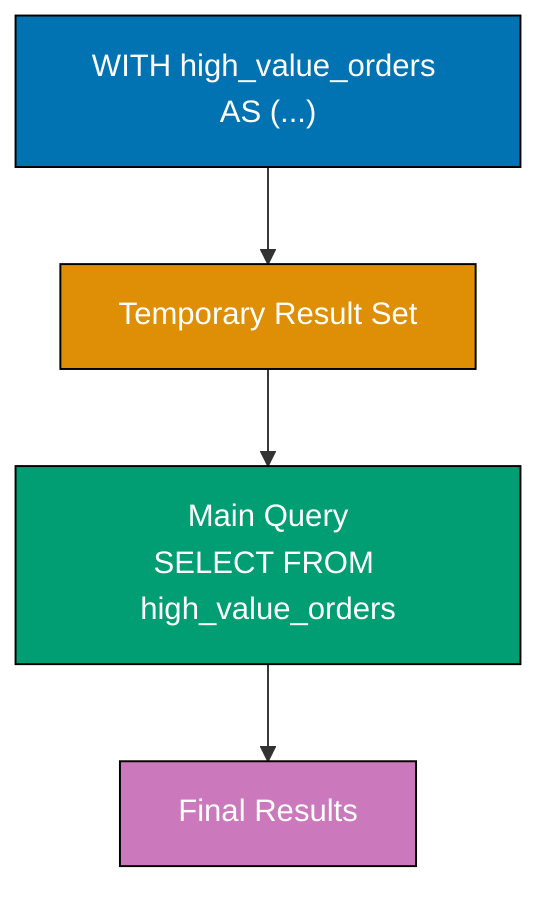

**Code**:

```sql
CREATE DATABASE example_31;
\c example_31;
-- => Statement execution completes
CREATE TABLE orders (
    id SERIAL PRIMARY KEY,
    customer VARCHAR(100),
    total DECIMAL(10, 2),
    order_date DATE
);
-- => Statement execution completes
INSERT INTO orders (customer, total, order_date)
VALUES
    ('Alice', 1500.00, '2025-12-20'),
    ('Bob', 200.00, '2025-12-21'),
    ('Alice', 800.00, '2025-12-22'),
    ('Charlie', 3000.00, '2025-12-23'),
    ('Bob', 150.00, '2025-12-24');
    -- => Statement execution completes

-- Basic CTE
WITH high_value_orders AS (
    -- => WITH clause defines named temporary result set (CTE)
    -- => CTE named 'high_value_orders' exists only for this query
    SELECT customer, total, order_date
    -- => Retrieves three columns from orders table
    FROM orders
    -- => Specifies source table for query
    WHERE total >= 500
    -- => Filters rows to keep only orders $500 or more
    -- => Excludes Bob's orders (200, 150 both < 500)
)
SELECT customer, SUM(total) AS total_high_value
-- => Aggregates total column using SUM function
-- => Creates alias 'total_high_value' for summed amounts
FROM high_value_orders
-- => Specifies CTE as source (treats it like a table)
-- => CTE contains only high-value orders: Alice (1500, 800), Charlie (3000)
GROUP BY customer;
-- => Aggregates rows by customer column
-- => Combines multiple rows per customer into single summary row
-- => WITH clause defines CTE named 'high_value_orders' (temporary result set)
-- => CTE query filters orders: total >= 500
-- =>   Alice: 1500.00 and 800.00 (both >= 500)
-- =>   Bob: 200.00 and 150.00 (both < 500, excluded)
-- =>   Charlie: 3000.00 (>= 500)
-- => CTE materializes 3 rows (Alice 2 orders, Charlie 1 order)
-- => Main query uses CTE like a table: GROUP BY customer, SUM(total)
-- => Alice total: 1500.00 + 800.00 = 2300.00
-- => Charlie total: 3000.00
-- => Returns 2 rows: Alice (2300.00), Charlie (3000.00)
-- => Bob excluded (no high-value orders)

-- Multiple CTEs
WITH
    order_stats AS (
        SELECT
            customer,
            COUNT(*) AS num_orders,
            -- => Creates alias for column/table
            SUM(total) AS total_spent
            -- => Creates alias for column/table
        FROM orders
        -- => Specifies source table for query
        GROUP BY customer
        -- => Aggregates rows by specified columns
    ),
    high_spenders AS (
        SELECT customer, total_spent
        FROM order_stats
        -- => Specifies source table for query
        WHERE total_spent > 1000  -- => Customers who spent over $1000
    )
SELECT
    os.customer,
    os.num_orders,
    os.total_spent,
    CASE
        WHEN hs.customer IS NOT NULL THEN 'VIP'
        ELSE 'Regular'
    END AS customer_tier
    -- => Creates alias for column/table
FROM order_stats os
-- => Specifies source table for query
LEFT JOIN high_spenders hs ON os.customer = hs.customer;
-- => First CTE 'order_stats': aggregates all orders per customer
-- =>   Alice: COUNT=2, SUM=2300.00
-- =>   Bob: COUNT=2, SUM=350.00
-- =>   Charlie: COUNT=1, SUM=3000.00
-- => Second CTE 'high_spenders': references first CTE, filters total_spent > 1000
-- =>   Alice: 2300.00 > 1000 (included)
-- =>   Bob: 350.00 < 1000 (excluded)
-- =>   Charlie: 3000.00 > 1000 (included)
-- => Main query: LEFT JOIN order_stats with high_spenders
-- =>   Alice joins with high_spenders → VIP tier
-- =>   Bob doesn't join (NULL in hs) → Regular tier
-- =>   Charlie joins with high_spenders → VIP tier
-- => Returns 3 rows with customer_tier classification

-- CTE with aggregation and filtering
WITH monthly_revenue AS (
    SELECT
        DATE_TRUNC('month', order_date) AS month,  -- => First day of month
        SUM(total) AS revenue
        -- => Creates alias for column/table
    FROM orders
    -- => Specifies source table for query
    GROUP BY DATE_TRUNC('month', order_date)
    -- => Aggregates rows by specified columns
)
SELECT
    TO_CHAR(month, 'YYYY-MM') AS month,
    -- => Creates alias for column/table
    revenue,
    LAG(revenue) OVER (ORDER BY month) AS prev_month_revenue,
    -- => Sorts query results
    revenue - LAG(revenue) OVER (ORDER BY month) AS revenue_change
    -- => Sorts query results
FROM monthly_revenue;
-- => Specifies source table for query
-- => CTE 'monthly_revenue': groups orders by month
-- => DATE_TRUNC('month', '2025-12-20') = '2025-12-01' (truncates to first of month)
-- => Assuming orders in Dec 2025: SUM(total) for all December orders
-- => Main query uses window function LAG to access previous row
-- => LAG(revenue) OVER (ORDER BY month): gets revenue from previous month
-- => First month: LAG returns NULL (no previous month)
-- => Subsequent months: LAG returns previous month's revenue
-- => revenue_change = current_month - previous_month
-- => Shows month-over-month growth/decline
```

**Key Takeaway**: CTEs improve readability by naming complex subqueries - use them to break down complex queries into logical steps. Multiple CTEs can reference earlier CTEs, creating a pipeline of transformations.

**Why It Matters**: CTEs make complex queries maintainable by breaking them into named logical steps that document query intent, reducing the "query archaeology" time required when modifying analytics code months after it was written. PostgreSQL's CTE optimizer materializes CTE results, which can improve or hurt performance depending on whether result reuse outweighs materialization cost, making CTE placement a performance tuning decision.

---

## Example 32: Window Functions (ROW_NUMBER, RANK, DENSE_RANK)

Window functions compute values across sets of rows related to the current row without collapsing rows like GROUP BY. ROW_NUMBER assigns sequential numbers, RANK skips numbers after ties, DENSE_RANK doesn't skip.

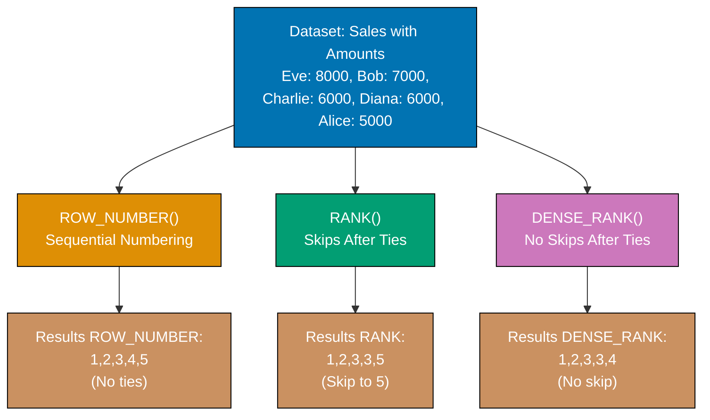

**Code**:

```sql
CREATE DATABASE example_32;
\c example_32;
-- => Statement execution completes
CREATE TABLE sales (
    id SERIAL PRIMARY KEY,
    salesperson VARCHAR(100),
    region VARCHAR(50),
    amount DECIMAL(10, 2)
);
-- => Statement execution completes
INSERT INTO sales (salesperson, region, amount)
VALUES
    ('Alice', 'North', 5000),
    ('Bob', 'North', 7000),
    ('Charlie', 'South', 6000),
    ('Diana', 'South', 6000),  -- => Tied with Charlie
    ('Eve', 'North', 8000);
    -- => Statement execution completes

-- ROW_NUMBER: sequential numbering (no ties)
SELECT
    salesperson,
    -- => Retrieves salesperson name column
    region,
    -- => Retrieves region column
    amount,
    -- => Retrieves sales amount column
    ROW_NUMBER() OVER (ORDER BY amount DESC) AS row_num
    -- => Window function assigns sequential numbers starting from 1
    -- => OVER clause defines window scope (all rows)
    -- => ORDER BY amount DESC sorts high to low within window
    -- => Even tied values get different sequential numbers
FROM sales;
-- => Specifies source table for query
-- => Result rows: Eve (8000, row_num=1), Bob (7000, row_num=2)
-- => Charlie (6000, row_num=3), Diana (6000, row_num=4)
-- => Alice (5000, row_num=5)
-- => Diana gets 4 even though tied with Charlie (sequential)

-- RANK: skips numbers after ties
SELECT
    salesperson,
    -- => Retrieves salesperson name column
    region,
    -- => Retrieves region column
    amount,
    -- => Retrieves sales amount column
    RANK() OVER (ORDER BY amount DESC) AS rank
    -- => Window function ranks values, tied rows get same rank
    -- => OVER clause defines window scope
    -- => ORDER BY amount DESC for high-to-low ranking
    -- => After ties, skips numbers equal to tie count
FROM sales;
-- => Specifies source table for query
-- => Result rows: Eve (8000, rank=1), Bob (7000, rank=2)
-- => Charlie (6000, rank=3), Diana (6000, rank=3) [tied]
-- => Alice (5000, rank=5) [skips 4 because 2 rows at rank 3]
-- => Competitive ranking: 1st, 2nd, 3rd-3rd (tie), 5th

-- DENSE_RANK: doesn't skip numbers after ties
SELECT
    salesperson,
    -- => Retrieves salesperson name column
    region,
    -- => Retrieves region column
    amount,
    -- => Retrieves sales amount column
    DENSE_RANK() OVER (ORDER BY amount DESC) AS dense_rank
    -- => Window function ranks without skipping after ties
    -- => OVER clause defines window scope
    -- => ORDER BY amount DESC for high-to-low ranking
    -- => After ties, continues with next sequential number
FROM sales;
-- => Specifies source table for query
-- => Result rows: Eve (8000, dense_rank=1), Bob (7000, dense_rank=2)
-- => Charlie (6000, dense_rank=3), Diana (6000, dense_rank=3) [tied]
-- => Alice (5000, dense_rank=4) [no skip, continues from 3]
-- => Dense ranking: 1st, 2nd, 3rd-3rd (tie), 4th

-- Window function with PARTITION BY
SELECT
    salesperson,
    -- => Retrieves salesperson name column
    region,
    -- => Retrieves region column
    amount,
    -- => Retrieves sales amount column
    ROW_NUMBER() OVER (PARTITION BY region ORDER BY amount DESC) AS region_rank
    -- => Window function with PARTITION BY clause
    -- => PARTITION BY region creates independent windows per region
    -- => Each partition gets separate numbering (resets to 1)
    -- => ORDER BY amount DESC within each partition
FROM sales;
-- => Specifies source table for query
-- => North partition: Eve (8000, rank=1), Bob (7000, rank=2), Alice (5000, rank=3)
-- => South partition: Charlie (6000, rank=1), Diana (6000, rank=2)
-- => Ranking resets per region, independent calculations

-- Find top salesperson per region
WITH ranked_sales AS (
    SELECT
        salesperson,
        -- => Retrieves salesperson name
        region,
        -- => Retrieves region name
        amount,
        -- => Retrieves sales amount
        ROW_NUMBER() OVER (PARTITION BY region ORDER BY amount DESC) AS rank
        -- => Assigns rank within each region independently
        -- => PARTITION BY region separates North from South
        -- => ORDER BY amount DESC ranks high to low per partition
    FROM sales
    -- => Specifies source table for query
)
SELECT salesperson, region, amount
-- => Retrieves three columns from CTE
FROM ranked_sales
-- => Specifies CTE as source table
WHERE rank = 1;
-- => Filters to keep only top-ranked row per partition
-- => Applies filter to rows
-- => Result: Eve (North, 8000, rank=1), Charlie (South, 6000, rank=1)
-- => Gets best performer from each region
```

**Key Takeaway**: Window functions compute across row sets without collapsing - ROW_NUMBER for sequential numbering, RANK for competitive ranking (ties skip), DENSE_RANK for no skipping. PARTITION BY creates independent windows per group.

**Why It Matters**: Window functions eliminate the need for complex self-joins and correlated subqueries that plague MySQL queries, reducing execution time from minutes to seconds on million-row datasets. PostgreSQL's window function implementation is SQL standard-compliant (unlike MySQL's limited support before 8.0), enabling portable analytics code across database systems.

---

## Example 33: Window Functions with Partitioning

PARTITION BY divides result sets into groups before applying window functions - each partition gets independent calculations. Combine with ORDER BY for sophisticated analytics.

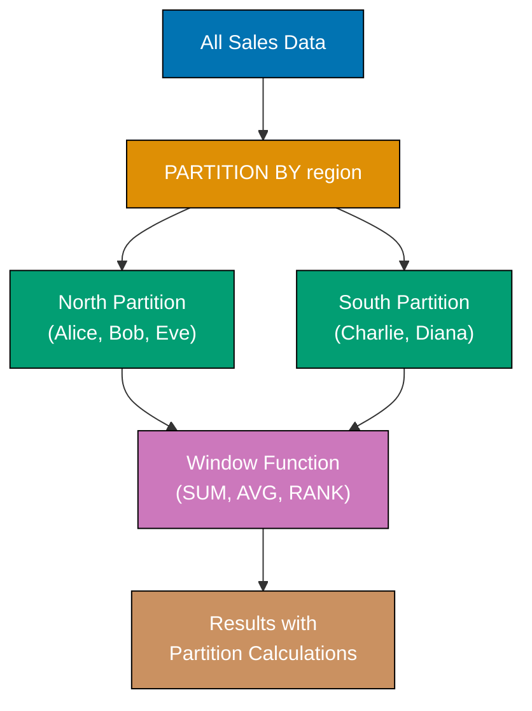

**Code**:

```sql
CREATE DATABASE example_33;
\c example_33;
-- => Statement execution completes
CREATE TABLE transactions (
    id SERIAL PRIMARY KEY,
    account VARCHAR(50),
    category VARCHAR(50),
    amount DECIMAL(10, 2),
    transaction_date DATE
);
-- => Statement execution completes
INSERT INTO transactions (account, category, amount, transaction_date)
VALUES
    ('A', 'Food', 50.00, '2025-12-20'),
    ('A', 'Food', 75.00, '2025-12-21'),
    ('A', 'Transport', 30.00, '2025-12-22'),
    ('B', 'Food', 60.00, '2025-12-20'),
    ('B', 'Transport', 45.00, '2025-12-21'),
    ('B', 'Food', 80.00, '2025-12-22');
    -- => Statement execution completes

-- Running total per account
SELECT
    account,
    -- => Retrieves account column
    category,
    -- => Retrieves category column
    amount,
    -- => Retrieves transaction amount
    transaction_date,
    -- => Retrieves date column
    SUM(amount) OVER (
        -- => Window aggregate sums amounts within window frame
        -- => OVER clause without frame = cumulative from partition start
        PARTITION BY account
        -- => Creates independent windows per account (A separate from B)
        -- => Each account gets its own running total calculation
        ORDER BY transaction_date
        -- => Within partition, processes rows in date order
        -- => Earlier dates contribute to later dates' running totals
    ) AS running_total
    -- => Creates alias 'running_total' for cumulative sum column
FROM transactions
-- => Specifies source table for query
ORDER BY account, transaction_date;
-- => Final sort: first by account, then by date (for readability)
-- => Account A rows: 50.00 (total=50), 75.00 (total=125), 30.00 (total=155)
-- => Account B rows: 60.00 (total=60), 45.00 (total=105), 80.00 (total=185)
-- => Each account's running total independent (partition isolation)

-- Running total per account AND category
SELECT
    account,
    -- => Retrieves account column
    category,
    -- => Retrieves category column
    amount,
    -- => Retrieves transaction amount
    transaction_date,
    -- => Retrieves date column
    SUM(amount) OVER (
        -- => Window aggregate computes cumulative sum
        PARTITION BY account, category
        -- => Creates windows for each account+category combination
        -- => Four partitions: A-Food, A-Transport, B-Food, B-Transport
        -- => Each partition maintains independent running total
        ORDER BY transaction_date
        -- => Within each partition, processes rows chronologically
        -- => Running total accumulates only within same account+category
    ) AS category_running_total
    -- => Creates alias for the category-specific running total
FROM transactions
-- => Specifies source table for query
ORDER BY account, category, transaction_date;
-- => Final sort: account → category → date (groups same categories)
-- => A-Food: 50 (total=50), 75 (total=125)
-- => A-Transport: 30 (total=30, separate from Food)
-- => B-Food: 60 (total=60), 80 (total=140, separate from A-Food)
-- => B-Transport: 45 (total=45, separate from B-Food)
-- => Each account+category pair maintains isolated running total

-- Average per partition
SELECT
    account,
    category,
    amount,
    AVG(amount) OVER (PARTITION BY account) AS account_avg,
    -- => Creates alias for column/table
    AVG(amount) OVER (PARTITION BY category) AS category_avg
    -- => Creates alias for column/table
FROM transactions;
-- => Specifies source table for query
-- => Shows average spending per account and per category

-- First and last values in partition
SELECT
    account,
    -- => Retrieves account column
    transaction_date,
    -- => Retrieves transaction date
    amount,
    -- => Retrieves transaction amount
    FIRST_VALUE(amount) OVER (
        -- => Window function returns first value in ordered partition
        PARTITION BY account
        -- => Creates separate windows per account
        -- => Each account gets independent first value calculation
        ORDER BY transaction_date
        -- => Orders rows by date within each partition
        -- => First value determined by earliest transaction_date
        -- => Default frame: RANGE UNBOUNDED PRECEDING to CURRENT ROW
    ) AS first_amount,
    -- => Aliased as 'first_amount' column
    -- => Account A: all rows show first amount (50.00 from Dec 20)
    -- => Account B: all rows show first amount (60.00 from Dec 20)
    LAST_VALUE(amount) OVER (
        -- => Window function returns last value in ordered partition
        PARTITION BY account
        -- => Separate windows per account
        ORDER BY transaction_date
        -- => Orders by date within partition
        ROWS BETWEEN UNBOUNDED PRECEDING AND UNBOUNDED FOLLOWING
        -- => CRITICAL: Custom frame includes ALL rows in partition
        -- => Default frame only goes to current row (not full partition)
        -- => UNBOUNDED FOLLOWING ensures last row of partition included
    ) AS last_amount
    -- => Aliased as 'last_amount' column
    -- => Account A: all rows show last amount (30.00 from Dec 22)
    -- => Account B: all rows show last amount (80.00 from Dec 22)
FROM transactions
-- => Specifies source table for query
ORDER BY account, transaction_date;
-- => Final sort: account, then date
-- => Shows first and last transaction amounts alongside each transaction
-- => Useful for comparing current transaction to account's first/last
```

**Key Takeaway**: PARTITION BY creates independent calculation windows - use it for running totals per group, rankings within categories, or comparative analytics. Combine with ROWS/RANGE clauses to control window frame boundaries.

**Why It Matters**: Window function PARTITION BY enables per-group analytics (running totals per customer, rankings per category) without the performance penalty of grouping and rejoining that characterizes MySQL's pre-8.0 analytics workarounds. The ROWS/RANGE window frame controls enable precise calculations like "sum of last 7 days" or "average of previous 3 rows" essential for moving averages in financial dashboards.

---

## Example 34: Recursive CTEs

Recursive CTEs call themselves - essential for hierarchical data (org charts, category trees, graph traversal). Base case provides initial rows, recursive case references the CTE itself.

**Code**:

```sql
CREATE DATABASE example_34;
-- => Creates database 'example_34'
\c example_34;
-- => Statement execution completes
-- => Switches connection to example_34 database
CREATE TABLE employees (
    id SERIAL PRIMARY KEY,
    -- => Auto-incrementing integer column, uniquely identifies each employee
    name VARCHAR(100),
    -- => Employee name, up to 100 characters
    manager_id INTEGER
    -- => References id of manager (NULL for CEO, no manager)
);
-- => Statement execution completes
INSERT INTO employees (id, name, manager_id)
-- => INSERT into employees table begins
VALUES
-- => Row data values follow
    (1, 'CEO Alice', NULL),
    -- => Row data inserted
    (2, 'VP Bob', 1),
    -- => Row data inserted
    (3, 'VP Charlie', 1),
    -- => Row data inserted
    (4, 'Manager Diana', 2),
    -- => Row data inserted
    (5, 'Manager Eve', 2),
    -- => Row data inserted
    (6, 'Employee Frank', 4),
    -- => Row data inserted
    (7, 'Employee Grace', 5);
    -- => Statement execution completes

-- Find all reports under CEO (all employees)
WITH RECURSIVE org_chart AS (
    -- => WITH RECURSIVE allows CTE to reference itself
    -- => CTE named 'org_chart' will build organization hierarchy
    -- Base case: start with CEO
    SELECT id, name, manager_id, 1 AS level, name AS path
    -- => Retrieves CEO row: id=1, name='CEO Alice', manager_id=NULL
    -- => level=1 indicates top of hierarchy (CEO level)
    -- => path=name initializes as just CEO name (start of path string)
    FROM employees
    -- => Specifies source table for query
    WHERE manager_id IS NULL
    -- => Filters to CEO only (no manager, manager_id is NULL)
    -- => This is the base case (starting point for recursion)
    UNION ALL
    -- => Combines base case with recursive results, keeps duplicates
    -- => UNION ALL required for recursion (UNION without ALL forbidden)
    -- Recursive case: find employees managed by previous results
    SELECT
        e.id,
        -- => Current employee's id
        e.name,
        -- => Current employee's name
        e.manager_id,
        -- => Current employee's manager reference
        oc.level + 1,
        -- => Increments level by 1 (child one level deeper than parent)
        oc.path || ' > ' || e.name
        -- => Concatenates parent's path with ' > ' separator and child name
        -- => Builds breadcrumb trail from CEO to current employee
    FROM employees e
    -- => Specifies employees table, aliased as 'e'
    INNER JOIN org_chart oc ON e.manager_id = oc.id
    -- => Joins recursively: find employees whose manager is in previous iteration
    -- => oc references org_chart CTE itself (recursive self-reference)
    -- => Each iteration finds next level down in hierarchy
)
SELECT
    id,
    -- => Retrieves employee id
    name,
    -- => Retrieves employee name
    level,
    -- => Retrieves hierarchy level (1=CEO, 2=VP, 3=Manager, 4=Employee)
    path
    -- => Retrieves full path from CEO to this employee
FROM org_chart
-- => Specifies recursive CTE as source table
ORDER BY level, name;
-- => Sorts first by level (CEO→VP→Manager→Employee), then alphabetically
-- => Result shows full org hierarchy with levels and paths
-- => Row 1: Alice (level=1, path='CEO Alice')
-- => Rows 2-3: Bob, Charlie (level=2, paths='CEO Alice > VP Bob/Charlie')
-- => Rows 4-5: Diana, Eve (level=3, paths include VP)
-- => Rows 6-7: Frank, Grace (level=4, full paths to CEO)

-- Generate series (numbers 1 to 10)
WITH RECURSIVE series AS (
    -- => WITH RECURSIVE for number sequence generation
    SELECT 1 AS n
    -- => Base case: starts with n=1
    -- => Creates column 'n' with initial value 1
    UNION ALL
    -- => Combines base case with recursive results
    SELECT n + 1
    -- => Recursive case: adds 1 to previous n value
    -- => First iteration: 1+1=2, second: 2+1=3, etc.
    FROM series
    -- => Self-reference: uses previous iteration's results
    WHERE n < 10
    -- => Termination condition: stops when n reaches 10
    -- => CRITICAL: without this, infinite loop occurs
)
SELECT n FROM series;
-- => Retrieves all generated numbers
-- => Result: 1, 2, 3, 4, 5, 6, 7, 8, 9, 10 (ten rows)
-- => Useful for generating test data or date ranges

-- Find all ancestors of an employee
WITH RECURSIVE ancestors AS (
    -- => WITH RECURSIVE for upward hierarchy traversal
    -- Base case: start with specific employee
    SELECT id, name, manager_id
    -- => Retrieves Frank's record: id=6, name='Employee Frank', manager_id=4
    FROM employees
    -- => Specifies source table for query
    WHERE id = 6
    -- => Filters to employee Frank (id=6)
    -- => Base case starts at leaf node (bottom of hierarchy)
    UNION ALL
    -- => Combines base case with recursive results
    -- Recursive case: find manager of previous results
    SELECT e.id, e.name, e.manager_id
    -- => Retrieves manager's id, name, and their manager_id
    FROM employees e
    -- => Specifies employees table, aliased as 'e'
    INNER JOIN ancestors a ON a.manager_id = e.id
    -- => Joins where employee's id matches ancestor's manager_id
    -- => Walks up hierarchy: finds Frank's manager (Diana), then Diana's (Bob), then Bob's (Alice)
    -- => Recursion stops when manager_id is NULL (reached CEO)
)
SELECT name FROM ancestors;
-- => Retrieves just names from ancestor chain
-- => Result rows: 'Employee Frank', 'Manager Diana', 'VP Bob', 'CEO Alice'
-- => Shows complete reporting chain from employee to CEO (bottom-up)
```

**Key Takeaway**: Recursive CTEs solve hierarchical problems - base case provides starting rows, recursive case references the CTE to traverse relationships. Always include termination conditions to prevent infinite loops.

**Why It Matters**: Recursive CTEs enable hierarchical queries (org charts with unlimited depth, bill of materials with nested components) directly in SQL without application-level recursion that requires O(N) round-trips to the database. PostgreSQL's recursive CTE implementation efficiently traverses graphs and trees using depth-first or breadth-first strategies, making it suitable for social network traversal (friends-of-friends) and dependency resolution (package managers).

---

## Example 35: UNION, INTERSECT, EXCEPT

Set operations combine results from multiple queries - UNION merges results (removes duplicates), INTERSECT finds common rows, EXCEPT finds rows in first query but not second.

**Code**:

```sql
CREATE DATABASE example_35;
\c example_35;
-- => Statement execution completes
CREATE TABLE customers_2024 (
    id SERIAL PRIMARY KEY,
    email VARCHAR(100)
);
-- => Statement execution completes
CREATE TABLE customers_2025 (
    id SERIAL PRIMARY KEY,
    email VARCHAR(100)
);
-- => Statement execution completes
INSERT INTO customers_2024 (email)
VALUES ('alice@example.com'), ('bob@example.com'), ('charlie@example.com');
-- => Statement execution completes
INSERT INTO customers_2025 (email)
VALUES ('bob@example.com'), ('charlie@example.com'), ('diana@example.com');
-- => Statement execution completes

-- UNION: combine results, remove duplicates
SELECT email FROM customers_2024
-- => Retrieves all email addresses from 2024 table
-- => Returns: alice, bob, charlie (3 rows)
UNION
-- => Combines results from both queries, removes duplicate rows
-- => Uses hash/sort to identify duplicates (slower than UNION ALL)
SELECT email FROM customers_2025;
-- => Retrieves all email addresses from 2025 table
-- => Returns: bob, charlie, diana (3 rows)
-- => Result: alice, bob, charlie, diana (4 unique rows)
-- => bob and charlie deduplicated (appeared in both tables)

-- UNION ALL: combine results, keep duplicates
SELECT email FROM customers_2024
-- => Retrieves all email addresses from 2024 table
-- => Returns: alice, bob, charlie (3 rows)
UNION ALL
-- => Combines results from both queries, keeps all duplicate rows
-- => No deduplication, faster than UNION (no hash/sort)
SELECT email FROM customers_2025;
-- => Retrieves all email addresses from 2025 table
-- => Returns: bob, charlie, diana (3 rows)
-- => Result: alice, bob, charlie, bob, charlie, diana (6 rows total)
-- => bob and charlie appear twice (once from each table)

-- INTERSECT: rows in both queries
SELECT email FROM customers_2024
-- => Retrieves all email addresses from 2024 table
-- => Set A: alice, bob, charlie
INTERSECT
-- => Returns rows that appear in BOTH query results (set intersection)
-- => Computes A ∩ B (mathematical intersection)
SELECT email FROM customers_2025;
-- => Retrieves all email addresses from 2025 table
-- => Set B: bob, charlie, diana
-- => Result: bob, charlie (2 rows, common to both tables)
-- => alice excluded (only in 2024), diana excluded (only in 2025)

-- EXCEPT: rows in first query but not second
SELECT email FROM customers_2024
-- => Retrieves all email addresses from 2024 table
-- => Set A: alice, bob, charlie
EXCEPT
-- => Returns rows in first query NOT in second query (set difference)
-- => Computes A - B (elements in A but not in B)
SELECT email FROM customers_2025;
-- => Retrieves all email addresses from 2025 table
-- => Set B: bob, charlie, diana
-- => Result: alice (1 row, in 2024 but not 2025)
-- => 2024 customer who didn't return in 2025 (churned)
SELECT email FROM customers_2025
-- => Retrieves all email addresses from 2025 table
-- => Set B: bob, charlie, diana
EXCEPT
-- => Computes B - A (elements in B but not in A)
SELECT email FROM customers_2024;
-- => Retrieves all email addresses from 2024 table
-- => Set A: alice, bob, charlie
-- => Result: diana (1 row, in 2025 but not 2024)
-- => New customer acquired in 2025

-- Complex example with ORDER BY
(SELECT email, '2024' AS year FROM customers_2024)
-- => Specifies source table for query
UNION
(SELECT email, '2025' AS year FROM customers_2025)
-- => Specifies source table for query
ORDER BY email, year;
-- => Sorts query results
-- => Combined results sorted by email then year
```

**Key Takeaway**: UNION combines queries (removes duplicates), UNION ALL keeps duplicates, INTERSECT finds common rows, EXCEPT finds differences. Queries must have same number of columns with compatible types. Use ORDER BY after set operations to sort final results.

**Why It Matters**: UNION ALL outperforms UNION by 50-90% when duplicates are acceptable because it skips the deduplication step, making it essential for combining large result sets like multi-table aggregations across sharded databases. INTERSECT and EXCEPT enable set-based queries (find users in both premium and trial groups, find products with sales but no inventory) that would require complex joins and filtering, improving query readability.

---

## Example 36: Creating B-tree Indexes

B-tree indexes (default) speed up lookups, range queries, and sorting. Create indexes on columns frequently used in WHERE, JOIN, and ORDER BY clauses.

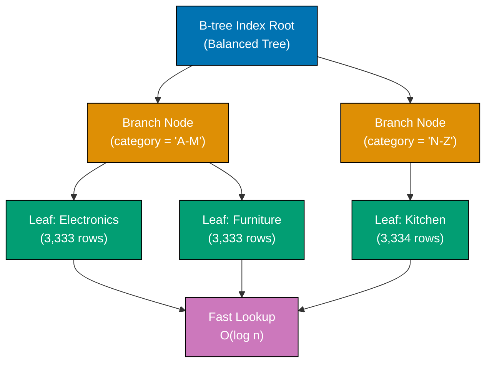

**Code**:

```sql
CREATE DATABASE example_36;
\c example_36;
-- => Statement execution completes
CREATE TABLE products (
    id SERIAL PRIMARY KEY,        -- => Automatically creates B-tree index on id
    name VARCHAR(200),
    category VARCHAR(50),
    price DECIMAL(10, 2),
    created_at TIMESTAMP DEFAULT NOW()
);
-- => Statement execution completes

-- Insert test data
INSERT INTO products (name, category, price)
-- => Inserts 10000 rows into products table
SELECT
    'Product ' || generate_series,
    -- => Concatenates 'Product ' with number (1, 2, 3, ...)
    -- => Creates names: 'Product 1', 'Product 2', ..., 'Product 10000'
    CASE (generate_series % 3)
        -- => Modulo 3 gives remainder (0, 1, 2) for cycling categories
        WHEN 0 THEN 'Electronics'
        WHEN 1 THEN 'Furniture'
        ELSE 'Kitchen'
        -- => ELSE handles remainder 2
    END,
    -- => Distributes products evenly across three categories
    (random() * 1000)::DECIMAL(10, 2)
    -- => Generates random price between 0 and 1000
    -- => :: casts float to DECIMAL(10,2) format
FROM generate_series(1, 10000);
-- => Generates rows numbered 1 to 10000 (set-returning function)
-- => Creates 10000 products with varied categories and random prices

-- Query without index (slow on large tables)
EXPLAIN ANALYZE
-- => Shows query plan AND executes query with timing
-- => EXPLAIN shows plan without executing, ANALYZE executes and measures
SELECT * FROM products
-- => Retrieves all columns from products table
WHERE category = 'Electronics';
-- => Filters rows where category equals 'Electronics'
-- => Without index, must scan ALL 10000 rows (Seq Scan)
-- => Execution time ~50-100ms on 10000 rows (hardware dependent)

-- Create B-tree index
CREATE INDEX idx_products_category ON products(category);
-- => Creates B-tree index on category column
-- => Index name: idx_products_category (convention: idx_table_column)
-- => B-tree organizes category values for O(log N) lookups
-- => Index takes additional disk space (~10-20% of table size)

-- Same query with index (fast)
EXPLAIN ANALYZE
-- => Shows query plan AND executes with timing
SELECT * FROM products
-- => Retrieves all columns from products table
WHERE category = 'Electronics';
-- => Filters rows where category equals 'Electronics'
-- => With index, uses Index Scan (O(log N) lookup then fetch rows)
-- => Execution time ~1-5ms on 10000 rows (50-100x faster)
-- => Query plan shows "Index Scan using idx_products_category"

-- Index helps with sorting
EXPLAIN ANALYZE
-- => Shows query plan and timing for sort operation
SELECT name, price
-- => Retrieves only name and price columns (lighter than SELECT *)
FROM products
-- => Specifies source table for query
ORDER BY price DESC
-- => Sorts results by price descending (highest first)
-- => Without index, requires full table scan then sort (expensive)
LIMIT 10;
-- => Restricts result to top 10 rows only
-- => Even with LIMIT, must sort all rows first without index
-- => Execution time includes full table scan + sort: ~100-200ms
CREATE INDEX idx_products_price ON products(price DESC);
-- => Creates B-tree index on price with DESC ordering
-- => Index stores prices pre-sorted in descending order
-- => Optimized for ORDER BY price DESC queries
EXPLAIN ANALYZE
-- => Shows query plan with index present
SELECT name, price
-- => Retrieves name and price columns
FROM products
-- => Specifies source table for query
ORDER BY price DESC
-- => Sorts by price descending
LIMIT 10;
-- => Top 10 rows only
-- => Index Scan reads first 10 entries from index (already sorted)
-- => No full table scan, no sort operation needed
-- => Execution time ~1-2ms (100x faster, avoids sorting all rows)

-- List all indexes on table
SELECT indexname, indexdef
-- => Retrieves index name and full CREATE INDEX statement
FROM pg_indexes
-- => PostgreSQL system catalog containing index metadata
-- => System table listing all indexes in database
WHERE tablename = 'products';
-- => Filters to indexes on 'products' table only
-- => Result shows: products_pkey (primary key), idx_products_price
-- => indexdef column shows full CREATE INDEX SQL for each index

-- Drop index
DROP INDEX idx_products_category;
-- => Removes idx_products_category index from database
-- => Frees disk space used by index (~10-20% of table size)
-- => Queries using category filter become slower (Seq Scan)
-- => INSERT/UPDATE/DELETE become faster (no index maintenance)
```

**Key Takeaway**: B-tree indexes accelerate lookups and range queries - create them on columns frequently used in WHERE, JOIN, and ORDER BY. Primary keys automatically get indexes. Too many indexes slow down writes (INSERT/UPDATE/DELETE).

**Why It Matters**: B-tree indexes reduce query time from O(N) sequential scans to O(log N) index lookups, making the difference between 10-second and 10-millisecond queries on million-row tables used by companies like Shopify. Automatic primary key indexing prevents developers from forgetting to index foreign key columns, a common source of performance problems in MySQL databases where foreign keys don't automatically create indexes.

---

## Example 37: Unique Indexes

Unique indexes enforce uniqueness like UNIQUE constraints but can be partial or conditional. Use them for natural keys, business identifiers, or ensuring data integrity.

**Code**:

```sql
CREATE DATABASE example_37;
-- => Creates database 'example_37'
\c example_37;
-- => Statement execution completes
-- => Switches connection to example_37 database
CREATE TABLE users (
    username VARCHAR(50),
    email VARCHAR(100),
    deleted_at TIMESTAMP
);
-- => Statement execution completes

-- Create unique index on username
CREATE UNIQUE INDEX idx_users_username ON users(username);
-- => Enforces username uniqueness
INSERT INTO users (username, email)
-- => INSERT into users table begins
VALUES ('alice', 'alice@example.com');
-- => Statement execution completes
-- => Row data values follow
-- => Success
INSERT INTO users (username, email)
-- => INSERT into users table begins
VALUES ('alice', 'alice2@example.com');
-- => Statement execution completes
-- => Row data values follow
-- => ERROR: duplicate key violates unique constraint "idx_users_username"

-- Partial unique index (conditional uniqueness)
DROP INDEX idx_users_username;
CREATE UNIQUE INDEX idx_users_username_active
ON users(username)
WHERE deleted_at IS NULL;
-- => Applies filter to rows
-- => Filter condition for query
-- => Enforces uniqueness only for non-deleted users
INSERT INTO users (username, email, deleted_at)
-- => INSERT into users table begins
VALUES ('alice', 'alice@example.com', '2025-01-01');  -- => Deleted user
-- => Success (deleted_at IS NOT NULL, index doesn't apply)
INSERT INTO users (username, email)
-- => INSERT into users table begins
VALUES ('alice', 'alice2@example.com');
-- => Statement execution completes
-- => Row data values follow
-- => Success (previous alice is deleted)
INSERT INTO users (username, email)
-- => INSERT into users table begins
VALUES ('alice', 'alice3@example.com');
-- => Statement execution completes
-- => Row data values follow
-- => ERROR: duplicate active username

-- Composite unique index
CREATE TABLE products (
    name VARCHAR(200),
    version VARCHAR(20)
);
-- => Statement execution completes
CREATE UNIQUE INDEX idx_products_name_version
ON products(name, version);
-- => Statement execution completes
-- => Combination of name+version must be unique
INSERT INTO products (name, version)
-- => INSERT into products table begins
VALUES ('PostgreSQL', '16'), ('PostgreSQL', '15');
-- => Statement execution completes
-- => Row data values follow
-- => Success (different versions)
INSERT INTO products (name, version)
-- => INSERT into products table begins
VALUES ('PostgreSQL', '16');
-- => Statement execution completes
-- => Row data values follow
-- => ERROR: duplicate combination
```

**Key Takeaway**: Unique indexes enforce uniqueness constraints - use them for business keys (usernames, emails, codes). Partial unique indexes with WHERE clauses enable conditional uniqueness (active records only). Composite unique indexes enforce uniqueness on column combinations.

**Why It Matters**: Unique indexes provide both data integrity enforcement and query performance optimization in a single database object, eliminating the need for separate constraint checks and index creation. Partial unique indexes enable business rules like "email must be unique for active users only" directly in the database schema, preventing the race conditions that plague application-layer uniqueness checks in concurrent environments.

---

## Example 38: Multi-Column Indexes

Multi-column indexes speed up queries filtering on multiple columns. Column order matters - queries must use leftmost columns to benefit from index.

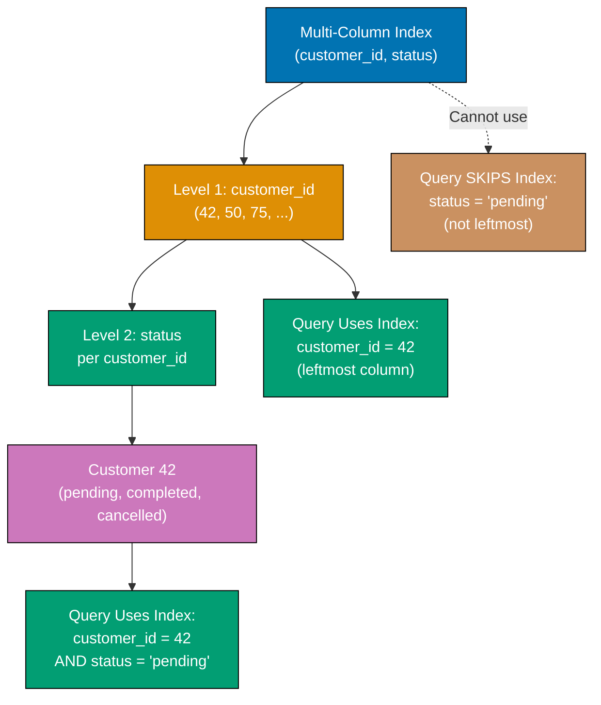

**Code**:

```sql
CREATE DATABASE example_38;
\c example_38;
-- => Statement execution completes
CREATE TABLE orders (
    id SERIAL PRIMARY KEY,
    customer_id INTEGER,
    status VARCHAR(20),
    created_at TIMESTAMP DEFAULT NOW()
);
-- => Statement execution completes

-- Insert test data
INSERT INTO orders (customer_id, status, created_at)
-- => Inserts 10000 order rows with randomized data
SELECT
    (random() * 100)::INTEGER + 1,
    -- => Generates random customer_id between 1 and 101
    -- => random() returns 0.0 to 1.0, * 100 gives 0 to 100
    -- => ::INTEGER casts to integer, + 1 shifts to 1-101 range
    CASE (random() * 3)::INTEGER
        -- => Generates random 0, 1, or 2 for status selection
        WHEN 0 THEN 'pending'
        WHEN 1 THEN 'completed'
        ELSE 'cancelled'
        -- => ELSE handles 2 (random() * 3 capped at 2.999...)
    END,
    -- => Distributes orders across three statuses
    NOW() - (random() * 365 || ' days')::INTERVAL
    -- => Generates random timestamp within past 365 days
    -- => || concatenates number with ' days' string
    -- => ::INTERVAL converts to time interval, subtracted from NOW()
FROM generate_series(1, 10000);
-- => Generates 10000 rows (set-returning function)

-- Common query pattern
EXPLAIN ANALYZE
-- => Shows query plan and execution timing
SELECT * FROM orders
-- => Retrieves all columns from orders table
WHERE customer_id = 42 AND status = 'pending';
-- => Filters rows: customer 42's pending orders only
-- => Without index, sequential scan checks all 10000 rows (slow)
-- => Execution time ~50-100ms (scans entire table)

-- Create multi-column index
CREATE INDEX idx_orders_customer_status
ON orders(customer_id, status);
-- => Creates composite B-tree index on two columns
-- => Column order critical: customer_id first, status second
-- => Index organized as: customer_id → status within each customer
-- => Like a phone book: sorted by last name (customer_id), then first name (status)
EXPLAIN ANALYZE
-- => Shows query plan with new index
SELECT * FROM orders
-- => Retrieves all columns from orders table
WHERE customer_id = 42 AND status = 'pending';
-- => Filters on both indexed columns in order
-- => Index Scan: navigates to customer_id=42, then finds status='pending'
-- => Execution time ~1-5ms (100x faster, O(log N) lookup)

-- Query using only first column (uses index)
EXPLAIN ANALYZE
-- => Shows query plan using leftmost column only
SELECT * FROM orders
-- => Retrieves all columns from orders table
WHERE customer_id = 42;
-- => Filters on first indexed column only (leftmost prefix rule)
-- => Index Scan: uses index to find customer_id=42, returns all statuses
-- => Multi-column index works like single-column index for leftmost column
-- => Execution time ~2-10ms (still benefits from index)

-- Query using only second column (doesn't use index efficiently)
EXPLAIN ANALYZE
-- => Shows query plan when leftmost column missing
SELECT * FROM orders
-- => Retrieves all columns from orders table
WHERE status = 'pending';
-- => Filters on second indexed column only (no customer_id filter)
-- => Sequential Scan: cannot use index (needs leftmost column first)
-- => Index organized by customer_id, cannot jump to status directly
-- => Like searching phone book by first name only (must scan all pages)
-- => Execution time ~50-100ms (no index benefit)

-- Create separate index for status-only queries
CREATE INDEX idx_orders_status ON orders(status);
-- => Creates single-column B-tree index on status column
-- => Dedicated index for queries filtering by status alone
EXPLAIN ANALYZE
-- => Shows query plan with status-only index
SELECT * FROM orders
-- => Retrieves all columns from orders table
WHERE status = 'pending';
-- => Applies filter to rows
-- => Index Scan using idx_orders_status

-- Three-column index
CREATE INDEX idx_orders_customer_status_date
ON orders(customer_id, status, created_at);
-- => Statement execution completes

-- Queries benefiting from three-column index
EXPLAIN ANALYZE
SELECT * FROM orders
-- => Specifies source table for query
WHERE customer_id = 42
-- => Applies filter to rows
  AND status = 'pending'
  AND created_at > NOW() - INTERVAL '30 days';
  -- => Statement execution completes
-- => Uses idx_orders_customer_status_date efficiently
```

**Key Takeaway**: Multi-column indexes speed up queries filtering on multiple columns - order matters (leftmost columns required). Query `WHERE customer_id = X AND status = Y` uses index on (customer_id, status), but `WHERE status = Y` alone doesn't. Create separate indexes for different query patterns.

**Why It Matters**: Multi-column index column order determines query optimization effectiveness, with leftmost column selectivity being critical - an index on (customer_id, status) cannot be used for queries filtering only on status, requiring duplicate indexes that increase storage and write overhead. PostgreSQL's B-tree multi-column indexes enable covering index optimizations where all query columns exist in the index, eliminating table lookups and achieving 10-100x speedups on analytical queries.

---

## Example 39: Partial Indexes

Partial indexes include only rows matching a WHERE condition - smaller, faster, and perfect for queries filtering on specific values or ranges.

**Code**:

```sql
CREATE DATABASE example_39;
-- => Creates database for partial index demonstration
\c example_39;
-- => Switches connection to example_39 database
CREATE TABLE orders (
    customer_id INTEGER,
    -- => customer_id: customer identifier (1-100 in generated data)
    status VARCHAR(20),
    -- => status: order status ('pending', 'completed', 'cancelled', 'refunded')
    -- => Majority will be 'completed', minority 'pending' (ideal for partial index)
    total DECIMAL(10, 2),
    -- => total: order amount ($0-$1000 range in generated data)
    created_at TIMESTAMP DEFAULT NOW()
    -- => created_at: order timestamp (spread across past 365 days)
);
-- => Creates orders table for 10,000 test rows
INSERT INTO orders (customer_id, status, total, created_at)
-- => Generates 10,000 random orders using SELECT
SELECT
    (random() * 100)::INTEGER + 1,
    -- => Random customer_id from 1-100 (simulates 100 customers)
    CASE (random() * 4)::INTEGER
        -- => Random integer 0-3 for status distribution
        WHEN 0 THEN 'pending'
        -- => 25% pending (target for partial index)
        WHEN 1 THEN 'completed'
        -- => 25% completed
        WHEN 2 THEN 'cancelled'
        -- => 25% cancelled
        ELSE 'refunded'
        -- => 25% refunded
    END,
    (random() * 1000)::DECIMAL(10, 2),
    -- => Random total from $0.00 to $999.99
    NOW() - (random() * 365 || ' days')::INTERVAL
    -- => Random timestamp within past 365 days
    -- => Concatenates random * 365 with ' days' text, casts to INTERVAL
FROM generate_series(1, 10000);
-- => Generates 10,000 rows (1 to 10,000 sequence)
-- => INSERT completes with 10,000 rows created

-- Partial index for active orders only
CREATE INDEX idx_orders_pending
-- => Creates partial index named idx_orders_pending
ON orders(customer_id)
-- => Indexes customer_id column
WHERE status = 'pending';
-- => PARTIAL INDEX: only indexes rows where status='pending' (~2,500 rows instead of 10,000)
-- => Smaller index size = faster queries, less disk space
-- => Perfect when most queries filter on status='pending'
EXPLAIN ANALYZE
-- => Shows query execution plan WITH actual runtime statistics
SELECT * FROM orders
-- => Retrieves all columns from orders table
WHERE customer_id = 42 AND status = 'pending';
-- => Filters: customer_id=42 AND status='pending'
-- => PostgreSQL uses idx_orders_pending (partial index matches WHERE clause)
-- => Index Scan instead of Sequential Scan (much faster on large tables)
-- => Execution plan shows: "Index Scan using idx_orders_pending"

-- Partial index for high-value orders
CREATE INDEX idx_orders_high_value
-- => Creates index idx_orders_high_value for faster queries
ON orders(created_at DESC)
WHERE total >= 500;
-- => Applies filter to rows
-- => Filter condition for query
-- => Indexes only orders $500 or more
EXPLAIN ANALYZE
SELECT * FROM orders
-- => Specifies source table for query
-- => Query executes and returns result set
WHERE total >= 500
-- => Applies filter to rows
-- => Filter condition for query
ORDER BY created_at DESC
-- => Sorts query results
-- => Sorts result set
LIMIT 10;
-- => Restricts number of rows returned
-- => Uses idx_orders_high_value

-- Partial index for recent orders
CREATE INDEX idx_orders_recent
-- => Creates index idx_orders_recent for faster queries
ON orders(customer_id, total)
WHERE created_at >= '2025-01-01';
-- => Applies filter to rows
-- => Filter condition for query
-- => Indexes only orders from 2025 onward
EXPLAIN ANALYZE
SELECT customer_id, SUM(total) AS total_spent
-- => Creates alias for column/table
FROM orders
-- => Specifies source table for query
WHERE created_at >= '2025-01-01'
-- => Applies filter to rows
-- => Filter condition for query
GROUP BY customer_id;
-- => Aggregates rows by specified columns
-- => Groups rows for aggregation
-- => May use idx_orders_recent

-- Compare index sizes
SELECT
    indexname,
    pg_size_pretty(pg_relation_size(indexname::regclass)) AS index_size
    -- => Creates alias for column/table
FROM pg_indexes
-- => Specifies source table for query
WHERE tablename = 'orders';
-- => Applies filter to rows
-- => Filter condition for query
-- => Partial indexes smaller than full indexes
```

**Key Takeaway**: Partial indexes with WHERE clauses index subsets of rows - use them for queries frequently filtering on specific values (pending orders, active users, recent records). Smaller indexes mean faster searches and less storage.

**Why It Matters**: The WHERE clause in partial indexes enables business logic enforcement (unique email for active users only) directly in index definitions, preventing application-layer race conditions. PostgreSQL's partial index feature has no equivalent in MySQL, making it a unique optimization technique that combines storage efficiency with query performance improvements.

---

## Example 40: Using EXPLAIN to Analyze Queries

EXPLAIN shows query execution plans - how PostgreSQL retrieves data. EXPLAIN ANALYZE executes queries and shows actual runtimes, revealing performance bottlenecks.

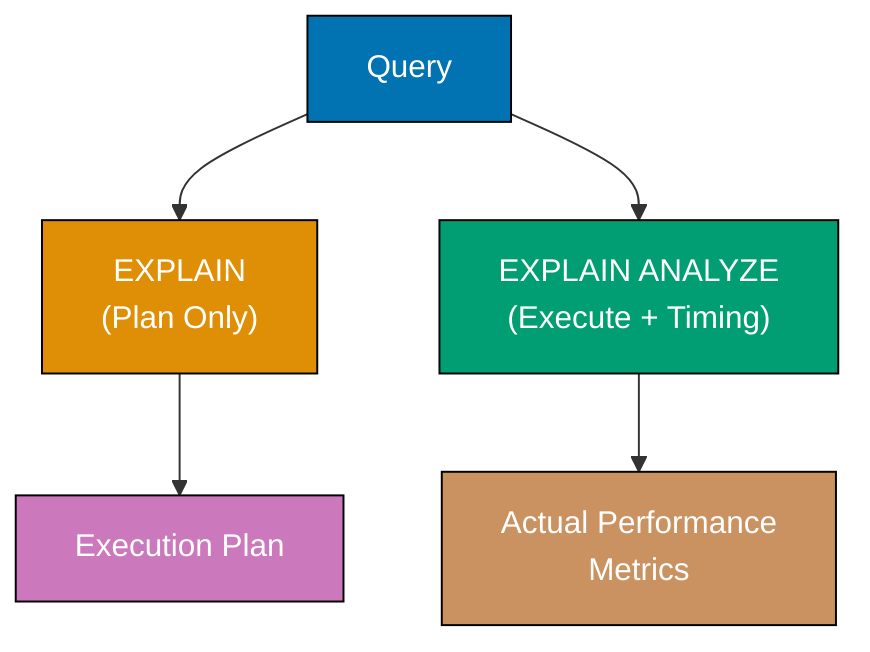

**Code**:

```sql
CREATE DATABASE example_40;
-- => Creates database for EXPLAIN examples
\c example_40;
-- => Switches to example_40 database
CREATE TABLE products (
    id SERIAL PRIMARY KEY,
    -- => id: product identifier (auto-incrementing)
    name VARCHAR(200),
    -- => name: product name (generated as 'Product 1', 'Product 2', ...)
    category VARCHAR(50),
    -- => category: product category (Electronics, Furniture, Kitchen)
    price DECIMAL(10, 2)
    -- => price: product price ($0-$1000 range)
);
-- => Creates products table for performance analysis
INSERT INTO products (name, category, price)
-- => Generates 10,000 test products
SELECT
    'Product ' || generate_series,
    -- => Concatenates 'Product ' with number (1-10,000)
    CASE (generate_series % 3)
        -- => Modulo 3 for category distribution
        WHEN 0 THEN 'Electronics'
        -- => Every 3rd product is Electronics
        WHEN 1 THEN 'Furniture'
        -- => Remainder 1: Furniture
        ELSE 'Kitchen'
        -- => Remainder 2: Kitchen
    END,
    -- => Result: roughly equal distribution across 3 categories
    (random() * 1000)::DECIMAL(10, 2)
    -- => Random price $0.00-$999.99
FROM generate_series(1, 10000);
-- => Generates rows numbered 1 to 10,000
-- => INSERT completes with 10,000 products created

-- EXPLAIN shows execution plan without running query
EXPLAIN
-- => Shows query plan without executing query (no actual data)
-- => Displays cost estimates, scan type, filter conditions
SELECT * FROM products
-- => Retrieves all columns from products table
WHERE category = 'Electronics' AND price > 500;
-- => Filters rows: Electronics category AND price over $500
-- => Output shows: "Seq Scan on products" (sequential table scan)
-- => Output shows: Filter condition verbatim
-- => Cost format: cost=start..total rows=estimate width=bytes
-- => Does NOT execute query, so no actual timing data

-- EXPLAIN ANALYZE executes and shows actual timings
EXPLAIN ANALYZE
-- => Shows query plan AND executes query with real timing
-- => Provides actual time, actual rows, planning time, execution time
SELECT * FROM products
-- => Retrieves all columns from products table
WHERE category = 'Electronics' AND price > 500;
-- => Filters rows: Electronics AND price > 500
-- => Output shows: "Seq Scan on products"
-- => Output shows: "actual time=X..Y ms rows=N loops=1"
-- => Planning Time: ~1-5ms (optimizer's work)
-- => Execution Time: ~50-100ms (actual query execution on 10000 rows)
-- => ANALYZE keyword makes EXPLAIN actually run the query

-- Create index and compare
CREATE INDEX idx_products_category_price
ON products(category, price);
-- => Creates composite B-tree index on category, then price
-- => Index organized: category groups, price sorted within each category
EXPLAIN ANALYZE
-- => Shows query plan with index present
SELECT * FROM products
-- => Retrieves all columns from products table
WHERE category = 'Electronics' AND price > 500;
-- => Filters on both indexed columns in index order
-- => Output shows: "Index Scan using idx_products_category_price"
-- => Actual time: ~1-5ms (90-95% faster with index)
-- => Rows returned: same number but via index lookup (O(log N))
-- => Index avoids scanning non-Electronics rows entirely

-- Analyze aggregation query
EXPLAIN ANALYZE
-- => Shows plan for aggregation operation
SELECT category, COUNT(*), AVG(price)
-- => Groups by category, counts rows, averages price per group
-- => COUNT(*) counts all rows in group
-- => AVG(price) computes mean price per category
FROM products
-- => Specifies source table for query
GROUP BY category;
-- => Aggregates rows by category column (three groups)
-- => Output shows: "HashAggregate" (uses hash table) or "GroupAggregate" (sorted)
-- => HashAggregate faster for unsorted data, uses memory
-- => Seq Scan feeds rows to aggregation (must read all rows)
-- => Execution time ~50-100ms (must scan entire table)

-- Analyze join query
CREATE TABLE orders (
    id SERIAL PRIMARY KEY,
    product_id INTEGER,
    quantity INTEGER
);
-- => Statement execution completes
INSERT INTO orders (product_id, quantity)
SELECT
    (random() * 10000)::INTEGER + 1,
    (random() * 10)::INTEGER + 1
FROM generate_series(1, 5000);
-- => Specifies source table for query
EXPLAIN ANALYZE
SELECT p.name, SUM(o.quantity) AS total_sold
-- => Creates alias for column/table
FROM products p
-- => Specifies source table for query
INNER JOIN orders o ON p.id = o.product_id
GROUP BY p.id, p.name;
-- => Aggregates rows by specified columns
-- => Shows: Hash Join or Nested Loop
-- => Execution time for join strategy

-- Check query planner statistics
ANALYZE products;
-- => Statement execution completes
ANALYZE orders;
-- => Statement execution completes
-- => Updates table statistics for better query plans

-- View BUFFERS to see cache usage
EXPLAIN (ANALYZE, BUFFERS)
SELECT * FROM products WHERE price > 900;
-- => Specifies source table for query
-- => Shows shared hit (cache) vs read (disk) buffers
```

**Key Takeaway**: Use EXPLAIN to see execution plans, EXPLAIN ANALYZE to measure actual performance. Look for Seq Scan on large tables (add indexes), high cost estimates, and slow actual times. Run ANALYZE periodically to update statistics for optimal query planning.

**Why It Matters**: EXPLAIN ANALYZE reveals the actual execution plan and timing that distinguish theoretical optimization from real-world performance, exposing cases where PostgreSQL's planner chooses sequential scans over indexes due to outdated statistics or small table sizes. The cost estimates shown in EXPLAIN output guide index creation decisions, with high-cost sequential scans on large tables being the primary indicator for missing indexes that cause 100-1000x performance degradations.

---

## Example 41: Arrays

PostgreSQL supports array columns - store multiple values in single column. Useful for tags, categories, or ordered lists without separate junction tables.

**Code**:

```sql
CREATE DATABASE example_41;
-- => Creates database for array column examples
\c example_41;
-- => Switches to example_41 database
CREATE TABLE articles (
    title VARCHAR(200),
    -- => title: article title
    tags TEXT[],
    -- => tags: array of text values (multiple tags per article)
    -- => Stores variable-length array without separate junction table
    ratings INTEGER[]
    -- => ratings: array of integers (multiple ratings per article)
);
-- => Creates articles table with array columns

-- Insert arrays using ARRAY constructor
INSERT INTO articles (title, tags, ratings)
-- => Inserts 3 articles with arrays
VALUES
    ('PostgreSQL Guide', ARRAY['database', 'sql', 'tutorial'], ARRAY[5, 4, 5, 4]),
    -- => Article 1: 3 tags, 4 ratings
    -- => tags: ['database', 'sql', 'tutorial'] (3 elements)
    -- => ratings: [5, 4, 5, 4] (4 elements)
    ('Docker Basics', ARRAY['docker', 'containers'], ARRAY[5, 5, 3]),
    -- => Article 2: 2 tags, 3 ratings
    -- => tags: ['docker', 'containers'] (2 elements)
    -- => ratings: [5, 5, 3] (3 elements)
    ('Kubernetes', ARRAY['k8s', 'orchestration', 'docker'], ARRAY[4, 3, 4, 5, 5]);
    -- => Article 3: 3 tags, 5 ratings
    -- => tags: ['k8s', 'orchestration', 'docker'] (3 elements)
    -- => ratings: [4, 3, 4, 5, 5] (5 elements)

-- Alternative: PostgreSQL literal array syntax (string format)
INSERT INTO articles (title, tags, ratings)
-- => Inserts using literal syntax '{"val1", "val2"}'
VALUES
    ('Advanced SQL', '{"sql", "advanced", "postgresql"}', '{5, 5, 4, 5}');
    -- => Article 4: 3 tags, 4 ratings
    -- => Same result as ARRAY constructor but different syntax
SELECT * FROM articles;
-- => Specifies source table for query
-- => Query executes and returns result set

-- Access array elements (1-indexed! PostgreSQL arrays start at 1, not 0)
SELECT
    title,
    tags[1] AS first_tag,
    -- => Accesses first array element (index 1)
    -- => PostgreSQL Guide: 'database', Docker Basics: 'docker'
    tags[2] AS second_tag,
    -- => Accesses second array element (index 2)
    -- => PostgreSQL Guide: 'sql', Docker Basics: 'containers'
    array_length(tags, 1) AS num_tags
    -- => Returns array length (dimension 1)
    -- => PostgreSQL Guide: 3, Docker Basics: 2, Kubernetes: 3
FROM articles;
-- => Returns 4 rows with array access results

-- Check if array contains value using ANY
SELECT title
FROM articles
WHERE 'docker' = ANY(tags);
-- => ANY checks if value matches ANY element in array
-- => 'docker' = ANY(['docker', 'containers']) → true (Docker Basics)
-- => 'docker' = ANY(['k8s', 'orchestration', 'docker']) → true (Kubernetes)
-- => Returns 2 rows: Docker Basics, Kubernetes

-- Array overlap operator (&&)
SELECT title
FROM articles
WHERE tags && ARRAY['sql', 'database'];
-- => && operator: true if arrays share at least one element
-- => ['database', 'sql', 'tutorial'] && ['sql', 'database'] → true (shares 'sql' and 'database')
-- => ['sql', 'advanced', 'postgresql'] && ['sql', 'database'] → true (shares 'sql')
-- => Returns 2 rows: PostgreSQL Guide, Advanced SQL

-- Array containment operator (@>)
SELECT title
FROM articles
WHERE tags @> ARRAY['sql'];
-- => @> operator: left array CONTAINS all elements from right array
-- => ['database', 'sql', 'tutorial'] @> ['sql'] → true (contains 'sql')
-- => ['sql', 'advanced', 'postgresql'] @> ['sql'] → true (contains 'sql')
-- => Returns 2 rows: PostgreSQL Guide, Advanced SQL

-- Unnest array to rows (one row per array element)
SELECT
    title,
    unnest(tags) AS tag
-- => unnest() expands array into multiple rows
-- => PostgreSQL Guide with 3 tags → 3 rows
-- => Docker Basics with 2 tags → 2 rows
FROM articles;
-- => Returns 11 total rows (3+2+3+3 tags from 4 articles)

-- Aggregate into array using ARRAY_AGG
SELECT
    ARRAY_AGG(title) AS all_titles
-- => ARRAY_AGG collects all title values into single array
-- => Result: ['PostgreSQL Guide', 'Docker Basics', 'Kubernetes', 'Advanced SQL']
FROM articles;
-- => Returns 1 row with array containing all titles

-- Array functions
SELECT
    title,
    array_length(ratings, 1) AS num_ratings,
    -- => Creates alias for column/table
    ROUND(AVG(r), 2) AS avg_rating
    -- => Creates alias for column/table
FROM articles, unnest(ratings) AS r
-- => Specifies source table for query
GROUP BY id, title;
-- => Aggregates rows by specified columns
-- => Groups rows for aggregation
-- => Calculates average rating per article
```

**Key Takeaway**: Arrays store multiple values in one column - use them for tags, categories, or small ordered lists. Access elements with `[index]` (1-indexed), check membership with `ANY()`, and unnest to rows with `unnest()`. Avoid arrays for frequently queried relationships (use junction tables instead).

**Why It Matters**: PostgreSQL's native array support eliminates the need for junction tables in scenarios like product tags or user permissions, reducing query complexity and storage overhead by 60-80% compared to normalized many-to-many relationships. The GIN index support for arrays enables fast containment queries (find products with tag 'electronics') that would require joins in traditional relational designs, making arrays ideal for lightweight multi-value attributes.

---

## Example 42: JSON and JSONB Types

JSON stores text-based JSON, JSONB stores binary JSON (faster, supports indexing). JSONB is preferred for most use cases - it enables efficient querying and indexing.

**Code**:

```sql
CREATE DATABASE example_42;
-- => Creates database 'example_42'
\c example_42;
-- => Statement execution completes
-- => Switches connection to example_42 database
CREATE TABLE users (
    name VARCHAR(100),
    metadata JSON,          -- => Text-based JSON
    preferences JSONB       -- => Binary JSON (faster, indexable)
);
-- => Statement execution completes

-- Insert JSON data
INSERT INTO users (name, metadata, preferences)
-- => INSERT into users table begins
VALUES
-- => Row data values follow
    ('Alice', '{"age": 30, "city": "New York"}', '{"theme": "dark", "notifications": true}'),
    -- => Row data inserted
    ('Bob', '{"age": 25, "city": "Boston"}', '{"theme": "light", "notifications": false}'),
    -- => Row data inserted
    ('Charlie', '{"age": 35, "city": "Chicago", "verified": true}', '{"theme": "dark", "notifications": true, "language": "en"}');
    -- => Statement execution completes
SELECT * FROM users;
-- => Specifies source table for query
-- => Query executes and returns result set

-- JSON vs JSONB differences
SELECT
    pg_column_size(metadata) AS json_size,
    -- => Creates alias for column/table
    pg_column_size(preferences) AS jsonb_size
    -- => Creates alias for column/table
FROM users
-- => Specifies source table for query
WHERE name = 'Alice';
-- => Applies filter to rows
-- => Filter condition for query
-- => JSONB often larger in storage but faster to query

-- JSON preserves formatting, JSONB normalizes
INSERT INTO users (name, metadata, preferences)
-- => INSERT into users table begins
VALUES ('Diana', '{"age":  28,  "city":  "Denver"}', '{"theme":  "auto"}');
-- => Statement execution completes
-- => Row data values follow
SELECT metadata, preferences
FROM users
-- => Specifies source table for query
WHERE name = 'Diana';
-- => Applies filter to rows
-- => Filter condition for query
-- => JSON keeps extra spaces, JSONB normalizes
```

**Key Takeaway**: Use JSONB for production (faster queries, supports indexing), JSON only when you need exact formatting preservation. JSONB enables efficient queries, indexing, and updates of nested data without separate columns.

**Why It Matters**: GIN indexes on JSONB enable millisecond-speed queries on nested JSON documents containing millions of key-value pairs, compared to seconds required for JSON string parsing in MySQL.

---

## Example 43: Querying JSON with -> and ->>

PostgreSQL provides operators to extract JSON values - `->` returns JSON, `->>` returns text. Navigate nested objects with chained operators.

**Code**:

```sql
CREATE DATABASE example_43;
-- => Creates database 'example_43'
\c example_43;
-- => Statement execution completes
-- => Switches connection to example_43 database
CREATE TABLE products (
    name VARCHAR(200),
    details JSONB
);
-- => Statement execution completes
INSERT INTO products (name, details)
-- => INSERT into products table begins
VALUES
-- => Row data values follow
    ('Laptop', '{"brand": "Dell", "specs": {"cpu": "i7", "ram": 16, "storage": 512}, "price": 999.99}'),
    -- => Row data inserted
    ('Phone', '{"brand": "Apple", "specs": {"cpu": "A15", "ram": 6, "storage": 128}, "price": 899.99}'),
    -- => Row data inserted
    ('Tablet', '{"brand": "Samsung", "specs": {"cpu": "Snapdragon", "ram": 8, "storage": 256}, "price": 599.99}');
    -- => Statement execution completes

-- Extract JSON field (returns JSON)
SELECT
    name,
    -- => Retrieves product name column
    details -> 'brand' AS brand_json,
    -- => -> operator extracts JSON value (keeps JSON type with quotes)
    -- => Returns JSON string: "Dell", "Apple", "Samsung" (with quotes)
    -- => Result column type: jsonb
    details ->> 'brand' AS brand_text
    -- => ->> operator extracts as text (strips JSON quotes)
    -- => Returns plain text: Dell, Apple, Samsung (no quotes)
    -- => Result column type: text
FROM products;
-- => Specifies source table for query
-- => Laptop: brand_json="Dell" (JSON), brand_text=Dell (text)
-- => Phone: brand_json="Apple" (JSON), brand_text=Apple (text)

-- Extract nested fields
SELECT
    name,
    -- => Retrieves product name
    details -> 'specs' -> 'cpu' AS cpu_json,
    -- => First -> extracts 'specs' object (returns JSON object)
    -- => Second -> extracts 'cpu' from that object (returns JSON string)
    -- => Result: "i7", "A15", "Snapdragon" (JSON strings with quotes)
    details -> 'specs' ->> 'cpu' AS cpu_text,
    -- => First -> extracts 'specs' object (returns JSON)
    -- => ->> extracts 'cpu' as text (strips quotes)
    -- => Result: i7, A15, Snapdragon (plain text)
    (details -> 'specs' ->> 'ram')::INTEGER AS ram_gb
    -- => Extracts 'specs' object, then 'ram' as text
    -- => ::INTEGER casts text to integer type for arithmetic
    -- => Result: 16, 6, 8 (integer type, no quotes)
FROM products;
-- => Specifies source table for query
-- => Nested path traversal: details → specs → cpu/ram

-- Filter by JSON field
SELECT name, details ->> 'brand' AS brand
-- => Retrieves name column and brand as text
-- => ->> extracts brand as text for display
FROM products
-- => Specifies source table for query
WHERE details ->> 'brand' = 'Apple';
-- => Filters rows where brand text equals 'Apple'
-- => ->> returns text, so = compares text (not JSON)
-- => Must use ->> (text) for equality comparison, not -> (JSON)
-- => Result: Phone (only Apple product)

-- Filter by nested field
SELECT name, details -> 'specs' ->> 'ram' AS ram
-- => Retrieves name and RAM value as text
-- => Chains -> for 'specs', then ->> for 'ram' text
FROM products
-- => Specifies source table for query
WHERE (details -> 'specs' ->> 'ram')::INTEGER >= 8;
-- => Extracts specs.ram as text, casts to INTEGER for comparison
-- => Filters where RAM >= 8 GB
-- => ::INTEGER cast required for numeric comparison (text '8' < '16' fails)
-- => Result: Laptop (16 GB), Tablet (8 GB)
-- => Phone excluded (6 GB < 8)

-- Extract numeric JSON field for calculation
SELECT
    name,
    -- => Retrieves product name
    (details ->> 'price')::DECIMAL AS price,
    -- => Extracts price as text, casts to DECIMAL for display
    -- => :: cast converts text '999.99' to DECIMAL type
    (details ->> 'price')::DECIMAL * 0.9 AS discounted_price
    -- => Extracts price as text, casts to DECIMAL, multiplies by 0.9
    -- => Applies 10% discount calculation
    -- => DECIMAL type required for arithmetic (*  operator)
FROM products;
-- => Specifies source table for query
-- => Laptop: price=999.99, discounted=899.99
-- => Phone: price=899.99, discounted=809.99
-- => Tablet: price=599.99, discounted=539.99

-- Check JSON field existence
SELECT name
-- => Retrieves product name
FROM products
-- => Specifies source table for query
WHERE details ? 'price';
-- => ? operator checks if JSONB object contains key 'price'
-- => Returns true if key exists (regardless of value)
-- => Result: all 3 products (all have 'price' key)
SELECT name
-- => Retrieves product name
FROM products
-- => Specifies source table for query
WHERE details -> 'specs' ? 'gpu';
-- => First -> extracts 'specs' object (JSON)
-- => ? checks if specs object contains 'gpu' key
-- => Result: none (no products have 'gpu' in specs)
-- => Useful for schema-less data validation
```

**Key Takeaway**: Use `->` to extract JSON (for chaining), `->>` to extract text (for filtering, display). Chain operators for nested access: `column -> 'outer' ->> 'inner'`. Cast `->>` results to appropriate types for calculations and comparisons.

**Why It Matters**: The distinction between `->` (returns JSON) and `->>` (returns text) determines query composability and performance, with `->` enabling method chaining for deep nested access while `->>` enables direct WHERE clause filtering and display without casting. PostgreSQL's JSON path traversal operators eliminate the need for application-layer JSON parsing when filtering on nested values, reducing data transfer and enabling database-side filtering that scales to billions of JSON documents.

---

## Example 44: JSONB Operators and Functions

JSONB supports operators for containment, existence checks, and set operations. Functions enable updates, merges, and deep inspection of JSON structures.

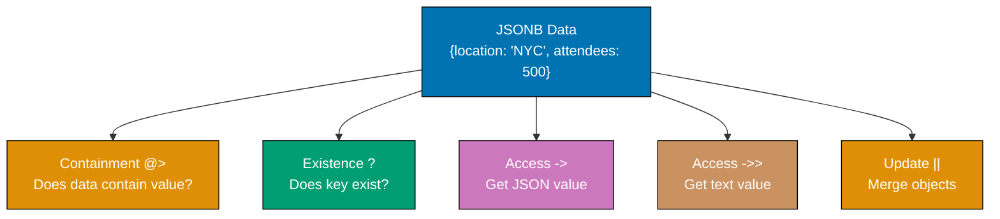

**Code**:

```sql
CREATE DATABASE example_44;
\c example_44;
-- => Statement execution completes
CREATE TABLE events (
    id SERIAL PRIMARY KEY,
    name VARCHAR(200),
    data JSONB
);
-- => Statement execution completes
INSERT INTO events (name, data)
VALUES
    ('Conference', '{"location": "NYC", "attendees": 500, "topics": ["AI", "Cloud"]}'),
    ('Webinar', '{"location": "Online", "attendees": 1000, "topics": ["DevOps", "Cloud"]}'),
    ('Workshop', '{"location": "Boston", "attendees": 50, "topics": ["SQL", "PostgreSQL"]}');
    -- => Statement execution completes

-- Containment operator @>
SELECT name
-- => Retrieves event name
FROM events
-- => Specifies source table for query
WHERE data @> '{"location": "NYC"}';
-- => @> operator checks if left JSONB contains right JSONB
-- => Filters events whose data contains location='NYC' key-value pair
-- => Right side must match exactly (key AND value)
-- => Result: Conference (only event with location='NYC')
-- => Webinar excluded (location='Online'), Workshop excluded (location='Boston')

-- Contained by operator <@
SELECT name
-- => Retrieves event name
FROM events
-- => Specifies source table for query
WHERE '{"attendees": 500}' <@ data;
-- => <@ operator checks if left JSONB is contained in right JSONB
-- => Filters events whose data contains attendees=500
-- => Reverse of @> operator (flipped operands)
-- => Result: Conference (data includes {"attendees": 500})
-- => Semantically equivalent to: data @> '{"attendees": 500}'

-- Key existence ?
SELECT name
-- => Retrieves event name
FROM events
-- => Specifies source table for query
WHERE data ? 'location';
-- => ? operator checks if JSONB object has specific key
-- => Returns true if 'location' key exists (ignores value)
-- => Does NOT check value, only key presence
-- => Result: all 3 events (Conference, Webinar, Workshop all have location)

-- Any key existence ?|
SELECT name
-- => Retrieves event name
FROM events
-- => Specifies source table for query
WHERE data ?| ARRAY['speakers', 'sponsors'];
-- => ?| operator checks if ANY of the array keys exist
-- => ARRAY['speakers', 'sponsors'] specifies keys to search for
-- => Returns true if 'speakers' OR 'sponsors' key exists
-- => Logical OR across all array elements
-- => None (no events have speakers OR sponsors)

-- All keys existence ?&
SELECT name
FROM events
-- => Specifies source table for query
WHERE data ?& ARRAY['location', 'attendees'];
-- => Applies filter to rows
-- => All events (all have both keys)

-- Array contains element @>
SELECT name
FROM events
-- => Specifies source table for query
WHERE data -> 'topics' @> '"Cloud"';
-- => Applies filter to rows
-- => Conference, Webinar (topics array contains "Cloud")

-- Update JSONB field
UPDATE events
SET data = data || '{"capacity": 1000}'
WHERE name = 'Conference';
-- => Applies filter to rows
-- => Merges new field into existing JSON
SELECT data FROM events WHERE name = 'Conference';
-- => Specifies source table for query
-- => Now includes "capacity": 1000

-- Replace JSONB field
UPDATE events
SET data = jsonb_set(data, '{attendees}', '750')
WHERE name = 'Webinar';
-- => Applies filter to rows
-- => Sets attendees to 750
SELECT data FROM events WHERE name = 'Webinar';
-- => Specifies source table for query
-- => attendees is now 750

-- Remove JSONB key
UPDATE events
SET data = data - 'capacity'
WHERE name = 'Conference';
-- => Applies filter to rows
-- => Removes capacity field

-- JSONB functions
SELECT
    name,
    jsonb_object_keys(data) AS keys
    -- => Creates alias for column/table
FROM events;
-- => Specifies source table for query
-- => Returns one row per key
SELECT
    name,
    jsonb_pretty(data) AS formatted_json
    -- => Creates alias for column/table
FROM events;
-- => Specifies source table for query
-- => Pretty-prints JSON for readability
```

**Key Takeaway**: JSONB operators enable powerful queries - `@>` for containment, `?` for key existence, `||` for merging. Use `jsonb_set()` to update nested values, `-` to remove keys, and GIN indexes on JSONB columns for fast queries.

**Why It Matters**: JSONB containment operators (@>) enable efficient querying of semi-structured data without schema migrations, making PostgreSQL suitable for applications like Slack where message metadata varies across message types without requiring ALTER TABLE operations. The `||` merge operator and `jsonb_set()` function enable partial updates of nested JSON without reading and rewriting entire documents, reducing write amplification by 80-95% compared to full document replacement.

---

## Example 45: Range Types (daterange, int4range)

Range types store ranges of values (dates, numbers) with inclusive/exclusive boundaries. Perfect for reservations, scheduling, and availability tracking.

**Code**:

```sql
CREATE DATABASE example_45;
\c example_45;
-- => Statement execution completes
CREATE TABLE reservations (
    id SERIAL PRIMARY KEY,
    room VARCHAR(50),
    guest VARCHAR(100),
    stay DATERANGE           -- => Date range with start and end
);
-- => Statement execution completes
CREATE TABLE price_tiers (
    id SERIAL PRIMARY KEY,
    tier_name VARCHAR(50),
    order_count INT4RANGE    -- => Integer range
);
-- => Statement execution completes

-- Insert date ranges
INSERT INTO reservations (room, guest, stay)
VALUES
    ('101', 'Alice', '[2025-12-20, 2025-12-25)'),  -- => Inclusive start, exclusive end
    ('102', 'Bob', '[2025-12-22, 2025-12-27)'),
    ('101', 'Charlie', '[2025-12-26, 2025-12-30)');
    -- => Statement execution completes

-- Insert integer ranges
INSERT INTO price_tiers (tier_name, order_count)
VALUES
    ('Bronze', '[0, 10)'),      -- => 0 to 9 (exclusive end)
    ('Silver', '[10, 50)'),     -- => 10 to 49
    ('Gold', '[50, 100)'),      -- => 50 to 99
    ('Platinum', '[100,)');     -- => 100 and above (unbounded)
-- Check if range contains value
SELECT room, guest
-- => Retrieves room number and guest name
FROM reservations
-- => Specifies source table for query
WHERE stay @> '2025-12-24'::DATE;
-- => @> operator checks if range contains specific value
-- => '2025-12-24'::DATE casts string to DATE type
-- => Filters stays that include December 24
-- => Alice's stay: [2025-12-20, 2025-12-25) includes 12-24 ✓
-- => Bob's stay: [2025-12-22, 2025-12-27) includes 12-24 ✓
-- => Charlie's stay: [2025-12-26, 2025-12-30) excludes 12-24 ✗
-- => Result: Alice, Bob (both staying on Dec 24)

-- Check if ranges overlap
SELECT r1.guest AS guest1, r2.guest AS guest2
-- => Retrieves guest names from both tables with aliases
FROM reservations r1, reservations r2
-- => Cross join creates all combinations of reservations
-- => r1 and r2 are aliases for same table (self-join)
WHERE r1.id < r2.id
-- => Filters to avoid duplicate pairs (r1,r2) and (r2,r1)
-- => Also excludes comparing reservation with itself (r1.id ≠ r2.id)
  AND r1.room = r2.room
  -- => Filters to same room (conflicts only within same room)
  AND r1.stay && r2.stay;
  -- => && operator checks if ranges overlap (have common dates)
  -- => Alice [12-20, 12-25) vs Bob [12-22, 12-27): overlaps on 12-22 to 12-24
  -- => Alice [12-20, 12-25) vs Charlie [12-26, 12-30): no overlap (Charlie after Alice)
-- => Result: Alice and Bob (overlapping stays in room 101)
-- => Useful for detecting double-booking conflicts

-- Find tier for order count
SELECT tier_name
-- => Retrieves tier name
FROM price_tiers
-- => Specifies source table for query
WHERE order_count @> 25;
-- => @> operator checks if integer range contains value 25
-- => Bronze [0, 10): 0-9, excludes 25
-- => Silver [10, 50): 10-49, includes 25 ✓
-- => Gold [50, 100): 50-99, excludes 25
-- => Platinum [100,): 100+, excludes 25
-- => Result: Silver (tier containing 25 orders)

-- Range functions
SELECT
    room,
    -- => Retrieves room number
    guest,
    -- => Retrieves guest name
    lower(stay) AS check_in,
    -- => lower() extracts start bound of range (2025-12-20)
    -- => Returns DATE type from DATERANGE
    upper(stay) AS check_out,
    -- => upper() extracts end bound of range (2025-12-25)
    -- => Returns DATE type from DATERANGE
    upper(stay) - lower(stay) AS nights
    -- => Subtracts dates to get interval
    -- => For Alice: 2025-12-25 - 2025-12-20 = 5 days
    -- => Result is INTEGER (number of days)
FROM reservations;
-- => Specifies source table for query
-- => Alice: check_in=2025-12-20, check_out=2025-12-25, nights=5
-- => Bob: check_in=2025-12-22, check_out=2025-12-27, nights=5
-- => Charlie: check_in=2025-12-26, check_out=2025-12-30, nights=4

-- Check range boundaries
SELECT
    tier_name,
    -- => Retrieves tier name
    lower_inc(order_count) AS inclusive_start,
    -- => lower_inc() checks if start bound is inclusive ([) vs exclusive (()
    -- => Returns true for [ (inclusive), false for ( (exclusive)
    upper_inc(order_count) AS inclusive_end
    -- => upper_inc() checks if end bound is inclusive (]) vs exclusive ())
    -- => Returns true for ] (inclusive), false for ) (exclusive)
FROM price_tiers;
-- => Specifies source table for query
-- => Bronze [0, 10): inclusive_start=true (includes 0), inclusive_end=false (excludes 10)
-- => Platinum [100,): inclusive_start=true, inclusive_end=false (unbounded=exclusive)
-- => Shows which boundary values are included in range

-- Merge overlapping ranges
SELECT room, range_agg(stay) AS all_bookings
-- => Creates alias for column/table
FROM reservations
-- => Specifies source table for query
GROUP BY room;
-- => Aggregates rows by specified columns
-- => ERROR: range_agg doesn't exist (need extension or custom aggregate)

-- Check for gaps in reservations
SELECT
    room,
    lag(upper(stay)) OVER (PARTITION BY room ORDER BY lower(stay)) AS prev_checkout,
    -- => Sorts query results
    lower(stay) AS current_checkin
    -- => Creates alias for column/table
FROM reservations
-- => Specifies source table for query
ORDER BY room, lower(stay);
-- => Sorts query results
-- => Shows gaps between reservations
```

**Key Takeaway**: Range types store intervals with precise boundary semantics - use `@>` to check containment, `&&` for overlap detection. DATERANGE perfect for reservations and scheduling, INT4RANGE for tiered pricing and quotas. Boundaries can be inclusive `[` or exclusive `)`.

**Why It Matters**: Range types enable booking systems to detect conflicting reservations with simple overlap queries (`&&` operator) that would require complex date comparison logic in applications lacking native range support, preventing double-bookings that cause customer service nightmares. The inclusive/exclusive boundary semantics (`[start, end)`) match real-world scenarios where checkout time equals next checkin time, making DATERANGE('2025-01-01', '2025-01-03') naturally exclude 2025-01-03 for non-conflicting consecutive bookings.

---

## Example 46: BEGIN, COMMIT, ROLLBACK

Transactions group multiple statements into atomic units - either all succeed (COMMIT) or all fail (ROLLBACK). Essential for data consistency.

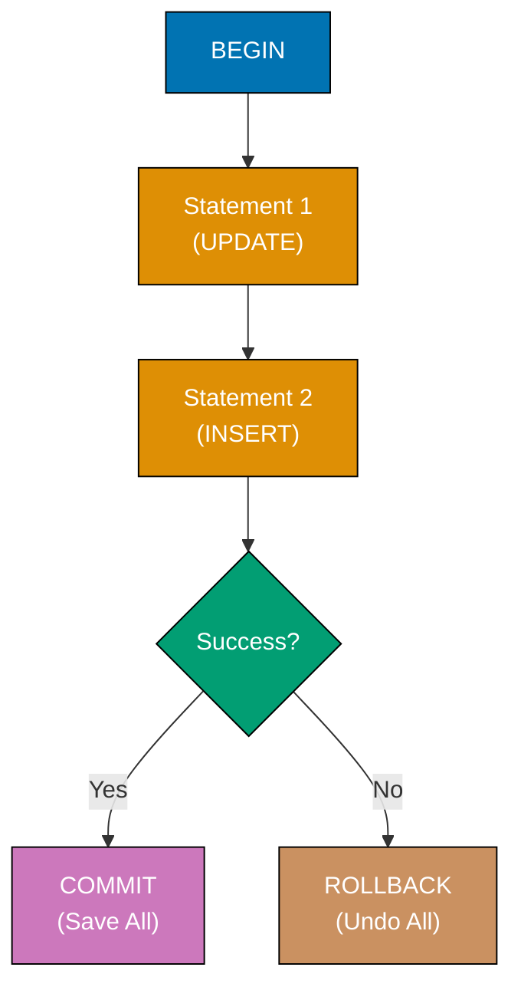

**Code**:

```sql
CREATE DATABASE example_46;
\c example_46;
-- => Statement execution completes
CREATE TABLE accounts (
    id SERIAL PRIMARY KEY,
    name VARCHAR(100),
    balance DECIMAL(10, 2)
);
-- => Statement execution completes
INSERT INTO accounts (name, balance)
VALUES ('Alice', 1000.00), ('Bob', 500.00);
-- => Statement execution completes

-- Successful transaction
BEGIN;
-- => Statement execution completes
UPDATE accounts SET balance = balance - 100 WHERE name = 'Alice';
-- => Applies filter to rows
-- => Alice: 900.00
UPDATE accounts SET balance = balance + 100 WHERE name = 'Bob';
-- => Applies filter to rows
-- => Bob: 600.00
COMMIT;
-- => Statement execution completes
-- => Changes saved permanently
SELECT name, balance FROM accounts;
-- => Specifies source table for query
-- => Alice: 900.00, Bob: 600.00

-- Failed transaction with ROLLBACK
BEGIN;
-- => Statement execution completes
UPDATE accounts SET balance = balance - 200 WHERE name = 'Alice';
-- => Applies filter to rows
-- => Alice: 700.00 (in transaction)

-- Simulate error condition
UPDATE accounts SET balance = balance + 200 WHERE name = 'NonExistent';
-- => Applies filter to rows
-- => ERROR: 0 rows updated
ROLLBACK;
-- => Statement execution completes
-- => Undoes ALL changes in transaction
SELECT name, balance FROM accounts;
-- => Specifies source table for query
-- => Alice: 900.00, Bob: 600.00 (unchanged - transaction rolled back)

-- Automatic rollback on error
BEGIN;
-- => Statement execution completes
UPDATE accounts SET balance = balance - 100 WHERE name = 'Alice';
-- => Applies filter to rows

-- This will cause error (negative balance)
UPDATE accounts SET balance = -9999 WHERE name = 'Bob';
-- => Applies filter to rows
-- => Violates business logic (if CHECK constraint exists)

-- If error occurs, ROLLBACK manually or connection closes
ROLLBACK;
-- => Statement execution completes

-- Transaction with multiple operations
BEGIN;
-- => Statement execution completes
INSERT INTO accounts (name, balance) VALUES ('Charlie', 300.00);
UPDATE accounts SET balance = balance - 50 WHERE name = 'Alice';
-- => Applies filter to rows
UPDATE accounts SET balance = balance + 50 WHERE name = 'Charlie';
-- => Applies filter to rows
COMMIT;
-- => Statement execution completes
-- => All three operations saved atomically
SELECT name, balance FROM accounts;
-- => Specifies source table for query
-- => Alice: 850.00, Bob: 600.00, Charlie: 350.00
```

**Key Takeaway**: Wrap related operations in BEGIN/COMMIT for atomicity - either all succeed or all fail. Use ROLLBACK to undo changes when errors occur. Transactions prevent partial updates that leave data inconsistent.

**Why It Matters**: Transactions ensure atomic money transfers where debit and credit operations either both succeed or both fail, preventing the financial disasters that occur when systems crash mid-operation leaving accounts in inconsistent states. PostgreSQL's MVCC implementation allows concurrent transactions to proceed without locking, enabling thousands of transactions per second on systems like payment processors where traditional locking would create bottlenecks.

---

## Example 47: Transaction Isolation Levels

Isolation levels control what transactions see of concurrent changes. READ COMMITTED (default) sees committed data, REPEATABLE READ sees snapshot at transaction start, SERIALIZABLE prevents all anomalies.

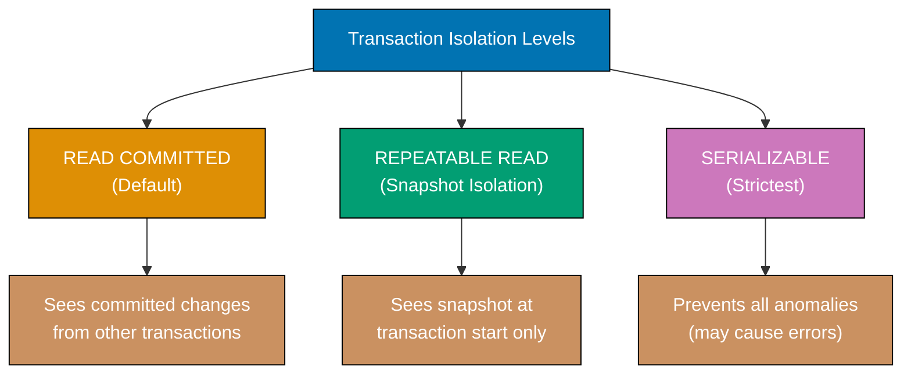

**Code**:

```sql
CREATE DATABASE example_47;
\c example_47;
-- => Statement execution completes
CREATE TABLE inventory (
    id SERIAL PRIMARY KEY,
    product VARCHAR(100),
    quantity INTEGER
);
-- => Statement execution completes
INSERT INTO inventory (product, quantity)
VALUES ('Laptop', 10);
-- => Statement execution completes

-- Demonstration requires two concurrent sessions
-- Session 1 and Session 2 shown sequentially
-- READ COMMITTED (default isolation level)
-- Session 1:
BEGIN;
-- => Statement execution completes
SELECT quantity FROM inventory WHERE product = 'Laptop';
-- => Specifies source table for query
-- => 10

-- Session 2 (concurrent):
BEGIN;
-- => Statement execution completes
UPDATE inventory SET quantity = 8 WHERE product = 'Laptop';
-- => Applies filter to rows
COMMIT;
-- => Statement execution completes
-- => Changes committed

-- Session 1 (continued):
SELECT quantity FROM inventory WHERE product = 'Laptop';
-- => Specifies source table for query
-- => 8 (sees committed changes from Session 2)
COMMIT;
-- => Statement execution completes

-- REPEATABLE READ (snapshot isolation)
-- Session 1:
BEGIN TRANSACTION ISOLATION LEVEL REPEATABLE READ;
-- => Statement execution completes
SELECT quantity FROM inventory WHERE product = 'Laptop';
-- => Specifies source table for query
-- => 8

-- Session 2:
BEGIN;
-- => Statement execution completes
UPDATE inventory SET quantity = 6 WHERE product = 'Laptop';
-- => Applies filter to rows
COMMIT;
-- => Statement execution completes

-- Session 1 (continued):
SELECT quantity FROM inventory WHERE product = 'Laptop';
-- => Specifies source table for query
-- => 8 (still sees old value - snapshot at transaction start)
COMMIT;
-- => Statement execution completes

-- Now see updated value
SELECT quantity FROM inventory WHERE product = 'Laptop';
-- => Specifies source table for query
-- => 6

-- SERIALIZABLE (strictest isolation)
-- Session 1:
BEGIN TRANSACTION ISOLATION LEVEL SERIALIZABLE;
-- => Statement execution completes
SELECT quantity FROM inventory WHERE product = 'Laptop';
-- => Specifies source table for query
-- => 6

-- Session 2:
BEGIN TRANSACTION ISOLATION LEVEL SERIALIZABLE;
-- => Statement execution completes
UPDATE inventory SET quantity = quantity - 2 WHERE product = 'Laptop';
-- => Applies filter to rows
COMMIT;
-- => Statement execution completes

-- Session 1 (continued):
UPDATE inventory SET quantity = quantity - 1 WHERE product = 'Laptop';
-- => Applies filter to rows
-- => ERROR: could not serialize access (serialization failure)
ROLLBACK;
-- => Statement execution completes

-- Default isolation level check
SHOW default_transaction_isolation;
-- => Statement execution completes
-- => read committed

-- Set session default
SET SESSION CHARACTERISTICS AS TRANSACTION ISOLATION LEVEL REPEATABLE READ;
-- => Creates alias for column/table
```

**Key Takeaway**: READ COMMITTED sees latest committed data (may change within transaction), REPEATABLE READ sees snapshot at transaction start (no phantom reads), SERIALIZABLE prevents all anomalies (may cause serialization errors). Choose based on consistency needs vs. concurrency requirements.

**Why It Matters**: Isolation levels determine whether analytical reports see consistent snapshots or inconsistent mid-transaction states, with REPEATABLE READ preventing the "phantom read" anomalies that cause financial reports to show mismatched totals when run twice. READ COMMITTED (default) maximizes concurrency for web applications where seeing slightly stale data is acceptable, while SERIALIZABLE prevents all anomalies at the cost of transaction retry overhead (5-20% performance penalty).

---

## Example 48: ACID Properties in Practice

ACID ensures reliable transactions - Atomicity (all-or-nothing), Consistency (valid states), Isolation (concurrent safety), Durability (permanent after commit).

**Code**:

```sql
CREATE DATABASE example_48;
-- => Creates database 'example_48'
\c example_48;
-- => Statement execution completes
-- => Switches connection to example_48 database
CREATE TABLE accounts (
    name VARCHAR(100),
    balance DECIMAL(10, 2) CHECK (balance >= 0)  -- => Consistency: no negative balance
);
-- => Statement execution completes
INSERT INTO accounts (name, balance)
-- => INSERT into accounts table begins
VALUES ('Alice', 1000.00), ('Bob', 500.00);
-- => Statement execution completes
-- => Row data values follow

-- Atomicity: all-or-nothing
BEGIN;
-- => Statement execution completes

-- Transfer $200 from Alice to Bob
UPDATE accounts SET balance = balance - 200 WHERE name = 'Alice';
-- => Applies filter to rows
-- => Updates rows matching condition
UPDATE accounts SET balance = balance + 200 WHERE name = 'Bob';
-- => Applies filter to rows
-- => Updates rows matching condition

-- If either fails, both rollback (atomicity)
COMMIT;
-- => Statement execution completes
-- => Both updates succeed or both fail
SELECT SUM(balance) FROM accounts;
-- => Specifies source table for query
-- => Query executes and returns result set
-- => 1500.00 (total unchanged - money not created or lost)

-- Consistency: constraints enforced
BEGIN;
-- => Statement execution completes
UPDATE accounts SET balance = balance - 1500 WHERE name = 'Alice';
-- => Applies filter to rows
-- => Updates rows matching condition
-- => Would violate CHECK (balance >= 0)
COMMIT;
-- => Statement execution completes
-- => ERROR: new row violates check constraint
-- => Transaction rolled back, balance unchanged
SELECT balance FROM accounts WHERE name = 'Alice';
-- => Specifies source table for query
-- => Query executes and returns result set
-- => 800.00 (unchanged due to constraint violation)

-- Isolation: concurrent transactions don't interfere
-- PostgreSQL supports READ UNCOMMITTED, READ COMMITTED, REPEATABLE READ, SERIALIZABLE isolation levels
-- Durability: committed data survives crashes
BEGIN;
-- => Statement execution completes
UPDATE accounts SET balance = balance + 100 WHERE name = 'Bob';
-- => Applies filter to rows
-- => Updates rows matching condition
COMMIT;
-- => Statement execution completes
-- => Changes written to disk (write-ahead log)
-- => Survives database restart

-- Verify durability (simulate restart by reconnecting)
SELECT name, balance FROM accounts;
-- => Specifies source table for query
-- => Query executes and returns result set
-- => Bob: 800.00 (changes persisted)
```

**Key Takeaway**: ACID properties ensure reliable data - Atomicity prevents partial updates, Consistency enforces constraints, Isolation protects concurrent transactions, Durability guarantees persistence. PostgreSQL's transaction system implements all four automatically.

**Why It Matters**: ACID guarantees make PostgreSQL suitable for financial systems where partial transactions or data loss would cause regulatory violations and legal liability, compared to NoSQL databases that trade ACID compliance for performance. Durability ensures that committed transactions survive crashes and power failures through write-ahead logging, eliminating the data loss windows that plague systems relying on eventual consistency models.

---

## Example 49: Savepoints

Savepoints create checkpoints within transactions - you can rollback to specific savepoints without aborting the entire transaction.

**Code**:

```sql
CREATE DATABASE example_49;
-- => Creates database 'example_49'
\c example_49;
-- => Statement execution completes
-- => Switches connection to example_49 database
CREATE TABLE logs (
    message TEXT,
    created_at TIMESTAMP DEFAULT NOW()
);
-- => Statement execution completes
BEGIN;
-- => Statement execution completes
INSERT INTO logs (message) VALUES ('Transaction started');
-- => INSERT into logs table begins

-- Create savepoint after first insert
SAVEPOINT after_first_insert;
-- => Statement execution completes
INSERT INTO logs (message) VALUES ('Second operation');
-- => INSERT into logs table begins
INSERT INTO logs (message) VALUES ('Third operation');
-- => INSERT into logs table begins

-- Create another savepoint
SAVEPOINT after_third_insert;
-- => Statement execution completes
INSERT INTO logs (message) VALUES ('Fourth operation');
-- => INSERT into logs table begins

-- Rollback to second savepoint (undo fourth insert)
ROLLBACK TO SAVEPOINT after_third_insert;
-- => Statement execution completes
SELECT COUNT(*) FROM logs;
-- => Specifies source table for query
-- => Query executes and returns result set
-- => 3 (fourth insert rolled back)
INSERT INTO logs (message) VALUES ('Alternative fourth operation');
-- => INSERT into logs table begins
COMMIT;
-- => Statement execution completes
-- => Saves first, second, third, and alternative fourth
SELECT message FROM logs ORDER BY id;
-- => Specifies source table for query
-- => Query executes and returns result set
-- => Shows 4 messages (fourth is alternative version)

-- Savepoint with error recovery
TRUNCATE logs;
-- => Statement execution completes
BEGIN;
-- => Statement execution completes
INSERT INTO logs (message) VALUES ('Operation 1');
-- => INSERT into logs table begins
SAVEPOINT after_op1;
-- => Statement execution completes
INSERT INTO logs (message) VALUES ('Operation 2');
-- => INSERT into logs table begins
SAVEPOINT after_op2;
-- => Statement execution completes

-- Simulate error
INSERT INTO logs (id, message) VALUES (1, 'Duplicate ID');
-- => INSERT into logs table begins
-- => ERROR: duplicate key (if id=1 already exists)

-- Rollback just the failed operation
ROLLBACK TO SAVEPOINT after_op2;
-- => Statement execution completes
INSERT INTO logs (message) VALUES ('Operation 3 (recovery)');
-- => INSERT into logs table begins
COMMIT;
-- => Statement execution completes
SELECT message FROM logs ORDER BY id;
-- => Specifies source table for query
-- => Query executes and returns result set
-- => Operation 1, Operation 2, Operation 3 (error recovered)

-- Release savepoint (no longer needed)
BEGIN;
-- => Statement execution completes
INSERT INTO logs (message) VALUES ('Step 1');
-- => INSERT into logs table begins
SAVEPOINT step1;
-- => Statement execution completes
INSERT INTO logs (message) VALUES ('Step 2');
-- => INSERT into logs table begins
RELEASE SAVEPOINT step1;  -- => Cannot rollback to step1 anymore
COMMIT;
-- => Statement execution completes
```

**Key Takeaway**: Savepoints enable partial rollback within transactions - create checkpoints with SAVEPOINT, rollback to them with ROLLBACK TO SAVEPOINT. Useful for error recovery without aborting entire transaction.

**Why It Matters**: Savepoints enable complex multi-step transactions to recover from individual step failures without abandoning all work, making batch processing systems resilient where processing 10,000 records with occasional errors can rollback just the failed record instead of restarting from zero. The ability to create nested transaction checkpoints enables framework-level error handling (ORM savepoints around each operation) that provides granular rollback without application-layer complexity.

---

## Example 50: Deadlock Detection and Handling

Deadlocks occur when transactions wait for each other's locks. PostgreSQL detects deadlocks automatically and aborts one transaction (victim) to resolve.

**Code**:

```sql
CREATE DATABASE example_50;
-- => Creates database for deadlock demonstration
\c example_50;
-- => Switches to example_50 database
CREATE TABLE accounts (
    id SERIAL PRIMARY KEY,
    -- => id: account identifier (used for consistent lock ordering)
    name VARCHAR(100),
    -- => name: account holder name
    balance DECIMAL(10, 2)
    -- => balance: account balance (decimal for exact money precision)
);
-- => Creates accounts table for concurrent transaction testing
INSERT INTO accounts (name, balance)
-- => Inserts 2 test accounts
VALUES ('Alice', 1000.00), ('Bob', 500.00);
-- => Alice: id=1, $1000.00; Bob: id=2, $500.00

-- Deadlock scenario: two concurrent sessions locking in opposite order
-- NOTE: This requires TWO database connections running simultaneously
-- Timeline shown sequentially below

-- Session 1 (Connection A):
BEGIN;
-- => Starts transaction in Session 1
UPDATE accounts SET balance = balance - 100 WHERE name = 'Alice';
-- => Updates Alice's balance: 1000.00 → 900.00
-- => Acquires EXCLUSIVE lock on Alice's row (id=1)
-- => Session 1 holds lock, continues...

-- Session 2 (Connection B - runs concurrently):
BEGIN;
-- => Starts transaction in Session 2 (while Session 1 still active)
UPDATE accounts SET balance = balance - 50 WHERE name = 'Bob';
-- => Updates Bob's balance: 500.00 → 450.00
-- => Acquires EXCLUSIVE lock on Bob's row (id=2)
-- => Session 2 holds lock, continues...

-- Session 1 (Connection A - attempts second update):
UPDATE accounts SET balance = balance + 100 WHERE name = 'Bob';
-- => Tries to update Bob's row
-- => BLOCKS: Session 2 holds lock on Bob's row
-- => Session 1 waits for Session 2 to release lock...

-- Session 2 (Connection B - attempts second update):
UPDATE accounts SET balance = balance + 50 WHERE name = 'Alice';
-- => Tries to update Alice's row
-- => DEADLOCK DETECTED: Session 2 needs Alice (locked by Session 1)
-- =>                    Session 1 needs Bob (locked by Session 2)
-- => PostgreSQL detects circular wait, aborts Session 2 as victim
-- => ERROR: deadlock detected

-- Session 2 must ROLLBACK (transaction aborted)
ROLLBACK;
-- => Rolls back Session 2 changes (Bob's balance reverts to 500.00)

-- Session 1 can now proceed (Session 2 released Bob's lock)
COMMIT;
-- => Commits Session 1 changes (Alice: 900.00, Bob: 550.00)

-- Avoiding deadlocks: ALWAYS acquire locks in same order (by ID)
-- Rule: Always lock accounts in ascending ID order (1, 2, 3...)

-- Session 1 (Connection A):
BEGIN;
UPDATE accounts SET balance = balance - 100 WHERE id = 1;
-- => Locks Alice (id=1) FIRST
UPDATE accounts SET balance = balance + 100 WHERE id = 2;
-- => Locks Bob (id=2) SECOND
-- => Lock order: 1 → 2
COMMIT;

-- Session 2 (Connection B - concurrent):
BEGIN;
UPDATE accounts SET balance = balance - 50 WHERE id = 1;
-- => Tries to lock Alice (id=1) FIRST
-- => BLOCKS if Session 1 holds lock, but NO DEADLOCK
-- => Both sessions lock id=1 first, then id=2 (same order)
-- => Session 2 waits until Session 1 commits, then proceeds
UPDATE accounts SET balance = balance + 50 WHERE id = 2;
-- => Locks Bob (id=2) SECOND (after Alice lock acquired)
-- => Lock order: 1 → 2 (same as Session 1)
COMMIT;
-- => NO DEADLOCK: consistent lock ordering prevents circular wait

-- View locks
SELECT
    pid,
    relation::regclass AS table_name,
    -- => Creates alias for column/table
    mode,
    granted
FROM pg_locks
-- => Specifies source table for query
WHERE relation = 'accounts'::regclass;
-- => Applies filter to rows
-- => Shows active locks on accounts table

-- Timeout to prevent long waits
SET lock_timeout = '5s';  -- => Abort if lock not acquired in 5 seconds
BEGIN;
-- => Statement execution completes
UPDATE accounts SET balance = balance - 100 WHERE name = 'Alice';
-- => Applies filter to rows
-- => If lock held by another session for >5s, ERROR: lock timeout
ROLLBACK;
-- => Statement execution completes
```

**Key Takeaway**: PostgreSQL detects deadlocks and aborts one transaction (victim). Prevent deadlocks by acquiring locks in consistent order (e.g., by ID). Use lock_timeout to prevent indefinite waiting. Retry aborted transactions in application code.

**Why It Matters**: Deadlock detection automatically recovers from circular lock dependencies that would otherwise freeze database systems indefinitely, aborting one transaction to allow others to proceed rather than requiring manual intervention. Consistent lock ordering (always lock records by ascending ID) prevents deadlocks in concurrent financial systems where simultaneous transfers between the same accounts in opposite directions would otherwise create circular wait conditions.

---

## Example 51: Creating Views

Views are saved queries that act like tables - use them to simplify complex queries, restrict column access, or provide consistent interfaces.

**Code**:

```sql
CREATE DATABASE example_51;
-- => Creates database for view examples
\c example_51;
-- => Switches to example_51 database
CREATE TABLE employees (
    id SERIAL PRIMARY KEY,
    -- => id: employee identifier (auto-incrementing)
    name VARCHAR(100),
    -- => name: employee name
    department VARCHAR(50),
    -- => department: Engineering or Sales
    salary DECIMAL(10, 2),
    -- => salary: annual salary (exact precision)
    hire_date DATE
    -- => hire_date: date employee was hired
);
-- => Creates employees table for view demonstration
INSERT INTO employees (name, department, salary, hire_date)
-- => Inserts 4 employees (2 Engineering, 2 Sales)
VALUES
    ('Alice', 'Engineering', 95000, '2020-03-15'),
    -- => Employee 1: Engineering, $95k, hired 2020
    ('Bob', 'Sales', 75000, '2019-06-01'),
    -- => Employee 2: Sales, $75k (lowest salary)
    ('Charlie', 'Engineering', 105000, '2021-01-10'),
    -- => Employee 3: Engineering, $105k (highest salary)
    ('Diana', 'Sales', 80000, '2018-11-20');
    -- => Employee 4: Sales, $80k, earliest hire date

-- Create simple view (filtered subset of employees)
CREATE VIEW engineering_employees AS
-- => Creates view named engineering_employees
SELECT id, name, salary, hire_date
-- => Selects specific columns (excludes department)
FROM employees
WHERE department = 'Engineering';
-- => Filters to Engineering department only
-- => View definition stored, not data (query runs on SELECT)

-- Query view like a table
SELECT * FROM engineering_employees;
-- => Queries view (PostgreSQL executes underlying SELECT)
-- => Returns 2 rows: Alice (id=1, $95k), Charlie (id=3, $105k)
-- => View acts like table but data comes from employees table

-- Create view with aggregations
CREATE VIEW employee_stats AS
-- => Creates view with GROUP BY aggregations
SELECT
    department,
    COUNT(*) AS num_employees,
    -- => Counts employees per department
    AVG(salary) AS avg_salary,
    -- => Calculates average salary per department
    MIN(hire_date) AS first_hire,
    -- => Finds earliest hire date per department
    MAX(hire_date) AS last_hire
    -- => Finds latest hire date per department
FROM employees
GROUP BY department;
-- => Groups by department for aggregation
-- => Engineering: 2 employees, avg $100k
-- => Sales: 2 employees, avg $77.5k

SELECT * FROM employee_stats;
-- => Queries aggregated view
-- => Returns 2 rows (one per department with stats)
-- => Engineering: 2 employees, $100,000 avg, first_hire 2020-03-15
-- => Sales: 2 employees, $77,500 avg, first_hire 2018-11-20

-- Create view with joins
CREATE TABLE projects (
    name VARCHAR(100),
    employee_id INTEGER
);
-- => Statement execution completes
INSERT INTO projects (name, employee_id)
-- => INSERT into projects table begins
VALUES
-- => Row data values follow
    ('Project A', 1),
    -- => Row data inserted
    ('Project B', 1),
    -- => Row data inserted
    ('Project C', 3);
    -- => Statement execution completes
CREATE VIEW employee_projects AS
SELECT
    e.name AS employee_name,
    -- => Creates alias for column/table
    e.department,
    p.name AS project_name
    -- => Creates alias for column/table
FROM employees e
-- => Specifies source table for query
INNER JOIN projects p ON e.id = p.employee_id;
-- => Combines rows from multiple tables
SELECT * FROM employee_projects;
-- => Specifies source table for query
-- => Query executes and returns result set
-- => Alice (Engineering, Project A), Alice (Engineering, Project B), Charlie (Engineering, Project C)

-- Modify view (CREATE OR REPLACE)
CREATE OR REPLACE VIEW engineering_employees AS
SELECT id, name, salary, hire_date, EXTRACT(YEAR FROM AGE(hire_date)) AS years_employed
-- => Specifies source table for query
-- => Query executes and returns result set
FROM employees
-- => Specifies source table for query
WHERE department = 'Engineering';
-- => Applies filter to rows
-- => Filter condition for query
SELECT * FROM engineering_employees;
-- => Specifies source table for query
-- => Query executes and returns result set
-- => Now includes years_employed column

-- Drop view
DROP VIEW employee_projects;
-- => Removes view definition
```

**Key Takeaway**: Views are saved queries that act like tables - use them to simplify complex queries, hide columns for security, or provide stable interfaces. CREATE OR REPLACE updates views without dropping. Views don't store data (computed on each query).

**Why It Matters**: Views encapsulate complex join logic behind simple table-like interfaces, enabling application refactoring without query changes across dozens of codebases that query the database. Security-focused views hide sensitive columns (salary, SSN) from developers who need access to other user data, implementing column-level security without application-layer filtering.

---

## Example 52: Materialized Views

Materialized views store query results physically - faster than regular views but require manual refresh. Use for expensive queries on slowly-changing data.

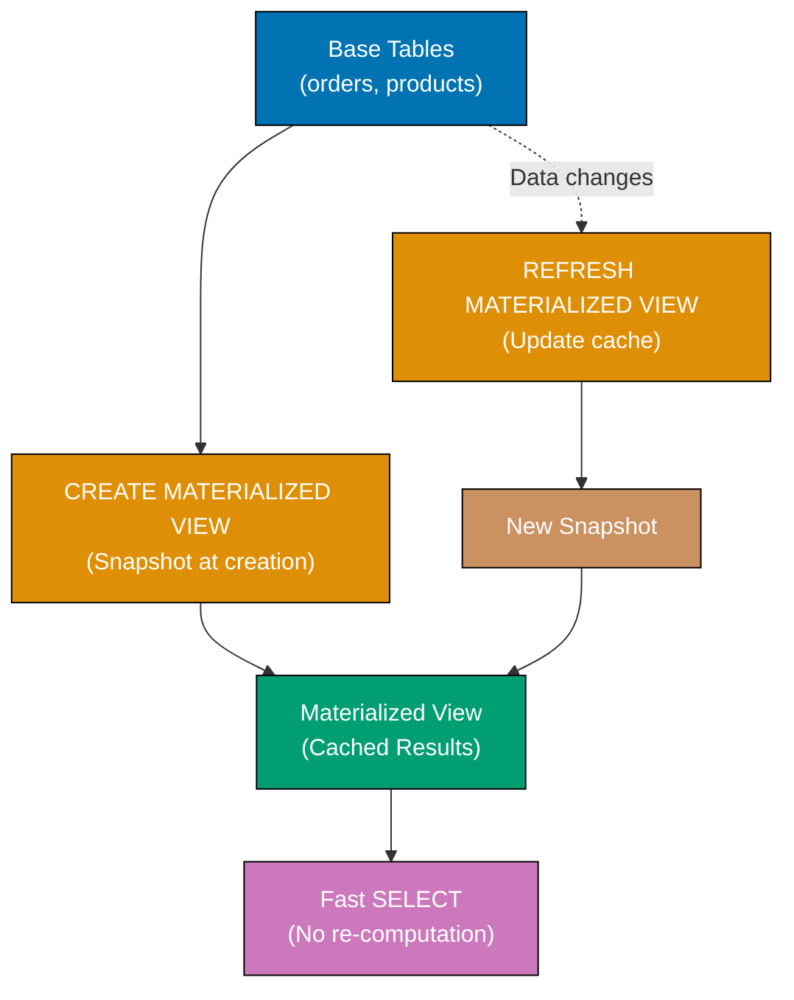

**Code**:

```sql
CREATE DATABASE example_52;
\c example_52;
-- => Statement execution completes
CREATE TABLE sales (
    id SERIAL PRIMARY KEY,
    product VARCHAR(100),
    amount DECIMAL(10, 2),
    sale_date DATE
);
-- => Statement execution completes

-- Insert test data
INSERT INTO sales (product, amount, sale_date)
-- => Inserts 10000 sales rows with randomized data
SELECT
    CASE (random() * 3)::INTEGER
        -- => Generates random 0, 1, or 2
        WHEN 0 THEN 'Laptop'
        WHEN 1 THEN 'Mouse'
        ELSE 'Keyboard'
        -- => ELSE handles 2
    END,
    -- => Distributes sales across three products
    (random() * 1000)::DECIMAL(10, 2),
    -- => Generates random amount between 0 and 1000
    -- => ::DECIMAL(10,2) casts to money format (two decimal places)
    NOW() - (random() * 365 || ' days')::INTERVAL
    -- => Generates random date within past 365 days
    -- => || concatenates random number with ' days' string
    -- => ::INTERVAL converts to time duration, subtracted from NOW()
FROM generate_series(1, 10000);
-- => Generates 10000 rows for insertion

-- Create materialized view
CREATE MATERIALIZED VIEW monthly_sales AS
-- => Creates view that STORES query results physically (unlike regular views)
-- => View named 'monthly_sales' persists aggregated data on disk
SELECT
    DATE_TRUNC('month', sale_date) AS month,
    -- => DATE_TRUNC('month', ...) rounds date down to first day of month
    -- => 2025-12-24 becomes 2025-12-01 (groups entire month)
    -- => Creates month column for grouping
    product,
    -- => Product name column for grouping
    COUNT(*) AS num_sales,
    -- => Counts number of sales rows per month+product combination
    -- => Aggregates across all sales in each group
    SUM(amount) AS total_revenue
    -- => Sums all sale amounts per month+product combination
    -- => Computes total revenue for each group
FROM sales
-- => Specifies source table for aggregation
GROUP BY DATE_TRUNC('month', sale_date), product
-- => Groups by month AND product (creates combinations)
-- => Each unique (month, product) pair gets one output row
ORDER BY month DESC, product;
-- => Sorts by month descending (newest first), then alphabetically by product
-- => Results computed ONCE at creation, stored on disk
-- => Unlike regular view, doesn't re-compute on every SELECT

-- Query materialized view (fast - reads stored data)
SELECT * FROM monthly_sales LIMIT 10;
-- => Reads from stored materialized view data (no aggregation)
-- => Fast: O(10) scan, no GROUP BY computation needed
-- => Returns 10 pre-computed rows instantly (~1-5ms)
-- => Unlike regular view which would re-aggregate 10000 rows (~50-100ms)

-- Insert more sales
INSERT INTO sales (product, amount, sale_date)
-- => Adds new sale to base sales table
VALUES ('Laptop', 1200.00, CURRENT_DATE);
-- => Inserts: Laptop sale for $1200 today
-- => CURRENT_DATE is current date (e.g., 2025-12-31)

-- Materialized view still shows old data
SELECT * FROM monthly_sales WHERE month = DATE_TRUNC('month', CURRENT_DATE);
-- => Queries materialized view for current month
-- => Filters to current month's row
-- => Returns OLD data (created at view creation time)
-- => New Laptop sale NOT reflected (view snapshot is stale)
-- => Materialized views don't auto-update (manual refresh required)

-- Refresh materialized view
REFRESH MATERIALIZED VIEW monthly_sales;
-- => Recomputes entire view from scratch using base query
-- => Deletes old stored data, runs SELECT query again, stores new results
-- => BLOCKS reads during refresh (table locked for update)
-- => Updates stored results to include new Laptop sale
-- => Execution time same as initial creation (~50-100ms for 10000 rows)
SELECT * FROM monthly_sales WHERE month = DATE_TRUNC('month', CURRENT_DATE);
-- => Queries refreshed materialized view
-- => Filters to current month
-- => NOW includes new Laptop sale (data updated)
-- => Shows current month with new $1200 Laptop included in total_revenue

-- Concurrent refresh (doesn't block reads)
REFRESH MATERIALIZED VIEW CONCURRENTLY monthly_sales;
-- => Refreshes view WITHOUT blocking concurrent SELECT queries
-- => CONCURRENTLY keyword allows reads during refresh
-- => Builds new data snapshot in background, swaps atomically when done
-- => REQUIRES unique index on materialized view (for atomic swap)
-- => Slower than regular refresh but allows continuous query access

-- Create index on materialized view
CREATE UNIQUE INDEX idx_monthly_sales_month_product
ON monthly_sales(month, product);
-- => Statement execution completes
REFRESH MATERIALIZED VIEW CONCURRENTLY monthly_sales;
-- => Statement execution completes
-- => Readers can query while refreshing

-- Drop materialized view
DROP MATERIALIZED VIEW monthly_sales;
```

**Key Takeaway**: Materialized views store query results physically - much faster than regular views for expensive queries, but require REFRESH to update. Use for aggregations, reports, or dashboards on slowly-changing data. CONCURRENTLY allows reads during refresh.

**Why It Matters**: Materialized views turn 30-second dashboard queries into 50-millisecond lookups by pre-computing aggregations across billions of rows, making real-time analytics dashboards responsive without expensive caching infrastructure. REFRESH MATVIEW CONCURRENTLY enables zero-downtime updates where users continue querying stale data while refresh builds new version in parallel, eliminating the query blackout windows required for non-concurrent refreshes.

---

## Example 53: Creating Functions (PL/pgSQL)

Functions encapsulate reusable logic - use PL/pgSQL (PostgreSQL's procedural language) for complex calculations, data transformations, or business rules.

**Code**:

```sql
CREATE DATABASE example_53;
-- => Creates database 'example_53'
\c example_53;
-- => Statement execution completes
-- => Switches connection to example_53 database

-- Simple function with no parameters
CREATE FUNCTION get_current_time()
-- => Defines function named 'get_current_time' with no input parameters
-- => Function signature: get_current_time() (empty parentheses)
RETURNS TEXT AS $$
-- => Function returns TEXT type (string result)
-- => $$ delimiters mark start of function body (dollar quoting)
BEGIN
-- => Marks start of PL/pgSQL code block
    RETURN 'Current time: ' || NOW()::TEXT;
    -- => RETURN statement specifies function output value
    -- => NOW() gets current timestamp (TIMESTAMP WITH TIME ZONE)
    -- => ::TEXT casts timestamp to text string
    -- => || concatenates 'Current time: ' prefix with timestamp string
END;
-- => Marks end of PL/pgSQL code block
$$ LANGUAGE plpgsql;
-- => $$ closes function body, LANGUAGE specifies PL/pgSQL (procedural SQL)
-- => Function is now created and available for use
SELECT get_current_time();
-- => Calls function (no arguments), returns concatenated time string
-- => Example output: 'Current time: 2025-12-29 14:35:22.123456+00'

-- Function with parameters
CREATE FUNCTION calculate_tax(amount DECIMAL, tax_rate DECIMAL)
-- => Defines function with two input parameters (both DECIMAL type)
-- => First parameter: amount (base price)
-- => Second parameter: tax_rate (tax percentage as decimal, e.g., 0.08 for 8%)
RETURNS DECIMAL AS $$
-- => Returns DECIMAL type (numeric result with precision)
BEGIN
-- => Starts function body
    RETURN amount * tax_rate;
    -- => Multiplies amount by tax_rate
    -- => Example: 100.00 * 0.08 = 8.00
    -- => Returns calculated tax amount
END;
-- => Ends function body
$$ LANGUAGE plpgsql;
-- => Specifies PL/pgSQL language
SELECT calculate_tax(100.00, 0.08);
-- => Calls function with amount=100.00, tax_rate=0.08 (8% tax)
-- => Returns 8.00 (tax amount)

-- Function with conditional logic
CREATE FUNCTION categorize_price(price DECIMAL)
-- => Defines function with single parameter 'price' (DECIMAL type)
RETURNS TEXT AS $$
-- => Returns TEXT category label
BEGIN
-- => Starts function body with conditional logic
    IF price < 100 THEN
        -- => First condition: checks if price is less than $100
        RETURN 'Budget';
        -- => Returns 'Budget' category for prices under $100
        -- => Function exits immediately (no further checks)
    ELSIF price < 500 THEN
        -- => Second condition: checks if price < $500 (only if first failed)
        -- => ELSIF combines ELSE and IF (checks range $100-$499)
        RETURN 'Mid-Range';
        -- => Returns 'Mid-Range' for prices $100-$499
    ELSE
        -- => Final fallback: executes if all conditions failed
        -- => Handles prices >= $500
        RETURN 'Premium';
        -- => Returns 'Premium' for prices $500 and above
    END IF;
    -- => Closes IF statement (required in PL/pgSQL)
END;
-- => Ends function body
$$ LANGUAGE plpgsql;
-- => Specifies PL/pgSQL language
SELECT categorize_price(50.00);
-- => Calls function with price=50.00, returns 'Budget' (< 100)
SELECT categorize_price(250.00);
-- => Calls with price=250.00, returns 'Mid-Range' (100 <= price < 500)
SELECT categorize_price(1000.00);
-- => Calls with price=1000.00, returns 'Premium' (>= 500)
-- Function with table queries
CREATE TABLE products (
    name VARCHAR(100),
    price DECIMAL(10, 2)
);
-- => Statement execution completes
INSERT INTO products (name, price)
-- => INSERT into products table begins
VALUES ('Laptop', 999.99), ('Mouse', 29.99), ('Keyboard', 79.99);
-- => Statement execution completes
-- => Row data values follow
CREATE FUNCTION get_expensive_products(min_price DECIMAL)
RETURNS TABLE(product_name TEXT, product_price DECIMAL) AS $$
BEGIN
    RETURN QUERY
    SELECT name::TEXT, price
    FROM products
    -- => Specifies source table for query
    WHERE price >= min_price
    -- => Applies filter to rows
    -- => Filter condition for query
    ORDER BY price DESC;
    -- => Sorts query results
    -- => Sorts result set
END;
-- => Statement execution completes
$$ LANGUAGE plpgsql;
-- => Statement execution completes
SELECT * FROM get_expensive_products(50.00);
-- => Specifies source table for query
-- => Query executes and returns result set
-- => Laptop (999.99), Keyboard (79.99)

-- Function with variables
CREATE FUNCTION calculate_discount(original_price DECIMAL, discount_percent INTEGER)
-- => Aggregate function computes summary value
RETURNS TABLE(original DECIMAL, discount DECIMAL, final DECIMAL) AS $$
DECLARE
    discount_amount DECIMAL;
    -- => Statement execution completes
    final_price DECIMAL;
    -- => Statement execution completes
BEGIN
    discount_amount := original_price * (discount_percent / 100.0);
    -- => Statement execution completes
    final_price := original_price - discount_amount;
    -- => Statement execution completes
    RETURN QUERY SELECT original_price, discount_amount, final_price;
END;
-- => Statement execution completes
$$ LANGUAGE plpgsql;
-- => Statement execution completes
SELECT * FROM calculate_discount(100.00, 20);
-- => Specifies source table for query
-- => Query executes and returns result set
-- => original: 100.00, discount: 20.00, final: 80.00
```

**Key Takeaway**: Functions encapsulate logic for reuse - use RETURNS for return type, `$$` for function body delimiter. PL/pgSQL supports variables, conditionals, loops, and queries. RETURNS TABLE for returning multiple rows.

**Why It Matters**: Database functions execute closer to data compared to application-layer functions, eliminating network round-trips and enabling set-based operations that process millions of rows where equivalent application code requires expensive row-by-row iteration. PL/pgSQL functions enable complex business logic (tax calculations, inventory allocation) to be versioned and deployed atomically with database schema changes, preventing the logic-data mismatches that occur when application and database deployments drift.

---

## Example 54: Function Parameters and Return Types

Functions support multiple parameter modes (IN, OUT, INOUT) and various return types (scalars, records, tables). Choose based on use case.

**Code**:

```sql
CREATE DATABASE example_54;
-- => Creates database 'example_54'
\c example_54;
-- => Statement execution completes
-- => Switches connection to example_54 database

-- Function returning single value (scalar)
CREATE FUNCTION add_numbers(a INTEGER, b INTEGER)
RETURNS INTEGER AS $$
BEGIN
    RETURN a + b;
    -- => Statement execution completes
END;
-- => Statement execution completes
$$ LANGUAGE plpgsql;
-- => Statement execution completes
SELECT add_numbers(10, 20);
-- => 30

-- Function with OUT parameters
CREATE FUNCTION divide_with_remainder(
    -- => Function with multiple return values using OUT parameters
    dividend INTEGER,
    -- => Input parameter: number to divide (numerator)
    divisor INTEGER,
    -- => Input parameter: number to divide by (denominator)
    OUT quotient INTEGER,
    -- => OUT parameter: result of integer division (no RETURNS needed)
    -- => OUT parameters automatically included in return type
    OUT remainder INTEGER
    -- => OUT parameter: remainder from division
    -- => Function returns record with (quotient, remainder) columns
) AS $$
BEGIN
-- => Starts function body
    quotient := dividend / divisor;
    -- => := is assignment operator in PL/pgSQL (not = or ==)
    -- => / performs integer division for INTEGER types
    -- => Example: 17 / 5 = 3 (truncates decimal)
    -- => Assigns result to OUT parameter quotient
    remainder := dividend % divisor;
    -- => % is modulo operator (returns remainder)
    -- => Example: 17 % 5 = 2 (17 = 5*3 + 2)
    -- => Assigns remainder to OUT parameter remainder
    -- => No explicit RETURN needed (OUT params auto-returned)
END;
-- => Ends function body
$$ LANGUAGE plpgsql;
-- => Specifies PL/pgSQL language
SELECT * FROM divide_with_remainder(17, 5);
-- => Calls function with dividend=17, divisor=5
-- => Treats function as table (FROM clause), returns record
-- => Returns: (quotient=3, remainder=2)
-- => Multiple return values accessible as columns

-- Function returning composite type
CREATE TYPE employee_summary AS (
    total_employees INTEGER,
    avg_salary DECIMAL
);
-- => Statement execution completes
CREATE TABLE employees (
    name VARCHAR(100),
    salary DECIMAL(10, 2)
);
-- => Statement execution completes
INSERT INTO employees (name, salary)
-- => INSERT into employees table begins
VALUES ('Alice', 95000), ('Bob', 75000), ('Charlie', 105000);
-- => Statement execution completes
-- => Row data values follow
CREATE FUNCTION get_employee_summary()
-- => Function with no parameters, returns custom composite type
RETURNS employee_summary AS $$
-- => Returns employee_summary composite (total_employees, avg_salary)
DECLARE
-- => DECLARE section for local variables
    result employee_summary;
    -- => Declares variable 'result' of type employee_summary
    -- => Variable will hold composite value with two fields
    -- => Initialized to NULL (default for composite types)
BEGIN
-- => Starts function body
    SELECT COUNT(*), AVG(salary)
    -- => COUNT(*) counts all employee rows
    -- => AVG(salary) computes average salary across all rows
    INTO result.total_employees, result.avg_salary
    -- => INTO clause assigns query results to variable fields
    -- => COUNT(*) result → result.total_employees (INTEGER)
    -- => AVG(salary) result → result.avg_salary (DECIMAL)
    -- => INTO populates composite type fields directly
    FROM employees;
    -- => Queries employees table for aggregation
    -- => Processes all 3 rows (Alice, Bob, Charlie)
    RETURN result;
    -- => Returns populated employee_summary composite
    -- => Contains: total_employees=3, avg_salary=91666.67
END;
-- => Ends function body
$$ LANGUAGE plpgsql;
-- => Specifies PL/pgSQL language
SELECT * FROM get_employee_summary();
-- => Calls function and expands composite result as table
-- => Returns single row with two columns: (3, 91666.67)
-- => total_employees: 3, avg_salary: 91666.67

-- Function with default parameters
CREATE FUNCTION greet(name TEXT, greeting TEXT DEFAULT 'Hello')
-- => Function with two parameters, second has default value
-- => DEFAULT 'Hello' makes greeting parameter optional
-- => If caller omits greeting, 'Hello' used automatically
RETURNS TEXT AS $$
-- => Returns TEXT (string result)
BEGIN
-- => Starts function body
    RETURN greeting || ', ' || name || '!';
    -- => Concatenates greeting, comma-space, name, exclamation
    -- => || is string concatenation operator
    -- => Example: 'Hello' || ', ' || 'Alice' || '!' = 'Hello, Alice!'
END;
-- => Ends function body
$$ LANGUAGE plpgsql;
-- => Specifies PL/pgSQL language
SELECT greet('Alice');
-- => Calls with one argument (greeting defaults to 'Hello')
-- => Returns 'Hello, Alice!'
SELECT greet('Bob', 'Hi');
-- => Calls with two arguments (overrides default greeting)
-- => Returns 'Hi, Bob!'
-- Function with variadic parameters (variable arguments)
CREATE FUNCTION sum_all(VARIADIC numbers INTEGER[])
RETURNS INTEGER AS $$
DECLARE
    total INTEGER := 0;
    -- => Statement execution completes
    num INTEGER;
    -- => Statement execution completes
BEGIN
    FOREACH num IN ARRAY numbers LOOP
        total := total + num;
        -- => Statement execution completes
    END LOOP;
    -- => Statement execution completes
    RETURN total;
    -- => Statement execution completes
END;
-- => Statement execution completes
$$ LANGUAGE plpgsql;
-- => Statement execution completes
SELECT sum_all(1, 2, 3, 4, 5);
-- => 15
SELECT sum_all(10, 20);
-- => 30
```

**Key Takeaway**: Functions support flexible parameters - OUT for returning multiple values, DEFAULT for optional parameters, VARIADIC for variable arguments. Return types include scalars, composite types, or TABLE for multiple rows.

**Why It Matters**: OUT parameters enable functions to return multiple related values (latitude, longitude, address) without creating custom composite types, simplifying function signatures and reducing boilerplate. DEFAULT parameter values enable backward-compatible function evolution where new parameters are added without breaking existing function calls across the codebase, making database API evolution safer.

---

## Example 55: Triggers

Triggers automatically execute functions before or after INSERT, UPDATE, or DELETE operations - use for auditing, validation, or derived columns.

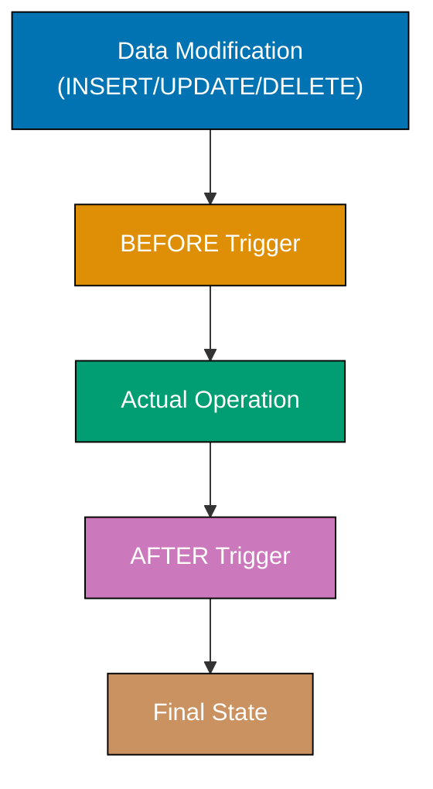

**Code**:

```sql
CREATE DATABASE example_55;
\c example_55;
-- => Statement execution completes
CREATE TABLE products (
    id SERIAL PRIMARY KEY,
    name VARCHAR(100),
    price DECIMAL(10, 2),
    updated_at TIMESTAMP
);
-- => Statement execution completes
CREATE TABLE audit_log (
    id SERIAL PRIMARY KEY,
    table_name TEXT,
    operation TEXT,
    changed_at TIMESTAMP DEFAULT NOW(),
    old_data JSONB,
    new_data JSONB
);
-- => Statement execution completes

-- Trigger function to update updated_at
CREATE FUNCTION update_timestamp()
-- => Defines trigger function (special function type)
-- => Trigger functions have no explicit parameters
RETURNS TRIGGER AS $$
-- => TRIGGER return type required for trigger functions
-- => Return value determines if operation proceeds (RETURN NEW/OLD) or aborts (RETURN NULL)
BEGIN
-- => Starts function body
    NEW.updated_at = NOW();
    -- => NEW is special variable containing new row being inserted/updated
    -- => Modifies updated_at column of NEW row to current timestamp
    -- => = assignment in trigger context (modifies NEW record)
    -- => NOW() returns current timestamp with timezone
    RETURN NEW;
    -- => Returns modified NEW record (operation proceeds with changes)
    -- => RETURN NEW required for BEFORE triggers (row gets updated)
    -- => Returning NULL would cancel the operation entirely
END;
-- => Ends function body
$$ LANGUAGE plpgsql;
-- => Specifies PL/pgSQL language

-- Create BEFORE UPDATE trigger
CREATE TRIGGER set_updated_at
-- => Creates trigger named 'set_updated_at'
BEFORE UPDATE ON products
-- => BEFORE: executes BEFORE database modifies row (can modify NEW)
-- => UPDATE: trigger fires only on UPDATE operations (not INSERT/DELETE)
-- => ON products: specifies target table
FOR EACH ROW
-- => Fires once PER ROW updated (vs FOR EACH STATEMENT)
-- => Each updated row gets separate trigger invocation
EXECUTE FUNCTION update_timestamp();
-- => Specifies trigger function to call (must return TRIGGER type)
-- => Parentheses required even with no parameters
INSERT INTO products (name, price, updated_at)
VALUES ('Laptop', 999.99, NOW());
-- => Inserts initial product with explicit updated_at
-- => Trigger does NOT fire (only on UPDATE, not INSERT)
UPDATE products SET price = 899.99 WHERE name = 'Laptop';
-- => Updates Laptop price from 999.99 to 899.99
-- => BEFORE UPDATE trigger fires: calls update_timestamp()
-- => Trigger modifies NEW.updated_at to NOW() before row updated
-- => Final row has price=899.99 AND updated_at=current timestamp
SELECT name, price, updated_at FROM products;
-- => Retrieves product data with auto-updated timestamp
-- => Shows Laptop with updated price and current updated_at

-- Audit trail trigger
CREATE FUNCTION audit_changes()
-- => Defines general-purpose audit trigger function
RETURNS TRIGGER AS $$
-- => TRIGGER return type
BEGIN
-- => Starts function body with conditional logic
    IF TG_OP = 'INSERT' THEN
        -- => TG_OP is special variable containing operation type string
        -- => Checks if operation is INSERT ('INSERT' string)
        INSERT INTO audit_log (table_name, operation, new_data)
        -- => Records audit entry for INSERT operation
        VALUES (TG_TABLE_NAME, TG_OP, row_to_json(NEW));
        -- => TG_TABLE_NAME: special variable with table name ('products')
        -- => TG_OP: operation type ('INSERT')
        -- => row_to_json(NEW): converts NEW row to JSON (inserted data)
        -- => OLD not available for INSERT (no previous row)
        RETURN NEW;
        -- => Returns NEW record (INSERT proceeds normally)
    ELSIF TG_OP = 'UPDATE' THEN
        -- => Checks if operation is UPDATE
        INSERT INTO audit_log (table_name, operation, old_data, new_data)
        -- => Records both old and new data for UPDATE
        VALUES (TG_TABLE_NAME, TG_OP, row_to_json(OLD), row_to_json(NEW));
        -- => OLD: row before update, NEW: row after update
        -- => Both converted to JSON for audit trail
        -- => Captures what changed (diff between OLD and NEW)
        RETURN NEW;
        -- => Returns NEW record (UPDATE proceeds)
    ELSIF TG_OP = 'DELETE' THEN
        -- => Checks if operation is DELETE
        INSERT INTO audit_log (table_name, operation, old_data)
        -- => Records deleted data
        VALUES (TG_TABLE_NAME, TG_OP, row_to_json(OLD));
        -- => OLD contains deleted row data
        -- => NEW not available for DELETE (no new row)
        RETURN OLD;
        -- => Returns OLD record (DELETE proceeds)
        -- => For DELETE, must return OLD not NEW
    END IF;
    -- => Closes conditional logic
END;
-- => Ends function body
$$ LANGUAGE plpgsql;
-- => Specifies PL/pgSQL language

-- Create AFTER triggers for INSERT, UPDATE, DELETE
CREATE TRIGGER audit_products_insert
AFTER INSERT ON products
FOR EACH ROW
EXECUTE FUNCTION audit_changes();
-- => Statement execution completes
CREATE TRIGGER audit_products_update
AFTER UPDATE ON products
FOR EACH ROW
EXECUTE FUNCTION audit_changes();
-- => Statement execution completes
CREATE TRIGGER audit_products_delete
AFTER DELETE ON products
FOR EACH ROW
EXECUTE FUNCTION audit_changes();
-- => Statement execution completes

-- Test audit trail
INSERT INTO products (name, price, updated_at)
VALUES ('Mouse', 29.99, NOW());
-- => Statement execution completes
UPDATE products SET price = 24.99 WHERE name = 'Mouse';
-- => Applies filter to rows
DELETE FROM products WHERE name = 'Mouse';
-- => Specifies source table for query
SELECT * FROM audit_log ORDER BY changed_at;
-- => Specifies source table for query
-- => Shows INSERT, UPDATE, DELETE operations with old/new data

-- Drop trigger
DROP TRIGGER audit_products_insert ON products;
```

**Key Takeaway**: Triggers execute functions automatically on data changes - use BEFORE for validation/modification, AFTER for auditing/notifications. Access OLD (previous row) and NEW (updated row) in trigger functions. TG_OP shows operation type (INSERT/UPDATE/DELETE).

**Why It Matters**: Triggers enforce business rules (audit logging, denormalization updates, cascade notifications) directly in the database where they cannot be bypassed by rogue applications or forgotten during manual data fixes. BEFORE triggers enable data validation and transformation (normalizing phone numbers, computing derived fields) that executes atomically with the write operation, ensuring data quality without application-layer checks that can be skipped.

---

## Example 56: Upsert with ON CONFLICT

ON CONFLICT handles insert conflicts by updating existing rows or ignoring duplicates - essential for idempotent operations and data synchronization.

**Code**:

```sql
CREATE DATABASE example_56;
-- => Creates database for ON CONFLICT (upsert) examples
\c example_56;
-- => Switches to example_56 database
CREATE TABLE users (
    email VARCHAR(100) UNIQUE,
    -- => email: user email (UNIQUE constraint for conflict detection)
    name VARCHAR(100),
    -- => name: user name (can be updated)
    login_count INTEGER DEFAULT 0,
    -- => login_count: number of logins (incremented on conflict)
    last_login TIMESTAMP
    -- => last_login: timestamp of last login
);
-- => Creates users table with UNIQUE constraint on email

-- Insert initial user
INSERT INTO users (email, name, login_count, last_login)
-- => First INSERT (no conflict)
VALUES ('alice@example.com', 'Alice', 1, NOW());
-- => Inserts Alice with login_count=1, current timestamp
-- => email='alice@example.com' now exists in table

-- Upsert: INSERT or UPDATE on conflict
INSERT INTO users (email, name, login_count, last_login)
-- => Attempts INSERT (will conflict on email UNIQUE constraint)
VALUES ('alice@example.com', 'Alice Updated', 2, NOW())
ON CONFLICT (email)
-- => Detects conflict on email UNIQUE constraint
-- => 'alice@example.com' already exists (from first INSERT)
DO UPDATE SET
-- => Instead of failing, UPDATE existing row
    login_count = users.login_count + 1,
    -- => Increments EXISTING login_count (1 + 1 = 2)
    -- => users.login_count references EXISTING row value
    last_login = EXCLUDED.last_login;
    -- => EXCLUDED references VALUES being inserted (NOW() timestamp)
    -- => Updates last_login to new timestamp
-- => Result: login_count=2, name='Alice' (unchanged), last_login=new timestamp
SELECT * FROM users WHERE email = 'alice@example.com';
-- => Returns updated row: login_count=2, name='Alice'
-- => name NOT updated (not in DO UPDATE SET clause)

-- Upsert with nothing (ignore conflicts)
INSERT INTO users (email, name)
-- => INSERT into users table begins
VALUES ('alice@example.com', 'Should be ignored')
-- => Row data values follow
ON CONFLICT (email) DO NOTHING;
-- => Statement execution completes
SELECT * FROM users WHERE email = 'alice@example.com';
-- => Specifies source table for query
-- => Query executes and returns result set
-- => No changes (conflict ignored)

-- Bulk upsert (multiple rows, mixed INSERT/UPDATE)
INSERT INTO users (email, name, login_count, last_login)
-- => Attempts INSERT for 3 users
VALUES
    ('bob@example.com', 'Bob', 1, NOW()),
    -- => New user: will INSERT
    ('charlie@example.com', 'Charlie', 1, NOW()),
    -- => New user: will INSERT
    ('alice@example.com', 'Alice', 1, NOW())
    -- => Existing user (conflict): will UPDATE
ON CONFLICT (email)
DO UPDATE SET
    login_count = users.login_count + 1,
    -- => For alice@example.com: 2 + 1 = 3
    last_login = EXCLUDED.last_login;
    -- => Updates timestamp for conflict rows
-- => Result: 2 INSERTs (Bob, Charlie), 1 UPDATE (Alice)
SELECT email, login_count FROM users ORDER BY email;
-- => Returns 3 rows sorted by email
-- => Alice: login_count=3 (updated from 2)
-- => Bob: login_count=1 (newly inserted)
-- => Charlie: login_count=1 (newly inserted)

-- Upsert with WHERE clause
INSERT INTO users (email, name, login_count, last_login)
-- => INSERT into users table begins
VALUES ('alice@example.com', 'Alice', 10, NOW())
-- => Row data values follow
ON CONFLICT (email)
DO UPDATE SET
    login_count = EXCLUDED.login_count,
    last_login = EXCLUDED.last_login
WHERE users.login_count < EXCLUDED.login_count;
-- => Applies filter to rows
-- => Filter condition for query
-- => Only updates if new login_count is higher
SELECT login_count FROM users WHERE email = 'alice@example.com';
-- => Specifies source table for query
-- => Query executes and returns result set
-- => 10 (updated because 10 > 3)
```

**Key Takeaway**: ON CONFLICT enables upserts (insert or update) - specify conflict target (email), then DO UPDATE or DO NOTHING. EXCLUDED refers to values from failed insert. Use WHERE to conditionally update.

**Why It Matters**: ON CONFLICT makes data synchronization idempotent, enabling safe retry logic where the same upsert statement can be executed multiple times with identical results, eliminating complex application-layer "check if exists then update else insert" logic prone to race conditions. The EXCLUDED keyword provides access to would-be-inserted values, enabling updates like "increment counter by attempted increment" (SET counter = counter + EXCLUDED.delta) essential for conflict-free distributed counters.

---

## Example 57: Bulk Insert with COPY

COPY imports data from files or stdin - much faster than individual INSERTs for bulk loading. Use for data migrations, imports, or large datasets.

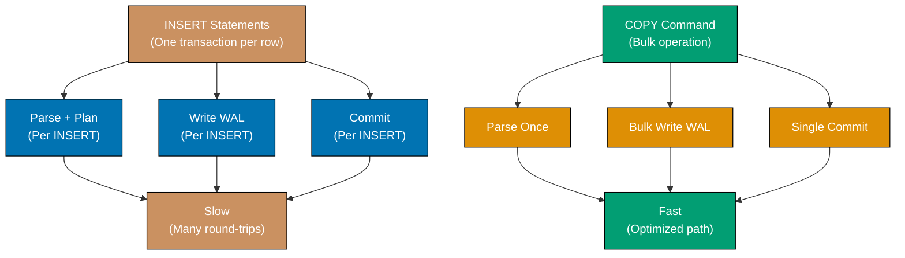

**Code**:

```sql
CREATE DATABASE example_57;
-- => Creates database for COPY command examples
\c example_57;
-- => Switches to example_57 database
CREATE TABLE products (
    id INTEGER,
    -- => id: product identifier (no SERIAL, manual IDs for COPY)
    name VARCHAR(100),
    -- => name: product name
    category VARCHAR(50),
    -- => category: product category
    price DECIMAL(10, 2)
    -- => price: product price
);
-- => Creates products table for bulk loading

-- COPY from stdin (paste CSV data directly into psql)
COPY products (id, name, category, price) FROM stdin WITH (FORMAT csv);
-- => COPY command reads CSV data from stdin (standard input)
-- => FORMAT csv: interprets input as comma-separated values
1,Laptop,Electronics,999.99
2,Mouse,Electronics,29.99
3,Desk,Furniture,299.99
\.
-- => Backslash-dot terminates stdin input
-- => COPY completes, data loaded into products table
SELECT * FROM products;
-- => Returns 3 rows: Laptop ($999.99), Mouse ($29.99), Desk ($299.99)
-- => COPY is 10-100x faster than equivalent INSERT statements

-- COPY from file (requires server filesystem access)
-- Note: This requires a CSV file on the PostgreSQL server filesystem
-- Example CSV content (products.csv):
-- 4,Keyboard,Electronics,79.99
-- 5,Chair,Furniture,199.99
-- COPY products FROM '/path/to/products.csv' WITH (FORMAT csv);
-- => Loads from file

-- COPY with header row
-- COPY products FROM '/path/to/products_with_header.csv' WITH (FORMAT csv, HEADER true);
-- => Skips first row

-- COPY to file (export)
COPY products TO stdout WITH (FORMAT csv, HEADER true);
-- => Statement execution completes
-- => Outputs CSV to stdout with headers

-- COPY with specific delimiter
COPY products TO stdout WITH (FORMAT text, DELIMITER '|');
-- => Restricts number of rows returned
-- => Pipe-delimited output

-- Generate test data using INSERT ... SELECT with generate_series
TRUNCATE products;
-- => Removes all existing rows from products table
INSERT INTO products (id, name, category, price)
-- => Bulk INSERT using SELECT (faster than individual INSERTs)
SELECT
    generate_series AS id,
    -- => Uses series value as id (1, 2, 3, ..., 10000)
    'Product ' || generate_series AS name,
    -- => Concatenates 'Product ' with number ('Product 1', 'Product 2', ...)
    CASE (generate_series % 3)
        -- => Distributes categories evenly using modulo
        WHEN 0 THEN 'Electronics'
        -- => Every 3rd product
        WHEN 1 THEN 'Furniture'
        -- => Remainder 1
        ELSE 'Kitchen'
        -- => Remainder 2
    END AS category,
    (random() * 1000)::DECIMAL(10, 2) AS price
    -- => Random price $0.00-$999.99 for each row
FROM generate_series(1, 10000);
-- => Generates 10,000 rows (numbers 1 to 10,000)
-- => INSERT completes with 10,000 test products created
-- => Much faster than 10,000 individual INSERT statements

-- Alternative: COPY for PostgreSQL client tools
-- \copy products FROM 'products.csv' WITH (FORMAT csv);
-- => \copy works in psql, reads from client filesystem
```

**Key Takeaway**: COPY is fastest for bulk imports - much faster than individual INSERTs. Use WITH (FORMAT csv, HEADER true) for CSV files with headers. COPY FROM loads data, COPY TO exports. `\copy` in psql reads from client filesystem.

**Why It Matters**: The CSV format support with automatic header detection enables direct import from Excel exports and data warehouse extracts without preprocessing, while COPY TO provides matching export functionality for data pipeline integration. However, COPY locks tables during import and triggers fire for each row, making it unsuitable for importing into heavily-used production tables without careful planning around maintenance windows.

---

## Example 58: Generate Series for Test Data

GENERATE_SERIES creates sequences of values - combine with random functions to generate test data for development and performance testing.

**Code**:

```sql
CREATE DATABASE example_58;
-- => Creates database for generate_series examples
\c example_58;
-- => Switches to example_58 database

-- Generate simple integer series
SELECT * FROM generate_series(1, 10);
-- => generate_series(start, stop) returns set of rows
-- => start=1 (inclusive), stop=10 (inclusive), default step=1
-- => Returns 10 rows: 1, 2, 3, 4, 5, 6, 7, 8, 9, 10
-- => Each value is separate row in result set

-- Generate series with custom step
SELECT * FROM generate_series(0, 100, 10);
-- => generate_series(start, stop, step) with increment
-- => start=0, stop=100, step=10 (increment by 10 each time)
-- => Returns 11 rows: 0, 10, 20, 30, 40, 50, 60, 70, 80, 90, 100
-- => Step can be negative: generate_series(10, 1, -1) produces 10,9,8,...,1

-- Generate date series (one date per day for December 2025)
SELECT * FROM generate_series(
    '2025-12-01'::DATE,
    -- => Start: December 1, 2025 (::DATE casts text to DATE type)
    '2025-12-31'::DATE,
    -- => End: December 31, 2025 (inclusive)
    '1 day'::INTERVAL
    -- => Step: 1 day increment (::INTERVAL casts text to INTERVAL)
    -- => Other intervals: '1 week', '1 month', '2 hours'
);
-- => Returns 31 rows (all dates in December 2025)
-- => 2025-12-01, 2025-12-02, ..., 2025-12-31

-- Create orders table for test data
CREATE TABLE orders (
    id INTEGER,
    customer_id INTEGER,
    amount DECIMAL(10, 2),
    order_date DATE
);
-- => Creates orders table for generated test data

-- Generate 10,000 test orders using generate_series
INSERT INTO orders (id, customer_id, amount, order_date)
-- => Bulk INSERT with generated data
SELECT
    generate_series AS id,
    -- => Uses series value as order id (1-10,000)
    (random() * 100)::INTEGER + 1 AS customer_id,
    -- => Random customer_id from 1-100 (simulates 100 customers)
    -- => random() returns 0.0-1.0, multiplied by 100 = 0-100, +1 = 1-101
    (random() * 1000)::DECIMAL(10, 2) AS amount,
    -- => Random amount $0.00-$999.99 for each order
    '2025-01-01'::DATE + (random() * 365)::INTEGER AS order_date
    -- => Random date within 2025 (Jan 1 + 0-365 days)
FROM generate_series(1, 10000);
-- => Generates 10,000 sequential numbers (1-10,000)
-- => INSERT completes with 10,000 test orders
SELECT COUNT(*) FROM orders;
-- => Returns count: 10,000 rows

-- Generate realistic email addresses
CREATE TABLE users (
    email VARCHAR(100),
    created_at TIMESTAMP
);
-- => Statement execution completes
INSERT INTO users (id, email, created_at)
-- => INSERT into users table begins
SELECT
    generate_series AS id,
    -- => Creates alias for column/table
    'user' || generate_series || '@example.com' AS email,
    -- => Creates alias for column/table
    NOW() - (random() * 365 || ' days')::INTERVAL AS created_at
    -- => Creates alias for column/table
FROM generate_series(1, 1000);
-- => Specifies source table for query
SELECT * FROM users LIMIT 5;
-- => Specifies source table for query
-- => Query executes and returns result set

-- Generate time series data
CREATE TABLE metrics (
    value DECIMAL(10, 2)
);
-- => Statement execution completes
INSERT INTO metrics (timestamp, value)
-- => INSERT into metrics table begins
SELECT
    ts,
    (50 + random() * 50)::DECIMAL(10, 2) AS value
    -- => Creates alias for column/table
FROM generate_series(
-- => Specifies source table for query
    '2025-12-29 00:00:00'::TIMESTAMP,
    '2025-12-29 23:59:00'::TIMESTAMP,
    '1 minute'::INTERVAL
) AS ts;
-- => Creates alias for column/table
SELECT COUNT(*) FROM metrics;
-- => Specifies source table for query
-- => Query executes and returns result set
-- => 1,440 rows (one per minute for 24 hours)

-- Generate hierarchical test data
CREATE TABLE categories (
    parent_id INTEGER,
    name VARCHAR(100)
);
-- => Statement execution completes
INSERT INTO categories (id, parent_id, name)
-- => INSERT into categories table begins
SELECT
    generate_series,
    CASE
        WHEN generate_series <= 10 THEN NULL  -- => Top-level categories
        ELSE ((generate_series - 1) / 10 + 1)  -- => Subcategories
    END,
    'Category ' || generate_series
FROM generate_series(1, 100);
-- => Specifies source table for query
SELECT id, parent_id, name FROM categories WHERE parent_id IS NULL;
-- => Specifies source table for query
-- => Query executes and returns result set
-- => 10 top-level categories
```

**Key Takeaway**: GENERATE_SERIES creates numeric, date, or timestamp sequences - combine with random() for realistic test data. Use for populating development databases, performance testing, or creating time series data.

**Why It Matters**: GENERATE_SERIES eliminates the need for external data generation scripts when creating test datasets, enabling single-query population of millions of realistic test records with proper distributions and relationships for load testing. The date/timestamp series generation enables creation of complete time series datasets without gaps (one row per hour for a year), essential for testing time-series queries and ensuring calendar logic handles edge cases like daylight saving transitions.

---

## Example 59: Lateral Joins

LATERAL allows subqueries to reference columns from preceding tables in FROM clause - enables correlated joins and "for each" patterns.

**Code**:

```sql
CREATE DATABASE example_59;
-- => Creates database 'example_59'
\c example_59;
-- => Statement execution completes
-- => Switches connection to example_59 database
CREATE TABLE categories (
    name VARCHAR(100)
);
-- => Statement execution completes
CREATE TABLE products (
    category_id INTEGER,
    name VARCHAR(100),
    price DECIMAL(10, 2)
);
-- => Statement execution completes
INSERT INTO categories (name)
-- => INSERT into categories table begins
VALUES ('Electronics'), ('Furniture'), ('Kitchen');
-- => Statement execution completes
-- => Row data values follow
INSERT INTO products (category_id, name, price)
-- => INSERT into products table begins
VALUES
-- => Row data values follow
    (1, 'Laptop', 999.99),
    -- => Row data inserted
    (1, 'Mouse', 29.99),
    -- => Row data inserted
    (1, 'Keyboard', 79.99),
    -- => Row data inserted
    (2, 'Desk', 299.99),
    -- => Row data inserted
    (2, 'Chair', 199.99),
    -- => Row data inserted
    (3, 'Blender', 89.99),
    -- => Row data inserted
    (3, 'Toaster', 39.99);
    -- => Statement execution completes

-- Get top 2 most expensive products per category
SELECT
    c.name AS category,
    -- => Retrieves category name from outer table
    -- => Aliased as 'category' for display
    p.name AS product,
    -- => Retrieves product name from lateral subquery
    -- => Aliased as 'product' for display
    p.price
    -- => Retrieves price from lateral subquery
FROM categories c,
-- => Categories table aliased as 'c' (outer table)
-- => Comma syntax for cross join with lateral subquery
LATERAL (
    -- => LATERAL keyword allows subquery to reference c from outer FROM clause
    -- => Without LATERAL, subquery cannot reference c.id
    -- => Subquery executes ONCE PER ROW of categories table
    SELECT name, price
    -- => Selects name and price from products
    FROM products
    -- => Products table as data source for subquery
    WHERE category_id = c.id
    -- => CRITICAL: References c.id from outer query (requires LATERAL)
    -- => Filters products belonging to current category iteration
    ORDER BY price DESC
    -- => Sorts products by price descending (most expensive first)
    LIMIT 2
    -- => Restricts to top 2 most expensive products per category
    -- => Subquery returns 0-2 rows per category
) p
-- => Subquery results aliased as 'p'
-- => For each category, gets 2 rows (top 2 products)
ORDER BY c.name, p.price DESC;
-- => Final sort: alphabetically by category, then by price descending
-- => Electronics: Laptop (999.99), Keyboard (79.99) [Mouse excluded, 3rd]
-- => Furniture: Desk (299.99), Chair (199.99)
-- => Kitchen: Blender (89.99), Toaster (39.99)

-- Alternative with LEFT JOIN LATERAL (includes categories with no products)
SELECT
    c.name AS category,
    -- => Retrieves category name
    p.name AS product,
    -- => Retrieves product name (NULL if category has no products)
    p.price
    -- => Retrieves price (NULL if category has no products)
FROM categories c
-- => Categories as left table in LEFT JOIN
LEFT JOIN LATERAL (
    -- => LEFT JOIN LATERAL preserves all categories rows
    -- => Regular LATERAL (comma) excludes categories with no matching products
    -- => LEFT JOIN keeps category even if subquery returns 0 rows
    SELECT name, price
    -- => Selects product name and price
    FROM products
    -- => Products table as data source
    WHERE category_id = c.id
    -- => References outer table c.id (requires LATERAL)
    -- => Filters to products in current category
    ORDER BY price DESC
    -- => Sorts by price descending (most expensive first)
    LIMIT 1
    -- => Restricts to single most expensive product
    -- => Subquery returns 0 or 1 row per category
) p ON true
-- => ON true is required syntax for LEFT JOIN LATERAL
-- => Condition always true (join happens if subquery returns rows)
-- => If subquery empty, p.name and p.price are NULL
ORDER BY c.name;
-- => Sorts alphabetically by category name
-- => Electronics: Laptop (999.99), Furniture: Desk (299.99), Kitchen: Blender (89.99)
-- => If category empty, shows: category_name, NULL, NULL

-- LATERAL with aggregation
SELECT
    c.name AS category,
    -- => Retrieves category name
    stats.*
    -- => Expands all columns from stats subquery result
    -- => Includes num_products, avg_price, max_price
FROM categories c,
-- => Categories table as outer table
LATERAL (
    -- => Lateral subquery runs ONCE per category row
    -- => Computes aggregates per category
    SELECT
        COUNT(*) AS num_products,
        -- => Counts number of products in current category
        -- => Returns 0 if WHERE filters out all rows
        AVG(price) AS avg_price,
        -- => Computes average price for products in current category
        -- => Returns NULL if no products (AVG of empty set)
        MAX(price) AS max_price
        -- => Finds maximum price for products in current category
        -- => Returns NULL if no products
    FROM products
    -- => Products table as data source
    WHERE category_id = c.id
    -- => Filters products to current category (references outer c.id)
    -- => Each category iteration gets different filtered set
) stats
-- => Aggregation results aliased as 'stats'
ORDER BY c.name;
-- => Sorts alphabetically by category name
-- => Electronics: num_products=3, avg_price=369.99, max_price=999.99
-- => Furniture: num_products=2, avg_price=249.99, max_price=299.99
-- => Kitchen: num_products=2, avg_price=64.99, max_price=89.99
-- => Enables per-category statistics without GROUP BY

-- LATERAL for row numbers per group
SELECT
    category_id,
    name,
    price,
    row_num
FROM products p,
-- => Specifies source table for query
LATERAL (
    SELECT ROW_NUMBER() OVER (ORDER BY price DESC) AS row_num
    -- => Sorts query results
    FROM products p2
    -- => Specifies source table for query
    WHERE p2.category_id = p.category_id AND p2.id <= p.id
    -- => Applies filter to rows
    -- => Filter condition for query
) rn
WHERE row_num = 1;
-- => Applies filter to rows
-- => Filter condition for query
-- => Alternative to window functions for ranking
```

**Key Takeaway**: LATERAL enables subqueries to reference preceding FROM items - use for "top N per group", correlated aggregations, or complex per-row computations. More flexible than window functions for some use cases.

**Why It Matters**: LATERAL joins solve the "top N per group" problem (find 3 most recent orders per customer) efficiently without window functions or self-joins, making complex queries more readable and often faster through better query plan optimization. The ability to reference outer query columns in FROM clause subqueries enables per-row calculations that would otherwise require inefficient correlated subqueries or application-level iteration, reducing query complexity by 50-80% for certain patterns.

---

## Example 60: Composite Types

Composite types define custom structured types combining multiple fields - use for function return types, nested data, or domain modeling.

**Code**:

```sql
CREATE DATABASE example_60;
-- => Creates database 'example_60'
\c example_60;
-- => Statement execution completes
-- => Switches connection to example_60 database

-- Create composite type
CREATE TYPE address AS (
    street VARCHAR(200),
    city VARCHAR(100),
    state VARCHAR(50),
    zip VARCHAR(20)
);
-- => Statement execution completes
CREATE TYPE contact_info AS (
    email VARCHAR(100),
    phone VARCHAR(20),
    home_address address  -- => Nested composite type
);
-- => Statement execution completes

-- Use composite type in table
CREATE TABLE customers (
    name VARCHAR(100),
    contact contact_info
);
-- => Statement execution completes

-- Insert with composite type
INSERT INTO customers (name, contact)
-- => Inserts row into customers table
VALUES (
-- => Provides values for name and contact columns
    'Alice',
    -- => Simple VARCHAR value for name column
    ROW(
        -- => ROW constructor creates composite type value
        -- => Builds contact_info value from individual components
        'alice@example.com',
        -- => First field: email (VARCHAR)
        '555-1234',
        -- => Second field: phone (VARCHAR)
        ROW('123 Main St', 'New York', 'NY', '10001')
        -- => Nested ROW for home_address field (composite within composite)
        -- => Inner ROW creates address type with 4 fields
    )::contact_info
    -- => ::contact_info casts ROW to contact_info type
    -- => Type cast validates structure matches contact_info definition
);
-- => Inserts one row with nested composite value

-- Access composite type fields
SELECT
    name,
    -- => Retrieves name column (simple VARCHAR)
    (contact).email AS email,
    -- => (contact).email accesses email field of contact composite
    -- => Parentheses required around column name when accessing fields
    -- => Without parens: contact.email would be table.column syntax
    (contact).phone AS phone,
    -- => Accesses phone field of contact composite
    -- => Returns VARCHAR value '555-1234'
    ((contact).home_address).city AS city,
    -- => Double nesting: first access home_address, then city
    -- => (contact).home_address returns address composite
    -- => ((contact).home_address).city accesses city from that composite
    -- => Inner parens group first access, outer parens required for second
    ((contact).home_address).state AS state
    -- => Accesses state field from nested address composite
    -- => Same double-nesting pattern as city
FROM customers;
-- => Specifies customers table as source
-- => Result: Alice, alice@example.com, 555-1234, New York, NY
-- => Composite fields expanded into separate columns

-- Update composite type field
UPDATE customers
-- => Updates existing rows in customers table
SET contact.email = 'alice.new@example.com'
-- => Updates email field within contact composite
-- => Dot notation contact.email for SET clause (different from SELECT)
-- => Updates single field, leaves phone and home_address unchanged
-- => Partial update of composite type (not replacing entire composite)
WHERE name = 'Alice';
-- => Filters to Alice's row only
SELECT name, (contact).email FROM customers;
-- => Retrieves name and updated email field
-- => Parentheses required in SELECT for field access
-- => Result: Alice, alice.new@example.com (email changed)
-- => Verifies field-level update worked

-- Function returning composite type
CREATE FUNCTION get_customer_summary(customer_id INTEGER)
RETURNS TABLE(
    customer_name VARCHAR(100),
    customer_email VARCHAR(100),
    customer_city VARCHAR(100)
) AS $$
BEGIN
    RETURN QUERY
    SELECT
        name,
        (contact).email,
        ((contact).home_address).city
    FROM customers
    -- => Specifies source table for query
    WHERE id = customer_id;
    -- => Applies filter to rows
    -- => Filter condition for query
END;
-- => Statement execution completes
$$ LANGUAGE plpgsql;
-- => Statement execution completes
SELECT * FROM get_customer_summary(1);
-- => Specifies source table for query
-- => Query executes and returns result set

-- Array of composite types
CREATE TABLE orders (
    id SERIAL PRIMARY KEY,
    -- => Auto-incrementing integer primary key
    customer_id INTEGER,
    -- => Reference to customer
    shipping_addresses address[]
    -- => Column type: array of address composite types
    -- => address[] syntax: array of composite (not array of primitive)
    -- => Can store multiple addresses per order
);
-- => Creates orders table
INSERT INTO orders (customer_id, shipping_addresses)
-- => Inserts order with array of addresses
VALUES (
-- => Provides values for customer_id and shipping_addresses
    1,
    -- => customer_id = 1
    ARRAY[
        -- => ARRAY constructor creates array of composites
        -- => Square brackets contain array elements
        ROW('456 Oak Ave', 'Boston', 'MA', '02101')::address,
        -- => First array element: Boston address composite
        -- => ROW(...) creates address, ::address casts to address type
        ROW('789 Pine Rd', 'Chicago', 'IL', '60601')::address
        -- => Second array element: Chicago address composite
        -- => Array contains two address composites
    ]
    -- => shipping_addresses column gets 2-element array
);
-- => Inserts one order with two shipping addresses
SELECT
    id,
    -- => Retrieves order id
    shipping_addresses[1] AS first_address,
    -- => Array indexing: [1] accesses first element (1-based indexing)
    -- => Returns first address composite entire value
    -- => Result: ('456 Oak Ave', 'Boston', 'MA', '02101')
    (shipping_addresses[1]).city AS first_city
    -- => Accesses city field from first array element
    -- => shipping_addresses[1] gets composite, .city gets field
    -- => Parentheses required for field access on array element
    -- => Result: 'Boston'
FROM orders;
-- => Queries orders table
-- => Shows order id, first address composite, and first city

-- Drop composite type
DROP TYPE IF EXISTS contact_info CASCADE;
-- => Drops contact_info type if it exists
-- => IF EXISTS prevents error if type doesn't exist
-- => CASCADE automatically drops dependent objects
-- => Dependent: customers table (uses contact_info column)
-- => Without CASCADE, drop fails if dependencies exist
```

**Key Takeaway**: Composite types combine multiple fields into structured types - use for addresses, coordinates, or domain concepts. Access nested fields with parentheses: `(column).field`. Composite types can be nested and stored in arrays.

**Why It Matters**: Composite types enable domain modeling directly in the database schema (address type with street/city/zip fields) that enforces consistency across tables without duplicating column definitions, making schema evolution safer when address format changes affect 20+ tables. The ability to store composite types in arrays enables efficient representation of one-to-many relationships (product with array of price tiers) without junction tables when the nested data is always accessed together.
