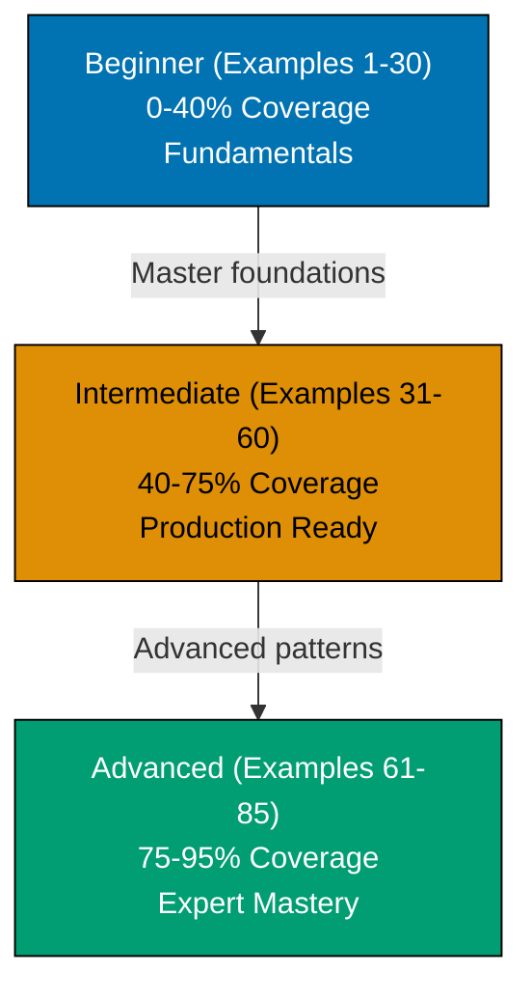

**Want to quickly master PostgreSQL through working examples?** This by-example guide teaches 95% of PostgreSQL through 85 annotated SQL examples organized by complexity level.

## What Is By-Example Learning?

By-example learning is an **example-first approach** where you learn through annotated, runnable SQL rather than narrative explanations. Each example is self-contained, immediately executable in a PostgreSQL container, and heavily commented to show:

- **What each statement does** - Inline comments explain the purpose and mechanism
- **Expected outputs** - Using `-- =>` notation to show query results
- **Intermediate states** - Table contents and data transformations made visible
- **Key takeaways** - 1-2 sentence summaries of core concepts

This approach is **ideal for experienced developers** (seasonal programmers or software engineers) who are familiar with databases or SQL and want to quickly understand PostgreSQL's features, syntax, and unique capabilities through working code.

Unlike narrative tutorials that build understanding through explanation and storytelling, by-example learning lets you **see the SQL first, run it second, and understand it through direct interaction**. You learn by doing, not by reading about doing.

## Learning Path

The PostgreSQL by-example tutorial guides you through 85 examples organized into three progressive levels, from fundamental concepts to advanced database administration.



## Coverage Philosophy

This by-example guide provides **95% coverage of PostgreSQL** through practical, annotated examples. The 95% figure represents the depth and breadth of concepts covered, not a time estimate—focus is on **outcomes and understanding**, not duration.

### What's Covered

- **Core SQL syntax** - SELECT, INSERT, UPDATE, DELETE, WHERE clauses, ORDER BY, LIMIT, OFFSET
- **Data types** - Numeric types (INTEGER, BIGINT, DECIMAL, NUMERIC), text types (VARCHAR, TEXT, CHAR), temporal types (DATE, TIME, TIMESTAMP, INTERVAL), boolean, UUID, NULL handling
- **Schema design** - Table creation, primary keys, foreign keys, SERIAL auto-increment, unique constraints, check constraints, NOT NULL, default values
- **Joins and relationships** - INNER JOIN, LEFT/RIGHT/FULL OUTER JOIN, self joins, complex multi-table queries
- **Aggregations and grouping** - COUNT, SUM, AVG, MIN, MAX, GROUP BY, HAVING clauses
- **Advanced queries** - Common Table Expressions (CTEs), window functions (ROW_NUMBER, RANK, DENSE_RANK, partitioning), recursive CTEs, UNION/INTERSECT/EXCEPT
- **Indexes and performance** - B-tree indexes, unique indexes, multi-column indexes, partial indexes, GIN/GiST indexes, expression indexes, covering indexes, EXPLAIN and EXPLAIN ANALYZE
- **Advanced data types** - Arrays, JSON and JSONB, JSON operators (`->`, `->>`), range types (daterange, int4range)
- **Transactions** - BEGIN, COMMIT, ROLLBACK, isolation levels, ACID properties, savepoints, deadlock handling
- **Views and functions** - Creating views, materialized views, PL/pgSQL functions, parameters and return types, triggers
- **Production patterns** - Upsert with ON CONFLICT, bulk insert with COPY, GENERATE_SERIES for test data, lateral joins, composite types
- **Full-text search** - tsvector and tsquery, text search operators, ranking and relevance
- **Partitioning** - Range partitioning, list partitioning, partition pruning for performance
- **Administration** - User roles and permissions, row-level security (RLS), backup with pg_dump, restore with pg_restore, monitoring with pg_stat views
- **Advanced features** - Advisory locks, LISTEN/NOTIFY for pub/sub, write-ahead logging (WAL), foreign data wrappers, logical replication, connection pooling, performance tuning parameters

## What This Tutorial Does NOT Cover

**PostgreSQL Extensions Not in Core**: PostGIS for geographic data, TimescaleDB for time-series, Citus for sharding - these are powerful but separate from core PostgreSQL

**Application-Level ORMs**: SQLAlchemy, Hibernate, ActiveRecord, Prisma - these are framework concerns, not database features

**Deployment and Infrastructure**: Docker Compose orchestration, Kubernetes StatefulSets, cloud-managed PostgreSQL (AWS RDS, Google Cloud SQL, Azure Database) - these are DevOps topics

**PostgreSQL Internals**: MVCC implementation details, query planner algorithms, buffer cache architecture - these are advanced internals beyond practical usage

**Database Migration Tools**: Flyway, Liquibase, Alembic - these are tooling concerns for managing schema evolution

## How to Use This Guide

1. **Sequential or selective** - Read examples in order for progressive learning, or jump to specific topics when you need a particular feature
2. **Run everything** - Copy and paste examples into your PostgreSQL container. Experimentation solidifies understanding.
3. **Modify and explore** - Change queries, add columns, insert different data, break things intentionally. Learn through experimentation.
4. **Use as reference** - Bookmark examples for quick lookups when you forget syntax or patterns
5. **Complement with narrative tutorials** - By-example learning is code-first; pair with comprehensive tutorials for deeper explanations

**Best workflow**: Open your terminal with a PostgreSQL container in one window, this guide in another. Run each example as you read it. When you encounter something unfamiliar, run the example, modify it, see what changes.

**Reference System**: Examples are numbered (1-85) and grouped by level. This numbering appears in other PostgreSQL content at ayokoding.com, allowing you to reference specific examples elsewhere.

## Structure of Each Example

Every example follows a consistent five-part format:

1. **Brief Explanation** (2-3 sentences): What the example demonstrates and why it matters
2. **Mermaid Diagram** (optional): Visual clarification when concept relationships benefit from visualization
3. **Heavily Annotated Code**: Every significant statement includes a comment explaining what it does and what it produces (using `-- =>` notation)
4. **Key Takeaway** (1-2 sentences): The core insight you should retain from this example
5. **Why It Matters** (50-100 words): Real-world significance and practical applications in production systems

This structure minimizes context switching - explanation, visual aid, runnable code, and distilled essence all in one place.

## Execution Environment

All examples use a **Docker-based PostgreSQL 16 container** for reproducible, isolated execution across all platforms (Windows, macOS, Linux).

**One-time setup** (run once before starting examples):

```bash
# Create PostgreSQL 16 container
docker run --name postgres-tutorial \
  -e POSTGRES_PASSWORD=password \
  -p 5432:5432 \
  -d postgres:16

# Connect to PostgreSQL
docker exec -it postgres-tutorial psql -U postgres
```

**Every example is copy-paste runnable** in this environment. Each example creates its own database to ensure isolation and repeatability.

## Relationship to Other Tutorials

This by-example tutorial complements other learning approaches. Choose based on your situation:

| Tutorial Type        | Coverage | Best For                          | Learning Style                       |
| -------------------- | -------- | --------------------------------- | ------------------------------------ |
| **Quick Start**      | 5-30%    | Getting something working quickly | Hands-on with guided structure       |
| **Beginner**         | 0-60%    | Learning from scratch             | Narrative explanations with examples |
| **This: By Example** | 95%      | Rapid depth for experienced devs  | Code-first, minimal explanation      |
| **Cookbook**         | Parallel | Solving specific problems         | Problem-solution recipes             |
| **Advanced**         | 85-95%   | Expert mastery                    | Deep dives and edge cases            |

By-example is ideal if you have programming or database experience. It accelerates learning by leveraging your existing knowledge - you focus on "how PostgreSQL does this" rather than learning SQL concepts from scratch.

The 95% coverage represents depth and breadth of topics you'll encounter in production PostgreSQL work. It explicitly acknowledges that no tutorial covers everything, but these examples provide the foundation to understand the remaining 5% through official documentation, source code, and community resources.

## Prerequisites

- Basic SQL knowledge (SELECT, INSERT, UPDATE, DELETE) or willingness to learn through examples
- Docker installed and running (for PostgreSQL container)
- A terminal or SQL client you're comfortable with (psql, pgAdmin, DBeaver, etc.)

You don't need to understand PostgreSQL's internals, architecture, or ecosystem yet - this tutorial teaches those through examples. You just need comfort running SQL commands.

## Comparison with By-Example for Other Technologies

Other technologies at ayokoding.com have similar by-example tutorials:

- **Go By-Example**: 85+ examples covering concurrency, interfaces, standard library patterns
- **Java By-Example**: 75-90 examples covering OOP, streams, concurrency, JVM patterns
- **Elixir By-Example**: 75-90 examples covering functional programming, pattern matching, OTP

The PostgreSQL version follows the same philosophy and structure but emphasizes PostgreSQL-specific strengths: ACID compliance, extensibility, advanced data types (JSON, arrays, ranges), full-text search, and robust transaction handling.

## Learning Strategies

### For Python/Data Science Developers

PostgreSQL's advanced analytics match your data needs. Focus on window functions (Examples 34-38), JSON/JSONB operations (Examples 47-50), and full-text search (Examples 51-55).

### For Frontend/JavaScript Developers

PostgreSQL's JSON support bridges server and client data models. Focus on basic queries (Examples 3-5), JSONB operations (Examples 47-50), and schema design (Examples 23-28).

### For Backend/Java/C# Developers

PostgreSQL's production features align with enterprise patterns. Focus on transactions and concurrency (Examples 27-30), advanced indexes (Examples 51-55), and administration (Examples 76-85).

### For Complete Database Beginners

Start from Example 1 and progress through all 30 beginner examples for a structured PostgreSQL foundation.

## Code-First Philosophy

This tutorial prioritizes working code over theoretical discussion:

- **No lengthy prose**: Concepts are demonstrated, not explained at length
- **Runnable examples**: Every example runs in a PostgreSQL 16 Docker container
- **Learn by doing**: Understanding comes from running and modifying SQL queries
- **Pattern recognition**: See the same patterns in different contexts across 85 examples

If you prefer narrative explanations, consider the **by-concept tutorial** (available separately). By-example learning works best when you learn through experimentation.

## Ready to Start?

Jump into the beginner examples to start learning PostgreSQL through code:

- [Beginner Examples (1-30)](/en/learn/software-engineering/data/databases/postgresql/by-example/beginner) - Basic syntax, SELECT queries, WHERE clauses, schema design, aggregations
- [Intermediate Examples (31-60)](/en/learn/software-engineering/data/databases/postgresql/by-example/intermediate) - Window functions, CTEs, JSONB operations, transactions, views
- [Advanced Examples (61-85)](/en/learn/software-engineering/data/databases/postgresql/by-example/advanced) - Full-text search, partitioning, administration, advanced indexes, replication

Each example is self-contained and runnable. Start with Example 1, or jump to topics that interest you most.

## Examples by Level

### Beginner (Examples 1–30)

- [Example 1: Installing PostgreSQL and First Query](/en/learn/software-engineering/data/databases/postgresql/by-example/beginner#example-1-installing-postgresql-and-first-query)
- [Example 2: Creating Your First Database](/en/learn/software-engineering/data/databases/postgresql/by-example/beginner#example-2-creating-your-first-database)
- [Example 3: Basic SELECT Queries](/en/learn/software-engineering/data/databases/postgresql/by-example/beginner#example-3-basic-select-queries)
- [Example 4: Inserting Data with INSERT](/en/learn/software-engineering/data/databases/postgresql/by-example/beginner#example-4-inserting-data-with-insert)
- [Example 5: Updating and Deleting Rows](/en/learn/software-engineering/data/databases/postgresql/by-example/beginner#example-5-updating-and-deleting-rows)
- [Example 6: Numeric Types (INTEGER, BIGINT, DECIMAL, NUMERIC)](/en/learn/software-engineering/data/databases/postgresql/by-example/beginner#example-6-numeric-types-integer-bigint-decimal-numeric)
- [Example 7: Text Types (VARCHAR, TEXT, CHAR)](/en/learn/software-engineering/data/databases/postgresql/by-example/beginner#example-7-text-types-varchar-text-char)
- [Example 8: Date and Time Types](/en/learn/software-engineering/data/databases/postgresql/by-example/beginner#example-8-date-and-time-types)
- [Example 9: Boolean and UUID Types](/en/learn/software-engineering/data/databases/postgresql/by-example/beginner#example-9-boolean-and-uuid-types)
- [Example 10: Working with NULL Values](/en/learn/software-engineering/data/databases/postgresql/by-example/beginner#example-10-working-with-null-values)
- [Example 11: WHERE Clauses and Comparisons](/en/learn/software-engineering/data/databases/postgresql/by-example/beginner#example-11-where-clauses-and-comparisons)
- [Example 12: Sorting with ORDER BY](/en/learn/software-engineering/data/databases/postgresql/by-example/beginner#example-12-sorting-with-order-by)
- [Example 13: Limiting Results with LIMIT and OFFSET](/en/learn/software-engineering/data/databases/postgresql/by-example/beginner#example-13-limiting-results-with-limit-and-offset)
- [Example 14: Basic Aggregations (COUNT, SUM, AVG, MIN, MAX)](/en/learn/software-engineering/data/databases/postgresql/by-example/beginner#example-14-basic-aggregations-count-sum-avg-min-max)
- [Example 15: Grouping Data with GROUP BY](/en/learn/software-engineering/data/databases/postgresql/by-example/beginner#example-15-grouping-data-with-group-by)
- [Example 16: Creating Tables with Constraints](/en/learn/software-engineering/data/databases/postgresql/by-example/beginner#example-16-creating-tables-with-constraints)
- [Example 17: Primary Keys and Auto-Increment (SERIAL)](/en/learn/software-engineering/data/databases/postgresql/by-example/beginner#example-17-primary-keys-and-auto-increment-serial)
- [Example 18: Foreign Keys and Referential Integrity](/en/learn/software-engineering/data/databases/postgresql/by-example/beginner#example-18-foreign-keys-and-referential-integrity)
- [Example 19: Unique and Check Constraints](/en/learn/software-engineering/data/databases/postgresql/by-example/beginner#example-19-unique-and-check-constraints)
- [Example 20: NOT NULL and Default Values](/en/learn/software-engineering/data/databases/postgresql/by-example/beginner#example-20-not-null-and-default-values)
- [Example 21: Inner Joins](/en/learn/software-engineering/data/databases/postgresql/by-example/beginner#example-21-inner-joins)
- [Example 22: Left Outer Joins](/en/learn/software-engineering/data/databases/postgresql/by-example/beginner#example-22-left-outer-joins)
- [Example 23: Right Outer Joins](/en/learn/software-engineering/data/databases/postgresql/by-example/beginner#example-23-right-outer-joins)
- [Example 24: Full Outer Joins](/en/learn/software-engineering/data/databases/postgresql/by-example/beginner#example-24-full-outer-joins)
- [Example 25: Self Joins](/en/learn/software-engineering/data/databases/postgresql/by-example/beginner#example-25-self-joins)
- [Example 26: String Functions (CONCAT, SUBSTRING, LENGTH, UPPER, LOWER)](/en/learn/software-engineering/data/databases/postgresql/by-example/beginner#example-26-string-functions-concat-substring-length-upper-lower)
- [Example 27: Date Functions (NOW, DATE_PART, AGE, INTERVAL)](/en/learn/software-engineering/data/databases/postgresql/by-example/beginner#example-27-date-functions-now-date_part-age-interval)
- [Example 28: Type Casting and Conversions](/en/learn/software-engineering/data/databases/postgresql/by-example/beginner#example-28-type-casting-and-conversions)
- [Example 29: CASE Expressions](/en/learn/software-engineering/data/databases/postgresql/by-example/beginner#example-29-case-expressions)
- [Example 30: Subqueries in SELECT](/en/learn/software-engineering/data/databases/postgresql/by-example/beginner#example-30-subqueries-in-select)

### Intermediate (Examples 31–60)

- [Example 31: Common Table Expressions (WITH clause)](/en/learn/software-engineering/data/databases/postgresql/by-example/intermediate#example-31-common-table-expressions-with-clause)
- [Example 32: Window Functions (ROW_NUMBER, RANK, DENSE_RANK)](/en/learn/software-engineering/data/databases/postgresql/by-example/intermediate#example-32-window-functions-row_number-rank-dense_rank)
- [Example 33: Window Functions with Partitioning](/en/learn/software-engineering/data/databases/postgresql/by-example/intermediate#example-33-window-functions-with-partitioning)
- [Example 34: Recursive CTEs](/en/learn/software-engineering/data/databases/postgresql/by-example/intermediate#example-34-recursive-ctes)
- [Example 35: UNION, INTERSECT, EXCEPT](/en/learn/software-engineering/data/databases/postgresql/by-example/intermediate#example-35-union-intersect-except)
- [Example 36: Creating B-tree Indexes](/en/learn/software-engineering/data/databases/postgresql/by-example/intermediate#example-36-creating-b-tree-indexes)
- [Example 37: Unique Indexes](/en/learn/software-engineering/data/databases/postgresql/by-example/intermediate#example-37-unique-indexes)
- [Example 38: Multi-Column Indexes](/en/learn/software-engineering/data/databases/postgresql/by-example/intermediate#example-38-multi-column-indexes)
- [Example 39: Partial Indexes](/en/learn/software-engineering/data/databases/postgresql/by-example/intermediate#example-39-partial-indexes)
- [Example 40: Using EXPLAIN to Analyze Queries](/en/learn/software-engineering/data/databases/postgresql/by-example/intermediate#example-40-using-explain-to-analyze-queries)
- [Example 41: Arrays](/en/learn/software-engineering/data/databases/postgresql/by-example/intermediate#example-41-arrays)
- [Example 42: JSON and JSONB Types](/en/learn/software-engineering/data/databases/postgresql/by-example/intermediate#example-42-json-and-jsonb-types)
- [Example 43: Querying JSON with -> and ->>](/en/learn/software-engineering/data/databases/postgresql/by-example/intermediate#example-43-querying-json-with---and--)
- [Example 44: JSONB Operators and Functions](/en/learn/software-engineering/data/databases/postgresql/by-example/intermediate#example-44-jsonb-operators-and-functions)
- [Example 45: Range Types (daterange, int4range)](/en/learn/software-engineering/data/databases/postgresql/by-example/intermediate#example-45-range-types-daterange-int4range)
- [Example 46: BEGIN, COMMIT, ROLLBACK](/en/learn/software-engineering/data/databases/postgresql/by-example/intermediate#example-46-begin-commit-rollback)
- [Example 47: Transaction Isolation Levels](/en/learn/software-engineering/data/databases/postgresql/by-example/intermediate#example-47-transaction-isolation-levels)
- [Example 48: ACID Properties in Practice](/en/learn/software-engineering/data/databases/postgresql/by-example/intermediate#example-48-acid-properties-in-practice)
- [Example 49: Savepoints](/en/learn/software-engineering/data/databases/postgresql/by-example/intermediate#example-49-savepoints)
- [Example 50: Deadlock Detection and Handling](/en/learn/software-engineering/data/databases/postgresql/by-example/intermediate#example-50-deadlock-detection-and-handling)
- [Example 51: Creating Views](/en/learn/software-engineering/data/databases/postgresql/by-example/intermediate#example-51-creating-views)
- [Example 52: Materialized Views](/en/learn/software-engineering/data/databases/postgresql/by-example/intermediate#example-52-materialized-views)
- [Example 53: Creating Functions (PL/pgSQL)](/en/learn/software-engineering/data/databases/postgresql/by-example/intermediate#example-53-creating-functions-plpgsql)
- [Example 54: Function Parameters and Return Types](/en/learn/software-engineering/data/databases/postgresql/by-example/intermediate#example-54-function-parameters-and-return-types)
- [Example 55: Triggers](/en/learn/software-engineering/data/databases/postgresql/by-example/intermediate#example-55-triggers)
- [Example 56: Upsert with ON CONFLICT](/en/learn/software-engineering/data/databases/postgresql/by-example/intermediate#example-56-upsert-with-on-conflict)
- [Example 57: Bulk Insert with COPY](/en/learn/software-engineering/data/databases/postgresql/by-example/intermediate#example-57-bulk-insert-with-copy)
- [Example 58: Generate Series for Test Data](/en/learn/software-engineering/data/databases/postgresql/by-example/intermediate#example-58-generate-series-for-test-data)
- [Example 59: Lateral Joins](/en/learn/software-engineering/data/databases/postgresql/by-example/intermediate#example-59-lateral-joins)
- [Example 60: Composite Types](/en/learn/software-engineering/data/databases/postgresql/by-example/intermediate#example-60-composite-types)

### Advanced (Examples 61–85)

- [Example 61: GIN Indexes for Full-Text Search](/en/learn/software-engineering/data/databases/postgresql/by-example/advanced#example-61-gin-indexes-for-full-text-search)
- [Example 62: GiST Indexes for Geometric and Range Data](/en/learn/software-engineering/data/databases/postgresql/by-example/advanced#example-62-gist-indexes-for-geometric-and-range-data)
- [Example 63: Expression Indexes](/en/learn/software-engineering/data/databases/postgresql/by-example/advanced#example-63-expression-indexes)
- [Example 64: Covering Indexes (INCLUDE clause)](/en/learn/software-engineering/data/databases/postgresql/by-example/advanced#example-64-covering-indexes-include-clause)
- [Example 65: Index-Only Scans](/en/learn/software-engineering/data/databases/postgresql/by-example/advanced#example-65-index-only-scans)
- [Example 66: Analyzing Query Plans with EXPLAIN ANALYZE](/en/learn/software-engineering/data/databases/postgresql/by-example/advanced#example-66-analyzing-query-plans-with-explain-analyze)
- [Example 67: Join Order Optimization](/en/learn/software-engineering/data/databases/postgresql/by-example/advanced#example-67-join-order-optimization)
- [Example 68: Subquery vs JOIN Performance](/en/learn/software-engineering/data/databases/postgresql/by-example/advanced#example-68-subquery-vs-join-performance)
- [Example 69: Query Hints and Statistics](/en/learn/software-engineering/data/databases/postgresql/by-example/advanced#example-69-query-hints-and-statistics)
- [Example 70: Vacuum and Analyze](/en/learn/software-engineering/data/databases/postgresql/by-example/advanced#example-70-vacuum-and-analyze)
- [Example 71: Full-Text Search with tsvector](/en/learn/software-engineering/data/databases/postgresql/by-example/advanced#example-71-full-text-search-with-tsvector)
- [Example 72: Table Partitioning (Range Partitioning)](/en/learn/software-engineering/data/databases/postgresql/by-example/advanced#example-72-table-partitioning-range-partitioning)
- [Example 73: Table Partitioning (List Partitioning)](/en/learn/software-engineering/data/databases/postgresql/by-example/advanced#example-73-table-partitioning-list-partitioning)
- [Example 74: Foreign Data Wrappers (FDW)](/en/learn/software-engineering/data/databases/postgresql/by-example/advanced#example-74-foreign-data-wrappers-fdw)
- [Example 75: Logical Replication Basics](/en/learn/software-engineering/data/databases/postgresql/by-example/advanced#example-75-logical-replication-basics)
- [Example 76: User Roles and Permissions](/en/learn/software-engineering/data/databases/postgresql/by-example/advanced#example-76-user-roles-and-permissions)
- [Example 77: Row-Level Security (RLS)](/en/learn/software-engineering/data/databases/postgresql/by-example/advanced#example-77-row-level-security-rls)
- [Example 78: Backup with pg_dump](/en/learn/software-engineering/data/databases/postgresql/by-example/advanced#example-78-backup-with-pg_dump)
- [Example 79: Restore with pg_restore](/en/learn/software-engineering/data/databases/postgresql/by-example/advanced#example-79-restore-with-pg_restore)
- [Example 80: Monitoring with pg_stat Views](/en/learn/software-engineering/data/databases/postgresql/by-example/advanced#example-80-monitoring-with-pg_stat-views)
- [Example 81: Advisory Locks](/en/learn/software-engineering/data/databases/postgresql/by-example/advanced#example-81-advisory-locks)
- [Example 82: Listen/Notify for Event Notifications](/en/learn/software-engineering/data/databases/postgresql/by-example/advanced#example-82-listennotify-for-event-notifications)
- [Example 83: Write-Ahead Logging (WAL)](/en/learn/software-engineering/data/databases/postgresql/by-example/advanced#example-83-write-ahead-logging-wal)
- [Example 84: Connection Pooling with pgBouncer](/en/learn/software-engineering/data/databases/postgresql/by-example/advanced#example-84-connection-pooling-with-pgbouncer)
- [Example 85: Performance Tuning Parameters](/en/learn/software-engineering/data/databases/postgresql/by-example/advanced#example-85-performance-tuning-parameters)
