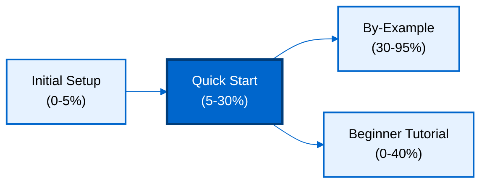

**Want to quickly build applications with relational data and powerful queries?** This quick start introduces PostgreSQL's core concepts through a working application. You'll learn table creation, relationships, indexes, transactions, and JSON support - the essential 5-30% that powers productive PostgreSQL development.

## Prerequisites

Before starting, complete [Initial Setup](/en/learn/software-engineering/data/databases/postgresql/initial-setup) to install PostgreSQL and verify your environment.

You should have:

- PostgreSQL 16+ installed and running
- `psql` command-line client working
- Basic understanding of SQL (SELECT, INSERT, UPDATE, DELETE)
- Completed "Your First Database" from Initial Setup

## What You'll Build

You'll create an **e-commerce application** with:

- Users with authentication credentials
- Products with categories and pricing
- Orders linking users and products
- Inventory tracking
- JSON metadata for flexible attributes
- Full-text search for product discovery

This covers 5-30% of PostgreSQL features - enough to build real applications while understanding core concepts.

## Learning Path



## Learning Objectives

By the end of this quick start, you will:

1. **Create tables** with primary keys, foreign keys, and constraints
2. **Define relationships** between tables (one-to-many, many-to-many)
3. **Write queries** with joins, aggregation, and filtering
4. **Use indexes** to optimize query performance
5. **Execute transactions** for data consistency
6. **Store JSON data** with JSONB for flexible schemas
7. **Implement full-text search** for content discovery
8. **Apply constraints** for data integrity

## Connect to Database

Start `psql` and create a new database for this tutorial.

```bash
psql -U postgres

CREATE DATABASE ecommerce;

\c ecommerce
```

You should see:

```
You are now connected to database "ecommerce" as user "postgres".
```

## Create Tables with Constraints

Define tables with primary keys, data types, and constraints.

### Users Table

```sql
-- Users table with authentication
CREATE TABLE users (
    id SERIAL PRIMARY KEY,
    username VARCHAR(50) NOT NULL UNIQUE,
    email VARCHAR(100) NOT NULL UNIQUE,
    password_hash VARCHAR(255) NOT NULL,
    created_at TIMESTAMP DEFAULT CURRENT_TIMESTAMP,
    updated_at TIMESTAMP DEFAULT CURRENT_TIMESTAMP
);

-- Insert sample users
INSERT INTO users (username, email, password_hash)
VALUES
    ('alice', 'alice@example.com', '$2a$10$...'),
    ('bob', 'bob@example.com', '$2a$10$...'),
    ('charlie', 'charlie@example.com', '$2a$10$...');

-- Verify insertion
SELECT id, username, email FROM users;
```

**Output**:

```
 id | username |       email
----+----------+---------------------
  1 | alice    | alice@example.com
  2 | bob      | bob@example.com
  3 | charlie  | charlie@example.com
(3 rows)
```

**Key concepts**:

- `SERIAL`: Auto-incrementing integer (PostgreSQL-specific)
- `PRIMARY KEY`: Unique identifier for each row
- `UNIQUE`: Prevents duplicate values
- `NOT NULL`: Requires value (no NULLs allowed)
- `DEFAULT`: Provides default value if not specified

### Products Table

```sql
-- Products table with categories
CREATE TABLE products (
    id SERIAL PRIMARY KEY,
    name VARCHAR(200) NOT NULL,
    description TEXT,
    price NUMERIC(10, 2) NOT NULL CHECK (price >= 0),
    category VARCHAR(50) NOT NULL,
    stock_quantity INTEGER NOT NULL DEFAULT 0 CHECK (stock_quantity >= 0),
    created_at TIMESTAMP DEFAULT CURRENT_TIMESTAMP,
    updated_at TIMESTAMP DEFAULT CURRENT_TIMESTAMP
);

-- Insert sample products
INSERT INTO products (name, description, price, category, stock_quantity)
VALUES
    ('Laptop', 'High-performance laptop', 999.99, 'Electronics', 50),
    ('Mouse', 'Wireless optical mouse', 19.99, 'Electronics', 200),
    ('Desk Chair', 'Ergonomic office chair', 299.99, 'Furniture', 30),
    ('Coffee Mug', 'Ceramic coffee mug', 9.99, 'Kitchen', 100);

-- Verify insertion
SELECT id, name, price, category, stock_quantity FROM products;
```

**Output**:

```
 id |    name     |  price  |  category   | stock_quantity
----+-------------+---------+-------------+----------------
  1 | Laptop      |  999.99 | Electronics |             50
  2 | Mouse       |   19.99 | Electronics |            200
  3 | Desk Chair  |  299.99 | Furniture   |             30
  4 | Coffee Mug  |    9.99 | Kitchen     |            100
(4 rows)
```

**Key concepts**:

- `NUMERIC(10, 2)`: Decimal with 10 total digits, 2 after decimal point
- `TEXT`: Variable-length text (no length limit)
- `CHECK`: Validates values (e.g., price >= 0)
- `DEFAULT 0`: Provides default value

## Relationships with Foreign Keys

Link tables together using foreign keys.

### Orders Table (One-to-Many)

```sql
-- Orders table linking to users
CREATE TABLE orders (
    id SERIAL PRIMARY KEY,
    user_id INTEGER NOT NULL REFERENCES users(id) ON DELETE CASCADE,
    status VARCHAR(20) NOT NULL DEFAULT 'pending'
        CHECK (status IN ('pending', 'processing', 'shipped', 'delivered', 'cancelled')),
    total_amount NUMERIC(10, 2) NOT NULL DEFAULT 0.00,
    created_at TIMESTAMP DEFAULT CURRENT_TIMESTAMP,
    updated_at TIMESTAMP DEFAULT CURRENT_TIMESTAMP
);

-- Insert sample orders
INSERT INTO orders (user_id, status, total_amount)
VALUES
    (1, 'delivered', 1019.98),  -- Alice
    (2, 'processing', 299.99),  -- Bob
    (1, 'pending', 9.99);       -- Alice

-- Verify insertion
SELECT id, user_id, status, total_amount FROM orders;
```

**Output**:

```
 id | user_id |   status   | total_amount
----+---------+------------+--------------
  1 |       1 | delivered  |      1019.98
  2 |       2 | processing |       299.99
  3 |       1 | pending    |         9.99
(3 rows)
```

**Foreign key concepts**:

- `REFERENCES users(id)`: Links to users table primary key
- `ON DELETE CASCADE`: Delete orders when user is deleted
- `ON DELETE SET NULL`: Set foreign key to NULL when parent deleted
- `ON DELETE RESTRICT`: Prevent parent deletion if children exist (default)

### Order Items Table (Many-to-Many through Join Table)

```sql
-- Order items (many-to-many: orders ↔ products)
CREATE TABLE order_items (
    id SERIAL PRIMARY KEY,
    order_id INTEGER NOT NULL REFERENCES orders(id) ON DELETE CASCADE,
    product_id INTEGER NOT NULL REFERENCES products(id) ON DELETE RESTRICT,
    quantity INTEGER NOT NULL CHECK (quantity > 0),
    price_at_purchase NUMERIC(10, 2) NOT NULL,
    created_at TIMESTAMP DEFAULT CURRENT_TIMESTAMP
);

-- Insert sample order items
INSERT INTO order_items (order_id, product_id, quantity, price_at_purchase)
VALUES
    (1, 1, 1, 999.99),  -- Order 1: 1 Laptop
    (1, 2, 1, 19.99),   -- Order 1: 1 Mouse
    (2, 3, 1, 299.99),  -- Order 2: 1 Desk Chair
    (3, 4, 1, 9.99);    -- Order 3: 1 Coffee Mug

-- Verify insertion
SELECT id, order_id, product_id, quantity, price_at_purchase FROM order_items;
```

**Output**:

```
 id | order_id | product_id | quantity | price_at_purchase
----+----------+------------+----------+-------------------
  1 |        1 |          1 |        1 |            999.99
  2 |        1 |          2 |        1 |             19.99
  3 |        2 |          3 |        1 |            299.99
  4 |        3 |          4 |        1 |              9.99
(4 rows)
```

**Join table pattern**:

- Links two tables in many-to-many relationship
- Contains foreign keys to both parent tables
- Stores relationship-specific data (quantity, price snapshot)

## Joins - Querying Related Data

Combine data from multiple tables using joins.

### Inner Join - Orders with User Details

```sql
-- Get orders with user information
SELECT
    o.id AS order_id,
    u.username,
    u.email,
    o.status,
    o.total_amount,
    o.created_at
FROM orders o
INNER JOIN users u ON o.user_id = u.id
ORDER BY o.created_at DESC;
```

**Output**:

```
 order_id | username |       email        |   status   | total_amount |       created_at
----------+----------+--------------------+------------+--------------+------------------------
        3 | alice    | alice@example.com  | pending    |         9.99 | 2026-01-29 10:45:30
        2 | bob      | bob@example.com    | processing |       299.99 | 2026-01-29 10:45:29
        1 | alice    | alice@example.com  | delivered  |      1019.98 | 2026-01-29 10:45:28
(3 rows)
```

**Inner join**:

- Returns rows where join condition matches in both tables
- Excludes rows without matches
- Most common join type

### Left Join - Products with Order Items

```sql
-- Get all products with total quantity sold (including products with no sales)
SELECT
    p.id,
    p.name,
    p.category,
    p.price,
    COALESCE(SUM(oi.quantity), 0) AS total_sold
FROM products p
LEFT JOIN order_items oi ON p.id = oi.product_id
GROUP BY p.id, p.name, p.category, p.price
ORDER BY total_sold DESC;
```

**Output**:

```
 id |    name     |  category   |  price  | total_sold
----+-------------+-------------+---------+------------
  1 | Laptop      | Electronics |  999.99 |          1
  2 | Mouse       | Electronics |   19.99 |          1
  3 | Desk Chair  | Furniture   |  299.99 |          1
  4 | Coffee Mug  | Kitchen     |    9.99 |          1
(4 rows)
```

**Left join**:

- Returns all rows from left table (products)
- Includes matching rows from right table (order_items)
- NULL for right table columns when no match
- `COALESCE(value, 0)`: Returns 0 if value is NULL

### Complex Join - Order Details with Everything

```sql
-- Get complete order details (order, user, items, products)
SELECT
    o.id AS order_id,
    u.username,
    o.status,
    p.name AS product_name,
    oi.quantity,
    oi.price_at_purchase,
    (oi.quantity * oi.price_at_purchase) AS item_total
FROM orders o
INNER JOIN users u ON o.user_id = u.id
INNER JOIN order_items oi ON o.id = oi.order_id
INNER JOIN products p ON oi.product_id = p.id
ORDER BY o.id, oi.id;
```

**Output**:

```
 order_id | username |   status   | product_name | quantity | price_at_purchase | item_total
----------+----------+------------+--------------+----------+-------------------+------------
        1 | alice    | delivered  | Laptop       |        1 |            999.99 |     999.99
        1 | alice    | delivered  | Mouse        |        1 |             19.99 |      19.99
        2 | bob      | processing | Desk Chair   |        1 |            299.99 |     299.99
        3 | alice    | pending    | Coffee Mug   |        1 |              9.99 |       9.99
(4 rows)
```

## Aggregation and Grouping

Compute summaries using aggregate functions.

### Count Orders by Status

```sql
-- Count orders grouped by status
SELECT
    status,
    COUNT(*) AS order_count
FROM orders
GROUP BY status
ORDER BY order_count DESC;
```

**Output**:

```
   status   | order_count
------------+-------------
 delivered  |           1
 pending    |           1
 processing |           1
(3 rows)
```

### Revenue by Category

```sql
-- Calculate total revenue by product category
SELECT
    p.category,
    COUNT(DISTINCT oi.order_id) AS num_orders,
    SUM(oi.quantity) AS total_quantity,
    SUM(oi.quantity * oi.price_at_purchase) AS total_revenue
FROM products p
INNER JOIN order_items oi ON p.id = oi.product_id
GROUP BY p.category
ORDER BY total_revenue DESC;
```

**Output**:

```
  category   | num_orders | total_quantity | total_revenue
-------------+------------+----------------+---------------
 Electronics |          1 |              2 |       1019.98
 Furniture   |          1 |              1 |        299.99
 Kitchen     |          1 |              1 |          9.99
(3 rows)
```

**Aggregate functions**:

- `COUNT(*)`: Count all rows
- `COUNT(DISTINCT column)`: Count unique values
- `SUM(column)`: Sum numeric values
- `AVG(column)`: Average numeric values
- `MIN(column)`, `MAX(column)`: Minimum and maximum values

### HAVING Clause - Filter Aggregated Results

```sql
-- Find users with more than 1 order
SELECT
    u.username,
    COUNT(o.id) AS order_count,
    SUM(o.total_amount) AS total_spent
FROM users u
INNER JOIN orders o ON u.id = o.user_id
GROUP BY u.id, u.username
HAVING COUNT(o.id) > 1
ORDER BY total_spent DESC;
```

**Output**:

```
 username | order_count | total_spent
----------+-------------+-------------
 alice    |           2 |     1029.97
(1 row)
```

**HAVING vs WHERE**:

- `WHERE`: Filters rows before aggregation
- `HAVING`: Filters groups after aggregation
- `HAVING` can use aggregate functions, `WHERE` cannot

## Indexes for Performance

Create indexes to speed up queries.

### Single-Column Index

```sql
-- Create index on products.category for faster filtering
CREATE INDEX idx_products_category ON products(category);

-- Create index on orders.user_id for faster joins
CREATE INDEX idx_orders_user_id ON orders(user_id);

-- Create index on order_items.order_id for faster joins
CREATE INDEX idx_order_items_order_id ON order_items(order_id);

-- Verify indexes
\di
```

**Output**:

```
                       List of relations
 Schema |           Name            | Type  |  Owner   |   Table
--------+---------------------------+-------+----------+-------------
 public | idx_orders_user_id        | index | postgres | orders
 public | idx_order_items_order_id  | index | postgres | order_items
 public | idx_products_category     | index | postgres | products
(3 rows)
```

### Composite Index

```sql
-- Create composite index for common query pattern
CREATE INDEX idx_orders_user_status ON orders(user_id, status);

-- This index speeds up queries filtering by both user_id and status
SELECT * FROM orders WHERE user_id = 1 AND status = 'delivered';
```

**Index benefits**:

- Speeds up WHERE clauses
- Accelerates JOIN operations
- Improves ORDER BY performance
- Trade-off: Slower writes, more storage

### Explain Query Plan

```sql
-- Analyze query execution plan
EXPLAIN ANALYZE
SELECT p.name, p.price
FROM products p
WHERE p.category = 'Electronics';
```

**Output**:

```
 Index Scan using idx_products_category on products p  (cost=0.14..8.16 rows=1 width=40)
   Index Cond: ((category)::text = 'Electronics'::text)
   Planning Time: 0.123 ms
   Execution Time: 0.045 ms
(4 rows)
```

**EXPLAIN keywords**:

- `EXPLAIN`: Show query plan (no execution)
- `EXPLAIN ANALYZE`: Execute query and show actual timings
- `Seq Scan`: Full table scan (slow for large tables)
- `Index Scan`: Uses index (fast)

## Transactions for Data Consistency

Group multiple operations into atomic units.

### Basic Transaction

```sql
-- Start transaction
BEGIN;

-- Deduct product stock
UPDATE products
SET stock_quantity = stock_quantity - 1
WHERE id = 1;

-- Create order
INSERT INTO orders (user_id, status, total_amount)
VALUES (3, 'pending', 999.99);

-- Create order item
INSERT INTO order_items (order_id, product_id, quantity, price_at_purchase)
VALUES (currval('orders_id_seq'), 1, 1, 999.99);

-- Commit transaction (make changes permanent)
COMMIT;

-- Verify changes
SELECT stock_quantity FROM products WHERE id = 1;
```

**Output**:

```
 stock_quantity
----------------
             49
(1 row)
```

**Transaction commands**:

- `BEGIN`: Start transaction
- `COMMIT`: Save changes permanently
- `ROLLBACK`: Discard all changes since BEGIN

### Transaction with Rollback

```sql
-- Start transaction
BEGIN;

-- Try to create order with negative stock
UPDATE products
SET stock_quantity = stock_quantity - 100
WHERE id = 2;

-- Check constraint violation (stock would be negative)
SELECT stock_quantity FROM products WHERE id = 2;

-- Rollback transaction (undo changes)
ROLLBACK;

-- Verify rollback - stock unchanged
SELECT stock_quantity FROM products WHERE id = 2;
```

**Output**:

```
 stock_quantity
----------------
            200
(1 row)
```

**ACID properties**:

- **Atomicity**: All operations succeed or all fail
- **Consistency**: Database moves from valid state to valid state
- **Isolation**: Concurrent transactions don't interfere
- **Durability**: Committed changes survive system failures

## JSON Support with JSONB

Store flexible, semi-structured data using JSONB.

### Add JSONB Column

```sql
-- Add metadata column to products
ALTER TABLE products ADD COLUMN metadata JSONB;

-- Update products with JSON metadata
UPDATE products
SET metadata = '{"brand": "TechCorp", "warranty_years": 2, "features": ["SSD", "16GB RAM", "Backlit Keyboard"]}'
WHERE id = 1;

UPDATE products
SET metadata = '{"brand": "TechCorp", "wireless": true, "dpi": 1600}'
WHERE id = 2;

UPDATE products
SET metadata = '{"brand": "ComfortSeating", "adjustable": true, "material": "mesh"}'
WHERE id = 3;

UPDATE products
SET metadata = '{"brand": "KitchenPro", "capacity_ml": 350, "dishwasher_safe": true}'
WHERE id = 4;

-- Verify JSON data
SELECT id, name, metadata FROM products;
```

**Output**:

```
 id |    name     |                                          metadata
----+-------------+-------------------------------------------------------------------------------------------
  1 | Laptop      | {"brand": "TechCorp", "features": ["SSD", "16GB RAM", "Backlit Keyboard"], "warranty_years": 2}
  2 | Mouse       | {"dpi": 1600, "brand": "TechCorp", "wireless": true}
  3 | Desk Chair  | {"brand": "ComfortSeating", "material": "mesh", "adjustable": true}
  4 | Coffee Mug  | {"brand": "KitchenPro", "capacity_ml": 350, "dishwasher_safe": true}
(4 rows)
```

### Query JSON Data

```sql
-- Query products by JSON field
SELECT name, metadata->>'brand' AS brand
FROM products
WHERE metadata->>'brand' = 'TechCorp';
```

**Output**:

```
   name   |  brand
----------+----------
 Laptop   | TechCorp
 Mouse    | TechCorp
(2 rows)
```

### JSON Operators

```sql
-- Extract JSON field as text (->>')
SELECT name, metadata->>'brand' AS brand FROM products WHERE id = 1;
-- Output: Laptop | TechCorp

-- Extract JSON field as JSON (->)
SELECT name, metadata->'features' AS features FROM products WHERE id = 1;
-- Output: Laptop | ["SSD", "16GB RAM", "Backlit Keyboard"]

-- Check JSON key existence (?)
SELECT name FROM products WHERE metadata ? 'wireless';
-- Output: Mouse

-- Check JSON value (@>)
SELECT name FROM products WHERE metadata @> '{"wireless": true}';
-- Output: Mouse

-- Extract nested JSON path (#>>)
SELECT name, metadata#>>'{features,0}' AS first_feature FROM products WHERE id = 1;
-- Output: Laptop | SSD
```

### Index JSON Fields

```sql
-- Create GIN index for JSON containment queries
CREATE INDEX idx_products_metadata ON products USING GIN (metadata);

-- Fast query using index
SELECT name FROM products WHERE metadata @> '{"brand": "TechCorp"}';
```

**JSONB benefits**:

- Flexible schema (no migrations for new fields)
- Efficient storage (binary format)
- Fast indexing (GIN indexes)
- Rich operators for querying

## Full-Text Search

Search text content efficiently.

### Add Full-Text Search Column

```sql
-- Add tsvector column for full-text search
ALTER TABLE products ADD COLUMN search_vector tsvector;

-- Populate search vector from name and description
UPDATE products
SET search_vector = to_tsvector('english', name || ' ' || COALESCE(description, ''));

-- Create GIN index for fast full-text search
CREATE INDEX idx_products_search ON products USING GIN (search_vector);

-- Verify search vectors
SELECT id, name, search_vector FROM products;
```

**Output**:

```
 id |    name     |                        search_vector
----+-------------+----------------------------------------------------------
  1 | Laptop      | 'high':1 'high-perform':1 'laptop':2 'perform':1
  2 | Mouse       | 'mous':2 'optic':1 'wireless':1
  3 | Desk Chair  | 'chair':2 'desk':1 'ergonomic':1 'offic':1
  4 | Coffee Mug  | 'ceramic':1 'coffe':1,2 'mug':2
(4 rows)
```

### Search with to_tsquery

```sql
-- Search for products containing "laptop"
SELECT name, description
FROM products
WHERE search_vector @@ to_tsquery('english', 'laptop');
```

**Output**:

```
  name  |        description
--------+----------------------------
 Laptop | High-performance laptop
(1 row)
```

### Ranked Search Results

```sql
-- Search with relevance ranking
SELECT
    name,
    description,
    ts_rank(search_vector, query) AS rank
FROM products, to_tsquery('english', 'wireless | laptop') AS query
WHERE search_vector @@ query
ORDER BY rank DESC;
```

**Output**:

```
  name  |        description         |   rank
--------+----------------------------+-----------
 Laptop | High-performance laptop    |  0.607927
 Mouse  | Wireless optical mouse     |  0.607927
(2 rows)
```

**Full-text search operators**:

- `@@`: Matches search query
- `to_tsvector()`: Convert text to search vector
- `to_tsquery()`: Convert text to search query
- `ts_rank()`: Relevance score (higher = more relevant)
- Query operators: `&` (AND), `|` (OR), `!` (NOT)

## Common Table Expressions (CTEs)

Write readable queries with temporary named results.

### Basic CTE

```sql
-- Calculate order totals using CTE
WITH order_totals AS (
    SELECT
        order_id,
        SUM(quantity * price_at_purchase) AS calculated_total
    FROM order_items
    GROUP BY order_id
)
SELECT
    o.id,
    u.username,
    o.total_amount AS stored_total,
    ot.calculated_total,
    (o.total_amount = ot.calculated_total) AS totals_match
FROM orders o
INNER JOIN users u ON o.user_id = u.id
INNER JOIN order_totals ot ON o.id = ot.order_id;
```

**Output**:

```
 id | username | stored_total | calculated_total | totals_match
----+----------+--------------+------------------+--------------
  1 | alice    |      1019.98 |          1019.98 | t
  2 | bob      |       299.99 |           299.99 | t
  3 | alice    |         9.99 |             9.99 | t
(3 rows)
```

### Multiple CTEs

```sql
-- Find top customers and their favorite categories
WITH customer_spending AS (
    SELECT
        u.id AS user_id,
        u.username,
        SUM(o.total_amount) AS total_spent
    FROM users u
    INNER JOIN orders o ON u.id = o.user_id
    GROUP BY u.id, u.username
),
customer_categories AS (
    SELECT
        u.id AS user_id,
        p.category,
        COUNT(*) AS purchase_count
    FROM users u
    INNER JOIN orders o ON u.id = o.user_id
    INNER JOIN order_items oi ON o.id = oi.order_id
    INNER JOIN products p ON oi.product_id = p.id
    GROUP BY u.id, p.category
)
SELECT
    cs.username,
    cs.total_spent,
    cc.category AS favorite_category,
    cc.purchase_count
FROM customer_spending cs
INNER JOIN customer_categories cc ON cs.user_id = cc.user_id
ORDER BY cs.total_spent DESC, cc.purchase_count DESC;
```

**Output**:

```
 username | total_spent | favorite_category | purchase_count
----------+-------------+-------------------+----------------
 alice    |     1029.97 | Electronics       |              2
 alice    |     1029.97 | Kitchen           |              1
 bob      |      299.99 | Furniture         |              1
(3 rows)
```

**CTE benefits**:

- Improves query readability
- Reuses subquery results
- Supports recursive queries (not shown)
- Can be referenced multiple times

## Next Steps

You've learned PostgreSQL's core concepts covering 5-30% of the database. Continue learning:

1. **[By-Example Tutorial](/en/learn/software-engineering/data/databases/postgresql/by-example)** - 85 annotated examples covering 95% of PostgreSQL (beginner, intermediate, advanced)
2. **Beginner Tutorial** (coming soon) - Narrative-driven comprehensive guide
3. **[Official PostgreSQL Documentation](https://www.postgresql.org/docs/)** - Comprehensive reference

**What you've learned**:

- Table creation with constraints and data types
- Relationships with foreign keys (one-to-many, many-to-many)
- Joins (INNER, LEFT) for querying related data
- Aggregation with GROUP BY and HAVING
- Indexes for query performance
- Transactions for data consistency
- JSON support with JSONB for flexible schemas
- Full-text search for content discovery
- CTEs for readable queries

**Topics to explore next**:

- Window functions for analytics
- Partitioning for scalability
- Replication for high availability
- Advanced indexes (partial, expression, covering)
- Query optimization techniques
- Stored procedures and triggers
- Row-level security

## Summary

This quick start covered essential PostgreSQL concepts through an e-commerce application:

**Tables**: Created tables with primary keys, foreign keys, and constraints for data integrity

**Relationships**: Linked tables with foreign keys for one-to-many and many-to-many relationships

**Joins**: Combined data from multiple tables with INNER and LEFT joins

**Aggregation**: Computed summaries with GROUP BY, COUNT, SUM, and HAVING

**Indexes**: Optimized queries with single-column, composite, and GIN indexes

**Transactions**: Ensured data consistency with BEGIN, COMMIT, and ROLLBACK

**JSON**: Stored flexible data with JSONB and queried with operators

**Full-Text Search**: Implemented content discovery with tsvector and GIN indexes

**CTEs**: Wrote readable queries with temporary named results

You're now ready to build applications with relational data, powerful queries, and advanced PostgreSQL features. Continue to By-Example for deeper mastery covering 95% of PostgreSQL capabilities.
