## Group 1: Advanced Indexing

### Example 61: GIN Indexes for Full-Text Search

GIN (Generalized Inverted Index) indexes excel at indexing arrays, JSONB, and full-text search. Essential for fast text searches and JSONB queries.

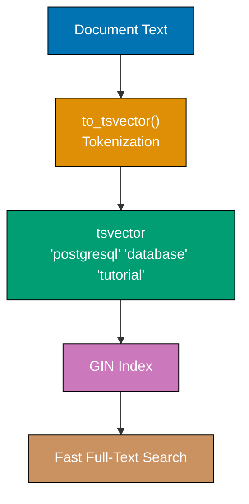

**Code**:

```sql
CREATE DATABASE example_61;
\c example_61;

CREATE TABLE articles (
    id SERIAL PRIMARY KEY,
    title VARCHAR(200),
    content TEXT,
    tags TEXT[]
);

INSERT INTO articles (title, content, tags)
VALUES
    ('PostgreSQL Tutorial', 'Learn PostgreSQL database fundamentals and advanced features', ARRAY['database', 'sql', 'tutorial']),
    ('Docker Guide', 'Complete guide to Docker containers and orchestration', ARRAY['docker', 'containers', 'devops']),
    ('PostgreSQL Performance', 'Optimize PostgreSQL queries and indexes for production', ARRAY['database', 'postgresql', 'performance']);

-- GIN index for array containment
CREATE INDEX idx_articles_tags ON articles USING GIN(tags);

EXPLAIN ANALYZE
SELECT title FROM articles WHERE tags @> ARRAY['database'];
-- => Index Scan using idx_articles_tags (fast)

-- GIN index for full-text search
ALTER TABLE articles ADD COLUMN content_tsv tsvector;

UPDATE articles
SET content_tsv = to_tsvector('english', title || ' ' || content);
-- => Converts text to tsvector (searchable tokens)

CREATE INDEX idx_articles_fts ON articles USING GIN(content_tsv);

-- Full-text search
SELECT title
FROM articles
WHERE content_tsv @@ to_tsquery('english', 'postgresql & database');
-- => Articles containing both 'postgresql' AND 'database'
-- => PostgreSQL Tutorial, PostgreSQL Performance

-- Rank results by relevance
SELECT
    title,
    ts_rank(content_tsv, to_tsquery('english', 'postgresql')) AS rank
FROM articles
WHERE content_tsv @@ to_tsquery('english', 'postgresql')
ORDER BY rank DESC;
-- => Orders by relevance score

-- GIN index for JSONB
CREATE TABLE products (
    id SERIAL PRIMARY KEY,
    data JSONB
);

INSERT INTO products (data)
VALUES
    ('{"name": "Laptop", "specs": {"cpu": "i7", "ram": 16}}'),
    ('{"name": "Phone", "specs": {"cpu": "A15", "ram": 6}}');

CREATE INDEX idx_products_data ON products USING GIN(data);

EXPLAIN ANALYZE
SELECT * FROM products WHERE data @> '{"specs": {"ram": 16}}';
-- => Index Scan using idx_products_data (fast JSONB containment)
```

**Key Takeaway**: GIN indexes enable fast searches on arrays, JSONB, and full-text (tsvector). Use for containment checks (`@>`), JSONB queries, and full-text search. Much faster than sequential scans for these data types.

### Example 62: GiST Indexes for Geometric Data

GiST (Generalized Search Tree) indexes support geometric types, range types, and custom types. Essential for spatial queries and range overlap checks.

**Code**:

```sql
CREATE DATABASE example_62;
\c example_62;

-- Enable PostGIS extension for geometric types (if available)
-- CREATE EXTENSION IF NOT EXISTS postgis;

CREATE TABLE events (
    id SERIAL PRIMARY KEY,
    name VARCHAR(200),
    event_period DATERANGE
);

INSERT INTO events (name, event_period)
VALUES
    ('Conference', '[2025-12-20, 2025-12-23)'),
    ('Webinar', '[2025-12-22, 2025-12-22)'),
    ('Workshop', '[2025-12-25, 2025-12-27)');

-- GiST index for range types
CREATE INDEX idx_events_period ON events USING GiST(event_period);

-- Find overlapping events
EXPLAIN ANALYZE
SELECT name FROM events WHERE event_period && '[2025-12-22, 2025-12-24)'::DATERANGE;
-- => Index Scan using idx_events_period (fast overlap check)
-- => Conference, Webinar (overlap with Dec 22-24)

-- GiST for geometric types
CREATE TABLE locations (
    id SERIAL PRIMARY KEY,
    name VARCHAR(100),
    coordinates POINT  -- => (x, y) coordinates
);

INSERT INTO locations (name, coordinates)
VALUES
    ('Office A', POINT(10, 20)),
    ('Office B', POINT(15, 25)),
    ('Office C', POINT(50, 60));

CREATE INDEX idx_locations_coords ON locations USING GiST(coordinates);

-- Find nearby points (requires distance calculation)
SELECT
    name,
    coordinates <-> POINT(12, 22) AS distance
FROM locations
ORDER BY distance
LIMIT 2;
-- => Office A (closest), Office B (second closest)

-- GiST for text search (alternative to GIN)
CREATE TABLE documents (
    id SERIAL PRIMARY KEY,
    content TEXT,
    content_tsv tsvector
);

INSERT INTO documents (content)
VALUES
    ('PostgreSQL is a powerful database'),
    ('Docker simplifies deployment'),
    ('PostgreSQL supports advanced indexing');

UPDATE documents SET content_tsv = to_tsvector('english', content);

CREATE INDEX idx_documents_gist ON documents USING GiST(content_tsv);

SELECT content
FROM documents
WHERE content_tsv @@ to_tsquery('english', 'postgresql');
-- => Uses GiST index (GIN usually faster for full-text)
```

**Key Takeaway**: GiST indexes support range types, geometric types, and custom operators. Use for range overlap (`&&`), nearest-neighbor searches, and spatial queries. GIN is faster for full-text search; GiST is better for range and geometric queries.

### Example 63: Expression Indexes

Expression indexes index computed values (functions, operators) instead of raw columns - speeds up queries filtering on expressions.

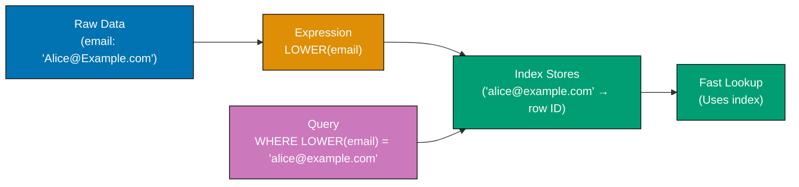

**Code**:

```sql
CREATE DATABASE example_63;
\c example_63;

CREATE TABLE users (
    id SERIAL PRIMARY KEY,
    email VARCHAR(100),
    created_at TIMESTAMP
);

INSERT INTO users (email, created_at)
SELECT
    'user' || generate_series || '@example.com',
    NOW() - (random() * 365 || ' days')::INTERVAL
FROM generate_series(1, 10000);

-- Query filtering on LOWER(email) - slow without index
EXPLAIN ANALYZE
SELECT * FROM users WHERE LOWER(email) = 'user123@example.com';
-- => Seq Scan with filter on LOWER(email)

-- Create expression index
CREATE INDEX idx_users_email_lower ON users(LOWER(email));

EXPLAIN ANALYZE
SELECT * FROM users WHERE LOWER(email) = 'user123@example.com';
-- => Index Scan using idx_users_email_lower (fast)

-- Expression index on date part
CREATE INDEX idx_users_created_year
ON users(EXTRACT(YEAR FROM created_at));

EXPLAIN ANALYZE
SELECT COUNT(*) FROM users WHERE EXTRACT(YEAR FROM created_at) = 2025;
-- => Bitmap Index Scan using idx_users_created_year

-- Expression index with multiple functions
CREATE TABLE products (
    id SERIAL PRIMARY KEY,
    name VARCHAR(200),
    price DECIMAL(10, 2)
);

INSERT INTO products (name, price)
SELECT
    'Product ' || generate_series,
    (random() * 1000)::DECIMAL(10, 2)
FROM generate_series(1, 10000);

-- Index on price rounded to nearest 100
CREATE INDEX idx_products_price_rounded
ON products(ROUND(price / 100) * 100);

EXPLAIN ANALYZE
SELECT name, price
FROM products
WHERE ROUND(price / 100) * 100 = 500;
-- => Index Scan using idx_products_price_rounded

-- Expression index on concatenation
CREATE INDEX idx_users_email_domain
ON users(SUBSTRING(email FROM POSITION('@' IN email) + 1));

SELECT COUNT(*)
FROM users
WHERE SUBSTRING(email FROM POSITION('@' IN email) + 1) = 'example.com';
-- => Uses expression index if query matches index expression exactly
```

**Key Takeaway**: Expression indexes speed up queries filtering on computed values - create indexes on LOWER(), EXTRACT(), ROUND(), or custom expressions. Query WHERE clause must match index expression exactly for index to be used.

### Example 64: Covering Indexes (INCLUDE clause)

Covering indexes include extra columns in leaf nodes using INCLUDE - queries can retrieve all needed columns from index alone (index-only scans).

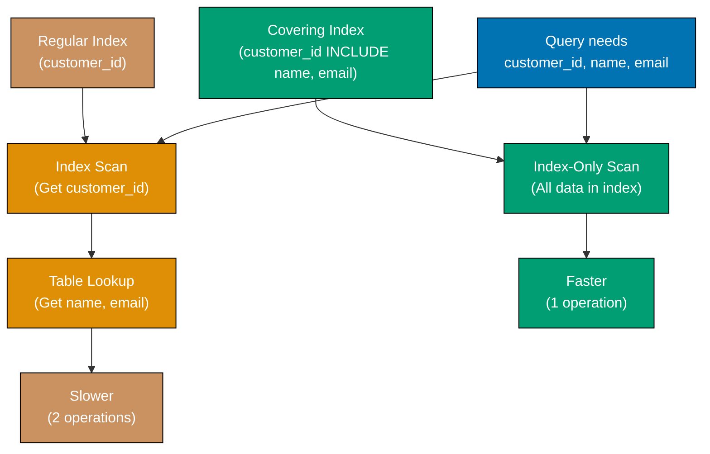

**Code**:

```sql
CREATE DATABASE example_64;
\c example_64;

CREATE TABLE orders (
    id SERIAL PRIMARY KEY,
    customer_id INTEGER,
    order_date DATE,
    total DECIMAL(10, 2),
    status VARCHAR(20)
);

INSERT INTO orders (customer_id, order_date, total, status)
SELECT
    (random() * 100)::INTEGER + 1,
    CURRENT_DATE - (random() * 365)::INTEGER,
    (random() * 1000)::DECIMAL(10, 2),
    CASE (random() * 3)::INTEGER
        WHEN 0 THEN 'pending'
        WHEN 1 THEN 'completed'
        ELSE 'cancelled'
    END
FROM generate_series(1, 10000);

-- Regular index (only indexed columns)
CREATE INDEX idx_orders_customer ON orders(customer_id);

-- Query needs to visit table for non-indexed columns
EXPLAIN ANALYZE
SELECT customer_id, total, status
FROM orders
WHERE customer_id = 42;
-- => Index Scan followed by table access for total, status

DROP INDEX idx_orders_customer;

-- Covering index with INCLUDE
CREATE INDEX idx_orders_customer_covering
ON orders(customer_id) INCLUDE (total, status);
-- => Index includes total and status in leaf nodes

EXPLAIN ANALYZE
SELECT customer_id, total, status
FROM orders
WHERE customer_id = 42;
-- => Index Only Scan (no table access needed!)

-- Covering index for ORDER BY queries
CREATE INDEX idx_orders_date_covering
ON orders(order_date DESC) INCLUDE (customer_id, total);

EXPLAIN ANALYZE
SELECT order_date, customer_id, total
FROM orders
ORDER BY order_date DESC
LIMIT 10;
-- => Index Only Scan using idx_orders_date_covering

-- Check index usage statistics
SELECT
    schemaname,
    tablename,
    indexname,
    idx_scan,
    idx_tup_read,
    idx_tup_fetch
FROM pg_stat_user_indexes
WHERE tablename = 'orders';
-- => idx_scan: number of index scans
-- => idx_tup_read: tuples read from index
-- => idx_tup_fetch: tuples fetched from table (0 for index-only scans)
```

**Key Takeaway**: Covering indexes with INCLUDE enable index-only scans - query retrieves all needed columns from index without accessing table. Use for frequently queried column combinations to avoid table lookups.

### Example 65: Index-Only Scans

Index-only scans retrieve all needed columns from index - no table access required. Requires covering index or visibility map indicating no dead tuples.

**Code**:

```sql
CREATE DATABASE example_65;
\c example_65;

CREATE TABLE products (
    id SERIAL PRIMARY KEY,
    sku VARCHAR(50) UNIQUE,
    name VARCHAR(200),
    price DECIMAL(10, 2),
    stock INTEGER
);

INSERT INTO products (sku, name, price, stock)
SELECT
    'SKU-' || LPAD(generate_series::TEXT, 8, '0'),
    'Product ' || generate_series,
    (random() * 1000)::DECIMAL(10, 2),
    (random() * 1000)::INTEGER
FROM generate_series(1, 10000);

-- Analyze to update statistics and visibility map
VACUUM ANALYZE products;

-- Query using only indexed columns
CREATE INDEX idx_products_sku ON products(sku);

EXPLAIN ANALYZE
SELECT sku FROM products WHERE sku = 'SKU-00001234';
-- => Index Only Scan using idx_products_sku

-- Query needing non-indexed column (table access required)
EXPLAIN ANALYZE
SELECT sku, name FROM products WHERE sku = 'SKU-00001234';
-- => Index Scan (must access table for name)

-- Create covering index
CREATE INDEX idx_products_sku_name ON products(sku) INCLUDE (name);

EXPLAIN ANALYZE
SELECT sku, name FROM products WHERE sku = 'SKU-00001234';
-- => Index Only Scan using idx_products_sku_name

-- Visibility map impact
-- After many UPDATE/DELETE, index-only scans may become slower
UPDATE products SET stock = stock + 1 WHERE id % 2 = 0;
-- => Creates dead tuples

EXPLAIN ANALYZE
SELECT sku FROM products WHERE sku = 'SKU-00001234';
-- => May revert to Index Scan if visibility map indicates dead tuples

-- VACUUM clears dead tuples and updates visibility map
VACUUM products;

EXPLAIN ANALYZE
SELECT sku FROM products WHERE sku = 'SKU-00001234';
-- => Index Only Scan restored

-- Check visibility map
SELECT
    pg_size_pretty(pg_relation_size('products')) AS table_size,
    pg_size_pretty(pg_relation_size('idx_products_sku')) AS index_size;

-- Force index-only scan check
SET enable_seqscan = off;
SET enable_indexscan = off;
SET enable_indexonlyscan = on;

EXPLAIN ANALYZE
SELECT sku FROM products WHERE sku LIKE 'SKU-0001%';
-- => Forces index-only scan if possible

-- Reset
RESET enable_seqscan;
RESET enable_indexscan;
RESET enable_indexonlyscan;
```

**Key Takeaway**: Index-only scans avoid table access when all needed columns are in index and visibility map confirms no dead tuples. VACUUM updates visibility map. Covering indexes enable index-only scans for more queries.

## Group 2: Query Optimization

### Example 66: Analyzing Query Plans with EXPLAIN ANALYZE

EXPLAIN ANALYZE reveals actual execution metrics - use it to identify bottlenecks, verify index usage, and measure performance improvements.

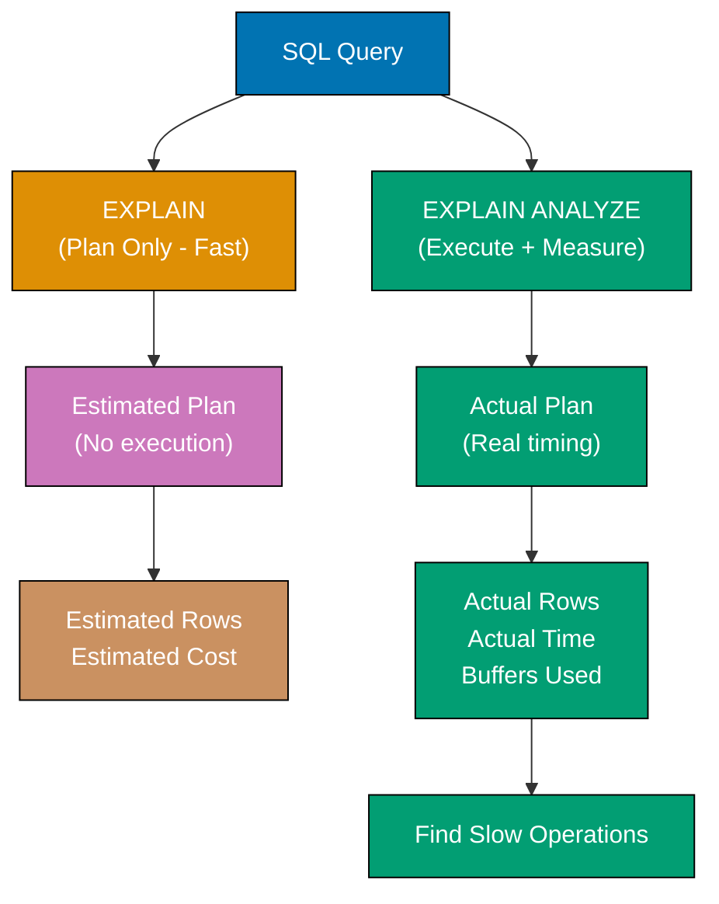

**Code**:

```sql
CREATE DATABASE example_66;
\c example_66;

CREATE TABLE orders (
    id SERIAL PRIMARY KEY,
    customer_id INTEGER,
    product_id INTEGER,
    order_date DATE,
    total DECIMAL(10, 2)
);

CREATE TABLE customers (
    id SERIAL PRIMARY KEY,
    name VARCHAR(100),
    country VARCHAR(50)
);

INSERT INTO customers (name, country)
SELECT
    'Customer ' || generate_series,
    CASE (generate_series % 3)
        WHEN 0 THEN 'USA'
        WHEN 1 THEN 'UK'
        ELSE 'Canada'
    END
FROM generate_series(1, 1000);

INSERT INTO orders (customer_id, product_id, order_date, total)
SELECT
    (random() * 1000)::INTEGER + 1,
    (random() * 100)::INTEGER + 1,
    CURRENT_DATE - (random() * 365)::INTEGER,
    (random() * 1000)::DECIMAL(10, 2)
FROM generate_series(1, 100000);

-- EXPLAIN shows estimated costs (no execution)
EXPLAIN
SELECT * FROM orders WHERE customer_id = 42;
-- => Shows: Seq Scan on orders
-- => Cost estimate: 0.00..2000.00 (startup..total)
-- => Rows estimate: ~100

-- EXPLAIN ANALYZE executes and shows actual metrics
EXPLAIN ANALYZE
SELECT * FROM orders WHERE customer_id = 42;
-- => Shows: actual time, actual rows, loops
-- => Planning Time: X ms, Execution Time: Y ms

-- EXPLAIN with BUFFERS (cache hit rate)
EXPLAIN (ANALYZE, BUFFERS)
SELECT * FROM orders WHERE customer_id = 42;
-- => Shows: shared hit (cache), read (disk), written

-- Complex query analysis
EXPLAIN ANALYZE
SELECT c.name, COUNT(*) AS order_count, SUM(o.total) AS total_spent
FROM customers c
INNER JOIN orders o ON c.id = o.customer_id
WHERE c.country = 'USA'
GROUP BY c.id, c.name
ORDER BY total_spent DESC
LIMIT 10;
-- => Shows: Hash Join or Nested Loop, HashAggregate, Sort
-- => Look for high-cost nodes

-- Create indexes and compare
CREATE INDEX idx_orders_customer ON orders(customer_id);
CREATE INDEX idx_customers_country ON customers(country);

VACUUM ANALYZE orders;
VACUUM ANALYZE customers;

EXPLAIN ANALYZE
SELECT c.name, COUNT(*) AS order_count
FROM customers c
INNER JOIN orders o ON c.id = o.customer_id
WHERE c.country = 'USA'
GROUP BY c.id, c.name;
-- => Now uses Index Scan instead of Seq Scan
-- => Compare execution time

-- JSON output for programmatic analysis
EXPLAIN (ANALYZE, FORMAT JSON)
SELECT * FROM orders WHERE customer_id = 42;
-- => Returns JSON with detailed metrics

-- Check planner statistics
SHOW default_statistics_target;
-- => Default: 100 (higher = more accurate estimates, slower ANALYZE)

-- Update statistics for better estimates
ANALYZE customers;
ANALYZE orders;
```

**Key Takeaway**: EXPLAIN ANALYZE reveals actual performance - look for Seq Scan on large tables (add indexes), high costs, slow actual times. Use BUFFERS to check cache hit rates. VACUUM ANALYZE updates statistics for accurate query planning.

### Example 67: Join Order Optimization

PostgreSQL's query planner chooses join order based on statistics - smaller tables typically joined first. Use ANALYZE to update statistics for optimal join order.

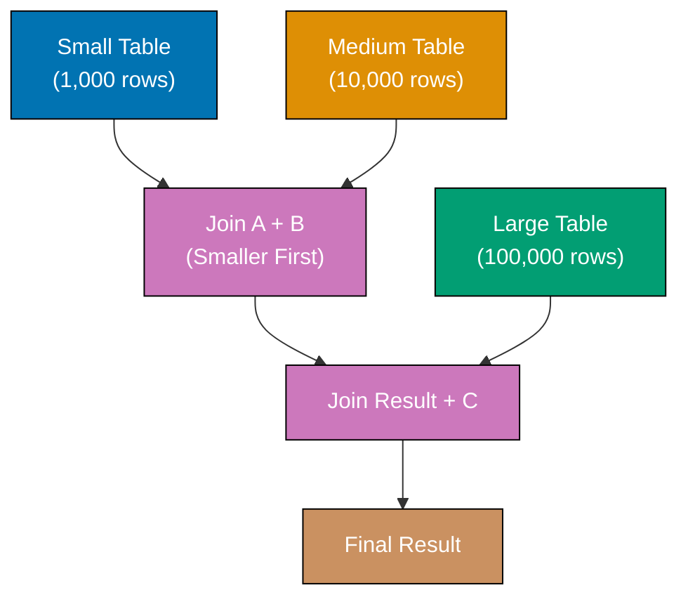

**Code**:

```sql
CREATE DATABASE example_67;
\c example_67;

CREATE TABLE small_table (
    id SERIAL PRIMARY KEY,
    value VARCHAR(100)
);

CREATE TABLE medium_table (
    id SERIAL PRIMARY KEY,
    small_id INTEGER,
    value VARCHAR(100)
);

CREATE TABLE large_table (
    id SERIAL PRIMARY KEY,
    medium_id INTEGER,
    value VARCHAR(100)
);

-- Insert different sizes
INSERT INTO small_table (value)
SELECT 'Value ' || generate_series FROM generate_series(1, 100);

INSERT INTO medium_table (small_id, value)
SELECT
    (random() * 100)::INTEGER + 1,
    'Value ' || generate_series
FROM generate_series(1, 10000);

INSERT INTO large_table (medium_id, value)
SELECT
    (random() * 10000)::INTEGER + 1,
    'Value ' || generate_series
FROM generate_series(1, 100000);

-- Update statistics
ANALYZE small_table;
ANALYZE medium_table;
ANALYZE large_table;

-- Three-way join - planner chooses optimal order
EXPLAIN ANALYZE
SELECT s.value AS small_val, m.value AS medium_val, l.value AS large_val
FROM small_table s
INNER JOIN medium_table m ON s.id = m.small_id
INNER JOIN large_table l ON m.id = l.medium_id
LIMIT 100;
-- => Planner likely joins small + medium first, then large

-- Force suboptimal join order (for comparison)
SET join_collapse_limit = 1;  -- => Disables join reordering

EXPLAIN ANALYZE
SELECT s.value, m.value, l.value
FROM large_table l
INNER JOIN medium_table m ON l.medium_id = m.id
INNER JOIN small_table s ON m.small_id = s.id
LIMIT 100;
-- => Forced to join large + medium first (slower)

RESET join_collapse_limit;

-- Optimal join order (planner decides)
EXPLAIN ANALYZE
SELECT s.value, m.value, l.value
FROM large_table l
INNER JOIN medium_table m ON l.medium_id = m.id
INNER JOIN small_table s ON m.small_id = s.id
LIMIT 100;
-- => Planner reorders to join small + medium first

-- Create indexes to enable faster join strategies
CREATE INDEX idx_medium_small ON medium_table(small_id);
CREATE INDEX idx_large_medium ON large_table(medium_id);

EXPLAIN ANALYZE
SELECT s.value, m.value, l.value
FROM small_table s
INNER JOIN medium_table m ON s.id = m.small_id
INNER JOIN large_table l ON m.id = l.medium_id
LIMIT 100;
-- => May use Hash Join or Nested Loop with indexes
```

**Key Takeaway**: PostgreSQL planner reorders joins based on table statistics - smaller tables joined first for efficiency. Run ANALYZE after data changes. Indexes enable faster join strategies (Hash Join, Merge Join, Nested Loop with index).

### Example 68: Subquery vs JOIN Performance

Subqueries can be rewritten as JOINs - JOINs are often faster because planner can optimize join order and strategies. Use EXPLAIN ANALYZE to compare.

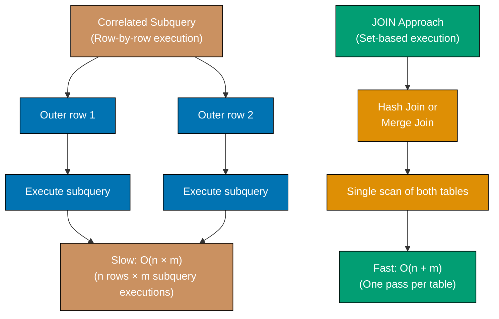

**Code**:

```sql
CREATE DATABASE example_68;
\c example_68;

CREATE TABLE customers (
    id SERIAL PRIMARY KEY,
    name VARCHAR(100)
);

CREATE TABLE orders (
    id SERIAL PRIMARY KEY,
    customer_id INTEGER,
    total DECIMAL(10, 2)
);

INSERT INTO customers (name)
SELECT 'Customer ' || generate_series FROM generate_series(1, 10000);

INSERT INTO orders (customer_id, total)
SELECT
    (random() * 10000)::INTEGER + 1,
    (random() * 1000)::DECIMAL(10, 2)
FROM generate_series(1, 100000);

CREATE INDEX idx_orders_customer ON orders(customer_id);

VACUUM ANALYZE customers;
VACUUM ANALYZE orders;

-- Subquery approach (IN with subquery)
EXPLAIN ANALYZE
SELECT name
FROM customers
WHERE id IN (SELECT customer_id FROM orders WHERE total > 500);
-- => May use Semi Join or Hash Join

-- JOIN approach (equivalent query)
EXPLAIN ANALYZE
SELECT DISTINCT c.name
FROM customers c
INNER JOIN orders o ON c.id = o.customer_id
WHERE o.total > 500;
-- => Often faster than subquery

-- Correlated subquery (slow - executes for each row)
EXPLAIN ANALYZE
SELECT
    name,
    (SELECT COUNT(*) FROM orders WHERE customer_id = customers.id) AS order_count
FROM customers;
-- => Subquery executed once per customer (slow)

-- JOIN alternative (faster)
EXPLAIN ANALYZE
SELECT c.name, COUNT(o.id) AS order_count
FROM customers c
LEFT JOIN orders o ON c.id = o.customer_id
GROUP BY c.id, c.name;
-- => Single join with aggregation (faster)

-- EXISTS vs JOIN
EXPLAIN ANALYZE
SELECT name
FROM customers c
WHERE EXISTS (SELECT 1 FROM orders WHERE customer_id = c.id AND total > 500);
-- => Semi Join strategy

EXPLAIN ANALYZE
SELECT DISTINCT c.name
FROM customers c
INNER JOIN orders o ON c.id = o.customer_id
WHERE o.total > 500;
-- => Often similar performance to EXISTS

-- NOT IN vs LEFT JOIN (careful with NULLs!)
EXPLAIN ANALYZE
SELECT name
FROM customers
WHERE id NOT IN (SELECT customer_id FROM orders WHERE customer_id IS NOT NULL);
-- => Anti Join

EXPLAIN ANALYZE
SELECT c.name
FROM customers c
LEFT JOIN orders o ON c.id = o.customer_id
WHERE o.id IS NULL;
-- => Anti Join (finds customers with no orders)
```

**Key Takeaway**: JOINs often outperform subqueries - planner can optimize join order and strategies. Correlated subqueries are especially slow (execute once per row). Use EXPLAIN ANALYZE to compare subquery vs JOIN performance.

### Example 69: Query Hints and Statistics

PostgreSQL doesn't support query hints directly, but you can influence planner with statistics targets, costs, and enable/disable settings.

**Code**:

```sql
CREATE DATABASE example_69;
\c example_69;

CREATE TABLE products (
    id SERIAL PRIMARY KEY,
    category VARCHAR(50),
    price DECIMAL(10, 2),
    name VARCHAR(200)
);

INSERT INTO products (category, price, name)
SELECT
    CASE (generate_series % 5)
        WHEN 0 THEN 'Electronics'
        WHEN 1 THEN 'Furniture'
        WHEN 2 THEN 'Kitchen'
        WHEN 3 THEN 'Books'
        ELSE 'Clothing'
    END,
    (random() * 1000)::DECIMAL(10, 2),
    'Product ' || generate_series
FROM generate_series(1, 100000);

CREATE INDEX idx_products_category ON products(category);
CREATE INDEX idx_products_price ON products(price);

-- Default statistics target (100 values sampled)
SHOW default_statistics_target;
-- => 100

-- Increase statistics for better estimates on specific column
ALTER TABLE products ALTER COLUMN category SET STATISTICS 1000;
-- => Samples 1000 distinct values for more accurate estimates

ANALYZE products;

EXPLAIN ANALYZE
SELECT * FROM products WHERE category = 'Electronics';
-- => More accurate row estimates after increased statistics

-- Influence planner with cost parameters
SHOW seq_page_cost;   -- => 1.0 (cost of sequential page read)
SHOW random_page_cost; -- => 4.0 (cost of random page read)

-- Temporarily prefer index scans
SET random_page_cost = 1.0;  -- => Make indexes more attractive

EXPLAIN ANALYZE
SELECT * FROM products WHERE price > 500;
-- => More likely to use index

RESET random_page_cost;

-- Disable specific plan types (for testing)
SET enable_seqscan = off;  -- => Force index usage

EXPLAIN ANALYZE
SELECT * FROM products WHERE category = 'Books';
-- => Forced to use index even if seq scan is cheaper

RESET enable_seqscan;

-- Check actual vs estimated rows
EXPLAIN ANALYZE
SELECT COUNT(*) FROM products WHERE price BETWEEN 100 AND 200;
-- => Compare "rows=X" (estimate) vs "actual rows=Y"

-- If estimates are wrong, increase statistics or ANALYZE
ANALYZE products;

-- View column statistics
SELECT
    attname AS column_name,
    n_distinct,
    correlation
FROM pg_stats
WHERE tablename = 'products';
-- => n_distinct: estimated unique values
-- => correlation: physical vs logical order (-1 to 1)

-- Reset statistics target to default
ALTER TABLE products ALTER COLUMN category SET STATISTICS -1;
```

**Key Takeaway**: PostgreSQL planner uses statistics for decisions - increase statistics*target for more accurate estimates on high-cardinality columns. Adjust cost parameters (random_page_cost, seq_page_cost) to influence planner. Use enable*\* settings to test different plan types.

### Example 70: Vacuum and Analyze

VACUUM reclaims space from dead tuples, ANALYZE updates statistics for query planner. Both essential for maintaining performance.

**Code**:

```sql
CREATE DATABASE example_70;
\c example_70;

CREATE TABLE logs (
    id SERIAL PRIMARY KEY,
    message TEXT,
    created_at TIMESTAMP DEFAULT NOW()
);

-- Insert initial data
INSERT INTO logs (message)
SELECT 'Log entry ' || generate_series
FROM generate_series(1, 100000);

-- Check table size
SELECT pg_size_pretty(pg_total_relation_size('logs')) AS table_size;
-- => Shows total size including indexes

-- Update many rows (creates dead tuples)
UPDATE logs SET message = 'Updated: ' || message WHERE id % 2 = 0;
-- => 50,000 dead tuples created

-- Table size increased (dead tuples not yet reclaimed)
SELECT pg_size_pretty(pg_total_relation_size('logs')) AS table_size;
-- => Larger than before

-- VACUUM reclaims space from dead tuples
VACUUM logs;

SELECT pg_size_pretty(pg_total_relation_size('logs')) AS table_size;
-- => Size reduced (dead tuples reclaimed)

-- VACUUM FULL rebuilds table (more aggressive, locks table)
VACUUM FULL logs;
-- => Reclaims maximum space, but locks table during operation

-- ANALYZE updates statistics
DELETE FROM logs WHERE id % 3 = 0;
-- => Deletes 1/3 of rows

-- Before ANALYZE: planner uses old statistics
EXPLAIN
SELECT * FROM logs WHERE id < 1000;
-- => May show inaccurate row estimates

-- Update statistics
ANALYZE logs;

-- After ANALYZE: accurate estimates
EXPLAIN
SELECT * FROM logs WHERE id < 1000;
-- => Shows accurate row estimates

-- VACUUM ANALYZE (both operations)
VACUUM ANALYZE logs;

-- Check vacuum statistics
SELECT
    relname,
    last_vacuum,
    last_autovacuum,
    last_analyze,
    last_autoanalyze,
    n_dead_tup
FROM pg_stat_user_tables
WHERE relname = 'logs';
-- => Shows when last vacuumed/analyzed

-- Autovacuum settings (automatic maintenance)
SHOW autovacuum;  -- => on (enabled by default)

-- View autovacuum thresholds
SELECT
    name,
    setting
FROM pg_settings
WHERE name LIKE 'autovacuum%';

-- Manual vacuum with verbose output
VACUUM VERBOSE logs;
-- => Shows detailed vacuum statistics

-- Vacuum specific columns (analyze only)
ANALYZE logs (message);
-- => Updates statistics for message column only
```

**Key Takeaway**: VACUUM reclaims dead tuple space, ANALYZE updates statistics - run both regularly for performance. Autovacuum handles this automatically in production. VACUUM FULL rebuilds table but locks it. Run VACUUM ANALYZE after bulk changes (large UPDATEs, DELETEs).

## Group 3: Advanced Features

### Example 71: Full-Text Search with tsvector

Full-text search finds documents matching queries - tsvector stores searchable text, tsquery represents search queries. Much faster than LIKE for text searches.

**Code**:

```sql
CREATE DATABASE example_71;
\c example_71;

CREATE TABLE articles (
    id SERIAL PRIMARY KEY,
    title VARCHAR(200),
    content TEXT,
    search_vector tsvector  -- => Stores searchable tokens
);

INSERT INTO articles (title, content)
VALUES
    ('PostgreSQL Tutorial', 'Learn PostgreSQL database fundamentals including tables indexes and queries'),
    ('Advanced SQL Techniques', 'Master complex SQL queries with window functions and CTEs'),
    ('Database Design Patterns', 'Best practices for designing scalable database schemas');

-- Create tsvector from title and content
UPDATE articles
SET search_vector = to_tsvector('english', title || ' ' || content);
-- => Converts text to searchable tokens, applies stemming

-- Simple text search
SELECT title
FROM articles
WHERE search_vector @@ to_tsquery('english', 'database');
-- => Returns all articles containing 'database' (or stemmed variants)

-- AND query
SELECT title
FROM articles
WHERE search_vector @@ to_tsquery('english', 'postgresql & queries');
-- => Articles containing both 'postgresql' AND 'queries'
-- => PostgreSQL Tutorial

-- OR query
SELECT title
FROM articles
WHERE search_vector @@ to_tsquery('english', 'postgresql | design');
-- => Articles containing 'postgresql' OR 'design'

-- NOT query
SELECT title
FROM articles
WHERE search_vector @@ to_tsquery('english', 'database & !postgresql');
-- => Articles with 'database' but NOT 'postgresql'
-- => Database Design Patterns

-- Phrase search (words in sequence)
SELECT title
FROM articles
WHERE search_vector @@ to_tsquery('english', 'database <-> design');
-- => 'database' followed immediately by 'design'

-- Ranking results by relevance
SELECT
    title,
    ts_rank(search_vector, to_tsquery('english', 'database')) AS rank
FROM articles
WHERE search_vector @@ to_tsquery('english', 'database')
ORDER BY rank DESC;
-- => Orders by relevance (higher rank = more relevant)

-- Highlighting search matches
SELECT
    title,
    ts_headline('english', content, to_tsquery('english', 'database'), 'MaxWords=20, MinWords=10') AS snippet
FROM articles
WHERE search_vector @@ to_tsquery('english', 'database');
-- => Shows excerpt with search term highlighted

-- Create GIN index for fast full-text search
CREATE INDEX idx_articles_search ON articles USING GIN(search_vector);

-- Auto-update search_vector with trigger
CREATE FUNCTION articles_search_trigger()
RETURNS TRIGGER AS $$
BEGIN
    NEW.search_vector := to_tsvector('english', NEW.title || ' ' || NEW.content);
    RETURN NEW;
END;
$$ LANGUAGE plpgsql;

CREATE TRIGGER tsvector_update
BEFORE INSERT OR UPDATE ON articles
FOR EACH ROW
EXECUTE FUNCTION articles_search_trigger();

-- Insert new article (search_vector auto-updated)
INSERT INTO articles (title, content)
VALUES ('PostgreSQL Performance', 'Optimize PostgreSQL for production workloads');

SELECT title, search_vector FROM articles WHERE title = 'PostgreSQL Performance';
-- => search_vector automatically populated
```

**Key Takeaway**: Full-text search with tsvector/tsquery enables fast, flexible text searches - supports AND/OR/NOT operators, phrase searches, ranking, and highlighting. Create GIN indexes for fast searches. Use triggers to auto-update search_vector on changes.

### Example 72: Table Partitioning (Range Partitioning)

Range partitioning splits tables by value ranges (dates, numbers) - improves query performance by scanning only relevant partitions.

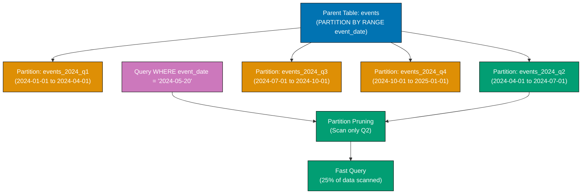

**Code**:

```sql
CREATE DATABASE example_72;
\c example_72;

-- Create partitioned table (parent)
CREATE TABLE events (
    id SERIAL,
    event_name VARCHAR(200),
    event_date DATE NOT NULL,
    data JSONB
) PARTITION BY RANGE (event_date);
-- => Partitioned by event_date

-- Create partitions (child tables)
CREATE TABLE events_2024_q1 PARTITION OF events
FOR VALUES FROM ('2024-01-01') TO ('2024-04-01');

CREATE TABLE events_2024_q2 PARTITION OF events
FOR VALUES FROM ('2024-04-01') TO ('2024-07-01');

CREATE TABLE events_2024_q3 PARTITION OF events
FOR VALUES FROM ('2024-07-01') TO ('2024-10-01');

CREATE TABLE events_2024_q4 PARTITION OF events
FOR VALUES FROM ('2024-10-01') TO ('2025-01-01');

CREATE TABLE events_2025_q1 PARTITION OF events
FOR VALUES FROM ('2025-01-01') TO ('2025-04-01');

-- Insert data (automatically routed to correct partition)
INSERT INTO events (event_name, event_date, data)
VALUES
    ('Event A', '2024-02-15', '{"type": "conference"}'),
    ('Event B', '2024-05-20', '{"type": "webinar"}'),
    ('Event C', '2024-08-10', '{"type": "workshop"}'),
    ('Event D', '2024-11-25', '{"type": "meetup"}'),
    ('Event E', '2025-01-15', '{"type": "conference"}');

-- Query scans only relevant partition
EXPLAIN ANALYZE
SELECT * FROM events WHERE event_date = '2024-05-20';
-- => Scans only events_2024_q2 partition (partition pruning)

-- Query spanning multiple partitions
EXPLAIN ANALYZE
SELECT * FROM events WHERE event_date >= '2024-06-01' AND event_date < '2024-12-01';
-- => Scans events_2024_q2, events_2024_q3, events_2024_q4

-- Create indexes on partitions
CREATE INDEX idx_events_2024_q1_date ON events_2024_q1(event_date);
CREATE INDEX idx_events_2024_q2_date ON events_2024_q2(event_date);
-- => Indexes created on each partition

-- Attach existing table as partition
CREATE TABLE events_2025_q2 (
    LIKE events INCLUDING ALL
);

INSERT INTO events_2025_q2 (event_name, event_date, data)
VALUES ('Event F', '2025-05-10', '{"type": "conference"}');

ALTER TABLE events ATTACH PARTITION events_2025_q2
FOR VALUES FROM ('2025-04-01') TO ('2025-07-01');

-- Detach partition (becomes standalone table)
ALTER TABLE events DETACH PARTITION events_2025_q2;

-- View partition information
SELECT
    parent.relname AS parent_table,
    child.relname AS partition_name,
    pg_get_expr(child.relpartbound, child.oid) AS partition_bounds
FROM pg_inherits
JOIN pg_class parent ON pg_inherits.inhparent = parent.oid
JOIN pg_class child ON pg_inherits.inhrelid = child.oid
WHERE parent.relname = 'events';
```

**Key Takeaway**: Range partitioning splits tables by value ranges - PostgreSQL automatically routes inserts to correct partitions and prunes partitions during queries. Essential for large time-series data (logs, events, metrics) to improve query performance and enable partition-level maintenance.

### Example 73: Table Partitioning (List Partitioning)

List partitioning splits tables by discrete values (countries, categories, statuses) - useful when data naturally groups by specific values.

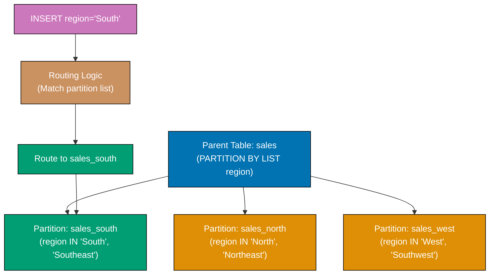

**Code**:

```sql
CREATE DATABASE example_73;
\c example_73;

-- Create partitioned table by list
CREATE TABLE orders (
    id SERIAL,
    order_number VARCHAR(50),
    customer_id INTEGER,
    region VARCHAR(50) NOT NULL,
    total DECIMAL(10, 2)
) PARTITION BY LIST (region);

-- Create partitions for each region
CREATE TABLE orders_north_america PARTITION OF orders
FOR VALUES IN ('USA', 'Canada', 'Mexico');

CREATE TABLE orders_europe PARTITION OF orders
FOR VALUES IN ('UK', 'France', 'Germany', 'Spain');

CREATE TABLE orders_asia PARTITION OF orders
FOR VALUES IN ('Japan', 'China', 'India', 'Singapore');

CREATE TABLE orders_other PARTITION OF orders
DEFAULT;
-- => DEFAULT partition catches values not in other partitions

-- Insert data
INSERT INTO orders (order_number, customer_id, region, total)
VALUES
    ('ORD-001', 1, 'USA', 150.00),
    ('ORD-002', 2, 'UK', 200.00),
    ('ORD-003', 3, 'Japan', 300.00),
    ('ORD-004', 4, 'Brazil', 100.00);  -- => Goes to orders_other

-- Query specific partition
EXPLAIN ANALYZE
SELECT * FROM orders WHERE region = 'USA';
-- => Scans only orders_north_america partition

-- Multi-value query
EXPLAIN ANALYZE
SELECT * FROM orders WHERE region IN ('UK', 'France');
-- => Scans only orders_europe partition

-- Check data distribution across partitions
SELECT
    'orders_north_america' AS partition,
    COUNT(*) AS row_count
FROM orders_north_america
UNION ALL
SELECT 'orders_europe', COUNT(*) FROM orders_europe
UNION ALL
SELECT 'orders_asia', COUNT(*) FROM orders_asia
UNION ALL
SELECT 'orders_other', COUNT(*) FROM orders_other;

-- Create local indexes on partitions
CREATE INDEX idx_orders_na_customer ON orders_north_america(customer_id);
CREATE INDEX idx_orders_eu_customer ON orders_europe(customer_id);
CREATE INDEX idx_orders_asia_customer ON orders_asia(customer_id);

-- Partition-wise join (if both tables partitioned the same way)
CREATE TABLE customers (
    id SERIAL,
    name VARCHAR(100),
    region VARCHAR(50) NOT NULL
) PARTITION BY LIST (region);

CREATE TABLE customers_north_america PARTITION OF customers
FOR VALUES IN ('USA', 'Canada', 'Mexico');

CREATE TABLE customers_europe PARTITION OF customers
FOR VALUES IN ('UK', 'France', 'Germany', 'Spain');

-- Enable partition-wise join
SET enable_partitionwise_join = on;

EXPLAIN
SELECT o.order_number, c.name
FROM orders o
INNER JOIN customers c ON o.customer_id = c.id AND o.region = c.region;
-- => May show partition-wise join (joins matching partitions)
```

**Key Takeaway**: List partitioning splits tables by discrete values - use for naturally grouped data (regions, categories, statuses). DEFAULT partition catches unmatched values. Partition-wise joins optimize joins between similarly partitioned tables.

### Example 74: Foreign Data Wrappers

Foreign Data Wrappers (FDW) enable querying external data sources (other PostgreSQL servers, MySQL, files) as if they were local tables.

**Code**:

```sql
CREATE DATABASE example_74;
\c example_74;

-- Enable postgres_fdw extension
CREATE EXTENSION postgres_fdw;

-- Create foreign server (connection to another PostgreSQL instance)
CREATE SERVER remote_server
FOREIGN DATA WRAPPER postgres_fdw
OPTIONS (host 'localhost', port '5432', dbname 'example_3');
-- => Points to another database (example_3 from earlier)

-- Create user mapping (authentication)
CREATE USER MAPPING FOR postgres
SERVER remote_server
OPTIONS (user 'postgres', password 'password');

-- Create foreign table (maps to remote table)
CREATE FOREIGN TABLE remote_users (
    id INTEGER,
    name VARCHAR(100),
    email VARCHAR(100),
    age INTEGER
) SERVER remote_server
OPTIONS (schema_name 'public', table_name 'users');
-- => Accesses users table from example_3 database

-- Query foreign table (appears like local table)
SELECT * FROM remote_users;
-- => Data fetched from remote database

-- Join local and foreign tables
CREATE TABLE local_orders (
    id SERIAL PRIMARY KEY,
    user_id INTEGER,
    total DECIMAL(10, 2)
);

INSERT INTO local_orders (user_id, total)
VALUES (1, 150.00), (2, 200.00), (3, 300.00);

SELECT
    r.name,
    r.email,
    l.total
FROM remote_users r
INNER JOIN local_orders l ON r.id = l.user_id;
-- => Joins remote and local data

-- EXPLAIN shows foreign scan
EXPLAIN ANALYZE
SELECT * FROM remote_users WHERE age > 25;
-- => Foreign Scan on remote_users
-- => Shows remote SQL pushed down to foreign server

-- Import foreign schema (auto-create foreign tables)
CREATE SCHEMA remote_schema;

IMPORT FOREIGN SCHEMA public
FROM SERVER remote_server
INTO remote_schema;
-- => Automatically creates foreign tables for all tables in remote public schema

-- List foreign tables
SELECT
    foreign_table_name,
    foreign_server_name
FROM information_schema.foreign_tables;

-- Performance considerations
-- => Foreign scans involve network latency
-- => Use WHERE clauses to push filtering to remote server
-- => Avoid large result sets across network

-- Drop foreign table
DROP FOREIGN TABLE remote_users;

-- Drop server
DROP SERVER remote_server CASCADE;
-- => CASCADE drops dependent user mappings and foreign tables
```

**Key Takeaway**: Foreign Data Wrappers enable querying remote databases as local tables - useful for data integration, federation, and migrations. WHERE clauses pushed to remote server for efficiency. Network latency impacts performance.

### Example 75: Logical Replication Basics

Logical replication replicates data changes (INSERT/UPDATE/DELETE) to subscriber databases - enables selective replication, upgrades, and multi-master patterns.

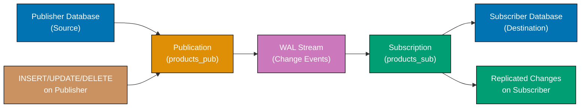

**Code**:

```sql
-- Note: Logical replication requires two PostgreSQL instances
-- This example shows setup on single instance with different databases

-- PUBLISHER SETUP (source database)
CREATE DATABASE publisher_db;
\c publisher_db;

CREATE TABLE products (
    id SERIAL PRIMARY KEY,
    name VARCHAR(200),
    price DECIMAL(10, 2)
);

INSERT INTO products (name, price)
VALUES ('Laptop', 999.99), ('Mouse', 29.99);

-- Enable logical replication
ALTER SYSTEM SET wal_level = logical;
-- => Requires PostgreSQL restart

-- Create publication (defines what to replicate)
CREATE PUBLICATION products_pub FOR TABLE products;
-- => Publishes all changes to products table

-- View publications
SELECT * FROM pg_publication;

-- SUBSCRIBER SETUP (destination database)
CREATE DATABASE subscriber_db;
\c subscriber_db;

-- Create same table structure
CREATE TABLE products (
    id SERIAL PRIMARY KEY,
    name VARCHAR(200),
    price DECIMAL(10, 2)
);

-- Create subscription (connects to publisher)
CREATE SUBSCRIPTION products_sub
CONNECTION 'host=localhost port=5432 dbname=publisher_db user=postgres password=password'
PUBLICATION products_pub;
-- => Starts replication from publisher

-- Initial data synced automatically
SELECT * FROM products;
-- => Shows Laptop and Mouse (copied from publisher)

-- Test replication
\c publisher_db;

INSERT INTO products (name, price)
VALUES ('Keyboard', 79.99);

UPDATE products SET price = 899.99 WHERE name = 'Laptop';

\c subscriber_db;

-- Wait a moment for replication
SELECT * FROM products;
-- => Shows Keyboard (inserted), Laptop price updated to 899.99

-- Monitor replication
SELECT * FROM pg_stat_subscription;
-- => Shows replication status, lag, last message

-- Replication lag
SELECT
    slot_name,
    confirmed_flush_lsn,
    pg_current_wal_lsn(),
    pg_current_wal_lsn() - confirmed_flush_lsn AS lag
FROM pg_replication_slots;

-- Disable subscription
ALTER SUBSCRIPTION products_sub DISABLE;

-- Drop subscription
DROP SUBSCRIPTION products_sub;

-- Drop publication (on publisher)
\c publisher_db;
DROP PUBLICATION products_pub;
```

**Key Takeaway**: Logical replication replicates table changes to subscribers - enables selective replication (specific tables), zero-downtime migrations, and read replicas. Requires wal_level = logical. Monitor lag with pg_stat_subscription.

## Group 4: Administration

### Example 76: User Roles and Permissions

Roles manage authentication and authorization - create roles for users, grant specific permissions, follow principle of least privilege.

**Code**:

```sql
CREATE DATABASE example_76;
\c example_76;

-- Create roles (users)
CREATE ROLE alice LOGIN PASSWORD 'alice_password';
CREATE ROLE bob LOGIN PASSWORD 'bob_password';
CREATE ROLE charlie LOGIN PASSWORD 'charlie_password';
-- => LOGIN allows connection, PASSWORD sets authentication

-- Create group role
CREATE ROLE developers;
CREATE ROLE analysts;

-- Add users to groups
GRANT developers TO alice, bob;
GRANT analysts TO charlie;
-- => alice and bob inherit developers permissions

-- Create table
CREATE TABLE employees (
    id SERIAL PRIMARY KEY,
    name VARCHAR(100),
    salary DECIMAL(10, 2)
);

-- Grant table permissions
GRANT SELECT ON employees TO analysts;
-- => charlie (analyst) can SELECT but not INSERT/UPDATE/DELETE

GRANT SELECT, INSERT, UPDATE ON employees TO developers;
-- => alice and bob can read and modify, but not delete

-- Test permissions
SET ROLE charlie;
SELECT * FROM employees;  -- => Success
INSERT INTO employees (name, salary) VALUES ('Test', 50000);  -- => ERROR: permission denied

RESET ROLE;

-- Grant all privileges on table
GRANT ALL ON employees TO alice;
-- => alice has all permissions on employees

-- Grant schema permissions
CREATE SCHEMA reporting;
GRANT USAGE ON SCHEMA reporting TO analysts;
-- => charlie can access reporting schema

-- Grant database-wide permissions
GRANT CONNECT ON DATABASE example_76 TO alice;

-- Default privileges (auto-grant on future objects)
ALTER DEFAULT PRIVILEGES IN SCHEMA public
GRANT SELECT ON TABLES TO analysts;
-- => Future tables automatically grant SELECT to analysts

-- View role permissions
SELECT
    grantee,
    privilege_type,
    table_name
FROM information_schema.table_privileges
WHERE table_schema = 'public';

-- Revoke permissions
REVOKE INSERT ON employees FROM developers;

-- View role memberships
SELECT
    r.rolname AS role,
    m.rolname AS member
FROM pg_roles r
JOIN pg_auth_members am ON r.oid = am.roleid
JOIN pg_roles m ON am.member = m.oid;

-- Drop role
DROP ROLE charlie;
-- => ERROR if charlie owns objects or has privileges

-- Reassign ownership before dropping
REASSIGN OWNED BY charlie TO postgres;
DROP OWNED BY charlie;
DROP ROLE charlie;
```

**Key Takeaway**: Roles manage users and permissions - create roles with LOGIN for users, group roles without LOGIN for permission sets. GRANT specific privileges (SELECT, INSERT, UPDATE, DELETE), follow least privilege. Use ALTER DEFAULT PRIVILEGES for automatic grants on future objects.

### Example 77: Row-Level Security (RLS)

Row-Level Security restricts which rows users can see or modify - enables multi-tenant systems, data isolation, and fine-grained access control.

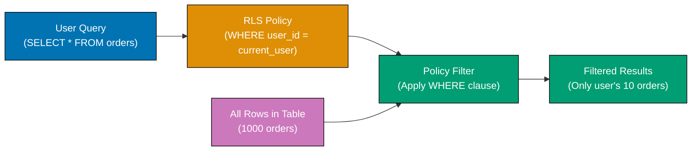

**Code**:

```sql
CREATE DATABASE example_77;
\c example_77;

CREATE TABLE documents (
    id SERIAL PRIMARY KEY,
    title VARCHAR(200),
    content TEXT,
    owner VARCHAR(100),
    is_public BOOLEAN DEFAULT false
);

-- Create test users
CREATE ROLE alice LOGIN PASSWORD 'alice_password';
CREATE ROLE bob LOGIN PASSWORD 'bob_password';

GRANT SELECT, INSERT, UPDATE, DELETE ON documents TO alice, bob;
GRANT USAGE, SELECT ON SEQUENCE documents_id_seq TO alice, bob;

-- Insert test data
INSERT INTO documents (title, content, owner, is_public)
VALUES
    ('Alice Document 1', 'Private content', 'alice', false),
    ('Alice Document 2', 'Public content', 'alice', true),
    ('Bob Document 1', 'Bob private', 'bob', false);

-- Enable row-level security on table
ALTER TABLE documents ENABLE ROW LEVEL SECURITY;

-- Create policy: users can see their own documents
CREATE POLICY user_documents ON documents
FOR SELECT
USING (owner = current_user);
-- => Users see only rows where owner matches their username

-- Test as alice
SET ROLE alice;
SELECT * FROM documents;
-- => Returns only Alice's documents

RESET ROLE;

-- Create policy: users can see public documents
CREATE POLICY public_documents ON documents
FOR SELECT
USING (is_public = true);
-- => Multiple policies combine with OR

SET ROLE alice;
SELECT * FROM documents;
-- => Returns Alice's documents + public documents (Bob's public doc)

RESET ROLE;

-- Create policy for INSERT (users can only insert as themselves)
CREATE POLICY user_insert ON documents
FOR INSERT
WITH CHECK (owner = current_user);

SET ROLE bob;
INSERT INTO documents (title, content, owner)
VALUES ('Bob Document 2', 'New doc', 'bob');
-- => Success

INSERT INTO documents (title, content, owner)
VALUES ('Fake Alice Doc', 'Impersonation', 'alice');
-- => ERROR: policy violation (WITH CHECK fails)

RESET ROLE;

-- Create policy for UPDATE (users can update their own docs)
CREATE POLICY user_update ON documents
FOR UPDATE
USING (owner = current_user)
WITH CHECK (owner = current_user);
-- => USING: can update, WITH CHECK: new values must satisfy

-- Create policy for DELETE
CREATE POLICY user_delete ON documents
FOR DELETE
USING (owner = current_user);

-- Bypass RLS for superuser
SET ROLE alice;
SELECT * FROM documents;  -- => Sees own + public docs

RESET ROLE;
SELECT * FROM documents;  -- => Superuser sees all rows (bypasses RLS)

-- Disable RLS for specific role
ALTER TABLE documents FORCE ROW LEVEL SECURITY;
-- => Even superusers respect RLS (unless BYPASSRLS role attribute)

-- View policies
SELECT
    schemaname,
    tablename,
    policyname,
    permissive,
    roles,
    qual,
    with_check
FROM pg_policies
WHERE tablename = 'documents';

-- Drop policies
DROP POLICY user_documents ON documents;
DROP POLICY public_documents ON documents;
```

**Key Takeaway**: Row-Level Security enforces row-level access control - create policies with USING (filter visible rows) and WITH CHECK (validate changes). Essential for multi-tenant applications, secure data isolation, and compliance requirements.

### Example 78: Backup with pg_dump

pg_dump creates logical backups of databases - exports schema and data as SQL or custom format for restoration.

**Code**:

```sql
CREATE DATABASE example_78;
\c example_78;

CREATE TABLE users (
    id SERIAL PRIMARY KEY,
    name VARCHAR(100),
    email VARCHAR(100)
);

INSERT INTO users (name, email)
VALUES
    ('Alice', 'alice@example.com'),
    ('Bob', 'bob@example.com'),
    ('Charlie', 'charlie@example.com');

-- Exit psql and run pg_dump from shell
```

**Shell commands**:

```bash
# Backup entire database (SQL format)
docker exec postgres-tutorial pg_dump -U postgres example_78 > example_78_backup.sql
# => Creates SQL file with CREATE TABLE and INSERT statements

# Backup in custom format (compressed, faster restore)
docker exec postgres-tutorial pg_dump -U postgres -Fc example_78 > example_78_backup.custom
# => Binary format, supports parallel restore

# Backup in directory format (parallel dump)
docker exec postgres-tutorial pg_dump -U postgres -Fd example_78 -f example_78_backup_dir
# => Creates directory with multiple files

# Backup specific table
docker exec postgres-tutorial pg_dump -U postgres -t users example_78 > users_backup.sql
# => Only users table

# Backup schema only (no data)
docker exec postgres-tutorial pg_dump -U postgres -s example_78 > schema_only.sql
# => CREATE statements without INSERT

# Backup data only (no schema)
docker exec postgres-tutorial pg_dump -U postgres -a example_78 > data_only.sql
# => INSERT statements without CREATE

# Backup all databases
docker exec postgres-tutorial pg_dumpall -U postgres > all_databases.sql
# => Includes all databases, roles, and tablespaces

# Exclude specific table
docker exec postgres-tutorial pg_dump -U postgres -T logs example_78 > backup_no_logs.sql
# => Excludes 'logs' table

# Compressed SQL backup
docker exec postgres-tutorial pg_dump -U postgres example_78 | gzip > example_78_backup.sql.gz
# => Compressed SQL file
```

**Restore from backup**:

```bash
# Restore SQL format
docker exec -i postgres-tutorial psql -U postgres -d postgres < example_78_backup.sql

# Restore custom format (with pg_restore)
docker exec -i postgres-tutorial pg_restore -U postgres -d example_78_restored example_78_backup.custom

# Restore with parallel jobs (custom/directory format only)
docker exec postgres-tutorial pg_restore -U postgres -d example_78_restored -j 4 example_78_backup.custom
# => 4 parallel jobs for faster restore
```

**Key Takeaway**: pg_dump creates logical backups - use SQL format for readability, custom format for compression and faster restore. pg_dumpall backs up all databases. Custom/directory formats support parallel restore with `-j`. Schedule regular backups for disaster recovery.

### Example 79: Restore with pg_restore

pg_restore restores databases from custom or directory format backups - supports selective restore, parallel jobs, and flexible options.

**Code**:

```bash
# List contents of backup file
docker exec postgres-tutorial pg_restore -l example_78_backup.custom
# => Shows all objects in backup (tables, indexes, constraints)

# Restore entire database (custom format)
docker exec postgres-tutorial createdb -U postgres example_78_restored
docker exec postgres-tutorial pg_restore -U postgres -d example_78_restored example_78_backup.custom
# => Restores all objects to example_78_restored

# Restore with clean (drop existing objects first)
docker exec postgres-tutorial pg_restore -U postgres -d example_78_restored --clean example_78_backup.custom
# => Drops existing objects before restore

# Restore with create (create database)
docker exec postgres-tutorial pg_restore -U postgres -C -d postgres example_78_backup.custom
# => Creates database, then restores

# Restore specific table
docker exec postgres-tutorial pg_restore -U postgres -d example_78_restored -t users example_78_backup.custom
# => Restores only 'users' table

# Restore schema only
docker exec postgres-tutorial pg_restore -U postgres -d example_78_restored -s example_78_backup.custom
# => Only CREATE statements (no data)

# Restore data only
docker exec postgres-tutorial pg_restore -U postgres -d example_78_restored -a example_78_backup.custom
# => Only INSERT statements (assumes schema exists)

# Restore with parallel jobs (faster)
docker exec postgres-tutorial pg_restore -U postgres -d example_78_restored -j 4 example_78_backup.custom
# => 4 parallel workers

# Restore to different database name
docker exec postgres-tutorial createdb -U postgres production_copy
docker exec postgres-tutorial pg_restore -U postgres -d production_copy example_78_backup.custom
# => Restores to production_copy

# Generate SQL from custom backup (without restoring)
docker exec postgres-tutorial pg_restore -f restore.sql example_78_backup.custom
# => Creates SQL file from custom backup

# Verbose output
docker exec postgres-tutorial pg_restore -U postgres -d example_78_restored -v example_78_backup.custom
# => Shows progress during restore

# Exit on error
docker exec postgres-tutorial pg_restore -U postgres -d example_78_restored -e example_78_backup.custom
# => Stops on first error (default continues)
```

**Key Takeaway**: pg_restore restores from custom/directory format backups - supports selective restore (tables, schema, data), parallel jobs (`-j`), and flexible options. Use `--clean` to drop existing objects, `-C` to create database. List contents with `-l` before restoring.

### Example 80: Monitoring with pg_stat Views

PostgreSQL provides pg*stat*\* views for monitoring activity, performance, and resource usage - essential for production database health.

**Code**:

```sql
CREATE DATABASE example_80;
\c example_80;

-- Current activity (active queries)
SELECT
    pid,
    usename AS username,
    application_name,
    client_addr,
    state,
    query,
    query_start,
    NOW() - query_start AS query_duration
FROM pg_stat_activity
WHERE state != 'idle'
ORDER BY query_start;
-- => Shows active queries with duration

-- Database statistics
SELECT
    datname AS database,
    numbackends AS connections,
    xact_commit AS commits,
    xact_rollback AS rollbacks,
    blks_read AS disk_blocks_read,
    blks_hit AS cache_blocks_hit,
    ROUND(100.0 * blks_hit / (blks_hit + blks_read), 2) AS cache_hit_ratio
FROM pg_stat_database
WHERE datname = current_database();
-- => Cache hit ratio (higher = better, aim for >95%)

-- Table statistics
SELECT
    schemaname,
    relname AS table_name,
    seq_scan AS sequential_scans,
    seq_tup_read AS rows_seq_scanned,
    idx_scan AS index_scans,
    idx_tup_fetch AS rows_index_fetched,
    n_tup_ins AS inserts,
    n_tup_upd AS updates,
    n_tup_del AS deletes,
    n_live_tup AS live_rows,
    n_dead_tup AS dead_rows,
    last_vacuum,
    last_autovacuum,
    last_analyze,
    last_autoanalyze
FROM pg_stat_user_tables
ORDER BY seq_scan DESC;
-- => High seq_scan on large tables may need indexes
-- => High dead_rows may need VACUUM

-- Index usage statistics
SELECT
    schemaname,
    tablename,
    indexname,
    idx_scan AS index_scans,
    idx_tup_read AS tuples_read,
    idx_tup_fetch AS tuples_fetched,
    pg_size_pretty(pg_relation_size(indexrelid)) AS index_size
FROM pg_stat_user_indexes
ORDER BY idx_scan ASC;
-- => idx_scan = 0 indicates unused index (consider dropping)

-- Slow queries (requires pg_stat_statements extension)
CREATE EXTENSION IF NOT EXISTS pg_stat_statements;

SELECT
    query,
    calls,
    ROUND(total_exec_time::numeric, 2) AS total_time_ms,
    ROUND(mean_exec_time::numeric, 2) AS avg_time_ms,
    ROUND(100.0 * shared_blks_hit / NULLIF(shared_blks_hit + shared_blks_read, 0), 2) AS cache_hit_ratio
FROM pg_stat_statements
ORDER BY total_exec_time DESC
LIMIT 10;
-- => Top 10 slowest queries by total time

-- Lock monitoring
SELECT
    locktype,
    relation::regclass AS table_name,
    mode,
    granted,
    pid,
    pg_blocking_pids(pid) AS blocking_pids
FROM pg_locks
WHERE NOT granted;
-- => Shows locks waiting to be granted, and which PIDs are blocking

-- Connection limits
SELECT
    COUNT(*) AS current_connections,
    (SELECT setting::integer FROM pg_settings WHERE name = 'max_connections') AS max_connections,
    ROUND(100.0 * COUNT(*) / (SELECT setting::integer FROM pg_settings WHERE name = 'max_connections'), 2) AS percent_used
FROM pg_stat_activity;

-- Database size
SELECT
    pg_size_pretty(pg_database_size(current_database())) AS database_size;

-- Table sizes
SELECT
    relname AS table_name,
    pg_size_pretty(pg_total_relation_size(relid)) AS total_size,
    pg_size_pretty(pg_relation_size(relid)) AS table_size,
    pg_size_pretty(pg_total_relation_size(relid) - pg_relation_size(relid)) AS index_size
FROM pg_stat_user_tables
ORDER BY pg_total_relation_size(relid) DESC;

-- Reset statistics
SELECT pg_stat_reset();
-- => Resets all statistics counters (use carefully)
```

**Key Takeaway**: pg*stat*\* views provide essential monitoring - check cache hit ratio (>95%), identify slow queries (pg_stat_statements), find unused indexes (idx_scan = 0), monitor locks (pg_locks), and track table/database sizes. Schedule regular checks for production databases.

## Group 5: Advanced Patterns

### Example 81: Advisory Locks

Advisory locks are application-level locks - PostgreSQL tracks them but doesn't enforce automatically. Use for distributed locking, job queues, or resource coordination.

**Code**:

```sql
CREATE DATABASE example_81;
\c example_81;

-- Session-level advisory lock (released when session ends)
SELECT pg_advisory_lock(12345);
-- => Acquires lock with key 12345 (blocks if already held)

-- Try lock (non-blocking)
SELECT pg_try_advisory_lock(12345);
-- => Returns true if acquired, false if already held

-- Release lock
SELECT pg_advisory_unlock(12345);
-- => Releases lock

-- Transaction-level advisory lock (released at transaction end)
BEGIN;

SELECT pg_advisory_xact_lock(67890);
-- => Held until COMMIT or ROLLBACK

COMMIT;
-- => Lock automatically released

-- Use case: job queue
CREATE TABLE jobs (
    id SERIAL PRIMARY KEY,
    task VARCHAR(200),
    status VARCHAR(20) DEFAULT 'pending',
    locked_by INTEGER,  -- => Worker PID holding lock
    processed_at TIMESTAMP
);

INSERT INTO jobs (task)
VALUES
    ('Process order 1'),
    ('Process order 2'),
    ('Process order 3');

-- Worker picks next job with advisory lock
WITH next_job AS (
    SELECT id
    FROM jobs
    WHERE status = 'pending'
    ORDER BY id
    FOR UPDATE SKIP LOCKED  -- => Skips locked rows
    LIMIT 1
)
UPDATE jobs
SET
    status = 'processing',
    locked_by = pg_backend_pid()
WHERE id = (SELECT id FROM next_job)
RETURNING id, task;
-- => Atomically locks and updates next pending job

-- Simulate job processing
DO $$
DECLARE
    job_id INTEGER;
BEGIN
    -- Get next job
    SELECT id INTO job_id
    FROM jobs
    WHERE status = 'pending'
    ORDER BY id
    FOR UPDATE SKIP LOCKED
    LIMIT 1;

    -- Acquire advisory lock
    PERFORM pg_advisory_lock(job_id);

    -- Process job (simulate work)
    PERFORM pg_sleep(1);

    -- Mark complete
    UPDATE jobs
    SET status = 'completed', processed_at = NOW()
    WHERE id = job_id;

    -- Release lock
    PERFORM pg_advisory_unlock(job_id);
END $$;

-- View advisory locks
SELECT
    locktype,
    classid,
    objid,
    mode,
    granted,
    pid
FROM pg_locks
WHERE locktype = 'advisory';

-- Unlock all advisory locks in session
SELECT pg_advisory_unlock_all();
```

**Key Takeaway**: Advisory locks enable application-level coordination - use for job queues (prevent duplicate processing), distributed locking, or resource reservations. Combine with FOR UPDATE SKIP LOCKED for non-blocking job selection. pg_advisory_lock blocks, pg_try_advisory_lock returns immediately.

### Example 82: Listen/Notify for Event Notifications

LISTEN/NOTIFY enables pub/sub messaging - applications subscribe to channels and receive notifications from other sessions.

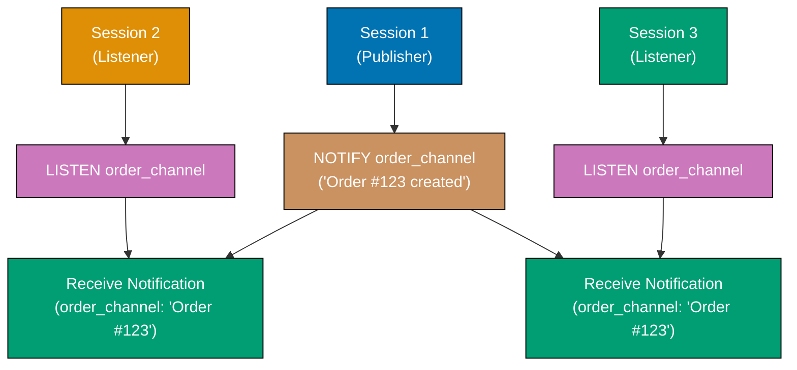

**Code**:

```sql
CREATE DATABASE example_82;
\c example_82;

-- Session 1: Subscribe to channel
LISTEN order_events;
-- => Subscribes to 'order_events' channel

-- Session 2: Send notification
NOTIFY order_events, 'New order created: #12345';
-- => All listeners receive notification with payload

-- Session 1 receives notification:
-- Asynchronous notification "order_events" with payload "New order created: #12345" received from server process with PID 12345.

-- Use case: cache invalidation
CREATE TABLE products (
    id SERIAL PRIMARY KEY,
    name VARCHAR(200),
    price DECIMAL(10, 2),
    updated_at TIMESTAMP DEFAULT NOW()
);

-- Trigger sends notification on product updates
CREATE FUNCTION notify_product_change()
RETURNS TRIGGER AS $$
BEGIN
    PERFORM pg_notify(
        'product_updates',
        json_build_object(
            'id', NEW.id,
            'name', NEW.name,
            'price', NEW.price
        )::text
    );
    RETURN NEW;
END;
$$ LANGUAGE plpgsql;

CREATE TRIGGER product_update_notify
AFTER INSERT OR UPDATE ON products
FOR EACH ROW
EXECUTE FUNCTION notify_product_change();

-- Application listens for product updates
LISTEN product_updates;

-- Update product (triggers notification)
INSERT INTO products (name, price)
VALUES ('Laptop', 999.99);

UPDATE products SET price = 899.99 WHERE name = 'Laptop';

-- Listeners receive:
-- Asynchronous notification "product_updates" with payload '{"id":1,"name":"Laptop","price":899.99}'

-- Unlisten from channel
UNLISTEN product_updates;

-- Unlisten from all channels
UNLISTEN *;

-- Use case: real-time dashboards
CREATE TABLE metrics (
    id SERIAL PRIMARY KEY,
    metric_name VARCHAR(100),
    value DECIMAL(10, 2),
    timestamp TIMESTAMP DEFAULT NOW()
);

CREATE FUNCTION notify_metric()
RETURNS TRIGGER AS $$
BEGIN
    PERFORM pg_notify('metrics', NEW.metric_name || ':' || NEW.value::text);
    RETURN NEW;
END;
$$ LANGUAGE plpgsql;

CREATE TRIGGER metric_notify
AFTER INSERT ON metrics
FOR EACH ROW
EXECUTE FUNCTION notify_metric();

LISTEN metrics;

INSERT INTO metrics (metric_name, value)
VALUES ('cpu_usage', 75.5);

-- Dashboard receives real-time update
```

**Key Takeaway**: LISTEN/NOTIFY enables lightweight pub/sub messaging - applications subscribe to channels (LISTEN), receive notifications (NOTIFY) with payloads. Use for cache invalidation, real-time dashboards, or event-driven workflows. Notifications lost if no active listeners.

### Example 83: Write-Ahead Logging (WAL)

WAL ensures durability - all changes logged before applied to data files. Essential for crash recovery, replication, and point-in-time recovery.

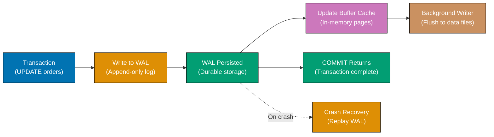

**Code**:

```sql
CREATE DATABASE example_83;
\c example_83;

-- Check WAL settings
SHOW wal_level;
-- => replica (default, supports physical replication)
-- => logical (supports logical replication)

SHOW max_wal_size;
-- => Maximum size before checkpoint (default: 1GB)

SHOW wal_compression;
-- => on/off (compresses WAL data)

-- View WAL location
SELECT pg_current_wal_lsn();
-- => Current write-ahead log location (e.g., 0/1A2B3C4D)

-- Force checkpoint (writes WAL to data files)
CHECKPOINT;

-- View checkpoint statistics
SELECT
    checkpoints_timed,
    checkpoints_req,
    checkpoint_write_time,
    checkpoint_sync_time
FROM pg_stat_bgwriter;
-- => checkpoints_timed: scheduled checkpoints
-- => checkpoints_req: requested checkpoints (too many indicates tuning needed)

-- WAL archiving (for point-in-time recovery)
SHOW archive_mode;
-- => on/off

SHOW archive_command;
-- => Command to copy WAL files (e.g., 'cp %p /archive/%f')

-- WAL segments
SELECT
    name,
    setting,
    unit
FROM pg_settings
WHERE name LIKE 'wal%';

-- View WAL activity
SELECT
    slot_name,
    slot_type,
    database,
    active,
    restart_lsn,
    confirmed_flush_lsn
FROM pg_replication_slots;

-- Calculate WAL generation rate
SELECT
    pg_size_pretty(
        pg_wal_lsn_diff(pg_current_wal_lsn(), '0/0')
    ) AS total_wal_generated;

-- Tune WAL for performance
-- SET wal_buffers = '16MB';  -- Increase for high-write workloads
-- SET checkpoint_timeout = '10min';  -- Less frequent checkpoints
-- SET max_wal_size = '2GB';  -- Larger before checkpoint

-- Monitor WAL files
SELECT
    COUNT(*) AS wal_files,
    pg_size_pretty(SUM(size)) AS total_size
FROM pg_ls_waldir();
```

**Key Takeaway**: WAL ensures durability and enables replication - all changes written to WAL before data files. Tune max_wal_size and checkpoint_timeout for workload. Monitor checkpoint frequency (too many checkpoints_req indicates tuning needed). WAL archiving enables point-in-time recovery.

### Example 84: Connection Pooling with pgBouncer

Connection pooling reduces connection overhead - pgBouncer maintains persistent connections to PostgreSQL, serves application connections from pool.

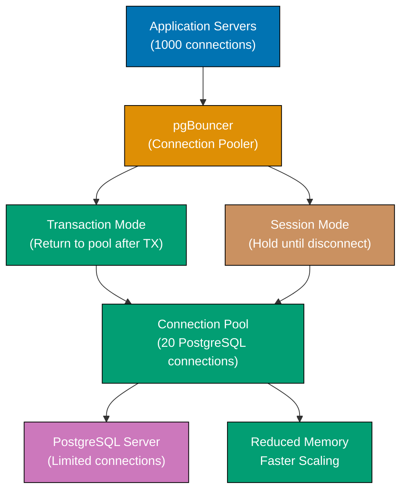

**Note**: pgBouncer runs as separate process, not SQL. Example shows configuration.

**pgbouncer.ini configuration**:

```ini
[databases]
example_84 = host=localhost port=5432 dbname=example_84

[pgbouncer]
listen_addr = *
listen_port = 6432
auth_type = md5
auth_file = /etc/pgbouncer/userlist.txt
pool_mode = transaction
max_client_conn = 1000
default_pool_size = 20
min_pool_size = 5
reserve_pool_size = 5
reserve_pool_timeout = 3
server_lifetime = 3600
server_idle_timeout = 600
log_connections = 1
log_disconnections = 1
```

**userlist.txt** (authentication):

```
"postgres" "password_hash"
```

**Pool modes**:

- **session**: Connection held until client disconnects (safest, least pooling)
- **transaction**: Connection returned to pool after each transaction (most common)
- **statement**: Connection returned after each statement (most aggressive, breaks prepared statements)

**Docker setup**:

```bash
# Run pgBouncer container
docker run -d \
  --name pgbouncer \
  -p 6432:6432 \
  -v $(pwd)/pgbouncer.ini:/etc/pgbouncer/pgbouncer.ini \
  edoburu/pgbouncer

# Connect through pgBouncer (port 6432 instead of 5432)
psql -h localhost -p 6432 -U postgres -d example_84
```

**Monitoring pgBouncer**:

```sql
-- Connect to pgbouncer admin console
psql -h localhost -p 6432 -U postgres pgbouncer

-- Show pools
SHOW POOLS;
-- => Shows connection pools, client/server connections

-- Show stats
SHOW STATS;
-- => Query counts, transaction counts

-- Show clients
SHOW CLIENTS;
-- => Active client connections

-- Show servers
SHOW SERVERS;
-- => Connections to PostgreSQL

-- Reload config
RELOAD;

-- Pause connections
PAUSE;

-- Resume
RESUME;
```

**Key Takeaway**: pgBouncer reduces connection overhead through pooling - maintains persistent PostgreSQL connections, serves applications from pool. Use transaction mode for most applications, session mode for compatibility. Monitor with SHOW POOLS and SHOW STATS.

### Example 85: Performance Tuning Parameters

PostgreSQL has many tunable parameters - optimize for workload (OLTP, OLAP, mixed). Key parameters for memory, connections, and query performance.

**Code**:

```sql
CREATE DATABASE example_85;
\c example_85;

-- View all settings
SELECT name, setting, unit, short_desc
FROM pg_settings
WHERE category LIKE '%Memory%'
ORDER BY name;

-- Key memory parameters

-- shared_buffers: PostgreSQL cache (default: 128MB, recommend: 25% of RAM)
SHOW shared_buffers;
-- ALTER SYSTEM SET shared_buffers = '4GB';  -- Requires restart

-- effective_cache_size: OS + PostgreSQL cache estimate (default: 4GB)
SHOW effective_cache_size;
-- SET effective_cache_size = '16GB';  -- No restart needed

-- work_mem: Memory per sort/hash operation (default: 4MB)
SHOW work_mem;
-- SET work_mem = '64MB';  -- Per operation, be careful!

-- maintenance_work_mem: VACUUM, CREATE INDEX memory (default: 64MB)
SHOW maintenance_work_mem;
-- SET maintenance_work_mem = '1GB';

-- Key performance parameters

-- max_connections: Maximum connections (default: 100)
SHOW max_connections;
-- ALTER SYSTEM SET max_connections = 200;  -- Requires restart

-- checkpoint_timeout: Time between checkpoints (default: 5min)
SHOW checkpoint_timeout;
-- SET checkpoint_timeout = '15min';

-- max_wal_size: WAL size before checkpoint (default: 1GB)
SHOW max_wal_size;
-- SET max_wal_size = '4GB';

-- random_page_cost: Relative cost of random I/O (default: 4.0)
SHOW random_page_cost;
-- SET random_page_cost = 1.1;  -- For SSD (closer to sequential)

-- effective_io_concurrency: Parallel I/O operations (default: 1)
SHOW effective_io_concurrency;
-- SET effective_io_concurrency = 200;  -- For SSD RAID

-- Parallel query settings

-- max_parallel_workers_per_gather: Parallel workers per query
SHOW max_parallel_workers_per_gather;
-- SET max_parallel_workers_per_gather = 4;

-- max_parallel_workers: Total parallel workers
SHOW max_parallel_workers;
-- SET max_parallel_workers = 8;

-- Autovacuum tuning

SHOW autovacuum_vacuum_scale_factor;
-- SET autovacuum_vacuum_scale_factor = 0.1;  -- Vacuum after 10% changes

SHOW autovacuum_analyze_scale_factor;
-- SET autovacuum_analyze_scale_factor = 0.05;  -- Analyze after 5% changes

-- Query planner settings

SHOW enable_seqscan;
SHOW enable_indexscan;
SHOW enable_hashjoin;
-- SET enable_* = off;  -- Disable plan types (for testing only)

-- Apply changes

-- Session-level (current session only)
SET work_mem = '128MB';

-- Database-level
ALTER DATABASE example_85 SET work_mem = '128MB';

-- System-level (persistent, some require restart)
ALTER SYSTEM SET work_mem = '128MB';
SELECT pg_reload_conf();  -- Reload without restart (for settings that support it)

-- View pending restarts
SELECT name, setting, pending_restart
FROM pg_settings
WHERE pending_restart = true;

-- Tuning recommendations based on workload

-- OLTP (many small transactions):
-- shared_buffers = 8GB (assuming 32GB RAM)
-- work_mem = 16MB
-- maintenance_work_mem = 1GB
-- max_connections = 200
-- random_page_cost = 1.1 (SSD)

-- OLAP (complex analytical queries):
-- shared_buffers = 8GB
-- work_mem = 256MB
-- maintenance_work_mem = 2GB
-- max_connections = 50
-- max_parallel_workers_per_gather = 8

-- Reset to defaults
ALTER SYSTEM RESET work_mem;
SELECT pg_reload_conf();
```

**Key Takeaway**: Tune PostgreSQL for workload - key memory parameters (shared_buffers, work_mem, maintenance_work_mem), checkpoint settings (checkpoint_timeout, max_wal_size), and parallel query settings. Use ALTER SYSTEM for persistent changes, SET for session changes. Monitor with pg_settings and tune based on workload patterns.

---

## Summary

You've completed 85 PostgreSQL examples covering 95% of production PostgreSQL usage - from installation to advanced administration. You now have comprehensive knowledge of:

- **Fundamentals**: Data types, queries, joins, schema design
- **Production Features**: Indexes, transactions, JSON, arrays, ranges
- **Advanced Capabilities**: Full-text search, partitioning, replication, foreign data wrappers
- **Administration**: User management, row-level security, backup/restore, monitoring
- **Expert Patterns**: Advisory locks, LISTEN/NOTIFY, WAL, connection pooling, performance tuning

Continue learning through the [PostgreSQL official documentation](https://www.postgresql.org/docs/), experiment with production workloads, and explore extensions like PostGIS, TimescaleDB, and Citus for specialized use cases.
