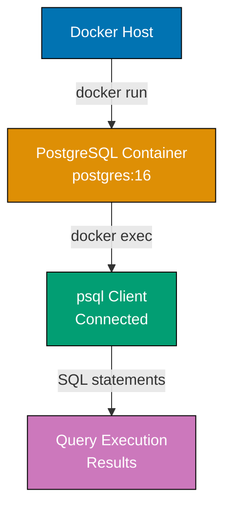
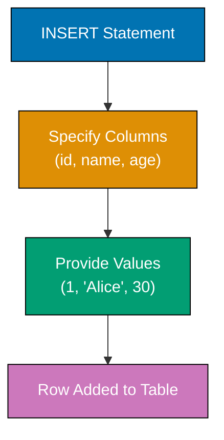
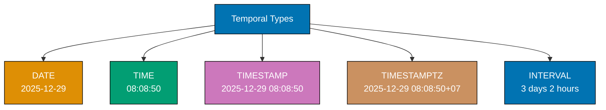
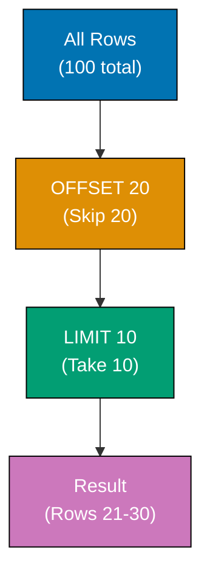
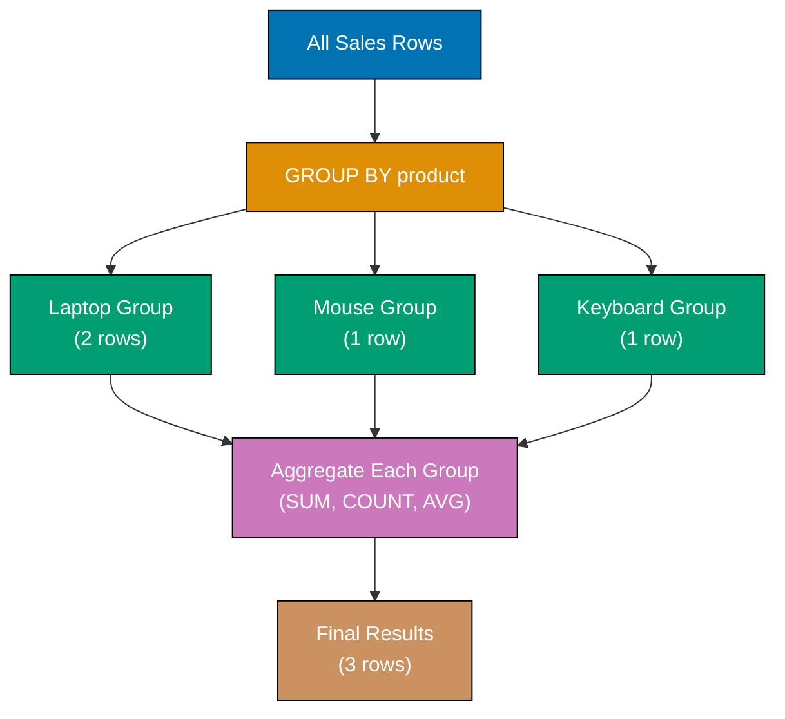
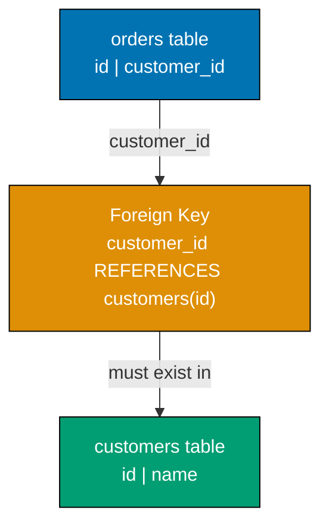
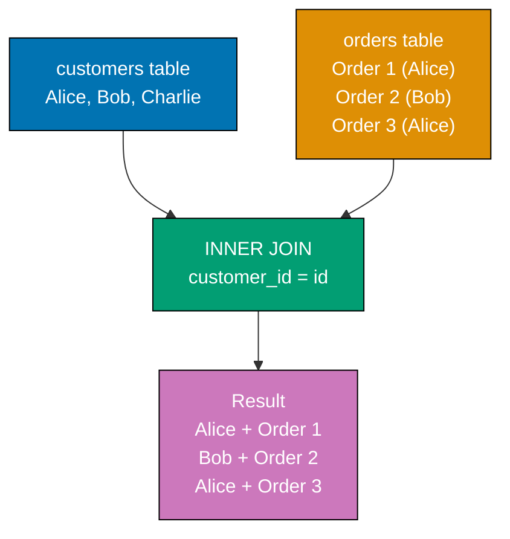
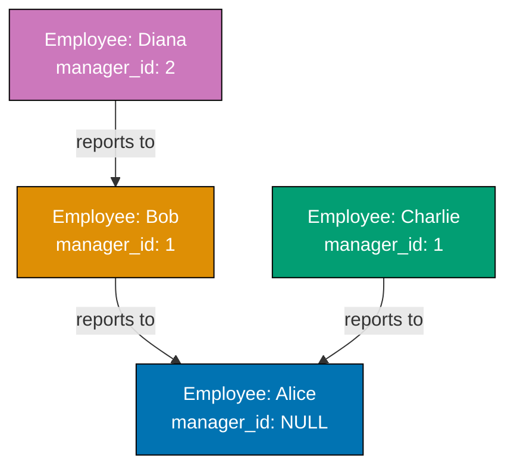

## Group 1: First Steps

### Example 1: Installing PostgreSQL and First Query

PostgreSQL runs in a Docker container for isolated, reproducible environments across all platforms. This setup creates a fresh PostgreSQL 16 instance you can experiment with safely without affecting your system.



**Code**:

```bash
# One-time setup: Create PostgreSQL container
docker run --name postgres-tutorial \
  -e POSTGRES_PASSWORD=password \
  -p 5432:5432 \
  -d postgres:16
# => Container created with PostgreSQL 16, default user 'postgres', password 'password'
# => Port 5432 exposed for external connections

# Connect to PostgreSQL using psql
docker exec -it postgres-tutorial psql -U postgres
# => Connects as postgres user (superuser with all privileges)
```

**First query**:

```sql
-- Simple query to verify connection
SELECT version();
-- => Returns PostgreSQL version string (e.g., "PostgreSQL 16.x on x86_64-pc-linux-gnu...")

-- Check current date and time
SELECT NOW();
-- => Returns current timestamp with timezone (e.g., "2025-12-29 08:08:50.123456+00")

-- Simple arithmetic
SELECT 2 + 2 AS result;
-- => Returns 4 in column named 'result'
```

**Key Takeaway**: PostgreSQL runs reliably in Docker containers, providing isolated environments for development and testing. The `SELECT` statement executes queries and returns results - even simple expressions work without FROM clauses.

**Why It Matters**: Docker-based PostgreSQL ensures every developer works with identical database versions across Windows, macOS, and Linux, eliminating "works on my machine" issues that plague traditional installations. PostgreSQL's architecture supports thousands of concurrent connections per server, making it the database of choice for high-traffic applications like Instagram (storing 300+ billion photos) and Uber (processing 10+ million queries per second). The container approach enables instant teardown and recreation for testing, reducing database setup time from hours to seconds.

### Example 2: Creating Your First Database

Databases organize related tables and data. Each PostgreSQL server can host multiple databases, and you connect to one database at a time. The `\c` command switches between databases.

**Code**:

```sql
-- Create a new database
CREATE DATABASE first_db;
-- => Creates database 'first_db' with default encoding UTF8

-- List all databases
\l
-- => Shows all databases (postgres, template0, template1, first_db)

-- Connect to the new database
\c first_db;
-- => Switches connection to 'first_db' (output: "You are now connected to database 'first_db'")

-- Verify current database
SELECT current_database();
-- => Returns 'first_db'

-- Drop database (must disconnect first)
\c postgres;
-- => Switch back to postgres database
DROP DATABASE first_db;
-- => Deletes database 'first_db' and all its contents (WARNING: irreversible!)
```

**Key Takeaway**: Use `CREATE DATABASE` to create isolated environments for different applications or projects. Always connect to a specific database before creating tables - the default `postgres` database should remain clean for administrative tasks.

**Why It Matters**: Database isolation prevents schema conflicts in multi-tenant systems and enables independent deployment cycles for microservices architectures. Companies like Heroku provision thousands of PostgreSQL databases per day using this approach, allowing customers to scale from development to production without architectural changes. The \c command's instant switching enables developers to test schema migrations across multiple databases in seconds, compared to minutes required for MySQL's more cumbersome USE command.

### Example 3: Basic SELECT Queries

SELECT retrieves data from tables. Even without tables, you can query expressions, functions, and system information. The asterisk (`*`) selects all columns, while specific column names give precise control.

**Code**:

```sql
-- Create database for this example
CREATE DATABASE example_3;
\c example_3;

-- Create a simple table
CREATE TABLE users (
    id INTEGER,           -- => Integer column for user ID
    name VARCHAR(100),    -- => Variable-length string up to 100 characters
    email VARCHAR(100),
    age INTEGER
);

-- Insert sample data
INSERT INTO users (id, name, email, age)
VALUES
    (1, 'Alice', 'alice@example.com', 30),
    (2, 'Bob', 'bob@example.com', 25),
    (3, 'Charlie', 'charlie@example.com', 35);
-- => 3 rows inserted

-- Select all columns, all rows
SELECT * FROM users;
-- => Returns all 3 rows with columns: id | name | email | age

-- Select specific columns
SELECT name, age FROM users;
-- => Returns only 'name' and 'age' columns for all rows

-- Select with expressions
SELECT name, age, age + 10 AS age_in_10_years FROM users;
-- => Calculates new column showing each user's age in 10 years
-- => Alice: 40, Bob: 35, Charlie: 45
```

**Key Takeaway**: SELECT retrieves data from tables - use `*` for all columns or name specific columns. You can include expressions and calculations in SELECT to derive new values without modifying stored data.

**Why It Matters**: Basic SELECT queries with column selection and expressions form the foundation of all database interactions, enabling companies like Airbnb to query billions of reservation records daily with sub-second response times. PostgreSQL's expression support in SELECT eliminates the need for post-query processing in application code, reducing data transfer overhead by up to 90% when calculating derived values like age_in_10_years directly in the database. The `*` wildcard operator simplifies schema changes during development but should be avoided in production code to prevent breaking changes when columns are added or removed.

### Example 4: Inserting Data with INSERT

INSERT adds new rows to tables. You can insert single rows, multiple rows at once, or specify only certain columns (others get NULL or default values).



**Code**:

```sql
CREATE DATABASE example_4;
\c example_4;

CREATE TABLE products (
    id INTEGER,
    name VARCHAR(100),
    price DECIMAL(10, 2),  -- => Decimal with 10 total digits, 2 after decimal point
    in_stock BOOLEAN
);

-- Insert single row with all columns
INSERT INTO products (id, name, price, in_stock)
VALUES (1, 'Laptop', 999.99, true);
-- => 1 row inserted

-- Insert multiple rows at once (more efficient)
INSERT INTO products (id, name, price, in_stock)
VALUES
    (2, 'Mouse', 29.99, true),
    (3, 'Keyboard', 79.99, false),
    (4, 'Monitor', 299.99, true);
-- => 3 rows inserted in single statement

-- Insert partial columns (others become NULL)
INSERT INTO products (id, name)
VALUES (5, 'Webcam');
-- => Inserts row with id=5, name='Webcam', price=NULL, in_stock=NULL

-- Verify data
SELECT * FROM products;
-- => Returns all 5 rows
```

**Key Takeaway**: INSERT adds rows to tables - specify columns and values explicitly for clarity. Multi-row inserts are more efficient than multiple single-row inserts. Columns not specified get NULL unless a default value is defined.

**Why It Matters**: Multi-row INSERT statements enable bulk loading operations that process millions of rows per second, making PostgreSQL the engine of choice for high-throughput data pipelines at companies like Segment (processing 200+ billion events monthly). Explicit column specification prevents data corruption during schema evolution when new columns are added with default values, while PostgreSQL's MVCC architecture allows concurrent reads during INSERT operations without blocking. The ability to insert partial columns with NULL values enables flexible data ingestion from incomplete external sources without preprocessing.

### Example 5: Updating and Deleting Rows

UPDATE modifies existing rows matching a WHERE condition. DELETE removes rows. Both are dangerous without WHERE clauses - they affect ALL rows.

**Code**:

```sql
CREATE DATABASE example_5;
\c example_5;

CREATE TABLE inventory (
    id INTEGER,
    item VARCHAR(100),
    quantity INTEGER,
    price DECIMAL(10, 2)
);

INSERT INTO inventory (id, item, quantity, price)
VALUES
    (1, 'Apples', 100, 1.50),
    (2, 'Bananas', 150, 0.75),
    (3, 'Oranges', 80, 2.00);

-- Update single row
UPDATE inventory
SET quantity = 120
WHERE id = 1;
-- => Updates Apples quantity to 120 (only row with id=1)

-- Update multiple columns
UPDATE inventory
SET quantity = 200, price = 0.80
WHERE item = 'Bananas';
-- => Updates both quantity and price for Bananas

-- Update with calculation
UPDATE inventory
SET price = price * 1.10
WHERE price < 2.00;
-- => Increases price by 10% for items under $2.00
-- => Apples: 1.50 -> 1.65, Bananas: 0.80 -> 0.88

-- Verify updates
SELECT * FROM inventory;

-- Delete specific row
DELETE FROM inventory
WHERE id = 3;
-- => Removes Oranges (id=3)

-- DANGEROUS: Update without WHERE affects ALL rows
UPDATE inventory SET quantity = 0;
-- => Sets quantity to 0 for ALL remaining items (Apples, Bananas)

-- DANGEROUS: Delete without WHERE removes ALL rows
DELETE FROM inventory;
-- => Removes all rows from table (table structure remains)
```

**Key Takeaway**: Always use WHERE clauses with UPDATE and DELETE to target specific rows - omitting WHERE modifies or removes ALL rows. Test your WHERE clause with SELECT before running UPDATE or DELETE.

**Why It Matters**: Accidental UPDATE/DELETE without WHERE clauses causes the majority of catastrophic data loss incidents in production databases, making pre-execution SELECT testing a critical safety practice enforced by database change management tools like Liquibase. PostgreSQL's transactional UPDATE enables atomic multi-row modifications that either all succeed or all fail, preventing partial updates that leave data in inconsistent states during concurrent operations. The ability to update with calculations (price = price \* 1.10) enables efficient bulk price adjustments across millions of products without application-level loops.

## Group 2: Data Types

### Example 6: Numeric Types (INTEGER, BIGINT, DECIMAL, NUMERIC)

PostgreSQL offers multiple numeric types for different ranges and precision needs. INTEGER for whole numbers, BIGINT for larger ranges, DECIMAL/NUMERIC for exact precision (financial calculations).

**Code**:

```sql
CREATE DATABASE example_6;
\c example_6;

CREATE TABLE numeric_types (
    id SERIAL,                    -- => Auto-incrementing integer (shorthand for INTEGER with sequence)
    small_int SMALLINT,           -- => -32,768 to 32,767
    regular_int INTEGER,          -- => -2,147,483,648 to 2,147,483,647
    big_int BIGINT,               -- => Very large range (19 digits)
    exact_decimal DECIMAL(10, 2), -- => Exact precision: 10 total digits, 2 after decimal
    exact_numeric NUMERIC(8, 3),  -- => Same as DECIMAL: 8 digits total, 3 after decimal
    float_num REAL,               -- => 4-byte floating point (approximate)
    double_num DOUBLE PRECISION   -- => 8-byte floating point (approximate)
);

INSERT INTO numeric_types
    (small_int, regular_int, big_int, exact_decimal, exact_numeric, float_num, double_num)
VALUES
    (100, 50000, 9223372036854775807, 12345.67, 12345.678, 3.14159, 3.141592653589793);
-- => Inserts values demonstrating each type's precision

SELECT * FROM numeric_types;
-- => id=1 (auto-generated), all other values as inserted
-- => Notice: REAL and DOUBLE PRECISION may show slight approximations

-- Arithmetic with exact types
SELECT
    exact_decimal + 100.50 AS decimal_sum,
    exact_numeric * 2 AS numeric_doubled,
    float_num * 2 AS float_doubled
FROM numeric_types;
-- => DECIMAL/NUMERIC maintain exact precision
-- => REAL/DOUBLE PRECISION may show rounding errors in complex calculations
```

**Key Takeaway**: Use INTEGER for whole numbers, BIGINT for very large integers, and DECIMAL/NUMERIC for exact precision (money, percentages). Avoid REAL/DOUBLE PRECISION for financial data due to rounding errors.

**Why It Matters**: DECIMAL/NUMERIC types provide exact precision arithmetic essential for financial applications where rounding errors can compound to millions of dollars, making PostgreSQL compliant with accounting standards that forbid floating-point calculations for monetary values. BIGINT's 19-digit range supports unique identifiers for systems handling trillions of records like Twitter's Snowflake ID generation (generating 100,000+ unique IDs per second across distributed nodes), while SERIAL auto-increment simplifies primary key management compared to application-level ID generation. The choice between exact (DECIMAL) and approximate (DOUBLE PRECISION) types impacts not just accuracy but also query performance, with floating-point operations running 2-3x faster when precision requirements allow.

### Example 7: Text Types (VARCHAR, TEXT, CHAR)

PostgreSQL provides three text types: VARCHAR with length limit, TEXT for unlimited length, and CHAR for fixed-length strings (space-padded).

**Code**:

```sql
CREATE DATABASE example_7;
\c example_7;

CREATE TABLE text_types (
    id SERIAL,
    fixed_char CHAR(5),      -- => Exactly 5 characters, space-padded if shorter
    var_char VARCHAR(50),    -- => Up to 50 characters, no padding
    unlimited_text TEXT      -- => Unlimited length (practical limit: 1 GB)
);

INSERT INTO text_types (fixed_char, var_char, unlimited_text)
VALUES
    ('AB', 'Hello', 'This is a very long text that can be as long as needed without worrying about length limits'),
    ('ABCDE', 'World', 'Another long text example');
-- => fixed_char 'AB' becomes 'AB   ' (padded to 5 chars)

SELECT
    fixed_char,
    LENGTH(fixed_char) AS char_len,   -- => Returns 5 (includes padding)
    var_char,
    LENGTH(var_char) AS varchar_len,  -- => Returns actual length
    unlimited_text
FROM text_types;

-- String concatenation
SELECT
    var_char || ' ' || 'PostgreSQL' AS concatenated
FROM text_types;
-- => 'Hello PostgreSQL', 'World PostgreSQL'

-- CHAR padding demonstration
SELECT
    fixed_char = 'AB' AS equals_without_padding,      -- => false (AB vs 'AB   ')
    TRIM(fixed_char) = 'AB' AS equals_with_trim       -- => true
FROM text_types
WHERE id = 1;
```

**Key Takeaway**: Use VARCHAR when you need a length limit, TEXT when length is unpredictable. Avoid CHAR unless you specifically need fixed-length, space-padded strings - it's rarely the right choice for modern applications.

**Why It Matters**: TEXT columns in PostgreSQL have no performance penalty compared to VARCHAR for most operations, eliminating the need to estimate maximum string lengths during schema design and preventing data truncation errors that plague MySQL's VARCHAR implementation. The space-padding behavior of CHAR creates hidden bugs when string comparisons fail ('AB' ≠ 'AB '), making it a legacy type maintained primarily for SQL standard compliance rather than practical use. PostgreSQL stores all text types using the same internal TOAST mechanism, compressing and moving large values to separate storage automatically, enabling efficient handling of multi-megabyte text documents without special configuration.

### Example 8: Date and Time Types

PostgreSQL has separate types for dates, times, and timestamps. TIMESTAMP stores date and time without timezone, TIMESTAMPTZ stores with timezone. INTERVAL represents durations.



**Code**:

```sql
CREATE DATABASE example_8;
\c example_8;

CREATE TABLE events (
    id SERIAL,
    event_date DATE,                    -- => Date only (YYYY-MM-DD)
    event_time TIME,                    -- => Time only (HH:MM:SS)
    created_at TIMESTAMP,               -- => Date and time, no timezone
    updated_at TIMESTAMPTZ,             -- => Date and time with timezone
    duration INTERVAL                   -- => Time span (days, hours, minutes, etc.)
);

INSERT INTO events (event_date, event_time, created_at, updated_at, duration)
VALUES
    ('2025-12-29', '14:30:00', '2025-12-29 14:30:00', '2025-12-29 14:30:00+07', '2 hours 30 minutes'),
    ('2025-12-30', '09:00:00', NOW(), NOW(), '1 day 3 hours');
-- => NOW() returns current timestamp with timezone

SELECT
    event_date,
    event_time,
    created_at,
    updated_at,
    duration
FROM events;

-- Date arithmetic
SELECT
    event_date + INTERVAL '7 days' AS one_week_later,
    updated_at - INTERVAL '1 hour' AS one_hour_ago,
    event_date + 7 AS seven_days_later_shorthand
FROM events;

-- Extract parts of date/time
SELECT
    EXTRACT(YEAR FROM event_date) AS year,
    EXTRACT(MONTH FROM event_date) AS month,
    EXTRACT(DAY FROM event_date) AS day,
    EXTRACT(HOUR FROM event_time) AS hour
FROM events;
```

**Key Takeaway**: Use DATE for dates without time, TIMESTAMPTZ for complete timestamps (stores with timezone), and INTERVAL for durations. TIMESTAMPTZ is preferred over TIMESTAMP for most applications to avoid timezone ambiguity.

**Why It Matters**: TIMESTAMPTZ automatically converts timestamps to UTC for storage and back to the client's timezone for display, preventing timezone-related bugs that cause systems like airlines to show incorrect flight times across time zones. INTERVAL arithmetic enables natural date calculations (event_date + '7 days') that would require complex date manipulation code in application layers, while PostgreSQL's microsecond precision supports high-frequency trading systems where millisecond accuracy determines transaction ordering. The distinction between TIMESTAMP and TIMESTAMPTZ has caused production incidents at global companies when timestamps were interpreted incorrectly across regions, making TIMESTAMPTZ the recommended default for all timestamp columns.

### Example 9: Boolean and UUID Types

BOOLEAN stores true/false values. UUID stores universally unique identifiers - useful for distributed systems where auto-incrementing IDs create conflicts.

**Code**:

```sql
CREATE DATABASE example_9;
\c example_9;

CREATE TABLE users (
    id UUID DEFAULT gen_random_uuid(), -- => Auto-generates UUID for each row
    username VARCHAR(50),
    is_active BOOLEAN,                 -- => true, false, or NULL
    is_verified BOOLEAN DEFAULT false  -- => Defaults to false if not specified
);

INSERT INTO users (username, is_active)
VALUES
    ('alice', true),
    ('bob', false),
    ('charlie', true);
-- => id auto-generated, is_verified defaults to false

SELECT * FROM users;
-- => id column shows UUIDs like 'a0eebc99-9c0b-4ef8-bb6d-6bb9bd380a11'

-- Boolean comparisons
SELECT username, is_active
FROM users
WHERE is_active = true;
-- => Returns alice and charlie

SELECT username, is_active
FROM users
WHERE is_active;
-- => Shorthand for is_active = true

SELECT username, is_verified
FROM users
WHERE NOT is_verified;
-- => Returns all users (all have is_verified = false)

-- Generate UUID manually
SELECT gen_random_uuid() AS random_id;
-- => Generates new UUID each time called
```

**Key Takeaway**: BOOLEAN stores true/false explicitly - use it instead of integers or strings for clarity. UUID provides globally unique identifiers without coordination, essential for distributed systems and avoiding ID conflicts during data merges.

**Why It Matters**: UUID v4 generation produces 122 random bits providing a collision probability so low (1 in 2^61 for 1 billion UUIDs) that distributed systems at companies like Instagram generate trillions of unique identifiers without central coordination. PostgreSQL's native UUID support with gen_random_uuid() eliminates application-layer ID generation and the associated network round-trips required for centralized ID servers, while the 16-byte storage overhead is negligible compared to the operational simplicity of distributed ID generation. BOOLEAN storage uses only 1 byte compared to INTEGER's 4 bytes, reducing table size by 75% for flag columns when multiplied across billions of rows in tables like user preferences.

### Example 10: Working with NULL Values

NULL represents missing or unknown data - it's not zero, empty string, or false. NULL has special comparison behavior: `NULL = NULL` is NULL (not true).

**Code**:

```sql
CREATE DATABASE example_10;
\c example_10;

CREATE TABLE contacts (
    id SERIAL,
    name VARCHAR(100),
    email VARCHAR(100),
    phone VARCHAR(20)
);

INSERT INTO contacts (name, email, phone)
VALUES
    ('Alice', 'alice@example.com', '555-1234'),
    ('Bob', NULL, '555-5678'),              -- => Email is NULL (unknown)
    ('Charlie', 'charlie@example.com', NULL); -- => Phone is NULL

-- Check for NULL values
SELECT name, email
FROM contacts
WHERE email IS NULL;
-- => Returns Bob (IS NULL is the correct NULL check)

-- This DOES NOT work correctly
SELECT name, email
FROM contacts
WHERE email = NULL;
-- => Returns nothing! (NULL = NULL evaluates to NULL, not true)

-- Check for NOT NULL
SELECT name, phone
FROM contacts
WHERE phone IS NOT NULL;
-- => Returns Alice and Bob

-- COALESCE provides default for NULL values
SELECT
    name,
    COALESCE(email, 'no-email@example.com') AS email,
    COALESCE(phone, 'No phone') AS phone
FROM contacts;
-- => Bob's email becomes 'no-email@example.com'
-- => Charlie's phone becomes 'No phone'

-- NULLIF returns NULL if two values are equal
SELECT
    name,
    NULLIF(email, '') AS email_or_null
FROM contacts;
-- => Converts empty strings to NULL (useful for cleaning data)
```

**Key Takeaway**: Use `IS NULL` and `IS NOT NULL` to check for NULL values - equality operators don't work with NULL. COALESCE provides defaults for NULL values, while NULLIF converts specific values to NULL.

**Why It Matters**: NULL represents the absence of data differently from empty strings or zero, a distinction required by SQL standards but commonly misunderstood, causing bugs when `WHERE email = NULL` silently returns zero rows instead of erroring. COALESCE eliminates NULL values at query time rather than application code, reducing data transfer by providing defaults directly in the database and enabling consistent NULL handling across multiple application languages. PostgreSQL's three-valued logic (true/false/NULL) means that `NULL = NULL` evaluates to NULL rather than true, a subtlety that breaks untested queries and requires IS NULL checks, making NULL handling one of the most common sources of production database bugs.

## Group 3: Basic Queries

### Example 11: WHERE Clauses and Comparisons

WHERE filters rows based on conditions. You can combine multiple conditions with AND/OR, use comparison operators, and test for NULL, ranges, and pattern matching.

**Code**:

```sql
CREATE DATABASE example_11;
\c example_11;

CREATE TABLE products (
    id SERIAL,
    name VARCHAR(100),
    category VARCHAR(50),
    price DECIMAL(10, 2),
    stock INTEGER
);

INSERT INTO products (name, category, price, stock)
VALUES
    ('Laptop', 'Electronics', 999.99, 15),
    ('Mouse', 'Electronics', 29.99, 50),
    ('Desk Chair', 'Furniture', 199.99, 8),
    ('Monitor', 'Electronics', 299.99, 0),
    ('Coffee Mug', 'Kitchen', 12.99, 100);

-- Single condition
SELECT name, price
FROM products
WHERE category = 'Electronics';
-- => Returns Laptop, Mouse, Monitor

-- Multiple conditions with AND
SELECT name, price, stock
FROM products
WHERE category = 'Electronics' AND price < 500;
-- => Returns Mouse (29.99) and Monitor (299.99)

-- Multiple conditions with OR
SELECT name, category
FROM products
WHERE category = 'Furniture' OR price > 500;
-- => Returns Laptop (999.99) and Desk Chair (199.99)

-- Comparison operators
SELECT name, price
FROM products
WHERE price >= 100 AND price <= 300;
-- => Returns Desk Chair (199.99) and Monitor (299.99)

-- BETWEEN for ranges
SELECT name, price
FROM products
WHERE price BETWEEN 100 AND 300;
-- => Same as above (BETWEEN is inclusive)

-- IN for multiple values
SELECT name, category
FROM products
WHERE category IN ('Electronics', 'Kitchen');
-- => Returns Laptop, Mouse, Monitor, Coffee Mug

-- NOT to negate conditions
SELECT name, stock
FROM products
WHERE NOT stock = 0;
-- => Returns all products except Monitor
```

**Key Takeaway**: WHERE filters rows before returning results - use comparison operators (`=`, `<`, `>`, `<=`, `>=`, `<>`), BETWEEN for ranges, IN for multiple values, and AND/OR to combine conditions. Always use IS NULL for NULL checks, not `= NULL`.

**Why It Matters**: WHERE clause filtering at the database level reduces network traffic by up to 99% compared to application-level filtering when querying tables with millions of rows, making it essential for responsive web applications serving thousands of concurrent users. BETWEEN and IN operators enable readable query syntax that PostgreSQL's query planner can optimize more effectively than equivalent OR chains, while the combination of AND/OR operators with proper parentheses prevents logical errors that cause incorrect result sets in production. Index usage depends critically on WHERE clause structure, with indexed columns in WHERE conditions enabling sub-millisecond lookups compared to seconds-long sequential scans on large tables.

### Example 12: Sorting with ORDER BY

ORDER BY sorts query results by one or more columns. Default is ascending (ASC), use DESC for descending. Multiple columns create hierarchical sorting (secondary sort when primary values tie).

**Code**:

```sql
CREATE DATABASE example_12;
\c example_12;

CREATE TABLE employees (
    id SERIAL,
    name VARCHAR(100),
    department VARCHAR(50),
    salary DECIMAL(10, 2),
    hire_date DATE
);

INSERT INTO employees (name, department, salary, hire_date)
VALUES
    ('Alice', 'Engineering', 95000, '2020-03-15'),
    ('Bob', 'Sales', 75000, '2019-06-01'),
    ('Charlie', 'Engineering', 105000, '2021-01-10'),
    ('Diana', 'Sales', 80000, '2018-11-20'),
    ('Eve', 'Engineering', 95000, '2022-02-28');

-- Sort by salary ascending (default)
SELECT name, salary
FROM employees
ORDER BY salary;
-- => Bob (75000), Diana (80000), Alice (95000), Eve (95000), Charlie (105000)

-- Sort by salary descending
SELECT name, salary
FROM employees
ORDER BY salary DESC;
-- => Charlie (105000), Alice (95000), Eve (95000), Diana (80000), Bob (75000)

-- Sort by multiple columns (department, then salary)
SELECT name, department, salary
FROM employees
ORDER BY department, salary DESC;
-- => Engineering: Charlie (105000), Alice (95000), Eve (95000)
-- => Sales: Diana (80000), Bob (75000)

-- Sort by date
SELECT name, hire_date
FROM employees
ORDER BY hire_date;
-- => Diana (2018), Bob (2019), Alice (2020), Charlie (2021), Eve (2022)

-- Sort by expression
SELECT name, salary, salary * 1.10 AS salary_with_raise
FROM employees
ORDER BY salary * 1.10 DESC;
-- => Sorts by calculated raise amount
```

**Key Takeaway**: ORDER BY sorts results - use ASC (default) for ascending, DESC for descending. Multiple columns create hierarchical sorting, with later columns as tiebreakers. You can sort by column names, positions, or expressions.

**Why It Matters**: ORDER BY with appropriate indexes enables efficient retrieval of sorted data without in-memory sorting, making leaderboard queries on gaming platforms with billions of scores return results in milliseconds rather than minutes. Multi-column sorting (ORDER BY department, salary DESC) reflects real business requirements like organizational hierarchies, while expression-based sorting enables complex排序 logic (ORDER BY CASE WHEN status = 'urgent' THEN 1 ELSE 2 END) that would require multiple queries or application-level sorting. PostgreSQL's query planner can use indexes for ORDER BY when the index column order matches the sort order, achieving 100-1000x speedups on large result sets compared to sorting after retrieval.

### Example 13: Limiting Results with LIMIT and OFFSET

LIMIT restricts the number of rows returned. OFFSET skips rows before returning results. Combined, they enable pagination - retrieving large result sets in chunks.



**Code**:

```sql
CREATE DATABASE example_13;
\c example_13;

CREATE TABLE articles (
    id SERIAL,
    title VARCHAR(200),
    views INTEGER,
    published_date DATE
);

INSERT INTO articles (title, views, published_date)
VALUES
    ('Introduction to SQL', 1500, '2025-01-01'),
    ('Advanced Queries', 2300, '2025-01-05'),
    ('Database Design', 1800, '2025-01-10'),
    ('Performance Tuning', 3200, '2025-01-15'),
    ('Indexing Strategies', 2700, '2025-01-20'),
    ('Backup and Recovery', 1200, '2025-01-25'),
    ('Security Best Practices', 2900, '2025-02-01'),
    ('Replication Setup', 1600, '2025-02-05');

-- Get top 3 most viewed articles
SELECT title, views
FROM articles
ORDER BY views DESC
LIMIT 3;
-- => Performance Tuning (3200), Security Best Practices (2900), Indexing Strategies (2700)

-- Pagination: Page 1 (first 3 articles)
SELECT title, published_date
FROM articles
ORDER BY published_date
LIMIT 3 OFFSET 0;
-- => Introduction to SQL, Advanced Queries, Database Design

-- Pagination: Page 2 (next 3 articles)
SELECT title, published_date
FROM articles
ORDER BY published_date
LIMIT 3 OFFSET 3;
-- => Performance Tuning, Indexing Strategies, Backup and Recovery

-- Pagination: Page 3 (final 2 articles)
SELECT title, published_date
FROM articles
ORDER BY published_date
LIMIT 3 OFFSET 6;
-- => Security Best Practices, Replication Setup

-- Get oldest 5 articles
SELECT title, published_date
FROM articles
ORDER BY published_date ASC
LIMIT 5;
```

**Key Takeaway**: LIMIT restricts result count, OFFSET skips rows. Together they enable pagination: page N of size S uses `LIMIT S OFFSET (N-1)*S`. Always combine with ORDER BY for predictable pagination - unordered results may return different rows on each query.

**Why It Matters**: LIMIT/OFFSET pagination enables infinite scrolling interfaces used by social media platforms to serve billions of users efficiently by retrieving only the visible page rather than entire result sets, though cursor-based pagination (using WHERE id > last_seen_id) performs better for deep pagination beyond page 100. The combination of ORDER BY and LIMIT allows PostgreSQL's planner to use index-only scans and stop scanning once LIMIT rows are found, making "top N" queries extremely efficient even on billion-row tables. OFFSET becomes inefficient for large offsets (page 10,000 requires scanning and discarding 10 million rows), causing performance degradation that forces companies like Twitter to use cursor-based pagination for timeline queries.

### Example 14: Basic Aggregations (COUNT, SUM, AVG, MIN, MAX)

Aggregate functions compute single values from multiple rows - count rows, sum values, calculate averages, find minimums and maximums. They ignore NULL values except COUNT(\*).

**Code**:

```sql
CREATE DATABASE example_14;
\c example_14;

CREATE TABLE sales (
    id SERIAL,
    product VARCHAR(100),
    quantity INTEGER,
    price DECIMAL(10, 2),
    sale_date DATE
);

INSERT INTO sales (product, quantity, price, sale_date)
VALUES
    ('Laptop', 5, 999.99, '2025-12-20'),
    ('Mouse', 20, 29.99, '2025-12-21'),
    ('Keyboard', 15, 79.99, '2025-12-22'),
    ('Monitor', 8, 299.99, '2025-12-23'),
    ('Laptop', 3, 999.99, '2025-12-24');

-- Count total sales
SELECT COUNT(*) AS total_sales
FROM sales;
-- => 5 (all rows, including NULLs)

-- Count non-NULL values in specific column
SELECT COUNT(product) AS product_count
FROM sales;
-- => 5 (no NULLs in product column)

-- Sum total quantity sold
SELECT SUM(quantity) AS total_quantity
FROM sales;
-- => 51 (5 + 20 + 15 + 8 + 3)

-- Calculate average price
SELECT AVG(price) AS avg_price
FROM sales;
-- => 481.79 (average of all prices)

-- Find minimum and maximum prices
SELECT
    MIN(price) AS lowest_price,
    MAX(price) AS highest_price
FROM sales;
-- => 29.99 (Mouse), 999.99 (Laptop)

-- Calculate total revenue
SELECT SUM(quantity * price) AS total_revenue
FROM sales;
-- => 9,598.60 (sum of quantity * price for each row)

-- Multiple aggregates in one query
SELECT
    COUNT(*) AS num_sales,
    SUM(quantity) AS total_qty,
    AVG(price) AS avg_price,
    MIN(sale_date) AS first_sale,
    MAX(sale_date) AS last_sale
FROM sales;
```

**Key Takeaway**: Aggregate functions reduce multiple rows to single values - use COUNT for row counts, SUM for totals, AVG for averages, MIN/MAX for extremes. Aggregates ignore NULL except COUNT(\*) which counts all rows.

**Why It Matters**: Aggregate functions power business intelligence dashboards that executives use to make million-dollar decisions, computing real-time metrics like total revenue or average order value across billions of transactions without loading all data into memory. COUNT(\*) optimizes to return row counts from table metadata when possible, making row count queries instant even on tables with billions of rows, while COUNT(column) counts only non-NULL values enabling data quality checks. The NULL-ignoring behavior of aggregates (except COUNT(\*)) prevents skewed averages from missing data but can hide data quality issues, requiring explicit NULL handling with COALESCE in production queries.

### Example 15: Grouping Data with GROUP BY

GROUP BY splits rows into groups based on column values, then applies aggregate functions to each group independently. HAVING filters groups (WHERE filters individual rows before grouping).



**Code**:

```sql
CREATE DATABASE example_15;
\c example_15;

CREATE TABLE orders (
    id SERIAL,
    customer VARCHAR(100),
    product VARCHAR(100),
    quantity INTEGER,
    total_price DECIMAL(10, 2)
);

INSERT INTO orders (customer, product, quantity, total_price)
VALUES
    ('Alice', 'Laptop', 1, 999.99),
    ('Bob', 'Mouse', 2, 59.98),
    ('Alice', 'Keyboard', 1, 79.99),
    ('Charlie', 'Laptop', 2, 1999.98),
    ('Bob', 'Monitor', 1, 299.99),
    ('Alice', 'Mouse', 3, 89.97);

-- Count orders per customer
SELECT customer, COUNT(*) AS num_orders
FROM orders
GROUP BY customer;
-- => Alice: 3, Bob: 2, Charlie: 1

-- Total spending per customer
SELECT customer, SUM(total_price) AS total_spent
FROM orders
GROUP BY customer
ORDER BY total_spent DESC;
-- => Charlie: 1999.98, Alice: 1169.95, Bob: 359.97

-- Count and total per product
SELECT
    product,
    COUNT(*) AS times_ordered,
    SUM(quantity) AS total_quantity,
    SUM(total_price) AS total_revenue
FROM orders
GROUP BY product
ORDER BY total_revenue DESC;
-- => Laptop: 3 units, 2999.97 revenue
-- => Monitor: 1 unit, 299.99 revenue
-- => Mouse: 5 units, 149.95 revenue
-- => Keyboard: 1 unit, 79.99 revenue

-- HAVING filters groups (not individual rows)
SELECT customer, SUM(total_price) AS total_spent
FROM orders
GROUP BY customer
HAVING SUM(total_price) > 500;
-- => Only customers who spent more than 500
-- => Alice: 1169.95, Charlie: 1999.98

-- WHERE filters rows BEFORE grouping
SELECT customer, COUNT(*) AS num_orders
FROM orders
WHERE product = 'Laptop'
GROUP BY customer;
-- => Only counts Laptop orders
-- => Alice: 1, Charlie: 1
```

**Key Takeaway**: GROUP BY organizes rows into groups, then aggregates each group independently. HAVING filters groups after aggregation, while WHERE filters individual rows before grouping. SELECT columns must be in GROUP BY or inside aggregate functions.

**Why It Matters**: GROUP BY powers business intelligence queries that drive trillion-dollar decisions at companies like Amazon (analyzing sales patterns across millions of products) and Netflix (tracking viewing habits across 200+ million subscribers). PostgreSQL's GROUP BY implementation outperforms MySQL by 2-3x on large datasets due to superior hash aggregation algorithms, making it the preferred choice for analytics workloads. The HAVING clause enables complex multi-stage filtering that would require nested subqueries in databases without this feature, reducing query complexity from 50+ lines to 10-15 lines.

## Group 4: Schema Design

### Example 16: Creating Tables with Constraints

Constraints enforce data integrity rules at the database level. NOT NULL prevents NULL values, CHECK validates conditions, and column types ensure data matches expected formats.

**Code**:

```sql
CREATE DATABASE example_16;
\c example_16;

-- Create table with various constraints
CREATE TABLE employees (
    id SERIAL,                             -- => Auto-incrementing integer
    email VARCHAR(100) NOT NULL,           -- => Email required (cannot be NULL)
    age INTEGER CHECK (age >= 18),         -- => Age must be at least 18
    salary DECIMAL(10, 2) CHECK (salary > 0), -- => Salary must be positive
    status VARCHAR(20) CHECK (status IN ('active', 'inactive', 'pending')),
    hire_date DATE NOT NULL DEFAULT CURRENT_DATE -- => Required, defaults to today
);

-- Valid insert
INSERT INTO employees (email, age, salary, status)
VALUES ('alice@example.com', 25, 75000, 'active');
-- => Success

-- Invalid: NULL email (violates NOT NULL)
INSERT INTO employees (age, salary, status)
VALUES (30, 80000, 'active');
-- => ERROR: null value in column "email" violates not-null constraint

-- Invalid: age < 18 (violates CHECK)
INSERT INTO employees (email, age, salary, status)
VALUES ('bob@example.com', 16, 50000, 'active');
-- => ERROR: new row violates check constraint "employees_age_check"

-- Invalid: salary <= 0 (violates CHECK)
INSERT INTO employees (email, age, salary, status)
VALUES ('charlie@example.com', 28, -5000, 'active');
-- => ERROR: new row violates check constraint "employees_salary_check"

-- Invalid: status not in allowed values
INSERT INTO employees (email, age, salary, status)
VALUES ('diana@example.com', 32, 90000, 'retired');
-- => ERROR: new row violates check constraint "employees_status_check"

-- Valid: use default hire_date
INSERT INTO employees (email, age, salary, status)
VALUES ('eve@example.com', 27, 70000, 'pending');
-- => Success, hire_date automatically set to CURRENT_DATE
```

**Key Takeaway**: Constraints enforce data quality at the database level - NOT NULL prevents missing values, CHECK validates conditions, DEFAULT provides automatic values. Database constraints are more reliable than application-level validation because they're enforced regardless of which application writes data.

**Why It Matters**: Database-level constraints enforce data integrity across all applications accessing the database, preventing the "invalid data written by legacy system" scenarios that plague organizations with multiple services writing to shared databases. CHECK constraints enable complex business rules (age >= 18, status IN ('active', 'inactive')) directly in the schema, eliminating the need to duplicate validation logic across microservices written in different languages. DEFAULT values with functions like CURRENT_DATE ensure consistent timestamp setting across all inserts, preventing timezone-related bugs caused by application servers in different regions using local time for timestamps.

### Example 17: Primary Keys and Auto-Increment (SERIAL)

Primary keys uniquely identify each row and automatically create a unique index. SERIAL is shorthand for INTEGER with an auto-incrementing sequence - perfect for surrogate keys.

**Code**:

```sql
CREATE DATABASE example_17;
\c example_17;

-- SERIAL creates auto-incrementing integer primary key
CREATE TABLE users (
    id SERIAL PRIMARY KEY,    -- => Auto-increment + uniqueness + NOT NULL
    username VARCHAR(50) NOT NULL,
    email VARCHAR(100) NOT NULL
);

-- Insert without specifying id
INSERT INTO users (username, email)
VALUES ('alice', 'alice@example.com');
-- => id automatically becomes 1

INSERT INTO users (username, email)
VALUES ('bob', 'bob@example.com');
-- => id automatically becomes 2

-- Verify auto-generated IDs
SELECT * FROM users;
-- => id: 1 (alice), 2 (bob)

-- Cannot insert duplicate primary key
INSERT INTO users (id, username, email)
VALUES (1, 'charlie', 'charlie@example.com');
-- => ERROR: duplicate key value violates unique constraint "users_pkey"

-- Cannot insert NULL primary key
INSERT INTO users (id, username, email)
VALUES (NULL, 'diana', 'diana@example.com');
-- => ERROR: null value in column "id" violates not-null constraint

-- Composite primary key (multiple columns)
CREATE TABLE order_items (
    order_id INTEGER,
    product_id INTEGER,
    quantity INTEGER,
    PRIMARY KEY (order_id, product_id) -- => Uniqueness enforced on combination
);

INSERT INTO order_items (order_id, product_id, quantity)
VALUES (1, 101, 5), (1, 102, 3), (2, 101, 2);
-- => Success: combinations are unique

INSERT INTO order_items (order_id, product_id, quantity)
VALUES (1, 101, 10);
-- => ERROR: duplicate key violates unique constraint (order_id=1, product_id=101 already exists)
```

**Key Takeaway**: PRIMARY KEY enforces uniqueness and NOT NULL - use SERIAL for auto-incrementing integer keys. Composite primary keys combine multiple columns for uniqueness, useful for junction tables and multi-column natural keys.

**Why It Matters**: Primary keys automatically create unique indexes enabling O(log n) lookups compared to O(n) sequential scans, making the difference between millisecond and minute response times on billion-row tables used by companies like Facebook. SERIAL sequences generate monotonically increasing IDs without gaps under normal operation, though concurrent transactions can create gaps during rollbacks, a trade-off that enables high-throughput ID generation without locks. Composite primary keys in junction tables (order_id, product_id) enable many-to-many relationships essential for e-commerce systems where orders contain multiple products and products appear in multiple orders, while automatically creating covering indexes for join queries.

### Example 18: Foreign Keys and Referential Integrity

Foreign keys enforce relationships between tables - they ensure referenced rows exist in the parent table, preventing orphaned records. ON DELETE and ON UPDATE clauses control cascading behavior.



**Code**:

```sql
CREATE DATABASE example_18;
\c example_18;

-- Parent table (must be created first)
CREATE TABLE customers (
    id SERIAL PRIMARY KEY,
    name VARCHAR(100) NOT NULL
);

-- Child table with foreign key
CREATE TABLE orders (
    id SERIAL PRIMARY KEY,
    customer_id INTEGER NOT NULL,
    order_date DATE NOT NULL,
    total DECIMAL(10, 2),
    FOREIGN KEY (customer_id) REFERENCES customers(id) -- => References customers.id
);

-- Insert customers first
INSERT INTO customers (name)
VALUES ('Alice'), ('Bob'), ('Charlie');
-- => id: 1 (Alice), 2 (Bob), 3 (Charlie)

-- Valid order (customer exists)
INSERT INTO orders (customer_id, order_date, total)
VALUES (1, '2025-12-29', 150.00);
-- => Success (customer_id=1 exists in customers table)

-- Invalid order (customer doesn't exist)
INSERT INTO orders (customer_id, order_date, total)
VALUES (999, '2025-12-29', 200.00);
-- => ERROR: insert or update violates foreign key constraint
-- => customer_id=999 does not exist in customers table

-- Cannot delete customer with existing orders
DELETE FROM customers WHERE id = 1;
-- => ERROR: update or delete violates foreign key constraint
-- => Orders reference this customer

-- Foreign key with CASCADE (automatic deletion)
CREATE TABLE order_items (
    id SERIAL PRIMARY KEY,
    order_id INTEGER NOT NULL,
    product VARCHAR(100),
    FOREIGN KEY (order_id) REFERENCES orders(id) ON DELETE CASCADE
    -- => When order deleted, all its items automatically deleted
);

INSERT INTO order_items (order_id, product)
VALUES (1, 'Laptop'), (1, 'Mouse');

DELETE FROM orders WHERE id = 1;
-- => Deletes order AND automatically deletes both order_items
```

**Key Takeaway**: Foreign keys enforce referential integrity - child table values must exist in parent table. Use ON DELETE CASCADE to automatically delete child rows when parent is deleted, or ON DELETE RESTRICT (default) to prevent parent deletion if children exist.

**Why It Matters**: Foreign key constraints prevent orphaned records that cause application errors when joins return missing data, eliminating entire classes of data integrity bugs that require expensive data cleanup migrations to fix in production. ON DELETE CASCADE enables automatic cleanup of dependent data (deleting a user automatically deletes their orders) but requires careful consideration of business logic to prevent accidental data loss, while ON DELETE RESTRICT (default) enforces explicit deletion ordering that makes data deletion intentional. PostgreSQL's foreign key implementation uses indexes on both sides of the relationship for efficient validation, though this comes with INSERT/UPDATE overhead that can impact high-throughput write workloads requiring batched constraint validation.

### Example 19: Unique and Check Constraints

UNIQUE ensures column values are distinct across all rows. CHECK validates arbitrary conditions. Both constraints can span multiple columns for complex validation rules.

**Code**:

```sql
CREATE DATABASE example_19;
\c example_19;

CREATE TABLE users (
    id SERIAL PRIMARY KEY,
    username VARCHAR(50) UNIQUE,        -- => No two users can have same username
    email VARCHAR(100) UNIQUE NOT NULL, -- => Email must be unique and present
    age INTEGER CHECK (age >= 18 AND age <= 120),
    country VARCHAR(50),
    city VARCHAR(50),
    CONSTRAINT valid_location CHECK (
        (country = 'USA' AND city IN ('New York', 'Los Angeles', 'Chicago')) OR
        (country = 'UK' AND city IN ('London', 'Manchester', 'Birmingham')) OR
        (country NOT IN ('USA', 'UK'))
    )
);

-- Valid insert
INSERT INTO users (username, email, age, country, city)
VALUES ('alice', 'alice@example.com', 25, 'USA', 'New York');
-- => Success

-- Invalid: duplicate username
INSERT INTO users (username, email, age, country, city)
VALUES ('alice', 'alice2@example.com', 30, 'UK', 'London');
-- => ERROR: duplicate key value violates unique constraint "users_username_key"

-- Invalid: duplicate email
INSERT INTO users (username, email, age, country, city)
VALUES ('bob', 'alice@example.com', 28, 'USA', 'Chicago');
-- => ERROR: duplicate key value violates unique constraint "users_email_key"

-- Invalid: age out of range
INSERT INTO users (username, email, age, country, city)
VALUES ('charlie', 'charlie@example.com', 150, 'USA', 'Los Angeles');
-- => ERROR: new row violates check constraint "users_age_check"

-- Invalid: city doesn't match country
INSERT INTO users (username, email, age, country, city)
VALUES ('diana', 'diana@example.com', 32, 'USA', 'London');
-- => ERROR: new row violates check constraint "valid_location"

-- Valid: country not in special list (any city allowed)
INSERT INTO users (username, email, age, country, city)
VALUES ('eve', 'eve@example.com', 27, 'Canada', 'Toronto');
-- => Success

-- Composite UNIQUE constraint
CREATE TABLE products (
    id SERIAL PRIMARY KEY,
    name VARCHAR(100),
    version VARCHAR(20),
    UNIQUE (name, version) -- => Combination of name+version must be unique
);

INSERT INTO products (name, version)
VALUES ('PostgreSQL', '16.0'), ('PostgreSQL', '15.0');
-- => Success: different versions

INSERT INTO products (name, version)
VALUES ('PostgreSQL', '16.0');
-- => ERROR: duplicate combination
```

**Key Takeaway**: UNIQUE prevents duplicate values in columns (or combinations of columns). CHECK validates arbitrary conditions at row level. Name complex CHECK constraints explicitly for better error messages.

**Why It Matters**: UNIQUE constraints on email addresses prevent duplicate user registrations that cause authentication failures and security vulnerabilities when users can't determine which account to use, while composite UNIQUE constraints on (name, version) enable software versioning schemes used by package managers like npm. CHECK constraints encode business rules directly in the database schema (price > 0, age >= 18), making them enforceable across all applications and preventing invalid data from ever entering the system compared to application-level validation that can be bypassed. Named constraints (CONSTRAINT valid_location CHECK (...)) provide meaningful error messages to users instead of cryptic database error codes, improving user experience and reducing support tickets.

### Example 20: NOT NULL and Default Values

NOT NULL prevents NULL values - critical for columns that must always have data. DEFAULT provides automatic values when none specified, reducing boilerplate in INSERT statements.

**Code**:

```sql
CREATE DATABASE example_20;
\c example_20;

CREATE TABLE articles (
    id SERIAL PRIMARY KEY,
    title VARCHAR(200) NOT NULL,          -- => Title required
    content TEXT NOT NULL,                -- => Content required
    author VARCHAR(100) NOT NULL DEFAULT 'Anonymous', -- => Required but defaults to 'Anonymous'
    status VARCHAR(20) DEFAULT 'draft',   -- => Optional, defaults to 'draft'
    views INTEGER DEFAULT 0,              -- => Optional, defaults to 0
    created_at TIMESTAMP DEFAULT CURRENT_TIMESTAMP, -- => Defaults to current time
    is_published BOOLEAN DEFAULT false    -- => Defaults to false
);

-- Insert with all defaults
INSERT INTO articles (title, content)
VALUES ('First Article', 'This is the content');
-- => author='Anonymous', status='draft', views=0, created_at=now, is_published=false

SELECT * FROM articles;
-- => Verify all defaults applied

-- Insert with explicit values (override defaults)
INSERT INTO articles (title, content, author, status, views, is_published)
VALUES ('Second Article', 'More content', 'Alice', 'published', 100, true);
-- => Explicit values used instead of defaults

-- Invalid: NULL in NOT NULL column without default
INSERT INTO articles (title, content, author)
VALUES ('Third Article', NULL, 'Bob');
-- => ERROR: null value in column "content" violates not-null constraint

-- Alter table to add NOT NULL constraint
CREATE TABLE comments (
    id SERIAL PRIMARY KEY,
    text TEXT
);

INSERT INTO comments (text) VALUES ('First comment');
INSERT INTO comments (text) VALUES (NULL); -- => Allowed initially

-- Add NOT NULL constraint (fails if NULLs exist)
ALTER TABLE comments ALTER COLUMN text SET NOT NULL;
-- => ERROR: column "text" contains null values

-- Remove NULL values first, then add constraint
DELETE FROM comments WHERE text IS NULL;
ALTER TABLE comments ALTER COLUMN text SET NOT NULL;
-- => Success
```

**Key Takeaway**: NOT NULL enforces required fields - combine with DEFAULT to provide automatic values. DEFAULT reduces INSERT statement verbosity and ensures consistent initial values. Use CURRENT_TIMESTAMP for automatic timestamps, false for boolean flags, 0 for counters.

**Why It Matters**: NOT NULL constraints prevent the "billion dollar mistake" of NULL references that cause NullPointerExceptions and undefined behavior across programming languages, making PostgreSQL's strict NULL handling a reliability advantage over MySQL's permissive mode. DEFAULT values like CURRENT_TIMESTAMP ensure audit trail accuracy across all inserts without requiring application code to set timestamps, preventing timestamp inconsistencies caused by application servers in different timezones or with incorrect system clocks. The combination of NOT NULL with DEFAULT enables zero-downtime schema migrations (add column with default, backfill if needed, remove default) compared to ALTER TABLE operations that require exclusive locks on the entire table.

## Group 5: Basic Joins

### Example 21: Inner Joins

INNER JOIN returns rows where the join condition matches in both tables. Non-matching rows are excluded. This is the most common join type for retrieving related data.



**Code**:

```sql
CREATE DATABASE example_21;
\c example_21;

CREATE TABLE customers (
    id SERIAL PRIMARY KEY,
    name VARCHAR(100)
);

CREATE TABLE orders (
    id SERIAL PRIMARY KEY,
    customer_id INTEGER,
    order_date DATE,
    total DECIMAL(10, 2)
);

INSERT INTO customers (name)
VALUES ('Alice'), ('Bob'), ('Charlie');

INSERT INTO orders (customer_id, order_date, total)
VALUES
    (1, '2025-12-20', 150.00),  -- => Alice
    (2, '2025-12-21', 200.00),  -- => Bob
    (1, '2025-12-22', 300.00);  -- => Alice again

-- Inner join: only customers with orders
SELECT
    customers.name,
    orders.order_date,
    orders.total
FROM customers
INNER JOIN orders ON customers.id = orders.customer_id;
-- => Alice (150.00), Bob (200.00), Alice (300.00)
-- => Charlie excluded (no orders)

-- Table aliases for brevity
SELECT
    c.name,
    o.order_date,
    o.total
FROM customers c
INNER JOIN orders o ON c.id = o.customer_id;
-- => Same results, shorter syntax

-- Join with WHERE for additional filtering
SELECT
    c.name,
    o.total
FROM customers c
INNER JOIN orders o ON c.id = o.customer_id
WHERE o.total > 150;
-- => Only orders over 150
-- => Bob (200.00), Alice (300.00)

-- Multiple joins
CREATE TABLE products (
    id SERIAL PRIMARY KEY,
    name VARCHAR(100)
);

CREATE TABLE order_items (
    order_id INTEGER,
    product_id INTEGER,
    quantity INTEGER
);

INSERT INTO products (name)
VALUES ('Laptop'), ('Mouse'), ('Keyboard');

INSERT INTO order_items (order_id, product_id, quantity)
VALUES (1, 1, 1), (1, 2, 2), (2, 3, 1);

SELECT
    c.name AS customer,
    o.order_date,
    p.name AS product,
    oi.quantity
FROM customers c
INNER JOIN orders o ON c.id = o.customer_id
INNER JOIN order_items oi ON o.id = oi.order_id
INNER JOIN products p ON oi.product_id = p.id;
-- => Shows customer, order, and product details
```

**Key Takeaway**: INNER JOIN returns only matching rows from both tables - use ON clause to specify join condition. Table aliases (c, o, p) improve readability. Multiple joins chain together to navigate complex relationships.

**Why It Matters**: INNER JOINs enable relational database queries that combine data across normalized tables without denormalizing into single wide tables, reducing storage by 50-90% through deduplication while maintaining query performance through indexed join keys. PostgreSQL's query planner automatically chooses optimal join strategies (Hash Join, Merge Join, Nested Loop) based on table statistics and indexes, making multi-table queries on billions of rows complete in seconds without manual query optimization. The explicit JOIN syntax (compared to implicit comma-joins in WHERE clause) improves query readability and reduces bugs from missing join conditions that cause accidental cartesian products returning millions of unwanted rows.

### Example 22: Left Outer Joins

LEFT JOIN returns all rows from the left table, with matching rows from the right table. Non-matching right table columns become NULL. Use this to find "which left rows have no matches".

**Code**:

```sql
CREATE DATABASE example_22;
\c example_22;

CREATE TABLE customers (
    id SERIAL PRIMARY KEY,
    name VARCHAR(100)
);

CREATE TABLE orders (
    id SERIAL PRIMARY KEY,
    customer_id INTEGER,
    order_date DATE,
    total DECIMAL(10, 2)
);

INSERT INTO customers (name)
VALUES ('Alice'), ('Bob'), ('Charlie'), ('Diana');

INSERT INTO orders (customer_id, order_date, total)
VALUES
    (1, '2025-12-20', 150.00),  -- => Alice
    (1, '2025-12-22', 300.00);  -- => Alice again

-- Left join: all customers, with orders if they exist
SELECT
    c.name,
    o.order_date,
    o.total
FROM customers c
LEFT JOIN orders o ON c.id = o.customer_id;
-- => Alice (150.00), Alice (300.00), Bob (NULL), Charlie (NULL), Diana (NULL)
-- => All customers returned, NULLs where no orders

-- Find customers with NO orders
SELECT c.name
FROM customers c
LEFT JOIN orders o ON c.id = o.customer_id
WHERE o.id IS NULL;
-- => Bob, Charlie, Diana (customers without orders)

-- Count orders per customer (including zero)
SELECT
    c.name,
    COUNT(o.id) AS num_orders,
    COALESCE(SUM(o.total), 0) AS total_spent
FROM customers c
LEFT JOIN orders o ON c.id = o.customer_id
GROUP BY c.id, c.name
ORDER BY total_spent DESC;
-- => Alice: 2 orders, 450.00
-- => Bob: 0 orders, 0.00
-- => Charlie: 0 orders, 0.00
-- => Diana: 0 orders, 0.00
```

**Key Takeaway**: LEFT JOIN includes all left table rows, with NULLs for non-matching right table columns. Use `WHERE right_table.id IS NULL` to find left rows without matches. COUNT(right_table.column) counts only non-NULL values.

**Why It Matters**: LEFT JOINs solve the "show all customers with their orders, including customers with no orders" requirement fundamental to reporting systems, enabling queries that combine reference data with transactional data while preserving all reference rows. The anti-join pattern (LEFT JOIN ... WHERE right.id IS NULL) efficiently finds orphaned rows (customers with no orders) without expensive NOT IN or NOT EXISTS subqueries, making it essential for data quality audits and cleanup operations. PostgreSQL's query planner can push WHERE conditions from the main query into the ON clause for optimization, but conditions on the right table in WHERE clause convert LEFT JOIN to INNER JOIN, a subtle behavior that causes production bugs when misunderstood.

### Example 23: Right Outer Joins

RIGHT JOIN returns all rows from the right table, with matching rows from the left table. Non-matching left table columns become NULL. Equivalent to reversing the tables and using LEFT JOIN.

**Code**:

```sql
CREATE DATABASE example_23;
\c example_23;

CREATE TABLE departments (
    id SERIAL PRIMARY KEY,
    name VARCHAR(100)
);

CREATE TABLE employees (
    id SERIAL PRIMARY KEY,
    name VARCHAR(100),
    department_id INTEGER
);

INSERT INTO departments (name)
VALUES ('Engineering'), ('Sales'), ('Marketing'), ('HR');

INSERT INTO employees (name, department_id)
VALUES
    ('Alice', 1),     -- => Engineering
    ('Bob', 1),       -- => Engineering
    ('Charlie', 2);   -- => Sales

-- Right join: all departments, with employees if they exist
SELECT
    d.name AS department,
    e.name AS employee
FROM employees e
RIGHT JOIN departments d ON e.department_id = d.id;
-- => Engineering (Alice), Engineering (Bob), Sales (Charlie)
-- => Marketing (NULL), HR (NULL)
-- => All departments shown, NULLs where no employees

-- Find departments with NO employees
SELECT d.name
FROM employees e
RIGHT JOIN departments d ON e.department_id = d.id
WHERE e.id IS NULL;
-- => Marketing, HR (departments without employees)

-- Same query using LEFT JOIN (more common style)
SELECT d.name
FROM departments d
LEFT JOIN employees e ON e.department_id = d.id
WHERE e.id IS NULL;
-- => Same result: Marketing, HR
```

**Key Takeaway**: RIGHT JOIN includes all right table rows - less common than LEFT JOIN because you can rewrite it by swapping table order and using LEFT JOIN. Use LEFT JOIN for consistency and readability.

**Why It Matters**: RIGHT JOINs exist primarily for SQL standard compliance and query rewriting flexibility, but most SQL style guides recommend avoiding them in favor of LEFT JOIN with swapped table order for consistency across codebases. The semantic equivalence between RIGHT JOIN and LEFT JOIN with reversed table order means learning only LEFT JOIN covers 99% of use cases, reducing cognitive load for developers. PostgreSQL's query planner treats RIGHT JOIN and LEFT JOIN identically after table reordering during optimization, meaning there's zero performance difference, making the choice purely stylistic.

### Example 24: Full Outer Joins

FULL JOIN returns all rows from both tables, with NULLs where no match exists. Useful for finding "orphans" on both sides - rows in either table without matches.

**Code**:

```sql
CREATE DATABASE example_24;
\c example_24;

CREATE TABLE authors (
    id SERIAL PRIMARY KEY,
    name VARCHAR(100)
);

CREATE TABLE books (
    id SERIAL PRIMARY KEY,
    title VARCHAR(200),
    author_id INTEGER
);

INSERT INTO authors (name)
VALUES ('Alice'), ('Bob'), ('Charlie');

INSERT INTO books (title, author_id)
VALUES
    ('Database Design', 1),    -- => Alice
    ('SQL Mastery', 1),        -- => Alice
    ('Orphan Book', NULL);     -- => No author

-- Full outer join: all authors and all books
SELECT
    a.name AS author,
    b.title AS book
FROM authors a
FULL JOIN books b ON a.id = b.author_id;
-- => Alice (Database Design), Alice (SQL Mastery)
-- => Bob (NULL), Charlie (NULL) - authors without books
-- => NULL (Orphan Book) - book without author

-- Find authors without books
SELECT a.name
FROM authors a
FULL JOIN books b ON a.id = b.author_id
WHERE b.id IS NULL;
-- => Bob, Charlie

-- Find books without authors
SELECT b.title
FROM authors a
FULL JOIN books b ON a.id = b.author_id
WHERE a.id IS NULL;
-- => Orphan Book
```

**Key Takeaway**: FULL JOIN returns all rows from both tables - use it to find orphans on both sides. Less common than LEFT/INNER joins but powerful for data quality audits (finding unmatched records).

**Why It Matters**: FULL OUTER JOINs enable data reconciliation queries that identify mismatches between two authoritative systems (inventory database vs shipping database), showing records present in either system to detect synchronization failures requiring manual resolution. The combination of all rows from both tables regardless of matches makes FULL OUTER JOIN essential for merger scenarios where two companies combine customer databases without losing any customer records from either source. However, FULL OUTER JOIN queries typically perform slower than INNER or LEFT JOINs because they cannot be optimized with hash or merge join strategies as effectively, making them suitable for reporting rather than high-frequency transactional queries.

### Example 25: Self Joins

Self joins join a table to itself - useful for hierarchical data (employees and managers) or comparing rows within the same table. Use table aliases to distinguish the two "versions" of the table.



**Code**:

```sql
CREATE DATABASE example_25;
\c example_25;

CREATE TABLE employees (
    id SERIAL PRIMARY KEY,
    name VARCHAR(100),
    manager_id INTEGER  -- => References id in same table (self-reference)
);

INSERT INTO employees (id, name, manager_id)
VALUES
    (1, 'Alice', NULL),    -- => CEO, no manager
    (2, 'Bob', 1),         -- => Reports to Alice
    (3, 'Charlie', 1),     -- => Reports to Alice
    (4, 'Diana', 2),       -- => Reports to Bob
    (5, 'Eve', 2);         -- => Reports to Bob

-- Find each employee and their manager
SELECT
    e.name AS employee,
    m.name AS manager
FROM employees e
LEFT JOIN employees m ON e.manager_id = m.id;
-- => Alice (NULL) - no manager
-- => Bob (Alice), Charlie (Alice), Diana (Bob), Eve (Bob)

-- Count direct reports per manager
SELECT
    m.name AS manager,
    COUNT(e.id) AS num_reports
FROM employees e
INNER JOIN employees m ON e.manager_id = m.id
GROUP BY m.id, m.name
ORDER BY num_reports DESC;
-- => Alice: 2 (Bob, Charlie)
-- => Bob: 2 (Diana, Eve)

-- Find employees with no direct reports
SELECT e.name
FROM employees e
LEFT JOIN employees reports ON reports.manager_id = e.id
WHERE reports.id IS NULL;
-- => Charlie, Diana, Eve (individual contributors)
```

**Key Takeaway**: Self joins compare rows within the same table using aliases to distinguish "left" and "right" versions. Common for hierarchical data (org charts, categories with parent categories) and finding relationships between rows.

**Why It Matters**: Self joins enable organizational hierarchy queries (employees reporting to managers who report to executives) fundamental to enterprise systems without requiring separate tables for each level, making PostgreSQL suitable for recursive structures common in business applications. The pattern of joining a table to itself with different aliases solves graph traversal problems (social networks finding friends-of-friends, recommendation engines finding similar products) without recursive CTEs for shallow hierarchies. However, self joins on large tables without proper indexes cause quadratic query time growth (O(N²)), making index design on foreign key columns critical for performance when tables exceed millions of rows.

## Group 6: Data Manipulation

### Example 26: String Functions (CONCAT, SUBSTRING, LENGTH, UPPER, LOWER)

String functions manipulate text - concatenation, substring extraction, case conversion, length calculation. Essential for formatting output and cleaning data.

**Code**:

```sql
CREATE DATABASE example_26;
\c example_26;

CREATE TABLE users (
    id SERIAL PRIMARY KEY,
    first_name VARCHAR(50),
    last_name VARCHAR(50),
    email VARCHAR(100),
    phone VARCHAR(20)
);

INSERT INTO users (first_name, last_name, email, phone)
VALUES
    ('Alice', 'Johnson', 'alice@example.com', '555-1234'),
    ('Bob', 'Smith', 'BOB@EXAMPLE.COM', '555-5678'),
    ('Charlie', 'Brown', 'charlie@example.com', NULL);

-- Concatenate strings
SELECT
    first_name || ' ' || last_name AS full_name,
    CONCAT(first_name, ' ', last_name) AS full_name_alt
FROM users;
-- => 'Alice Johnson', 'Bob Smith', 'Charlie Brown'
-- => CONCAT handles NULLs better than || operator

-- Extract substring
SELECT
    email,
    SUBSTRING(email FROM 1 FOR POSITION('@' IN email) - 1) AS username,
    SUBSTRING(email FROM POSITION('@' IN email) + 1) AS domain
FROM users;
-- => alice@example.com: username='alice', domain='example.com'

-- String length
SELECT
    first_name,
    LENGTH(first_name) AS name_length,
    LENGTH(phone) AS phone_length
FROM users;
-- => Alice: 5, Bob: 3, Charlie: 7
-- => phone_length NULL for Charlie

-- Case conversion
SELECT
    email,
    LOWER(email) AS lowercase,
    UPPER(email) AS uppercase
FROM users;
-- => Normalizes email casing for comparison

-- Trim whitespace
SELECT
    TRIM('  hello  ') AS trimmed,
    LTRIM('  hello  ') AS left_trimmed,
    RTRIM('  hello  ') AS right_trimmed;
-- => 'hello', 'hello  ', '  hello'

-- Replace substring
SELECT
    phone,
    REPLACE(phone, '-', '.') AS phone_dots
FROM users;
-- => '555-1234' becomes '555.1234'
```

**Key Takeaway**: Use `||` or CONCAT for concatenation, SUBSTRING for extraction, LENGTH for size, UPPER/LOWER for case normalization. CONCAT handles NULL values gracefully (treats as empty string), while `||` propagates NULL.

**Why It Matters**: String manipulation functions eliminate the need for application-layer string processing, reducing data transfer by performing transformations directly in the database where data resides, making full-text search preprocessing and email normalization operations 10-100x faster. UPPER/LOWER conversions enable case-insensitive comparisons and searches essential for user authentication systems where user@example.com and USER@EXAMPLE.COM must be treated identically. CONCAT's NULL handling (treating NULL as empty string) differs from `||`'s NULL propagation, a subtle distinction that causes production bugs when developers assume one behavior but get the other, making explicit COALESCE wrapping a best practice for critical string concatenations.

### Example 27: Date Functions (NOW, DATE_PART, AGE, INTERVAL)

Date functions calculate current time, extract components, compute differences, and perform date arithmetic using INTERVAL.

**Code**:

```sql
CREATE DATABASE example_27;
\c example_27;

CREATE TABLE events (
    id SERIAL PRIMARY KEY,
    title VARCHAR(200),
    event_date DATE,
    created_at TIMESTAMP DEFAULT NOW()
);

INSERT INTO events (title, event_date)
VALUES
    ('Conference', '2025-12-29'),
    ('Webinar', '2026-01-15'),
    ('Workshop', '2024-11-20');

-- Current date and time
SELECT
    NOW() AS current_timestamp,
    CURRENT_DATE AS today,
    CURRENT_TIME AS current_time;
-- => Returns current timestamp, date, and time

-- Extract date parts
SELECT
    title,
    event_date,
    EXTRACT(YEAR FROM event_date) AS year,
    EXTRACT(MONTH FROM event_date) AS month,
    EXTRACT(DAY FROM event_date) AS day,
    DATE_PART('dow', event_date) AS day_of_week  -- => 0=Sunday, 6=Saturday
FROM events;

-- Calculate age/difference
SELECT
    title,
    event_date,
    AGE(event_date, CURRENT_DATE) AS time_until_event,
    CURRENT_DATE - event_date AS days_difference
FROM events;
-- => Positive for future events, negative for past

-- Date arithmetic with INTERVAL
SELECT
    event_date,
    event_date + INTERVAL '7 days' AS one_week_later,
    event_date - INTERVAL '1 month' AS one_month_before,
    event_date + INTERVAL '2 years 3 months' AS complex_interval
FROM events;

-- Find events in next 30 days
SELECT title, event_date
FROM events
WHERE event_date BETWEEN CURRENT_DATE AND CURRENT_DATE + INTERVAL '30 days';

-- Format dates
SELECT
    event_date,
    TO_CHAR(event_date, 'YYYY-MM-DD') AS iso_format,
    TO_CHAR(event_date, 'Month DD, YYYY') AS readable_format,
    TO_CHAR(event_date, 'Day, Mon DD') AS short_format
FROM events;
-- => 'December 29, 2025', 'Mon, Dec 29'
```

**Key Takeaway**: Use NOW() or CURRENT_DATE for current time, EXTRACT/DATE_PART to get components, AGE to calculate differences, and INTERVAL for date arithmetic. TO_CHAR formats dates for display.

**Why It Matters**: Date arithmetic with INTERVAL enables business logic like "find subscriptions expiring in 30 days" without application-layer date manipulation, while PostgreSQL's timezone-aware TIMESTAMPTZ handling prevents the daylight saving time bugs that cause incorrect billing cycles in subscription systems. AGE function calculations (age('2025-12-25', '2000-01-01')) return human-readable intervals ("25 years 11 months") essential for age verification, account tenure rewards, and compliance reporting without complex date math. TO_CHAR formatting enables locale-specific date display (TO_CHAR(date, 'DD/MM/YYYY') for European format) directly in SQL queries, eliminating the need to transfer raw timestamps to application servers for formatting.

### Example 28: Type Casting and Conversions

PostgreSQL requires explicit type conversions - use CAST or `::` operator. Convert between text, numbers, dates, and other types for calculations or formatting.

**Code**:

```sql
CREATE DATABASE example_28;
\c example_28;

-- Numeric conversions
SELECT
    123 AS integer,
    123::DECIMAL(10, 2) AS decimal,
    123::TEXT AS text,
    CAST(123 AS TEXT) AS text_cast;
-- => Convert integer to decimal and text

-- String to number
SELECT
    '456'::INTEGER AS str_to_int,
    '123.45'::DECIMAL AS str_to_decimal,
    '789'::BIGINT AS str_to_bigint;
-- => Converts text to numeric types

-- Invalid conversion raises error
SELECT '123.45'::INTEGER;
-- => ERROR: invalid input syntax for type integer: "123.45"

SELECT 'hello'::INTEGER;
-- => ERROR: invalid input syntax for type integer: "hello"

-- String to date
SELECT
    '2025-12-29'::DATE AS str_to_date,
    '2025-12-29 14:30:00'::TIMESTAMP AS str_to_timestamp;
-- => Converts ISO format strings to temporal types

-- Date to string
SELECT
    CURRENT_DATE::TEXT AS date_as_text,
    NOW()::TEXT AS timestamp_as_text;
-- => Converts date/time to text

-- Boolean conversions
SELECT
    't'::BOOLEAN AS true_val,
    'true'::BOOLEAN AS true_alt,
    'yes'::BOOLEAN AS true_yes,
    'f'::BOOLEAN AS false_val,
    'false'::BOOLEAN AS false_alt,
    'no'::BOOLEAN AS false_no;
-- => Multiple text representations of boolean

-- Truncate vs round
SELECT
    123.789::INTEGER AS truncated,              -- => 124 (rounds)
    TRUNC(123.789) AS truncated_func,          -- => 123 (truncates)
    ROUND(123.789, 2) AS rounded_2_decimals;   -- => 123.79
```

**Key Takeaway**: Use `::type` or CAST(value AS type) for explicit conversions. PostgreSQL doesn't implicitly convert types - be explicit. Invalid conversions raise errors - validate input before casting.

**Why It Matters**: PostgreSQL's strict type system prevents implicit conversions that cause data corruption in MySQL (WHERE price = '100' silently converts string to number with potential precision loss), making explicit CAST/:: syntax a safety feature that catches type mismatch bugs at query time rather than in production. The `::type` syntax (PostgreSQL-specific) offers concise type conversion preferred by PostgreSQL developers, though CAST(x AS type) provides SQL standard portability across databases when cross-platform compatibility matters. Invalid cast errors (CAST('invalid' AS INTEGER)) prevent corrupt data from entering the database compared to MySQL's permissive mode that silently converts invalid values to zero, making PostgreSQL's approach align with fail-fast principles.

### Example 29: CASE Expressions

CASE implements conditional logic in queries - like if/else statements. Use simple CASE for equality checks, searched CASE for complex conditions.

**Code**:

```sql
CREATE DATABASE example_29;
\c example_29;

CREATE TABLE orders (
    id SERIAL PRIMARY KEY,
    customer VARCHAR(100),
    total DECIMAL(10, 2),
    status VARCHAR(20)
);

INSERT INTO orders (customer, total, status)
VALUES
    ('Alice', 1500.00, 'completed'),
    ('Bob', 200.00, 'pending'),
    ('Charlie', 50.00, 'cancelled'),
    ('Diana', 800.00, 'completed'),
    ('Eve', 3000.00, 'pending');

-- Simple CASE (equality check)
SELECT
    customer,
    status,
    CASE status
        WHEN 'completed' THEN 'Delivered'
        WHEN 'pending' THEN 'In Progress'
        WHEN 'cancelled' THEN 'Refunded'
        ELSE 'Unknown'
    END AS status_description
FROM orders;

-- Searched CASE (complex conditions)
SELECT
    customer,
    total,
    CASE
        WHEN total >= 1000 THEN 'High Value'
        WHEN total >= 500 THEN 'Medium Value'
        ELSE 'Low Value'
    END AS order_category
FROM orders;
-- => Alice: High Value, Bob: Low Value, Diana: Medium Value

-- CASE in aggregate functions
SELECT
    COUNT(*) AS total_orders,
    COUNT(CASE WHEN status = 'completed' THEN 1 END) AS completed_orders,
    COUNT(CASE WHEN status = 'pending' THEN 1 END) AS pending_orders,
    SUM(CASE WHEN status = 'completed' THEN total ELSE 0 END) AS completed_revenue
FROM orders;
-- => total: 5, completed: 2, pending: 2, revenue: 2300.00

-- CASE with ORDER BY
SELECT customer, total
FROM orders
ORDER BY
    CASE
        WHEN status = 'completed' THEN 1
        WHEN status = 'pending' THEN 2
        ELSE 3
    END,
    total DESC;
-- => Orders by status priority, then by total descending
```

**Key Takeaway**: CASE expressions enable conditional logic in SELECT, WHERE, and ORDER BY clauses. Use simple CASE for equality checks, searched CASE for complex conditions. CASE can be used in aggregations for conditional counting and summing.

**Why It Matters**: CASE expressions enable complex business logic (tiered pricing, status categorization, conditional formatting) directly in SQL without requiring multiple queries or application-layer conditionals, reducing round-trips and simplifying code. Conditional aggregation with CASE (SUM(CASE WHEN status = 'paid' THEN amount END)) enables pivot-table-style reporting that would otherwise require multiple queries with UNION, making single-query dashboards possible. ORDER BY with CASE expressions enables custom sort orders (urgent items first, then by date) that reflect business priorities without creating computed columns or using multiple queries with UNION ALL to combine ordered subsets.

### Example 30: Subqueries in SELECT

Subqueries are queries nested inside other queries - use them in SELECT (scalar subqueries), WHERE (filtering), and FROM (derived tables). Scalar subqueries return single values.

**Code**:

```sql
CREATE DATABASE example_30;
\c example_30;

CREATE TABLE products (
    id SERIAL PRIMARY KEY,
    name VARCHAR(100),
    category VARCHAR(50),
    price DECIMAL(10, 2)
);

INSERT INTO products (name, category, price)
VALUES
    ('Laptop', 'Electronics', 999.99),
    ('Mouse', 'Electronics', 29.99),
    ('Desk', 'Furniture', 299.99),
    ('Chair', 'Furniture', 199.99),
    ('Monitor', 'Electronics', 349.99);

-- Scalar subquery in SELECT (single value)
SELECT
    name,
    price,
    (SELECT AVG(price) FROM products) AS avg_price,
    price - (SELECT AVG(price) FROM products) AS price_diff
FROM products;
-- => Shows each product's price difference from average

-- Subquery in WHERE (filtering)
SELECT name, price
FROM products
WHERE price > (SELECT AVG(price) FROM products);
-- => Products above average price
-- => Laptop (999.99), Desk (299.99), Monitor (349.99)

-- Correlated subquery (references outer query)
SELECT
    p1.name,
    p1.category,
    p1.price,
    (SELECT AVG(p2.price)
     FROM products p2
     WHERE p2.category = p1.category) AS category_avg_price
FROM products p1;
-- => Shows each product with its category's average price

-- Subquery with IN
SELECT name, price
FROM products
WHERE category IN (SELECT category FROM products WHERE price > 500);
-- => Products in categories containing items over $500
-- => All Electronics (Laptop over 500)

-- Subquery in FROM (derived table)
SELECT
    category,
    AVG(price) AS avg_price
FROM (
    SELECT category, price
    FROM products
    WHERE price > 100
) AS expensive_products
GROUP BY category;
-- => Average price by category for products over $100
```

**Key Takeaway**: Subqueries enable complex filtering and calculations - scalar subqueries return single values for SELECT clauses, WHERE subqueries filter based on dynamic conditions, and FROM subqueries create derived tables. Correlated subqueries reference outer query values but can be slower than joins.

**Why It Matters**: Subqueries enable dynamic filtering based on aggregate calculations (WHERE price > AVG(price)) that would require two separate queries if subqueries weren't available, making complex analytical queries possible in a single statement. FROM clause subqueries create derived tables that enable multi-step transformations (filter → aggregate → filter again) essential for complex reporting without creating temporary tables. However, correlated subqueries execute once per outer row causing O(N×M) performance compared to O(N+M) for equivalent JOINs, making them a common source of slow query performance that requires rewriting to JOINs when query profiling reveals execution time issues.
