## Group 1: Advanced Queries

### Example 31: Common Table Expressions (WITH clause)

CTEs improve query readability by naming subqueries - the WITH clause defines temporary named result sets you can reference multiple times in the main query.

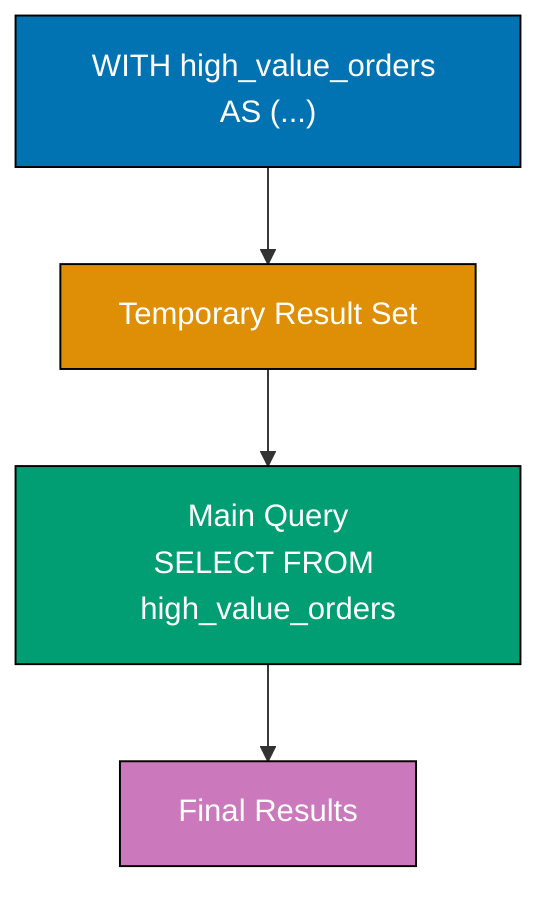

**Code**:

```sql
CREATE DATABASE example_31;
\c example_31;

CREATE TABLE orders (
    id SERIAL PRIMARY KEY,
    customer VARCHAR(100),
    total DECIMAL(10, 2),
    order_date DATE
);

INSERT INTO orders (customer, total, order_date)
VALUES
    ('Alice', 1500.00, '2025-12-20'),
    ('Bob', 200.00, '2025-12-21'),
    ('Alice', 800.00, '2025-12-22'),
    ('Charlie', 3000.00, '2025-12-23'),
    ('Bob', 150.00, '2025-12-24');

-- Basic CTE
WITH high_value_orders AS (
    SELECT customer, total, order_date
    FROM orders
    WHERE total >= 500  -- => Only orders $500 or more
)
SELECT customer, SUM(total) AS total_high_value
FROM high_value_orders
GROUP BY customer;
-- => Alice: 2300.00, Charlie: 3000.00

-- Multiple CTEs
WITH
    order_stats AS (
        SELECT
            customer,
            COUNT(*) AS num_orders,
            SUM(total) AS total_spent
        FROM orders
        GROUP BY customer
    ),
    high_spenders AS (
        SELECT customer, total_spent
        FROM order_stats
        WHERE total_spent > 1000  -- => Customers who spent over $1000
    )
SELECT
    os.customer,
    os.num_orders,
    os.total_spent,
    CASE
        WHEN hs.customer IS NOT NULL THEN 'VIP'
        ELSE 'Regular'
    END AS customer_tier
FROM order_stats os
LEFT JOIN high_spenders hs ON os.customer = hs.customer;
-- => Shows all customers with VIP tier for high spenders

-- CTE with aggregation and filtering
WITH monthly_revenue AS (
    SELECT
        DATE_TRUNC('month', order_date) AS month,  -- => First day of month
        SUM(total) AS revenue
    FROM orders
    GROUP BY DATE_TRUNC('month', order_date)
)
SELECT
    TO_CHAR(month, 'YYYY-MM') AS month,
    revenue,
    LAG(revenue) OVER (ORDER BY month) AS prev_month_revenue,
    revenue - LAG(revenue) OVER (ORDER BY month) AS revenue_change
FROM monthly_revenue;
-- => Shows month-over-month revenue changes
```

**Key Takeaway**: CTEs improve readability by naming complex subqueries - use them to break down complex queries into logical steps. Multiple CTEs can reference earlier CTEs, creating a pipeline of transformations.

### Example 32: Window Functions (ROW_NUMBER, RANK, DENSE_RANK)

Window functions compute values across sets of rows related to the current row without collapsing rows like GROUP BY. ROW_NUMBER assigns sequential numbers, RANK skips numbers after ties, DENSE_RANK doesn't skip.

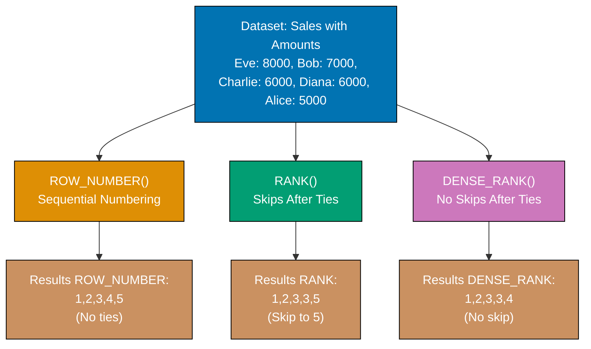

**Code**:

```sql
CREATE DATABASE example_32;
\c example_32;

CREATE TABLE sales (
    id SERIAL PRIMARY KEY,
    salesperson VARCHAR(100),
    region VARCHAR(50),
    amount DECIMAL(10, 2)
);

INSERT INTO sales (salesperson, region, amount)
VALUES
    ('Alice', 'North', 5000),
    ('Bob', 'North', 7000),
    ('Charlie', 'South', 6000),
    ('Diana', 'South', 6000),  -- => Tied with Charlie
    ('Eve', 'North', 8000);

-- ROW_NUMBER: sequential numbering (no ties)
SELECT
    salesperson,
    region,
    amount,
    ROW_NUMBER() OVER (ORDER BY amount DESC) AS row_num
FROM sales;
-- => Eve (1), Bob (2), Charlie (3), Diana (4), Alice (5)
-- => Diana gets 4 even though tied with Charlie

-- RANK: skips numbers after ties
SELECT
    salesperson,
    region,
    amount,
    RANK() OVER (ORDER BY amount DESC) AS rank
FROM sales;
-- => Eve (1), Bob (2), Charlie (3), Diana (3), Alice (5)
-- => Both Charlie and Diana get 3, next is 5 (skips 4)

-- DENSE_RANK: doesn't skip numbers after ties
SELECT
    salesperson,
    region,
    amount,
    DENSE_RANK() OVER (ORDER BY amount DESC) AS dense_rank
FROM sales;
-- => Eve (1), Bob (2), Charlie (3), Diana (3), Alice (4)
-- => After tie at 3, next is 4 (no skip)

-- Window function with PARTITION BY
SELECT
    salesperson,
    region,
    amount,
    ROW_NUMBER() OVER (PARTITION BY region ORDER BY amount DESC) AS region_rank
FROM sales;
-- => Separate ranking per region
-- => North: Eve (1), Bob (2), Alice (3)
-- => South: Charlie (1), Diana (2)

-- Find top salesperson per region
WITH ranked_sales AS (
    SELECT
        salesperson,
        region,
        amount,
        ROW_NUMBER() OVER (PARTITION BY region ORDER BY amount DESC) AS rank
    FROM sales
)
SELECT salesperson, region, amount
FROM ranked_sales
WHERE rank = 1;
-- => Eve (North, 8000), Charlie (South, 6000)
```

**Key Takeaway**: Window functions compute across row sets without collapsing - ROW_NUMBER for sequential numbering, RANK for competitive ranking (ties skip), DENSE_RANK for no skipping. PARTITION BY creates independent windows per group.

### Example 33: Window Functions with Partitioning

PARTITION BY divides result sets into groups before applying window functions - each partition gets independent calculations. Combine with ORDER BY for sophisticated analytics.

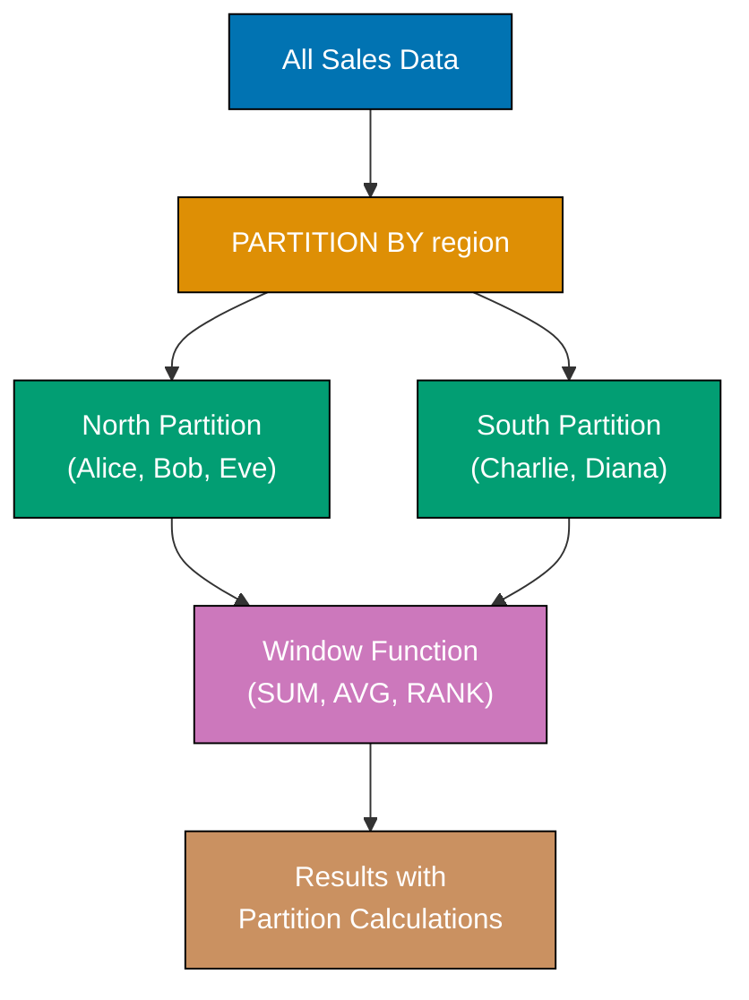

**Code**:

```sql
CREATE DATABASE example_33;
\c example_33;

CREATE TABLE transactions (
    id SERIAL PRIMARY KEY,
    account VARCHAR(50),
    category VARCHAR(50),
    amount DECIMAL(10, 2),
    transaction_date DATE
);

INSERT INTO transactions (account, category, amount, transaction_date)
VALUES
    ('A', 'Food', 50.00, '2025-12-20'),
    ('A', 'Food', 75.00, '2025-12-21'),
    ('A', 'Transport', 30.00, '2025-12-22'),
    ('B', 'Food', 60.00, '2025-12-20'),
    ('B', 'Transport', 45.00, '2025-12-21'),
    ('B', 'Food', 80.00, '2025-12-22');

-- Running total per account
SELECT
    account,
    category,
    amount,
    transaction_date,
    SUM(amount) OVER (
        PARTITION BY account
        ORDER BY transaction_date
    ) AS running_total
FROM transactions
ORDER BY account, transaction_date;
-- => Account A: 50, 125, 155 (cumulative)
-- => Account B: 60, 105, 185 (independent cumulative)

-- Running total per account AND category
SELECT
    account,
    category,
    amount,
    transaction_date,
    SUM(amount) OVER (
        PARTITION BY account, category
        ORDER BY transaction_date
    ) AS category_running_total
FROM transactions
ORDER BY account, category, transaction_date;
-- => Separate running totals for A-Food, A-Transport, B-Food, B-Transport

-- Average per partition
SELECT
    account,
    category,
    amount,
    AVG(amount) OVER (PARTITION BY account) AS account_avg,
    AVG(amount) OVER (PARTITION BY category) AS category_avg
FROM transactions;
-- => Shows average spending per account and per category

-- First and last values in partition
SELECT
    account,
    transaction_date,
    amount,
    FIRST_VALUE(amount) OVER (
        PARTITION BY account
        ORDER BY transaction_date
    ) AS first_amount,
    LAST_VALUE(amount) OVER (
        PARTITION BY account
        ORDER BY transaction_date
        ROWS BETWEEN UNBOUNDED PRECEDING AND UNBOUNDED FOLLOWING
    ) AS last_amount
FROM transactions
ORDER BY account, transaction_date;
-- => Shows first and last transaction amount per account
```

**Key Takeaway**: PARTITION BY creates independent calculation windows - use it for running totals per group, rankings within categories, or comparative analytics. Combine with ROWS/RANGE clauses to control window frame boundaries.

### Example 34: Recursive CTEs

Recursive CTEs call themselves - essential for hierarchical data (org charts, category trees, graph traversal). Base case provides initial rows, recursive case references the CTE itself.

**Code**:

```sql
CREATE DATABASE example_34;
\c example_34;

CREATE TABLE employees (
    id SERIAL PRIMARY KEY,
    name VARCHAR(100),
    manager_id INTEGER
);

INSERT INTO employees (id, name, manager_id)
VALUES
    (1, 'CEO Alice', NULL),
    (2, 'VP Bob', 1),
    (3, 'VP Charlie', 1),
    (4, 'Manager Diana', 2),
    (5, 'Manager Eve', 2),
    (6, 'Employee Frank', 4),
    (7, 'Employee Grace', 5);

-- Find all reports under CEO (all employees)
WITH RECURSIVE org_chart AS (
    -- Base case: start with CEO
    SELECT id, name, manager_id, 1 AS level, name AS path
    FROM employees
    WHERE manager_id IS NULL  -- => CEO has no manager

    UNION ALL

    -- Recursive case: find employees managed by previous results
    SELECT
        e.id,
        e.name,
        e.manager_id,
        oc.level + 1,
        oc.path || ' > ' || e.name
    FROM employees e
    INNER JOIN org_chart oc ON e.manager_id = oc.id
)
SELECT
    id,
    name,
    level,
    path
FROM org_chart
ORDER BY level, name;
-- => Shows org hierarchy with level and path from CEO

-- Generate series (numbers 1 to 10)
WITH RECURSIVE series AS (
    SELECT 1 AS n  -- => Base case
    UNION ALL
    SELECT n + 1
    FROM series
    WHERE n < 10   -- => Termination condition
)
SELECT n FROM series;
-- => 1, 2, 3, ..., 10

-- Find all ancestors of an employee
WITH RECURSIVE ancestors AS (
    -- Base case: start with specific employee
    SELECT id, name, manager_id
    FROM employees
    WHERE id = 6  -- => Frank

    UNION ALL

    -- Recursive case: find manager of previous results
    SELECT e.id, e.name, e.manager_id
    FROM employees e
    INNER JOIN ancestors a ON a.manager_id = e.id
)
SELECT name FROM ancestors;
-- => Frank, Manager Diana, VP Bob, CEO Alice (upward traversal)
```

**Key Takeaway**: Recursive CTEs solve hierarchical problems - base case provides starting rows, recursive case references the CTE to traverse relationships. Always include termination conditions to prevent infinite loops.

### Example 35: UNION, INTERSECT, EXCEPT

Set operations combine results from multiple queries - UNION merges results (removes duplicates), INTERSECT finds common rows, EXCEPT finds rows in first query but not second.

**Code**:

```sql
CREATE DATABASE example_35;
\c example_35;

CREATE TABLE customers_2024 (
    id SERIAL PRIMARY KEY,
    email VARCHAR(100)
);

CREATE TABLE customers_2025 (
    id SERIAL PRIMARY KEY,
    email VARCHAR(100)
);

INSERT INTO customers_2024 (email)
VALUES ('alice@example.com'), ('bob@example.com'), ('charlie@example.com');

INSERT INTO customers_2025 (email)
VALUES ('bob@example.com'), ('charlie@example.com'), ('diana@example.com');

-- UNION: combine results, remove duplicates
SELECT email FROM customers_2024
UNION
SELECT email FROM customers_2025;
-- => alice@example.com, bob@example.com, charlie@example.com, diana@example.com
-- => Duplicates removed (bob, charlie appear in both)

-- UNION ALL: combine results, keep duplicates
SELECT email FROM customers_2024
UNION ALL
SELECT email FROM customers_2025;
-- => 6 rows (bob and charlie appear twice)

-- INTERSECT: rows in both queries
SELECT email FROM customers_2024
INTERSECT
SELECT email FROM customers_2025;
-- => bob@example.com, charlie@example.com (customers in both years)

-- EXCEPT: rows in first query but not second
SELECT email FROM customers_2024
EXCEPT
SELECT email FROM customers_2025;
-- => alice@example.com (2024 customer who didn't return in 2025)

SELECT email FROM customers_2025
EXCEPT
SELECT email FROM customers_2024;
-- => diana@example.com (new customer in 2025)

-- Complex example with ORDER BY
(SELECT email, '2024' AS year FROM customers_2024)
UNION
(SELECT email, '2025' AS year FROM customers_2025)
ORDER BY email, year;
-- => Combined results sorted by email then year
```

**Key Takeaway**: UNION combines queries (removes duplicates), UNION ALL keeps duplicates, INTERSECT finds common rows, EXCEPT finds differences. Queries must have same number of columns with compatible types. Use ORDER BY after set operations to sort final results.

## Group 2: Indexes and Performance

### Example 36: Creating B-tree Indexes

B-tree indexes (default) speed up lookups, range queries, and sorting. Create indexes on columns frequently used in WHERE, JOIN, and ORDER BY clauses.

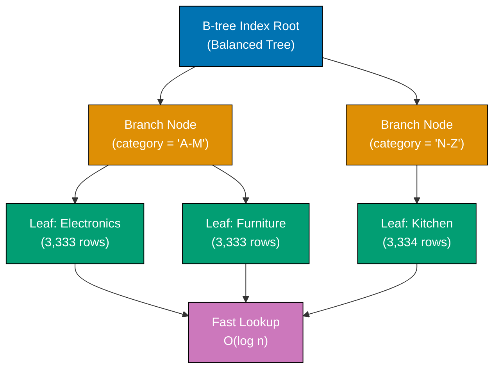

**Code**:

```sql
CREATE DATABASE example_36;
\c example_36;

CREATE TABLE products (
    id SERIAL PRIMARY KEY,        -- => Automatically creates B-tree index on id
    name VARCHAR(200),
    category VARCHAR(50),
    price DECIMAL(10, 2),
    created_at TIMESTAMP DEFAULT NOW()
);

-- Insert test data
INSERT INTO products (name, category, price)
SELECT
    'Product ' || generate_series,
    CASE (generate_series % 3)
        WHEN 0 THEN 'Electronics'
        WHEN 1 THEN 'Furniture'
        ELSE 'Kitchen'
    END,
    (random() * 1000)::DECIMAL(10, 2)
FROM generate_series(1, 10000);

-- Query without index (slow on large tables)
EXPLAIN ANALYZE
SELECT * FROM products
WHERE category = 'Electronics';
-- => Seq Scan (sequential scan through entire table)

-- Create B-tree index
CREATE INDEX idx_products_category ON products(category);
-- => Creates index on category column

-- Same query with index (fast)
EXPLAIN ANALYZE
SELECT * FROM products
WHERE category = 'Electronics';
-- => Index Scan using idx_products_category (much faster)

-- Index helps with sorting
EXPLAIN ANALYZE
SELECT name, price
FROM products
ORDER BY price DESC
LIMIT 10;
-- => May use sequential scan without index on price

CREATE INDEX idx_products_price ON products(price DESC);
-- => Creates index optimized for descending sort

EXPLAIN ANALYZE
SELECT name, price
FROM products
ORDER BY price DESC
LIMIT 10;
-- => Index Scan using idx_products_price (avoids full table sort)

-- List all indexes on table
SELECT indexname, indexdef
FROM pg_indexes
WHERE tablename = 'products';
-- => Shows all indexes including primary key

-- Drop index
DROP INDEX idx_products_category;
-- => Removes index (queries slower but writes faster)
```

**Key Takeaway**: B-tree indexes accelerate lookups and range queries - create them on columns frequently used in WHERE, JOIN, and ORDER BY. Primary keys automatically get indexes. Too many indexes slow down writes (INSERT/UPDATE/DELETE).

### Example 37: Unique Indexes

Unique indexes enforce uniqueness like UNIQUE constraints but can be partial or conditional. Use them for natural keys, business identifiers, or ensuring data integrity.

**Code**:

```sql
CREATE DATABASE example_37;
\c example_37;

CREATE TABLE users (
    id SERIAL PRIMARY KEY,
    username VARCHAR(50),
    email VARCHAR(100),
    deleted_at TIMESTAMP
);

-- Create unique index on username
CREATE UNIQUE INDEX idx_users_username ON users(username);
-- => Enforces username uniqueness

INSERT INTO users (username, email)
VALUES ('alice', 'alice@example.com');
-- => Success

INSERT INTO users (username, email)
VALUES ('alice', 'alice2@example.com');
-- => ERROR: duplicate key violates unique constraint "idx_users_username"

-- Partial unique index (conditional uniqueness)
DROP INDEX idx_users_username;

CREATE UNIQUE INDEX idx_users_username_active
ON users(username)
WHERE deleted_at IS NULL;
-- => Enforces uniqueness only for non-deleted users

INSERT INTO users (username, email, deleted_at)
VALUES ('alice', 'alice@example.com', '2025-01-01');  -- => Deleted user
-- => Success (deleted_at IS NOT NULL, index doesn't apply)

INSERT INTO users (username, email)
VALUES ('alice', 'alice2@example.com');
-- => Success (previous alice is deleted)

INSERT INTO users (username, email)
VALUES ('alice', 'alice3@example.com');
-- => ERROR: duplicate active username

-- Composite unique index
CREATE TABLE products (
    id SERIAL PRIMARY KEY,
    name VARCHAR(200),
    version VARCHAR(20)
);

CREATE UNIQUE INDEX idx_products_name_version
ON products(name, version);
-- => Combination of name+version must be unique

INSERT INTO products (name, version)
VALUES ('PostgreSQL', '16'), ('PostgreSQL', '15');
-- => Success (different versions)

INSERT INTO products (name, version)
VALUES ('PostgreSQL', '16');
-- => ERROR: duplicate combination
```

**Key Takeaway**: Unique indexes enforce uniqueness constraints - use them for business keys (usernames, emails, codes). Partial unique indexes with WHERE clauses enable conditional uniqueness (active records only). Composite unique indexes enforce uniqueness on column combinations.

### Example 38: Multi-Column Indexes

Multi-column indexes speed up queries filtering on multiple columns. Column order matters - queries must use leftmost columns to benefit from index.

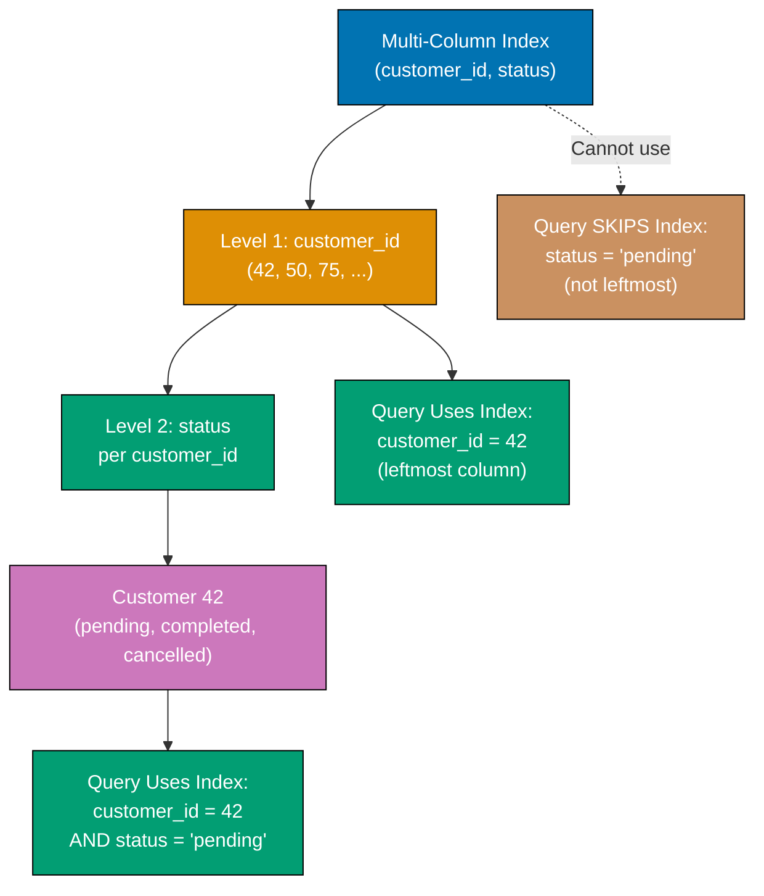

**Code**:

```sql
CREATE DATABASE example_38;
\c example_38;

CREATE TABLE orders (
    id SERIAL PRIMARY KEY,
    customer_id INTEGER,
    status VARCHAR(20),
    created_at TIMESTAMP DEFAULT NOW()
);

-- Insert test data
INSERT INTO orders (customer_id, status, created_at)
SELECT
    (random() * 100)::INTEGER + 1,
    CASE (random() * 3)::INTEGER
        WHEN 0 THEN 'pending'
        WHEN 1 THEN 'completed'
        ELSE 'cancelled'
    END,
    NOW() - (random() * 365 || ' days')::INTERVAL
FROM generate_series(1, 10000);

-- Common query pattern
EXPLAIN ANALYZE
SELECT * FROM orders
WHERE customer_id = 42 AND status = 'pending';
-- => Sequential Scan (no index yet)

-- Create multi-column index
CREATE INDEX idx_orders_customer_status
ON orders(customer_id, status);
-- => Index on (customer_id, status) in that order

EXPLAIN ANALYZE
SELECT * FROM orders
WHERE customer_id = 42 AND status = 'pending';
-- => Index Scan using idx_orders_customer_status (fast)

-- Query using only first column (uses index)
EXPLAIN ANALYZE
SELECT * FROM orders
WHERE customer_id = 42;
-- => Index Scan (uses index, even without status filter)

-- Query using only second column (doesn't use index efficiently)
EXPLAIN ANALYZE
SELECT * FROM orders
WHERE status = 'pending';
-- => Seq Scan (cannot use index starting from middle)

-- Create separate index for status-only queries
CREATE INDEX idx_orders_status ON orders(status);

EXPLAIN ANALYZE
SELECT * FROM orders
WHERE status = 'pending';
-- => Index Scan using idx_orders_status

-- Three-column index
CREATE INDEX idx_orders_customer_status_date
ON orders(customer_id, status, created_at);

-- Queries benefiting from three-column index
EXPLAIN ANALYZE
SELECT * FROM orders
WHERE customer_id = 42
  AND status = 'pending'
  AND created_at > NOW() - INTERVAL '30 days';
-- => Uses idx_orders_customer_status_date efficiently
```

**Key Takeaway**: Multi-column indexes speed up queries filtering on multiple columns - order matters (leftmost columns required). Query `WHERE customer_id = X AND status = Y` uses index on (customer_id, status), but `WHERE status = Y` alone doesn't. Create separate indexes for different query patterns.

### Example 39: Partial Indexes

Partial indexes include only rows matching a WHERE condition - smaller, faster, and perfect for queries filtering on specific values or ranges.

**Code**:

```sql
CREATE DATABASE example_39;
\c example_39;

CREATE TABLE orders (
    id SERIAL PRIMARY KEY,
    customer_id INTEGER,
    status VARCHAR(20),
    total DECIMAL(10, 2),
    created_at TIMESTAMP DEFAULT NOW()
);

INSERT INTO orders (customer_id, status, total, created_at)
SELECT
    (random() * 100)::INTEGER + 1,
    CASE (random() * 4)::INTEGER
        WHEN 0 THEN 'pending'
        WHEN 1 THEN 'completed'
        WHEN 2 THEN 'cancelled'
        ELSE 'refunded'
    END,
    (random() * 1000)::DECIMAL(10, 2),
    NOW() - (random() * 365 || ' days')::INTERVAL
FROM generate_series(1, 10000);

-- Partial index for active orders only
CREATE INDEX idx_orders_pending
ON orders(customer_id)
WHERE status = 'pending';
-- => Indexes only pending orders (smaller, faster)

EXPLAIN ANALYZE
SELECT * FROM orders
WHERE customer_id = 42 AND status = 'pending';
-- => Uses idx_orders_pending

-- Partial index for high-value orders
CREATE INDEX idx_orders_high_value
ON orders(created_at DESC)
WHERE total >= 500;
-- => Indexes only orders $500 or more

EXPLAIN ANALYZE
SELECT * FROM orders
WHERE total >= 500
ORDER BY created_at DESC
LIMIT 10;
-- => Uses idx_orders_high_value

-- Partial index for recent orders
CREATE INDEX idx_orders_recent
ON orders(customer_id, total)
WHERE created_at >= '2025-01-01';
-- => Indexes only orders from 2025 onward

EXPLAIN ANALYZE
SELECT customer_id, SUM(total) AS total_spent
FROM orders
WHERE created_at >= '2025-01-01'
GROUP BY customer_id;
-- => May use idx_orders_recent

-- Compare index sizes
SELECT
    indexname,
    pg_size_pretty(pg_relation_size(indexname::regclass)) AS index_size
FROM pg_indexes
WHERE tablename = 'orders';
-- => Partial indexes smaller than full indexes
```

**Key Takeaway**: Partial indexes with WHERE clauses index subsets of rows - use them for queries frequently filtering on specific values (pending orders, active users, recent records). Smaller indexes mean faster searches and less storage.

### Example 40: Using EXPLAIN to Analyze Queries

EXPLAIN shows query execution plans - how PostgreSQL retrieves data. EXPLAIN ANALYZE executes queries and shows actual runtimes, revealing performance bottlenecks.

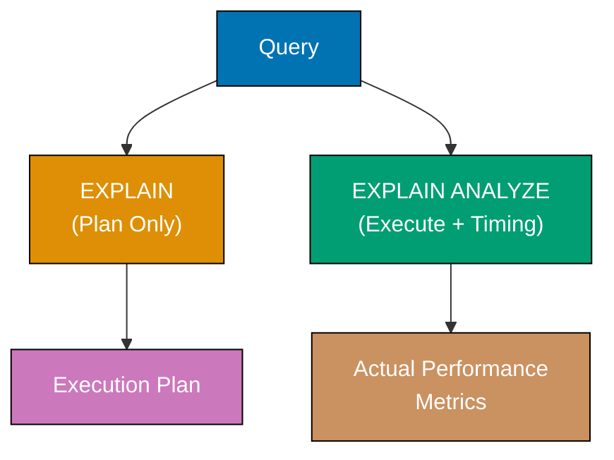

**Code**:

```sql
CREATE DATABASE example_40;
\c example_40;

CREATE TABLE products (
    id SERIAL PRIMARY KEY,
    name VARCHAR(200),
    category VARCHAR(50),
    price DECIMAL(10, 2)
);

INSERT INTO products (name, category, price)
SELECT
    'Product ' || generate_series,
    CASE (generate_series % 3)
        WHEN 0 THEN 'Electronics'
        WHEN 1 THEN 'Furniture'
        ELSE 'Kitchen'
    END,
    (random() * 1000)::DECIMAL(10, 2)
FROM generate_series(1, 10000);

-- EXPLAIN shows execution plan without running query
EXPLAIN
SELECT * FROM products
WHERE category = 'Electronics' AND price > 500;
-- => Shows: Seq Scan on products
-- => Filter: ((category = 'Electronics') AND (price > 500))
-- => Cost estimate (not actual timing)

-- EXPLAIN ANALYZE executes and shows actual timings
EXPLAIN ANALYZE
SELECT * FROM products
WHERE category = 'Electronics' AND price > 500;
-- => Shows: Seq Scan, actual time, rows returned
-- => Planning Time: X ms, Execution Time: Y ms

-- Create index and compare
CREATE INDEX idx_products_category_price
ON products(category, price);

EXPLAIN ANALYZE
SELECT * FROM products
WHERE category = 'Electronics' AND price > 500;
-- => Shows: Index Scan using idx_products_category_price
-- => Much faster execution time

-- Analyze aggregation query
EXPLAIN ANALYZE
SELECT category, COUNT(*), AVG(price)
FROM products
GROUP BY category;
-- => Shows: HashAggregate or GroupAggregate
-- => Seq Scan on products

-- Analyze join query
CREATE TABLE orders (
    id SERIAL PRIMARY KEY,
    product_id INTEGER,
    quantity INTEGER
);

INSERT INTO orders (product_id, quantity)
SELECT
    (random() * 10000)::INTEGER + 1,
    (random() * 10)::INTEGER + 1
FROM generate_series(1, 5000);

EXPLAIN ANALYZE
SELECT p.name, SUM(o.quantity) AS total_sold
FROM products p
INNER JOIN orders o ON p.id = o.product_id
GROUP BY p.id, p.name;
-- => Shows: Hash Join or Nested Loop
-- => Execution time for join strategy

-- Check query planner statistics
ANALYZE products;
ANALYZE orders;
-- => Updates table statistics for better query plans

-- View BUFFERS to see cache usage
EXPLAIN (ANALYZE, BUFFERS)
SELECT * FROM products WHERE price > 900;
-- => Shows shared hit (cache) vs read (disk) buffers
```

**Key Takeaway**: Use EXPLAIN to see execution plans, EXPLAIN ANALYZE to measure actual performance. Look for Seq Scan on large tables (add indexes), high cost estimates, and slow actual times. Run ANALYZE periodically to update statistics for optimal query planning.

## Group 3: Advanced Data Types

### Example 41: Arrays

PostgreSQL supports array columns - store multiple values in single column. Useful for tags, categories, or ordered lists without separate junction tables.

**Code**:

```sql
CREATE DATABASE example_41;
\c example_41;

CREATE TABLE articles (
    id SERIAL PRIMARY KEY,
    title VARCHAR(200),
    tags TEXT[],              -- => Array of text values
    ratings INTEGER[]         -- => Array of integers
);

-- Insert arrays
INSERT INTO articles (title, tags, ratings)
VALUES
    ('PostgreSQL Guide', ARRAY['database', 'sql', 'tutorial'], ARRAY[5, 4, 5, 4]),
    ('Docker Basics', ARRAY['docker', 'containers'], ARRAY[5, 5, 3]),
    ('Kubernetes', ARRAY['k8s', 'orchestration', 'docker'], ARRAY[4, 3, 4, 5, 5]);

-- Alternative array syntax
INSERT INTO articles (title, tags, ratings)
VALUES
    ('Advanced SQL', '{"sql", "advanced", "postgresql"}', '{5, 5, 4, 5}');

SELECT * FROM articles;

-- Access array elements (1-indexed!)
SELECT
    title,
    tags[1] AS first_tag,         -- => First element
    tags[2] AS second_tag,        -- => Second element
    array_length(tags, 1) AS num_tags  -- => Number of elements
FROM articles;

-- Check if array contains value
SELECT title
FROM articles
WHERE 'docker' = ANY(tags);
-- => Returns articles with 'docker' in tags
-- => Docker Basics, Kubernetes

-- Array overlap operator
SELECT title
FROM articles
WHERE tags && ARRAY['sql', 'database'];  -- => Overlap: shares at least one element
-- => PostgreSQL Guide, Advanced SQL

-- Array containment
SELECT title
FROM articles
WHERE tags @> ARRAY['sql'];  -- => Contains all elements in array
-- => PostgreSQL Guide, Advanced SQL

-- Unnest array to rows
SELECT
    title,
    unnest(tags) AS tag
FROM articles;
-- => Returns one row per tag (expands array to multiple rows)

-- Aggregate into array
SELECT
    ARRAY_AGG(title ORDER BY id) AS all_titles
FROM articles;
-- => Collects all titles into single array

-- Array functions
SELECT
    title,
    array_length(ratings, 1) AS num_ratings,
    ROUND(AVG(r), 2) AS avg_rating
FROM articles, unnest(ratings) AS r
GROUP BY id, title;
-- => Calculates average rating per article
```

**Key Takeaway**: Arrays store multiple values in one column - use them for tags, categories, or small ordered lists. Access elements with `[index]` (1-indexed), check membership with `ANY()`, and unnest to rows with `unnest()`. Avoid arrays for frequently queried relationships (use junction tables instead).

### Example 42: JSON and JSONB Types

JSON stores text-based JSON, JSONB stores binary JSON (faster, supports indexing). JSONB is preferred for most use cases - it enables efficient querying and indexing.

**Code**:

```sql
CREATE DATABASE example_42;
\c example_42;

CREATE TABLE users (
    id SERIAL PRIMARY KEY,
    name VARCHAR(100),
    metadata JSON,          -- => Text-based JSON
    preferences JSONB       -- => Binary JSON (faster, indexable)
);

-- Insert JSON data
INSERT INTO users (name, metadata, preferences)
VALUES
    ('Alice', '{"age": 30, "city": "New York"}', '{"theme": "dark", "notifications": true}'),
    ('Bob', '{"age": 25, "city": "Boston"}', '{"theme": "light", "notifications": false}'),
    ('Charlie', '{"age": 35, "city": "Chicago", "verified": true}', '{"theme": "dark", "notifications": true, "language": "en"}');

SELECT * FROM users;

-- JSON vs JSONB differences
SELECT
    pg_column_size(metadata) AS json_size,
    pg_column_size(preferences) AS jsonb_size
FROM users
WHERE name = 'Alice';
-- => JSONB often larger in storage but faster to query

-- JSON preserves formatting, JSONB normalizes
INSERT INTO users (name, metadata, preferences)
VALUES ('Diana', '{"age":  28,  "city":  "Denver"}', '{"theme":  "auto"}');

SELECT metadata, preferences
FROM users
WHERE name = 'Diana';
-- => JSON keeps extra spaces, JSONB normalizes
```

**Key Takeaway**: Use JSONB for production (faster queries, supports indexing), JSON only when you need exact formatting preservation. JSONB enables efficient queries, indexing, and updates of nested data without separate columns.

### Example 43: Querying JSON with -> and ->>

PostgreSQL provides operators to extract JSON values - `->` returns JSON, `->>` returns text. Navigate nested objects with chained operators.

**Code**:

```sql
CREATE DATABASE example_43;
\c example_43;

CREATE TABLE products (
    id SERIAL PRIMARY KEY,
    name VARCHAR(200),
    details JSONB
);

INSERT INTO products (name, details)
VALUES
    ('Laptop', '{"brand": "Dell", "specs": {"cpu": "i7", "ram": 16, "storage": 512}, "price": 999.99}'),
    ('Phone', '{"brand": "Apple", "specs": {"cpu": "A15", "ram": 6, "storage": 128}, "price": 899.99}'),
    ('Tablet', '{"brand": "Samsung", "specs": {"cpu": "Snapdragon", "ram": 8, "storage": 256}, "price": 599.99}');

-- Extract JSON field (returns JSON)
SELECT
    name,
    details -> 'brand' AS brand_json,     -- => Returns JSON: "Dell"
    details ->> 'brand' AS brand_text     -- => Returns text: Dell
FROM products;

-- Extract nested fields
SELECT
    name,
    details -> 'specs' -> 'cpu' AS cpu_json,      -- => Returns JSON: "i7"
    details -> 'specs' ->> 'cpu' AS cpu_text,     -- => Returns text: i7
    (details -> 'specs' ->> 'ram')::INTEGER AS ram_gb  -- => Cast to integer
FROM products;

-- Filter by JSON field
SELECT name, details ->> 'brand' AS brand
FROM products
WHERE details ->> 'brand' = 'Apple';
-- => Phone

-- Filter by nested field
SELECT name, details -> 'specs' ->> 'ram' AS ram
FROM products
WHERE (details -> 'specs' ->> 'ram')::INTEGER >= 8;
-- => Laptop (16 GB), Tablet (8 GB)

-- Extract numeric JSON field for calculation
SELECT
    name,
    (details ->> 'price')::DECIMAL AS price,
    (details ->> 'price')::DECIMAL * 0.9 AS discounted_price
FROM products;

-- Check JSON field existence
SELECT name
FROM products
WHERE details ? 'price';  -- => Has 'price' key
-- => All products

SELECT name
FROM products
WHERE details -> 'specs' ? 'gpu';  -- => Has 'gpu' key in specs
-- => None (no products have GPU info)
```

**Key Takeaway**: Use `->` to extract JSON (for chaining), `->>` to extract text (for filtering, display). Chain operators for nested access: `column -> 'outer' ->> 'inner'`. Cast `->>` results to appropriate types for calculations and comparisons.

### Example 44: JSONB Operators and Functions

JSONB supports operators for containment, existence checks, and set operations. Functions enable updates, merges, and deep inspection of JSON structures.

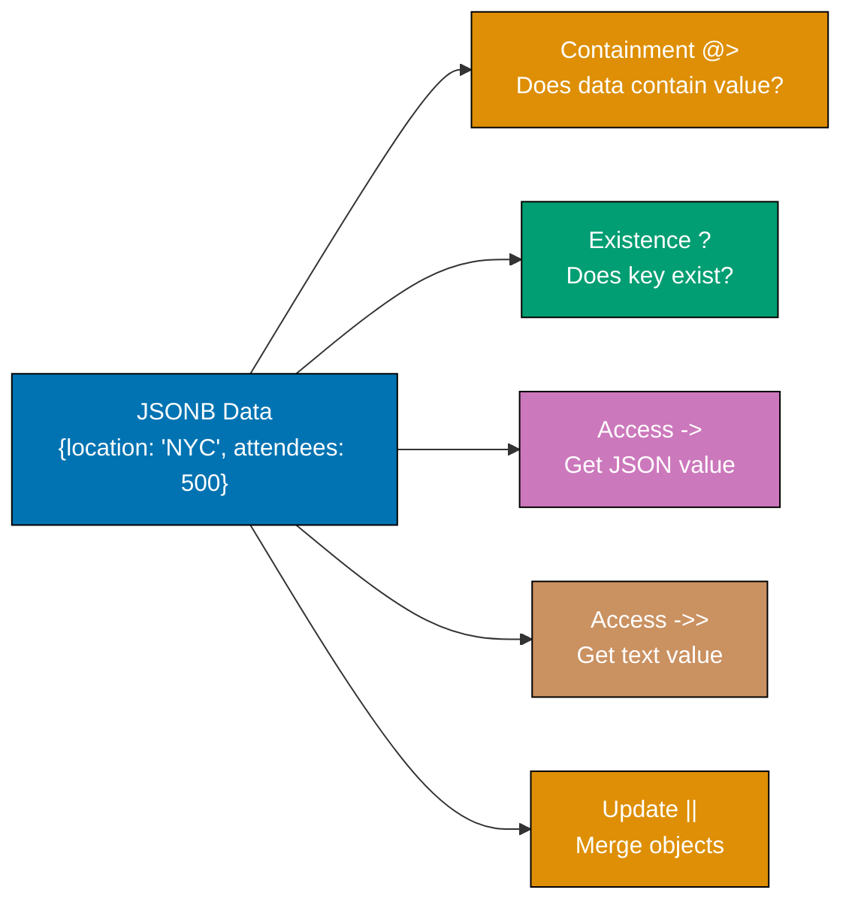

**Code**:

```sql
CREATE DATABASE example_44;
\c example_44;

CREATE TABLE events (
    id SERIAL PRIMARY KEY,
    name VARCHAR(200),
    data JSONB
);

INSERT INTO events (name, data)
VALUES
    ('Conference', '{"location": "NYC", "attendees": 500, "topics": ["AI", "Cloud"]}'),
    ('Webinar', '{"location": "Online", "attendees": 1000, "topics": ["DevOps", "Cloud"]}'),
    ('Workshop', '{"location": "Boston", "attendees": 50, "topics": ["SQL", "PostgreSQL"]}');

-- Containment operator @>
SELECT name
FROM events
WHERE data @> '{"location": "NYC"}';
-- => Conference (data contains {"location": "NYC"})

-- Contained by operator <@
SELECT name
FROM events
WHERE '{"attendees": 500}' <@ data;
-- => Conference ({"attendees": 500} is contained in data)

-- Key existence ?
SELECT name
FROM events
WHERE data ? 'location';
-- => All events (all have location key)

-- Any key existence ?|
SELECT name
FROM events
WHERE data ?| ARRAY['speakers', 'sponsors'];
-- => None (no events have speakers OR sponsors)

-- All keys existence ?&
SELECT name
FROM events
WHERE data ?& ARRAY['location', 'attendees'];
-- => All events (all have both keys)

-- Array contains element @>
SELECT name
FROM events
WHERE data -> 'topics' @> '"Cloud"';
-- => Conference, Webinar (topics array contains "Cloud")

-- Update JSONB field
UPDATE events
SET data = data || '{"capacity": 1000}'
WHERE name = 'Conference';
-- => Merges new field into existing JSON

SELECT data FROM events WHERE name = 'Conference';
-- => Now includes "capacity": 1000

-- Replace JSONB field
UPDATE events
SET data = jsonb_set(data, '{attendees}', '750')
WHERE name = 'Webinar';
-- => Sets attendees to 750

SELECT data FROM events WHERE name = 'Webinar';
-- => attendees is now 750

-- Remove JSONB key
UPDATE events
SET data = data - 'capacity'
WHERE name = 'Conference';
-- => Removes capacity field

-- JSONB functions
SELECT
    name,
    jsonb_object_keys(data) AS keys
FROM events;
-- => Returns one row per key

SELECT
    name,
    jsonb_pretty(data) AS formatted_json
FROM events;
-- => Pretty-prints JSON for readability
```

**Key Takeaway**: JSONB operators enable powerful queries - `@>` for containment, `?` for key existence, `||` for merging. Use `jsonb_set()` to update nested values, `-` to remove keys, and GIN indexes on JSONB columns for fast queries.

### Example 45: Range Types (daterange, int4range)

Range types store ranges of values (dates, numbers) with inclusive/exclusive boundaries. Perfect for reservations, scheduling, and availability tracking.

**Code**:

```sql
CREATE DATABASE example_45;
\c example_45;

CREATE TABLE reservations (
    id SERIAL PRIMARY KEY,
    room VARCHAR(50),
    guest VARCHAR(100),
    stay DATERANGE           -- => Date range with start and end
);

CREATE TABLE price_tiers (
    id SERIAL PRIMARY KEY,
    tier_name VARCHAR(50),
    order_count INT4RANGE    -- => Integer range
);

-- Insert date ranges
INSERT INTO reservations (room, guest, stay)
VALUES
    ('101', 'Alice', '[2025-12-20, 2025-12-25)'),  -- => Inclusive start, exclusive end
    ('102', 'Bob', '[2025-12-22, 2025-12-27)'),
    ('101', 'Charlie', '[2025-12-26, 2025-12-30)');

-- Insert integer ranges
INSERT INTO price_tiers (tier_name, order_count)
VALUES
    ('Bronze', '[0, 10)'),      -- => 0 to 9 (exclusive end)
    ('Silver', '[10, 50)'),     -- => 10 to 49
    ('Gold', '[50, 100)'),      -- => 50 to 99
    ('Platinum', '[100,)');     -- => 100 and above (unbounded)

-- Check if range contains value
SELECT room, guest
FROM reservations
WHERE stay @> '2025-12-24'::DATE;
-- => Alice, Bob (ranges containing Dec 24)

-- Check if ranges overlap
SELECT r1.guest AS guest1, r2.guest AS guest2
FROM reservations r1, reservations r2
WHERE r1.id < r2.id
  AND r1.room = r2.room
  AND r1.stay && r2.stay;
-- => Alice and Bob (overlapping stays in room 101)

-- Find tier for order count
SELECT tier_name
FROM price_tiers
WHERE order_count @> 25;
-- => Silver (25 is in range [10, 50))

-- Range functions
SELECT
    room,
    guest,
    lower(stay) AS check_in,     -- => Start date
    upper(stay) AS check_out,    -- => End date
    upper(stay) - lower(stay) AS nights
FROM reservations;
-- => Calculates number of nights

-- Check range boundaries
SELECT
    tier_name,
    lower_inc(order_count) AS inclusive_start,  -- => true/false
    upper_inc(order_count) AS inclusive_end     -- => true/false
FROM price_tiers;
-- => Shows which boundaries are inclusive

-- Merge overlapping ranges
SELECT room, range_agg(stay) AS all_bookings
FROM reservations
GROUP BY room;
-- => ERROR: range_agg doesn't exist (need extension or custom aggregate)

-- Check for gaps in reservations
SELECT
    room,
    lag(upper(stay)) OVER (PARTITION BY room ORDER BY lower(stay)) AS prev_checkout,
    lower(stay) AS current_checkin
FROM reservations
ORDER BY room, lower(stay);
-- => Shows gaps between reservations
```

**Key Takeaway**: Range types store intervals with precise boundary semantics - use `@>` to check containment, `&&` for overlap detection. DATERANGE perfect for reservations and scheduling, INT4RANGE for tiered pricing and quotas. Boundaries can be inclusive `[` or exclusive `)`.

## Group 4: Transactions

### Example 46: BEGIN, COMMIT, ROLLBACK

Transactions group multiple statements into atomic units - either all succeed (COMMIT) or all fail (ROLLBACK). Essential for data consistency.

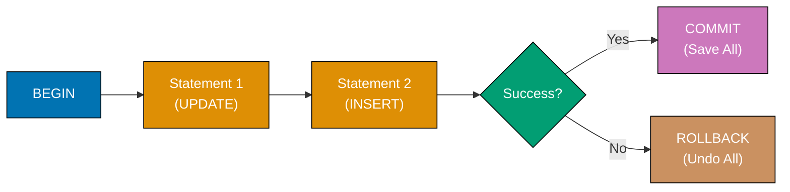

**Code**:

```sql
CREATE DATABASE example_46;
\c example_46;

CREATE TABLE accounts (
    id SERIAL PRIMARY KEY,
    name VARCHAR(100),
    balance DECIMAL(10, 2)
);

INSERT INTO accounts (name, balance)
VALUES ('Alice', 1000.00), ('Bob', 500.00);

-- Successful transaction
BEGIN;

UPDATE accounts SET balance = balance - 100 WHERE name = 'Alice';
-- => Alice: 900.00

UPDATE accounts SET balance = balance + 100 WHERE name = 'Bob';
-- => Bob: 600.00

COMMIT;
-- => Changes saved permanently

SELECT name, balance FROM accounts;
-- => Alice: 900.00, Bob: 600.00

-- Failed transaction with ROLLBACK
BEGIN;

UPDATE accounts SET balance = balance - 200 WHERE name = 'Alice';
-- => Alice: 700.00 (in transaction)

-- Simulate error condition
UPDATE accounts SET balance = balance + 200 WHERE name = 'NonExistent';
-- => ERROR: 0 rows updated

ROLLBACK;
-- => Undoes ALL changes in transaction

SELECT name, balance FROM accounts;
-- => Alice: 900.00, Bob: 600.00 (unchanged - transaction rolled back)

-- Automatic rollback on error
BEGIN;

UPDATE accounts SET balance = balance - 100 WHERE name = 'Alice';

-- This will cause error (negative balance)
UPDATE accounts SET balance = -9999 WHERE name = 'Bob';
-- => Violates business logic (if CHECK constraint exists)

-- If error occurs, ROLLBACK manually or connection closes
ROLLBACK;

-- Transaction with multiple operations
BEGIN;

INSERT INTO accounts (name, balance) VALUES ('Charlie', 300.00);
UPDATE accounts SET balance = balance - 50 WHERE name = 'Alice';
UPDATE accounts SET balance = balance + 50 WHERE name = 'Charlie';

COMMIT;
-- => All three operations saved atomically

SELECT name, balance FROM accounts;
-- => Alice: 850.00, Bob: 600.00, Charlie: 350.00
```

**Key Takeaway**: Wrap related operations in BEGIN/COMMIT for atomicity - either all succeed or all fail. Use ROLLBACK to undo changes when errors occur. Transactions prevent partial updates that leave data inconsistent.

### Example 47: Transaction Isolation Levels

Isolation levels control what transactions see of concurrent changes. READ COMMITTED (default) sees committed data, REPEATABLE READ sees snapshot at transaction start, SERIALIZABLE prevents all anomalies.

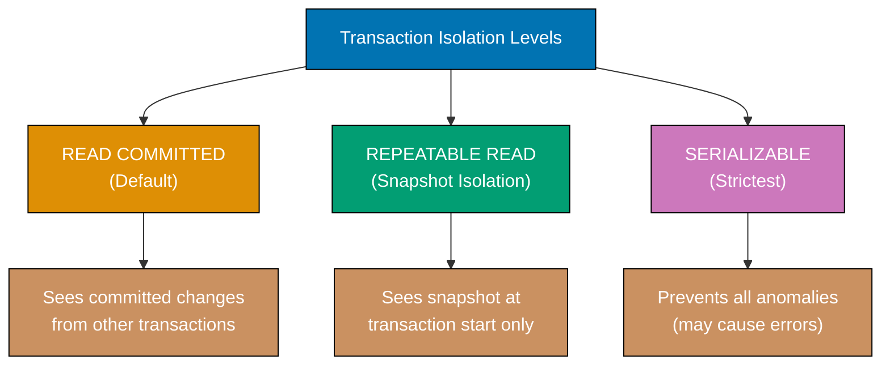

**Code**:

```sql
CREATE DATABASE example_47;
\c example_47;

CREATE TABLE inventory (
    id SERIAL PRIMARY KEY,
    product VARCHAR(100),
    quantity INTEGER
);

INSERT INTO inventory (product, quantity)
VALUES ('Laptop', 10);

-- Demonstration requires two concurrent sessions
-- Session 1 and Session 2 shown sequentially

-- READ COMMITTED (default isolation level)
-- Session 1:
BEGIN;
SELECT quantity FROM inventory WHERE product = 'Laptop';
-- => 10

-- Session 2 (concurrent):
BEGIN;
UPDATE inventory SET quantity = 8 WHERE product = 'Laptop';
COMMIT;
-- => Changes committed

-- Session 1 (continued):
SELECT quantity FROM inventory WHERE product = 'Laptop';
-- => 8 (sees committed changes from Session 2)
COMMIT;

-- REPEATABLE READ (snapshot isolation)
-- Session 1:
BEGIN TRANSACTION ISOLATION LEVEL REPEATABLE READ;
SELECT quantity FROM inventory WHERE product = 'Laptop';
-- => 8

-- Session 2:
BEGIN;
UPDATE inventory SET quantity = 6 WHERE product = 'Laptop';
COMMIT;

-- Session 1 (continued):
SELECT quantity FROM inventory WHERE product = 'Laptop';
-- => 8 (still sees old value - snapshot at transaction start)
COMMIT;

-- Now see updated value
SELECT quantity FROM inventory WHERE product = 'Laptop';
-- => 6

-- SERIALIZABLE (strictest isolation)
-- Session 1:
BEGIN TRANSACTION ISOLATION LEVEL SERIALIZABLE;
SELECT quantity FROM inventory WHERE product = 'Laptop';
-- => 6

-- Session 2:
BEGIN TRANSACTION ISOLATION LEVEL SERIALIZABLE;
UPDATE inventory SET quantity = quantity - 2 WHERE product = 'Laptop';
COMMIT;

-- Session 1 (continued):
UPDATE inventory SET quantity = quantity - 1 WHERE product = 'Laptop';
-- => ERROR: could not serialize access (serialization failure)
ROLLBACK;

-- Default isolation level check
SHOW default_transaction_isolation;
-- => read committed

-- Set session default
SET SESSION CHARACTERISTICS AS TRANSACTION ISOLATION LEVEL REPEATABLE READ;
```

**Key Takeaway**: READ COMMITTED sees latest committed data (may change within transaction), REPEATABLE READ sees snapshot at transaction start (no phantom reads), SERIALIZABLE prevents all anomalies (may cause serialization errors). Choose based on consistency needs vs. concurrency requirements.

### Example 48: ACID Properties in Practice

ACID ensures reliable transactions - Atomicity (all-or-nothing), Consistency (valid states), Isolation (concurrent safety), Durability (permanent after commit).

**Code**:

```sql
CREATE DATABASE example_48;
\c example_48;

CREATE TABLE accounts (
    id SERIAL PRIMARY KEY,
    name VARCHAR(100),
    balance DECIMAL(10, 2) CHECK (balance >= 0)  -- => Consistency: no negative balance
);

INSERT INTO accounts (name, balance)
VALUES ('Alice', 1000.00), ('Bob', 500.00);

-- Atomicity: all-or-nothing
BEGIN;

-- Transfer $200 from Alice to Bob
UPDATE accounts SET balance = balance - 200 WHERE name = 'Alice';
UPDATE accounts SET balance = balance + 200 WHERE name = 'Bob';

-- If either fails, both rollback (atomicity)
COMMIT;
-- => Both updates succeed or both fail

SELECT SUM(balance) FROM accounts;
-- => 1500.00 (total unchanged - money not created or lost)

-- Consistency: constraints enforced
BEGIN;

UPDATE accounts SET balance = balance - 1500 WHERE name = 'Alice';
-- => Would violate CHECK (balance >= 0)

COMMIT;
-- => ERROR: new row violates check constraint
-- => Transaction rolled back, balance unchanged

SELECT balance FROM accounts WHERE name = 'Alice';
-- => 800.00 (unchanged due to constraint violation)

-- Isolation: concurrent transactions don't interfere
-- See Example 47 for isolation level demonstrations

-- Durability: committed data survives crashes
BEGIN;

UPDATE accounts SET balance = balance + 100 WHERE name = 'Bob';

COMMIT;
-- => Changes written to disk (write-ahead log)
-- => Survives database restart

-- Verify durability (simulate restart by reconnecting)
SELECT name, balance FROM accounts;
-- => Bob: 800.00 (changes persisted)
```

**Key Takeaway**: ACID properties ensure reliable data - Atomicity prevents partial updates, Consistency enforces constraints, Isolation protects concurrent transactions, Durability guarantees persistence. PostgreSQL's transaction system implements all four automatically.

### Example 49: Savepoints

Savepoints create checkpoints within transactions - you can rollback to specific savepoints without aborting the entire transaction.

**Code**:

```sql
CREATE DATABASE example_49;
\c example_49;

CREATE TABLE logs (
    id SERIAL PRIMARY KEY,
    message TEXT,
    created_at TIMESTAMP DEFAULT NOW()
);

BEGIN;

INSERT INTO logs (message) VALUES ('Transaction started');

-- Create savepoint after first insert
SAVEPOINT after_first_insert;

INSERT INTO logs (message) VALUES ('Second operation');
INSERT INTO logs (message) VALUES ('Third operation');

-- Create another savepoint
SAVEPOINT after_third_insert;

INSERT INTO logs (message) VALUES ('Fourth operation');

-- Rollback to second savepoint (undo fourth insert)
ROLLBACK TO SAVEPOINT after_third_insert;

SELECT COUNT(*) FROM logs;
-- => 3 (fourth insert rolled back)

INSERT INTO logs (message) VALUES ('Alternative fourth operation');

COMMIT;
-- => Saves first, second, third, and alternative fourth

SELECT message FROM logs ORDER BY id;
-- => Shows 4 messages (fourth is alternative version)

-- Savepoint with error recovery
TRUNCATE logs;

BEGIN;

INSERT INTO logs (message) VALUES ('Operation 1');

SAVEPOINT after_op1;

INSERT INTO logs (message) VALUES ('Operation 2');

SAVEPOINT after_op2;

-- Simulate error
INSERT INTO logs (id, message) VALUES (1, 'Duplicate ID');
-- => ERROR: duplicate key (if id=1 already exists)

-- Rollback just the failed operation
ROLLBACK TO SAVEPOINT after_op2;

INSERT INTO logs (message) VALUES ('Operation 3 (recovery)');

COMMIT;

SELECT message FROM logs ORDER BY id;
-- => Operation 1, Operation 2, Operation 3 (error recovered)

-- Release savepoint (no longer needed)
BEGIN;

INSERT INTO logs (message) VALUES ('Step 1');

SAVEPOINT step1;

INSERT INTO logs (message) VALUES ('Step 2');

RELEASE SAVEPOINT step1;  -- => Cannot rollback to step1 anymore

COMMIT;
```

**Key Takeaway**: Savepoints enable partial rollback within transactions - create checkpoints with SAVEPOINT, rollback to them with ROLLBACK TO SAVEPOINT. Useful for error recovery without aborting entire transaction.

### Example 50: Deadlock Detection and Handling

Deadlocks occur when transactions wait for each other's locks. PostgreSQL detects deadlocks automatically and aborts one transaction (victim) to resolve.

**Code**:

```sql
CREATE DATABASE example_50;
\c example_50;

CREATE TABLE accounts (
    id SERIAL PRIMARY KEY,
    name VARCHAR(100),
    balance DECIMAL(10, 2)
);

INSERT INTO accounts (name, balance)
VALUES ('Alice', 1000.00), ('Bob', 500.00);

-- Deadlock scenario requires two concurrent sessions
-- Session 1 and Session 2 shown sequentially

-- Session 1:
BEGIN;
UPDATE accounts SET balance = balance - 100 WHERE name = 'Alice';
-- => Acquires lock on Alice's row

-- Session 2 (concurrent):
BEGIN;
UPDATE accounts SET balance = balance - 50 WHERE name = 'Bob';
-- => Acquires lock on Bob's row

-- Session 1 (continued):
UPDATE accounts SET balance = balance + 100 WHERE name = 'Bob';
-- => Waits for Bob's lock (held by Session 2)

-- Session 2 (continued):
UPDATE accounts SET balance = balance + 50 WHERE name = 'Alice';
-- => ERROR: deadlock detected
-- => One transaction aborted (deadlock victim)

-- Session 2 must ROLLBACK
ROLLBACK;

-- Session 1 can now proceed
COMMIT;

-- Avoiding deadlocks: consistent lock order
-- Always update accounts in ID order

-- Session 1:
BEGIN;
UPDATE accounts SET balance = balance - 100 WHERE id = 1;  -- => Alice
UPDATE accounts SET balance = balance + 100 WHERE id = 2;  -- => Bob
COMMIT;

-- Session 2:
BEGIN;
UPDATE accounts SET balance = balance - 50 WHERE id = 1;  -- => Alice (waits)
-- => No deadlock: both sessions acquire locks in same order

-- View locks
SELECT
    pid,
    relation::regclass AS table_name,
    mode,
    granted
FROM pg_locks
WHERE relation = 'accounts'::regclass;
-- => Shows active locks on accounts table

-- Timeout to prevent long waits
SET lock_timeout = '5s';  -- => Abort if lock not acquired in 5 seconds

BEGIN;
UPDATE accounts SET balance = balance - 100 WHERE name = 'Alice';
-- => If lock held by another session for >5s, ERROR: lock timeout
ROLLBACK;
```

**Key Takeaway**: PostgreSQL detects deadlocks and aborts one transaction (victim). Prevent deadlocks by acquiring locks in consistent order (e.g., by ID). Use lock_timeout to prevent indefinite waiting. Retry aborted transactions in application code.

## Group 5: Views and Functions

### Example 51: Creating Views

Views are saved queries that act like tables - use them to simplify complex queries, restrict column access, or provide consistent interfaces.

**Code**:

```sql
CREATE DATABASE example_51;
\c example_51;

CREATE TABLE employees (
    id SERIAL PRIMARY KEY,
    name VARCHAR(100),
    department VARCHAR(50),
    salary DECIMAL(10, 2),
    hire_date DATE
);

INSERT INTO employees (name, department, salary, hire_date)
VALUES
    ('Alice', 'Engineering', 95000, '2020-03-15'),
    ('Bob', 'Sales', 75000, '2019-06-01'),
    ('Charlie', 'Engineering', 105000, '2021-01-10'),
    ('Diana', 'Sales', 80000, '2018-11-20');

-- Create simple view
CREATE VIEW engineering_employees AS
SELECT id, name, salary, hire_date
FROM employees
WHERE department = 'Engineering';
-- => View shows only engineering employees

-- Query view like a table
SELECT * FROM engineering_employees;
-- => Alice, Charlie

-- Create view with calculations
CREATE VIEW employee_stats AS
SELECT
    department,
    COUNT(*) AS num_employees,
    AVG(salary) AS avg_salary,
    MIN(hire_date) AS first_hire,
    MAX(hire_date) AS last_hire
FROM employees
GROUP BY department;

SELECT * FROM employee_stats;
-- => Engineering: 2 employees, 100000 avg
-- => Sales: 2 employees, 77500 avg

-- Create view with joins
CREATE TABLE projects (
    id SERIAL PRIMARY KEY,
    name VARCHAR(100),
    employee_id INTEGER
);

INSERT INTO projects (name, employee_id)
VALUES
    ('Project A', 1),
    ('Project B', 1),
    ('Project C', 3);

CREATE VIEW employee_projects AS
SELECT
    e.name AS employee_name,
    e.department,
    p.name AS project_name
FROM employees e
INNER JOIN projects p ON e.id = p.employee_id;

SELECT * FROM employee_projects;
-- => Alice (Engineering, Project A), Alice (Engineering, Project B), Charlie (Engineering, Project C)

-- Modify view (CREATE OR REPLACE)
CREATE OR REPLACE VIEW engineering_employees AS
SELECT id, name, salary, hire_date, EXTRACT(YEAR FROM AGE(hire_date)) AS years_employed
FROM employees
WHERE department = 'Engineering';

SELECT * FROM engineering_employees;
-- => Now includes years_employed column

-- Drop view
DROP VIEW employee_projects;
-- => Removes view definition
```

**Key Takeaway**: Views are saved queries that act like tables - use them to simplify complex queries, hide columns for security, or provide stable interfaces. CREATE OR REPLACE updates views without dropping. Views don't store data (computed on each query).

### Example 52: Materialized Views

Materialized views store query results physically - faster than regular views but require manual refresh. Use for expensive queries on slowly-changing data.

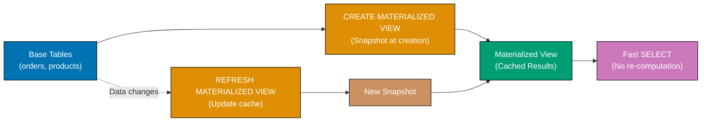

**Code**:

```sql
CREATE DATABASE example_52;
\c example_52;

CREATE TABLE sales (
    id SERIAL PRIMARY KEY,
    product VARCHAR(100),
    amount DECIMAL(10, 2),
    sale_date DATE
);

-- Insert test data
INSERT INTO sales (product, amount, sale_date)
SELECT
    CASE (random() * 3)::INTEGER
        WHEN 0 THEN 'Laptop'
        WHEN 1 THEN 'Mouse'
        ELSE 'Keyboard'
    END,
    (random() * 1000)::DECIMAL(10, 2),
    NOW() - (random() * 365 || ' days')::INTERVAL
FROM generate_series(1, 10000);

-- Create materialized view
CREATE MATERIALIZED VIEW monthly_sales AS
SELECT
    DATE_TRUNC('month', sale_date) AS month,
    product,
    COUNT(*) AS num_sales,
    SUM(amount) AS total_revenue
FROM sales
GROUP BY DATE_TRUNC('month', sale_date), product
ORDER BY month DESC, product;
-- => Computes and stores results

-- Query materialized view (fast - reads stored data)
SELECT * FROM monthly_sales LIMIT 10;

-- Insert more sales
INSERT INTO sales (product, amount, sale_date)
VALUES ('Laptop', 1200.00, CURRENT_DATE);

-- Materialized view still shows old data
SELECT * FROM monthly_sales WHERE month = DATE_TRUNC('month', CURRENT_DATE);
-- => Doesn't include new sale yet

-- Refresh materialized view
REFRESH MATERIALIZED VIEW monthly_sales;
-- => Recomputes and updates stored results

SELECT * FROM monthly_sales WHERE month = DATE_TRUNC('month', CURRENT_DATE);
-- => Now includes new sale

-- Concurrent refresh (doesn't block reads)
REFRESH MATERIALIZED VIEW CONCURRENTLY monthly_sales;
-- => Requires unique index on materialized view

-- Create index on materialized view
CREATE UNIQUE INDEX idx_monthly_sales_month_product
ON monthly_sales(month, product);

REFRESH MATERIALIZED VIEW CONCURRENTLY monthly_sales;
-- => Readers can query while refreshing

-- Drop materialized view
DROP MATERIALIZED VIEW monthly_sales;
```

**Key Takeaway**: Materialized views store query results physically - much faster than regular views for expensive queries, but require REFRESH to update. Use for aggregations, reports, or dashboards on slowly-changing data. CONCURRENTLY allows reads during refresh.

### Example 53: Creating Functions (PL/pgSQL)

Functions encapsulate reusable logic - use PL/pgSQL (PostgreSQL's procedural language) for complex calculations, data transformations, or business rules.

**Code**:

```sql
CREATE DATABASE example_53;
\c example_53;

-- Simple function with no parameters
CREATE FUNCTION get_current_time()
RETURNS TEXT AS $$
BEGIN
    RETURN 'Current time: ' || NOW()::TEXT;
END;
$$ LANGUAGE plpgsql;

SELECT get_current_time();
-- => 'Current time: 2025-12-29 ...'

-- Function with parameters
CREATE FUNCTION calculate_tax(amount DECIMAL, tax_rate DECIMAL)
RETURNS DECIMAL AS $$
BEGIN
    RETURN amount * tax_rate;
END;
$$ LANGUAGE plpgsql;

SELECT calculate_tax(100.00, 0.08);
-- => 8.00

-- Function with conditional logic
CREATE FUNCTION categorize_price(price DECIMAL)
RETURNS TEXT AS $$
BEGIN
    IF price < 100 THEN
        RETURN 'Budget';
    ELSIF price < 500 THEN
        RETURN 'Mid-Range';
    ELSE
        RETURN 'Premium';
    END IF;
END;
$$ LANGUAGE plpgsql;

SELECT categorize_price(50.00);   -- => 'Budget'
SELECT categorize_price(250.00);  -- => 'Mid-Range'
SELECT categorize_price(1000.00); -- => 'Premium'

-- Function with table queries
CREATE TABLE products (
    id SERIAL PRIMARY KEY,
    name VARCHAR(100),
    price DECIMAL(10, 2)
);

INSERT INTO products (name, price)
VALUES ('Laptop', 999.99), ('Mouse', 29.99), ('Keyboard', 79.99);

CREATE FUNCTION get_expensive_products(min_price DECIMAL)
RETURNS TABLE(product_name TEXT, product_price DECIMAL) AS $$
BEGIN
    RETURN QUERY
    SELECT name::TEXT, price
    FROM products
    WHERE price >= min_price
    ORDER BY price DESC;
END;
$$ LANGUAGE plpgsql;

SELECT * FROM get_expensive_products(50.00);
-- => Laptop (999.99), Keyboard (79.99)

-- Function with variables
CREATE FUNCTION calculate_discount(original_price DECIMAL, discount_percent INTEGER)
RETURNS TABLE(original DECIMAL, discount DECIMAL, final DECIMAL) AS $$
DECLARE
    discount_amount DECIMAL;
    final_price DECIMAL;
BEGIN
    discount_amount := original_price * (discount_percent / 100.0);
    final_price := original_price - discount_amount;

    RETURN QUERY SELECT original_price, discount_amount, final_price;
END;
$$ LANGUAGE plpgsql;

SELECT * FROM calculate_discount(100.00, 20);
-- => original: 100.00, discount: 20.00, final: 80.00
```

**Key Takeaway**: Functions encapsulate logic for reuse - use RETURNS for return type, `$$` for function body delimiter. PL/pgSQL supports variables, conditionals, loops, and queries. RETURNS TABLE for returning multiple rows.

### Example 54: Function Parameters and Return Types

Functions support multiple parameter modes (IN, OUT, INOUT) and various return types (scalars, records, tables). Choose based on use case.

**Code**:

```sql
CREATE DATABASE example_54;
\c example_54;

-- Function returning single value (scalar)
CREATE FUNCTION add_numbers(a INTEGER, b INTEGER)
RETURNS INTEGER AS $$
BEGIN
    RETURN a + b;
END;
$$ LANGUAGE plpgsql;

SELECT add_numbers(10, 20);
-- => 30

-- Function with OUT parameters
CREATE FUNCTION divide_with_remainder(
    dividend INTEGER,
    divisor INTEGER,
    OUT quotient INTEGER,
    OUT remainder INTEGER
) AS $$
BEGIN
    quotient := dividend / divisor;
    remainder := dividend % divisor;
END;
$$ LANGUAGE plpgsql;

SELECT * FROM divide_with_remainder(17, 5);
-- => quotient: 3, remainder: 2

-- Function returning composite type
CREATE TYPE employee_summary AS (
    total_employees INTEGER,
    avg_salary DECIMAL
);

CREATE TABLE employees (
    id SERIAL PRIMARY KEY,
    name VARCHAR(100),
    salary DECIMAL(10, 2)
);

INSERT INTO employees (name, salary)
VALUES ('Alice', 95000), ('Bob', 75000), ('Charlie', 105000);

CREATE FUNCTION get_employee_summary()
RETURNS employee_summary AS $$
DECLARE
    result employee_summary;
BEGIN
    SELECT COUNT(*), AVG(salary)
    INTO result.total_employees, result.avg_salary
    FROM employees;

    RETURN result;
END;
$$ LANGUAGE plpgsql;

SELECT * FROM get_employee_summary();
-- => total_employees: 3, avg_salary: 91666.67

-- Function with default parameters
CREATE FUNCTION greet(name TEXT, greeting TEXT DEFAULT 'Hello')
RETURNS TEXT AS $$
BEGIN
    RETURN greeting || ', ' || name || '!';
END;
$$ LANGUAGE plpgsql;

SELECT greet('Alice');              -- => 'Hello, Alice!'
SELECT greet('Bob', 'Hi');          -- => 'Hi, Bob!'

-- Function with variadic parameters (variable arguments)
CREATE FUNCTION sum_all(VARIADIC numbers INTEGER[])
RETURNS INTEGER AS $$
DECLARE
    total INTEGER := 0;
    num INTEGER;
BEGIN
    FOREACH num IN ARRAY numbers LOOP
        total := total + num;
    END LOOP;
    RETURN total;
END;
$$ LANGUAGE plpgsql;

SELECT sum_all(1, 2, 3, 4, 5);
-- => 15

SELECT sum_all(10, 20);
-- => 30
```

**Key Takeaway**: Functions support flexible parameters - OUT for returning multiple values, DEFAULT for optional parameters, VARIADIC for variable arguments. Return types include scalars, composite types, or TABLE for multiple rows.

### Example 55: Triggers

Triggers automatically execute functions before or after INSERT, UPDATE, or DELETE operations - use for auditing, validation, or derived columns.


**Code**:

```sql
CREATE DATABASE example_55;
\c example_55;

CREATE TABLE products (
    id SERIAL PRIMARY KEY,
    name VARCHAR(100),
    price DECIMAL(10, 2),
    updated_at TIMESTAMP
);

CREATE TABLE audit_log (
    id SERIAL PRIMARY KEY,
    table_name TEXT,
    operation TEXT,
    changed_at TIMESTAMP DEFAULT NOW(),
    old_data JSONB,
    new_data JSONB
);

-- Trigger function to update updated_at
CREATE FUNCTION update_timestamp()
RETURNS TRIGGER AS $$
BEGIN
    NEW.updated_at = NOW();
    RETURN NEW;
END;
$$ LANGUAGE plpgsql;

-- Create BEFORE UPDATE trigger
CREATE TRIGGER set_updated_at
BEFORE UPDATE ON products
FOR EACH ROW
EXECUTE FUNCTION update_timestamp();

INSERT INTO products (name, price, updated_at)
VALUES ('Laptop', 999.99, NOW());

UPDATE products SET price = 899.99 WHERE name = 'Laptop';
-- => updated_at automatically set to current time

SELECT name, price, updated_at FROM products;

-- Audit trail trigger
CREATE FUNCTION audit_changes()
RETURNS TRIGGER AS $$
BEGIN
    IF TG_OP = 'INSERT' THEN
        INSERT INTO audit_log (table_name, operation, new_data)
        VALUES (TG_TABLE_NAME, TG_OP, row_to_json(NEW));
        RETURN NEW;
    ELSIF TG_OP = 'UPDATE' THEN
        INSERT INTO audit_log (table_name, operation, old_data, new_data)
        VALUES (TG_TABLE_NAME, TG_OP, row_to_json(OLD), row_to_json(NEW));
        RETURN NEW;
    ELSIF TG_OP = 'DELETE' THEN
        INSERT INTO audit_log (table_name, operation, old_data)
        VALUES (TG_TABLE_NAME, TG_OP, row_to_json(OLD));
        RETURN OLD;
    END IF;
END;
$$ LANGUAGE plpgsql;

-- Create AFTER triggers for INSERT, UPDATE, DELETE
CREATE TRIGGER audit_products_insert
AFTER INSERT ON products
FOR EACH ROW
EXECUTE FUNCTION audit_changes();

CREATE TRIGGER audit_products_update
AFTER UPDATE ON products
FOR EACH ROW
EXECUTE FUNCTION audit_changes();

CREATE TRIGGER audit_products_delete
AFTER DELETE ON products
FOR EACH ROW
EXECUTE FUNCTION audit_changes();

-- Test audit trail
INSERT INTO products (name, price, updated_at)
VALUES ('Mouse', 29.99, NOW());

UPDATE products SET price = 24.99 WHERE name = 'Mouse';

DELETE FROM products WHERE name = 'Mouse';

SELECT * FROM audit_log ORDER BY changed_at;
-- => Shows INSERT, UPDATE, DELETE operations with old/new data

-- Drop trigger
DROP TRIGGER audit_products_insert ON products;
```

**Key Takeaway**: Triggers execute functions automatically on data changes - use BEFORE for validation/modification, AFTER for auditing/notifications. Access OLD (previous row) and NEW (updated row) in trigger functions. TG_OP shows operation type (INSERT/UPDATE/DELETE).

## Group 6: Advanced Patterns

### Example 56: Upsert with ON CONFLICT

ON CONFLICT handles insert conflicts by updating existing rows or ignoring duplicates - essential for idempotent operations and data synchronization.

**Code**:

```sql
CREATE DATABASE example_56;
\c example_56;

CREATE TABLE users (
    id SERIAL PRIMARY KEY,
    email VARCHAR(100) UNIQUE,
    name VARCHAR(100),
    login_count INTEGER DEFAULT 0,
    last_login TIMESTAMP
);

-- Insert initial user
INSERT INTO users (email, name, login_count, last_login)
VALUES ('alice@example.com', 'Alice', 1, NOW());

-- Upsert: update if exists, insert if doesn't
INSERT INTO users (email, name, login_count, last_login)
VALUES ('alice@example.com', 'Alice Updated', 2, NOW())
ON CONFLICT (email)
DO UPDATE SET
    login_count = users.login_count + 1,  -- => Increment existing count
    last_login = EXCLUDED.last_login;     -- => EXCLUDED refers to proposed insert values

SELECT * FROM users WHERE email = 'alice@example.com';
-- => login_count: 2 (incremented), last_login updated

-- Upsert with nothing (ignore conflicts)
INSERT INTO users (email, name)
VALUES ('alice@example.com', 'Should be ignored')
ON CONFLICT (email) DO NOTHING;

SELECT * FROM users WHERE email = 'alice@example.com';
-- => No changes (conflict ignored)

-- Bulk upsert
INSERT INTO users (email, name, login_count, last_login)
VALUES
    ('bob@example.com', 'Bob', 1, NOW()),
    ('charlie@example.com', 'Charlie', 1, NOW()),
    ('alice@example.com', 'Alice', 1, NOW())
ON CONFLICT (email)
DO UPDATE SET
    login_count = users.login_count + 1,
    last_login = EXCLUDED.last_login;

SELECT email, login_count FROM users ORDER BY email;
-- => Alice: 3 (updated), Bob: 1 (inserted), Charlie: 1 (inserted)

-- Upsert with WHERE clause
INSERT INTO users (email, name, login_count, last_login)
VALUES ('alice@example.com', 'Alice', 10, NOW())
ON CONFLICT (email)
DO UPDATE SET
    login_count = EXCLUDED.login_count,
    last_login = EXCLUDED.last_login
WHERE users.login_count < EXCLUDED.login_count;
-- => Only updates if new login_count is higher

SELECT login_count FROM users WHERE email = 'alice@example.com';
-- => 10 (updated because 10 > 3)
```

**Key Takeaway**: ON CONFLICT enables upserts (insert or update) - specify conflict target (email), then DO UPDATE or DO NOTHING. EXCLUDED refers to values from failed insert. Use WHERE to conditionally update.

### Example 57: Bulk Insert with COPY

COPY imports data from files or stdin - much faster than individual INSERTs for bulk loading. Use for data migrations, imports, or large datasets.

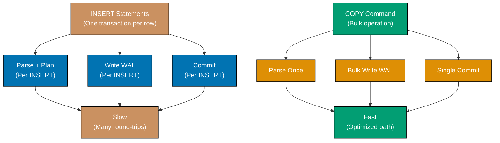

**Code**:

```sql
CREATE DATABASE example_57;
\c example_57;

CREATE TABLE products (
    id INTEGER,
    name VARCHAR(100),
    category VARCHAR(50),
    price DECIMAL(10, 2)
);

-- COPY from stdin (manual data entry)
COPY products (id, name, category, price) FROM stdin WITH (FORMAT csv);
1,Laptop,Electronics,999.99
2,Mouse,Electronics,29.99
3,Desk,Furniture,299.99
\.
-- => \. terminates input

SELECT * FROM products;
-- => 3 rows inserted

-- COPY from file (requires server filesystem access)
-- Note: This requires a CSV file on the PostgreSQL server filesystem
-- Example CSV content (products.csv):
-- 4,Keyboard,Electronics,79.99
-- 5,Chair,Furniture,199.99

-- COPY products FROM '/path/to/products.csv' WITH (FORMAT csv);
-- => Loads from file

-- COPY with header row
-- COPY products FROM '/path/to/products_with_header.csv' WITH (FORMAT csv, HEADER true);
-- => Skips first row

-- COPY to file (export)
COPY products TO stdout WITH (FORMAT csv, HEADER true);
-- => Outputs CSV to stdout with headers

-- COPY with specific delimiter
COPY products TO stdout WITH (FORMAT text, DELIMITER '|');
-- => Pipe-delimited output

-- Generate test data with COPY
TRUNCATE products;

INSERT INTO products (id, name, category, price)
SELECT
    generate_series AS id,
    'Product ' || generate_series AS name,
    CASE (generate_series % 3)
        WHEN 0 THEN 'Electronics'
        WHEN 1 THEN 'Furniture'
        ELSE 'Kitchen'
    END AS category,
    (random() * 1000)::DECIMAL(10, 2) AS price
FROM generate_series(1, 10000);
-- => 10000 rows inserted quickly

-- Alternative: COPY for PostgreSQL client tools
-- \copy products FROM 'products.csv' WITH (FORMAT csv);
-- => \copy works in psql, reads from client filesystem
```

**Key Takeaway**: COPY is fastest for bulk imports - much faster than individual INSERTs. Use WITH (FORMAT csv, HEADER true) for CSV files with headers. COPY FROM loads data, COPY TO exports. `\copy` in psql reads from client filesystem.

### Example 58: Generate Series for Test Data

GENERATE_SERIES creates sequences of values - combine with random functions to generate test data for development and performance testing.

**Code**:

```sql
CREATE DATABASE example_58;
\c example_58;

-- Generate integer series
SELECT * FROM generate_series(1, 10);
-- => Returns 1, 2, 3, ..., 10

-- Generate series with step
SELECT * FROM generate_series(0, 100, 10);
-- => Returns 0, 10, 20, ..., 100

-- Generate date series
SELECT * FROM generate_series(
    '2025-12-01'::DATE,
    '2025-12-31'::DATE,
    '1 day'::INTERVAL
);
-- => Returns all dates in December 2025

-- Create test table
CREATE TABLE orders (
    id INTEGER PRIMARY KEY,
    customer_id INTEGER,
    amount DECIMAL(10, 2),
    order_date DATE
);

-- Generate 10,000 test orders
INSERT INTO orders (id, customer_id, amount, order_date)
SELECT
    generate_series AS id,
    (random() * 100)::INTEGER + 1 AS customer_id,
    (random() * 1000)::DECIMAL(10, 2) AS amount,
    '2025-01-01'::DATE + (random() * 365)::INTEGER AS order_date
FROM generate_series(1, 10000);

SELECT COUNT(*) FROM orders;
-- => 10,000 rows

-- Generate realistic email addresses
CREATE TABLE users (
    id INTEGER PRIMARY KEY,
    email VARCHAR(100),
    created_at TIMESTAMP
);

INSERT INTO users (id, email, created_at)
SELECT
    generate_series AS id,
    'user' || generate_series || '@example.com' AS email,
    NOW() - (random() * 365 || ' days')::INTERVAL AS created_at
FROM generate_series(1, 1000);

SELECT * FROM users LIMIT 5;

-- Generate time series data
CREATE TABLE metrics (
    timestamp TIMESTAMP,
    value DECIMAL(10, 2)
);

INSERT INTO metrics (timestamp, value)
SELECT
    ts,
    (50 + random() * 50)::DECIMAL(10, 2) AS value
FROM generate_series(
    '2025-12-29 00:00:00'::TIMESTAMP,
    '2025-12-29 23:59:00'::TIMESTAMP,
    '1 minute'::INTERVAL
) AS ts;

SELECT COUNT(*) FROM metrics;
-- => 1,440 rows (one per minute for 24 hours)

-- Generate hierarchical test data
CREATE TABLE categories (
    id INTEGER PRIMARY KEY,
    parent_id INTEGER,
    name VARCHAR(100)
);

INSERT INTO categories (id, parent_id, name)
SELECT
    generate_series,
    CASE
        WHEN generate_series <= 10 THEN NULL  -- => Top-level categories
        ELSE ((generate_series - 1) / 10 + 1)  -- => Subcategories
    END,
    'Category ' || generate_series
FROM generate_series(1, 100);

SELECT id, parent_id, name FROM categories WHERE parent_id IS NULL;
-- => 10 top-level categories
```

**Key Takeaway**: GENERATE_SERIES creates numeric, date, or timestamp sequences - combine with random() for realistic test data. Use for populating development databases, performance testing, or creating time series data.

### Example 59: Lateral Joins

LATERAL allows subqueries to reference columns from preceding tables in FROM clause - enables correlated joins and "for each" patterns.

**Code**:

```sql
CREATE DATABASE example_59;
\c example_59;

CREATE TABLE categories (
    id SERIAL PRIMARY KEY,
    name VARCHAR(100)
);

CREATE TABLE products (
    id SERIAL PRIMARY KEY,
    category_id INTEGER,
    name VARCHAR(100),
    price DECIMAL(10, 2)
);

INSERT INTO categories (name)
VALUES ('Electronics'), ('Furniture'), ('Kitchen');

INSERT INTO products (category_id, name, price)
VALUES
    (1, 'Laptop', 999.99),
    (1, 'Mouse', 29.99),
    (1, 'Keyboard', 79.99),
    (2, 'Desk', 299.99),
    (2, 'Chair', 199.99),
    (3, 'Blender', 89.99),
    (3, 'Toaster', 39.99);

-- Get top 2 most expensive products per category
SELECT
    c.name AS category,
    p.name AS product,
    p.price
FROM categories c,
LATERAL (
    SELECT name, price
    FROM products
    WHERE category_id = c.id  -- => References c from outer query
    ORDER BY price DESC
    LIMIT 2
) p
ORDER BY c.name, p.price DESC;
-- => Electronics: Laptop (999.99), Keyboard (79.99)
-- => Furniture: Desk (299.99), Chair (199.99)
-- => Kitchen: Blender (89.99), Toaster (39.99)

-- Alternative with LEFT JOIN LATERAL (includes categories with no products)
SELECT
    c.name AS category,
    p.name AS product,
    p.price
FROM categories c
LEFT JOIN LATERAL (
    SELECT name, price
    FROM products
    WHERE category_id = c.id
    ORDER BY price DESC
    LIMIT 1
) p ON true
ORDER BY c.name;
-- => Shows top product per category (NULL if no products)

-- LATERAL with aggregation
SELECT
    c.name AS category,
    stats.*
FROM categories c,
LATERAL (
    SELECT
        COUNT(*) AS num_products,
        AVG(price) AS avg_price,
        MAX(price) AS max_price
    FROM products
    WHERE category_id = c.id
) stats
ORDER BY c.name;
-- => Electronics: 3 products, avg 369.99, max 999.99
-- => Furniture: 2 products, avg 249.99, max 299.99
-- => Kitchen: 2 products, avg 64.99, max 89.99

-- LATERAL for row numbers per group
SELECT
    category_id,
    name,
    price,
    row_num
FROM products p,
LATERAL (
    SELECT ROW_NUMBER() OVER (ORDER BY price DESC) AS row_num
    FROM products p2
    WHERE p2.category_id = p.category_id AND p2.id <= p.id
) rn
WHERE row_num = 1;
-- => Alternative to window functions for ranking
```

**Key Takeaway**: LATERAL enables subqueries to reference preceding FROM items - use for "top N per group", correlated aggregations, or complex per-row computations. More flexible than window functions for some use cases.

### Example 60: Composite Types

Composite types define custom structured types combining multiple fields - use for function return types, nested data, or domain modeling.

**Code**:

```sql
CREATE DATABASE example_60;
\c example_60;

-- Create composite type
CREATE TYPE address AS (
    street VARCHAR(200),
    city VARCHAR(100),
    state VARCHAR(50),
    zip VARCHAR(20)
);

CREATE TYPE contact_info AS (
    email VARCHAR(100),
    phone VARCHAR(20),
    home_address address  -- => Nested composite type
);

-- Use composite type in table
CREATE TABLE customers (
    id SERIAL PRIMARY KEY,
    name VARCHAR(100),
    contact contact_info
);

-- Insert with composite type
INSERT INTO customers (name, contact)
VALUES (
    'Alice',
    ROW(
        'alice@example.com',
        '555-1234',
        ROW('123 Main St', 'New York', 'NY', '10001')
    )::contact_info
);

-- Access composite type fields
SELECT
    name,
    (contact).email AS email,
    (contact).phone AS phone,
    ((contact).home_address).city AS city,
    ((contact).home_address).state AS state
FROM customers;
-- => Alice, alice@example.com, 555-1234, New York, NY

-- Update composite type field
UPDATE customers
SET contact.email = 'alice.new@example.com'
WHERE name = 'Alice';

SELECT name, (contact).email FROM customers;
-- => alice.new@example.com

-- Function returning composite type
CREATE FUNCTION get_customer_summary(customer_id INTEGER)
RETURNS TABLE(
    customer_name VARCHAR(100),
    customer_email VARCHAR(100),
    customer_city VARCHAR(100)
) AS $$
BEGIN
    RETURN QUERY
    SELECT
        name,
        (contact).email,
        ((contact).home_address).city
    FROM customers
    WHERE id = customer_id;
END;
$$ LANGUAGE plpgsql;

SELECT * FROM get_customer_summary(1);

-- Array of composite types
CREATE TABLE orders (
    id SERIAL PRIMARY KEY,
    customer_id INTEGER,
    shipping_addresses address[]  -- => Array of composite types
);

INSERT INTO orders (customer_id, shipping_addresses)
VALUES (
    1,
    ARRAY[
        ROW('456 Oak Ave', 'Boston', 'MA', '02101')::address,
        ROW('789 Pine Rd', 'Chicago', 'IL', '60601')::address
    ]
);

SELECT
    id,
    shipping_addresses[1] AS first_address,
    (shipping_addresses[1]).city AS first_city
FROM orders;

-- Drop composite type
DROP TYPE IF EXISTS contact_info CASCADE;
-- => CASCADE drops dependent objects (tables using this type)
```

**Key Takeaway**: Composite types combine multiple fields into structured types - use for addresses, coordinates, or domain concepts. Access nested fields with parentheses: `(column).field`. Composite types can be nested and stored in arrays.
