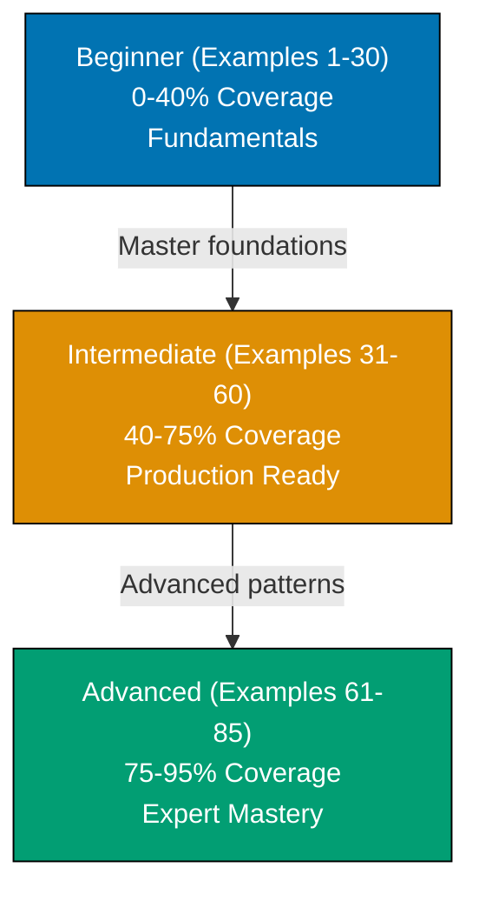

**Want to quickly master PostgreSQL through working examples?** This by-example guide teaches 95% of PostgreSQL through 85 annotated SQL examples organized by complexity level.

## What Is By-Example Learning?

By-example learning is an **example-first approach** where you learn through annotated, runnable SQL rather than narrative explanations. Each example is self-contained, immediately executable in a PostgreSQL container, and heavily commented to show:

- **What each statement does** - Inline comments explain the purpose and mechanism
- **Expected outputs** - Using `-- =>` notation to show query results
- **Intermediate states** - Table contents and data transformations made visible
- **Key takeaways** - 1-2 sentence summaries of core concepts

This approach is **ideal for experienced developers** (seasonal programmers or software engineers) who are familiar with databases or SQL and want to quickly understand PostgreSQL's features, syntax, and unique capabilities through working code.

Unlike narrative tutorials that build understanding through explanation and storytelling, by-example learning lets you **see the SQL first, run it second, and understand it through direct interaction**. You learn by doing, not by reading about doing.

## Learning Path

The PostgreSQL by-example tutorial guides you through 85 examples organized into three progressive levels, from fundamental concepts to advanced database administration.



## Coverage Philosophy

This by-example guide provides **95% coverage of PostgreSQL** through practical, annotated examples. The 95% figure represents the depth and breadth of concepts covered, not a time estimate—focus is on **outcomes and understanding**, not duration.

### What's Covered

- **Core SQL syntax** - SELECT, INSERT, UPDATE, DELETE, WHERE clauses, ORDER BY, LIMIT, OFFSET
- **Data types** - Numeric types (INTEGER, BIGINT, DECIMAL, NUMERIC), text types (VARCHAR, TEXT, CHAR), temporal types (DATE, TIME, TIMESTAMP, INTERVAL), boolean, UUID, NULL handling
- **Schema design** - Table creation, primary keys, foreign keys, SERIAL auto-increment, unique constraints, check constraints, NOT NULL, default values
- **Joins and relationships** - INNER JOIN, LEFT/RIGHT/FULL OUTER JOIN, self joins, complex multi-table queries
- **Aggregations and grouping** - COUNT, SUM, AVG, MIN, MAX, GROUP BY, HAVING clauses
- **Advanced queries** - Common Table Expressions (CTEs), window functions (ROW_NUMBER, RANK, DENSE_RANK, partitioning), recursive CTEs, UNION/INTERSECT/EXCEPT
- **Indexes and performance** - B-tree indexes, unique indexes, multi-column indexes, partial indexes, GIN/GiST indexes, expression indexes, covering indexes, EXPLAIN and EXPLAIN ANALYZE
- **Advanced data types** - Arrays, JSON and JSONB, JSON operators (`->`, `->>`), range types (daterange, int4range)
- **Transactions** - BEGIN, COMMIT, ROLLBACK, isolation levels, ACID properties, savepoints, deadlock handling
- **Views and functions** - Creating views, materialized views, PL/pgSQL functions, parameters and return types, triggers
- **Production patterns** - Upsert with ON CONFLICT, bulk insert with COPY, GENERATE_SERIES for test data, lateral joins, composite types
- **Full-text search** - tsvector and tsquery, text search operators, ranking and relevance
- **Partitioning** - Range partitioning, list partitioning, partition pruning for performance
- **Administration** - User roles and permissions, row-level security (RLS), backup with pg_dump, restore with pg_restore, monitoring with pg_stat views
- **Advanced features** - Advisory locks, LISTEN/NOTIFY for pub/sub, write-ahead logging (WAL), foreign data wrappers, logical replication, connection pooling, performance tuning parameters

## What This Tutorial Does NOT Cover

**PostgreSQL Extensions Not in Core**: PostGIS for geographic data, TimescaleDB for time-series, Citus for sharding - these are powerful but separate from core PostgreSQL

**Application-Level ORMs**: SQLAlchemy, Hibernate, ActiveRecord, Prisma - these are framework concerns, not database features

**Deployment and Infrastructure**: Docker Compose orchestration, Kubernetes StatefulSets, cloud-managed PostgreSQL (AWS RDS, Google Cloud SQL, Azure Database) - these are DevOps topics

**PostgreSQL Internals**: MVCC implementation details, query planner algorithms, buffer cache architecture - these are advanced internals beyond practical usage

**Database Migration Tools**: Flyway, Liquibase, Alembic - these are tooling concerns for managing schema evolution

## How to Use This Guide

1. **Sequential or selective** - Read examples in order for progressive learning, or jump to specific topics when you need a particular feature
2. **Run everything** - Copy and paste examples into your PostgreSQL container. Experimentation solidifies understanding.
3. **Modify and explore** - Change queries, add columns, insert different data, break things intentionally. Learn through experimentation.
4. **Use as reference** - Bookmark examples for quick lookups when you forget syntax or patterns
5. **Complement with narrative tutorials** - By-example learning is code-first; pair with comprehensive tutorials for deeper explanations

**Best workflow**: Open your terminal with a PostgreSQL container in one window, this guide in another. Run each example as you read it. When you encounter something unfamiliar, run the example, modify it, see what changes.

**Reference System**: Examples are numbered (1-85) and grouped by level. This numbering appears in other PostgreSQL content at ayokoding.com, allowing you to reference specific examples elsewhere.

## Structure of Each Example

Every example follows a consistent four-part format:

1. **Brief Explanation** (2-3 sentences): What the example demonstrates and why it matters
2. **Mermaid Diagram** (optional): Visual clarification when concept relationships benefit from visualization
3. **Heavily Annotated Code**: Every significant statement includes a comment explaining what it does and what it produces (using `-- =>` notation)
4. **Key Takeaway** (1-2 sentences): The core insight you should retain from this example

This structure minimizes context switching - explanation, visual aid, runnable code, and distilled essence all in one place.

## Execution Environment

All examples use a **Docker-based PostgreSQL 16 container** for reproducible, isolated execution across all platforms (Windows, macOS, Linux).

**One-time setup** (run once before starting examples):

```bash
# Create PostgreSQL 16 container
docker run --name postgres-tutorial \
  -e POSTGRES_PASSWORD=password \
  -p 5432:5432 \
  -d postgres:16

# Connect to PostgreSQL
docker exec -it postgres-tutorial psql -U postgres
```

**Every example is copy-paste runnable** in this environment. Each example creates its own database to ensure isolation and repeatability.

## Relationship to Other Tutorials

This by-example tutorial complements other learning approaches. Choose based on your situation:

| Tutorial Type        | Coverage | Best For                          | Learning Style                       |
| -------------------- | -------- | --------------------------------- | ------------------------------------ |
| **Quick Start**      | 5-30%    | Getting something working quickly | Hands-on with guided structure       |
| **Beginner**         | 0-60%    | Learning from scratch             | Narrative explanations with examples |
| **This: By Example** | 95%      | Rapid depth for experienced devs  | Code-first, minimal explanation      |
| **Cookbook**         | Parallel | Solving specific problems         | Problem-solution recipes             |
| **Advanced**         | 85-95%   | Expert mastery                    | Deep dives and edge cases            |

By-example is ideal if you have programming or database experience. It accelerates learning by leveraging your existing knowledge - you focus on "how PostgreSQL does this" rather than learning SQL concepts from scratch.

The 95% coverage represents depth and breadth of topics you'll encounter in production PostgreSQL work. It explicitly acknowledges that no tutorial covers everything, but these examples provide the foundation to understand the remaining 5% through official documentation, source code, and community resources.

## Prerequisites

- Basic SQL knowledge (SELECT, INSERT, UPDATE, DELETE) or willingness to learn through examples
- Docker installed and running (for PostgreSQL container)
- A terminal or SQL client you're comfortable with (psql, pgAdmin, DBeaver, etc.)

You don't need to understand PostgreSQL's internals, architecture, or ecosystem yet - this tutorial teaches those through examples. You just need comfort running SQL commands.

## Comparison with By-Example for Other Technologies

Other technologies at ayokoding.com have similar by-example tutorials:

- **Go By-Example**: 85+ examples covering concurrency, interfaces, standard library patterns
- **Java By-Example**: 75-90 examples covering OOP, streams, concurrency, JVM patterns
- **Elixir By-Example**: 75-90 examples covering functional programming, pattern matching, OTP

The PostgreSQL version follows the same philosophy and structure but emphasizes PostgreSQL-specific strengths: ACID compliance, extensibility, advanced data types (JSON, arrays, ranges), full-text search, and robust transaction handling.
