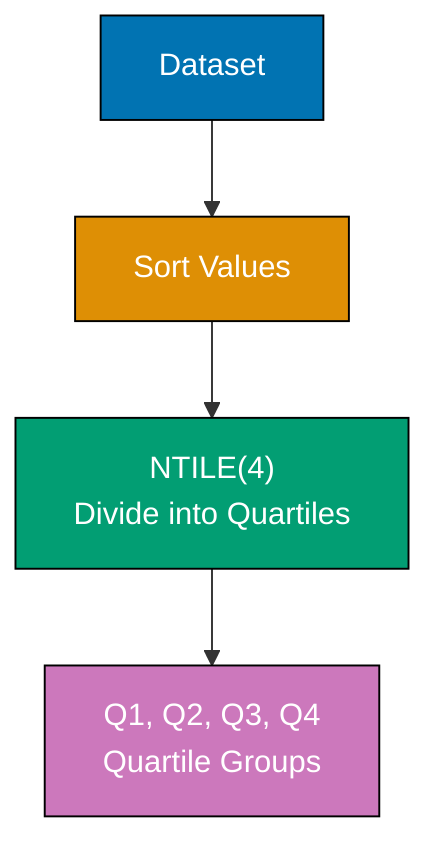
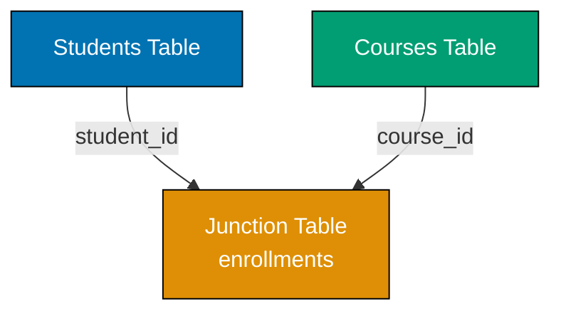

Achieve SQL expertise through 25 annotated examples. Each example tackles advanced analytics, complex data modeling, and production-grade query patterns that appear in real-world applications.

## Example 61: Percentile and Quartile Calculations

Percentiles divide data into 100 equal parts, quartiles into 4 parts. Use NTILE window function or manual calculation for statistical analysis.



**Code**:

```sql
-- Create table for salary analysis
CREATE TABLE employee_salaries (  -- => Stores employee compensation data
    id INTEGER,                    -- => Unique employee identifier
    name TEXT,                     -- => Employee name for reporting
    salary REAL                    -- => Annual salary in dollars
);

-- Generate 100 sample employees with varied salaries
INSERT INTO employee_salaries (id, name, salary)
SELECT
    value,                                              -- => Employee ID from 1-100
    'Employee ' || value,                               -- => Name: "Employee 1", "Employee 2", etc.
    50000 + (value * 1000) + (value % 10) * 2000        -- => Base $50k + progression + variance
                                                         -- => Creates realistic salary distribution ($51k-$168k range)
FROM (
    WITH RECURSIVE nums AS (                            -- => Recursive CTE generates number sequence
        SELECT 1 AS value                               -- => Start at 1
        UNION ALL                                       -- => Combine with next iteration
        SELECT value + 1 FROM nums WHERE value < 100    -- => Increment until 100
    )
    SELECT value FROM nums                              -- => Return sequence 1-100
);

-- Example A: Divide into quartiles using NTILE
SELECT
    name,                                               -- => Employee identifier
    salary,                                             -- => Actual salary value
    NTILE(4) OVER (ORDER BY salary) AS quartile         -- => Assigns quartile group (1-4) based on salary rank
                                                         -- => Divides 100 employees into 4 groups of 25 each
FROM employee_salaries
ORDER BY salary;                                        -- => Sort results low to high for readability
-- => Output shows each employee with their quartile assignment
-- => Q1: Bottom 25% (lowest earners), Q2: 25-50%, Q3: 50-75%, Q4: Top 25% (highest earners)

-- Example B: Calculate quartile boundaries
WITH quartiles AS (                                     -- => CTE assigns quartile to each salary
    SELECT
        salary,                                         -- => Salary value
        NTILE(4) OVER (ORDER BY salary) AS quartile     -- => Quartile assignment (1-4)
    FROM employee_salaries
)
SELECT
    quartile,                                           -- => Quartile number (1, 2, 3, 4)
    MIN(salary) AS min_salary,                          -- => Lowest salary in this quartile
    MAX(salary) AS max_salary                           -- => Highest salary in this quartile
FROM quartiles
GROUP BY quartile                                       -- => Aggregate by quartile group
ORDER BY quartile;                                      -- => Display Q1 through Q4
-- => Output: Salary ranges for each quartile
-- => Example: Q1: $51k-$75k, Q2: $76k-$100k, Q3: $101k-$125k, Q4: $126k-$168k

-- Example C: Calculate percentiles (deciles - 10% buckets)
SELECT
    name,                                               -- => Employee identifier
    salary,                                             -- => Salary value
    NTILE(10) OVER (ORDER BY salary) AS decile          -- => Assigns decile group (1-10)
                                                         -- => Each decile represents 10% of population
FROM employee_salaries
ORDER BY salary;                                        -- => Sort for readability
-- => Divides into 10 groups: Decile 1 = bottom 10%, Decile 10 = top 10%
-- => Useful for finer-grained analysis than quartiles

-- Example D: Find median salary (50th percentile)
WITH ordered AS (                                       -- => CTE with row numbering
    SELECT
        salary,                                         -- => Salary value
        ROW_NUMBER() OVER (ORDER BY salary) AS row_num, -- => Position in sorted list (1-100)
        COUNT(*) OVER () AS total_count                 -- => Total number of salaries (100)
    FROM employee_salaries
)
SELECT AVG(salary) AS median_salary                     -- => Average handles both odd and even counts
FROM ordered
WHERE row_num IN (                                      -- => Select middle position(s)
    (total_count + 1) / 2,                              -- => For 100: position 50 (middle-low)
    (total_count + 2) / 2                               -- => For 100: position 51 (middle-high)
);                                                      -- => Averages two middle values for even count
-- => Returns median (middle value or average of two middle values)
-- => For 100 employees, median is average of salaries at positions 50 and 51

-- Example E: Calculate 90th percentile salary
WITH ordered AS (                                       -- => CTE with row numbering
    SELECT
        salary,                                         -- => Salary value
        ROW_NUMBER() OVER (ORDER BY salary) AS row_num, -- => Position in sorted list
        COUNT(*) OVER () AS total_count                 -- => Total count for percentage calculation
    FROM employee_salaries
)
SELECT MAX(salary) AS percentile_90                     -- => Highest salary in bottom 90%
FROM ordered
WHERE row_num <= CAST(total_count * 0.90 AS INTEGER);   -- => First 90 employees (90% of 100)
-- => Returns 90th percentile (salary where 90% of employees earn less)
-- => Example: If 90th percentile is $150k, only 10% earn more

-- Example F: Identify outliers (below 10th or above 90th percentile)
WITH percentiles AS (                                   -- => CTE assigns deciles
    SELECT
        name,                                           -- => Employee identifier
        salary,                                         -- => Salary value
        NTILE(10) OVER (ORDER BY salary) AS decile      -- => Decile assignment (1-10)
    FROM employee_salaries
)
SELECT name, salary, decile                             -- => Return outlier details
FROM percentiles
WHERE decile = 1 OR decile = 10                         -- => Filter for extreme deciles only
ORDER BY salary;                                        -- => Sort low to high
-- => Returns outliers: Bottom 10% (decile 1) and top 10% (decile 10)
-- => Useful for identifying compensation anomalies or exceptional performers
```

**Key Takeaway**: Use NTILE(n) to divide data into n equal groups. NTILE(4) creates quartiles, NTILE(100) approximates percentiles. Calculate exact percentiles using ROW_NUMBER and position formulas. Essential for statistical analysis and outlier detection.

**Why It Matters**: Salary benchmarking, performance ratings, and fraud detection all need percentile analysis. "Top 10% of performers" or "below 25th percentile response time" are common business metrics. NTILE eliminates spreadsheet exports and manual calculations, keeping analytics in the database.

---

## Example 62: Cohort Analysis

Cohort analysis groups users by shared characteristics (signup date) and tracks behavior over time. Essential for retention and engagement metrics.

**Code**:

```sql
-- Create users table for cohort tracking
CREATE TABLE users (              -- => Stores user signup information
    id INTEGER,                   -- => Unique user identifier
    email TEXT,                   -- => User email address
    signup_date TEXT              -- => Date user signed up (ISO format)
);

-- Create purchases table for behavior tracking
CREATE TABLE purchases (          -- => Tracks user purchase activity
    id INTEGER,                   -- => Unique purchase identifier
    user_id INTEGER,              -- => Foreign key to users table
    purchase_date TEXT,           -- => Date of purchase (ISO format)
    amount REAL                   -- => Purchase amount in dollars
);

-- Generate 100 users with staggered signup dates
INSERT INTO users (id, email, signup_date)
SELECT
    value,                                              -- => User ID from 1-100
    'user' || value || '@example.com',                  -- => Email: "user1@example.com", etc.
    date('2025-01-01', '+' || ((value - 1) / 10) || ' days')  -- => Signup dates spread over 10 days
                                                         -- => IDs 1-10 signup Jan 1, 11-20 signup Jan 2, etc.
FROM (
    WITH RECURSIVE nums AS (                            -- => Generate number sequence
        SELECT 1 AS value                               -- => Start at 1
        UNION ALL                                       -- => Combine iterations
        SELECT value + 1 FROM nums WHERE value < 100    -- => Increment to 100
    )
    SELECT value FROM nums                              -- => Return 1-100
);

-- Generate purchases for 30% of users
INSERT INTO purchases (id, user_id, purchase_date, amount)
SELECT
    value,                                              -- => Purchase ID from 1-30
    value,                                              -- => User ID (first 30 users make purchases)
    date((SELECT signup_date FROM users WHERE id = value), '+' || (value % 30) || ' days'),
                                                         -- => Purchase 0-29 days after signup
                                                         -- => Simulates varied purchase timing
    50 + (value * 10)                                   -- => Amount from $60-$350
FROM (
    WITH RECURSIVE nums AS (                            -- => Generate 30 purchases
        SELECT 1 AS value
        UNION ALL
        SELECT value + 1 FROM nums WHERE value < 30
    )
    SELECT value FROM nums
);

-- Example A: Cohort retention table by signup week
WITH cohorts AS (                                       -- => CTE assigns each user to cohort
    SELECT
        id AS user_id,                                  -- => User identifier
        signup_date,                                    -- => Original signup date
        DATE(signup_date, 'weekday 0', '-6 days') AS cohort_week
                                                         -- => Round to start of week (Sunday)
                                                         -- => All users signing up same week grouped together
    FROM users
),
purchase_weeks AS (                                     -- => CTE calculates weeks since signup
    SELECT
        user_id,                                        -- => User who made purchase
        DATE(purchase_date, 'weekday 0', '-6 days') AS purchase_week,
                                                         -- => Round purchase to week start
        CAST((JULIANDAY(purchase_date) - JULIANDAY((SELECT signup_date FROM users WHERE id = user_id))) / 7 AS INTEGER) AS weeks_since_signup
                                                         -- => Calculate whole weeks between signup and purchase
                                                         -- => 0 = same week, 1 = next week, etc.
    FROM purchases
)
SELECT
    c.cohort_week,                                      -- => Week cohort signed up
    COUNT(DISTINCT c.user_id) AS cohort_size,           -- => Total users in this cohort
    COUNT(DISTINCT CASE WHEN pw.weeks_since_signup = 0 THEN c.user_id END) AS week_0_active,
                                                         -- => Users who purchased in signup week
    COUNT(DISTINCT CASE WHEN pw.weeks_since_signup = 1 THEN c.user_id END) AS week_1_active,
                                                         -- => Users who purchased in week 1 after signup
    COUNT(DISTINCT CASE WHEN pw.weeks_since_signup = 2 THEN c.user_id END) AS week_2_active,
                                                         -- => Week 2 active users
    COUNT(DISTINCT CASE WHEN pw.weeks_since_signup = 3 THEN c.user_id END) AS week_3_active
                                                         -- => Week 3 active users
FROM cohorts c
LEFT JOIN purchase_weeks pw ON c.user_id = pw.user_id  -- => Include users with no purchases (LEFT JOIN)
GROUP BY c.cohort_week                                  -- => Aggregate by cohort
ORDER BY c.cohort_week;                                 -- => Chronological order
-- => Output: Retention table showing active users per week for each cohort
-- => Example row: 2025-01-01 | 70 | 10 | 8 | 6 | 5

-- Example B: Calculate retention percentages
WITH cohorts AS (                                       -- => Assign users to cohorts
    SELECT
        id AS user_id,
        DATE(signup_date, 'weekday 0', '-6 days') AS cohort_week
    FROM users
),
purchase_weeks AS (                                     -- => Calculate weeks since signup
    SELECT
        user_id,
        CAST((JULIANDAY(purchase_date) - JULIANDAY((SELECT signup_date FROM users WHERE id = user_id))) / 7 AS INTEGER) AS weeks_since_signup
    FROM purchases
),
cohort_stats AS (                                       -- => Aggregate cohort metrics
    SELECT
        c.cohort_week,                                  -- => Cohort identifier
        COUNT(DISTINCT c.user_id) AS cohort_size,       -- => Total cohort size (denominator)
        COUNT(DISTINCT CASE WHEN pw.weeks_since_signup = 1 THEN c.user_id END) AS week_1_active
                                                         -- => Week 1 active count (numerator)
    FROM cohorts c
    LEFT JOIN purchase_weeks pw ON c.user_id = pw.user_id
    GROUP BY c.cohort_week
)
SELECT
    cohort_week,                                        -- => Cohort identifier
    cohort_size,                                        -- => Total users in cohort
    week_1_active,                                      -- => Users active in week 1
    ROUND(100.0 * week_1_active / cohort_size, 2) AS week_1_retention_pct
                                                         -- => Percentage retained: (active / total) * 100
                                                         -- => Rounded to 2 decimal places
FROM cohort_stats
ORDER BY cohort_week;                                   -- => Chronological order
-- => Output: Retention percentage for each cohort
-- => Example: 2025-01-01 | 70 | 8 | 11.43 (11.43% retained after 1 week)
```

**Key Takeaway**: Cohort analysis groups users by signup period and tracks behavior over time. Use date functions to calculate cohort periods and time since signup. Pivot with CASE to show retention by week/month. Essential for SaaS metrics and user engagement analysis.

**Why It Matters**: "Did last month's signup cohort retain better than the previous month?" drives product decisions worth millions. Cohort retention tables are the foundation of investor presentations and product roadmaps. Understanding whether changes improve retention requires cohort comparison.

---

## Example 63: Funnel Analysis

Funnel analysis tracks conversion through multi-step processes. Calculate drop-off rates at each stage to identify bottlenecks.

**Code**:

```sql
-- Create events table for funnel tracking
CREATE TABLE user_events (         -- => Tracks user actions through conversion funnel
    id INTEGER,                    -- => Unique event identifier
    user_id INTEGER,               -- => User who triggered event
    event_type TEXT,               -- => Event type: 'visit', 'signup', 'purchase'
    event_timestamp TEXT           -- => When event occurred (ISO format)
);

-- Generate 300 events simulating user journeys
INSERT INTO user_events (id, user_id, event_type, event_timestamp)
SELECT
    value,                                              -- => Event ID from 1-300
    (value + 2) / 3,                                    -- => Groups events in threes (user 1: events 1-3, user 2: events 4-6)
                                                         -- => Creates 100 users
    CASE value % 3                                      -- => Rotate through event types
        WHEN 1 THEN 'visit'                             -- => First event in group: visit
        WHEN 2 THEN 'signup'                            -- => Second event: signup
        WHEN 0 THEN 'purchase'                          -- => Third event: purchase
    END,
    datetime('2025-01-01', '+' || value || ' minutes')  -- => Events spaced 1 minute apart
FROM (
    WITH RECURSIVE nums AS (                            -- => Generate 300 events
        SELECT 1 AS value
        UNION ALL
        SELECT value + 1 FROM nums WHERE value < 300
    )
    SELECT value FROM nums
);

-- Example A: Basic funnel counts
SELECT
    event_type AS stage,                                -- => Funnel stage name
    COUNT(DISTINCT user_id) AS users,                   -- => Unique users at this stage
    RANK() OVER (ORDER BY                               -- => Assign rank for ordering
        CASE event_type                                 -- => Map events to numeric order
            WHEN 'visit' THEN 1                         -- => Visit is first
            WHEN 'signup' THEN 2                        -- => Signup is second
            WHEN 'purchase' THEN 3                      -- => Purchase is third
        END
    ) AS stage_order                                    -- => Funnel stage sequence
FROM user_events
GROUP BY event_type                                     -- => Aggregate by stage
ORDER BY stage_order;                                   -- => Display in funnel order
-- => Output: visit | 100 | 1, signup | 100 | 2, purchase | 100 | 3
-- => Shows user count at each funnel stage

-- Example B: Funnel with conversion rates
WITH funnel_stages AS (                                 -- => CTE calculates stage metrics
    SELECT
        event_type AS stage,                            -- => Stage name
        COUNT(DISTINCT user_id) AS users,               -- => Users at this stage
        CASE event_type                                 -- => Stage ordering
            WHEN 'visit' THEN 1
            WHEN 'signup' THEN 2
            WHEN 'purchase' THEN 3
        END AS stage_order
    FROM user_events
    GROUP BY event_type
),
total_visits AS (                                       -- => CTE extracts total visits (funnel top)
    SELECT users AS visit_count                         -- => Total users who started funnel
    FROM funnel_stages
    WHERE stage = 'visit'                               -- => First stage only
)
SELECT
    fs.stage,                                           -- => Stage name
    fs.users,                                           -- => Users at this stage
    tv.visit_count,                                     -- => Total funnel entries (denominator)
    ROUND(100.0 * fs.users / tv.visit_count, 2) AS conversion_pct,
                                                         -- => Overall conversion from top: (stage / total) * 100
    LAG(fs.users) OVER (ORDER BY fs.stage_order) AS prev_stage_users,
                                                         -- => Users in previous stage
    ROUND(100.0 * fs.users / NULLIF(LAG(fs.users) OVER (ORDER BY fs.stage_order), 0), 2) AS stage_conversion_pct
                                                         -- => Stage-to-stage conversion: (current / previous) * 100
                                                         -- => NULLIF prevents division by zero
FROM funnel_stages fs, total_visits tv
ORDER BY fs.stage_order;                                -- => Display in funnel sequence
-- => Output shows both overall and step-wise conversion rates
-- => Example: signup | 80 | 100 | 80.00 | 100 | 80.00 (80% of visits converted to signup)

-- Example C: Time-to-conversion analysis
WITH user_journey AS (                                  -- => CTE pivots events to columns
    SELECT
        user_id,                                        -- => User identifier
        MIN(CASE WHEN event_type = 'visit' THEN event_timestamp END) AS visit_time,
                                                         -- => First visit timestamp for this user
        MIN(CASE WHEN event_type = 'signup' THEN event_timestamp END) AS signup_time,
                                                         -- => First signup timestamp
        MIN(CASE WHEN event_type = 'purchase' THEN event_timestamp END) AS purchase_time
                                                         -- => First purchase timestamp
    FROM user_events
    GROUP BY user_id                                    -- => One row per user
)
SELECT
    user_id,                                            -- => User identifier
    CAST((JULIANDAY(signup_time) - JULIANDAY(visit_time)) * 24 * 60 AS INTEGER) AS visit_to_signup_minutes,
                                                         -- => Minutes between visit and signup
                                                         -- => JULIANDAY converts to days, multiply by 1440 for minutes
    CAST((JULIANDAY(purchase_time) - JULIANDAY(signup_time)) * 24 * 60 AS INTEGER) AS signup_to_purchase_minutes
                                                         -- => Minutes between signup and purchase
FROM user_journey
WHERE purchase_time IS NOT NULL                         -- => Only users who completed purchase
ORDER BY user_id
LIMIT 10;                                               -- => Show first 10 for readability
-- => Output: Time spent at each funnel stage in minutes
-- => Example: user 1 | 1 | 1 (1 minute visit→signup, 1 minute signup→purchase)

-- Example D: Drop-off analysis
WITH user_max_stage AS (                                -- => CTE finds furthest stage reached
    SELECT
        user_id,                                        -- => User identifier
        MAX(CASE event_type                             -- => Highest stage number reached
            WHEN 'visit' THEN 1                         -- => Visit = stage 1
            WHEN 'signup' THEN 2                        -- => Signup = stage 2
            WHEN 'purchase' THEN 3                      -- => Purchase = stage 3
        END) AS max_stage                               -- => Maximum stage this user reached
    FROM user_events
    GROUP BY user_id                                    -- => One row per user
)
SELECT
    CASE max_stage                                      -- => Convert stage number to label
        WHEN 1 THEN 'Dropped at Visit'                  -- => Never signed up
        WHEN 2 THEN 'Dropped at Signup'                 -- => Signed up but never purchased
        WHEN 3 THEN 'Completed Purchase'                -- => Full funnel completion
    END AS outcome,
    COUNT(*) AS user_count                              -- => Users in each category
FROM user_max_stage
GROUP BY max_stage                                      -- => Aggregate by max stage
ORDER BY max_stage;                                     -- => Order by funnel progression
-- => Output: Drop-off distribution
-- => Example: Dropped at Visit | 20, Dropped at Signup | 30, Completed | 50
```

**Key Takeaway**: Funnel analysis requires tracking user progression through stages. Use CASE with aggregates to count users at each stage. Calculate conversion rates (stage/total and stage/previous). Identify drop-off points to optimize conversion. Essential for e-commerce, SaaS onboarding, and user flows.

**Why It Matters**: A 1% improvement in checkout conversion can mean millions in revenue. Funnel analysis identifies exactly where users drop off—signup form? payment page? confirmation?—enabling targeted optimization. Every growth team relies on funnel metrics for prioritization.

---

## Example 64: Sessionization

Sessionization groups events into sessions using time-based windows. Essential for analytics when explicit session IDs aren't available.

**Code**:

```sql
-- Create page views table for session tracking
CREATE TABLE page_views (          -- => Stores user browsing activity
    id INTEGER,                    -- => Unique page view identifier
    user_id INTEGER,               -- => User who viewed the page
    page TEXT,                     -- => Page identifier
    view_timestamp TEXT            -- => When page was viewed (ISO format)
);

-- Generate 60 page views across 4 users
INSERT INTO page_views (id, user_id, page, view_timestamp)
SELECT
    value,                                              -- => View ID from 1-60
    (value - 1) / 15 + 1,                               -- => User ID: 15 views per user (1-4)
                                                         -- => Views 1-15 = user 1, 16-30 = user 2, etc.
    'page_' || (value % 5 + 1),                         -- => Page name: page_1 through page_5 (cyclic)
    datetime('2025-01-01', '+' || (value * 2 + (value % 5) * 20) || ' minutes')
                                                         -- => Variable time gaps (2 min base + 0-80 min variance)
                                                         -- => Creates some gaps > 30min (new session)
FROM (
    WITH RECURSIVE nums AS (                            -- => Generate 60 events
        SELECT 1 AS value
        UNION ALL
        SELECT value + 1 FROM nums WHERE value < 60
    )
    SELECT value FROM nums
);

-- Example A: Sessionize views (30-minute timeout)
WITH view_gaps AS (                                     -- => CTE identifies session boundaries
    SELECT
        user_id,                                        -- => User identifier
        page,                                           -- => Page viewed
        view_timestamp,                                 -- => Current view time
        LAG(view_timestamp) OVER (PARTITION BY user_id ORDER BY view_timestamp) AS prev_timestamp,
                                                         -- => Previous view time for this user
                                                         -- => NULL for first view
        CASE
            WHEN (JULIANDAY(view_timestamp) - JULIANDAY(LAG(view_timestamp) OVER (PARTITION BY user_id ORDER BY view_timestamp))) * 24 * 60 > 30
                                                         -- => Gap > 30 minutes from previous view
                OR LAG(view_timestamp) OVER (PARTITION BY user_id ORDER BY view_timestamp) IS NULL
                                                         -- => OR first view for user
            THEN 1                                       -- => Mark as new session start
            ELSE 0                                       -- => Same session continues
        END AS new_session                               -- => Binary flag for session boundary
    FROM page_views
),
session_starts AS (                                     -- => CTE assigns session IDs
    SELECT
        user_id,                                        -- => User identifier
        view_timestamp,                                 -- => View timestamp
        SUM(new_session) OVER (PARTITION BY user_id ORDER BY view_timestamp) AS session_id
                                                         -- => Running sum creates unique session IDs
                                                         -- => Example: 0, 0, 0, 1, 1, 2 (3 sessions)
    FROM view_gaps
)
SELECT
    user_id,                                            -- => User identifier
    session_id,                                         -- => Session number for this user
    COUNT(*) AS page_views_in_session,                  -- => Number of pages viewed in session
    MIN(view_timestamp) AS session_start,               -- => First view in session
    MAX(view_timestamp) AS session_end,                 -- => Last view in session
    ROUND((JULIANDAY(MAX(view_timestamp)) - JULIANDAY(MIN(view_timestamp))) * 24 * 60, 2) AS session_duration_minutes
                                                         -- => Duration from first to last view in minutes
FROM session_starts
GROUP BY user_id, session_id                            -- => Aggregate by session
ORDER BY user_id, session_id;                           -- => Display chronologically
-- => Output: One row per session with metrics
-- => Example: user 1 | session 0 | 5 views | 2025-01-01 00:02 | 2025-01-01 00:42 | 40.0 min

-- Example B: Average session metrics across all users
WITH view_gaps AS (                                     -- => Identify session boundaries
    SELECT
        user_id,
        view_timestamp,
        CASE
            WHEN (JULIANDAY(view_timestamp) - JULIANDAY(LAG(view_timestamp) OVER (PARTITION BY user_id ORDER BY view_timestamp))) * 24 * 60 > 30
                OR LAG(view_timestamp) OVER (PARTITION BY user_id ORDER BY view_timestamp) IS NULL
            THEN 1                                       -- => New session marker
            ELSE 0                                       -- => Continuing session
        END AS new_session
    FROM page_views
),
sessions AS (                                           -- => Assign session IDs
    SELECT
        user_id,
        view_timestamp,
        SUM(new_session) OVER (PARTITION BY user_id ORDER BY view_timestamp) AS session_id
                                                         -- => Session identifier per user
    FROM view_gaps
),
session_metrics AS (                                    -- => Calculate per-session metrics
    SELECT
        user_id,
        session_id,
        COUNT(*) AS views_per_session,                  -- => Page views in this session
        ROUND((JULIANDAY(MAX(view_timestamp)) - JULIANDAY(MIN(view_timestamp))) * 24 * 60, 2) AS duration_minutes
                                                         -- => Session duration in minutes
    FROM sessions
    GROUP BY user_id, session_id                        -- => One row per session
)
SELECT
    ROUND(AVG(views_per_session), 2) AS avg_views_per_session,
                                                         -- => Mean page views across all sessions
    ROUND(AVG(duration_minutes), 2) AS avg_duration_minutes,
                                                         -- => Mean session duration in minutes
    COUNT(DISTINCT user_id || '-' || session_id) AS total_sessions
                                                         -- => Total number of sessions created
FROM session_metrics;                                   -- => Aggregate across all sessions
-- => Output: Summary statistics for all sessions
-- => Example: 4.5 views/session | 12.3 min/session | 20 total sessions
```

**Key Takeaway**: Sessionization uses LAG to calculate time gaps between events. New session starts when gap exceeds threshold (e.g., 30 minutes). Use running SUM of session starts to assign session IDs. Calculate session metrics (duration, page views) with GROUP BY. Essential for web analytics.

**Why It Matters**: "Average session duration" and "pages per session" are core web metrics, but raw event logs don't have session IDs. Sessionization creates these groupings from timestamps. Without it, you can't answer "how long do users spend before converting?" or "what's the typical browse pattern?"

---

## Example 65: Survival Analysis (Customer Lifetime)

Survival analysis tracks how long entities (customers, products) remain active. Calculate survival curves and churn rates over time.

**Code**:

```sql
-- Create customers table for survival tracking
CREATE TABLE customers (                    -- => Tracks customer lifecycle
    id INTEGER,                             -- => Unique customer identifier
    signup_date TEXT,                       -- => When customer signed up (ISO format)
    churn_date TEXT                         -- => When customer churned (NULL if still active)
);

-- Generate 100 customers with varied lifespans
INSERT INTO customers (id, signup_date, churn_date)
SELECT
    value,                                              -- => Customer ID from 1-100
    date('2024-01-01', '+' || ((value - 1) / 10) || ' days'),
                                                         -- => Signup dates spread over 10 days
                                                         -- => IDs 1-10 signup Jan 1, 11-20 Jan 2, etc.
    CASE
        WHEN value % 3 = 0                              -- => Every 3rd customer churns (33%)
        THEN date('2024-01-01', '+' || ((value - 1) / 10 + 30 + value % 60) || ' days')
                                                         -- => Churn 30-90 days after signup
        ELSE NULL                                        -- => 67% remain active (NULL churn date)
    END
FROM (
    WITH RECURSIVE nums AS (                            -- => Generate customer IDs
        SELECT 1 AS value
        UNION ALL
        SELECT value + 1 FROM nums WHERE value < 100
    )
    SELECT value FROM nums
);

-- Example A: Calculate customer lifetime in days
WITH customer_lifetime AS (                             -- => CTE computes lifetime metrics
    SELECT
        id,                                             -- => Customer identifier
        signup_date,                                    -- => Original signup date
        COALESCE(churn_date, date('now')) AS end_date,  -- => Use current date if still active
                                                         -- => COALESCE returns first non-NULL value
        CAST(JULIANDAY(COALESCE(churn_date, date('now'))) - JULIANDAY(signup_date) AS INTEGER) AS lifetime_days,
                                                         -- => Days from signup to churn (or now)
                                                         -- => JULIANDAY converts to numeric days
        CASE WHEN churn_date IS NULL THEN 1 ELSE 0 END AS is_active
                                                         -- => Binary flag: 1 = active, 0 = churned
    FROM customers
)
SELECT
    id,                                                 -- => Customer identifier
    signup_date,                                        -- => When they joined
    lifetime_days,                                      -- => How long they've been/were active
    CASE WHEN is_active = 1 THEN 'Active' ELSE 'Churned' END AS status
                                                         -- => Human-readable status
FROM customer_lifetime
ORDER BY lifetime_days DESC                             -- => Sort by longest lifetime first
LIMIT 10;                                               -- => Show top 10 customers
-- => Output: Top 10 customers by lifetime with current status
-- => Example: 42 | 2024-01-05 | 397 | Active

-- Example B: Survival curve (percentage surviving over time)
WITH customer_lifetime AS (                             -- => Calculate lifetime for each customer
    SELECT
        id,
        signup_date,
        CAST(JULIANDAY(COALESCE(churn_date, date('now'))) - JULIANDAY(signup_date) AS INTEGER) AS lifetime_days
                                                         -- => Days active (current or until churn)
    FROM customers
),
lifetime_buckets AS (                                   -- => Group customers into 30-day buckets
    SELECT
        (lifetime_days / 30) * 30 AS days_bucket,       -- => Round down to 30-day intervals (0, 30, 60, 90...)
                                                         -- => Example: 45 days → 30-day bucket, 92 days → 90-day bucket
        COUNT(*) AS customers_at_risk                   -- => Customers in this bucket
    FROM customer_lifetime
    GROUP BY days_bucket                                -- => Aggregate by time bucket
),
total_customers AS (                                    -- => Get total customer count for percentages
    SELECT COUNT(*) AS total FROM customers
)
SELECT
    lb.days_bucket,                                     -- => Time interval (days)
    lb.customers_at_risk,                               -- => Customers in this bucket
    tc.total,                                           -- => Total customers (denominator)
    ROUND(100.0 * SUM(lb.customers_at_risk) OVER (ORDER BY lb.days_bucket DESC) / tc.total, 2) AS survival_pct
                                                         -- => Running sum from highest to lowest bucket
                                                         -- => Shows % surviving AT LEAST this long
                                                         -- => Example: 90-day bucket shows % surviving 90+ days
FROM lifetime_buckets lb, total_customers tc
ORDER BY lb.days_bucket;                                -- => Display chronologically
-- => Output: Survival curve showing % surviving at each time point
-- => Example: 30 | 20 | 100 | 80.00 (80% survive past 30 days)

-- Example C: Cohort-based churn analysis
WITH cohorts AS (                                       -- => Assign customers to monthly cohorts
    SELECT
        id,                                             -- => Customer identifier
        DATE(signup_date, 'start of month') AS cohort_month,
                                                         -- => Round signup to month start (2024-01-01)
        churn_date                                      -- => Churn date (NULL if active)
    FROM customers
),
cohort_stats AS (                                       -- => Calculate metrics per cohort
    SELECT
        cohort_month,                                   -- => Cohort identifier (month)
        COUNT(*) AS cohort_size,                        -- => Total customers in cohort
        COUNT(churn_date) AS churned_count              -- => Churned customers (COUNT ignores NULL)
                                                         -- => Active customers have NULL churn_date
    FROM cohorts
    GROUP BY cohort_month                               -- => Aggregate by cohort
)
SELECT
    cohort_month,                                       -- => Month cohort signed up
    cohort_size,                                        -- => Total in cohort
    churned_count,                                      -- => How many churned
    cohort_size - churned_count AS still_active,        -- => How many still active
    ROUND(100.0 * churned_count / cohort_size, 2) AS churn_rate_pct
                                                         -- => Churn percentage for this cohort
FROM cohort_stats
ORDER BY cohort_month;                                  -- => Chronological order
-- => Output: Churn rates by signup month
-- => Example: 2024-01-01 | 100 | 33 | 67 | 33.00 (33% churn rate for January cohort)
```

**Key Takeaway**: Survival analysis calculates lifetime from start date to end date (or current date for active). Use COALESCE to treat active customers as surviving until now. Bucket lifetimes and calculate survival percentages. Essential for churn prediction, product lifecycle analysis, and retention metrics.

**Why It Matters**: Customer lifetime value (CLV) predictions drive acquisition spending and pricing. "What percentage of customers survive past 90 days?" directly impacts revenue forecasting. Survival curves reveal whether churn is front-loaded (onboarding problem) or gradual (value problem).

---

## Example 66: One-to-Many Relationship Modeling

One-to-many relationships link one parent record to multiple child records. Use foreign keys to maintain referential integrity.

**Code**:

```sql
-- Enable foreign key constraints (SQLite specific)
PRAGMA foreign_keys = ON;                              -- => Enables referential integrity enforcement
                                                         -- => Without this, foreign keys are ignored

-- Parent table: Authors (the "one" side)
CREATE TABLE authors (                                  -- => Stores author information
    id INTEGER PRIMARY KEY,                             -- => Unique author identifier
    name TEXT NOT NULL,                                 -- => Author name (required)
    email TEXT UNIQUE                                   -- => Email address (must be unique across authors)
);

-- Child table: Books (the "many" side)
CREATE TABLE books (                                    -- => Stores book information
    id INTEGER PRIMARY KEY,                             -- => Unique book identifier
    title TEXT NOT NULL,                                -- => Book title (required)
    author_id INTEGER NOT NULL,                         -- => Foreign key to authors table
                                                         -- => Links each book to exactly one author
    published_year INTEGER,                             -- => Year published (optional)
    FOREIGN KEY (author_id) REFERENCES authors(id) ON DELETE CASCADE
                                                         -- => Enforces referential integrity
                                                         -- => CASCADE: Deleting author deletes all their books
);

-- Insert authors (parent records)
INSERT INTO authors (id, name, email)
VALUES
    (1, 'Alice Author', 'alice@books.com'),             -- => Author with ID 1
    (2, 'Bob Writer', 'bob@books.com');                 -- => Author with ID 2

-- Insert books (child records linked to authors)
INSERT INTO books (id, title, author_id, published_year)
VALUES
    (1, 'SQL Mastery', 1, 2020),                        -- => Alice's first book
    (2, 'Database Design', 1, 2021),                    -- => Alice's second book
    (3, 'Query Optimization', 1, 2022),                 -- => Alice's third book
    (4, 'Data Modeling', 2, 2021);                      -- => Bob's only book
-- => Alice (ID 1) has 3 books, Bob (ID 2) has 1 book

-- Example A: Query with INNER JOIN to show relationships
SELECT
    a.name AS author,                                   -- => Author name from parent table
    b.title AS book,                                    -- => Book title from child table
    b.published_year                                    -- => Publication year
FROM authors a
INNER JOIN books b ON a.id = b.author_id                -- => Match books to their authors
                                                         -- => INNER JOIN excludes authors without books
ORDER BY a.name, b.published_year;                      -- => Sort by author, then chronologically
-- => Output: Alice Author | SQL Mastery | 2020
-- =>         Alice Author | Database Design | 2021
-- =>         Alice Author | Query Optimization | 2022
-- =>         Bob Writer | Data Modeling | 2021

-- Example B: Count books per author (including authors with zero books)
SELECT
    a.name AS author,                                   -- => Author name
    COUNT(b.id) AS num_books                            -- => Number of books by this author
                                                         -- => COUNT(column) returns 0 for NULL (no books)
FROM authors a
LEFT JOIN books b ON a.id = b.author_id                 -- => Include ALL authors (even without books)
                                                         -- => LEFT JOIN keeps authors with NULL book matches
GROUP BY a.id, a.name                                   -- => Aggregate by author
ORDER BY num_books DESC;                                -- => Most prolific authors first
-- => Output: Alice Author | 3, Bob Writer | 1
-- => If Alice had no books, still shows: Alice Author | 0

-- Example C: CASCADE delete demonstration
DELETE FROM authors WHERE id = 1;                       -- => Delete Alice Author
-- => CASCADE effect: Automatically deletes all books with author_id = 1
-- => Books 1, 2, 3 are deleted because they reference deleted author

SELECT * FROM books;                                    -- => Query remaining books
-- => Output: Only Bob's book remains (id=4, title='Data Modeling')
-- => Alice's 3 books were cascaded deleted
```

**Key Takeaway**: One-to-many uses foreign keys in child table pointing to parent's primary key. Use ON DELETE CASCADE to automatically delete children when parent is deleted. LEFT JOIN shows parents without children. Essential pattern for orders/items, posts/comments, categories/products.

**Why It Matters**: Nearly every application has one-to-many relationships. Understanding CASCADE behavior prevents orphaned records. Knowing when to use LEFT JOIN vs INNER JOIN determines whether you see parents without children. This is foundational for any database-backed application.

---

## Example 67: Many-to-Many Relationship with Junction Table

Many-to-many relationships require junction tables (also called bridge or associative tables) to link two entities bidirectionally.



**Code**:

```sql
-- Enable foreign key enforcement
PRAGMA foreign_keys = ON;                              -- => Required for referential integrity

-- First entity: Students
CREATE TABLE students (                                 -- => Stores student information
    id INTEGER PRIMARY KEY,                             -- => Unique student identifier
    name TEXT NOT NULL,                                 -- => Student name (required)
    email TEXT UNIQUE                                   -- => Email address (must be unique)
);

-- Second entity: Courses
CREATE TABLE courses (                                  -- => Stores course information
    id INTEGER PRIMARY KEY,                             -- => Unique course identifier
    title TEXT NOT NULL,                                -- => Course title (required)
    credits INTEGER                                     -- => Credit hours for this course
);

-- Junction table: Enables many-to-many relationship
CREATE TABLE enrollments (                              -- => Links students to courses
    id INTEGER PRIMARY KEY,                             -- => Unique enrollment identifier
    student_id INTEGER NOT NULL,                        -- => Foreign key to students
    course_id INTEGER NOT NULL,                         -- => Foreign key to courses
    enrollment_date TEXT,                               -- => When student enrolled (optional metadata)
    FOREIGN KEY (student_id) REFERENCES students(id) ON DELETE CASCADE,
                                                         -- => Deleting student removes their enrollments
    FOREIGN KEY (course_id) REFERENCES courses(id) ON DELETE CASCADE,
                                                         -- => Deleting course removes all enrollments
    UNIQUE(student_id, course_id)                       -- => Prevent duplicate enrollments
                                                         -- => Student can't enroll in same course twice
);

-- Insert students
INSERT INTO students (id, name, email)
VALUES
    (1, 'Alice', 'alice@university.edu'),               -- => Student 1
    (2, 'Bob', 'bob@university.edu'),                   -- => Student 2
    (3, 'Charlie', 'charlie@university.edu');           -- => Student 3

-- Insert courses
INSERT INTO courses (id, title, credits)
VALUES
    (1, 'Database Systems', 3),                         -- => 3-credit course
    (2, 'Web Development', 3),                          -- => 3-credit course
    (3, 'Machine Learning', 4);                         -- => 4-credit course

-- Insert enrollments (many-to-many links)
INSERT INTO enrollments (student_id, course_id, enrollment_date)
VALUES
    (1, 1, '2025-01-01'),                               -- => Alice enrolled in Database Systems
    (1, 2, '2025-01-01'),                               -- => Alice enrolled in Web Development
    (2, 1, '2025-01-02'),                               -- => Bob enrolled in Database Systems
    (2, 3, '2025-01-02'),                               -- => Bob enrolled in Machine Learning
    (3, 2, '2025-01-03'),                               -- => Charlie enrolled in Web Development
    (3, 3, '2025-01-03');                               -- => Charlie enrolled in Machine Learning
-- => Alice: 2 courses, Bob: 2 courses, Charlie: 2 courses
-- => Database Systems: 2 students, Web Development: 2 students, Machine Learning: 2 students

-- Example A: Find all courses for a specific student
SELECT
    s.name AS student,                                  -- => Student name
    c.title AS course,                                  -- => Course title
    c.credits                                           -- => Credit hours
FROM students s
INNER JOIN enrollments e ON s.id = e.student_id         -- => Join student to enrollments
INNER JOIN courses c ON e.course_id = c.id              -- => Join enrollments to courses
                                                         -- => Two JOINs traverse the many-to-many
WHERE s.name = 'Alice';                                 -- => Filter for specific student
-- => Output: Database Systems | 3, Web Development | 3
-- => Shows Alice's enrolled courses with credit hours

-- Example B: Find all students in a specific course
SELECT
    c.title AS course,                                  -- => Course title
    s.name AS student,                                  -- => Student name
    e.enrollment_date                                   -- => When they enrolled
FROM courses c
INNER JOIN enrollments e ON c.id = e.course_id          -- => Join course to enrollments
INNER JOIN students s ON e.student_id = s.id            -- => Join enrollments to students
WHERE c.title = 'Database Systems'                      -- => Filter for specific course
ORDER BY e.enrollment_date;                             -- => Chronological enrollment order
-- => Output: Database Systems | Alice | 2025-01-01
-- =>         Database Systems | Bob | 2025-01-02

-- Example C: Count courses and total credits per student
SELECT
    s.name AS student,                                  -- => Student name
    COUNT(e.id) AS num_courses,                         -- => Number of enrolled courses
    SUM(c.credits) AS total_credits                     -- => Sum of all enrolled course credits
FROM students s
LEFT JOIN enrollments e ON s.id = e.student_id          -- => Include students with no enrollments
LEFT JOIN courses c ON e.course_id = c.id               -- => Get course details
GROUP BY s.id, s.name;                                  -- => Aggregate by student
-- => Output: Alice | 2 | 6 (Database 3 + Web 3)
-- =>         Bob | 2 | 7 (Database 3 + ML 4)
-- =>         Charlie | 2 | 7 (Web 3 + ML 4)

-- Example D: Find students sharing courses with Alice
WITH alice_courses AS (                                 -- => CTE gets Alice's course IDs
    SELECT course_id FROM enrollments WHERE student_id = 1
                                                         -- => Returns course IDs 1 and 2
)
SELECT DISTINCT s.name                                  -- => Distinct student names
FROM students s
INNER JOIN enrollments e ON s.id = e.student_id         -- => Get all enrollments
WHERE e.course_id IN (SELECT course_id FROM alice_courses)
                                                         -- => Filter for Alice's courses
  AND s.id != 1;                                        -- => Exclude Alice herself
-- => Output: Bob (shares Database Systems), Charlie (shares Web Development)
-- => Shows students with at least one common course
```

**Key Takeaway**: Many-to-many requires junction table with foreign keys to both entities. Add UNIQUE constraint on (entity1_id, entity2_id) to prevent duplicates. Use two JOINs to traverse relationship. Junction table can store additional attributes (enrollment_date, role, status). Essential for tags, permissions, product categories.

**Why It Matters**: Tags, categories, permissions, and product attributes all require many-to-many relationships. The junction table pattern appears in every non-trivial application. Storing additional attributes on the junction (like enrollment_date or permission_level) enables rich relationship metadata.

---

## Example 68: Self-Referencing Foreign Keys

Self-referencing tables model hierarchical relationships (employees/managers, categories/subcategories, comments/replies).

**Code**:

```sql
-- Enable foreign key enforcement
PRAGMA foreign_keys = ON;                              -- => Required for cascade operations

-- Self-referencing table for hierarchical data
CREATE TABLE categories (                               -- => Stores category hierarchy
    id INTEGER PRIMARY KEY,                             -- => Unique category identifier
    name TEXT NOT NULL,                                 -- => Category name
    parent_id INTEGER,                                  -- => Foreign key to parent category (same table)
                                                         -- => NULL for top-level categories
    FOREIGN KEY (parent_id) REFERENCES categories(id) ON DELETE CASCADE
                                                         -- => Self-reference: points to another row in same table
                                                         -- => CASCADE: Deleting parent deletes all children
);

-- Insert hierarchical category data
INSERT INTO categories (id, name, parent_id)
VALUES
    (1, 'Electronics', NULL),                           -- => Top level (no parent)
    (2, 'Computers', 1),                                -- => Child of Electronics
    (3, 'Laptops', 2),                                  -- => Child of Computers (grandchild of Electronics)
    (4, 'Desktops', 2),                                 -- => Child of Computers
    (5, 'Phones', 1),                                   -- => Child of Electronics
    (6, 'Smartphones', 5),                              -- => Child of Phones
    (7, 'Feature Phones', 5),                           -- => Child of Phones
    (8, 'Home & Garden', NULL),                         -- => Top level (separate tree)
    (9, 'Furniture', 8);                                -- => Child of Home & Garden
-- => Creates two tree structures: Electronics (7 nodes) and Home & Garden (2 nodes)

-- Example A: Find direct children of a specific category
SELECT
    c.name AS category,                                 -- => Child category name
    p.name AS parent                                    -- => Parent category name
FROM categories c
LEFT JOIN categories p ON c.parent_id = p.id           -- => Self-join: join table to itself
                                                         -- => Alias 'c' for child, 'p' for parent
WHERE c.parent_id = 1                                   -- => Filter for Electronics' children only
ORDER BY c.name;                                        -- => Alphabetical sort
-- => Output: Computers | Electronics, Phones | Electronics
-- => Shows immediate children, not all descendants

-- Example B: Find all top-level categories (roots of hierarchy trees)
SELECT name                                             -- => Category name
FROM categories
WHERE parent_id IS NULL;                                -- => No parent means top level
-- => Output: Electronics, Home & Garden
-- => These are the roots of two separate hierarchy trees

-- Example C: Build full path to category using recursive CTE
WITH RECURSIVE category_path AS (                       -- => Recursive CTE builds path upward
    -- Base case: Start with target category (Laptops)
    SELECT id, name, parent_id, name AS path            -- => Initial path is just the category name
    FROM categories
    WHERE id = 3                                        -- => Starting point: Laptops (ID 3)

    UNION ALL                                           -- => Combine base case with recursive case

    -- Recursive case: Prepend parent to path
    SELECT c.id, c.name, c.parent_id, c.name || ' > ' || cp.path
                                                         -- => Build path: "Parent > Child"
                                                         -- => Example: "Computers > Laptops"
    FROM categories c
    INNER JOIN category_path cp ON c.id = cp.parent_id  -- => Join current path to its parent
                                                         -- => Walks up the tree one level per iteration
)
SELECT path                                             -- => Final path string
FROM category_path
WHERE parent_id IS NULL;                                -- => Stop at root (no parent)
-- => Output: Electronics > Computers > Laptops
-- => Shows complete ancestry from root to target

-- Example D: Count all descendants of a category
WITH RECURSIVE descendants AS (                         -- => Recursive CTE finds all descendants
    -- Base case: Start with target category (Electronics)
    SELECT id, name, 0 AS level                         -- => Root starts at level 0
    FROM categories
    WHERE id = 1                                        -- => Electronics (ID 1)

    UNION ALL                                           -- => Combine with recursive results

    -- Recursive case: Find children and increment level
    SELECT c.id, c.name, d.level + 1                    -- => Increment depth level
    FROM categories c
    INNER JOIN descendants d ON c.parent_id = d.id      -- => Find children of current level
                                                         -- => Walks down the tree, level by level
)
SELECT COUNT(*) - 1 AS num_descendants                  -- => Count all nodes
FROM descendants;                                       -- => Subtract 1 to exclude root itself
-- => Output: 5 (Computers, Laptops, Desktops, Phones, Smartphones, Feature Phones)
-- => Excludes Electronics itself from count
```

**Key Takeaway**: Self-referencing foreign keys use parent_id pointing to same table's id. Use recursive CTEs to traverse hierarchies (find ancestors, descendants, paths). Essential for org charts, category trees, comment threads, file systems.

**Why It Matters**: Category trees, org charts, folder structures, and threaded comments all need self-referencing relationships. Building breadcrumb navigation, calculating total team size, or finding all descendants requires recursive traversal. This pattern is ubiquitous in content management and organizational systems.

---

## Example 69: Polymorphic Associations

Polymorphic associations allow one table to reference multiple parent tables. Implemented with type and id columns. (Note: Not enforced by foreign keys in standard SQL)

**Code**:

```sql
-- Parent table 1: Posts
CREATE TABLE posts (                                    -- => First parent entity type
    id INTEGER PRIMARY KEY,                             -- => Unique post identifier
    title TEXT,                                         -- => Post title
    content TEXT                                        -- => Post content
);

-- Parent table 2: Photos
CREATE TABLE photos (                                   -- => Second parent entity type
    id INTEGER PRIMARY KEY,                             -- => Unique photo identifier
    url TEXT,                                           -- => Photo URL
    caption TEXT                                        -- => Photo caption
);

-- Polymorphic child table
CREATE TABLE comments (                                 -- => Can reference posts OR photos
    id INTEGER PRIMARY KEY,                             -- => Unique comment identifier
    content TEXT,                                       -- => Comment text
    commentable_type TEXT,                              -- => Type discriminator: 'post' or 'photo'
                                                         -- => Determines which parent table to join
    commentable_id INTEGER,                             -- => ID in parent table (posts.id or photos.id)
                                                         -- => Cannot use foreign key - ambiguous reference
    created_at TEXT                                     -- => Comment timestamp
);
-- => Polymorphic pattern: type + id columns replace foreign key
-- => Trade-off: Flexibility vs. referential integrity

-- Insert sample posts
INSERT INTO posts (id, title, content)
VALUES
    (1, 'SQL Tutorial', 'Learn SQL basics'),            -- => Post ID 1
    (2, 'Advanced Queries', 'Master complex queries');  -- => Post ID 2

-- Insert sample photos
INSERT INTO photos (id, url, caption)
VALUES
    (1, 'https://example.com/photo1.jpg', 'Sunset'),    -- => Photo ID 1
    (2, 'https://example.com/photo2.jpg', 'Mountain');  -- => Photo ID 2

-- Insert polymorphic comments
INSERT INTO comments (id, content, commentable_type, commentable_id, created_at)
VALUES
    (1, 'Great post!', 'post', 1, '2025-01-15 10:00:00'),
                                                         -- => Comment on post ID 1
    (2, 'Very helpful', 'post', 1, '2025-01-15 11:00:00'),
                                                         -- => Another comment on post ID 1
    (3, 'Beautiful photo', 'photo', 1, '2025-01-15 12:00:00'),
                                                         -- => Comment on photo ID 1
    (4, 'Amazing view', 'photo', 2, '2025-01-15 13:00:00');
                                                         -- => Comment on photo ID 2
-- => Same comments table serves both posts and photos

-- Example A: Find comments on a specific post
SELECT
    c.content AS comment,                               -- => Comment text
    c.created_at                                        -- => Comment timestamp
FROM comments c
WHERE c.commentable_type = 'post'                       -- => Filter for post comments only
  AND c.commentable_id = 1                              -- => Specific post ID
ORDER BY c.created_at;                                  -- => Chronological order
-- => Output: 'Great post!' | 2025-01-15 10:00:00
-- =>         'Very helpful' | 2025-01-15 11:00:00

-- Example B: Find comments on a specific photo
SELECT
    c.content AS comment,                               -- => Comment text
    c.created_at                                        -- => Comment timestamp
FROM comments c
WHERE c.commentable_type = 'photo'                      -- => Filter for photo comments only
  AND c.commentable_id = 1;                             -- => Specific photo ID
-- => Output: 'Beautiful photo' | 2025-01-15 12:00:00

-- Example C: Join comments with parent entities (UNION pattern)
SELECT
    'post' AS type,                                     -- => Literal type label
    p.title AS title,                                   -- => Post title
    c.content AS comment                                -- => Comment text
FROM posts p
INNER JOIN comments c ON c.commentable_type = 'post' AND c.commentable_id = p.id
                                                         -- => Join comments with type='post' to posts table
                                                         -- => Two conditions: type match + ID match

UNION ALL                                               -- => Combine with photo comments

SELECT
    'photo' AS type,                                    -- => Literal type label
    ph.caption AS title,                                -- => Photo caption
    c.content AS comment                                -- => Comment text
FROM photos ph
INNER JOIN comments c ON c.commentable_type = 'photo' AND c.commentable_id = ph.id
                                                         -- => Join comments with type='photo' to photos table

ORDER BY type, title;                                   -- => Sort by entity type, then title
-- => Output: photo | Mountain | Amazing view
-- =>         photo | Sunset | Beautiful photo
-- =>         post | Advanced Queries | ...
-- =>         post | SQL Tutorial | Great post!
-- =>         post | SQL Tutorial | Very helpful

-- Example D: Count comments by parent entity type
SELECT
    commentable_type AS type,                           -- => Entity type (post/photo)
    COUNT(*) AS num_comments                            -- => Count comments per type
FROM comments
GROUP BY commentable_type;                              -- => Aggregate by type
-- => Output: photo | 2, post | 2
-- => Shows distribution of comments across entity types
```

**Key Takeaway**: Polymorphic associations use type and id columns to reference multiple parent tables. Cannot enforce with foreign keys - relies on application logic. Use UNION to join with different parent types. Common in ORMs (Rails, Laravel) for likes, comments, attachments that apply to multiple models.

**Why It Matters**: "Users can comment on posts, photos, and videos" is a common requirement. Without polymorphic associations, you'd need separate comment tables per entity. Understanding the trade-off (flexibility vs. referential integrity) helps you choose the right approach for your application's needs.

---

## Example 70: Slowly Changing Dimensions (Type 2)

Type 2 SCDs track historical changes by creating new rows with effective dates. Essential for data warehousing and historical reporting.

**Code**:

```sql
-- Slowly Changing Dimension (Type 2) table
CREATE TABLE customer_scd (                             -- => Historical customer data tracking
    id INTEGER PRIMARY KEY,                             -- => Unique row identifier (not customer ID)
    customer_id INTEGER NOT NULL,                       -- => Business key (same across versions)
    name TEXT NOT NULL,                                 -- => Customer name
    email TEXT,                                         -- => Customer email (may change)
    address TEXT,                                       -- => Customer address (may change)
    effective_date TEXT NOT NULL,                       -- => When this version became effective
    end_date TEXT,                                      -- => When this version ended (NULL = current)
    is_current INTEGER NOT NULL DEFAULT 1,              -- => Flag: 1 = current, 0 = historical
                                                         -- => Enables fast current-state queries
    CHECK (is_current IN (0, 1))                        -- => Constraint: only 0 or 1 allowed
);

-- Insert initial customer version
INSERT INTO customer_scd (id, customer_id, name, email, address, effective_date, end_date, is_current)
VALUES (1, 100, 'Alice Smith', 'alice@old.com', '123 Old St', '2024-01-01', NULL, 1);
-- => Row ID 1, customer 100, first version, currently active

-- Example A: Customer changes email (version 1 → version 2)
BEGIN TRANSACTION;                                      -- => Ensure atomicity of update + insert

-- Step 1: Close previous version
UPDATE customer_scd
SET end_date = '2024-06-01',                            -- => Mark when old version expired
    is_current = 0                                      -- => Flag as historical
WHERE customer_id = 100 AND is_current = 1;             -- => Find current version for customer 100
-- => Row 1 now shows: effective='2024-01-01', end='2024-06-01', is_current=0

-- Step 2: Insert new current version
INSERT INTO customer_scd (id, customer_id, name, email, address, effective_date, end_date, is_current)
VALUES (2, 100, 'Alice Smith', 'alice@new.com', '123 Old St', '2024-06-01', NULL, 1);
                                                         -- => New row with updated email
                                                         -- => effective_date matches old row's end_date
-- => Row 2 shows: effective='2024-06-01', end=NULL, is_current=1

COMMIT;                                                 -- => Commit both operations atomically

-- Example B: Customer changes address (version 2 → version 3)
BEGIN TRANSACTION;

UPDATE customer_scd
SET end_date = '2025-01-01',                            -- => Close version 2
    is_current = 0
WHERE customer_id = 100 AND is_current = 1;             -- => Find current version

INSERT INTO customer_scd (id, customer_id, name, email, address, effective_date, end_date, is_current)
VALUES (3, 100, 'Alice Smith', 'alice@new.com', '456 New Ave', '2025-01-01', NULL, 1);
                                                         -- => New row with updated address
COMMIT;
-- => Now have 3 versions: Row 1 (old email), Row 2 (new email), Row 3 (new address)

-- Example C: Query current customer state
SELECT customer_id, name, email, address                -- => Current attributes
FROM customer_scd
WHERE is_current = 1;                                   -- => Filter for active versions only
-- => Output: 100 | Alice Smith | alice@new.com | 456 New Ave
-- => Fast query using is_current index

-- Example D: View full historical timeline
SELECT
    customer_id,
    email,
    address,
    effective_date,                                     -- => When version started
    COALESCE(end_date, 'Current') AS end_date,          -- => When version ended (or 'Current')
    CASE WHEN is_current = 1 THEN 'Yes' ELSE 'No' END AS is_current
                                                         -- => Human-readable current flag
FROM customer_scd
WHERE customer_id = 100                                 -- => All versions of customer 100
ORDER BY effective_date;                                -- => Chronological order
-- => Output: 3 rows showing complete change history
-- => Row 1: old email, old address, 2024-01-01 to 2024-06-01
-- => Row 2: new email, old address, 2024-06-01 to 2025-01-01
-- => Row 3: new email, new address, 2025-01-01 to Current

-- Example E: Point-in-time query (historical state reconstruction)
SELECT customer_id, name, email, address
FROM customer_scd
WHERE customer_id = 100
  AND effective_date <= '2024-08-01'                    -- => Version must have started by this date
  AND (end_date IS NULL OR end_date > '2024-08-01')     -- => Version must still be active on this date
                                                         -- => Finds version valid on 2024-08-01
LIMIT 1;
-- => Output: 100 | Alice Smith | alice@new.com | 123 Old St
-- => Shows state as of 2024-08-01 (version 2: new email, old address)

-- Example F: Create view for simplified current-state access
CREATE VIEW customers_current AS                        -- => Virtual table showing only current versions
SELECT customer_id, name, email, address, effective_date
FROM customer_scd
WHERE is_current = 1;                                   -- => Filters for active versions

SELECT * FROM customers_current;                        -- => Query like a regular customer table
-- => Output: 100 | Alice Smith | alice@new.com | 456 New Ave | 2025-01-01
-- => Hides SCD complexity from applications needing only current state
```

**Key Takeaway**: Type 2 SCD maintains history by creating new rows for changes. Use effective_date and end_date to track validity periods. is_current flag enables fast current-state queries. Point-in-time queries use date range conditions. Essential for data warehouses, audit trails, and historical reporting.

**Why It Matters**: "What was the customer's address when they placed this order?" is a common audit question. Without SCD Type 2, you lose historical context. Regulatory compliance, legal disputes, and analytics all require point-in-time data reconstruction. This pattern is foundational for data warehousing.

---

## Example 71: Analyzing Query Performance with EXPLAIN

EXPLAIN QUERY PLAN reveals query execution strategy. Identify inefficiencies like table scans, missing indexes, and suboptimal join orders.

**Code**:

```sql
-- Create orders table for performance testing
CREATE TABLE orders (                                   -- => Stores order data
    id INTEGER PRIMARY KEY,                             -- => Unique order identifier
    customer_id INTEGER,                                -- => Customer reference (will test JOIN performance)
    order_date TEXT,                                    -- => Order date
    total REAL,                                         -- => Order total amount
    status TEXT                                         -- => Order status (will test filter performance)
);

-- Create customers table for JOIN testing
CREATE TABLE customers (                                -- => Stores customer data
    id INTEGER PRIMARY KEY,                             -- => Unique customer identifier
    name TEXT,                                          -- => Customer name
    email TEXT,                                         -- => Customer email
    country TEXT                                        -- => Customer country (will test filter performance)
);

-- Generate 10,000 orders for realistic performance testing
INSERT INTO orders (id, customer_id, order_date, total, status)
SELECT
    value,                                              -- => Order ID from 1-10000
    (value % 1000) + 1,                                 -- => Customer ID (1-1000, distributed evenly)
    date('2024-01-01', '+' || (value % 365) || ' days'),
                                                         -- => Dates spread across 365 days
    50 + (value % 500),                                 -- => Totals from $50-$550
    CASE value % 4                                      -- => Status distribution: 25% each
        WHEN 0 THEN 'completed'
        WHEN 1 THEN 'pending'
        WHEN 2 THEN 'cancelled'
        ELSE 'shipped'
    END
FROM (
    WITH RECURSIVE nums AS (                            -- => Generate 10,000 rows
        SELECT 1 AS value
        UNION ALL
        SELECT value + 1 FROM nums WHERE value < 10000
    )
    SELECT value FROM nums
);

-- Generate 1,000 customers
INSERT INTO customers (id, name, email, country)
SELECT
    value,                                              -- => Customer ID from 1-1000
    'Customer ' || value,                               -- => Name: "Customer 1", etc.
    'customer' || value || '@example.com',              -- => Email: "customer1@example.com"
    CASE value % 5                                      -- => Country distribution: 20% each
        WHEN 0 THEN 'USA'
        WHEN 1 THEN 'UK'
        WHEN 2 THEN 'Canada'
        WHEN 3 THEN 'Australia'
        ELSE 'Germany'
    END
FROM (
    WITH RECURSIVE nums AS (
        SELECT 1 AS value
        UNION ALL
        SELECT value + 1 FROM nums WHERE value < 1000
    )
    SELECT value FROM nums
);

-- Example A: Query WITHOUT index (inefficient)
EXPLAIN QUERY PLAN                                      -- => Shows execution strategy
SELECT * FROM orders WHERE status = 'completed';        -- => Filter for completed orders
-- => Output: "SCAN TABLE orders"
-- => Database must read all 10,000 rows to find matches
-- => No index available, so full table scan required

-- Create index on status column
CREATE INDEX idx_orders_status ON orders(status);       -- => Build B-tree index on status
                                                         -- => Enables fast lookup by status value

-- Example B: Same query WITH index (efficient)
EXPLAIN QUERY PLAN
SELECT * FROM orders WHERE status = 'completed';
-- => Output: "SEARCH TABLE orders USING INDEX idx_orders_status (status=?)"
-- => Database uses index to jump directly to matching rows
-- => Dramatic performance improvement (milliseconds vs seconds)

-- Example C: JOIN query without indexes (slow)
EXPLAIN QUERY PLAN                                      -- => Analyze join strategy
SELECT c.name, o.total                                  -- => Get customer name and order total
FROM customers c
INNER JOIN orders o ON c.id = o.customer_id             -- => Join on customer ID
WHERE c.country = 'USA';                                -- => Filter for USA customers
-- => Output: May show "SCAN TABLE" for both tables
-- => No index on country or customer_id means full scans

-- Create indexes for JOIN optimization
CREATE INDEX idx_customers_country ON customers(country);
                                                         -- => Index on filter column
CREATE INDEX idx_orders_customer_id ON orders(customer_id);
                                                         -- => Index on join column

-- Example D: Same JOIN query with indexes (fast)
EXPLAIN QUERY PLAN
SELECT c.name, o.total
FROM customers c
INNER JOIN orders o ON c.id = o.customer_id
WHERE c.country = 'USA';
-- => Output: "SEARCH TABLE customers USING INDEX idx_customers_country"
-- =>         "SEARCH TABLE orders USING INDEX idx_orders_customer_id"
-- => Both tables use indexes for efficient access

-- Example E: Subquery execution plan
EXPLAIN QUERY PLAN                                      -- => Analyze subquery strategy
SELECT c.name, c.email
FROM customers c
WHERE c.id IN (                                         -- => IN clause with subquery
    SELECT customer_id FROM orders WHERE total > 300    -- => Find customers with large orders
);
-- => Output: May show "USE TEMP B-TREE FOR IN-subquery"
-- => Database creates temporary index for IN operation

-- Example F: Rewrite subquery as JOIN (often faster)
EXPLAIN QUERY PLAN
SELECT DISTINCT c.name, c.email                         -- => DISTINCT removes duplicates
FROM customers c
INNER JOIN orders o ON c.id = o.customer_id             -- => Join instead of IN
WHERE o.total > 300;                                    -- => Same filter condition
-- => Output: Shows join-based execution plan
-- => Compare with subquery plan to determine which is faster
-- => JOIN often more efficient than IN with subquery
```

**Key Takeaway**: EXPLAIN QUERY PLAN shows execution strategy - look for SCAN (bad) vs SEARCH (good). Create indexes on columns in WHERE, JOIN, ORDER BY. Compare query plans for different approaches (subquery vs JOIN). Index creation dramatically improves performance for large datasets.

**Why It Matters**: A 10-second query blocking your API is a production incident. EXPLAIN reveals whether the database is doing a full table scan (millions of rows) or an efficient index lookup (milliseconds). This tool is your first step when investigating slow query complaints.

---

## Example 72: Index Strategies and Trade-offs

Indexes speed reads but slow writes. Choose index types and columns strategically based on query patterns.

**Code**:

```sql
-- Create products table for index strategy testing
CREATE TABLE products (                                 -- => Product catalog
    id INTEGER PRIMARY KEY,                             -- => Unique product ID
    sku TEXT,                                           -- => Stock keeping unit (unique code)
    name TEXT,                                          -- => Product name
    category TEXT,                                      -- => Product category
    price REAL,                                         -- => Product price
    stock INTEGER,                                      -- => Inventory quantity
    created_at TEXT                                     -- => When product was added
);

-- Generate 5,000 test products
INSERT INTO products (id, sku, name, category, price, stock, created_at)
SELECT
    value,                                              -- => Product ID from 1-5000
    'SKU-' || printf('%06d', value),                    -- => SKU: "SKU-000001", "SKU-000002", etc.
    'Product ' || value,                                -- => Name: "Product 1", etc.
    CASE value % 5                                      -- => 5 categories (20% each)
        WHEN 0 THEN 'Electronics'
        WHEN 1 THEN 'Clothing'
        WHEN 2 THEN 'Food'
        WHEN 3 THEN 'Furniture'
        ELSE 'Sports'
    END,
    10 + (value % 1000),                                -- => Prices from $10-$1010
    value % 100,                                        -- => Stock from 0-99 units
    datetime('2024-01-01', '+' || (value % 365) || ' days')
                                                         -- => Dates spread across 365 days
FROM (
    WITH RECURSIVE nums AS (
        SELECT 1 AS value
        UNION ALL
        SELECT value + 1 FROM nums WHERE value < 5000
    )
    SELECT value FROM nums
);

-- Strategy 1: Single-column index (basic filtering)
CREATE INDEX idx_products_category ON products(category);
                                                         -- => B-tree index on category column
                                                         -- => Fast lookup for single-column WHERE

EXPLAIN QUERY PLAN                                      -- => Verify index usage
SELECT * FROM products WHERE category = 'Electronics';  -- => Filter by category
-- => Output: "SEARCH TABLE products USING INDEX idx_products_category"
-- => Index enables fast lookup (~1000 of 5000 rows)

-- Strategy 2: Composite index (multi-column WHERE clauses)
CREATE INDEX idx_products_category_price ON products(category, price);
                                                         -- => Composite index: category first, then price
                                                         -- => Order matters! category is more selective

EXPLAIN QUERY PLAN
SELECT * FROM products WHERE category = 'Electronics' AND price > 500;
-- => Uses composite index for both conditions
-- => More efficient than using two separate single-column indexes
-- => Index stores (category, price) pairs sorted for fast range scans

-- Strategy 3: Covering index (includes all SELECT columns)
DROP INDEX idx_products_category_price;                 -- => Remove old index
CREATE INDEX idx_products_category_price_name ON products(category, price, name);
                                                         -- => Covering index: includes name column
                                                         -- => All query data available in index

EXPLAIN QUERY PLAN
SELECT category, price, name FROM products WHERE category = 'Electronics';
-- => Output includes "USING COVERING INDEX"
-- => Database reads ONLY index (no table access needed)
-- => Significant performance boost for read-heavy queries

-- Strategy 4: Partial index (indexes only subset of rows)
CREATE INDEX idx_products_low_stock ON products(stock) WHERE stock < 10;
                                                         -- => Partial index: only products with stock < 10
                                                         -- => Smaller index size (fewer rows)
                                                         -- => Faster to search and maintain

EXPLAIN QUERY PLAN
SELECT * FROM products WHERE stock < 10;                -- => Query matches index condition
-- => Uses partial index (smaller, faster than full index)
-- => Useful for queries that filter on same condition repeatedly

-- Strategy 5: Expression index (indexes computed values)
CREATE INDEX idx_products_price_with_tax ON products((price * 1.1));
                                                         -- => Index on expression: price + 10% tax
                                                         -- => Stores computed values

EXPLAIN QUERY PLAN
SELECT * FROM products WHERE (price * 1.1) > 100;       -- => Query uses same expression
-- => Uses expression index for fast lookup
-- => Without this, function in WHERE prevents index usage

-- Measure index overhead
SELECT
    name AS index_name,                                 -- => Index name
    tbl_name AS table_name                              -- => Table name
FROM sqlite_master
WHERE type = 'index' AND tbl_name = 'products';         -- => Filter for products indexes
-- => Output: Lists all indexes (including auto-created primary key)
-- => More indexes = faster reads, slower writes, more disk space

-- Drop redundant indexes
DROP INDEX idx_products_category;                       -- => Remove single-column index
-- => Composite index idx_products_category_price_name covers this use case
-- => Reduces write overhead and disk space
```

**Key Takeaway**: Single-column indexes for simple filters, composite indexes for multi-column WHERE (order matters: most selective first). Covering indexes include SELECT columns to avoid table access. Partial indexes reduce size for filtered queries. Expression indexes enable indexing computed values. Balance read speed vs write overhead.

**Why It Matters**: Index strategy determines whether your database scales. Wrong indexes mean slow reads; too many indexes mean slow writes. Understanding composite index column order, covering indexes for read-heavy queries, and partial indexes for filtered data enables informed trade-off decisions.

---

## Example 73: Query Rewriting for Performance

Rewrite queries to use indexes, avoid functions in WHERE, and leverage database optimizer.

**Code**:

```sql
-- Create events table for query rewriting examples
CREATE TABLE events (                                   -- => Event log table
    id INTEGER PRIMARY KEY,                             -- => Unique event ID
    event_name TEXT,                                    -- => Event description
    event_date TEXT,                                    -- => Event timestamp
    user_id INTEGER,                                    -- => User who triggered event
    category TEXT                                       -- => Event category
);

-- Generate 10,000 test events
INSERT INTO events (id, event_name, event_date, user_id, category)
SELECT
    value,                                              -- => Event ID from 1-10000
    'Event ' || value,                                  -- => Name: "Event 1", etc.
    date('2024-01-01', '+' || (value % 365) || ' days'),
                                                         -- => Dates spread across 365 days
    (value % 100) + 1,                                  -- => User IDs from 1-100
    CASE value % 3                                      -- => 3 categories
        WHEN 0 THEN 'System'
        WHEN 1 THEN 'User'
        ELSE 'Admin'
    END
FROM (
    WITH RECURSIVE nums AS (
        SELECT 1 AS value
        UNION ALL
        SELECT value + 1 FROM nums WHERE value < 10000
    )
    SELECT value FROM nums
);

-- Create indexes for optimization testing
CREATE INDEX idx_events_date ON events(event_date);     -- => Index on date column
CREATE INDEX idx_events_user ON events(user_id);        -- => Index on user ID
CREATE INDEX idx_events_category ON events(category);   -- => Index on category

-- Anti-pattern A: Function in WHERE clause
SELECT * FROM events
WHERE DATE(event_date) = '2024-06-15';                  -- => DATE() function wraps column
-- => Function prevents index usage (must eval function for every row)
-- => Full table scan required

-- Pattern A: Rewrite as range query
SELECT * FROM events
WHERE event_date >= '2024-06-15' AND event_date < '2024-06-16';
                                                         -- => Column unwrapped (direct comparison)
-- => Uses idx_events_date for fast lookup
-- => Finds all events on 2024-06-15

-- Anti-pattern B: Multiple OR conditions
SELECT * FROM events
WHERE user_id = 10 OR user_id = 20 OR user_id = 30;     -- => Three OR conditions
-- => Database may not use index efficiently
-- => Some optimizers scan table multiple times

-- Pattern B: Use IN clause
SELECT * FROM events
WHERE user_id IN (10, 20, 30);                          -- => Equivalent to OR
-- => Optimizer can use idx_events_user
-- => Single index scan for multiple values

-- Anti-pattern C: NOT IN with subquery
SELECT * FROM events
WHERE category NOT IN (SELECT category FROM events WHERE user_id = 1);
-- => Problems: NULL handling issues, poor performance
-- => If subquery returns NULL, result is empty set

-- Pattern C: LEFT JOIN anti-pattern (NULL-safe)
SELECT e.*                                              -- => Select from main table
FROM events e
LEFT JOIN (SELECT DISTINCT category FROM events WHERE user_id = 1) sub
  ON e.category = sub.category                          -- => Join on category
WHERE sub.category IS NULL;                             -- => Keep only non-matches
-- => More efficient, NULL-safe
-- => Returns events in categories user 1 never used

-- Anti-pattern D: LIKE with leading wildcard
SELECT * FROM events WHERE event_name LIKE '%Event';    -- => Wildcard at start
-- => Cannot use index (must scan entire table)
-- => No prefix to narrow search

-- Pattern D: LIKE with trailing wildcard
CREATE INDEX idx_events_name ON events(event_name);     -- => Index on name column
SELECT * FROM events WHERE event_name LIKE 'Event%';    -- => Wildcard at end
-- => Uses idx_events_name (searches by prefix)
-- => Finds all names starting with "Event"

-- Anti-pattern E: SELECT DISTINCT
SELECT DISTINCT category FROM events;                   -- => Get unique categories
-- => May require full table scan and sort

-- Pattern E: GROUP BY (often faster)
SELECT category FROM events GROUP BY category;          -- => Semantically equivalent
-- => May use idx_events_category more efficiently
-- => Some optimizers handle GROUP BY better

-- Anti-pattern F: Correlated subquery in SELECT
SELECT
    e.event_name,
    (SELECT COUNT(*) FROM events e2 WHERE e2.category = e.category) AS cat_count
                                                         -- => Subquery runs PER ROW
FROM events e;
-- => 10,000 rows = 10,000 subquery executions
-- => Extremely slow for large datasets

-- Pattern F: Window function (single pass)
SELECT
    event_name,
    COUNT(*) OVER (PARTITION BY category) AS cat_count  -- => Window function
FROM events;                                            -- => Single table scan
-- => Calculates counts in one pass
-- => Dramatically faster than correlated subquery
```

**Key Takeaway**: Avoid functions in WHERE (use ranges instead). Use IN instead of OR for multiple values. Replace NOT IN with LEFT JOIN for NULL safety and performance. Trailing wildcards (LIKE 'abc%') use indexes, leading wildcards ('%abc') don't. Window functions outperform correlated subqueries.

**Why It Matters**: These rewriting patterns turn slow queries into fast ones without schema changes. Knowing that `WHERE DATE(created_at) = '2025-01-15'` prevents index usage (use range instead) or that `NOT IN` with NULLs returns empty results prevents production bugs and performance problems.

---

## Example 74: Batch Operations and Bulk Loading

Batch operations in transactions dramatically improve performance. Use pragmas and multi-row inserts for bulk loading.

**Code**:

```sql
-- Create metrics table for batch operation testing
CREATE TABLE metrics (                                  -- => Time-series metrics storage
    id INTEGER PRIMARY KEY,                             -- => Unique metric ID
    metric_name TEXT,                                   -- => Metric type (cpu, memory, disk)
    value REAL,                                         -- => Metric value
    recorded_at TEXT                                    -- => Timestamp
);

-- Anti-pattern: Individual inserts (DON'T DO THIS for bulk data)
-- INSERT INTO metrics (metric_name, value, recorded_at)
-- VALUES ('cpu', 50.5, datetime('now'));
-- ... repeated 10,000 times
-- => 10,000 individual transactions (auto-commit per statement)
-- => Each insert flushes to disk
-- => Takes minutes for 10,000 rows

-- Pattern A: Single transaction with bulk INSERT
BEGIN TRANSACTION;                                      -- => Start transaction

INSERT INTO metrics (metric_name, value, recorded_at)
SELECT
    CASE value % 3                                      -- => Rotate through metric types
        WHEN 0 THEN 'cpu'
        WHEN 1 THEN 'memory'
        ELSE 'disk'
    END,
    RANDOM() % 100,                                     -- => Random value 0-99
    datetime('2025-01-01', '+' || value || ' seconds')  -- => Sequential timestamps
FROM (
    WITH RECURSIVE nums AS (                            -- => Generate 10,000 rows
        SELECT 1 AS value
        UNION ALL
        SELECT value + 1 FROM nums WHERE value < 10000
    )
    SELECT value FROM nums
);

COMMIT;                                                 -- => Commit all inserts at once
-- => Single disk flush for all 10,000 rows
-- => Inserts complete in milliseconds instead of minutes

-- Pattern B: Optimize for bulk loading (CAUTION: Less safe)
PRAGMA synchronous = OFF;                               -- => Disable fsync after commit
                                                         -- => Faster but risks corruption on crash
PRAGMA journal_mode = MEMORY;                           -- => Keep rollback journal in RAM
                                                         -- => Faster but loses crash recovery
PRAGMA temp_store = MEMORY;                             -- => Temporary tables in RAM
                                                         -- => Faster temp operations

BEGIN TRANSACTION;                                      -- => Start bulk load transaction

INSERT INTO metrics (metric_name, value, recorded_at)
SELECT
    'bulk_' || (value % 3),                             -- => Bulk metric names
    value,                                              -- => Sequential values
    datetime('now')                                     -- => Current timestamp
FROM (
    WITH RECURSIVE nums AS (
        SELECT 1 AS value
        UNION ALL
        SELECT value + 1 FROM nums WHERE value < 50000  -- => 50,000 rows
    )
    SELECT value FROM nums
);

COMMIT;                                                 -- => Commit bulk load
-- => Extremely fast (50,000 rows in ~1 second)
-- => Use only for one-time data loads, not production

-- Restore safe settings after bulk load
PRAGMA synchronous = FULL;                              -- => Re-enable fsync (safe)
PRAGMA journal_mode = DELETE;                           -- => File-based journal (safe)
PRAGMA temp_store = DEFAULT;                            -- => Default temp storage

-- Pattern C: Batch multiple operations in one transaction
BEGIN TRANSACTION;                                      -- => Batch updates and deletes

UPDATE metrics SET value = value * 1.1 WHERE metric_name = 'cpu';
                                                         -- => Adjust all CPU metrics
UPDATE metrics SET value = value * 0.9 WHERE metric_name = 'memory';
                                                         -- => Adjust all memory metrics
DELETE FROM metrics WHERE recorded_at < datetime('now', '-30 days');
                                                         -- => Remove old metrics
COMMIT;                                                 -- => Single commit for all operations
-- => Much faster than 3 separate transactions
-- => Consistent: all changes succeed or all fail

-- Batch deletes (delete in chunks for large tables)
BEGIN TRANSACTION;

DELETE FROM metrics
WHERE id IN (
    SELECT id FROM metrics
    WHERE metric_name = 'disk'
    LIMIT 1000
);

COMMIT;
-- => Deletes 1000 rows at a time (repeat as needed)

-- Use VACUUM after large deletes to reclaim space
VACUUM;
-- => Rebuilds database file, reclaims deleted space
```

**Key Takeaway**: Wrap bulk operations in transactions for massive speedup. Multi-row INSERT faster than individual statements. Pragmas (synchronous, journal_mode) tune performance but risk data integrity - use carefully. Batch large updates/deletes. VACUUM after large deletes to reclaim space.

**Why It Matters**: Data migrations, ETL pipelines, and bulk imports can take hours without batching. A single transaction for 100,000 rows is 100x faster than 100,000 individual commits. This knowledge transforms day-long imports into minute-long operations.

---

## Example 75: Denormalization for Read Performance

Denormalization duplicates data to avoid joins. Trade-off: faster reads, slower writes, higher storage, data consistency challenges.

**Code**:

```sql
-- Normalized schema (3NF - Third Normal Form)
-- => Separates orders from customers to avoid data duplication
CREATE TABLE orders_normalized (
    id INTEGER PRIMARY KEY,          -- => Unique order identifier
    customer_id INTEGER,              -- => Foreign key to customers table
    order_date TEXT,                  -- => Order creation date
    total REAL                        -- => Order total amount
);
-- => orders_normalized table created (normalized design)

CREATE TABLE customers_normalized (
    id INTEGER PRIMARY KEY,           -- => Unique customer identifier
    name TEXT,                        -- => Customer name
    email TEXT,                       -- => Customer email
    country TEXT                      -- => Customer country
);
-- => customers_normalized table created (normalized design)

-- Insert 1000 test customers
INSERT INTO customers_normalized (id, name, email, country)
SELECT
    value,                            -- => Customer ID (1-1000)
    'Customer ' || value,             -- => Name: "Customer 1", "Customer 2", ...
    'customer' || value || '@example.com',  -- => Email: customer1@example.com, ...
    CASE value % 3                    -- => Distribute countries evenly
        WHEN 0 THEN 'USA'             -- => Every 3rd customer in USA
        WHEN 1 THEN 'UK'              -- => Next customer in UK
        ELSE 'Canada'                 -- => Remaining in Canada
    END
FROM (
    WITH RECURSIVE nums AS (
        SELECT 1 AS value             -- => Start at 1
        UNION ALL
        SELECT value + 1              -- => Increment by 1
        FROM nums
        WHERE value < 1000            -- => Stop at 1000
    )
    SELECT value FROM nums            -- => Generate numbers 1-1000
);
-- => 1000 customers inserted (333 USA, 333 UK, 334 Canada)

-- Insert 10000 test orders
INSERT INTO orders_normalized (id, customer_id, order_date, total)
SELECT
    value,                            -- => Order ID (1-10000)
    (value % 1000) + 1,               -- => Random customer ID (1-1000)
    date('2024-01-01', '+' || (value % 365) || ' days'),  -- => Dates spread across 2024
    50 + (value % 500)                -- => Total amount between 50-549
FROM (
    WITH RECURSIVE nums AS (
        SELECT 1 AS value             -- => Start at 1
        UNION ALL
        SELECT value + 1              -- => Increment by 1
        FROM nums
        WHERE value < 10000           -- => Stop at 10000
    )
    SELECT value FROM nums            -- => Generate numbers 1-10000
);
-- => 10000 orders inserted (avg 10 orders per customer)

-- Normalized query (requires JOIN to get customer data)
EXPLAIN QUERY PLAN
SELECT o.id, o.order_date, o.total, c.name, c.country
FROM orders_normalized o
INNER JOIN customers_normalized c ON o.customer_id = c.id
WHERE o.order_date >= '2024-06-01';
-- => Query plan shows: SCAN orders + SEARCH customers (index lookup)
-- => JOIN operation requires matching customer_id for each order
-- => Performance degrades with large datasets (millions of rows)

-- Denormalized schema (duplicate customer data in orders table)
-- => Trade-off: duplicate data for faster reads, more complex writes
CREATE TABLE orders_denormalized (
    id INTEGER PRIMARY KEY,           -- => Unique order identifier
    customer_id INTEGER,              -- => Customer ID (for reference)
    customer_name TEXT,               -- => Denormalized: duplicated from customers
    customer_email TEXT,              -- => Denormalized: duplicated from customers
    customer_country TEXT,            -- => Denormalized: duplicated from customers
    order_date TEXT,                  -- => Order creation date
    total REAL                        -- => Order total amount
);
-- => orders_denormalized table created (all data in one table)

-- Populate denormalized table (one-time migration from normalized)
INSERT INTO orders_denormalized
SELECT
    o.id,                             -- => Copy order ID
    o.customer_id,                    -- => Copy customer ID
    c.name,                           -- => Copy customer name (denormalized)
    c.email,                          -- => Copy customer email (denormalized)
    c.country,                        -- => Copy customer country (denormalized)
    o.order_date,                     -- => Copy order date
    o.total                           -- => Copy order total
FROM orders_normalized o
INNER JOIN customers_normalized c ON o.customer_id = c.id;
-- => 10000 rows inserted with duplicated customer data
-- => Each customer's data repeated ~10 times (once per order)

-- Denormalized query (no JOIN needed - all data in one table)
EXPLAIN QUERY PLAN
SELECT id, order_date, total, customer_name, customer_country
FROM orders_denormalized
WHERE order_date >= '2024-06-01';
-- => Query plan shows: SCAN orders_denormalized (single table)
-- => No JOIN operation - significantly faster
-- => Ideal for read-heavy workloads (dashboards, reports)

-- Trade-off: Updates become more complex and slower
-- => When customer changes name, must update ALL their orders
BEGIN TRANSACTION;                   -- => Start atomic update

UPDATE customers_normalized          -- => Update source table
SET name = 'Updated Customer'
WHERE id = 1;
-- => Customer name updated in customers table

-- Must also update denormalized table to maintain consistency
UPDATE orders_denormalized           -- => Update all customer occurrences
SET customer_name = 'Updated Customer'
WHERE customer_id = 1;
-- => All orders for customer 1 updated (avg 10 rows)
-- => Single customer update affects multiple order rows

COMMIT;                              -- => Commit transaction
-- => Denormalized update is slower and more complex
-- => Risk: If only one table updated, data becomes inconsistent

-- Create materialized view (pre-aggregated summary table)
-- => Extreme denormalization: pre-calculate expensive aggregations
CREATE TABLE orders_summary (
    customer_id INTEGER PRIMARY KEY,  -- => One row per customer
    customer_name TEXT,               -- => Customer name
    num_orders INTEGER,               -- => Total order count (pre-aggregated)
    total_spent REAL,                 -- => Total amount spent (pre-aggregated)
    last_order_date TEXT              -- => Most recent order (pre-aggregated)
);
-- => orders_summary table created (materialized view)

-- Initial population of summary table
INSERT INTO orders_summary
SELECT
    c.id,                             -- => Customer ID
    c.name,                           -- => Customer name
    COUNT(o.id),                      -- => Count orders per customer
    SUM(o.total),                     -- => Sum order totals per customer
    MAX(o.order_date)                 -- => Latest order date per customer
FROM customers_normalized c
LEFT JOIN orders_normalized o ON c.id = o.customer_id
GROUP BY c.id, c.name;
-- => 1000 rows inserted (one per customer)
-- => Expensive GROUP BY done once, not on every query

-- Query summary (extremely fast - no aggregation needed)
SELECT * FROM orders_summary WHERE total_spent > 1000;
-- => Instant response: no GROUP BY, no JOIN
-- => Returns pre-calculated results
-- => Ideal for dashboards requiring real-time performance

-- Refresh summary table (run periodically via cron/scheduler)
DELETE FROM orders_summary;          -- => Remove old summary data
INSERT INTO orders_summary           -- => Rebuild from scratch
SELECT
    c.id,                             -- => Customer ID
    c.name,                           -- => Customer name
    COUNT(o.id),                      -- => Recalculate order count
    SUM(o.total),                     -- => Recalculate total spent
    MAX(o.order_date)                 -- => Recalculate last order
FROM customers_normalized c
LEFT JOIN orders_normalized o ON c.id = o.customer_id
GROUP BY c.id, c.name;
-- => Summary refreshed (run hourly/daily depending on staleness tolerance)
-- => Alternative: use triggers to update incrementally on INSERT/UPDATE/DELETE
```

**Key Takeaway**: Denormalization duplicates data to eliminate joins. Use for read-heavy workloads. Trade-offs: faster reads, complex updates, data redundancy. Materialized views/summary tables pre-aggregate for instant queries. Refresh periodically or use triggers. Balance normalization (data integrity) vs denormalization (performance).

**Why It Matters**: Dashboard queries joining 5 tables across millions of rows can't meet sub-second SLAs. Denormalized summary tables provide instant responses. Understanding when to denormalize (read-heavy, stale-data-tolerant) vs. normalize (write-heavy, consistency-critical) is a key architectural decision.

---

## Example 76: Soft Deletes

Soft deletes mark records as deleted instead of removing them. Enables undelete and maintains referential integrity for historical data.

**Code**:

```sql
-- Soft delete pattern: use timestamp instead of DELETE
CREATE TABLE users (
    id INTEGER PRIMARY KEY,           -- => Unique user identifier
    email TEXT UNIQUE NOT NULL,       -- => User email (unique constraint)
    name TEXT,                        -- => User display name
    deleted_at TEXT                   -- => NULL = active, timestamp = deleted
);
-- => users table created with soft delete support
-- => deleted_at NULL means active user

-- Insert test users (all active initially)
INSERT INTO users (id, email, name, deleted_at)
VALUES
    (1, 'alice@example.com', 'Alice', NULL),     -- => Alice active
    (2, 'bob@example.com', 'Bob', NULL),         -- => Bob active
    (3, 'charlie@example.com', 'Charlie', NULL); -- => Charlie active
-- => 3 users inserted, all with deleted_at = NULL (active)

-- Soft delete (UPDATE instead of DELETE)
UPDATE users
SET deleted_at = datetime('now')     -- => Set deletion timestamp
WHERE id = 2;
-- => Bob's deleted_at set to current timestamp
-- => Record still exists in database (not physically deleted)
-- => Enables undelete and preserves foreign key references

-- Query active users only (application default behavior)
SELECT * FROM users WHERE deleted_at IS NULL;
-- => Returns: id=1 (Alice), id=3 (Charlie)
-- => Bob excluded (deleted_at is not NULL)
-- => Applications should ALWAYS filter by deleted_at IS NULL

-- Query deleted users (for admin/audit purposes)
SELECT * FROM users WHERE deleted_at IS NOT NULL;
-- => Returns: id=2 (Bob) with deletion timestamp
-- => Shows when Bob was deleted
-- => Supports audit requirements and compliance

-- Undelete (restore deleted user)
UPDATE users
SET deleted_at = NULL                -- => Clear deletion timestamp
WHERE id = 2;
-- => Bob's deleted_at set back to NULL
-- => Bob becomes active again
-- => User can log in and access data
-- => "Undo delete" feature for UI

-- Create view to simplify active user queries
CREATE VIEW users_active AS
SELECT id, email, name               -- => Only active user fields
FROM users
WHERE deleted_at IS NULL;            -- => Filter out deleted users
-- => users_active view created
-- => Applications query this instead of users table directly

-- Query active users via view (simpler code)
SELECT * FROM users_active;
-- => Returns: Alice, Bob (restored), Charlie
-- => No need to remember deleted_at IS NULL filter
-- => Cleaner application code

-- Soft delete with foreign keys (child records preserved)
CREATE TABLE posts (
    id INTEGER PRIMARY KEY,           -- => Unique post identifier
    user_id INTEGER NOT NULL,         -- => Foreign key to users
    title TEXT,                       -- => Post title
    deleted_at TEXT,                  -- => Soft delete for posts too
    FOREIGN KEY (user_id) REFERENCES users(id)  -- => References users.id
);
-- => posts table created with soft delete
-- => Foreign key prevents deleting users with DELETE (would cascade)

INSERT INTO posts (id, user_id, title, deleted_at)
VALUES
    (1, 1, 'Alice Post 1', NULL),    -- => Alice's first post (active)
    (2, 1, 'Alice Post 2', NULL),    -- => Alice's second post (active)
    (3, 2, 'Bob Post 1', NULL);      -- => Bob's post (active)
-- => 3 posts inserted, all active

-- Soft delete user (posts remain intact)
UPDATE users SET deleted_at = datetime('now') WHERE id = 1;
-- => Alice soft deleted
-- => Alice's posts (id=1,2) still exist in posts table
-- => Foreign key constraint NOT violated (record still exists)
-- => Hard DELETE would fail if ON DELETE RESTRICT

-- Query active users with their active posts
SELECT u.name, p.title               -- => User name and post title
FROM users_active u                   -- => Only active users
INNER JOIN posts p ON u.id = p.user_id  -- => Join with posts
WHERE p.deleted_at IS NULL;          -- => Only active posts
-- => Returns: Bob's posts only
-- => Alice excluded (soft deleted user)
-- => Proper filtering requires BOTH tables' deleted_at

-- Permanent delete (after retention period)
DELETE FROM users
WHERE deleted_at IS NOT NULL         -- => Only soft-deleted users
  AND deleted_at < datetime('now', '-90 days');  -- => Deleted 90+ days ago
-- => Physically removes users soft-deleted over 90 days ago
-- => Compliance requirement: retain for 90 days, then purge
-- => Run this as scheduled cleanup job (weekly/monthly)
```

**Key Takeaway**: Soft deletes use deleted_at timestamp instead of DELETE. NULL = active, timestamp = deleted. Create views filtering deleted_at IS NULL for active records. Enables undelete, preserves referential integrity, supports audit trails. Permanent delete after retention period.

**Why It Matters**: "Oops, I deleted the wrong user" is recoverable with soft deletes. Hard deletes break foreign key references and lose audit history. Production systems need undelete capability, and compliance often requires data retention. Soft deletes solve all these while keeping application code simple.

---

## Example 77: Audit Logging

Audit logs track who changed what and when. Essential for compliance, debugging, and security.

**Code**:

```sql
-- Main table (business data)
CREATE TABLE products (
    id INTEGER PRIMARY KEY,           -- => Unique product identifier
    name TEXT NOT NULL,               -- => Product name
    price REAL NOT NULL,              -- => Current price
    updated_at TEXT                   -- => Last update timestamp
);
-- => products table created (contains current state only)

-- Audit log table (historical changes)
CREATE TABLE products_audit (
    id INTEGER PRIMARY KEY,           -- => Unique audit record ID
    product_id INTEGER NOT NULL,      -- => Reference to products.id
    action TEXT NOT NULL,             -- => Operation: INSERT, UPDATE, DELETE
    old_values TEXT,                  -- => JSON snapshot before change (NULL for INSERT)
    new_values TEXT,                  -- => JSON snapshot after change (NULL for DELETE)
    changed_by TEXT,                  -- => User email/ID who made change
    changed_at TEXT NOT NULL          -- => Timestamp of change
);
-- => products_audit table created (append-only log)
-- => Stores complete change history

-- Initial insert (create new product)
INSERT INTO products (id, name, price, updated_at)
VALUES (1, 'Laptop', 1000.00, datetime('now'));
-- => Product created: id=1, name=Laptop, price=1000

-- Log the insert (manual approach)
INSERT INTO products_audit (product_id, action, old_values, new_values, changed_by, changed_at)
VALUES (
    1,                                -- => Product ID being audited
    'INSERT',                         -- => Action type
    NULL,                             -- => No old values (new record)
    JSON_OBJECT('name', 'Laptop', 'price', 1000.00),  -- => New values as JSON
    'alice@example.com',              -- => User who created product
    datetime('now')                   -- => Creation timestamp
);
-- => Audit record created: tracks who created product and when
-- => JSON format allows flexible querying of specific fields

-- Update product (change price)
UPDATE products
SET price = 1200.00, updated_at = datetime('now')
WHERE id = 1;
-- => Product updated: price changed from 1000 to 1200

-- Log the update (manual approach)
INSERT INTO products_audit (product_id, action, old_values, new_values, changed_by, changed_at)
VALUES (
    1,                                -- => Product ID being audited
    'UPDATE',                         -- => Action type
    JSON_OBJECT('name', 'Laptop', 'price', 1000.00),  -- => Old values (before update)
    JSON_OBJECT('name', 'Laptop', 'price', 1200.00),  -- => New values (after update)
    'bob@example.com',                -- => User who updated product
    datetime('now')                   -- => Update timestamp
);
-- => Audit record created: tracks price change from 1000 to 1200
-- => Both old and new values preserved for comparison

-- Delete product
DELETE FROM products WHERE id = 1;
-- => Product physically deleted from products table

-- Log the delete (manual approach)
INSERT INTO products_audit (product_id, action, old_values, new_values, changed_by, changed_at)
VALUES (
    1,                                -- => Product ID being audited
    'DELETE',                         -- => Action type
    JSON_OBJECT('name', 'Laptop', 'price', 1200.00),  -- => Final state before deletion
    NULL,                             -- => No new values (record deleted)
    'charlie@example.com',            -- => User who deleted product
    datetime('now')                   -- => Deletion timestamp
);
-- => Audit record created: product gone from products table but history preserved
-- => Can reconstruct product state at any point in time

-- Query audit history for specific product
SELECT
    action,                           -- => What happened
    old_values,                       -- => Before state
    new_values,                       -- => After state
    changed_by,                       -- => Who did it
    changed_at                        -- => When it happened
FROM products_audit
WHERE product_id = 1                  -- => Filter by product
ORDER BY changed_at;                  -- => Chronological order
-- => Returns: INSERT (alice), UPDATE (bob), DELETE (charlie)
-- => Complete lifecycle history of product

-- Find who changed price above 1000 (compliance query)
SELECT DISTINCT changed_by            -- => Unique users
FROM products_audit
WHERE JSON_EXTRACT(new_values, '$.price') > 1000;  -- => Extract price from JSON
-- => Returns: bob@example.com
-- => JSON querying enables field-specific audits without schema changes

-- Audit report: All changes in last 7 days (recent activity)
SELECT
    product_id,                       -- => Which product
    action,                           -- => What happened
    changed_by,                       -- => Who did it
    changed_at                        -- => When
FROM products_audit
WHERE changed_at >= datetime('now', '-7 days')  -- => Last week
ORDER BY changed_at DESC;             -- => Most recent first
-- => Typical compliance/security report
-- => Shows recent activity for investigation

-- Simplified trigger-based approach (automatic auditing)
CREATE TRIGGER products_audit_insert
AFTER INSERT ON products              -- => Fire after INSERT completes
BEGIN
    INSERT INTO products_audit (product_id, action, new_values, changed_by, changed_at)
    VALUES (
        NEW.id,                       -- => NEW refers to inserted row
        'INSERT',                     -- => Action type
        JSON_OBJECT('name', NEW.name, 'price', NEW.price),  -- => Capture new values
        'system',                     -- => In real app, get from session context
        datetime('now')               -- => Current timestamp
    );
END;
-- => Trigger created: automatically logs every INSERT
-- => Application code doesn't need manual audit logging

CREATE TRIGGER products_audit_update
AFTER UPDATE ON products              -- => Fire after UPDATE completes
BEGIN
    INSERT INTO products_audit (product_id, action, old_values, new_values, changed_by, changed_at)
    VALUES (
        NEW.id,                       -- => NEW refers to updated row
        'UPDATE',                     -- => Action type
        JSON_OBJECT('name', OLD.name, 'price', OLD.price),  -- => OLD has pre-update values
        JSON_OBJECT('name', NEW.name, 'price', NEW.price),  -- => NEW has post-update values
        'system',                     -- => Get from session context
        datetime('now')               -- => Current timestamp
    );
END;
-- => Trigger created: automatically logs every UPDATE
-- => Captures before/after state for comparison

CREATE TRIGGER products_audit_delete
AFTER DELETE ON products              -- => Fire after DELETE completes
BEGIN
    INSERT INTO products_audit (product_id, action, old_values, changed_by, changed_at)
    VALUES (
        OLD.id,                       -- => OLD refers to deleted row (NEW doesn't exist)
        'DELETE',                     -- => Action type
        JSON_OBJECT('name', OLD.name, 'price', OLD.price),  -- => Final state before deletion
        'system',                     -- => Get from session context
        datetime('now')               -- => Current timestamp
    );
END;
-- => Trigger created: automatically logs every DELETE
-- => Preserves deleted data in audit log
```

**Key Takeaway**: Audit logs use separate table tracking action type, old/new values (JSON), user, and timestamp. Implement via application code or triggers. Query audit history for compliance, debugging, rollback. Store changed values as JSON for flexibility. Essential for financial systems, healthcare, and regulated industries.

**Why It Matters**: "Who changed this price and when?" is a question regulators, auditors, and angry managers ask. Audit logs answer it definitively. SOX compliance, HIPAA, GDPR—all require audit trails. Beyond compliance, audit logs enable debugging production issues by reconstructing past states.

---

## Example 78: Optimistic Locking with Version Numbers

Optimistic locking prevents lost updates in concurrent environments using version numbers or timestamps.

**Code**:

```sql
-- Optimistic locking: detect concurrent modifications without locks
CREATE TABLE inventory (
    id INTEGER PRIMARY KEY,           -- => Unique product identifier
    product_name TEXT NOT NULL,       -- => Product name
    quantity INTEGER NOT NULL,        -- => Current stock quantity
    version INTEGER NOT NULL DEFAULT 1  -- => Version number for conflict detection
);
-- => inventory table created with version column
-- => version increments on every update

-- Insert initial product
INSERT INTO inventory (id, product_name, quantity, version)
VALUES (1, 'Widget A', 100, 1);
-- => Product created: quantity=100, version=1
-- => version starts at 1

-- Scenario: Two concurrent users editing same product
-- User 1 reads current state
SELECT * FROM inventory WHERE id = 1;
-- => Returns: id=1, product_name=Widget A, quantity=100, version=1
-- => User 1 sees version=1 (remembers this for update)

-- User 2 reads current state (at same time)
SELECT * FROM inventory WHERE id = 1;
-- => Returns: id=1, product_name=Widget A, quantity=100, version=1
-- => User 2 also sees version=1
-- => Both users have same starting point

-- User 1 updates first (decreases quantity by 5)
UPDATE inventory
SET quantity = 95, version = version + 1  -- => Increment version
WHERE id = 1 AND version = 1;        -- => Only update if version still 1
-- => Success: 1 row updated
-- => New state: quantity=95, version=2
-- => WHERE clause ensures version hasn't changed since read

-- User 2 tries to update (using stale version)
UPDATE inventory
SET quantity = 90, version = version + 1  -- => Try to set quantity=90
WHERE id = 1 AND version = 1;        -- => Expects version=1 (stale!)
-- => Fails: 0 rows updated
-- => version is now 2 (User 1 updated it)
-- => Conflict detected: User 2's read is outdated

-- User 2 must re-read and retry (conflict resolution)
SELECT * FROM inventory WHERE id = 1;
-- => Returns: quantity=95, version=2
-- => User 2 sees User 1's changes
-- => Application can show conflict: "Quantity changed to 95 by another user"

-- User 2 retries with new version
UPDATE inventory
SET quantity = 90, version = version + 1  -- => Set quantity=90
WHERE id = 1 AND version = 2;        -- => Use current version=2
-- => Success: 1 row updated
-- => New state: quantity=90, version=3

-- Application pattern with error handling
BEGIN TRANSACTION;                   -- => Start transaction

SELECT id, quantity, version FROM inventory WHERE id = 1;
-- => Application reads: quantity=90, version=3
-- => Store version in application memory

-- Application calculates new quantity (business logic)
-- new_quantity = current_quantity - purchase_amount
-- new_quantity = 90 - 10 = 80

-- Attempt update with version check
UPDATE inventory
SET quantity = 80, version = version + 1  -- => Update to 80, increment version
WHERE id = 1 AND version = 3;        -- => Only if version unchanged
-- => Check affected row count
-- => If affected_rows == 0: version conflict (another update happened)
-- => If affected_rows == 1: success (no conflict)

-- Application checks result:
-- If 0 rows affected: ROLLBACK and retry entire operation
-- If 1 row affected: COMMIT (successful update)

COMMIT;                              -- => Commit if successful
-- => version now 4, quantity=80

-- Timestamp-based optimistic locking (alternative approach)
-- => Use last update timestamp instead of version number
CREATE TABLE documents (
    id INTEGER PRIMARY KEY,           -- => Unique document identifier
    content TEXT,                     -- => Document content
    updated_at TEXT NOT NULL          -- => Last update timestamp
);
-- => documents table created with timestamp column

INSERT INTO documents (id, content, updated_at)
VALUES (1, 'Original content', datetime('now'));
-- => Document created with current timestamp
-- => updated_at = '2025-12-29 02:07:25' (example)

-- Read with timestamp (user remembers timestamp)
SELECT id, content, updated_at FROM documents WHERE id = 1;
-- => Returns: content='Original content', updated_at='2025-12-29 02:07:25'
-- => Application stores updated_at for later comparison

-- Update with timestamp check (detect if modified since read)
UPDATE documents
SET content = 'Updated content', updated_at = datetime('now')  -- => New timestamp
WHERE id = 1 AND updated_at = '2025-12-29 02:07:25';  -- => Match old timestamp
-- => Success if timestamp matches (no concurrent update)
-- => Fails if timestamp changed (concurrent update detected)
-- => If 0 rows affected: conflict (document modified by someone else)
```

**Key Takeaway**: Optimistic locking uses version numbers or timestamps to detect concurrent modifications. UPDATE with version check in WHERE clause. If 0 rows affected, version conflict occurred - re-read and retry. No locks needed, scales well. Essential for web applications with concurrent users.

**Why It Matters**: Two users editing the same document simultaneously—whose changes win? Without optimistic locking, last-write-wins causes silent data loss. Optimistic locking detects conflicts, letting applications handle them gracefully. This pattern is essential for any multi-user system with concurrent edits.

---

## Example 79: Idempotent Operations with Unique Constraints

Idempotent operations can be retried safely without side effects. Use unique constraints and INSERT OR IGNORE for idempotency.

**Code**:

```sql
-- Idempotent operations: safe to retry without side effects
CREATE TABLE payments (
    id INTEGER PRIMARY KEY,           -- => Auto-increment internal ID
    transaction_id TEXT UNIQUE NOT NULL,  -- => External idempotency key (client-generated)
    user_id INTEGER NOT NULL,         -- => Customer making payment
    amount REAL NOT NULL,             -- => Payment amount
    status TEXT NOT NULL,             -- => Payment status
    created_at TEXT NOT NULL          -- => When payment was created
);
-- => payments table created with UNIQUE constraint on transaction_id
-- => Prevents duplicate payments with same transaction_id

-- First payment attempt (successful)
INSERT INTO payments (transaction_id, user_id, amount, status, created_at)
VALUES ('txn-12345', 100, 50.00, 'completed', datetime('now'));
-- => Success: 1 row inserted
-- => Payment recorded: $50 charged to user 100
-- => transaction_id='txn-12345' recorded

-- Duplicate payment attempt (network retry after timeout)
INSERT INTO payments (transaction_id, user_id, amount, status, created_at)
VALUES ('txn-12345', 100, 50.00, 'completed', datetime('now'));
-- => ERROR: UNIQUE constraint failed: payments.transaction_id
-- => Database prevents duplicate charge
-- => Client must catch error and check if payment exists

-- Idempotent pattern: INSERT OR IGNORE (silent deduplication)
INSERT OR IGNORE INTO payments (transaction_id, user_id, amount, status, created_at)
VALUES ('txn-12345', 100, 50.00, 'completed', datetime('now'));
-- => Success: 0 rows inserted (transaction_id already exists)
-- => No error thrown, idempotent behavior
-- => Safe to retry: first attempt inserts, subsequent attempts ignored

-- Check if payment exists before processing (application pattern)
SELECT id FROM payments WHERE transaction_id = 'txn-12345';
-- => Returns: id=1 (payment exists)
-- => Application skips payment processing
-- => Returns same response as first attempt (idempotent)

-- Idempotent upsert with unique key (create or update pattern)
CREATE TABLE user_sessions (
    id INTEGER PRIMARY KEY,           -- => Auto-increment session ID
    session_token TEXT UNIQUE NOT NULL,  -- => Session token (idempotency key)
    user_id INTEGER NOT NULL,         -- => User owning session
    expires_at TEXT NOT NULL,         -- => Session expiration
    created_at TEXT NOT NULL          -- => When session created/refreshed
);
-- => user_sessions table created
-- => UNIQUE constraint on session_token

-- Create or refresh session (upsert pattern)
INSERT INTO user_sessions (session_token, user_id, expires_at, created_at)
VALUES ('token-abc123', 100, datetime('now', '+1 day'), datetime('now'))
ON CONFLICT(session_token) DO UPDATE SET
    expires_at = datetime('now', '+1 day'),  -- => Refresh expiration
    created_at = datetime('now');     -- => Update creation time
-- => First call: creates new session
-- => Subsequent calls: refresh expiration (idempotent)
-- => Safe to retry: always results in valid session

-- Retry-safe pattern with status transitions (state machine)
CREATE TABLE orders (
    id INTEGER PRIMARY KEY,           -- => Auto-increment order ID
    order_number TEXT UNIQUE NOT NULL,  -- => External order number (idempotency key)
    user_id INTEGER NOT NULL,         -- => Customer placing order
    status TEXT NOT NULL CHECK (status IN ('pending', 'processing', 'completed', 'failed')),
    created_at TEXT NOT NULL          -- => Order creation time
);
-- => orders table created with status state machine
-- => Valid transitions: pending -> processing -> completed/failed

-- Create order
INSERT INTO orders (order_number, user_id, status, created_at)
VALUES ('ORD-001', 100, 'pending', datetime('now'));
-- => Order created in pending state
-- => order_number='ORD-001' is idempotency key

-- Idempotent status transition (only move forward if in expected state)
UPDATE orders
SET status = 'processing'            -- => Transition to processing
WHERE order_number = 'ORD-001'       -- => Specific order
  AND status = 'pending';            -- => Only if currently pending
-- => Success: 1 row updated
-- => Order transitioned: pending -> processing
-- => WHERE clause ensures valid state transition

-- Retry same transition (idempotent - already transitioned)
UPDATE orders
SET status = 'processing'            -- => Try same transition
WHERE order_number = 'ORD-001'       -- => Same order
  AND status = 'pending';            -- => Expects pending state
-- => Result: 0 rows updated
-- => Order already in processing state (not pending)
-- => Safe to retry: no harm, no error
-- => Idempotent: multiple calls have same effect as one call
```

**Key Takeaway**: Idempotent operations use unique constraints on external IDs (transaction_id, order_number). INSERT OR IGNORE prevents duplicates without errors. ON CONFLICT DO UPDATE for upserts. Status transitions check current state in WHERE. Enables safe retries in distributed systems.

**Why It Matters**: Network failures cause retries. Payment submitted twice shouldn't charge twice. Idempotency keys ensure "at-least-once" delivery doesn't become "multiple times" execution. This pattern is mandatory for payment processing, message queues, and any retry-prone operation.

---

## Example 80: Rate Limiting with Time Windows

Rate limiting prevents abuse by restricting actions per time window. Track events and enforce limits.

**Code**:

```sql
-- Rate limiting: track API requests within time windows
CREATE TABLE api_requests (
    id INTEGER PRIMARY KEY,           -- => Auto-increment request ID
    api_key TEXT NOT NULL,            -- => API key making request
    endpoint TEXT NOT NULL,           -- => API endpoint called
    request_time TEXT NOT NULL        -- => When request was made
);
-- => api_requests table created (logs all API requests)

-- Index for fast rate limit queries (api_key + time range)
CREATE INDEX idx_api_requests_key_time ON api_requests(api_key, request_time);
-- => Composite index created
-- => Optimizes queries: WHERE api_key = X AND request_time >= Y

-- Record API request (log each request)
INSERT INTO api_requests (api_key, endpoint, request_time)
VALUES ('key-12345', '/api/users', datetime('now'));
-- => Request logged: api_key=key-12345, endpoint=/api/users
-- => request_time = current timestamp

-- Check rate limit: max 100 requests per hour
WITH recent_requests AS (
    SELECT COUNT(*) AS request_count  -- => Count requests in window
    FROM api_requests
    WHERE api_key = 'key-12345'       -- => For specific API key
      AND request_time >= datetime('now', '-1 hour')  -- => Last hour only
)
SELECT
    CASE
        WHEN request_count >= 100 THEN 'RATE_LIMIT_EXCEEDED'  -- => Over limit
        ELSE 'OK'                     -- => Under limit
    END AS status,
    request_count,                    -- => Current usage
    100 - request_count AS remaining  -- => Requests left
FROM recent_requests;
-- => Returns: status='OK', request_count=1, remaining=99
-- => Application uses this to decide: allow or reject request

-- Application pattern: Check before allowing request
-- Step 1: Count recent requests (rate limit check)
WITH rate_check AS (
    SELECT COUNT(*) AS count          -- => Count requests in window
    FROM api_requests
    WHERE api_key = 'key-12345'       -- => For specific API key
      AND request_time >= datetime('now', '-1 hour')  -- => Sliding 1-hour window
)
SELECT
    CASE WHEN count < 100 THEN 1 ELSE 0 END AS allowed  -- => 1=allow, 0=deny
FROM rate_check;
-- => Returns: allowed=1 (under limit)
-- => Application checks this before processing request

-- Step 2: If allowed=1, record request and process
INSERT INTO api_requests (api_key, endpoint, request_time)
VALUES ('key-12345', '/api/users', datetime('now'));
-- => Request logged (increments count for next rate check)
-- => Application proceeds with request processing

-- Sliding window rate limit (more accurate, memory-efficient)
CREATE TABLE rate_limit_sliding (
    api_key TEXT PRIMARY KEY,        -- => One row per API key
    request_timestamps TEXT          -- => JSON array of recent timestamps
);
-- => rate_limit_sliding table created
-- => Stores only recent timestamps (no historical data)

-- Initialize API key with empty timestamp array
INSERT OR IGNORE INTO rate_limit_sliding (api_key, request_timestamps)
VALUES ('key-67890', '[]');
-- => API key initialized: request_timestamps = []
-- => INSERT OR IGNORE: idempotent initialization

-- Add new request to sliding window (append timestamp)
UPDATE rate_limit_sliding
SET request_timestamps = JSON_INSERT(
    request_timestamps,               -- => Existing JSON array
    '$[#]',                           -- => Append position (end of array)
    datetime('now')                   -- => Current timestamp
)
WHERE api_key = 'key-67890';
-- => New timestamp appended to array
-- => request_timestamps = ['2025-12-29 03:15:22']

-- Remove timestamps older than 1 hour (cleanup stale data)
WITH filtered_timestamps AS (
    SELECT
        api_key,
        JSON_GROUP_ARRAY(value) AS recent_timestamps  -- => Rebuild array
    FROM rate_limit_sliding,
         JSON_EACH(request_timestamps)  -- => Expand JSON array to rows
    WHERE api_key = 'key-67890'       -- => For specific API key
      AND datetime(value) >= datetime('now', '-1 hour')  -- => Keep recent only
    GROUP BY api_key
)
UPDATE rate_limit_sliding
SET request_timestamps = (SELECT recent_timestamps FROM filtered_timestamps)
WHERE api_key = 'key-67890';
-- => Old timestamps removed (only last hour kept)
-- => Keeps array size bounded (prevents unbounded growth)

-- Check limit (count timestamps in array)
SELECT
    api_key,
    JSON_ARRAY_LENGTH(request_timestamps) AS request_count,  -- => Array length
    CASE
        WHEN JSON_ARRAY_LENGTH(request_timestamps) >= 100 THEN 'EXCEEDED'
        ELSE 'OK'                     -- => Under limit
    END AS status
FROM rate_limit_sliding
WHERE api_key = 'key-67890';
-- => Returns: request_count=1, status='OK'
-- => Application uses this to enforce rate limit

-- Cleanup old requests periodically (prevent table growth)
DELETE FROM api_requests
WHERE request_time < datetime('now', '-24 hours');  -- => Delete older than 24 hours
-- => Removes old requests (keeps last 24 hours for analytics)
-- => Run as scheduled job (hourly/daily)
```

**Key Takeaway**: Rate limiting counts events within time windows. Simple approach: count rows with `request_time >= datetime('now', '-1 hour')`. Sliding window: Store timestamps in JSON array, filter old ones. Check count before allowing action. Periodically cleanup old records. Essential for API rate limiting, login attempts, spam prevention.

**Why It Matters**: Without rate limiting, a single bad actor can overwhelm your API or brute-force passwords. Database-backed rate limiting persists across server restarts and works in distributed deployments. This is a fundamental security and stability pattern for any public-facing service.

---

## Example 81: Feature Flags

Feature flags enable/disable features without code deployment. Control rollout, A/B testing, and emergency shutdowns.

**Code**:

```sql
-- Feature flags: control feature availability without code deployment
CREATE TABLE feature_flags (
    id INTEGER PRIMARY KEY,           -- => Auto-increment flag ID
    flag_name TEXT UNIQUE NOT NULL,   -- => Feature identifier
    is_enabled INTEGER NOT NULL DEFAULT 0,  -- => Global on/off switch (0=off, 1=on)
    rollout_percentage INTEGER NOT NULL DEFAULT 0,  -- => Gradual rollout (0-100%)
    target_users TEXT,                -- => JSON array of specific user IDs
    updated_at TEXT NOT NULL          -- => Last modification timestamp
);
-- => feature_flags table created
-- => Supports: global toggle, percentage rollout, targeted users

-- Insert feature flags with different strategies
INSERT INTO feature_flags (flag_name, is_enabled, rollout_percentage, target_users, updated_at)
VALUES
    ('new_dashboard', 1, 100, NULL, datetime('now')),  -- => 100% rollout (all users)
    ('beta_features', 1, 10, NULL, datetime('now')),   -- => 10% gradual rollout
    ('premium_tier', 1, 0, '["user-1", "user-5", "user-10"]', datetime('now'));  -- => Specific users only
-- => 3 flags created with different rollout strategies

-- Check if feature enabled globally (simple check)
SELECT is_enabled                     -- => Get enabled status
FROM feature_flags
WHERE flag_name = 'new_dashboard';    -- => Check specific flag
-- => Returns: 1 (enabled for all users)
-- => Application uses this for global features

-- Check if feature enabled for user (percentage rollout logic)
WITH user_hash AS (
    SELECT
        'user-42' AS user_id,         -- => User being checked
        ABS(((CAST(SUBSTR(HEX(RANDOMBLOB(16)), 1, 8) AS INTEGER)) % 100)) AS hash_value
)                                     -- => Deterministic hash: 0-99
SELECT
    ff.flag_name,                     -- => Feature name
    CASE
        WHEN ff.is_enabled = 0 THEN 0 -- => Globally disabled
        WHEN ff.rollout_percentage = 100 THEN 1  -- => Enabled for all
        WHEN ff.rollout_percentage = 0 AND ff.target_users IS NOT NULL THEN
            CASE WHEN JSON_EXTRACT(ff.target_users, '$') LIKE '%' || uh.user_id || '%' THEN 1 ELSE 0 END  -- => Check user list
        ELSE
            CASE WHEN uh.hash_value < ff.rollout_percentage THEN 1 ELSE 0 END  -- => Percentage check
    END AS is_enabled
FROM feature_flags ff, user_hash uh
WHERE ff.flag_name = 'beta_features';
-- => Returns: 1 if user's hash < 10 (10% of users), else 0
-- => Deterministic: same user always gets same result

-- Check target user list (specific users only)
SELECT
    flag_name,                        -- => Feature name
    CASE
        WHEN is_enabled = 0 THEN 0    -- => Globally disabled
        WHEN target_users IS NOT NULL AND JSON_EXTRACT(target_users, '$') LIKE '%user-5%' THEN 1  -- => User in list
        ELSE 0                        -- => User not in list
    END AS is_enabled
FROM feature_flags
WHERE flag_name = 'premium_tier';    -- => Check premium feature
-- => Returns: 1 for user-5 (in target list), 0 for others

-- Enable feature for all users (100% rollout)
UPDATE feature_flags
SET is_enabled = 1, rollout_percentage = 100, updated_at = datetime('now')
WHERE flag_name = 'beta_features';
-- => Beta features now enabled for everyone
-- => No code deployment needed

-- Emergency disable (kill switch)
UPDATE feature_flags
SET is_enabled = 0, updated_at = datetime('now')
WHERE flag_name = 'new_dashboard';
-- => New dashboard disabled immediately
-- => Useful for buggy features in production

-- Gradual rollout (increase percentage)
UPDATE feature_flags
SET rollout_percentage = 25, updated_at = datetime('now')
WHERE flag_name = 'beta_features';
-- => Now enabled for 25% of users (was 10%)
-- => Gradual expansion reduces risk

-- A/B testing: Assign users to variants
CREATE TABLE ab_test_assignments (
    user_id TEXT PRIMARY KEY,        -- => Unique per user
    test_name TEXT NOT NULL,         -- => Test identifier
    variant TEXT NOT NULL,           -- => Variant: 'A' or 'B'
    assigned_at TEXT NOT NULL        -- => When assigned
);
-- => ab_test_assignments table created
-- => Stores deterministic variant assignments

-- Assign user to variant (50/50 split)
INSERT OR IGNORE INTO ab_test_assignments (user_id, test_name, variant, assigned_at)
SELECT
    'user-42',                       -- => User being assigned
    'dashboard_redesign',            -- => Test name
    CASE WHEN ABS((CAST(SUBSTR(HEX(RANDOMBLOB(16)), 1, 8) AS INTEGER)) % 2) = 0 THEN 'A' ELSE 'B' END,  -- => Random A/B
    datetime('now');                 -- => Assignment timestamp
-- => User assigned to variant A or B
-- => INSERT OR IGNORE: keeps first assignment (stable)

-- Get user's variant (application query)
SELECT variant                       -- => Get assigned variant
FROM ab_test_assignments
WHERE user_id = 'user-42' AND test_name = 'dashboard_redesign';
-- => Returns: 'A' or 'B'
-- => Application shows different UI based on variant
```

**Key Takeaway**: Feature flags use is_enabled boolean and rollout_percentage for gradual rollout. Store target_users as JSON for specific user targeting. Hash user IDs for consistent percentage assignment. Enable instant feature toggling without deployment. Essential for continuous delivery and risk mitigation.

**Why It Matters**: "Ship fast, fix fast" requires the ability to instantly disable broken features. Gradual rollouts (1% → 10% → 50% → 100%) catch problems before they affect all users. Database-backed feature flags work across all servers without code deployment, enabling true continuous delivery.

---

## Example 82: Time-Series Data Partitioning

Partition time-series data by time period for efficient queries and data retention management.

**Code**:

```sql
-- Monthly partitioning pattern (separate tables per month)
-- => Partitioning: split large tables by time range for performance
CREATE TABLE events_2025_01 (
    id INTEGER PRIMARY KEY,           -- => Auto-increment event ID
    event_type TEXT,                  -- => Event category
    user_id INTEGER,                  -- => User who triggered event
    data TEXT,                        -- => Event payload (JSON)
    created_at TEXT CHECK (created_at >= '2025-01-01' AND created_at < '2025-02-01')  -- => Partition boundary
);
-- => events_2025_01 table created (Jan 2025 partition)
-- => CHECK constraint enforces partition boundary

CREATE TABLE events_2025_02 (
    id INTEGER PRIMARY KEY,
    event_type TEXT,
    user_id INTEGER,
    data TEXT,
    created_at TEXT CHECK (created_at >= '2025-02-01' AND created_at < '2025-03-01')
);

CREATE INDEX idx_events_2025_01_type_time ON events_2025_01(event_type, created_at);
CREATE INDEX idx_events_2025_02_type_time ON events_2025_02(event_type, created_at);

-- Insert into correct partition
INSERT INTO events_2025_01 (event_type, user_id, data, created_at)
VALUES ('login', 100, '{"ip": "192.168.1.1"}', '2025-01-15 10:00:00');

INSERT INTO events_2025_02 (event_type, user_id, data, created_at)
VALUES ('purchase', 200, '{"amount": 99.99}', '2025-02-20 14:30:00');

-- Query specific partition (fast)
SELECT * FROM events_2025_01
WHERE event_type = 'login'
  AND created_at >= '2025-01-01'
  AND created_at < '2025-01-15';
-- => Queries single partition only

-- Query across partitions with UNION
SELECT * FROM events_2025_01
WHERE event_type = 'login'
UNION ALL
SELECT * FROM events_2025_02
WHERE event_type = 'login';
-- => Combines results from multiple partitions

-- Create view for unified access
CREATE VIEW events_all AS
SELECT * FROM events_2025_01
UNION ALL
SELECT * FROM events_2025_02;

SELECT * FROM events_all
WHERE created_at >= '2025-01-15' AND created_at < '2025-02-15';
-- => Queries both partitions automatically

-- Retention policy: Drop old partitions
DROP TABLE IF EXISTS events_2024_12;  -- Remove December 2024 data

-- Create new partition for next month
CREATE TABLE events_2025_03 (
    id INTEGER PRIMARY KEY,
    event_type TEXT,
    user_id INTEGER,
    data TEXT,
    created_at TEXT CHECK (created_at >= '2025-03-01' AND created_at < '2025-04-01')
);

CREATE INDEX idx_events_2025_03_type_time ON events_2025_03(event_type, created_at);

-- Archive old partitions (export to CSV or backup database)
-- Then drop table to free space

-- Alternative: Single table with partition key for application-level routing
CREATE TABLE events_partitioned (
    id INTEGER PRIMARY KEY,
    partition_key TEXT NOT NULL,  -- 'YYYY-MM' format
    event_type TEXT,
    user_id INTEGER,
    data TEXT,
    created_at TEXT
);

CREATE INDEX idx_events_partitioned ON events_partitioned(partition_key, event_type, created_at);

-- Insert with partition key
INSERT INTO events_partitioned (partition_key, event_type, user_id, data, created_at)
VALUES (STRFTIME('%Y-%m', '2025-01-15'), 'login', 100, '{}', '2025-01-15 10:00:00');

-- Query with partition key filter
SELECT * FROM events_partitioned
WHERE partition_key = '2025-01'
  AND event_type = 'login';
-- => Index on partition_key makes this efficient

-- Delete old partitions
DELETE FROM events_partitioned WHERE partition_key < '2024-12';
```

**Key Takeaway**: Partition time-series data by time period (daily/monthly) using separate tables or partition keys. Queries targeting specific periods scan less data. Drop old partitions for data retention. Use UNION views for unified access. Partition pruning improves performance for time-range queries.

**Why It Matters**: A table with 10 years of logs becomes slow to query and impossible to manage. Partitioning enables "query last week" to scan only 7 partitions instead of billions of rows. Data retention becomes "DROP old partition" instead of "DELETE billions of rows." This is essential for any time-series data.

---

## Example 83: Connection Pooling Simulation

Connection pooling reuses database connections for efficiency. Simulate pool behavior and understand connection lifecycle.

**Code**:

```sql
-- Connection pool state table
CREATE TABLE connection_pool (
    connection_id INTEGER PRIMARY KEY,  -- => Unique connection identifier (1-N)
                                         -- => PRIMARY KEY auto-creates index for fast lookups
    status TEXT NOT NULL CHECK (status IN ('idle', 'active')),
                                         -- => Connection state: idle (available) or active (in use)
                                         -- => CHECK constraint enforces only valid states
                                         -- => NOT NULL prevents unknown states
    last_used_at TEXT NOT NULL,          -- => Timestamp when connection last used
                                         -- => Used for LRU (Least Recently Used) selection
                                         -- => ISO8601 format: 'YYYY-MM-DD HH:MM:SS'
    created_at TEXT NOT NULL             -- => When connection created
                                         -- => Tracks connection age for leak detection
);
-- => Table simulates connection pool state
-- => Real pools manage TCP connections, this manages metadata

-- Initialize pool with 10 connections
INSERT INTO connection_pool (connection_id, status, last_used_at, created_at)
SELECT
    value,                               -- => Connection ID from sequence (1-10)
    'idle',                              -- => All start idle (available for use)
    datetime('now'),                     -- => Initial last_used_at set to creation time
                                         -- => UTC timestamp in ISO8601 format
    datetime('now')                      -- => Creation timestamp (same as last_used_at initially)
FROM (
    WITH RECURSIVE nums AS (             -- => Generate sequence 1 to 10
        SELECT 1 AS value                -- => Base case: start at 1
        UNION ALL                        -- => Recursive case: add 1 each iteration
        SELECT value + 1 FROM nums WHERE value < 10  -- => Stop at 10
    )
    SELECT value FROM nums               -- => Extract values 1, 2, 3...10
);
-- => Inserts 10 rows with IDs 1-10
-- => Pool starts with 10 idle connections ready for use
-- => All have same creation time (pool initialized atomically)

-- Acquire connection from pool
WITH available_connection AS (           -- => CTE finds idle connection
    SELECT connection_id                 -- => Get connection ID only
    FROM connection_pool                 -- => Search pool table
    WHERE status = 'idle'                -- => Filter to available connections only
                                         -- => Excludes active connections
    ORDER BY last_used_at                -- => LRU: pick least recently used first
                                         -- => Spreads usage evenly across pool
    LIMIT 1                              -- => Take only one connection
                                         -- => Ensures single-threaded acquisition (in transaction)
)
UPDATE connection_pool                   -- => Mark connection as active
SET status = 'active',                   -- => Change state from idle to active
                                         -- => Prevents other queries from acquiring it
    last_used_at = datetime('now')       -- => Update timestamp to now
                                         -- => Records when connection acquired
WHERE connection_id = (SELECT connection_id FROM available_connection)
                                         -- => Update only the selected connection
                                         -- => Subquery returns single ID from CTE
RETURNING connection_id;                 -- => Return acquired connection ID to caller
-- => Returns connection_id that was acquired (e.g., 1)
-- => Caller uses this ID to identify which connection to use
-- => If no idle connections, returns nothing (pool exhausted)

-- Release connection back to pool
UPDATE connection_pool                   -- => Return connection to idle state
SET status = 'idle',                     -- => Change status from active to idle
                                         -- => Makes connection available for reuse
    last_used_at = datetime('now')       -- => Update last_used_at to current time
                                         -- => Tracks when connection returned (for LRU)
WHERE connection_id = 1;                 -- => Release specific connection (ID 1)
                                         -- => In real systems, caller specifies which connection
-- => Connection 1 now available for next acquisition
-- => No data returned (UPDATE without RETURNING)

-- Monitor pool utilization
SELECT
    status,                              -- => Connection state (idle or active)
    COUNT(*) AS count,                   -- => Number of connections in this state
                                         -- => Shows pool distribution
    ROUND(100.0 * COUNT(*) / (SELECT COUNT(*) FROM connection_pool), 2) AS percentage
                                         -- => Percentage of pool in this state
                                         -- => Subquery gets total pool size for denominator
                                         -- => ROUND to 2 decimal places for readability
FROM connection_pool                     -- => Source: all connections
GROUP BY status;                         -- => Aggregate by state
                                         -- => Creates one row per status value
-- => Returns 2 rows (assuming both states present):
-- => idle: 9 (90.00%) - available connections
-- => active: 1 (10.00%) - connections in use
-- => Helps detect pool saturation (low idle percentage)

-- Detect connection leaks (active too long)
SELECT
    connection_id,                       -- => ID of potentially leaked connection
    status,                              -- => Should be 'active' (WHERE filter guarantees this)
    last_used_at,                        -- => When connection was last acquired
                                         -- => Shows how long it's been active
    CAST((JULIANDAY('now') - JULIANDAY(last_used_at)) * 24 * 60 AS INTEGER) AS minutes_active
                                         -- => Calculate duration in minutes
                                         -- => JULIANDAY converts datetime to fractional days
                                         -- => Subtract to get day difference
                                         -- => Multiply by 24*60 to get minutes
                                         -- => CAST to INTEGER removes fractional minutes
FROM connection_pool                     -- => Check all connections
WHERE status = 'active'                  -- => Only check active connections
                                         -- => Idle connections can't be leaked
  AND last_used_at < datetime('now', '-5 minutes');
                                         -- => Filter to connections active > 5 minutes
                                         -- => Threshold detects forgotten releases
-- => Returns connections active for > 5 minutes (potential leaks)
-- => Example: connection_id=1, status='active', minutes_active=7
-- => Empty result means no leaks detected
-- => Production systems alert on this query

-- Force release leaked connections
UPDATE connection_pool                   -- => Auto-recover from connection leaks
SET status = 'idle',                     -- => Reset to idle state
                                         -- => Forcibly releases leaked connections
    last_used_at = datetime('now')       -- => Update timestamp to now
                                         -- => Records when leak was recovered
WHERE status = 'active'                  -- => Only process active connections
  AND last_used_at < datetime('now', '-5 minutes');
                                         -- => Same threshold as leak detection
                                         -- => Automatically releases connections active > 5 minutes
-- => Recovers leaked connections for reuse
-- => Prevents pool exhaustion from application bugs
-- => Production systems log which connections were force-released

-- Dynamic pool sizing: Add connection if all busy
WITH pool_stats AS (                     -- => Calculate current pool state
    SELECT
        COUNT(*) AS total,               -- => Current pool size (active + idle)
        COUNT(CASE WHEN status = 'idle' THEN 1 END) AS idle,
                                         -- => Count idle connections
                                         -- => CASE returns 1 for idle, NULL otherwise
                                         -- => COUNT ignores NULL, counts only 1s
        MAX(connection_id) AS max_id     -- => Highest connection ID currently in pool
                                         -- => Used to assign ID to new connection
    FROM connection_pool                 -- => Aggregate across entire pool
)
INSERT INTO connection_pool (connection_id, status, last_used_at, created_at)
SELECT
    max_id + 1,                          -- => New connection ID (next sequential ID)
                                         -- => Ensures no ID collision
    'idle',                              -- => New connection starts idle
                                         -- => Available immediately after creation
    datetime('now'),                     -- => Last used = creation time (never used yet)
    datetime('now')                      -- => Creation timestamp
FROM pool_stats                          -- => Use computed stats
WHERE idle = 0 AND total < 20;           -- => Only add if pool exhausted (no idle)
                                         -- => AND pool under max size (20 connections)
                                         -- => Prevents unbounded growth
-- => Dynamically grows pool when needed
-- => Example: Pool has 10 active, 0 idle → adds connection 11
-- => If pool already at 20, no new connection (hard limit)
-- => Production systems use more sophisticated growth algorithms
-- => Adds connection if pool exhausted (up to max)

-- Shrink pool: Remove excess idle connections
DELETE FROM connection_pool
WHERE connection_id IN (
    SELECT connection_id
    FROM connection_pool
    WHERE status = 'idle'
    ORDER BY last_used_at
    LIMIT (SELECT MAX(0, COUNT(*) - 10) FROM connection_pool WHERE status = 'idle')
);
-- => Keeps minimum 10 idle connections
```

**Key Takeaway**: Connection pooling tracks connection states (idle/active) and reuse. Acquire from idle pool, mark active, release when done. Monitor utilization, detect leaks (active too long). Dynamic sizing adds/removes connections based on demand. Prevents expensive connection creation overhead.

**Why It Matters**: Opening a database connection takes 50-100ms. In a web application handling 1000 requests/second, creating new connections per request is impossible. Connection pooling reuses connections, making high-throughput applications feasible. Understanding pool dynamics helps diagnose "connection exhausted" errors.

---

## Example 84: Multi-Tenancy with Row-Level Filtering

Multi-tenancy isolates data by tenant using row-level filtering. Single database serves multiple tenants securely.

**Code**:

```sql
-- Shared schema approach
CREATE TABLE tenants (               -- => Master table for tenant organizations
    id INTEGER PRIMARY KEY,           -- => Unique tenant identifier
                                      -- => Used as foreign key in all tenant-scoped tables
    name TEXT UNIQUE NOT NULL,        -- => Tenant organization name
                                      -- => UNIQUE prevents duplicate tenant names
                                      -- => NOT NULL ensures every tenant has name
    created_at TEXT NOT NULL          -- => When tenant was created (ISO8601)
);
-- => Multi-tenancy master table
-- => Each tenant gets unique ID (1, 2, 3...)
-- => All tenant data references this ID

CREATE TABLE users (                  -- => User accounts scoped to tenants
    id INTEGER PRIMARY KEY,           -- => Global user identifier
                                      -- => Unique across ALL tenants
    tenant_id INTEGER NOT NULL,       -- => Which tenant this user belongs to
                                      -- => CRITICAL: Must filter by this in all queries
    email TEXT NOT NULL,              -- => User email address
                                      -- => Not globally unique, unique per tenant
    name TEXT,                        -- => User display name (nullable)
    FOREIGN KEY (tenant_id) REFERENCES tenants(id),
                                      -- => Enforce referential integrity
                                      -- => Prevents orphaned users (tenant must exist)
    UNIQUE(tenant_id, email)          -- => Email unique within tenant, not globally
                                      -- => alice@example.com can exist in tenant 1 and 2
);
-- => Users belong to single tenant
-- => Tenant 1 users can't see/interact with Tenant 2 users

CREATE TABLE documents (              -- => Document storage scoped to tenants
    id INTEGER PRIMARY KEY,           -- => Global document identifier
    tenant_id INTEGER NOT NULL,       -- => Tenant owner (CRITICAL for isolation)
                                      -- => Every document belongs to exactly one tenant
    user_id INTEGER NOT NULL,         -- => Which user created document
                                      -- => Must belong to same tenant (enforced by app)
    title TEXT,                       -- => Document title
    content TEXT,                     -- => Document body/content
    created_at TEXT NOT NULL,         -- => Creation timestamp (ISO8601)
    FOREIGN KEY (tenant_id) REFERENCES tenants(id),
                                      -- => Document's tenant must exist
    FOREIGN KEY (user_id) REFERENCES users(id)
                                      -- => Document creator must exist
);
-- => Documents scoped to tenants
-- => Tenant isolation enforced by filtering tenant_id in queries

-- Create indexes with tenant_id first
CREATE INDEX idx_users_tenant ON users(tenant_id);
                                      -- => Index tenant_id for fast filtering
                                      -- => WHERE tenant_id = X uses this index
                                      -- => Tenant queries avoid full table scans
CREATE INDEX idx_documents_tenant ON documents(tenant_id);
                                      -- => Same benefit for documents table
                                      -- => Composite indexes often use (tenant_id, other_col)
-- => Indexes critical for multi-tenant performance
-- => Without them, tenant queries scan entire table

-- Insert tenants
INSERT INTO tenants (id, name, created_at)
VALUES
    (1, 'Acme Corp', '2025-01-01'),   -- => Tenant 1: Acme Corporation
                                      -- => Created on Jan 1, 2025
    (2, 'TechStart Inc', '2025-01-02'); -- => Tenant 2: TechStart Inc
                                      -- => Created on Jan 2, 2025
-- => 2 tenants in system
-- => Each gets isolated data space

-- Insert users (isolated by tenant)
INSERT INTO users (id, tenant_id, email, name)
VALUES
    (1, 1, 'alice@acme.com', 'Alice'),     -- => User 1 belongs to tenant 1 (Acme)
    (2, 1, 'bob@acme.com', 'Bob'),         -- => User 2 belongs to tenant 1 (Acme)
    (3, 2, 'charlie@techstart.com', 'Charlie'); -- => User 3 belongs to tenant 2 (TechStart)
-- => 3 users total: 2 in Acme, 1 in TechStart
-- => Users can't cross tenant boundaries
-- => Alice and Bob share tenant, Charlie isolated

-- Insert documents
INSERT INTO documents (id, tenant_id, user_id, title, content, created_at)
VALUES
    (1, 1, 1, 'Q1 Report', 'Acme Q1 data', '2025-01-15'),
                                      -- => Doc 1: Acme's Q1 report by Alice
    (2, 1, 2, 'Roadmap', 'Acme roadmap', '2025-01-16'),
                                      -- => Doc 2: Acme's roadmap by Bob
    (3, 2, 3, 'Strategy', 'TechStart strategy', '2025-01-17');
                                      -- => Doc 3: TechStart's strategy by Charlie
-- => 3 documents: 2 owned by Acme, 1 by TechStart
-- => Each document scoped to tenant that created it

-- CRITICAL: Always filter by tenant_id
SELECT * FROM documents               -- => Query documents table
WHERE tenant_id = 1;                  -- => Filter to Acme Corp only (tenant 1)
                                      -- => CRITICAL: Never query without tenant_id filter
                                      -- => Returns only tenant 1's documents
-- => Returns documents 1 and 2 (Acme's documents)
-- => Document 3 invisible to this query (belongs to tenant 2)
-- => Application must ALWAYS provide tenant_id from session

SELECT * FROM documents               -- => Query documents table
WHERE tenant_id = 2;                  -- => Filter to TechStart only (tenant 2)
                                      -- => Isolates TechStart's data
-- => Returns document 3 (TechStart's document)
-- => Documents 1 and 2 invisible (belong to tenant 1)
-- => Each tenant sees only their own data

-- Join across tables (maintain tenant filtering)
SELECT
    d.title,                          -- => Document title
    u.name AS author,                 -- => User who created document
    t.name AS tenant                  -- => Tenant organization name
FROM documents d                      -- => Start with documents
INNER JOIN users u ON d.user_id = u.id AND d.tenant_id = u.tenant_id
                                      -- => Join to users table
                                      -- => CRITICAL: Include tenant_id in join condition
                                      -- => Prevents cross-tenant user lookup
                                      -- => d.tenant_id = u.tenant_id enforces same tenant
INNER JOIN tenants t ON d.tenant_id = t.id
                                      -- => Join to tenants for name display
WHERE d.tenant_id = 1;                -- => Filter to Acme Corp documents
                                      -- => Entire join scoped to single tenant
-- => Returns Acme documents with authors from Acme users
-- => Charlie (tenant 2) never appears in results
-- => Tenant filtering prevents cross-tenant data leakage

-- Create view for application convenience
CREATE VIEW documents_with_context AS -- => Pre-joined view for common queries
SELECT
    d.id,                             -- => Document ID
    d.tenant_id,                      -- => CRITICAL: Include tenant_id for filtering
                                      -- => View queries MUST filter by this
    d.title,                          -- => Document title
    d.content,                        -- => Document body
    u.name AS author,                 -- => Author name from users table
    t.name AS tenant_name,            -- => Tenant name from tenants table
    d.created_at                      -- => Creation timestamp
FROM documents d                      -- => Base table: documents
INNER JOIN users u ON d.user_id = u.id AND d.tenant_id = u.tenant_id
                                      -- => Join users with tenant_id constraint
                                      -- => Ensures user and document in same tenant
INNER JOIN tenants t ON d.tenant_id = t.id
                                      -- => Join tenants for name
;
-- => View simplifies application queries
-- => Still requires tenant_id filtering when queried

-- Application sets tenant context and queries view
SELECT * FROM documents_with_context  -- => Query pre-joined view
WHERE tenant_id = 1;                  -- => Filter to Acme Corp
                                      -- => Application provides tenant_id from session
-- => Returns Acme documents with all context
-- => Same security rules apply to views

-- Prevent cross-tenant data leakage
-- Wrong: Missing tenant_id filter
SELECT * FROM documents WHERE id = 3; -- => SECURITY VULNERABILITY!
                                      -- => No tenant_id filter
                                      -- => Returns document regardless of tenant
-- => Returns TechStart document (document 3)
-- => Security issue if application doesn't verify tenant ownership
-- => Attacker could enumerate IDs to access all tenant data

-- Correct: Always include tenant_id
SELECT * FROM documents WHERE id = 3 AND tenant_id = 1;
                                      -- => Includes tenant_id filter
                                      -- => Document 3 belongs to tenant 2, not tenant 1
-- => Returns no rows (document 3 belongs to tenant 2)
-- => Even if attacker knows document ID 3 exists, can't access it
-- => Tenant filtering provides security boundary

-- Aggregate per tenant
SELECT
    t.name AS tenant,                 -- => Tenant organization name
    COUNT(d.id) AS num_documents      -- => Count documents per tenant
                                      -- => COUNT(d.id) counts non-NULL document IDs
FROM tenants t                        -- => Start with all tenants
LEFT JOIN documents d ON t.id = d.tenant_id
                                      -- => LEFT JOIN includes tenants with no documents
                                      -- => If tenant has no documents, COUNT returns 0
GROUP BY t.id, t.name;                -- => Group by tenant
                                      -- => Creates one row per tenant
-- => Returns document counts for all tenants:
-- => Acme Corp: 2 (documents 1 and 2)
-- => TechStart Inc: 1 (document 3)
-- => Admin query showing all tenant activity
```

**Key Takeaway**: Multi-tenancy uses tenant_id on all tables to isolate data. ALWAYS filter by tenant_id in WHERE clauses. Create indexes with tenant_id as first column. Use UNIQUE constraints scoped to tenant. Application sets tenant context from authentication and includes in all queries. Essential for SaaS applications.

**Why It Matters**: SaaS applications serve multiple customers from one database. A missing tenant_id filter exposes customer A's data to customer B—a catastrophic security breach. Multi-tenancy patterns ensure data isolation while sharing infrastructure. This is the foundation of cost-effective SaaS architecture.

---

## Example 85: Database Health Monitoring

Monitor database health with query performance metrics, connection stats, and resource usage.

**Code**:

```sql
-- Query performance log
CREATE TABLE query_log (              -- => Stores query execution metrics
    id INTEGER PRIMARY KEY,           -- => Unique log entry identifier
                                      -- => Auto-increments for each execution
    query_hash TEXT NOT NULL,         -- => Hash of normalized query (groups similar queries)
                                      -- => e.g., "SELECT * FROM users WHERE id = ?" always same hash
                                      -- => Parameters removed for grouping
    query_text TEXT,                  -- => Actual query text (for reference)
                                      -- => Helps identify what query_hash represents
    execution_time_ms INTEGER NOT NULL,  -- => How long query took (milliseconds)
                                          -- => Critical metric for performance analysis
    rows_returned INTEGER,            -- => How many rows query returned
                                      -- => Helps identify queries scanning too much data
    executed_at TEXT NOT NULL         -- => When query ran (ISO8601 timestamp)
                                      -- => For time-series analysis
);
-- => Performance monitoring table
-- => Application logs every query execution here
-- => Enables detection of slow queries and degradation trends

CREATE INDEX idx_query_log_time ON query_log(executed_at);
                                      -- => Index on timestamp for time-based queries
                                      -- => "Last hour" queries use this index
CREATE INDEX idx_query_log_hash ON query_log(query_hash);
                                      -- => Index on query hash for grouping
                                      -- => GROUP BY query_hash uses this
-- => Indexes critical for fast metric queries
-- => Without them, analyzing logs is slow (ironic for performance monitoring)

-- Log query execution
INSERT INTO query_log (query_hash, query_text, execution_time_ms, rows_returned, executed_at)
VALUES
    ('hash123', 'SELECT * FROM users WHERE country = ?', 45, 150, '2025-01-15 10:00:00'),
                                      -- => First execution: 45ms, 150 rows
                                      -- => Same query_hash for all country lookups
    ('hash123', 'SELECT * FROM users WHERE country = ?', 42, 145, '2025-01-15 10:05:00'),
                                      -- => Second execution: 42ms, 145 rows (similar performance)
                                      -- => query_hash groups these together
    ('hash456', 'SELECT COUNT(*) FROM orders', 320, 1, '2025-01-15 10:10:00');
                                      -- => Different query: 320ms (slow!), 1 row
                                      -- => Separate query_hash for different query pattern
-- => 3 log entries: 2 executions of hash123, 1 of hash456
-- => Simulates application logging query executions
-- => Production systems log thousands per second

-- Find slow queries (> 100ms)
SELECT
    query_hash,                       -- => Query identifier (groups similar queries)
    query_text,                       -- => Actual query text for reference
    AVG(execution_time_ms) AS avg_time_ms,  -- => Average execution time
                                            -- => Smooths out outliers
    MAX(execution_time_ms) AS max_time_ms,  -- => Worst case execution time
                                            -- => Shows performance spikes
    COUNT(*) AS execution_count       -- => How many times query executed
                                      -- => High-frequency queries need optimization priority
FROM query_log                        -- => Source: all logged queries
WHERE executed_at >= datetime('now', '-1 hour')  -- => Last hour only
                                                  -- => Focuses on recent performance
GROUP BY query_hash, query_text       -- => Aggregate by query pattern
                                      -- => One row per unique query
HAVING AVG(execution_time_ms) > 100   -- => Filter to slow queries (>100ms average)
                                      -- => HAVING filters after aggregation
ORDER BY avg_time_ms DESC;            -- => Slowest queries first
                                      -- => Prioritize optimization targets
-- => Returns queries needing optimization
-- => Example: hash456 with avg 320ms appears at top
-- => Production threshold might be 50ms (stricter)

-- Query performance trends
WITH hourly_stats AS (                -- => CTE calculates hourly metrics
    SELECT
        STRFTIME('%Y-%m-%d %H:00:00', executed_at) AS hour,
                                      -- => Round timestamp to hour boundary
                                      -- => Groups all queries in same hour
                                      -- => Example: 10:37:42 → 10:00:00
        AVG(execution_time_ms) AS avg_time,  -- => Average query time per hour
                                             -- => Shows performance degradation trends
        COUNT(*) AS query_count       -- => Number of queries per hour
                                      -- => Shows load patterns
    FROM query_log                    -- => Source: query logs
    WHERE executed_at >= datetime('now', '-24 hours')  -- => Last 24 hours
                                                        -- => One day of trend data
    GROUP BY hour                     -- => Aggregate by hour bucket
                                      -- => Creates hourly time series
)
SELECT * FROM hourly_stats ORDER BY hour;  -- => Sort chronologically
                                           -- => Shows trend over time
-- => Shows performance trend over last 24 hours
-- => Example output: Hour | avg_time | query_count
-- => 2025-01-15 09:00:00 | 42 | 150
-- => 2025-01-15 10:00:00 | 135 | 180 (degrading!)
-- => Helps detect "queries getting slower over time"

-- Table statistics
CREATE TABLE table_stats (            -- => Stores metadata about tables
    table_name TEXT PRIMARY KEY,      -- => Name of table being tracked
                                      -- => One row per table
    row_count INTEGER,                -- => Number of rows in table
                                      -- => For capacity planning
    index_count INTEGER,              -- => Number of indexes on table
                                      -- => More indexes = faster reads, slower writes
    last_analyzed TEXT                -- => When stats last collected
                                      -- => Tracks freshness of metrics
);
-- => Metadata table for monitoring table health
-- => Updated periodically (cron job or scheduled task)

-- Collect stats (run periodically)
INSERT OR REPLACE INTO table_stats (table_name, row_count, index_count, last_analyzed)
                                      -- => Upsert: insert or update if exists
                                      -- => PRIMARY KEY on table_name prevents duplicates
SELECT
    name AS table_name,               -- => Table name from sqlite_master
    (SELECT COUNT(*) FROM sqlite_master WHERE type='index' AND tbl_name = name) AS index_count,
                                      -- => Subquery counts indexes per table
                                      -- => Queries sqlite_master (metadata table)
    0 AS row_count,                   -- => Placeholder (would need per-table COUNT)
                                      -- => Real implementation: SELECT COUNT(*) FROM <table>
    datetime('now') AS last_analyzed  -- => Current timestamp
FROM sqlite_master                    -- => System table with table metadata
WHERE type = 'table' AND name NOT LIKE 'sqlite_%';  -- => User tables only
                                                     -- => Excludes system tables (sqlite_*)
-- => Collects metadata for all user tables
-- => Run this hourly or daily to track table growth
-- => Production version would calculate actual row counts

-- Database size monitoring
SELECT
    SUM(pgsize) / 1024.0 / 1024.0 AS size_mb  -- => Total database size in megabytes
                                               -- => SUM(pgsize) gets bytes
                                               -- => Divide by 1024^2 for MB
FROM dbstat;                          -- => Virtual table with page statistics
                                      -- => dbstat shows space usage per table/index
-- => Returns database size in MB
-- => Example: 245.67 (database is ~246 MB)
-- => Alert when approaching storage limits
-- => Triggers VACUUM or archival if too large

-- Connection monitoring (from pool table in Example 83)
CREATE TABLE connection_stats (       -- => Time-series connection metrics
    recorded_at TEXT PRIMARY KEY,     -- => Timestamp of snapshot
                                      -- => One row per snapshot (minute/hour)
    active_connections INTEGER,       -- => Connections in use
    idle_connections INTEGER,         -- => Connections available
    total_connections INTEGER         -- => Pool size (active + idle)
);
-- => Tracks connection pool health over time
-- => Helps detect connection leaks (active climbing over time)

INSERT INTO connection_stats (recorded_at, active_connections, idle_connections, total_connections)
SELECT
    datetime('now'),                  -- => Current timestamp (snapshot time)
    COUNT(CASE WHEN status = 'active' THEN 1 END),  -- => Count active connections
                                                     -- => CASE returns 1 for active, NULL otherwise
    COUNT(CASE WHEN status = 'idle' THEN 1 END),    -- => Count idle connections
    COUNT(*)                          -- => Total connections
FROM connection_pool;                 -- => From Example 83's connection_pool table
-- => Records current connection state
-- => Run every minute to build time series
-- => Enables "active connections trending up" alerts

-- Resource alerts
WITH current_metrics AS (             -- => CTE calculates current health metrics
    SELECT
        (SELECT AVG(execution_time_ms) FROM query_log WHERE executed_at >= datetime('now', '-5 minutes')) AS avg_query_time,
                                      -- => Average query time in last 5 minutes
                                      -- => Short window for fast alert response
        (SELECT COUNT(*) FROM connection_pool WHERE status = 'active') AS active_connections,
                                      -- => Current active connection count
                                      -- => From Example 83 table
        (SELECT SUM(pgsize) / 1024.0 / 1024.0 FROM dbstat) AS db_size_mb
                                      -- => Current database size
                                      -- => From dbstat virtual table
)
SELECT
    CASE                              -- => Evaluate alert conditions
        WHEN avg_query_time > 500 THEN 'ALERT: High query latency'
                                      -- => Slow queries detected (>500ms average)
        WHEN active_connections > 15 THEN 'ALERT: High connection usage'
                                      -- => Connection pool near exhaustion
        WHEN db_size_mb > 1000 THEN 'ALERT: Database size exceeded 1GB'
                                      -- => Database too large for capacity
        ELSE 'OK'                     -- => All metrics within thresholds
    END AS health_status,             -- => Alert message or OK
    avg_query_time,                   -- => Include metric values for context
    active_connections,               -- => Current active count
    db_size_mb                        -- => Current size
FROM current_metrics;                 -- => Query CTE metrics
-- => Returns health status with context metrics
-- => Production systems send alerts via webhook/email/Slack
-- => Example: "ALERT: High query latency | avg_query_time=650 | active=8 | size=234"

-- Automated maintenance recommendations
SELECT
    'Run VACUUM' AS recommendation    -- => Suggests running VACUUM
WHERE (SELECT SUM(pgsize) FROM dbstat WHERE name LIKE '%_freelist%') > 100000
                                      -- => Freelist pages > threshold
                                      -- => Freelist = freed space not yet reclaimed
                                      -- => VACUUM recovers this space

UNION ALL

SELECT 'Analyze slow queries'         -- => Suggests investigating slow queries
WHERE EXISTS (
    SELECT 1 FROM query_log           -- => Check if any slow queries exist
    WHERE executed_at >= datetime('now', '-1 hour')  -- => Recent hour
      AND execution_time_ms > 1000    -- => Very slow (>1 second)
)

UNION ALL

SELECT 'Add index to ' || table_name  -- => Suggests adding indexes
FROM table_stats                      -- => Check table_stats metadata
WHERE index_count = 0;                -- => Tables without indexes
-- => Returns list of maintenance recommendations
-- => UNION ALL combines multiple suggestions
-- => Example output:
-- => "Run VACUUM"
-- => "Analyze slow queries"
-- => "Add index to products"
-- => Production systems create tickets or send notifications
```

**Key Takeaway**: Monitor query performance (log execution times, identify slow queries), connection usage (active/idle counts), and database size. Collect metrics periodically, analyze trends, set alerts for thresholds. Use EXPLAIN for slow queries, VACUUM for space reclamation, ANALYZE for statistics. Essential for production database health.

**Why It Matters**: Production databases degrade silently—slow queries accumulate, disk fills up, connections exhaust. Without monitoring, you discover problems when users complain. Proactive monitoring catches "query latency increasing 10% daily" before it becomes "site is down." This is essential operations knowledge for any production system.

---

## Summary

You've completed all 85 SQL examples covering 95% of standard SQL! You now have the foundation to:

- **Write efficient queries** using indexes, optimization techniques, and query rewriting
- **Model complex data** with proper relationships, normalization, and denormalization strategies
- **Analyze data** using window functions, CTEs, and advanced aggregations
- **Build production systems** with audit logs, soft deletes, optimistic locking, and multi-tenancy
- **Monitor and maintain** databases with performance metrics and health checks

Continue practicing with real datasets, explore database-specific extensions (PostgreSQL's JSONB, MySQL's spatial functions), and apply these patterns to production applications. The journey from 95% to 100% coverage comes from hands-on experience and deep dives into specific use cases.
