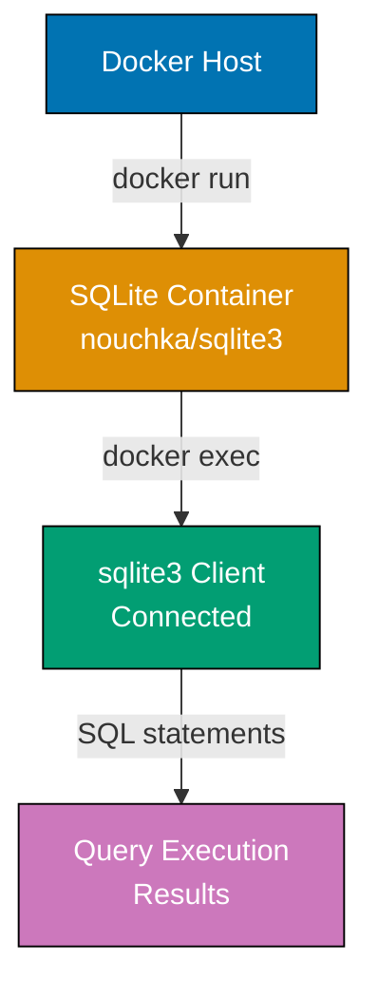
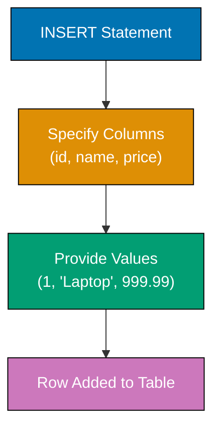
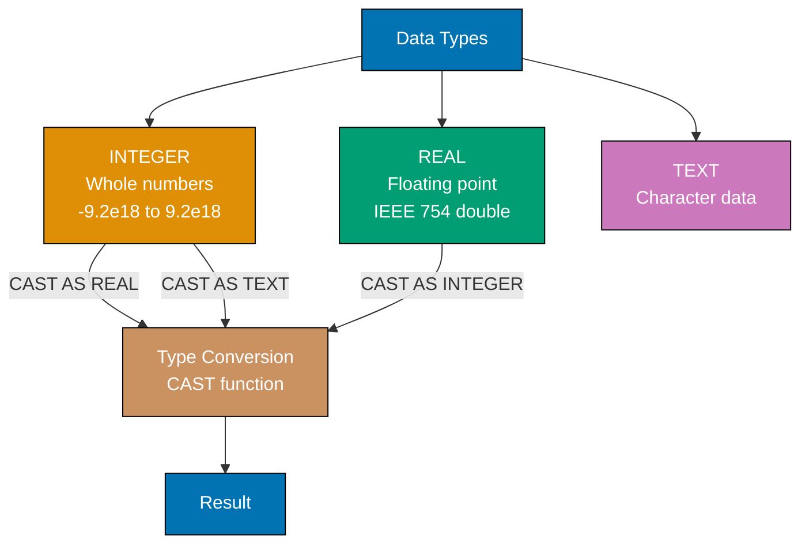
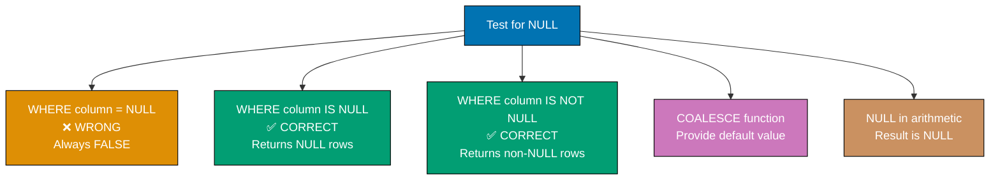
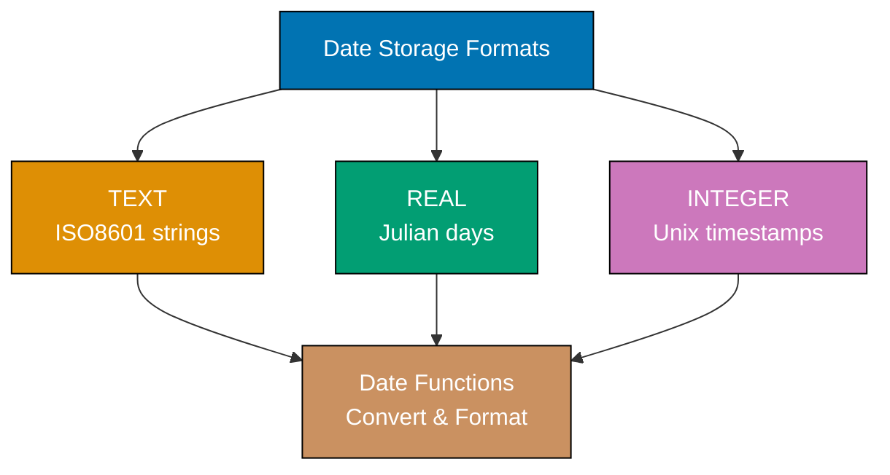
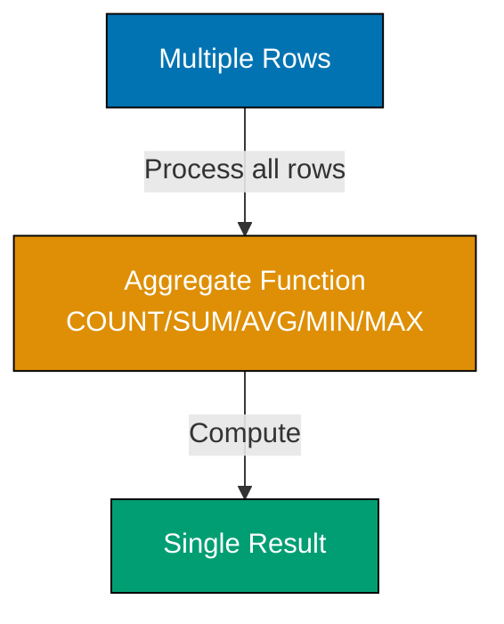
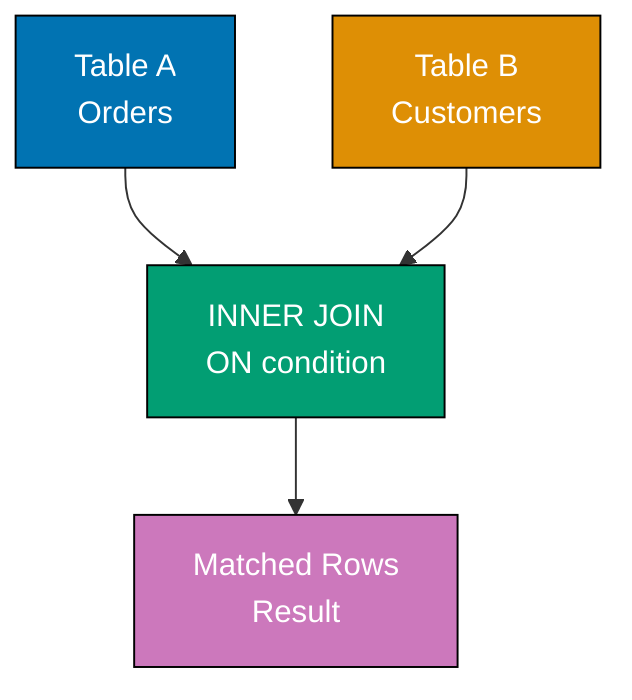
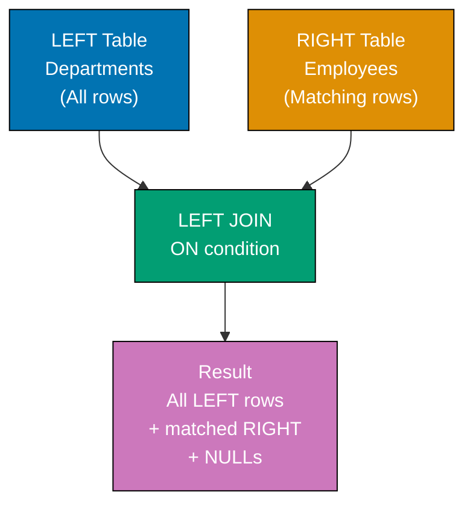
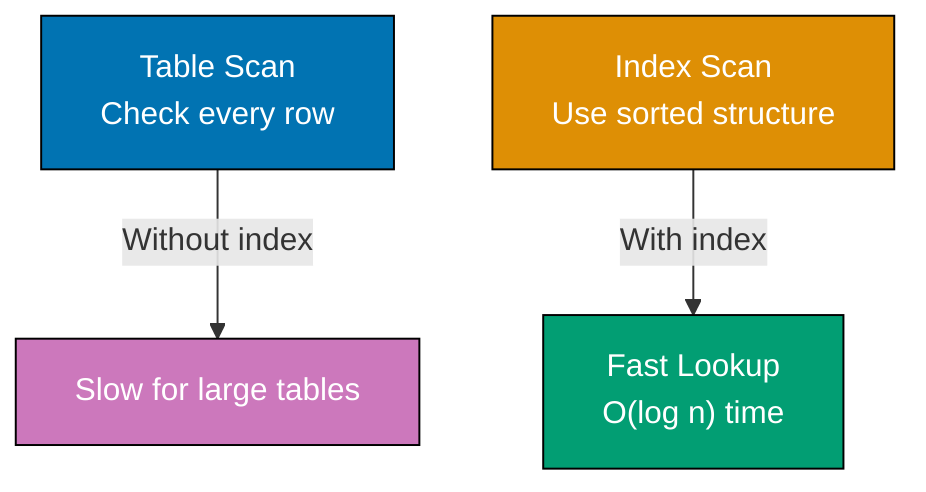

Learn SQL fundamentals through 30 annotated examples. Each example is self-contained, runnable in SQLite, and heavily commented to show what each statement does, expected outputs, and intermediate table states.

## Example 1: Installing SQLite and First Query

SQLite runs in a Docker container for isolated, reproducible environments across all platforms. This setup creates a lightweight database you can experiment with safely without installing server software.



**Code**:

```bash
# One-time setup: Create SQLite container with persistent storage
docker run --name sqlite-tutorial \
  -v sqlite-data:/data \
  -d nouchka/sqlite3:latest tail -f /dev/null
# => Container created with SQLite, data persisted in volume 'sqlite-data'

# Connect to SQLite
docker exec -it sqlite-tutorial sqlite3 /data/tutorial.db
# => Opens SQLite shell connected to tutorial.db file
```

**First query**:

```sql
-- Simple query to verify connection
SELECT sqlite_version();
-- => Returns SQLite version (e.g., "3.45.0")

-- Simple arithmetic
SELECT 2 + 2 AS result;
-- => Returns 4 in column named 'result'

-- String concatenation
SELECT 'Hello, ' || 'SQL!' AS greeting;
-- => Returns "Hello, SQL!" (|| is concatenation operator)

-- Current date and time
SELECT datetime('now') AS current_time;
-- => Returns current UTC timestamp (e.g., "2025-12-29 02:07:25")
```

**Key Takeaway**: SQLite runs in Docker containers with no server configuration needed. The `SELECT` statement executes queries and returns results - even simple expressions work without FROM clauses.

**Why It Matters**: Reproducible development environments prevent "works on my machine" issues across teams. Docker-based database setups enable consistent testing, onboarding, and CI/CD pipelines. Production applications typically use managed database services, but local containerized databases are essential for development and testing without affecting production data.

---

## Example 2: Creating Your First Table

Tables store related data in rows and columns. Each column has a name and data type. Tables are the fundamental storage unit in relational databases.

**Code**:

```sql
-- Create a simple table
CREATE TABLE users (
    id INTEGER,           -- => Integer column for user ID
                          -- => Stores whole numbers from -9.2e18 to 9.2e18
    name TEXT,            -- => Text column for user name
                          -- => Stores variable-length character data
    email TEXT,           -- => Text column for email address
                          -- => No length limit in SQLite TEXT type
    age INTEGER           -- => Integer column for age
                          -- => SQLite flexible typing allows NULL by default
);
-- => Table 'users' created with 4 columns
-- => Table exists in database but contains no rows yet

-- List all tables
.tables
-- => Shows: users
-- => SQLite command (starts with .) lists all tables in database

-- Show table structure
.schema users
-- => Displays CREATE TABLE statement
-- => Shows column names, types, and constraints

-- Verify table is empty
SELECT COUNT(*) FROM users;
-- => Returns 0 (no rows yet)
-- => COUNT(*) counts all rows in table
```

**Key Takeaway**: Use `CREATE TABLE` to define structure before storing data. Each column needs a name and type (INTEGER, TEXT, REAL, BLOB). Tables start empty - use INSERT to add rows.

**Why It Matters**: Schema design decisions impact application performance and maintainability for years. Choosing appropriate data types affects storage efficiency, query speed, and data integrity. Production databases evolve through migrations that carefully add, modify, or remove columns while preserving existing data—schema changes in production require planning and testing.

---

## Example 3: Basic SELECT Queries

SELECT retrieves data from tables. The asterisk (`*`) selects all columns, while specific column names give precise control over what data returns.

**Code**:

```sql
-- Create table and insert sample data
CREATE TABLE products (
    id INTEGER,          -- => Unique identifier for each product
    name TEXT,           -- => Product name (variable length)
    price REAL,          -- => Product price (floating point)
    category TEXT        -- => Product category grouping
);
-- => Table structure defined, ready for data

INSERT INTO products (id, name, price, category)
VALUES
    (1, 'Laptop', 999.99, 'Electronics'),
    (2, 'Mouse', 29.99, 'Electronics'),
    (3, 'Desk Chair', 199.99, 'Furniture'),
    (4, 'Monitor', 299.99, 'Electronics');
-- => 4 rows inserted
-- => Each row represents one product with all four columns populated

-- Select all columns, all rows
SELECT * FROM products;
-- => Returns all 4 rows with columns: id | name | price | category
-- => Asterisk (*) means "all columns"
-- => No WHERE clause means "all rows"

-- Select specific columns
SELECT name, price FROM products;
-- => Returns only 'name' and 'price' columns for all rows
-- => Order of columns matches SELECT clause order
-- => Reduces data transfer compared to SELECT *

-- Select with expressions
SELECT name, price, price * 1.10 AS price_with_tax FROM products;
-- => Calculates new column showing 10% tax
-- => price * 1.10 computes tax for each row
-- => AS price_with_tax names the computed column
-- => Laptop: 1099.99, Mouse: 32.99, Desk Chair: 219.99, Monitor: 329.99
```

**Key Takeaway**: SELECT retrieves data from tables - use `*` for all columns or name specific columns. You can include expressions and calculations in SELECT to derive new values without modifying stored data.

**Why It Matters**: Selecting only needed columns reduces network bandwidth and memory usage—critical for high-traffic applications. Production systems avoid `SELECT *` because it fetches unnecessary data and breaks when schema changes add columns. Computed columns enable business logic in queries without duplicating data storage, keeping derived values always up-to-date.

---

## Example 4: Inserting Data with INSERT

INSERT adds new rows to tables. You can insert single rows, multiple rows at once, or specify only certain columns (others become NULL).



**Code**:

```sql
CREATE TABLE inventory (
    id INTEGER,           -- => Inventory item identifier
    item TEXT,            -- => Item name/description
    quantity INTEGER,     -- => Stock quantity (number of units)
    warehouse TEXT        -- => Warehouse location code
);
-- => Table structure defined for inventory tracking
-- => No constraints defined, all columns nullable by default

-- Insert single row with all columns
INSERT INTO inventory (id, item, quantity, warehouse)
VALUES (1, 'Widget A', 100, 'North');
-- => Inserts 1 row into inventory table
-- => Explicitly specifies all 4 column values
-- => Row state: id=1, item='Widget A', quantity=100, warehouse='North'

-- Insert multiple rows at once (more efficient)
INSERT INTO inventory (id, item, quantity, warehouse)
VALUES
    (2, 'Widget B', 200, 'South'),
    (3, 'Widget C', 150, 'East'),
    (4, 'Widget D', 75, 'West');
-- => Inserts 3 rows in single statement
-- => Single INSERT reduces database round-trips
-- => More efficient than 3 separate INSERT statements
-- => Table now contains 4 rows total

-- Insert partial columns (others become NULL)
INSERT INTO inventory (id, item)
VALUES (5, 'Widget E');
-- => Inserts row with only id and item specified
-- => quantity and warehouse columns become NULL
-- => Row state: id=5, item='Widget E', quantity=NULL, warehouse=NULL
-- => NULL represents missing/unknown data

-- Verify data
SELECT * FROM inventory;
-- => Returns all 5 rows
-- => Displays: id, item, quantity, warehouse for each row
-- => Row 5 shows NULL values for quantity and warehouse
```

**Key Takeaway**: INSERT adds rows to tables - specify columns and values explicitly for clarity. Multi-row inserts are more efficient than multiple single-row inserts. Columns not specified get NULL unless a default value is defined.

**Why It Matters**: Bulk inserts dramatically improve performance for data imports—inserting 10,000 rows individually takes minutes, while a single multi-row INSERT completes in seconds. Production ETL pipelines batch inserts to reduce network round-trips and transaction overhead. Explicit column lists protect against schema changes breaking INSERT statements.

---

## Example 5: Updating and Deleting Rows

UPDATE modifies existing rows matching a WHERE condition. DELETE removes rows. Both are dangerous without WHERE clauses - they affect ALL rows.

**Code**:

```sql
CREATE TABLE stock (
    id INTEGER,           -- => Stock item identifier
    product TEXT,         -- => Product name
    quantity INTEGER,     -- => Current stock quantity
    price REAL            -- => Unit price in dollars
);
-- => Table for inventory stock management
-- => Tracks product quantities and pricing

INSERT INTO stock (id, product, quantity, price)
VALUES
    (1, 'Apples', 100, 1.50),
    (2, 'Bananas', 150, 0.75),
    (3, 'Oranges', 80, 2.00);
-- => Inserts 3 products with initial quantities and prices
-- => Table state: 3 rows with complete data

-- Update single row
UPDATE stock
SET quantity = 120
WHERE id = 1;
-- => Updates Apples quantity to 120 (only row with id=1)
-- => WHERE clause targets specific row by id
-- => Before: quantity=100, After: quantity=120
-- => Other columns (product, price) unchanged

-- Update multiple columns
UPDATE stock
SET quantity = 200, price = 0.80
WHERE product = 'Bananas';
-- => Updates both quantity and price for Bananas
-- => SET clause specifies multiple column changes
-- => Before: quantity=150, price=0.75
-- => After: quantity=200, price=0.80

-- Update with calculation
UPDATE stock
SET price = price * 1.10
WHERE price < 2.00;
-- => Increases price by 10% for items under $2.00
-- => WHERE filters rows: Apples (1.50) and Bananas (0.80) qualify
-- => Apples: price 1.50 -> 1.65 (1.50 * 1.10)
-- => Bananas: price 0.80 -> 0.88 (0.80 * 1.10)
-- => Oranges unchanged (price 2.00 not < 2.00)

-- Verify updates
SELECT * FROM stock;
-- => Returns all rows showing updated values
-- => Displays current state after all UPDATE operations

-- Delete specific row
DELETE FROM stock
WHERE id = 3;
-- => Removes Oranges (id=3)
-- => WHERE clause targets single row by id
-- => Table now contains 2 rows (Apples, Bananas)
-- => Deleted row permanently removed

-- DANGEROUS: Update without WHERE affects ALL rows
UPDATE stock SET quantity = 0;
-- => Sets quantity to 0 for ALL remaining items (Apples, Bananas)
-- => No WHERE clause means operation applies to every row
-- => Both products now have quantity=0
-- => Prices unchanged (only SET quantity affected)

-- DANGEROUS: Delete without WHERE removes ALL rows
DELETE FROM stock;
-- => Removes all rows from table (table structure remains)
-- => No WHERE clause means delete every row
-- => Table still exists but contains 0 rows
-- => Table structure (columns, constraints) preserved
```

**Key Takeaway**: Always use WHERE clauses with UPDATE and DELETE to target specific rows - omitting WHERE modifies or removes ALL rows. Test your WHERE clause with SELECT before running UPDATE or DELETE.

**Why It Matters**: Accidental mass updates and deletes are among the most devastating database mistakes—one missing WHERE clause can destroy production data in seconds. Production environments use transaction wrappers, require review for destructive queries, and maintain backups. The "SELECT first" practice catches errors before they become disasters.

---

## Example 6: Numeric Types (INTEGER and REAL)

SQLite uses dynamic typing with type affinity. INTEGER stores whole numbers, REAL stores floating-point numbers. Unlike other databases, SQLite is flexible about type enforcement.



**Code**:

```sql
CREATE TABLE numeric_examples (
    id INTEGER,
    whole_number INTEGER,     -- => Stores integers: -9223372036854775808 to 9223372036854775807
    decimal_number REAL,      -- => Stores floating point (IEEE 754 double precision)
    scientific REAL           -- => Can store scientific notation
);

INSERT INTO numeric_examples (id, whole_number, decimal_number, scientific)
VALUES
    (1, 42, 3.14159, 6.022e23),
    (2, -100, 99.99, 1.602e-19);
-- => Inserts numbers demonstrating range and precision

SELECT * FROM numeric_examples;
-- => Returns: id=1, whole_number=42, decimal_number=3.14159, scientific=6.022e+23
-- =>          id=2, whole_number=-100, decimal_number=99.99, scientific=1.602e-19

-- Arithmetic operations
SELECT
    whole_number + 10 AS addition,
    decimal_number * 2 AS multiplication,
    whole_number / 3 AS division,
    whole_number % 3 AS modulo
FROM numeric_examples
WHERE id = 1;
-- => Returns: addition=52, multiplication=6.28318, division=14, modulo=0

-- Type conversion
SELECT
    CAST(decimal_number AS INTEGER) AS truncated,
    CAST(whole_number AS REAL) AS as_real
FROM numeric_examples
WHERE id = 1;
-- => Returns: truncated=3, as_real=42.0
```

**Key Takeaway**: Use INTEGER for whole numbers and REAL for decimals. SQLite's dynamic typing is flexible but can cause unexpected behavior - use explicit CAST when precision matters, especially for financial calculations.

**Why It Matters**: Floating-point errors accumulate in financial calculations—0.1 + 0.2 doesn't equal 0.3 in binary floating-point. Production financial systems use integer cents or dedicated decimal types to avoid rounding errors that cause accounting discrepancies. Type mismatches between application code and database can cause silent data corruption.

---

## Example 7: Text Types and String Operations

TEXT stores character data of any length. SQLite treats TEXT, VARCHAR, and CHAR identically (unlike other databases where length matters).

**Code**:

```sql
CREATE TABLE text_examples (
    id INTEGER,
    short_text TEXT,
    long_text TEXT,
    varchar_col VARCHAR(50),  -- => Length hint ignored by SQLite
    char_col CHAR(10)         -- => Length hint ignored by SQLite
);

INSERT INTO text_examples (id, short_text, long_text, varchar_col, char_col)
VALUES
    (1, 'Hello', 'This is a longer text with multiple words', 'VARCHAR example', 'CHAR ex'),
    (2, 'SQL', 'Standard Query Language for databases', 'Another text', '1234567890');

-- String concatenation
SELECT short_text || ' ' || long_text AS combined
FROM text_examples
WHERE id = 1;
-- => Returns: "Hello This is a longer text with multiple words"

-- String functions
SELECT
    UPPER(short_text) AS uppercase,
    LOWER(short_text) AS lowercase,
    LENGTH(short_text) AS length,
    SUBSTR(long_text, 1, 10) AS first_10_chars
FROM text_examples
WHERE id = 1;
-- => Returns: uppercase='HELLO', lowercase='hello', length=5, first_10_chars='This is a '

-- Pattern matching with LIKE
SELECT * FROM text_examples
WHERE long_text LIKE '%database%';
-- => Returns row 2 (contains "database")

-- Replace function
SELECT REPLACE(short_text, 'SQL', 'Structured Query Language') AS replaced
FROM text_examples
WHERE id = 2;
-- => Returns: "Structured Query Language"
```

**Key Takeaway**: TEXT is the primary string type in SQLite and handles any length. Use `||` for concatenation, UPPER/LOWER for case conversion, LIKE for pattern matching, and SUBSTR for extraction.

**Why It Matters**: String operations power search features, data cleaning, and report formatting. Production systems use LIKE patterns for user search functionality, string functions for data normalization, and proper text handling prevents injection attacks. Understanding string collation affects sorting and comparison behavior across different languages.

---

## Example 8: NULL Handling

NULL represents missing or unknown data. NULL is NOT equal to anything, including itself. Special operators IS NULL and IS NOT NULL test for NULL values.



**Code**:

```sql
CREATE TABLE employees (
    id INTEGER,
    name TEXT,
    email TEXT,
    phone TEXT,
    salary REAL
);

INSERT INTO employees (id, name, email, phone, salary)
VALUES
    (1, 'Alice', 'alice@example.com', '555-1234', 75000),
    (2, 'Bob', NULL, '555-5678', 60000),
    (3, 'Charlie', 'charlie@example.com', NULL, 80000),
    (4, 'Diana', NULL, NULL, NULL);
-- => 4 rows inserted with various NULL values

-- WRONG: This doesn't work as expected
SELECT * FROM employees WHERE email = NULL;
-- => Returns 0 rows (NULL = NULL is always false!)

-- CORRECT: Use IS NULL
SELECT * FROM employees WHERE email IS NULL;
-- => Returns Bob and Diana (rows with NULL email)

-- Find rows with non-NULL values
SELECT * FROM employees WHERE phone IS NOT NULL;
-- => Returns Alice and Bob (rows with phone numbers)

-- COALESCE provides default for NULL
SELECT
    name,
    COALESCE(email, 'no-email@example.com') AS email_with_default,
    COALESCE(salary, 0) AS salary_or_zero
FROM employees;
-- => Diana's NULL email becomes 'no-email@example.com', NULL salary becomes 0

-- NULL in calculations
SELECT
    name,
    salary,
    salary * 1.10 AS salary_with_raise
FROM employees;
-- => Diana's salary_with_raise is NULL (NULL in arithmetic produces NULL)
```

**Key Takeaway**: Use `IS NULL` and `IS NOT NULL` to test for missing values - never use `= NULL`. COALESCE provides defaults for NULL values. NULL in arithmetic or comparisons produces NULL.

**Why It Matters**: NULL bugs are among the most common database errors—using `= NULL` instead of `IS NULL` returns zero rows and silently fails. Production applications must handle NULL in aggregations (COUNT ignores NULL), joins (NULL never matches), and display logic. COALESCE provides sensible defaults that prevent NULL propagation through calculations.

---

## Example 9: Date and Time Types

SQLite stores dates and times as TEXT (ISO8601), REAL (Julian day), or INTEGER (Unix timestamp). Use date/time functions for manipulation and formatting.



**Code**:

```sql
CREATE TABLE events (
    id INTEGER,
    event_name TEXT,
    event_date TEXT,          -- => Stores date as TEXT (ISO8601: YYYY-MM-DD)
    event_datetime TEXT,      -- => Stores datetime as TEXT (ISO8601: YYYY-MM-DD HH:MM:SS)
    created_at INTEGER        -- => Stores Unix timestamp
);

-- Insert with various date formats
INSERT INTO events (id, event_name, event_date, event_datetime, created_at)
VALUES
    (1, 'Conference', '2025-06-15', '2025-06-15 09:00:00', 1735426800),
    (2, 'Meeting', '2025-07-20', '2025-07-20 14:30:00', 1737369000);

-- Current date and time
SELECT
    date('now') AS current_date,
    time('now') AS current_time,
    datetime('now') AS current_datetime;
-- => Returns current UTC date, time, and datetime

-- Date arithmetic
SELECT
    event_name,
    event_date,
    date(event_date, '+7 days') AS week_later,
    date(event_date, '-1 month') AS month_earlier
FROM events;
-- => Conference week_later: '2025-06-22', month_earlier: '2025-05-15'

-- Extract date parts
SELECT
    event_name,
    STRFTIME('%Y', event_date) AS year,
    STRFTIME('%m', event_date) AS month,
    STRFTIME('%d', event_date) AS day,
    STRFTIME('%w', event_date) AS weekday
FROM events;
-- => Conference: year='2025', month='06', day='15', weekday='0' (Sunday)

-- Date differences
SELECT
    event_name,
    JULIANDAY(event_date) - JULIANDAY('2025-01-01') AS days_from_new_year
FROM events;
-- => Conference: ~165 days from January 1, 2025
```

**Key Takeaway**: Store dates as TEXT in ISO8601 format (YYYY-MM-DD) for readability and portability. Use date(), time(), and datetime() functions for manipulation. STRFTIME() formats dates, JULIANDAY() enables date arithmetic.

**Why It Matters**: Date handling is notoriously error-prone—timezone bugs cause scheduling failures, date format inconsistencies break data imports, and incorrect date arithmetic leads to billing errors. Production systems standardize on UTC storage with timezone conversion at display time. ISO8601 format ensures consistent sorting and cross-system compatibility.

---

## Example 10: Boolean Values and Truthiness

SQLite has no dedicated BOOLEAN type. Use INTEGER with 0 (false) and 1 (true) by convention. Comparisons and logical operators produce 0 or 1.

**Code**:

```sql
CREATE TABLE settings (
    id INTEGER,                   -- => Settings identifier (unique per setting)
    feature_name TEXT,            -- => Human-readable feature name
    is_enabled INTEGER,           -- => 0 = false, 1 = true by convention
                                   -- => Boolean flag controlling feature state
    is_visible INTEGER            -- => 0 = hidden, 1 = visible in UI
                                   -- => Boolean flag for UI rendering control
);
-- => Table structure defined for feature flags
-- => No BOOLEAN type in SQLite, use INTEGER 0/1 pattern

INSERT INTO settings (id, feature_name, is_enabled, is_visible)
VALUES
    (1, 'Dark Mode', 1, 1),       -- => id=1, enabled=true, visible=true
    (2, 'Notifications', 0, 1),   -- => id=2, enabled=false, visible=true
    (3, 'Beta Features', 1, 0);   -- => id=3, enabled=true, visible=false
-- => 3 rows inserted with boolean states represented as 0/1
-- => Table state: 3 feature flags with different combinations

-- Filter by boolean values
SELECT * FROM settings WHERE is_enabled = 1;
-- => WHERE is_enabled = 1 filters to "true" values only
-- => Returns 2 rows: Dark Mode (id=1) and Beta Features (id=3)
-- => Notifications (is_enabled=0) excluded from results
-- => Output: id | feature_name | is_enabled | is_visible

-- Logical operators produce 0 or 1
SELECT
    feature_name,                 -- => Feature name for display
    is_enabled,                   -- => Current enabled state (0 or 1)
    is_visible,                   -- => Current visible state (0 or 1)
    is_enabled AND is_visible AS both_true,  -- => 1 if both true, else 0
                                              -- => Dark Mode: 1 AND 1 = 1
                                              -- => Notifications: 0 AND 1 = 0
                                              -- => Beta Features: 1 AND 0 = 0
    is_enabled OR is_visible AS either_true, -- => 1 if either true, else 0
                                              -- => Dark Mode: 1 OR 1 = 1
                                              -- => Notifications: 0 OR 1 = 1
                                              -- => Beta Features: 1 OR 0 = 1
    NOT is_enabled AS inverted    -- => 1 if enabled=0, else 0
                                   -- => Dark Mode: NOT 1 = 0
                                   -- => Notifications: NOT 0 = 1
                                   -- => Beta Features: NOT 1 = 0
FROM settings;
-- => Returns 3 rows with computed boolean columns
-- => Output shows truthiness combinations for each setting
-- => Dark Mode: both_true=1, either_true=1, inverted=0
-- => Notifications: both_true=0, either_true=1, inverted=1
-- => Beta Features: both_true=0, either_true=1, inverted=0

-- Comparison operators produce 0 or 1
SELECT
    feature_name,                 -- => Feature name column
    (is_enabled = 1) AS explicit_check,  -- => Comparison returns 0 or 1
                                          -- => Dark Mode: 1 = 1 → 1 (true)
                                          -- => Notifications: 0 = 1 → 0 (false)
                                          -- => Beta Features: 1 = 1 → 1 (true)
    (id > 2) AS id_comparison     -- => Comparison operator result
                                   -- => Dark Mode: 1 > 2 → 0 (false)
                                   -- => Notifications: 2 > 2 → 0 (false)
                                   -- => Beta Features: 3 > 2 → 1 (true)
FROM settings;
-- => Returns 3 rows with boolean comparison results
-- => Dark Mode: explicit_check=1, id_comparison=0
-- => Notifications: explicit_check=0, id_comparison=0
-- => Beta Features: explicit_check=1, id_comparison=1
```

**Key Takeaway**: Use INTEGER with 0/1 values to represent boolean data. Logical operators (AND, OR, NOT) and comparisons produce 0 (false) or 1 (true). This convention is portable to other SQL databases.

**Why It Matters**: Boolean flags control feature toggles, user permissions, and state management. Production systems use boolean columns for is_active, is_deleted, and is_verified fields that enable soft deletes and staged rollouts. Understanding truthiness prevents bugs where 0 might be treated as false in application code but stored differently in the database.

---

## Example 11: WHERE Clause Filtering

WHERE filters rows based on conditions. Only rows where the condition evaluates to true (non-zero) are returned. Combine multiple conditions with AND/OR.

**Code**:

```sql
CREATE TABLE orders (
    id INTEGER,
    customer TEXT,
    amount REAL,
    status TEXT,
    order_date TEXT
);

INSERT INTO orders (id, customer, amount, status, order_date)
VALUES
    (1, 'Alice', 150.00, 'completed', '2025-01-15'),
    (2, 'Bob', 75.50, 'pending', '2025-01-16'),
    (3, 'Charlie', 200.00, 'completed', '2025-01-17'),
    (4, 'Alice', 50.00, 'cancelled', '2025-01-18'),
    (5, 'Diana', 300.00, 'completed', '2025-01-19');

-- Single condition
SELECT * FROM orders WHERE status = 'completed';
-- => Returns rows 1, 3, 5 (completed orders)

-- Numeric comparison
SELECT * FROM orders WHERE amount > 100;
-- => Returns rows 1, 3, 5 (orders over $100)

-- Multiple conditions with AND
SELECT * FROM orders WHERE status = 'completed' AND amount > 150;
-- => Returns rows 3, 5 (completed orders over $150)

-- Multiple conditions with OR
SELECT * FROM orders WHERE customer = 'Alice' OR amount > 250;
-- => Returns rows 1, 4, 5 (Alice's orders or large orders)

-- Negation with NOT or !=
SELECT * FROM orders WHERE status != 'cancelled';
-- => Returns all rows except row 4

-- Range check with BETWEEN
SELECT * FROM orders WHERE amount BETWEEN 50 AND 150;
-- => Returns rows 1, 2, 4 (amounts from $50 to $150 inclusive)

-- List membership with IN
SELECT * FROM orders WHERE customer IN ('Alice', 'Bob');
-- => Returns rows 1, 2, 4 (orders from Alice or Bob)
```

**Key Takeaway**: WHERE filters rows using conditions - comparison operators (=, !=, <, >, <=, >=), BETWEEN for ranges, IN for lists. Combine conditions with AND (both must be true) or OR (either can be true).

**Why It Matters**: WHERE clauses determine query performance—filtering early reduces data processing. Production queries must use indexed columns in WHERE for acceptable response times. IN clauses enable parameterized queries that prevent SQL injection while filtering by lists of IDs from application code.

---

## Example 12: Sorting with ORDER BY

ORDER BY sorts query results by one or more columns. Default is ascending (ASC), use DESC for descending. Multiple columns create hierarchical sorting.

**Code**:

```sql
CREATE TABLE students (
    id INTEGER,
    name TEXT,
    grade INTEGER,
    score REAL
);

INSERT INTO students (id, name, grade, score)
VALUES
    (1, 'Alice', 10, 95.5),
    (2, 'Bob', 9, 87.0),
    (3, 'Charlie', 10, 92.0),
    (4, 'Diana', 9, 94.5),
    (5, 'Eve', 10, 88.5);

-- Sort by single column (ascending by default)
SELECT * FROM students ORDER BY score;
-- => Returns: Bob (87.0), Eve (88.5), Charlie (92.0), Diana (94.5), Alice (95.5)

-- Sort descending
SELECT * FROM students ORDER BY score DESC;
-- => Returns: Alice (95.5), Diana (94.5), Charlie (92.0), Eve (88.5), Bob (87.0)

-- Multi-column sort (grade first, then score)
SELECT * FROM students ORDER BY grade, score DESC;
-- => Returns: Diana (grade 9, 94.5), Bob (grade 9, 87.0), Alice (grade 10, 95.5), Charlie (grade 10, 92.0), Eve (grade 10, 88.5)

-- Sort by expression
SELECT name, score, (score * 1.10) AS bonus_score
FROM students
ORDER BY bonus_score DESC;
-- => Calculates bonus_score and sorts by it

-- Sort with NULL handling (NULLs appear first in ASC, last in DESC)
INSERT INTO students (id, name, grade, score) VALUES (6, 'Frank', 10, NULL);
SELECT * FROM students ORDER BY score;
-- => Frank (NULL score) appears first
```

**Key Takeaway**: Use ORDER BY to sort results by one or more columns. ASC (default) sorts low to high, DESC sorts high to low. Multi-column sorting creates hierarchical order (primary sort, then secondary).

**Why It Matters**: Consistent ordering is essential for pagination and user experience—without ORDER BY, results may vary between queries due to internal database behavior. Production systems add secondary sort columns (like ID) to handle ties and ensure stable pagination. ORDER BY on non-indexed columns can cause full table scans.

---

## Example 13: Limiting Results with LIMIT and OFFSET

LIMIT restricts the number of rows returned. OFFSET skips a specified number of rows before returning results. Together they enable pagination.

**Code**:

```sql
CREATE TABLE products (
    id INTEGER,
    name TEXT,
    price REAL,
    stock INTEGER
);

INSERT INTO products (id, name, price, stock)
VALUES
    (1, 'Widget A', 10.00, 100),
    (2, 'Widget B', 15.00, 50),
    (3, 'Widget C', 20.00, 75),
    (4, 'Widget D', 12.00, 120),
    (5, 'Widget E', 18.00, 90),
    (6, 'Widget F', 25.00, 60),
    (7, 'Widget G', 30.00, 40),
    (8, 'Widget H', 22.00, 80);

-- Get first 3 products
SELECT * FROM products LIMIT 3;
-- => Returns rows 1, 2, 3

-- Get 3 products starting from the 4th row (0-indexed offset)
SELECT * FROM products LIMIT 3 OFFSET 3;
-- => Returns rows 4, 5, 6

-- Pagination: Page 1 (3 items per page)
SELECT * FROM products ORDER BY price LIMIT 3 OFFSET 0;
-- => Returns 3 cheapest products

-- Pagination: Page 2
SELECT * FROM products ORDER BY price LIMIT 3 OFFSET 3;
-- => Returns next 3 cheapest products

-- Top N query: 5 most expensive products
SELECT * FROM products ORDER BY price DESC LIMIT 5;
-- => Returns Widget G (30), Widget F (25), Widget H (22), Widget C (20), Widget E (18)

-- OFFSET without LIMIT (gets all remaining rows after offset)
SELECT * FROM products OFFSET 5;
-- => Returns rows 6, 7, 8
```

**Key Takeaway**: LIMIT restricts result count, OFFSET skips rows. Use together for pagination: `LIMIT page_size OFFSET (page_number - 1) * page_size`. Always ORDER BY for consistent pagination.

**Why It Matters**: Unbounded queries can overwhelm applications with millions of rows—LIMIT protects against memory exhaustion and response timeouts. However, OFFSET-based pagination degrades at high page numbers (must scan skipped rows). Production systems use cursor-based pagination with keyset conditions for consistent performance at scale.

---

## Example 14: DISTINCT for Unique Values

DISTINCT removes duplicate rows from results. When used with multiple columns, it considers the entire row for uniqueness.

**Code**:

```sql
CREATE TABLE purchases (
    id INTEGER,
    customer TEXT,
    product TEXT,
    quantity INTEGER
);

INSERT INTO purchases (id, customer, product, quantity)
VALUES
    (1, 'Alice', 'Laptop', 1),
    (2, 'Bob', 'Mouse', 2),
    (3, 'Alice', 'Keyboard', 1),
    (4, 'Charlie', 'Mouse', 1),
    (5, 'Bob', 'Monitor', 1),
    (6, 'Alice', 'Mouse', 3);

-- Get all customers (with duplicates)
SELECT customer FROM purchases;
-- => Returns: Alice, Bob, Alice, Charlie, Bob, Alice (6 rows)

-- Get unique customers
SELECT DISTINCT customer FROM purchases;
-- => Returns: Alice, Bob, Charlie (3 rows)

-- Get unique products
SELECT DISTINCT product FROM purchases;
-- => Returns: Laptop, Mouse, Keyboard, Monitor (4 rows)

-- DISTINCT with multiple columns (unique combinations)
SELECT DISTINCT customer, product FROM purchases;
-- => Returns unique (customer, product) pairs
-- => (Alice, Laptop), (Bob, Mouse), (Alice, Keyboard), (Charlie, Mouse), (Bob, Monitor), (Alice, Mouse)

-- Count distinct values
SELECT COUNT(DISTINCT customer) AS unique_customers FROM purchases;
-- => Returns 3 (Alice, Bob, Charlie)
```

**Key Takeaway**: DISTINCT removes duplicate rows from results. With multiple columns, it considers the complete row for uniqueness. Use COUNT(DISTINCT column) to count unique values.

**Why It Matters**: DISTINCT is essential for analytics (unique visitors, distinct products purchased) but can be expensive on large tables without supporting indexes. Production dashboards use DISTINCT for deduplication while being aware of performance implications. COUNT(DISTINCT) enables metrics like "unique active users" that drive business decisions.

---

## Example 15: Pattern Matching with LIKE and GLOB

LIKE performs case-insensitive pattern matching with wildcards: `%` (any characters) and `_` (single character). GLOB is case-sensitive with `*` and `?` wildcards.

**Code**:

```sql
CREATE TABLE files (
    id INTEGER,                       -- => File identifier
    filename TEXT,                    -- => File name with extension
                                      -- => Mixed case for testing case sensitivity
    size INTEGER,                     -- => File size in bytes
    extension TEXT                    -- => File extension (separate column for convenience)
);
-- => Table for file metadata
-- => Demonstrates pattern matching on text fields

INSERT INTO files (id, filename, size, extension)
VALUES
    (1, 'report_2025.pdf', 1024, 'pdf'),      -- => Lowercase filename, lowercase extension
    (2, 'image_001.jpg', 2048, 'jpg'),        -- => Numeric pattern in filename
    (3, 'Report_Final.PDF', 512, 'PDF'),      -- => Uppercase 'Report' and 'PDF'
    (4, 'data_export.csv', 4096, 'csv'),      -- => Different file type
    (5, 'photo_vacation.JPG', 3072, 'JPG');   -- => Uppercase extension
-- => 5 files with varied case patterns
-- => Rows 1 and 3 have same word 'report' (different case)
-- => Extensions vary in case: pdf, PDF, jpg, JPG, csv

-- LIKE: Case-insensitive, % matches any characters
SELECT * FROM files WHERE filename LIKE '%report%';
                                      -- => LIKE is case-insensitive in SQLite
                                      -- => % matches zero or more characters
                                      -- => %report% matches 'report' anywhere in filename
-- => Returns rows 1, 3 (both 'report' and 'Report' match)
-- => 'report_2025.pdf' matches (%report% finds 'report')
-- => 'Report_Final.PDF' matches (%report% finds 'Report', case-insensitive)
-- => Rows 2, 4, 5 excluded (no 'report' substring)

-- LIKE: _ matches single character
SELECT * FROM files WHERE filename LIKE 'image___%.jpg';
                                      -- => _ (underscore) matches exactly ONE character
                                      -- => 'image___' matches 'image' + 3 characters
                                      -- => % matches remaining characters before '.jpg'
                                      -- => Pattern: image + 3 chars + anything + .jpg
-- => Returns row 2 ('image_001.jpg' - 3 characters '001' after 'image')
-- => 'image_' = 'image_' (match)
-- => '001' matches ___ (3 underscores = 3 characters)
-- => '.jpg' matches %.jpg (% = empty, then .jpg literal)
-- => Other rows don't start with 'image'

-- LIKE: Match file extensions
SELECT * FROM files WHERE filename LIKE '%.pdf';
                                      -- => % matches filename before extension
                                      -- => .pdf matches literal '.pdf'
                                      -- => Case-insensitive: matches .pdf and .PDF
-- => Returns rows 1, 3 (case-insensitive: both .pdf and .PDF)
-- => Row 1: 'report_2025.pdf' ends with '.pdf'
-- => Row 3: 'Report_Final.PDF' ends with '.PDF' (case-insensitive match)
-- => Rows 2, 4, 5 excluded (wrong extensions)

-- GLOB: Case-sensitive, * matches any characters
SELECT * FROM files WHERE filename GLOB '*report*';
                                      -- => GLOB is case-SENSITIVE
                                      -- => * matches zero or more characters (like % in LIKE)
                                      -- => *report* matches 'report' anywhere (exact case)
-- => Returns row 1 only ('report' matches, 'Report' doesn't)
-- => Row 1: 'report_2025.pdf' contains lowercase 'report' (match)
-- => Row 3: 'Report_Final.PDF' contains uppercase 'Report' (NO match, case-sensitive)
-- => Key difference from LIKE: GLOB distinguishes case

-- GLOB: ? matches single character
SELECT * FROM files WHERE filename GLOB 'photo_*.JPG';
                                      -- => ? matches exactly ONE character (like _ in LIKE)
                                      -- => * matches any characters
                                      -- => Pattern: 'photo_' + any chars + '.JPG'
                                      -- => Case-sensitive: .JPG must be uppercase
-- => Returns row 5 ('photo_vacation.JPG')
-- => 'photo_' matches literal
-- => 'vacation' matches * (any characters)
-- => '.JPG' matches literal (case-sensitive)
-- => Would NOT match 'photo_vacation.jpg' (lowercase extension)

-- NOT LIKE for exclusion
SELECT * FROM files WHERE filename NOT LIKE '%.pdf';
                                      -- => NOT inverts the match
                                      -- => Excludes filenames ending with .pdf
                                      -- => Case-insensitive: excludes both .pdf and .PDF
-- => Returns rows 2, 4, 5 (excludes PDF files)
-- => Row 1: 'report_2025.pdf' EXCLUDED (matches %.pdf)
-- => Row 3: 'Report_Final.PDF' EXCLUDED (matches %.pdf, case-insensitive)
-- => Rows 2, 4, 5 included (extensions: .jpg, .csv, .JPG don't match .pdf)
-- => Note: .PDF excluded due to case-insensitive LIKE
```

**Key Takeaway**: Use LIKE for case-insensitive pattern matching (`%` = any characters, `_` = one character). Use GLOB for case-sensitive matching (`*` = any characters, `?` = one character). LIKE is more common across SQL databases.

**Why It Matters**: Pattern matching powers search features throughout applications. However, leading wildcard patterns (`LIKE '%search%'`) can't use indexes and cause full table scans. Production search typically uses full-text search indexes for performance. LIKE patterns must escape special characters to prevent unexpected matches and potential security issues.

---

## Example 16: COUNT, SUM, AVG, MIN, MAX

Aggregate functions compute single values from multiple rows. COUNT counts rows, SUM adds values, AVG calculates mean, MIN/MAX find extremes.



**Code**:

```sql
CREATE TABLE sales (
    id INTEGER,
    product TEXT,
    quantity INTEGER,
    price REAL,
    sale_date TEXT
);

INSERT INTO sales (id, product, quantity, price, sale_date)
VALUES
    (1, 'Widget A', 10, 15.00, '2025-01-15'),
    (2, 'Widget B', 5, 25.00, '2025-01-16'),
    (3, 'Widget A', 8, 15.00, '2025-01-17'),
    (4, 'Widget C', 12, 10.00, '2025-01-18'),
    (5, 'Widget B', 3, 25.00, '2025-01-19');

-- Count total rows
SELECT COUNT(*) AS total_sales FROM sales;
-- => Returns 5

-- Count non-NULL values in column
SELECT COUNT(quantity) AS quantity_count FROM sales;
-- => Returns 5 (all quantities are non-NULL)

-- Sum total quantity sold
SELECT SUM(quantity) AS total_quantity FROM sales;
-- => Returns 38 (10 + 5 + 8 + 12 + 3)

-- Average price
SELECT AVG(price) AS average_price FROM sales;
-- => Returns 18.0 ((15 + 25 + 15 + 10 + 25) / 5)

-- Minimum and maximum price
SELECT MIN(price) AS min_price, MAX(price) AS max_price FROM sales;
-- => Returns min_price=10.0, max_price=25.0

-- Multiple aggregates in one query
SELECT
    COUNT(*) AS num_sales,
    SUM(quantity) AS total_qty,
    AVG(price) AS avg_price,
    MIN(price) AS min_price,
    MAX(price) AS max_price
FROM sales;
-- => Returns all 5 aggregates in single row

-- Aggregate with calculation
SELECT SUM(quantity * price) AS total_revenue FROM sales;
-- => Returns 605.0 (10*15 + 5*25 + 8*15 + 12*10 + 3*25)
```

**Key Takeaway**: Aggregate functions reduce multiple rows to single values. COUNT(\*) counts rows, SUM/AVG work on numeric columns, MIN/MAX find extremes. Combine multiple aggregates in one SELECT for comprehensive statistics.

**Why It Matters**: Aggregates power dashboards, reports, and analytics that drive business decisions. Database-level aggregation is vastly faster than fetching rows and computing in application code. Production systems use aggregate queries for real-time metrics (total sales, active users) and batch reports (monthly summaries, trend analysis).

---

## Example 17: GROUP BY for Categorized Aggregation

GROUP BY partitions rows into groups and applies aggregate functions to each group separately. Commonly combined with aggregates to produce per-category statistics.

**Code**:

```sql
CREATE TABLE transactions (
    id INTEGER,
    account TEXT,
    type TEXT,
    amount REAL,
    transaction_date TEXT
);

INSERT INTO transactions (id, account, type, amount, transaction_date)
VALUES
    (1, 'Alice', 'deposit', 1000.00, '2025-01-15'),
    (2, 'Bob', 'deposit', 500.00, '2025-01-16'),
    (3, 'Alice', 'withdrawal', 200.00, '2025-01-17'),
    (4, 'Charlie', 'deposit', 1500.00, '2025-01-18'),
    (5, 'Bob', 'withdrawal', 100.00, '2025-01-19'),
    (6, 'Alice', 'deposit', 300.00, '2025-01-20');

-- Count transactions per account
SELECT account, COUNT(*) AS num_transactions
FROM transactions
GROUP BY account;
-- => Alice: 3, Bob: 2, Charlie: 1

-- Sum amounts per transaction type
SELECT type, SUM(amount) AS total_amount
FROM transactions
GROUP BY type;
-- => deposit: 3300.00, withdrawal: 300.00

-- Multiple aggregates per group
SELECT
    account,
    COUNT(*) AS num_trans,
    SUM(amount) AS total,
    AVG(amount) AS average,
    MIN(amount) AS smallest,
    MAX(amount) AS largest
FROM transactions
GROUP BY account;
-- => Alice: num_trans=3, total=1100.00, average=366.67, smallest=200.00, largest=1000.00

-- GROUP BY multiple columns
SELECT
    account,
    type,
    SUM(amount) AS total
FROM transactions
GROUP BY account, type;
-- => (Alice, deposit): 1300.00, (Alice, withdrawal): 200.00, (Bob, deposit): 500.00, etc.

-- GROUP BY with WHERE (filter before grouping)
SELECT account, COUNT(*) AS large_transactions
FROM transactions
WHERE amount > 500
GROUP BY account;
-- => Alice: 1, Charlie: 1 (transactions over $500)
```

**Key Takeaway**: GROUP BY partitions rows into categories and applies aggregates to each group. Combine with COUNT/SUM/AVG for per-category statistics. WHERE filters before grouping, HAVING filters after grouping.

**Why It Matters**: GROUP BY enables segmented analysis—sales by region, users by signup month, errors by type. This categorization is fundamental to business intelligence. Production reports rely on GROUP BY for breakdowns that reveal trends invisible in aggregate totals, like identifying which product categories are growing fastest.

---

## Example 18: HAVING Clause for Filtering Groups

HAVING filters groups AFTER aggregation (unlike WHERE which filters rows BEFORE aggregation). Use HAVING to filter based on aggregate results.

**Code**:

```sql
CREATE TABLE store_sales (
    id INTEGER,
    store TEXT,
    product TEXT,
    revenue REAL
);

INSERT INTO store_sales (id, store, product, revenue)
VALUES
    (1, 'Store A', 'Widget', 1000.00),
    (2, 'Store B', 'Widget', 500.00),
    (3, 'Store A', 'Gadget', 1500.00),
    (4, 'Store C', 'Widget', 800.00),
    (5, 'Store B', 'Gadget', 600.00),
    (6, 'Store A', 'Tool', 300.00);

-- Find stores with total revenue over $1500
SELECT store, SUM(revenue) AS total_revenue
FROM store_sales
GROUP BY store
HAVING SUM(revenue) > 1500;
-- => Store A: 2800.00 (only store with revenue > 1500)

-- Find stores selling more than 2 products
SELECT store, COUNT(*) AS product_count
FROM store_sales
GROUP BY store
HAVING COUNT(*) > 2;
-- => Store A: 3 products

-- Combining WHERE and HAVING
-- WHERE filters rows, HAVING filters groups
SELECT product, COUNT(*) AS store_count, AVG(revenue) AS avg_revenue
FROM store_sales
WHERE revenue > 500
GROUP BY product
HAVING COUNT(*) >= 2;
-- => Widget: 2 stores, avg_revenue=900.00 (Store A and Store C both over $500)

-- HAVING with multiple conditions
SELECT store, SUM(revenue) AS total, COUNT(*) AS products
FROM store_sales
GROUP BY store
HAVING SUM(revenue) > 1000 AND COUNT(*) > 1;
-- => Store A: total=2800.00, products=3

-- HAVING can reference column aliases (SQLite-specific)
SELECT store, SUM(revenue) AS total_revenue
FROM store_sales
GROUP BY store
HAVING total_revenue > 1500;
-- => Store A: 2800.00 (works in SQLite, not all databases)
```

**Key Takeaway**: Use WHERE to filter rows before grouping, HAVING to filter groups after aggregation. HAVING conditions typically use aggregate functions (COUNT, SUM, AVG). WHERE executes first, then GROUP BY, then HAVING.

**Why It Matters**: HAVING enables threshold-based reporting—finding high-value customers (SUM > 10000), active users (COUNT > 5 logins), or anomalies (AVG deviating from normal). Production monitoring uses HAVING to surface outliers that need attention, like servers with unusually high error rates or customers with abnormal activity patterns.

---

## Example 19: INNER JOIN for Matching Rows

INNER JOIN combines rows from two tables where the join condition matches. Only rows with matches in both tables appear in results.



**Code**:

```sql
CREATE TABLE customers (
    id INTEGER,           -- => Customer identifier
    name TEXT,            -- => Customer name
    email TEXT            -- => Customer email address
);
-- => Customers table stores customer information

CREATE TABLE orders (
    id INTEGER,           -- => Order identifier
    customer_id INTEGER,  -- => Links to customers.id (foreign key concept)
    product TEXT,         -- => Product purchased
    amount REAL           -- => Order amount in dollars
);
-- => Orders table stores purchase transactions
-- => customer_id creates relationship to customers table

INSERT INTO customers (id, name, email)
VALUES
    (1, 'Alice', 'alice@example.com'),
    (2, 'Bob', 'bob@example.com'),
    (3, 'Charlie', 'charlie@example.com');
-- => Inserts 3 customers
-- => Customer ids: 1, 2, 3

INSERT INTO orders (id, customer_id, product, amount)
VALUES
    (1, 1, 'Laptop', 1000.00),
    (2, 2, 'Mouse', 50.00),
    (3, 1, 'Keyboard', 100.00),
    (4, 4, 'Monitor', 300.00);  -- customer_id=4 doesn't exist in customers
-- => Inserts 4 orders
-- => Orders 1 and 3 link to Alice (customer_id=1)
-- => Order 2 links to Bob (customer_id=2)
-- => Order 4 links to non-existent customer (id=4)

-- INNER JOIN: Only matching rows
SELECT
    customers.name,
    customers.email,
    orders.product,
    orders.amount
FROM customers
INNER JOIN orders ON customers.id = orders.customer_id;
-- => Joins customers and orders tables
-- => ON clause specifies join condition (how rows match)
-- => For each order, find customer where customers.id = orders.customer_id
-- => Only includes rows with matches in BOTH tables
-- => Returns 3 rows:
-- => Alice, alice@example.com, Laptop, 1000.00 (customers.id=1 matches orders.customer_id=1)
-- => Bob, bob@example.com, Mouse, 50.00 (customers.id=2 matches orders.customer_id=2)
-- => Alice, alice@example.com, Keyboard, 100.00 (customers.id=1 matches orders.customer_id=1 again)
-- => Charlie excluded (no matching orders.customer_id=3)
-- => Order 4 (Monitor) excluded (no matching customers.id=4)

-- Table aliases for shorter syntax
SELECT c.name, o.product, o.amount
FROM customers c
INNER JOIN orders o ON c.id = o.customer_id;
-- => Same join as above with shorter table names
-- => 'c' is alias for customers table
-- => 'o' is alias for orders table
-- => Improves readability in complex queries

-- Multiple conditions in join
SELECT c.name, o.product, o.amount
FROM customers c
INNER JOIN orders o ON c.id = o.customer_id AND o.amount > 100;
-- => Combines join condition with filter condition
-- => ON c.id = o.customer_id: matches customer to order
-- => AND o.amount > 100: filters to orders over $100
-- => Returns: Alice/Laptop/1000.00 (only order over $100)
-- => Alice's Keyboard order (100.00) excluded (not > 100)

-- Aggregation with INNER JOIN
SELECT c.name, COUNT(o.id) AS num_orders, SUM(o.amount) AS total_spent
FROM customers c
INNER JOIN orders o ON c.id = o.customer_id
GROUP BY c.id, c.name;
-- => Joins customers with orders
-- => GROUP BY groups results per customer
-- => COUNT(o.id) counts orders per customer
-- => SUM(o.amount) totals order amounts per customer
-- => Alice: 2 orders (Laptop + Keyboard), $1100.00 total (1000 + 100)
-- => Bob: 1 order (Mouse), $50.00 total
-- => Charlie excluded (no orders to join with)
```

**Key Takeaway**: INNER JOIN combines tables where join conditions match. Only rows with matches in BOTH tables appear. Use table aliases (AS) for cleaner syntax. Rows without matches are excluded.

**Why It Matters**: JOINs are the foundation of relational database queries—combining normalized data from multiple tables. Production applications use JOINs to assemble complete records (users with orders, posts with authors). Understanding JOIN performance is critical—missing indexes on join columns cause exponential slowdowns as tables grow.

---

## Example 20: LEFT JOIN for Optional Matches

LEFT JOIN returns all rows from the left table, with matched rows from the right table. When no match exists, right table columns become NULL.



**Code**:

```sql
CREATE TABLE departments (
    id INTEGER,                   -- => Department identifier
    name TEXT                     -- => Department name
);
-- => Table for organizational departments
-- => Will be LEFT table in LEFT JOIN

CREATE TABLE employees (
    id INTEGER,                   -- => Employee identifier
    name TEXT,                    -- => Employee name
    department_id INTEGER         -- => Foreign key to departments.id
                                   -- => Nullable - employees can have no department
);
-- => Table for employee records
-- => Will be RIGHT table in LEFT JOIN

INSERT INTO departments (id, name)
VALUES
    (1, 'Engineering'),           -- => id=1, name='Engineering'
    (2, 'Sales'),                 -- => id=2, name='Sales'
    (3, 'Marketing');             -- => id=3, name='Marketing'
-- => 3 departments inserted
-- => Marketing has no employees (demonstrates LEFT JOIN behavior)

INSERT INTO employees (id, name, department_id)
VALUES
    (1, 'Alice', 1),              -- => Alice in Engineering (dept 1)
    (2, 'Bob', 1),                -- => Bob in Engineering (dept 1)
    (3, 'Charlie', 2);            -- => Charlie in Sales (dept 2)
-- => 3 employees inserted
-- => No employee assigned to Marketing (dept 3)
-- => Engineering has 2 employees, Sales has 1, Marketing has 0

-- LEFT JOIN: All departments, even those without employees
SELECT
    d.name AS department,         -- => Department name from LEFT table
    e.name AS employee            -- => Employee name from RIGHT table (NULL if no match)
FROM departments d                -- => LEFT table (all rows preserved)
LEFT JOIN employees e ON d.id = e.department_id;  -- => Join condition matches dept IDs
                                                    -- => Keeps all departments even without matches
-- => Returns 4 rows (3 matches + 1 unmatched):
-- => Row 1: department='Engineering', employee='Alice' (match on id=1)
-- => Row 2: department='Engineering', employee='Bob' (match on id=1)
-- => Row 3: department='Sales', employee='Charlie' (match on id=2)
-- => Row 4: department='Marketing', employee=NULL (no match, id=3 has no employees)
-- => LEFT JOIN ensures all departments appear in results

-- Count employees per department (including zero)
SELECT
    d.name AS department,         -- => Department name
    COUNT(e.id) AS num_employees  -- => Count employee IDs (NULLs not counted)
                                   -- => COUNT(e.id) counts only non-NULL values
FROM departments d                -- => LEFT table
LEFT JOIN employees e ON d.id = e.department_id  -- => Preserves all departments
GROUP BY d.id, d.name;            -- => Group by department to get counts
                                   -- => Each department gets one row
-- => Returns 3 rows with counts:
-- => Engineering: 2 (Alice, Bob)
-- => Sales: 1 (Charlie)
-- => Marketing: 0 (COUNT(e.id) returns 0 when all e.id are NULL)
-- => LEFT JOIN with COUNT useful for "include zeros" reporting

-- Filter for departments with no employees
SELECT d.name AS department       -- => Department name only
FROM departments d                -- => LEFT table
LEFT JOIN employees e ON d.id = e.department_id  -- => Join to find matches
WHERE e.id IS NULL;               -- => Filter to rows where RIGHT table has NULL
                                   -- => NULL in e.id means no matching employee
-- => Returns 1 row: 'Marketing'
-- => Identifies departments without employees
-- => IS NULL test on RIGHT table columns finds unmatched LEFT rows

-- LEFT JOIN with WHERE on left table (filter before join)
SELECT
    d.name,                       -- => Department name
    e.name AS employee            -- => Employee name (NULL if no match)
FROM departments d                -- => LEFT table
LEFT JOIN employees e ON d.id = e.department_id  -- => Join condition
WHERE d.name IN ('Engineering', 'Sales');  -- => Filter on LEFT table columns
                                            -- => Excludes Marketing before LEFT JOIN
-- => Returns 3 rows:
-- => Engineering, Alice
-- => Engineering, Bob
-- => Sales, Charlie
-- => Marketing excluded by WHERE clause (filter on LEFT table reduces result set)
-- => WHERE on LEFT table filters before preserving unmatched rows
```

**Key Takeaway**: LEFT JOIN returns all rows from left table regardless of matches. Right table columns become NULL when no match exists. Use to find missing relationships (WHERE right.id IS NULL).

**Why It Matters**: LEFT JOIN handles optional relationships essential for real-world data—users who haven't ordered yet, products without reviews, employees without managers. Finding missing data (WHERE joined.id IS NULL) powers data quality reports that identify incomplete records requiring attention.

---

## Example 21: Self-Joins for Hierarchical Data

Self-joins join a table to itself, useful for hierarchical relationships (employees and managers) or comparing rows within the same table.

**Code**:

```sql
CREATE TABLE employees (
    id INTEGER,
    name TEXT,
    manager_id INTEGER  -- References id in same table
);

INSERT INTO employees (id, name, manager_id)
VALUES
    (1, 'Alice', NULL),      -- CEO (no manager)
    (2, 'Bob', 1),           -- Reports to Alice
    (3, 'Charlie', 1),       -- Reports to Alice
    (4, 'Diana', 2),         -- Reports to Bob
    (5, 'Eve', 2);           -- Reports to Bob

-- Self-join: List employees with their managers
SELECT
    e.name AS employee,
    m.name AS manager
FROM employees e
LEFT JOIN employees m ON e.manager_id = m.id;
-- => Returns:
-- => Alice, NULL (no manager)
-- => Bob, Alice
-- => Charlie, Alice
-- => Diana, Bob
-- => Eve, Bob

-- Find all employees reporting to a specific manager
SELECT
    e.name AS employee
FROM employees e
INNER JOIN employees m ON e.manager_id = m.id
WHERE m.name = 'Bob';
-- => Returns: Diana, Eve

-- Count direct reports per manager
SELECT
    m.name AS manager,
    COUNT(e.id) AS direct_reports
FROM employees m
LEFT JOIN employees e ON e.manager_id = m.id
GROUP BY m.id, m.name;
-- => Alice: 2, Bob: 2, Charlie: 0, Diana: 0, Eve: 0

-- Find employees at same level (same manager)
SELECT
    e1.name AS employee1,
    e2.name AS employee2,
    m.name AS common_manager
FROM employees e1
INNER JOIN employees e2 ON e1.manager_id = e2.manager_id AND e1.id < e2.id
INNER JOIN employees m ON e1.manager_id = m.id;
-- => Returns pairs: (Bob, Charlie, Alice), (Diana, Eve, Bob)
```

**Key Takeaway**: Self-joins treat one table as two separate tables with aliases. Essential for hierarchical data (manager-employee), comparing rows, or finding pairs/groups within same table.

**Why It Matters**: Organizational hierarchies, category trees, and threaded comments require self-referential relationships. Production org charts, permission inheritance, and nested structures all use self-joins. Understanding recursive patterns (WITH RECURSIVE) extends this to unlimited depth hierarchies.

---

## Example 22: Multiple Joins

Complex queries often join three or more tables. Each JOIN adds another table to the result set, combining data from multiple sources.

**Code**:

```sql
CREATE TABLE authors (
    id INTEGER,
    name TEXT
);

CREATE TABLE books (
    id INTEGER,
    title TEXT,
    author_id INTEGER,
    publisher_id INTEGER
);

CREATE TABLE publishers (
    id INTEGER,
    name TEXT,
    country TEXT
);

INSERT INTO authors (id, name)
VALUES (1, 'Alice Author'), (2, 'Bob Writer');

INSERT INTO publishers (id, name, country)
VALUES (1, 'Pub House A', 'USA'), (2, 'Pub House B', 'UK');

INSERT INTO books (id, title, author_id, publisher_id)
VALUES
    (1, 'SQL Mastery', 1, 1),
    (2, 'Database Design', 2, 1),
    (3, 'Query Optimization', 1, 2);

-- Join three tables
SELECT
    b.title,
    a.name AS author,
    p.name AS publisher,
    p.country
FROM books b
INNER JOIN authors a ON b.author_id = a.id
INNER JOIN publishers p ON b.publisher_id = p.id;
-- => Returns:
-- => SQL Mastery, Alice Author, Pub House A, USA
-- => Database Design, Bob Writer, Pub House A, USA
-- => Query Optimization, Alice Author, Pub House B, UK

-- Aggregation across multiple joins
SELECT
    a.name AS author,
    COUNT(b.id) AS num_books,
    COUNT(DISTINCT p.id) AS num_publishers
FROM authors a
LEFT JOIN books b ON a.id = b.author_id
LEFT JOIN publishers p ON b.publisher_id = p.id
GROUP BY a.id, a.name;
-- => Alice Author: 2 books, 2 publishers
-- => Bob Writer: 1 book, 1 publisher

-- Filter across joined tables
SELECT b.title, a.name AS author
FROM books b
INNER JOIN authors a ON b.author_id = a.id
INNER JOIN publishers p ON b.publisher_id = p.id
WHERE p.country = 'USA';
-- => Returns books published in USA
```

**Key Takeaway**: Chain multiple JOINs to combine data from 3+ tables. Each JOIN references the previous result. Order matters - start with the main table, then add related tables.

**Why It Matters**: Real applications require combining many tables—an order detail view joins orders, customers, products, shipping addresses, and payment methods. Production queries must balance completeness with performance, using appropriate join types and ensuring indexes exist on all join columns.

---

## Example 23: Primary Keys for Unique Identification

Primary keys uniquely identify each row in a table. Use INTEGER PRIMARY KEY for auto-incrementing IDs. Primary keys cannot be NULL and must be unique.

**Code**:

```sql
CREATE TABLE users (
    id INTEGER PRIMARY KEY,  -- => Auto-incrementing primary key
    username TEXT NOT NULL,
    email TEXT UNIQUE,       -- => Must be unique across all rows
    created_at TEXT
);

-- Insert with explicit ID
INSERT INTO users (id, username, email, created_at)
VALUES (1, 'alice', 'alice@example.com', '2025-01-15');

-- Insert without ID (auto-increment)
INSERT INTO users (username, email, created_at)
VALUES
    ('bob', 'bob@example.com', '2025-01-16'),
    ('charlie', 'charlie@example.com', '2025-01-17');
-- => SQLite assigns id=2 and id=3 automatically

-- Verify IDs
SELECT * FROM users;
-- => Returns: id=1, 2, 3

-- Try to insert duplicate primary key (fails)
INSERT INTO users (id, username, email) VALUES (1, 'duplicate', 'dup@example.com');
-- => ERROR: UNIQUE constraint failed: users.id

-- Try to insert duplicate email (fails)
INSERT INTO users (username, email) VALUES ('dave', 'alice@example.com');
-- => ERROR: UNIQUE constraint failed: users.email

-- Primary key enables fast lookup
SELECT * FROM users WHERE id = 2;
-- => Returns Bob's row instantly (indexed by primary key)
```

**Key Takeaway**: Use INTEGER PRIMARY KEY for auto-incrementing unique IDs. Primary keys ensure uniqueness and enable fast lookups. UNIQUE constraints enforce uniqueness on non-key columns like email.

**Why It Matters**: Primary keys are the foundation of data integrity—every row must be uniquely identifiable. Production systems use auto-increment IDs for simplicity or UUIDs for distributed systems. UNIQUE constraints on business keys (email, username) prevent duplicate accounts that cause user confusion and data integrity issues.

---

## Example 24: Foreign Keys for Relationships

Foreign keys link tables by referencing primary keys in other tables. They enforce referential integrity - prevent orphaned records that reference non-existent parents.

**Code**:

```sql
-- Enable foreign key support (required in SQLite)
PRAGMA foreign_keys = ON;

CREATE TABLE categories (
    id INTEGER PRIMARY KEY,
    name TEXT NOT NULL
);

CREATE TABLE products (
    id INTEGER PRIMARY KEY,
    name TEXT NOT NULL,
    category_id INTEGER,
    price REAL,
    FOREIGN KEY (category_id) REFERENCES categories(id)
);

INSERT INTO categories (id, name)
VALUES (1, 'Electronics'), (2, 'Furniture');

-- Insert product with valid category
INSERT INTO products (name, category_id, price)
VALUES ('Laptop', 1, 999.99);
-- => Success: category_id=1 exists in categories

-- Try to insert product with non-existent category (fails)
INSERT INTO products (name, category_id, price)
VALUES ('Invalid Product', 99, 50.00);
-- => ERROR: FOREIGN KEY constraint failed (category_id=99 doesn't exist)

-- Join tables using foreign key
SELECT p.name AS product, c.name AS category, p.price
FROM products p
INNER JOIN categories c ON p.category_id = c.id;
-- => Returns: Laptop, Electronics, 999.99

-- Try to delete category with products (fails by default)
DELETE FROM categories WHERE id = 1;
-- => ERROR: FOREIGN KEY constraint failed (products reference this category)

-- Must delete products first, then category
DELETE FROM products WHERE category_id = 1;
DELETE FROM categories WHERE id = 1;
-- => Both succeed
```

**Key Takeaway**: Foreign keys enforce referential integrity by linking tables. They prevent orphaned records and deletion of referenced rows. Enable with `PRAGMA foreign_keys = ON` in SQLite before creating tables.

**Why It Matters**: Foreign keys prevent data corruption that application bugs would otherwise cause—orders referencing deleted customers, comments on non-existent posts. Production databases rely on foreign keys to maintain consistency even when application code has bugs. The database becomes the last line of defense for data integrity.

---

## Example 25: Constraints (NOT NULL, CHECK, DEFAULT)

Constraints enforce data integrity rules. NOT NULL prevents NULL values, CHECK validates conditions, DEFAULT provides fallback values.

**Code**:

```sql
CREATE TABLE products (
    id INTEGER PRIMARY KEY,
    name TEXT NOT NULL,                -- => Cannot be NULL
    price REAL NOT NULL CHECK (price > 0),  -- => Must be positive
    stock INTEGER DEFAULT 0,           -- => Defaults to 0 if not specified
    category TEXT CHECK (category IN ('Electronics', 'Furniture', 'Clothing')),
    created_at TEXT DEFAULT (datetime('now'))  -- => Defaults to current time
);

-- Insert valid row with defaults
INSERT INTO products (name, price, category)
VALUES ('Laptop', 999.99, 'Electronics');
-- => stock=0, created_at=current timestamp (from defaults)

-- Verify defaults
SELECT * FROM products;
-- => Returns: id=1, name='Laptop', price=999.99, stock=0, category='Electronics', created_at='2025-12-29 02:07:25'

-- Try to insert NULL name (fails)
INSERT INTO products (name, price) VALUES (NULL, 50.00);
-- => ERROR: NOT NULL constraint failed: products.name

-- Try to insert negative price (fails)
INSERT INTO products (name, price) VALUES ('Invalid', -10.00);
-- => ERROR: CHECK constraint failed: price > 0

-- Try to insert invalid category (fails)
INSERT INTO products (name, price, category) VALUES ('Toy', 20.00, 'Toys');
-- => ERROR: CHECK constraint failed: category IN (...)

-- Insert with explicit stock (overrides default)
INSERT INTO products (name, price, stock, category)
VALUES ('Mouse', 29.99, 50, 'Electronics');
-- => stock=50 (explicit value overrides default)

-- Multiple constraints on same column
CREATE TABLE accounts (
    id INTEGER PRIMARY KEY,
    balance REAL NOT NULL DEFAULT 0 CHECK (balance >= 0)
);
-- => balance must be non-NULL, defaults to 0, and cannot be negative
```

**Key Takeaway**: Constraints enforce data quality at database level. NOT NULL prevents missing data, CHECK validates conditions, DEFAULT provides fallback values. Constraints prevent invalid data from entering the database.

**Why It Matters**: Database constraints catch data issues that slip past application validation—concurrent requests, direct database access, data migrations. Production systems use constraints as the authoritative source of business rules. CHECK constraints prevent impossible states (negative prices, future birth dates) that would corrupt reports and calculations.

---

## Example 26: Indexes for Query Performance

Indexes speed up queries by creating sorted lookup structures. B-tree indexes (default) work for equality and range queries. Trade-off: faster reads, slower writes.



**Code**:

```sql
CREATE TABLE customers (
    id INTEGER PRIMARY KEY,
    email TEXT,
    name TEXT,
    country TEXT
);

-- Insert many rows (simulating large dataset)
INSERT INTO customers (email, name, country)
VALUES
    ('alice@example.com', 'Alice', 'USA'),
    ('bob@example.com', 'Bob', 'UK'),
    ('charlie@example.com', 'Charlie', 'USA');

-- Query without index (table scan)
EXPLAIN QUERY PLAN
SELECT * FROM customers WHERE email = 'alice@example.com';
-- => Shows: SCAN TABLE customers (checks every row)

-- Create index on email column
CREATE INDEX idx_customers_email ON customers(email);
-- => Creates B-tree index for fast email lookups

-- Query with index (index scan)
EXPLAIN QUERY PLAN
SELECT * FROM customers WHERE email = 'alice@example.com';
-- => Shows: SEARCH TABLE customers USING INDEX idx_customers_email (fast!)

-- Unique index (enforces uniqueness + speeds up queries)
CREATE UNIQUE INDEX idx_customers_email_unique ON customers(email);
-- => ERROR if duplicate emails exist

-- Multi-column index (for queries filtering both columns)
CREATE INDEX idx_customers_country_name ON customers(country, name);
-- => Optimizes: WHERE country = 'USA' AND name LIKE 'A%'

-- List all indexes
.indices customers
-- => Shows: idx_customers_email, idx_customers_email_unique, idx_customers_country_name

-- Drop index
DROP INDEX idx_customers_email;
-- => Removes index, queries revert to table scans
```

**Key Takeaway**: Create indexes on columns used in WHERE, JOIN, and ORDER BY to speed up queries. Indexes trade write speed for read speed. Use EXPLAIN QUERY PLAN to verify index usage.

**Why It Matters**: Indexes are the primary tool for database performance tuning. Production queries that scan millions of rows without indexes cause timeouts and server overload. However, over-indexing slows writes and wastes storage. EXPLAIN QUERY PLAN reveals whether queries use indexes, guiding optimization efforts.

---

## Example 27: Transactions for Data Consistency

Transactions group multiple statements into atomic units - either all succeed or all fail. Use BEGIN to start, COMMIT to save, ROLLBACK to cancel.

**Code**:

```sql
CREATE TABLE accounts (
    id INTEGER PRIMARY KEY,
    owner TEXT,
    balance REAL NOT NULL CHECK (balance >= 0)
);

INSERT INTO accounts (owner, balance)
VALUES ('Alice', 1000.00), ('Bob', 500.00);

-- Transaction example: Transfer money atomically
BEGIN TRANSACTION;
-- => Start transaction (changes not visible to other connections yet)

UPDATE accounts SET balance = balance - 200 WHERE owner = 'Alice';
-- => Alice balance: 1000.00 -> 800.00 (not committed yet)

UPDATE accounts SET balance = balance + 200 WHERE owner = 'Bob';
-- => Bob balance: 500.00 -> 700.00 (not committed yet)

-- Verify within transaction
SELECT * FROM accounts;
-- => Shows: Alice=800.00, Bob=700.00 (temporary state)

COMMIT;
-- => Saves both updates atomically

-- Verify after commit
SELECT * FROM accounts;
-- => Shows: Alice=800.00, Bob=700.00 (permanent)

-- Transaction with ROLLBACK
BEGIN TRANSACTION;

UPDATE accounts SET balance = balance - 500 WHERE owner = 'Alice';
-- => Alice balance: 800.00 -> 300.00 (tentative)

-- Oops, mistake! Cancel transaction
ROLLBACK;
-- => Discards UPDATE, Alice balance reverts to 800.00

SELECT * FROM accounts;
-- => Shows: Alice=800.00, Bob=700.00 (unchanged)

-- Constraint violation triggers automatic rollback
BEGIN TRANSACTION;
UPDATE accounts SET balance = balance - 1000 WHERE owner = 'Alice';
-- => Would make balance negative (-200), violates CHECK constraint
-- => ERROR: CHECK constraint failed
-- => Transaction automatically rolled back
```

**Key Takeaway**: Use transactions to ensure related changes succeed or fail together. BEGIN starts transaction, COMMIT saves changes, ROLLBACK cancels. Constraint violations automatically rollback transactions.

**Why It Matters**: Transactions prevent partial updates that corrupt data—transferring money must debit one account AND credit another, never just one. Production systems wrap related operations in transactions to maintain consistency. Without transactions, system crashes mid-operation leave data in invalid states that require manual cleanup.

---

## Example 28: Views for Query Simplification

Views are saved queries that act like virtual tables. They simplify complex queries, provide abstraction, and can restrict data access.

**Code**:

```sql
CREATE TABLE employees (
    id INTEGER PRIMARY KEY,
    name TEXT,
    department TEXT,
    salary REAL,
    hire_date TEXT
);

CREATE TABLE departments (
    id INTEGER PRIMARY KEY,
    name TEXT,
    budget REAL
);

INSERT INTO employees (name, department, salary, hire_date)
VALUES
    ('Alice', 'Engineering', 120000, '2020-01-15'),
    ('Bob', 'Sales', 80000, '2021-03-20'),
    ('Charlie', 'Engineering', 110000, '2019-06-10');

INSERT INTO departments (id, name, budget)
VALUES (1, 'Engineering', 500000), (2, 'Sales', 300000);

-- Create view: High earners (salary > 100k)
CREATE VIEW high_earners AS
SELECT name, department, salary
FROM employees
WHERE salary > 100000;

-- Query view like a table
SELECT * FROM high_earners;
-- => Returns: Alice (120000), Charlie (110000)

-- Views update automatically when underlying data changes
INSERT INTO employees (name, department, salary, hire_date)
VALUES ('Diana', 'Engineering', 130000, '2022-01-01');

SELECT * FROM high_earners;
-- => Now returns: Alice, Charlie, Diana

-- Create view with JOIN
CREATE VIEW employee_departments AS
SELECT
    e.name AS employee,
    e.salary,
    d.name AS department,
    d.budget
FROM employees e
INNER JOIN departments d ON e.department = d.name;

SELECT * FROM employee_departments WHERE department = 'Engineering';
-- => Returns employees in Engineering with department budget

-- Drop view
DROP VIEW high_earners;
-- => Removes view, underlying table unaffected
```

**Key Takeaway**: Views simplify repetitive queries by saving them as virtual tables. They automatically reflect underlying data changes. Use views for abstraction, security (hide columns), and query reuse.

**Why It Matters**: Views encapsulate complex query logic that would otherwise be duplicated across application code. Production systems use views to provide stable interfaces while underlying tables evolve, hide sensitive columns from certain users, and pre-join common table combinations for simpler application queries.

---

## Example 29: Subqueries in WHERE

Subqueries are queries nested inside other queries. Use in WHERE clauses to filter based on results from another query.

**Code**:

```sql
CREATE TABLE employees (
    id INTEGER PRIMARY KEY,
    name TEXT,
    department TEXT,
    salary REAL
);

INSERT INTO employees (name, department, salary)
VALUES
    ('Alice', 'Engineering', 120000),
    ('Bob', 'Sales', 80000),
    ('Charlie', 'Engineering', 90000),
    ('Diana', 'Sales', 95000),
    ('Eve', 'Marketing', 75000);

-- Find employees earning more than average salary
SELECT name, salary
FROM employees
WHERE salary > (SELECT AVG(salary) FROM employees);
-- => Subquery returns 92000 (average)
-- => Returns: Alice (120000), Diana (95000)

-- Find employees in highest-paid department
SELECT name, department, salary
FROM employees
WHERE department = (
    SELECT department
    FROM employees
    GROUP BY department
    ORDER BY SUM(salary) DESC
    LIMIT 1
);
-- => Subquery returns 'Engineering' (highest total salaries: 210000)
-- => Returns: Alice, Charlie (Engineering employees)

-- IN with subquery: Find employees in departments with budget > 100k
CREATE TABLE departments (dept_name TEXT, budget REAL);
INSERT INTO departments VALUES ('Engineering', 500000), ('Sales', 300000), ('Marketing', 80000);

SELECT name, department
FROM employees
WHERE department IN (
    SELECT dept_name FROM departments WHERE budget > 100000
);
-- => Subquery returns: Engineering, Sales
-- => Returns: Alice, Bob, Charlie, Diana

-- EXISTS: Find departments with employees
SELECT dept_name
FROM departments d
WHERE EXISTS (
    SELECT 1 FROM employees e WHERE e.department = d.dept_name
);
-- => Returns: Engineering, Sales, Marketing (all have employees)
```

**Key Takeaway**: Subqueries enable filtering based on computed values or related data. Use scalar subqueries (return single value) with comparison operators, or list subqueries with IN/EXISTS.

**Why It Matters**: Subqueries solve complex filtering problems—finding above-average performers, records matching criteria from another table, or existence checks. Production analytics use subqueries for cohort analysis and complex business rules. EXISTS subqueries are often more efficient than IN for large datasets.

---

## Example 30: CASE Expressions for Conditional Logic

CASE expressions provide if-then-else logic within SQL. Use for conditional values, categorization, or pivot-like transformations.

**Code**:

```sql
CREATE TABLE products (
    id INTEGER PRIMARY KEY,       -- => Auto-incrementing product ID
                                   -- => PRIMARY KEY ensures uniqueness
    name TEXT,                     -- => Product name
    price REAL,                    -- => Product price (floating point)
    stock INTEGER                  -- => Quantity in stock
);
-- => Table for product inventory management
-- => Stock levels used for CASE expression demonstrations

INSERT INTO products (name, price, stock)
VALUES
    ('Laptop', 999.99, 5),        -- => id=1, high price, mid stock
    ('Mouse', 29.99, 0),           -- => id=2, low price, out of stock
    ('Keyboard', 79.99, 20),       -- => id=3, mid price, high stock
    ('Monitor', 299.99, 2);        -- => id=4, high price, low stock
-- => 4 products with varying prices and stock levels
-- => Different stock levels demonstrate CASE conditions

-- Simple CASE: Categorize stock levels
SELECT
    name,                          -- => Product name column
    stock,                         -- => Current stock quantity
    CASE                           -- => CASE expression for conditional logic
        WHEN stock = 0 THEN 'Out of Stock'    -- => Condition 1: exactly 0
                                               -- => Returns string when true
        WHEN stock < 5 THEN 'Low Stock'       -- => Condition 2: checked if first false
                                               -- => 0 < stock < 5
        ELSE 'In Stock'            -- => Default case: stock >= 5
                                   -- => ELSE is optional but recommended
    END AS stock_status            -- => Names the computed column
FROM products;
-- => Returns 4 rows with status labels:
-- => Laptop: In Stock (stock=5, not <5, goes to ELSE)
-- => Mouse: Out of Stock (stock=0, matches first WHEN)
-- => Keyboard: In Stock (stock=20, goes to ELSE)
-- => Monitor: Low Stock (stock=2, matches second WHEN)
-- => CASE evaluates conditions in order, stops at first match

-- CASE with calculations: Apply tiered discounts
SELECT
    name,                          -- => Product name
    price,                         -- => Original price
    CASE                           -- => CASE for price-based discount tiers
        WHEN price > 500 THEN price * 0.80  -- => 20% discount (multiply by 0.80)
                                             -- => Applies to Laptop (999.99)
        WHEN price > 100 THEN price * 0.90  -- => 10% discount (multiply by 0.90)
                                             -- => Applies to Monitor (299.99)
        ELSE price * 0.95          -- => 5% discount for all others
                                   -- => Applies to Mouse, Keyboard
    END AS discounted_price        -- => Computed discounted price
FROM products;
-- => Returns 4 rows with discounts:
-- => Laptop: 999.99 → 799.99 (999.99 * 0.80, 20% off)
-- => Mouse: 29.99 → 28.49 (29.99 * 0.95, 5% off)
-- => Keyboard: 79.99 → 75.99 (79.99 * 0.95, 5% off)
-- => Monitor: 299.99 → 269.99 (299.99 * 0.90, 10% off)
-- => CASE enables tiered pricing logic in single query

-- CASE in aggregation: Count by category
SELECT
    COUNT(CASE WHEN stock = 0 THEN 1 END) AS out_of_stock,
                                   -- => CASE returns 1 for stock=0, NULL otherwise
                                   -- => COUNT counts non-NULL values
                                   -- => Counts products with stock=0
    COUNT(CASE WHEN stock > 0 AND stock < 5 THEN 1 END) AS low_stock,
                                   -- => Counts products with 0 < stock < 5
                                   -- => Combines conditions with AND
    COUNT(CASE WHEN stock >= 5 THEN 1 END) AS in_stock
                                   -- => Counts products with stock >= 5
                                   -- => No ELSE means NULL for non-matches
FROM products;
-- => Returns single row with category counts:
-- => out_of_stock=1 (Mouse)
-- => low_stock=1 (Monitor, stock=2)
-- => in_stock=2 (Laptop stock=5, Keyboard stock=20)
-- => CASE in COUNT creates pivot-table-style aggregations
-- => Counts filtered by different conditions in same query

-- Searched CASE (no column after CASE keyword)
SELECT
    name,                          -- => Product name
    CASE                           -- => Searched CASE (no value after CASE)
        WHEN price < 50 THEN 'Budget'       -- => Test condition directly
                                             -- => Mouse qualifies (29.99)
        WHEN price < 200 THEN 'Mid-Range'   -- => Second condition
                                             -- => Keyboard qualifies (79.99)
        ELSE 'Premium'             -- => Default for price >= 200
                                   -- => Laptop, Monitor qualify
    END AS price_tier              -- => Category label column
FROM products;
-- => Returns 4 rows with price categories:
-- => Mouse: Budget (price 29.99 < 50)
-- => Keyboard: Mid-Range (price 79.99, 50 <= price < 200)
-- => Laptop: Premium (price 999.99 >= 200)
-- => Monitor: Premium (price 299.99 >= 200)
-- => Searched CASE allows any boolean conditions
-- => Different from simple CASE which compares single value
```

**Key Takeaway**: CASE expressions add conditional logic to SELECT statements. Use WHEN-THEN for conditions, ELSE for defaults. Powerful for categorization, pivoting, and conditional aggregation.

**Why It Matters**: CASE expressions enable business logic in SQL without application code round-trips. Production reports use CASE for status labels, price tier categorization, and conditional calculations. CASE in aggregations creates pivot-table-style reports (sales by quarter in columns) directly from SQL queries.
