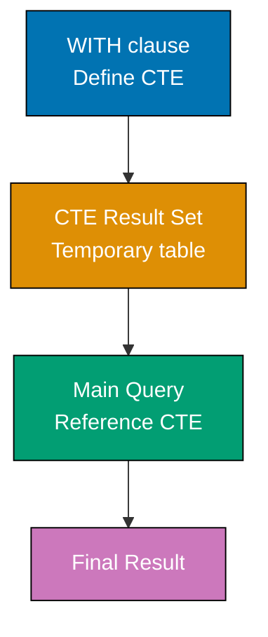
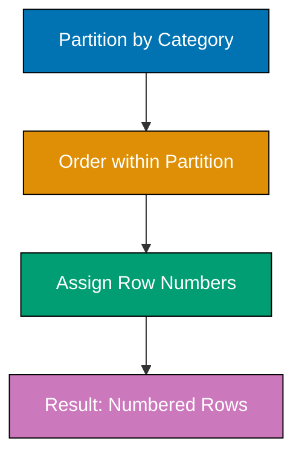
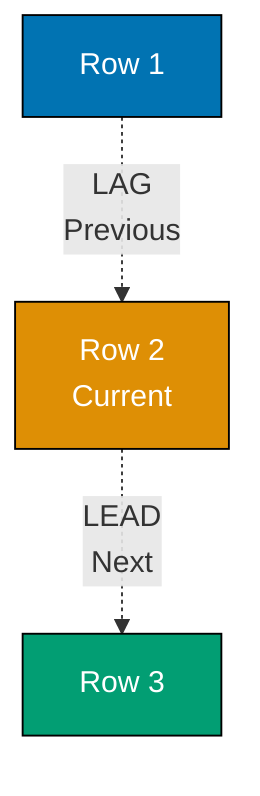
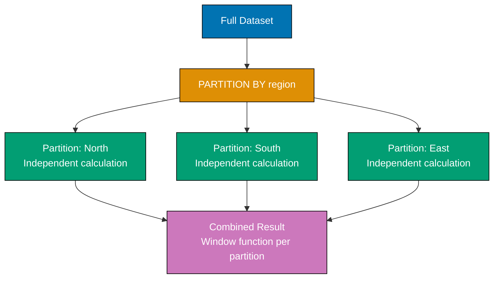
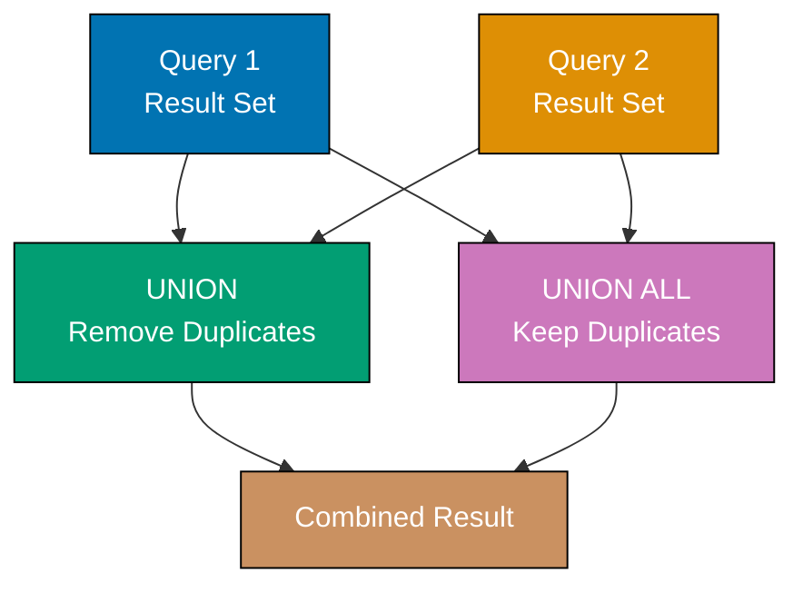
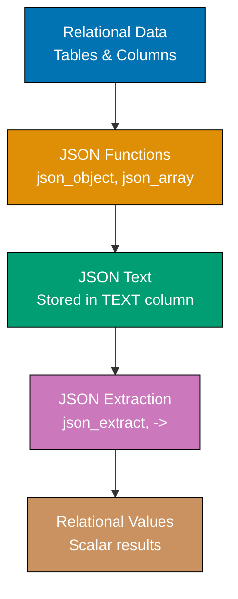
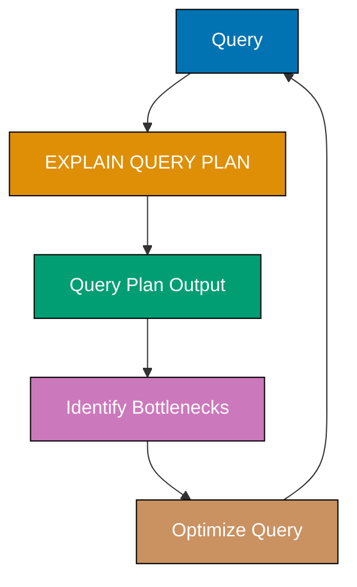

Master intermediate SQL patterns through 30 annotated examples. Each example builds on beginner concepts, covering advanced queries, window functions, CTEs, JSON handling, and production optimization patterns.

## Example 31: Basic CTEs with WITH

Common Table Expressions (CTEs) create temporary named result sets that exist only for the duration of a query. They improve readability and enable recursive queries.



**Code**:

````sql
-- Create sales table
CREATE TABLE sales (               -- => Table definition
    id INTEGER,                     -- => Unique sale identifier
    product TEXT,                   -- => Product name
    amount REAL,                    -- => Sale amount in dollars
    sale_date TEXT                  -- => Sale date (ISO8601 format)
);
-- => Table created: sales

-- Insert sample data
INSERT INTO sales (id, product, amount, sale_date)
VALUES
    (1, 'Laptop', 1000, '2025-01-15'),   -- => First laptop sale
    (2, 'Mouse', 50, '2025-01-16'),      -- => Mouse sale
    (3, 'Laptop', 1200, '2025-01-17'),   -- => Second laptop sale
    (4, 'Keyboard', 100, '2025-01-18'),  -- => Keyboard sale
    (5, 'Mouse', 45, '2025-01-19');      -- => Another mouse sale
-- => 5 rows inserted

-- Basic CTE: Calculate total sales per product
WITH product_totals AS (            -- => Named temporary result set
    SELECT product,                 -- => Product name column
           SUM(amount) AS total_sales -- => Aggregate sales per product
    FROM sales                      -- => Source table
    GROUP BY product                -- => Group by product name
)                                   -- => CTE: product_totals defined
SELECT * FROM product_totals        -- => Query CTE
WHERE total_sales > 100;            -- => Filter for significant sales
-- => Returns: Laptop (2200), Mouse (95 - filtered out)
-- => Keyboard (100 - not > 100, excluded)

-- Multiple CTEs in single query
WITH
laptop_sales AS (                   -- => First CTE for laptops
    SELECT SUM(amount) AS total     -- => Sum laptop sales
    FROM sales                      -- => From sales table
    WHERE product = 'Laptop'        -- => Filter to Laptop rows
),                                  -- => laptop_sales = 2200
mouse_sales AS (                    -- => Second CTE for mice
    SELECT SUM(amount) AS total     -- => Sum mouse sales
    FROM sales                      -- => From sales table
    WHERE product = 'Mouse'         -- => Filter to Mouse rows
)                                   -- => mouse_sales = 95
SELECT
    (SELECT total FROM laptop_sales) AS laptop_total,  -- => Extract laptop total
    (SELECT total FROM mouse_sales) AS mouse_total;    -- => Extract mouse total
-- => Returns: laptop_total=2200, mouse_total=95

-- CTE with JOIN
WITH high_value_sales AS (          -- => CTE filtering high-value sales
    SELECT *                        -- => All columns
    FROM sales                      -- => From sales table
    WHERE amount > 100              -- => Only sales above $100
)                                   -- => Temporary table: 3 rows (2 Laptop, 1 Keyboard)
SELECT
    hvs.product,                    -- => Product name
    COUNT(*) AS num_high_value,     -- => Count high-value sales per product
    SUM(hvs.amount) AS total_high_value  -- => Sum amounts per product
FROM high_value_sales hvs           -- => Query CTE with alias
GROUP BY hvs.product;               -- => Group by product
-- => Returns: Laptop (count=2, total=2200), Keyboard (count=1, total=100)

**Key Takeaway**: CTEs use WITH to define temporary named result sets. They improve query readability by breaking complex logic into named steps. CTEs exist only for the query duration and can be referenced multiple times.

**Why It Matters**: CTEs transform unreadable nested subqueries into maintainable code. Production analytics pipelines use CTEs extensively for multi-step transformations—calculating KPIs, preparing dashboards, and building data marts. Teams adopting CTEs reduce debugging time because each named step can be tested independently.

---

## Example 32: Recursive CTEs for Hierarchical Data

Recursive CTEs call themselves to traverse hierarchical data structures like organizational charts or file systems. They have base case and recursive case.

```mermaid
%% Color Palette: Blue #0173B2, Orange #DE8F05, Teal #029E73, Purple #CC78BC, Brown #CA9161
graph TD
    A["Recursive CTE"]
    B["Base Case<br/>Initial rows<br/>No recursion"]
    C["UNION ALL"]
    D["Recursive Case<br/>Reference CTE itself"]
    E["Iteration 1<br/>Process base"]
    F["Iteration 2<br/>Join with CTE"]
    G["Iteration N<br/>Until no rows"]
    H["Final Result"]

    A --> B
    A --> C
    A --> D
    B --> E
    E --> F
    F --> G
    G --> H
    D -.->|Self-reference| F
    D -.->|Self-reference| G

    style A fill:#0173B2,stroke:#000,color:#fff
    style B fill:#DE8F05,stroke:#000,color:#fff
    style C fill:#029E73,stroke:#000,color:#fff
    style D fill:#CC78BC,stroke:#000,color:#fff
    style E fill:#CA9161,stroke:#000,color:#fff
    style F fill:#CA9161,stroke:#000,color:#fff
    style G fill:#CA9161,stroke:#000,color:#fff
    style H fill:#0173B2,stroke:#000,color:#fff
````

**Code**:

```sql
-- Create employees table with hierarchical structure
CREATE TABLE employees (           -- => Table for org chart
    id INTEGER,                     -- => Employee identifier
    name TEXT,                      -- => Employee name
    manager_id INTEGER              -- => References manager's id (NULL for CEO)
);
-- => Table created: employees

-- Insert organizational hierarchy
INSERT INTO employees (id, name, manager_id)
VALUES
    (1, 'CEO Alice', NULL),         -- => CEO has no manager
    (2, 'VP Bob', 1),               -- => Reports to Alice
    (3, 'VP Charlie', 1),           -- => Reports to Alice
    (4, 'Manager Diana', 2),        -- => Reports to Bob
    (5, 'Manager Eve', 2),          -- => Reports to Bob
    (6, 'Engineer Frank', 4),       -- => Reports to Diana
    (7, 'Engineer Grace', 4);       -- => Reports to Diana
-- => 7 rows inserted: 4-level hierarchy

-- Recursive CTE: Find all employees under CEO
WITH RECURSIVE org_chart AS (      -- => RECURSIVE keyword enables self-reference
    -- Base case: Start with CEO
    SELECT id,                      -- => Employee id
           name,                    -- => Employee name
           manager_id,              -- => Manager reference
           1 AS level               -- => CEO is level 1
    FROM employees                  -- => Source table
    WHERE manager_id IS NULL        -- => Only CEO has NULL manager
                                    -- => Base: 1 row (CEO Alice)
    UNION ALL                       -- => Combine base with recursive case

    -- Recursive case: Find direct reports
    SELECT e.id,                    -- => Child employee id
           e.name,                  -- => Child employee name
           e.manager_id,            -- => Child's manager
           oc.level + 1             -- => Increment level depth
    FROM employees e                -- => All employees
    INNER JOIN org_chart oc         -- => Join to previous iteration results
        ON e.manager_id = oc.id     -- => Find employees reporting to current level
)                                   -- => Iterates until no more matches
SELECT name, level                  -- => Select name and hierarchy level
FROM org_chart                      -- => From complete recursion result
ORDER BY level, name;               -- => Order by depth, then alphabetically
-- => Iteration 1: CEO Alice (level 1)
-- => Iteration 2: VP Bob, VP Charlie (level 2)
-- => Iteration 3: Manager Diana, Manager Eve (level 3)
-- => Iteration 4: Engineer Frank, Engineer Grace (level 4)
-- => Returns all 7 employees with their levels

-- Find all employees reporting to specific manager (direct and indirect)
WITH RECURSIVE subordinates AS (   -- => Recursive CTE for subordinates
    SELECT id, name, manager_id     -- => Starting point columns
    FROM employees                  -- => From employees table
    WHERE id = 2                    -- => Base case: Start with VP Bob (id=2)
                                    -- => Base: Bob only
    UNION ALL                       -- => Combine with recursive case

    SELECT e.id,                    -- => Subordinate's id
           e.name,                  -- => Subordinate's name
           e.manager_id             -- => Subordinate's manager
    FROM employees e                -- => All employees
    INNER JOIN subordinates s       -- => Join to previous results
        ON e.manager_id = s.id      -- => Find reports of current subordinates
)                                   -- => Recursively traverses reporting chain
SELECT name                         -- => Select names only
FROM subordinates                   -- => From complete recursion
WHERE id != 2;                      -- => Exclude Bob himself
-- => Iteration 1: VP Bob
-- => Iteration 2: Manager Diana, Manager Eve
-- => Iteration 3: Engineer Frank, Engineer Grace
-- => Returns: Diana, Eve, Frank, Grace (4 subordinates)

-- Generate number sequence using recursive CTE
WITH RECURSIVE numbers AS (         -- => Recursive number generator
    SELECT 1 AS n                   -- => Base case: start at 1
                                    -- => Base: n=1
    UNION ALL                       -- => Combine with recursive case
    SELECT n + 1                    -- => Increment by 1
    FROM numbers                    -- => Self-reference to previous n
    WHERE n < 10                    -- => Termination condition
)                                   -- => Generates 1,2,3,...,10
SELECT * FROM numbers;              -- => Select all generated numbers
-- => Iteration 1: 1
-- => Iteration 2: 2
-- => ...
-- => Iteration 10: 10
-- => Returns: 1, 2, 3, 4, 5, 6, 7, 8, 9, 10
```

**Key Takeaway**: Recursive CTEs use RECURSIVE keyword and UNION ALL to traverse hierarchical structures. Base case starts recursion, recursive case joins to previous iteration. Powerful for org charts, file trees, and graph traversal.

**Why It Matters**: Hierarchical data appears everywhere—org charts, folder structures, category trees, bill-of-materials, network routing. Without recursive CTEs, these queries require multiple round-trips or application code. A single recursive CTE replaces hundreds of lines of application logic for tree traversal, ancestor lookups, and path calculations.

---

## Example 33: CTEs for Complex Aggregations

CTEs simplify multi-step aggregations by breaking logic into readable stages. Each CTE builds on previous results.

**Code**:

```sql
-- Create orders table
CREATE TABLE orders (               -- => Table for order records
    id INTEGER,                     -- => Order identifier
    customer_id INTEGER,            -- => Customer reference
    product TEXT,                   -- => Product name
    quantity INTEGER,               -- => Number of items
    price REAL,                     -- => Price per item
    order_date TEXT                 -- => Order date
);
-- => Table created: orders

-- Insert sample orders
INSERT INTO orders (id, customer_id, product, quantity, price, order_date)
VALUES
    (1, 1, 'Laptop', 1, 1000, '2025-01-15'),   -- => Customer 1, $1000
    (2, 2, 'Mouse', 2, 25, '2025-01-16'),      -- => Customer 2, 2x$25
    (3, 1, 'Keyboard', 1, 100, '2025-01-17'),  -- => Customer 1, $100
    (4, 3, 'Monitor', 1, 300, '2025-01-18'),   -- => Customer 3, $300
    (5, 2, 'Laptop', 1, 1000, '2025-01-19');   -- => Customer 2, $1000
-- => 5 orders inserted for 3 customers

-- Multi-stage aggregation: Find customers with above-average spending
WITH
order_totals AS (                   -- => Stage 1: Calculate per-order totals
    SELECT
        id,                         -- => Order id
        customer_id,                -- => Customer reference
        quantity * price AS order_total  -- => Multiply quantity × price
    FROM orders                     -- => Source table
),                                  -- => Result: 5 rows with order_total column
customer_totals AS (                -- => Stage 2: Aggregate per customer
    SELECT
        customer_id,                -- => Customer identifier
        SUM(order_total) AS total_spent  -- => Sum all orders per customer
    FROM order_totals               -- => From previous CTE
    GROUP BY customer_id            -- => Group by customer
),                                  -- => Result: 3 rows (customer 1: 1100, 2: 1050, 3: 300)
avg_spending AS (                   -- => Stage 3: Calculate overall average
    SELECT AVG(total_spent) AS avg_total  -- => Average of customer totals
    FROM customer_totals            -- => From previous CTE
)                                   -- => Result: avg_total ≈ 816.67
SELECT
    ct.customer_id,                 -- => Customer id
    ct.total_spent                  -- => Customer's total spending
FROM customer_totals ct,            -- => From customer totals
     avg_spending av                -- => Cross join with average
WHERE ct.total_spent > av.avg_total;  -- => Filter for above-average
-- => Customer 1: 1100 > 816.67 ✓
-- => Customer 2: 1050 > 816.67 ✓
-- => Customer 3: 300 < 816.67 ✗
-- => Returns: Customer 1 (1100), Customer 2 (1050)
```

**Key Takeaway**: Chain CTEs to break complex aggregations into logical steps. Each CTE represents one transformation stage. This improves readability and debugging compared to nested subqueries.

**Why It Matters**: Business questions rarely involve single aggregations—they require comparing to averages, filtering by thresholds, and ranking against peers. Chained CTEs make these multi-step analyses readable and modifiable. Data analysts use this pattern daily for cohort analysis, funnel metrics, and comparative reporting.

---

## Example 34: ROW_NUMBER for Sequential Numbering

ROW_NUMBER assigns sequential numbers to rows within partitions. Unlike regular aggregates, window functions preserve individual rows while computing across groups.



**Code**:

```sql
-- Create products table
CREATE TABLE products (             -- => Table for product catalog
    id INTEGER,                     -- => Product identifier
    name TEXT,                      -- => Product name
    category TEXT,                  -- => Product category
    price REAL                      -- => Product price
);
-- => Table created: products

-- Insert sample products
INSERT INTO products (id, name, category, price)
VALUES
    (1, 'Laptop Pro', 'Electronics', 1500),    -- => Most expensive
    (2, 'Laptop Air', 'Electronics', 1200),    -- => Second highest
    (3, 'Desktop', 'Electronics', 800),        -- => Third
    (4, 'Office Desk', 'Furniture', 300),      -- => Mid-price furniture
    (5, 'Office Chair', 'Furniture', 200),     -- => Cheapest
    (6, 'Standing Desk', 'Furniture', 500);    -- => Most expensive furniture
-- => 6 rows inserted: 3 Electronics, 3 Furniture

-- ROW_NUMBER: Number all rows globally
SELECT
    name,                           -- => Product name
    price,                          -- => Product price
    ROW_NUMBER() OVER (ORDER BY price DESC) AS price_rank  -- => Sequential numbering
FROM products;                      -- => Source table
-- => ROW_NUMBER assigns 1,2,3,... to rows based on ORDER BY
-- => OVER clause defines window (all rows, sorted by price descending)
-- => Laptop Pro: rank=1 (price=1500, highest)
-- => Laptop Air: rank=2 (price=1200)
-- => Desktop: rank=3 (price=800)
-- => Standing Desk: rank=4 (price=500)
-- => Office Desk: rank=5 (price=300)
-- => Office Chair: rank=6 (price=200, lowest)
-- => Returns 6 rows with unique ranks

-- ROW_NUMBER with PARTITION: Number within categories
SELECT
    name,                           -- => Product name
    category,                       -- => Product category
    price,                          -- => Product price
    ROW_NUMBER() OVER (             -- => Window function
        PARTITION BY category       -- => Separate numbering per category
        ORDER BY price DESC         -- => Within each partition, sort by price
    ) AS rank_in_category           -- => Rank within category
FROM products;                      -- => Source table
-- => PARTITION BY creates independent windows per category
-- => Electronics partition (3 rows):
-- =>   Laptop Pro: rank_in_category=1 (1500 highest in Electronics)
-- =>   Laptop Air: rank_in_category=2 (1200)
-- =>   Desktop: rank_in_category=3 (800)
-- => Furniture partition (3 rows):
-- =>   Standing Desk: rank_in_category=1 (500 highest in Furniture, resets to 1)
-- =>   Office Desk: rank_in_category=2 (300)
-- =>   Office Chair: rank_in_category=3 (200)
-- => Returns 6 rows, ranks reset per category

-- Use ROW_NUMBER to find top N per category
WITH ranked_products AS (           -- => CTE for ranking
    SELECT
        name,                       -- => Product name
        category,                   -- => Product category
        price,                      -- => Product price
        ROW_NUMBER() OVER (         -- => Ranking window function
            PARTITION BY category   -- => Separate ranking per category
            ORDER BY price DESC     -- => Highest price first
        ) AS rank                   -- => Rank number
    FROM products                   -- => Source table
)                                   -- => CTE contains all 6 products with ranks
SELECT name, category, price        -- => Select columns
FROM ranked_products                -- => From CTE
WHERE rank <= 2;                    -- => Filter for top 2 per category
-- => rank <= 2 keeps ranks 1 and 2 within each partition
-- => Electronics top 2: Laptop Pro (rank=1), Laptop Air (rank=2)
-- => Furniture top 2: Standing Desk (rank=1), Office Desk (rank=2)
-- => Returns 4 rows total (2 per category)
-- => Pattern: "Top N per group" requires PARTITION BY + filter on rank
```

**Key Takeaway**: ROW_NUMBER assigns unique sequential numbers to rows. PARTITION BY creates separate numbering for each group. Use with CTE to filter top N per category - a pattern impossible with GROUP BY alone.

**Why It Matters**: "Top N per group" queries are ubiquitous—show each customer's 3 most recent orders, display top products per category, find best-performing sales reps per region. ROW_NUMBER with PARTITION BY solves these elegantly in one query, replacing complex application logic or multiple queries.

---

## Example 35: RANK and DENSE_RANK for Ranking

RANK and DENSE_RANK handle ties differently. RANK skips numbers after ties, DENSE_RANK doesn't. Use RANK for traditional sports rankings.

**Code**:

```sql
-- Create exam scores table
CREATE TABLE exam_scores (          -- => Table for student scores
    id INTEGER,                     -- => Record identifier
    student TEXT,                   -- => Student name
    score INTEGER                   -- => Exam score
);
-- => Table created: exam_scores

-- Insert student scores with a tie
INSERT INTO exam_scores (id, student, score)
VALUES
    (1, 'Alice', 95),               -- => Highest score
    (2, 'Bob', 90),                 -- => Tied for second
    (3, 'Charlie', 90),             -- => Tied for second
    (4, 'Diana', 85),               -- => Fourth place
    (5, 'Eve', 80);                 -- => Fifth place
-- => 5 rows inserted: 1 unique top, 2-way tie, 2 unique below

-- Compare ROW_NUMBER, RANK, and DENSE_RANK
SELECT
    student,                        -- => Student name
    score,                          -- => Exam score
    ROW_NUMBER() OVER (ORDER BY score DESC) AS row_num,      -- => Always unique
    RANK() OVER (ORDER BY score DESC) AS rank,               -- => Skips after ties
    DENSE_RANK() OVER (ORDER BY score DESC) AS dense_rank    -- => No gaps
FROM exam_scores;                   -- => Source table
-- => All three use same ORDER BY (score DESC)
-- => Alice (score=95):
-- =>   row_num=1 (first row)
-- =>   rank=1 (highest score)
-- =>   dense_rank=1 (first distinct score)
-- => Bob (score=90):
-- =>   row_num=2 (second row, arbitrary order among ties)
-- =>   rank=2 (second highest score)
-- =>   dense_rank=2 (second distinct score)
-- => Charlie (score=90, tied with Bob):
-- =>   row_num=3 (third row, ROW_NUMBER always unique)
-- =>   rank=2 (same score as Bob, RANK assigns same rank)
-- =>   dense_rank=2 (same score, DENSE_RANK assigns same rank)
-- => Diana (score=85):
-- =>   row_num=4 (fourth row)
-- =>   rank=4 (RANK skips 3 because 2 students at rank 2)
-- =>   dense_rank=3 (DENSE_RANK continues sequentially, no skip)
-- => Eve (score=80):
-- =>   row_num=5, rank=5, dense_rank=4
-- => Key difference: RANK skips after ties, DENSE_RANK doesn't

-- Use RANK to find students in top 3 ranks
WITH ranked_students AS (           -- => CTE with RANK
    SELECT
        student,                    -- => Student name
        score,                      -- => Exam score
        RANK() OVER (ORDER BY score DESC) AS rank  -- => Rank with gaps
    FROM exam_scores                -- => Source table
)                                   -- => CTE: 5 rows with ranks 1,2,2,4,5
SELECT student, score, rank         -- => Select all columns
FROM ranked_students                -- => From CTE
WHERE rank <= 3;                    -- => Filter for rank 1, 2, or 3
-- => rank <= 3 includes ranks 1, 2, 2 (no rank 3 exists due to tie)
-- => Alice: rank=1 ✓ (included)
-- => Bob: rank=2 ✓ (included)
-- => Charlie: rank=2 ✓ (included)
-- => Diana: rank=4 ✗ (excluded, even though row_num=4)
-- => Returns 3 students: Alice, Bob, Charlie
-- => Use case: "Top 3 ranks" includes all tied students

-- DENSE_RANK for continuous rankings
SELECT
    student,                        -- => Student name
    score,                          -- => Exam score
    DENSE_RANK() OVER (ORDER BY score DESC) AS rank  -- => Continuous ranking
FROM exam_scores;                   -- => Source table
-- => DENSE_RANK never skips numbers
-- => Alice: rank=1 (score=95)
-- => Bob: rank=2 (score=90)
-- => Charlie: rank=2 (score=90, tied)
-- => Diana: rank=3 (score=85, next sequential number, no gap)
-- => Eve: rank=4 (score=80)
-- => Returns ranks: 1, 2, 2, 3, 4 (continuous sequence)
-- => Use case: "How many distinct score levels?" = MAX(DENSE_RANK)
```

**Key Takeaway**: RANK assigns same rank to ties and skips subsequent numbers. DENSE_RANK assigns same rank to ties but continues sequentially. ROW_NUMBER always unique. Choose based on business rules: sports use RANK, leaderboards often use DENSE_RANK.

**Why It Matters**: Leaderboards, competition results, and performance rankings drive user engagement and business decisions. Choosing the wrong ranking function creates unfair results or confusing displays. Understanding the tie-handling differences prevents embarrassing "rank 1, 1, 3" displays when "rank 1, 1, 2" was expected.

---

## Example 36: LAG and LEAD for Accessing Adjacent Rows

LAG accesses previous row values, LEAD accesses next row values. Useful for comparing consecutive rows (day-over-day changes, before/after states).



**Code**:

```sql
-- Create stock prices table
CREATE TABLE stock_prices (         -- => Table for daily stock data
    id INTEGER,                     -- => Row identifier
    date TEXT,                      -- => Trading date
    price REAL                      -- => Closing price
);
-- => Table created: stock_prices

-- Insert 5 days of price data
INSERT INTO stock_prices (id, date, price)
VALUES
    (1, '2025-01-15', 100.00),      -- => Day 1: $100
    (2, '2025-01-16', 105.00),      -- => Day 2: $105 (up $5)
    (3, '2025-01-17', 103.00),      -- => Day 3: $103 (down $2)
    (4, '2025-01-18', 108.00),      -- => Day 4: $108 (up $5)
    (5, '2025-01-19', 107.00);      -- => Day 5: $107 (down $1)
-- => 5 rows inserted

-- LAG: Compare with previous day
SELECT
    date,                           -- => Trading date
    price,                          -- => Current price
    LAG(price) OVER (ORDER BY date) AS prev_price,     -- => Previous day's price
    price - LAG(price) OVER (ORDER BY date) AS daily_change  -- => Price change
FROM stock_prices;                  -- => Source table
-- => Window function accesses previous row per ORDER BY date
-- => Row 1 (2025-01-15): price=100.00, prev_price=NULL (no previous), daily_change=NULL
-- => Row 2 (2025-01-16): price=105.00, prev_price=100.00, daily_change=+5.00
-- => Row 3 (2025-01-17): price=103.00, prev_price=105.00, daily_change=-2.00
-- => Row 4 (2025-01-18): price=108.00, prev_price=103.00, daily_change=+5.00
-- => Row 5 (2025-01-19): price=107.00, prev_price=108.00, daily_change=-1.00

-- LEAD: Compare with next day
SELECT
    date,                           -- => Trading date
    price,                          -- => Current price
    LEAD(price) OVER (ORDER BY date) AS next_price,    -- => Next day's price
    LEAD(price) OVER (ORDER BY date) - price AS next_day_change  -- => Forward change
FROM stock_prices;                  -- => Source table
-- => Window function accesses next row per ORDER BY date
-- => Row 1: next_price=105.00, next_day_change=+5.00
-- => Row 5: next_price=NULL (no next day), next_day_change=NULL

-- LAG with default value (avoid NULL for first row)
SELECT
    date,                           -- => Trading date
    price,                          -- => Current price
    LAG(price, 1, 0) OVER (ORDER BY date) AS prev_price  -- => LAG(col, offset, default)
FROM stock_prices;                  -- => Source table
-- => LAG parameters: price (column), 1 (offset), 0 (default for NULL)
-- => Row 1 (2025-01-15): prev_price=0 (default value, not NULL)
-- => Row 2: prev_price=100.00
-- => Useful for calculations that can't handle NULL

-- LAG with offset > 1 (compare with 2 days ago)
SELECT
    date,                           -- => Trading date
    price,                          -- => Current price
    LAG(price, 2) OVER (ORDER BY date) AS two_days_ago,  -- => Price 2 rows back
    price - LAG(price, 2) OVER (ORDER BY date) AS change_vs_two_days  -- => 2-day change
FROM stock_prices;                  -- => Source table
-- => LAG offset=2 accesses row 2 positions earlier
-- => Row 1: two_days_ago=NULL (offset beyond start)
-- => Row 2: two_days_ago=NULL (offset beyond start)
-- => Row 3 (2025-01-17): two_days_ago=100.00, change_vs_two_days=+3.00
-- => Row 4 (2025-01-18): two_days_ago=105.00, change_vs_two_days=+3.00
-- => Row 5 (2025-01-19): two_days_ago=103.00, change_vs_two_days=+4.00
```

**Key Takeaway**: LAG(column, offset, default) accesses previous row value, LEAD accesses next row. Default offset is 1. Use for time-series analysis, calculating changes, or comparing consecutive events.

**Why It Matters**: Day-over-day metrics, month-over-month growth, and sequential event analysis require comparing adjacent rows. LAG/LEAD eliminate self-joins and application-level calculations. Financial dashboards, operational monitoring, and A/B test analysis depend on these functions for computing deltas and trends.

---

## Example 37: SUM, AVG, MIN, MAX as Window Functions

Aggregate functions become window functions when used with OVER. They compute running totals, moving averages, and cumulative statistics without collapsing rows.

**Code**:

```sql
-- Create monthly revenue table
CREATE TABLE monthly_revenue (      -- => Table for revenue tracking
    id INTEGER,                     -- => Record identifier
    month TEXT,                     -- => Month (YYYY-MM format)
    revenue REAL                    -- => Revenue amount
);
-- => Table created: monthly_revenue

-- Insert 5 months of revenue data
INSERT INTO monthly_revenue (id, month, revenue)
VALUES
    (1, '2025-01', 10000),          -- => January revenue
    (2, '2025-02', 12000),          -- => February revenue (up 2000)
    (3, '2025-03', 11000),          -- => March revenue (down 1000)
    (4, '2025-04', 15000),          -- => April revenue (up 4000, highest)
    (5, '2025-05', 13000);          -- => May revenue (down 2000)
-- => 5 rows inserted, total=61000

-- Running total (cumulative sum)
SELECT
    month,                          -- => Month identifier
    revenue,                        -- => Current month revenue
    SUM(revenue) OVER (ORDER BY month) AS cumulative_revenue  -- => Running sum
FROM monthly_revenue;               -- => Source table
-- => Window function: SUM across all rows up to current row
-- => ORDER BY month defines cumulative order
-- => Default frame: RANGE BETWEEN UNBOUNDED PRECEDING AND CURRENT ROW
-- => 2025-01: cumulative=10000 (first month only)
-- => 2025-02: cumulative=22000 (10000+12000)
-- => 2025-03: cumulative=33000 (10000+12000+11000)
-- => 2025-04: cumulative=48000 (10000+12000+11000+15000)
-- => 2025-05: cumulative=61000 (sum of all 5 months)
-- => Returns 5 rows with running totals

-- Moving average (3-month window)
SELECT
    month,                          -- => Month identifier
    revenue,                        -- => Current month revenue
    ROUND(AVG(revenue) OVER (       -- => Moving average
        ORDER BY month              -- => Process in chronological order
        ROWS BETWEEN 2 PRECEDING AND CURRENT ROW  -- => 3-row window
    ), 2) AS moving_avg_3month      -- => Rounded to 2 decimals
FROM monthly_revenue;               -- => Source table
-- => ROWS BETWEEN: Physical row-based window (not value-based)
-- => 2 PRECEDING: Include 2 rows before current row
-- => CURRENT ROW: Include current row
-- => Total window size: up to 3 rows
-- => 2025-01: window=[10000], avg=10000/1=10000 (only 1 row available)
-- => 2025-02: window=[10000,12000], avg=22000/2=11000 (2 rows)
-- => 2025-03: window=[10000,12000,11000], avg=33000/3=11000 (3 rows, full window)
-- => 2025-04: window=[12000,11000,15000], avg=38000/3=12666.67 (slides forward)
-- => 2025-05: window=[11000,15000,13000], avg=39000/3=13000
-- => Returns smoothed revenue trend

-- Running min/max (record tracking)
SELECT
    month,                          -- => Month identifier
    revenue,                        -- => Current month revenue
    MIN(revenue) OVER (ORDER BY month) AS min_so_far,  -- => Lowest to date
    MAX(revenue) OVER (ORDER BY month) AS max_so_far   -- => Highest to date
FROM monthly_revenue;               -- => Source table
-- => MIN/MAX aggregate all rows up to current row
-- => 2025-01: min=10000, max=10000 (first month, same value)
-- => 2025-02: min=10000 (10000<12000), max=12000 (12000>10000, new max)
-- => 2025-03: min=10000 (unchanged), max=12000 (11000<12000, unchanged)
-- => 2025-04: min=10000 (unchanged), max=15000 (15000>12000, new record high)
-- => 2025-05: min=10000 (unchanged), max=15000 (13000<15000, unchanged)
-- => Tracks record lows and highs over time

-- Percentage of total (window aggregate without ORDER)
SELECT
    month,                          -- => Month identifier
    revenue,                        -- => Current month revenue
    SUM(revenue) OVER () AS total_revenue,  -- => Grand total (all rows)
    ROUND(revenue * 100.0 / SUM(revenue) OVER (), 2) AS pct_of_total  -- => Percentage
FROM monthly_revenue;               -- => Source table
-- => Empty OVER() processes entire result set (no partitions, no order)
-- => SUM(revenue) OVER() = 61000 (same for all rows)
-- => Percentage calculation per row:
-- => 2025-01: 10000*100/61000 = 16.39%
-- => 2025-02: 12000*100/61000 = 19.67%
-- => 2025-03: 11000*100/61000 = 18.03%
-- => 2025-04: 15000*100/61000 = 24.59%
-- => 2025-05: 13000*100/61000 = 21.31%
-- => Returns each month's contribution to total
```

**Key Takeaway**: Window aggregates preserve individual rows while computing across groups. Use ROWS BETWEEN for moving windows. Empty OVER() computes across all rows. Running totals and moving averages are common patterns.

**Why It Matters**: Running totals power progress bars, cumulative metrics, and year-to-date calculations. Moving averages smooth noisy data for trend analysis. Finance dashboards, inventory systems, and sales reports all need these patterns. Window aggregates compute them efficiently without expensive self-joins or application-level loops.

---

## Example 38: PARTITION BY with Window Functions

PARTITION BY divides data into independent groups for window function computation. Each partition gets its own running totals, rankings, etc.



**Code**:

```sql
-- Create sales by region table
CREATE TABLE sales_by_region (      -- => Table for regional sales
    id INTEGER,                     -- => Record identifier
    region TEXT,                    -- => Sales region
    month TEXT,                     -- => Month (YYYY-MM format)
    revenue REAL                    -- => Monthly revenue
);
-- => Table created: sales_by_region

-- Insert sales data for 2 regions over 3 months
INSERT INTO sales_by_region (id, region, month, revenue)
VALUES
    (1, 'North', '2025-01', 10000), -- => North Jan: 10000
    (2, 'North', '2025-02', 12000), -- => North Feb: 12000 (up 2000)
    (3, 'North', '2025-03', 11000), -- => North Mar: 11000 (down 1000)
    (4, 'South', '2025-01', 8000),  -- => South Jan: 8000
    (5, 'South', '2025-02', 9000),  -- => South Feb: 9000 (up 1000)
    (6, 'South', '2025-03', 10000); -- => South Mar: 10000 (up 1000)
-- => 6 rows inserted: 3 per region
-- => North total: 33000, South total: 27000

-- Running total per region (independent running sums)
SELECT
    region,                         -- => Sales region
    month,                          -- => Month identifier
    revenue,                        -- => Monthly revenue
    SUM(revenue) OVER (             -- => Cumulative sum window function
        PARTITION BY region         -- => Separate windows per region
        ORDER BY month              -- => Chronological order within partition
    ) AS cumulative_revenue         -- => Running total per region
FROM sales_by_region                -- => Source table
ORDER BY region, month;             -- => Sort output by region, then month
-- => PARTITION BY creates 2 independent windows: North, South
-- => Each partition has its own running total starting at 0
-- => North partition (3 rows):
-- =>   2025-01: cumulative=10000 (first month)
-- =>   2025-02: cumulative=22000 (10000+12000)
-- =>   2025-03: cumulative=33000 (10000+12000+11000)
-- => South partition (3 rows):
-- =>   2025-01: cumulative=8000 (resets to first month)
-- =>   2025-02: cumulative=17000 (8000+9000)
-- =>   2025-03: cumulative=27000 (8000+9000+10000)
-- => Returns 6 rows with per-region running totals

-- Rank within each region (independent rankings)
SELECT
    region,                         -- => Sales region
    month,                          -- => Month identifier
    revenue,                        -- => Monthly revenue
    RANK() OVER (                   -- => Ranking window function
        PARTITION BY region         -- => Separate rankings per region
        ORDER BY revenue DESC       -- => Highest revenue first within partition
    ) AS rank_in_region             -- => Rank within region
FROM sales_by_region;               -- => Source table
-- => PARTITION BY creates 2 independent ranking systems
-- => North partition (ordered by revenue DESC):
-- =>   February: revenue=12000, rank_in_region=1 (highest in North)
-- =>   March: revenue=11000, rank_in_region=2
-- =>   January: revenue=10000, rank_in_region=3 (lowest in North)
-- => South partition (ordered by revenue DESC):
-- =>   March: revenue=10000, rank_in_region=1 (highest in South, resets to 1)
-- =>   February: revenue=9000, rank_in_region=2
-- =>   January: revenue=8000, rank_in_region=3
-- => Returns 6 rows with per-region rankings

-- Compare to region average (partition-level aggregate)
SELECT
    region,                         -- => Sales region
    month,                          -- => Month identifier
    revenue,                        -- => Monthly revenue
    AVG(revenue) OVER (PARTITION BY region) AS region_avg,  -- => Average per region
    revenue - AVG(revenue) OVER (PARTITION BY region) AS vs_avg  -- => Deviation
FROM sales_by_region;               -- => Source table
-- => AVG without ORDER BY computes over entire partition
-- => North partition average: (10000+12000+11000)/3 = 11000
-- =>   January: revenue=10000, region_avg=11000, vs_avg=-1000 (below avg)
-- =>   February: revenue=12000, region_avg=11000, vs_avg=+1000 (above avg)
-- =>   March: revenue=11000, region_avg=11000, vs_avg=0 (at avg)
-- => South partition average: (8000+9000+10000)/3 = 9000
-- =>   January: revenue=8000, region_avg=9000, vs_avg=-1000 (below avg)
-- =>   February: revenue=9000, region_avg=9000, vs_avg=0 (at avg)
-- =>   March: revenue=10000, region_avg=9000, vs_avg=+1000 (above avg)
-- => Returns 6 rows with variance from regional average
```

**Key Takeaway**: PARTITION BY creates independent groups for window functions. Running totals, rankings, and averages reset for each partition. Combine with ORDER BY for per-group sequential operations.

**Why It Matters**: Real-world analytics almost always require segmentation—metrics per region, per product, per customer cohort. PARTITION BY enables "for each group, calculate X" patterns in a single pass. Without it, you'd need multiple queries or complex self-joins to achieve the same result, with worse performance and maintainability.

---

## Example 39: String Manipulation (SUBSTR, REPLACE, TRIM)

String functions extract substrings, replace text, remove whitespace, and transform case. Essential for data cleaning and formatting.

**Code**:

```sql
-- Create user data table with messy strings
CREATE TABLE user_data (            -- => Table for user information
    id INTEGER,                     -- => User identifier
    email TEXT,                     -- => Email address (inconsistent case)
    phone TEXT,                     -- => Phone number (with whitespace)
    bio TEXT                        -- => User biography
);
-- => Table created: user_data

-- Insert users with messy data
INSERT INTO user_data (id, email, phone, bio)
VALUES
    (1, 'ALICE@EXAMPLE.COM', '  555-1234  ', 'Software Engineer with 10 years experience'),
        -- => Email uppercase, phone has leading/trailing spaces
    (2, 'bob@test.org', '555-5678', 'Data Scientist focused on ML');
        -- => Email lowercase, phone clean
-- => 2 rows inserted with inconsistent formatting

-- Extract substring (parse email into parts)
SELECT
    email,                          -- => Full email address
    SUBSTR(email, 1, INSTR(email, '@') - 1) AS username,  -- => Before @
    SUBSTR(email, INSTR(email, '@') + 1) AS domain        -- => After @
FROM user_data;                     -- => Source table
-- => INSTR(email, '@') finds position of @ character
-- => SUBSTR(text, start, length) extracts substring
-- => Row 1: email='ALICE@EXAMPLE.COM'
-- =>   INSTR returns 6 (@ is at position 6)
-- =>   SUBSTR(email, 1, 5) = 'ALICE' (positions 1-5)
-- =>   SUBSTR(email, 7) = 'EXAMPLE.COM' (from position 7 to end)
-- => Row 2: email='bob@test.org'
-- =>   INSTR returns 4
-- =>   username='bob', domain='test.org'

-- Case conversion (normalize casing)
SELECT
    email,                          -- => Original email
    LOWER(email) AS lowercase,      -- => Convert to lowercase
    UPPER(email) AS uppercase       -- => Convert to uppercase
FROM user_data;                     -- => Source table
-- => LOWER('ALICE@EXAMPLE.COM') = 'alice@example.com'
-- => UPPER('ALICE@EXAMPLE.COM') = 'ALICE@EXAMPLE.COM' (already uppercase)
-- => LOWER('bob@test.org') = 'bob@test.org' (already lowercase)
-- => UPPER('bob@test.org') = 'BOB@TEST.ORG'
-- => Returns 2 rows with case variations

-- Trim whitespace (remove leading/trailing spaces)
SELECT
    phone,                          -- => Original phone (may have spaces)
    TRIM(phone) AS trimmed,         -- => Remove leading/trailing whitespace
    LENGTH(phone) AS original_length,  -- => Length before trim
    LENGTH(TRIM(phone)) AS trimmed_length  -- => Length after trim
FROM user_data;                     -- => Source table
-- => Row 1: phone='  555-1234  ' (2 spaces each side)
-- =>   TRIM removes leading/trailing spaces only
-- =>   trimmed='555-1234'
-- =>   original_length=12 (2+8+2)
-- =>   trimmed_length=8 (just the phone number)
-- => Row 2: phone='555-5678' (no spaces)
-- =>   trimmed='555-5678' (unchanged)
-- =>   Both lengths=8

-- Replace text (remove characters)
SELECT
    phone,                          -- => Original phone
    REPLACE(phone, '-', '') AS digits_only  -- => Remove hyphens
FROM user_data;                     -- => Source table
-- => REPLACE(text, find, replacement) replaces all occurrences
-- => Row 1: REPLACE('  555-1234  ', '-', '') = '  5551234  ' (removes hyphen)
-- => Row 2: REPLACE('555-5678', '-', '') = '5555678'
-- => Note: REPLACE doesn't remove spaces, only the hyphen

-- Multiple string operations combined (full normalization)
SELECT
    email,                          -- => Original email
    LOWER(TRIM(email)) AS normalized_email,  -- => Trim then lowercase
    REPLACE(REPLACE(phone, '-', ''), ' ', '') AS clean_phone  -- => Remove - then spaces
FROM user_data;                     -- => Source table
-- => Nested function calls: inner executes first
-- => Row 1 email: TRIM('ALICE@EXAMPLE.COM') = 'ALICE@EXAMPLE.COM' (no spaces)
-- =>              LOWER('ALICE@EXAMPLE.COM') = 'alice@example.com'
-- => Row 1 phone: REPLACE('  555-1234  ', '-', '') = '  5551234  '
-- =>              REPLACE('  5551234  ', ' ', '') = '5551234' (all spaces removed)
-- => Returns normalized data for database storage

-- Extract first N characters (create preview)
SELECT
    bio,                            -- => Full biography
    SUBSTR(bio, 1, 50) || '...' AS preview  -- => First 50 chars + ellipsis
FROM user_data;                     -- => Source table
-- => SUBSTR(text, 1, 50) gets first 50 characters
-- => || concatenates strings
-- => Row 1: bio length=46 chars
-- =>   SUBSTR returns full string (< 50)
-- =>   preview='Software Engineer with 10 years experience...'
-- => Row 2: bio length=31 chars
-- =>   preview='Data Scientist focused on ML...'
-- => Always adds '...' regardless of actual length
```

**Key Takeaway**: Use SUBSTR for extraction, REPLACE for text substitution, TRIM for whitespace removal, UPPER/LOWER for case conversion. Combine multiple functions for data normalization and cleaning.

**Why It Matters**: Real-world data arrives dirty—extra whitespace, inconsistent casing, embedded format characters. String functions clean data at the database level before it reaches applications. Email normalization, phone number standardization, and text extraction for search are production necessities that these functions handle efficiently.

---

## Example 40: Date Arithmetic and Formatting

Date functions enable date calculations, formatting, and extraction of date components. SQLite stores dates as TEXT, REAL, or INTEGER.

**Code**:

```sql
-- Create events table
CREATE TABLE events (               -- => Table for scheduled events
    id INTEGER,                     -- => Event identifier
    name TEXT,                      -- => Event name
    event_date TEXT,                -- => Event date (YYYY-MM-DD)
    event_time TEXT                 -- => Event time (HH:MM:SS)
);
-- => Table created: events

-- Insert upcoming events
INSERT INTO events (id, name, event_date, event_time)
VALUES
    (1, 'Conference', '2025-06-15', '09:00:00'),   -- => June conference
    (2, 'Workshop', '2025-07-20', '14:30:00'),     -- => July workshop
    (3, 'Seminar', '2025-08-10', '10:00:00');      -- => August seminar
-- => 3 rows inserted: events in Jun, Jul, Aug 2025

-- Current date/time functions
SELECT
    date('now') AS today,           -- => Current date only
    time('now') AS current_time,    -- => Current time only
    datetime('now') AS current_datetime;  -- => Current date and time
-- => 'now' is SQLite keyword for current timestamp (UTC)
-- => date('now') returns 'YYYY-MM-DD'
-- => time('now') returns 'HH:MM:SS'
-- => datetime('now') returns 'YYYY-MM-DD HH:MM:SS'
-- => Example output: today='2025-12-29', current_time='02:07:25', current_datetime='2025-12-29 02:07:25'

-- Date arithmetic (modify dates)
SELECT
    name,                           -- => Event name
    event_date,                     -- => Original event date
    date(event_date, '+7 days') AS one_week_later,     -- => Add 7 days
    date(event_date, '-1 month') AS one_month_earlier, -- => Subtract 1 month
    date(event_date, '+1 year') AS next_year           -- => Add 1 year
FROM events;                        -- => Source table
-- => date() function: date(value, modifier1, modifier2, ...)
-- => Modifiers: '+N days', '-N months', '+N years', etc.
-- => Conference (2025-06-15):
-- =>   +7 days: 2025-06-22 (June 22)
-- =>   -1 month: 2025-05-15 (back to May 15)
-- =>   +1 year: 2026-06-15 (same date, next year)
-- => Returns 3 rows with calculated dates

-- Extract date components (parse dates)
SELECT
    name,                           -- => Event name
    event_date,                     -- => Original date
    STRFTIME('%Y', event_date) AS year,        -- => Extract year
    STRFTIME('%m', event_date) AS month,       -- => Extract month
    STRFTIME('%d', event_date) AS day,         -- => Extract day
    STRFTIME('%w', event_date) AS day_of_week  -- => Day of week (0-6)
FROM events;                        -- => Source table
-- => STRFTIME(format, date) extracts components using format codes
-- => Format codes: %Y=year, %m=month, %d=day, %w=day of week
-- => Conference (2025-06-15):
-- =>   year='2025' (4-digit year)
-- =>   month='06' (01-12, zero-padded)
-- =>   day='15' (01-31, zero-padded)
-- =>   day_of_week='0' (0=Sunday, 1=Monday, ..., 6=Saturday)
-- => Returns components as TEXT

-- Calculate days between dates (date difference)
SELECT
    name,                           -- => Event name
    event_date,                     -- => Event date
    CAST(JULIANDAY(event_date) - JULIANDAY('2025-01-01') AS INTEGER) AS days_from_new_year
FROM events;                        -- => Source table
-- => JULIANDAY(date) converts date to Julian day number (continuous count)
-- => Julian day difference = days between dates
-- => CAST to INTEGER removes fractional days
-- => Conference: JULIANDAY('2025-06-15') - JULIANDAY('2025-01-01')
-- =>   June 15 is day 166 of 2025
-- =>   Returns ~165 days (Jan 1 = day 1)
-- => Workshop: ~201 days, Seminar: ~222 days

-- Format dates (custom display format)
SELECT
    name,                           -- => Event name
    STRFTIME('%d/%m/%Y', event_date) AS formatted_date,  -- => DD/MM/YYYY format
    STRFTIME('%Y-%m-%d %H:%M:%S', event_date || ' ' || event_time) AS full_datetime
        -- => Combine date and time
FROM events;                        -- => Source table
-- => STRFTIME formats dates for display
-- => || concatenates strings
-- => Conference:
-- =>   event_date || ' ' || event_time = '2025-06-15 09:00:00'
-- =>   formatted_date='15/06/2025' (European format)
-- =>   full_datetime='2025-06-15 09:00:00' (ISO8601 with time)
-- => Returns formatted date strings

-- Find events in next 60 days (date filtering)
SELECT name, event_date             -- => Event name and date
FROM events                         -- => Source table
WHERE JULIANDAY(event_date) - JULIANDAY('now') BETWEEN 0 AND 60;
-- => Filter by date range using Julian days
-- => JULIANDAY('now') = today's Julian day
-- => Difference 0-60 = events 0-60 days from today
-- => BETWEEN 0 AND 60: future events only (>= 0), within 60 days (<= 60)
-- => Returns events happening in next 2 months
-- => Example: if today is 2025-04-20, no events match (all > 60 days away)
```

**Key Takeaway**: Use date() for date arithmetic (+/- days/months/years), STRFTIME for formatting and component extraction, JULIANDAY for date differences. Store dates as TEXT in ISO8601 format (YYYY-MM-DD) for consistency.

**Why It Matters**: Date calculations are everywhere—subscription expiration, event scheduling, report periods, age calculations. Doing date math in application code leads to timezone bugs and inconsistent results across services. SQL date functions ensure consistent, efficient date handling regardless of which application queries the data.

---

## Example 41: COALESCE and NULLIF for NULL Handling

COALESCE returns first non-NULL value from a list. NULLIF returns NULL if two values are equal, otherwise returns first value.

**Code**:

```sql
-- Create products table with nullable columns
CREATE TABLE products (             -- => Table for product catalog
    id INTEGER,                     -- => Product identifier
    name TEXT,                      -- => Product name
    list_price REAL,                -- => Regular price
    sale_price REAL,                -- => Discounted price (nullable)
    stock INTEGER                   -- => Inventory count (nullable)
);
-- => Table created: products

-- Insert products with various NULL values
INSERT INTO products (id, name, list_price, sale_price, stock)
VALUES
    (1, 'Laptop', 1000, 800, 5),    -- => On sale, in stock
    (2, 'Mouse', 50, NULL, 0),      -- => No sale, out of stock
    (3, 'Keyboard', 100, NULL, 10), -- => No sale, in stock
    (4, 'Monitor', 300, 250, NULL); -- => On sale, stock unknown
-- => 4 rows inserted with mixed NULL values

-- COALESCE: Use sale price if available, otherwise list price
SELECT
    name,                           -- => Product name
    list_price,                     -- => Regular price
    sale_price,                     -- => Discounted price (may be NULL)
    COALESCE(sale_price, list_price) AS effective_price  -- => First non-NULL value
FROM products;                      -- => Source table
-- => COALESCE checks arguments left-to-right, returns first non-NULL
-- => Laptop: sale_price=800 (not NULL), effective_price=800
-- => Mouse: sale_price=NULL, list_price=50, effective_price=50
-- => Keyboard: sale_price=NULL, list_price=100, effective_price=100
-- => Monitor: sale_price=250 (not NULL), effective_price=250

-- COALESCE with multiple fallbacks
SELECT
    name,                           -- => Product name
    stock,                          -- => Inventory (may be NULL)
    COALESCE(stock, 0) AS stock_display,  -- => NULL → 0
    COALESCE(sale_price, list_price, 0) AS price_display  -- => 3 fallbacks
FROM products;                      -- => Source table
-- => COALESCE can take many arguments
-- => Monitor: stock=NULL, stock_display=0 (fallback to 0)
-- => price_display tries: sale_price → list_price → 0

-- NULLIF: Return NULL if values match
SELECT
    name,                           -- => Product name
    stock,                          -- => Inventory count
    NULLIF(stock, 0) AS non_zero_stock  -- => NULL if stock=0, else stock
FROM products;                      -- => Source table
-- => NULLIF(value, match) returns NULL when value=match
-- => Mouse: stock=0, NULLIF(0,0)=NULL (converts 0 to NULL)
-- => Laptop: stock=5, NULLIF(5,0)=5 (5≠0, returns 5)
-- => Keyboard: stock=10, non_zero_stock=10
-- => Monitor: stock=NULL, non_zero_stock=NULL (NULL≠0 but output NULL)

-- NULLIF to avoid division by zero
SELECT
    name,                           -- => Product name
    sale_price,                     -- => Discounted price
    list_price,                     -- => Regular price
    ROUND((list_price - COALESCE(sale_price, list_price)) * 100.0 /
          NULLIF(list_price, 0), 2) AS discount_pct  -- => Safe division
FROM products;                      -- => Source table
-- => NULLIF(list_price, 0) prevents division by zero
-- => Returns NULL if list_price=0 instead of error
-- => Laptop: (1000-800)*100/1000 = 200/1000*100 = 20.00%
-- => Mouse: (50-50)*100/50 = 0/50*100 = 0.00% (no discount)
-- => Keyboard: (100-100)*100/100 = 0.00%
-- => Monitor: (300-250)*100/300 = 16.67%

-- Combine COALESCE and NULLIF
SELECT
    name,                           -- => Product name
    COALESCE(NULLIF(sale_price, list_price), list_price) AS final_price
FROM products;                      -- => Source table
-- => Complex NULL logic: if sale_price=list_price, use list_price
-- => NULLIF converts matching sale_price to NULL
-- => COALESCE then falls back to list_price
-- => Laptop: NULLIF(800, 1000)=800 (800≠1000), COALESCE(800,...)=800
-- => Mouse: NULLIF(NULL, 50)=NULL (already NULL), COALESCE(NULL,50)=50
-- => Ensures sale price shown only when different from list
```

**Key Takeaway**: COALESCE provides default values for NULL columns. NULLIF converts specific values to NULL (useful for avoiding division by zero or treating zero as missing). Combine both for sophisticated NULL handling logic.

**Why It Matters**: NULL handling bugs cause application crashes, incorrect calculations, and confusing displays. COALESCE prevents "undefined" from showing in UIs. NULLIF prevents division-by-zero errors in percentage calculations. Production systems use these functions defensively throughout their query layer to ensure robust data handling.

---

## Example 42: UNION and UNION ALL

UNION combines results from multiple queries, removing duplicates. UNION ALL keeps duplicates. Both require matching column counts and compatible types.



**Code**:

```sql
-- Create customer tables for different years
CREATE TABLE customers_2024 (       -- => 2024 customers
    id INTEGER,                     -- => Customer ID
    name TEXT,                      -- => Customer name
    email TEXT                      -- => Email address
);
-- => Table created: customers_2024

CREATE TABLE customers_2025 (       -- => 2025 customers
    id INTEGER,                     -- => Customer ID
    name TEXT,                      -- => Customer name
    email TEXT                      -- => Email address
);
-- => Table created: customers_2025

-- Insert 2024 customers
INSERT INTO customers_2024 (id, name, email)
VALUES
    (1, 'Alice', 'alice@example.com'),    -- => Only in 2024
    (2, 'Bob', 'bob@example.com');        -- => In both years
-- => 2 rows inserted into 2024 table

-- Insert 2025 customers
INSERT INTO customers_2025 (id, name, email)
VALUES
    (2, 'Bob', 'bob@example.com'),        -- => Duplicate (also in 2024)
    (3, 'Charlie', 'charlie@example.com'); -- => Only in 2025
-- => 2 rows inserted into 2025 table
-- => Bob appears in both tables (duplicate data)

-- UNION: Combine and remove duplicates
SELECT name, email FROM customers_2024   -- => Query 1: 2 rows
UNION                                     -- => Combine with deduplication
SELECT name, email FROM customers_2025;  -- => Query 2: 2 rows
-- => UNION removes duplicate rows (same values in all columns)
-- => Result set comparison:
-- =>   From 2024: Alice, Bob
-- =>   From 2025: Bob (duplicate, removed), Charlie
-- => Returns 3 unique rows: Alice, Bob (once), Charlie
-- => UNION performs implicit DISTINCT (slower than UNION ALL)

-- UNION ALL: Combine and keep duplicates
SELECT name, email FROM customers_2024   -- => Query 1: 2 rows
UNION ALL                                 -- => Combine without deduplication
SELECT name, email FROM customers_2025;  -- => Query 2: 2 rows
-- => UNION ALL keeps all rows including duplicates
-- => Returns 4 rows total:
-- =>   Alice (from 2024)
-- =>   Bob (from 2024)
-- =>   Bob (from 2025, duplicate kept)
-- =>   Charlie (from 2025)
-- => UNION ALL faster than UNION (no deduplication step)

-- UNION with ORDER BY (applies to combined result)
SELECT name,                        -- => Customer name
       'Old' AS customer_type       -- => Literal value for source
FROM customers_2024                 -- => First query
UNION                               -- => Deduplicate
SELECT name,
       'New' AS customer_type       -- => Different literal value
FROM customers_2025                 -- => Second query
ORDER BY name;                      -- => Sort final combined result
-- => ORDER BY applies AFTER UNION (not to individual queries)
-- => Columns must match in count and type between queries
-- => With UNION (deduplicate):
-- =>   Returns: Alice (Old), Bob (one row, labeled 'Old' or 'New'), Charlie (New)
-- => With UNION ALL (keep duplicates):
-- =>   Returns: Alice (Old), Bob (Old), Bob (New), Charlie (New)
-- => ORDER BY sorts alphabetically: Alice, Bob, Charlie

-- UNION with different literal values (year indicator)
SELECT id, name,                    -- => Customer data
       '2024' AS year               -- => Year label
FROM customers_2024                 -- => First query
UNION ALL                           -- => Keep duplicates
SELECT id, name,
       '2025' AS year               -- => Year label
FROM customers_2025                 -- => Second query
ORDER BY year, name;                -- => Sort by year then name
-- => UNION ALL preserves all 4 rows
-- => Returns:
-- =>   (1, Alice, 2024)
-- =>   (2, Bob, 2024)
-- =>   (2, Bob, 2025) - duplicate Bob with different year
-- =>   (3, Charlie, 2025)
-- => Useful for combining time-partitioned data

-- Find customers in both tables (intersection alternative using JOIN)
SELECT c1.name, c1.email            -- => Customer data
FROM customers_2024 c1              -- => 2024 table
INNER JOIN customers_2025 c2        -- => Join with 2025 table
    ON c1.email = c2.email;         -- => Match on email
-- => INNER JOIN returns rows with matches in both tables
-- => Alice: no match in 2025 (excluded)
-- => Bob: match found (bob@example.com in both tables)
-- => Charlie: no match in 2024 (excluded)
-- => Returns: Bob (appears in both tables)
-- => Alternative to INTERSECT (which SQLite also supports)
```

**Key Takeaway**: UNION removes duplicates (slower), UNION ALL keeps duplicates (faster). Both require same number of columns with compatible types. Use UNION for set operations, UNION ALL for combining datasets.

**Why It Matters**: Merging data from partitioned tables, combining results from different time periods, or building compound reports require UNION operations. The performance difference between UNION and UNION ALL can be significant—use UNION ALL when you know there are no duplicates or duplicates are acceptable.

---

## Example 43: INTERSECT and EXCEPT

INTERSECT returns rows present in both queries. EXCEPT returns rows in first query but not in second. Both remove duplicates automatically.

**Code**:

```sql
-- Create product inventory tables for two stores
CREATE TABLE products_store_a (     -- => Store A inventory
    product_id INTEGER,             -- => Product identifier
    name TEXT                       -- => Product name
);
-- => Table created: products_store_a

CREATE TABLE products_store_b (     -- => Store B inventory
    product_id INTEGER,             -- => Product identifier
    name TEXT                       -- => Product name
);
-- => Table created: products_store_b

-- Insert Store A products
INSERT INTO products_store_a (product_id, name)
VALUES
    (1, 'Laptop'),                  -- => Only in Store A
    (2, 'Mouse'),                   -- => In both stores
    (3, 'Keyboard');                -- => In both stores
-- => 3 rows inserted into Store A

-- Insert Store B products
INSERT INTO products_store_b (product_id, name)
VALUES
    (2, 'Mouse'),                   -- => In both stores (overlap)
    (3, 'Keyboard'),                -- => In both stores (overlap)
    (4, 'Monitor');                 -- => Only in Store B
-- => 3 rows inserted into Store B
-- => 2 products overlap, 1 unique per store

-- INTERSECT: Products in both stores (set intersection)
SELECT name FROM products_store_a   -- => Query A: Laptop, Mouse, Keyboard
INTERSECT                           -- => Set intersection operator
SELECT name FROM products_store_b;  -- => Query B: Mouse, Keyboard, Monitor
-- => INTERSECT returns rows present in BOTH queries
-- => Comparison: Row-by-row equality check on all columns
-- => Laptop: in A, not in B ✗
-- => Mouse: in A, in B ✓
-- => Keyboard: in A, in B ✓
-- => Monitor: not in A, in B ✗
-- => Returns: Mouse, Keyboard (common products)
-- => Automatically removes duplicates (like UNION)

-- EXCEPT: Products only in Store A (set difference)
SELECT name FROM products_store_a   -- => Query A: Laptop, Mouse, Keyboard
EXCEPT                              -- => Set difference operator
SELECT name FROM products_store_b;  -- => Query B: Mouse, Keyboard, Monitor
-- => EXCEPT returns rows in first query NOT in second query
-- => A - B (set subtraction)
-- => Laptop: in A, not in B ✓ (keep)
-- => Mouse: in A, in B ✗ (remove)
-- => Keyboard: in A, in B ✗ (remove)
-- => Returns: Laptop (exclusive to Store A)

-- EXCEPT: Products only in Store B (reverse set difference)
SELECT name FROM products_store_b   -- => Query B: Mouse, Keyboard, Monitor
EXCEPT                              -- => Set difference operator
SELECT name FROM products_store_a;  -- => Query A: Laptop, Mouse, Keyboard
-- => EXCEPT is NOT commutative: B - A ≠ A - B
-- => B - A (reverse subtraction)
-- => Mouse: in B, in A ✗ (remove)
-- => Keyboard: in B, in A ✗ (remove)
-- => Monitor: in B, not in A ✓ (keep)
-- => Returns: Monitor (exclusive to Store B)

-- Combine set operations (symmetric difference)
SELECT name FROM products_store_a   -- => All products from A
UNION                               -- => Combine both stores
SELECT name FROM products_store_b   -- => All products from B
EXCEPT                              -- => Remove...
SELECT name FROM (                  -- => Subquery for intersection
    SELECT name FROM products_store_a
    INTERSECT
    SELECT name FROM products_store_b
);                                  -- => Products in both stores
-- => (A UNION B) - (A INTERSECT B) = symmetric difference
-- => A UNION B = {Laptop, Mouse, Keyboard, Monitor}
-- => A INTERSECT B = {Mouse, Keyboard}
-- => Result = {Laptop, Mouse, Keyboard, Monitor} - {Mouse, Keyboard}
-- => Returns: Laptop, Monitor (products in exactly one store)
-- => Equivalent to (A - B) UNION (B - A)

-- Use with aggregation (inventory summary)
SELECT 'Only in Store A' AS category,  -- => Category label
       COUNT(*) AS count            -- => Count products
FROM (                              -- => Subquery for A-only products
    SELECT name FROM products_store_a
    EXCEPT
    SELECT name FROM products_store_b
)                                   -- => Result: {Laptop}
UNION ALL                           -- => Combine results
SELECT 'Only in Store B',           -- => Category label
       COUNT(*)                     -- => Count products
FROM (                              -- => Subquery for B-only products
    SELECT name FROM products_store_b
    EXCEPT
    SELECT name FROM products_store_a
)                                   -- => Result: {Monitor}
UNION ALL
SELECT 'In Both Stores',            -- => Category label
       COUNT(*)                     -- => Count products
FROM (                              -- => Subquery for common products
    SELECT name FROM products_store_a
    INTERSECT
    SELECT name FROM products_store_b
);                                  -- => Result: {Mouse, Keyboard}
-- => Returns summary report:
-- =>   Only in Store A: count=1 (Laptop)
-- =>   Only in Store B: count=1 (Monitor)
-- =>   In Both Stores: count=2 (Mouse, Keyboard)
-- => 3 rows total: comprehensive inventory analysis
```

**Key Takeaway**: INTERSECT finds common rows between queries. EXCEPT finds rows in first query not in second. Order matters for EXCEPT (A EXCEPT B ≠ B EXCEPT A). All set operations remove duplicates.

**Why It Matters**: Finding common customers between datasets, identifying products missing from inventory, or detecting configuration drift between environments—these business problems map directly to INTERSECT and EXCEPT. They express set logic declaratively, making intent clear and code maintainable.

---

## Example 44: Correlated Subqueries

Correlated subqueries reference columns from outer query. They execute once per outer row. Useful for row-by-row comparisons against aggregates.

**Code**:

```sql
-- Create employees table with departments
CREATE TABLE employees (            -- => Table for employee data
    id INTEGER,                     -- => Employee identifier
    name TEXT,                      -- => Employee name
    department TEXT,                -- => Department name
    salary REAL                     -- => Annual salary
);
-- => Table created: employees

-- Insert employees across departments
INSERT INTO employees (id, name, department, salary)
VALUES
    (1, 'Alice', 'Engineering', 120000),  -- => Highest in Engineering
    (2, 'Bob', 'Engineering', 90000),     -- => Mid in Engineering
    (3, 'Charlie', 'Sales', 80000),       -- => Lower in Sales
    (4, 'Diana', 'Sales', 95000),         -- => Highest in Sales
    (5, 'Eve', 'Engineering', 85000);     -- => Lowest in Engineering
-- => 5 rows inserted: 3 Engineering, 2 Sales
-- => Engineering avg: (120000+90000+85000)/3 = 98333.33
-- => Sales avg: (80000+95000)/2 = 87500

-- Find employees earning more than their department average
SELECT
    name,                           -- => Employee name
    department,                     -- => Department
    salary                          -- => Salary
FROM employees e1                   -- => Outer query (alias e1)
WHERE salary > (                    -- => Compare to...
    SELECT AVG(salary)              -- => Average salary
    FROM employees e2               -- => Inner query (alias e2)
    WHERE e2.department = e1.department  -- => CORRELATED: references outer row
);                                  -- => Subquery executes once per outer row
-- => Correlated subquery execution per row:
-- => Alice (Engineering): AVG where dept='Engineering' = 98333.33
-- =>   120000 > 98333.33 ✓ (included)
-- => Bob (Engineering): AVG where dept='Engineering' = 98333.33
-- =>   90000 > 98333.33 ✗ (excluded)
-- => Charlie (Sales): AVG where dept='Sales' = 87500
-- =>   80000 > 87500 ✗ (excluded)
-- => Diana (Sales): AVG where dept='Sales' = 87500
-- =>   95000 > 87500 ✓ (included)
-- => Eve (Engineering): AVG where dept='Engineering' = 98333.33
-- =>   85000 > 98333.33 ✗ (excluded)
-- => Returns 2 rows: Alice, Diana (above department average)

-- Find highest-paid employee per department
SELECT
    name,                           -- => Employee name
    department,                     -- => Department
    salary                          -- => Salary
FROM employees e1                   -- => Outer query
WHERE salary = (                    -- => Salary equals...
    SELECT MAX(salary)              -- => Highest salary
    FROM employees e2               -- => Inner query
    WHERE e2.department = e1.department  -- => In same department
);                                  -- => Correlated on department
-- => Per-row execution:
-- => Alice: MAX(salary) where dept='Engineering' = 120000
-- =>   120000 = 120000 ✓ (top earner in Engineering)
-- => Bob: MAX(salary) where dept='Engineering' = 120000
-- =>   90000 = 120000 ✗ (not top earner)
-- => Diana: MAX(salary) where dept='Sales' = 95000
-- =>   95000 = 95000 ✓ (top earner in Sales)
-- => Returns: Alice (Engineering), Diana (Sales)

-- Count employees in same department
SELECT
    name,                           -- => Employee name
    department,                     -- => Department
    (SELECT COUNT(*)                -- => Scalar subquery in SELECT
     FROM employees e2              -- => Count employees
     WHERE e2.department = e1.department) AS dept_size  -- => Same department
FROM employees e1;                  -- => Outer query
-- => Scalar subquery returns single value per outer row
-- => Alice (Engineering): COUNT where dept='Engineering' = 3
-- => Bob (Engineering): COUNT where dept='Engineering' = 3
-- => Eve (Engineering): COUNT where dept='Engineering' = 3
-- => Charlie (Sales): COUNT where dept='Sales' = 2
-- => Diana (Sales): COUNT where dept='Sales' = 2
-- => Returns 5 rows with department size

-- EXISTS with correlated subquery (check existence)
SELECT
    name,                           -- => Employee name
    department                      -- => Department
FROM employees e1                   -- => Outer query
WHERE EXISTS (                      -- => EXISTS returns TRUE if subquery has rows
    SELECT 1                        -- => Dummy column (value doesn't matter)
    FROM employees e2               -- => Inner query
    WHERE e2.department = e1.department  -- => Same department
      AND e2.salary > e1.salary     -- => Someone earns more
);                                  -- => Returns TRUE if higher earner exists
-- => EXISTS short-circuits: stops after finding first match
-- => Alice: EXISTS(salary > 120000 in Engineering) = FALSE ✗ (no one earns more)
-- => Bob: EXISTS(salary > 90000 in Engineering) = TRUE ✓ (Alice earns more)
-- => Charlie: EXISTS(salary > 80000 in Sales) = TRUE ✓ (Diana earns more)
-- => Diana: EXISTS(salary > 95000 in Sales) = FALSE ✗ (no one earns more)
-- => Eve: EXISTS(salary > 85000 in Engineering) = TRUE ✓ (Alice, Bob earn more)
-- => Returns: Bob, Charlie, Eve (have higher-paid colleagues)
```

**Key Takeaway**: Correlated subqueries reference outer query columns and execute once per outer row. Use for row-specific comparisons against group aggregates. EXISTS often more efficient than IN for correlated lookups.

**Why It Matters**: Finding employees paid above department average, orders exceeding customer's typical spend, or products priced above category median—all require comparing each row against a group aggregate. Correlated subqueries solve these "compare to my group" problems elegantly without application-level loops.

---

## Example 45: Scalar Subqueries in SELECT

Scalar subqueries return single values and can appear in SELECT clauses. They add computed columns based on related data.

**Code**:

```sql
-- Create orders table
CREATE TABLE orders (               -- => Table for order records
    id INTEGER,                     -- => Order identifier
    customer_id INTEGER,            -- => Customer reference
    order_date TEXT,                -- => Order date
    total REAL                      -- => Order total amount
);
-- => Table created: orders

-- Create customers table
CREATE TABLE customers (            -- => Table for customer data
    id INTEGER,                     -- => Customer identifier
    name TEXT,                      -- => Customer name
    email TEXT                      -- => Email address
);
-- => Table created: customers

-- Insert customers
INSERT INTO customers (id, name, email)
VALUES
    (1, 'Alice', 'alice@example.com'),  -- => Customer 1
    (2, 'Bob', 'bob@example.com');      -- => Customer 2
-- => 2 customers inserted

-- Insert orders
INSERT INTO orders (id, customer_id, order_date, total)
VALUES
    (1, 1, '2025-01-15', 100),      -- => Alice's first order
    (2, 1, '2025-01-20', 150),      -- => Alice's second order
    (3, 2, '2025-01-18', 200);      -- => Bob's order
-- => 3 orders inserted: Alice (2), Bob (1)

-- Scalar subquery: Add customer name to orders
SELECT
    o.id,                           -- => Order ID
    o.order_date,                   -- => Order date
    o.total,                        -- => Order total
    (SELECT name FROM customers c   -- => Scalar subquery (returns 1 value)
     WHERE c.id = o.customer_id) AS customer_name  -- => Lookup customer
FROM orders o;                      -- => Outer query: orders
-- => Scalar subquery executes once per order row
-- => Must return exactly 1 row, 1 column (or NULL)
-- => Order 1: SELECT name WHERE id=1 → 'Alice'
-- => Order 2: SELECT name WHERE id=1 → 'Alice'
-- => Order 3: SELECT name WHERE id=2 → 'Bob'
-- => Returns 3 rows: orders with customer names added
-- => Alternative to LEFT JOIN for simple lookups

-- Multiple scalar subqueries (add multiple computed columns)
SELECT
    o.id,                           -- => Order ID
    o.total,                        -- => Order total
    (SELECT name FROM customers c   -- => First scalar subquery
     WHERE c.id = o.customer_id) AS customer_name,
    (SELECT COUNT(*) FROM orders o2  -- => Second scalar subquery
     WHERE o2.customer_id = o.customer_id) AS customer_order_count
FROM orders o;                      -- => Outer query
-- => Two independent scalar subqueries per row
-- => Order 1 (customer_id=1):
-- =>   customer_name: SELECT name WHERE id=1 → 'Alice'
-- =>   customer_order_count: COUNT WHERE customer_id=1 → 2
-- => Order 2 (customer_id=1):
-- =>   customer_name: 'Alice'
-- =>   customer_order_count: 2 (same customer, same count)
-- => Order 3 (customer_id=2):
-- =>   customer_name: 'Bob'
-- =>   customer_order_count: 1
-- => Returns 3 rows with enriched data

-- Scalar subquery with aggregate (customer summary)
SELECT
    name,                           -- => Customer name
    email,                          -- => Customer email
    (SELECT COUNT(*) FROM orders o  -- => Count orders
     WHERE o.customer_id = c.id) AS num_orders,
    (SELECT SUM(total) FROM orders o  -- => Sum order totals
     WHERE o.customer_id = c.id) AS total_spent
FROM customers c;                   -- => Outer query: customers
-- => Scalar aggregates per customer
-- => Alice (id=1):
-- =>   num_orders: COUNT WHERE customer_id=1 → 2 orders
-- =>   total_spent: SUM(total) WHERE customer_id=1 → 100+150=250
-- => Bob (id=2):
-- =>   num_orders: COUNT WHERE customer_id=2 → 1 order
-- =>   total_spent: SUM(total) WHERE customer_id=2 → 200
-- => Returns 2 rows with customer statistics

-- COALESCE with scalar subquery (handle NULL for zero orders)
SELECT
    name,                           -- => Customer name
    COALESCE(                       -- => Return first non-NULL value
        (SELECT SUM(total)          -- => Scalar subquery
         FROM orders o
         WHERE o.customer_id = c.id),  -- => Sum customer orders
        0                           -- => Default if NULL (no orders)
    ) AS total_spent                -- => Total spent or 0
FROM customers c;                   -- => Outer query
-- => SUM returns NULL for 0 rows (not 0)
-- => COALESCE converts NULL to 0 for display
-- => If customer has no orders:
-- =>   SELECT SUM(total) WHERE customer_id=X → NULL
-- =>   COALESCE(NULL, 0) → 0
-- => Alice: COALESCE(250, 0) → 250
-- => Bob: COALESCE(200, 0) → 200
-- => Returns customer spending with 0 for inactive customers
```

**Key Takeaway**: Scalar subqueries return single values and can appear anywhere a single value is expected. Use in SELECT to add computed columns. Must return exactly one row, one column - use LIMIT 1 or aggregates to ensure this.

**Why It Matters**: Adding computed fields like "customer's total orders" or "employee's department headcount" to query results without complex joins simplifies reporting. Scalar subqueries enable denormalized views for dashboards and exports while keeping the underlying schema normalized.

---

## Example 46: IN and NOT IN with Subqueries

IN tests if value exists in subquery results. NOT IN tests if value doesn't exist. Useful for filtering based on membership in another query's results.

**Code**:

```sql
-- Create products table
CREATE TABLE products (             -- => Table for product catalog
    id INTEGER,                     -- => Product identifier
    name TEXT,                      -- => Product name
    category TEXT,                  -- => Product category
    price REAL                      -- => Product price
);
-- => Table created: products

-- Create orders table
CREATE TABLE orders (               -- => Table for order records
    id INTEGER,                     -- => Order identifier
    product_id INTEGER,             -- => Product reference
    quantity INTEGER                -- => Quantity ordered
);
-- => Table created: orders

-- Insert products
INSERT INTO products (id, name, category, price)
VALUES
    (1, 'Laptop', 'Electronics', 1000),   -- => Will be ordered
    (2, 'Mouse', 'Electronics', 50),      -- => Will be ordered
    (3, 'Desk', 'Furniture', 300),        -- => Never ordered
    (4, 'Chair', 'Furniture', 200);       -- => Never ordered
-- => 4 products inserted

-- Insert orders
INSERT INTO orders (id, product_id, quantity)
VALUES
    (1, 1, 2),                      -- => 2 Laptops
    (2, 2, 5),                      -- => 5 Mice
    (3, 1, 1);                      -- => 1 Laptop (repeat)
-- => 3 orders inserted: products 1 and 2 ordered

-- Find products that have been ordered (IN operator)
SELECT name, category, price        -- => Product details
FROM products                       -- => Outer query: products table
WHERE id IN (                       -- => id matches any value in...
    SELECT DISTINCT product_id      -- => Subquery: ordered product IDs
    FROM orders                     -- => From orders table
);                                  -- => IN checks membership in set
-- => Subquery returns: {1, 2} (DISTINCT removes duplicate 1)
-- => IN (1, 2) equivalent to: id = 1 OR id = 2
-- => Product 1 (Laptop): id=1 IN {1,2} ✓
-- => Product 2 (Mouse): id=2 IN {1,2} ✓
-- => Product 3 (Desk): id=3 IN {1,2} ✗
-- => Product 4 (Chair): id=4 IN {1,2} ✗
-- => Returns 2 rows: Laptop, Mouse (have orders)

-- Find products never ordered (NOT IN operator)
SELECT name, category, price        -- => Product details
FROM products                       -- => Outer query
WHERE id NOT IN (                   -- => id NOT in...
    SELECT product_id               -- => Subquery: ordered products
    FROM orders                     -- => From orders
);                                  -- => NOT IN checks non-membership
-- => Subquery returns: {1, 2, 1} (with duplicate, but still {1,2})
-- => NOT IN (1, 2) equivalent to: id != 1 AND id != 2
-- => Product 3 (Desk): id=3 NOT IN {1,2} ✓
-- => Product 4 (Chair): id=4 NOT IN {1,2} ✓
-- => Returns 2 rows: Desk, Chair (never ordered)

-- IN with multiple columns (tuple matching)
CREATE TABLE product_prices (       -- => Regional pricing table
    product_id INTEGER,             -- => Product reference
    region TEXT,                    -- => Sales region
    price REAL                      -- => Regional price
);
-- => Table created: product_prices

INSERT INTO product_prices (product_id, region, price)
VALUES
    (1, 'US', 1000),                -- => Laptop US price
    (1, 'EU', 1100),                -- => Laptop EU price
    (2, 'US', 50);                  -- => Mouse US price
-- => 3 rows inserted

SELECT product_id, region, price    -- => Price details
FROM product_prices                 -- => Source table
WHERE (product_id, region) IN (     -- => Tuple comparison
    SELECT product_id, 'US'         -- => Subquery returns tuples
    FROM products                   -- => From products table
    WHERE category = 'Electronics'  -- => Only Electronics
);                                  -- => Match both columns
-- => Subquery returns: {(1, 'US'), (2, 'US')}
-- => Row (1, 'US', 1000): (1, 'US') IN result ✓
-- => Row (1, 'EU', 1100): (1, 'EU') NOT IN result ✗
-- => Row (2, 'US', 50): (2, 'US') IN result ✓
-- => Returns 2 rows: US prices for Electronics

-- NOT IN with NULL gotcha (dangerous behavior)
CREATE TABLE test_values (value INTEGER);  -- => Test table
INSERT INTO test_values VALUES (1), (2), (NULL);  -- => Include NULL
-- => 3 rows: {1, 2, NULL}

SELECT 'Yes'                        -- => Test output
WHERE 3 NOT IN (                    -- => Check if 3 NOT in...
    SELECT value FROM test_values   -- => Returns {1, 2, NULL}
);
-- => NOT IN with NULL uses three-valued logic
-- => 3 NOT IN (1, 2, NULL) means:
-- =>   3 != 1 (TRUE) AND 3 != 2 (TRUE) AND 3 != NULL (UNKNOWN)
-- =>   TRUE AND TRUE AND UNKNOWN = UNKNOWN
-- => WHERE UNKNOWN is treated as FALSE
-- => Returns NO ROWS (silent failure!)
-- => CRITICAL BUG: NOT IN with NULL always fails
-- => Solution: Use NOT EXISTS or filter NULL: WHERE value IS NOT NULL
```

**Key Takeaway**: IN checks membership in subquery results. NOT IN excludes matching values. Beware: NOT IN with NULL values returns no results - use NOT EXISTS for NULL-safe exclusion. DISTINCT in subquery improves performance.

**Why It Matters**: Filtering by membership in another table is fundamental—find orders for active customers, products in stock, users with permissions. The NOT IN NULL gotcha causes silent bugs in production; understanding this prevents hours of debugging incorrect empty results.

---

## Example 47: JSON Creation and Extraction

SQLite's JSON1 extension provides JSON creation, extraction, and manipulation functions. JSON data stored as TEXT can be queried and transformed.



**Code**:

```sql
-- Enable JSON1 extension (usually enabled by default in modern SQLite)
-- Create users table with JSON metadata
CREATE TABLE users (                -- => Table for user data
    id INTEGER,                     -- => User identifier
    name TEXT,                      -- => User name
    metadata TEXT                   -- => JSON data stored as TEXT
);
-- => Table created: users with TEXT column for JSON

-- Insert users with JSON metadata
INSERT INTO users (id, name, metadata)
VALUES
    (1, 'Alice', '{"age": 30, "city": "NYC", "skills": ["Python", "SQL"]}'),
        -- => JSON object with age, city, skills array
    (2, 'Bob', '{"age": 25, "city": "LA", "skills": ["Java", "Go"]}');
        -- => JSON object with age, city, skills array
-- => 2 rows inserted with JSON metadata

-- Extract JSON values using JSON_EXTRACT
SELECT
    name,                           -- => User name
    JSON_EXTRACT(metadata, '$.age') AS age,      -- => Extract age field
    JSON_EXTRACT(metadata, '$.city') AS city     -- => Extract city field
FROM users;                         -- => Source table
-- => JSON path syntax: $ = root, .field = object property
-- => Alice: JSON_EXTRACT('{"age": 30, ...}', '$.age') = 30
-- => Alice: JSON_EXTRACT('{"age": 30, ...}', '$.city') = "NYC"
-- => Bob: age=25, city="LA"
-- => Returns scalar values from JSON objects

-- Extract array elements by index
SELECT
    name,                           -- => User name
    JSON_EXTRACT(metadata, '$.skills[0]') AS first_skill,   -- => Array index 0
    JSON_EXTRACT(metadata, '$.skills[1]') AS second_skill   -- => Array index 1
FROM users;                         -- => Source table
-- => Array access: [index] syntax (0-based)
-- => Alice: skills=["Python","SQL"], skills[0]="Python", skills[1]="SQL"
-- => Bob: skills[0]="Java", skills[1]="Go"
-- => Returns array elements as scalar values

-- Create JSON objects with JSON_OBJECT
SELECT
    JSON_OBJECT(                    -- => Construct JSON object
        'name', name,               -- => Key 'name', value from name column
        'age', JSON_EXTRACT(metadata, '$.age'),    -- => Key 'age'
        'city', JSON_EXTRACT(metadata, '$.city')   -- => Key 'city'
    ) AS user_json                  -- => Output as TEXT
FROM users;                         -- => Source table
-- => JSON_OBJECT(key1, val1, key2, val2, ...) creates {"key1":"val1",...}
-- => Alice: {"name":"Alice","age":30,"city":"NYC"}
-- => Bob: {"name":"Bob","age":25,"city":"LA"}
-- => Returns well-formed JSON text

-- Create JSON arrays with JSON_ARRAY
SELECT
    JSON_ARRAY(                     -- => Construct JSON array
        name,                       -- => Element 0: name
        JSON_EXTRACT(metadata, '$.age'),     -- => Element 1: age
        JSON_EXTRACT(metadata, '$.city')     -- => Element 2: city
    ) AS user_array                 -- => Output as TEXT
FROM users;                         -- => Source table
-- => JSON_ARRAY(val1, val2, ...) creates [val1, val2, ...]
-- => Alice: ["Alice",30,"NYC"]
-- => Bob: ["Bob",25,"LA"]
-- => Returns JSON array text

-- Filter by JSON field value
SELECT name                         -- => User name
FROM users                          -- => Source table
WHERE JSON_EXTRACT(metadata, '$.age') > 25;  -- => Age comparison
-- => Extracts age, compares as number
-- => Alice: age=30 > 25 ✓
-- => Bob: age=25 > 25 ✗
-- => Returns: Alice

-- Check if JSON path exists
SELECT name                         -- => User name
FROM users                          -- => Source table
WHERE JSON_EXTRACT(metadata, '$.city') IS NOT NULL;  -- => Path existence
-- => JSON_EXTRACT returns NULL for non-existent paths
-- => Alice: $.city exists, returns "NYC" (not NULL)
-- => Bob: $.city exists, returns "LA" (not NULL)
-- => Returns: Alice, Bob (both have city field)
```

**Key Takeaway**: Use JSON_EXTRACT to query JSON fields, JSON_OBJECT/JSON_ARRAY to create JSON. Store JSON as TEXT. Use `$.path` syntax for navigation. JSON functions enable schema-flexible data storage.

**Why It Matters**: Modern applications store flexible metadata, user preferences, and audit logs as JSON. Querying JSON directly in SQL eliminates deserializing data in application code. This enables efficient filtering, aggregation, and reporting on semi-structured data without ETL pipelines.

---

## Example 48: JSON Array Operations

JSON arrays can be queried, filtered, and transformed using JSON functions. Use JSON_EACH to unnest arrays into rows.

**Code**:

```sql
-- Create projects table with JSON array tags
CREATE TABLE projects (             -- => Table for project management
    id INTEGER,                     -- => Project identifier
    name TEXT,                      -- => Project name
    tags TEXT                       -- => JSON array of tags (stored as TEXT)
);
-- => Table created: projects

-- Insert projects with JSON tag arrays
INSERT INTO projects (id, name, tags)
VALUES
    (1, 'Project A', '["urgent", "backend", "api"]'),
        -- => 3 tags: urgent, backend, api
    (2, 'Project B', '["frontend", "ui", "react"]'),
        -- => 3 tags: frontend, ui, react
    (3, 'Project C', '["backend", "database", "optimization"]');
        -- => 3 tags: backend, database, optimization
-- => 3 projects inserted with JSON arrays

-- Get array length (count elements)
SELECT
    name,                           -- => Project name
    JSON_ARRAY_LENGTH(tags) AS num_tags  -- => Count array elements
FROM projects;                      -- => Source table
-- => JSON_ARRAY_LENGTH(json_array) returns element count
-- => Project A: JSON_ARRAY_LENGTH('["urgent","backend","api"]') = 3
-- => Project B: JSON_ARRAY_LENGTH('["frontend","ui","react"]') = 3
-- => Project C: JSON_ARRAY_LENGTH('["backend","database","optimization"]') = 3
-- => Returns 3 rows with tag counts

-- Check if array contains value (substring search)
SELECT name                         -- => Project name
FROM projects                       -- => Source table
WHERE JSON_EXTRACT(tags, '$') LIKE '%backend%';  -- => Text search
-- => JSON_EXTRACT(tags, '$') returns full array as text
-- => LIKE '%backend%' does substring match
-- => Project A: '["urgent","backend","api"]' LIKE '%backend%' ✓
-- => Project B: '["frontend","ui","react"]' LIKE '%backend%' ✗
-- => Project C: '["backend","database","optimization"]' LIKE '%backend%' ✓
-- => Returns 2 rows: Project A, Project C (contain 'backend')
-- => WARNING: Substring match, could false-positive on partial matches

-- Unnest JSON array to rows using JSON_EACH
SELECT
    p.name AS project,              -- => Project name
    j.value AS tag                  -- => Individual tag value
FROM projects p,                    -- => Projects table
     JSON_EACH(p.tags) j;           -- => Unnest JSON array
-- => JSON_EACH(array) creates virtual table with columns: key, value, type, etc.
-- => CROSS JOIN unnests array: 1 project row → N tag rows
-- => Project A: 3 rows (urgent, backend, api)
-- => Project B: 3 rows (frontend, ui, react)
-- => Project C: 3 rows (backend, database, optimization)
-- => Returns 9 rows total (3 × 3):
-- =>   (Project A, urgent), (Project A, backend), (Project A, api),
-- =>   (Project B, frontend), (Project B, ui), (Project B, react),
-- =>   (Project C, backend), (Project C, database), (Project C, optimization)

-- Find projects with specific tag (exact match)
SELECT name                         -- => Project name
FROM projects p                     -- => Source table
WHERE EXISTS (                      -- => Check if any tag matches
    SELECT 1                        -- => Dummy column
    FROM JSON_EACH(p.tags)          -- => Unnest tags
    WHERE value = 'backend'         -- => Exact match on 'backend'
);                                  -- => Returns TRUE if found
-- => Safer than LIKE (exact match, no false positives)
-- => Project A: EXISTS(value='backend' in tags) ✓
-- => Project B: EXISTS(value='backend' in tags) ✗
-- => Project C: EXISTS(value='backend' in tags) ✓
-- => Returns 2 rows: Project A, Project C

-- Count projects per tag (tag frequency analysis)
SELECT
    j.value AS tag,                 -- => Tag name
    COUNT(*) AS project_count       -- => Number of projects with tag
FROM projects p,                    -- => Projects table
     JSON_EACH(p.tags) j            -- => Unnest all tags
GROUP BY j.value                    -- => Group by tag value
ORDER BY project_count DESC;        -- => Most common tags first
-- => Unnests 9 tag occurrences
-- => Groups by tag value:
-- =>   backend: appears in Project A, Project C (count=2)
-- =>   urgent: appears in Project A (count=1)
-- =>   api: appears in Project A (count=1)
-- =>   frontend: appears in Project B (count=1)
-- =>   ui: appears in Project B (count=1)
-- =>   react: appears in Project B (count=1)
-- =>   database: appears in Project C (count=1)
-- =>   optimization: appears in Project C (count=1)
-- => Returns 8 rows ordered by frequency

-- Add element to JSON array (immutable - creates new array)
SELECT
    name,                           -- => Project name
    JSON_INSERT(                    -- => Insert into JSON
        tags,                       -- => Original array
        '$[' || JSON_ARRAY_LENGTH(tags) || ']',  -- => Path to append position
        'new-tag'                   -- => Value to insert
    ) AS updated_tags               -- => New array (original unchanged)
FROM projects;                      -- => Source table
-- => JSON arrays are immutable: JSON_INSERT returns NEW array
-- => Path construction: '$[' + array_length + ']' = append position
-- => Project A: '$[3]' appends after indices 0,1,2
-- =>   Original: '["urgent","backend","api"]'
-- =>   Updated: '["urgent","backend","api","new-tag"]'
-- => Does NOT modify projects table (read-only query)
-- => Returns 3 rows with extended arrays
-- => To persist: UPDATE projects SET tags = JSON_INSERT(...)
```

**Key Takeaway**: Use JSON_EACH to unnest arrays into rows for querying. JSON_ARRAY_LENGTH counts elements. JSON arrays are immutable - modifications create new arrays. Combine JSON_EACH with standard SQL for powerful array queries.

**Why It Matters**: Tags, categories, permissions, and feature flags often stored as JSON arrays. JSON_EACH transforms array storage into queryable rows—find all projects with "urgent" tag, count users per role, aggregate metrics across multi-value attributes. This bridges document and relational models.

---

## Example 49: FTS5 Virtual Tables

FTS5 (Full-Text Search) enables fast text search across large documents. Create virtual tables with FTS5 for efficient searching, ranking, and highlighting.

**Code**:

```sql
-- Create FTS5 virtual table (full-text search enabled)
CREATE VIRTUAL TABLE articles_fts USING fts5(
    title,                          -- => Searchable title column
    content,                        -- => Searchable content column
    author                          -- => Searchable author column
);
-- => Virtual table created with FTS5 search index
-- => Not a regular table: optimized for text search

-- Insert documents into FTS5 table
INSERT INTO articles_fts (title, content, author)
VALUES
    ('Introduction to SQL', 'SQL is a powerful language for managing relational databases. It supports queries, updates, and schema design.', 'Alice'),
        -- => Article 1: SQL basics
    ('Advanced SQL Techniques', 'Window functions and CTEs enable complex analytical queries in SQL. These features are essential for data analysis.', 'Bob'),
        -- => Article 2: Advanced SQL
    ('Database Design Principles', 'Good database design ensures data integrity, performance, and scalability. Normalization reduces redundancy.', 'Charlie');
        -- => Article 3: Database design
-- => 3 articles inserted and indexed for search

-- Simple full-text search (search all columns)
SELECT title, author               -- => Article title and author
FROM articles_fts                   -- => FTS5 virtual table
WHERE articles_fts MATCH 'SQL';     -- => MATCH operator for full-text search
-- => MATCH searches all indexed columns (title, content, author)
-- => Case-insensitive by default
-- => Returns articles containing 'SQL' anywhere:
-- =>   'Introduction to SQL' (Alice) - 'SQL' in title and content
-- =>   'Advanced SQL Techniques' (Bob) - 'SQL' in title and content
-- => 'Database Design Principles' excluded (no 'SQL' match)

-- Search in specific column (column prefix)
SELECT title, author               -- => Article details
FROM articles_fts                   -- => FTS5 table
WHERE articles_fts MATCH 'title:SQL';  -- => Search only title column
-- => Column-specific search: column_name:search_term
-- => Only searches title column, ignores content and author
-- => Returns articles with 'SQL' in title:
-- =>   'Introduction to SQL' (Alice) ✓
-- =>   'Advanced SQL Techniques' (Bob) ✓
-- => More precise than full-text search

-- Phrase search (exact match)
SELECT title                        -- => Article title
FROM articles_fts                   -- => FTS5 table
WHERE articles_fts MATCH '"database design"';  -- => Exact phrase in quotes
-- => Phrase search requires exact word order and adjacency
-- => "database design" must appear as consecutive words
-- => Returns: 'Database Design Principles' ✓
-- =>   (title contains "Database Design" as phrase)
-- => 'Introduction to SQL' ✗ (no phrase match)

-- Boolean operators: AND, OR, NOT
SELECT title                        -- => Article title
FROM articles_fts                   -- => FTS5 table
WHERE articles_fts MATCH 'SQL AND queries';  -- => Both terms required
-- => AND operator: both terms must appear
-- => Returns: 'Introduction to SQL' ✓
-- =>   (contains both 'SQL' and 'queries' in content)
-- => 'Advanced SQL Techniques' ✗ (has 'SQL' but not 'queries')

SELECT title                        -- => Article title
FROM articles_fts                   -- => FTS5 table
WHERE articles_fts MATCH 'SQL NOT advanced';  -- => Exclude term
-- => NOT operator: exclude documents with term
-- => Returns: 'Introduction to SQL' ✓
-- =>   (contains 'SQL' but not 'advanced')
-- => 'Advanced SQL Techniques' ✗ (contains 'advanced', excluded)

-- Prefix search with * (wildcard)
SELECT title                        -- => Article title
FROM articles_fts                   -- => FTS5 table
WHERE articles_fts MATCH 'dat*';    -- => Prefix match
-- => Asterisk (*) matches any suffix
-- => 'dat*' matches: data, database, dated, etc.
-- => Returns:
-- =>   'Advanced SQL Techniques' ✓ (contains 'data')
-- =>   'Database Design Principles' ✓ (contains 'database')
-- => Prefix search useful for autocomplete

-- Get search result ranking (relevance scoring)
SELECT
    title,                          -- => Article title
    author,                         -- => Article author
    rank                            -- => Relevance score (lower = better)
FROM articles_fts                   -- => FTS5 table
WHERE articles_fts MATCH 'SQL database'  -- => Search for both terms
ORDER BY rank;                      -- => Sort by relevance
-- => FTS5 ranks results by relevance using BM25 algorithm
-- => Lower rank values = better match (more relevant)
-- => Considers: term frequency, document length, term rarity
-- => Returns articles ordered by relevance to query

-- Highlight matching terms (snippet function)
SELECT
    title,                          -- => Article title
    snippet(articles_fts, 1, '<b>', '</b>', '...', 20) AS highlighted_content
        -- => Extract excerpt with highlighting
FROM articles_fts                   -- => FTS5 table
WHERE articles_fts MATCH 'SQL';     -- => Search term
-- => snippet(table, column_index, start_tag, end_tag, ellipsis, max_tokens)
-- => column_index=1: content column (0=title, 1=content, 2=author)
-- => Wraps matching terms in <b> tags
-- => Returns ~20 tokens around match with ellipsis
-- => Example output: "...a powerful language for managing <b>SQL</b> databases..."
-- => Useful for search result previews
```

**Key Takeaway**: FTS5 virtual tables enable fast full-text search. Use MATCH operator with search syntax (phrases, boolean operators, prefix search). Ranking and highlighting improve search UX. Ideal for document search, article catalogs, product descriptions.

**Why It Matters**: Users expect instant search across articles, products, and documents. LIKE queries are too slow for large datasets and miss relevance ranking. FTS5 provides Google-like search capabilities—phrase matching, boolean logic, result highlighting—without external search engines like Elasticsearch.

---

## Example 50: FTS5 Advanced Queries

FTS5 supports proximity search, column weighting, and custom tokenizers. These features enable sophisticated search applications.

**Code**:

```sql
-- Create FTS5 table with custom tokenizer
CREATE VIRTUAL TABLE documents_fts USING fts5(
    title,                          -- => Searchable title
    content,                        -- => Searchable content
    tokenize = 'porter'             -- => Porter stemming algorithm
);
-- => Virtual table created with stemming tokenizer
-- => Porter stemming: reduces words to root form
-- => 'running', 'runs', 'ran' all stem to 'run'

-- Insert sample documents
INSERT INTO documents_fts (title, content)
VALUES
    ('Running Tutorial', 'Learn how to start running for beginners. Running improves health.'),
        -- => Contains: running (2x)
    ('Database Running', 'Database engines run queries efficiently. Performance optimization is key.'),
        -- => Contains: run (1x)
    ('Marathon Training', 'Training for marathons requires dedication. Runners need proper nutrition.');
        -- => Contains: runners (1x)
-- => 3 documents inserted

-- Stemming: Search finds word variations (stem matching)
SELECT title                        -- => Document title
FROM documents_fts                  -- => FTS5 table with porter stemmer
WHERE documents_fts MATCH 'run';    -- => Search for 'run' stem
-- => Porter stemmer converts 'run' to stem 'run'
-- => Matches all documents containing run/running/runners:
-- =>   'Running Tutorial' ✓ (running → run stem, matches)
-- =>   'Database Running' ✓ (run → run stem, matches)
-- =>   'Marathon Training' ✓ (runners → run stem, matches)
-- => Returns all 3 documents (stemming expands search)
-- => Without stemming: only 'Database Running' would match

-- Proximity search: NEAR(term1 term2, distance)
SELECT title, content               -- => Document details
FROM documents_fts                  -- => FTS5 table
WHERE documents_fts MATCH 'NEAR(database performance, 5)';
-- => NEAR(term1 term2, N) finds terms within N words of each other
-- => Searches for 'database' within 5 words of 'performance'
-- => 'Database Running': "Database engines run queries efficiently. Performance..."
-- =>   'database' at position 0, 'performance' at position 5
-- =>   Distance = 5 words ✓ (within limit)
-- => Returns: 'Database Running' (terms close together)
-- => Useful for finding related concepts

-- Create FTS5 table for column weighting demonstration
CREATE VIRTUAL TABLE weighted_fts USING fts5(
    title,                          -- => Title column
    content                         -- => Content column
);
-- => Table created without explicit column weights
-- => FTS5 implicitly boosts title matches

INSERT INTO weighted_fts (title, content)
VALUES
    ('SQL Basics', 'Introduction to databases'),
        -- => 'SQL' in title
    ('Advanced Topics', 'SQL window functions and CTEs');
        -- => 'SQL' in content only
-- => 2 documents inserted

-- Search with implicit column boosting (title preferred)
SELECT
    title,                          -- => Document title
    rank                            -- => Relevance score
FROM weighted_fts                   -- => FTS5 table
WHERE weighted_fts MATCH 'SQL'      -- => Search for 'SQL'
ORDER BY rank;                      -- => Sort by relevance (lower = better)
-- => FTS5 implicitly weights title higher than content
-- => 'SQL Basics': 'SQL' in title → lower rank (better)
-- => 'Advanced Topics': 'SQL' in content → higher rank (worse)
-- => Returns documents ordered:
-- =>   1. 'SQL Basics' (rank ≈ -2.0, title match)
-- =>   2. 'Advanced Topics' (rank ≈ -1.0, content match)
-- => Title matches rank higher than content matches

-- Combine multiple search criteria (complex boolean logic)
SELECT title                        -- => Document title
FROM documents_fts                  -- => FTS5 table
WHERE documents_fts MATCH '(running OR marathon) AND NOT database';
-- => Boolean operators: OR, AND, NOT
-- => Parentheses for grouping: (running OR marathon) evaluated first
-- => Then AND NOT database applied
-- => 'Running Tutorial': (running ✓ OR marathon ✗) AND NOT database ✓
-- =>   Result: ✓ (included)
-- => 'Database Running': (running ✓ OR marathon ✗) AND NOT database ✗
-- =>   Result: ✗ (excluded, contains 'database')
-- => 'Marathon Training': (running ✗ OR marathon ✓) AND NOT database ✓
-- =>   Result: ✓ (included)
-- => Returns: 'Running Tutorial', 'Marathon Training'

-- Case-insensitive search (FTS5 default behavior)
SELECT title                        -- => Document title
FROM documents_fts                  -- => FTS5 table
WHERE documents_fts MATCH 'RUNNING';  -- => Uppercase search term
-- => FTS5 performs case-insensitive matching by default
-- => 'RUNNING' matches 'running', 'Running', 'RUNNING'
-- => Porter stemmer: RUNNING → run stem
-- => Returns same results as lowercase 'running'
-- =>   'Running Tutorial' ✓
-- =>   'Database Running' ✓
-- =>   'Marathon Training' ✓
-- => Case doesn't affect search results
```

**Key Takeaway**: FTS5 supports stemming (porter tokenizer), proximity search (NEAR), and column weighting. Configure tokenizers for language-specific behavior. Combine boolean operators for complex queries. FTS5 is production-ready for search features.

**Why It Matters**: Stemming means "running" matches "run"—critical for natural language search. Proximity search finds related terms near each other. Column weighting prioritizes title matches over body matches. These features transform basic substring search into intelligent information retrieval.

---

## Example 51: EXPLAIN QUERY PLAN Analysis

EXPLAIN QUERY PLAN shows how SQLite executes a query. Use it to identify table scans, verify index usage, and optimize slow queries.



**Code**:

```sql
-- Create customers table
CREATE TABLE customers (            -- => Table for customer data
    id INTEGER PRIMARY KEY,         -- => Primary key (automatic index)
    email TEXT,                     -- => Email address (no index yet)
    name TEXT,                      -- => Customer name
    country TEXT                    -- => Country code
);
-- => Table created with PRIMARY KEY index on id

-- Insert test data (100 customers)
INSERT INTO customers (email, name, country)
SELECT
    'user' || value || '@example.com',  -- => Generated email
    'User ' || value,               -- => Generated name
    CASE WHEN value % 2 = 0 THEN 'USA' ELSE 'UK' END  -- => Alternating countries
FROM (
    WITH RECURSIVE nums AS (        -- => Generate numbers 1-100
        SELECT 1 AS value
        UNION ALL
        SELECT value + 1 FROM nums WHERE value < 100
    )
    SELECT value FROM nums
);
-- => 100 rows inserted: 50 USA, 50 UK

-- Query without index (full table scan)
EXPLAIN QUERY PLAN
SELECT * FROM customers WHERE email = 'user50@example.com';
-- => EXPLAIN QUERY PLAN shows execution strategy without running query
-- => Output: "SCAN TABLE customers"
-- => SCAN = full table scan (checks every row)
-- => Without index on email: O(N) linear search
-- => Checks all 100 rows to find matching email
-- => Slow for large tables (millions of rows)

-- Create index on email column
CREATE INDEX idx_customers_email ON customers(email);
-- => Index created: B-tree structure for fast email lookups
-- => Index stores: email → rowid mapping
-- => Enables O(log N) lookups instead of O(N)

-- Same query with index (indexed search)
EXPLAIN QUERY PLAN
SELECT * FROM customers WHERE email = 'user50@example.com';
-- => Output: "SEARCH TABLE customers USING INDEX idx_customers_email (email=?)"
-- => SEARCH = index-based lookup (fast)
-- => Uses idx_customers_email for WHERE email = ?
-- => O(log N) time complexity
-- => Checks ~7 index nodes for 100 rows (log₂ 100 ≈ 7)
-- => Dramatic performance improvement over SCAN

-- Create orders table for JOIN demonstration
CREATE TABLE orders (               -- => Table for orders
    id INTEGER PRIMARY KEY,         -- => Order identifier
    customer_id INTEGER,            -- => Customer reference (no FK index)
    total REAL                      -- => Order total
);
-- => Table created

-- Insert test orders
INSERT INTO orders (customer_id, total)
SELECT value, value * 10.0          -- => customer_id and total
FROM (
    WITH RECURSIVE nums AS (
        SELECT 1 AS value UNION ALL SELECT value + 1 FROM nums WHERE value < 50
    )
    SELECT value FROM nums
);
-- => 50 orders inserted (customers 1-50)

-- Query plan for JOIN (before optimization)
EXPLAIN QUERY PLAN
SELECT c.name, o.total              -- => Customer name and order total
FROM customers c                    -- => Customers table
INNER JOIN orders o ON c.id = o.customer_id  -- => Join condition
WHERE c.country = 'USA';            -- => Filter for USA
-- => Shows multi-step execution plan:
-- =>   1. SCAN customers WHERE country = 'USA' (no country index)
-- =>   2. SEARCH orders USING PRIMARY KEY (for each customer)
-- => Scans all customers to filter by country (inefficient)

-- Create composite index for better performance
CREATE INDEX idx_customers_country_id ON customers(country, id);
-- => Composite index: (country, id)
-- => Enables fast lookups WHERE country = X
-- => Also useful for ORDER BY country, id

EXPLAIN QUERY PLAN
SELECT c.name, o.total              -- => Customer name and order total
FROM customers c                    -- => Customers table
INNER JOIN orders o ON c.id = o.customer_id  -- => Join condition
WHERE c.country = 'USA';            -- => Filter for USA
-- => Improved execution plan:
-- =>   1. SEARCH customers USING INDEX idx_customers_country_id (country=?)
-- =>   2. SEARCH orders USING PRIMARY KEY
-- => Uses composite index for fast country filtering
-- => Only processes matching rows (50 instead of 100)
-- => Significant performance improvement
```

**Key Takeaway**: EXPLAIN QUERY PLAN reveals query execution strategy. Look for SCAN (slow, checks every row) vs SEARCH (fast, uses index). Create indexes on columns used in WHERE, JOIN, and ORDER BY to convert scans to searches.

**Why It Matters**: Query performance problems are invisible until you look at execution plans. A query taking 10 seconds might take 10ms with the right index. EXPLAIN QUERY PLAN is the diagnostic tool that reveals whether indexes are being used—essential knowledge for database performance tuning.

---

## Example 52: Covering Indexes

Covering indexes include all columns needed by a query, eliminating the need to access the table. This reduces I/O and improves performance.

**Code**:

```sql
-- Create products table
CREATE TABLE products (             -- => Table for product catalog
    id INTEGER PRIMARY KEY,         -- => Product identifier
    name TEXT,                      -- => Product name
    category TEXT,                  -- => Product category
    price REAL,                     -- => Product price
    stock INTEGER,                  -- => Stock quantity
    description TEXT                -- => Product description (large text)
);
-- => Table created

-- Insert test data (100 products)
INSERT INTO products (name, category, price, stock, description)
SELECT
    'Product ' || value,            -- => Product name
    CASE WHEN value % 3 = 0 THEN 'Electronics'
         WHEN value % 3 = 1 THEN 'Furniture'
         ELSE 'Clothing' END,       -- => Rotate categories
    value * 10.0,                   -- => Price
    value * 5,                      -- => Stock
    'Description for product ' || value  -- => Description
FROM (
    WITH RECURSIVE nums AS (
        SELECT 1 AS value UNION ALL SELECT value + 1 FROM nums WHERE value < 100
    )
    SELECT value FROM nums
);
-- => 100 products inserted: ~33 per category

-- Query selecting category and price (potential for covering index)
SELECT category, price              -- => Select only category and price
FROM products                       -- => Source table
WHERE category = 'Electronics';     -- => Filter by category
-- => Query needs: category (WHERE), price (SELECT)
-- => Without covering index: SEARCH index + access table for price

-- Create covering index (includes all queried columns)
CREATE INDEX idx_products_covering ON products(category, price);
-- => Covering index: includes all columns needed by query
-- => Index stores: (category, price, rowid)
-- => Query can be satisfied entirely from index
-- => No need to access main table (saves I/O)

EXPLAIN QUERY PLAN
SELECT category, price              -- => Columns in index
FROM products                       -- => Source table
WHERE category = 'Electronics';     -- => Filter in index
-- => Output: "SEARCH TABLE products USING COVERING INDEX idx_products_covering"
-- => COVERING INDEX = index contains all needed columns
-- => Entire query satisfied from index data
-- => No table access required (maximum performance)
-- => Reads only index pages, not data pages

-- Compare to non-covering index (requires table access)
CREATE INDEX idx_products_category_only ON products(category);
-- => Non-covering index: only includes category
-- => Index stores: (category, rowid)
-- => Missing: price, name (must fetch from table)

EXPLAIN QUERY PLAN
SELECT category, price, name        -- => Needs name (not in category index)
FROM products                       -- => Source table
WHERE category = 'Electronics';     -- => Filter uses index
-- => Output: "SEARCH TABLE products USING INDEX idx_products_category_only (category=?)"
-- => Uses index for WHERE category = 'Electronics'
-- => Then accesses table to fetch price and name
-- => Two-step process: index lookup + table access
-- => Slower than covering index

-- Create multi-column covering index (covers more queries)
DROP INDEX idx_products_covering;   -- => Remove old index
CREATE INDEX idx_products_category_price_name ON products(category, price, name);
-- => Covering index with 3 columns
-- => Covers: WHERE category, SELECT price/name, ORDER BY price
-- => Larger index (more storage) but faster queries

EXPLAIN QUERY PLAN
SELECT category, price, name        -- => All columns in index
FROM products                       -- => Source table
WHERE category = 'Electronics'      -- => Filter in index
ORDER BY price;                     -- => Sort in index
-- => Output: "SEARCH TABLE products USING COVERING INDEX idx_products_category_price_name"
-- => Covering index satisfies:
-- =>   1. WHERE category = 'Electronics' (first column)
-- =>   2. SELECT category, price, name (all in index)
-- =>   3. ORDER BY price (second column, pre-sorted)
-- => No table access, no additional sorting
-- => Maximum performance: index-only query
```

**Key Takeaway**: Covering indexes include all columns used in query (WHERE, SELECT, ORDER BY). They eliminate table access, reducing I/O. Trade-off: larger index size. Use for frequently-run queries on specific column sets.

**Why It Matters**: Covering indexes can provide 10x+ speedup for read-heavy queries by eliminating table lookups entirely. Dashboard queries, API endpoints, and reports that run thousands of times daily benefit enormously. The larger index size is a worthwhile trade-off for critical query paths.

---

## Example 53: Partial Indexes

Partial indexes index only rows matching a condition. They reduce index size and improve performance for queries targeting specific subsets.

**Code**:

```sql
-- Create orders table
CREATE TABLE orders (               -- => Table for order tracking
    id INTEGER PRIMARY KEY,         -- => Order identifier
    customer_id INTEGER,            -- => Customer reference
    status TEXT,                    -- => Order status
    total REAL,                     -- => Order total
    order_date TEXT                 -- => Order date
);
-- => Table created

-- Insert test data (200 orders with status distribution)
INSERT INTO orders (customer_id, status, total, order_date)
SELECT
    value % 50 + 1,                 -- => Customer 1-50 (circular)
    CASE WHEN value % 10 = 0 THEN 'pending'      -- => 10% pending
         WHEN value % 10 < 8 THEN 'completed'    -- => 70% completed
         ELSE 'cancelled' END,      -- => 20% cancelled
    value * 25.0,                   -- => Order total
    date('2025-01-01', '+' || value || ' days')  -- => Sequential dates
FROM (
    WITH RECURSIVE nums AS (
        SELECT 1 AS value UNION ALL SELECT value + 1 FROM nums WHERE value < 200
    )
    SELECT value FROM nums
);
-- => 200 orders inserted: 20 pending, 140 completed, 40 cancelled

-- Full index on status (indexes all rows)
CREATE INDEX idx_orders_status_full ON orders(status);
-- => Full index: indexes all 200 rows
-- => Covers all status values: pending, completed, cancelled
-- => Larger index size, slower writes

-- Partial index on pending orders only (filtered index)
CREATE INDEX idx_orders_status_pending ON orders(status)
WHERE status = 'pending';           -- => Index filter condition
-- => Partial index: only indexes rows WHERE status = 'pending'
-- => Indexes only 20 rows (10% of data)
-- => Smaller index: faster writes, less storage
-- => Can only be used for queries matching filter condition

-- Query for pending orders (uses partial index)
EXPLAIN QUERY PLAN
SELECT * FROM orders WHERE status = 'pending';
-- => Query matches partial index filter (status = 'pending')
-- => Output: "SEARCH TABLE orders USING INDEX idx_orders_status_pending"
-- => Uses smaller, faster partial index
-- => 20 index entries vs 200 in full index
-- => Better performance for this specific query

-- Query for completed orders (cannot use pending-only partial index)
EXPLAIN QUERY PLAN
SELECT * FROM orders WHERE status = 'completed';
-- => Query does NOT match partial index filter
-- => Partial index on pending can't help with completed query
-- => Output: "SEARCH TABLE orders USING INDEX idx_orders_status_full"
-- => Falls back to full index (or table scan if no full index)

-- Partial index with complex condition (multiple filters)
CREATE INDEX idx_orders_high_value_recent ON orders(customer_id, total)
WHERE total > 1000 AND order_date > date('now', '-30 days');
-- => Partial index with two conditions
-- => Only indexes: high-value (>1000) AND recent (<30 days) orders
-- => Very selective: maybe 10-20 rows from 200
-- => Tiny index for specific use case

SELECT * FROM orders
WHERE total > 1000 AND order_date > date('now', '-30 days');
-- => Query exactly matches partial index filter
-- => Uses idx_orders_high_value_recent
-- => Much smaller than full index on (customer_id, total)
-- => Optimized for "hot" recent high-value data

-- Partial index with NOT NULL condition (exclude nulls)
CREATE INDEX idx_orders_customer_nonnull ON orders(customer_id)
WHERE customer_id IS NOT NULL;      -- => Exclude NULL values
-- => Partial index: only indexes rows with non-NULL customer_id
-- => If customer_id sometimes NULL (guest orders):
-- =>   Partial index smaller, excludes guest orders
-- => Useful when most queries filter customer_id IS NOT NULL
-- => Saves space by not indexing NULL values
```

**Key Takeaway**: Partial indexes use WHERE clause to index subset of rows. They reduce index size and improve write performance. Use for queries that consistently filter on same condition (active records, recent data, specific categories).

**Why It Matters**: If 99% of queries filter for "status = 'active'" and only 5% of rows are active, a full index wastes 95% of its space on rows you'll never query. Partial indexes are smaller, faster to maintain, and fit better in memory—providing better performance for less resource cost.

---

## Example 54: Query Optimization Techniques

Combine multiple optimization strategies to improve query performance: proper indexing, avoiding functions in WHERE, using LIMIT, and query restructuring.

**Code**:

```sql
-- Create logs table
CREATE TABLE logs (                 -- => Table for application logs
    id INTEGER PRIMARY KEY,         -- => Log identifier
    timestamp TEXT,                 -- => Log timestamp
    level TEXT,                     -- => Log level (ERROR, WARNING, INFO)
    message TEXT,                   -- => Log message
    user_id INTEGER                 -- => User who triggered log
);
-- => Table created

-- Insert test data (1000 log entries)
INSERT INTO logs (timestamp, level, message, user_id)
SELECT
    datetime('2025-01-01', '+' || value || ' hours'),  -- => Sequential timestamps
    CASE WHEN value % 10 = 0 THEN 'ERROR'      -- => 10% errors
         WHEN value % 5 = 0 THEN 'WARNING'     -- => 10% warnings
         ELSE 'INFO' END,           -- => 80% info
    'Log message ' || value,        -- => Log message
    value % 100 + 1                 -- => User 1-100
FROM (
    WITH RECURSIVE nums AS (
        SELECT 1 AS value UNION ALL SELECT value + 1 FROM nums WHERE value < 1000
    )
    SELECT value FROM nums
);
-- => 1000 logs inserted

-- SLOW: Function in WHERE clause prevents index usage
SELECT * FROM logs
WHERE DATE(timestamp) = '2025-01-15';
-- => DATE(timestamp) applies function to EVERY row
-- => Function prevents index usage on timestamp
-- => Forces full table scan (checks all 1000 rows)
-- => SLOW: O(N) scan

-- FAST: Use range comparison instead (sargable query)
CREATE INDEX idx_logs_timestamp ON logs(timestamp);
-- => Index created on timestamp

SELECT * FROM logs
WHERE timestamp >= '2025-01-15' AND timestamp < '2025-01-16';
-- => Range comparison allows index usage
-- => Sargable: Search ARGument ABLE (index-friendly)
-- => Uses idx_logs_timestamp for fast lookup
-- => FAST: O(log N) index seek + sequential scan within range
-- => Retrieves same results as DATE() but much faster

-- SLOW: SELECT * retrieves unnecessary columns
SELECT * FROM logs WHERE level = 'ERROR';
-- => SELECT * fetches all columns: id, timestamp, level, message, user_id
-- => Transfers unnecessary data (message can be large)
-- => Cannot use covering index (all columns rarely in index)

-- FAST: Select only needed columns
SELECT id, timestamp, message FROM logs WHERE level = 'ERROR';
-- => Selects only required columns
-- => Reduces data transfer (less I/O)
-- => Enables covering index possibility

-- Create covering index for common query
CREATE INDEX idx_logs_level_covering ON logs(level, id, timestamp, message);
-- => Covering index with frequently queried columns
-- => Satisfies WHERE level + SELECT id, timestamp, message
-- => Index-only scan (no table access)

-- SLOW: ORDER BY without supporting index
SELECT * FROM logs
WHERE user_id = 50                  -- => Filter by user
ORDER BY timestamp DESC;            -- => Sort by timestamp
-- => Query uses: WHERE user_id, ORDER BY timestamp
-- => Without composite index: searches user_id, then sorts results
-- => Sorting is expensive for large result sets

-- FAST: Create composite index matching query pattern
CREATE INDEX idx_logs_user_timestamp ON logs(user_id, timestamp DESC);
-- => Composite index: (user_id, timestamp DESC)
-- => Satisfies both WHERE user_id = 50 AND ORDER BY timestamp DESC
-- => Index already sorted in DESC order
-- => No additional sorting needed (pre-sorted results)

-- Use LIMIT to reduce result set (early termination)
SELECT * FROM logs
WHERE level IN ('ERROR', 'WARNING')  -- => Filter for errors/warnings
ORDER BY timestamp DESC             -- => Most recent first
LIMIT 10;                           -- => Only need 10 rows
-- => LIMIT enables early termination optimization
-- => Stops after finding 10 matching rows
-- => Doesn't process entire result set
-- => Significant speedup when LIMIT << result set size

-- SLOW: OR conditions often don't use indexes efficiently
SELECT * FROM logs WHERE user_id = 10 OR user_id = 20;
-- => OR condition may prevent optimal index usage
-- => Some databases scan both conditions separately, others do full scan
-- => Index range scans for OR can be suboptimal

-- FAST: Use UNION ALL for OR conditions
SELECT * FROM logs WHERE user_id = 10   -- => First query: uses index
UNION ALL                           -- => Combine without deduplication
SELECT * FROM logs WHERE user_id = 20;  -- => Second query: uses index
-- => Each query independently uses index on user_id
-- => Two fast index seeks: O(log N) + O(log N)
-- => More predictable performance than OR
-- => UNION ALL (no dedup) faster than UNION

-- Avoid NOT IN with subqueries (NULL issues + performance)
SELECT * FROM logs
WHERE user_id NOT IN (SELECT user_id FROM logs WHERE level = 'ERROR');
-- => NOT IN with subquery has two problems:
-- =>   1. NULL in subquery → entire query returns no rows
-- =>   2. Subquery may execute multiple times (correlated)
-- => Dangerous and slow

-- Use LEFT JOIN instead (NULL-safe and faster)
SELECT l.*                          -- => All log columns
FROM logs l                         -- => Main table
LEFT JOIN (                         -- => Anti-join pattern
    SELECT DISTINCT user_id         -- => Error users (deduplicated)
    FROM logs
    WHERE level = 'ERROR'
) e ON l.user_id = e.user_id        -- => Match on user_id
WHERE e.user_id IS NULL;            -- => Keep only non-matches
-- => LEFT JOIN with WHERE IS NULL = anti-join (exclude matches)
-- => NULL-safe: works correctly even with NULL user_id
-- => More efficient: subquery executes once, not per row
-- => Clear intent: "exclude users who had errors"
```

**Key Takeaway**: Avoid functions in WHERE (prevents index usage). Select only needed columns. Use range conditions instead of functions. Create composite indexes for WHERE + ORDER BY. Use LIMIT for early termination. Replace NOT IN with LEFT JOIN for better performance.

**Why It Matters**: These patterns are the difference between a query that times out and one that returns instantly. Each anti-pattern (function in WHERE, SELECT \*, NOT IN with NULLs) appears innocent but causes full table scans. Knowing these transforms debugging slow queries from guesswork to methodical optimization.

---

## Example 55: Transaction Performance

Batch operations in transactions improve performance dramatically. Single transaction for multiple inserts is ~100x faster than individual commits.

**Code**:

```sql
-- Create metrics table
CREATE TABLE metrics (              -- => Table for system metrics
    id INTEGER PRIMARY KEY,         -- => Metric identifier
    metric_name TEXT,               -- => Metric type
    value REAL,                     -- => Metric value
    recorded_at TEXT                -- => Recording timestamp
);
-- => Table created

-- SLOW: Individual inserts (each auto-commits separately)
INSERT INTO metrics (metric_name, value, recorded_at)
VALUES ('cpu_usage', 45.2, datetime('now'));
-- => Auto-commit: writes to disk immediately
-- => Transaction overhead: BEGIN, INSERT, COMMIT per row
INSERT INTO metrics (metric_name, value, recorded_at)
VALUES ('memory_usage', 78.5, datetime('now'));
-- => Another auto-commit: disk write
-- ... 998 more individual inserts with auto-commits ...
-- => 1000 separate transactions
-- => 1000 disk syncs (fsync calls)
-- => VERY SLOW: ~1 second for 1000 rows

-- FAST: Batch inserts in single transaction
BEGIN TRANSACTION;                  -- => Start transaction (one BEGIN)

INSERT INTO metrics (metric_name, value, recorded_at)
SELECT
    'cpu_usage',                    -- => Metric name
    RANDOM() % 100,                 -- => Random value 0-99
    datetime('2025-01-01', '+' || value || ' minutes')  -- => Sequential timestamps
FROM (
    WITH RECURSIVE nums AS (
        SELECT 1 AS value UNION ALL SELECT value + 1 FROM nums WHERE value < 1000
    )
    SELECT value FROM nums
);
-- => 1000 rows inserted in single INSERT statement

COMMIT;                             -- => Commit transaction (one COMMIT)
-- => Single transaction: 1 BEGIN, 1000 inserts, 1 COMMIT
-- => Single disk sync at commit
-- => FAST: ~10-50ms for 1000 rows (100x faster than individual inserts)
-- => Atomicity: all 1000 rows or none (rollback on error)

-- FAST: Multi-row INSERT (alternative syntax)
BEGIN TRANSACTION;                  -- => Start transaction

INSERT INTO metrics (metric_name, value, recorded_at)
VALUES
    ('cpu_usage', 45.2, datetime('now')),      -- => Row 1
    ('memory_usage', 78.5, datetime('now')),   -- => Row 2
    ('disk_io', 120.3, datetime('now')),       -- => Row 3
    ('network_rx', 950.7, datetime('now'));    -- => Row 4
-- => Multi-row VALUES: single INSERT for multiple rows
-- ... more rows in same VALUES ...

COMMIT;                             -- => Commit transaction
-- => Faster than individual inserts, not as fast as SELECT-based INSERT
-- => Good for: application-generated data, mixed values

-- Batch updates in transaction (atomic multi-operation)
BEGIN TRANSACTION;                  -- => Start transaction

UPDATE metrics SET value = value * 1.1 WHERE metric_name = 'cpu_usage';
-- => Update all cpu_usage metrics (+10%)
UPDATE metrics SET value = value * 0.9 WHERE metric_name = 'memory_usage';
-- => Update all memory_usage metrics (-10%)
DELETE FROM metrics WHERE recorded_at < datetime('now', '-30 days');
-- => Delete old metrics (>30 days ago)

COMMIT;                             -- => Commit all changes atomically
-- => All 3 operations succeed or fail together
-- => Single disk sync for all changes
-- => Consistent state: no partial updates visible

-- Use PRAGMA for even better insert performance
PRAGMA synchronous = OFF;           -- => Disable fsync (DANGEROUS: data loss risk)
-- => OFF: no fsync, maximum speed, data loss on crash
-- => WARNING: Use only for benchmarks or rebuilding from backup
PRAGMA journal_mode = WAL;          -- => Write-Ahead Logging
-- => WAL mode: writes to separate log file, better concurrency
-- => Readers don't block writers
PRAGMA cache_size = -64000;         -- => 64MB cache (negative = kilobytes)
-- => Larger cache: fewer disk reads, faster queries

BEGIN TRANSACTION;                  -- => Start transaction with optimized settings
-- ... bulk inserts ...              => Fast inserts with PRAGMA optimizations
COMMIT;                             -- => Commit transaction

-- Restore safe settings (IMPORTANT: re-enable after bulk load)
PRAGMA synchronous = FULL;          -- => Restore full durability
-- => FULL: guaranteed fsync, no data loss on crash
-- => Always restore FULL for production use
```

**Key Takeaway**: Wrap bulk operations in transactions for dramatic performance improvement. Single transaction commits once instead of per-statement. Use multi-row INSERT for batches. Consider PRAGMA settings for production optimization but test carefully.

**Why It Matters**: Bulk imports, data migrations, and batch processing can take hours without transactions. Wrapping 10,000 inserts in one transaction can reduce time from minutes to milliseconds. This knowledge is essential for ETL pipelines, data loading, and any operation touching many rows.

---

## Example 56: Pivoting Data with CASE

Pivoting transforms rows into columns using CASE expressions and GROUP BY. Common for reports showing data in matrix format.

**Code**:

```sql
-- Create sales table with quarterly data
CREATE TABLE sales (                -- => Table for quarterly sales
    id INTEGER,                     -- => Record identifier
    product TEXT,                   -- => Product name
    quarter TEXT,                   -- => Quarter (Q1-Q4)
    revenue REAL                    -- => Quarterly revenue
);
-- => Table created

-- Insert quarterly sales for 2 products
INSERT INTO sales (id, product, quarter, revenue)
VALUES
    (1, 'Widget A', 'Q1', 10000),   -- => Widget A Q1
    (2, 'Widget A', 'Q2', 12000),   -- => Widget A Q2
    (3, 'Widget A', 'Q3', 11000),   -- => Widget A Q3
    (4, 'Widget A', 'Q4', 15000),   -- => Widget A Q4
    (5, 'Widget B', 'Q1', 8000),    -- => Widget B Q1
    (6, 'Widget B', 'Q2', 9000),    -- => Widget B Q2
    (7, 'Widget B', 'Q3', 10000),   -- => Widget B Q3
    (8, 'Widget B', 'Q4', 11000);   -- => Widget B Q4
-- => 8 rows inserted: 4 quarters × 2 products

-- Pivot: Transform quarters from rows to columns
SELECT
    product,                        -- => Product name (row)
    SUM(CASE WHEN quarter = 'Q1' THEN revenue ELSE 0 END) AS Q1,
        -- => Sum revenue where quarter='Q1', else 0
    SUM(CASE WHEN quarter = 'Q2' THEN revenue ELSE 0 END) AS Q2,
        -- => Sum revenue where quarter='Q2', else 0
    SUM(CASE WHEN quarter = 'Q3' THEN revenue ELSE 0 END) AS Q3,
        -- => Sum revenue where quarter='Q3', else 0
    SUM(CASE WHEN quarter = 'Q4' THEN revenue ELSE 0 END) AS Q4,
        -- => Sum revenue where quarter='Q4', else 0
    SUM(revenue) AS total           -- => Total across all quarters
FROM sales                          -- => Source table
GROUP BY product;                   -- => One row per product
-- => CASE WHEN creates conditional column per quarter
-- => SUM aggregates values per product per quarter
-- => Widget A: Q1=10000, Q2=12000, Q3=11000, Q4=15000, total=48000
-- => Widget B: Q1=8000, Q2=9000, Q3=10000, Q4=11000, total=38000
-- => Returns 2 rows with quarters as columns (pivoted)

-- Pivot with averages (half-year metrics)
SELECT
    product,                        -- => Product name
    AVG(CASE WHEN quarter IN ('Q1', 'Q2') THEN revenue END) AS H1_avg,
        -- => Average revenue for first half (Q1, Q2)
    AVG(CASE WHEN quarter IN ('Q3', 'Q4') THEN revenue END) AS H2_avg
        -- => Average revenue for second half (Q3, Q4)
FROM sales                          -- => Source table
GROUP BY product;                   -- => One row per product
-- => CASE WHEN returns revenue for matching quarters, NULL otherwise
-- => AVG ignores NULL values
-- => Widget A:
-- =>   H1_avg: AVG(10000, 12000) = 11000
-- =>   H2_avg: AVG(11000, 15000) = 13000
-- => Widget B:
-- =>   H1_avg: AVG(8000, 9000) = 8500
-- =>   H2_avg: AVG(10000, 11000) = 10500
-- => Returns half-year averages

-- Count pivot (frequency distribution)
CREATE TABLE survey_responses (     -- => Table for survey data
    id INTEGER,                     -- => Response identifier
    question TEXT,                  -- => Question name
    answer TEXT                     -- => Answer value
);
-- => Table created

-- Insert survey responses
INSERT INTO survey_responses VALUES
    (1, 'Satisfaction', 'High'),    -- => Satisfaction: High
    (2, 'Satisfaction', 'Medium'),  -- => Satisfaction: Medium
    (3, 'Satisfaction', 'High'),    -- => Satisfaction: High (duplicate)
    (4, 'Recommendation', 'Yes'),   -- => Recommendation: Yes
    (5, 'Recommendation', 'No'),    -- => Recommendation: No
    (6, 'Recommendation', 'Yes');   -- => Recommendation: Yes (duplicate)
-- => 6 responses: 3 per question

SELECT
    question,                       -- => Question name (row)
    COUNT(CASE WHEN answer = 'High' THEN 1 END) AS high,
        -- => Count High answers (Satisfaction only)
    COUNT(CASE WHEN answer = 'Medium' THEN 1 END) AS medium,
        -- => Count Medium answers (Satisfaction only)
    COUNT(CASE WHEN answer = 'Yes' THEN 1 END) AS yes,
        -- => Count Yes answers (Recommendation only)
    COUNT(CASE WHEN answer = 'No' THEN 1 END) AS no
        -- => Count No answers (Recommendation only)
FROM survey_responses               -- => Source table
GROUP BY question;                  -- => One row per question
-- => COUNT(CASE WHEN ... THEN 1 END) counts non-NULL values
-- => CASE returns 1 when condition matches, NULL otherwise
-- => Satisfaction row:
-- =>   high=2 (2 High responses)
-- =>   medium=1 (1 Medium response)
-- =>   yes=0 (no Yes for Satisfaction)
-- =>   no=0 (no No for Satisfaction)
-- => Recommendation row:
-- =>   high=0 (no High for Recommendation)
-- =>   medium=0 (no Medium for Recommendation)
-- =>   yes=2 (2 Yes responses)
-- =>   no=1 (1 No response)
-- => Returns frequency distribution matrix
```

**Key Takeaway**: Use CASE with aggregate functions to pivot rows to columns. Each CASE WHEN becomes a column. GROUP BY determines rows. Common for reports, crosstabs, and matrix displays.

**Why It Matters**: Business users expect spreadsheet-style reports with quarters as columns. Pivot queries transform normalized data into presentation format without ETL tools or application code. Financial reports, sales matrices, and comparison tables all use this pattern.

---

## Example 57: Running Totals and Moving Averages

Window functions with frame specifications compute running totals and moving averages - essential for time-series analysis and trending.

**Code**:

```sql
-- Create daily sales table
CREATE TABLE daily_sales (          -- => Table for daily sales data
    id INTEGER,                     -- => Record identifier
    sale_date TEXT,                 -- => Sale date
    amount REAL                     -- => Daily sales amount
);
-- => Table created

-- Insert 30 days of sales data
INSERT INTO daily_sales (id, sale_date, amount)
SELECT
    value,                          -- => Row number (1-30)
    date('2025-01-01', '+' || (value - 1) || ' days'),  -- => Sequential dates
    100 + (value * 10) + (value % 7) * 20  -- => Varying amounts with pattern
FROM (
    WITH RECURSIVE nums AS (
        SELECT 1 AS value UNION ALL SELECT value + 1 FROM nums WHERE value < 30
    )
    SELECT value FROM nums
);
-- => 30 rows inserted: 2025-01-01 to 2025-01-30

-- Running total (cumulative sum over time)
SELECT
    sale_date,                      -- => Date
    amount,                         -- => Daily amount
    SUM(amount) OVER (ORDER BY sale_date) AS running_total
        -- => Cumulative sum up to current row
FROM daily_sales                    -- => Source table
ORDER BY sale_date;                 -- => Chronological order
-- => Window function: SUM over all rows up to current
-- => Default frame: RANGE BETWEEN UNBOUNDED PRECEDING AND CURRENT ROW
-- => Jan 1: running_total = 110 (first day only)
-- => Jan 2: running_total = 110 + 130 = 240
-- => Jan 3: running_total = 240 + 150 = 390
-- => Jan 30: running_total = sum of all 30 days
-- => Returns cumulative progression

-- 7-day moving average (trailing window)
SELECT
    sale_date,                      -- => Date
    amount,                         -- => Daily amount
    ROUND(AVG(amount) OVER (        -- => Average of 7-day window
        ORDER BY sale_date          -- => Chronological order
        ROWS BETWEEN 6 PRECEDING AND CURRENT ROW  -- => 7-row window
    ), 2) AS moving_avg_7day        -- => Rounded to 2 decimals
FROM daily_sales                    -- => Source table
ORDER BY sale_date;                 -- => Chronological order
-- => ROWS BETWEEN 6 PRECEDING AND CURRENT ROW: up to 7 rows
-- => Jan 1-6: partial window (fewer than 7 days available)
-- =>   Jan 1: AVG([110]) = 110.00 (1 day)
-- =>   Jan 2: AVG([110, 130]) = 120.00 (2 days)
-- =>   Jan 3: AVG([110, 130, 150]) = 130.00 (3 days)
-- => Jan 7+: full 7-day window
-- =>   Jan 7: AVG(last 7 days) = smoothed average
-- => Returns smoothed trend (reduces noise)

-- Running min/max (record tracking)
SELECT
    sale_date,                      -- => Date
    amount,                         -- => Daily amount
    MIN(amount) OVER (ORDER BY sale_date) AS min_so_far,
        -- => Lowest value seen so far
    MAX(amount) OVER (ORDER BY sale_date) AS max_so_far
        -- => Highest value seen so far
FROM daily_sales                    -- => Source table
ORDER BY sale_date;                 -- => Chronological order
-- => Running MIN/MAX: aggregate from start to current row
-- => Jan 1: min=110, max=110 (first day)
-- => Jan 2: min=110 (unchanged), max=130 (new high)
-- => Continues updating when new records found
-- => Tracks all-time lows and highs up to each date

-- Calculate day-over-day change (daily delta)
SELECT
    sale_date,                      -- => Date
    amount,                         -- => Current day amount
    LAG(amount) OVER (ORDER BY sale_date) AS prev_day,
        -- => Previous day amount
    amount - LAG(amount) OVER (ORDER BY sale_date) AS daily_change,
        -- => Absolute change
    ROUND(
        100.0 * (amount - LAG(amount) OVER (ORDER BY sale_date)) /
        NULLIF(LAG(amount) OVER (ORDER BY sale_date), 0),
        2
    ) AS pct_change                 -- => Percentage change
FROM daily_sales                    -- => Source table
ORDER BY sale_date;                 -- => Chronological order
-- => LAG(amount) accesses previous row's amount
-- => Jan 1: prev_day=NULL (no previous), daily_change=NULL, pct_change=NULL
-- => Jan 2: prev_day=110, daily_change=130-110=20, pct_change=18.18%
-- => NULLIF prevents division by zero
-- => Shows volatility: large changes indicate unstable sales

-- Centered moving average (symmetric window)
SELECT
    sale_date,                      -- => Date
    amount,                         -- => Daily amount
    ROUND(AVG(amount) OVER (        -- => Average of 3-day centered window
        ORDER BY sale_date          -- => Chronological order
        ROWS BETWEEN 1 PRECEDING AND 1 FOLLOWING  -- => Centered 3-day window
    ), 2) AS centered_avg_3day      -- => Rounded average
FROM daily_sales                    -- => Source table
ORDER BY sale_date;                 -- => Chronological order
-- => ROWS BETWEEN 1 PRECEDING AND 1 FOLLOWING: [-1, 0, +1]
-- => Includes: previous day, current day, next day
-- => Jan 1: AVG([Jan 1, Jan 2]) = partial window (no previous)
-- => Jan 2-29: AVG([day-1, day, day+1]) = full 3-day window
-- => Jan 30: AVG([Jan 29, Jan 30]) = partial window (no next)
-- => Centered smoothing: better for trend analysis (less lag)
```

**Key Takeaway**: Use window functions with ROWS BETWEEN for running calculations. `ROWS BETWEEN n PRECEDING AND CURRENT ROW` creates moving windows. Common patterns: running totals (cumulative SUM), moving averages (AVG with window), day-over-day changes (LAG).

**Why It Matters**: Time-series dashboards need running totals for progress tracking and moving averages for trend smoothing. Stock charts, fitness apps, and operational metrics all display these calculations. Window functions compute them efficiently in SQL without post-processing in application code.

---

## Example 58: Upsert with INSERT OR REPLACE

Upsert operations insert new rows or update existing ones. SQLite provides INSERT OR REPLACE and INSERT ... ON CONFLICT for merging data.

**Code**:

```sql
-- Create user settings table
CREATE TABLE user_settings (       -- => Table for user preferences
    user_id INTEGER PRIMARY KEY,    -- => User identifier (unique)
    theme TEXT,                     -- => UI theme preference
    language TEXT,                  -- => Language code
    notifications INTEGER,          -- => Boolean: 0=off, 1=on
    updated_at TEXT                 -- => Last update timestamp
);
-- => Table created with PRIMARY KEY constraint on user_id

-- Initial insert
INSERT INTO user_settings (user_id, theme, language, notifications, updated_at)
VALUES (1, 'dark', 'en', 1, datetime('now'));  -- => First insert
-- => Row inserted: user_id=1, theme='dark', language='en'

-- Try to insert same user_id (violates PRIMARY KEY constraint)
INSERT INTO user_settings (user_id, theme, language, notifications, updated_at)
VALUES (1, 'light', 'es', 0, datetime('now'));  -- => Duplicate user_id
-- => ERROR: UNIQUE constraint failed: user_settings.user_id
-- => INSERT fails, no changes made

-- INSERT OR REPLACE: Delete + insert (replaces entire row)
INSERT OR REPLACE INTO user_settings (user_id, theme, language, notifications, updated_at)
VALUES (1, 'light', 'es', 0, datetime('now'));  -- => Upsert operation
-- => Deletes existing row with user_id=1
-- => Inserts new row with provided values
-- => Atomic operation (appears as single update)

SELECT * FROM user_settings WHERE user_id = 1;
-- => Returns: user_id=1, theme='light', language='es', notifications=0
-- => Entire row replaced

-- INSERT ... ON CONFLICT (more flexible, true upsert)
INSERT INTO user_settings (user_id, theme, language, notifications, updated_at)
VALUES (2, 'dark', 'en', 1, datetime('now'))    -- => Try to insert
ON CONFLICT(user_id) DO UPDATE SET  -- => If conflict on user_id...
    theme = excluded.theme,         -- => Update theme to new value
    language = excluded.language,   -- => Update language to new value
    notifications = excluded.notifications,  -- => Update notifications
    updated_at = excluded.updated_at;        -- => Update timestamp
-- => excluded = virtual table with conflicting row values
-- => If user_id=2 exists: updates it
-- => If user_id=2 doesn't exist: inserts it

-- Partial update on conflict (selective column updates)
INSERT INTO user_settings (user_id, theme, language, notifications, updated_at)
VALUES (1, 'system', 'en', 1, datetime('now'))  -- => Try to insert
ON CONFLICT(user_id) DO UPDATE SET  -- => On conflict...
    theme = excluded.theme,         -- => Update only theme
    updated_at = excluded.updated_at;  -- => Update only timestamp
-- => language and notifications NOT in UPDATE SET
-- => Preserves existing values for non-updated columns
-- => User 1: theme='system', updated_at=now, language/notifications unchanged

-- Bulk upsert (insert multiple rows, update on conflicts)
INSERT INTO user_settings (user_id, theme, language, notifications, updated_at)
VALUES
    (1, 'dark', 'en', 1, datetime('now')),      -- => Upsert user 1
    (2, 'light', 'es', 0, datetime('now')),     -- => Upsert user 2
    (3, 'system', 'fr', 1, datetime('now'))     -- => Upsert user 3
ON CONFLICT(user_id) DO UPDATE SET  -- => For any conflicts...
    theme = excluded.theme,         -- => Update all columns
    language = excluded.language,   -- => from new values
    notifications = excluded.notifications,
    updated_at = excluded.updated_at;
-- => Processes all 3 rows in single statement
-- => Existing users updated, new users inserted
-- => Atomic: all-or-nothing operation

-- Ignore conflicts (insert only if not exists, skip if exists)
INSERT OR IGNORE INTO user_settings (user_id, theme, language, notifications, updated_at)
VALUES (1, 'ignored', 'ignored', 0, datetime('now'));  -- => Try to insert
-- => If user_id=1 exists: silently skips (no error, no update)
-- => If user_id=1 doesn't exist: inserts
-- => Returns without error regardless of conflict
-- => Useful for "insert if new" without caring about existing rows
```

**Key Takeaway**: Use INSERT OR REPLACE for complete row replacement. Use INSERT ... ON CONFLICT for granular control over updates. ON CONFLICT DO UPDATE SET allows partial updates. Combine with bulk inserts for efficient data merging.

**Why It Matters**: Sync operations, configuration updates, and cache refreshes need "insert if new, update if exists" logic. Without upsert, you'd need SELECT-then-INSERT-or-UPDATE with race condition risks. Upsert is atomic and efficient—essential for data synchronization patterns.

---

## Example 59: Generating Series and Calendar Queries

Generate sequences of numbers or dates using recursive CTEs. Useful for filling gaps, creating calendars, or generating test data.

**Code**:

```sql
-- Generate number sequence 1-10 (recursive CTE)
WITH RECURSIVE numbers AS (         -- => Recursive number generator
    SELECT 1 AS n                   -- => Base case: start at 1
    UNION ALL                       -- => Combine base with recursive case
    SELECT n + 1                    -- => Recursive case: increment by 1
    FROM numbers                    -- => Self-reference to previous row
    WHERE n < 10                    -- => Termination condition
)                                   -- => Generates sequence until n=10
SELECT * FROM numbers;              -- => Select all generated numbers
-- => Execution:
-- =>   Iteration 1: n=1 (base case)
-- =>   Iteration 2: n=2 (1+1)
-- =>   Iteration 3: n=3 (2+1)
-- =>   ...
-- =>   Iteration 10: n=10 (9+1, stops at WHERE n<10 is false)
-- => Returns: 1, 2, 3, 4, 5, 6, 7, 8, 9, 10

-- Generate date range (all days in January 2025)
WITH RECURSIVE dates AS (           -- => Recursive date generator
    SELECT date('2025-01-01') AS date  -- => Base: January 1
    UNION ALL                       -- => Combine base with recursive
    SELECT date(date, '+1 day')     -- => Recursive: add 1 day
    FROM dates                      -- => Self-reference
    WHERE date < '2025-01-31'       -- => Stop before February
)                                   -- => Generates 31 dates
SELECT * FROM dates;                -- => Select all dates
-- => Execution:
-- =>   Day 1: 2025-01-01 (base)
-- =>   Day 2: 2025-01-02 (add 1 day)
-- =>   ...
-- =>   Day 31: 2025-01-31 (add 1 day, stops)
-- => Returns: 2025-01-01, 2025-01-02, ..., 2025-01-31

-- Fill gaps in data (show all dates even with no sales)
CREATE TABLE actual_sales (         -- => Table for actual sales
    sale_date TEXT,                 -- => Sale date
    amount REAL                     -- => Sale amount
);
-- => Table created

INSERT INTO actual_sales (sale_date, amount)
VALUES
    ('2025-01-01', 100),            -- => Sale on Jan 1
    ('2025-01-03', 150),            -- => Sale on Jan 3 (gap: Jan 2 missing)
    ('2025-01-05', 200);            -- => Sale on Jan 5 (gap: Jan 4 missing)
-- => 3 sales with gaps

WITH RECURSIVE all_dates AS (       -- => Generate complete date range
    SELECT date('2025-01-01') AS date  -- => Start: Jan 1
    UNION ALL
    SELECT date(date, '+1 day')     -- => Add 1 day
    FROM all_dates
    WHERE date < '2025-01-07'       -- => End: Jan 7
)                                   -- => Generates 7 consecutive dates
SELECT
    ad.date,                        -- => All dates (including gaps)
    COALESCE(s.amount, 0) AS amount -- => Amount if exists, else 0
FROM all_dates ad                   -- => Generated date series
LEFT JOIN actual_sales s            -- => Left join preserves all dates
    ON ad.date = s.sale_date        -- => Match on date
ORDER BY ad.date;                   -- => Chronological order
-- => Returns all dates 2025-01-01 to 2025-01-07:
-- =>   2025-01-01: amount=100 (actual sale)
-- =>   2025-01-02: amount=0 (gap filled with 0)
-- =>   2025-01-03: amount=150 (actual sale)
-- =>   2025-01-04: amount=0 (gap filled with 0)
-- =>   2025-01-05: amount=200 (actual sale)
-- =>   2025-01-06: amount=0 (gap filled)
-- =>   2025-01-07: amount=0 (gap filled)
-- => No missing dates in output (complete time series)

-- Generate hourly time series (24 hours)
WITH RECURSIVE hours AS (           -- => Recursive hour generator
    SELECT datetime('2025-01-01 00:00:00') AS hour  -- => Base: midnight
    UNION ALL
    SELECT datetime(hour, '+1 hour')  -- => Add 1 hour
    FROM hours
    WHERE hour < datetime('2025-01-01 23:00:00')  -- => Stop at 23:00
)                                   -- => Generates 24 hours
SELECT hour FROM hours;             -- => Select all hours
-- => Returns: 2025-01-01 00:00:00, 01:00:00, ..., 23:00:00
-- => 24 rows for full day

-- Create multiplication table (Cartesian product)
WITH RECURSIVE
x AS (                              -- => First dimension (1-10)
    SELECT 1 AS n UNION ALL SELECT n+1 FROM x WHERE n < 10
),
y AS (                              -- => Second dimension (1-10)
    SELECT 1 AS n UNION ALL SELECT n+1 FROM y WHERE n < 10
)
SELECT x.n, y.n, x.n * y.n AS product  -- => x, y, product
FROM x, y                           -- => Cartesian product (cross join)
ORDER BY x.n, y.n;                  -- => Order by both dimensions
-- => Cartesian product: 10 × 10 = 100 rows
-- => Returns: (1,1,1), (1,2,2), (1,3,3), ..., (10,10,100)
-- => Multiplication table 1-10

-- Generate calendar with weekday names
WITH RECURSIVE dates AS (           -- => Generate dates
    SELECT date('2025-01-01') AS date
    UNION ALL
    SELECT date(date, '+1 day')
    FROM dates
    WHERE date < '2025-01-31'
)                                   -- => 31 dates for January
SELECT
    date,                           -- => Date value
    STRFTIME('%w', date) AS day_of_week_num,  -- => Day number (0-6)
    CASE CAST(STRFTIME('%w', date) AS INTEGER)  -- => Convert to day name
        WHEN 0 THEN 'Sunday'
        WHEN 1 THEN 'Monday'
        WHEN 2 THEN 'Tuesday'
        WHEN 3 THEN 'Wednesday'
        WHEN 4 THEN 'Thursday'
        WHEN 5 THEN 'Friday'
        WHEN 6 THEN 'Saturday'
    END AS day_name                 -- => Day name
FROM dates;                         -- => From generated dates
-- => STRFTIME('%w', date) returns day of week: 0=Sunday, 6=Saturday
-- => CASE converts numeric day to name
-- => Returns calendar for January 2025:
-- =>   2025-01-01: day_of_week_num=3, day_name='Wednesday'
-- =>   2025-01-02: day_of_week_num=4, day_name='Thursday'
-- =>   ...
-- => 31 rows with dates and weekday names
```

**Key Takeaway**: Recursive CTEs generate sequences (numbers, dates, times). Use for filling data gaps, creating calendars, test data generation, or reports requiring complete time ranges. Combine with LEFT JOIN to show periods with zero activity.

**Why It Matters**: Reports must show all dates even when no activity occurred—a chart with missing days is misleading. Generated date series with LEFT JOIN fill these gaps with zeros. This pattern is essential for accurate time-series visualization and trend analysis.

---

## Example 60: Hierarchical Aggregation

Aggregate data at multiple levels simultaneously using window functions and GROUPING SETS (simulated in SQLite with UNION ALL).

**Code**:

```sql
-- Create regional sales table
CREATE TABLE regional_sales (       -- => Table for multi-level sales data
    id INTEGER,                     -- => Record identifier
    region TEXT,                    -- => Geographic region
    country TEXT,                   -- => Country within region
    city TEXT,                      -- => City within country
    revenue REAL                    -- => Sales revenue
);
-- => Table created with 4-level hierarchy: region > country > city > revenue

-- Insert sales data across regions
INSERT INTO regional_sales (id, region, country, city, revenue)
VALUES
    (1, 'EMEA', 'UK', 'London', 10000),      -- => EMEA/UK/London
    (2, 'EMEA', 'UK', 'Manchester', 5000),   -- => EMEA/UK/Manchester
    (3, 'EMEA', 'France', 'Paris', 12000),   -- => EMEA/France/Paris
    (4, 'EMEA', 'France', 'Lyon', 6000),     -- => EMEA/France/Lyon
    (5, 'APAC', 'Japan', 'Tokyo', 15000),    -- => APAC/Japan/Tokyo
    (6, 'APAC', 'Japan', 'Osaka', 8000),     -- => APAC/Japan/Osaka
    (7, 'APAC', 'Australia', 'Sydney', 9000); -- => APAC/Australia/Sydney
-- => 7 cities, 4 countries, 2 regions
-- => EMEA total: 33000, APAC total: 32000, Grand total: 65000

-- Multi-level aggregation using UNION ALL (simulates GROUPING SETS)
SELECT region, country, city,       -- => City-level detail
       SUM(revenue) AS total,       -- => City total
       'City' AS level              -- => Level label
FROM regional_sales                 -- => Source table
GROUP BY region, country, city      -- => Group by all 3 dimensions
                                    -- => Returns 7 rows (one per city)

UNION ALL                           -- => Combine with country-level

SELECT region, country,             -- => Country-level aggregation
       NULL AS city,                -- => NULL indicates aggregation level
       SUM(revenue),                -- => Country total
       'Country'                    -- => Level label
FROM regional_sales
GROUP BY region, country            -- => Group by region and country
                                    -- => Returns 4 rows (UK, France, Japan, Australia)

UNION ALL                           -- => Combine with region-level

SELECT region,                      -- => Region-level aggregation
       NULL,                        -- => NULL for country
       NULL,                        -- => NULL for city
       SUM(revenue),                -- => Region total
       'Region'                     -- => Level label
FROM regional_sales
GROUP BY region                     -- => Group by region only
                                    -- => Returns 2 rows (EMEA, APAC)

UNION ALL                           -- => Combine with grand total

SELECT NULL,                        -- => NULL for region
       NULL,                        -- => NULL for country
       NULL,                        -- => NULL for city
       SUM(revenue),                -- => Grand total
       'Grand Total'                -- => Level label
FROM regional_sales;                -- => No GROUP BY (aggregate all)
                                    -- => Returns 1 row (global total)
-- => Total: 7+4+2+1 = 14 rows with hierarchical totals
-- => NULL values indicate aggregation level
-- => COALESCE in ORDER BY sorts NULLs last

-- Use window functions for running subtotals within groups
SELECT
    region,                         -- => Region name
    country,                        -- => Country name
    city,                           -- => City name
    revenue,                        -- => City revenue
    SUM(revenue) OVER (             -- => Country running total
        PARTITION BY region, country  -- => Separate total per country
        ORDER BY city               -- => Accumulate by city name
    ) AS country_running_total,     -- => Running total within country
    SUM(revenue) OVER (             -- => Region running total
        PARTITION BY region         -- => Separate total per region
        ORDER BY country, city      -- => Accumulate by country, then city
    ) AS region_running_total       -- => Running total within region
FROM regional_sales                 -- => Source table
ORDER BY region, country, city;     -- => Order by hierarchy
-- => Shows cumulative totals at each level
-- => EMEA/UK/London: country_running=10000, region_running=10000
-- => EMEA/UK/Manchester: country_running=15000, region_running=15000
-- => EMEA/France/Paris: country_running=12000, region_running=27000 (resets country, continues region)

-- Percent of total at each level (contribution analysis)
WITH totals AS (                    -- => CTE for grand total
    SELECT SUM(revenue) AS grand_total FROM regional_sales
),                                  -- => grand_total = 65000
region_totals AS (                  -- => CTE for region totals
    SELECT region,
           SUM(revenue) AS region_total
    FROM regional_sales
    GROUP BY region
)                                   -- => EMEA: 33000, APAC: 32000
SELECT
    rs.region,                      -- => Region name
    rs.country,                     -- => Country name
    rs.city,                        -- => City name
    rs.revenue,                     -- => City revenue
    ROUND(100.0 * rs.revenue / rt.region_total, 2) AS pct_of_region,
        -- => City revenue as % of region total
    ROUND(100.0 * rs.revenue / t.grand_total, 2) AS pct_of_total
        -- => City revenue as % of grand total
FROM regional_sales rs              -- => Main data
CROSS JOIN totals t                 -- => Join with grand total (all rows)
INNER JOIN region_totals rt         -- => Join with region totals
    ON rs.region = rt.region        -- => Match on region
ORDER BY rs.region, rs.country, rs.city;  -- => Hierarchical order
-- => London (EMEA): pct_of_region=30.30% (10000/33000), pct_of_total=15.38% (10000/65000)
-- => Tokyo (APAC): pct_of_region=46.88% (15000/32000), pct_of_total=23.08% (15000/65000)
-- => Shows contribution at multiple levels for drill-down analysis
```

**Key Takeaway**: Use UNION ALL with multiple GROUP BY levels for hierarchical aggregation (simulates GROUPING SETS). Window functions provide running subtotals within groups. Combine CTEs for percentage calculations at multiple levels. Essential for financial reports and multi-level analytics.

**Why It Matters**: Financial reports need subtotals at every level—city, country, region, grand total. Without hierarchical aggregation, you'd run multiple queries or compute subtotals in application code. This pattern produces complete drill-down reports in a single query, essential for executive dashboards and financial statements.
