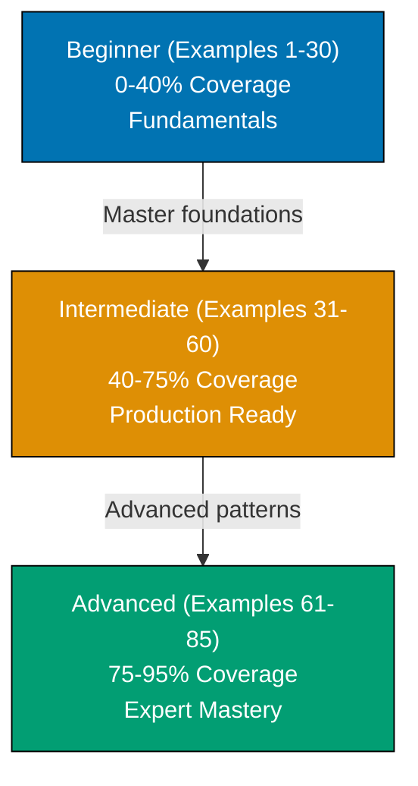

**Want to quickly master SQL through working examples?** This by-example guide teaches 95% of standard SQL through 85 annotated examples organized by complexity level.

## What Is By-Example Learning?

By-example learning is an **example-first approach** where you learn through annotated, runnable SQL rather than narrative explanations. Each example is self-contained, immediately executable in a SQLite container, and heavily commented to show:

- **What each statement does** - Inline comments explain the purpose and mechanism
- **Expected outputs** - Using `-- =>` notation to show query results
- **Intermediate states** - Table contents and data transformations made visible
- **Key takeaways** - 1-2 sentence summaries of core concepts

This approach is **ideal for experienced developers** (seasonal programmers or software engineers) who are familiar with programming but want to quickly understand SQL syntax, database concepts, and query patterns through working code.

Unlike narrative tutorials that build understanding through explanation and storytelling, by-example learning lets you **see the SQL first, run it second, and understand it through direct interaction**. You learn by doing, not by reading about doing.

## Learning Path

The SQL by-example tutorial guides you through 85 examples organized into three progressive levels, from fundamental concepts to advanced query optimization.



## Coverage Philosophy

This by-example guide provides **95% coverage of standard SQL** through practical, annotated examples. The 95% figure represents the depth and breadth of concepts covered, not a time estimate—focus is on **outcomes and understanding**, not duration.

### What's Covered

- **Core SQL syntax** - SELECT, INSERT, UPDATE, DELETE, WHERE clauses, ORDER BY, LIMIT, OFFSET, DISTINCT
- **Data types** - INTEGER, REAL, TEXT, BLOB, NULL handling, type affinity (SQLite concept)
- **Schema design** - Table creation, primary keys, foreign keys, AUTOINCREMENT, unique constraints, check constraints, NOT NULL, default values
- **Joins and relationships** - INNER JOIN, LEFT/RIGHT/FULL OUTER JOIN (simulated), CROSS JOIN, self joins, complex multi-table queries
- **Aggregations and grouping** - COUNT, SUM, AVG, MIN, MAX, GROUP BY, HAVING clauses, GROUP_CONCAT
- **String functions** - UPPER, LOWER, LENGTH, SUBSTR, TRIM, REPLACE, LIKE, GLOB patterns
- **Date and time functions** - DATE, TIME, DATETIME, STRFTIME, JULIANDAY, date arithmetic, time zones
- **Advanced queries** - Common Table Expressions (CTEs), window functions (ROW_NUMBER, RANK, DENSE_RANK, LAG, LEAD), recursive CTEs, UNION/INTERSECT/EXCEPT
- **Indexes and performance** - CREATE INDEX, unique indexes, multi-column indexes, partial indexes, covering indexes, EXPLAIN QUERY PLAN analysis
- **Subqueries** - Scalar subqueries, correlated subqueries, EXISTS/NOT EXISTS, IN/NOT IN
- **Transactions** - BEGIN, COMMIT, ROLLBACK, SAVEPOINT, ACID properties, isolation levels
- **Views** - Creating views, updatable views, materialized views (simulated with triggers)
- **Production patterns** - Upsert with INSERT OR REPLACE, bulk insert optimization, CASE expressions, COALESCE for NULL handling
- **Data manipulation** - CAST for type conversion, JSON1 extension (JSON_EXTRACT, JSON_OBJECT, JSON_ARRAY), full-text search with FTS5
- **Query optimization** - Index selection strategies, query plan analysis, avoiding table scans, covering indexes
- **Advanced techniques** - Self-joins for hierarchical data, pivoting with CASE, running totals with window functions, generating series, calendar queries

### What This Tutorial Does NOT Cover

**Database-Specific Extensions**: PostgreSQL's JSONB operators, MySQL's spatial functions, Oracle's PL/SQL - these are vendor-specific features not part of standard SQL

**Application-Level ORMs**: SQLAlchemy, Hibernate, ActiveRecord, Prisma - these are framework concerns, not SQL features

**Deployment and Infrastructure**: Docker Compose orchestration, connection pooling, replication setup - these are DevOps topics

**Database Internals**: B-tree implementation details, query optimizer algorithms, storage engine architecture - these are advanced internals beyond practical SQL usage

**Migration Tools**: Flyway, Liquibase, Alembic - these are tooling concerns for managing schema evolution

## How to Use This Guide

1. **Sequential or selective** - Read examples in order for progressive learning, or jump to specific topics when you need a particular feature
2. **Run everything** - Copy and paste examples into your SQLite environment. Experimentation solidifies understanding.
3. **Modify and explore** - Change queries, add columns, insert different data, break things intentionally. Learn through experimentation.
4. **Use as reference** - Bookmark examples for quick lookups when you forget syntax or patterns
5. **Complement with narrative tutorials** - By-example learning is code-first; pair with comprehensive tutorials for deeper explanations

**Best workflow**: Open your terminal with SQLite in one window, this guide in another. Run each example as you read it. When you encounter something unfamiliar, run the example, modify it, see what changes.

**Reference System**: Examples are numbered (1-85) and grouped by level. This numbering appears in other SQL content at ayokoding.com, allowing you to reference specific examples elsewhere.

## Structure of Each Example

Every example follows a consistent five-part format:

1. **Brief Explanation** (2-3 sentences): What the example demonstrates and why it matters
2. **Mermaid Diagram** (optional): Visual clarification when concept relationships benefit from visualization
3. **Heavily Annotated Code**: Every significant statement includes a comment explaining what it does and what it produces (using `-- =>` notation)
4. **Key Takeaway** (1-2 sentences): The core insight you should retain from this example

This structure minimizes context switching - explanation, visual aid, runnable code, and distilled essence all in one place.

## Execution Environment

All examples use a **Docker-based SQLite container** for reproducible, isolated execution across all platforms (Windows, macOS, Linux). SQLite is lightweight, requires no server setup, and provides standard SQL compliance ideal for learning.

**One-time setup** (run once before starting examples):

```bash
# Create SQLite container with persistent storage
docker run --name sqlite-tutorial \
  -v sqlite-data:/data \
  -d nouchka/sqlite3:latest tail -f /dev/null

# Connect to SQLite
docker exec -it sqlite-tutorial sqlite3 /data/tutorial.db
```

**Every example is copy-paste runnable** in this environment. Each example creates its own tables to ensure isolation and repeatability. Use `.quit` to exit SQLite shell.

**Alternative**: If you have SQLite installed locally, run `sqlite3 tutorial.db` instead of using Docker.

## Relationship to Other Tutorials

This by-example tutorial complements other learning approaches. Choose based on your situation:

| Tutorial Type        | Coverage | Best For                          | Learning Style                       |
| -------------------- | -------- | --------------------------------- | ------------------------------------ |
| **Quick Start**      | 5-30%    | Getting something working quickly | Hands-on with guided structure       |
| **Beginner**         | 0-60%    | Learning from scratch             | Narrative explanations with examples |
| **This: By Example** | 95%      | Rapid depth for experienced devs  | Code-first, minimal explanation      |
| **Cookbook**         | Parallel | Solving specific problems         | Problem-solution recipes             |
| **Advanced**         | 85-95%   | Expert mastery                    | Deep dives and edge cases            |

By-example is ideal if you have programming experience. It accelerates learning by leveraging your existing knowledge - you focus on "how SQL does this" rather than learning database concepts from scratch.

The 95% coverage represents depth and breadth of topics you'll encounter in production SQL work. It explicitly acknowledges that no tutorial covers everything, but these examples provide the foundation to understand the remaining 5% through official documentation and database-specific resources.

## Prerequisites

- Basic programming knowledge (variables, functions, loops) or willingness to learn through examples
- Docker installed and running (for SQLite container) OR SQLite installed locally
- A terminal you're comfortable with

You don't need to understand database internals, normalization theory, or SQL standards yet - this tutorial teaches those through examples. You just need comfort running commands in a terminal.

## Standard SQL Focus

This tutorial focuses on **standard SQL** that works across databases (MySQL, PostgreSQL, SQLite, SQL Server, Oracle). Where SQLite-specific features are used (like AUTOINCREMENT or type affinity), we note the standard SQL alternative.

Examples prioritize:

- **Portable SQL syntax** - Works on multiple database engines
- **ANSI SQL compliance** - Follows SQL standard when possible
- **Practical patterns** - Real-world query structures you'll use in production
- **Clear annotations** - Every query includes comments showing expected results

## Comparison with By-Example for Other Technologies

Other technologies at ayokoding.com have similar by-example tutorials:

- **PostgreSQL By-Example**: 85 examples covering PostgreSQL-specific features (JSONB, full-text search, advanced indexes)
- **Go By-Example**: 85+ examples covering concurrency, interfaces, standard library patterns
- **Java By-Example**: 75-90 examples covering OOP, streams, concurrency, JVM patterns
- **Elixir By-Example**: 75-90 examples covering functional programming, pattern matching, OTP

The SQL version follows the same philosophy and structure but emphasizes SQL's declarative nature: you describe what you want, not how to compute it. SQL is fundamentally different from imperative languages - this tutorial helps you think in sets and transformations rather than loops and conditionals.

## Learning Strategies

### For Python/Data Science Developers

SQL is your primary data manipulation tool. Focus on aggregation (Examples 16-18), window functions (34-38), and analytics (61-70) to leverage your data analysis skills.

### For Frontend/JavaScript Developers

SQL databases power your APIs. Focus on basic queries (Examples 3-5), schema design (Examples 23-28), and JSON handling (Examples 47-48) to understand backend data access.

### For Backend/Java/C# Developers

SQL integrates directly with your applications. Focus on transactions (Example 27), subqueries (Examples 44-46), and optimization (Examples 51-55) for production-ready patterns.

### For Complete Database Beginners

Start from Example 1 and follow sequentially through all 30 beginner examples for a comprehensive foundation in SQL fundamentals.

## Code-First Philosophy

This tutorial prioritizes working code over theoretical discussion:

- **No lengthy prose**: Concepts are demonstrated, not explained at length
- **Runnable examples**: Every example runs in a SQLite container or local SQLite installation
- **Learn by doing**: Understanding comes from running and modifying SQL queries
- **Pattern recognition**: See the same patterns in different contexts across 85 examples

If you prefer narrative explanations, consider the **by-concept tutorial** (available separately). By-example learning works best when you learn through experimentation.

## Ready to Start?

Jump into the beginner examples to start learning SQL through code:

- [Beginner Examples (1-30)](/en/learn/software-engineering/data/databases/sql/by-example/beginner) - Basic syntax, SELECT queries, WHERE clauses, schema design, aggregations
- [Intermediate Examples (31-60)](/en/learn/software-engineering/data/databases/sql/by-example/intermediate) - Window functions, CTEs, subqueries, transactions, views
- [Advanced Examples (61-85)](/en/learn/software-engineering/data/databases/sql/by-example/advanced) - Query optimization, recursive CTEs, full-text search, advanced patterns

Each example is self-contained and runnable. Start with Example 1, or jump to topics that interest you most.

## Examples by Level

### Beginner (Examples 1–30)

- [Example 1: Installing SQLite and First Query](/en/learn/software-engineering/data/databases/sql/by-example/beginner#example-1-installing-sqlite-and-first-query)
- [Example 2: Creating Your First Table](/en/learn/software-engineering/data/databases/sql/by-example/beginner#example-2-creating-your-first-table)
- [Example 3: Basic SELECT Queries](/en/learn/software-engineering/data/databases/sql/by-example/beginner#example-3-basic-select-queries)
- [Example 4: Inserting Data with INSERT](/en/learn/software-engineering/data/databases/sql/by-example/beginner#example-4-inserting-data-with-insert)
- [Example 5: Updating and Deleting Rows](/en/learn/software-engineering/data/databases/sql/by-example/beginner#example-5-updating-and-deleting-rows)
- [Example 6: Numeric Types (INTEGER and REAL)](/en/learn/software-engineering/data/databases/sql/by-example/beginner#example-6-numeric-types-integer-and-real)
- [Example 7: Text Types and String Operations](/en/learn/software-engineering/data/databases/sql/by-example/beginner#example-7-text-types-and-string-operations)
- [Example 8: NULL Handling](/en/learn/software-engineering/data/databases/sql/by-example/beginner#example-8-null-handling)
- [Example 9: Date and Time Types](/en/learn/software-engineering/data/databases/sql/by-example/beginner#example-9-date-and-time-types)
- [Example 10: Boolean Values and Truthiness](/en/learn/software-engineering/data/databases/sql/by-example/beginner#example-10-boolean-values-and-truthiness)
- [Example 11: WHERE Clause Filtering](/en/learn/software-engineering/data/databases/sql/by-example/beginner#example-11-where-clause-filtering)
- [Example 12: Sorting with ORDER BY](/en/learn/software-engineering/data/databases/sql/by-example/beginner#example-12-sorting-with-order-by)
- [Example 13: Limiting Results with LIMIT and OFFSET](/en/learn/software-engineering/data/databases/sql/by-example/beginner#example-13-limiting-results-with-limit-and-offset)
- [Example 14: DISTINCT for Unique Values](/en/learn/software-engineering/data/databases/sql/by-example/beginner#example-14-distinct-for-unique-values)
- [Example 15: Pattern Matching with LIKE and GLOB](/en/learn/software-engineering/data/databases/sql/by-example/beginner#example-15-pattern-matching-with-like-and-glob)
- [Example 16: COUNT, SUM, AVG, MIN, MAX](/en/learn/software-engineering/data/databases/sql/by-example/beginner#example-16-count-sum-avg-min-max)
- [Example 17: GROUP BY for Categorized Aggregation](/en/learn/software-engineering/data/databases/sql/by-example/beginner#example-17-group-by-for-categorized-aggregation)
- [Example 18: HAVING Clause for Filtering Groups](/en/learn/software-engineering/data/databases/sql/by-example/beginner#example-18-having-clause-for-filtering-groups)
- [Example 19: INNER JOIN for Matching Rows](/en/learn/software-engineering/data/databases/sql/by-example/beginner#example-19-inner-join-for-matching-rows)
- [Example 20: LEFT JOIN for Optional Matches](/en/learn/software-engineering/data/databases/sql/by-example/beginner#example-20-left-join-for-optional-matches)
- [Example 21: Self-Joins for Hierarchical Data](/en/learn/software-engineering/data/databases/sql/by-example/beginner#example-21-self-joins-for-hierarchical-data)
- [Example 22: Multiple Joins](/en/learn/software-engineering/data/databases/sql/by-example/beginner#example-22-multiple-joins)
- [Example 23: Primary Keys for Unique Identification](/en/learn/software-engineering/data/databases/sql/by-example/beginner#example-23-primary-keys-for-unique-identification)
- [Example 24: Foreign Keys for Relationships](/en/learn/software-engineering/data/databases/sql/by-example/beginner#example-24-foreign-keys-for-relationships)
- [Example 25: Constraints (NOT NULL, CHECK, DEFAULT)](/en/learn/software-engineering/data/databases/sql/by-example/beginner#example-25-constraints-not-null-check-default)
- [Example 26: Indexes for Query Performance](/en/learn/software-engineering/data/databases/sql/by-example/beginner#example-26-indexes-for-query-performance)
- [Example 27: Transactions for Data Consistency](/en/learn/software-engineering/data/databases/sql/by-example/beginner#example-27-transactions-for-data-consistency)
- [Example 28: Views for Query Simplification](/en/learn/software-engineering/data/databases/sql/by-example/beginner#example-28-views-for-query-simplification)
- [Example 29: Subqueries in WHERE](/en/learn/software-engineering/data/databases/sql/by-example/beginner#example-29-subqueries-in-where)
- [Example 30: CASE Expressions for Conditional Logic](/en/learn/software-engineering/data/databases/sql/by-example/beginner#example-30-case-expressions-for-conditional-logic)

### Intermediate (Examples 31–60)

- [Example 31: Basic CTEs with WITH](/en/learn/software-engineering/data/databases/sql/by-example/intermediate#example-31-basic-ctes-with-with)
- [Example 32: Recursive CTEs for Hierarchical Data](/en/learn/software-engineering/data/databases/sql/by-example/intermediate#example-32-recursive-ctes-for-hierarchical-data)
- [Example 33: CTEs for Complex Aggregations](/en/learn/software-engineering/data/databases/sql/by-example/intermediate#example-33-ctes-for-complex-aggregations)
- [Example 34: ROW_NUMBER for Sequential Numbering](/en/learn/software-engineering/data/databases/sql/by-example/intermediate#example-34-row_number-for-sequential-numbering)
- [Example 35: RANK and DENSE_RANK for Ranking](/en/learn/software-engineering/data/databases/sql/by-example/intermediate#example-35-rank-and-dense_rank-for-ranking)
- [Example 36: LAG and LEAD for Accessing Adjacent Rows](/en/learn/software-engineering/data/databases/sql/by-example/intermediate#example-36-lag-and-lead-for-accessing-adjacent-rows)
- [Example 37: SUM, AVG, MIN, MAX as Window Functions](/en/learn/software-engineering/data/databases/sql/by-example/intermediate#example-37-sum-avg-min-max-as-window-functions)
- [Example 38: PARTITION BY with Window Functions](/en/learn/software-engineering/data/databases/sql/by-example/intermediate#example-38-partition-by-with-window-functions)
- [Example 39: String Manipulation (SUBSTR, REPLACE, TRIM)](/en/learn/software-engineering/data/databases/sql/by-example/intermediate#example-39-string-manipulation-substr-replace-trim)
- [Example 40: Date Arithmetic and Formatting](/en/learn/software-engineering/data/databases/sql/by-example/intermediate#example-40-date-arithmetic-and-formatting)
- [Example 41: COALESCE and NULLIF for NULL Handling](/en/learn/software-engineering/data/databases/sql/by-example/intermediate#example-41-coalesce-and-nullif-for-null-handling)
- [Example 42: UNION and UNION ALL](/en/learn/software-engineering/data/databases/sql/by-example/intermediate#example-42-union-and-union-all)
- [Example 43: INTERSECT and EXCEPT](/en/learn/software-engineering/data/databases/sql/by-example/intermediate#example-43-intersect-and-except)
- [Example 44: Correlated Subqueries](/en/learn/software-engineering/data/databases/sql/by-example/intermediate#example-44-correlated-subqueries)
- [Example 45: Scalar Subqueries in SELECT](/en/learn/software-engineering/data/databases/sql/by-example/intermediate#example-45-scalar-subqueries-in-select)
- [Example 46: IN and NOT IN with Subqueries](/en/learn/software-engineering/data/databases/sql/by-example/intermediate#example-46-in-and-not-in-with-subqueries)
- [Example 47: JSON Creation and Extraction](/en/learn/software-engineering/data/databases/sql/by-example/intermediate#example-47-json-creation-and-extraction)
- [Example 48: JSON Array Operations](/en/learn/software-engineering/data/databases/sql/by-example/intermediate#example-48-json-array-operations)
- [Example 49: FTS5 Virtual Tables](/en/learn/software-engineering/data/databases/sql/by-example/intermediate#example-49-fts5-virtual-tables)
- [Example 50: FTS5 Advanced Queries](/en/learn/software-engineering/data/databases/sql/by-example/intermediate#example-50-fts5-advanced-queries)
- [Example 51: EXPLAIN QUERY PLAN Analysis](/en/learn/software-engineering/data/databases/sql/by-example/intermediate#example-51-explain-query-plan-analysis)
- [Example 52: Covering Indexes](/en/learn/software-engineering/data/databases/sql/by-example/intermediate#example-52-covering-indexes)
- [Example 53: Partial Indexes](/en/learn/software-engineering/data/databases/sql/by-example/intermediate#example-53-partial-indexes)
- [Example 54: Query Optimization Techniques](/en/learn/software-engineering/data/databases/sql/by-example/intermediate#example-54-query-optimization-techniques)
- [Example 55: Transaction Performance](/en/learn/software-engineering/data/databases/sql/by-example/intermediate#example-55-transaction-performance)
- [Example 56: Pivoting Data with CASE](/en/learn/software-engineering/data/databases/sql/by-example/intermediate#example-56-pivoting-data-with-case)
- [Example 57: Running Totals and Moving Averages](/en/learn/software-engineering/data/databases/sql/by-example/intermediate#example-57-running-totals-and-moving-averages)
- [Example 58: Upsert with INSERT OR REPLACE](/en/learn/software-engineering/data/databases/sql/by-example/intermediate#example-58-upsert-with-insert-or-replace)
- [Example 59: Generating Series and Calendar Queries](/en/learn/software-engineering/data/databases/sql/by-example/intermediate#example-59-generating-series-and-calendar-queries)
- [Example 60: Hierarchical Aggregation](/en/learn/software-engineering/data/databases/sql/by-example/intermediate#example-60-hierarchical-aggregation)

### Advanced (Examples 61–85)

- [Example 61: Percentile and Quartile Calculations](/en/learn/software-engineering/data/databases/sql/by-example/advanced#example-61-percentile-and-quartile-calculations)
- [Example 62: Cohort Analysis](/en/learn/software-engineering/data/databases/sql/by-example/advanced#example-62-cohort-analysis)
- [Example 63: Funnel Analysis](/en/learn/software-engineering/data/databases/sql/by-example/advanced#example-63-funnel-analysis)
- [Example 64: Sessionization](/en/learn/software-engineering/data/databases/sql/by-example/advanced#example-64-sessionization)
- [Example 65: Survival Analysis (Customer Lifetime)](/en/learn/software-engineering/data/databases/sql/by-example/advanced#example-65-survival-analysis-customer-lifetime)
- [Example 66: One-to-Many Relationship Modeling](/en/learn/software-engineering/data/databases/sql/by-example/advanced#example-66-one-to-many-relationship-modeling)
- [Example 67: Many-to-Many Relationship with Junction Table](/en/learn/software-engineering/data/databases/sql/by-example/advanced#example-67-many-to-many-relationship-with-junction-table)
- [Example 68: Self-Referencing Foreign Keys](/en/learn/software-engineering/data/databases/sql/by-example/advanced#example-68-self-referencing-foreign-keys)
- [Example 69: Polymorphic Associations](/en/learn/software-engineering/data/databases/sql/by-example/advanced#example-69-polymorphic-associations)
- [Example 70: Slowly Changing Dimensions (Type 2)](/en/learn/software-engineering/data/databases/sql/by-example/advanced#example-70-slowly-changing-dimensions-type-2)
- [Example 71: Analyzing Query Performance with EXPLAIN](/en/learn/software-engineering/data/databases/sql/by-example/advanced#example-71-analyzing-query-performance-with-explain)
- [Example 72: Index Strategies and Trade-offs](/en/learn/software-engineering/data/databases/sql/by-example/advanced#example-72-index-strategies-and-trade-offs)
- [Example 73: Query Rewriting for Performance](/en/learn/software-engineering/data/databases/sql/by-example/advanced#example-73-query-rewriting-for-performance)
- [Example 74: Batch Operations and Bulk Loading](/en/learn/software-engineering/data/databases/sql/by-example/advanced#example-74-batch-operations-and-bulk-loading)
- [Example 75: Denormalization for Read Performance](/en/learn/software-engineering/data/databases/sql/by-example/advanced#example-75-denormalization-for-read-performance)
- [Example 76: Soft Deletes](/en/learn/software-engineering/data/databases/sql/by-example/advanced#example-76-soft-deletes)
- [Example 77: Audit Logging](/en/learn/software-engineering/data/databases/sql/by-example/advanced#example-77-audit-logging)
- [Example 78: Optimistic Locking with Version Numbers](/en/learn/software-engineering/data/databases/sql/by-example/advanced#example-78-optimistic-locking-with-version-numbers)
- [Example 79: Idempotent Operations with Unique Constraints](/en/learn/software-engineering/data/databases/sql/by-example/advanced#example-79-idempotent-operations-with-unique-constraints)
- [Example 80: Rate Limiting with Time Windows](/en/learn/software-engineering/data/databases/sql/by-example/advanced#example-80-rate-limiting-with-time-windows)
- [Example 81: Feature Flags](/en/learn/software-engineering/data/databases/sql/by-example/advanced#example-81-feature-flags)
- [Example 82: Time-Series Data Partitioning](/en/learn/software-engineering/data/databases/sql/by-example/advanced#example-82-time-series-data-partitioning)
- [Example 83: Connection Pooling Simulation](/en/learn/software-engineering/data/databases/sql/by-example/advanced#example-83-connection-pooling-simulation)
- [Example 84: Multi-Tenancy with Row-Level Filtering](/en/learn/software-engineering/data/databases/sql/by-example/advanced#example-84-multi-tenancy-with-row-level-filtering)
- [Example 85: Database Health Monitoring](/en/learn/software-engineering/data/databases/sql/by-example/advanced#example-85-database-health-monitoring)
