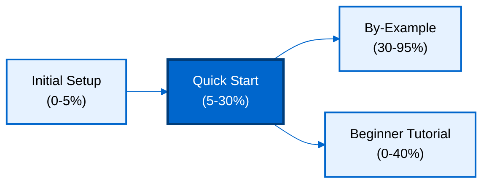

**Want to quickly build applications with structured data and SQL queries?** This quick start introduces SQL's core concepts through a working application. You'll learn table creation, relationships, queries, aggregation, and subqueries - the essential 5-30% that powers productive SQL development.

## Prerequisites

Before starting, complete [Initial Setup](/en/learn/software-engineering/data/databases/sql/initial-setup) to install SQLite and verify your environment.

You should have:

- SQLite installed (`sqlite3 --version` works)
- Basic command-line navigation skills
- Completed "Your First Database" from Initial Setup

## What You'll Build

You'll create a **library management system** with:

- Books with authors and publishers
- Members with borrowing history
- Loans tracking borrowed books
- Categories for organization
- Queries for analytics and reporting

This covers 5-30% of SQL features - enough to build real applications while understanding core concepts.

## Learning Path



## Learning Objectives

By the end of this quick start, you will:

1. **Create tables** with primary keys, foreign keys, and constraints
2. **Insert data** with single and bulk INSERT statements
3. **Query data** with SELECT, WHERE, and ORDER BY
4. **Join tables** to combine related data
5. **Aggregate data** with GROUP BY and aggregate functions
6. **Filter groups** with HAVING clause
7. **Write subqueries** for complex conditions
8. **Update and delete** data safely

## Create Database and Tables

Start SQLite and create the library database.

```bash
sqlite3 library.db
```

Set output formatting for readability:

```sql
-- Enable column headers and formatted output
.mode column
.headers on
```

### Authors Table

```sql
-- Create authors table
CREATE TABLE authors (
    id INTEGER PRIMARY KEY AUTOINCREMENT,
    name TEXT NOT NULL,
    country TEXT,
    birth_year INTEGER CHECK (birth_year > 1800),
    created_at TEXT DEFAULT CURRENT_TIMESTAMP
);

-- Insert sample authors
INSERT INTO authors (name, country, birth_year) VALUES
    ('George Orwell', 'United Kingdom', 1903),
    ('Jane Austen', 'United Kingdom', 1775),
    ('Gabriel García Márquez', 'Colombia', 1927),
    ('Haruki Murakami', 'Japan', 1949),
    ('Chimamanda Ngozi Adichie', 'Nigeria', 1977);

-- Verify insertion
SELECT * FROM authors;
```

**Output**:

```
id  name                       country         birth_year  created_at
--  -------------------------  --------------  ----------  -------------------
1   George Orwell              United Kingdom  1903        2026-01-29 10:30:00
2   Jane Austen                United Kingdom  1775        2026-01-29 10:30:00
3   Gabriel García Márquez     Colombia        1927        2026-01-29 10:30:00
4   Haruki Murakami            Japan           1949        2026-01-29 10:30:00
5   Chimamanda Ngozi Adichie   Nigeria         1977        2026-01-29 10:30:00
```

### Books Table with Foreign Key

```sql
-- Create books table with foreign key to authors
CREATE TABLE books (
    id INTEGER PRIMARY KEY AUTOINCREMENT,
    title TEXT NOT NULL,
    author_id INTEGER NOT NULL,
    published_year INTEGER,
    isbn TEXT UNIQUE,
    pages INTEGER CHECK (pages > 0),
    category TEXT NOT NULL,
    available_copies INTEGER DEFAULT 1 CHECK (available_copies >= 0),
    created_at TEXT DEFAULT CURRENT_TIMESTAMP,
    FOREIGN KEY (author_id) REFERENCES authors(id)
);

-- Insert sample books
INSERT INTO books (title, author_id, published_year, isbn, pages, category, available_copies) VALUES
    ('1984', 1, 1949, '978-0451524935', 328, 'Fiction', 3),
    ('Animal Farm', 1, 1945, '978-0451526342', 112, 'Fiction', 2),
    ('Pride and Prejudice', 2, 1813, '978-0141439518', 432, 'Fiction', 5),
    ('One Hundred Years of Solitude', 3, 1967, '978-0060883287', 417, 'Fiction', 2),
    ('Kafka on the Shore', 4, 2002, '978-1400079278', 480, 'Fiction', 1),
    ('Americanah', 5, 2013, '978-0307455925', 477, 'Fiction', 2);

-- Verify insertion
SELECT * FROM books LIMIT 3;
```

**Output**:

```
id  title              author_id  published_year  isbn             pages  category  available_copies  created_at
--  -----------------  ---------  --------------  ---------------  -----  --------  ----------------  -------------------
1   1984               1          1949            978-0451524935   328    Fiction   3                 2026-01-29 10:31:00
2   Animal Farm        1          1945            978-0451526342   112    Fiction   2                 2026-01-29 10:31:00
3   Pride and Prejudice 2         1813            978-0141439518   432    Fiction   5                 2026-01-29 10:31:00
```

### Members Table

```sql
-- Create library members table
CREATE TABLE members (
    id INTEGER PRIMARY KEY AUTOINCREMENT,
    name TEXT NOT NULL,
    email TEXT NOT NULL UNIQUE,
    join_date TEXT DEFAULT CURRENT_TIMESTAMP,
    membership_type TEXT DEFAULT 'standard' CHECK (membership_type IN ('standard', 'premium')),
    active INTEGER DEFAULT 1 CHECK (active IN (0, 1))
);

-- Insert sample members
INSERT INTO members (name, email, membership_type) VALUES
    ('Alice Johnson', 'alice@example.com', 'premium'),
    ('Bob Smith', 'bob@example.com', 'standard'),
    ('Carol White', 'carol@example.com', 'premium'),
    ('David Brown', 'david@example.com', 'standard');

-- Verify insertion
SELECT * FROM members;
```

**Output**:

```
id  name            email                membership_type  join_date            active
--  --------------  -------------------  ---------------  -------------------  ------
1   Alice Johnson   alice@example.com    premium          2026-01-29 10:32:00  1
2   Bob Smith       bob@example.com      standard         2026-01-29 10:32:00  1
3   Carol White     carol@example.com    premium          2026-01-29 10:32:00  1
4   David Brown     david@example.com    standard         2026-01-29 10:32:00  1
```

### Loans Table (Many-to-Many Join Table)

```sql
-- Create loans table (tracks book borrowing)
CREATE TABLE loans (
    id INTEGER PRIMARY KEY AUTOINCREMENT,
    book_id INTEGER NOT NULL,
    member_id INTEGER NOT NULL,
    loan_date TEXT DEFAULT CURRENT_TIMESTAMP,
    due_date TEXT NOT NULL,
    return_date TEXT,
    status TEXT DEFAULT 'borrowed' CHECK (status IN ('borrowed', 'returned', 'overdue')),
    FOREIGN KEY (book_id) REFERENCES books(id),
    FOREIGN KEY (member_id) REFERENCES members(id)
);

-- Insert sample loans
INSERT INTO loans (book_id, member_id, loan_date, due_date, status) VALUES
    (1, 1, '2026-01-15', '2026-02-15', 'borrowed'),
    (3, 1, '2026-01-10', '2026-02-10', 'returned'),
    (2, 2, '2026-01-20', '2026-02-20', 'borrowed'),
    (4, 3, '2026-01-18', '2026-02-18', 'borrowed'),
    (5, 4, '2026-01-12', '2026-02-12', 'returned');

-- Update return_date for returned books
UPDATE loans SET return_date = '2026-01-25' WHERE status = 'returned';

-- Verify insertion
SELECT * FROM loans;
```

**Output**:

```
id  book_id  member_id  loan_date            due_date     return_date          status
--  -------  ---------  -------------------  -----------  -------------------  --------
1   1        1          2026-01-15           2026-02-15   NULL                 borrowed
2   3        1          2026-01-10           2026-02-10   2026-01-25           returned
3   2        2          2026-01-20           2026-02-20   NULL                 borrowed
4   4        3          2026-01-18           2026-02-18   NULL                 borrowed
5   5        4          2026-01-12           2026-02-12   2026-01-25           returned
```

## Basic Queries

Query data with SELECT statements.

### SELECT with WHERE

```sql
-- Find books published after 1950
SELECT title, published_year FROM books
WHERE published_year > 1950
ORDER BY published_year;
```

**Output**:

```
title                          published_year
-----------------------------  --------------
One Hundred Years of Solitude  1967
Kafka on the Shore             2002
Americanah                     2013
```

### Pattern Matching with LIKE

```sql
-- Find books with "the" in title (case-insensitive)
SELECT title, published_year FROM books
WHERE LOWER(title) LIKE '%the%'
ORDER BY published_year;
```

**Output**:

```
title               published_year
------------------  --------------
Kafka on the Shore  2002
```

### Multiple Conditions

```sql
-- Find fiction books with more than 400 pages
SELECT title, pages, category FROM books
WHERE category = 'Fiction' AND pages > 400
ORDER BY pages DESC;
```

**Output**:

```
title                          pages  category
-----------------------------  -----  --------
Kafka on the Shore             480    Fiction
Americanah                     477    Fiction
Pride and Prejudice            432    Fiction
One Hundred Years of Solitude  417    Fiction
```

## Joins - Combining Tables

Join related data from multiple tables.

### Inner Join - Books with Authors

```sql
-- Get books with author information
SELECT
    b.title,
    a.name AS author_name,
    b.published_year,
    a.country
FROM books b
INNER JOIN authors a ON b.author_id = a.id
ORDER BY b.published_year;
```

**Output**:

```
title                          author_name                country
-----------------------------  -------------------------  --------------
Pride and Prejudice            Jane Austen                United Kingdom
Animal Farm                    George Orwell              United Kingdom
1984                           George Orwell              United Kingdom
One Hundred Years of Solitude  Gabriel García Márquez     Colombia
Kafka on the Shore             Haruki Murakami            Japan
Americanah                     Chimamanda Ngozi Adichie   Nigeria
```

### Complex Join - Loans with Books and Members

```sql
-- Get current loans with book and member details
SELECT
    m.name AS member_name,
    b.title AS book_title,
    a.name AS author_name,
    l.loan_date,
    l.due_date,
    l.status
FROM loans l
INNER JOIN books b ON l.book_id = b.id
INNER JOIN authors a ON b.author_id = a.id
INNER JOIN members m ON l.member_id = m.id
WHERE l.status = 'borrowed'
ORDER BY l.due_date;
```

**Output**:

```
member_name    book_title                     author_name               loan_date            due_date
-------------  -----------------------------  ------------------------  -------------------  -----------
Alice Johnson  1984                           George Orwell             2026-01-15           2026-02-15
Carol White    One Hundred Years of Solitude  Gabriel García Márquez    2026-01-18           2026-02-18
Bob Smith      Animal Farm                    George Orwell             2026-01-20           2026-02-20
```

### Left Join - All Books with Loan Status

```sql
-- Get all books with current loan status (including books not borrowed)
SELECT
    b.title,
    a.name AS author_name,
    b.available_copies,
    CASE
        WHEN l.id IS NULL THEN 'Not borrowed'
        WHEN l.status = 'borrowed' THEN 'Currently borrowed'
        ELSE l.status
    END AS loan_status
FROM books b
INNER JOIN authors a ON b.author_id = a.id
LEFT JOIN loans l ON b.id = l.book_id AND l.status = 'borrowed'
ORDER BY b.title;
```

**Output**:

```
title                          author_name                available_copies  loan_status
-----------------------------  -------------------------  ----------------  -----------------
1984                           George Orwell              3                 Currently borrowed
Americanah                     Chimamanda Ngozi Adichie   2                 Not borrowed
Animal Farm                    George Orwell              2                 Currently borrowed
Kafka on the Shore             Haruki Murakami            1                 Not borrowed
One Hundred Years of Solitude  Gabriel García Márquez     2                 Currently borrowed
Pride and Prejudice            Jane Austen                5                 Not borrowed
```

## Aggregation and Grouping

Compute summaries with aggregate functions.

### Count Books by Author

```sql
-- Count books per author
SELECT
    a.name AS author_name,
    COUNT(b.id) AS book_count
FROM authors a
LEFT JOIN books b ON a.author_id = b.author_id
GROUP BY a.id, a.name
ORDER BY book_count DESC, author_name;
```

**Output**:

```
author_name                  book_count
---------------------------  ----------
George Orwell                2
Chimamanda Ngozi Adichie     1
Gabriel García Márquez       1
Haruki Murakami              1
Jane Austen                  1
```

### Average Pages by Category

```sql
-- Calculate average pages per category
SELECT
    category,
    COUNT(*) AS book_count,
    AVG(pages) AS avg_pages,
    MIN(pages) AS min_pages,
    MAX(pages) AS max_pages
FROM books
GROUP BY category;
```

**Output**:

```
category  book_count  avg_pages  min_pages  max_pages
--------  ----------  ---------  ---------  ---------
Fiction   6           374.33     112        480
```

### HAVING Clause - Filter Aggregated Results

```sql
-- Find authors with more than 1 book
SELECT
    a.name AS author_name,
    COUNT(b.id) AS book_count,
    AVG(b.pages) AS avg_pages
FROM authors a
INNER JOIN books b ON a.id = b.author_id
GROUP BY a.id, a.name
HAVING COUNT(b.id) > 1
ORDER BY book_count DESC;
```

**Output**:

```
author_name    book_count  avg_pages
-------------  ----------  ---------
George Orwell  2           220.0
```

### Borrowing Statistics

```sql
-- Count loans per member
SELECT
    m.name AS member_name,
    m.membership_type,
    COUNT(l.id) AS total_loans,
    SUM(CASE WHEN l.status = 'borrowed' THEN 1 ELSE 0 END) AS current_loans,
    SUM(CASE WHEN l.status = 'returned' THEN 1 ELSE 0 END) AS returned_loans
FROM members m
LEFT JOIN loans l ON m.id = l.member_id
GROUP BY m.id, m.name, m.membership_type
ORDER BY total_loans DESC;
```

**Output**:

```
member_name    membership_type  total_loans  current_loans  returned_loans
-------------  ---------------  -----------  -------------  --------------
Alice Johnson  premium          2            1              1
Bob Smith      standard         1            1              0
Carol White    premium          1            1              0
David Brown    standard         1            0              1
```

## Subqueries

Use nested queries for complex conditions.

### Subquery in WHERE Clause

```sql
-- Find books by authors from United Kingdom
SELECT title, published_year
FROM books
WHERE author_id IN (
    SELECT id FROM authors WHERE country = 'United Kingdom'
)
ORDER BY published_year;
```

**Output**:

```
title                published_year
-------------------  --------------
Pride and Prejudice  1813
Animal Farm          1945
1984                 1949
```

### Subquery with Aggregation

```sql
-- Find books with more pages than average
SELECT
    title,
    pages,
    (SELECT AVG(pages) FROM books) AS avg_pages
FROM books
WHERE pages > (SELECT AVG(pages) FROM books)
ORDER BY pages DESC;
```

**Output**:

```
title                          pages  avg_pages
-----------------------------  -----  ---------
Kafka on the Shore             480    374.33
Americanah                     477    374.33
Pride and Prejudice            432    374.33
One Hundred Years of Solitude  417    374.33
```

### Correlated Subquery

```sql
-- Find members who have borrowed more books than average
SELECT
    name,
    (SELECT COUNT(*) FROM loans WHERE member_id = members.id) AS loan_count,
    (SELECT AVG(loan_count) FROM (
        SELECT COUNT(*) AS loan_count FROM loans GROUP BY member_id
    )) AS avg_loan_count
FROM members
WHERE (SELECT COUNT(*) FROM loans WHERE member_id = members.id) >
      (SELECT AVG(loan_count) FROM (
          SELECT COUNT(*) AS loan_count FROM loans GROUP BY member_id
      ))
ORDER BY loan_count DESC;
```

**Output**:

```
name           loan_count  avg_loan_count
-------------  ----------  --------------
Alice Johnson  2           1.25
```

## Updating and Deleting Data

Modify existing data with UPDATE and DELETE.

### Update Single Row

```sql
-- Mark overdue loan
UPDATE loans
SET status = 'overdue'
WHERE id = 1 AND date('now') > due_date;

-- Verify update
SELECT id, book_id, member_id, status, due_date FROM loans WHERE id = 1;
```

### Update with Calculation

```sql
-- Decrease available copies when book is borrowed
UPDATE books
SET available_copies = available_copies - 1
WHERE id = 6 AND available_copies > 0;

-- Verify update
SELECT id, title, available_copies FROM books WHERE id = 6;
```

### Conditional Delete

```sql
-- Delete inactive members with no loans
DELETE FROM members
WHERE active = 0
  AND id NOT IN (SELECT DISTINCT member_id FROM loans);

-- Verify deletion
SELECT COUNT(*) AS inactive_members_deleted FROM members WHERE active = 0;
```

### Safe Update with Transaction

```sql
-- Start transaction
BEGIN;

-- Update book status
UPDATE books SET available_copies = available_copies - 1 WHERE id = 3;

-- Create loan
INSERT INTO loans (book_id, member_id, loan_date, due_date)
VALUES (3, 2, date('now'), date('now', '+30 days'));

-- Verify both operations
SELECT * FROM loans WHERE book_id = 3 ORDER BY id DESC LIMIT 1;
SELECT id, title, available_copies FROM books WHERE id = 3;

-- Commit transaction
COMMIT;
```

## Common Patterns

### CASE Expression for Conditional Logic

```sql
-- Categorize books by length
SELECT
    title,
    pages,
    CASE
        WHEN pages < 200 THEN 'Short'
        WHEN pages BETWEEN 200 AND 400 THEN 'Medium'
        ELSE 'Long'
    END AS length_category
FROM books
ORDER BY pages;
```

**Output**:

```
title                          pages  length_category
-----------------------------  -----  ---------------
Animal Farm                    112    Short
1984                           328    Medium
One Hundred Years of Solitude  417    Long
Pride and Prejudice            432    Long
Americanah                     477    Long
Kafka on the Shore             480    Long
```

### COALESCE for NULL Handling

```sql
-- Show loan status with default for NULL return_date
SELECT
    l.id,
    b.title,
    m.name AS member_name,
    l.loan_date,
    COALESCE(l.return_date, 'Not returned yet') AS return_date
FROM loans l
INNER JOIN books b ON l.book_id = b.id
INNER JOIN members m ON l.member_id = m.id
ORDER BY l.id;
```

**Output**:

```
id  title                          member_name    loan_date            return_date
--  -----------------------------  -------------  -------------------  ------------------
1   1984                           Alice Johnson  2026-01-15           Not returned yet
2   Pride and Prejudice            Alice Johnson  2026-01-10           2026-01-25
3   Animal Farm                    Bob Smith      2026-01-20           Not returned yet
4   One Hundred Years of Solitude  Carol White    2026-01-18           Not returned yet
5   Kafka on the Shore             David Brown    2026-01-12           2026-01-25
```

### Window Functions (SQLite 3.25+)

```sql
-- Rank books by pages within each category
SELECT
    title,
    category,
    pages,
    RANK() OVER (PARTITION BY category ORDER BY pages DESC) AS rank_in_category
FROM books
ORDER BY category, rank_in_category;
```

**Output**:

```
title                          category  pages  rank_in_category
-----------------------------  --------  -----  ----------------
Kafka on the Shore             Fiction   480    1
Americanah                     Fiction   477    2
Pride and Prejudice            Fiction   432    3
One Hundred Years of Solitude  Fiction   417    4
1984                           Fiction   328    5
Animal Farm                    Fiction   112    6
```

## Next Steps

You've learned SQL's core concepts covering 5-30% of the language. Continue learning:

1. **[By-Example Tutorial](/en/learn/software-engineering/data/databases/sql/by-example)** - 85 annotated examples covering 95% of SQL (beginner, intermediate, advanced)
2. **Beginner Tutorial** (coming soon) - Narrative-driven comprehensive guide
3. **[SQLite Documentation](https://sqlite.org/docs.html)** - Comprehensive reference

**What you've learned**:

- Table creation with primary keys, foreign keys, and constraints
- Data insertion with single and bulk INSERTs
- Querying with SELECT, WHERE, ORDER BY, LIMIT
- Joins (INNER, LEFT) for combining related data
- Aggregation with GROUP BY, COUNT, SUM, AVG
- Filtering groups with HAVING clause
- Subqueries for complex conditions
- Updating and deleting data safely
- Common patterns (CASE, COALESCE, window functions)

**Topics to explore next**:

- Advanced window functions (LAG, LEAD, NTILE)
- Recursive CTEs for hierarchical data
- Indexes and query optimization
- Triggers for automatic actions
- Views for query encapsulation
- Transaction isolation levels
- Full-text search with FTS5

## Summary

This quick start covered essential SQL concepts through a library management system:

**Tables**: Created tables with primary keys, foreign keys, and CHECK constraints

**Relationships**: Linked tables with one-to-many and many-to-many patterns

**Queries**: Retrieved data with WHERE, LIKE, and ORDER BY

**Joins**: Combined tables with INNER and LEFT joins

**Aggregation**: Computed summaries with COUNT, AVG, MIN, MAX, and GROUP BY

**HAVING**: Filtered aggregated results

**Subqueries**: Nested queries for complex conditions

**Updates**: Modified data with UPDATE and DELETE statements

**Patterns**: Applied CASE expressions, COALESCE, and window functions

You're now ready to build applications with structured data and powerful SQL queries. Continue to By-Example for deeper mastery covering 95% of SQL features.
