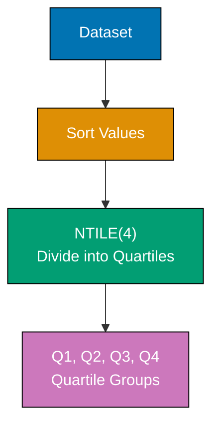
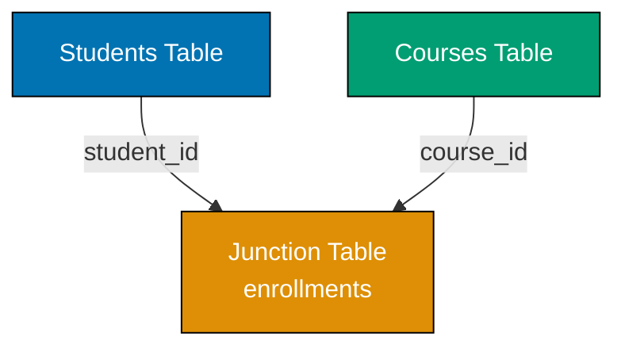

## Group 17: Advanced Analytics

### Example 61: Percentile and Quartile Calculations

Percentiles divide data into 100 equal parts, quartiles into 4 parts. Use NTILE window function or manual calculation for statistical analysis.



**Code**:

```sql
CREATE TABLE employee_salaries (
    id INTEGER,
    name TEXT,
    salary REAL
);

INSERT INTO employee_salaries (id, name, salary)
SELECT
    value,
    'Employee ' || value,
    50000 + (value * 1000) + (value % 10) * 2000
FROM (
    WITH RECURSIVE nums AS (
        SELECT 1 AS value UNION ALL SELECT value + 1 FROM nums WHERE value < 100
    )
    SELECT value FROM nums
);

-- Divide into quartiles using NTILE
SELECT
    name,
    salary,
    NTILE(4) OVER (ORDER BY salary) AS quartile
FROM employee_salaries
ORDER BY salary;
-- => Q1: Bottom 25%, Q2: 25-50%, Q3: 50-75%, Q4: Top 25%

-- Calculate quartile boundaries
WITH quartiles AS (
    SELECT
        salary,
        NTILE(4) OVER (ORDER BY salary) AS quartile
    FROM employee_salaries
)
SELECT
    quartile,
    MIN(salary) AS min_salary,
    MAX(salary) AS max_salary
FROM quartiles
GROUP BY quartile
ORDER BY quartile;
-- => Shows salary range for each quartile

-- Calculate percentiles (deciles - 10% buckets)
SELECT
    name,
    salary,
    NTILE(10) OVER (ORDER BY salary) AS decile
FROM employee_salaries
ORDER BY salary;
-- => Divides into 10 groups (1st decile = bottom 10%, 10th = top 10%)

-- Find median salary (50th percentile)
WITH ordered AS (
    SELECT
        salary,
        ROW_NUMBER() OVER (ORDER BY salary) AS row_num,
        COUNT(*) OVER () AS total_count
    FROM employee_salaries
)
SELECT AVG(salary) AS median_salary
FROM ordered
WHERE row_num IN (
    (total_count + 1) / 2,
    (total_count + 2) / 2
);
-- => Returns median (middle value or average of two middle values)

-- Calculate 90th percentile salary
WITH ordered AS (
    SELECT
        salary,
        ROW_NUMBER() OVER (ORDER BY salary) AS row_num,
        COUNT(*) OVER () AS total_count
    FROM employee_salaries
)
SELECT MAX(salary) AS percentile_90
FROM ordered
WHERE row_num <= CAST(total_count * 0.90 AS INTEGER);
-- => Returns 90th percentile (salary where 90% earn less)

-- Identify outliers (below 10th or above 90th percentile)
WITH percentiles AS (
    SELECT
        name,
        salary,
        NTILE(10) OVER (ORDER BY salary) AS decile
    FROM employee_salaries
)
SELECT name, salary, decile
FROM percentiles
WHERE decile = 1 OR decile = 10
ORDER BY salary;
-- => Returns outliers in bottom and top 10%
```

**Key Takeaway**: Use NTILE(n) to divide data into n equal groups. NTILE(4) creates quartiles, NTILE(100) approximates percentiles. Calculate exact percentiles using ROW_NUMBER and position formulas. Essential for statistical analysis and outlier detection.

### Example 62: Cohort Analysis

Cohort analysis groups users by shared characteristics (signup date) and tracks behavior over time. Essential for retention and engagement metrics.

**Code**:

```sql
CREATE TABLE users (
    id INTEGER,
    email TEXT,
    signup_date TEXT
);

CREATE TABLE purchases (
    id INTEGER,
    user_id INTEGER,
    purchase_date TEXT,
    amount REAL
);

-- Insert users with staggered signup dates
INSERT INTO users (id, email, signup_date)
SELECT
    value,
    'user' || value || '@example.com',
    date('2025-01-01', '+' || ((value - 1) / 10) || ' days')
FROM (
    WITH RECURSIVE nums AS (
        SELECT 1 AS value UNION ALL SELECT value + 1 FROM nums WHERE value < 100
    )
    SELECT value FROM nums
);

-- Insert purchases (30% of users make purchases)
INSERT INTO purchases (id, user_id, purchase_date, amount)
SELECT
    value,
    value,
    date((SELECT signup_date FROM users WHERE id = value), '+' || (value % 30) || ' days'),
    50 + (value * 10)
FROM (
    WITH RECURSIVE nums AS (
        SELECT 1 AS value UNION ALL SELECT value + 1 FROM nums WHERE value < 30
    )
    SELECT value FROM nums
);

-- Cohort analysis: User retention by signup week
WITH cohorts AS (
    SELECT
        id AS user_id,
        signup_date,
        DATE(signup_date, 'weekday 0', '-6 days') AS cohort_week
    FROM users
),
purchase_weeks AS (
    SELECT
        user_id,
        DATE(purchase_date, 'weekday 0', '-6 days') AS purchase_week,
        CAST((JULIANDAY(purchase_date) - JULIANDAY((SELECT signup_date FROM users WHERE id = user_id))) / 7 AS INTEGER) AS weeks_since_signup
    FROM purchases
)
SELECT
    c.cohort_week,
    COUNT(DISTINCT c.user_id) AS cohort_size,
    COUNT(DISTINCT CASE WHEN pw.weeks_since_signup = 0 THEN c.user_id END) AS week_0_active,
    COUNT(DISTINCT CASE WHEN pw.weeks_since_signup = 1 THEN c.user_id END) AS week_1_active,
    COUNT(DISTINCT CASE WHEN pw.weeks_since_signup = 2 THEN c.user_id END) AS week_2_active,
    COUNT(DISTINCT CASE WHEN pw.weeks_since_signup = 3 THEN c.user_id END) AS week_3_active
FROM cohorts c
LEFT JOIN purchase_weeks pw ON c.user_id = pw.user_id
GROUP BY c.cohort_week
ORDER BY c.cohort_week;
-- => Shows how many users from each cohort made purchases in weeks 0-3

-- Calculate retention percentages
WITH cohorts AS (
    SELECT
        id AS user_id,
        DATE(signup_date, 'weekday 0', '-6 days') AS cohort_week
    FROM users
),
purchase_weeks AS (
    SELECT
        user_id,
        CAST((JULIANDAY(purchase_date) - JULIANDAY((SELECT signup_date FROM users WHERE id = user_id))) / 7 AS INTEGER) AS weeks_since_signup
    FROM purchases
),
cohort_stats AS (
    SELECT
        c.cohort_week,
        COUNT(DISTINCT c.user_id) AS cohort_size,
        COUNT(DISTINCT CASE WHEN pw.weeks_since_signup = 1 THEN c.user_id END) AS week_1_active
    FROM cohorts c
    LEFT JOIN purchase_weeks pw ON c.user_id = pw.user_id
    GROUP BY c.cohort_week
)
SELECT
    cohort_week,
    cohort_size,
    week_1_active,
    ROUND(100.0 * week_1_active / cohort_size, 2) AS week_1_retention_pct
FROM cohort_stats
ORDER BY cohort_week;
-- => Shows week-1 retention percentage for each cohort
```

**Key Takeaway**: Cohort analysis groups users by signup period and tracks behavior over time. Use date functions to calculate cohort periods and time since signup. Pivot with CASE to show retention by week/month. Essential for SaaS metrics and user engagement analysis.

### Example 63: Funnel Analysis

Funnel analysis tracks conversion through multi-step processes. Calculate drop-off rates at each stage to identify bottlenecks.

**Code**:

```sql
CREATE TABLE user_events (
    id INTEGER,
    user_id INTEGER,
    event_type TEXT,
    event_timestamp TEXT
);

-- Simulate user journey: visit -> signup -> purchase
INSERT INTO user_events (id, user_id, event_type, event_timestamp)
SELECT
    value,
    (value + 2) / 3,  -- Groups of 3 events per user
    CASE value % 3
        WHEN 1 THEN 'visit'
        WHEN 2 THEN 'signup'
        WHEN 0 THEN 'purchase'
    END,
    datetime('2025-01-01', '+' || value || ' minutes')
FROM (
    WITH RECURSIVE nums AS (
        SELECT 1 AS value UNION ALL SELECT value + 1 FROM nums WHERE value < 300
    )
    SELECT value FROM nums
);

-- Basic funnel: Count users at each stage
SELECT
    event_type AS stage,
    COUNT(DISTINCT user_id) AS users,
    RANK() OVER (ORDER BY
        CASE event_type
            WHEN 'visit' THEN 1
            WHEN 'signup' THEN 2
            WHEN 'purchase' THEN 3
        END
    ) AS stage_order
FROM user_events
GROUP BY event_type
ORDER BY stage_order;
-- => visit: 100, signup: 100, purchase: 100 (or fewer if some don't complete)

-- Funnel with conversion rates
WITH funnel_stages AS (
    SELECT
        event_type AS stage,
        COUNT(DISTINCT user_id) AS users,
        CASE event_type
            WHEN 'visit' THEN 1
            WHEN 'signup' THEN 2
            WHEN 'purchase' THEN 3
        END AS stage_order
    FROM user_events
    GROUP BY event_type
),
total_visits AS (
    SELECT users AS visit_count
    FROM funnel_stages
    WHERE stage = 'visit'
)
SELECT
    fs.stage,
    fs.users,
    tv.visit_count,
    ROUND(100.0 * fs.users / tv.visit_count, 2) AS conversion_pct,
    LAG(fs.users) OVER (ORDER BY fs.stage_order) AS prev_stage_users,
    ROUND(100.0 * fs.users / NULLIF(LAG(fs.users) OVER (ORDER BY fs.stage_order), 0), 2) AS stage_conversion_pct
FROM funnel_stages fs, total_visits tv
ORDER BY fs.stage_order;
-- => Shows overall conversion from visit and stage-to-stage conversion

-- Time-to-conversion analysis
WITH user_journey AS (
    SELECT
        user_id,
        MIN(CASE WHEN event_type = 'visit' THEN event_timestamp END) AS visit_time,
        MIN(CASE WHEN event_type = 'signup' THEN event_timestamp END) AS signup_time,
        MIN(CASE WHEN event_type = 'purchase' THEN event_timestamp END) AS purchase_time
    FROM user_events
    GROUP BY user_id
)
SELECT
    user_id,
    CAST((JULIANDAY(signup_time) - JULIANDAY(visit_time)) * 24 * 60 AS INTEGER) AS visit_to_signup_minutes,
    CAST((JULIANDAY(purchase_time) - JULIANDAY(signup_time)) * 24 * 60 AS INTEGER) AS signup_to_purchase_minutes
FROM user_journey
WHERE purchase_time IS NOT NULL
ORDER BY user_id
LIMIT 10;
-- => Shows time spent at each funnel stage

-- Drop-off analysis: Users who didn't complete
WITH user_max_stage AS (
    SELECT
        user_id,
        MAX(CASE event_type
            WHEN 'visit' THEN 1
            WHEN 'signup' THEN 2
            WHEN 'purchase' THEN 3
        END) AS max_stage
    FROM user_events
    GROUP BY user_id
)
SELECT
    CASE max_stage
        WHEN 1 THEN 'Dropped at Visit'
        WHEN 2 THEN 'Dropped at Signup'
        WHEN 3 THEN 'Completed Purchase'
    END AS outcome,
    COUNT(*) AS user_count
FROM user_max_stage
GROUP BY max_stage
ORDER BY max_stage;
-- => Shows where users dropped off
```

**Key Takeaway**: Funnel analysis requires tracking user progression through stages. Use CASE with aggregates to count users at each stage. Calculate conversion rates (stage/total and stage/previous). Identify drop-off points to optimize conversion. Essential for e-commerce, SaaS onboarding, and user flows.

### Example 64: Sessionization

Sessionization groups events into sessions using time-based windows. Essential for analytics when explicit session IDs aren't available.

**Code**:

```sql
CREATE TABLE page_views (
    id INTEGER,
    user_id INTEGER,
    page TEXT,
    view_timestamp TEXT
);

-- Insert page views with varying gaps
INSERT INTO page_views (id, user_id, page, view_timestamp)
SELECT
    value,
    (value - 1) / 15 + 1,  -- 15 views per user
    'page_' || (value % 5 + 1),
    datetime('2025-01-01', '+' || (value * 2 + (value % 5) * 20) || ' minutes')
FROM (
    WITH RECURSIVE nums AS (
        SELECT 1 AS value UNION ALL SELECT value + 1 FROM nums WHERE value < 60
    )
    SELECT value FROM nums
);

-- Define session: Views within 30 minutes of previous view
WITH view_gaps AS (
    SELECT
        user_id,
        page,
        view_timestamp,
        LAG(view_timestamp) OVER (PARTITION BY user_id ORDER BY view_timestamp) AS prev_timestamp,
        CASE
            WHEN (JULIANDAY(view_timestamp) - JULIANDAY(LAG(view_timestamp) OVER (PARTITION BY user_id ORDER BY view_timestamp))) * 24 * 60 > 30
                OR LAG(view_timestamp) OVER (PARTITION BY user_id ORDER BY view_timestamp) IS NULL
            THEN 1
            ELSE 0
        END AS new_session
    FROM page_views
),
session_starts AS (
    SELECT
        user_id,
        view_timestamp,
        SUM(new_session) OVER (PARTITION BY user_id ORDER BY view_timestamp) AS session_id
    FROM view_gaps
)
SELECT
    user_id,
    session_id,
    COUNT(*) AS page_views_in_session,
    MIN(view_timestamp) AS session_start,
    MAX(view_timestamp) AS session_end,
    ROUND((JULIANDAY(MAX(view_timestamp)) - JULIANDAY(MIN(view_timestamp))) * 24 * 60, 2) AS session_duration_minutes
FROM session_starts
GROUP BY user_id, session_id
ORDER BY user_id, session_id;
-- => Shows sessions with start, end, duration, and page view count

-- Average session metrics
WITH view_gaps AS (
    SELECT
        user_id,
        view_timestamp,
        CASE
            WHEN (JULIANDAY(view_timestamp) - JULIANDAY(LAG(view_timestamp) OVER (PARTITION BY user_id ORDER BY view_timestamp))) * 24 * 60 > 30
                OR LAG(view_timestamp) OVER (PARTITION BY user_id ORDER BY view_timestamp) IS NULL
            THEN 1
            ELSE 0
        END AS new_session
    FROM page_views
),
sessions AS (
    SELECT
        user_id,
        view_timestamp,
        SUM(new_session) OVER (PARTITION BY user_id ORDER BY view_timestamp) AS session_id
    FROM view_gaps
),
session_metrics AS (
    SELECT
        user_id,
        session_id,
        COUNT(*) AS views_per_session,
        ROUND((JULIANDAY(MAX(view_timestamp)) - JULIANDAY(MIN(view_timestamp))) * 24 * 60, 2) AS duration_minutes
    FROM sessions
    GROUP BY user_id, session_id
)
SELECT
    ROUND(AVG(views_per_session), 2) AS avg_views_per_session,
    ROUND(AVG(duration_minutes), 2) AS avg_duration_minutes,
    COUNT(DISTINCT user_id || '-' || session_id) AS total_sessions
FROM session_metrics;
-- => Shows average session length and duration
```

**Key Takeaway**: Sessionization uses LAG to calculate time gaps between events. New session starts when gap exceeds threshold (e.g., 30 minutes). Use running SUM of session starts to assign session IDs. Calculate session metrics (duration, page views) with GROUP BY. Essential for web analytics.

### Example 65: Survival Analysis (Customer Lifetime)

Survival analysis tracks how long entities (customers, products) remain active. Calculate survival curves and churn rates over time.

**Code**:

```sql
CREATE TABLE customers (
    id INTEGER,
    signup_date TEXT,
    churn_date TEXT  -- NULL if still active
);

-- Insert customers with varying lifespans
INSERT INTO customers (id, signup_date, churn_date)
SELECT
    value,
    date('2024-01-01', '+' || ((value - 1) / 10) || ' days'),
    CASE
        WHEN value % 3 = 0 THEN date('2024-01-01', '+' || ((value - 1) / 10 + 30 + value % 60) || ' days')
        ELSE NULL
    END
FROM (
    WITH RECURSIVE nums AS (
        SELECT 1 AS value UNION ALL SELECT value + 1 FROM nums WHERE value < 100
    )
    SELECT value FROM nums
);

-- Calculate customer lifetime in days
WITH customer_lifetime AS (
    SELECT
        id,
        signup_date,
        COALESCE(churn_date, date('now')) AS end_date,
        CAST(JULIANDAY(COALESCE(churn_date, date('now'))) - JULIANDAY(signup_date) AS INTEGER) AS lifetime_days,
        CASE WHEN churn_date IS NULL THEN 1 ELSE 0 END AS is_active
    FROM customers
)
SELECT
    id,
    signup_date,
    lifetime_days,
    CASE WHEN is_active = 1 THEN 'Active' ELSE 'Churned' END AS status
FROM customer_lifetime
ORDER BY lifetime_days DESC
LIMIT 10;
-- => Shows top 10 customers by lifetime

-- Survival curve: Percentage surviving at each time point
WITH customer_lifetime AS (
    SELECT
        id,
        signup_date,
        CAST(JULIANDAY(COALESCE(churn_date, date('now'))) - JULIANDAY(signup_date) AS INTEGER) AS lifetime_days
    FROM customers
),
lifetime_buckets AS (
    SELECT
        (lifetime_days / 30) * 30 AS days_bucket,
        COUNT(*) AS customers_at_risk
    FROM customer_lifetime
    GROUP BY days_bucket
),
total_customers AS (
    SELECT COUNT(*) AS total FROM customers
)
SELECT
    lb.days_bucket,
    lb.customers_at_risk,
    tc.total,
    ROUND(100.0 * SUM(lb.customers_at_risk) OVER (ORDER BY lb.days_bucket DESC) / tc.total, 2) AS survival_pct
FROM lifetime_buckets lb, total_customers tc
ORDER BY lb.days_bucket;
-- => Shows percentage of customers surviving to each time bucket

-- Cohort-based churn analysis
WITH cohorts AS (
    SELECT
        id,
        DATE(signup_date, 'start of month') AS cohort_month,
        churn_date
    FROM customers
),
cohort_stats AS (
    SELECT
        cohort_month,
        COUNT(*) AS cohort_size,
        COUNT(churn_date) AS churned_count
    FROM cohorts
    GROUP BY cohort_month
)
SELECT
    cohort_month,
    cohort_size,
    churned_count,
    cohort_size - churned_count AS still_active,
    ROUND(100.0 * churned_count / cohort_size, 2) AS churn_rate_pct
FROM cohort_stats
ORDER BY cohort_month;
-- => Shows churn rate by signup month
```

**Key Takeaway**: Survival analysis calculates lifetime from start date to end date (or current date for active). Use COALESCE to treat active customers as surviving until now. Bucket lifetimes and calculate survival percentages. Essential for churn prediction, product lifecycle analysis, and retention metrics.

## Group 18: Data Modeling Patterns

### Example 66: One-to-Many Relationship Modeling

One-to-many relationships link one parent record to multiple child records. Use foreign keys to maintain referential integrity.

**Code**:

```sql
-- Enable foreign keys
PRAGMA foreign_keys = ON;

-- Parent table: Authors
CREATE TABLE authors (
    id INTEGER PRIMARY KEY,
    name TEXT NOT NULL,
    email TEXT UNIQUE
);

-- Child table: Books (many books per author)
CREATE TABLE books (
    id INTEGER PRIMARY KEY,
    title TEXT NOT NULL,
    author_id INTEGER NOT NULL,
    published_year INTEGER,
    FOREIGN KEY (author_id) REFERENCES authors(id) ON DELETE CASCADE
);

INSERT INTO authors (id, name, email)
VALUES
    (1, 'Alice Author', 'alice@books.com'),
    (2, 'Bob Writer', 'bob@books.com');

INSERT INTO books (id, title, author_id, published_year)
VALUES
    (1, 'SQL Mastery', 1, 2020),
    (2, 'Database Design', 1, 2021),
    (3, 'Query Optimization', 1, 2022),
    (4, 'Data Modeling', 2, 2021);

-- Query with JOIN to show relationship
SELECT
    a.name AS author,
    b.title AS book,
    b.published_year
FROM authors a
INNER JOIN books b ON a.id = b.author_id
ORDER BY a.name, b.published_year;
-- => Alice Author: SQL Mastery (2020), Database Design (2021), Query Optimization (2022)
-- => Bob Writer: Data Modeling (2021)

-- Count books per author
SELECT
    a.name AS author,
    COUNT(b.id) AS num_books
FROM authors a
LEFT JOIN books b ON a.id = b.author_id
GROUP BY a.id, a.name
ORDER BY num_books DESC;
-- => Alice Author: 3 books, Bob Writer: 1 book

-- CASCADE delete: Remove author and all their books
DELETE FROM authors WHERE id = 1;
-- => Deletes Alice and all 3 of her books (CASCADE)

SELECT * FROM books;
-- => Only Bob's book remains (id=4)
```

**Key Takeaway**: One-to-many uses foreign keys in child table pointing to parent's primary key. Use ON DELETE CASCADE to automatically delete children when parent is deleted. LEFT JOIN shows parents without children. Essential pattern for orders/items, posts/comments, categories/products.

### Example 67: Many-to-Many Relationship with Junction Table

Many-to-many relationships require junction tables (also called bridge or associative tables) to link two entities bidirectionally.



**Code**:

```sql
PRAGMA foreign_keys = ON;

-- First entity: Students
CREATE TABLE students (
    id INTEGER PRIMARY KEY,
    name TEXT NOT NULL,
    email TEXT UNIQUE
);

-- Second entity: Courses
CREATE TABLE courses (
    id INTEGER PRIMARY KEY,
    title TEXT NOT NULL,
    credits INTEGER
);

-- Junction table: Links students and courses
CREATE TABLE enrollments (
    id INTEGER PRIMARY KEY,
    student_id INTEGER NOT NULL,
    course_id INTEGER NOT NULL,
    enrollment_date TEXT,
    FOREIGN KEY (student_id) REFERENCES students(id) ON DELETE CASCADE,
    FOREIGN KEY (course_id) REFERENCES courses(id) ON DELETE CASCADE,
    UNIQUE(student_id, course_id)  -- Prevent duplicate enrollments
);

INSERT INTO students (id, name, email)
VALUES
    (1, 'Alice', 'alice@university.edu'),
    (2, 'Bob', 'bob@university.edu'),
    (3, 'Charlie', 'charlie@university.edu');

INSERT INTO courses (id, title, credits)
VALUES
    (1, 'Database Systems', 3),
    (2, 'Web Development', 3),
    (3, 'Machine Learning', 4);

INSERT INTO enrollments (student_id, course_id, enrollment_date)
VALUES
    (1, 1, '2025-01-01'),  -- Alice -> Database Systems
    (1, 2, '2025-01-01'),  -- Alice -> Web Development
    (2, 1, '2025-01-02'),  -- Bob -> Database Systems
    (2, 3, '2025-01-02'),  -- Bob -> Machine Learning
    (3, 2, '2025-01-03'),  -- Charlie -> Web Development
    (3, 3, '2025-01-03');  -- Charlie -> Machine Learning

-- Find all courses for a student
SELECT
    s.name AS student,
    c.title AS course,
    c.credits
FROM students s
INNER JOIN enrollments e ON s.id = e.student_id
INNER JOIN courses c ON e.course_id = c.id
WHERE s.name = 'Alice';
-- => Returns: Database Systems (3), Web Development (3)

-- Find all students in a course
SELECT
    c.title AS course,
    s.name AS student,
    e.enrollment_date
FROM courses c
INNER JOIN enrollments e ON c.id = e.course_id
INNER JOIN students s ON e.student_id = s.id
WHERE c.title = 'Database Systems'
ORDER BY e.enrollment_date;
-- => Returns: Alice (2025-01-01), Bob (2025-01-02)

-- Count enrollments
SELECT
    s.name AS student,
    COUNT(e.id) AS num_courses,
    SUM(c.credits) AS total_credits
FROM students s
LEFT JOIN enrollments e ON s.id = e.student_id
LEFT JOIN courses c ON e.course_id = c.id
GROUP BY s.id, s.name;
-- => Alice: 2 courses (6 credits), Bob: 2 courses (7 credits), Charlie: 2 courses (7 credits)

-- Find students enrolled in same courses as Alice
WITH alice_courses AS (
    SELECT course_id FROM enrollments WHERE student_id = 1
)
SELECT DISTINCT s.name
FROM students s
INNER JOIN enrollments e ON s.id = e.student_id
WHERE e.course_id IN (SELECT course_id FROM alice_courses)
  AND s.id != 1;
-- => Returns: Bob, Charlie (share at least one course with Alice)
```

**Key Takeaway**: Many-to-many requires junction table with foreign keys to both entities. Add UNIQUE constraint on (entity1_id, entity2_id) to prevent duplicates. Use two JOINs to traverse relationship. Junction table can store additional attributes (enrollment_date, role, status). Essential for tags, permissions, product categories.

### Example 68: Self-Referencing Foreign Keys

Self-referencing tables model hierarchical relationships (employees/managers, categories/subcategories, comments/replies).

**Code**:

```sql
PRAGMA foreign_keys = ON;

CREATE TABLE categories (
    id INTEGER PRIMARY KEY,
    name TEXT NOT NULL,
    parent_id INTEGER,
    FOREIGN KEY (parent_id) REFERENCES categories(id) ON DELETE CASCADE
);

-- Insert hierarchical categories
INSERT INTO categories (id, name, parent_id)
VALUES
    (1, 'Electronics', NULL),          -- Top level
    (2, 'Computers', 1),                -- Electronics > Computers
    (3, 'Laptops', 2),                  -- Electronics > Computers > Laptops
    (4, 'Desktops', 2),                 -- Electronics > Computers > Desktops
    (5, 'Phones', 1),                   -- Electronics > Phones
    (6, 'Smartphones', 5),              -- Electronics > Phones > Smartphones
    (7, 'Feature Phones', 5),           -- Electronics > Phones > Feature Phones
    (8, 'Home & Garden', NULL),         -- Top level
    (9, 'Furniture', 8);                -- Home & Garden > Furniture

-- Find all direct children of a category
SELECT
    c.name AS category,
    p.name AS parent
FROM categories c
LEFT JOIN categories p ON c.parent_id = p.id
WHERE c.parent_id = 1
ORDER BY c.name;
-- => Returns: Computers, Phones (direct children of Electronics)

-- Find all top-level categories (no parent)
SELECT name
FROM categories
WHERE parent_id IS NULL;
-- => Returns: Electronics, Home & Garden

-- Find full path to category (using recursive CTE)
WITH RECURSIVE category_path AS (
    -- Base case: Start with Laptops
    SELECT id, name, parent_id, name AS path
    FROM categories
    WHERE id = 3

    UNION ALL

    -- Recursive case: Add parent to path
    SELECT c.id, c.name, c.parent_id, c.name || ' > ' || cp.path
    FROM categories c
    INNER JOIN category_path cp ON c.id = cp.parent_id
)
SELECT path
FROM category_path
WHERE parent_id IS NULL;
-- => Returns: Electronics > Computers > Laptops

-- Count descendants at all levels
WITH RECURSIVE descendants AS (
    -- Base case: Electronics and all descendants
    SELECT id, name, 0 AS level
    FROM categories
    WHERE id = 1

    UNION ALL

    SELECT c.id, c.name, d.level + 1
    FROM categories c
    INNER JOIN descendants d ON c.parent_id = d.id
)
SELECT COUNT(*) - 1 AS num_descendants  -- Exclude root
FROM descendants;
-- => Returns: 5 (Computers, Laptops, Desktops, Phones, Smartphones, Feature Phones)
```

**Key Takeaway**: Self-referencing foreign keys use parent_id pointing to same table's id. Use recursive CTEs to traverse hierarchies (find ancestors, descendants, paths). Essential for org charts, category trees, comment threads, file systems.

### Example 69: Polymorphic Associations

Polymorphic associations allow one table to reference multiple parent tables. Implemented with type and id columns. (Note: Not enforced by foreign keys in standard SQL)

**Code**:

```sql
-- Parent table 1: Posts
CREATE TABLE posts (
    id INTEGER PRIMARY KEY,
    title TEXT,
    content TEXT
);

-- Parent table 2: Photos
CREATE TABLE photos (
    id INTEGER PRIMARY KEY,
    url TEXT,
    caption TEXT
);

-- Polymorphic child: Comments can belong to posts OR photos
CREATE TABLE comments (
    id INTEGER PRIMARY KEY,
    content TEXT,
    commentable_type TEXT,  -- 'post' or 'photo'
    commentable_id INTEGER, -- References posts.id or photos.id
    created_at TEXT
);

INSERT INTO posts (id, title, content)
VALUES
    (1, 'SQL Tutorial', 'Learn SQL basics'),
    (2, 'Advanced Queries', 'Master complex queries');

INSERT INTO photos (id, url, caption)
VALUES
    (1, 'https://example.com/photo1.jpg', 'Sunset'),
    (2, 'https://example.com/photo2.jpg', 'Mountain');

INSERT INTO comments (id, content, commentable_type, commentable_id, created_at)
VALUES
    (1, 'Great post!', 'post', 1, '2025-01-15 10:00:00'),
    (2, 'Very helpful', 'post', 1, '2025-01-15 11:00:00'),
    (3, 'Beautiful photo', 'photo', 1, '2025-01-15 12:00:00'),
    (4, 'Amazing view', 'photo', 2, '2025-01-15 13:00:00');

-- Find all comments on a specific post
SELECT
    c.content AS comment,
    c.created_at
FROM comments c
WHERE c.commentable_type = 'post'
  AND c.commentable_id = 1
ORDER BY c.created_at;
-- => Returns: 'Great post!', 'Very helpful'

-- Find all comments on a specific photo
SELECT
    c.content AS comment,
    c.created_at
FROM comments c
WHERE c.commentable_type = 'photo'
  AND c.commentable_id = 1;
-- => Returns: 'Beautiful photo'

-- Join comments with their parent entities (UNION pattern)
SELECT
    'post' AS type,
    p.title AS title,
    c.content AS comment
FROM posts p
INNER JOIN comments c ON c.commentable_type = 'post' AND c.commentable_id = p.id

UNION ALL

SELECT
    'photo' AS type,
    ph.caption AS title,
    c.content AS comment
FROM photos ph
INNER JOIN comments c ON c.commentable_type = 'photo' AND c.commentable_id = ph.id

ORDER BY type, title;
-- => Returns all comments with their parent entity

-- Count comments by type
SELECT
    commentable_type AS type,
    COUNT(*) AS num_comments
FROM comments
GROUP BY commentable_type;
-- => post: 2, photo: 2
```

**Key Takeaway**: Polymorphic associations use type and id columns to reference multiple parent tables. Cannot enforce with foreign keys - relies on application logic. Use UNION to join with different parent types. Common in ORMs (Rails, Laravel) for likes, comments, attachments that apply to multiple models.

### Example 70: Slowly Changing Dimensions (Type 2)

Type 2 SCDs track historical changes by creating new rows with effective dates. Essential for data warehousing and historical reporting.

**Code**:

```sql
CREATE TABLE customer_scd (
    id INTEGER PRIMARY KEY,
    customer_id INTEGER NOT NULL,
    name TEXT NOT NULL,
    email TEXT,
    address TEXT,
    effective_date TEXT NOT NULL,
    end_date TEXT,            -- NULL for current record
    is_current INTEGER NOT NULL DEFAULT 1,  -- 1 = current, 0 = historical
    CHECK (is_current IN (0, 1))
);

-- Initial customer record
INSERT INTO customer_scd (id, customer_id, name, email, address, effective_date, end_date, is_current)
VALUES (1, 100, 'Alice Smith', 'alice@old.com', '123 Old St', '2024-01-01', NULL, 1);

-- Customer changes email (create new row, close old row)
BEGIN TRANSACTION;

-- Close previous record
UPDATE customer_scd
SET end_date = '2024-06-01', is_current = 0
WHERE customer_id = 100 AND is_current = 1;

-- Insert new current record
INSERT INTO customer_scd (id, customer_id, name, email, address, effective_date, end_date, is_current)
VALUES (2, 100, 'Alice Smith', 'alice@new.com', '123 Old St', '2024-06-01', NULL, 1);

COMMIT;

-- Customer changes address (another change)
BEGIN TRANSACTION;

UPDATE customer_scd
SET end_date = '2025-01-01', is_current = 0
WHERE customer_id = 100 AND is_current = 1;

INSERT INTO customer_scd (id, customer_id, name, email, address, effective_date, end_date, is_current)
VALUES (3, 100, 'Alice Smith', 'alice@new.com', '456 New Ave', '2025-01-01', NULL, 1);

COMMIT;

-- View current customer data
SELECT customer_id, name, email, address
FROM customer_scd
WHERE is_current = 1;
-- => Returns: customer_id=100, email='alice@new.com', address='456 New Ave'

-- View full history for customer
SELECT
    customer_id,
    email,
    address,
    effective_date,
    COALESCE(end_date, 'Current') AS end_date,
    CASE WHEN is_current = 1 THEN 'Yes' ELSE 'No' END AS is_current
FROM customer_scd
WHERE customer_id = 100
ORDER BY effective_date;
-- => Returns 3 rows showing full history

-- Point-in-time query: What was address on 2024-08-01?
SELECT customer_id, name, email, address
FROM customer_scd
WHERE customer_id = 100
  AND effective_date <= '2024-08-01'
  AND (end_date IS NULL OR end_date > '2024-08-01')
LIMIT 1;
-- => Returns: email='alice@new.com', address='123 Old St' (state on 2024-08-01)

-- Create view for current records only
CREATE VIEW customers_current AS
SELECT customer_id, name, email, address, effective_date
FROM customer_scd
WHERE is_current = 1;

SELECT * FROM customers_current;
-- => Simplified access to current state
```

**Key Takeaway**: Type 2 SCD maintains history by creating new rows for changes. Use effective_date and end_date to track validity periods. is_current flag enables fast current-state queries. Point-in-time queries use date range conditions. Essential for data warehouses, audit trails, and historical reporting.

## Group 19: Performance Tuning

### Example 71: Analyzing Query Performance with EXPLAIN

EXPLAIN QUERY PLAN reveals query execution strategy. Identify inefficiencies like table scans, missing indexes, and suboptimal join orders.

**Code**:

```sql
CREATE TABLE orders (
    id INTEGER PRIMARY KEY,
    customer_id INTEGER,
    order_date TEXT,
    total REAL,
    status TEXT
);

CREATE TABLE customers (
    id INTEGER PRIMARY KEY,
    name TEXT,
    email TEXT,
    country TEXT
);

-- Insert large dataset for realistic analysis
INSERT INTO orders (id, customer_id, order_date, total, status)
SELECT
    value,
    (value % 1000) + 1,
    date('2024-01-01', '+' || (value % 365) || ' days'),
    50 + (value % 500),
    CASE value % 4 WHEN 0 THEN 'completed' WHEN 1 THEN 'pending' WHEN 2 THEN 'cancelled' ELSE 'shipped' END
FROM (
    WITH RECURSIVE nums AS (
        SELECT 1 AS value UNION ALL SELECT value + 1 FROM nums WHERE value < 10000
    )
    SELECT value FROM nums
);

INSERT INTO customers (id, name, email, country)
SELECT
    value,
    'Customer ' || value,
    'customer' || value || '@example.com',
    CASE value % 5 WHEN 0 THEN 'USA' WHEN 1 THEN 'UK' WHEN 2 THEN 'Canada' WHEN 3 THEN 'Australia' ELSE 'Germany' END
FROM (
    WITH RECURSIVE nums AS (
        SELECT 1 AS value UNION ALL SELECT value + 1 FROM nums WHERE value < 1000
    )
    SELECT value FROM nums
);

-- Query 1: Filter without index (slow)
EXPLAIN QUERY PLAN
SELECT * FROM orders WHERE status = 'completed';
-- => Output: SCAN TABLE orders
-- => Must check all 10,000 rows

-- Create index on status
CREATE INDEX idx_orders_status ON orders(status);

-- Query 1 with index (fast)
EXPLAIN QUERY PLAN
SELECT * FROM orders WHERE status = 'completed';
-- => Output: SEARCH TABLE orders USING INDEX idx_orders_status (status=?)
-- => Uses index for fast lookup

-- Query 2: JOIN without index
EXPLAIN QUERY PLAN
SELECT c.name, o.total
FROM customers c
INNER JOIN orders o ON c.id = o.customer_id
WHERE c.country = 'USA';
-- => May show inefficient join strategy

-- Create indexes to optimize JOIN
CREATE INDEX idx_customers_country ON customers(country);
CREATE INDEX idx_orders_customer_id ON orders(customer_id);

EXPLAIN QUERY PLAN
SELECT c.name, o.total
FROM customers c
INNER JOIN orders o ON c.id = o.customer_id
WHERE c.country = 'USA';
-- => Now uses indexes efficiently

-- Query 3: Complex query with subquery
EXPLAIN QUERY PLAN
SELECT c.name, c.email
FROM customers c
WHERE c.id IN (
    SELECT customer_id FROM orders WHERE total > 300
);
-- => Shows how subquery is executed (may use temp B-tree)

-- Rewrite as JOIN (often faster)
EXPLAIN QUERY PLAN
SELECT DISTINCT c.name, c.email
FROM customers c
INNER JOIN orders o ON c.id = o.customer_id
WHERE o.total > 300;
-- => Compare query plans to choose faster approach
```

**Key Takeaway**: EXPLAIN QUERY PLAN shows execution strategy - look for SCAN (bad) vs SEARCH (good). Create indexes on columns in WHERE, JOIN, ORDER BY. Compare query plans for different approaches (subquery vs JOIN). Index creation dramatically improves performance for large datasets.

### Example 72: Index Strategies and Trade-offs

Indexes speed reads but slow writes. Choose index types and columns strategically based on query patterns.

**Code**:

```sql
CREATE TABLE products (
    id INTEGER PRIMARY KEY,
    sku TEXT,
    name TEXT,
    category TEXT,
    price REAL,
    stock INTEGER,
    created_at TEXT
);

-- Insert test data
INSERT INTO products (id, sku, name, category, price, stock, created_at)
SELECT
    value,
    'SKU-' || printf('%06d', value),
    'Product ' || value,
    CASE value % 5 WHEN 0 THEN 'Electronics' WHEN 1 THEN 'Clothing' WHEN 2 THEN 'Food' WHEN 3 THEN 'Furniture' ELSE 'Sports' END,
    10 + (value % 1000),
    value % 100,
    datetime('2024-01-01', '+' || (value % 365) || ' days')
FROM (
    WITH RECURSIVE nums AS (
        SELECT 1 AS value UNION ALL SELECT value + 1 FROM nums WHERE value < 5000
    )
    SELECT value FROM nums
);

-- Strategy 1: Single-column index (basic filtering)
CREATE INDEX idx_products_category ON products(category);

EXPLAIN QUERY PLAN
SELECT * FROM products WHERE category = 'Electronics';
-- => Uses index for fast category lookup

-- Strategy 2: Composite index (multiple WHERE conditions)
CREATE INDEX idx_products_category_price ON products(category, price);

EXPLAIN QUERY PLAN
SELECT * FROM products WHERE category = 'Electronics' AND price > 500;
-- => Uses composite index (more efficient than separate indexes)

-- Strategy 3: Covering index (includes SELECT columns)
DROP INDEX idx_products_category_price;
CREATE INDEX idx_products_category_price_name ON products(category, price, name);

EXPLAIN QUERY PLAN
SELECT category, price, name FROM products WHERE category = 'Electronics';
-- => COVERING INDEX - doesn't need to access table

-- Strategy 4: Partial index (index subset of rows)
CREATE INDEX idx_products_low_stock ON products(stock) WHERE stock < 10;

EXPLAIN QUERY PLAN
SELECT * FROM products WHERE stock < 10;
-- => Uses partial index (smaller, faster)

-- Strategy 5: Expression index (index computed value)
CREATE INDEX idx_products_price_with_tax ON products((price * 1.1));

EXPLAIN QUERY PLAN
SELECT * FROM products WHERE (price * 1.1) > 100;
-- => Uses expression index (without it, function prevents index usage)

-- Measure index overhead
SELECT
    name AS index_name,
    tbl_name AS table_name
FROM sqlite_master
WHERE type = 'index' AND tbl_name = 'products';
-- => Shows all indexes on products table

-- Drop unused indexes to improve write performance
DROP INDEX idx_products_category;  -- Redundant (covered by composite index)
```

**Key Takeaway**: Single-column indexes for simple filters, composite indexes for multi-column WHERE (order matters: most selective first). Covering indexes include SELECT columns to avoid table access. Partial indexes reduce size for filtered queries. Expression indexes enable indexing computed values. Balance read speed vs write overhead.

### Example 73: Query Rewriting for Performance

Rewrite queries to use indexes, avoid functions in WHERE, and leverage database optimizer.

**Code**:

```sql
CREATE TABLE events (
    id INTEGER PRIMARY KEY,
    event_name TEXT,
    event_date TEXT,
    user_id INTEGER,
    category TEXT
);

INSERT INTO events (id, event_name, event_date, user_id, category)
SELECT
    value,
    'Event ' || value,
    date('2024-01-01', '+' || (value % 365) || ' days'),
    (value % 100) + 1,
    CASE value % 3 WHEN 0 THEN 'System' WHEN 1 THEN 'User' ELSE 'Admin' END
FROM (
    WITH RECURSIVE nums AS (
        SELECT 1 AS value UNION ALL SELECT value + 1 FROM nums WHERE value < 10000
    )
    SELECT value FROM nums
);

CREATE INDEX idx_events_date ON events(event_date);
CREATE INDEX idx_events_user ON events(user_id);
CREATE INDEX idx_events_category ON events(category);

-- SLOW: Function in WHERE prevents index usage
SELECT * FROM events
WHERE DATE(event_date) = '2024-06-15';
-- => DATE() function prevents idx_events_date usage

-- FAST: Rewrite using range comparison
SELECT * FROM events
WHERE event_date >= '2024-06-15' AND event_date < '2024-06-16';
-- => Uses idx_events_date

-- SLOW: OR conditions often don't use indexes efficiently
SELECT * FROM events
WHERE user_id = 10 OR user_id = 20 OR user_id = 30;

-- FAST: Use IN clause (optimizer can use index)
SELECT * FROM events
WHERE user_id IN (10, 20, 30);
-- => Uses idx_events_user

-- SLOW: NOT IN with subquery (NULL issues + poor performance)
SELECT * FROM events
WHERE category NOT IN (SELECT category FROM events WHERE user_id = 1);

-- FAST: Use LEFT JOIN anti-pattern
SELECT e.*
FROM events e
LEFT JOIN (SELECT DISTINCT category FROM events WHERE user_id = 1) sub
  ON e.category = sub.category
WHERE sub.category IS NULL;
-- => More efficient and NULL-safe

-- SLOW: LIKE with leading wildcard (cannot use index)
SELECT * FROM events WHERE event_name LIKE '%Event';

-- FAST: LIKE with trailing wildcard (can use index)
CREATE INDEX idx_events_name ON events(event_name);
SELECT * FROM events WHERE event_name LIKE 'Event%';
-- => Uses idx_events_name

-- SLOW: SELECT DISTINCT with no index
SELECT DISTINCT category FROM events;

-- FAST: GROUP BY (semantically equivalent, may optimize differently)
SELECT category FROM events GROUP BY category;
-- => May use idx_events_category

-- SLOW: Subquery in SELECT for every row
SELECT
    e.event_name,
    (SELECT COUNT(*) FROM events e2 WHERE e2.category = e.category) AS cat_count
FROM events e;

-- FAST: Use window function
SELECT
    event_name,
    COUNT(*) OVER (PARTITION BY category) AS cat_count
FROM events;
-- => Single pass instead of per-row subqueries
```

**Key Takeaway**: Avoid functions in WHERE (use ranges instead). Use IN instead of OR for multiple values. Replace NOT IN with LEFT JOIN for NULL safety and performance. Trailing wildcards (LIKE 'abc%') use indexes, leading wildcards ('%abc') don't. Window functions outperform correlated subqueries.

### Example 74: Batch Operations and Bulk Loading

Batch operations in transactions dramatically improve performance. Use pragmas and multi-row inserts for bulk loading.

**Code**:

```sql
CREATE TABLE metrics (
    id INTEGER PRIMARY KEY,
    metric_name TEXT,
    value REAL,
    recorded_at TEXT
);

-- SLOW: Individual inserts (auto-commit per statement)
-- Don't run this for 10,000 rows - would take minutes
-- INSERT INTO metrics (metric_name, value, recorded_at)
-- VALUES ('cpu', 50.5, datetime('now'));
-- ... repeated 10,000 times

-- FAST: Single transaction with multi-row INSERT
BEGIN TRANSACTION;

INSERT INTO metrics (metric_name, value, recorded_at)
SELECT
    CASE value % 3 WHEN 0 THEN 'cpu' WHEN 1 THEN 'memory' ELSE 'disk' END,
    RANDOM() % 100,
    datetime('2025-01-01', '+' || value || ' seconds')
FROM (
    WITH RECURSIVE nums AS (
        SELECT 1 AS value UNION ALL SELECT value + 1 FROM nums WHERE value < 10000
    )
    SELECT value FROM nums
);

COMMIT;
-- => Inserts 10,000 rows in milliseconds

-- Optimize for bulk loading (use with caution - test thoroughly)
PRAGMA synchronous = OFF;     -- Disable sync (faster but risky)
PRAGMA journal_mode = MEMORY;  -- In-memory journaling (faster, less safe)
PRAGMA temp_store = MEMORY;    -- In-memory temp tables

BEGIN TRANSACTION;

INSERT INTO metrics (metric_name, value, recorded_at)
SELECT
    'bulk_' || (value % 3),
    value,
    datetime('now')
FROM (
    WITH RECURSIVE nums AS (
        SELECT 1 AS value UNION ALL SELECT value + 1 FROM nums WHERE value < 50000
    )
    SELECT value FROM nums
);

COMMIT;

-- Restore safe settings
PRAGMA synchronous = FULL;
PRAGMA journal_mode = DELETE;
PRAGMA temp_store = DEFAULT;

-- Batch updates
BEGIN TRANSACTION;

UPDATE metrics SET value = value * 1.1 WHERE metric_name = 'cpu';
UPDATE metrics SET value = value * 0.9 WHERE metric_name = 'memory';
DELETE FROM metrics WHERE recorded_at < datetime('now', '-30 days');

COMMIT;
-- => All changes atomic and fast

-- Batch deletes (delete in chunks for large tables)
BEGIN TRANSACTION;

DELETE FROM metrics
WHERE id IN (
    SELECT id FROM metrics
    WHERE metric_name = 'disk'
    LIMIT 1000
);

COMMIT;
-- => Deletes 1000 rows at a time (repeat as needed)

-- Use VACUUM after large deletes to reclaim space
VACUUM;
-- => Rebuilds database file, reclaims deleted space
```

**Key Takeaway**: Wrap bulk operations in transactions for massive speedup. Multi-row INSERT faster than individual statements. Pragmas (synchronous, journal_mode) tune performance but risk data integrity - use carefully. Batch large updates/deletes. VACUUM after large deletes to reclaim space.

### Example 75: Denormalization for Read Performance

Denormalization duplicates data to avoid joins. Trade-off: faster reads, slower writes, higher storage, data consistency challenges.

**Code**:

```sql
-- Normalized schema (3NF)
CREATE TABLE orders_normalized (
    id INTEGER PRIMARY KEY,
    customer_id INTEGER,
    order_date TEXT,
    total REAL
);

CREATE TABLE customers_normalized (
    id INTEGER PRIMARY KEY,
    name TEXT,
    email TEXT,
    country TEXT
);

-- Insert test data
INSERT INTO customers_normalized (id, name, email, country)
SELECT
    value,
    'Customer ' || value,
    'customer' || value || '@example.com',
    CASE value % 3 WHEN 0 THEN 'USA' WHEN 1 THEN 'UK' ELSE 'Canada' END
FROM (
    WITH RECURSIVE nums AS (
        SELECT 1 AS value UNION ALL SELECT value + 1 FROM nums WHERE value < 1000
    )
    SELECT value FROM nums
);

INSERT INTO orders_normalized (id, customer_id, order_date, total)
SELECT
    value,
    (value % 1000) + 1,
    date('2024-01-01', '+' || (value % 365) || ' days'),
    50 + (value % 500)
FROM (
    WITH RECURSIVE nums AS (
        SELECT 1 AS value UNION ALL SELECT value + 1 FROM nums WHERE value < 10000
    )
    SELECT value FROM nums
);

-- Normalized query (requires JOIN)
EXPLAIN QUERY PLAN
SELECT o.id, o.order_date, o.total, c.name, c.country
FROM orders_normalized o
INNER JOIN customers_normalized c ON o.customer_id = c.id
WHERE o.order_date >= '2024-06-01';
-- => Requires JOIN (slower for high-volume queries)

-- Denormalized schema (duplicate customer data in orders)
CREATE TABLE orders_denormalized (
    id INTEGER PRIMARY KEY,
    customer_id INTEGER,
    customer_name TEXT,      -- Denormalized
    customer_email TEXT,     -- Denormalized
    customer_country TEXT,   -- Denormalized
    order_date TEXT,
    total REAL
);

-- Populate denormalized table
INSERT INTO orders_denormalized
SELECT
    o.id,
    o.customer_id,
    c.name,
    c.email,
    c.country,
    o.order_date,
    o.total
FROM orders_normalized o
INNER JOIN customers_normalized c ON o.customer_id = c.id;

-- Denormalized query (no JOIN needed)
EXPLAIN QUERY PLAN
SELECT id, order_date, total, customer_name, customer_country
FROM orders_denormalized
WHERE order_date >= '2024-06-01';
-- => Single table scan, no JOIN (faster)

-- Trade-off: Updates require maintaining consistency
-- When customer changes name, must update all their orders
BEGIN TRANSACTION;

UPDATE customers_normalized SET name = 'Updated Customer' WHERE id = 1;

-- Also update denormalized table
UPDATE orders_denormalized
SET customer_name = 'Updated Customer'
WHERE customer_id = 1;

COMMIT;
-- => More complex update logic

-- Create materialized view (simulated with triggers)
CREATE TABLE orders_summary (
    customer_id INTEGER PRIMARY KEY,
    customer_name TEXT,
    num_orders INTEGER,
    total_spent REAL,
    last_order_date TEXT
);

INSERT INTO orders_summary
SELECT
    c.id,
    c.name,
    COUNT(o.id),
    SUM(o.total),
    MAX(o.order_date)
FROM customers_normalized c
LEFT JOIN orders_normalized o ON c.id = o.customer_id
GROUP BY c.id, c.name;

-- Query summary (extremely fast)
SELECT * FROM orders_summary WHERE total_spent > 1000;
-- => Pre-aggregated, no GROUP BY needed

-- Refresh summary (run periodically)
DELETE FROM orders_summary;
INSERT INTO orders_summary
SELECT
    c.id,
    c.name,
    COUNT(o.id),
    SUM(o.total),
    MAX(o.order_date)
FROM customers_normalized c
LEFT JOIN orders_normalized o ON c.id = o.customer_id
GROUP BY c.id, c.name;
```

**Key Takeaway**: Denormalization duplicates data to eliminate joins. Use for read-heavy workloads. Trade-offs: faster reads, complex updates, data redundancy. Materialized views/summary tables pre-aggregate for instant queries. Refresh periodically or use triggers. Balance normalization (data integrity) vs denormalization (performance).

## Group 20: Production Patterns

### Example 76: Soft Deletes

Soft deletes mark records as deleted instead of removing them. Enables undelete and maintains referential integrity for historical data.

**Code**:

```sql
CREATE TABLE users (
    id INTEGER PRIMARY KEY,
    email TEXT UNIQUE NOT NULL,
    name TEXT,
    deleted_at TEXT  -- NULL = active, timestamp = soft deleted
);

INSERT INTO users (id, email, name, deleted_at)
VALUES
    (1, 'alice@example.com', 'Alice', NULL),
    (2, 'bob@example.com', 'Bob', NULL),
    (3, 'charlie@example.com', 'Charlie', NULL);

-- Soft delete (don't use DELETE)
UPDATE users
SET deleted_at = datetime('now')
WHERE id = 2;
-- => Bob marked as deleted, record still exists

-- Query active users only
SELECT * FROM users WHERE deleted_at IS NULL;
-- => Returns: Alice, Charlie (Bob excluded)

-- Query deleted users
SELECT * FROM users WHERE deleted_at IS NOT NULL;
-- => Returns: Bob

-- Undelete (restore)
UPDATE users
SET deleted_at = NULL
WHERE id = 2;
-- => Bob restored to active status

-- Create view for active users
CREATE VIEW users_active AS
SELECT id, email, name
FROM users
WHERE deleted_at IS NULL;

-- Applications query view instead of table
SELECT * FROM users_active;
-- => Automatically filters deleted users

-- Soft delete with foreign keys
CREATE TABLE posts (
    id INTEGER PRIMARY KEY,
    user_id INTEGER NOT NULL,
    title TEXT,
    deleted_at TEXT,
    FOREIGN KEY (user_id) REFERENCES users(id)
);

INSERT INTO posts (id, user_id, title, deleted_at)
VALUES
    (1, 1, 'Alice Post 1', NULL),
    (2, 1, 'Alice Post 2', NULL),
    (3, 2, 'Bob Post 1', NULL);

-- Soft delete user (posts remain)
UPDATE users SET deleted_at = datetime('now') WHERE id = 1;
-- => Alice deleted, posts remain (would fail with CASCADE DELETE)

-- Query active users with their active posts
SELECT u.name, p.title
FROM users_active u
INNER JOIN posts p ON u.id = p.user_id
WHERE p.deleted_at IS NULL;
-- => Returns only active users and posts

-- Permanent delete (after retention period)
DELETE FROM users
WHERE deleted_at IS NOT NULL
  AND deleted_at < datetime('now', '-90 days');
-- => Permanently removes users deleted over 90 days ago
```

**Key Takeaway**: Soft deletes use deleted_at timestamp instead of DELETE. NULL = active, timestamp = deleted. Create views filtering deleted_at IS NULL for active records. Enables undelete, preserves referential integrity, supports audit trails. Permanent delete after retention period.

### Example 77: Audit Logging

Audit logs track who changed what and when. Essential for compliance, debugging, and security.

**Code**:

```sql
-- Main table
CREATE TABLE products (
    id INTEGER PRIMARY KEY,
    name TEXT NOT NULL,
    price REAL NOT NULL,
    updated_at TEXT
);

-- Audit log table
CREATE TABLE products_audit (
    id INTEGER PRIMARY KEY,
    product_id INTEGER NOT NULL,
    action TEXT NOT NULL,  -- 'INSERT', 'UPDATE', 'DELETE'
    old_values TEXT,       -- JSON of old values
    new_values TEXT,       -- JSON of new values
    changed_by TEXT,       -- User who made change
    changed_at TEXT NOT NULL
);

-- Initial insert
INSERT INTO products (id, name, price, updated_at)
VALUES (1, 'Laptop', 1000.00, datetime('now'));

-- Log the insert
INSERT INTO products_audit (product_id, action, old_values, new_values, changed_by, changed_at)
VALUES (
    1,
    'INSERT',
    NULL,
    JSON_OBJECT('name', 'Laptop', 'price', 1000.00),
    'alice@example.com',
    datetime('now')
);

-- Update product
UPDATE products
SET price = 1200.00, updated_at = datetime('now')
WHERE id = 1;

-- Log the update
INSERT INTO products_audit (product_id, action, old_values, new_values, changed_by, changed_at)
VALUES (
    1,
    'UPDATE',
    JSON_OBJECT('name', 'Laptop', 'price', 1000.00),
    JSON_OBJECT('name', 'Laptop', 'price', 1200.00),
    'bob@example.com',
    datetime('now')
);

-- Delete product
DELETE FROM products WHERE id = 1;

-- Log the delete
INSERT INTO products_audit (product_id, action, old_values, new_values, changed_by, changed_at)
VALUES (
    1,
    'DELETE',
    JSON_OBJECT('name', 'Laptop', 'price', 1200.00),
    NULL,
    'charlie@example.com',
    datetime('now')
);

-- Query audit history for product
SELECT
    action,
    old_values,
    new_values,
    changed_by,
    changed_at
FROM products_audit
WHERE product_id = 1
ORDER BY changed_at;
-- => Returns full history: INSERT, UPDATE, DELETE

-- Find who changed price above 1000
SELECT DISTINCT changed_by
FROM products_audit
WHERE JSON_EXTRACT(new_values, '$.price') > 1000;
-- => Returns: bob@example.com

-- Audit report: All changes in last 7 days
SELECT
    product_id,
    action,
    changed_by,
    changed_at
FROM products_audit
WHERE changed_at >= datetime('now', '-7 days')
ORDER BY changed_at DESC;

-- Simplified trigger-based approach (SQLite supports triggers)
CREATE TRIGGER products_audit_insert
AFTER INSERT ON products
BEGIN
    INSERT INTO products_audit (product_id, action, new_values, changed_by, changed_at)
    VALUES (
        NEW.id,
        'INSERT',
        JSON_OBJECT('name', NEW.name, 'price', NEW.price),
        'system',  -- In real app, get from application context
        datetime('now')
    );
END;

CREATE TRIGGER products_audit_update
AFTER UPDATE ON products
BEGIN
    INSERT INTO products_audit (product_id, action, old_values, new_values, changed_by, changed_at)
    VALUES (
        NEW.id,
        'UPDATE',
        JSON_OBJECT('name', OLD.name, 'price', OLD.price),
        JSON_OBJECT('name', NEW.name, 'price', NEW.price),
        'system',
        datetime('now')
    );
END;

CREATE TRIGGER products_audit_delete
AFTER DELETE ON products
BEGIN
    INSERT INTO products_audit (product_id, action, old_values, changed_by, changed_at)
    VALUES (
        OLD.id,
        'DELETE',
        JSON_OBJECT('name', OLD.name, 'price', OLD.price),
        'system',
        datetime('now')
    );
END;
```

**Key Takeaway**: Audit logs use separate table tracking action type, old/new values (JSON), user, and timestamp. Implement via application code or triggers. Query audit history for compliance, debugging, rollback. Store changed values as JSON for flexibility. Essential for financial systems, healthcare, and regulated industries.

### Example 78: Optimistic Locking with Version Numbers

Optimistic locking prevents lost updates in concurrent environments using version numbers or timestamps.

**Code**:

```sql
CREATE TABLE inventory (
    id INTEGER PRIMARY KEY,
    product_name TEXT NOT NULL,
    quantity INTEGER NOT NULL,
    version INTEGER NOT NULL DEFAULT 1  -- Version for optimistic locking
);

INSERT INTO inventory (id, product_name, quantity, version)
VALUES (1, 'Widget A', 100, 1);

-- User 1 reads current state
SELECT * FROM inventory WHERE id = 1;
-- => quantity=100, version=1

-- User 2 reads current state (same version)
SELECT * FROM inventory WHERE id = 1;
-- => quantity=100, version=1

-- User 1 updates (decreases quantity)
UPDATE inventory
SET quantity = 95, version = version + 1
WHERE id = 1 AND version = 1;
-- => Success: 1 row updated, version now 2

-- User 2 tries to update (using stale version)
UPDATE inventory
SET quantity = 90, version = version + 1
WHERE id = 1 AND version = 1;
-- => Fails: 0 rows updated (version is now 2, not 1)

-- User 2 must re-read and retry
SELECT * FROM inventory WHERE id = 1;
-- => quantity=95, version=2 (sees User 1's change)

UPDATE inventory
SET quantity = 90, version = version + 1
WHERE id = 1 AND version = 2;
-- => Success: 1 row updated, version now 3

-- Application pattern with error handling
BEGIN TRANSACTION;

SELECT id, quantity, version FROM inventory WHERE id = 1;
-- => Application reads: quantity=90, version=3

-- Calculate new quantity
-- new_quantity = 90 - 10 = 80

UPDATE inventory
SET quantity = 80, version = version + 1
WHERE id = 1 AND version = 3;

-- Check affected rows
-- If 0 rows affected: ROLLBACK and retry (version conflict)
-- If 1 row affected: COMMIT (success)

COMMIT;

-- Timestamp-based optimistic locking (alternative)
CREATE TABLE documents (
    id INTEGER PRIMARY KEY,
    content TEXT,
    updated_at TEXT NOT NULL
);

INSERT INTO documents (id, content, updated_at)
VALUES (1, 'Original content', datetime('now'));

-- Read with timestamp
SELECT id, content, updated_at FROM documents WHERE id = 1;
-- => updated_at = '2025-12-29 02:07:25'

-- Update with timestamp check
UPDATE documents
SET content = 'Updated content', updated_at = datetime('now')
WHERE id = 1 AND updated_at = '2025-12-29 02:07:25';
-- => Success if timestamp matches, fails if stale
```

**Key Takeaway**: Optimistic locking uses version numbers or timestamps to detect concurrent modifications. UPDATE with version check in WHERE clause. If 0 rows affected, version conflict occurred - re-read and retry. No locks needed, scales well. Essential for web applications with concurrent users.

### Example 79: Idempotent Operations with Unique Constraints

Idempotent operations can be retried safely without side effects. Use unique constraints and INSERT OR IGNORE for idempotency.

**Code**:

```sql
CREATE TABLE payments (
    id INTEGER PRIMARY KEY,
    transaction_id TEXT UNIQUE NOT NULL,  -- External idempotency key
    user_id INTEGER NOT NULL,
    amount REAL NOT NULL,
    status TEXT NOT NULL,
    created_at TEXT NOT NULL
);

-- First payment attempt
INSERT INTO payments (transaction_id, user_id, amount, status, created_at)
VALUES ('txn-12345', 100, 50.00, 'completed', datetime('now'));
-- => Success: Payment recorded

-- Duplicate payment attempt (network retry)
INSERT INTO payments (transaction_id, user_id, amount, status, created_at)
VALUES ('txn-12345', 100, 50.00, 'completed', datetime('now'));
-- => ERROR: UNIQUE constraint failed (prevents duplicate charge)

-- Idempotent pattern: INSERT OR IGNORE
INSERT OR IGNORE INTO payments (transaction_id, user_id, amount, status, created_at)
VALUES ('txn-12345', 100, 50.00, 'completed', datetime('now'));
-- => Success: No error, no duplicate row (idempotent)

-- Check if payment exists before processing
SELECT id FROM payments WHERE transaction_id = 'txn-12345';
-- => Returns existing payment (application can skip processing)

-- Idempotent upsert with unique key
CREATE TABLE user_sessions (
    id INTEGER PRIMARY KEY,
    session_token TEXT UNIQUE NOT NULL,
    user_id INTEGER NOT NULL,
    expires_at TEXT NOT NULL,
    created_at TEXT NOT NULL
);

-- Create or refresh session (idempotent)
INSERT INTO user_sessions (session_token, user_id, expires_at, created_at)
VALUES ('token-abc123', 100, datetime('now', '+1 day'), datetime('now'))
ON CONFLICT(session_token) DO UPDATE SET
    expires_at = datetime('now', '+1 day'),
    created_at = datetime('now');
-- => Creates new session or refreshes existing one

-- Retry-safe pattern with status transitions
CREATE TABLE orders (
    id INTEGER PRIMARY KEY,
    order_number TEXT UNIQUE NOT NULL,
    user_id INTEGER NOT NULL,
    status TEXT NOT NULL CHECK (status IN ('pending', 'processing', 'completed', 'failed')),
    created_at TEXT NOT NULL
);

INSERT INTO orders (order_number, user_id, status, created_at)
VALUES ('ORD-001', 100, 'pending', datetime('now'));

-- Idempotent status transition (only move forward)
UPDATE orders
SET status = 'processing'
WHERE order_number = 'ORD-001'
  AND status = 'pending';  -- Only transition from pending
-- => 1 row updated

-- Retry same transition (idempotent - no change)
UPDATE orders
SET status = 'processing'
WHERE order_number = 'ORD-001'
  AND status = 'pending';
-- => 0 rows updated (already processing, safe to retry)
```

**Key Takeaway**: Idempotent operations use unique constraints on external IDs (transaction_id, order_number). INSERT OR IGNORE prevents duplicates without errors. ON CONFLICT DO UPDATE for upserts. Status transitions check current state in WHERE. Enables safe retries in distributed systems.

### Example 80: Rate Limiting with Time Windows

Rate limiting prevents abuse by restricting actions per time window. Track events and enforce limits.

**Code**:

```sql
CREATE TABLE api_requests (
    id INTEGER PRIMARY KEY,
    api_key TEXT NOT NULL,
    endpoint TEXT NOT NULL,
    request_time TEXT NOT NULL
);

CREATE INDEX idx_api_requests_key_time ON api_requests(api_key, request_time);

-- Record API request
INSERT INTO api_requests (api_key, endpoint, request_time)
VALUES ('key-12345', '/api/users', datetime('now'));

-- Check rate limit: max 100 requests per hour
WITH recent_requests AS (
    SELECT COUNT(*) AS request_count
    FROM api_requests
    WHERE api_key = 'key-12345'
      AND request_time >= datetime('now', '-1 hour')
)
SELECT
    CASE
        WHEN request_count >= 100 THEN 'RATE_LIMIT_EXCEEDED'
        ELSE 'OK'
    END AS status,
    request_count,
    100 - request_count AS remaining
FROM recent_requests;
-- => Returns: status='OK', request_count=1, remaining=99

-- Application pattern: Check before allowing request
-- 1. Count recent requests
WITH rate_check AS (
    SELECT COUNT(*) AS count
    FROM api_requests
    WHERE api_key = 'key-12345'
      AND request_time >= datetime('now', '-1 hour')
)
SELECT
    CASE WHEN count < 100 THEN 1 ELSE 0 END AS allowed
FROM rate_check;

-- 2. If allowed=1, record request
INSERT INTO api_requests (api_key, endpoint, request_time)
VALUES ('key-12345', '/api/users', datetime('now'));

-- Sliding window rate limit (more accurate)
CREATE TABLE rate_limit_sliding (
    api_key TEXT PRIMARY KEY,
    request_timestamps TEXT  -- JSON array of timestamps
);

INSERT OR IGNORE INTO rate_limit_sliding (api_key, request_timestamps)
VALUES ('key-67890', '[]');

-- Add new request to sliding window
UPDATE rate_limit_sliding
SET request_timestamps = JSON_INSERT(
    request_timestamps,
    '$[#]',
    datetime('now')
)
WHERE api_key = 'key-67890';

-- Remove timestamps older than 1 hour
WITH filtered_timestamps AS (
    SELECT
        api_key,
        JSON_GROUP_ARRAY(value) AS recent_timestamps
    FROM rate_limit_sliding,
         JSON_EACH(request_timestamps)
    WHERE api_key = 'key-67890'
      AND datetime(value) >= datetime('now', '-1 hour')
    GROUP BY api_key
)
UPDATE rate_limit_sliding
SET request_timestamps = (SELECT recent_timestamps FROM filtered_timestamps)
WHERE api_key = 'key-67890';

-- Check limit
SELECT
    api_key,
    JSON_ARRAY_LENGTH(request_timestamps) AS request_count,
    CASE
        WHEN JSON_ARRAY_LENGTH(request_timestamps) >= 100 THEN 'EXCEEDED'
        ELSE 'OK'
    END AS status
FROM rate_limit_sliding
WHERE api_key = 'key-67890';

-- Cleanup old requests periodically
DELETE FROM api_requests
WHERE request_time < datetime('now', '-24 hours');
```

**Key Takeaway**: Rate limiting counts events within time windows. Simple approach: count rows with `request_time >= datetime('now', '-1 hour')`. Sliding window: Store timestamps in JSON array, filter old ones. Check count before allowing action. Periodically cleanup old records. Essential for API rate limiting, login attempts, spam prevention.

### Example 81: Feature Flags

Feature flags enable/disable features without code deployment. Control rollout, A/B testing, and emergency shutdowns.

**Code**:

```sql
CREATE TABLE feature_flags (
    id INTEGER PRIMARY KEY,
    flag_name TEXT UNIQUE NOT NULL,
    is_enabled INTEGER NOT NULL DEFAULT 0,  -- 0=disabled, 1=enabled
    rollout_percentage INTEGER NOT NULL DEFAULT 0,  -- 0-100
    target_users TEXT,  -- JSON array of user IDs
    updated_at TEXT NOT NULL
);

INSERT INTO feature_flags (flag_name, is_enabled, rollout_percentage, target_users, updated_at)
VALUES
    ('new_dashboard', 1, 100, NULL, datetime('now')),  -- Enabled for all
    ('beta_features', 1, 10, NULL, datetime('now')),   -- Enabled for 10%
    ('premium_tier', 1, 0, '["user-1", "user-5", "user-10"]', datetime('now'));  -- Specific users

-- Check if feature is enabled for all users
SELECT is_enabled
FROM feature_flags
WHERE flag_name = 'new_dashboard';
-- => Returns: 1 (enabled)

-- Check if feature is enabled for user (percentage rollout)
-- Use user_id hash for consistent assignment
WITH user_hash AS (
    SELECT
        'user-42' AS user_id,
        ABS(((CAST(SUBSTR(HEX(RANDOMBLOB(16)), 1, 8) AS INTEGER)) % 100)) AS hash_value
)
SELECT
    ff.flag_name,
    CASE
        WHEN ff.is_enabled = 0 THEN 0
        WHEN ff.rollout_percentage = 100 THEN 1
        WHEN ff.rollout_percentage = 0 AND ff.target_users IS NOT NULL THEN
            CASE WHEN JSON_EXTRACT(ff.target_users, '$') LIKE '%' || uh.user_id || '%' THEN 1 ELSE 0 END
        ELSE
            CASE WHEN uh.hash_value < ff.rollout_percentage THEN 1 ELSE 0 END
    END AS is_enabled
FROM feature_flags ff, user_hash uh
WHERE ff.flag_name = 'beta_features';
-- => Returns: 1 if user hash < 10, else 0

-- Check target user list
SELECT
    flag_name,
    CASE
        WHEN is_enabled = 0 THEN 0
        WHEN target_users IS NOT NULL AND JSON_EXTRACT(target_users, '$') LIKE '%user-5%' THEN 1
        ELSE 0
    END AS is_enabled
FROM feature_flags
WHERE flag_name = 'premium_tier';
-- => Returns: 1 for user-5, 0 for others

-- Enable feature for all users
UPDATE feature_flags
SET is_enabled = 1, rollout_percentage = 100, updated_at = datetime('now')
WHERE flag_name = 'beta_features';

-- Emergency disable
UPDATE feature_flags
SET is_enabled = 0, updated_at = datetime('now')
WHERE flag_name = 'new_dashboard';

-- Gradual rollout (increase percentage)
UPDATE feature_flags
SET rollout_percentage = 25, updated_at = datetime('now')
WHERE flag_name = 'beta_features';
-- => Now enabled for 25% of users

-- A/B testing: Assign users to variant
CREATE TABLE ab_test_assignments (
    user_id TEXT PRIMARY KEY,
    test_name TEXT NOT NULL,
    variant TEXT NOT NULL,  -- 'A' or 'B'
    assigned_at TEXT NOT NULL
);

-- Assign user to variant (deterministic based on user_id)
INSERT OR IGNORE INTO ab_test_assignments (user_id, test_name, variant, assigned_at)
SELECT
    'user-42',
    'dashboard_redesign',
    CASE WHEN ABS((CAST(SUBSTR(HEX(RANDOMBLOB(16)), 1, 8) AS INTEGER)) % 2) = 0 THEN 'A' ELSE 'B' END,
    datetime('now');

-- Get user's variant
SELECT variant
FROM ab_test_assignments
WHERE user_id = 'user-42' AND test_name = 'dashboard_redesign';
-- => Returns: 'A' or 'B'
```

**Key Takeaway**: Feature flags use is_enabled boolean and rollout_percentage for gradual rollout. Store target_users as JSON for specific user targeting. Hash user IDs for consistent percentage assignment. Enable instant feature toggling without deployment. Essential for continuous delivery and risk mitigation.

### Example 82: Time-Series Data Partitioning

Partition time-series data by time period for efficient queries and data retention management.

**Code**:

```sql
-- Monthly partitioning pattern (simulated with separate tables)
CREATE TABLE events_2025_01 (
    id INTEGER PRIMARY KEY,
    event_type TEXT,
    user_id INTEGER,
    data TEXT,
    created_at TEXT CHECK (created_at >= '2025-01-01' AND created_at < '2025-02-01')
);

CREATE TABLE events_2025_02 (
    id INTEGER PRIMARY KEY,
    event_type TEXT,
    user_id INTEGER,
    data TEXT,
    created_at TEXT CHECK (created_at >= '2025-02-01' AND created_at < '2025-03-01')
);

CREATE INDEX idx_events_2025_01_type_time ON events_2025_01(event_type, created_at);
CREATE INDEX idx_events_2025_02_type_time ON events_2025_02(event_type, created_at);

-- Insert into correct partition
INSERT INTO events_2025_01 (event_type, user_id, data, created_at)
VALUES ('login', 100, '{"ip": "192.168.1.1"}', '2025-01-15 10:00:00');

INSERT INTO events_2025_02 (event_type, user_id, data, created_at)
VALUES ('purchase', 200, '{"amount": 99.99}', '2025-02-20 14:30:00');

-- Query specific partition (fast)
SELECT * FROM events_2025_01
WHERE event_type = 'login'
  AND created_at >= '2025-01-01'
  AND created_at < '2025-01-15';
-- => Queries single partition only

-- Query across partitions with UNION
SELECT * FROM events_2025_01
WHERE event_type = 'login'
UNION ALL
SELECT * FROM events_2025_02
WHERE event_type = 'login';
-- => Combines results from multiple partitions

-- Create view for unified access
CREATE VIEW events_all AS
SELECT * FROM events_2025_01
UNION ALL
SELECT * FROM events_2025_02;

SELECT * FROM events_all
WHERE created_at >= '2025-01-15' AND created_at < '2025-02-15';
-- => Queries both partitions automatically

-- Retention policy: Drop old partitions
DROP TABLE IF EXISTS events_2024_12;  -- Remove December 2024 data

-- Create new partition for next month
CREATE TABLE events_2025_03 (
    id INTEGER PRIMARY KEY,
    event_type TEXT,
    user_id INTEGER,
    data TEXT,
    created_at TEXT CHECK (created_at >= '2025-03-01' AND created_at < '2025-04-01')
);

CREATE INDEX idx_events_2025_03_type_time ON events_2025_03(event_type, created_at);

-- Archive old partitions (export to CSV or backup database)
-- Then drop table to free space

-- Alternative: Single table with partition key for application-level routing
CREATE TABLE events_partitioned (
    id INTEGER PRIMARY KEY,
    partition_key TEXT NOT NULL,  -- 'YYYY-MM' format
    event_type TEXT,
    user_id INTEGER,
    data TEXT,
    created_at TEXT
);

CREATE INDEX idx_events_partitioned ON events_partitioned(partition_key, event_type, created_at);

-- Insert with partition key
INSERT INTO events_partitioned (partition_key, event_type, user_id, data, created_at)
VALUES (STRFTIME('%Y-%m', '2025-01-15'), 'login', 100, '{}', '2025-01-15 10:00:00');

-- Query with partition key filter
SELECT * FROM events_partitioned
WHERE partition_key = '2025-01'
  AND event_type = 'login';
-- => Index on partition_key makes this efficient

-- Delete old partitions
DELETE FROM events_partitioned WHERE partition_key < '2024-12';
```

**Key Takeaway**: Partition time-series data by time period (daily/monthly) using separate tables or partition keys. Queries targeting specific periods scan less data. Drop old partitions for data retention. Use UNION views for unified access. Partition pruning improves performance for time-range queries.

### Example 83: Connection Pooling Simulation

Connection pooling reuses database connections for efficiency. Simulate pool behavior and understand connection lifecycle.

**Code**:

```sql
-- Connection pool state table
CREATE TABLE connection_pool (
    connection_id INTEGER PRIMARY KEY,
    status TEXT NOT NULL CHECK (status IN ('idle', 'active')),
    last_used_at TEXT NOT NULL,
    created_at TEXT NOT NULL
);

-- Initialize pool with 10 connections
INSERT INTO connection_pool (connection_id, status, last_used_at, created_at)
SELECT
    value,
    'idle',
    datetime('now'),
    datetime('now')
FROM (
    WITH RECURSIVE nums AS (
        SELECT 1 AS value UNION ALL SELECT value + 1 FROM nums WHERE value < 10
    )
    SELECT value FROM nums
);

-- Acquire connection from pool
WITH available_connection AS (
    SELECT connection_id
    FROM connection_pool
    WHERE status = 'idle'
    ORDER BY last_used_at
    LIMIT 1
)
UPDATE connection_pool
SET status = 'active', last_used_at = datetime('now')
WHERE connection_id = (SELECT connection_id FROM available_connection)
RETURNING connection_id;
-- => Returns connection_id that was acquired

-- Release connection back to pool
UPDATE connection_pool
SET status = 'idle', last_used_at = datetime('now')
WHERE connection_id = 1;

-- Monitor pool utilization
SELECT
    status,
    COUNT(*) AS count,
    ROUND(100.0 * COUNT(*) / (SELECT COUNT(*) FROM connection_pool), 2) AS percentage
FROM connection_pool
GROUP BY status;
-- => idle: 9 (90%), active: 1 (10%)

-- Detect connection leaks (active too long)
SELECT
    connection_id,
    status,
    last_used_at,
    CAST((JULIANDAY('now') - JULIANDAY(last_used_at)) * 24 * 60 AS INTEGER) AS minutes_active
FROM connection_pool
WHERE status = 'active'
  AND last_used_at < datetime('now', '-5 minutes');
-- => Returns connections active for > 5 minutes (potential leaks)

-- Force release leaked connections
UPDATE connection_pool
SET status = 'idle', last_used_at = datetime('now')
WHERE status = 'active'
  AND last_used_at < datetime('now', '-5 minutes');

-- Dynamic pool sizing: Add connection if all busy
WITH pool_stats AS (
    SELECT
        COUNT(*) AS total,
        COUNT(CASE WHEN status = 'idle' THEN 1 END) AS idle,
        MAX(connection_id) AS max_id
    FROM connection_pool
)
INSERT INTO connection_pool (connection_id, status, last_used_at, created_at)
SELECT
    max_id + 1,
    'idle',
    datetime('now'),
    datetime('now')
FROM pool_stats
WHERE idle = 0 AND total < 20;  -- Max pool size = 20
-- => Adds connection if pool exhausted (up to max)

-- Shrink pool: Remove excess idle connections
DELETE FROM connection_pool
WHERE connection_id IN (
    SELECT connection_id
    FROM connection_pool
    WHERE status = 'idle'
    ORDER BY last_used_at
    LIMIT (SELECT MAX(0, COUNT(*) - 10) FROM connection_pool WHERE status = 'idle')
);
-- => Keeps minimum 10 idle connections
```

**Key Takeaway**: Connection pooling tracks connection states (idle/active) and reuse. Acquire from idle pool, mark active, release when done. Monitor utilization, detect leaks (active too long). Dynamic sizing adds/removes connections based on demand. Prevents expensive connection creation overhead.

### Example 84: Multi-Tenancy with Row-Level Filtering

Multi-tenancy isolates data by tenant using row-level filtering. Single database serves multiple tenants securely.

**Code**:

```sql
-- Shared schema approach
CREATE TABLE tenants (
    id INTEGER PRIMARY KEY,
    name TEXT UNIQUE NOT NULL,
    created_at TEXT NOT NULL
);

CREATE TABLE users (
    id INTEGER PRIMARY KEY,
    tenant_id INTEGER NOT NULL,
    email TEXT NOT NULL,
    name TEXT,
    FOREIGN KEY (tenant_id) REFERENCES tenants(id),
    UNIQUE(tenant_id, email)  -- Email unique within tenant
);

CREATE TABLE documents (
    id INTEGER PRIMARY KEY,
    tenant_id INTEGER NOT NULL,
    user_id INTEGER NOT NULL,
    title TEXT,
    content TEXT,
    created_at TEXT NOT NULL,
    FOREIGN KEY (tenant_id) REFERENCES tenants(id),
    FOREIGN KEY (user_id) REFERENCES users(id)
);

-- Create indexes with tenant_id first
CREATE INDEX idx_users_tenant ON users(tenant_id);
CREATE INDEX idx_documents_tenant ON documents(tenant_id);

-- Insert tenants
INSERT INTO tenants (id, name, created_at)
VALUES
    (1, 'Acme Corp', '2025-01-01'),
    (2, 'TechStart Inc', '2025-01-02');

-- Insert users (isolated by tenant)
INSERT INTO users (id, tenant_id, email, name)
VALUES
    (1, 1, 'alice@acme.com', 'Alice'),
    (2, 1, 'bob@acme.com', 'Bob'),
    (3, 2, 'charlie@techstart.com', 'Charlie');

-- Insert documents
INSERT INTO documents (id, tenant_id, user_id, title, content, created_at)
VALUES
    (1, 1, 1, 'Q1 Report', 'Acme Q1 data', '2025-01-15'),
    (2, 1, 2, 'Roadmap', 'Acme roadmap', '2025-01-16'),
    (3, 2, 3, 'Strategy', 'TechStart strategy', '2025-01-17');

-- CRITICAL: Always filter by tenant_id
SELECT * FROM documents
WHERE tenant_id = 1;  -- Acme Corp sees only their documents
-- => Returns documents 1 and 2

SELECT * FROM documents
WHERE tenant_id = 2;  -- TechStart sees only their documents
-- => Returns document 3

-- Join across tables (maintain tenant filtering)
SELECT
    d.title,
    u.name AS author,
    t.name AS tenant
FROM documents d
INNER JOIN users u ON d.user_id = u.id AND d.tenant_id = u.tenant_id
INNER JOIN tenants t ON d.tenant_id = t.id
WHERE d.tenant_id = 1;
-- => Returns Acme documents with authors

-- Create view for application convenience
CREATE VIEW documents_with_context AS
SELECT
    d.id,
    d.tenant_id,
    d.title,
    d.content,
    u.name AS author,
    t.name AS tenant_name,
    d.created_at
FROM documents d
INNER JOIN users u ON d.user_id = u.id AND d.tenant_id = u.tenant_id
INNER JOIN tenants t ON d.tenant_id = t.id;

-- Application sets tenant context and queries view
SELECT * FROM documents_with_context
WHERE tenant_id = 1;

-- Prevent cross-tenant data leakage
-- Wrong: Missing tenant_id filter
SELECT * FROM documents WHERE id = 3;
-- => Returns TechStart document (security issue if tenant_id not checked)

-- Correct: Always include tenant_id
SELECT * FROM documents WHERE id = 3 AND tenant_id = 1;
-- => Returns no rows (document 3 belongs to tenant 2)

-- Aggregate per tenant
SELECT
    t.name AS tenant,
    COUNT(d.id) AS num_documents
FROM tenants t
LEFT JOIN documents d ON t.id = d.tenant_id
GROUP BY t.id, t.name;
-- => Acme Corp: 2, TechStart Inc: 1
```

**Key Takeaway**: Multi-tenancy uses tenant_id on all tables to isolate data. ALWAYS filter by tenant_id in WHERE clauses. Create indexes with tenant_id as first column. Use UNIQUE constraints scoped to tenant. Application sets tenant context from authentication and includes in all queries. Essential for SaaS applications.

### Example 85: Database Health Monitoring

Monitor database health with query performance metrics, connection stats, and resource usage.

**Code**:

```sql
-- Query performance log
CREATE TABLE query_log (
    id INTEGER PRIMARY KEY,
    query_hash TEXT NOT NULL,
    query_text TEXT,
    execution_time_ms INTEGER NOT NULL,
    rows_returned INTEGER,
    executed_at TEXT NOT NULL
);

CREATE INDEX idx_query_log_time ON query_log(executed_at);
CREATE INDEX idx_query_log_hash ON query_log(query_hash);

-- Log query execution
INSERT INTO query_log (query_hash, query_text, execution_time_ms, rows_returned, executed_at)
VALUES
    ('hash123', 'SELECT * FROM users WHERE country = ?', 45, 150, '2025-01-15 10:00:00'),
    ('hash123', 'SELECT * FROM users WHERE country = ?', 42, 145, '2025-01-15 10:05:00'),
    ('hash456', 'SELECT COUNT(*) FROM orders', 320, 1, '2025-01-15 10:10:00');

-- Find slow queries (> 100ms)
SELECT
    query_hash,
    query_text,
    AVG(execution_time_ms) AS avg_time_ms,
    MAX(execution_time_ms) AS max_time_ms,
    COUNT(*) AS execution_count
FROM query_log
WHERE executed_at >= datetime('now', '-1 hour')
GROUP BY query_hash, query_text
HAVING AVG(execution_time_ms) > 100
ORDER BY avg_time_ms DESC;
-- => Returns queries needing optimization

-- Query performance trends
WITH hourly_stats AS (
    SELECT
        STRFTIME('%Y-%m-%d %H:00:00', executed_at) AS hour,
        AVG(execution_time_ms) AS avg_time,
        COUNT(*) AS query_count
    FROM query_log
    WHERE executed_at >= datetime('now', '-24 hours')
    GROUP BY hour
)
SELECT * FROM hourly_stats ORDER BY hour;
-- => Shows performance trend over last 24 hours

-- Table statistics
CREATE TABLE table_stats (
    table_name TEXT PRIMARY KEY,
    row_count INTEGER,
    index_count INTEGER,
    last_analyzed TEXT
);

-- Collect stats (run periodically)
INSERT OR REPLACE INTO table_stats (table_name, row_count, index_count, last_analyzed)
SELECT
    name AS table_name,
    (SELECT COUNT(*) FROM sqlite_master WHERE type='index' AND tbl_name = name) AS index_count,
    0 AS row_count,  -- Would need ANALYZE or SELECT COUNT(*) per table
    datetime('now') AS last_analyzed
FROM sqlite_master
WHERE type = 'table' AND name NOT LIKE 'sqlite_%';

-- Database size monitoring
SELECT
    SUM(pgsize) / 1024.0 / 1024.0 AS size_mb
FROM dbstat;
-- => Returns database size in MB

-- Connection monitoring (from pool table in Example 83)
CREATE TABLE connection_stats (
    recorded_at TEXT PRIMARY KEY,
    active_connections INTEGER,
    idle_connections INTEGER,
    total_connections INTEGER
);

INSERT INTO connection_stats (recorded_at, active_connections, idle_connections, total_connections)
SELECT
    datetime('now'),
    COUNT(CASE WHEN status = 'active' THEN 1 END),
    COUNT(CASE WHEN status = 'idle' THEN 1 END),
    COUNT(*)
FROM connection_pool;

-- Resource alerts
WITH current_metrics AS (
    SELECT
        (SELECT AVG(execution_time_ms) FROM query_log WHERE executed_at >= datetime('now', '-5 minutes')) AS avg_query_time,
        (SELECT COUNT(*) FROM connection_pool WHERE status = 'active') AS active_connections,
        (SELECT SUM(pgsize) / 1024.0 / 1024.0 FROM dbstat) AS db_size_mb
)
SELECT
    CASE
        WHEN avg_query_time > 500 THEN 'ALERT: High query latency'
        WHEN active_connections > 15 THEN 'ALERT: High connection usage'
        WHEN db_size_mb > 1000 THEN 'ALERT: Database size exceeded 1GB'
        ELSE 'OK'
    END AS health_status,
    avg_query_time,
    active_connections,
    db_size_mb
FROM current_metrics;

-- Automated maintenance recommendations
SELECT
    'Run VACUUM' AS recommendation
WHERE (SELECT SUM(pgsize) FROM dbstat WHERE name LIKE '%_freelist%') > 100000

UNION ALL

SELECT 'Analyze slow queries'
WHERE EXISTS (
    SELECT 1 FROM query_log
    WHERE executed_at >= datetime('now', '-1 hour')
      AND execution_time_ms > 1000
)

UNION ALL

SELECT 'Add index to ' || table_name
FROM table_stats
WHERE index_count = 0;
```

**Key Takeaway**: Monitor query performance (log execution times, identify slow queries), connection usage (active/idle counts), and database size. Collect metrics periodically, analyze trends, set alerts for thresholds. Use EXPLAIN for slow queries, VACUUM for space reclamation, ANALYZE for statistics. Essential for production database health.

---

## Summary

You've completed all 85 SQL examples covering 95% of standard SQL! You now have the foundation to:

- **Write efficient queries** using indexes, optimization techniques, and query rewriting
- **Model complex data** with proper relationships, normalization, and denormalization strategies
- **Analyze data** using window functions, CTEs, and advanced aggregations
- **Build production systems** with audit logs, soft deletes, optimistic locking, and multi-tenancy
- **Monitor and maintain** databases with performance metrics and health checks

Continue practicing with real datasets, explore database-specific extensions (PostgreSQL's JSONB, MySQL's spatial functions), and apply these patterns to production applications. The journey from 95% to 100% coverage comes from hands-on experience and deep dives into specific use cases.
