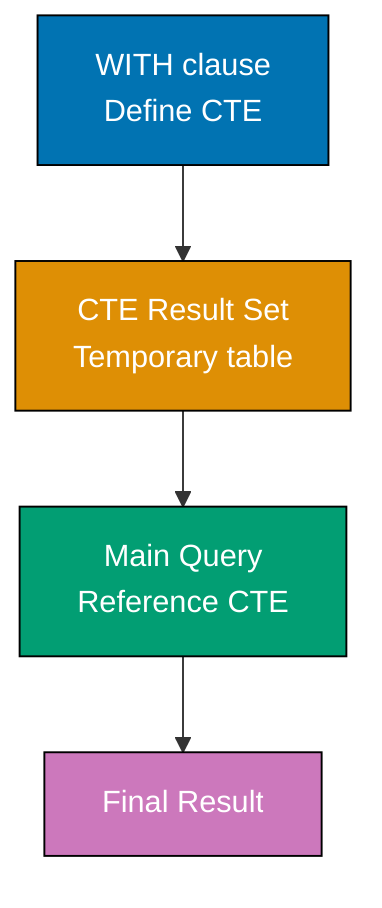
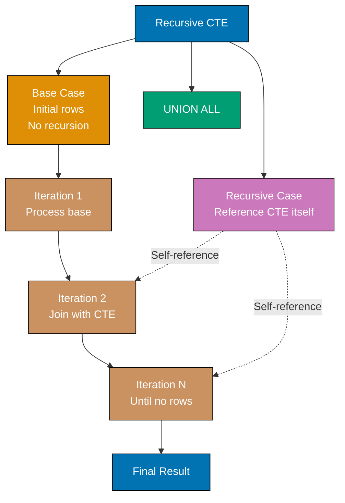
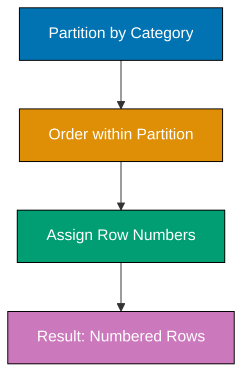
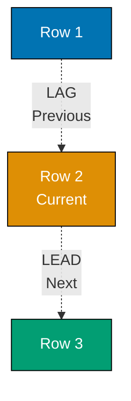
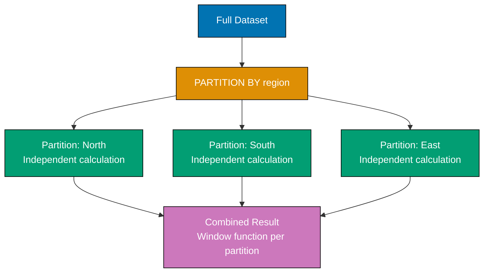
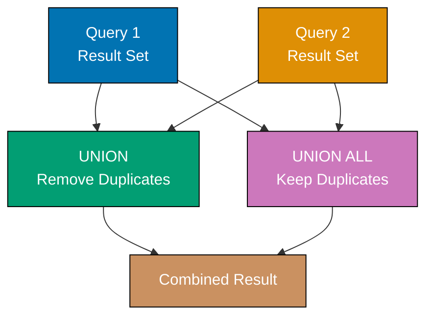
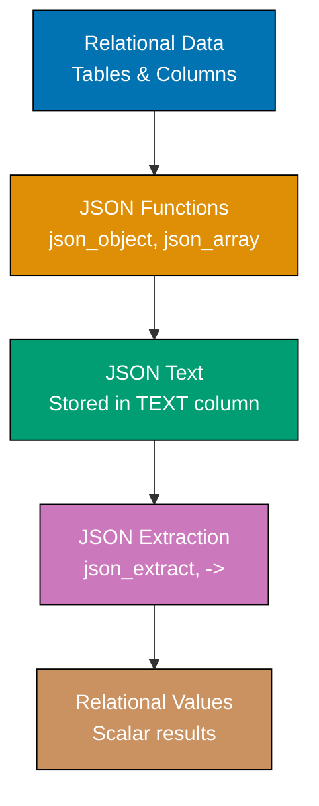
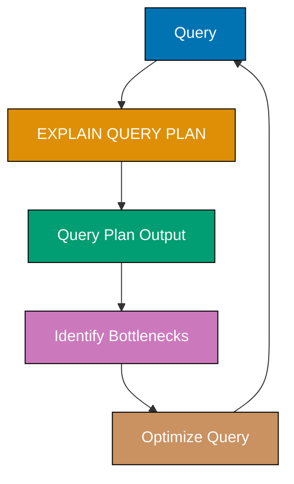

## Group 8: Common Table Expressions (CTEs)

### Example 31: Basic CTEs with WITH

Common Table Expressions (CTEs) create temporary named result sets that exist only for the duration of a query. They improve readability and enable recursive queries.



**Code**:

```sql
CREATE TABLE sales (
    id INTEGER,
    product TEXT,
    amount REAL,
    sale_date TEXT
);

INSERT INTO sales (id, product, amount, sale_date)
VALUES
    (1, 'Laptop', 1000, '2025-01-15'),
    (2, 'Mouse', 50, '2025-01-16'),
    (3, 'Laptop', 1200, '2025-01-17'),
    (4, 'Keyboard', 100, '2025-01-18'),
    (5, 'Mouse', 45, '2025-01-19');

-- Basic CTE: Calculate total sales per product
WITH product_totals AS (
    SELECT product, SUM(amount) AS total_sales
    FROM sales
    GROUP BY product
)
SELECT * FROM product_totals WHERE total_sales > 100;
-- => CTE creates temporary table with aggregated sales
-- => Main query filters CTE results
-- => Returns: Laptop (2200), Keyboard (100 not > 100 so excluded)

-- Multiple CTEs in single query
WITH
laptop_sales AS (
    SELECT SUM(amount) AS total FROM sales WHERE product = 'Laptop'
),
mouse_sales AS (
    SELECT SUM(amount) AS total FROM sales WHERE product = 'Mouse'
)
SELECT
    (SELECT total FROM laptop_sales) AS laptop_total,
    (SELECT total FROM mouse_sales) AS mouse_total;
-- => Returns: laptop_total=2200, mouse_total=95

-- CTE with JOIN
WITH high_value_sales AS (
    SELECT * FROM sales WHERE amount > 100
)
SELECT
    hvs.product,
    COUNT(*) AS num_high_value,
    SUM(hvs.amount) AS total_high_value
FROM high_value_sales hvs
GROUP BY hvs.product;
-- => Returns: Laptop (2 sales, 2200 total), Keyboard (1 sale, 100 total)
```

**Key Takeaway**: CTEs use WITH to define temporary named result sets. They improve query readability by breaking complex logic into named steps. CTEs exist only for the query duration and can be referenced multiple times.

### Example 32: Recursive CTEs for Hierarchical Data

Recursive CTEs call themselves to traverse hierarchical data structures like organizational charts or file systems. They have base case and recursive case.



**Code**:

```sql
CREATE TABLE employees (
    id INTEGER,
    name TEXT,
    manager_id INTEGER
);

INSERT INTO employees (id, name, manager_id)
VALUES
    (1, 'CEO Alice', NULL),
    (2, 'VP Bob', 1),
    (3, 'VP Charlie', 1),
    (4, 'Manager Diana', 2),
    (5, 'Manager Eve', 2),
    (6, 'Engineer Frank', 4),
    (7, 'Engineer Grace', 4);

-- Recursive CTE: Find all employees under CEO
WITH RECURSIVE org_chart AS (
    -- Base case: Start with CEO
    SELECT id, name, manager_id, 1 AS level
    FROM employees
    WHERE manager_id IS NULL

    UNION ALL

    -- Recursive case: Find direct reports
    SELECT e.id, e.name, e.manager_id, oc.level + 1
    FROM employees e
    INNER JOIN org_chart oc ON e.manager_id = oc.id
)
SELECT name, level FROM org_chart ORDER BY level, name;
-- => Returns:
-- => CEO Alice (level 1)
-- => VP Bob, VP Charlie (level 2)
-- => Manager Diana, Manager Eve (level 3)
-- => Engineer Frank, Engineer Grace (level 4)

-- Find all employees reporting to specific manager (direct and indirect)
WITH RECURSIVE subordinates AS (
    SELECT id, name, manager_id
    FROM employees
    WHERE id = 2  -- Start with VP Bob

    UNION ALL

    SELECT e.id, e.name, e.manager_id
    FROM employees e
    INNER JOIN subordinates s ON e.manager_id = s.id
)
SELECT name FROM subordinates WHERE id != 2;
-- => Returns: Manager Diana, Manager Eve, Engineer Frank, Engineer Grace

-- Generate number sequence using recursive CTE
WITH RECURSIVE numbers AS (
    SELECT 1 AS n
    UNION ALL
    SELECT n + 1 FROM numbers WHERE n < 10
)
SELECT * FROM numbers;
-- => Returns: 1, 2, 3, 4, 5, 6, 7, 8, 9, 10
```

**Key Takeaway**: Recursive CTEs use RECURSIVE keyword and UNION ALL to traverse hierarchical structures. Base case starts recursion, recursive case joins to previous iteration. Powerful for org charts, file trees, and graph traversal.

### Example 33: CTEs for Complex Aggregations

CTEs simplify multi-step aggregations by breaking logic into readable stages. Each CTE builds on previous results.

**Code**:

```sql
CREATE TABLE orders (
    id INTEGER,
    customer_id INTEGER,
    product TEXT,
    quantity INTEGER,
    price REAL,
    order_date TEXT
);

INSERT INTO orders (id, customer_id, product, quantity, price, order_date)
VALUES
    (1, 1, 'Laptop', 1, 1000, '2025-01-15'),
    (2, 2, 'Mouse', 2, 25, '2025-01-16'),
    (3, 1, 'Keyboard', 1, 100, '2025-01-17'),
    (4, 3, 'Monitor', 1, 300, '2025-01-18'),
    (5, 2, 'Laptop', 1, 1000, '2025-01-19');

-- Multi-stage aggregation: Find customers with above-average spending
WITH
order_totals AS (
    -- Stage 1: Calculate total per order
    SELECT
        id,
        customer_id,
        quantity * price AS order_total
    FROM orders
),
customer_totals AS (
    -- Stage 2: Sum totals per customer
    SELECT
        customer_id,
        SUM(order_total) AS total_spent
    FROM order_totals
    GROUP BY customer_id
),
avg_spending AS (
    -- Stage 3: Calculate average spending
    SELECT AVG(total_spent) AS avg_total
    FROM customer_totals
)
SELECT
    ct.customer_id,
    ct.total_spent
FROM customer_totals ct, avg_spending av
WHERE ct.total_spent > av.avg_total;
-- => Customer 1: 1100 (Laptop + Keyboard)
-- => Customer 2: 1050 (2 Mouse + Laptop)
-- => Average: ~817 ((1100 + 1050 + 300) / 3)
-- => Returns: Customer 1 and 2 (above average)
```

**Key Takeaway**: Chain CTEs to break complex aggregations into logical steps. Each CTE represents one transformation stage. This improves readability and debugging compared to nested subqueries.

## Group 9: Window Functions

### Example 34: ROW_NUMBER for Sequential Numbering

ROW_NUMBER assigns sequential numbers to rows within partitions. Unlike regular aggregates, window functions preserve individual rows while computing across groups.



**Code**:

```sql
CREATE TABLE products (
    id INTEGER,
    name TEXT,
    category TEXT,
    price REAL
);

INSERT INTO products (id, name, category, price)
VALUES
    (1, 'Laptop Pro', 'Electronics', 1500),
    (2, 'Laptop Air', 'Electronics', 1200),
    (3, 'Desktop', 'Electronics', 800),
    (4, 'Office Desk', 'Furniture', 300),
    (5, 'Office Chair', 'Furniture', 200),
    (6, 'Standing Desk', 'Furniture', 500);

-- ROW_NUMBER: Number all rows
SELECT
    name,
    price,
    ROW_NUMBER() OVER (ORDER BY price DESC) AS price_rank
FROM products;
-- => Returns products numbered 1-6 by price descending
-- => Laptop Pro: 1, Laptop Air: 2, Desktop: 3, Standing Desk: 4, Office Desk: 5, Office Chair: 6

-- ROW_NUMBER with PARTITION: Number within categories
SELECT
    name,
    category,
    price,
    ROW_NUMBER() OVER (PARTITION BY category ORDER BY price DESC) AS rank_in_category
FROM products;
-- => Electronics: Laptop Pro (1), Laptop Air (2), Desktop (3)
-- => Furniture: Standing Desk (1), Office Desk (2), Office Chair (3)

-- Use ROW_NUMBER to find top N per category
WITH ranked_products AS (
    SELECT
        name,
        category,
        price,
        ROW_NUMBER() OVER (PARTITION BY category ORDER BY price DESC) AS rank
    FROM products
)
SELECT name, category, price
FROM ranked_products
WHERE rank <= 2;
-- => Returns top 2 products per category
-- => Electronics: Laptop Pro, Laptop Air
-- => Furniture: Standing Desk, Office Desk
```

**Key Takeaway**: ROW_NUMBER assigns unique sequential numbers to rows. PARTITION BY creates separate numbering for each group. Use with CTE to filter top N per category - a pattern impossible with GROUP BY alone.

### Example 35: RANK and DENSE_RANK for Ranking

RANK and DENSE_RANK handle ties differently. RANK skips numbers after ties, DENSE_RANK doesn't. Use RANK for traditional sports rankings.

**Code**:

```sql
CREATE TABLE exam_scores (
    id INTEGER,
    student TEXT,
    score INTEGER
);

INSERT INTO exam_scores (id, student, score)
VALUES
    (1, 'Alice', 95),
    (2, 'Bob', 90),
    (3, 'Charlie', 90),
    (4, 'Diana', 85),
    (5, 'Eve', 80);

-- Compare ROW_NUMBER, RANK, and DENSE_RANK
SELECT
    student,
    score,
    ROW_NUMBER() OVER (ORDER BY score DESC) AS row_num,
    RANK() OVER (ORDER BY score DESC) AS rank,
    DENSE_RANK() OVER (ORDER BY score DESC) AS dense_rank
FROM exam_scores;
-- => Returns:
-- => Alice: row_num=1, rank=1, dense_rank=1 (score 95)
-- => Bob: row_num=2, rank=2, dense_rank=2 (score 90)
-- => Charlie: row_num=3, rank=2, dense_rank=2 (score 90, tied with Bob)
-- => Diana: row_num=4, rank=4, dense_rank=3 (score 85, RANK skips 3)
-- => Eve: row_num=5, rank=5, dense_rank=4 (score 80)

-- Use RANK to find students in top 3 ranks
WITH ranked_students AS (
    SELECT
        student,
        score,
        RANK() OVER (ORDER BY score DESC) AS rank
    FROM exam_scores
)
SELECT student, score, rank
FROM ranked_students
WHERE rank <= 3;
-- => Returns: Alice (1), Bob (2), Charlie (2)
-- => Diana excluded even though row_num=4 because rank=4

-- DENSE_RANK for continuous rankings
SELECT
    student,
    score,
    DENSE_RANK() OVER (ORDER BY score DESC) AS rank
FROM exam_scores;
-- => Ranks: 1, 2, 2, 3, 4 (no gaps)
```

**Key Takeaway**: RANK assigns same rank to ties and skips subsequent numbers. DENSE_RANK assigns same rank to ties but continues sequentially. ROW_NUMBER always unique. Choose based on business rules: sports use RANK, leaderboards often use DENSE_RANK.

### Example 36: LAG and LEAD for Accessing Adjacent Rows

LAG accesses previous row values, LEAD accesses next row values. Useful for comparing consecutive rows (day-over-day changes, before/after states).



**Code**:

```sql
CREATE TABLE stock_prices (
    id INTEGER,
    date TEXT,
    price REAL
);

INSERT INTO stock_prices (id, date, price)
VALUES
    (1, '2025-01-15', 100.00),
    (2, '2025-01-16', 105.00),
    (3, '2025-01-17', 103.00),
    (4, '2025-01-18', 108.00),
    (5, '2025-01-19', 107.00);

-- LAG: Compare with previous day
SELECT
    date,
    price,
    LAG(price) OVER (ORDER BY date) AS prev_price,
    price - LAG(price) OVER (ORDER BY date) AS daily_change
FROM stock_prices;
-- => Returns:
-- => 2025-01-15: price=100.00, prev_price=NULL, daily_change=NULL
-- => 2025-01-16: price=105.00, prev_price=100.00, daily_change=5.00
-- => 2025-01-17: price=103.00, prev_price=105.00, daily_change=-2.00
-- => 2025-01-18: price=108.00, prev_price=103.00, daily_change=5.00
-- => 2025-01-19: price=107.00, prev_price=108.00, daily_change=-1.00

-- LEAD: Compare with next day
SELECT
    date,
    price,
    LEAD(price) OVER (ORDER BY date) AS next_price,
    LEAD(price) OVER (ORDER BY date) - price AS next_day_change
FROM stock_prices;
-- => First row shows change to next day, last row shows NULL

-- LAG with default value (avoid NULL for first row)
SELECT
    date,
    price,
    LAG(price, 1, 0) OVER (ORDER BY date) AS prev_price
FROM stock_prices;
-- => 2025-01-15: prev_price=0 (default instead of NULL)

-- LAG with offset > 1 (compare with 2 days ago)
SELECT
    date,
    price,
    LAG(price, 2) OVER (ORDER BY date) AS two_days_ago,
    price - LAG(price, 2) OVER (ORDER BY date) AS change_vs_two_days
FROM stock_prices;
-- => 2025-01-17: two_days_ago=100.00, change_vs_two_days=3.00
```

**Key Takeaway**: LAG(column, offset, default) accesses previous row value, LEAD accesses next row. Default offset is 1. Use for time-series analysis, calculating changes, or comparing consecutive events.

### Example 37: SUM, AVG, MIN, MAX as Window Functions

Aggregate functions become window functions when used with OVER. They compute running totals, moving averages, and cumulative statistics without collapsing rows.

**Code**:

```sql
CREATE TABLE monthly_revenue (
    id INTEGER,
    month TEXT,
    revenue REAL
);

INSERT INTO monthly_revenue (id, month, revenue)
VALUES
    (1, '2025-01', 10000),
    (2, '2025-02', 12000),
    (3, '2025-03', 11000),
    (4, '2025-04', 15000),
    (5, '2025-05', 13000);

-- Running total (cumulative sum)
SELECT
    month,
    revenue,
    SUM(revenue) OVER (ORDER BY month) AS cumulative_revenue
FROM monthly_revenue;
-- => Returns:
-- => 2025-01: revenue=10000, cumulative=10000
-- => 2025-02: revenue=12000, cumulative=22000 (10000+12000)
-- => 2025-03: revenue=11000, cumulative=33000
-- => 2025-04: revenue=15000, cumulative=48000
-- => 2025-05: revenue=13000, cumulative=61000

-- Moving average (3-month window)
SELECT
    month,
    revenue,
    AVG(revenue) OVER (
        ORDER BY month
        ROWS BETWEEN 2 PRECEDING AND CURRENT ROW
    ) AS moving_avg_3month
FROM monthly_revenue;
-- => 2025-01: moving_avg=10000 (only 1 row)
-- => 2025-02: moving_avg=11000 ((10000+12000)/2)
-- => 2025-03: moving_avg=11000 ((10000+12000+11000)/3)
-- => 2025-04: moving_avg=12667 ((12000+11000+15000)/3)
-- => 2025-05: moving_avg=13000 ((11000+15000+13000)/3)

-- Running min/max
SELECT
    month,
    revenue,
    MIN(revenue) OVER (ORDER BY month) AS min_so_far,
    MAX(revenue) OVER (ORDER BY month) AS max_so_far
FROM monthly_revenue;
-- => 2025-01: min=10000, max=10000
-- => 2025-02: min=10000, max=12000
-- => 2025-03: min=10000, max=12000
-- => 2025-04: min=10000, max=15000 (new maximum)
-- => 2025-05: min=10000, max=15000

-- Percentage of total (window aggregate without ORDER)
SELECT
    month,
    revenue,
    SUM(revenue) OVER () AS total_revenue,
    ROUND(revenue * 100.0 / SUM(revenue) OVER (), 2) AS pct_of_total
FROM monthly_revenue;
-- => Total: 61000
-- => Each row shows its percentage: 16.39%, 19.67%, 18.03%, 24.59%, 21.31%
```

**Key Takeaway**: Window aggregates preserve individual rows while computing across groups. Use ROWS BETWEEN for moving windows. Empty OVER() computes across all rows. Running totals and moving averages are common patterns.

### Example 38: PARTITION BY with Window Functions

PARTITION BY divides data into independent groups for window function computation. Each partition gets its own running totals, rankings, etc.



**Code**:

```sql
CREATE TABLE sales_by_region (
    id INTEGER,
    region TEXT,
    month TEXT,
    revenue REAL
);

INSERT INTO sales_by_region (id, region, month, revenue)
VALUES
    (1, 'North', '2025-01', 10000),
    (2, 'North', '2025-02', 12000),
    (3, 'North', '2025-03', 11000),
    (4, 'South', '2025-01', 8000),
    (5, 'South', '2025-02', 9000),
    (6, 'South', '2025-03', 10000);

-- Running total per region
SELECT
    region,
    month,
    revenue,
    SUM(revenue) OVER (
        PARTITION BY region
        ORDER BY month
    ) AS cumulative_revenue
FROM sales_by_region
ORDER BY region, month;
-- => North: 10000, 22000, 33000 (separate running total)
-- => South: 8000, 17000, 27000 (separate running total, resets for South)

-- Rank within each region
SELECT
    region,
    month,
    revenue,
    RANK() OVER (
        PARTITION BY region
        ORDER BY revenue DESC
    ) AS rank_in_region
FROM sales_by_region;
-- => North: February (1), March (2), January (3)
-- => South: March (1), February (2), January (3)

-- Compare to region average
SELECT
    region,
    month,
    revenue,
    AVG(revenue) OVER (PARTITION BY region) AS region_avg,
    revenue - AVG(revenue) OVER (PARTITION BY region) AS vs_avg
FROM sales_by_region;
-- => North avg: 11000
-- =>   January: revenue=10000, vs_avg=-1000
-- =>   February: revenue=12000, vs_avg=1000
-- =>   March: revenue=11000, vs_avg=0
-- => South avg: 9000
-- =>   January: revenue=8000, vs_avg=-1000
-- =>   February: revenue=9000, vs_avg=0
-- =>   March: revenue=10000, vs_avg=1000
```

**Key Takeaway**: PARTITION BY creates independent groups for window functions. Running totals, rankings, and averages reset for each partition. Combine with ORDER BY for per-group sequential operations.

## Group 10: String and Date Functions

### Example 39: String Manipulation (SUBSTR, REPLACE, TRIM)

String functions extract substrings, replace text, remove whitespace, and transform case. Essential for data cleaning and formatting.

**Code**:

```sql
CREATE TABLE user_data (
    id INTEGER,
    email TEXT,
    phone TEXT,
    bio TEXT
);

INSERT INTO user_data (id, email, phone, bio)
VALUES
    (1, 'ALICE@EXAMPLE.COM', '  555-1234  ', 'Software Engineer with 10 years experience'),
    (2, 'bob@test.org', '555-5678', 'Data Scientist focused on ML');

-- Extract substring
SELECT
    email,
    SUBSTR(email, 1, INSTR(email, '@') - 1) AS username,
    SUBSTR(email, INSTR(email, '@') + 1) AS domain
FROM user_data;
-- => alice@example.com: username='ALICE', domain='EXAMPLE.COM'
-- => bob@test.org: username='bob', domain='test.org'

-- Case conversion
SELECT
    email,
    LOWER(email) AS lowercase,
    UPPER(email) AS uppercase
FROM user_data;
-- => ALICE@EXAMPLE.COM: lowercase='alice@example.com', uppercase='ALICE@EXAMPLE.COM'

-- Trim whitespace
SELECT
    phone,
    TRIM(phone) AS trimmed,
    LENGTH(phone) AS original_length,
    LENGTH(TRIM(phone)) AS trimmed_length
FROM user_data;
-- => '  555-1234  ': trimmed='555-1234', original_length=12, trimmed_length=8

-- Replace text
SELECT
    phone,
    REPLACE(phone, '-', '') AS digits_only
FROM user_data;
-- => '555-1234': digits_only='5551234'

-- Multiple string operations combined
SELECT
    email,
    LOWER(TRIM(email)) AS normalized_email,
    REPLACE(REPLACE(phone, '-', ''), ' ', '') AS clean_phone
FROM user_data;
-- => Normalizes email to lowercase, removes spaces from phone

-- Extract first N characters
SELECT
    bio,
    SUBSTR(bio, 1, 50) || '...' AS preview
FROM user_data;
-- => 'Software Engineer with 10 years experience': preview='Software Engineer with 10 years experience' (under 50 chars)
```

**Key Takeaway**: Use SUBSTR for extraction, REPLACE for text substitution, TRIM for whitespace removal, UPPER/LOWER for case conversion. Combine multiple functions for data normalization and cleaning.

### Example 40: Date Arithmetic and Formatting

Date functions enable date calculations, formatting, and extraction of date components. SQLite stores dates as TEXT, REAL, or INTEGER.

**Code**:

```sql
CREATE TABLE events (
    id INTEGER,
    name TEXT,
    event_date TEXT,
    event_time TEXT
);

INSERT INTO events (id, name, event_date, event_time)
VALUES
    (1, 'Conference', '2025-06-15', '09:00:00'),
    (2, 'Workshop', '2025-07-20', '14:30:00'),
    (3, 'Seminar', '2025-08-10', '10:00:00');

-- Current date/time
SELECT
    date('now') AS today,
    time('now') AS current_time,
    datetime('now') AS current_datetime;
-- => today='2025-12-29', current_time='02:07:25', current_datetime='2025-12-29 02:07:25'

-- Date arithmetic
SELECT
    name,
    event_date,
    date(event_date, '+7 days') AS one_week_later,
    date(event_date, '-1 month') AS one_month_earlier,
    date(event_date, '+1 year') AS next_year
FROM events;
-- => Conference: one_week_later='2025-06-22', one_month_earlier='2025-05-15', next_year='2026-06-15'

-- Extract date components
SELECT
    name,
    event_date,
    STRFTIME('%Y', event_date) AS year,
    STRFTIME('%m', event_date) AS month,
    STRFTIME('%d', event_date) AS day,
    STRFTIME('%w', event_date) AS day_of_week
FROM events;
-- => Conference: year='2025', month='06', day='15', day_of_week='0' (Sunday)
-- => %w: 0=Sunday, 1=Monday, etc.

-- Calculate days between dates
SELECT
    name,
    event_date,
    CAST(JULIANDAY(event_date) - JULIANDAY('2025-01-01') AS INTEGER) AS days_from_new_year
FROM events;
-- => Conference: ~165 days from January 1

-- Format dates
SELECT
    name,
    STRFTIME('%d/%m/%Y', event_date) AS formatted_date,
    STRFTIME('%Y-%m-%d %H:%M:%S', event_date || ' ' || event_time) AS full_datetime
FROM events;
-- => Conference: formatted_date='15/06/2025', full_datetime='2025-06-15 09:00:00'

-- Find events in next 60 days
SELECT name, event_date
FROM events
WHERE JULIANDAY(event_date) - JULIANDAY('now') BETWEEN 0 AND 60;
-- => Returns events within 60 days from today
```

**Key Takeaway**: Use date() for date arithmetic (+/- days/months/years), STRFTIME for formatting and component extraction, JULIANDAY for date differences. Store dates as TEXT in ISO8601 format (YYYY-MM-DD) for consistency.

### Example 41: COALESCE and NULLIF for NULL Handling

COALESCE returns first non-NULL value from a list. NULLIF returns NULL if two values are equal, otherwise returns first value.

**Code**:

```sql
CREATE TABLE products (
    id INTEGER,
    name TEXT,
    list_price REAL,
    sale_price REAL,
    stock INTEGER
);

INSERT INTO products (id, name, list_price, sale_price, stock)
VALUES
    (1, 'Laptop', 1000, 800, 5),
    (2, 'Mouse', 50, NULL, 0),
    (3, 'Keyboard', 100, NULL, 10),
    (4, 'Monitor', 300, 250, NULL);

-- COALESCE: Use sale price if available, otherwise list price
SELECT
    name,
    list_price,
    sale_price,
    COALESCE(sale_price, list_price) AS effective_price
FROM products;
-- => Laptop: effective_price=800 (has sale_price)
-- => Mouse: effective_price=50 (NULL sale_price, uses list_price)
-- => Keyboard: effective_price=100
-- => Monitor: effective_price=250

-- COALESCE with multiple fallbacks
SELECT
    name,
    stock,
    COALESCE(stock, 0) AS stock_display,
    COALESCE(sale_price, list_price, 0) AS price_display
FROM products;
-- => Monitor: stock_display=0 (NULL -> 0)

-- NULLIF: Return NULL if values match
SELECT
    name,
    stock,
    NULLIF(stock, 0) AS non_zero_stock
FROM products;
-- => Mouse: non_zero_stock=NULL (stock=0, converted to NULL)
-- => Laptop: non_zero_stock=5 (stock != 0)

-- NULLIF to avoid division by zero
SELECT
    name,
    sale_price,
    list_price,
    ROUND((list_price - COALESCE(sale_price, list_price)) * 100.0 /
          NULLIF(list_price, 0), 2) AS discount_pct
FROM products;
-- => Laptop: discount_pct=20.00 ((1000-800)*100/1000)
-- => Mouse: discount_pct=0.00 (no sale price)

-- Combine COALESCE and NULLIF
SELECT
    name,
    COALESCE(NULLIF(sale_price, list_price), list_price) AS final_price
FROM products;
-- => Returns sale_price unless it equals list_price, then uses list_price
```

**Key Takeaway**: COALESCE provides default values for NULL columns. NULLIF converts specific values to NULL (useful for avoiding division by zero or treating zero as missing). Combine both for sophisticated NULL handling logic.

## Group 11: Set Operations

### Example 42: UNION and UNION ALL

UNION combines results from multiple queries, removing duplicates. UNION ALL keeps duplicates. Both require matching column counts and compatible types.



**Code**:

```sql
CREATE TABLE customers_2024 (
    id INTEGER,
    name TEXT,
    email TEXT
);

CREATE TABLE customers_2025 (
    id INTEGER,
    name TEXT,
    email TEXT
);

INSERT INTO customers_2024 (id, name, email)
VALUES
    (1, 'Alice', 'alice@example.com'),
    (2, 'Bob', 'bob@example.com');

INSERT INTO customers_2025 (id, name, email)
VALUES
    (2, 'Bob', 'bob@example.com'),  -- Duplicate
    (3, 'Charlie', 'charlie@example.com');

-- UNION: Combine and remove duplicates
SELECT name, email FROM customers_2024
UNION
SELECT name, email FROM customers_2025;
-- => Returns 3 rows: Alice, Bob (once), Charlie

-- UNION ALL: Combine and keep duplicates
SELECT name, email FROM customers_2024
UNION ALL
SELECT name, email FROM customers_2025;
-- => Returns 4 rows: Alice, Bob (twice), Charlie

-- UNION with ORDER BY (applies to combined result)
SELECT name, 'Old' AS customer_type FROM customers_2024
UNION
SELECT name, 'New' AS customer_type FROM customers_2025
ORDER BY name;
-- => Returns: Alice (Old), Bob (appears twice if using UNION ALL), Charlie (New)

-- UNION with different literal values
SELECT id, name, '2024' AS year FROM customers_2024
UNION ALL
SELECT id, name, '2025' AS year FROM customers_2025
ORDER BY year, name;
-- => Combines with year indicator, keeps duplicates

-- Find customers in both tables (intersection using INNER JOIN)
SELECT c1.name, c1.email
FROM customers_2024 c1
INNER JOIN customers_2025 c2 ON c1.email = c2.email;
-- => Returns: Bob (appears in both tables)
```

**Key Takeaway**: UNION removes duplicates (slower), UNION ALL keeps duplicates (faster). Both require same number of columns with compatible types. Use UNION for set operations, UNION ALL for combining datasets.

### Example 43: INTERSECT and EXCEPT

INTERSECT returns rows present in both queries. EXCEPT returns rows in first query but not in second. Both remove duplicates automatically.

**Code**:

```sql
CREATE TABLE products_store_a (
    product_id INTEGER,
    name TEXT
);

CREATE TABLE products_store_b (
    product_id INTEGER,
    name TEXT
);

INSERT INTO products_store_a (product_id, name)
VALUES
    (1, 'Laptop'),
    (2, 'Mouse'),
    (3, 'Keyboard');

INSERT INTO products_store_b (product_id, name)
VALUES
    (2, 'Mouse'),
    (3, 'Keyboard'),
    (4, 'Monitor');

-- INTERSECT: Products in both stores
SELECT name FROM products_store_a
INTERSECT
SELECT name FROM products_store_b;
-- => Returns: Mouse, Keyboard (present in both)

-- EXCEPT: Products only in Store A
SELECT name FROM products_store_a
EXCEPT
SELECT name FROM products_store_b;
-- => Returns: Laptop (only in Store A)

-- EXCEPT: Products only in Store B
SELECT name FROM products_store_b
EXCEPT
SELECT name FROM products_store_a;
-- => Returns: Monitor (only in Store B)

-- Combine set operations
SELECT name FROM products_store_a
UNION
SELECT name FROM products_store_b
EXCEPT
SELECT name FROM (
    SELECT name FROM products_store_a
    INTERSECT
    SELECT name FROM products_store_b
);
-- => Returns products in exactly one store (Laptop, Monitor)
-- => Equivalent to symmetric difference

-- Use with aggregation
SELECT 'Only in Store A' AS category, COUNT(*) AS count
FROM (
    SELECT name FROM products_store_a
    EXCEPT
    SELECT name FROM products_store_b
)
UNION ALL
SELECT 'Only in Store B', COUNT(*)
FROM (
    SELECT name FROM products_store_b
    EXCEPT
    SELECT name FROM products_store_a
)
UNION ALL
SELECT 'In Both Stores', COUNT(*)
FROM (
    SELECT name FROM products_store_a
    INTERSECT
    SELECT name FROM products_store_b
);
-- => Returns summary: Only in A (1), Only in B (1), In Both (2)
```

**Key Takeaway**: INTERSECT finds common rows between queries. EXCEPT finds rows in first query not in second. Order matters for EXCEPT (A EXCEPT B ≠ B EXCEPT A). All set operations remove duplicates.

## Group 12: Subqueries

### Example 44: Correlated Subqueries

Correlated subqueries reference columns from outer query. They execute once per outer row. Useful for row-by-row comparisons against aggregates.

**Code**:

```sql
CREATE TABLE employees (
    id INTEGER,
    name TEXT,
    department TEXT,
    salary REAL
);

INSERT INTO employees (id, name, department, salary)
VALUES
    (1, 'Alice', 'Engineering', 120000),
    (2, 'Bob', 'Engineering', 90000),
    (3, 'Charlie', 'Sales', 80000),
    (4, 'Diana', 'Sales', 95000),
    (5, 'Eve', 'Engineering', 85000);

-- Find employees earning more than their department average
SELECT
    name,
    department,
    salary
FROM employees e1
WHERE salary > (
    SELECT AVG(salary)
    FROM employees e2
    WHERE e2.department = e1.department
);
-- => Subquery executes per row, comparing to department average
-- => Returns: Alice (120000 > 98333 Engineering avg), Diana (95000 > 87500 Sales avg)

-- Find highest-paid employee per department
SELECT
    name,
    department,
    salary
FROM employees e1
WHERE salary = (
    SELECT MAX(salary)
    FROM employees e2
    WHERE e2.department = e1.department
);
-- => Returns: Alice (Engineering), Diana (Sales)

-- Count employees in same department
SELECT
    name,
    department,
    (SELECT COUNT(*) FROM employees e2 WHERE e2.department = e1.department) AS dept_size
FROM employees e1;
-- => Alice: dept_size=3 (Engineering has 3 employees)
-- => Bob: dept_size=3
-- => Charlie: dept_size=2 (Sales has 2 employees)

-- EXISTS with correlated subquery
SELECT
    name,
    department
FROM employees e1
WHERE EXISTS (
    SELECT 1
    FROM employees e2
    WHERE e2.department = e1.department
      AND e2.salary > e1.salary
);
-- => Returns employees with at least one colleague earning more in same department
-- => Bob, Eve (Alice earns more in Engineering), Charlie (Diana earns more in Sales)
```

**Key Takeaway**: Correlated subqueries reference outer query columns and execute once per outer row. Use for row-specific comparisons against group aggregates. EXISTS often more efficient than IN for correlated lookups.

### Example 45: Scalar Subqueries in SELECT

Scalar subqueries return single values and can appear in SELECT clauses. They add computed columns based on related data.

**Code**:

```sql
CREATE TABLE orders (
    id INTEGER,
    customer_id INTEGER,
    order_date TEXT,
    total REAL
);

CREATE TABLE customers (
    id INTEGER,
    name TEXT,
    email TEXT
);

INSERT INTO customers (id, name, email)
VALUES (1, 'Alice', 'alice@example.com'), (2, 'Bob', 'bob@example.com');

INSERT INTO orders (id, customer_id, order_date, total)
VALUES
    (1, 1, '2025-01-15', 100),
    (2, 1, '2025-01-20', 150),
    (3, 2, '2025-01-18', 200);

-- Scalar subquery: Add customer name to orders
SELECT
    o.id,
    o.order_date,
    o.total,
    (SELECT name FROM customers c WHERE c.id = o.customer_id) AS customer_name
FROM orders o;
-- => Returns: order 1 (Alice), order 2 (Alice), order 3 (Bob)

-- Multiple scalar subqueries
SELECT
    o.id,
    o.total,
    (SELECT name FROM customers c WHERE c.id = o.customer_id) AS customer_name,
    (SELECT COUNT(*) FROM orders o2 WHERE o2.customer_id = o.customer_id) AS customer_order_count
FROM orders o;
-- => Alice's orders show customer_order_count=2
-- => Bob's order shows customer_order_count=1

-- Scalar subquery with aggregate
SELECT
    name,
    email,
    (SELECT COUNT(*) FROM orders o WHERE o.customer_id = c.id) AS num_orders,
    (SELECT SUM(total) FROM orders o WHERE o.customer_id = c.id) AS total_spent
FROM customers c;
-- => Alice: num_orders=2, total_spent=250
-- => Bob: num_orders=1, total_spent=200

-- COALESCE with scalar subquery (handle NULL when no orders)
SELECT
    name,
    COALESCE(
        (SELECT SUM(total) FROM orders o WHERE o.customer_id = c.id),
        0
    ) AS total_spent
FROM customers c;
-- => Returns 0 for customers with no orders instead of NULL
```

**Key Takeaway**: Scalar subqueries return single values and can appear anywhere a single value is expected. Use in SELECT to add computed columns. Must return exactly one row, one column - use LIMIT 1 or aggregates to ensure this.

### Example 46: IN and NOT IN with Subqueries

IN tests if value exists in subquery results. NOT IN tests if value doesn't exist. Useful for filtering based on membership in another query's results.

**Code**:

```sql
CREATE TABLE products (
    id INTEGER,
    name TEXT,
    category TEXT,
    price REAL
);

CREATE TABLE orders (
    id INTEGER,
    product_id INTEGER,
    quantity INTEGER
);

INSERT INTO products (id, name, category, price)
VALUES
    (1, 'Laptop', 'Electronics', 1000),
    (2, 'Mouse', 'Electronics', 50),
    (3, 'Desk', 'Furniture', 300),
    (4, 'Chair', 'Furniture', 200);

INSERT INTO orders (id, product_id, quantity)
VALUES
    (1, 1, 2),
    (2, 2, 5),
    (3, 1, 1);

-- Find products that have been ordered
SELECT name, category, price
FROM products
WHERE id IN (SELECT DISTINCT product_id FROM orders);
-- => Returns: Laptop, Mouse (have orders)

-- Find products never ordered
SELECT name, category, price
FROM products
WHERE id NOT IN (SELECT product_id FROM orders);
-- => Returns: Desk, Chair (no orders)

-- IN with multiple columns (limited support, use tuples)
CREATE TABLE product_prices (
    product_id INTEGER,
    region TEXT,
    price REAL
);

INSERT INTO product_prices (product_id, region, price)
VALUES
    (1, 'US', 1000),
    (1, 'EU', 1100),
    (2, 'US', 50);

SELECT product_id, region, price
FROM product_prices
WHERE (product_id, region) IN (
    SELECT product_id, 'US'
    FROM products
    WHERE category = 'Electronics'
);
-- => Returns US prices for Electronics products

-- NOT IN with NULL gotcha
CREATE TABLE test_values (value INTEGER);
INSERT INTO test_values VALUES (1), (2), (NULL);

SELECT 'Yes' WHERE 3 NOT IN (SELECT value FROM test_values);
-- => Returns no rows! NOT IN with NULL always returns no matches
-- => Use NOT EXISTS instead for NULL-safe exclusion
```

**Key Takeaway**: IN checks membership in subquery results. NOT IN excludes matching values. Beware: NOT IN with NULL values returns no results - use NOT EXISTS for NULL-safe exclusion. DISTINCT in subquery improves performance.

## Group 13: JSON Support

### Example 47: JSON Creation and Extraction

SQLite's JSON1 extension provides JSON creation, extraction, and manipulation functions. JSON data stored as TEXT can be queried and transformed.



**Code**:

```sql
-- Enable JSON1 extension (usually enabled by default in modern SQLite)
CREATE TABLE users (
    id INTEGER,
    name TEXT,
    metadata TEXT  -- Stores JSON data
);

INSERT INTO users (id, name, metadata)
VALUES
    (1, 'Alice', '{"age": 30, "city": "NYC", "skills": ["Python", "SQL"]}'),
    (2, 'Bob', '{"age": 25, "city": "LA", "skills": ["Java", "Go"]}');

-- Extract JSON values
SELECT
    name,
    JSON_EXTRACT(metadata, '$.age') AS age,
    JSON_EXTRACT(metadata, '$.city') AS city
FROM users;
-- => Alice: age=30, city='NYC'
-- => Bob: age=25, city='LA'

-- Extract array elements
SELECT
    name,
    JSON_EXTRACT(metadata, '$.skills[0]') AS first_skill,
    JSON_EXTRACT(metadata, '$.skills[1]') AS second_skill
FROM users;
-- => Alice: first_skill='Python', second_skill='SQL'
-- => Bob: first_skill='Java', second_skill='Go'

-- Create JSON objects
SELECT
    JSON_OBJECT(
        'name', name,
        'age', JSON_EXTRACT(metadata, '$.age'),
        'city', JSON_EXTRACT(metadata, '$.city')
    ) AS user_json
FROM users;
-- => Returns: {"name":"Alice","age":30,"city":"NYC"}

-- Create JSON arrays
SELECT
    JSON_ARRAY(
        name,
        JSON_EXTRACT(metadata, '$.age'),
        JSON_EXTRACT(metadata, '$.city')
    ) AS user_array
FROM users;
-- => Returns: ["Alice",30,"NYC"]

-- Filter by JSON field
SELECT name
FROM users
WHERE JSON_EXTRACT(metadata, '$.age') > 25;
-- => Returns: Alice (age 30 > 25)

-- Check if JSON path exists
SELECT name
FROM users
WHERE JSON_EXTRACT(metadata, '$.city') IS NOT NULL;
-- => Returns: Alice, Bob (both have city field)
```

**Key Takeaway**: Use JSON_EXTRACT to query JSON fields, JSON_OBJECT/JSON_ARRAY to create JSON. Store JSON as TEXT. Use `$.path` syntax for navigation. JSON functions enable schema-flexible data storage.

### Example 48: JSON Array Operations

JSON arrays can be queried, filtered, and transformed using JSON functions. Use JSON_EACH to unnest arrays into rows.

**Code**:

```sql
CREATE TABLE projects (
    id INTEGER,
    name TEXT,
    tags TEXT  -- JSON array
);

INSERT INTO projects (id, name, tags)
VALUES
    (1, 'Project A', '["urgent", "backend", "api"]'),
    (2, 'Project B', '["frontend", "ui", "react"]'),
    (3, 'Project C', '["backend", "database", "optimization"]');

-- Get array length
SELECT
    name,
    JSON_ARRAY_LENGTH(tags) AS num_tags
FROM projects;
-- => Project A: 3, Project B: 3, Project C: 3

-- Check if array contains value
SELECT name
FROM projects
WHERE JSON_EXTRACT(tags, '$') LIKE '%backend%';
-- => Returns: Project A, Project C (contain 'backend' tag)

-- Unnest JSON array to rows using JSON_EACH
SELECT
    p.name AS project,
    j.value AS tag
FROM projects p, JSON_EACH(p.tags) j;
-- => Returns 9 rows (3 tags per project):
-- => Project A, urgent
-- => Project A, backend
-- => Project A, api
-- => Project B, frontend
-- => ...

-- Find projects with specific tag
SELECT name
FROM projects p
WHERE EXISTS (
    SELECT 1
    FROM JSON_EACH(p.tags)
    WHERE value = 'backend'
);
-- => Returns: Project A, Project C

-- Count projects per tag
SELECT
    j.value AS tag,
    COUNT(*) AS project_count
FROM projects p, JSON_EACH(p.tags) j
GROUP BY j.value
ORDER BY project_count DESC;
-- => Returns: backend (2), urgent (1), api (1), frontend (1), ui (1), react (1), database (1), optimization (1)

-- Add element to JSON array (immutable - creates new array)
SELECT
    name,
    JSON_INSERT(tags, '$[' || JSON_ARRAY_LENGTH(tags) || ']', 'new-tag') AS updated_tags
FROM projects;
-- => Appends 'new-tag' to each array (doesn't modify table)
```

**Key Takeaway**: Use JSON_EACH to unnest arrays into rows for querying. JSON_ARRAY_LENGTH counts elements. JSON arrays are immutable - modifications create new arrays. Combine JSON_EACH with standard SQL for powerful array queries.

## Group 14: Full-Text Search

### Example 49: FTS5 Virtual Tables

FTS5 (Full-Text Search) enables fast text search across large documents. Create virtual tables with FTS5 for efficient searching, ranking, and highlighting.

**Code**:

```sql
-- Create FTS5 virtual table
CREATE VIRTUAL TABLE articles_fts USING fts5(
    title,
    content,
    author
);

-- Insert documents
INSERT INTO articles_fts (title, content, author)
VALUES
    ('Introduction to SQL', 'SQL is a powerful language for managing relational databases. It supports queries, updates, and schema design.', 'Alice'),
    ('Advanced SQL Techniques', 'Window functions and CTEs enable complex analytical queries in SQL. These features are essential for data analysis.', 'Bob'),
    ('Database Design Principles', 'Good database design ensures data integrity, performance, and scalability. Normalization reduces redundancy.', 'Charlie');

-- Simple full-text search
SELECT title, author
FROM articles_fts
WHERE articles_fts MATCH 'SQL';
-- => Returns: 'Introduction to SQL', 'Advanced SQL Techniques'

-- Search in specific column
SELECT title, author
FROM articles_fts
WHERE articles_fts MATCH 'title:SQL';
-- => Returns only articles with 'SQL' in title

-- Phrase search (exact match)
SELECT title
FROM articles_fts
WHERE articles_fts MATCH '"database design"';
-- => Returns: 'Database Design Principles' (exact phrase match)

-- Boolean operators: AND, OR, NOT
SELECT title
FROM articles_fts
WHERE articles_fts MATCH 'SQL AND queries';
-- => Returns: 'Introduction to SQL' (contains both terms)

SELECT title
FROM articles_fts
WHERE articles_fts MATCH 'SQL NOT advanced';
-- => Returns: 'Introduction to SQL' (contains SQL but not advanced)

-- Prefix search with *
SELECT title
FROM articles_fts
WHERE articles_fts MATCH 'dat*';
-- => Returns: 'Advanced SQL Techniques' (matches 'data'), 'Database Design Principles' (matches 'database')

-- Get search result ranking
SELECT
    title,
    author,
    rank
FROM articles_fts
WHERE articles_fts MATCH 'SQL database'
ORDER BY rank;
-- => Returns results sorted by relevance (lower rank = better match)

-- Highlight matching terms (requires FTS5 snippet function)
SELECT
    title,
    snippet(articles_fts, 1, '<b>', '</b>', '...', 20) AS highlighted_content
FROM articles_fts
WHERE articles_fts MATCH 'SQL';
-- => Returns excerpts with matching terms highlighted in <b> tags
```

**Key Takeaway**: FTS5 virtual tables enable fast full-text search. Use MATCH operator with search syntax (phrases, boolean operators, prefix search). Ranking and highlighting improve search UX. Ideal for document search, article catalogs, product descriptions.

### Example 50: FTS5 Advanced Queries

FTS5 supports proximity search, column weighting, and custom tokenizers. These features enable sophisticated search applications.

**Code**:

```sql
-- Create FTS5 table with custom options
CREATE VIRTUAL TABLE documents_fts USING fts5(
    title,
    content,
    tokenize = 'porter'  -- Porter stemming (searches for 'run' match 'running')
);

INSERT INTO documents_fts (title, content)
VALUES
    ('Running Tutorial', 'Learn how to start running for beginners. Running improves health.'),
    ('Database Running', 'Database engines run queries efficiently. Performance optimization is key.'),
    ('Marathon Training', 'Training for marathons requires dedication. Runners need proper nutrition.');

-- Stemming: 'running' matches 'run', 'runners'
SELECT title
FROM documents_fts
WHERE documents_fts MATCH 'run';
-- => Returns all 3 documents (stemming matches 'running', 'run', 'runners')

-- Proximity search: NEAR(term1 term2, distance)
SELECT title, content
FROM documents_fts
WHERE documents_fts MATCH 'NEAR(database performance, 5)';
-- => Returns documents where 'database' and 'performance' appear within 5 words

-- Column weights (boost title matches)
CREATE VIRTUAL TABLE weighted_fts USING fts5(
    title,
    content
);

INSERT INTO weighted_fts (title, content)
VALUES
    ('SQL Basics', 'Introduction to databases'),
    ('Advanced Topics', 'SQL window functions and CTEs');

-- Search with implicit column boosting
SELECT
    title,
    rank
FROM weighted_fts
WHERE weighted_fts MATCH 'SQL'
ORDER BY rank;
-- => 'SQL Basics' ranks higher (SQL in title)
-- => 'Advanced Topics' ranks lower (SQL only in content)

-- Combine multiple search criteria
SELECT title
FROM documents_fts
WHERE documents_fts MATCH '(running OR marathon) AND NOT database';
-- => Returns: 'Running Tutorial', 'Marathon Training'

-- Case-insensitive search (FTS5 default)
SELECT title
FROM documents_fts
WHERE documents_fts MATCH 'RUNNING';
-- => Returns same results as 'running' (case-insensitive)
```

**Key Takeaway**: FTS5 supports stemming (porter tokenizer), proximity search (NEAR), and column weighting. Configure tokenizers for language-specific behavior. Combine boolean operators for complex queries. FTS5 is production-ready for search features.

## Group 15: Performance and Optimization

### Example 51: EXPLAIN QUERY PLAN Analysis

EXPLAIN QUERY PLAN shows how SQLite executes a query. Use it to identify table scans, verify index usage, and optimize slow queries.



**Code**:

```sql
CREATE TABLE customers (
    id INTEGER PRIMARY KEY,
    email TEXT,
    name TEXT,
    country TEXT
);

-- Insert test data
INSERT INTO customers (email, name, country)
SELECT
    'user' || value || '@example.com',
    'User ' || value,
    CASE WHEN value % 2 = 0 THEN 'USA' ELSE 'UK' END
FROM (
    WITH RECURSIVE nums AS (
        SELECT 1 AS value
        UNION ALL
        SELECT value + 1 FROM nums WHERE value < 100
    )
    SELECT value FROM nums
);

-- Query without index
EXPLAIN QUERY PLAN
SELECT * FROM customers WHERE email = 'user50@example.com';
-- => Output: SCAN TABLE customers
-- => Scans all 100 rows to find match (slow for large tables)

-- Create index on email
CREATE INDEX idx_customers_email ON customers(email);

-- Same query with index
EXPLAIN QUERY PLAN
SELECT * FROM customers WHERE email = 'user50@example.com';
-- => Output: SEARCH TABLE customers USING INDEX idx_customers_email (email=?)
-- => Uses index for fast lookup (log N time complexity)

-- Query plan for JOIN
CREATE TABLE orders (
    id INTEGER PRIMARY KEY,
    customer_id INTEGER,
    total REAL
);

INSERT INTO orders (customer_id, total)
SELECT value, value * 10.0 FROM (
    WITH RECURSIVE nums AS (
        SELECT 1 AS value UNION ALL SELECT value + 1 FROM nums WHERE value < 50
    )
    SELECT value FROM nums
);

EXPLAIN QUERY PLAN
SELECT c.name, o.total
FROM customers c
INNER JOIN orders o ON c.id = o.customer_id
WHERE c.country = 'USA';
-- => Shows scan/search strategy for both tables and join method

-- Create composite index for better performance
CREATE INDEX idx_customers_country_id ON customers(country, id);

EXPLAIN QUERY PLAN
SELECT c.name, o.total
FROM customers c
INNER JOIN orders o ON c.id = o.customer_id
WHERE c.country = 'USA';
-- => Now uses composite index for faster country filtering
```

**Key Takeaway**: EXPLAIN QUERY PLAN reveals query execution strategy. Look for SCAN (slow, checks every row) vs SEARCH (fast, uses index). Create indexes on columns used in WHERE, JOIN, and ORDER BY to convert scans to searches.

### Example 52: Covering Indexes

Covering indexes include all columns needed by a query, eliminating the need to access the table. This reduces I/O and improves performance.

**Code**:

```sql
CREATE TABLE products (
    id INTEGER PRIMARY KEY,
    name TEXT,
    category TEXT,
    price REAL,
    stock INTEGER,
    description TEXT
);

-- Insert test data
INSERT INTO products (name, category, price, stock, description)
SELECT
    'Product ' || value,
    CASE WHEN value % 3 = 0 THEN 'Electronics'
         WHEN value % 3 = 1 THEN 'Furniture'
         ELSE 'Clothing' END,
    value * 10.0,
    value * 5,
    'Description for product ' || value
FROM (
    WITH RECURSIVE nums AS (
        SELECT 1 AS value UNION ALL SELECT value + 1 FROM nums WHERE value < 100
    )
    SELECT value FROM nums
);

-- Query selecting category and price
SELECT category, price
FROM products
WHERE category = 'Electronics';

-- Create covering index (includes all queried columns)
CREATE INDEX idx_products_covering ON products(category, price);
-- => Index contains both category (WHERE) and price (SELECT)

EXPLAIN QUERY PLAN
SELECT category, price
FROM products
WHERE category = 'Electronics';
-- => Uses covering index, doesn't need to access table
-- => Output: SEARCH TABLE products USING COVERING INDEX idx_products_covering

-- Compare to non-covering index
CREATE INDEX idx_products_category_only ON products(category);

EXPLAIN QUERY PLAN
SELECT category, price, name
FROM products
WHERE category = 'Electronics';
-- => Index doesn't include 'name', must access table
-- => Output: SEARCH TABLE products USING INDEX idx_products_category_only
-- =>         (then accesses table for 'name' column)

-- Create multi-column covering index
DROP INDEX idx_products_covering;
CREATE INDEX idx_products_category_price_name ON products(category, price, name);

EXPLAIN QUERY PLAN
SELECT category, price, name
FROM products
WHERE category = 'Electronics'
ORDER BY price;
-- => Covering index satisfies WHERE, SELECT, and ORDER BY
-- => No table access needed, maximum performance
```

**Key Takeaway**: Covering indexes include all columns used in query (WHERE, SELECT, ORDER BY). They eliminate table access, reducing I/O. Trade-off: larger index size. Use for frequently-run queries on specific column sets.

### Example 53: Partial Indexes

Partial indexes index only rows matching a condition. They reduce index size and improve performance for queries targeting specific subsets.

**Code**:

```sql
CREATE TABLE orders (
    id INTEGER PRIMARY KEY,
    customer_id INTEGER,
    status TEXT,
    total REAL,
    order_date TEXT
);

-- Insert test data
INSERT INTO orders (customer_id, status, total, order_date)
SELECT
    value % 50 + 1,
    CASE WHEN value % 10 = 0 THEN 'pending'
         WHEN value % 10 < 8 THEN 'completed'
         ELSE 'cancelled' END,
    value * 25.0,
    date('2025-01-01', '+' || value || ' days')
FROM (
    WITH RECURSIVE nums AS (
        SELECT 1 AS value UNION ALL SELECT value + 1 FROM nums WHERE value < 200
    )
    SELECT value FROM nums
);

-- Full index on status (indexes all rows)
CREATE INDEX idx_orders_status_full ON orders(status);

-- Partial index on pending orders only
CREATE INDEX idx_orders_status_pending ON orders(status) WHERE status = 'pending';
-- => Only indexes pending orders (10% of data)

-- Query for pending orders (uses partial index)
EXPLAIN QUERY PLAN
SELECT * FROM orders WHERE status = 'pending';
-- => Uses idx_orders_status_pending (smaller, faster)

-- Query for completed orders (cannot use pending-only index)
EXPLAIN QUERY PLAN
SELECT * FROM orders WHERE status = 'completed';
-- => Uses idx_orders_status_full or table scan

-- Partial index with complex condition
CREATE INDEX idx_orders_high_value_recent ON orders(customer_id, total)
WHERE total > 1000 AND order_date > date('now', '-30 days');
-- => Only indexes recent high-value orders

SELECT * FROM orders
WHERE total > 1000 AND order_date > date('now', '-30 days');
-- => Uses partial index (much smaller than full index on customer_id, total)

-- Partial index with NOT NULL condition
CREATE INDEX idx_orders_customer_nonnull ON orders(customer_id)
WHERE customer_id IS NOT NULL;
-- => Excludes NULL customer_id rows from index
```

**Key Takeaway**: Partial indexes use WHERE clause to index subset of rows. They reduce index size and improve write performance. Use for queries that consistently filter on same condition (active records, recent data, specific categories).

### Example 54: Query Optimization Techniques

Combine multiple optimization strategies to improve query performance: proper indexing, avoiding functions in WHERE, using LIMIT, and query restructuring.

**Code**:

```sql
CREATE TABLE logs (
    id INTEGER PRIMARY KEY,
    timestamp TEXT,
    level TEXT,
    message TEXT,
    user_id INTEGER
);

-- Insert test data
INSERT INTO logs (timestamp, level, message, user_id)
SELECT
    datetime('2025-01-01', '+' || value || ' hours'),
    CASE WHEN value % 10 = 0 THEN 'ERROR'
         WHEN value % 5 = 0 THEN 'WARNING'
         ELSE 'INFO' END,
    'Log message ' || value,
    value % 100 + 1
FROM (
    WITH RECURSIVE nums AS (
        SELECT 1 AS value UNION ALL SELECT value + 1 FROM nums WHERE value < 1000
    )
    SELECT value FROM nums
);

-- SLOW: Function in WHERE clause prevents index usage
SELECT * FROM logs
WHERE DATE(timestamp) = '2025-01-15';
-- => DATE() function prevents index on timestamp from being used

-- FAST: Use range comparison instead
CREATE INDEX idx_logs_timestamp ON logs(timestamp);

SELECT * FROM logs
WHERE timestamp >= '2025-01-15' AND timestamp < '2025-01-16';
-- => Uses index, much faster

-- SLOW: SELECT * retrieves unnecessary columns
SELECT * FROM logs WHERE level = 'ERROR';

-- FAST: Select only needed columns
SELECT id, timestamp, message FROM logs WHERE level = 'ERROR';
-- => Reduces data transfer, enables covering index

-- Create covering index
CREATE INDEX idx_logs_level_covering ON logs(level, id, timestamp, message);

-- SLOW: ORDER BY without index
SELECT * FROM logs
WHERE user_id = 50
ORDER BY timestamp DESC;

-- FAST: Create composite index
CREATE INDEX idx_logs_user_timestamp ON logs(user_id, timestamp DESC);
-- => Satisfies both WHERE and ORDER BY

-- Use LIMIT to reduce result set
SELECT * FROM logs
WHERE level IN ('ERROR', 'WARNING')
ORDER BY timestamp DESC
LIMIT 10;
-- => Stops after finding 10 matches (early termination)

-- SLOW: OR conditions often don't use indexes efficiently
SELECT * FROM logs WHERE user_id = 10 OR user_id = 20;

-- FAST: Use UNION for OR conditions
SELECT * FROM logs WHERE user_id = 10
UNION ALL
SELECT * FROM logs WHERE user_id = 20;
-- => Each query uses index separately

-- Avoid NOT IN with subqueries (NULL issues + performance)
SELECT * FROM logs
WHERE user_id NOT IN (SELECT user_id FROM logs WHERE level = 'ERROR');

-- Use LEFT JOIN instead
SELECT l.*
FROM logs l
LEFT JOIN (SELECT DISTINCT user_id FROM logs WHERE level = 'ERROR') e
    ON l.user_id = e.user_id
WHERE e.user_id IS NULL;
-- => More efficient and NULL-safe
```

**Key Takeaway**: Avoid functions in WHERE (prevents index usage). Select only needed columns. Use range conditions instead of functions. Create composite indexes for WHERE + ORDER BY. Use LIMIT for early termination. Replace NOT IN with LEFT JOIN for better performance.

### Example 55: Transaction Performance

Batch operations in transactions improve performance dramatically. Single transaction for multiple inserts is ~100x faster than individual commits.

**Code**:

```sql
-- Create test table
CREATE TABLE metrics (
    id INTEGER PRIMARY KEY,
    metric_name TEXT,
    value REAL,
    recorded_at TEXT
);

-- SLOW: Individual inserts (each auto-commits)
-- This would take seconds for 1000 inserts
INSERT INTO metrics (metric_name, value, recorded_at)
VALUES ('cpu_usage', 45.2, datetime('now'));
INSERT INTO metrics (metric_name, value, recorded_at)
VALUES ('memory_usage', 78.5, datetime('now'));
-- ... 998 more individual inserts ...

-- FAST: Batch inserts in single transaction
BEGIN TRANSACTION;

INSERT INTO metrics (metric_name, value, recorded_at)
SELECT
    'cpu_usage',
    RANDOM() % 100,
    datetime('2025-01-01', '+' || value || ' minutes')
FROM (
    WITH RECURSIVE nums AS (
        SELECT 1 AS value UNION ALL SELECT value + 1 FROM nums WHERE value < 1000
    )
    SELECT value FROM nums
);

COMMIT;
-- => 1000 inserts in milliseconds instead of seconds

-- FAST: Multi-row INSERT
BEGIN TRANSACTION;

INSERT INTO metrics (metric_name, value, recorded_at)
VALUES
    ('cpu_usage', 45.2, datetime('now')),
    ('memory_usage', 78.5, datetime('now')),
    ('disk_io', 120.3, datetime('now')),
    ('network_rx', 950.7, datetime('now'));
-- ... more rows ...

COMMIT;
-- => Faster than individual inserts

-- Batch updates in transaction
BEGIN TRANSACTION;

UPDATE metrics SET value = value * 1.1 WHERE metric_name = 'cpu_usage';
UPDATE metrics SET value = value * 0.9 WHERE metric_name = 'memory_usage';
DELETE FROM metrics WHERE recorded_at < datetime('now', '-30 days');

COMMIT;
-- => All changes atomic and fast

-- Use PRAGMA for even better insert performance
PRAGMA synchronous = OFF;     -- Faster but risky (disable for benchmarks only)
PRAGMA journal_mode = WAL;    -- Write-Ahead Logging (safe and fast)
PRAGMA cache_size = -64000;   -- 64MB cache

BEGIN TRANSACTION;
-- ... bulk inserts ...
COMMIT;

-- Restore safe settings
PRAGMA synchronous = FULL;
```

**Key Takeaway**: Wrap bulk operations in transactions for dramatic performance improvement. Single transaction commits once instead of per-statement. Use multi-row INSERT for batches. Consider PRAGMA settings for production optimization but test carefully.

## Group 16: Advanced Patterns

### Example 56: Pivoting Data with CASE

Pivoting transforms rows into columns using CASE expressions and GROUP BY. Common for reports showing data in matrix format.

**Code**:

```sql
CREATE TABLE sales (
    id INTEGER,
    product TEXT,
    quarter TEXT,
    revenue REAL
);

INSERT INTO sales (id, product, quarter, revenue)
VALUES
    (1, 'Widget A', 'Q1', 10000),
    (2, 'Widget A', 'Q2', 12000),
    (3, 'Widget A', 'Q3', 11000),
    (4, 'Widget A', 'Q4', 15000),
    (5, 'Widget B', 'Q1', 8000),
    (6, 'Widget B', 'Q2', 9000),
    (7, 'Widget B', 'Q3', 10000),
    (8, 'Widget B', 'Q4', 11000);

-- Pivot: Quarters as columns
SELECT
    product,
    SUM(CASE WHEN quarter = 'Q1' THEN revenue ELSE 0 END) AS Q1,
    SUM(CASE WHEN quarter = 'Q2' THEN revenue ELSE 0 END) AS Q2,
    SUM(CASE WHEN quarter = 'Q3' THEN revenue ELSE 0 END) AS Q3,
    SUM(CASE WHEN quarter = 'Q4' THEN revenue ELSE 0 END) AS Q4,
    SUM(revenue) AS total
FROM sales
GROUP BY product;
-- => Returns:
-- => Widget A: Q1=10000, Q2=12000, Q3=11000, Q4=15000, total=48000
-- => Widget B: Q1=8000, Q2=9000, Q3=10000, Q4=11000, total=38000

-- Pivot with averages
SELECT
    product,
    AVG(CASE WHEN quarter IN ('Q1', 'Q2') THEN revenue END) AS H1_avg,
    AVG(CASE WHEN quarter IN ('Q3', 'Q4') THEN revenue END) AS H2_avg
FROM sales
GROUP BY product;
-- => Widget A: H1_avg=11000, H2_avg=13000 (half-year averages)

-- Count pivot
CREATE TABLE survey_responses (
    id INTEGER,
    question TEXT,
    answer TEXT
);

INSERT INTO survey_responses VALUES
    (1, 'Satisfaction', 'High'),
    (2, 'Satisfaction', 'Medium'),
    (3, 'Satisfaction', 'High'),
    (4, 'Recommendation', 'Yes'),
    (5, 'Recommendation', 'No'),
    (6, 'Recommendation', 'Yes');

SELECT
    question,
    COUNT(CASE WHEN answer = 'High' THEN 1 END) AS high,
    COUNT(CASE WHEN answer = 'Medium' THEN 1 END) AS medium,
    COUNT(CASE WHEN answer = 'Yes' THEN 1 END) AS yes,
    COUNT(CASE WHEN answer = 'No' THEN 1 END) AS no
FROM survey_responses
GROUP BY question;
-- => Satisfaction: high=2, medium=1, yes=0, no=0
-- => Recommendation: high=0, medium=0, yes=2, no=1
```

**Key Takeaway**: Use CASE with aggregate functions to pivot rows to columns. Each CASE WHEN becomes a column. GROUP BY determines rows. Common for reports, crosstabs, and matrix displays.

### Example 57: Running Totals and Moving Averages

Window functions with frame specifications compute running totals and moving averages - essential for time-series analysis and trending.

**Code**:

```sql
CREATE TABLE daily_sales (
    id INTEGER,
    sale_date TEXT,
    amount REAL
);

INSERT INTO daily_sales (id, sale_date, amount)
SELECT
    value,
    date('2025-01-01', '+' || (value - 1) || ' days'),
    100 + (value * 10) + (value % 7) * 20
FROM (
    WITH RECURSIVE nums AS (
        SELECT 1 AS value UNION ALL SELECT value + 1 FROM nums WHERE value < 30
    )
    SELECT value FROM nums
);

-- Running total (cumulative sum)
SELECT
    sale_date,
    amount,
    SUM(amount) OVER (ORDER BY sale_date) AS running_total
FROM daily_sales
ORDER BY sale_date;
-- => Each row shows cumulative sum up to that date

-- 7-day moving average
SELECT
    sale_date,
    amount,
    ROUND(AVG(amount) OVER (
        ORDER BY sale_date
        ROWS BETWEEN 6 PRECEDING AND CURRENT ROW
    ), 2) AS moving_avg_7day
FROM daily_sales
ORDER BY sale_date;
-- => Each row shows average of current + previous 6 days

-- Running min/max
SELECT
    sale_date,
    amount,
    MIN(amount) OVER (ORDER BY sale_date) AS min_so_far,
    MAX(amount) OVER (ORDER BY sale_date) AS max_so_far
FROM daily_sales
ORDER BY sale_date;
-- => Track record lows and highs over time

-- Calculate day-over-day change
SELECT
    sale_date,
    amount,
    LAG(amount) OVER (ORDER BY sale_date) AS prev_day,
    amount - LAG(amount) OVER (ORDER BY sale_date) AS daily_change,
    ROUND(
        100.0 * (amount - LAG(amount) OVER (ORDER BY sale_date)) /
        NULLIF(LAG(amount) OVER (ORDER BY sale_date), 0),
        2
    ) AS pct_change
FROM daily_sales
ORDER BY sale_date;
-- => Shows absolute and percentage change vs previous day

-- Centered moving average (3-day: previous, current, next)
SELECT
    sale_date,
    amount,
    ROUND(AVG(amount) OVER (
        ORDER BY sale_date
        ROWS BETWEEN 1 PRECEDING AND 1 FOLLOWING
    ), 2) AS centered_avg_3day
FROM daily_sales
ORDER BY sale_date;
-- => Smooths data using centered window
```

**Key Takeaway**: Use window functions with ROWS BETWEEN for running calculations. `ROWS BETWEEN n PRECEDING AND CURRENT ROW` creates moving windows. Common patterns: running totals (cumulative SUM), moving averages (AVG with window), day-over-day changes (LAG).

### Example 58: Upsert with INSERT OR REPLACE

Upsert operations insert new rows or update existing ones. SQLite provides INSERT OR REPLACE and INSERT ... ON CONFLICT for merging data.

**Code**:

```sql
CREATE TABLE user_settings (
    user_id INTEGER PRIMARY KEY,
    theme TEXT,
    language TEXT,
    notifications INTEGER,  -- 0 or 1 (boolean)
    updated_at TEXT
);

-- Initial insert
INSERT INTO user_settings (user_id, theme, language, notifications, updated_at)
VALUES (1, 'dark', 'en', 1, datetime('now'));

-- Try to insert same user_id (fails due to PRIMARY KEY)
INSERT INTO user_settings (user_id, theme, language, notifications, updated_at)
VALUES (1, 'light', 'es', 0, datetime('now'));
-- => ERROR: UNIQUE constraint failed: user_settings.user_id

-- INSERT OR REPLACE: Replace existing row
INSERT OR REPLACE INTO user_settings (user_id, theme, language, notifications, updated_at)
VALUES (1, 'light', 'es', 0, datetime('now'));
-- => Replaces entire row with user_id=1

SELECT * FROM user_settings WHERE user_id = 1;
-- => theme='light', language='es', notifications=0 (all updated)

-- INSERT ... ON CONFLICT (more flexible)
INSERT INTO user_settings (user_id, theme, language, notifications, updated_at)
VALUES (2, 'dark', 'en', 1, datetime('now'))
ON CONFLICT(user_id) DO UPDATE SET
    theme = excluded.theme,
    language = excluded.language,
    notifications = excluded.notifications,
    updated_at = excluded.updated_at;
-- => Inserts if user_id=2 doesn't exist, updates if it does

-- Partial update on conflict
INSERT INTO user_settings (user_id, theme, language, notifications, updated_at)
VALUES (1, 'system', 'en', 1, datetime('now'))
ON CONFLICT(user_id) DO UPDATE SET
    theme = excluded.theme,
    updated_at = excluded.updated_at;
-- => Only updates theme and updated_at, preserves language and notifications

-- Bulk upsert
INSERT INTO user_settings (user_id, theme, language, notifications, updated_at)
VALUES
    (1, 'dark', 'en', 1, datetime('now')),
    (2, 'light', 'es', 0, datetime('now')),
    (3, 'system', 'fr', 1, datetime('now'))
ON CONFLICT(user_id) DO UPDATE SET
    theme = excluded.theme,
    language = excluded.language,
    notifications = excluded.notifications,
    updated_at = excluded.updated_at;
-- => Inserts new users, updates existing ones in single statement

-- Ignore conflicts (insert only if not exists)
INSERT OR IGNORE INTO user_settings (user_id, theme, language, notifications, updated_at)
VALUES (1, 'ignored', 'ignored', 0, datetime('now'));
-- => Silently ignores if user_id=1 exists (no error, no update)
```

**Key Takeaway**: Use INSERT OR REPLACE for complete row replacement. Use INSERT ... ON CONFLICT for granular control over updates. ON CONFLICT DO UPDATE SET allows partial updates. Combine with bulk inserts for efficient data merging.

### Example 59: Generating Series and Calendar Queries

Generate sequences of numbers or dates using recursive CTEs. Useful for filling gaps, creating calendars, or generating test data.

**Code**:

```sql
-- Generate number sequence 1-10
WITH RECURSIVE numbers AS (
    SELECT 1 AS n
    UNION ALL
    SELECT n + 1 FROM numbers WHERE n < 10
)
SELECT * FROM numbers;
-- => Returns: 1, 2, 3, 4, 5, 6, 7, 8, 9, 10

-- Generate date range (all days in January 2025)
WITH RECURSIVE dates AS (
    SELECT date('2025-01-01') AS date
    UNION ALL
    SELECT date(date, '+1 day')
    FROM dates
    WHERE date < '2025-01-31'
)
SELECT * FROM dates;
-- => Returns: 2025-01-01, 2025-01-02, ..., 2025-01-31

-- Fill gaps in data (show all dates even with no sales)
CREATE TABLE actual_sales (
    sale_date TEXT,
    amount REAL
);

INSERT INTO actual_sales (sale_date, amount)
VALUES
    ('2025-01-01', 100),
    ('2025-01-03', 150),
    ('2025-01-05', 200);

WITH RECURSIVE all_dates AS (
    SELECT date('2025-01-01') AS date
    UNION ALL
    SELECT date(date, '+1 day')
    FROM all_dates
    WHERE date < '2025-01-07'
)
SELECT
    ad.date,
    COALESCE(s.amount, 0) AS amount
FROM all_dates ad
LEFT JOIN actual_sales s ON ad.date = s.sale_date
ORDER BY ad.date;
-- => Returns all dates 01-07, with 0 for days without sales

-- Generate hourly time series
WITH RECURSIVE hours AS (
    SELECT datetime('2025-01-01 00:00:00') AS hour
    UNION ALL
    SELECT datetime(hour, '+1 hour')
    FROM hours
    WHERE hour < datetime('2025-01-01 23:00:00')
)
SELECT hour FROM hours;
-- => Returns: 2025-01-01 00:00:00, 01:00:00, ..., 23:00:00

-- Create multiplication table
WITH RECURSIVE
x AS (SELECT 1 AS n UNION ALL SELECT n+1 FROM x WHERE n < 10),
y AS (SELECT 1 AS n UNION ALL SELECT n+1 FROM y WHERE n < 10)
SELECT x.n, y.n, x.n * y.n AS product
FROM x, y
ORDER BY x.n, y.n;
-- => Returns: (1,1,1), (1,2,2), ..., (10,10,100)

-- Generate calendar with weekday names
WITH RECURSIVE dates AS (
    SELECT date('2025-01-01') AS date
    UNION ALL
    SELECT date(date, '+1 day')
    FROM dates
    WHERE date < '2025-01-31'
)
SELECT
    date,
    STRFTIME('%w', date) AS day_of_week_num,
    CASE CAST(STRFTIME('%w', date) AS INTEGER)
        WHEN 0 THEN 'Sunday'
        WHEN 1 THEN 'Monday'
        WHEN 2 THEN 'Tuesday'
        WHEN 3 THEN 'Wednesday'
        WHEN 4 THEN 'Thursday'
        WHEN 5 THEN 'Friday'
        WHEN 6 THEN 'Saturday'
    END AS day_name
FROM dates;
-- => Returns calendar with day names for January 2025
```

**Key Takeaway**: Recursive CTEs generate sequences (numbers, dates, times). Use for filling data gaps, creating calendars, test data generation, or reports requiring complete time ranges. Combine with LEFT JOIN to show periods with zero activity.

### Example 60: Hierarchical Aggregation

Aggregate data at multiple levels simultaneously using window functions and GROUPING SETS (simulated in SQLite with UNION ALL).

**Code**:

```sql
CREATE TABLE regional_sales (
    id INTEGER,
    region TEXT,
    country TEXT,
    city TEXT,
    revenue REAL
);

INSERT INTO regional_sales (id, region, country, city, revenue)
VALUES
    (1, 'EMEA', 'UK', 'London', 10000),
    (2, 'EMEA', 'UK', 'Manchester', 5000),
    (3, 'EMEA', 'France', 'Paris', 12000),
    (4, 'EMEA', 'France', 'Lyon', 6000),
    (5, 'APAC', 'Japan', 'Tokyo', 15000),
    (6, 'APAC', 'Japan', 'Osaka', 8000),
    (7, 'APAC', 'Australia', 'Sydney', 9000);

-- Multi-level aggregation using UNION ALL (simulates GROUPING SETS)
SELECT region, country, city, SUM(revenue) AS total, 'City' AS level
FROM regional_sales
GROUP BY region, country, city

UNION ALL

SELECT region, country, NULL AS city, SUM(revenue), 'Country'
FROM regional_sales
GROUP BY region, country

UNION ALL

SELECT region, NULL, NULL, SUM(revenue), 'Region'
FROM regional_sales
GROUP BY region

UNION ALL

SELECT NULL, NULL, NULL, SUM(revenue), 'Grand Total'
FROM regional_sales

ORDER BY
    COALESCE(region, 'ZZZ'),
    COALESCE(country, 'ZZZ'),
    COALESCE(city, 'ZZZ');
-- => Returns hierarchical totals:
-- => APAC, Australia, Sydney: 9000 (City)
-- => APAC, Australia, NULL: 9000 (Country)
-- => APAC, Japan, Tokyo: 15000 (City)
-- => APAC, Japan, Osaka: 8000 (City)
-- => APAC, Japan, NULL: 23000 (Country)
-- => APAC, NULL, NULL: 32000 (Region)
-- => EMEA, France, Paris: 12000 (City)
-- => ...
-- => NULL, NULL, NULL: 65000 (Grand Total)

-- Use window functions for running subtotals within groups
SELECT
    region,
    country,
    city,
    revenue,
    SUM(revenue) OVER (
        PARTITION BY region, country
        ORDER BY city
    ) AS country_running_total,
    SUM(revenue) OVER (
        PARTITION BY region
        ORDER BY country, city
    ) AS region_running_total
FROM regional_sales
ORDER BY region, country, city;
-- => Shows running totals at country and region levels

-- Percent of total at each level
WITH totals AS (
    SELECT SUM(revenue) AS grand_total FROM regional_sales
),
region_totals AS (
    SELECT region, SUM(revenue) AS region_total
    FROM regional_sales
    GROUP BY region
)
SELECT
    rs.region,
    rs.country,
    rs.city,
    rs.revenue,
    ROUND(100.0 * rs.revenue / rt.region_total, 2) AS pct_of_region,
    ROUND(100.0 * rs.revenue / t.grand_total, 2) AS pct_of_total
FROM regional_sales rs
CROSS JOIN totals t
INNER JOIN region_totals rt ON rs.region = rt.region
ORDER BY rs.region, rs.country, rs.city;
-- => Shows each city's percentage of region and grand total
```

**Key Takeaway**: Use UNION ALL with multiple GROUP BY levels for hierarchical aggregation (simulates GROUPING SETS). Window functions provide running subtotals within groups. Combine CTEs for percentage calculations at multiple levels. Essential for financial reports and multi-level analytics.
