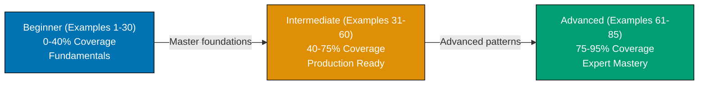

**Want to quickly master SQL through working examples?** This by-example guide teaches 95% of standard SQL through 85 annotated examples organized by complexity level.

## What Is By-Example Learning?

By-example learning is an **example-first approach** where you learn through annotated, runnable SQL rather than narrative explanations. Each example is self-contained, immediately executable in a SQLite container, and heavily commented to show:

- **What each statement does** - Inline comments explain the purpose and mechanism
- **Expected outputs** - Using `-- =>` notation to show query results
- **Intermediate states** - Table contents and data transformations made visible
- **Key takeaways** - 1-2 sentence summaries of core concepts

This approach is **ideal for experienced developers** (seasonal programmers or software engineers) who are familiar with programming but want to quickly understand SQL syntax, database concepts, and query patterns through working code.

Unlike narrative tutorials that build understanding through explanation and storytelling, by-example learning lets you **see the SQL first, run it second, and understand it through direct interaction**. You learn by doing, not by reading about doing.

## Learning Path

The SQL by-example tutorial guides you through 85 examples organized into three progressive levels, from fundamental concepts to advanced query optimization.



## Coverage Philosophy

This by-example guide provides **95% coverage of standard SQL** through practical, annotated examples. The 95% figure represents the depth and breadth of concepts covered, not a time estimate—focus is on **outcomes and understanding**, not duration.

### What's Covered

- **Core SQL syntax** - SELECT, INSERT, UPDATE, DELETE, WHERE clauses, ORDER BY, LIMIT, OFFSET, DISTINCT
- **Data types** - INTEGER, REAL, TEXT, BLOB, NULL handling, type affinity (SQLite concept)
- **Schema design** - Table creation, primary keys, foreign keys, AUTOINCREMENT, unique constraints, check constraints, NOT NULL, default values
- **Joins and relationships** - INNER JOIN, LEFT/RIGHT/FULL OUTER JOIN (simulated), CROSS JOIN, self joins, complex multi-table queries
- **Aggregations and grouping** - COUNT, SUM, AVG, MIN, MAX, GROUP BY, HAVING clauses, GROUP_CONCAT
- **String functions** - UPPER, LOWER, LENGTH, SUBSTR, TRIM, REPLACE, LIKE, GLOB patterns
- **Date and time functions** - DATE, TIME, DATETIME, STRFTIME, JULIANDAY, date arithmetic, time zones
- **Advanced queries** - Common Table Expressions (CTEs), window functions (ROW_NUMBER, RANK, DENSE_RANK, LAG, LEAD), recursive CTEs, UNION/INTERSECT/EXCEPT
- **Indexes and performance** - CREATE INDEX, unique indexes, multi-column indexes, partial indexes, covering indexes, EXPLAIN QUERY PLAN analysis
- **Subqueries** - Scalar subqueries, correlated subqueries, EXISTS/NOT EXISTS, IN/NOT IN
- **Transactions** - BEGIN, COMMIT, ROLLBACK, SAVEPOINT, ACID properties, isolation levels
- **Views** - Creating views, updatable views, materialized views (simulated with triggers)
- **Production patterns** - Upsert with INSERT OR REPLACE, bulk insert optimization, CASE expressions, COALESCE for NULL handling
- **Data manipulation** - CAST for type conversion, JSON1 extension (JSON_EXTRACT, JSON_OBJECT, JSON_ARRAY), full-text search with FTS5
- **Query optimization** - Index selection strategies, query plan analysis, avoiding table scans, covering indexes
- **Advanced techniques** - Self-joins for hierarchical data, pivoting with CASE, running totals with window functions, generating series, calendar queries

### What This Tutorial Does NOT Cover

**Database-Specific Extensions**: PostgreSQL's JSONB operators, MySQL's spatial functions, Oracle's PL/SQL - these are vendor-specific features not part of standard SQL

**Application-Level ORMs**: SQLAlchemy, Hibernate, ActiveRecord, Prisma - these are framework concerns, not SQL features

**Deployment and Infrastructure**: Docker Compose orchestration, connection pooling, replication setup - these are DevOps topics

**Database Internals**: B-tree implementation details, query optimizer algorithms, storage engine architecture - these are advanced internals beyond practical SQL usage

**Migration Tools**: Flyway, Liquibase, Alembic - these are tooling concerns for managing schema evolution

## How to Use This Guide

1. **Sequential or selective** - Read examples in order for progressive learning, or jump to specific topics when you need a particular feature
2. **Run everything** - Copy and paste examples into your SQLite environment. Experimentation solidifies understanding.
3. **Modify and explore** - Change queries, add columns, insert different data, break things intentionally. Learn through experimentation.
4. **Use as reference** - Bookmark examples for quick lookups when you forget syntax or patterns
5. **Complement with narrative tutorials** - By-example learning is code-first; pair with comprehensive tutorials for deeper explanations

**Best workflow**: Open your terminal with SQLite in one window, this guide in another. Run each example as you read it. When you encounter something unfamiliar, run the example, modify it, see what changes.

**Reference System**: Examples are numbered (1-85) and grouped by level. This numbering appears in other SQL content at ayokoding.com, allowing you to reference specific examples elsewhere.

## Structure of Each Example

Every example follows a consistent four-part format:

1. **Brief Explanation** (2-3 sentences): What the example demonstrates and why it matters
2. **Mermaid Diagram** (optional): Visual clarification when concept relationships benefit from visualization
3. **Heavily Annotated Code**: Every significant statement includes a comment explaining what it does and what it produces (using `-- =>` notation)
4. **Key Takeaway** (1-2 sentences): The core insight you should retain from this example

This structure minimizes context switching - explanation, visual aid, runnable code, and distilled essence all in one place.

## Execution Environment

All examples use a **Docker-based SQLite container** for reproducible, isolated execution across all platforms (Windows, macOS, Linux). SQLite is lightweight, requires no server setup, and provides standard SQL compliance ideal for learning.

**One-time setup** (run once before starting examples):

```bash
# Create SQLite container with persistent storage
docker run --name sqlite-tutorial \
  -v sqlite-data:/data \
  -d nouchka/sqlite3:latest tail -f /dev/null

# Connect to SQLite
docker exec -it sqlite-tutorial sqlite3 /data/tutorial.db
```

**Every example is copy-paste runnable** in this environment. Each example creates its own tables to ensure isolation and repeatability. Use `.quit` to exit SQLite shell.

**Alternative**: If you have SQLite installed locally, run `sqlite3 tutorial.db` instead of using Docker.

## Relationship to Other Tutorials

This by-example tutorial complements other learning approaches. Choose based on your situation:

| Tutorial Type        | Coverage | Best For                          | Learning Style                       |
| -------------------- | -------- | --------------------------------- | ------------------------------------ |
| **Quick Start**      | 5-30%    | Getting something working quickly | Hands-on with guided structure       |
| **Beginner**         | 0-60%    | Learning from scratch             | Narrative explanations with examples |
| **This: By Example** | 95%      | Rapid depth for experienced devs  | Code-first, minimal explanation      |
| **Cookbook**         | Parallel | Solving specific problems         | Problem-solution recipes             |
| **Advanced**         | 85-95%   | Expert mastery                    | Deep dives and edge cases            |

By-example is ideal if you have programming experience. It accelerates learning by leveraging your existing knowledge - you focus on "how SQL does this" rather than learning database concepts from scratch.

The 95% coverage represents depth and breadth of topics you'll encounter in production SQL work. It explicitly acknowledges that no tutorial covers everything, but these examples provide the foundation to understand the remaining 5% through official documentation and database-specific resources.

## Prerequisites

- Basic programming knowledge (variables, functions, loops) or willingness to learn through examples
- Docker installed and running (for SQLite container) OR SQLite installed locally
- A terminal you're comfortable with

You don't need to understand database internals, normalization theory, or SQL standards yet - this tutorial teaches those through examples. You just need comfort running commands in a terminal.

## Standard SQL Focus

This tutorial focuses on **standard SQL** that works across databases (MySQL, PostgreSQL, SQLite, SQL Server, Oracle). Where SQLite-specific features are used (like AUTOINCREMENT or type affinity), we note the standard SQL alternative.

Examples prioritize:

- **Portable SQL syntax** - Works on multiple database engines
- **ANSI SQL compliance** - Follows SQL standard when possible
- **Practical patterns** - Real-world query structures you'll use in production
- **Clear annotations** - Every query includes comments showing expected results

## Comparison with By-Example for Other Technologies

Other technologies at ayokoding.com have similar by-example tutorials:

- **PostgreSQL By-Example**: 85 examples covering PostgreSQL-specific features (JSONB, full-text search, advanced indexes)
- **Go By-Example**: 85+ examples covering concurrency, interfaces, standard library patterns
- **Java By-Example**: 75-90 examples covering OOP, streams, concurrency, JVM patterns
- **Elixir By-Example**: 75-90 examples covering functional programming, pattern matching, OTP

The SQL version follows the same philosophy and structure but emphasizes SQL's declarative nature: you describe what you want, not how to compute it. SQL is fundamentally different from imperative languages - this tutorial helps you think in sets and transformations rather than loops and conditionals.
