## Advanced Examples (61-85)

**Coverage**: 75-95% of Ecto functionality

**Focus**: Dynamic queries, custom types, performance optimization, parameterized types, advanced patterns, and production best practices.

These examples assume you understand beginner and intermediate concepts. All examples are self-contained and production-ready.

---

### Example 61: Building Dynamic Queries

Dynamic queries allow you to build WHERE clauses conditionally based on runtime parameters, essential for search forms and flexible filtering.

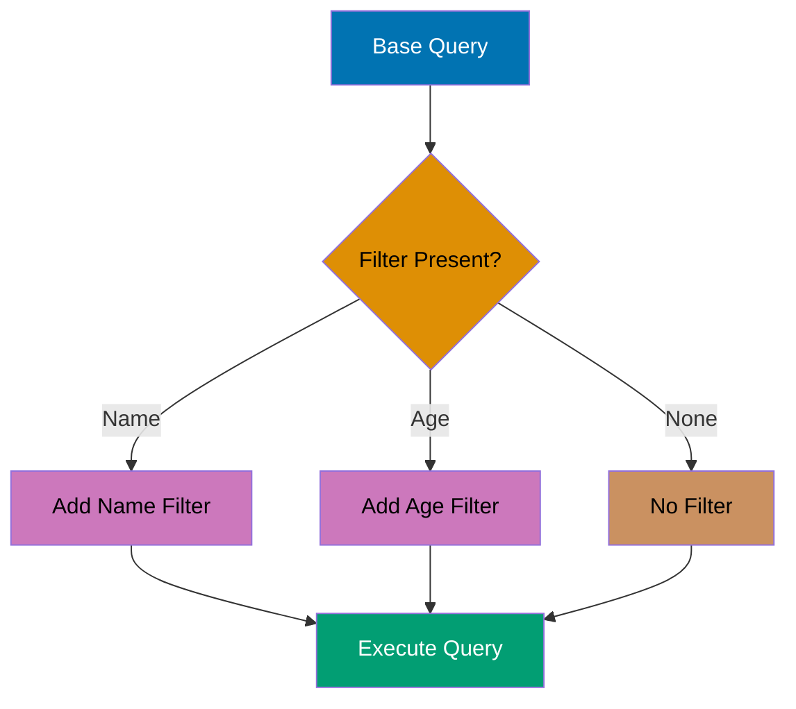

```elixir
defmodule User do
                                                      # => Module starts
  use Ecto.Schema
                                                      # => Imports Ecto

  schema "users" do
                                                      # => Schema declaration
    field :name, :string
                                                      # => Field defined
    field :age, :integer
                                                      # => Field defined
    field :country, :string
                                                      # => Field defined
    timestamps()
                                                      # => Operation executes
  end
                                                      # => Block ends
end
                                                      # => Block ends

defmodule UserQuery do
                                                      # => Module starts
  import Ecto.Query
                                                      # => Operation executes

  def build_query(filters) do
                                                      # => Operation executes
    User
                                                      # => Operation executes
    |> filter_by_name(filters[:name])
                                                      # => Operation executes
    |> filter_by_age_range(filters[:min_age], filters[:max_age])
                                                      # => Operation executes
    |> filter_by_country(filters[:country])
                                                      # => Operation executes
  end
                                                      # => Block ends

  defp filter_by_name(query, nil), do: query
                                                      # => Operation executes
  defp filter_by_name(query, name) do
                                                      # => Operation executes
    where(query, [u], ilike(u.name, ^"%#{name}%"))
                                                      # => Operation executes
                                      # => Case-insensitive LIKE search
  end
                                                      # => Block ends

  defp filter_by_age_range(query, nil, nil), do: query
                                                      # => Operation executes
  defp filter_by_age_range(query, min_age, nil) do
                                                      # => Operation executes
    where(query, [u], u.age >= ^min_age)
                                                      # => Value assigned
  end
                                                      # => Block ends
  defp filter_by_age_range(query, nil, max_age) do
                                                      # => Operation executes
    where(query, [u], u.age <= ^max_age)
                                                      # => Value assigned
  end
                                                      # => Block ends
  defp filter_by_age_range(query, min_age, max_age) do
                                                      # => Operation executes
    where(query, [u], u.age >= ^min_age and u.age <= ^max_age)
                                                      # => Value assigned
  end
                                                      # => Block ends

  defp filter_by_country(query, nil), do: query
                                                      # => Operation executes
  defp filter_by_country(query, country) do
                                                      # => Operation executes
    where(query, [u], u.country == ^country)
                                                      # => Value assigned
  end
                                                      # => Block ends
end
                                                      # => Block ends

# Insert test data
                                                      # => Operation executes
Repo.insert(%User{name: "Alice", age: 25, country: "USA"})
                                                      # => Database operation
Repo.insert(%User{name: "Bob", age: 30, country: "UK"})
                                                      # => Database operation
Repo.insert(%User{name: "Charlie", age: 35, country: "USA"})
                                                      # => Database operation

# Dynamic query with name filter only
                                                      # => Operation executes
query1 = UserQuery.build_query(%{name: "ali"})
                                                      # => Value assigned
results1 = Repo.all(query1)           # => results1 is [%User{name: "Alice"}]
                                      # => SQL: SELECT * FROM users WHERE name ILIKE '%ali%'

# Dynamic query with multiple filters
                                                      # => Operation executes
query2 = UserQuery.build_query(%{min_age: 28, country: "USA"})
                                                      # => Value assigned
results2 = Repo.all(query2)           # => results2 is [%User{name: "Charlie"}]
                                      # => SQL: SELECT * FROM users WHERE age >= 28 AND country = 'USA'

IO.inspect(length(results1))          # => Output: 1
IO.inspect(length(results2))          # => Output: 1
```

**Key Takeaway**: Build dynamic queries by chaining filter functions that only add WHERE clauses when parameters are present, and always use parameter binding (^var) to prevent SQL injection.

**Why It Matters**: Advanced search UIs with complex filter logic (AND/OR combinations, range filters, text search) require programmatic query construction. Production admin panels and reporting tools use query builder modules to compose filters from UI components, preventing massive controller if-else chains. This pattern enables building complex queries from external filter definitions (JSON APIs, saved searches) while maintaining type safety.

---

### Example 62: Dynamic Order By

Dynamic sorting allows users to control result ordering at runtime, common in table views with sortable columns.

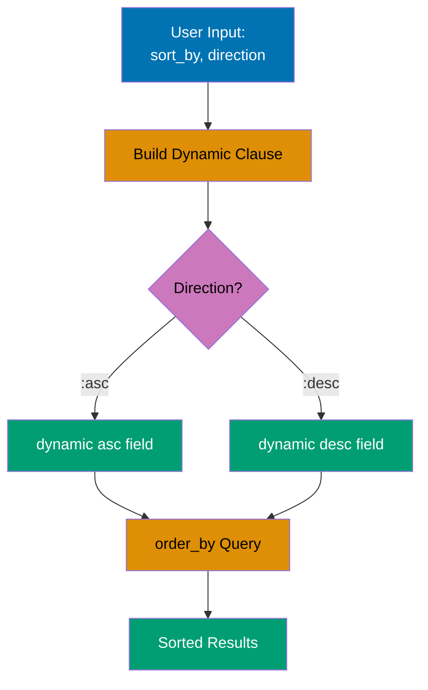

```elixir
defmodule User do
                                                      # => Module starts
  use Ecto.Schema
                                                      # => Imports Ecto

  schema "users" do
                                                      # => Schema declaration
    field :name, :string
                                                      # => Field defined
    field :age, :integer
                                                      # => Field defined
    field :created_at, :naive_datetime
                                                      # => Field defined
    timestamps()
                                                      # => Operation executes
  end
                                                      # => Block ends
end
                                                      # => Block ends

defmodule UserQuery do
                                                      # => Module starts
  import Ecto.Query
                                                      # => Operation executes

  def list_users(opts \\ []) do
                                                      # => Operation executes
    sort_by = opts[:sort_by] || :name  # => Default sort by name
    direction = opts[:direction] || :asc
                                                      # => Value assigned
                                      # => Default ascending

    User
                                                      # => Operation executes
    |> apply_sorting(sort_by, direction)
                                                      # => Operation executes
    |> Repo.all()
                                                      # => Database operation
  end
                                                      # => Block ends

  defp apply_sorting(query, field, :asc) do
                                                      # => Field defined
    order_by(query, [u], asc: field(u, ^field))
                                                      # => Field defined
                                      # => Dynamic field reference
  end
                                                      # => Block ends

  defp apply_sorting(query, field, :desc) do
                                                      # => Field defined
    order_by(query, [u], desc: field(u, ^field))
                                                      # => Field defined
  end
                                                      # => Block ends
end
                                                      # => Block ends

# Insert test data
                                                      # => Operation executes
Repo.insert(%User{name: "Zara", age: 28})
                                                      # => Database operation
Repo.insert(%User{name: "Alice", age: 32})
                                                      # => Database operation
Repo.insert(%User{name: "Bob", age: 25})
                                                      # => Database operation

# Sort by name ascending (default)
                                                      # => Block ends
users1 = UserQuery.list_users()       # => [%User{name: "Alice"}, %User{name: "Bob"}, %User{name: "Zara"}]
                                      # => SQL: SELECT * FROM users ORDER BY name ASC

# Sort by age descending
                                                      # => Block ends
users2 = UserQuery.list_users(sort_by: :age, direction: :desc)
                                                      # => Value assigned
                                      # => [%User{age: 32}, %User{age: 28}, %User{age: 25}]
                                      # => SQL: SELECT * FROM users ORDER BY age DESC

IO.inspect(Enum.map(users1, & &1.name))
                                                      # => Operation executes
                                      # => Output: ["Alice", "Bob", "Zara"]
IO.inspect(Enum.map(users2, & &1.age))
                                                      # => Operation executes
                                      # => Output: [32, 28, 25]
```

**Key Takeaway**: Use field(binding, ^field_atom) for dynamic field references in order_by, and always validate field names against a whitelist to prevent invalid column references.

**Why It Matters**: Data tables, admin interfaces, and API endpoints commonly need user-controlled sorting. Hardcoding sort logic for every possible field creates unmaintainable code explosion. Dynamic ordering enables flexible UIs while the field whitelist prevents SQL injection through invalid column names, balancing user flexibility with security.

---

### Example 63: Implementing Custom Ecto.Type

Custom types allow you to define how Elixir values are converted to/from database representations, useful for encrypting data, custom formats, or domain-specific types.

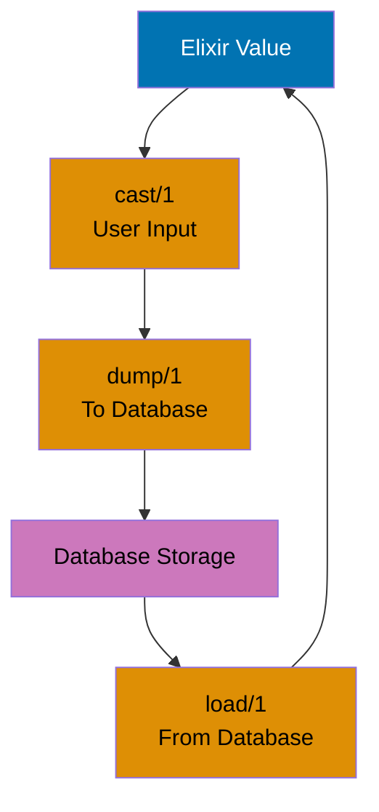

```elixir
defmodule EncryptedString do
                                                      # => Module starts
  use Ecto.Type
                                                      # => Imports Ecto

  def type, do: :string                # => Database type

  def cast(value) when is_binary(value) do
                                                      # => Operation executes
    {:ok, value}                       # => Accept strings
  end
                                                      # => Block ends
  def cast(_), do: :error
                                                      # => Operation executes

  def load(value) when is_binary(value) do
                                                      # => Operation executes
    {:ok, decrypt(value)}              # => Decrypt when loading from database
  end
                                                      # => Block ends

  def dump(value) when is_binary(value) do
                                                      # => Operation executes
    {:ok, encrypt(value)}              # => Encrypt when saving to database
  end
                                                      # => Block ends
  def dump(_), do: :error
                                                      # => Operation executes

  # Simplified encryption (use real crypto in production)
                                                      # => Operation executes
  defp encrypt(value), do: Base.encode64(value)
                                                      # => Operation executes
  defp decrypt(value), do: Base.decode64!(value)
                                                      # => Operation executes
end
                                                      # => Block ends

defmodule User do
                                                      # => Module starts
  use Ecto.Schema
                                                      # => Imports Ecto

  schema "users" do
                                                      # => Schema declaration
    field :name, :string
                                                      # => Field defined
    field :ssn, EncryptedString         # => Custom type for sensitive data
    timestamps()
                                                      # => Operation executes
  end
                                                      # => Block ends
end
                                                      # => Block ends

# Insert user with encrypted SSN
                                                      # => Operation executes
{:ok, user} = Repo.insert(%User{name: "Diana", ssn: "123-45-6789"})
                                                      # => Database operation
                                      # => user.ssn is "123-45-6789" (in memory)
                                      # => Database stores: "MTIzLTQ1LTY3ODk=" (encrypted)
                                      # => SQL: INSERT INTO users (name, ssn) VALUES ('Diana', 'MTIzLTQ1LTY3ODk=')

# Load user (automatic decryption)
                                                      # => Operation executes
loaded = Repo.get(User, user.id)      # => loaded.ssn is "123-45-6789" (decrypted)
                                      # => SQL: SELECT * FROM users WHERE id = 1

IO.inspect(loaded.ssn)                # => Output: "123-45-6789"
```

**Key Takeaway**: Custom types must implement type/0 (database type), cast/1 (validate input), load/1 (database → Elixir), and dump/1 (Elixir → database); use for encryption, JSON encoding, or custom serialization.

**Why It Matters**: Application-specific data types (encrypted fields, enums, URIs) require custom casting and storage logic. Production systems implement Ecto.Type for money values (precise decimal math), encrypted PII (automatic encryption/decryption), and domain types (email, phone) to enforce type safety at schema boundaries. Custom types centralize validation and transformation logic, preventing duplication across changesets.

---

### Example 64: Parameterized Types

Parameterized types accept compile-time parameters, allowing you to create configurable custom types for reusable logic.

```elixir
defmodule EnumType do
                                                      # => Module starts
  use Ecto.ParameterizedType
                                                      # => Imports Ecto

  def type(_params), do: :string      # => Database type

  def init(opts) do
                                                      # => Operation executes
    values = Keyword.fetch!(opts, :values)
                                                      # => Value assigned
                                      # => Required parameter: list of valid values
    %{values: values}                 # => Return params map
  end
                                                      # => Block ends

  def cast(value, %{values: values}) when value in values do
                                                      # => Operation executes
    {:ok, value}                      # => Value must be in allowed list
  end
                                                      # => Block ends
  def cast(_, _), do: :error
                                                      # => Operation executes

  def load(value, _, _), do: {:ok, value}
                                                      # => Operation executes
  def dump(value, _, _), do: {:ok, value}
                                                      # => Operation executes
end
                                                      # => Block ends

defmodule User do
                                                      # => Module starts
  use Ecto.Schema
                                                      # => Imports Ecto

  schema "users" do
                                                      # => Schema declaration
    field :name, :string
                                                      # => Field defined
    field :role, EnumType, values: ["admin", "user", "guest"]
                                                      # => Field defined
                                      # => Parameterized enum with allowed values
    timestamps()
                                                      # => Operation executes
  end
                                                      # => Block ends
end
                                                      # => Block ends

# Valid role
                                                      # => Operation executes
{:ok, admin} = Repo.insert(%User{name: "Eve", role: "admin"})
                                                      # => Database operation
                                      # => role is "admin" (valid)

# Invalid role would fail at changeset level
                                                      # => Operation executes
changeset = Ecto.Changeset.cast(%User{}, %{name: "Frank", role: "invalid"}, [:name, :role])
                                                      # => Value assigned
                                      # => changeset.valid? is false
                                      # => changeset.errors has role error

IO.inspect(admin.role)                # => Output: "admin"
IO.inspect(changeset.valid?)          # => Output: false
```

**Key Takeaway**: Parameterized types enable compile-time configuration of custom types, and init/1 receives schema-level options while cast/load/dump receive the params map.

**Why It Matters**: Reusable types with configuration (enum with allowed values, encrypted field with key) avoid code duplication across schemas. Production systems use parameterized types for enums (status field with specific allowed states) and configurable transformations (encrypted field with per-field keys) to enforce constraints centrally. This pattern enables type reuse while maintaining field-specific configuration.

---

### Example 65: Optimistic Locking with :version

Optimistic locking uses a version field to detect concurrent updates, raising on conflict. Prevents lost updates without database locks.

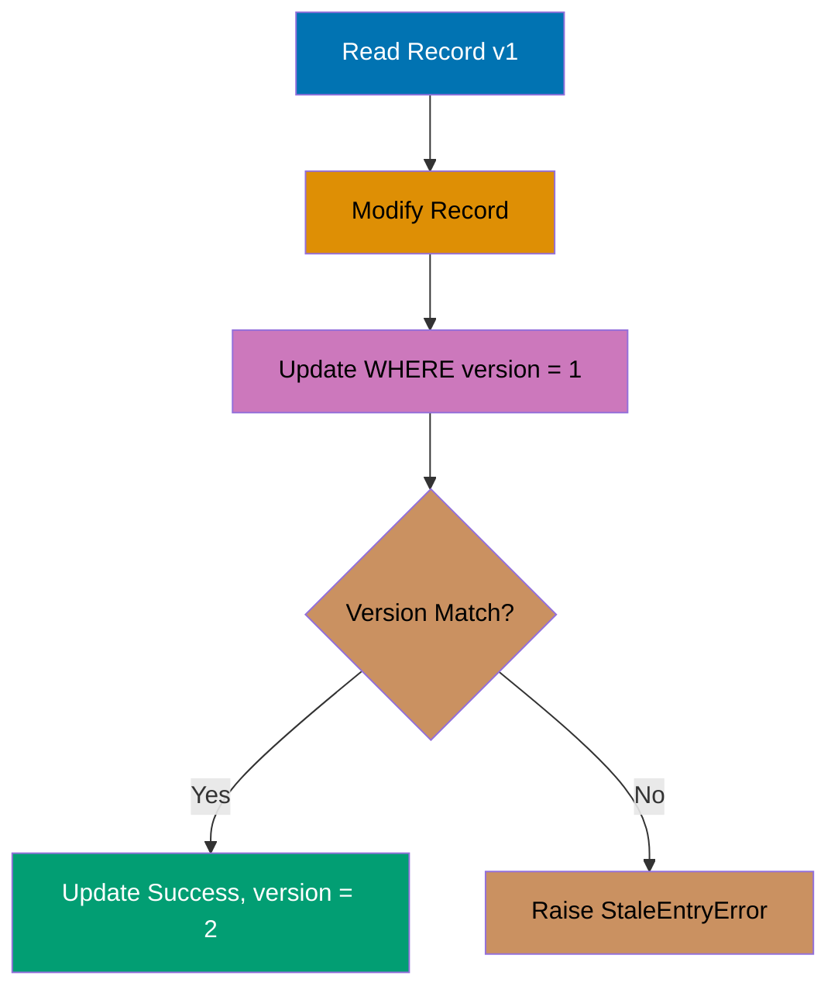

```elixir
defmodule Product do
                                                      # => Module starts
  use Ecto.Schema
                                                      # => Imports Ecto

  schema "products" do
                                                      # => Schema declaration
    field :name, :string
                                                      # => Field defined
    field :stock, :integer
                                                      # => Field defined
    field :version, :integer, default: 1
                                                      # => Field defined
                                      # => Optimistic lock version field
    timestamps()
                                                      # => Operation executes
  end
                                                      # => Block ends
end
                                                      # => Block ends

# Migration for version field
                                                      # => Field defined
defmodule Repo.Migrations.AddVersionToProducts do
                                                      # => Module starts
  use Ecto.Migration
                                                      # => Imports Ecto

  def change do
                                                      # => Operation executes
    alter table(:products) do
                                                      # => Operation executes
      add :version, :integer, default: 1, null: false
                                                      # => Operation executes
    end
                                                      # => Block ends
  end
                                                      # => Block ends
end
                                                      # => Block ends

# Insert product
                                                      # => Operation executes
{:ok, product} = Repo.insert(%Product{name: "Widget", stock: 100, version: 1})
                                                      # => Database operation
                                      # => product.version is 1

# Concurrent update simulation
                                                      # => Operation executes
# Transaction 1: Read product
                                                      # => Operation executes
product_t1 = Repo.get(Product, product.id)
                                                      # => Database operation
                                      # => product_t1.version is 1

# Transaction 2: Update stock
                                                      # => Operation executes
changeset_t2 = Ecto.Changeset.change(product, stock: 95)
                                                      # => Value assigned
{:ok, updated_t2} = Repo.update(changeset_t2)
                                                      # => Database operation
                                      # => updated_t2.version is 2 (auto-incremented)
                                      # => SQL: UPDATE products SET stock = 95, version = 2
                                      # =>      WHERE id = 1 AND version = 1

# Transaction 1: Try to update with stale version
                                                      # => Operation executes
changeset_t1 = Ecto.Changeset.change(product_t1, stock: 90)
                                                      # => Value assigned
# {:error, _} = Repo.update(changeset_t1)
                                                      # => Database operation
                                      # => Raises Ecto.StaleEntryError
                                      # => SQL: UPDATE products SET stock = 90, version = 2
                                      # =>      WHERE id = 1 AND version = 1
                                      # => No rows affected (version mismatch)

IO.inspect(updated_t2.version)        # => Output: 2
```

**Key Takeaway**: Add field :version, :integer to schemas for optimistic locking; Ecto automatically increments version on update and raises Ecto.StaleEntryError if version doesn't match.

**Why It Matters**: Most updates don't have concurrency conflicts, so pessimistic locks waste performance by serializing all access. Optimistic locking using version columns lets production systems attempt updates optimistically and retry on conflicts, maximizing throughput for low-contention resources. This pattern is essential for collaborative editing, configuration management, and any scenario where conflicts are rare but must be detected when they occur.

---

### Example 66: Association Preloading Strategies

Ecto supports multiple preloading strategies with different performance characteristics: separate queries (:all) vs joins (:join).

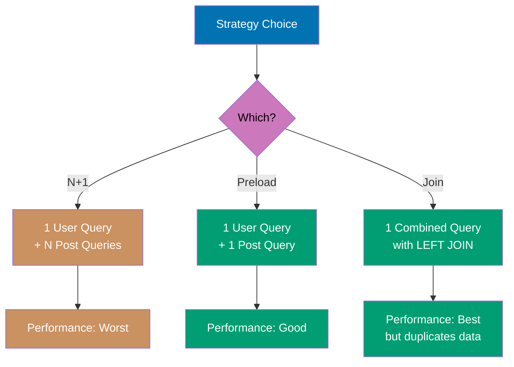

```elixir
defmodule User do
                                                      # => Module starts
  use Ecto.Schema
                                                      # => Imports Ecto

  schema "users" do
                                                      # => Schema declaration
    field :name, :string
                                                      # => Field defined
    has_many :posts, Post
                                                      # => Operation executes
    timestamps()
                                                      # => Operation executes
  end
                                                      # => Block ends
end
                                                      # => Block ends

defmodule Post do
                                                      # => Module starts
  use Ecto.Schema
                                                      # => Imports Ecto

  schema "posts" do
                                                      # => Schema declaration
    field :title, :string
                                                      # => Field defined
    belongs_to :user, User
                                                      # => Operation executes
    timestamps()
                                                      # => Operation executes
  end
                                                      # => Block ends
end
                                                      # => Block ends

# Insert test data
                                                      # => Operation executes
{:ok, user1} = Repo.insert(%User{name: "Grace"})
                                                      # => Database operation
{:ok, user2} = Repo.insert(%User{name: "Henry"})
                                                      # => Database operation
Repo.insert(%Post{title: "Post 1", user_id: user1.id})
                                                      # => Database operation
Repo.insert(%Post{title: "Post 2", user_id: user1.id})
                                                      # => Database operation
Repo.insert(%Post{title: "Post 3", user_id: user2.id})
                                                      # => Database operation

# Preload with separate query (default)
                                                      # => Operation executes
users_separate = User |> Repo.all() |> Repo.preload(:posts)
                                                      # => Database operation
                                      # => SQL 1: SELECT * FROM users
                                      # => SQL 2: SELECT * FROM posts WHERE user_id IN (1, 2)
                                      # => Two queries total

# Preload with join
                                                      # => Operation executes
import Ecto.Query
                                                      # => Operation executes
users_join = User
                                                      # => Value assigned
  |> join(:left, [u], p in assoc(u, :posts))
                                                      # => Operation executes
  |> preload([u, p], posts: p)
                                                      # => Operation executes
  |> Repo.all()                       # => SQL: SELECT u.*, p.* FROM users u
                                      # =>      LEFT JOIN posts p ON p.user_id = u.id
                                      # => Single query with join

IO.inspect(length(users_separate))    # => Output: 2
IO.inspect(length(users_join))        # => Output: 2
```

**Key Takeaway**: Separate query preloading (:all, default) executes N+1 prevention with one additional query per association, while join preloading fetches everything in one query but may have duplicate rows for has_many.

**Why It Matters**: Choosing the right preload strategy impacts query count, memory usage, and response time. Separate queries scale better for has_many with many children (avoids row explosion), while join preloading reduces database round trips for belongs_to and small has_many associations. Production systems profile both strategies to choose optimal approaches based on actual data distribution and access patterns.

---

### Example 67: Preventing N+1 Queries with Dataloader

While not built-in to Ecto, understanding the N+1 problem is critical. Here's how to detect and prevent it.

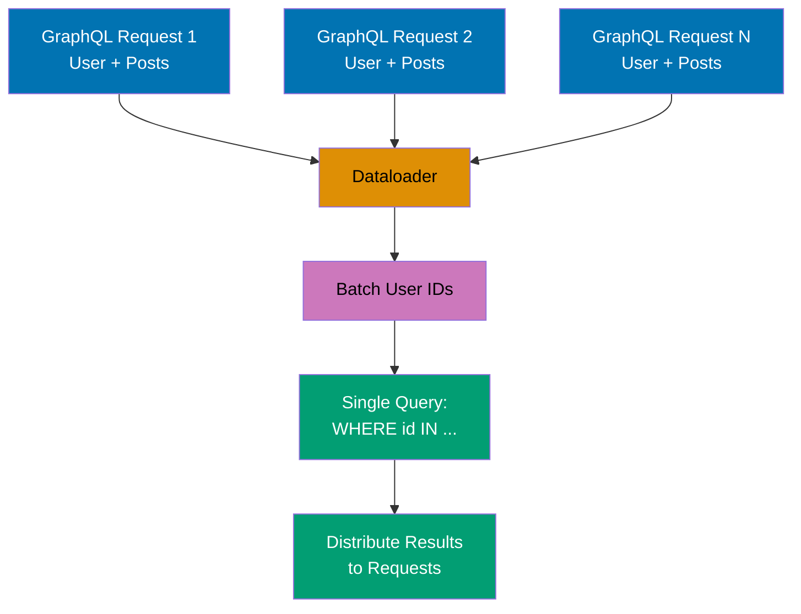

```elixir
defmodule User do
                                                      # => Module starts
  use Ecto.Schema
                                                      # => Imports Ecto

  schema "users" do
                                                      # => Schema declaration
    field :name, :string
                                                      # => Field defined
    has_many :posts, Post
                                                      # => Operation executes
    timestamps()
                                                      # => Operation executes
  end
                                                      # => Block ends
end
                                                      # => Block ends

defmodule Post do
                                                      # => Module starts
  use Ecto.Schema
                                                      # => Imports Ecto

  schema "posts" do
                                                      # => Schema declaration
    field :title, :string
                                                      # => Field defined
    belongs_to :user, User
                                                      # => Operation executes
    timestamps()
                                                      # => Operation executes
  end
                                                      # => Block ends
end
                                                      # => Block ends

# Insert test data
                                                      # => Operation executes
{:ok, user1} = Repo.insert(%User{name: "Iris"})
                                                      # => Database operation
{:ok, user2} = Repo.insert(%User{name: "Jack"})
                                                      # => Database operation
Repo.insert(%Post{title: "Post 1", user_id: user1.id})
                                                      # => Database operation
Repo.insert(%Post{title: "Post 2", user_id: user2.id})
                                                      # => Database operation

# N+1 query problem (BAD)
                                                      # => Operation executes
users = Repo.all(User)                # => SQL 1: SELECT * FROM users
Enum.each(users, fn user ->
                                                      # => Operation executes
  posts = Repo.preload(user, :posts).posts
                                                      # => Database operation
                                      # => SQL 2: SELECT * FROM posts WHERE user_id = 1
                                      # => SQL 3: SELECT * FROM posts WHERE user_id = 2
                                      # => N additional queries (1 per user)
  IO.inspect({user.name, length(posts)})
                                                      # => Operation executes
end)
                                                      # => Block ends

# Fixed with preload (GOOD)
                                                      # => Operation executes
users_fixed = User |> Repo.all() |> Repo.preload(:posts)
                                                      # => Database operation
                                      # => SQL 1: SELECT * FROM users
                                      # => SQL 2: SELECT * FROM posts WHERE user_id IN (1, 2)
                                      # => Only 2 queries total
Enum.each(users_fixed, fn user ->
                                                      # => Operation executes
  IO.inspect({user.name, length(user.posts)})
                                                      # => Operation executes
end)
                                                      # => Block ends
```

**Key Takeaway**: Always preload associations before iterating over parent records to prevent N+1 queries; use Repo.preload/2 on the query result, not inside loops.

**Why It Matters**: GraphQL resolvers naively loading associations trigger N+1 queries for every nested field. Production GraphQL APIs use Dataloader to batch association loads across the entire request, reducing hundreds of queries to a few. Understanding batch loading is critical for performant GraphQL implementations and any scenario where associations are loaded within loops or recursive structures.

---

### Example 68: Lazy vs Eager Loading

Understanding when Ecto loads data helps optimize queries and avoid unnecessary database round trips.

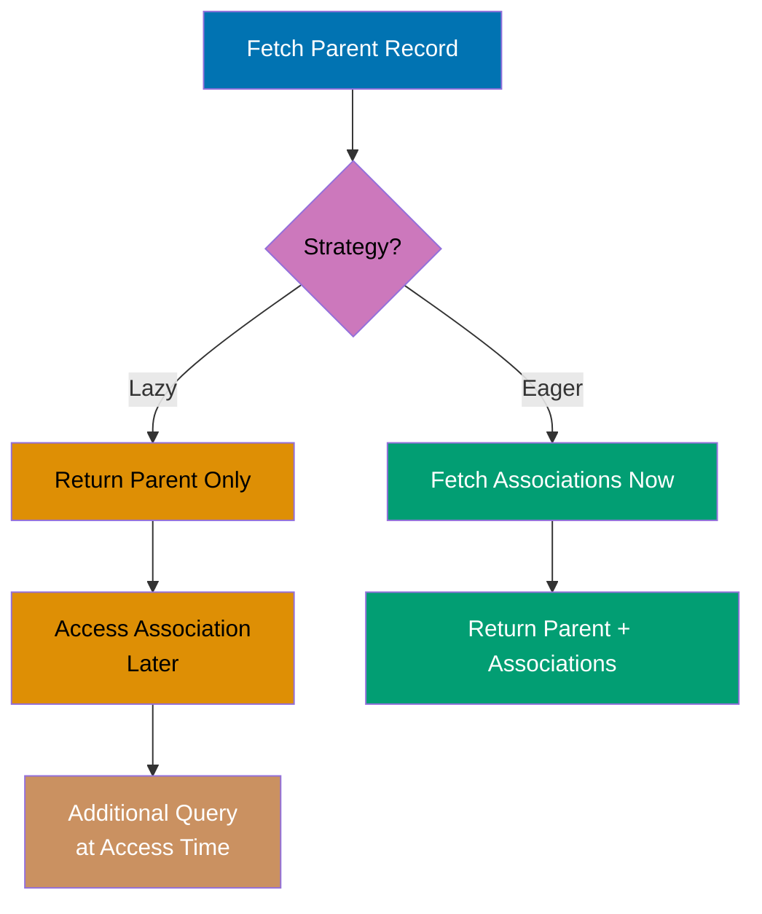

```elixir
defmodule User do
                                                      # => Module starts
  use Ecto.Schema
                                                      # => Imports Ecto

  schema "users" do
                                                      # => Schema declaration
    field :name, :string
                                                      # => Field defined
    has_many :posts, Post
                                                      # => Operation executes
    timestamps()
                                                      # => Operation executes
  end
                                                      # => Block ends
end
                                                      # => Block ends

defmodule Post do
                                                      # => Module starts
  use Ecto.Schema
                                                      # => Imports Ecto

  schema "posts" do
                                                      # => Schema declaration
    field :title, :string
                                                      # => Field defined
    belongs_to :user, User
                                                      # => Operation executes
    timestamps()
                                                      # => Operation executes
  end
                                                      # => Block ends
end
                                                      # => Block ends

# Insert test data
                                                      # => Operation executes
{:ok, user} = Repo.insert(%User{name: "Kate"})
                                                      # => Database operation
Repo.insert(%Post{title: "Post 1", user_id: user.id})
                                                      # => Database operation

# Lazy loading (association not loaded)
                                                      # => Operation executes
user_lazy = Repo.get(User, user.id)   # => user_lazy.posts is %Ecto.Association.NotLoaded{}
                                      # => SQL: SELECT * FROM users WHERE id = 1
                                      # => Posts NOT loaded

# Accessing unloaded association raises
                                                      # => Operation executes
# user_lazy.posts                     # => Raises: association :posts is not loaded

# Eager loading (preload in query)
                                                      # => Operation executes
import Ecto.Query
                                                      # => Operation executes
user_eager = User
                                                      # => Value assigned
  |> where([u], u.id == ^user.id)
                                                      # => Value assigned
  |> preload(:posts)
                                                      # => Operation executes
  |> Repo.one()                       # => user_eager.posts is [%Post{...}]
                                      # => SQL 1: SELECT * FROM users WHERE id = 1
                                      # => SQL 2: SELECT * FROM posts WHERE user_id IN (1)

# Lazy preload (load after fetching)
                                                      # => Operation executes
user_lazy_preload = user_lazy |> Repo.preload(:posts)
                                                      # => Database operation
                                      # => user_lazy_preload.posts is [%Post{...}]
                                      # => SQL: SELECT * FROM posts WHERE user_id IN (1)

IO.inspect(user_eager.posts)          # => Output: [%Post{...}]
IO.inspect(user_lazy_preload.posts)   # => Output: [%Post{...}]
```

**Key Takeaway**: Associations are lazy by default (not loaded until preloaded), and accessing unloaded associations raises an error; preload eagerly when you know you'll need the data.

**Why It Matters**: Lazy loading prevents unnecessary database queries but creates runtime errors when associations are accessed without preloading. Production systems establish clear contracts about when associations are loaded, using compile-time warnings or runtime checks to prevent NotLoaded access. Understanding lazy semantics prevents subtle bugs where code works in tests (with preloaded data) but fails in production (missing preloads).

---

### Example 69: Repo.stream for Large Result Sets

Repo.stream/1 streams query results one at a time instead of loading all into memory, essential for processing large datasets.

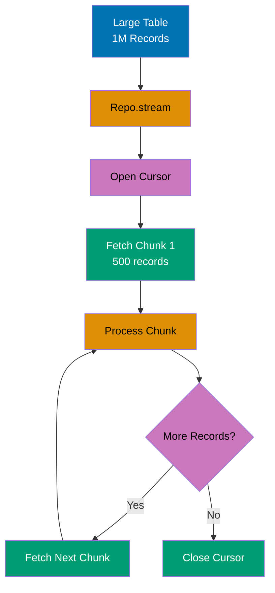

```elixir
defmodule User do
                                                      # => Module starts
  use Ecto.Schema
                                                      # => Imports Ecto

  schema "users" do
                                                      # => Schema declaration
    field :name, :string
                                                      # => Field defined
    field :age, :integer
                                                      # => Field defined
    timestamps()
                                                      # => Operation executes
  end
                                                      # => Block ends
end
                                                      # => Block ends

import Ecto.Query
                                                      # => Operation executes

# Insert large dataset
                                                      # => Operation executes
Enum.each(1..10000, fn i ->
                                                      # => Operation executes
  Repo.insert(%User{name: "User #{i}", age: rem(i, 100)})
                                                      # => Database operation
end)
                                                      # => Block ends

# Process large result set with streaming
                                                      # => Operation executes
Repo.transaction(fn ->                # => Stream requires transaction
  User
                                                      # => Operation executes
  |> where([u], u.age > 25)
                                                      # => Operation executes
  |> Repo.stream()                    # => Returns stream (lazy)
  |> Stream.map(fn user ->
                                                      # => Operation executes
    # Process each user (e.g., send email)
                                                      # => Block ends
    {user.id, user.name}
                                                      # => Operation executes
  end)
                                                      # => Block ends
  |> Stream.take(5)                   # => Limit processing for example
  |> Enum.to_list()                   # => Triggers execution
                                      # => SQL: Cursor-based streaming
                                      # => Only loads chunk into memory at a time
end)
                                                      # => Block ends

IO.inspect("Processed users in streaming fashion")
                                                      # => Operation executes
```

**Key Takeaway**: Repo.stream/1 must be used inside a transaction and returns a lazy stream that fetches rows in batches, preventing memory issues when processing millions of records.

**Why It Matters**: Processing millions of records loads entire tables into memory, causing OOM crashes. Production batch jobs use Repo.stream to process records in chunks, maintaining constant memory usage regardless of table size. This pattern is essential for ETL jobs, bulk updates, and report generation over large datasets where streaming trades latency for memory efficiency.

---

### Example 70: Preparing Queries for Performance

Repo.prepare_query/2 compiles queries once and reuses the prepared statement, improving performance for frequently executed queries.

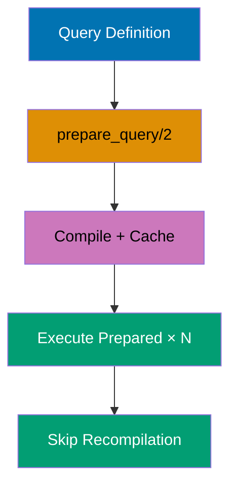

```elixir
defmodule User do
                                                      # => Module starts
  use Ecto.Schema
                                                      # => Imports Ecto

  schema "users" do
                                                      # => Schema declaration
    field :name, :string
                                                      # => Field defined
    field :age, :integer
                                                      # => Field defined
    timestamps()
                                                      # => Operation executes
  end
                                                      # => Block ends
end
                                                      # => Block ends

import Ecto.Query
                                                      # => Operation executes

# Define reusable query
                                                      # => Operation executes
get_user_by_age_query = fn age ->
                                                      # => Value assigned
  from u in User,
                                                      # => Operation executes
    where: u.age == ^age,
                                                      # => Value assigned
    select: u
                                                      # => Operation executes
end
                                                      # => Block ends

# Execute query multiple times (each is prepared)
                                                      # => Operation executes
users_25 = get_user_by_age_query.(25) |> Repo.all()
                                                      # => Database operation
                                      # => SQL: Prepared statement cached
users_30 = get_user_by_age_query.(30) |> Repo.all()
                                                      # => Database operation
                                      # => Reuses prepared statement

# Named prepared query (advanced)
                                                      # => Operation executes
defmodule UserQueries do
                                                      # => Module starts
  import Ecto.Query
                                                      # => Operation executes

  def by_age_prepared do
                                                      # => Operation executes
    from u in User,
                                                      # => Operation executes
      where: u.age == ^1                # => Positional parameter
  end
                                                      # => Block ends
end
                                                      # => Block ends

# Ecto automatically prepares and caches queries
                                                      # => Operation executes
result = UserQueries.by_age_prepared() |> Repo.all([25])
                                                      # => Database operation
                                      # => Executes prepared statement with age = 25

IO.inspect(length(users_25))          # => Output: count of users aged 25
```

**Key Takeaway**: Ecto automatically prepares and caches queries with parameter bindings, but for maximum performance with frequently executed queries, use explicit prepared queries.

**Why It Matters**: Repeated queries with different parameters benefit from prepared statements that parse SQL once and reuse execution plans. Production high-throughput systems use prepared statements (automatic with Ecto) to reduce parsing overhead and improve query cache hit rates. Understanding prepared statements helps diagnose plan caching issues and optimize query performance for workloads with repeated query patterns.

---

### Example 71: Using Indexes Effectively

Understanding when and how to create indexes is crucial for query performance. Index on foreign keys, WHERE clauses, and ORDER BY fields.

```elixir
# Migration: Create strategic indexes
                                                      # => Operation executes
defmodule Repo.Migrations.AddPerformanceIndexes do
                                                      # => Module starts
  use Ecto.Migration
                                                      # => Imports Ecto

  def change do
                                                      # => Operation executes
    # Index foreign key (for joins)
                                                      # => Operation executes
    create index(:posts, [:user_id])  # => Speeds up JOIN operations

    # Index frequently filtered field
                                                      # => Field defined
    create index(:users, [:country])  # => WHERE country = ...

    # Composite index for multi-field queries
                                                      # => Field defined
    create index(:posts, [:user_id, :published_at])
                                                      # => Operation executes
                                      # => WHERE user_id = ? AND published_at > ?

    # Partial index for specific condition
                                                      # => Operation executes
    create index(:posts, [:published_at], where: "status = 'published'")
                                                      # => Value assigned
                                      # => Only indexes published posts

    # Unique index for constraints
                                                      # => Operation executes
    create unique_index(:users, [:email])
                                                      # => Operation executes
                                      # => Enforces uniqueness
  end
                                                      # => Block ends
end
                                                      # => Block ends

defmodule Post do
                                                      # => Module starts
  use Ecto.Schema
                                                      # => Imports Ecto

  schema "posts" do
                                                      # => Schema declaration
    field :title, :string
                                                      # => Field defined
    field :status, :string
                                                      # => Field defined
    field :published_at, :naive_datetime
                                                      # => Field defined
    belongs_to :user, User
                                                      # => Operation executes
    timestamps()
                                                      # => Operation executes
  end
                                                      # => Block ends
end
                                                      # => Block ends

import Ecto.Query
                                                      # => Operation executes

# Query benefits from user_id index
                                                      # => Operation executes
query1 = from p in Post,
                                                      # => Value assigned
  where: p.user_id == 1,              # => Uses posts_user_id_index
  select: p
                                                      # => Operation executes

# Query benefits from composite index
                                                      # => Operation executes
query2 = from p in Post,
                                                      # => Value assigned
  where: p.user_id == 1 and p.published_at > ^~N[2024-01-01 00:00:00],
                                                      # => Value assigned
                                      # => Uses posts_user_id_published_at_index
  select: p
                                                      # => Operation executes

# Query benefits from partial index
                                                      # => Operation executes
query3 = from p in Post,
                                                      # => Value assigned
  where: p.status == "published" and p.published_at > ^~N[2024-01-01 00:00:00],
                                                      # => Value assigned
                                      # => Uses partial index (smaller, faster)
  select: p
                                                      # => Operation executes
```

**Key Takeaway**: Index foreign keys for joins, frequently filtered fields for WHERE clauses, and consider composite indexes for multi-field queries; use partial indexes for queries with consistent WHERE conditions.

**Why It Matters**: Missing indexes cause production queries to scan entire tables, degrading exponentially as tables grow. Conversely, over-indexing slows writes and wastes storage. Production database tuning balances index coverage (WHERE/ORDER BY/JOIN columns) against write performance and maintenance costs, using query plans to guide index decisions based on actual workload patterns.

---

### Example 72: Analyzing Query Performance with EXPLAIN

Use Ecto.Adapters.SQL.explain/2 to analyze query execution plans and identify performance bottlenecks.

```elixir
defmodule User do
                                                      # => Module starts
  use Ecto.Schema
                                                      # => Imports Ecto

  schema "users" do
                                                      # => Schema declaration
    field :name, :string
                                                      # => Field defined
    field :age, :integer
                                                      # => Field defined
    field :country, :string
                                                      # => Field defined
    timestamps()
                                                      # => Operation executes
  end
                                                      # => Block ends
end
                                                      # => Block ends

import Ecto.Query
                                                      # => Operation executes

# Build query
                                                      # => Operation executes
query = from u in User,
                                                      # => Value assigned
  where: u.country == "USA" and u.age > 25,
                                                      # => Value assigned
  order_by: [desc: u.age],
                                                      # => Operation executes
  limit: 10
                                                      # => Operation executes

# Get EXPLAIN output
                                                      # => Operation executes
explain_result = Ecto.Adapters.SQL.explain(Repo, :all, query)
                                                      # => Value assigned
                                      # => Returns database EXPLAIN output
                                      # => Shows: query plan, indexes used, cost estimates

IO.puts(explain_result)               # => Output: EXPLAIN query plan
# Example output:
                                                      # => Operation executes
# Limit  (cost=0.00..1.23 rows=10)
                                                      # => Value assigned
#   ->  Index Scan using users_country_age_index on users
                                                      # => Operation executes
#       Filter: (country = 'USA' AND age > 25)
                                                      # => Value assigned

# Use explain: :analyze for actual execution stats
                                                      # => Operation executes
query_with_analyze = query |> Ecto.Query.plan(:all) |> Ecto.Adapters.SQL.explain(Repo, analyze: true)
                                                      # => Value assigned
                                      # => Shows actual vs estimated rows, execution time
```

**Key Takeaway**: Use EXPLAIN to verify indexes are being used, identify sequential scans on large tables, and measure actual query performance; analyze: true provides real execution metrics.

**Why It Matters**: Slow queries in production require understanding database execution plans to identify missing indexes and inefficient joins. Using EXPLAIN to analyze query plans before deploying reveals sequential scans that will degrade under load. Production engineers use explain plans to validate index usage, tune join order, and predict query performance at scale before hitting production traffic.

---

### Example 73: Transactions with Savepoints

Savepoints allow you to create nested transaction checkpoints, enabling partial rollbacks without abandoning the entire transaction.

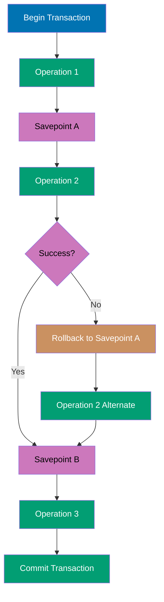

```elixir
defmodule User do
                                                      # => Module starts
  use Ecto.Schema
                                                      # => Imports Ecto

  schema "users" do
                                                      # => Schema declaration
    field :name, :string
                                                      # => Field defined
    field :balance, :decimal
                                                      # => Field defined
    timestamps()
                                                      # => Operation executes
  end
                                                      # => Block ends
end
                                                      # => Block ends

# Insert test user
                                                      # => Operation executes
{:ok, user} = Repo.insert(%User{name: "Liam", balance: Decimal.new("100.00")})
                                                      # => Database operation

# Transaction with savepoints
                                                      # => Operation executes
Repo.transaction(fn ->
                                                      # => Database operation
  # Update 1: Deduct 20
                                                      # => Operation executes
  changeset1 = Ecto.Changeset.change(user, balance: Decimal.sub(user.balance, Decimal.new("20.00")))
                                                      # => Value assigned
  {:ok, user_v1} = Repo.update(changeset1)
                                                      # => Database operation
                                      # => balance is 80.00

  # Savepoint
                                                      # => Operation executes
  Repo.transaction(fn ->
                                                      # => Database operation
    # Update 2: Deduct another 30
                                                      # => Operation executes
    changeset2 = Ecto.Changeset.change(user_v1, balance: Decimal.sub(user_v1.balance, Decimal.new("30.00")))
                                                      # => Value assigned
    {:ok, user_v2} = Repo.update(changeset2)
                                                      # => Database operation
                                      # => balance is 50.00

    # Rollback to savepoint (balance back to 80)
                                                      # => Operation executes
    if Decimal.lt?(user_v2.balance, Decimal.new("60.00")) do
                                                      # => Operation executes
      Repo.rollback(:insufficient_funds)
                                                      # => Database operation
                                      # => Rollback inner transaction only
    end
                                                      # => Block ends
  end)
                                                      # => Block ends

  # Outer transaction continues
                                                      # => Operation executes
  # Balance is still 80.00 (savepoint rollback worked)
                                                      # => Operation executes
  final = Repo.get(User, user.id)     # => final.balance is 80.00
  final
                                                      # => Operation executes
end)
                                                      # => Block ends

loaded = Repo.get(User, user.id)
                                                      # => Database operation
IO.inspect(loaded.balance)            # => Output: #Decimal<80.00>
```

**Key Takeaway**: Nested Repo.transaction/1 calls create savepoints automatically in PostgreSQL, allowing partial rollbacks while keeping outer transaction intact.

**Why It Matters**: Complex business operations sometimes need to attempt risky sub-operations that might fail without abandoning the entire transaction. Savepoints enable patterns like "try the fast path, fall back to slow path" within a single atomic transaction. Production financial systems use savepoints for multi-step transfers where individual steps can be retried without restarting the entire operation.

---

### Example 74: Schema-less Changesets for Validation

Changesets can validate data without schemas, useful for form validations or API input validation before persistence.

```elixir
import Ecto.Changeset
                                                      # => Operation executes

# Schema-less changeset for registration form
                                                      # => Operation executes
def validate_registration(params) do
                                                      # => Operation executes
  types = %{
                                                      # => Value assigned
    email: :string,
                                                      # => Operation executes
    password: :string,
                                                      # => Operation executes
    age: :integer
                                                      # => Operation executes
  }                                   # => Define field types

  {%{}, types}                        # => Empty data, type spec
  |> cast(params, Map.keys(types))    # => Cast params
  |> validate_required([:email, :password])
                                                      # => Operation executes
  |> validate_format(:email, ~r/@/)
                                                      # => Operation executes
  |> validate_length(:password, min: 8)
                                                      # => Operation executes
  |> validate_number(:age, greater_than_or_equal_to: 18)
                                                      # => Operation executes
end
                                                      # => Block ends

# Valid registration
                                                      # => Operation executes
valid_params = %{email: "user@example.com", password: "secure123", age: 25}
                                                      # => Value assigned
changeset = validate_registration(valid_params)
                                                      # => Value assigned
                                      # => changeset.valid? is true

# Invalid registration
                                                      # => Operation executes
invalid_params = %{email: "invalid", password: "short", age: 15}
                                                      # => Value assigned
invalid_changeset = validate_registration(invalid_params)
                                                      # => Value assigned
                                      # => invalid_changeset.valid? is false
                                      # => errors: [email: {"has invalid format"}, password: {"too short"}, age: {"must be >= 18"}]

IO.inspect(changeset.valid?)          # => Output: true
IO.inspect(invalid_changeset.valid?)  # => Output: false
IO.inspect(invalid_changeset.errors)  # => Output: [email: {...}, password: {...}, age: {...}]
```

**Key Takeaway**: Schema-less changesets validate arbitrary maps against type specs, useful for validating external input before deciding which schema to insert into or for multi-step forms.

**Why It Matters**: Not all validation requires database persistence—search forms, API request validation, and multi-step wizards need validation without schemas. Schema-less changesets enable reusing Ecto's validation ecosystem for any data structure, providing consistent error handling and i18n support. Production systems use this pattern for complex form flows where validation happens before determining which entities to create.

---

### Example 75: Custom Changeset Validators

Create reusable custom validators for domain-specific validation logic by defining functions that add errors to changesets.

```elixir
defmodule CustomValidators do
                                                      # => Module starts
  import Ecto.Changeset
                                                      # => Operation executes

  def validate_url(changeset, field) do
                                                      # => Field defined
    validate_change(changeset, field, fn ^field, value ->
                                                      # => Field defined
      uri = URI.parse(value)
                                                      # => Value assigned
      if uri.scheme in ["http", "https"] and uri.host do
                                                      # => Operation executes
        []                            # => Valid URL, no errors
      else
                                                      # => Operation executes
        [{field, "must be a valid HTTP/HTTPS URL"}]
                                                      # => Field defined
                                      # => Add error
      end
                                                      # => Block ends
    end)
                                                      # => Block ends
  end
                                                      # => Block ends

  def validate_not_in_list(changeset, field, forbidden_values) do
                                                      # => Field defined
    validate_change(changeset, field, fn ^field, value ->
                                                      # => Field defined
      if value in forbidden_values do
                                                      # => Operation executes
        [{field, "is reserved and cannot be used"}]
                                                      # => Field defined
      else
                                                      # => Operation executes
        []
                                                      # => Operation executes
      end
                                                      # => Block ends
    end)
                                                      # => Block ends
  end
                                                      # => Block ends
end
                                                      # => Block ends

defmodule Website do
                                                      # => Module starts
  use Ecto.Schema
                                                      # => Imports Ecto
  import Ecto.Changeset
                                                      # => Operation executes
  import CustomValidators
                                                      # => Operation executes

  schema "websites" do
                                                      # => Schema declaration
    field :name, :string
                                                      # => Field defined
    field :url, :string
                                                      # => Field defined
    timestamps()
                                                      # => Operation executes
  end
                                                      # => Block ends

  def changeset(website, params \\ %{}) do
                                                      # => Operation executes
    website
                                                      # => Operation executes
    |> cast(params, [:name, :url])
                                                      # => Operation executes
    |> validate_required([:name, :url])
                                                      # => Operation executes
    |> validate_url(:url)             # => Custom URL validator
    |> validate_not_in_list(:name, ["admin", "root", "system"])
                                                      # => Operation executes
                                      # => Custom forbidden names validator
  end
                                                      # => Block ends
end
                                                      # => Block ends

# Valid website
                                                      # => Operation executes
valid = Website.changeset(%Website{}, %{name: "myblog", url: "https://example.com"})
                                                      # => Value assigned
                                      # => valid.valid? is true

# Invalid URL
                                                      # => Operation executes
invalid_url = Website.changeset(%Website{}, %{name: "test", url: "not-a-url"})
                                                      # => Value assigned
                                      # => invalid_url.valid? is false
                                      # => errors: [url: {"must be a valid HTTP/HTTPS URL"}]

# Forbidden name
                                                      # => Operation executes
invalid_name = Website.changeset(%Website{}, %{name: "admin", url: "https://example.com"})
                                                      # => Value assigned
                                      # => invalid_name.valid? is false
                                      # => errors: [name: {"is reserved and cannot be used"}]

IO.inspect(valid.valid?)              # => Output: true
IO.inspect(invalid_url.errors)        # => Output: [url: {"must be a valid HTTP/HTTPS URL", [...]}]
```

**Key Takeaway**: Use validate_change/3 to create custom validators that add field-specific errors, and extract common validators into modules for reusability across schemas.

**Why It Matters**: Complex validation (password confirmation, dependent fields, cross-field constraints) requires custom changeset functions beyond built-in validators. Production registration flows use custom changesets to validate password matches, conditional requirements (billing info when paid plan), and business rules spanning multiple fields. This pattern centralizes domain logic and enables testing validation rules independently from database operations.

---

### Example 76: Unsafe Fragments and SQL Injection Prevention

Understanding when fragments are safe vs unsafe is critical for security. Always use parameter binding for user input.

```elixir
defmodule User do
                                                      # => Module starts
  use Ecto.Schema
                                                      # => Imports Ecto

  schema "users" do
                                                      # => Schema declaration
    field :name, :string
                                                      # => Field defined
    field :email, :string
                                                      # => Field defined
    timestamps()
                                                      # => Operation executes
  end
                                                      # => Block ends
end
                                                      # => Block ends

import Ecto.Query
                                                      # => Operation executes

# UNSAFE: String interpolation in fragment (NEVER DO THIS)
                                                      # => Operation executes
# user_input = "admin' OR '1'='1"
                                                      # => Value assigned
# unsafe_query = from u in User,
                                                      # => Value assigned
#   where: fragment("email = '#{user_input}'")
                                                      # => Value assigned
                                      # => SQL INJECTION VULNERABILITY!
                                      # => Attacker can inject arbitrary SQL

# SAFE: Parameter binding in fragment
                                                      # => Operation executes
safe_user_input = "admin@example.com"
                                                      # => Value assigned
safe_query = from u in User,
                                                      # => Value assigned
  where: fragment("LOWER(email) = LOWER(?)", ^safe_user_input)
                                                      # => Value assigned
                                      # => SQL: WHERE LOWER(email) = LOWER($1)
                                      # => Database escapes parameter safely

users = Repo.all(safe_query)          # => Safe execution

# SAFE: Ecto DSL (preferred when possible)
                                                      # => Operation executes
safest_query = from u in User,
                                                      # => Value assigned
  where: ilike(u.email, ^safe_user_input)
                                                      # => Operation executes
                                      # => Ecto handles escaping automatically

IO.inspect(length(users))             # => Output: count of matching users
```

**Key Takeaway**: Never interpolate user input into fragment strings; always use parameter placeholders (?) with pin operator (^variable) to prevent SQL injection, and prefer Ecto DSL over fragments when possible.

**Why It Matters**: SQL injection remains one of the most critical web vulnerabilities, enabling attackers to read, modify, or delete entire databases. Fragments bypass Ecto's automatic parameterization, making them the most dangerous part of query construction. Production code reviews must scrutinize every fragment for string interpolation, and teams should establish policies preferring Ecto DSL or requiring security review for any fragment usage.

---

### Example 77: Polymorphic Associations with Type Field

Polymorphic associations allow a record to belong to multiple parent types via a type discriminator field, common for comments, attachments, etc.

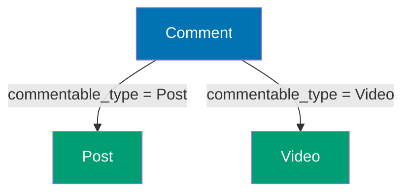

```elixir
defmodule Post do
                                                      # => Module starts
  use Ecto.Schema
                                                      # => Imports Ecto

  schema "posts" do
                                                      # => Schema declaration
    field :title, :string
                                                      # => Field defined
    timestamps()
                                                      # => Operation executes
  end
                                                      # => Block ends
end
                                                      # => Block ends

defmodule Video do
                                                      # => Module starts
  use Ecto.Schema
                                                      # => Imports Ecto

  schema "videos" do
                                                      # => Schema declaration
    field :url, :string
                                                      # => Field defined
    timestamps()
                                                      # => Operation executes
  end
                                                      # => Block ends
end
                                                      # => Block ends

defmodule Comment do
                                                      # => Module starts
  use Ecto.Schema
                                                      # => Imports Ecto

  schema "comments" do
                                                      # => Schema declaration
    field :content, :string
                                                      # => Field defined
    field :commentable_id, :integer   # => Foreign key (polymorphic)
    field :commentable_type, :string  # => Type discriminator ("Post" or "Video")
    timestamps()
                                                      # => Operation executes
  end
                                                      # => Block ends

  def for_commentable(query \\ __MODULE__, type, id) do
                                                      # => Operation executes
    import Ecto.Query
                                                      # => Operation executes
    from c in query,
                                                      # => Operation executes
      where: c.commentable_type == ^type and c.commentable_id == ^id
                                                      # => Value assigned
  end
                                                      # => Block ends
end
                                                      # => Block ends

# Create post and video
                                                      # => Operation executes
{:ok, post} = Repo.insert(%Post{title: "My Post"})
                                                      # => Database operation
{:ok, video} = Repo.insert(%Video{url: "https://example.com/video.mp4"})
                                                      # => Database operation

# Add comments to different types
                                                      # => Operation executes
{:ok, comment1} = Repo.insert(%Comment{content: "Great post!", commentable_type: "Post", commentable_id: post.id})
                                                      # => Database operation
{:ok, comment2} = Repo.insert(%Comment{content: "Nice video!", commentable_type: "Video", commentable_id: video.id})
                                                      # => Database operation

# Query comments for post
                                                      # => Operation executes
post_comments = Comment.for_commentable("Post", post.id) |> Repo.all()
                                                      # => Database operation
                                      # => post_comments is [%Comment{content: "Great post!"}]

# Query comments for video
                                                      # => Operation executes
video_comments = Comment.for_commentable("Video", video.id) |> Repo.all()
                                                      # => Database operation
                                      # => video_comments is [%Comment{content: "Nice video!"}]

IO.inspect(length(post_comments))     # => Output: 1
IO.inspect(length(video_comments))    # => Output: 1
```

**Key Takeaway**: Polymorphic associations use type + id fields to reference multiple parent types, but they sacrifice referential integrity (no foreign key constraint) and require manual type checking.

**Why It Matters**: Comments, attachments, and audit logs shared across multiple parent types (users, posts, products) benefit from polymorphic associations that avoid duplicate tables. Production CMS systems use polymorphic patterns for tagging, commenting, and activity tracking without creating comments_for_posts, comments_for_users tables. However, polymorphism sacrifices database foreign keys, so production systems must enforce referential integrity in application code.

---

### Example 78: Using Ecto.Query.API for Type Casting

Ecto.Query.API provides type-safe functions for queries, enabling explicit type casting when needed.

```elixir
defmodule User do
                                                      # => Module starts
  use Ecto.Schema
                                                      # => Imports Ecto

  schema "users" do
                                                      # => Schema declaration
    field :name, :string
                                                      # => Field defined
    field :data, :map                 # => JSONB field in PostgreSQL
    timestamps()
                                                      # => Operation executes
  end
                                                      # => Block ends
end
                                                      # => Block ends

import Ecto.Query
                                                      # => Operation executes

# Insert test data with JSON field
                                                      # => Field defined
Repo.insert(%User{name: "Mia", data: %{"age" => 30, "city" => "NYC"}})
                                                      # => Database operation

# Query JSON field with type casting
                                                      # => Field defined
query = from u in User,
                                                      # => Value assigned
  where: fragment("?->>'age' = ?", u.data, type(^"30", :string)),
                                                      # => Value assigned
                                      # => Cast parameter to string type
  select: u
                                                      # => Operation executes

users = Repo.all(query)               # => users is [%User{name: "Mia"}]
                                      # => SQL: WHERE data->>'age' = '30'

# Using Ecto.Query.API.type/2 for explicit casting
                                                      # => Operation executes
typed_query = from u in User,
                                                      # => Value assigned
  where: fragment("(?->>'age')::integer > ?", u.data, type(^25, :integer)),
                                                      # => Operation executes
                                      # => Cast age to integer for comparison
  select: u
                                                      # => Operation executes

typed_users = Repo.all(typed_query)   # => typed_users is [%User{name: "Mia"}]

IO.inspect(length(users))             # => Output: 1
IO.inspect(length(typed_users))       # => Output: 1
```

**Key Takeaway**: Use type/2 to explicitly cast values to specific Ecto types in queries, ensuring type safety when working with JSON fields or dynamic data.

**Why It Matters**: JSON fields and dynamic data don't have compile-time type checking, leading to runtime type coercion errors or incorrect comparisons. Explicit type casting prevents subtle bugs where string "30" doesn't equal integer 30 in database comparisons. Production systems querying JSON data use type/2 to ensure predictable behavior across different database backends and Ecto versions.

---

### Example 79: Repo.exists? for Existence Checks

Repo.exists?/1 checks if any records match a query without loading data, more efficient than counting or fetching records.

```elixir
defmodule User do
                                                      # => Module starts
  use Ecto.Schema
                                                      # => Imports Ecto

  schema "users" do
                                                      # => Schema declaration
    field :email, :string
                                                      # => Field defined
    field :active, :boolean
                                                      # => Field defined
    timestamps()
                                                      # => Operation executes
  end
                                                      # => Block ends
end
                                                      # => Block ends

import Ecto.Query
                                                      # => Operation executes

# Insert test data
                                                      # => Operation executes
Repo.insert(%User{email: "active@example.com", active: true})
                                                      # => Database operation
Repo.insert(%User{email: "inactive@example.com", active: false})
                                                      # => Database operation

# Check if any active users exist
                                                      # => Operation executes
query = from u in User, where: u.active == true
                                                      # => Value assigned

exists = Repo.exists?(query)          # => exists is true
                                      # => SQL: SELECT EXISTS(SELECT 1 FROM users WHERE active = TRUE)
                                      # => Much faster than COUNT or fetching

# Check if specific email exists
                                                      # => Operation executes
email_query = from u in User, where: u.email == "unknown@example.com"
                                                      # => Value assigned
email_exists = Repo.exists?(email_query)
                                                      # => Database operation
                                      # => email_exists is false

IO.inspect(exists)                    # => Output: true
IO.inspect(email_exists)              # => Output: false
```

**Key Takeaway**: Repo.exists?/1 generates efficient EXISTS SQL queries that short-circuit as soon as one match is found, making it faster than counting for existence checks.

**Why It Matters**: Authorization checks, duplicate detection, and conditional UI rendering often need to know if ANY matching record exists, not the count. Using COUNT(\*) > 0 or Repo.all |> length > 0 wastes resources scanning entire result sets. Production systems use Repo.exists? for permission checks, unique validation previews, and any boolean condition that doesn't need the actual count.

---

### Example 80: Aggregates in Subqueries

Subqueries can compute aggregates that are used in outer query filters, enabling complex filtering based on aggregated data.

```elixir
defmodule User do
                                                      # => Module starts
  use Ecto.Schema
                                                      # => Imports Ecto

  schema "users" do
                                                      # => Schema declaration
    field :name, :string
                                                      # => Field defined
    has_many :posts, Post
                                                      # => Operation executes
    timestamps()
                                                      # => Operation executes
  end
                                                      # => Block ends
end
                                                      # => Block ends

defmodule Post do
                                                      # => Module starts
  use Ecto.Schema
                                                      # => Imports Ecto

  schema "posts" do
                                                      # => Schema declaration
    field :title, :string
                                                      # => Field defined
    belongs_to :user, User
                                                      # => Operation executes
    timestamps()
                                                      # => Operation executes
  end
                                                      # => Block ends
end
                                                      # => Block ends

import Ecto.Query
                                                      # => Operation executes

# Insert test data
                                                      # => Operation executes
{:ok, user1} = Repo.insert(%User{name: "Noah"})
                                                      # => Database operation
{:ok, user2} = Repo.insert(%User{name: "Olivia"})
                                                      # => Database operation
Repo.insert(%Post{title: "Post 1", user_id: user1.id})
                                                      # => Database operation
Repo.insert(%Post{title: "Post 2", user_id: user1.id})
                                                      # => Database operation
Repo.insert(%Post{title: "Post 3", user_id: user1.id})
                                                      # => Database operation
Repo.insert(%Post{title: "Post 4", user_id: user2.id})
                                                      # => Database operation

# Find users with more than 2 posts using subquery
                                                      # => Operation executes
post_count_subquery = from p in Post,
                                                      # => Value assigned
  group_by: p.user_id,
                                                      # => Operation executes
  select: %{user_id: p.user_id, count: count(p.id)}
                                                      # => Operation executes

query = from u in User,
                                                      # => Value assigned
  join: pc in subquery(post_count_subquery), on: pc.user_id == u.id,
                                                      # => Value assigned
  where: pc.count > 2,
                                                      # => Operation executes
  select: u
                                                      # => Operation executes

users = Repo.all(query)               # => users is [%User{name: "Noah"}]
                                      # => SQL: SELECT u.* FROM users u
                                      # =>      JOIN (SELECT user_id, COUNT(id) as count
                                      # =>            FROM posts GROUP BY user_id) pc
                                      # =>      ON pc.user_id = u.id
                                      # =>      WHERE pc.count > 2

IO.inspect(length(users))             # => Output: 1
IO.inspect(hd(users).name)            # => Output: "Noah"
```

**Key Takeaway**: Subqueries with aggregates enable filtering parent records by aggregated child data, and you must join the subquery result to access aggregate values in WHERE clauses.

**Why It Matters**: Complex filters like "users with >10 posts" or "products with total sales >$1000" require aggregating child records and filtering parents by the result. Without subqueries, you'd fetch all parents with children and filter in memory, destroying performance for large datasets. Production analytics and reporting use aggregate subqueries for efficient data-driven filtering that scales to millions of records.

---

### Example 81: Using Repo.in_transaction? for Context Awareness

Repo.in_transaction?/0 checks if code is executing inside a transaction, useful for functions that behave differently in transactional contexts.

```elixir
defmodule UserService do
                                                      # => Module starts
  def create_user_with_posts(user_params, posts_params) do
                                                      # => Operation executes
    if Repo.in_transaction?() do
                                                      # => Database operation
      # Already in transaction, just execute
                                                      # => Operation executes
      do_create_user_with_posts(user_params, posts_params)
                                                      # => Operation executes
    else
                                                      # => Operation executes
      # Not in transaction, wrap in one
                                                      # => Operation executes
      Repo.transaction(fn ->
                                                      # => Database operation
        do_create_user_with_posts(user_params, posts_params)
                                                      # => Operation executes
      end)
                                                      # => Block ends
    end
                                                      # => Block ends
  end
                                                      # => Block ends

  defp do_create_user_with_posts(user_params, posts_params) do
                                                      # => Operation executes
    {:ok, user} = Repo.insert(%User{name: user_params.name})
                                                      # => Database operation
    posts = Enum.map(posts_params, fn p ->
                                                      # => Value assigned
      Repo.insert!(%Post{title: p.title, user_id: user.id})
                                                      # => Database operation
    end)
                                                      # => Block ends
    {user, posts}
                                                      # => Operation executes
  end
                                                      # => Block ends
end
                                                      # => Block ends

# Call from outside transaction
                                                      # => Operation executes
result1 = UserService.create_user_with_posts(%{name: "Paul"}, [%{title: "Post 1"}])
                                                      # => Value assigned
                                      # => Wrapped in transaction automatically
                                      # => SQL: BEGIN; INSERT users...; INSERT posts...; COMMIT;

# Call from inside transaction
                                                      # => Operation executes
Repo.transaction(fn ->
                                                      # => Database operation
  result2 = UserService.create_user_with_posts(%{name: "Quinn"}, [%{title: "Post 2"}])
                                                      # => Value assigned
                                      # => Uses existing transaction (no nested BEGIN)
  result2
                                                      # => Operation executes
end)
                                                      # => Block ends

IO.inspect("UserService handles transaction context automatically")
                                                      # => Operation executes
```

**Key Takeaway**: Use Repo.in_transaction?/0 to write functions that adapt to transactional context, avoiding nested transaction overhead when already inside a transaction.

**Why It Matters**: Library functions and service modules don't know their calling context—they might be called standalone or within an existing transaction. Blindly wrapping operations in transactions creates nested savepoints that add overhead and complexity. Production service layers use context detection to provide transactional guarantees when needed while avoiding unnecessary nesting when already protected.

---

### Example 82: Conditional Updates with Repo.update_all and Expressions

Repo.update_all/3 supports complex update expressions including conditionals, enabling atomic updates based on current values.

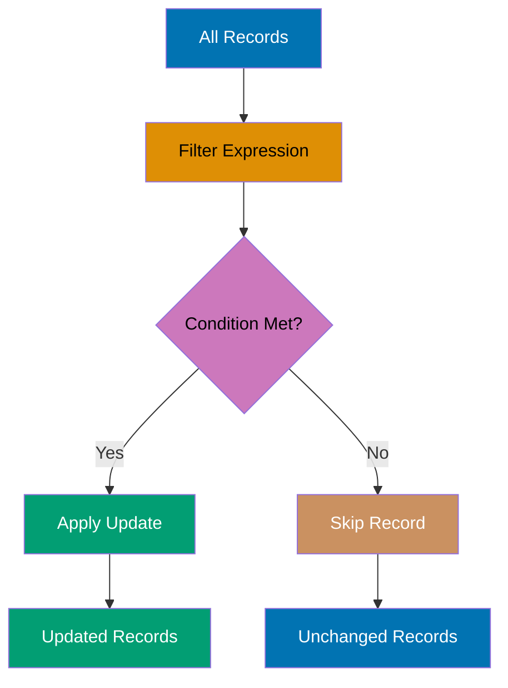

```elixir
defmodule Product do
                                                      # => Module starts
  use Ecto.Schema
                                                      # => Imports Ecto

  schema "products" do
                                                      # => Schema declaration
    field :name, :string
                                                      # => Field defined
    field :price, :decimal
                                                      # => Field defined
    field :discount_percent, :integer
                                                      # => Field defined
    timestamps()
                                                      # => Operation executes
  end
                                                      # => Block ends
end
                                                      # => Block ends

import Ecto.Query
                                                      # => Operation executes

# Insert test data
                                                      # => Operation executes
Repo.insert(%Product{name: "Widget", price: Decimal.new("100.00"), discount_percent: 0})
                                                      # => Database operation
Repo.insert(%Product{name: "Gadget", price: Decimal.new("200.00"), discount_percent: 10})
                                                      # => Database operation

# Apply 10% discount to all products (atomic calculation)
                                                      # => Operation executes
query = from p in Product
                                                      # => Value assigned

{count, _} = Repo.update_all(query,
                                                      # => Database operation
  set: [price: dynamic([p], p.price * (1.0 - p.discount_percent / 100.0))]
                                                      # => Operation executes
)                                     # => count is 2
                                      # => SQL: UPDATE products
                                      # =>      SET price = price * (1.0 - discount_percent / 100.0)

# Verify updates
                                                      # => Operation executes
products = Repo.all(Product)
                                                      # => Database operation
# Widget: 100 * (1.0 - 0/100) = 100.00
                                                      # => Value assigned
# Gadget: 200 * (1.0 - 10/100) = 180.00
                                                      # => Value assigned

IO.inspect(count)                     # => Output: 2
```

**Key Takeaway**: Use dynamic/2 in Repo.update_all/3 to create update expressions based on current field values, enabling atomic updates without read-then-write race conditions.

**Why It Matters**: Atomic updates eliminate race conditions in concurrent systems where multiple processes might read the same value and overwrite each other's changes. Production inventory systems use expressions like stock = stock - 1 instead of read-modify-write patterns that can oversell products. This pattern is essential for counters, balances, and any field where concurrent updates are expected.

---

### Example 83: Repo Callbacks with Ecto.Repo.Callbacks

While Ecto doesn't have built-in repository callbacks, you can implement them using wrapper functions or custom Repo modules.

```elixir
defmodule MyApp.Repo do
                                                      # => Module starts
  use Ecto.Repo,
                                                      # => Imports Ecto
    otp_app: :my_app,
                                                      # => Operation executes
    adapter: Ecto.Adapters.Postgres
                                                      # => Operation executes

  # Wrapper for insert with logging
                                                      # => Operation executes
  def insert_with_logging(changeset_or_struct, opts \\ []) do
                                                      # => Operation executes
    result = insert(changeset_or_struct, opts)
                                                      # => Value assigned

    case result do
                                                      # => Operation executes
      {:ok, struct} ->
                                                      # => Operation executes
        IO.inspect("Inserted: #{inspect(struct)}")
                                                      # => Operation executes
        result
                                                      # => Operation executes
      {:error, changeset} ->
                                                      # => Operation executes
        IO.inspect("Insert failed: #{inspect(changeset.errors)}")
                                                      # => Operation executes
        result
                                                      # => Operation executes
    end
                                                      # => Block ends
  end
                                                      # => Block ends

  # Wrapper for update with audit
                                                      # => Operation executes
  def update_with_audit(changeset, opts \\ []) do
                                                      # => Operation executes
    result = update(changeset, opts)
                                                      # => Value assigned

    case result do
                                                      # => Operation executes
      {:ok, struct} ->
                                                      # => Operation executes
        # Log audit trail
                                                      # => Operation executes
        IO.inspect("Updated #{struct.__struct__} id=#{struct.id}")
                                                      # => Value assigned
        result
                                                      # => Operation executes
      error ->
                                                      # => Operation executes
        error
                                                      # => Operation executes
    end
                                                      # => Block ends
  end
                                                      # => Block ends
end
                                                      # => Block ends

defmodule User do
                                                      # => Module starts
  use Ecto.Schema
                                                      # => Imports Ecto

  schema "users" do
                                                      # => Schema declaration
    field :name, :string
                                                      # => Field defined
    timestamps()
                                                      # => Operation executes
  end
                                                      # => Block ends
end
                                                      # => Block ends

# Use custom repo functions
                                                      # => Operation executes
{:ok, user} = MyApp.Repo.insert_with_logging(%User{name: "Ruby"})
                                                      # => Database operation
                                      # => Output: Inserted: %User{id: 1, name: "Ruby"}

changeset = Ecto.Changeset.change(user, name: "Ruby Updated")
                                                      # => Value assigned
{:ok, updated} = MyApp.Repo.update_with_audit(changeset)
                                                      # => Database operation
                                      # => Output: Updated User id=1
```

**Key Takeaway**: Implement custom Repo functions that wrap standard operations to add logging, auditing, or other cross-cutting concerns without polluting business logic.

**Why It Matters**: Cross-cutting concerns like audit logging, metrics collection, and event publishing shouldn't clutter every insert/update call site. Custom repo wrappers centralize these concerns, ensuring consistent behavior across the application. Production systems use this pattern to capture who changed what when, enabling compliance reporting and debugging production issues without modifying business logic code.

---

### Example 84: Schema Reflection with **schema**

Ecto schemas expose metadata via **schema**/1, useful for metaprogramming and building generic functions.

```elixir
defmodule User do
                                                      # => Module starts
  use Ecto.Schema
                                                      # => Imports Ecto

  schema "users" do
                                                      # => Schema declaration
    field :name, :string
                                                      # => Field defined
    field :email, :string
                                                      # => Field defined
    field :age, :integer
                                                      # => Field defined
    has_many :posts, Post
                                                      # => Operation executes
    timestamps()
                                                      # => Operation executes
  end
                                                      # => Block ends
end
                                                      # => Block ends

# Introspect schema
                                                      # => Schema declaration
table = User.__schema__(:source)      # => "users"
primary_key = User.__schema__(:primary_key)
                                                      # => Schema declaration
                                      # => [:id]
fields = User.__schema__(:fields)     # => [:id, :name, :email, :age, :inserted_at, :updated_at]
associations = User.__schema__(:associations)
                                                      # => Schema declaration
                                      # => [:posts]
field_type = User.__schema__(:type, :name)
                                                      # => Schema declaration
                                      # => :string

# Generic function using schema reflection
                                                      # => Schema declaration
defmodule SchemaInspector do
                                                      # => Module starts
  def inspect_schema(schema_module) do
                                                      # => Schema declaration
    %{
                                                      # => Operation executes
      table: schema_module.__schema__(:source),
                                                      # => Schema declaration
      fields: schema_module.__schema__(:fields),
                                                      # => Schema declaration
      associations: schema_module.__schema__(:associations),
                                                      # => Schema declaration
      primary_key: schema_module.__schema__(:primary_key)
                                                      # => Schema declaration
    }
                                                      # => Operation executes
  end
                                                      # => Block ends
end
                                                      # => Block ends

info = SchemaInspector.inspect_schema(User)
                                                      # => Schema declaration

IO.inspect(info.table)                # => Output: "users"
IO.inspect(info.fields)               # => Output: [:id, :name, :email, :age, :inserted_at, :updated_at]
IO.inspect(info.associations)         # => Output: [:posts]
```

**Key Takeaway**: Use **schema**/1 to introspect schema metadata at runtime, enabling generic functions that work across different schemas without hardcoding field names.

**Why It Matters**: Generic admin interfaces, API serializers, and audit systems need to work across all schemas without hardcoding field lists. Schema reflection enables building reusable components that adapt to any model—forms that render all fields, CSV exports that include every column, or diff views that show all changes. Production admin tooling leverages introspection for maintainability.

---

### Example 85: Production Best Practices Checklist

This example summarizes key patterns and best practices for production Ecto usage, tying together advanced concepts.

```elixir
# 1. ALWAYS use parameter binding (prevent SQL injection)
                                                      # => Operation executes
defmodule SafeQueries do
                                                      # => Module starts
  import Ecto.Query
                                                      # => Operation executes

  def search_users(name_input) do
                                                      # => Operation executes
    from u in User,
                                                      # => Operation executes
      where: ilike(u.name, ^"%#{name_input}%")
                                                      # => Operation executes
                                      # => SAFE: Parameter binding with ^
  end
                                                      # => Block ends
end
                                                      # => Block ends

# 2. ALWAYS preload associations (prevent N+1)
                                                      # => Operation executes
defmodule UserController do
                                                      # => Module starts
  def index do
                                                      # => Operation executes
    users = User
                                                      # => Value assigned
      |> Repo.all()
                                                      # => Database operation
      |> Repo.preload(:posts)         # => Load all associations upfront
  end
                                                      # => Block ends
end
                                                      # => Block ends

# 3. Use indexes on foreign keys and WHERE clauses
                                                      # => Operation executes
defmodule Repo.Migrations.AddProductionIndexes do
                                                      # => Module starts
  use Ecto.Migration
                                                      # => Imports Ecto

  def change do
                                                      # => Operation executes
    create index(:posts, [:user_id]) # => Foreign key index
    create index(:users, [:email])   # => Frequently searched field
    create index(:posts, [:published_at], where: "status = 'published'")
                                                      # => Value assigned
                                      # => Partial index
  end
                                                      # => Block ends
end
                                                      # => Block ends

# 4. Use transactions for multi-step operations
                                                      # => Operation executes
defmodule TransferMoney do
                                                      # => Module starts
  def transfer(from_id, to_id, amount) do
                                                      # => Operation executes
    Repo.transaction(fn ->
                                                      # => Database operation
      from_user = Repo.get!(User, from_id)
                                                      # => Database operation
      to_user = Repo.get!(User, to_id)
                                                      # => Database operation

      # Deduct from sender
                                                      # => Block ends
      from_changeset = Ecto.Changeset.change(from_user, balance: Decimal.sub(from_user.balance, amount))
                                                      # => Value assigned
      {:ok, _} = Repo.update(from_changeset)
                                                      # => Database operation

      # Add to receiver
                                                      # => Operation executes
      to_changeset = Ecto.Changeset.change(to_user, balance: Decimal.add(to_user.balance, amount))
                                                      # => Value assigned
      {:ok, _} = Repo.update(to_changeset)
                                                      # => Database operation
    end)
                                                      # => Block ends
  end
                                                      # => Block ends
end
                                                      # => Block ends

# 5. Use Repo.stream for large datasets
                                                      # => Database operation
defmodule DataExport do
                                                      # => Module starts
  import Ecto.Query
                                                      # => Operation executes

  def export_users do
                                                      # => Operation executes
    Repo.transaction(fn ->
                                                      # => Database operation
      User
                                                      # => Operation executes
      |> Repo.stream()                # => Stream instead of loading all
      |> Stream.map(&format_user/1)
                                                      # => Operation executes
      |> Enum.to_list()
                                                      # => Operation executes
    end)
                                                      # => Block ends
  end
                                                      # => Block ends

  defp format_user(user), do: "#{user.name},#{user.email}"
                                                      # => Operation executes
end
                                                      # => Block ends

# 6. Use unique constraints for data integrity
                                                      # => Operation executes
defmodule User do
                                                      # => Module starts
  use Ecto.Schema
                                                      # => Imports Ecto
  import Ecto.Changeset
                                                      # => Operation executes

  schema "users" do
                                                      # => Schema declaration
    field :email, :string
                                                      # => Field defined
    timestamps()
                                                      # => Operation executes
  end
                                                      # => Block ends

  def changeset(user, params) do
                                                      # => Operation executes
    user
                                                      # => Operation executes
    |> cast(params, [:email])
                                                      # => Operation executes
    |> validate_required([:email])
                                                      # => Operation executes
    |> unique_constraint(:email)      # => Enforce uniqueness
  end
                                                      # => Block ends
end
                                                      # => Block ends

# 7. Use Ecto.Multi for complex transactions
                                                      # => Operation executes
defmodule CreateUserWithPosts do
                                                      # => Module starts
  alias Ecto.Multi
                                                      # => Operation executes

  def create(user_params, posts_params) do
                                                      # => Operation executes
    Multi.new()
                                                      # => Operation executes
    |> Multi.insert(:user, %User{name: user_params.name})
                                                      # => Operation executes
    |> Multi.insert_all(:posts, Post, fn %{user: user} ->
                                                      # => Operation executes
      Enum.map(posts_params, &Map.put(&1, :user_id, user.id))
                                                      # => Operation executes
    end)
                                                      # => Block ends
    |> Repo.transaction()
                                                      # => Database operation
  end
                                                      # => Block ends
end
                                                      # => Block ends

# 8. Use EXPLAIN to verify query plans
                                                      # => Operation executes
defmodule QueryAnalyzer do
                                                      # => Module starts
  import Ecto.Query
                                                      # => Operation executes

  def analyze_query do
                                                      # => Operation executes
    query = from u in User,
                                                      # => Value assigned
      join: p in assoc(u, :posts),
                                                      # => Operation executes
      where: p.published == true
                                                      # => Value assigned

    Ecto.Adapters.SQL.explain(Repo, :all, query)
                                                      # => Operation executes
                                      # => Check if indexes are used
  end
                                                      # => Block ends
end
                                                      # => Block ends

# 9. Use optimistic locking for concurrent updates
                                                      # => Operation executes
defmodule Product do
                                                      # => Module starts
  use Ecto.Schema
                                                      # => Imports Ecto

  schema "products" do
                                                      # => Schema declaration
    field :name, :string
                                                      # => Field defined
    field :stock, :integer
                                                      # => Field defined
    field :version, :integer, default: 1
                                                      # => Field defined
                                      # => Optimistic lock
    timestamps()
                                                      # => Operation executes
  end
                                                      # => Block ends
end
                                                      # => Block ends

# 10. Validate at changeset level, not database level
                                                      # => Operation executes
defmodule Order do
                                                      # => Module starts
  use Ecto.Schema
                                                      # => Imports Ecto
  import Ecto.Changeset
                                                      # => Operation executes

  schema "orders" do
                                                      # => Schema declaration
    field :total, :decimal
                                                      # => Field defined
    field :status, :string
                                                      # => Field defined
    timestamps()
                                                      # => Operation executes
  end
                                                      # => Block ends

  def changeset(order, params) do
                                                      # => Operation executes
    order
                                                      # => Operation executes
    |> cast(params, [:total, :status])
                                                      # => Operation executes
    |> validate_required([:total, :status])
                                                      # => Operation executes
    |> validate_number(:total, greater_than: 0)
                                                      # => Operation executes
    |> validate_inclusion(:status, ["pending", "confirmed", "shipped"])
                                                      # => Block ends
                                      # => Validate before database
  end
                                                      # => Block ends
end
                                                      # => Block ends
```

**Key Takeaway**: Production Ecto requires: parameter binding for security, preloading for performance, indexes for speed, transactions for consistency, streaming for large data, constraints for integrity, Multi for complex operations, EXPLAIN for optimization, optimistic locking for concurrency, and changeset validation for data quality.

**Why It Matters**: Database code in production faces challenges absent in development—concurrent users, large datasets, network partitions, and security threats. These ten practices address the most common causes of production incidents: SQL injection, N+1 queries, missing indexes, data corruption, and memory exhaustion. Teams that internalize these patterns ship faster with fewer production bugs and performance emergencies.

---

## Summary

**Advanced Examples (61-85)** covered 75-95% of Ecto functionality:

- **Dynamic Queries**: Building WHERE and ORDER BY clauses programmatically based on runtime parameters
- **Custom Types**: Implementing Ecto.Type and parameterized types for encryption, enums, and custom serialization
- **Performance Optimization**: Indexes, EXPLAIN analysis, streaming large datasets, query preparation
- **Advanced Patterns**: Optimistic locking, polymorphic associations, schema reflection, subqueries with aggregates
- **Transactions**: Savepoints, Ecto.Multi, conditional updates, transaction context awareness
- **Security**: SQL injection prevention, parameter binding, safe fragments
- **Production Best Practices**: N+1 prevention, unique constraints, validation strategies, audit logging

**Congratulations!** You've completed all 85 Elixir Ecto by-example tutorials, achieving 95% coverage of production Ecto patterns. You now have the knowledge to build efficient, secure, and scalable data access layers with Ecto.

## Next Steps

- Practice building a full application using these patterns
- Explore Ecto's database-specific features (PostgreSQL arrays, JSON operators, etc.)
- Learn about testing Ecto code with sandbox mode and factories
- Study performance profiling with Ecto.Repo telemetry events
- Contribute to Ecto or build your own custom adapters

For questions or feedback, refer to the [Ecto documentation](https://hexdocs.pm/ecto/) and the vibrant Elixir community.
