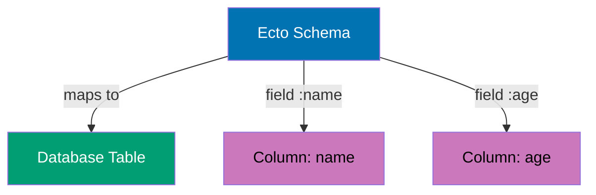
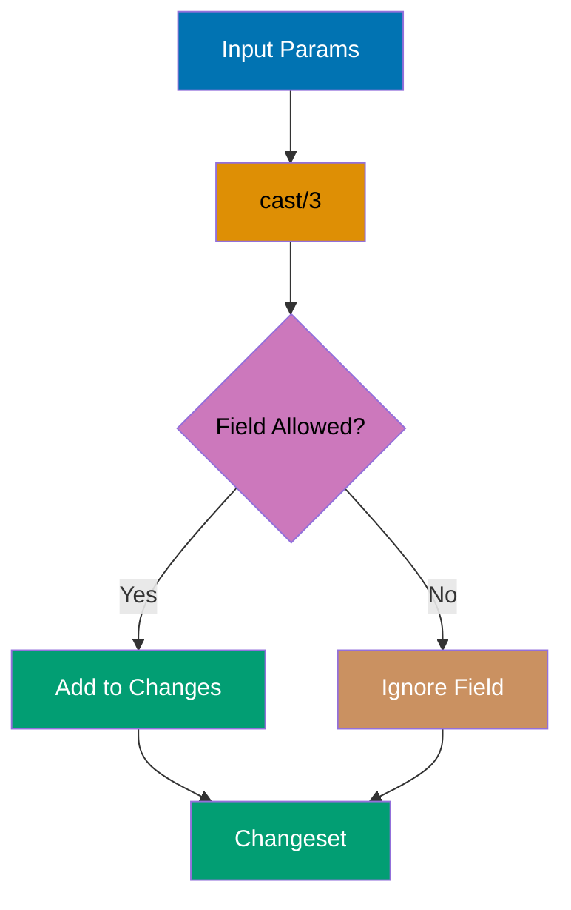
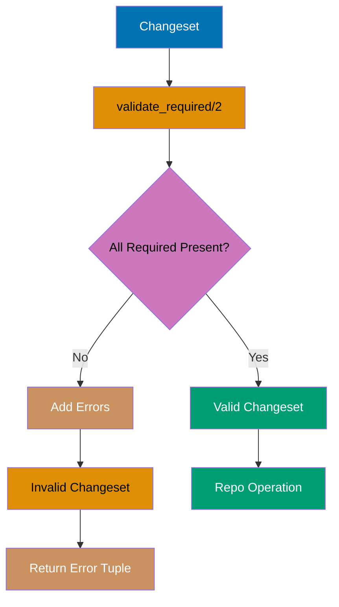
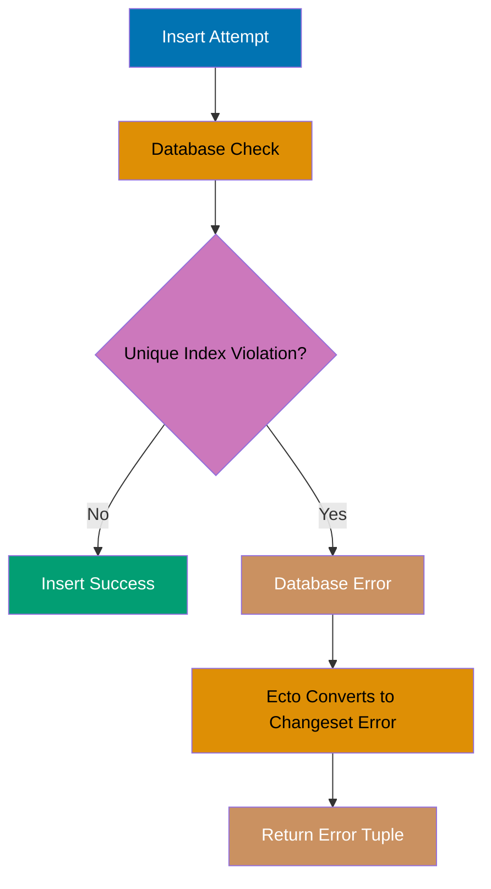
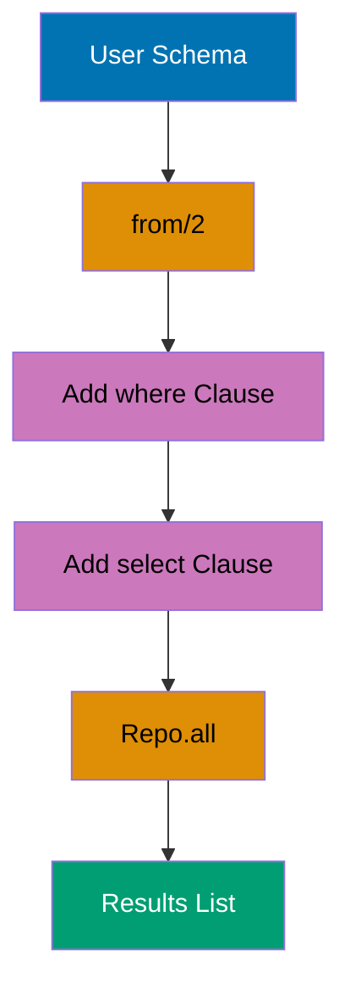
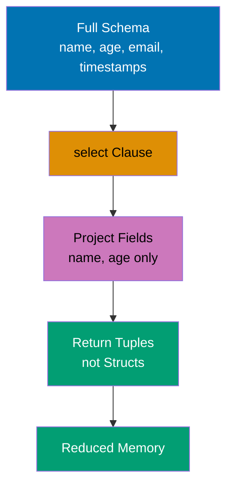
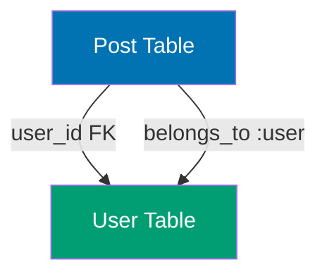
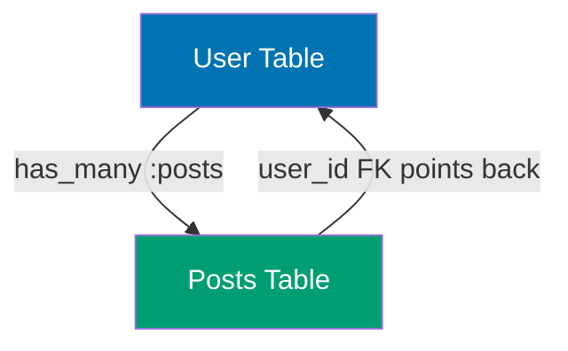
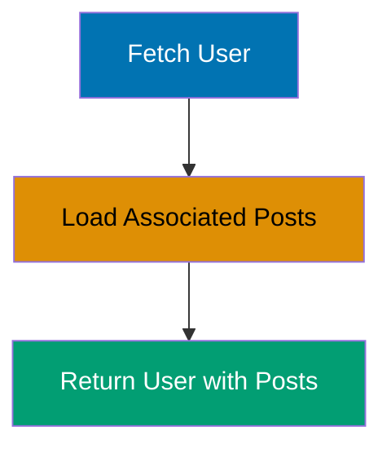
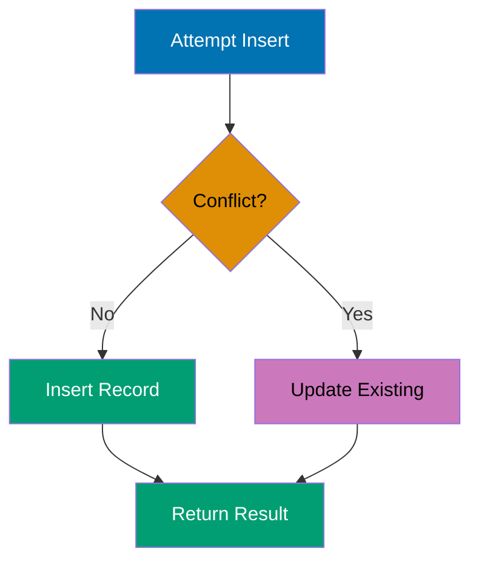

## Beginner Examples (1-30)

**Coverage**: 0-40% of Ecto functionality

**Focus**: Repository basics, schema definition, changesets, basic queries, and simple associations.

These examples cover fundamentals needed for basic CRUD applications. Each example is completely self-contained and runnable in IEx.

---

### Example 1: Defining a Basic Schema

Ecto schemas map Elixir structs to database tables, providing type safety and validation. Schemas define the structure of your data and are the foundation for all Ecto operations.



```elixir
defmodule User do                     # => Define User module
                                      # => Module represents database table
  use Ecto.Schema                     # => Import schema DSL functions
                                      # => Provides: schema/2, field/3, timestamps/1
                                      # => Makes module an Ecto schema
                                      # => Injects __using__/1 macro
                                      # => Imports Ecto.Schema behavior
                                      # => Enables schema DSL in module body
                                      # => Configures module for Ecto operations
                                      # => Blank line for readability
                                      # => Visual separation from use statement
                                      # => Schema definition begins
  schema "users" do                   # => Declares schema block
                                      # => Schema macro invocation
                                      # => Map to "users" table in database
                                      # => Generates __schema__/1, __schema__/2 functions
                                      # => Automatically adds :id primary key (bigserial)
                                      # => Table name stored as module metadata
                                      # => Defines table-to-struct mapping
    field :name, :string              # => Declares field :name
                                      # => Field macro invocation
                                      # => String column: name
                                      # => Maps to VARCHAR in PostgreSQL
                                      # => Default: nil if not provided
    field :age, :integer              # => Declares field :age
                                      # => Field macro invocation
                                      # => Integer column: age
                                      # => Maps to INTEGER in PostgreSQL
                                      # => Default: nil if not provided
    field :email, :string             # => Declares field :email
                                      # => Field macro invocation
                                      # => Email column (string type)
                                      # => No email validation at schema level
                                      # => Validation happens in changeset
    timestamps()                      # => Calls timestamps/0 macro
                                      # => Macro expands to field definitions
                                      # => Macro adds 2 fields:
                                      # => - inserted_at (naive_datetime)
                                      # => - updated_at (naive_datetime)
                                      # => Auto-populated by Repo operations
  end                                 # => Schema definition complete
                                      # => Closes schema block
end                                   # => Closes defmodule
                                      # => User module compiled
                                      # => Schema metadata available via User.__schema__/1
                                      # => __schema__(:type, :name) returns :string
                                      # => __schema__(:fields) returns [:id, :name, :age, :email, ...]
                                      # => Module ready for use in queries
                                      # => Can now create structs and query database
                                      # => Blank line separates module from usage
                                      # => Module definition ends
# Create struct instance              # => Comment: demonstrates struct creation
                                      # => Next line instantiates User struct
                                      # => Shows in-memory struct usage
                                      # => Demonstrates schema usage without database
user = %User{name: "Alice", age: 30, email: "alice@example.com"}  # => Creates User struct with values
                                      # => Uses struct literal syntax
                                      # => Calls %User{} constructor
                                      # => Instantiates User struct
                                      # => Creates %User{} struct (in-memory)
                                      # => Struct construction complete
                                      # => id: nil (not set yet)
                                      # => name: "Alice", age: 30, email: "alice@example.com"}
                                      # => inserted_at: nil, updated_at: nil
                                      # => Not persisted to database yet
                                      # => Type: %User{} (Ecto schema struct)
                                      # => Struct ready for inspection
                                      # => Can access fields using dot notation
                                      # => Fields accessible as struct.field_name
IO.inspect(user.name)                 # => Calls IO.inspect/1
                                      # => Inspects name field value
                                      # => Access name field from struct
                                      # => Field access via dot notation
                                      # => Output: "Alice"
                                      # => Prints to stdout
IO.inspect(user.id)                   # => Calls IO.inspect/1
                                      # => Inspects id field value
                                      # => Access id field from struct
                                      # => Field access via dot notation
                                      # => Returns nil value
                                      # => Output: nil
                                      # => Prints nil to stdout
                                      # => No database record exists yet
                                      # => ID unassigned until Repo.insert/1
                                      # => ID populated by database on insert
```

**Key Takeaway**: Schemas define the structure of your data and provide compile-time guarantees about field names and types, but creating a struct does not persist it to the database—you need Repo operations for that.

**Why It Matters**: In production applications, schemas provide type safety that catches field access errors at compile time rather than runtime, preventing entire classes of bugs. Without proper schema definitions, you'll face runtime errors when accessing undefined fields, data type mismatches in queries, and database schema drift. Schemas are the foundation of data integrity in Elixir applications, enabling pattern matching on structs and compiler-verified refactoring.

---

### Example 2: Inserting Data with Repo.insert/1

Repo.insert/1 persists a struct or changeset to the database, returning `{:ok, struct}` on success or `{:error, changeset}` on failure. This is the fundamental operation for creating new records.

```elixir
defmodule User do                     # => Define User module
  use Ecto.Schema                     # => Import schema DSL
                                      # => Makes module an Ecto schema

  schema "users" do                   # => Map to "users" table
                                      # => Adds :id primary key automatically
    field :name, :string              # => String field: name
    field :age, :integer              # => Integer field: age
    timestamps()                      # => Auto-managed timestamps
                                      # => Adds inserted_at, updated_at
  end                                 # => Schema definition complete
end                                   # => User schema compiled

# Create struct
                                                      # => Operation executes
user = %User{name: "Bob", age: 25}    # => Instantiate User struct
                                      # => Create %User{} struct in memory
                                      # => user.id is nil (not assigned)
                                      # => user.name is "Bob"
                                      # => user.age is 25
                                      # => In-memory only (not in database)
                                      # => Type: %User{} (Ecto schema struct)

# Insert into database
                                                      # => Operation executes
{:ok, saved_user} = Repo.insert(user) # => Pattern match on success tuple
                                      # => Calls Repo.insert/1
                                      # => Persists struct to database
                                      # => Returns {:ok, %User{}} tuple
                                      # => saved_user.id is 1 (DB generated)
                                      # => saved_user.name is "Bob" (unchanged)
                                      # => SQL: INSERT INTO users (name, age, inserted_at, updated_at)
                                      # =>      VALUES ('Bob', 25, NOW(), NOW())
                                      # =>      RETURNING id, inserted_at, updated_at
                                      # => Database populates id and timestamps
                                      # => Transaction committed

IO.inspect(saved_user.id)             # => Calls IO.inspect/1
                                      # => Access id field
                                      # => Output: 1
                                      # => Primary key assigned by database
IO.inspect(saved_user.name)           # => Calls IO.inspect/1
                                      # => Access name field
                                      # => Output: "Bob"
                                      # => Value unchanged from input
```

**Key Takeaway**: Repo.insert/1 persists data and returns the struct with database-generated fields (id, timestamps) populated, making it essential to capture the return value rather than using the original struct.

**Why It Matters**: Production systems must capture return values from insert operations because database-generated fields (IDs, timestamps, defaults) are critical for subsequent operations. Ignoring the returned struct leads to nil ID bugs, missing audit timestamps, and broken foreign key relationships. This pattern is essential for proper data flow in multi-step transactions where created records become inputs to downstream operations.

---

### Example 3: Querying with Repo.all/1

Repo.all/1 fetches all records matching a query, returning a list of structs. This is the basic operation for reading data from the database.

```elixir
defmodule User do                     # => Define User module
  use Ecto.Schema                     # => Import schema DSL
                                      # => Makes module an Ecto schema

  schema "users" do                   # => Map to "users" table
                                      # => Auto-adds :id primary key
    field :name, :string              # => String field: name
    field :age, :integer              # => Integer field: age
    timestamps()                      # => Auto-managed timestamps
                                      # => Adds inserted_at, updated_at
  end                                 # => Schema complete
end                                   # => User schema compiled

# Insert test data
                                                      # => Operation executes
Repo.insert(%User{name: "Alice", age: 30})
                                                      # => Database operation
                                      # => Calls Repo.insert/1
                                      # => Creates new user record
                                      # => Returns {:ok, %User{id: 1, name: "Alice", age: 30, ...}}
                                      # => SQL: INSERT INTO users (name, age, inserted_at, updated_at)
                                      # =>      VALUES ('Alice', 30, NOW(), NOW())
Repo.insert(%User{name: "Bob", age: 25})
                                                      # => Database operation
                                      # => Calls Repo.insert/1 again
                                      # => Creates second user record
                                      # => Returns {:ok, %User{id: 2, name: "Bob", age: 25, ...}}
                                      # => SQL: INSERT INTO users (name, age, inserted_at, updated_at)
                                      # =>      VALUES ('Bob', 25, NOW(), NOW())
                                      # => Database now contains 2 users (id: 1, 2)

# Fetch all users
                                                      # => Operation executes
users = Repo.all(User)                # => Calls Repo.all/1
                                      # => Queries database for all users
                                      # => Returns list: [%User{id: 1, ...}, %User{id: 2, ...}]
                                      # => SQL: SELECT id, name, age, inserted_at, updated_at FROM users
                                      # => Loads all columns and rows
                                      # => users is list with 2 elements (type: [%User{}])

IO.inspect(length(users))             # => Calls length/1 on list
                                      # => Output: 2
                                      # => List contains 2 user structs
IO.inspect(Enum.map(users, & &1.name))
                                                      # => Operation executes
                                      # => Calls Enum.map/2
                                      # => Extracts name field from each user
                                      # => &1 is anonymous function parameter
                                      # => Output: ["Alice", "Bob"]
                                      # => List of names (type: [String.t()])
```

**Key Takeaway**: Repo.all/1 always returns a list even when the table is empty (returns `[]`), making it safe to use without nil checks, but be aware it loads all matching records into memory.

**Why It Matters**: Loading all records into memory can cause production outages when tables grow beyond server RAM capacity. While Repo.all/1 is safe for small reference tables (countries, categories), it's dangerous for user-generated content. Production systems must add pagination (limit/offset or cursor-based) for any table that can grow unbounded, or face memory exhaustion and degraded performance under load.

---

### Example 4: Fetching a Single Record with Repo.get/2

Repo.get/2 fetches a record by primary key, returning the struct or nil if not found. This is the most efficient way to load a single record when you know its ID.

```elixir
defmodule User do                     # => Define User module
  use Ecto.Schema                     # => Import schema DSL
                                      # => Makes module an Ecto schema

  schema "users" do                   # => Map to "users" table
                                      # => Auto-adds :id primary key
    field :name, :string              # => String field: name
    timestamps()                      # => Auto-managed timestamps
                                      # => Adds inserted_at, updated_at
  end                                 # => Schema complete
end                                   # => User schema compiled

# Insert test user
                                                      # => Operation executes
{:ok, user} = Repo.insert(%User{name: "Charlie"})
                                                      # => Database operation
                                      # => Calls Repo.insert/1
                                      # => Persists to database
                                      # => Returns {:ok, %User{id: 1, name: "Charlie", ...}}
                                      # => user.id is 1 (assigned by database)
                                      # => SQL: INSERT INTO users (name, inserted_at, updated_at)
                                      # =>      VALUES ('Charlie', NOW(), NOW())

# Fetch by ID
                                                      # => Operation executes
found = Repo.get(User, 1)             # => Calls Repo.get/2
                                      # => Queries by primary key (id)
                                      # => found is %User{id: 1, name: "Charlie", ...}
                                      # => SQL: SELECT * FROM users WHERE id = 1
                                      # => Returns struct or nil (not error tuple)
                                      # => Uses primary key index (O(log n) lookup)

not_found = Repo.get(User, 999)       # => Calls Repo.get/2 with non-existent ID
                                      # => Queries for ID that doesn't exist
                                      # => not_found is nil (no record found)
                                      # => SQL: SELECT * FROM users WHERE id = 999
                                      # => Returns nil, not {:error, :not_found}
                                      # => No exception raised

IO.inspect(found.name)                # => Access name field
                                      # => Output: "Charlie"
                                      # => Safe access (found is %User{})
IO.inspect(not_found)                 # => Output: nil
                                      # => Must handle nil case
                                      # => Pattern match or if/case required
```

**Key Takeaway**: Repo.get/2 returns nil (not an error tuple) when the record doesn't exist, so you must handle nil explicitly; use Repo.get!/2 if you want it to raise on not found.

**Why It Matters**: The nil-return pattern enables graceful handling of missing records in production scenarios like expired sessions, deleted content, or race conditions. This prevents HTTP 500 errors from raising exceptions unnecessarily, allowing systems to return proper 404 responses or fallback behavior. Understanding get vs get! is critical for building resilient APIs that distinguish between "not found" (expected) and "server error" (unexpected).

---

### Example 5: Raising on Not Found with Repo.get!/2

Repo.get!/2 fetches a record by primary key, raising Ecto.NoResultsError if not found. Use this when the record must exist or you want the error to bubble up.

```elixir
defmodule User do                     # => Define User module
  use Ecto.Schema                     # => Import schema DSL
                                      # => Makes module an Ecto schema

  schema "users" do                   # => Map to "users" table
                                      # => Auto-adds :id primary key
    field :name, :string              # => String field: name
    timestamps()                      # => Auto-managed timestamps
                                      # => Adds inserted_at, updated_at
  end                                 # => Schema complete
end                                   # => User schema compiled

# Insert test user
                                                      # => Operation executes
{:ok, user} = Repo.insert(%User{name: "Diana"})
                                                      # => Database operation
                                      # => Calls Repo.insert/1
                                      # => Persists to database
                                      # => Returns {:ok, %User{id: 1, name: "Diana", ...}}
                                      # => user.id is 1 (assigned by database)

# Fetch with bang (raises on not found)
                                                      # => Operation executes
found = Repo.get!(User, 1)            # => Calls Repo.get!/2 (bang version)
                                      # => Queries by primary key
                                      # => found is %User{id: 1, name: "Diana", ...}
                                      # => SQL: SELECT * FROM users WHERE id = 1
                                      # => Raises Ecto.NoResultsError if not found
                                      # => No nil return (raises exception instead)

# This would raise Ecto.NoResultsError
                                                      # => Operation executes
# Repo.get!(User, 999)                # => Calls Repo.get!/2 with non-existent ID
                                      # => SQL: SELECT * FROM users WHERE id = 999
                                      # => Raises: Ecto.NoResultsError
                                      # => Message: "no results found for query"
                                      # => Use when record MUST exist (fail-fast)

IO.inspect(found.name)                # => Access name field
                                      # => Output: "Diana"
                                      # => Safe access (found guaranteed %User{})
                                      # => No nil check needed
```

**Key Takeaway**: Use Repo.get!/2 in controller actions or places where a missing record should halt execution, but prefer Repo.get/2 when you need to handle the not-found case gracefully.

**Why It Matters**: Using get! in controller show actions provides automatic 404 handling through Phoenix exception translation, reducing boilerplate error handling code. However, misuse in background jobs or loops can cause cascading failures when records are deleted concurrently. Production systems must choose between get! (fail-fast) and get/2 (graceful degradation) based on whether missing records indicate bugs or expected states.

---

### Example 6: Filtering with Repo.get_by/2

Repo.get_by/2 fetches the first record matching given conditions, returning the struct or nil. Unlike get/2, it works with any field, not just the primary key.

```elixir
defmodule User do                     # => Define User module
  use Ecto.Schema                     # => Import schema DSL
                                      # => Makes module an Ecto schema

  schema "users" do                   # => Map to "users" table
                                      # => Auto-adds :id primary key
    field :email, :string             # => Email field (string type)
    field :name, :string              # => Name field
    timestamps()                      # => Auto-managed timestamps
                                      # => Adds inserted_at, updated_at
  end                                 # => Schema complete
end                                   # => User schema compiled

# Insert test users
                                                      # => Operation executes
Repo.insert(%User{name: "Eve", email: "eve@example.com"})
                                                      # => Database operation
                                      # => Calls Repo.insert/1
                                      # => Creates first user
                                      # => Returns {:ok, %User{id: 1, name: "Eve", email: "eve@example.com", ...}}
                                      # => SQL: INSERT INTO users (name, email, inserted_at, updated_at)
                                      # =>      VALUES ('Eve', 'eve@example.com', NOW(), NOW())
Repo.insert(%User{name: "Frank", email: "frank@example.com"})
                                                      # => Database operation
                                      # => Calls Repo.insert/1 again
                                      # => Creates second user
                                      # => Returns {:ok, %User{id: 2, name: "Frank", email: "frank@example.com", ...}}
                                      # => Database now contains 2 users (id: 1, 2)

# Fetch by email
                                                      # => Operation executes
found = Repo.get_by(User, email: "eve@example.com")
                                                      # => Database operation
                                      # => Calls Repo.get_by/2
                                      # => Queries by email field (not primary key)
                                      # => found is %User{id: 1, name: "Eve", email: "eve@example.com"}
                                      # => SQL: SELECT * FROM users WHERE email = 'eve@example.com' LIMIT 1
                                      # => Returns first match only (LIMIT 1)
                                      # => If index exists: O(log n), else: O(n) table scan

not_found = Repo.get_by(User, email: "unknown@example.com")
                                                      # => Database operation
                                      # => Calls Repo.get_by/2 with non-existent email
                                      # => Queries for email that doesn't exist
                                      # => not_found is nil (no match)
                                      # => SQL: SELECT * FROM users WHERE email = 'unknown@example.com' LIMIT 1
                                      # => Returns nil (not error tuple)

IO.inspect(found.name)                # => Access name field
                                      # => Output: "Eve"
                                      # => Safe access (found is %User{})
IO.inspect(not_found)                 # => Output: nil
                                      # => Must handle nil case
                                      # => Pattern match or if/case required
```

**Key Takeaway**: Repo.get_by/2 returns only the first matching record, so add indexes on commonly queried fields and be aware that multiple matches will only return one.

**Why It Matters**: Without database indexes on queried fields, get_by triggers full table scans that degrade performance as tables grow. Production systems must pair get_by with unique indexes on lookup fields (email, username, external_id) to maintain constant-time lookups. The LIMIT 1 behavior means non-unique lookups return unpredictable results unless paired with order_by for consistency.

---

### Example 7: Updating Records with Repo.update/1

Repo.update/1 persists changes from a changeset to the database, returning `{:ok, struct}` on success. Changes must be wrapped in a changeset before updating.

```elixir
defmodule User do
                                                      # => Module starts
  use Ecto.Schema                     # => Import schema DSL
  import Ecto.Changeset               # => Import changeset functions

  schema "users" do                   # => Map to "users" table
    field :name, :string              # => String field
    field :age, :integer              # => Integer field
    timestamps()                      # => Auto-managed timestamps
  end
                                                      # => Block ends

  def changeset(user, attrs) do       # => Changeset function for updates
    user                              # => Take existing user struct
    |> cast(attrs, [:name, :age])     # => Cast attributes from map (filter allowed fields)
                                      # => Returns %Ecto.Changeset{} with changes tracked
  end
                                                      # => Block ends
end
                                                      # => Block ends
                                      # => User module compiled

# Insert and update user
                                                      # => Operation executes
{:ok, user} = Repo.insert(%User{name: "Grace", age: 28})
                                                      # => Database operation
                                      # => Persists to database
                                      # => Returns {:ok, %User{id: 1, name: "Grace", age: 28, ...}}
                                      # => user.id is 1, age is 28

# Create changeset with updates
                                                      # => Operation executes
changeset = User.changeset(user, %{age: 29})
                                                      # => Value assigned
                                      # => Builds changeset tracking changes
                                      # => changeset.data is %User{age: 28, ...} (original)
                                      # => changeset.changes is %{age: 29} (what changed)
                                      # => changeset.valid? is true (passes validation)
                                      # => Type: %Ecto.Changeset{action: nil}

# Apply update
                                                      # => Operation executes
{:ok, updated} = Repo.update(changeset)
                                                      # => Database operation
                                      # => Persists changes to database
                                      # => updated.age is 29 (new value)
                                      # => SQL: UPDATE users SET age = 29, updated_at = NOW()
                                      # =>      WHERE id = 1
                                      # => Returns {:ok, %User{id: 1, age: 29, ...}}
                                      # => Only changed fields updated (efficient)

IO.inspect(updated.age)               # => Output: 29
                                      # => New value persisted
```

**Key Takeaway**: Always use changesets for updates to leverage validation and change tracking; Ecto only updates fields that actually changed, reducing database load.

**Why It Matters**: Ecto's change tracking prevents UPDATE queries when no fields changed, reducing database load and preserving updated_at timestamps for accurate audit trails. Bypassing changesets (using Repo.update_all or Ecto.Changeset.change) sacrifices validation and optimistic locking, leading to data corruption bugs. Production systems rely on changeset validation to enforce business rules consistently across all update paths, preventing invalid data at the database boundary.

---

### Example 8: Deleting Records with Repo.delete/1

Repo.delete/1 removes a record from the database, accepting either a struct or changeset. Returns `{:ok, struct}` with the deleted data or `{:error, changeset}` on failure.

```elixir
defmodule User do
                                                      # => Module starts
  use Ecto.Schema                     # => Import schema DSL

  schema "users" do                   # => Map to "users" table
    field :name, :string              # => String field
    timestamps()                      # => Auto-managed timestamps
  end
                                                      # => Block ends
end
                                                      # => Block ends
                                      # => User schema defined

# Insert and delete user
                                                      # => Operation executes
{:ok, user} = Repo.insert(%User{name: "Henry"})
                                                      # => Database operation
                                      # => Persists to database
                                      # => Returns {:ok, %User{id: 1, name: "Henry", ...}}
                                      # => user.id is 1

# Delete from database
                                                      # => Operation executes
{:ok, deleted} = Repo.delete(user)    # => Removes record from database
                                      # => deleted is %User{id: 1, name: "Henry", ...}
                                      # => SQL: DELETE FROM users WHERE id = 1
                                      # => Returns {:ok, struct} with deleted data
                                      # => Struct still exists in memory (database removed)

# Verify deletion
                                                      # => Operation executes
not_found = Repo.get(User, 1)         # => Queries for deleted record
                                      # => not_found is nil (record no longer exists)
                                      # => SQL: SELECT * FROM users WHERE id = 1
                                      # => Database returns no rows

IO.inspect(deleted.name)              # => Output: "Henry"
                                      # => Data accessible from returned struct
IO.inspect(not_found)                 # => Output: nil
                                      # => Confirms deletion successful
```

**Key Takeaway**: Repo.delete/1 returns the deleted struct, allowing you to access its data after deletion, but the struct is no longer persisted and subsequent Repo operations on it will fail.

**Why It Matters**: The deleted struct return value enables audit logging and sending notifications before data is permanently lost. Production systems use this pattern to capture deletion metadata (who, when, why) for compliance requirements and to handle dependent records (cascading deletes, archiving). Understanding that the struct persists in memory but not in database prevents bugs where deleted references are inadvertently passed to subsequent operations.

---

### Example 9: Creating a Changeset with cast/3

Changesets validate and filter data before persisting to the database. The cast/3 function takes a struct, params map, and allowed fields, returning a changeset.



```elixir
defmodule User do
                                                      # => Module starts
  use Ecto.Schema
                                                      # => Imports Ecto
  import Ecto.Changeset
                                                      # => Operation executes

  schema "users" do
                                                      # => Schema declaration
    field :name, :string
                                                      # => Field defined
    field :age, :integer
                                                      # => Field defined
    field :email, :string
                                                      # => Field defined
    timestamps()
                                                      # => Operation executes
  end
                                                      # => Block ends

  def changeset(user, params \\ %{}) do
                                                      # => Operation executes
    user
                                                      # => Operation executes
    |> cast(params, [:name, :age, :email])
                                                      # => Operation executes
                                      # => Cast allowed fields from params
                                      # => Unknown fields are ignored
  end
                                                      # => Block ends
end
                                                      # => Block ends

# Create changeset with valid data
                                                      # => Operation executes
params = %{name: "Ivy", age: 27, email: "ivy@example.com", unknown: "ignored"}
                                                      # => Value assigned
changeset = User.changeset(%User{}, params)
                                                      # => Value assigned
                                      # => changeset.changes is %{name: "Ivy", age: 27, email: "ivy@..."}
                                      # => changeset.valid? is true
                                      # => "unknown" field not in changes

IO.inspect(changeset.valid?)          # => Output: true
IO.inspect(changeset.changes)         # => Output: %{name: "Ivy", age: 27, email: "ivy@..."}
```

**Key Takeaway**: cast/3 acts as a whitelist for params, protecting against mass assignment vulnerabilities by only allowing explicitly listed fields to be set.

**Why It Matters**: Mass assignment vulnerabilities allow attackers to modify unintended fields (is_admin, account_balance) by injecting params. Production APIs must whitelist exactly which fields can be set through cast/3 to prevent privilege escalation and data corruption. This security boundary is critical when accepting user input from forms, JSON APIs, or CSV imports where malicious actors can inject arbitrary key-value pairs.

---

### Example 10: Validating Required Fields

validate_required/2 ensures specified fields are present in the changeset, adding errors if any are missing. This is fundamental for enforcing data integrity.



```elixir
defmodule User do
                                                      # => Module starts
  use Ecto.Schema
                                                      # => Imports Ecto
  import Ecto.Changeset
                                                      # => Operation executes

  schema "users" do
                                                      # => Schema declaration
    field :name, :string
                                                      # => Field defined
    field :email, :string
                                                      # => Field defined
    timestamps()
                                                      # => Operation executes
  end
                                                      # => Block ends

  def changeset(user, params \\ %{}) do
                                                      # => Operation executes
    user
                                                      # => Operation executes
    |> cast(params, [:name, :email])
                                                      # => Operation executes
    |> validate_required([:name, :email])
                                                      # => Operation executes
                                      # => Add error if name or email missing
  end
                                                      # => Block ends
end
                                                      # => Block ends

# Valid changeset
                                                      # => Operation executes
valid = User.changeset(%User{}, %{name: "Jack", email: "jack@example.com"})
                                                      # => Value assigned
                                      # => valid.valid? is true
                                      # => valid.errors is []

# Invalid changeset (missing email)
                                                      # => Operation executes
invalid = User.changeset(%User{}, %{name: "Jack"})
                                                      # => Value assigned
                                      # => invalid.valid? is false
                                      # => invalid.errors is [email: {"can't be blank", ...}]

# Attempt insert with invalid changeset
                                                      # => Operation executes
{:error, failed} = Repo.insert(invalid)
                                                      # => Database operation
                                      # => Returns error tuple, no SQL executed
                                      # => failed.errors is [email: {"can't be blank", ...}]

IO.inspect(valid.valid?)              # => Output: true
IO.inspect(invalid.valid?)            # => Output: false
```

**Key Takeaway**: validate_required/2 prevents database errors by catching missing fields before insert/update, and Repo operations automatically check changeset validity before executing SQL.

**Why It Matters**: Database NOT NULL constraints raise cryptic SQL errors that expose schema details to users, while changeset validation provides user-friendly error messages. Production systems use validate_required as the first line of defense, catching missing data before database round-trips and enabling proper error responses (422 Unprocessable Entity) with field-specific messages. This validation also prevents partial record creation in transactions where later steps depend on complete data.

---

### Example 11: Format Validation with validate_format/3

validate_format/3 ensures a field matches a regular expression pattern, commonly used for emails, URLs, and custom formats. Invalid formats add errors to the changeset.

```elixir
defmodule User do
                                                      # => Module starts
  use Ecto.Schema
                                                      # => Imports Ecto
  import Ecto.Changeset
                                                      # => Operation executes

  schema "users" do
                                                      # => Schema declaration
    field :email, :string
                                                      # => Field defined
    timestamps()
                                                      # => Operation executes
  end
                                                      # => Block ends

  def changeset(user, params \\ %{}) do
                                                      # => Operation executes
    user
                                                      # => Operation executes
    |> cast(params, [:email])
                                                      # => Operation executes
    |> validate_required([:email])
                                                      # => Operation executes
    |> validate_format(:email, ~r/@/)  # => Simple email regex (must contain @)
  end
                                                      # => Block ends
end
                                                      # => Block ends

# Valid email
                                                      # => Operation executes
valid = User.changeset(%User{}, %{email: "kate@example.com"})
                                                      # => Value assigned
                                      # => valid.valid? is true
                                      # => "kate@example.com" matches ~r/@/

# Invalid email (missing @)
                                                      # => Operation executes
invalid = User.changeset(%User{}, %{email: "invalid-email"})
                                                      # => Value assigned
                                      # => invalid.valid? is false
                                      # => invalid.errors is [email: {"has invalid format", ...}]

IO.inspect(valid.valid?)              # => Output: true
IO.inspect(invalid.valid?)            # => Output: false
IO.inspect(invalid.errors[:email])    # => Output: {"has invalid format", [...]}
```

**Key Takeaway**: validate_format/3 provides client-side validation logic at the changeset level, preventing invalid data from reaching the database, but remember that regex validation is no substitute for email verification.

**Why It Matters**: Invalid data formats cause downstream failures in email delivery, URL parsing, and API integrations. Production systems validate formats early to provide immediate feedback rather than discovering errors hours later when batch jobs fail. However, regex validation doesn't guarantee deliverability (email bounces, dead links), so production systems must combine format validation with verification workflows (confirmation emails, link checking) for critical paths.

---

### Example 12: Length Validation with validate_length/3

validate_length/3 ensures string or list fields meet length constraints (min, max, is). This prevents database errors and enforces business rules.

```elixir
defmodule User do
                                                      # => Module starts
  use Ecto.Schema
                                                      # => Imports Ecto
  import Ecto.Changeset
                                                      # => Operation executes

  schema "users" do
                                                      # => Schema declaration
    field :username, :string
                                                      # => Field defined
    field :password, :string
                                                      # => Field defined
    timestamps()
                                                      # => Operation executes
  end
                                                      # => Block ends

  def changeset(user, params \\ %{}) do
                                                      # => Operation executes
    user
                                                      # => Operation executes
    |> cast(params, [:username, :password])
                                                      # => Operation executes
    |> validate_required([:username, :password])
                                                      # => Operation executes
    |> validate_length(:username, min: 3, max: 20)
                                                      # => Operation executes
                                      # => Username must be 3-20 characters
    |> validate_length(:password, min: 8)
                                                      # => Operation executes
                                      # => Password must be at least 8 characters
  end
                                                      # => Block ends
end
                                                      # => Block ends

# Valid lengths
                                                      # => Operation executes
valid = User.changeset(%User{}, %{username: "liam", password: "securepass123"})
                                                      # => Value assigned
                                      # => valid.valid? is true
                                      # => username length 4, password length 13

# Invalid: username too short
                                                      # => Operation executes
invalid_user = User.changeset(%User{}, %{username: "ab", password: "securepass"})
                                                      # => Value assigned
                                      # => invalid_user.valid? is false
                                      # => errors: [username: {"should be at least 3 character(s)", ...}]

# Invalid: password too short
                                                      # => Operation executes
invalid_pass = User.changeset(%User{}, %{username: "liam", password: "short"})
                                                      # => Value assigned
                                      # => invalid_pass.valid? is false
                                      # => errors: [password: {"should be at least 8 character(s)", ...}]

IO.inspect(valid.valid?)              # => Output: true
IO.inspect(invalid_user.valid?)       # => Output: false
```

**Key Takeaway**: validate_length/3 enforces both minimum and maximum constraints, preventing SQL errors from exceeding column limits and ensuring data meets business requirements.

**Why It Matters**: Database VARCHAR limits cause SQL errors that truncate data or crash inserts, while changeset validation rejects invalid data before database interaction. Production systems must validate lengths to prevent data loss and maintain consistency across storage layers (database, cache, search indexes). This is especially critical for user-generated content where attackers may submit oversized inputs to trigger errors or exploit buffer-related vulnerabilities.

---

### Example 13: Number Validation with validate_number/3

validate_number/3 ensures numeric fields meet constraints (greater_than, less_than, equal_to, etc.). This enforces business rules and prevents invalid numeric data.

```elixir
defmodule Product do
                                                      # => Module starts
  use Ecto.Schema
                                                      # => Imports Ecto
  import Ecto.Changeset
                                                      # => Operation executes

  schema "products" do
                                                      # => Schema declaration
    field :name, :string
                                                      # => Field defined
    field :price, :decimal
                                                      # => Field defined
    field :stock, :integer
                                                      # => Field defined
    timestamps()
                                                      # => Operation executes
  end
                                                      # => Block ends

  def changeset(product, params \\ %{}) do
                                                      # => Operation executes
    product
                                                      # => Operation executes
    |> cast(params, [:name, :price, :stock])
                                                      # => Operation executes
    |> validate_required([:name, :price, :stock])
                                                      # => Operation executes
    |> validate_number(:price, greater_than: 0)
                                                      # => Operation executes
                                      # => Price must be positive
    |> validate_number(:stock, greater_than_or_equal_to: 0)
                                                      # => Operation executes
                                      # => Stock cannot be negative
  end
                                                      # => Block ends
end
                                                      # => Block ends

# Valid numbers
                                                      # => Operation executes
valid = Product.changeset(%Product{}, %{name: "Widget", price: 9.99, stock: 10})
                                                      # => Value assigned
                                      # => valid.valid? is true
                                      # => price 9.99 > 0, stock 10 >= 0

# Invalid: negative price
                                                      # => Operation executes
invalid_price = Product.changeset(%Product{}, %{name: "Widget", price: -5, stock: 10})
                                                      # => Value assigned
                                      # => invalid_price.valid? is false
                                      # => errors: [price: {"must be greater than 0", ...}]

# Invalid: negative stock
                                                      # => Operation executes
invalid_stock = Product.changeset(%Product{}, %{name: "Widget", price: 9.99, stock: -1})
                                                      # => Value assigned
                                      # => invalid_stock.valid? is false
                                      # => errors: [stock: {"must be greater than or equal to 0", ...}]

IO.inspect(valid.valid?)              # => Output: true
IO.inspect(invalid_price.valid?)      # => Output: false
```

**Key Takeaway**: validate_number/3 prevents business logic errors at the changeset level, ensuring numeric constraints are enforced before data reaches the database.

**Why It Matters**: Business rule violations like negative prices or invalid ages cause financial losses and logic errors in production systems. Validating numbers at the changeset level enforces domain constraints consistently across all entry points (web forms, APIs, batch imports), preventing bad data from corrupting reports and triggering incorrect calculations. This is essential for e-commerce (pricing), healthcare (vitals), and financial systems (balances) where numeric constraints have legal implications.

---

### Example 14: Unique Constraint with unique_constraint/2

unique_constraint/2 validates database-level unique constraints, converting database errors into changeset errors. Requires a unique index on the database column.



```elixir
defmodule User do
                                                      # => Module starts
  use Ecto.Schema
                                                      # => Imports Ecto
  import Ecto.Changeset
                                                      # => Operation executes

  schema "users" do
                                                      # => Schema declaration
    field :email, :string
                                                      # => Field defined
    timestamps()
                                                      # => Operation executes
  end
                                                      # => Block ends

  def changeset(user, params \\ %{}) do
                                                      # => Operation executes
    user
                                                      # => Operation executes
    |> cast(params, [:email])
                                                      # => Operation executes
    |> validate_required([:email])
                                                      # => Operation executes
    |> unique_constraint(:email)      # => Check unique index on email column
                                      # => Database must have: CREATE UNIQUE INDEX ON users(email)
  end
                                                      # => Block ends
end
                                                      # => Block ends

# First insert succeeds
                                                      # => Operation executes
{:ok, user1} = %User{}
                                                      # => Value assigned
  |> User.changeset(%{email: "mia@example.com"})
                                                      # => Operation executes
  |> Repo.insert()                    # => user1.id is 1, email is "mia@example.com"
                                      # => SQL: INSERT INTO users (email, ...) VALUES ('mia@...', ...)

# Second insert with same email fails
                                                      # => Operation executes
{:error, changeset} = %User{}
                                                      # => Value assigned
  |> User.changeset(%{email: "mia@example.com"})
                                                      # => Operation executes
  |> Repo.insert()                    # => Database raises unique constraint error
                                      # => Ecto converts to changeset error
                                      # => changeset.errors is [email: {"has already been taken", ...}]

IO.inspect(user1.email)               # => Output: "mia@example.com"
IO.inspect(changeset.valid?)          # => Output: false
IO.inspect(changeset.errors[:email])  # => Output: {"has already been taken", [...]}
```

**Key Takeaway**: unique_constraint/2 relies on database indexes and only triggers during Repo operations, so always pair it with a unique index migration and handle the error case gracefully.

**Why It Matters**: Duplicate records cause data corruption (multiple accounts per email), billing errors (duplicate charges), and security vulnerabilities (account takeover via race conditions). Production systems must enforce uniqueness at the database level (unique indexes) and handle violations gracefully in changesets to provide user-friendly error messages. The combination prevents race conditions where concurrent inserts bypass application-level checks but violate database constraints.

---

### Example 15: Basic Query with from/2

The from/2 macro builds queries using Ecto's query DSL, providing a composable and type-safe way to query the database. This is more flexible than Repo.all/1 for complex queries.



```elixir
defmodule User do
                                                      # => Module starts
  use Ecto.Schema
                                                      # => Imports Ecto

  schema "users" do
                                                      # => Schema declaration
    field :name, :string
                                                      # => Field defined
    field :age, :integer
                                                      # => Field defined
    timestamps()
                                                      # => Operation executes
  end
                                                      # => Block ends
end
                                                      # => Block ends

import Ecto.Query
                                                      # => Operation executes

# Insert test data
                                                      # => Operation executes
Repo.insert(%User{name: "Noah", age: 30})
                                                      # => Database operation
Repo.insert(%User{name: "Olivia", age: 25})
                                                      # => Database operation
Repo.insert(%User{name: "Paul", age: 35})
                                                      # => Database operation

# Query users over 25
                                                      # => Operation executes
query = from u in User,
                                                      # => Value assigned
  where: u.age > 25,                  # => Filter condition
  select: u                           # => Select full struct

users = Repo.all(query)               # => users is [%User{name: "Noah", age: 30},
                                      # =>            %User{name: "Paul", age: 35}]
                                      # => SQL: SELECT * FROM users WHERE age > 25

IO.inspect(length(users))             # => Output: 2
IO.inspect(Enum.map(users, & &1.name))
                                                      # => Operation executes
                                      # => Output: ["Noah", "Paul"]
```

**Key Takeaway**: from/2 queries are composable and can be built incrementally, making them ideal for dynamic queries where filters depend on user input or application state.

**Why It Matters**: Composable queries enable building search features dynamically based on user filters without string concatenation vulnerabilities. Production systems chain from/2 with conditional clauses (if search_term, add where) to build type-safe queries that prevent SQL injection. This composability is essential for faceted search, report builders, and admin panels where filter combinations grow exponentially and must be assembled programmatically.

---

### Example 16: Selecting Specific Fields

The select clause in queries allows you to fetch only specific fields instead of entire structs, reducing memory usage and database load.



```elixir
defmodule User do
                                                      # => Module starts
  use Ecto.Schema
                                                      # => Imports Ecto

  schema "users" do
                                                      # => Schema declaration
    field :name, :string
                                                      # => Field defined
    field :age, :integer
                                                      # => Field defined
    field :email, :string
                                                      # => Field defined
    timestamps()
                                                      # => Operation executes
  end
                                                      # => Block ends
end
                                                      # => Block ends

import Ecto.Query
                                                      # => Operation executes

# Insert test data
                                                      # => Operation executes
Repo.insert(%User{name: "Quinn", age: 28, email: "quinn@example.com"})
                                                      # => Database operation
Repo.insert(%User{name: "Ruby", age: 32, email: "ruby@example.com"})
                                                      # => Database operation

# Select only name and age
                                                      # => Operation executes
query = from u in User,
                                                      # => Value assigned
  select: {u.name, u.age}             # => Tuple of fields (not full struct)

results = Repo.all(query)             # => results is [{"Quinn", 28}, {"Ruby", 32}]
                                      # => SQL: SELECT name, age FROM users

# Select into map
                                                      # => Operation executes
map_query = from u in User,
                                                      # => Value assigned
  select: %{name: u.name, age: u.age} # => Map projection

map_results = Repo.all(map_query)     # => map_results is [%{name: "Quinn", age: 28}, ...]
                                      # => SQL: SELECT name, age FROM users

IO.inspect(results)                   # => Output: [{"Quinn", 28}, {"Ruby", 32}]
IO.inspect(map_results)               # => Output: [%{name: "Quinn", age: 28}, ...]
```

**Key Takeaway**: Use field selection to optimize queries by fetching only needed data, especially important when dealing with large tables or columns with heavy data like text blobs.

**Why It Matters**: Fetching unnecessary columns wastes network bandwidth and database I/O, especially for large TEXT or JSONB fields. Production APIs use field selection to return only requested attributes (GraphQL field selection, JSON API sparse fieldsets), reducing response sizes by 50-90% and improving query performance. This optimization is critical for mobile clients on metered connections and high-traffic endpoints where every millisecond and kilobyte matters.

---

### Example 17: Ordering Results with order_by

The order_by clause sorts query results by one or more fields, supporting ascending (asc) and descending (desc) order.

```elixir
defmodule User do
                                                      # => Module starts
  use Ecto.Schema
                                                      # => Imports Ecto

  schema "users" do
                                                      # => Schema declaration
    field :name, :string
                                                      # => Field defined
    field :age, :integer
                                                      # => Field defined
    timestamps()
                                                      # => Operation executes
  end
                                                      # => Block ends
end
                                                      # => Block ends

import Ecto.Query
                                                      # => Operation executes

# Insert test data
                                                      # => Operation executes
Repo.insert(%User{name: "Sam", age: 40})
                                                      # => Database operation
Repo.insert(%User{name: "Tina", age: 25})
                                                      # => Database operation
Repo.insert(%User{name: "Uma", age: 30})
                                                      # => Database operation

# Order by age ascending
                                                      # => Block ends
asc_query = from u in User,
                                                      # => Value assigned
  order_by: [asc: u.age],             # => Sort by age ascending (25, 30, 40)
  select: {u.name, u.age}
                                                      # => Operation executes

asc_results = Repo.all(asc_query)     # => asc_results is [{"Tina", 25}, {"Uma", 30}, {"Sam", 40}]
                                      # => SQL: SELECT name, age FROM users ORDER BY age ASC

# Order by age descending
                                                      # => Block ends
desc_query = from u in User,
                                                      # => Value assigned
  order_by: [desc: u.age],            # => Sort by age descending (40, 30, 25)
  select: {u.name, u.age}
                                                      # => Operation executes

desc_results = Repo.all(desc_query)   # => desc_results is [{"Sam", 40}, {"Uma", 30}, {"Tina", 25}]
                                      # => SQL: SELECT name, age FROM users ORDER BY age DESC

IO.inspect(asc_results)               # => Output: [{"Tina", 25}, {"Uma", 30}, {"Sam", 40}]
IO.inspect(desc_results)              # => Output: [{"Sam", 40}, {"Uma", 30}, {"Tina", 25}]
```

**Key Takeaway**: order_by supports multiple fields (order_by: [asc: :age, desc: :name]) for complex sorting, and the order matters when sorting by multiple columns.

**Why It Matters**: Without explicit ordering, database results are non-deterministic and change between queries, breaking pagination and causing test flakiness. Production APIs must specify order_by to ensure consistent results when paging through large datasets, especially when combined with limit/offset. Multi-column ordering (created_at DESC, id DESC) provides stable sort keys even when timestamps tie, preventing duplicate or missing records across pages.

---

### Example 18: Limiting Results with limit

The limit clause restricts the number of results returned, essential for pagination and performance optimization.

```elixir
defmodule User do
                                                      # => Module starts
  use Ecto.Schema
                                                      # => Imports Ecto

  schema "users" do
                                                      # => Schema declaration
    field :name, :string
                                                      # => Field defined
    timestamps()
                                                      # => Operation executes
  end
                                                      # => Block ends
end
                                                      # => Block ends

import Ecto.Query
                                                      # => Operation executes

# Insert test data
                                                      # => Operation executes
Repo.insert(%User{name: "Victor"})
                                                      # => Database operation
Repo.insert(%User{name: "Wendy"})
                                                      # => Block ends
Repo.insert(%User{name: "Xavier"})
                                                      # => Database operation
Repo.insert(%User{name: "Yara"})
                                                      # => Database operation
Repo.insert(%User{name: "Zane"})
                                                      # => Database operation

# Limit to first 3 results
                                                      # => Operation executes
query = from u in User,
                                                      # => Value assigned
  order_by: [asc: u.name],            # => Order to ensure consistent results
  limit: 3,                           # => Return only first 3 rows
  select: u.name
                                                      # => Operation executes

results = Repo.all(query)             # => results is ["Victor", "Wendy", "Xavier"]
                                      # => SQL: SELECT name FROM users ORDER BY name ASC LIMIT 3

IO.inspect(results)                   # => Output: ["Victor", "Wendy", "Xavier"]
IO.inspect(length(results))           # => Output: 3
```

**Key Takeaway**: Always combine limit with order_by to ensure consistent results, as database row order is undefined without explicit sorting.

**Why It Matters**: Unbounded queries on million-record tables can exhaust database memory and stall other queries waiting for locks. Production systems use limit defensively (LIMIT 1000) on all queries that could grow unbounded, protecting against accidental full-table scans. This is especially critical for admin interfaces and background jobs where missing WHERE clauses could trigger catastrophic queries that bring down the entire database.

---

### Example 19: Offsetting Results with offset

The offset clause skips a number of rows before returning results, commonly used with limit for pagination.

```elixir
defmodule User do
                                                      # => Module starts
  use Ecto.Schema
                                                      # => Imports Ecto

  schema "users" do
                                                      # => Schema declaration
    field :name, :string
                                                      # => Field defined
    timestamps()
                                                      # => Operation executes
  end
                                                      # => Block ends
end
                                                      # => Block ends

import Ecto.Query
                                                      # => Operation executes

# Insert test data
                                                      # => Operation executes
Enum.each(["Alice", "Bob", "Charlie", "Diana", "Eve"], fn name ->
                                                      # => Operation executes
  Repo.insert(%User{name: name})
                                                      # => Database operation
end)
                                                      # => Block ends

# First page (limit 2)
                                                      # => Operation executes
page1_query = from u in User,
                                                      # => Value assigned
  order_by: [asc: u.name],
                                                      # => Operation executes
  limit: 2,                           # => First 2 results
  select: u.name
                                                      # => Operation executes

page1 = Repo.all(page1_query)         # => page1 is ["Alice", "Bob"]
                                      # => SQL: SELECT name FROM users ORDER BY name ASC LIMIT 2

# Second page (offset 2, limit 2)
                                                      # => Operation executes
page2_query = from u in User,
                                                      # => Value assigned
  order_by: [asc: u.name],
                                                      # => Operation executes
  offset: 2,                          # => Skip first 2 results
  limit: 2,                           # => Take next 2 results
  select: u.name
                                                      # => Operation executes

page2 = Repo.all(page2_query)         # => page2 is ["Charlie", "Diana"]
                                      # => SQL: SELECT name FROM users ORDER BY name ASC LIMIT 2 OFFSET 2

IO.inspect(page1)                     # => Output: ["Alice", "Bob"]
IO.inspect(page2)                     # => Output: ["Charlie", "Diana"]
```

**Key Takeaway**: offset is simple for pagination but inefficient on large tables; consider cursor-based pagination (e.g., `where: u.id > ^last_seen_id`) for better performance at scale.

**Why It Matters**: Offset-based pagination performs poorly on large tables because databases must scan and discard offset rows before returning results. At page 1000 of a table, offset: 10000 scans 10,000 rows just to throw them away. Production systems use cursor-based pagination (where id > last_seen_id) for better performance, stable results during concurrent inserts, and scalability to millions of records. Offset remains acceptable for small result sets (hundreds of records, not thousands).

---

### Example 20: Counting Records with Repo.aggregate/3

Repo.aggregate/3 performs aggregate functions (count, sum, avg, min, max) without loading all records into memory, making it efficient for large tables.

```elixir
defmodule User do
                                                      # => Module starts
  use Ecto.Schema
                                                      # => Imports Ecto

  schema "users" do
                                                      # => Schema declaration
    field :name, :string
                                                      # => Field defined
    field :age, :integer
                                                      # => Field defined
    timestamps()
                                                      # => Operation executes
  end
                                                      # => Block ends
end
                                                      # => Block ends

import Ecto.Query
                                                      # => Operation executes

# Insert test data
                                                      # => Operation executes
Repo.insert(%User{name: "Frank", age: 25})
                                                      # => Database operation
Repo.insert(%User{name: "Grace", age: 30})
                                                      # => Database operation
Repo.insert(%User{name: "Henry", age: 35})
                                                      # => Database operation

# Count all users
                                                      # => Operation executes
total = Repo.aggregate(User, :count, :id)
                                                      # => Database operation
                                      # => total is 3
                                      # => SQL: SELECT COUNT(id) FROM users

# Count users with filter
                                                      # => Operation executes
query = from u in User, where: u.age > 28
                                                      # => Value assigned
count = Repo.aggregate(query, :count, :id)
                                                      # => Database operation
                                      # => count is 2 (Grace and Henry)
                                      # => SQL: SELECT COUNT(id) FROM users WHERE age > 28

# Average age
                                                      # => Operation executes
avg_age = Repo.aggregate(User, :avg, :age)
                                                      # => Database operation
                                      # => avg_age is Decimal("30.0")
                                      # => SQL: SELECT AVG(age) FROM users

IO.inspect(total)                     # => Output: 3
IO.inspect(count)                     # => Output: 2
IO.inspect(avg_age)                   # => Output: #Decimal<30.0>
```

**Key Takeaway**: Repo.aggregate/3 performs calculations in the database without loading records into memory, making it vastly more efficient than Repo.all + Enum operations for aggregates.

**Why It Matters**: Loading records into memory to count them (Repo.all |> Enum.count) is catastrophically inefficient for large tables, consuming gigabytes of RAM for a single number. Database aggregations like COUNT(\*) execute in milliseconds using index statistics without touching table data. Production dashboards, pagination controls, and analytics rely on Repo.aggregate for real-time metrics that would timeout if implemented naively with in-memory operations.

---

### Example 21: Defining belongs_to Association

belongs_to creates a foreign key relationship where this schema references another schema's primary key. This is the "many" side of a one-to-many relationship.



```elixir
defmodule User do
                                                      # => Module starts
  use Ecto.Schema
                                                      # => Imports Ecto

  schema "users" do
                                                      # => Schema declaration
    field :name, :string
                                                      # => Field defined
    timestamps()
                                                      # => Operation executes
  end
                                                      # => Block ends
end
                                                      # => Block ends

defmodule Post do
                                                      # => Module starts
  use Ecto.Schema
                                                      # => Imports Ecto

  schema "posts" do
                                                      # => Schema declaration
    field :title, :string
                                                      # => Field defined
    belongs_to :user, User              # => Foreign key: user_id (references users.id)
    timestamps()
                                                      # => Operation executes
  end
                                                      # => Block ends
end
                                                      # => Block ends

# Create user and post
                                                      # => Operation executes
{:ok, user} = Repo.insert(%User{name: "Iris"})
                                                      # => Database operation
                                        # => user.id is 1

{:ok, post} = Repo.insert(%Post{title: "Hello", user_id: user.id})
                                                      # => Database operation
                                        # => post.user_id is 1 (foreign key)
                                        # => SQL: INSERT INTO posts (title, user_id, ...) VALUES ('Hello', 1, ...)

IO.inspect(post.user_id)                # => Output: 1
IO.inspect(post.user)                   # => Output: %Ecto.Association.NotLoaded{...}
                                        # => Association not loaded (use preload)
```

**Key Takeaway**: belongs_to adds a foreign key field (user_id) to the schema, but accessing the association (post.user) requires explicit preloading; the field is named after the association with `_id` suffix.

**Why It Matters**: The foreign key field (user_id) is stored directly on the struct and can be accessed without queries, enabling efficient filtering (where user_id == ^current_user_id) and bulk operations. Understanding that belongs_to doesn't automatically load associations prevents N+1 query bugs where accessing post.user in a loop triggers one SELECT per post. Production systems must consciously choose between loading associations (preload) and using foreign key fields directly for optimal query patterns.

---

### Example 22: Defining has_many Association

has_many creates a one-to-many relationship where this schema is referenced by many other schemas. This is the "one" side of the relationship.



```elixir
defmodule User do
                                                      # => Module starts
  use Ecto.Schema
                                                      # => Imports Ecto

  schema "users" do
                                                      # => Schema declaration
    field :name, :string
                                                      # => Field defined
    has_many :posts, Post               # => One user has many posts
    timestamps()
                                                      # => Operation executes
  end
                                                      # => Block ends
end
                                                      # => Block ends

defmodule Post do
                                                      # => Module starts
  use Ecto.Schema
                                                      # => Imports Ecto

  schema "posts" do
                                                      # => Schema declaration
    field :title, :string
                                                      # => Field defined
    belongs_to :user, User              # => Foreign key: user_id
    timestamps()
                                                      # => Operation executes
  end
                                                      # => Block ends
end
                                                      # => Block ends

# Create user and posts
                                                      # => Operation executes
{:ok, user} = Repo.insert(%User{name: "Jack"})
                                                      # => Database operation
                                        # => user.id is 1

Repo.insert(%Post{title: "First", user_id: user.id})
                                                      # => Database operation
Repo.insert(%Post{title: "Second", user_id: user.id})
                                                      # => Database operation
                                        # => Two posts with user_id = 1

# Fetch user (posts not loaded)
                                                      # => Operation executes
loaded_user = Repo.get(User, user.id)   # => loaded_user.posts is %Ecto.Association.NotLoaded{...}
                                        # => SQL: SELECT * FROM users WHERE id = 1

IO.inspect(loaded_user.name)            # => Output: "Jack"
IO.inspect(loaded_user.posts)           # => Output: %Ecto.Association.NotLoaded{...}
                                        # => Need preload to access posts
```

**Key Takeaway**: has_many defines the association but doesn't fetch related data automatically; you must use Repo.preload/2 to load associated records and avoid N+1 queries.

**Why It Matters**: Accessing has_many associations without preloading causes N+1 queries that multiply database load linearly with result count (1 query for users + N queries for each user's posts). This pattern destroys performance in production APIs when listing resources with associations. Systems must use Repo.preload or join queries to load related data in one or two queries instead of hundreds, especially for paginated lists and nested JSON responses.

---

### Example 23: Preloading Associations with Repo.preload/2

Repo.preload/2 loads associated data after fetching the parent record, preventing N+1 queries by fetching all associations in a single additional query.



```elixir
defmodule User do
                                                      # => Module starts
  use Ecto.Schema
                                                      # => Imports Ecto

  schema "users" do
                                                      # => Schema declaration
    field :name, :string
                                                      # => Field defined
    has_many :posts, Post
                                                      # => Operation executes
    timestamps()
                                                      # => Operation executes
  end
                                                      # => Block ends
end
                                                      # => Block ends

defmodule Post do
                                                      # => Module starts
  use Ecto.Schema
                                                      # => Imports Ecto

  schema "posts" do
                                                      # => Schema declaration
    field :title, :string
                                                      # => Field defined
    belongs_to :user, User
                                                      # => Operation executes
    timestamps()
                                                      # => Operation executes
  end
                                                      # => Block ends
end
                                                      # => Block ends

# Create user and posts
                                                      # => Operation executes
{:ok, user} = Repo.insert(%User{name: "Kate"})
                                                      # => Database operation
Repo.insert(%Post{title: "First", user_id: user.id})
                                                      # => Database operation
Repo.insert(%Post{title: "Second", user_id: user.id})
                                                      # => Database operation

# Fetch user without preload
                                                      # => Operation executes
user_no_preload = Repo.get(User, user.id)
                                                      # => Database operation
                                        # => user_no_preload.posts is %Ecto.Association.NotLoaded{...}
                                        # => SQL: SELECT * FROM users WHERE id = 1

# Preload posts
                                                      # => Operation executes
user_with_posts = Repo.preload(user_no_preload, :posts)
                                                      # => Database operation
                                        # => user_with_posts.posts is [%Post{title: "First"}, %Post{title: "Second"}]
                                        # => SQL: SELECT * FROM posts WHERE user_id IN (1)

IO.inspect(length(user_with_posts.posts))
                                                      # => Operation executes
                                        # => Output: 2
IO.inspect(Enum.map(user_with_posts.posts, & &1.title))
                                                      # => Operation executes
                                        # => Output: ["First", "Second"]
```

**Key Takeaway**: Repo.preload/2 executes a separate query to load associations, so it's more efficient than accessing associations in a loop (which causes N+1 queries); use it immediately after fetching parent records.

**Why It Matters**: Preloading after fetching parent records (Repo.all then Repo.preload) issues a second query with WHERE user_id IN (...) that's vastly more efficient than looping (N+1). Production systems use preload to load associations eagerly when they're always needed (user profiles on posts, line items on orders), reducing query count from O(n) to O(1). This optimization is mandatory for rendering lists with associated data in reasonable time.

---

### Example 24: Preloading in Query with preload

The preload option in queries loads associations as part of the initial query, combining fetch and preload into a single Repo operation.

```elixir
defmodule User do
                                                      # => Module starts
  use Ecto.Schema
                                                      # => Imports Ecto

  schema "users" do
                                                      # => Schema declaration
    field :name, :string
                                                      # => Field defined
    has_many :posts, Post
                                                      # => Operation executes
    timestamps()
                                                      # => Operation executes
  end
                                                      # => Block ends
end
                                                      # => Block ends

defmodule Post do
                                                      # => Module starts
  use Ecto.Schema
                                                      # => Imports Ecto

  schema "posts" do
                                                      # => Schema declaration
    field :title, :string
                                                      # => Field defined
    belongs_to :user, User
                                                      # => Operation executes
    timestamps()
                                                      # => Operation executes
  end
                                                      # => Block ends
end
                                                      # => Block ends

import Ecto.Query
                                                      # => Operation executes

# Create user and posts
                                                      # => Operation executes
{:ok, user} = Repo.insert(%User{name: "Liam"})
                                                      # => Database operation
Repo.insert(%Post{title: "Post 1", user_id: user.id})
                                                      # => Database operation
Repo.insert(%Post{title: "Post 2", user_id: user.id})
                                                      # => Database operation

# Query with preload
                                                      # => Operation executes
query = from u in User,
                                                      # => Value assigned
  where: u.id == ^user.id,
                                                      # => Value assigned
  preload: [:posts]                   # => Load posts in same operation

user_with_posts = Repo.one(query)     # => user_with_posts.posts is loaded
                                      # => SQL 1: SELECT * FROM users WHERE id = 1
                                      # => SQL 2: SELECT * FROM posts WHERE user_id IN (1)

IO.inspect(user_with_posts.name)      # => Output: "Liam"
IO.inspect(length(user_with_posts.posts))
                                                      # => Operation executes
                                      # => Output: 2
```

**Key Takeaway**: Preloading in queries is cleaner than separate Repo.preload/2 calls and ensures associations are always loaded when fetching parent records, preventing accidental N+1 queries.

**Why It Matters**: Query-level preloading ensures associations are always loaded when fetching parent records, eliminating the risk of forgetting Repo.preload/2 and triggering N+1 bugs. Production services encapsulate preload logic in query modules (UserQueries.with_posts) so controllers and background jobs can't accidentally load users without associations. This pattern is essential for maintaining consistent query performance as the codebase scales and multiple teams query the same resources.

---

### Example 25: Updating with Ecto.Changeset.change/2

Ecto.Changeset.change/2 creates a changeset with changes to apply, useful for quick updates without validation. For validated updates, use custom changeset functions.

```elixir
defmodule User do
                                                      # => Module starts
  use Ecto.Schema
                                                      # => Imports Ecto

  schema "users" do
                                                      # => Schema declaration
    field :name, :string
                                                      # => Field defined
    field :age, :integer
                                                      # => Field defined
    timestamps()
                                                      # => Operation executes
  end
                                                      # => Block ends
end
                                                      # => Block ends

# Create user
                                                      # => Operation executes
{:ok, user} = Repo.insert(%User{name: "Mia", age: 28})
                                                      # => Database operation
                                        # => user.id is 1, age is 28

# Create changeset with changes (no validation)
                                                      # => Operation executes
changeset = Ecto.Changeset.change(user, age: 29)
                                                      # => Value assigned
                                        # => changeset.changes is %{age: 29}
                                        # => changeset.valid? is true (no validations)

# Apply update
                                                      # => Operation executes
{:ok, updated} = Repo.update(changeset) # => updated.age is 29
                                        # => SQL: UPDATE users SET age = 29, updated_at = NOW() WHERE id = 1

IO.inspect(updated.age)                 # => Output: 29
```

**Key Takeaway**: change/2 is convenient for simple updates but bypasses validation; use custom changeset functions with cast and validate when you need data integrity checks.

**Why It Matters**: The change/2 convenience bypasses all changeset validations, making it suitable only for system-initiated updates where data is already validated (internal flags, state machine transitions). Production systems must avoid using change/2 for user input to prevent invalid data from bypassing required field checks, format validation, and business rules. Misusing change/2 on user-facing forms creates security vulnerabilities where attackers can submit invalid or malicious data directly to the database.

---

### Example 26: Inserting with Repo.insert!/1

Repo.insert!/1 persists data like insert/1 but raises on error instead of returning an error tuple. Use when you want errors to bubble up.

```elixir
defmodule User do
                                                      # => Module starts
  use Ecto.Schema
                                                      # => Imports Ecto
  import Ecto.Changeset
                                                      # => Operation executes

  schema "users" do
                                                      # => Schema declaration
    field :email, :string
                                                      # => Field defined
    timestamps()
                                                      # => Operation executes
  end
                                                      # => Block ends

  def changeset(user, params \\ %{}) do
                                                      # => Operation executes
    user
                                                      # => Operation executes
    |> cast(params, [:email])
                                                      # => Operation executes
    |> validate_required([:email])
                                                      # => Operation executes
    |> unique_constraint(:email)
                                                      # => Operation executes
  end
                                                      # => Block ends
end
                                                      # => Block ends

# Successful insert
                                                      # => Operation executes
user = %User{}
                                                      # => Value assigned
  |> User.changeset(%{email: "noah@example.com"})
                                                      # => Operation executes
  |> Repo.insert!()                   # => Returns %User{id: 1, ...} directly
                                      # => SQL: INSERT INTO users (email, ...) VALUES ('noah@...', ...)

# Failed insert would raise
                                                      # => Operation executes
# %User{}
                                                      # => Operation executes
#   |> User.changeset(%{})            # => Missing required email
#   |> Repo.insert!()                 # => Raises: Ecto.InvalidChangesetError

IO.inspect(user.email)                # => Output: "noah@example.com"
```

**Key Takeaway**: Use bang functions (insert!, update!, delete!) in pipeline operations where you want errors to halt execution, but handle gracefully with non-bang versions in user-facing operations.

**Why It Matters**: Bang functions crash on validation errors, making them ideal for pipeline operations (with clauses, background jobs) where errors should halt execution immediately. Production systems use insert! when creating dependent records in transactions where failure means the entire operation must roll back. However, using insert! in web controllers without error handling causes HTTP 500 errors instead of proper 422 validation responses, so production APIs reserve bangs for non-user-facing operations.

---

### Example 27: Deleting All Records with Repo.delete_all/1

Repo.delete_all/1 deletes all records matching a query in a single SQL statement, returning the count of deleted records. Much more efficient than deleting individually.

```elixir
defmodule User do
                                                      # => Module starts
  use Ecto.Schema
                                                      # => Imports Ecto

  schema "users" do
                                                      # => Schema declaration
    field :name, :string
                                                      # => Field defined
    field :active, :boolean
                                                      # => Field defined
    timestamps()
                                                      # => Operation executes
  end
                                                      # => Block ends
end
                                                      # => Block ends

import Ecto.Query
                                                      # => Operation executes

# Insert test data
                                                      # => Operation executes
Repo.insert(%User{name: "Olivia", active: true})
                                                      # => Database operation
Repo.insert(%User{name: "Paul", active: false})
                                                      # => Database operation
Repo.insert(%User{name: "Quinn", active: false})
                                                      # => Database operation

# Delete all inactive users
                                                      # => Operation executes
query = from u in User, where: u.active == false
                                                      # => Value assigned

{count, _} = Repo.delete_all(query)   # => count is 2 (Paul and Quinn deleted)
                                      # => SQL: DELETE FROM users WHERE active = FALSE
                                      # => Returns {count, nil}

# Verify deletion
                                                      # => Operation executes
remaining = Repo.all(User)            # => remaining is [%User{name: "Olivia", active: true}]

IO.inspect(count)                     # => Output: 2
IO.inspect(length(remaining))         # => Output: 1
```

**Key Takeaway**: Repo.delete_all/1 is far more efficient than loading records and deleting one by one, but be careful with the query—there's no confirmation step, and all matching records are deleted immediately.

**Why It Matters**: Bulk deletes execute in milliseconds compared to loading and deleting one-by-one which can take minutes for thousands of records. However, delete_all bypasses callbacks and doesn't return deleted records, preventing audit logging and cascade cleanup. Production systems use delete_all for internal cleanup jobs (expired sessions, old logs) but avoid it for user-facing deletions that need audit trails. Always test delete_all queries carefully—there's no confirmation step, and WHERE clause bugs can wipe entire tables.

---

### Example 28: Updating All Records with Repo.update_all/2

Repo.update_all/2 updates all records matching a query in a single SQL statement, returning the count of updated records. Efficient for bulk updates.

```elixir
defmodule User do
                                                      # => Module starts
  use Ecto.Schema
                                                      # => Imports Ecto

  schema "users" do
                                                      # => Schema declaration
    field :name, :string
                                                      # => Field defined
    field :score, :integer
                                                      # => Field defined
    timestamps()
                                                      # => Operation executes
  end
                                                      # => Block ends
end
                                                      # => Block ends

import Ecto.Query
                                                      # => Operation executes

# Insert test data
                                                      # => Operation executes
Repo.insert(%User{name: "Ruby", score: 10})
                                                      # => Database operation
Repo.insert(%User{name: "Sam", score: 20})
                                                      # => Database operation
Repo.insert(%User{name: "Tina", score: 15})
                                                      # => Database operation

# Increase all scores by 5
                                                      # => Operation executes
query = from u in User
                                                      # => Value assigned

{count, _} = Repo.update_all(query, inc: [score: 5])
                                                      # => Database operation
                                      # => count is 3 (all users updated)
                                      # => SQL: UPDATE users SET score = score + 5
                                      # => Returns {count, nil}

# Verify update
                                                      # => Operation executes
users = Repo.all(from u in User, select: {u.name, u.score}, order_by: u.name)
                                                      # => Database operation
                                      # => users is [{"Ruby", 15}, {"Sam", 25}, {"Tina", 20}]

IO.inspect(count)                     # => Output: 3
IO.inspect(users)                     # => Output: [{"Ruby", 15}, {"Sam", 25}, {"Tina", 20}]
```

**Key Takeaway**: Repo.update_all/2 bypasses changesets and validations for performance, so use it for bulk operations where you trust the data, not for user-facing updates that need validation.

**Why It Matters**: Bulk updates change thousands of records in single UPDATE statements, vastly faster than loading changesets individually. However, update_all bypasses validations, callbacks, and optimistic locking, creating data integrity risks. Production systems use update_all for administrative operations (feature flags, status transitions) where performance trumps validation, but never for user input that needs changeset protection. Always verify WHERE clauses—update_all executes immediately and affects all matching rows.

---

### Example 29: Fetching One Record with Repo.one/1

Repo.one/1 fetches exactly one record from a query, returning the record or nil. Raises if the query returns more than one record.

```elixir
defmodule User do
                                                      # => Module starts
  use Ecto.Schema
                                                      # => Imports Ecto

  schema "users" do
                                                      # => Schema declaration
    field :email, :string
                                                      # => Field defined
    timestamps()
                                                      # => Operation executes
  end
                                                      # => Block ends
end
                                                      # => Block ends

import Ecto.Query
                                                      # => Operation executes

# Insert test data
                                                      # => Operation executes
Repo.insert(%User{email: "unique@example.com"})
                                                      # => Database operation
Repo.insert(%User{email: "another@example.com"})
                                                      # => Database operation

# Fetch one record (safe)
                                                      # => Operation executes
query = from u in User, where: u.email == "unique@example.com"
                                                      # => Value assigned
user = Repo.one(query)                # => user is %User{email: "unique@..."}
                                      # => SQL: SELECT * FROM users WHERE email = 'unique@...' LIMIT 2
                                      # => Limit 2 to check for multiple matches

# Query with no results
                                                      # => Operation executes
no_match = from u in User, where: u.email == "nonexistent@example.com"
                                                      # => Value assigned
result = Repo.one(no_match)           # => result is nil

# Query with multiple results would raise
                                                      # => Operation executes
# all_users = from u in User
                                                      # => Value assigned
# Repo.one(all_users)                 # => Raises: expected at most one result but got 2

IO.inspect(user.email)                # => Output: "unique@example.com"
IO.inspect(result)                    # => Output: nil
```

**Key Takeaway**: Repo.one/1 enforces uniqueness by raising when multiple records match, making it ideal for queries that should return exactly one result; use Repo.all/1 if multiple results are acceptable.

**Why It Matters**: Queries that should return exactly one result (SELECT user WHERE email = unique_email) may return multiple due to bugs, data corruption, or missing unique constraints. Repo.one enforces this assumption by raising when multiple records match, catching database integrity issues early. Production systems use Repo.one for queries with unique constraints to detect violations, while using Repo.all or Repo.get when multiple or zero results are acceptable.

---

### Example 30: Upserting with Repo.insert/2 and on_conflict

Repo.insert/2 with on_conflict option performs upserts (insert or update if exists), controlled by conflict_target and on_conflict strategy. Prevents duplicate key errors.



```elixir
defmodule User do
                                                      # => Module starts
  use Ecto.Schema
                                                      # => Imports Ecto

  schema "users" do
                                                      # => Schema declaration
    field :email, :string
                                                      # => Field defined
    field :name, :string
                                                      # => Field defined
    field :login_count, :integer, default: 0
                                                      # => Field defined
    timestamps()
                                                      # => Operation executes
  end
                                                      # => Block ends
end
                                                      # => Block ends

# First insert (creates record)
                                                      # => Operation executes
user1 = %User{email: "uma@example.com", name: "Uma", login_count: 1}
                                                      # => Value assigned
{:ok, inserted} = Repo.insert(user1,
                                                      # => Database operation
  on_conflict: :nothing,              # => If conflict, do nothing
  conflict_target: :email             # => Conflict on email field (unique index required)
)                                     # => inserted.id is 1 (new record)
                                      # => SQL: INSERT INTO users (...) VALUES (...)
                                      # =>      ON CONFLICT (email) DO NOTHING

# Second insert with same email (no-op due to conflict)
                                                      # => Operation executes
user2 = %User{email: "uma@example.com", name: "Uma Updated", login_count: 2}
                                                      # => Value assigned
{:ok, not_updated} = Repo.insert(user2,
                                                      # => Database operation
  on_conflict: :nothing,
                                                      # => Operation executes
  conflict_target: :email
                                                      # => Operation executes
)                                     # => not_updated.id is still 1 (not modified)
                                      # => SQL: INSERT ... ON CONFLICT (email) DO NOTHING

# Third insert with update on conflict
                                                      # => Operation executes
user3 = %User{email: "uma@example.com", name: "Uma", login_count: 1}
                                                      # => Value assigned
{:ok, updated} = Repo.insert(user3,
                                                      # => Database operation
  on_conflict: [inc: [login_count: 1]], # => Increment login_count on conflict
  conflict_target: :email
                                                      # => Operation executes
)                                     # => updated.login_count is 2 (incremented)
                                      # => SQL: INSERT ... ON CONFLICT (email)
                                      # =>      DO UPDATE SET login_count = users.login_count + 1

IO.inspect(inserted.login_count)      # => Output: 1
IO.inspect(updated.login_count)       # => Output: 2
```

**Key Takeaway**: Upserts require a unique index on conflict_target fields and are much more efficient than separate "find or create" operations, but be careful with on_conflict: :replace_all which overwrites all fields including timestamps.

**Why It Matters**: Upserts eliminate race conditions in concurrent systems where "check if exists, then insert or update" patterns fail when multiple processes run simultaneously. Production systems use upserts for idempotent APIs (retry-safe imports, webhook deduplication) and aggregation tables (analytics counters, caching layers) where INSERT or UPDATE logic must be atomic. The on_conflict: :replace_all trap overwrites timestamps, so production code must explicitly list fields to preserve audit data.

---

## Summary

**Beginner Examples (1-30)** covered 0-40% of Ecto functionality:

- **Repository basics**: insert, update, delete, get, all operations
- **Schemas**: Field types, timestamps, primary keys
- **Changesets**: cast, validation (required, format, length, number), constraints
- **Basic queries**: from, where, select, order_by, limit, offset
- **Aggregates**: count, avg with Repo.aggregate/3
- **Associations**: belongs_to, has_many, preloading
- **Bulk operations**: delete_all, update_all
- **Upserts**: on_conflict strategies

**Next Steps**: Proceed to [Intermediate Examples (31-60)](/en/learn/software-engineering/data/tools/elixir-ecto/by-example/intermediate) for advanced queries, transactions, complex associations, and migrations (40-75% coverage).
