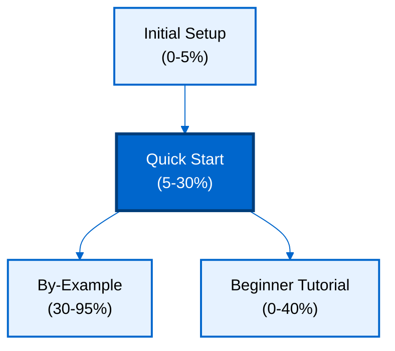

**Want to quickly build Elixir applications with databases?** This quick start introduces Ecto's core concepts through a working application. You'll learn schemas, changesets, queries, associations, and transactions - the essential 5-30% that powers productive Ecto development.

## Prerequisites

Before starting, complete [Initial Setup](/en/learn/software-engineering/data/tools/elixir-ecto/initial-setup) to install Ecto and verify your environment.

You should have:

- Elixir 1.14+ installed with Ecto dependencies
- PostgreSQL running and configured
- Basic Elixir knowledge (modules, pattern matching, pipes)
- Completed "Your First Ecto Queries" from Initial Setup

## What You'll Build

You'll create a **blog platform** with:

- Users with authentication and profiles
- Posts with rich content
- Comments on posts
- Tags for categorization (many-to-many)
- Queries with joins and aggregations
- Validations and changesets
- Transactions for consistency

This covers 5-30% of Ecto features - enough to build real applications while understanding core concepts.

## Learning Path



## Learning Objectives

By the end of this quick start, you will:

1. **Define schemas** with fields, types, and associations
2. **Create changesets** for validation and data casting
3. **Query data** with Ecto.Query DSL
4. **Manage associations** (belongs_to, has_many, many_to_many)
5. **Execute transactions** for data consistency
6. **Preload associations** efficiently
7. **Write complex queries** with joins and aggregations
8. **Handle errors** with pattern matching

## Project Setup

Create new Mix project for this tutorial:

```bash
mix new blog_platform --sup
cd blog_platform
```

Add Ecto dependencies to `mix.exs`:

```elixir
defp deps do
  [
    {:ecto_sql, "~> 3.11"},
    {:postgrex, "~> 0.17"}
  ]
end
```

Install dependencies:

```bash
mix deps.get
```

Create repository in `lib/blog_platform/repo.ex`:

```elixir
defmodule BlogPlatform.Repo do
  use Ecto.Repo,
    otp_app: :blog_platform,
    adapter: Ecto.Adapters.Postgres
end
```

Configure in `config/config.exs`:

```elixir
import Config

config :blog_platform, BlogPlatform.Repo,
  database: "blog_platform_dev",
  username: "postgres",
  password: "postgres",
  hostname: "localhost",
  port: 5432

config :blog_platform,
  ecto_repos: [BlogPlatform.Repo]

import_config "#{config_env()}.exs"
```

Add repo to supervision tree in `lib/blog_platform/application.ex`:

```elixir
def start(_type, _args) do
  children = [
    BlogPlatform.Repo
  ]

  opts = [strategy: :one_for_one, name: BlogPlatform.Supervisor]
  Supervisor.start_link(children, opts)
end
```

Create database:

```bash
mix ecto.create
```

## Schemas and Migrations

Define database tables and Elixir structs.

### User Schema

Create migration:

```bash
mix ecto.gen.migration create_users
```

Edit migration file:

```elixir
defmodule BlogPlatform.Repo.Migrations.CreateUsers do
  use Ecto.Migration

  def change do
    create table(:users) do
      add :username, :string, null: false
      add :email, :string, null: false
      add :password_hash, :string, null: false
      add :bio, :text
      add :active, :boolean, default: true

      timestamps()
    end

    create unique_index(:users, [:username])
    create unique_index(:users, [:email])
  end
end
```

Create schema in `lib/blog_platform/user.ex`:

```elixir
defmodule BlogPlatform.User do
  use Ecto.Schema
  import Ecto.Changeset

  schema "users" do
    field :username, :string
    field :email, :string
    field :password, :string, virtual: true
    field :password_hash, :string
    field :bio, :string
    field :active, :boolean, default: true

    has_many :posts, BlogPlatform.Post
    has_many :comments, BlogPlatform.Comment

    timestamps()
  end

  def changeset(user, attrs) do
    user
    |> cast(attrs, [:username, :email, :password, :bio, :active])
    |> validate_required([:username, :email, :password])
    |> validate_length(:username, min: 3, max: 50)
    |> validate_format(:email, ~r/@/)
    |> validate_length(:password, min: 8)
    |> unique_constraint(:username)
    |> unique_constraint(:email)
    |> hash_password()
  end

  defp hash_password(changeset) do
    case get_change(changeset, :password) do
      nil -> changeset
      password ->
        put_change(changeset, :password_hash, :crypto.hash(:sha256, password) |> Base.encode16())
    end
  end
end
```

Run migration:

```bash
mix ecto.migrate
```

### Post Schema with Associations

Create migration:

```bash
mix ecto.gen.migration create_posts
```

Edit migration:

```elixir
defmodule BlogPlatform.Repo.Migrations.CreatePosts do
  use Ecto.Migration

  def change do
    create table(:posts) do
      add :title, :string, null: false
      add :body, :text, null: false
      add :published, :boolean, default: false
      add :user_id, references(:users, on_delete: :delete_all), null: false

      timestamps()
    end

    create index(:posts, [:user_id])
    create index(:posts, [:published])
  end
end
```

Create schema in `lib/blog_platform/post.ex`:

```elixir
defmodule BlogPlatform.Post do
  use Ecto.Schema
  import Ecto.Changeset

  schema "posts" do
    field :title, :string
    field :body, :string
    field :published, :boolean, default: false

    belongs_to :user, BlogPlatform.User
    has_many :comments, BlogPlatform.Comment
    many_to_many :tags, BlogPlatform.Tag, join_through: "post_tags"

    timestamps()
  end

  def changeset(post, attrs) do
    post
    |> cast(attrs, [:title, :body, :published, :user_id])
    |> validate_required([:title, :body, :user_id])
    |> validate_length(:title, min: 5, max: 200)
    |> validate_length(:body, min: 20)
    |> foreign_key_constraint(:user_id)
  end
end
```

Run migration:

```bash
mix ecto.migrate
```

### Comment and Tag Schemas

Create migrations:

```bash
mix ecto.gen.migration create_comments
mix ecto.gen.migration create_tags
mix ecto.gen.migration create_post_tags
```

Comment migration:

```elixir
create table(:comments) do
  add :body, :text, null: false
  add :user_id, references(:users, on_delete: :delete_all), null: false
  add :post_id, references(:posts, on_delete: :delete_all), null: false
  timestamps()
end

create index(:comments, [:user_id])
create index(:comments, [:post_id])
```

Tag migration:

```elixir
create table(:tags) do
  add :name, :string, null: false
  timestamps()
end

create unique_index(:tags, [:name])
```

Post-Tags join table:

```elixir
create table(:post_tags, primary_key: false) do
  add :post_id, references(:posts, on_delete: :delete_all), null: false
  add :tag_id, references(:tags, on_delete: :delete_all), null: false
end

create unique_index(:post_tags, [:post_id, :tag_id])
```

Create corresponding schemas (similar pattern to above).

Run migrations:

```bash
mix ecto.migrate
```

## Changesets and Validations

Changesets validate and cast data before database operations.

### Creating Users with Validation

Start IEx:

```bash
iex -S mix
```

```elixir
alias BlogPlatform.{Repo, User}

user_params = %{
  username: "alice",
  email: "alice@example.com",
  password: "securepass123",
  bio: "Software engineer"
}

changeset = User.changeset(%User{}, user_params)
{:ok, user} = Repo.insert(changeset)

invalid_params = %{
  username: "bob",
  email: "bob@example.com",
  password: "short"
}

invalid_changeset = User.changeset(%User{}, invalid_params)
{:error, changeset} = Repo.insert(invalid_changeset)

changeset.errors
```

### Updating with Changesets

```elixir
user = Repo.get!(User, 1)

update_params = %{bio: "Elixir enthusiast and software engineer"}
changeset = User.changeset(user, update_params)
{:ok, updated_user} = Repo.update(changeset)

updated_user.bio
```

## Querying Data

Use Ecto.Query DSL for flexible queries.

### Basic Queries

```elixir
import Ecto.Query
alias BlogPlatform.{Repo, User, Post}

Repo.all(User)

Repo.get(User, 1)

Repo.get_by(User, username: "alice")

query = from u in User, where: u.active == true
Repo.all(query)

query = from u in User, select: {u.id, u.username}
Repo.all(query)
```

### Filtering and Ordering

```elixir
query = from u in User,
  where: u.active == true,
  order_by: [asc: u.username],
  select: u.username

Repo.all(query)

query = from u in User,
  where: like(u.email, "%@example.com")

Repo.all(query)

query = from u in User,
  order_by: [desc: u.inserted_at],
  limit: 10,
  offset: 0

Repo.all(query)
```

## Associations and Joins

Query related data efficiently.

### Creating Associated Records

```elixir
alias BlogPlatform.{Repo, User, Post}

user = Repo.get!(User, 1)

post_params = %{
  title: "Getting Started with Ecto",
  body: "Ecto is a powerful database wrapper for Elixir...",
  published: true,
  user_id: user.id
}

changeset = Post.changeset(%Post{}, post_params)
{:ok, post} = Repo.insert(changeset)
```

### Preloading Associations

```elixir
user = Repo.get!(User, 1) |> Repo.preload(:posts)
user.posts

post = Repo.get!(Post, 1) |> Repo.preload([:user, :comments])
post.user.username

user = Repo.get!(User, 1) |> Repo.preload(posts: [:comments, :tags])
```

### Join Queries

```elixir
query = from p in Post,
  join: u in User, on: p.user_id == u.id,
  where: p.published == true,
  select: {p.title, u.username}

Repo.all(query)

query = from u in User,
  left_join: p in Post, on: p.user_id == u.id,
  group_by: u.id,
  select: {u.username, count(p.id)}

Repo.all(query)
```

### Many-to-Many Associations

```elixir
alias BlogPlatform.{Repo, Post, Tag}

{:ok, elixir_tag} = Repo.insert(%Tag{name: "elixir"})
{:ok, ecto_tag} = Repo.insert(%Tag{name: "ecto"})

post = Repo.get!(Post, 1)
post
|> Repo.preload(:tags)
|> Ecto.Changeset.change()
|> Ecto.Changeset.put_assoc(:tags, [elixir_tag, ecto_tag])
|> Repo.update!()

query = from p in Post,
  join: pt in "post_tags", on: p.id == pt.post_id,
  join: t in Tag, on: t.id == pt.tag_id,
  where: t.name == "elixir",
  select: p

Repo.all(query)
```

## Aggregations

Compute summaries with aggregate functions.

### Count and Group By

```elixir
import Ecto.Query

query = from p in Post,
  join: u in User, on: p.user_id == u.id,
  group_by: u.id,
  select: {u.username, count(p.id)}

Repo.all(query)

query = from p in Post,
  group_by: p.published,
  select: {p.published, count(p.id)}

Repo.all(query)
```

### Other Aggregate Functions

```elixir
query = from p in Post,
  select: %{
    total: count(p.id),
    avg_length: avg(fragment("LENGTH(?)", p.body)),
    min_length: min(fragment("LENGTH(?)", p.body)),
    max_length: max(fragment("LENGTH(?)", p.body))
  }

Repo.one(query)
```

## Transactions

Group operations for atomicity.

### Basic Transaction

```elixir
alias BlogPlatform.{Repo, User, Post}

Repo.transaction(fn ->
  # Create user
  user_params = %{
    username: "david",
    email: "david@example.com",
    password: "securepass123"
  }
  {:ok, user} = User.changeset(%User{}, user_params) |> Repo.insert()

  # Create post for user
  post_params = %{
    title: "My First Post",
    body: "This is my first post on the platform!",
    user_id: user.id
  }
  {:ok, post} = Post.changeset(%Post{}, post_params) |> Repo.insert()

  {user, post}
end)
```

### Transaction with Rollback

```elixir
result = Repo.transaction(fn ->
  user_params = %{username: "existing", email: "new@example.com", password: "pass1234"}

  case User.changeset(%User{}, user_params) |> Repo.insert() do
    {:ok, user} ->
      # Create post
      post_params = %{title: "Post", body: "Content", user_id: user.id}
      case Post.changeset(%Post{}, post_params) |> Repo.insert() do
        {:ok, post} -> {user, post}
        {:error, _} -> Repo.rollback(:post_creation_failed)
      end
    {:error, _} ->
      Repo.rollback(:user_creation_failed)
  end
end)

case result do
  {:ok, {user, post}} -> IO.puts("Success!")
  {:error, reason} -> IO.puts("Failed: #{reason}")
end
```

## Advanced Query Patterns

### Subqueries

```elixir
subquery = from p in Post,
  group_by: p.user_id,
  select: %{user_id: p.user_id, post_count: count(p.id)}

avg_posts = from s in subquery(subquery),
  select: avg(s.post_count)

query = from u in User,
  join: p in Post, on: p.user_id == u.id,
  group_by: u.id,
  having: count(p.id) > subquery(avg_posts),
  select: {u.username, count(p.id)}

Repo.all(query)
```

### Dynamic Queries

```elixir
def filter_posts(filters) do
  query = from p in Post

  query =
    if filters[:published] do
      where(query, [p], p.published == ^filters[:published])
    else
      query
    end

  query =
    if filters[:user_id] do
      where(query, [p], p.user_id == ^filters[:user_id])
    else
      query
    end

  Repo.all(query)
end

filter_posts(%{published: true, user_id: 1})
```

### Fragments for Raw SQL

```elixir
query = from p in Post,
  where: fragment("? % ?", p.title, ^"Ecto"),
  select: p

Repo.all(query)

query = from p in Post,
  where: fragment("to_tsvector('english', ?) @@ plainto_tsquery('english', ?)",
                  p.body, ^"database"),
  select: p

Repo.all(query)
```

## Error Handling

Pattern match on results for robust error handling.

### Insert with Error Handling

```elixir
case User.changeset(%User{}, user_params) |> Repo.insert() do
  {:ok, user} ->
    IO.puts("User created: #{user.username}")
  {:error, changeset} ->
    IO.puts("Failed to create user:")
    Enum.each(changeset.errors, fn {field, {message, _}} ->
      IO.puts("  #{field}: #{message}")
    end)
end
```

### Query with Error Handling

```elixir
try do
  user = Repo.get!(User, 999)
rescue
  Ecto.NoResultsError ->
    IO.puts("User not found")
end

case Repo.get(User, 999) do
  nil -> IO.puts("User not found")
  user -> IO.puts("Found: #{user.username}")
end
```

## Next Steps

You've learned Ecto's core concepts covering 5-30% of the library. Continue learning:

1. **[By-Example Tutorial](/en/learn/software-engineering/data/tools/elixir-ecto/by-example)** - Annotated examples covering 95% of Ecto (beginner, intermediate, advanced)
2. **Beginner Tutorial** (coming soon) - Narrative-driven comprehensive guide
3. **[Ecto Documentation](https://hexdocs.pm/ecto/)** - Comprehensive reference

**What you've learned**:

- Schema definition with fields and associations
- Changesets for validation and data casting
- Querying with Ecto.Query DSL
- Association management (belongs_to, has_many, many_to_many)
- Preloading for efficient data fetching
- Transactions for atomicity
- Aggregations and complex queries
- Error handling patterns

**Topics to explore next**:

- Ecto.Multi for complex transaction pipelines
- Custom Ecto types
- Database constraints and indexes
- Migration best practices
- Query optimization
- Schema-less queries
- Embedded schemas

## Summary

This quick start covered essential Ecto concepts through a blog platform:

**Schemas**: Defined database structures with fields, types, and associations

**Changesets**: Validated and cast data with custom validation functions

**Queries**: Retrieved data with Ecto.Query DSL including WHERE, ORDER BY, JOIN

**Associations**: Managed relationships with belongs_to, has_many, and many_to_many

**Preloading**: Loaded associated data efficiently to avoid N+1 queries

**Transactions**: Grouped operations atomically with rollback support

**Aggregations**: Computed summaries with COUNT, AVG, MIN, MAX

**Patterns**: Applied subqueries, dynamic queries, and fragments for flexibility

You're now ready to build Elixir applications with databases using Ecto. Continue to By-Example for deeper mastery covering 95% of Ecto features.
