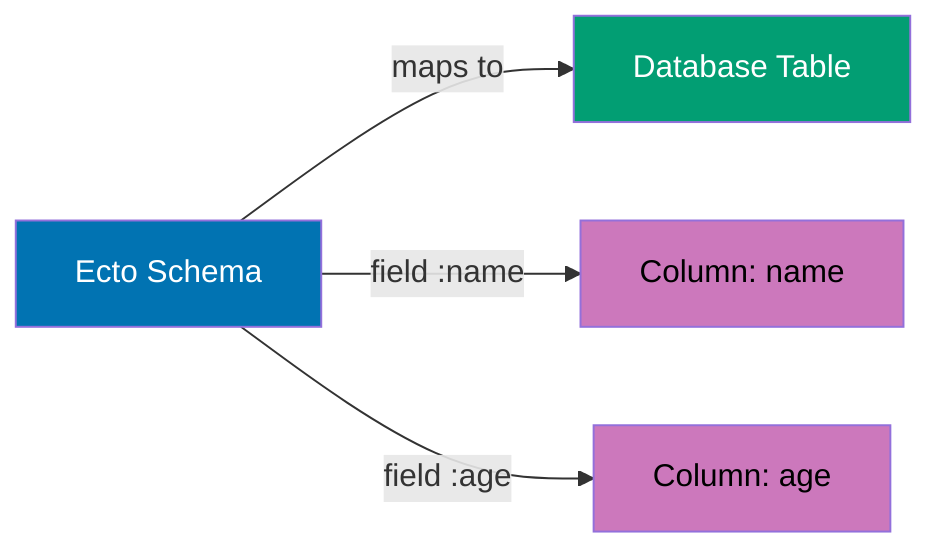
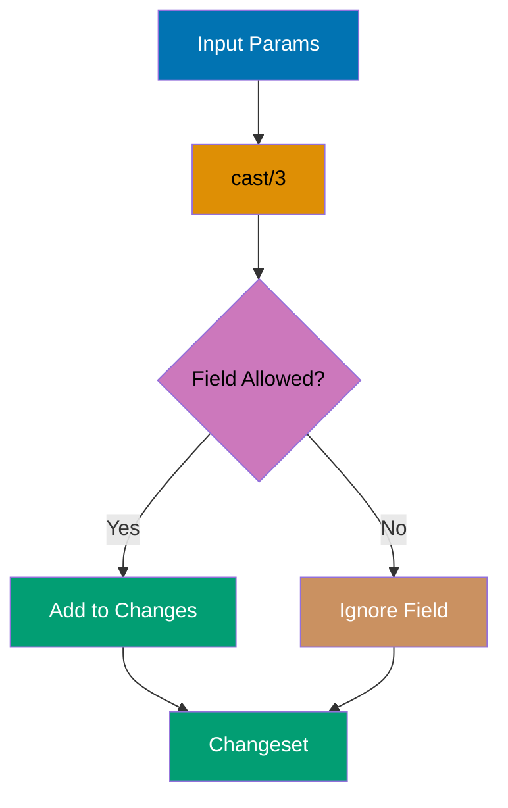
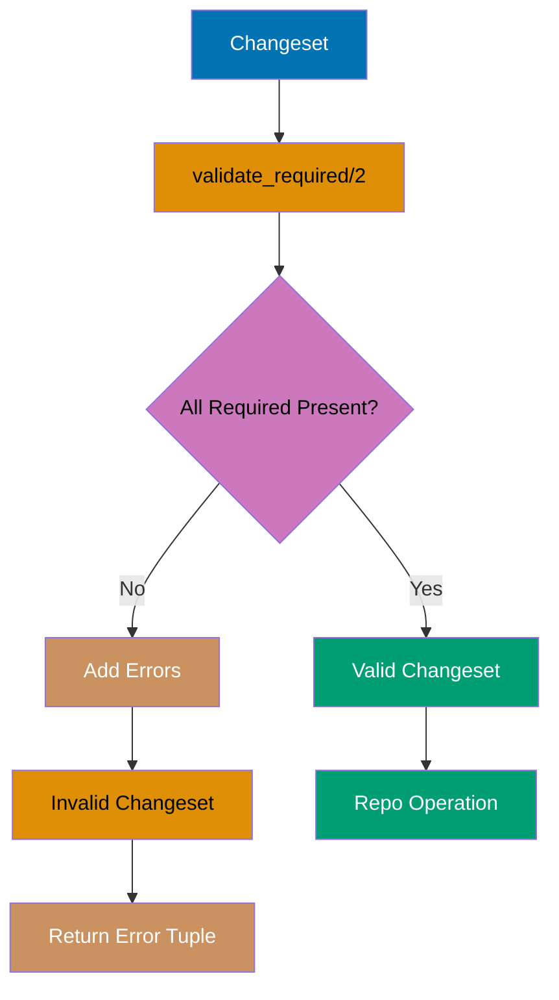
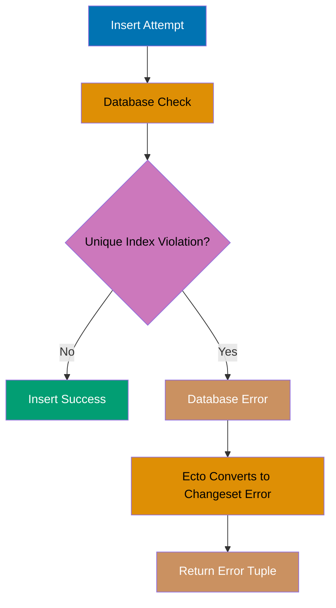
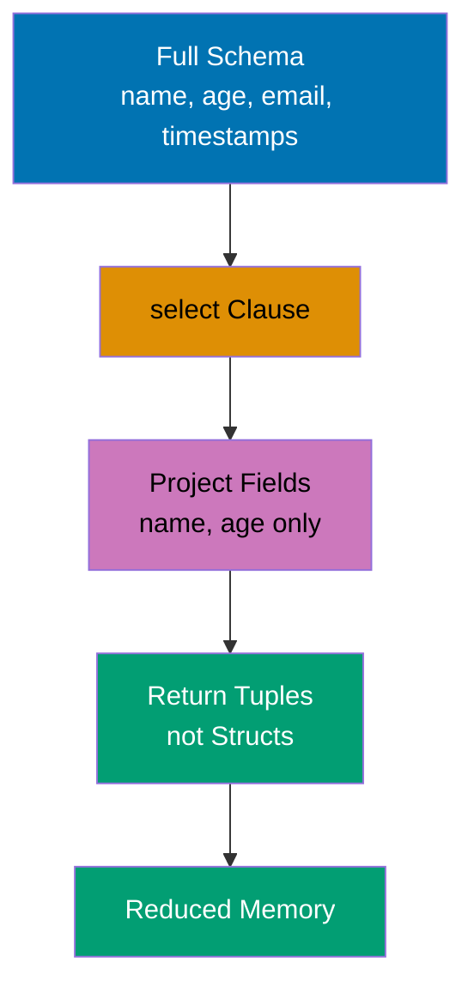
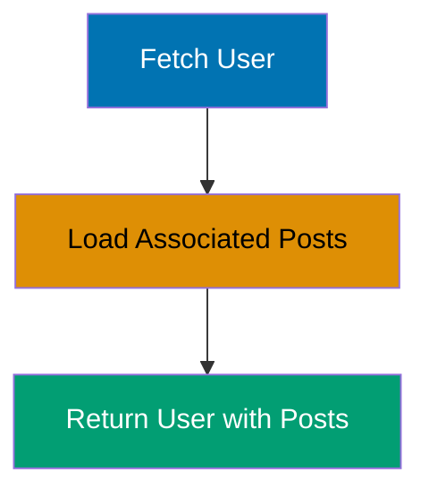
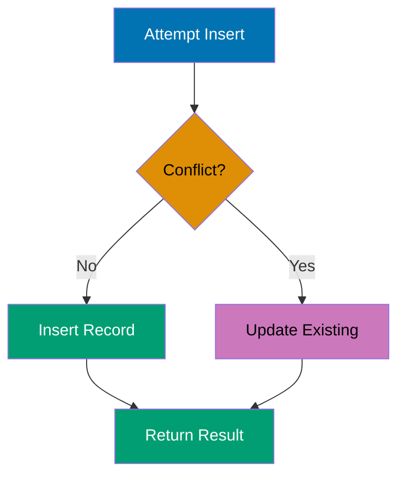

## Beginner Examples (1-30)

**Coverage**: 0-40% of Ecto functionality

**Focus**: Repository basics, schema definition, changesets, basic queries, and simple associations.

These examples cover fundamentals needed for basic CRUD applications. Each example is completely self-contained and runnable in IEx.

---

### Example 1: Defining a Basic Schema

Ecto schemas map Elixir structs to database tables, providing type safety and validation. Schemas define the structure of your data and are the foundation for all Ecto operations.



```elixir
defmodule User do
  use Ecto.Schema                     # => Import schema DSL

  schema "users" do                   # => Map to "users" table
    field :name, :string              # => String column
    field :age, :integer              # => Integer column
    field :email, :string             # => Email column
    timestamps()                      # => inserted_at, updated_at (type: naive_datetime)
  end
end

# Create struct instance
user = %User{name: "Alice", age: 30, email: "alice@example.com"}
                                      # => user is struct (not persisted yet)
IO.inspect(user.name)                 # => Output: "Alice"
IO.inspect(user.id)                   # => Output: nil (not saved to database)
```

**Key Takeaway**: Schemas define the structure of your data and provide compile-time guarantees about field names and types, but creating a struct does not persist it to the database—you need Repo operations for that.

---

### Example 2: Inserting Data with Repo.insert/1

Repo.insert/1 persists a struct or changeset to the database, returning `{:ok, struct}` on success or `{:error, changeset}` on failure. This is the fundamental operation for creating new records.

```elixir
defmodule User do
  use Ecto.Schema

  schema "users" do
    field :name, :string
    field :age, :integer
    timestamps()
  end
end

# Create struct
user = %User{name: "Bob", age: 25}    # => user.id is nil (not persisted)

# Insert into database
{:ok, saved_user} = Repo.insert(user) # => saved_user.id is 1 (auto-generated)
                                      # => SQL: INSERT INTO users (name, age, inserted_at, updated_at)
                                      # =>      VALUES ('Bob', 25, NOW(), NOW())
                                      # =>      RETURNING id, inserted_at, updated_at

IO.inspect(saved_user.id)             # => Output: 1
IO.inspect(saved_user.name)           # => Output: "Bob"
```

**Key Takeaway**: Repo.insert/1 persists data and returns the struct with database-generated fields (id, timestamps) populated, making it essential to capture the return value rather than using the original struct.

---

### Example 3: Querying with Repo.all/1

Repo.all/1 fetches all records matching a query, returning a list of structs. This is the basic operation for reading data from the database.

```elixir
defmodule User do
  use Ecto.Schema

  schema "users" do
    field :name, :string
    field :age, :integer
    timestamps()
  end
end

# Insert test data
Repo.insert(%User{name: "Alice", age: 30})
                                      # => {:ok, %User{id: 1, ...}}
Repo.insert(%User{name: "Bob", age: 25})
                                      # => {:ok, %User{id: 2, ...}}

# Fetch all users
users = Repo.all(User)                # => users is [%User{id: 1, ...}, %User{id: 2, ...}]
                                      # => SQL: SELECT * FROM users

IO.inspect(length(users))             # => Output: 2
IO.inspect(Enum.map(users, & &1.name))
                                      # => Output: ["Alice", "Bob"]
```

**Key Takeaway**: Repo.all/1 always returns a list even when the table is empty (returns `[]`), making it safe to use without nil checks, but be aware it loads all matching records into memory.

---

### Example 4: Fetching a Single Record with Repo.get/2

Repo.get/2 fetches a record by primary key, returning the struct or nil if not found. This is the most efficient way to load a single record when you know its ID.

```elixir
defmodule User do
  use Ecto.Schema

  schema "users" do
    field :name, :string
    timestamps()
  end
end

# Insert test user
{:ok, user} = Repo.insert(%User{name: "Charlie"})
                                      # => user.id is 1

# Fetch by ID
found = Repo.get(User, 1)             # => found is %User{id: 1, name: "Charlie"}
                                      # => SQL: SELECT * FROM users WHERE id = 1

not_found = Repo.get(User, 999)       # => not_found is nil (no record)
                                      # => SQL: SELECT * FROM users WHERE id = 999

IO.inspect(found.name)                # => Output: "Charlie"
IO.inspect(not_found)                 # => Output: nil
```

**Key Takeaway**: Repo.get/2 returns nil (not an error tuple) when the record doesn't exist, so you must handle nil explicitly; use Repo.get!/2 if you want it to raise on not found.

---

### Example 5: Raising on Not Found with Repo.get!/2

Repo.get!/2 fetches a record by primary key, raising Ecto.NoResultsError if not found. Use this when the record must exist or you want the error to bubble up.

```elixir
defmodule User do
  use Ecto.Schema

  schema "users" do
    field :name, :string
    timestamps()
  end
end

# Insert test user
{:ok, user} = Repo.insert(%User{name: "Diana"})
                                      # => user.id is 1

# Fetch with bang (raises on not found)
found = Repo.get!(User, 1)            # => found is %User{id: 1, name: "Diana"}
                                      # => SQL: SELECT * FROM users WHERE id = 1

# This would raise Ecto.NoResultsError
# Repo.get!(User, 999)                # => Raises: no results found for query

IO.inspect(found.name)                # => Output: "Diana"
```

**Key Takeaway**: Use Repo.get!/2 in controller actions or places where a missing record should halt execution, but prefer Repo.get/2 when you need to handle the not-found case gracefully.

---

### Example 6: Filtering with Repo.get_by/2

Repo.get_by/2 fetches the first record matching given conditions, returning the struct or nil. Unlike get/2, it works with any field, not just the primary key.

```elixir
defmodule User do
  use Ecto.Schema

  schema "users" do
    field :email, :string
    field :name, :string
    timestamps()
  end
end

# Insert test users
Repo.insert(%User{name: "Eve", email: "eve@example.com"})
                                      # => {:ok, %User{id: 1, ...}}
Repo.insert(%User{name: "Frank", email: "frank@example.com"})
                                      # => {:ok, %User{id: 2, ...}}

# Fetch by email
found = Repo.get_by(User, email: "eve@example.com")
                                      # => found is %User{id: 1, name: "Eve"}
                                      # => SQL: SELECT * FROM users WHERE email = 'eve@example.com' LIMIT 1

not_found = Repo.get_by(User, email: "unknown@example.com")
                                      # => not_found is nil
                                      # => SQL: SELECT * FROM users WHERE email = 'unknown@example.com' LIMIT 1

IO.inspect(found.name)                # => Output: "Eve"
IO.inspect(not_found)                 # => Output: nil
```

**Key Takeaway**: Repo.get_by/2 returns only the first matching record, so add indexes on commonly queried fields and be aware that multiple matches will only return one.

---

### Example 7: Updating Records with Repo.update/1

Repo.update/1 persists changes from a changeset to the database, returning `{:ok, struct}` on success. Changes must be wrapped in a changeset before updating.

```elixir
defmodule User do
  use Ecto.Schema
  import Ecto.Changeset

  schema "users" do
    field :name, :string
    field :age, :integer
    timestamps()
  end

  def changeset(user, attrs) do
    user
    |> cast(attrs, [:name, :age])     # => Cast attributes from map
  end
end

# Insert and update user
{:ok, user} = Repo.insert(%User{name: "Grace", age: 28})
                                      # => user.id is 1, age is 28

# Create changeset with updates
changeset = User.changeset(user, %{age: 29})
                                      # => changeset.changes is %{age: 29}
                                      # => changeset.valid? is true

# Apply update
{:ok, updated} = Repo.update(changeset)
                                      # => updated.age is 29
                                      # => SQL: UPDATE users SET age = 29, updated_at = NOW()
                                      # =>      WHERE id = 1

IO.inspect(updated.age)               # => Output: 29
```

**Key Takeaway**: Always use changesets for updates to leverage validation and change tracking; Ecto only updates fields that actually changed, reducing database load.

---

### Example 8: Deleting Records with Repo.delete/1

Repo.delete/1 removes a record from the database, accepting either a struct or changeset. Returns `{:ok, struct}` with the deleted data or `{:error, changeset}` on failure.

```elixir
defmodule User do
  use Ecto.Schema

  schema "users" do
    field :name, :string
    timestamps()
  end
end

# Insert and delete user
{:ok, user} = Repo.insert(%User{name: "Henry"})
                                      # => user.id is 1

# Delete from database
{:ok, deleted} = Repo.delete(user)    # => deleted is %User{id: 1, name: "Henry"}
                                      # => SQL: DELETE FROM users WHERE id = 1

# Verify deletion
not_found = Repo.get(User, 1)         # => not_found is nil (record deleted)
                                      # => SQL: SELECT * FROM users WHERE id = 1

IO.inspect(deleted.name)              # => Output: "Henry" (data still in memory)
IO.inspect(not_found)                 # => Output: nil (gone from database)
```

**Key Takeaway**: Repo.delete/1 returns the deleted struct, allowing you to access its data after deletion, but the struct is no longer persisted and subsequent Repo operations on it will fail.

---

### Example 9: Creating a Changeset with cast/3

Changesets validate and filter data before persisting to the database. The cast/3 function takes a struct, params map, and allowed fields, returning a changeset.



```elixir
defmodule User do
  use Ecto.Schema
  import Ecto.Changeset

  schema "users" do
    field :name, :string
    field :age, :integer
    field :email, :string
    timestamps()
  end

  def changeset(user, params \\ %{}) do
    user
    |> cast(params, [:name, :age, :email])
                                      # => Cast allowed fields from params
                                      # => Unknown fields are ignored
  end
end

# Create changeset with valid data
params = %{name: "Ivy", age: 27, email: "ivy@example.com", unknown: "ignored"}
changeset = User.changeset(%User{}, params)
                                      # => changeset.changes is %{name: "Ivy", age: 27, email: "ivy@..."}
                                      # => changeset.valid? is true
                                      # => "unknown" field not in changes

IO.inspect(changeset.valid?)          # => Output: true
IO.inspect(changeset.changes)         # => Output: %{name: "Ivy", age: 27, email: "ivy@..."}
```

**Key Takeaway**: cast/3 acts as a whitelist for params, protecting against mass assignment vulnerabilities by only allowing explicitly listed fields to be set.

---

### Example 10: Validating Required Fields

validate_required/2 ensures specified fields are present in the changeset, adding errors if any are missing. This is fundamental for enforcing data integrity.



```elixir
defmodule User do
  use Ecto.Schema
  import Ecto.Changeset

  schema "users" do
    field :name, :string
    field :email, :string
    timestamps()
  end

  def changeset(user, params \\ %{}) do
    user
    |> cast(params, [:name, :email])
    |> validate_required([:name, :email])
                                      # => Add error if name or email missing
  end
end

# Valid changeset
valid = User.changeset(%User{}, %{name: "Jack", email: "jack@example.com"})
                                      # => valid.valid? is true
                                      # => valid.errors is []

# Invalid changeset (missing email)
invalid = User.changeset(%User{}, %{name: "Jack"})
                                      # => invalid.valid? is false
                                      # => invalid.errors is [email: {"can't be blank", ...}]

# Attempt insert with invalid changeset
{:error, failed} = Repo.insert(invalid)
                                      # => Returns error tuple, no SQL executed
                                      # => failed.errors is [email: {"can't be blank", ...}]

IO.inspect(valid.valid?)              # => Output: true
IO.inspect(invalid.valid?)            # => Output: false
```

**Key Takeaway**: validate_required/2 prevents database errors by catching missing fields before insert/update, and Repo operations automatically check changeset validity before executing SQL.

---

### Example 11: Format Validation with validate_format/3

validate_format/3 ensures a field matches a regular expression pattern, commonly used for emails, URLs, and custom formats. Invalid formats add errors to the changeset.

```elixir
defmodule User do
  use Ecto.Schema
  import Ecto.Changeset

  schema "users" do
    field :email, :string
    timestamps()
  end

  def changeset(user, params \\ %{}) do
    user
    |> cast(params, [:email])
    |> validate_required([:email])
    |> validate_format(:email, ~r/@/)  # => Simple email regex (must contain @)
  end
end

# Valid email
valid = User.changeset(%User{}, %{email: "kate@example.com"})
                                      # => valid.valid? is true
                                      # => "kate@example.com" matches ~r/@/

# Invalid email (missing @)
invalid = User.changeset(%User{}, %{email: "invalid-email"})
                                      # => invalid.valid? is false
                                      # => invalid.errors is [email: {"has invalid format", ...}]

IO.inspect(valid.valid?)              # => Output: true
IO.inspect(invalid.valid?)            # => Output: false
IO.inspect(invalid.errors[:email])    # => Output: {"has invalid format", [...]}
```

**Key Takeaway**: validate_format/3 provides client-side validation logic at the changeset level, preventing invalid data from reaching the database, but remember that regex validation is no substitute for email verification.

---

### Example 12: Length Validation with validate_length/3

validate_length/3 ensures string or list fields meet length constraints (min, max, is). This prevents database errors and enforces business rules.

```elixir
defmodule User do
  use Ecto.Schema
  import Ecto.Changeset

  schema "users" do
    field :username, :string
    field :password, :string
    timestamps()
  end

  def changeset(user, params \\ %{}) do
    user
    |> cast(params, [:username, :password])
    |> validate_required([:username, :password])
    |> validate_length(:username, min: 3, max: 20)
                                      # => Username must be 3-20 characters
    |> validate_length(:password, min: 8)
                                      # => Password must be at least 8 characters
  end
end

# Valid lengths
valid = User.changeset(%User{}, %{username: "liam", password: "securepass123"})
                                      # => valid.valid? is true
                                      # => username length 4, password length 13

# Invalid: username too short
invalid_user = User.changeset(%User{}, %{username: "ab", password: "securepass"})
                                      # => invalid_user.valid? is false
                                      # => errors: [username: {"should be at least 3 character(s)", ...}]

# Invalid: password too short
invalid_pass = User.changeset(%User{}, %{username: "liam", password: "short"})
                                      # => invalid_pass.valid? is false
                                      # => errors: [password: {"should be at least 8 character(s)", ...}]

IO.inspect(valid.valid?)              # => Output: true
IO.inspect(invalid_user.valid?)       # => Output: false
```

**Key Takeaway**: validate_length/3 enforces both minimum and maximum constraints, preventing SQL errors from exceeding column limits and ensuring data meets business requirements.

---

### Example 13: Number Validation with validate_number/3

validate_number/3 ensures numeric fields meet constraints (greater_than, less_than, equal_to, etc.). This enforces business rules and prevents invalid numeric data.

```elixir
defmodule Product do
  use Ecto.Schema
  import Ecto.Changeset

  schema "products" do
    field :name, :string
    field :price, :decimal
    field :stock, :integer
    timestamps()
  end

  def changeset(product, params \\ %{}) do
    product
    |> cast(params, [:name, :price, :stock])
    |> validate_required([:name, :price, :stock])
    |> validate_number(:price, greater_than: 0)
                                      # => Price must be positive
    |> validate_number(:stock, greater_than_or_equal_to: 0)
                                      # => Stock cannot be negative
  end
end

# Valid numbers
valid = Product.changeset(%Product{}, %{name: "Widget", price: 9.99, stock: 10})
                                      # => valid.valid? is true
                                      # => price 9.99 > 0, stock 10 >= 0

# Invalid: negative price
invalid_price = Product.changeset(%Product{}, %{name: "Widget", price: -5, stock: 10})
                                      # => invalid_price.valid? is false
                                      # => errors: [price: {"must be greater than 0", ...}]

# Invalid: negative stock
invalid_stock = Product.changeset(%Product{}, %{name: "Widget", price: 9.99, stock: -1})
                                      # => invalid_stock.valid? is false
                                      # => errors: [stock: {"must be greater than or equal to 0", ...}]

IO.inspect(valid.valid?)              # => Output: true
IO.inspect(invalid_price.valid?)      # => Output: false
```

**Key Takeaway**: validate_number/3 prevents business logic errors at the changeset level, ensuring numeric constraints are enforced before data reaches the database.

---

### Example 14: Unique Constraint with unique_constraint/2

unique_constraint/2 validates database-level unique constraints, converting database errors into changeset errors. Requires a unique index on the database column.



```elixir
defmodule User do
  use Ecto.Schema
  import Ecto.Changeset

  schema "users" do
    field :email, :string
    timestamps()
  end

  def changeset(user, params \\ %{}) do
    user
    |> cast(params, [:email])
    |> validate_required([:email])
    |> unique_constraint(:email)      # => Check unique index on email column
                                      # => Database must have: CREATE UNIQUE INDEX ON users(email)
  end
end

# First insert succeeds
{:ok, user1} = %User{}
  |> User.changeset(%{email: "mia@example.com"})
  |> Repo.insert()                    # => user1.id is 1, email is "mia@example.com"
                                      # => SQL: INSERT INTO users (email, ...) VALUES ('mia@...', ...)

# Second insert with same email fails
{:error, changeset} = %User{}
  |> User.changeset(%{email: "mia@example.com"})
  |> Repo.insert()                    # => Database raises unique constraint error
                                      # => Ecto converts to changeset error
                                      # => changeset.errors is [email: {"has already been taken", ...}]

IO.inspect(user1.email)               # => Output: "mia@example.com"
IO.inspect(changeset.valid?)          # => Output: false
IO.inspect(changeset.errors[:email])  # => Output: {"has already been taken", [...]}
```

**Key Takeaway**: unique_constraint/2 relies on database indexes and only triggers during Repo operations, so always pair it with a unique index migration and handle the error case gracefully.

---

### Example 15: Basic Query with from/2

The from/2 macro builds queries using Ecto's query DSL, providing a composable and type-safe way to query the database. This is more flexible than Repo.all/1 for complex queries.


```elixir
defmodule User do
  use Ecto.Schema

  schema "users" do
    field :name, :string
    field :age, :integer
    timestamps()
  end
end

import Ecto.Query

# Insert test data
Repo.insert(%User{name: "Noah", age: 30})
Repo.insert(%User{name: "Olivia", age: 25})
Repo.insert(%User{name: "Paul", age: 35})

# Query users over 25
query = from u in User,
  where: u.age > 25,                  # => Filter condition
  select: u                           # => Select full struct

users = Repo.all(query)               # => users is [%User{name: "Noah", age: 30},
                                      # =>            %User{name: "Paul", age: 35}]
                                      # => SQL: SELECT * FROM users WHERE age > 25

IO.inspect(length(users))             # => Output: 2
IO.inspect(Enum.map(users, & &1.name))
                                      # => Output: ["Noah", "Paul"]
```

**Key Takeaway**: from/2 queries are composable and can be built incrementally, making them ideal for dynamic queries where filters depend on user input or application state.

---

### Example 16: Selecting Specific Fields

The select clause in queries allows you to fetch only specific fields instead of entire structs, reducing memory usage and database load.



```elixir
defmodule User do
  use Ecto.Schema

  schema "users" do
    field :name, :string
    field :age, :integer
    field :email, :string
    timestamps()
  end
end

import Ecto.Query

# Insert test data
Repo.insert(%User{name: "Quinn", age: 28, email: "quinn@example.com"})
Repo.insert(%User{name: "Ruby", age: 32, email: "ruby@example.com"})

# Select only name and age
query = from u in User,
  select: {u.name, u.age}             # => Tuple of fields (not full struct)

results = Repo.all(query)             # => results is [{"Quinn", 28}, {"Ruby", 32}]
                                      # => SQL: SELECT name, age FROM users

# Select into map
map_query = from u in User,
  select: %{name: u.name, age: u.age} # => Map projection

map_results = Repo.all(map_query)     # => map_results is [%{name: "Quinn", age: 28}, ...]
                                      # => SQL: SELECT name, age FROM users

IO.inspect(results)                   # => Output: [{"Quinn", 28}, {"Ruby", 32}]
IO.inspect(map_results)               # => Output: [%{name: "Quinn", age: 28}, ...]
```

**Key Takeaway**: Use field selection to optimize queries by fetching only needed data, especially important when dealing with large tables or columns with heavy data like text blobs.

---

### Example 17: Ordering Results with order_by

The order_by clause sorts query results by one or more fields, supporting ascending (asc) and descending (desc) order.

```elixir
defmodule User do
  use Ecto.Schema

  schema "users" do
    field :name, :string
    field :age, :integer
    timestamps()
  end
end

import Ecto.Query

# Insert test data
Repo.insert(%User{name: "Sam", age: 40})
Repo.insert(%User{name: "Tina", age: 25})
Repo.insert(%User{name: "Uma", age: 30})

# Order by age ascending
asc_query = from u in User,
  order_by: [asc: u.age],             # => Sort by age ascending (25, 30, 40)
  select: {u.name, u.age}

asc_results = Repo.all(asc_query)     # => asc_results is [{"Tina", 25}, {"Uma", 30}, {"Sam", 40}]
                                      # => SQL: SELECT name, age FROM users ORDER BY age ASC

# Order by age descending
desc_query = from u in User,
  order_by: [desc: u.age],            # => Sort by age descending (40, 30, 25)
  select: {u.name, u.age}

desc_results = Repo.all(desc_query)   # => desc_results is [{"Sam", 40}, {"Uma", 30}, {"Tina", 25}]
                                      # => SQL: SELECT name, age FROM users ORDER BY age DESC

IO.inspect(asc_results)               # => Output: [{"Tina", 25}, {"Uma", 30}, {"Sam", 40}]
IO.inspect(desc_results)              # => Output: [{"Sam", 40}, {"Uma", 30}, {"Tina", 25}]
```

**Key Takeaway**: order_by supports multiple fields (order_by: [asc: :age, desc: :name]) for complex sorting, and the order matters when sorting by multiple columns.

---

### Example 18: Limiting Results with limit

The limit clause restricts the number of results returned, essential for pagination and performance optimization.

```elixir
defmodule User do
  use Ecto.Schema

  schema "users" do
    field :name, :string
    timestamps()
  end
end

import Ecto.Query

# Insert test data
Repo.insert(%User{name: "Victor"})
Repo.insert(%User{name: "Wendy"})
Repo.insert(%User{name: "Xavier"})
Repo.insert(%User{name: "Yara"})
Repo.insert(%User{name: "Zane"})

# Limit to first 3 results
query = from u in User,
  order_by: [asc: u.name],            # => Order to ensure consistent results
  limit: 3,                           # => Return only first 3 rows
  select: u.name

results = Repo.all(query)             # => results is ["Victor", "Wendy", "Xavier"]
                                      # => SQL: SELECT name FROM users ORDER BY name ASC LIMIT 3

IO.inspect(results)                   # => Output: ["Victor", "Wendy", "Xavier"]
IO.inspect(length(results))           # => Output: 3
```

**Key Takeaway**: Always combine limit with order_by to ensure consistent results, as database row order is undefined without explicit sorting.

---

### Example 19: Offsetting Results with offset

The offset clause skips a number of rows before returning results, commonly used with limit for pagination.

```elixir
defmodule User do
  use Ecto.Schema

  schema "users" do
    field :name, :string
    timestamps()
  end
end

import Ecto.Query

# Insert test data
Enum.each(["Alice", "Bob", "Charlie", "Diana", "Eve"], fn name ->
  Repo.insert(%User{name: name})
end)

# First page (limit 2)
page1_query = from u in User,
  order_by: [asc: u.name],
  limit: 2,                           # => First 2 results
  select: u.name

page1 = Repo.all(page1_query)         # => page1 is ["Alice", "Bob"]
                                      # => SQL: SELECT name FROM users ORDER BY name ASC LIMIT 2

# Second page (offset 2, limit 2)
page2_query = from u in User,
  order_by: [asc: u.name],
  offset: 2,                          # => Skip first 2 results
  limit: 2,                           # => Take next 2 results
  select: u.name

page2 = Repo.all(page2_query)         # => page2 is ["Charlie", "Diana"]
                                      # => SQL: SELECT name FROM users ORDER BY name ASC LIMIT 2 OFFSET 2

IO.inspect(page1)                     # => Output: ["Alice", "Bob"]
IO.inspect(page2)                     # => Output: ["Charlie", "Diana"]
```

**Key Takeaway**: offset is simple for pagination but inefficient on large tables; consider cursor-based pagination (e.g., `where: u.id > ^last_seen_id`) for better performance at scale.

---

### Example 20: Counting Records with Repo.aggregate/3

Repo.aggregate/3 performs aggregate functions (count, sum, avg, min, max) without loading all records into memory, making it efficient for large tables.

```elixir
defmodule User do
  use Ecto.Schema

  schema "users" do
    field :name, :string
    field :age, :integer
    timestamps()
  end
end

import Ecto.Query

# Insert test data
Repo.insert(%User{name: "Frank", age: 25})
Repo.insert(%User{name: "Grace", age: 30})
Repo.insert(%User{name: "Henry", age: 35})

# Count all users
total = Repo.aggregate(User, :count, :id)
                                      # => total is 3
                                      # => SQL: SELECT COUNT(id) FROM users

# Count users with filter
query = from u in User, where: u.age > 28
count = Repo.aggregate(query, :count, :id)
                                      # => count is 2 (Grace and Henry)
                                      # => SQL: SELECT COUNT(id) FROM users WHERE age > 28

# Average age
avg_age = Repo.aggregate(User, :avg, :age)
                                      # => avg_age is Decimal("30.0")
                                      # => SQL: SELECT AVG(age) FROM users

IO.inspect(total)                     # => Output: 3
IO.inspect(count)                     # => Output: 2
IO.inspect(avg_age)                   # => Output: #Decimal<30.0>
```

**Key Takeaway**: Repo.aggregate/3 performs calculations in the database without loading records into memory, making it vastly more efficient than Repo.all + Enum operations for aggregates.

---

### Example 21: Defining belongs_to Association

belongs_to creates a foreign key relationship where this schema references another schema's primary key. This is the "many" side of a one-to-many relationship.


```elixir
defmodule User do
  use Ecto.Schema

  schema "users" do
    field :name, :string
    timestamps()
  end
end

defmodule Post do
  use Ecto.Schema

  schema "posts" do
    field :title, :string
    belongs_to :user, User              # => Foreign key: user_id (references users.id)
    timestamps()
  end
end

# Create user and post
{:ok, user} = Repo.insert(%User{name: "Iris"})
                                        # => user.id is 1

{:ok, post} = Repo.insert(%Post{title: "Hello", user_id: user.id})
                                        # => post.user_id is 1 (foreign key)
                                        # => SQL: INSERT INTO posts (title, user_id, ...) VALUES ('Hello', 1, ...)

IO.inspect(post.user_id)                # => Output: 1
IO.inspect(post.user)                   # => Output: %Ecto.Association.NotLoaded{...}
                                        # => Association not loaded (use preload)
```

**Key Takeaway**: belongs_to adds a foreign key field (user_id) to the schema, but accessing the association (post.user) requires explicit preloading; the field is named after the association with `_id` suffix.

---

### Example 22: Defining has_many Association

has_many creates a one-to-many relationship where this schema is referenced by many other schemas. This is the "one" side of the relationship.


```elixir
defmodule User do
  use Ecto.Schema

  schema "users" do
    field :name, :string
    has_many :posts, Post               # => One user has many posts
    timestamps()
  end
end

defmodule Post do
  use Ecto.Schema

  schema "posts" do
    field :title, :string
    belongs_to :user, User              # => Foreign key: user_id
    timestamps()
  end
end

# Create user and posts
{:ok, user} = Repo.insert(%User{name: "Jack"})
                                        # => user.id is 1

Repo.insert(%Post{title: "First", user_id: user.id})
Repo.insert(%Post{title: "Second", user_id: user.id})
                                        # => Two posts with user_id = 1

# Fetch user (posts not loaded)
loaded_user = Repo.get(User, user.id)   # => loaded_user.posts is %Ecto.Association.NotLoaded{...}
                                        # => SQL: SELECT * FROM users WHERE id = 1

IO.inspect(loaded_user.name)            # => Output: "Jack"
IO.inspect(loaded_user.posts)           # => Output: %Ecto.Association.NotLoaded{...}
                                        # => Need preload to access posts
```

**Key Takeaway**: has_many defines the association but doesn't fetch related data automatically; you must use Repo.preload/2 to load associated records and avoid N+1 queries.

---

### Example 23: Preloading Associations with Repo.preload/2

Repo.preload/2 loads associated data after fetching the parent record, preventing N+1 queries by fetching all associations in a single additional query.



```elixir
defmodule User do
  use Ecto.Schema

  schema "users" do
    field :name, :string
    has_many :posts, Post
    timestamps()
  end
end

defmodule Post do
  use Ecto.Schema

  schema "posts" do
    field :title, :string
    belongs_to :user, User
    timestamps()
  end
end

# Create user and posts
{:ok, user} = Repo.insert(%User{name: "Kate"})
Repo.insert(%Post{title: "First", user_id: user.id})
Repo.insert(%Post{title: "Second", user_id: user.id})

# Fetch user without preload
user_no_preload = Repo.get(User, user.id)
                                        # => user_no_preload.posts is %Ecto.Association.NotLoaded{...}
                                        # => SQL: SELECT * FROM users WHERE id = 1

# Preload posts
user_with_posts = Repo.preload(user_no_preload, :posts)
                                        # => user_with_posts.posts is [%Post{title: "First"}, %Post{title: "Second"}]
                                        # => SQL: SELECT * FROM posts WHERE user_id IN (1)

IO.inspect(length(user_with_posts.posts))
                                        # => Output: 2
IO.inspect(Enum.map(user_with_posts.posts, & &1.title))
                                        # => Output: ["First", "Second"]
```

**Key Takeaway**: Repo.preload/2 executes a separate query to load associations, so it's more efficient than accessing associations in a loop (which causes N+1 queries); use it immediately after fetching parent records.

---

### Example 24: Preloading in Query with preload

The preload option in queries loads associations as part of the initial query, combining fetch and preload into a single Repo operation.

```elixir
defmodule User do
  use Ecto.Schema

  schema "users" do
    field :name, :string
    has_many :posts, Post
    timestamps()
  end
end

defmodule Post do
  use Ecto.Schema

  schema "posts" do
    field :title, :string
    belongs_to :user, User
    timestamps()
  end
end

import Ecto.Query

# Create user and posts
{:ok, user} = Repo.insert(%User{name: "Liam"})
Repo.insert(%Post{title: "Post 1", user_id: user.id})
Repo.insert(%Post{title: "Post 2", user_id: user.id})

# Query with preload
query = from u in User,
  where: u.id == ^user.id,
  preload: [:posts]                   # => Load posts in same operation

user_with_posts = Repo.one(query)     # => user_with_posts.posts is loaded
                                      # => SQL 1: SELECT * FROM users WHERE id = 1
                                      # => SQL 2: SELECT * FROM posts WHERE user_id IN (1)

IO.inspect(user_with_posts.name)      # => Output: "Liam"
IO.inspect(length(user_with_posts.posts))
                                      # => Output: 2
```

**Key Takeaway**: Preloading in queries is cleaner than separate Repo.preload/2 calls and ensures associations are always loaded when fetching parent records, preventing accidental N+1 queries.

---

### Example 25: Updating with Ecto.Changeset.change/2

Ecto.Changeset.change/2 creates a changeset with changes to apply, useful for quick updates without validation. For validated updates, use custom changeset functions.

```elixir
defmodule User do
  use Ecto.Schema

  schema "users" do
    field :name, :string
    field :age, :integer
    timestamps()
  end
end

# Create user
{:ok, user} = Repo.insert(%User{name: "Mia", age: 28})
                                        # => user.id is 1, age is 28

# Create changeset with changes (no validation)
changeset = Ecto.Changeset.change(user, age: 29)
                                        # => changeset.changes is %{age: 29}
                                        # => changeset.valid? is true (no validations)

# Apply update
{:ok, updated} = Repo.update(changeset) # => updated.age is 29
                                        # => SQL: UPDATE users SET age = 29, updated_at = NOW() WHERE id = 1

IO.inspect(updated.age)                 # => Output: 29
```

**Key Takeaway**: change/2 is convenient for simple updates but bypasses validation; use custom changeset functions with cast and validate when you need data integrity checks.

---

### Example 26: Inserting with Repo.insert!/1

Repo.insert!/1 persists data like insert/1 but raises on error instead of returning an error tuple. Use when you want errors to bubble up.

```elixir
defmodule User do
  use Ecto.Schema
  import Ecto.Changeset

  schema "users" do
    field :email, :string
    timestamps()
  end

  def changeset(user, params \\ %{}) do
    user
    |> cast(params, [:email])
    |> validate_required([:email])
    |> unique_constraint(:email)
  end
end

# Successful insert
user = %User{}
  |> User.changeset(%{email: "noah@example.com"})
  |> Repo.insert!()                   # => Returns %User{id: 1, ...} directly
                                      # => SQL: INSERT INTO users (email, ...) VALUES ('noah@...', ...)

# Failed insert would raise
# %User{}
#   |> User.changeset(%{})            # => Missing required email
#   |> Repo.insert!()                 # => Raises: Ecto.InvalidChangesetError

IO.inspect(user.email)                # => Output: "noah@example.com"
```

**Key Takeaway**: Use bang functions (insert!, update!, delete!) in pipeline operations where you want errors to halt execution, but handle gracefully with non-bang versions in user-facing operations.

---

### Example 27: Deleting All Records with Repo.delete_all/1

Repo.delete_all/1 deletes all records matching a query in a single SQL statement, returning the count of deleted records. Much more efficient than deleting individually.

```elixir
defmodule User do
  use Ecto.Schema

  schema "users" do
    field :name, :string
    field :active, :boolean
    timestamps()
  end
end

import Ecto.Query

# Insert test data
Repo.insert(%User{name: "Olivia", active: true})
Repo.insert(%User{name: "Paul", active: false})
Repo.insert(%User{name: "Quinn", active: false})

# Delete all inactive users
query = from u in User, where: u.active == false

{count, _} = Repo.delete_all(query)   # => count is 2 (Paul and Quinn deleted)
                                      # => SQL: DELETE FROM users WHERE active = FALSE
                                      # => Returns {count, nil}

# Verify deletion
remaining = Repo.all(User)            # => remaining is [%User{name: "Olivia", active: true}]

IO.inspect(count)                     # => Output: 2
IO.inspect(length(remaining))         # => Output: 1
```

**Key Takeaway**: Repo.delete_all/1 is far more efficient than loading records and deleting one by one, but be careful with the query—there's no confirmation step, and all matching records are deleted immediately.

---

### Example 28: Updating All Records with Repo.update_all/2

Repo.update_all/2 updates all records matching a query in a single SQL statement, returning the count of updated records. Efficient for bulk updates.

```elixir
defmodule User do
  use Ecto.Schema

  schema "users" do
    field :name, :string
    field :score, :integer
    timestamps()
  end
end

import Ecto.Query

# Insert test data
Repo.insert(%User{name: "Ruby", score: 10})
Repo.insert(%User{name: "Sam", score: 20})
Repo.insert(%User{name: "Tina", score: 15})

# Increase all scores by 5
query = from u in User

{count, _} = Repo.update_all(query, inc: [score: 5])
                                      # => count is 3 (all users updated)
                                      # => SQL: UPDATE users SET score = score + 5
                                      # => Returns {count, nil}

# Verify update
users = Repo.all(from u in User, select: {u.name, u.score}, order_by: u.name)
                                      # => users is [{"Ruby", 15}, {"Sam", 25}, {"Tina", 20}]

IO.inspect(count)                     # => Output: 3
IO.inspect(users)                     # => Output: [{"Ruby", 15}, {"Sam", 25}, {"Tina", 20}]
```

**Key Takeaway**: Repo.update_all/2 bypasses changesets and validations for performance, so use it for bulk operations where you trust the data, not for user-facing updates that need validation.

---

### Example 29: Fetching One Record with Repo.one/1

Repo.one/1 fetches exactly one record from a query, returning the record or nil. Raises if the query returns more than one record.

```elixir
defmodule User do
  use Ecto.Schema

  schema "users" do
    field :email, :string
    timestamps()
  end
end

import Ecto.Query

# Insert test data
Repo.insert(%User{email: "unique@example.com"})
Repo.insert(%User{email: "another@example.com"})

# Fetch one record (safe)
query = from u in User, where: u.email == "unique@example.com"
user = Repo.one(query)                # => user is %User{email: "unique@..."}
                                      # => SQL: SELECT * FROM users WHERE email = 'unique@...' LIMIT 2
                                      # => Limit 2 to check for multiple matches

# Query with no results
no_match = from u in User, where: u.email == "nonexistent@example.com"
result = Repo.one(no_match)           # => result is nil

# Query with multiple results would raise
# all_users = from u in User
# Repo.one(all_users)                 # => Raises: expected at most one result but got 2

IO.inspect(user.email)                # => Output: "unique@example.com"
IO.inspect(result)                    # => Output: nil
```

**Key Takeaway**: Repo.one/1 enforces uniqueness by raising when multiple records match, making it ideal for queries that should return exactly one result; use Repo.all/1 if multiple results are acceptable.

---

### Example 30: Upserting with Repo.insert/2 and on_conflict

Repo.insert/2 with on_conflict option performs upserts (insert or update if exists), controlled by conflict_target and on_conflict strategy. Prevents duplicate key errors.



```elixir
defmodule User do
  use Ecto.Schema

  schema "users" do
    field :email, :string
    field :name, :string
    field :login_count, :integer, default: 0
    timestamps()
  end
end

# First insert (creates record)
user1 = %User{email: "uma@example.com", name: "Uma", login_count: 1}
{:ok, inserted} = Repo.insert(user1,
  on_conflict: :nothing,              # => If conflict, do nothing
  conflict_target: :email             # => Conflict on email field (unique index required)
)                                     # => inserted.id is 1 (new record)
                                      # => SQL: INSERT INTO users (...) VALUES (...)
                                      # =>      ON CONFLICT (email) DO NOTHING

# Second insert with same email (no-op due to conflict)
user2 = %User{email: "uma@example.com", name: "Uma Updated", login_count: 2}
{:ok, not_updated} = Repo.insert(user2,
  on_conflict: :nothing,
  conflict_target: :email
)                                     # => not_updated.id is still 1 (not modified)
                                      # => SQL: INSERT ... ON CONFLICT (email) DO NOTHING

# Third insert with update on conflict
user3 = %User{email: "uma@example.com", name: "Uma", login_count: 1}
{:ok, updated} = Repo.insert(user3,
  on_conflict: [inc: [login_count: 1]], # => Increment login_count on conflict
  conflict_target: :email
)                                     # => updated.login_count is 2 (incremented)
                                      # => SQL: INSERT ... ON CONFLICT (email)
                                      # =>      DO UPDATE SET login_count = users.login_count + 1

IO.inspect(inserted.login_count)      # => Output: 1
IO.inspect(updated.login_count)       # => Output: 2
```

**Key Takeaway**: Upserts require a unique index on conflict_target fields and are much more efficient than separate "find or create" operations, but be careful with on_conflict: :replace_all which overwrites all fields including timestamps.

---

## Summary

**Beginner Examples (1-30)** covered 0-40% of Ecto functionality:

- **Repository basics**: insert, update, delete, get, all operations
- **Schemas**: Field types, timestamps, primary keys
- **Changesets**: cast, validation (required, format, length, number), constraints
- **Basic queries**: from, where, select, order_by, limit, offset
- **Aggregates**: count, avg with Repo.aggregate/3
- **Associations**: belongs_to, has_many, preloading
- **Bulk operations**: delete_all, update_all
- **Upserts**: on_conflict strategies

**Next Steps**: Proceed to [Intermediate Examples (31-60)](/en/learn/software-engineering/data/tools/elixir-ecto/tutorials/by-example/intermediate) for advanced queries, transactions, complex associations, and migrations (40-75% coverage).
