## Intermediate Examples (31-60)

**Coverage**: 40-75% of Ecto functionality

**Focus**: Advanced queries, complex associations, transactions, Ecto.Multi, aggregations, joins, and migrations.

These examples assume you understand beginner concepts (basic CRUD, schemas, changesets). All examples are self-contained and runnable.

---

### Example 31: Join Query with join/5

The join macro performs SQL joins between tables, allowing you to query across associations without preloading. Essential for filtering parent records by child attributes.

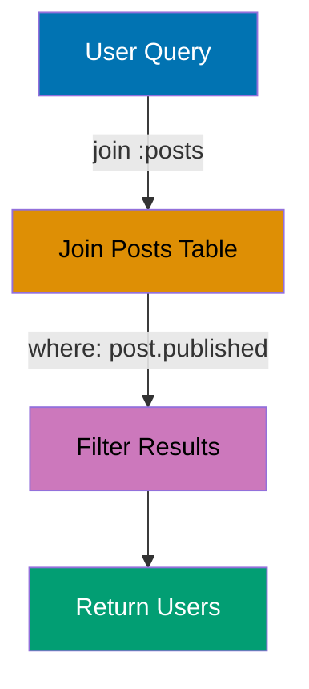

```elixir
defmodule User do
  use Ecto.Schema

  schema "users" do
    field :name, :string
    has_many :posts, Post
    timestamps()
  end
end

defmodule Post do
  use Ecto.Schema

  schema "posts" do
    field :title, :string
    field :published, :boolean
    belongs_to :user, User
    timestamps()
  end
end

import Ecto.Query

# Insert test data
{:ok, user1} = Repo.insert(%User{name: "Alice"})
{:ok, user2} = Repo.insert(%User{name: "Bob"})
Repo.insert(%Post{title: "Published", published: true, user_id: user1.id})
Repo.insert(%Post{title: "Draft", published: false, user_id: user2.id})

# Query users with published posts
query = from u in User,
  join: p in assoc(u, :posts),        # => Join posts table on user_id
  where: p.published == true,         # => Filter by post.published
  distinct: true,                     # => Remove duplicate users
  select: u

users = Repo.all(query)               # => users is [%User{name: "Alice"}]
                                      # => SQL: SELECT DISTINCT u.* FROM users u
                                      # =>      INNER JOIN posts p ON p.user_id = u.id
                                      # =>      WHERE p.published = TRUE

IO.inspect(length(users))             # => Output: 1
IO.inspect(hd(users).name)            # => Output: "Alice"
```

**Key Takeaway**: Use join queries when you need to filter parent records by child attributes, and always include distinct: true when joining has_many associations to avoid duplicate parent records.

**Why It Matters**: Inner joins fetch only records with matching associations in a single query, preventing N+1 problems and enabling database-level filtering on associated data. Production APIs use joins to filter users by post content, orders by product category, or permissions by role—queries impossible with preload alone. Understanding join vs preload is critical: joins filter parent records, preload loads associations for already-fetched parents.

---

### Example 32: Left Join with left_join/5

left_join includes all records from the left table even when no matching records exist in the right table, useful for finding records without associations.

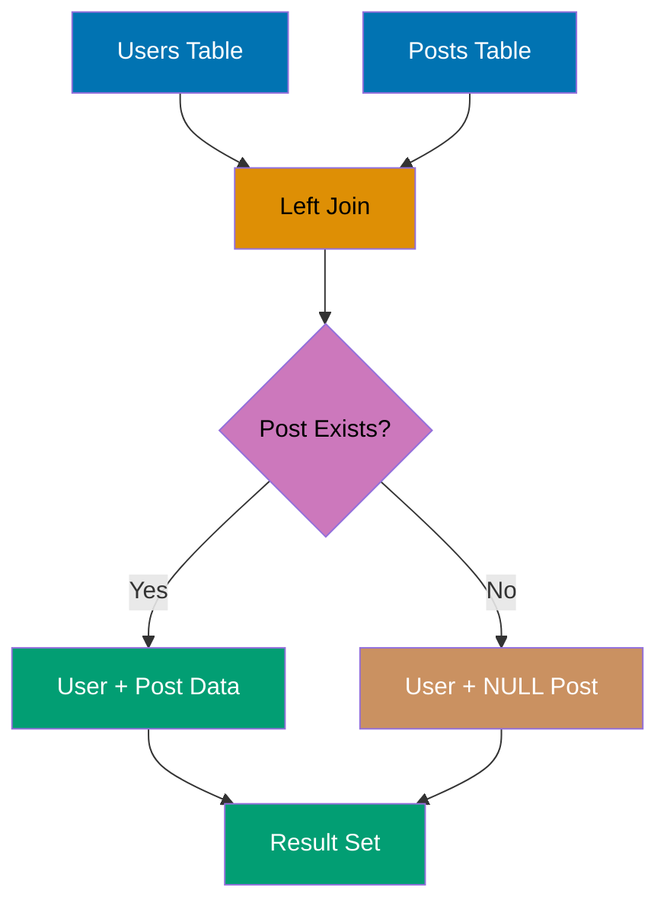

```elixir
defmodule User do
  use Ecto.Schema

  schema "users" do
    field :name, :string
    has_many :posts, Post
    timestamps()
  end
end

defmodule Post do
  use Ecto.Schema

  schema "posts" do
    field :title, :string
    belongs_to :user, User
    timestamps()
  end
end

import Ecto.Query

# Insert test data
{:ok, user_with_posts} = Repo.insert(%User{name: "Charlie"})
{:ok, user_no_posts} = Repo.insert(%User{name: "Diana"})
Repo.insert(%Post{title: "Post 1", user_id: user_with_posts.id})

# Find users without posts using left join
query = from u in User,
  left_join: p in assoc(u, :posts),   # => Left join (includes users without posts)
  where: is_nil(p.id),                # => Filter for users with no posts
  select: u

users_without_posts = Repo.all(query) # => users_without_posts is [%User{name: "Diana"}]
                                      # => SQL: SELECT u.* FROM users u
                                      # =>      LEFT JOIN posts p ON p.user_id = u.id
                                      # =>      WHERE p.id IS NULL

IO.inspect(length(users_without_posts))
                                      # => Output: 1
IO.inspect(hd(users_without_posts).name)
                                      # => Output: "Diana"
```

**Key Takeaway**: left_join is essential for finding records without associations (orphaned parents), and you must filter on is_nil(child.id) to identify rows where no child exists.

**Why It Matters**: Left joins preserve parent records even when associations are missing, essential for queries like "all users and their posts (including users with zero posts)". Production dashboards use left joins to show complete datasets (all products, even unsold ones) rather than silently hiding records without associations. The nil-filled columns for missing associations require careful handling in aggregations and sorting to avoid unexpected results.

---

### Example 33: Group By with Aggregates

The group_by clause groups records by field values, enabling aggregate functions (count, sum, avg) per group. Essential for reporting and analytics.

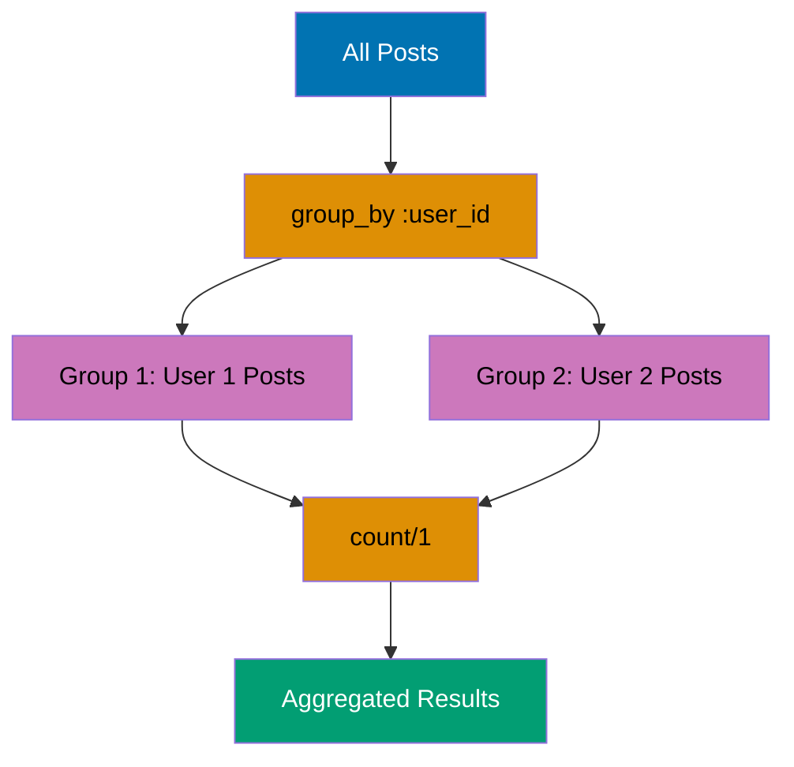

```elixir
defmodule Post do
  use Ecto.Schema

  schema "posts" do
    field :title, :string
    field :category, :string
    field :views, :integer
    timestamps()
  end
end

import Ecto.Query

# Insert test data
Repo.insert(%Post{title: "Tech 1", category: "tech", views: 100})
Repo.insert(%Post{title: "Tech 2", category: "tech", views: 200})
Repo.insert(%Post{title: "Sports 1", category: "sports", views: 150})

# Count posts per category
query = from p in Post,
  group_by: p.category,               # => Group by category field
  select: {p.category, count(p.id)}   # => Select category and count

results = Repo.all(query)             # => results is [{"tech", 2}, {"sports", 1}]
                                      # => SQL: SELECT category, COUNT(id)
                                      # =>      FROM posts
                                      # =>      GROUP BY category

# Sum views per category
sum_query = from p in Post,
  group_by: p.category,
  select: {p.category, sum(p.views)}  # => Sum views per category

sums = Repo.all(sum_query)            # => sums is [{"tech", 300}, {"sports", 150}]
                                      # => SQL: SELECT category, SUM(views)
                                      # =>      FROM posts GROUP BY category

IO.inspect(results)                   # => Output: [{"tech", 2}, {"sports", 1}]
IO.inspect(sums)                      # => Output: [{"tech", 300}, {"sports", 150}]
```

**Key Takeaway**: All non-aggregated fields in select must appear in group_by, and aggregate functions (count, sum, avg, min, max) operate within each group.

**Why It Matters**: Calculating aggregates in-memory (group records, then sum) is inefficient for large datasets and prevents using database indexes. Production dashboards use group_by with SUM/AVG/COUNT to generate reports in the database, leveraging query optimization and reducing memory usage. This pattern is essential for analytics (sales by category), monitoring (errors by service), and reporting (user activity by date) where aggregation scale matters.

---

### Example 34: Having Clause for Filtered Aggregates

The having clause filters groups after aggregation, unlike where which filters before grouping. Use having to filter on aggregate results.

```elixir
defmodule User do
  use Ecto.Schema

  schema "users" do
    field :name, :string
    field :country, :string
    field :age, :integer
    timestamps()
  end
end

import Ecto.Query

# Insert test data
Repo.insert(%User{name: "Eve", country: "USA", age: 25})
Repo.insert(%User{name: "Frank", country: "USA", age: 30})
Repo.insert(%User{name: "Grace", country: "UK", age: 28})

# Count users per country, only countries with 2+ users
query = from u in User,
  group_by: u.country,
  having: count(u.id) >= 2,           # => Filter groups with count >= 2
  select: {u.country, count(u.id)}

results = Repo.all(query)             # => results is [{"USA", 2}]
                                      # => SQL: SELECT country, COUNT(id)
                                      # =>      FROM users
                                      # =>      GROUP BY country
                                      # =>      HAVING COUNT(id) >= 2

# Average age per country, only countries with avg >= 27
avg_query = from u in User,
  group_by: u.country,
  having: avg(u.age) >= 27,           # => Filter by average age
  select: {u.country, avg(u.age)}

avg_results = Repo.all(avg_query)     # => avg_results is [{"USA", Decimal("27.5")}, {"UK", Decimal("28.0")}]
                                      # => SQL: SELECT country, AVG(age)
                                      # =>      FROM users GROUP BY country
                                      # =>      HAVING AVG(age) >= 27

IO.inspect(results)                   # => Output: [{"USA", 2}]
IO.inspect(avg_results)               # => Output: [{"USA", #Decimal<27.5>}, {"UK", #Decimal<28.0>}]
```

**Key Takeaway**: Use having for filtering aggregated results and where for filtering individual rows before aggregation; having executes after GROUP BY while where executes before.

**Why It Matters**: Filtering aggregated results (users with >10 posts, categories with total sales >$1000) requires HAVING clauses that execute after GROUP BY. Production analytics use having to find outliers and apply thresholds without loading all groups into memory. This pattern enables efficient queries like "top customers by order count" and "inactive categories" where filtering happens on computed values, not raw data.

---

### Example 35: Transactions with Repo.transaction/1

Repo.transaction/1 wraps multiple database operations in a transaction, ensuring all succeed or all roll back. Essential for maintaining data consistency.

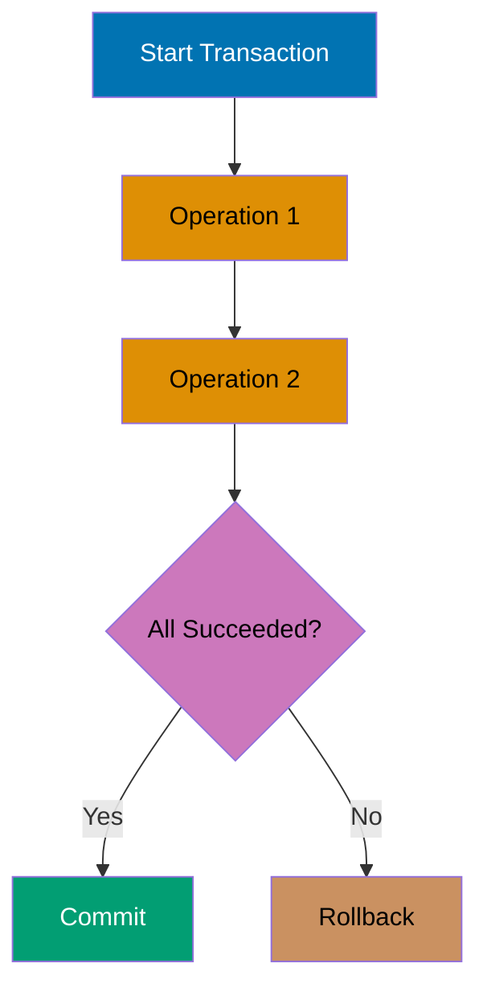

```elixir
defmodule User do
  use Ecto.Schema

  schema "users" do
    field :name, :string
    field :balance, :decimal
    timestamps()
  end
end

# Insert test users
{:ok, alice} = Repo.insert(%User{name: "Alice", balance: Decimal.new("100.00")})
{:ok, bob} = Repo.insert(%User{name: "Bob", balance: Decimal.new("50.00")})

# Transfer money in transaction
result = Repo.transaction(fn ->
  # Deduct from Alice
  alice_changeset = Ecto.Changeset.change(alice, balance: Decimal.sub(alice.balance, Decimal.new("30.00")))
  {:ok, alice_updated} = Repo.update(alice_changeset)
                                      # => alice_updated.balance is Decimal("70.00")
                                      # => SQL: UPDATE users SET balance = 70.00 WHERE id = 1

  # Add to Bob
  bob_changeset = Ecto.Changeset.change(bob, balance: Decimal.add(bob.balance, Decimal.new("30.00")))
  {:ok, bob_updated} = Repo.update(bob_changeset)
                                      # => bob_updated.balance is Decimal("80.00")
                                      # => SQL: UPDATE users SET balance = 80.00 WHERE id = 2

  {alice_updated, bob_updated}        # => Transaction return value
end)                                  # => SQL: BEGIN; ... COMMIT;

{:ok, {alice_final, bob_final}} = result
                                      # => result is {:ok, {alice_updated, bob_updated}}

IO.inspect(alice_final.balance)       # => Output: #Decimal<70.00>
IO.inspect(bob_final.balance)         # => Output: #Decimal<80.00>
```

**Key Takeaway**: Transactions ensure atomicity—if any operation fails, all changes roll back automatically; always return the final value from the transaction function to access updated data.

**Why It Matters**: Multi-step operations (create order, decrement inventory, charge payment) must complete atomically or roll back entirely to prevent partial failures and data corruption. Production systems wrap dependent operations in transactions to enforce all-or-nothing semantics, preventing scenarios like charged payments with no created order. Transactions are critical for financial operations, inventory management, and any workflow where partial completion is worse than total failure.

---

### Example 36: Rolling Back Transactions with Repo.rollback/1

Repo.rollback/1 manually aborts a transaction, causing Repo.transaction/1 to return `{:error, value}`. Use for business logic failures that should cancel all operations.

```elixir
defmodule User do
  use Ecto.Schema

  schema "users" do
    field :name, :string
    field :balance, :decimal
    timestamps()
  end
end

# Insert test user
{:ok, user} = Repo.insert(%User{name: "Charlie", balance: Decimal.new("50.00")})

# Attempt withdrawal with insufficient funds
result = Repo.transaction(fn ->
  withdrawal = Decimal.new("100.00")  # => Attempting to withdraw 100

  if Decimal.lt?(user.balance, withdrawal) do
    Repo.rollback(:insufficient_funds) # => Manually rollback transaction
                                      # => SQL: ROLLBACK
  else
    changeset = Ecto.Changeset.change(user, balance: Decimal.sub(user.balance, withdrawal))
    {:ok, updated} = Repo.update(changeset)
    updated
  end
end)

{:error, reason} = result             # => result is {:error, :insufficient_funds}
                                      # => No changes committed to database

# Verify balance unchanged
unchanged = Repo.get(User, user.id)   # => unchanged.balance is still Decimal("50.00")

IO.inspect(result)                    # => Output: {:error, :insufficient_funds}
IO.inspect(unchanged.balance)         # => Output: #Decimal<50.00>
```

**Key Takeaway**: Repo.rollback/1 accepts any value which becomes the error reason in the return tuple, making it ideal for returning specific error messages when business rules fail.

**Why It Matters**: Business rule violations detected mid-transaction (insufficient inventory, duplicate booking) require explicit rollbacks to abort without committing partial changes. Production validation logic uses rollback to enforce constraints across multiple tables that can't be expressed as database constraints. Understanding rollback semantics prevents data corruption when complex business rules fail partway through multi-step operations.

---

### Example 37: Ecto.Multi for Composable Transactions

Ecto.Multi builds composable transaction pipelines, allowing you to name each operation and reference previous results. Cleaner than nested transaction functions.

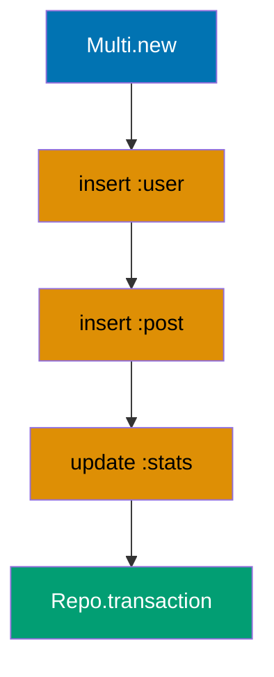

```elixir
defmodule User do
  use Ecto.Schema

  schema "users" do
    field :name, :string
    has_many :posts, Post
    timestamps()
  end
end

defmodule Post do
  use Ecto.Schema

  schema "posts" do
    field :title, :string
    belongs_to :user, User
    timestamps()
  end
end

alias Ecto.Multi

# Build multi operation
multi =
  Multi.new()
  |> Multi.insert(:user, %User{name: "Diana"})
                                      # => Named operation :user
  |> Multi.insert(:post, fn %{user: user} ->
    %Post{title: "First Post", user_id: user.id}
                                      # => Reference :user result
  end)
  |> Multi.run(:count_posts, fn _repo, %{user: user} ->
    count = Repo.aggregate(Post, :count, :id)
    {:ok, count}                      # => Must return {:ok, value} or {:error, value}
  end)

# Execute multi
{:ok, results} = Repo.transaction(multi)
                                      # => results is %{user: %User{...}, post: %Post{...}, count_posts: 1}
                                      # => SQL: BEGIN; INSERT users ...; INSERT posts ...; SELECT COUNT(*) ...; COMMIT;

IO.inspect(results.user.name)         # => Output: "Diana"
IO.inspect(results.post.title)        # => Output: "First Post"
IO.inspect(results.count_posts)       # => Output: 1
```

**Key Takeaway**: Multi operations execute in order and can reference previous results via the changes map, making complex transaction logic more maintainable than nested callbacks.

**Why It Matters**: Complex transactions with dependent operations (create user → create profile → send email) become deeply nested with plain Repo.transaction callbacks, obscuring the operation sequence. Ecto.Multi flattens this into a readable pipeline where each step has a name and can reference earlier results by key. Production systems use Multi for checkout flows, user registration, and data imports where failure at any step must roll back cleanly.

---

### Example 38: Conditional Multi Operations

Multi operations can be conditional using Multi.run/3, allowing you to skip or modify operations based on previous results.

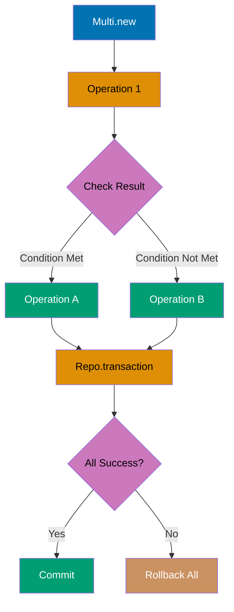

```elixir
defmodule User do
  use Ecto.Schema

  schema "users" do
    field :name, :string
    field :premium, :boolean
    timestamps()
  end
end

defmodule Subscription do
  use Ecto.Schema

  schema "subscriptions" do
    field :plan, :string
    belongs_to :user, User
    timestamps()
  end
end

alias Ecto.Multi

# Create user and conditionally add subscription
multi =
  Multi.new()
  |> Multi.insert(:user, %User{name: "Eve", premium: true})
  |> Multi.run(:subscription, fn _repo, %{user: user} ->
    if user.premium do               # => Conditional logic
      changeset = %Subscription{plan: "premium", user_id: user.id}
      case Repo.insert(changeset) do
        {:ok, sub} -> {:ok, sub}     # => Insert subscription
        {:error, cs} -> {:error, cs}
      end
    else
      {:ok, nil}                     # => Skip subscription for non-premium
    end
  end)

{:ok, results} = Repo.transaction(multi)
                                      # => results.user.premium is true
                                      # => results.subscription is %Subscription{plan: "premium"}

IO.inspect(results.subscription.plan) # => Output: "premium"
```

**Key Takeaway**: Multi.run/3 enables conditional logic in transactions, and returning {:error, reason} from any operation rolls back the entire transaction.

**Why It Matters**: Transaction logic often requires branching (upgrade user → create subscription only if premium plan) that can't be expressed as sequential inserts. Multi.run enables business logic decisions mid-transaction while maintaining atomicity. Production checkout flows use conditional Multi operations to handle payment methods, shipping options, and discount rules that vary based on earlier transaction results.

---

### Example 39: Migration Basics - Creating Tables

Migrations define schema changes to the database. The create table macro creates a new table with specified columns and constraints.

```elixir
defmodule Repo.Migrations.CreateUsers do
  use Ecto.Migration

  def change do
    create table(:users) do            # => Create users table
      add :name, :string, null: false  # => String column, not null
      add :email, :string, null: false # => Email column, not null
      add :age, :integer               # => Integer column, nullable
      add :active, :boolean, default: true
                                       # => Boolean with default value

      timestamps()                     # => Add inserted_at, updated_at (type: naive_datetime_usec)
    end

    create unique_index(:users, [:email])
                                       # => Unique constraint on email
                                       # => Prevents duplicate emails
  end
end

# Run migration: mix ecto.migrate
# => SQL: CREATE TABLE users (
#          id BIGSERIAL PRIMARY KEY,
#          name VARCHAR(255) NOT NULL,
#          email VARCHAR(255) NOT NULL,
#          age INTEGER,
#          active BOOLEAN DEFAULT TRUE,
#          inserted_at TIMESTAMP NOT NULL,
#          updated_at TIMESTAMP NOT NULL
#        );
#        CREATE UNIQUE INDEX users_email_index ON users(email);
```

**Key Takeaway**: Migrations are reversible by default (change/0 function), and timestamps/0 automatically adds inserted_at and updated_at columns with proper types and constraints.

**Why It Matters**: Database schema changes must be reproducible across development, staging, and production environments. Migrations provide versioned, sequential schema changes that enable team collaboration, rollback capabilities, and consistent database state across deployments. Production systems depend on migrations for safe schema evolution without manual SQL execution and the errors it introduces.

---

### Example 40: Migration - Adding Columns

The alter table macro modifies existing tables by adding, removing, or changing columns. Use add/3 to add new columns.

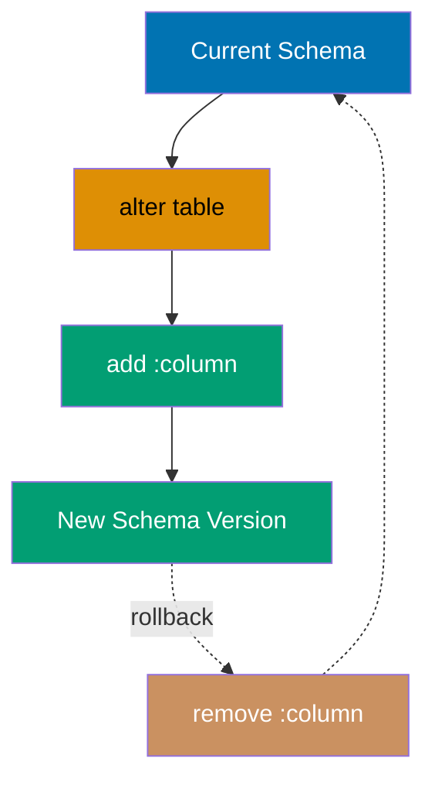

```elixir
defmodule Repo.Migrations.AddBioToUsers do
  use Ecto.Migration

  def change do
    alter table(:users) do             # => Modify existing users table
      add :bio, :text                  # => Add bio column (type: text, nullable)
      add :country, :string, size: 2   # => String column with length limit
                                       # => size: 2 for country code (e.g., "US")
    end
  end
end

# Run migration: mix ecto.migrate
# => SQL: ALTER TABLE users
#         ADD COLUMN bio TEXT,
#         ADD COLUMN country VARCHAR(2);
```

**Key Takeaway**: alter table is non-destructive by default, and you can add multiple columns in a single migration for atomic schema changes.

**Why It Matters**: Evolving production schemas requires adding columns to existing tables without downtime. Nullable columns with defaults can be added online without locking tables, enabling zero-downtime deployments. Understanding which ALTER TABLE operations lock tables versus execute concurrently is critical for production database management where minutes of downtime costs significant revenue.

---

### Example 41: Migration - Adding Indexes

Indexes improve query performance on frequently searched columns. Use create index macro to add indexes.

```elixir
defmodule Repo.Migrations.AddIndexesToUsers do
  use Ecto.Migration

  def change do
    create index(:users, [:country])   # => Simple index on country column
                                       # => Speeds up queries filtering by country

    create index(:users, [:name, :country])
                                       # => Composite index on name and country
                                       # => Optimizes queries filtering by both

    create index(:users, [:email], unique: true)
                                       # => Unique index (if not already exists)
  end
end

# Run migration: mix ecto.migrate
# => SQL: CREATE INDEX users_country_index ON users(country);
#         CREATE INDEX users_name_country_index ON users(name, country);
#         CREATE UNIQUE INDEX users_email_index ON users(email);
```

**Key Takeaway**: Add indexes on foreign keys and frequently queried columns, but avoid over-indexing as each index adds overhead to inserts and updates.

**Why It Matters**: Missing indexes cause queries to scan entire tables as data grows, degrading from milliseconds to minutes. Production systems must index foreign keys, lookup columns, and sorting fields while avoiding over-indexing that slows writes. Understanding index strategies (B-tree for equality/range, GIN for arrays/JSON) enables choosing appropriate indexes for actual query patterns revealed by production workload analysis.

---

### Example 42: Migration - Adding Foreign Keys

Foreign key constraints ensure referential integrity by validating that references point to existing records. Use references/2 in migrations.

```elixir
defmodule Repo.Migrations.CreatePosts do
  use Ecto.Migration

  def change do
    create table(:posts) do
      add :title, :string, null: false
      add :content, :text
      add :user_id, references(:users, on_delete: :delete_all)
                                       # => Foreign key to users.id
                                       # => on_delete: :delete_all cascades deletes

      timestamps()
    end

    create index(:posts, [:user_id])   # => Index foreign key for join performance
  end
end

# Run migration: mix ecto.migrate
# => SQL: CREATE TABLE posts (
#          id BIGSERIAL PRIMARY KEY,
#          title VARCHAR(255) NOT NULL,
#          content TEXT,
#          user_id BIGINT,
#          inserted_at TIMESTAMP NOT NULL,
#          updated_at TIMESTAMP NOT NULL,
#          FOREIGN KEY (user_id) REFERENCES users(id) ON DELETE CASCADE
#        );
#        CREATE INDEX posts_user_id_index ON posts(user_id);
```

**Key Takeaway**: Always add an index on foreign key columns for join performance, and choose appropriate on_delete strategy (nilify_all, delete_all, nothing, or restrict).

**Why It Matters**: Foreign keys prevent orphaned records (posts referencing deleted users) and enforce data integrity at the database level. Without foreign keys, application bugs can create referential integrity violations that corrupt data and break queries. Production databases use foreign keys with appropriate cascade rules to maintain consistency while avoiding unexpected deletions from overly aggressive cascades.

---

### Example 43: Embedded Schemas with embeds_one

embeds_one stores a nested schema as JSON in a single column, useful for structured data that doesn't need its own table. The embedded data is serialized and deserialized automatically.

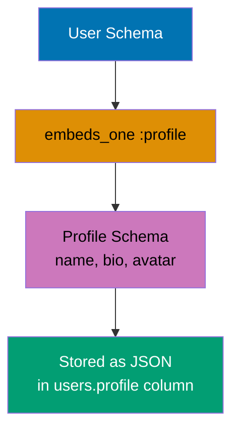

```elixir
defmodule Address do
  use Ecto.Schema

  embedded_schema do                   # => Not persisted to its own table
    field :street, :string
    field :city, :string
    field :zip, :string
  end
end

defmodule User do
  use Ecto.Schema

  schema "users" do
    field :name, :string
    embeds_one :address, Address       # => Embedded as JSON in users table
    timestamps()
  end
end

# Create user with embedded address
address = %Address{street: "123 Main St", city: "NYC", zip: "10001"}
user = %User{name: "Frank", address: address}

{:ok, saved} = Repo.insert(user)      # => saved.address is %Address{...}
                                      # => SQL: INSERT INTO users (name, address, ...)
                                      # =>      VALUES ('Frank', '{"street":"123 Main St",...}', ...)

# Fetch user with embedded address
loaded = Repo.get(User, saved.id)     # => loaded.address is %Address{...} (deserialized)

IO.inspect(loaded.address.city)       # => Output: "NYC"
```

**Key Takeaway**: embeds_one is stored as JSON and doesn't support querying or indexing on nested fields; use separate tables with associations when you need to query embedded data.

**Why It Matters**: Structured nested data (address, preferences, metadata) stored as JSON avoids join overhead for data always accessed with the parent. Production systems use embeds_one for profile data, configuration objects, and denormalized snapshots where querying nested fields isn't needed. However, embedded data can't be updated independently or queried efficiently, so use associations when the nested data has its own lifecycle.

---

### Example 44: Embedded Schemas with embeds_many

embeds_many stores an array of nested schemas as JSON, useful for lists of structured data without the overhead of separate tables.

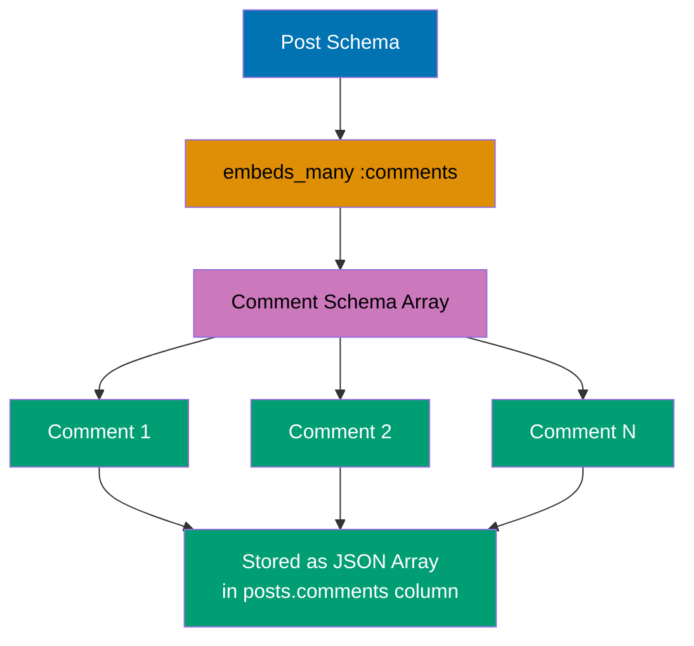

```elixir
defmodule Phone do
  use Ecto.Schema

  embedded_schema do
    field :type, :string               # => "mobile", "home", "work"
    field :number, :string
  end
end

defmodule User do
  use Ecto.Schema
  import Ecto.Changeset

  schema "users" do
    field :name, :string
    embeds_many :phones, Phone         # => Array of phone numbers as JSON
    timestamps()
  end

  def changeset(user, params \\ %{}) do
    user
    |> cast(params, [:name])
    |> cast_embed(:phones, with: &Phone.changeset/2)
                                       # => Cast embedded phones
  end
end

defmodule Phone do
  import Ecto.Changeset

  def changeset(phone, params) do
    phone
    |> cast(params, [:type, :number])
    |> validate_required([:type, :number])
  end
end

# Create user with multiple phones
params = %{
  name: "Grace",
  phones: [
    %{type: "mobile", number: "555-1234"},
    %{type: "home", number: "555-5678"}
  ]
}

changeset = User.changeset(%User{}, params)
{:ok, saved} = Repo.insert(changeset) # => saved.phones is [%Phone{...}, %Phone{...}]
                                      # => SQL: INSERT INTO users (name, phones, ...)
                                      # =>      VALUES ('Grace', '[{"type":"mobile",...},...]', ...)

IO.inspect(length(saved.phones))      # => Output: 2
IO.inspect(hd(saved.phones).number)   # => Output: "555-1234"
```

**Key Takeaway**: embeds_many requires cast_embed/3 in changesets for validation, and changes to embedded data require updating the entire parent record.

**Why It Matters**: Arrays of structured data (phone numbers, tags, variant options) stored as JSON arrays avoid the overhead of many-to-many tables for data rarely queried independently. Production e-commerce systems use embeds_many for product attributes and order line items when querying individual items isn't needed. However, embedded data sacrifices referential integrity and efficient querying, so use only when associations aren't needed.

---

### Example 45: Composite Primary Keys

Ecto supports composite primary keys by setting @primary_key false and manually defining multiple fields as primary keys. Useful for join tables.

```elixir
defmodule UserRole do
  use Ecto.Schema

  @primary_key false                   # => Disable auto-generated primary key
  schema "user_roles" do
    field :user_id, :integer, primary_key: true
                                       # => Part of composite key
    field :role_id, :integer, primary_key: true
                                       # => Part of composite key
    field :assigned_at, :naive_datetime

    timestamps()
  end
end

# Migration for composite key table
defmodule Repo.Migrations.CreateUserRoles do
  use Ecto.Migration

  def change do
    create table(:user_roles, primary_key: false) do
      add :user_id, :integer, primary_key: true
      add :role_id, :integer, primary_key: true
      add :assigned_at, :naive_datetime

      timestamps()
    end

    create unique_index(:user_roles, [:user_id, :role_id])
                                       # => Enforce uniqueness on composite key
  end
end

# Insert record
{:ok, ur} = Repo.insert(%UserRole{user_id: 1, role_id: 5, assigned_at: NaiveDateTime.utc_now()})
                                      # => ur has composite key (user_id: 1, role_id: 5)

# Fetch by composite key
found = Repo.get_by(UserRole, user_id: 1, role_id: 5)
                                      # => found is %UserRole{user_id: 1, role_id: 5}

IO.inspect({found.user_id, found.role_id})
                                      # => Output: {1, 5}
```

**Key Takeaway**: Composite primary keys disable auto-generated id fields, and you must manually specify all key fields when inserting or fetching records.

**Why It Matters**: Join tables and time-series data often use composite keys (user_id + role_id, sensor_id + timestamp) for natural uniqueness without synthetic IDs. Production systems use composite keys to enforce uniqueness constraints and optimize storage for high-volume tables. However, composite keys complicate association configuration and are harder to reference in URLs, so use only when natural compound uniqueness is semantically meaningful.

---

### Example 46: Custom Primary Key Types

Ecto supports custom primary key types like UUID, string, or binary_id. Set @primary_key with desired type.

```elixir
defmodule Article do
  use Ecto.Schema

  @primary_key {:uuid, :binary_id, autogenerate: true}
                                       # => UUID primary key (auto-generated)
  @foreign_key_type :binary_id         # => Foreign keys also use binary_id

  schema "articles" do
    field :title, :string
    belongs_to :author, User, type: :binary_id
                                       # => Foreign key is binary_id (UUID)
    timestamps()
  end
end

# Migration for UUID primary key
defmodule Repo.Migrations.CreateArticles do
  use Ecto.Migration

  def change do
    create table(:articles, primary_key: false) do
      add :uuid, :binary_id, primary_key: true
                                       # => UUID as primary key
      add :title, :string
      add :author_id, references(:users, type: :binary_id)
                                       # => Foreign key references UUID

      timestamps()
    end
  end
end

# Insert article
{:ok, article} = Repo.insert(%Article{title: "UUID Article"})
                                      # => article.uuid is auto-generated UUID
                                      # => article.uuid is <<...>> (binary)

IO.inspect(article.uuid)              # => Output: <<193, 44, 15, ...>> (binary UUID)
IO.inspect(Ecto.UUID.cast!(article.uuid))
                                      # => Output: "c12c0f3a-..." (string format)
```

**Key Takeaway**: UUIDs are stored as binary_id for efficiency and must be cast to strings for display; set @foreign_key_type to match your primary key type for consistent associations.

**Why It Matters**: Sequential integer IDs leak information (record count, creation rate) and create contention on inserts in distributed databases. Production systems use UUIDs for privacy-sensitive resources, distributed ID generation, and client-side ID creation before server persistence. However, UUIDs consume more storage and have slightly slower lookups, so production systems must weigh security/distribution benefits against performance costs.

---

### Example 47: many_to_many Associations

many_to_many creates a bidirectional association through a join table, allowing multiple records to relate to multiple records. Ecto manages the join table automatically.

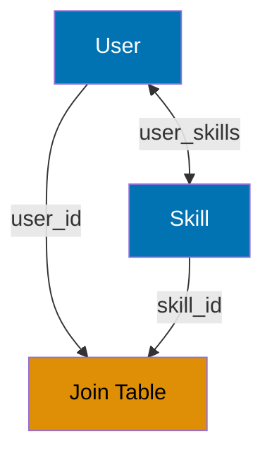

```elixir
defmodule User do
  use Ecto.Schema

  schema "users" do
    field :name, :string
    many_to_many :skills, Skill, join_through: "user_skills"
                                       # => Join through user_skills table
    timestamps()
  end
end

defmodule Skill do
  use Ecto.Schema

  schema "skills" do
    field :name, :string
    many_to_many :users, User, join_through: "user_skills"
                                       # => Bidirectional association
    timestamps()
  end
end

# Migration for join table
defmodule Repo.Migrations.CreateUserSkills do
  use Ecto.Migration

  def change do
    create table(:user_skills) do
      add :user_id, references(:users, on_delete: :delete_all)
      add :skill_id, references(:skills, on_delete: :delete_all)

      timestamps()
    end

    create unique_index(:user_skills, [:user_id, :skill_id])
  end
end

# Create user and skills
{:ok, user} = Repo.insert(%User{name: "Henry"})
{:ok, elixir} = Repo.insert(%Skill{name: "Elixir"})
{:ok, postgres} = Repo.insert(%Skill{name: "PostgreSQL"})

# Associate user with skills (manual join table insert)
Repo.insert_all("user_skills", [
  %{user_id: user.id, skill_id: elixir.id, inserted_at: NaiveDateTime.utc_now(), updated_at: NaiveDateTime.utc_now()},
  %{user_id: user.id, skill_id: postgres.id, inserted_at: NaiveDateTime.utc_now(), updated_at: NaiveDateTime.utc_now()}
])

# Preload skills
user_with_skills = Repo.preload(user, :skills)
                                      # => user_with_skills.skills is [%Skill{name: "Elixir"}, ...]
                                      # => SQL: SELECT s.* FROM skills s
                                      # =>      INNER JOIN user_skills us ON us.skill_id = s.id
                                      # =>      WHERE us.user_id = 1

IO.inspect(length(user_with_skills.skills))
                                      # => Output: 2
```

**Key Takeaway**: many_to_many requires a join table with foreign keys to both tables, and Ecto doesn't automatically insert join records—you must manually insert into the join table or use Ecto.Changeset.put_assoc/3.

**Why It Matters**: Many-to-many relationships (users-skills, posts-tags, students-courses) require join tables that Ecto doesn't auto-populate. Production systems use put_assoc or explicit join table inserts to manage these relationships, understanding that each approach has trade-offs. Explicit inserts offer more control over join table metadata (timestamps, ordering), while put_assoc simplifies replacement semantics for simpler use cases.

---

### Example 48: Putting Associations with put_assoc/3

put_assoc/3 replaces all associated records in a changeset, useful for managing many_to_many associations or replacing has_many children.

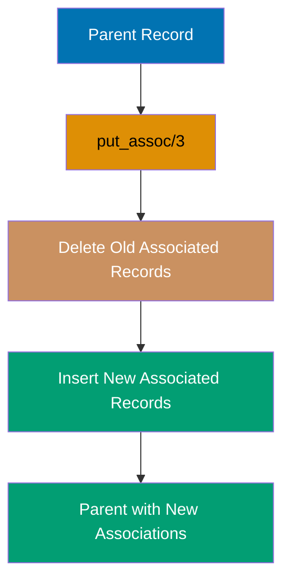

```elixir
defmodule User do
  use Ecto.Schema
  import Ecto.Changeset

  schema "users" do
    field :name, :string
    many_to_many :skills, Skill, join_through: "user_skills", on_replace: :delete
                                       # => on_replace: :delete removes old associations
    timestamps()
  end

  def changeset(user, params \\ %{}) do
    user
    |> cast(params, [:name])
    |> put_assoc(:skills, params[:skills] || [])
                                       # => Replace all skills
  end
end

defmodule Skill do
  use Ecto.Schema

  schema "skills" do
    field :name, :string
    timestamps()
  end
end

# Create user and skills
{:ok, user} = Repo.insert(%User{name: "Iris"})
{:ok, elixir} = Repo.insert(%Skill{name: "Elixir"})
{:ok, postgres} = Repo.insert(%Skill{name: "PostgreSQL"})

# Associate skills via changeset
changeset = User.changeset(user, %{skills: [elixir, postgres]})
{:ok, updated} = Repo.update(changeset)
                                      # => Inserts into user_skills join table
                                      # => SQL: INSERT INTO user_skills (user_id, skill_id) VALUES (1, 1), (1, 2)

# Preload and verify
user_with_skills = Repo.preload(updated, :skills)
                                      # => user_with_skills.skills is [%Skill{name: "Elixir"}, ...]

IO.inspect(length(user_with_skills.skills))
                                      # => Output: 2
```

**Key Takeaway**: put_assoc/3 with on_replace: :delete in the schema automatically removes old join table entries when updating associations, simplifying many_to_many management.

**Why It Matters**: Replacing all associations (setting a user's complete tag list) differs from adding/removing individual items. Production systems use put_assoc with on_replace: :delete for full-replacement UIs (multi-select dropdowns, checkbox lists) where the new selection completely replaces the old. Understanding on_replace options (:delete, :nilify, :raise) prevents accidental orphaning or unexpected errors when association updates don't match schema configuration.

---

### Example 49: Casting Associations with cast_assoc/3

cast_assoc/3 casts nested association params through changesets, enabling validation and updates of associated records in a single operation.

```elixir
defmodule User do
  use Ecto.Schema
  import Ecto.Changeset

  schema "users" do
    field :name, :string
    has_many :posts, Post              # => One-to-many association
    timestamps()
  end

  def changeset(user, params \\ %{}) do
    user
    |> cast(params, [:name])
    |> cast_assoc(:posts)              # => Cast nested posts params
                                       # => Calls Post.changeset for each post
  end
end

defmodule Post do
  use Ecto.Schema
  import Ecto.Changeset

  schema "posts" do
    field :title, :string
    belongs_to :user, User
    timestamps()
  end

  def changeset(post, params \\ %{}) do
    post
    |> cast(params, [:title])
    |> validate_required([:title])
  end
end

# Create user with nested posts
params = %{
  name: "Jack",
  posts: [
    %{title: "First Post"},
    %{title: "Second Post"}
  ]
}

changeset = User.changeset(%User{}, params)
{:ok, user} = Repo.insert(changeset)  # => Inserts user and both posts
                                      # => SQL: INSERT INTO users (name) VALUES ('Jack');
                                      # =>      INSERT INTO posts (title, user_id) VALUES ('First Post', 1);
                                      # =>      INSERT INTO posts (title, user_id) VALUES ('Second Post', 1);

# Preload posts
user_with_posts = Repo.preload(user, :posts)
                                      # => user_with_posts.posts has 2 posts

IO.inspect(length(user_with_posts.posts))
                                      # => Output: 2
```

**Key Takeaway**: cast_assoc/3 enables nested inserts and updates by validating associated data through their changesets, making it ideal for creating parent and children in a single operation.

**Why It Matters**: Forms submitting parent and child data (order with line items, user with addresses) need nested validation and atomic inserts. Production systems use cast_assoc to validate all nested data through proper changesets before committing, preventing partial inserts where parent succeeds but children fail validation. This pattern is essential for complex forms and API endpoints accepting nested resources in a single request.

---

### Example 50: Subqueries for Complex Filtering

Subqueries allow you to filter a query based on the results of another query, enabling complex filtering patterns impossible with simple WHERE clauses.

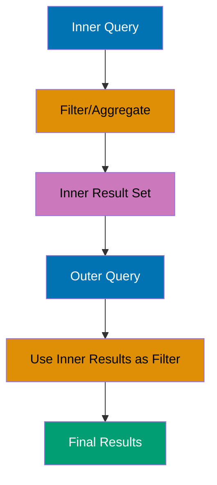

```elixir
defmodule User do
  use Ecto.Schema

  schema "users" do
    field :name, :string
    field :age, :integer
    has_many :posts, Post
    timestamps()
  end
end

defmodule Post do
  use Ecto.Schema

  schema "posts" do
    field :title, :string
    field :published, :boolean
    belongs_to :user, User
    timestamps()
  end
end

import Ecto.Query

# Insert test data
{:ok, user1} = Repo.insert(%User{name: "Kate", age: 30})
{:ok, user2} = Repo.insert(%User{name: "Liam", age: 25})
Repo.insert(%Post{title: "Published", published: true, user_id: user1.id})
Repo.insert(%Post{title: "Draft", published: false, user_id: user2.id})

# Subquery: users with published posts
published_users_subquery = from p in Post,
  where: p.published == true,
  select: p.user_id                   # => Subquery returns user IDs

# Main query using subquery
query = from u in User,
  where: u.id in subquery(published_users_subquery),
                                      # => Filter users by subquery results
  select: u

users = Repo.all(query)               # => users is [%User{name: "Kate"}]
                                      # => SQL: SELECT * FROM users
                                      # =>      WHERE id IN (SELECT user_id FROM posts WHERE published = TRUE)

IO.inspect(length(users))             # => Output: 1
IO.inspect(hd(users).name)            # => Output: "Kate"
```

**Key Takeaway**: Subqueries are composable and can be used in WHERE, FROM, or SELECT clauses; use subquery/1 to embed one query inside another for complex filtering.

**Why It Matters**: Complex filtering (users with posts in specific categories, orders with items above threshold) often requires correlating data across tables. Subqueries enable expressing these filters in database SQL rather than fetching excessive data and filtering in Elixir. Production systems use subqueries for performance-critical filters that would otherwise require loading thousands of records to apply application-level logic.

---

### Example 51: Fragment for Raw SQL Expressions

fragment/1 allows you to inject raw SQL into queries when Ecto's DSL doesn't support specific database features. Use sparingly and be mindful of SQL injection.

```elixir
defmodule User do
  use Ecto.Schema

  schema "users" do
    field :name, :string
    field :email, :string
    timestamps()
  end
end

import Ecto.Query

# Insert test data
Repo.insert(%User{name: "Mia", email: "mia@EXAMPLE.com"})
Repo.insert(%User{name: "Noah", email: "noah@example.COM"})

# Case-insensitive email search using fragment
email_query = from u in User,
  where: fragment("LOWER(?)", u.email) == "mia@example.com",
                                      # => Raw SQL: LOWER(email)
  select: u

users = Repo.all(email_query)         # => users is [%User{name: "Mia"}]
                                      # => SQL: SELECT * FROM users WHERE LOWER(email) = 'mia@example.com'

IO.inspect(hd(users).name)            # => Output: "Mia"
```

**Key Takeaway**: fragment/1 is powerful but bypasses Ecto's type safety; always use parameter placeholders (?) and bind variables to prevent SQL injection.

**Why It Matters**: Ecto's query DSL doesn't cover every SQL feature (LOWER, COALESCE, database-specific functions). Production systems use fragments for database functions while maintaining parameterization against SQL injection. This escape hatch enables using JSON operators, full-text search, and custom functions without dropping to raw SQL, preserving Ecto's query composition benefits while accessing full database capabilities.

---

### Example 52: Distinct Queries with distinct/2

distinct ensures the query returns unique rows, essential when joining has_many associations or aggregating data.

```elixir
defmodule User do
  use Ecto.Schema

  schema "users" do
    field :name, :string
    field :country, :string
    timestamps()
  end
end

import Ecto.Query

# Insert test data with duplicates
Repo.insert(%User{name: "Olivia", country: "USA"})
Repo.insert(%User{name: "Paul", country: "USA"})
Repo.insert(%User{name: "Quinn", country: "UK"})

# Get distinct countries
query = from u in User,
  distinct: true,                     # => Remove duplicate rows
  select: u.country,
  order_by: u.country

countries = Repo.all(query)           # => countries is ["UK", "USA"]
                                      # => SQL: SELECT DISTINCT country FROM users ORDER BY country

# Distinct on specific field
distinct_query = from u in User,
  distinct: [desc: u.country],        # => Distinct by country (keep first per country)
  select: {u.name, u.country},
  order_by: [desc: u.country, asc: u.name]

results = Repo.all(distinct_query)    # => results is [{"Olivia", "USA"}, {"Quinn", "UK"}]
                                      # => SQL: SELECT DISTINCT ON (country) name, country
                                      # =>      FROM users ORDER BY country DESC, name ASC

IO.inspect(countries)                 # => Output: ["UK", "USA"]
IO.inspect(results)                   # => Output: [{"Olivia", "USA"}, {"Quinn", "UK"}]
```

**Key Takeaway**: distinct: true removes all duplicate rows, while distinct: [field] uses PostgreSQL's DISTINCT ON to keep the first row per distinct value of specified fields.

**Why It Matters**: Joins that multiply parent rows (user with multiple posts) require DISTINCT to prevent duplicate parents in results. Production systems use distinct: true for join queries and DISTINCT ON for "first per group" queries (most recent order per customer, latest comment per post). Understanding when distinct is needed prevents bugs where multiplied rows cause incorrect aggregations or display issues.

---

### Example 53: Lock Queries with lock/2

lock/2 adds row-level locking to queries, preventing concurrent modifications during transactions. Use for critical operations requiring isolation.

```elixir
defmodule User do
  use Ecto.Schema

  schema "users" do
    field :name, :string
    field :balance, :decimal
    timestamps()
  end
end

import Ecto.Query

# Insert test user
{:ok, user} = Repo.insert(%User{name: "Ruby", balance: Decimal.new("100.00")})

# Lock user row during transaction
Repo.transaction(fn ->
  # Lock row for update
  query = from u in User,
    where: u.id == ^user.id,
    lock: "FOR UPDATE"                # => Acquire exclusive lock on row
                                      # => Other transactions wait until this commits

  locked_user = Repo.one(query)       # => SQL: SELECT * FROM users WHERE id = 1 FOR UPDATE

  # Perform update with guaranteed isolation
  changeset = Ecto.Changeset.change(locked_user, balance: Decimal.sub(locked_user.balance, Decimal.new("50.00")))
  {:ok, updated} = Repo.update(changeset)

  updated
end)

IO.inspect("Lock acquired and balance updated")
                                      # => Output: "Lock acquired and balance updated"
```

**Key Takeaway**: FOR UPDATE locks rows for the transaction duration, preventing other transactions from modifying them; use in transactions to prevent race conditions in critical operations.

**Why It Matters**: Concurrent access to shared resources (inventory, wallet balances, seat reservations) causes race conditions where multiple processes read stale values and overwrite each other. Production systems use FOR UPDATE locks to serialize access to critical rows, ensuring consistent state during multi-step updates. Understanding pessimistic locking is essential for financial transactions, booking systems, and any domain where lost updates have significant consequences.

---

### Example 54: Select Merge for Field Updates

select_merge/2 adds fields to an existing select, useful for computing derived values alongside selected fields.

```elixir
defmodule User do
  use Ecto.Schema

  schema "users" do
    field :first_name, :string
    field :last_name, :string
    field :age, :integer
    timestamps()
  end
end

import Ecto.Query

# Insert test data
Repo.insert(%User{first_name: "Sam", last_name: "Smith", age: 30})

# Select with computed field
query = from u in User,
  select: %{id: u.id, age: u.age}     # => Initial select
  |> select_merge(%{full_name: fragment("? || ' ' || ?", u.first_name, u.last_name)})
                                      # => Add computed full_name field

results = Repo.all(query)             # => results is [%{id: 1, age: 30, full_name: "Sam Smith"}]
                                      # => SQL: SELECT id, age, first_name || ' ' || last_name AS full_name
                                      # =>      FROM users

IO.inspect(hd(results))               # => Output: %{id: 1, age: 30, full_name: "Sam Smith"}
```

**Key Takeaway**: select_merge/2 is composable and allows you to add computed or additional fields to an existing select, useful for building queries incrementally.

**Why It Matters**: Query modules often need to add computed fields (full name, age from birthdate, status derived from flags) to base queries. Production systems use select_merge to layer computed fields onto reusable query functions, keeping query composition clean. This pattern enables building domain-specific queries from generic base queries while adding context-specific derived fields.

---

### Example 55: Windows Functions with over/2

Window functions perform calculations across rows related to the current row. Use over/2 to define window specifications.

```elixir
defmodule Sale do
  use Ecto.Schema

  schema "sales" do
    field :region, :string
    field :amount, :decimal
    field :date, :date
    timestamps()
  end
end

import Ecto.Query

# Insert test data
Repo.insert(%Sale{region: "East", amount: Decimal.new("100"), date: ~D[2024-01-01]})
Repo.insert(%Sale{region: "East", amount: Decimal.new("200"), date: ~D[2024-01-02]})
Repo.insert(%Sale{region: "West", amount: Decimal.new("150"), date: ~D[2024-01-01]})

# Running total per region using window function
query = from s in Sale,
  select: %{
    region: s.region,
    amount: s.amount,
    running_total: over(sum(s.amount), partition_by: s.region, order_by: s.date)
                                      # => SUM(amount) OVER (PARTITION BY region ORDER BY date)
  },
  order_by: [s.region, s.date]

results = Repo.all(query)             # => results with running totals per region
                                      # => SQL: SELECT region, amount,
                                      # =>      SUM(amount) OVER (PARTITION BY region ORDER BY date) AS running_total
                                      # =>      FROM sales ORDER BY region, date

IO.inspect(results)
# => Output: [
#      %{region: "East", amount: #Decimal<100>, running_total: #Decimal<100>},
#      %{region: "East", amount: #Decimal<200>, running_total: #Decimal<300>},
#      %{region: "West", amount: #Decimal<150>, running_total: #Decimal<150>}
#    ]
```

**Key Takeaway**: Window functions compute aggregates without collapsing rows (unlike GROUP BY), and partition_by divides rows into groups while order_by defines the calculation order within each partition.

**Why It Matters**: Running totals, rankings, and row numbering require aggregates without collapsing rows—impossible with GROUP BY alone. Production analytics use window functions for leaderboards (rank within category), time series (running averages), and pagination with counts (total rows alongside current page). Window functions execute in the database, enabling real-time calculations over millions of rows without loading data into Elixir.

---

### Example 56: Common Table Expressions (CTEs) with with_cte/3

CTEs (Common Table Expressions) create named temporary result sets that can be referenced multiple times in a query, improving readability and performance.

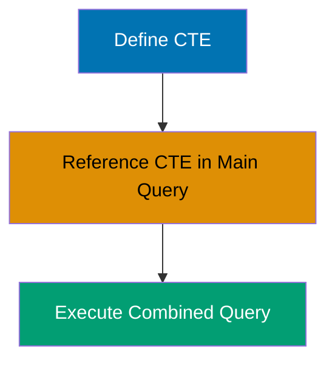

```elixir
defmodule User do
  use Ecto.Schema

  schema "users" do
    field :name, :string
    field :age, :integer
    timestamps()
  end
end

import Ecto.Query

# Insert test data
Repo.insert(%User{name: "Tina", age: 25})
Repo.insert(%User{name: "Uma", age: 35})
Repo.insert(%User{name: "Victor", age: 30})

# Define CTE for users over 25
young_users_cte = from u in User,
  where: u.age > 25,
  select: %{id: u.id, name: u.name, age: u.age}

# Main query using CTE
query = User
  |> with_cte("young_users", as: ^young_users_cte)
                                      # => Define CTE named "young_users"
  |> join(:inner, [u], y in "young_users", on: u.id == y.id)
                                      # => Join with CTE
  |> select([u, y], {u.name, y.age})

results = Repo.all(query)             # => results is [{"Uma", 35}, {"Victor", 30}]
                                      # => SQL: WITH young_users AS (
                                      # =>        SELECT id, name, age FROM users WHERE age > 25
                                      # =>      )
                                      # =>      SELECT u.name, y.age FROM users u
                                      # =>      INNER JOIN young_users y ON u.id = y.id

IO.inspect(results)                   # => Output: [{"Uma", 35}, {"Victor", 30}]
```

**Key Takeaway**: CTEs improve query readability for complex queries and can be referenced multiple times without re-executing, but they're not cached across queries.

**Why It Matters**: Complex queries that reuse intermediate results (top customers referenced in multiple calculations) benefit from CTEs that name and define these result sets once. Production reporting queries use CTEs for readability and to avoid duplicating complex subqueries that appear multiple times. CTEs also enable recursive queries (org charts, bill of materials) impossible with standard SQL, making them essential for hierarchical data traversal.

---

### Example 57: Batch Insert with insert_all/3

Repo.insert_all/3 inserts multiple records in a single SQL statement, far more efficient than individual inserts. Returns count of inserted records.

```elixir
defmodule User do
  use Ecto.Schema

  schema "users" do
    field :name, :string
    field :age, :integer
    timestamps()
  end
end

# Prepare batch data
now = NaiveDateTime.utc_now() |> NaiveDateTime.truncate(:second)
users = [
  %{name: "Wendy", age: 28, inserted_at: now, updated_at: now},
  %{name: "Xavier", age: 32, inserted_at: now, updated_at: now},
  %{name: "Yara", age: 27, inserted_at: now, updated_at: now}
]

# Batch insert
{count, _} = Repo.insert_all(User, users)
                                      # => count is 3
                                      # => SQL: INSERT INTO users (name, age, inserted_at, updated_at)
                                      # =>      VALUES ('Wendy', 28, ...), ('Xavier', 32, ...), ('Yara', 27, ...)
                                      # => Single SQL statement for all inserts

# Verify inserts
all_users = Repo.all(User)            # => all_users has 3 users

IO.inspect(count)                     # => Output: 3
IO.inspect(length(all_users))         # => Output: 3
```

**Key Takeaway**: insert_all/3 bypasses changesets and validations for performance, so use it for bulk operations where you trust the data; it returns {count, nil} or {count, records} if returning: true.

**Why It Matters**: Inserting thousands of records one-by-one takes minutes and generates thousands of SQL statements. Batch insert_all reduces this to seconds with a single SQL statement. Production data imports, seeding scripts, and ETL jobs use insert_all for orders-of-magnitude performance improvement, accepting the trade-off of bypassed changeset validation for pre-validated bulk data.

---

### Example 58: Returning Inserted Data with returning Option

The returning option in insert_all/3 returns inserted records instead of nil, useful when you need database-generated values like IDs.

```elixir
defmodule User do
  use Ecto.Schema

  schema "users" do
    field :name, :string
    timestamps()
  end
end

# Batch insert with returning
now = NaiveDateTime.utc_now() |> NaiveDateTime.truncate(:second)
users = [
  %{name: "Zane", inserted_at: now, updated_at: now},
  %{name: "Amy", inserted_at: now, updated_at: now}
]

{count, inserted_users} = Repo.insert_all(User, users, returning: [:id, :name])
                                      # => count is 2
                                      # => inserted_users is [%{id: 1, name: "Zane"}, %{id: 2, name: "Amy"}]
                                      # => SQL: INSERT INTO users (name, ...) VALUES ('Zane', ...), ('Amy', ...)
                                      # =>      RETURNING id, name

IO.inspect(count)                     # => Output: 2
IO.inspect(inserted_users)            # => Output: [%{id: 1, name: "Zane"}, %{id: 2, name: "Amy"}]
```

**Key Takeaway**: returning: [:fields] specifies which fields to return, typically used for database-generated values like IDs; returning: true returns all fields.

**Why It Matters**: Batch inserts that need generated IDs (for subsequent operations, audit logs, or API responses) must use RETURNING to avoid a separate query per row. Production bulk creates that return created records to users use returning to get IDs in the same roundtrip, maintaining performance while providing response data. This pattern is essential for APIs that batch-create resources and return the created items with their IDs.

---

### Example 59: Schemaless Queries for Flexibility

Ecto allows querying without schemas by using table names as strings, useful for ad-hoc queries or when schemas don't exist.

```elixir
import Ecto.Query

# Assume users table exists with columns: id, name, age

# Schemaless query (no User schema needed)
query = from u in "users",            # => Query string table name directly
  where: u.age > 25,
  select: %{id: u.id, name: u.name, age: u.age}

results = Repo.all(query)             # => results is list of maps (not structs)
                                      # => SQL: SELECT id, name, age FROM users WHERE age > 25

# Schemaless insert
now = NaiveDateTime.utc_now() |> NaiveDateTime.truncate(:second)
{1, _} = Repo.insert_all("users", [%{name: "Bob", age: 40, inserted_at: now, updated_at: now}])
                                      # => Insert without schema definition

IO.inspect(results)                   # => Output: [%{id: 1, name: "...", age: ...}, ...]
```

**Key Takeaway**: Schemaless queries return plain maps instead of structs and are useful for migrations, admin tools, or when working with dynamic tables, but you lose type safety and validation.

**Why It Matters**: Admin tools, migrations, and reports often query tables without corresponding Elixir schemas (audit logs, analytics tables, legacy databases). Schemaless queries enable database access without defining schemas for every table. Production systems use schemaless queries for ad-hoc reporting, data migrations that predate schema changes, and integrating with databases managed by other applications.

---

### Example 60: Query Prefixes for Multi-Tenancy

Query prefixes enable querying specific database schemas (PostgreSQL) or databases (MySQL), essential for multi-tenant applications.

```elixir
defmodule User do
  use Ecto.Schema

  schema "users" do
    field :name, :string
    timestamps()
  end
end

import Ecto.Query

# Query with prefix (PostgreSQL schema or MySQL database)
query = from u in User,
  select: u

# Query tenant1 schema
tenant1_users = Repo.all(query, prefix: "tenant1")
                                      # => SQL: SELECT * FROM tenant1.users
                                      # => Query tenant1 schema

# Query tenant2 schema
tenant2_users = Repo.all(query, prefix: "tenant2")
                                      # => SQL: SELECT * FROM tenant2.users
                                      # => Query tenant2 schema

# Insert with prefix
{:ok, user} = Repo.insert(%User{name: "Tenant User"}, prefix: "tenant1")
                                      # => SQL: INSERT INTO tenant1.users (name, ...) VALUES ('Tenant User', ...)

IO.inspect(length(tenant1_users))     # => Output: count from tenant1 schema
IO.inspect(length(tenant2_users))     # => Output: count from tenant2 schema
```

**Key Takeaway**: Prefixes enable schema-level multi-tenancy in PostgreSQL, and you must pass the prefix option to every Repo operation; consider using Ecto.Query.put_query_prefix/2 to set prefix for entire queries.

**Why It Matters**: SaaS applications isolating customer data require multi-tenancy strategies where each tenant's data lives in separate database schemas. Prefixes enable schema-per-tenant architecture with complete data isolation while sharing the same codebase. Production SaaS systems use prefix-based tenancy for regulatory compliance, data isolation, and independent backup/restore per tenant, though it requires careful middleware to ensure the correct prefix is always set.

---

## Summary

**Intermediate Examples (31-60)** covered 40-75% of Ecto functionality:

- **Advanced Queries**: join, left_join, group_by, having, distinct, lock, select_merge
- **Complex Associations**: many_to_many, embeds_one, embeds_many, put_assoc, cast_assoc
- **Transactions**: Repo.transaction, Repo.rollback, Ecto.Multi for composable operations
- **Aggregations**: group_by with aggregate functions, having for filtered aggregates
- **Migrations**: Creating tables, adding columns, indexes, foreign keys, composite keys
- **Advanced Patterns**: Subqueries, fragments, window functions, CTEs, batch inserts
- **Multi-Tenancy**: Query prefixes for schema-level isolation
- **Schemaless Queries**: Dynamic table queries without schema definitions

**Next Steps**: Proceed to [Advanced Examples (61-85)](/en/learn/software-engineering/data/tools/elixir-ecto/tutorials/by-example/advanced) for dynamic queries, custom types, performance optimization, and expert patterns (75-95% coverage).
