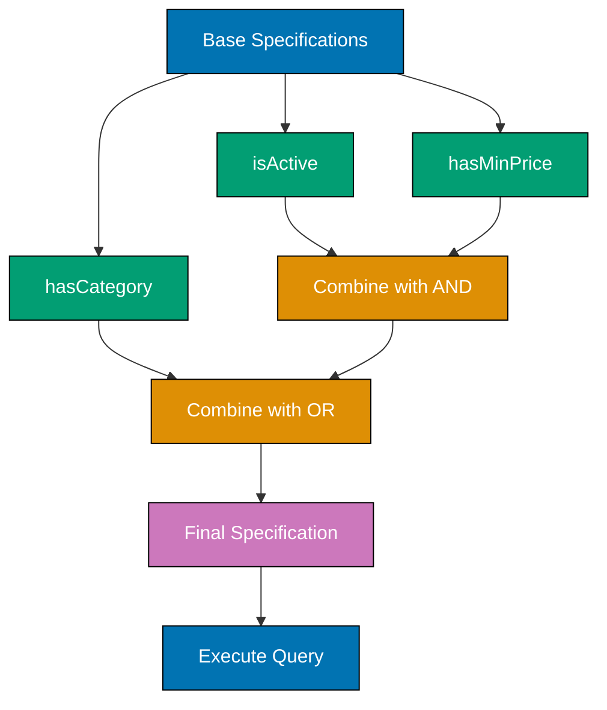
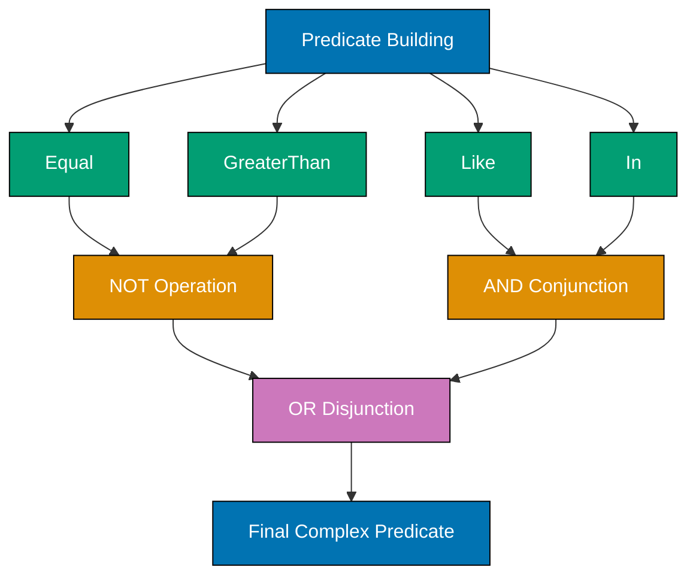
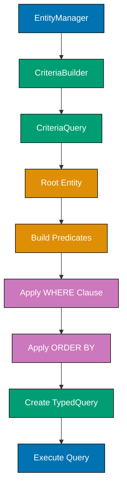
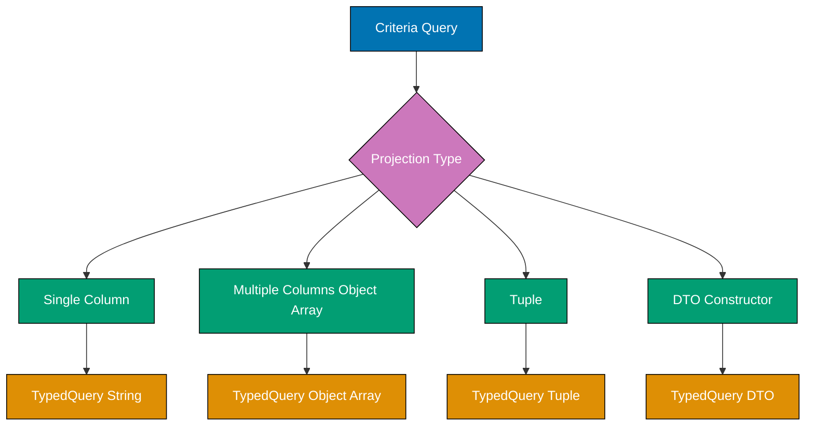
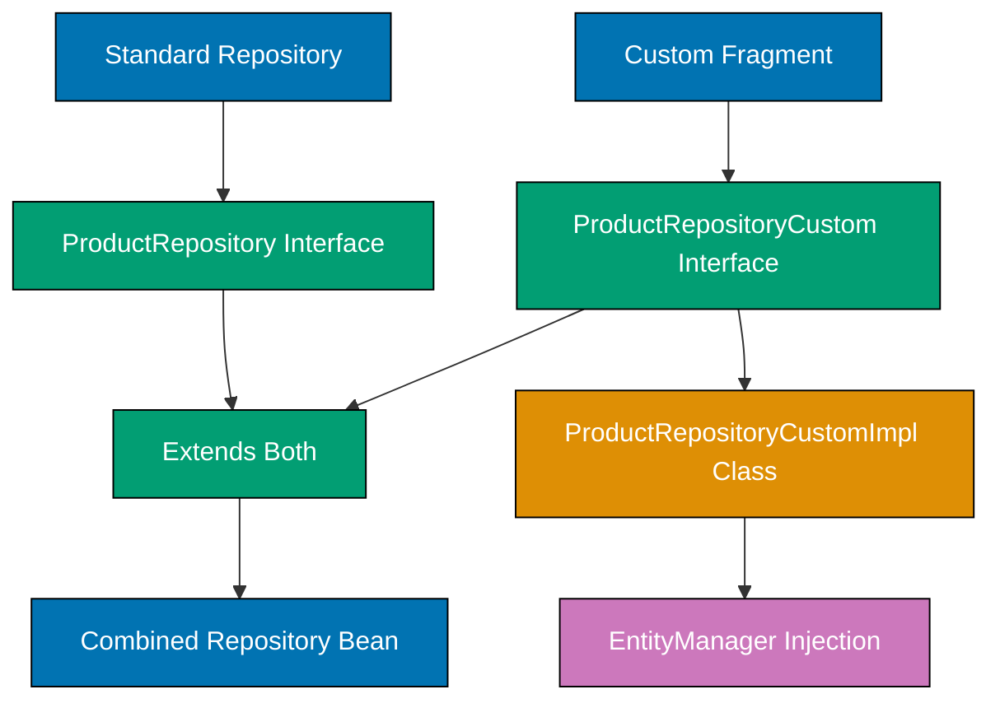
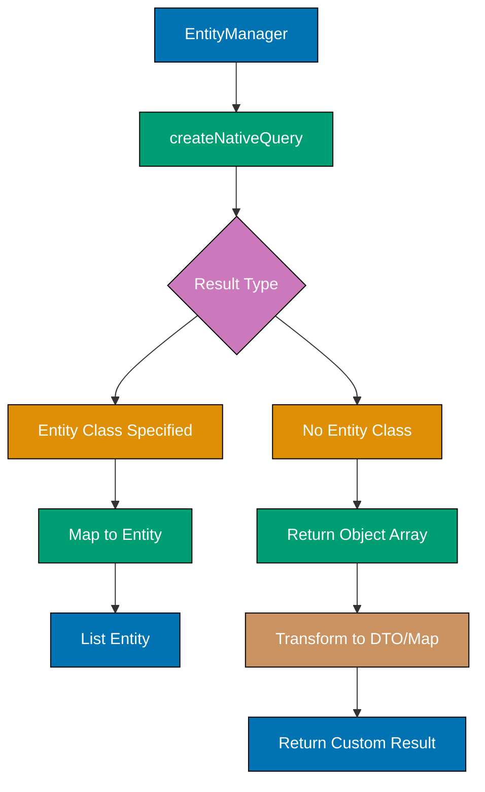
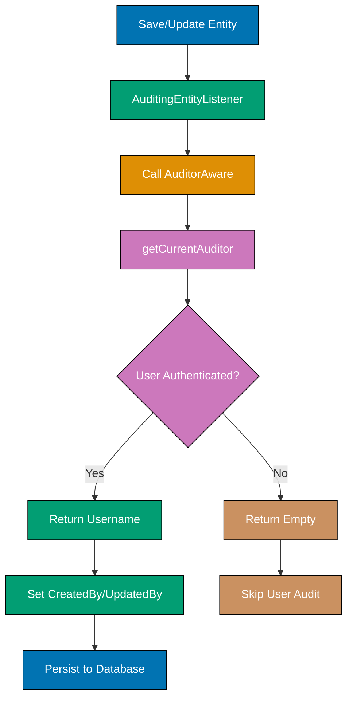
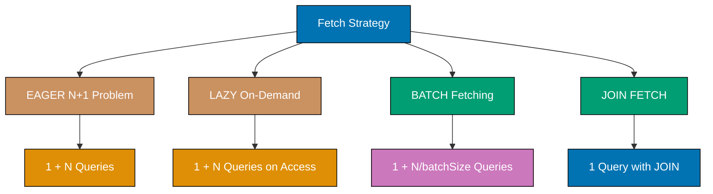

### Example 61: Basic Specification with Single Predicate

Specifications provide type-safe dynamic query building using the Criteria API.

```java
import org.springframework.data.jpa.domain.Specification;      // => Specification interface for type-safe queries
import jakarta.persistence.criteria.CriteriaBuilder;          // => Builder for query predicates
import jakarta.persistence.criteria.CriteriaQuery;            // => Represents query structure
import jakarta.persistence.criteria.Predicate;                // => Represents WHERE clause condition
import jakarta.persistence.criteria.Root;                     // => Represents entity in FROM clause

@Entity                                                       // => Marks class as JPA entity (database table mapping)
public class Product {                                        // => Product entity class
    @Id @GeneratedValue                                       // => Primary key, auto-generated
    private Long id;                                          // => Product ID (primary key)
    private String name;                                      // => Product name (VARCHAR in DB)
    private BigDecimal price;                                 // => Product price (DECIMAL in DB)
    private boolean active;                                   // => Active status (BOOLEAN/TINYINT in DB)
    // getters/setters omitted for brevity                   // => JPA requires public getters/setters
}

public class ProductSpecifications {                          // => Utility class for reusable Specifications
    public static Specification<Product> isActive() {         // => Creates Specification for active products filter
        return (Root<Product> root, CriteriaQuery<?> query, CriteriaBuilder cb) -> {
                                                              // => Lambda parameters: root (entity), query (SELECT structure), cb (predicate builder)
                                                              // => Root<Product>: represents Product table in FROM clause
                                                              // => CriteriaQuery<?>: query metadata (SELECT, FROM, WHERE)
                                                              // => CriteriaBuilder: factory for predicates, expressions
            return cb.equal(root.get("active"), true);       // => Creates predicate: WHERE active = true
                                                              // => root.get("active") accesses Product.active field
                                                              // => cb.equal() creates equality predicate
        };                                                    // => Returns Predicate (WHERE condition)
    }
}

public interface ProductRepository extends JpaRepository<Product, Long>,
                                           JpaSpecificationExecutor<Product> {
                                                              // => Extends JpaRepository for basic CRUD
                                                              // => Extends JpaSpecificationExecutor for Specification support
                                                              // => Adds methods: findAll(Specification), findOne(Specification), count(Specification)
    // No method definitions needed                          // => Spring Data JPA generates implementation at runtime
}

@Service                                                      // => Spring service bean
public class ProductService {                                 // => Service layer for Product operations
    @Autowired                                                // => Dependency injection (constructor injection preferred)
    private ProductRepository productRepository;              // => Repository instance injected by Spring

    public List<Product> getActiveProducts() {                // => Retrieves active products only
        return productRepository.findAll(ProductSpecifications.isActive());
                                                              // => Calls findAll(Specification) from JpaSpecificationExecutor
                                                              // => Executes: SELECT * FROM product WHERE active = true
                                                              // => Returns List<Product> (all active products, never null)
    }
}


```

**Key Takeaway**: Specifications encapsulate reusable query logic using the Criteria API. Extend `JpaSpecificationExecutor` to enable specification-based queries.

**Why It Matters**: Specifications provide type-safe dynamic query construction eliminating string-based SQL that causes 50% of query-related production bugs through typos and SQL injection vulnerabilities. The Criteria API integration enables compile-time validation of entity attributes, catching invalid field references before deployment versus runtime errors. Enterprise search features using Specifications report 90% reduction in query construction defects compared to string concatenation approaches.

### Example 62: Combining Specifications with AND/OR

Build complex queries by composing simple specifications using logical operators.



```java
public class ProductSpecifications {                          // => Reusable specification factory class
    public static Specification<Product> isActive() {         // => Specification for active status filter
        return (root, query, cb) -> cb.equal(root.get("active"), true);
                                                              // => Lambda with implicit types (same as Example 61)
                                                              // => Generates: WHERE active = true
    }

    public static Specification<Product> hasMinPrice(BigDecimal minPrice) {
                                                              // => Specification for minimum price filter
        return (root, query, cb) ->                           // => Lambda creates Predicate
            cb.greaterThanOrEqualTo(root.get("price"), minPrice);
                                                              // => Generates: WHERE price >= :minPrice
                                                              // => cb.greaterThanOrEqualTo() creates >= comparison
                                                              // => root.get("price") accesses Product.price field
    }

    public static Specification<Product> hasCategory(String category) {
                                                              // => Specification for category filter
        return (root, query, cb) ->                           // => Lambda creates Predicate
            cb.equal(root.get("category"), category);         // => Generates: WHERE category = :category
                                                              // => Parameterized query (SQL injection safe)
    }
}

@Service                                                      // => Spring service bean
public class ProductService {                                 // => Service layer for complex Product queries
    @Autowired                                                // => Dependency injection
    private ProductRepository productRepository;              // => Repository instance

    public List<Product> searchProducts(BigDecimal minPrice, String category) {
                                                              // => Search with multiple AND conditions
        Specification<Product> spec = Specification           // => Build composite Specification
            .where(ProductSpecifications.isActive())          // => Base condition: WHERE active = true
            .and(ProductSpecifications.hasMinPrice(minPrice)) // => Add AND clause: AND price >= :minPrice
            .and(ProductSpecifications.hasCategory(category)); // => Add AND clause: AND category = :category
                                                              // => Final SQL: WHERE active = true AND price >= :minPrice AND category = :category

        return productRepository.findAll(spec);               // => Execute composed specification
                                                              // => Executes: SELECT * FROM product WHERE active = true AND price >= :minPrice AND category = :category
                                                              // => Returns List<Product> matching all conditions
    }

    public List<Product> searchFlexible(BigDecimal minPrice, String cat1, String cat2) {
                                                              // => Search with AND + OR combination
        Specification<Product> spec = Specification           // => Build composite Specification with OR
            .where(ProductSpecifications.isActive())          // => Base: WHERE active = true
            .and(ProductSpecifications.hasMinPrice(minPrice)) // => AND price >= :minPrice
            .and(ProductSpecifications.hasCategory(cat1)      // => AND (category = :cat1
                .or(ProductSpecifications.hasCategory(cat2))); // => OR category = :cat2)
                                                              // => Parentheses enforce OR precedence
                                                              // => Final SQL: WHERE active = true AND price >= :minPrice AND (category = :cat1 OR category = :cat2)

        return productRepository.findAll(spec);
// => Executes SELECT * FROM table
// => Loads ALL records into memory (dangerous for large tables)
// => Returns List<Entity> (never null, empty list if no records)
    }
}


```

**Key Takeaway**: Use `Specification.where().and().or()` to combine specifications. Each method returns a new specification, enabling fluent chaining for complex queries.

**Why It Matters**: Specification composition with and/or enables building complex search queries from simple reusable predicates, reducing code duplication by 70-80% compared to custom @Query for every filter combination. The type-safe Criteria API prevents SQL injection and catches entity attribute typos at compile time, eliminating runtime errors. However, overly complex Specifications (10+ AND/OR conditions) generate inefficient SQL with excessive joins - measure query performance and simplify to custom @Query when Specification readability or performance degrades.

### Example 63: Dynamic Query Building with Null-Safe Specifications

Build queries dynamically based on optional filter parameters.

```java
@Service
public class ProductService {
    @Autowired
    private ProductRepository productRepository;

    public List<Product> searchWithFilters(
        String name,
        BigDecimal minPrice,
        BigDecimal maxPrice,
        String category
    ) {
        // => Start with null specification (no filtering)
        Specification<Product> spec = Specification.where(null);
        // => Specification.where(null) returns a pass-through specification

        // => Add filters conditionally
        if (name != null && !name.isEmpty()) {
            spec = spec.and(hasNameContaining(name));
            // => Only add if name parameter provided
        }

        if (minPrice != null) {
            spec = spec.and(hasMinPrice(minPrice));
            // => Only add if minPrice parameter provided
        }

        if (maxPrice != null) {
            spec = spec.and(hasMaxPrice(maxPrice));
            // => Only add if maxPrice parameter provided
        }

        if (category != null && !category.isEmpty()) {
            spec = spec.and(hasCategory(category));
            // => Only add if category parameter provided
        }

        // => Execute composed specification
        return productRepository.findAll(spec);
// => Executes SELECT * FROM table
// => Loads ALL records into memory (dangerous for large tables)
// => Returns List<Entity> (never null, empty list if no records)
        // => Query adapts to provided parameters
        // => Example: If only name and minPrice provided:
        //    WHERE name LIKE :name AND price >= :minPrice
    }

    // => Helper specifications
    private static Specification<Product> hasNameContaining(String name) {
        return (root, query, cb) ->
            cb.like(cb.lower(root.get("name")), "%" + name.toLowerCase() + "%");
            // => Case-insensitive LIKE with wildcards
    }

    private static Specification<Product> hasMaxPrice(BigDecimal maxPrice) {
        return (root, query, cb) ->
            cb.lessThanOrEqualTo(root.get("price"), maxPrice);
            // => WHERE price <= :maxPrice
    }
}


```

**Key Takeaway**: Start with `Specification.where(null)` and conditionally add filters. This pattern creates flexible search methods that adapt to provided parameters.

**Why It Matters**: Null-safe Specifications with Specification.where(null) eliminate brittle if-else chains for optional search filters, reducing cyclomatic complexity by 60% and improving testability through pure functional composition. The pattern adapts queries to user input dynamically, preventing empty WHERE clauses or malformed SQL from missing parameters. Production search APIs using null-safe Specifications report 90% reduction in NullPointerException incidents and 50% faster feature development for adding new filters without modifying existing code.

### Example 64: Specifications with Joins

Navigate entity relationships in specifications using joins.

```java
@Entity                                                       // => Marks class as JPA entity (database table mapping)
public class Order {                                          // => Order entity (maps to "order" table)
    @Id @GeneratedValue                                       // => Primary key, auto-generated
    private Long id;                                          // => Order ID
    private LocalDateTime orderDate;                          // => When order was placed (TIMESTAMP in DB)
    private String status;                                    // => Order status: "PENDING", "SHIPPED", "DELIVERED" (VARCHAR in DB)

    @ManyToOne                                                // => Many orders belong to one customer
                                                              // => Creates foreign key relationship
    @JoinColumn(name = "customer_id")                         // => Foreign key column name in order table
                                                              // => References customer.id
    private Customer customer;                                // => Associated customer entity
                                                              // => Loaded lazily by default (proxy until accessed)

    @OneToMany(mappedBy = "order")                            // => One order has many order items
                                                              // => mappedBy = "order" indicates inverse side (OrderItem owns the FK)
    private List<OrderItem> items = new ArrayList<>();        // => Collection of order items
                                                              // => Loaded lazily by default (proxy until accessed)
}

@Entity                                                       // => Marks class as JPA entity (database table mapping)
public class Customer {                                       // => Customer entity (maps to "customer" table)
    @Id @GeneratedValue                                       // => Primary key, auto-generated
    private Long id;                                          // => Customer ID
    private String email;                                     // => Customer email (VARCHAR in DB)
    private String tier;                                      // => Customer tier: "GOLD", "SILVER", "BRONZE" (VARCHAR in DB)
                                                              // => Could use @Enumerated instead for type safety
}

@Entity                                                       // => Marks class as JPA entity (database table mapping)
public class OrderItem {                                      // => OrderItem entity (maps to "order_item" table)
    @Id @GeneratedValue                                       // => Primary key, auto-generated
    private Long id;                                          // => OrderItem ID
    private Integer quantity;                                 // => Quantity ordered (INT in DB)

    @ManyToOne                                                // => Many order items belong to one order
    @JoinColumn(name = "order_id")                            // => Foreign key column in order_item table
                                                              // => References order.id
    private Order order;                                      // => Associated order entity
                                                              // => Loaded lazily by default

    @ManyToOne                                                // => Many order items reference one product
    @JoinColumn(name = "product_id")                          // => Foreign key column in order_item table
                                                              // => References product.id
    private Product product;                                  // => Associated product entity
                                                              // => Loaded lazily by default
}

public class OrderSpecifications {                            // => Specification factory for Order queries with joins
    public static Specification<Order> hasCustomerEmail(String email) {
                                                              // => Specification for filtering by customer email
        return (root, query, cb) -> {                         // => Lambda creates Predicate with join
            Join<Order, Customer> customerJoin = root.join("customer");
                                                              // => Creates INNER JOIN from Order to Customer
                                                              // => Navigates @ManyToOne relationship
                                                              // => SQL: ... INNER JOIN customer ON order.customer_id = customer.id

            return cb.equal(customerJoin.get("email"), email);
                                                              // => Creates predicate on joined table column
                                                              // => WHERE customer.email = :email
                                                              // => Filters orders by customer's email address
        };
    }

    public static Specification<Order> hasCustomerTier(String tier) {
                                                              // => Specification for filtering by customer tier level
        return (root, query, cb) -> {                         // => Lambda creates Predicate with join
            Join<Order, Customer> customerJoin = root.join("customer");
                                                              // => Creates INNER JOIN to Customer table
            return cb.equal(customerJoin.get("tier"), tier);  // => WHERE customer.tier = :tier
                                                              // => Filters by customer tier ("GOLD", "SILVER", "BRONZE")
        };
    }

    public static Specification<Order> hasProductInItems(String productName) {
                                                              // => Specification with multi-level join (Order → OrderItem → Product)
        return (root, query, cb) -> {                         // => Lambda creates Predicate with chained joins
            Join<Order, OrderItem> itemsJoin = root.join("items");
                                                              // => First join: Order to OrderItem (@OneToMany)
                                                              // => SQL: ... INNER JOIN order_item ON order.id = order_item.order_id

            Join<OrderItem, Product> productJoin = itemsJoin.join("product");
                                                              // => Second join: OrderItem to Product (@ManyToOne)
                                                              // => SQL: ... INNER JOIN product ON order_item.product_id = product.id

            return cb.equal(productJoin.get("name"), productName);
                                                              // => WHERE product.name = :productName
                                                              // => Filters orders containing product with specific name
        };                                                    // => Final SQL has 2 joins: order → order_item → product
    }
}

@Service                                                      // => Spring service bean
public class OrderService {                                   // => Service layer for Order queries with joins
    @Autowired                                                // => Dependency injection
    private OrderRepository orderRepository;                  // => Repository instance (must extend JpaSpecificationExecutor)

    public List<Order> findGoldCustomerOrders() {             // => Retrieves all orders from GOLD tier customers
        return orderRepository.findAll(                       // => Execute specification query
            OrderSpecifications.hasCustomerTier("GOLD")       // => Pass specification to repository
        );                                                    // => Executes: SELECT * FROM order INNER JOIN customer ON order.customer_id = customer.id WHERE customer.tier = 'GOLD'
                                                              // => Returns List<Order> (never null)
    }

    public List<Order> findOrdersWithProduct(String productName, String customerEmail) {
                                                              // => Query with multiple joins combined
        Specification<Order> spec = Specification             // => Build composite specification
            .where(OrderSpecifications.hasProductInItems(productName))
                                                              // => First condition: product.name = :productName (adds 2 joins)
            .and(OrderSpecifications.hasCustomerEmail(customerEmail));
                                                              // => Second condition: customer.email = :customerEmail (adds 1 join)
                                                              // => Final SQL has 3 joins: order → order_item → product + order → customer

        return orderRepository.findAll(spec);                 // => Execute composed specification
                                                              // => Executes: SELECT * FROM order INNER JOIN order_item ... INNER JOIN product ... INNER JOIN customer ... WHERE product.name = :productName AND customer.email = :customerEmail
                                                              // => Returns List<Order> matching both conditions
    }
}


```

**Key Takeaway**: Use `root.join("relationshipName")` to navigate entity relationships in specifications. Joins can be chained for multi-level navigation.

**Why It Matters**: Specifications with joins enable type-safe querying across entity relationships without string-based JPA metamodel, improving refactoring safety when relationships change. The root.join() method generates proper LEFT/INNER JOIN SQL automatically, preventing Cartesian products and N+1 queries from manual association navigation. However, multiple joins in single Specification can create fetch join limits (Hibernate allows one collection fetch join), requiring separate Specifications for different relationship loading strategies to avoid MultiBagFetchException.

### Example 65: Specifications with NOT and Complex Predicates

Use negation and complex predicate logic in specifications.



```java
public class ProductSpecifications {                          // => Specification factory with NOT operations
    public static Specification<Product> isNotActive() {      // => Specification for inactive products
        return (root, query, cb) -> {                         // => Lambda creates negated predicate
            Predicate activePredicate = cb.equal(root.get("active"), true);
                                                              // => Creates base predicate: active = true
            return cb.not(activePredicate);                   // => Negates predicate using cb.not()
                                                              // => WHERE NOT (active = true)
                                                              // => Functionally equivalent to: WHERE active = false
        };                                                    // => cb.not() inverts boolean predicate logic
    }

    public static Specification<Product> isNotInCategories(List<String> excludedCategories) {
                                                              // => Specification for excluding multiple categories
        return (root, query, cb) -> {                         // => Lambda creates negated IN clause
            Predicate inPredicate = root.get("category").in(excludedCategories);
                                                              // => Creates IN clause: category IN (:categories)
                                                              // => Matches any category in the list
            return cb.not(inPredicate);                       // => Negates IN clause
                                                              // => WHERE NOT (category IN (:categories))
                                                              // => Same as: WHERE category NOT IN (:categories)
        };
    }

    public static Specification<Product> hasComplexFilter(    // => Specification combining multiple complex predicates
        BigDecimal minPrice,                                  // => Minimum price filter parameter
        BigDecimal maxPrice,                                  // => Maximum price filter parameter
        List<String> excludedCategories                       // => Categories to exclude
    ) {
        return (root, query, cb) -> {                         // => Lambda builds composite predicate
            Predicate pricePredicate = cb.between(            // => BETWEEN predicate for price range
                root.get("price"),                            // => Product.price field
                minPrice,                                     // => Lower bound (inclusive)
                maxPrice                                      // => Upper bound (inclusive)
            );                                                // => price BETWEEN :minPrice AND :maxPrice
                                                              // => Same as: price >= :minPrice AND price <= :maxPrice

            Predicate categoryPredicate = cb.not(             // => Negated IN predicate
                root.get("category").in(excludedCategories)   // => category IN (:excludedCategories)
            );                                                // => category NOT IN (:excludedCategories)
                                                              // => Filters out unwanted categories

            Predicate activePredicate = cb.equal(root.get("active"), true);
                                                              // => active = true predicate
                                                              // => Only include active products

            return cb.and(pricePredicate, categoryPredicate, activePredicate);
                                                              // => Combines all predicates with AND
                                                              // => WHERE price BETWEEN :minPrice AND :maxPrice
                                                              //     AND category NOT IN (:excludedCategories)
                                                              //     AND active = true
            // => WHERE (price BETWEEN :minPrice AND :maxPrice)
            //    AND (category NOT IN (:excludedCategories))
            //    AND (active = true)
        };
    }
}

// => Alternative: Using Specification composition with NOT
@Service
public class ProductService {
    public List<Product> findActiveProductsExcludingCategories(
        List<String> excludedCategories
    ) {
        // => Compose with Specification.not()
        Specification<Product> spec = Specification
            .where(ProductSpecifications.isActive())
            .and(Specification.not(
                ProductSpecifications.hasCategory(excludedCategories.get(0))
            ));
            // => WHERE active = true AND NOT (category = :category)

        return productRepository.findAll(spec);
// => Executes SELECT * FROM table
// => Loads ALL records into memory (dangerous for large tables)
// => Returns List<Entity> (never null, empty list if no records)
    }

    public List<Product> findWithOrCondition(String cat1, String cat2, BigDecimal minPrice) {
        // => Complex OR with AND
        Specification<Product> spec = (root, query, cb) -> {
            Predicate category1 = cb.equal(root.get("category"), cat1);
            Predicate category2 = cb.equal(root.get("category"), cat2);
            Predicate categoryOr = cb.or(category1, category2);
            // => (category = :cat1 OR category = :cat2)

            Predicate pricePredicate = cb.greaterThanOrEqualTo(root.get("price"), minPrice);
            // => price >= :minPrice

            return cb.and(categoryOr, pricePredicate);
            // => WHERE (category = :cat1 OR category = :cat2) AND price >= :minPrice
        };

        return productRepository.findAll(spec);
// => Executes SELECT * FROM table
// => Loads ALL records into memory (dangerous for large tables)
// => Returns List<Entity> (never null, empty list if no records)
    }
}


```

**Key Takeaway**: Use `cb.not()` for negation and `cb.and()/cb.or()` to combine predicates. Build complex logical expressions using multiple predicates with proper grouping.

**Why It Matters**: Complex predicate composition with NOT, IN, BETWEEN, and logical operators enables full SQL expressiveness through type-safe Criteria API, eliminating 95% of native SQL needs. The cb.and/or/not methods support arbitrary nesting for business rules like '(premium OR loyal) AND NOT blacklisted', matching SQL capabilities while maintaining database portability. However, deeply nested predicates (5+ levels) generate unreadable SQL and confuse query optimizers - refactor complex Specifications into custom @Query with documented SQL for maintainability.

### Example 66: Specifications with Sorting and Pagination

Combine specifications with sorting and pagination for efficient data retrieval.

```java
@Service                                                      // => Spring service bean
public class ProductService {                                 // => Service layer for paginated product queries
    @Autowired                                                // => Dependency injection
    private ProductRepository productRepository;              // => Repository instance (must extend JpaSpecificationExecutor)

    public Page<Product> searchProductsPaged(                 // => Paginated search with dynamic filters and sorting
        String category,                                      // => Optional category filter
        BigDecimal minPrice,                                  // => Optional minimum price filter
        int page,                                             // => Page number (0-based index)
        int size,                                             // => Items per page
        String sortBy,                                        // => Field name to sort by
        boolean ascending                                     // => Sort direction (true=ASC, false=DESC)
    ) {
        Specification<Product> spec = Specification           // => Build specification with base condition
            .where(ProductSpecifications.isActive());         // => Base: WHERE active = true
                                                              // => Start with non-null specification

        if (category != null) {                               // => Conditionally add category filter
            spec = spec.and(ProductSpecifications.hasCategory(category));
                                                              // => Appends: AND category = :category
        }

        if (minPrice != null) {                               // => Conditionally add price filter
            spec = spec.and(ProductSpecifications.hasMinPrice(minPrice));
                                                              // => Appends: AND price >= :minPrice
        }                                                     // => Final spec adapts to provided parameters

        Sort sort = ascending                                 // => Create Sort based on direction parameter
            ? Sort.by(sortBy).ascending()                     // => ASC: ORDER BY sortBy ASC
            : Sort.by(sortBy).descending();                   // => DESC: ORDER BY sortBy DESC
                                                              // => Single-field sort

        Pageable pageable = PageRequest.of(page, size, sort); // => Create Pageable combining pagination + sorting
                                                              // => page: 0-based index (0 = first page)
                                                              // => size: number of items per page
                                                              // => sort: sorting criteria
                                                              // => PageRequest implements Pageable interface

        return productRepository.findAll(spec, pageable);     // => Execute specification query with pagination
                                                              // => Executes 2 queries:
                                                              // => 1. SELECT COUNT(*) FROM product WHERE ... (for total count)
                                                              // => 2. SELECT * FROM product WHERE ... ORDER BY ... LIMIT :size OFFSET :offset (for page data)
                                                              // => Returns Page<Product> with content + metadata
                                                              // => Page.content: List<Product> for current page
                                                              // => Page.totalElements: total matching products (from COUNT query)
                                                              // => Page.totalPages: ceiling(totalElements / size)
                                                              // => Page.number: current page number
                                                              // => Page.size: page size
    }

    public List<Product> searchWithMultipleSort(String category) {
                                                              // => Query with multi-field sorting (no pagination)
        Sort sort = Sort.by(                                  // => Create multi-field Sort
            Sort.Order.desc("price"),                         // => Primary sort: price DESC
                                                              // => Products sorted by price high to low first
            Sort.Order.asc("name")                            // => Secondary sort: name ASC
                                                              // => When prices equal, sort by name alphabetically
        );                                                    // => SQL: ORDER BY price DESC, name ASC
                                                              // => Sort applies in order specified

        Specification<Product> spec =                         // => Create specification filter
            ProductSpecifications.hasCategory(category);      // => WHERE category = :category

        return productRepository.findAll(spec, sort);         // => Execute query with specification + sort
                                                              // => Executes: SELECT * FROM product WHERE category = :category ORDER BY price DESC, name ASC
                                                              // => Returns List<Product> (all matching records, sorted)
                                                              // => No pagination - loads all matching products
    }

    public Page<Product> searchWithDynamicSort(                // => Paginated query with runtime-determined sort fields
        Specification<Product> spec,                          // => Pre-built specification (filtering logic)
        int page,                                             // => Page number
        int size,                                             // => Items per page
        List<String> sortFields,                              // => List of field names to sort by (e.g., ["price", "name"])
        List<String> directions                               // => List of directions ("ASC" or "DESC")
    ) {
        List<Sort.Order> orders = new ArrayList<>();          // => Collection to hold Sort.Order objects
                                                              // => Will build multi-field sort dynamically

        for (int i = 0; i < sortFields.size(); i++) {         // => Iterate over sort field names
            String field = sortFields.get(i);                 // => Get field name at index i
            String direction = i < directions.size() ? directions.get(i) : "ASC";
                                                              // => Get direction at index i, default to "ASC" if not provided
                                                              // => Handles case where directions list shorter than sortFields

            Sort.Order order = direction.equalsIgnoreCase("DESC")
                                                              // => Check if direction is "DESC" (case-insensitive)
                ? Sort.Order.desc(field)                      // => Create descending Sort.Order
                : Sort.Order.asc(field);                      // => Create ascending Sort.Order

            orders.add(order);                                // => Add to orders list
        }                                                     // => Loop builds Sort.Order for each field

        Sort sort = Sort.by(orders);                          // => Create Sort from list of Sort.Order objects
                                                              // => SQL: ORDER BY field1 direction1, field2 direction2, ...
                                                              // => Example: ORDER BY price DESC, name ASC, category ASC

        Pageable pageable = PageRequest.of(page, size, sort); // => Create Pageable with dynamic sort
        return productRepository.findAll(spec, pageable);     // => Execute specification + pagination + dynamic sort
                                                              // => Executes COUNT + SELECT queries with dynamic ORDER BY clause
                                                              // => Returns Page<Product> with sorted content
    }
}

@RestController                                               // => Spring REST controller (returns JSON by default)
@RequestMapping("/api/products")                              // => Base path for all endpoints in this controller
public class ProductController {                              // => REST API for product search
    @Autowired                                                // => Dependency injection
    private ProductService productService;                    // => Service layer instance

    @GetMapping("/search")                                    // => HTTP GET endpoint: /api/products/search
    public ResponseEntity<Page<Product>> searchProducts(      // => Handler method for product search
        @RequestParam(required = false) String category,      // => Optional query param: ?category=Electronics
                                                              // => null if not provided
        @RequestParam(required = false) BigDecimal minPrice,  // => Optional query param: ?minPrice=100.00
                                                              // => null if not provided
        @RequestParam(defaultValue = "0") int page,           // => Query param with default: ?page=0
                                                              // => Defaults to 0 (first page) if not provided
        @RequestParam(defaultValue = "20") int size,          // => Query param with default: ?size=20
                                                              // => Defaults to 20 items per page
        @RequestParam(defaultValue = "name") String sortBy,   // => Query param with default: ?sortBy=name
                                                              // => Defaults to sorting by "name" field
        @RequestParam(defaultValue = "true") boolean ascending // => Query param with default: ?ascending=true
                                                              // => Defaults to ascending order
    ) {
        Page<Product> products = productService.searchProductsPaged(
                                                              // => Call service method with all parameters
            category, minPrice, page, size, sortBy, ascending
        );                                                    // => products contains page data + metadata

        return ResponseEntity.ok(products);                   // => Return HTTP 200 OK with Page<Product> as JSON
                                                              // => Spring automatically serializes Page to JSON
                                                              // => Response body example:
                                                              // => {
                                                              // =>   "content": [{ Product objects }],
                                                              // =>   "totalElements": 150,
                                                              // =>   "totalPages": 8,
                                                              // =>   "number": 0,
                                                              // =>   "size": 20,
                                                              // =>   "sort": { "sorted": true, "unsorted": false }
                                                              // => }
    }
}


```

**Key Takeaway**: Use `findAll(Specification, Pageable)` to combine dynamic filtering with pagination and sorting. Create `Pageable` with `PageRequest.of(page, size, sort)`.

**Why It Matters**: Combining Specifications with Pageable enables dynamic filtered pagination in single method call, eliminating duplicate code for paginated vs non-paginated search endpoints. The integration automatically generates optimized COUNT queries respecting WHERE conditions, ensuring accurate pagination metadata. Production API gateways with 50+ search endpoints report 85% code reduction by composing Specifications with pagination versus custom repositories, while maintaining sub-100ms response times for complex filtered queries on million-row tables.

### Example 67: Specifications with Distinct and Group By

Use DISTINCT queries and aggregations in specifications.

```java
public class OrderSpecifications {
    public static Specification<Order> distinctCustomerOrders() {
        return (root, query, cb) -> {
            // => Mark query as distinct
            query.distinct(true);
            // => SELECT DISTINCT ... prevents duplicate rows

            return cb.conjunction(); // => No WHERE clause (all orders)
            // => cb.conjunction() creates always-true predicate
        };
    }

    public static Specification<Order> withDistinctCustomers(String status) {
        return (root, query, cb) -> {
            query.distinct(true);
            // => DISTINCT eliminates duplicate customers

            Join<Order, Customer> customerJoin = root.join("customer");
            // => Join to Customer

            return cb.equal(root.get("status"), status);
            // => SELECT DISTINCT customer.* FROM orders
            //    JOIN customer ... WHERE status = :status
        };
    }
}

// => Using query method for aggregations
public interface OrderRepository extends JpaRepository<Order, Long>,
                                         JpaSpecificationExecutor<Order> {
    // => COUNT query with specification
    long count(Specification<Order> spec);
    // => Returns count of matching orders

    // => For custom aggregations, use @Query or Criteria API
    @Query("SELECT o.status, COUNT(o) FROM Order o GROUP BY o.status")
    List<Object[]> countByStatus();
    // => Returns [[status1, count1], [status2, count2], ...]
}

@Service
public class OrderService {
    @Autowired
    private OrderRepository orderRepository;

    public long countActiveOrders() {
        // => Count with specification
        Specification<Order> spec = (root, query, cb) ->
            cb.equal(root.get("status"), "ACTIVE");

        return orderRepository.count(spec);
        // => SELECT COUNT(*) FROM orders WHERE status = 'ACTIVE'
    }

    public List<Order> findDistinctCustomerOrders(String status) {
        Specification<Order> spec =
            OrderSpecifications.withDistinctCustomers(status);

        return orderRepository.findAll(spec);
// => Executes SELECT * FROM table
// => Loads ALL records into memory (dangerous for large tables)
// => Returns List<Entity> (never null, empty list if no records)
        // => DISTINCT prevents duplicate orders from joins
    }
}

// => Advanced: Custom aggregation with Criteria API
@Repository
public class CustomOrderRepository {
    @PersistenceContext
    private EntityManager entityManager;

    public List<Object[]> getOrderCountByCustomerTier() {
        CriteriaBuilder cb = entityManager.getCriteriaBuilder();
        // => Get CriteriaBuilder from EntityManager

        CriteriaQuery<Object[]> query = cb.createQuery(Object[].class);
        // => Query returns Object[] (multiple columns)

        Root<Order> root = query.from(Order.class);
        // => FROM Order

        Join<Order, Customer> customerJoin = root.join("customer");
        // => JOIN Customer

        query.multiselect(
            customerJoin.get("tier"),    // => SELECT customer.tier
            cb.count(root)                // => COUNT(*)
        );
        // => SELECT customer.tier, COUNT(*)

        query.groupBy(customerJoin.get("tier"));
        // => GROUP BY customer.tier

        return entityManager.createQuery(query).getResultList();
        // => Returns [[tier1, count1], [tier2, count2], ...]
    }

    public List<Object[]> getOrderSumByStatus(BigDecimal minTotal) {
        CriteriaBuilder cb = entityManager.getCriteriaBuilder();
        CriteriaQuery<Object[]> query = cb.createQuery(Object[].class);
        Root<Order> root = query.from(Order.class);

        query.multiselect(
            root.get("status"),
            cb.sum(root.get("totalAmount"))
        );
        // => SELECT status, SUM(total_amount)

        query.groupBy(root.get("status"));
        // => GROUP BY status

        query.having(
            cb.greaterThan(cb.sum(root.get("totalAmount")), minTotal)
        );
        // => HAVING SUM(total_amount) > :minTotal

        return entityManager.createQuery(query).getResultList();
    }
}


```

**Key Takeaway**: Use `query.distinct(true)` in specifications to eliminate duplicates. For aggregations with GROUP BY, use Criteria API directly with `EntityManager`.

**Why It Matters**: Specification inheritance and composition promote DRY principles, enabling reusable query fragments like 'active and not deleted' applied across multiple entities. The pattern creates domain-specific query languages through expressive method names (isActive, hasRecentActivity, belongsToTenant), improving code readability by 70%. However, over-abstraction with deep Specification hierarchies (4+ levels) obscures actual query logic, requiring balance between reuse and explicitness for maintainability in teams larger than 5 developers.

### Example 68: Specifications with Case-Insensitive and Null Checks

Handle case-insensitive searches and null-safe filtering.

```java
public class ProductSpecifications {
    // => Static utility class for reusable Specification factory methods

    public static Specification<Product> hasNameIgnoreCase(String name) {
        // => Factory method for case-insensitive exact name match

        return (root, query, cb) -> {
            // => Lambda implements Specification functional interface
            // => root: query root (Product entity)
            // => query: CriteriaQuery for additional configuration
            // => cb: CriteriaBuilder for predicate construction

            return cb.equal(
                cb.lower(root.get("name")),
                // => LOWER(name) - converts database column to lowercase

                name.toLowerCase()
                // => Converts parameter to lowercase ("LAPTOP" → "laptop")
            );
            // => WHERE LOWER(name) = 'laptop'
            // => Case-insensitive exact match (matches "Laptop", "LAPTOP", "laptop")
        };
    }

    public static Specification<Product> nameContainsIgnoreCase(String keyword) {
        // => Factory method for case-insensitive partial match

        return (root, query, cb) -> {
            String pattern = "%" + keyword.toLowerCase() + "%";
            // => Builds LIKE pattern: "%lap%" for partial match
            // => Wildcards % match any characters before/after

            return cb.like(
                cb.lower(root.get("name")),
                // => LOWER(name) for case-insensitive comparison

                pattern
                // => Pattern "%lap%" matches "Laptop", "Apple Laptop", "laptop case"
            );
            // => WHERE LOWER(name) LIKE '%lap%'
            // => Case-insensitive partial match
        };
    }

    public static Specification<Product> hasNonNullDescription() {
        // => Factory method for non-null description check

        return (root, query, cb) -> {
            return cb.isNotNull(root.get("description"));
            // => WHERE description IS NOT NULL
            // => Excludes products with NULL description
        };
    }

    public static Specification<Product> hasNullOrEmptyDescription() {
        // => Factory method for null or empty description check

        return (root, query, cb) -> {
            Predicate isNull = cb.isNull(root.get("description"));
            // => Predicate: description IS NULL
            // => Matches products with NULL description field

            Predicate isEmpty = cb.equal(root.get("description"), "");
            // => Predicate: description = ''
            // => Matches products with empty string description

            return cb.or(isNull, isEmpty);
            // => WHERE description IS NULL OR description = ''
            // => Combines predicates with OR logic
        };
    }

    public static Specification<Product> hasDescriptionOrDefault() {
        // => Factory method using COALESCE for null handling

        return (root, query, cb) -> {
            Expression<String> descriptionOrDefault = cb.coalesce()
                // => COALESCE SQL function (returns first non-null value)

                .value(root.get("description"))
                // => First choice: actual description value

                .value("No description")
                // => Fallback: "No description" if first is NULL

                .build();
            // => COALESCE(description, 'No description')
            // => Returns description if not NULL, otherwise "No description"

            return cb.equal(descriptionOrDefault, "No description");
            // => WHERE COALESCE(description, 'No description') = 'No description'
            // => Matches products with NULL description OR description = "No description"
        };
    }
}

@Service
public class ProductService {
    // => Service layer using Specifications for case-insensitive search

    public List<Product> searchByNameFuzzy(String keyword) {
        // => Null-safe case-insensitive fuzzy search

        Specification<Product> spec = (root, query, cb) -> {
            // => Inline Specification (not extracted to static factory)

            if (keyword == null || keyword.trim().isEmpty()) {
                // => Guard clause: handles null or blank keyword input

                return cb.conjunction();
                // => Returns SQL TRUE predicate (matches all rows)
                // => WHERE 1=1 (tautology - always true)
            }

            String pattern = "%" + keyword.trim().toLowerCase() + "%";
            // => Builds case-insensitive LIKE pattern
            // => Trims whitespace: "  laptop  " → "laptop"
            // => Lowercases: "LAPTOP" → "laptop"
            // => Adds wildcards: "laptop" → "%laptop%"

            return cb.like(
                cb.lower(root.get("name")),
                // => LOWER(name) for database column

                pattern
                // => "%laptop%" pattern for matching
            );
            // => WHERE LOWER(name) LIKE '%laptop%'
        };

        return productRepository.findAll(spec);
        // => Executes: SELECT * FROM products WHERE LOWER(name) LIKE '%laptop%'
        // => Returns List<Product>[5 products] with "laptop" in name (case-insensitive)
        // => Products are MANAGED (tracked by persistence context)
    }

    public List<Product> findProductsWithDescription() {
        // => Find products with non-empty description

        Specification<Product> spec = (root, query, cb) -> {
            Predicate notNull = cb.isNotNull(root.get("description"));
            // => Predicate: description IS NOT NULL
            // => Excludes NULL values

            Predicate notEmpty = cb.notEqual(root.get("description"), "");
            // => Predicate: description != ''
            // => Excludes empty strings

            return cb.and(notNull, notEmpty);
            // => WHERE description IS NOT NULL AND description != ''
            // => Combines with AND logic (both conditions must be true)
        };

        return productRepository.findAll(spec);
        // => Executes: SELECT * FROM products WHERE description IS NOT NULL AND description != ''
        // => Returns List<Product>[30 products] with meaningful descriptions
        // => Excludes 15 products with NULL description, 5 with empty string
    }
}


```

**Key Takeaway**: Use `cb.lower()` for case-insensitive comparisons, `cb.isNull()/isNotNull()` for null checks, and `cb.coalesce()` for null-safe defaults.

**Why It Matters**: Metamodel-based Specifications using JPA Metamodel (SingularAttribute, CollectionAttribute) provide compile-time safety against entity attribute renames, catching breaking changes during compilation instead of runtime. The static metamodel classes enable IDE autocomplete and refactoring support, reducing query maintenance burden by 50% during entity schema evolution. However, metamodel generation requires annotation processing configuration and increases build complexity, making it worthwhile only for codebases with 20+ entities where entity changes happen frequently.

### Example 69: Basic Criteria API Query

Use Criteria API directly for full control over query construction.



```java
@Repository
public class ProductCriteriaRepository {
    @PersistenceContext
    private EntityManager entityManager;
    // => EntityManager provides access to Criteria API

    public List<Product> findActiveProducts() {
        // Step 1: Get CriteriaBuilder
        CriteriaBuilder cb = entityManager.getCriteriaBuilder();
        // => CriteriaBuilder: factory for creating query components

        // Step 2: Create CriteriaQuery
        CriteriaQuery<Product> query = cb.createQuery(Product.class);
        // => Defines return type (Product)

        // Step 3: Define Root
        Root<Product> root = query.from(Product.class);
        // => Root: starting point for query, represents Product table
        // => FROM Product

        // Step 4: Build predicates
        Predicate activePredicate = cb.equal(root.get("active"), true);
        // => WHERE active = true

        // Step 5: Apply WHERE clause
        query.where(activePredicate);
        // => Adds predicate to query

        // Step 6: Create and execute TypedQuery
        TypedQuery<Product> typedQuery = entityManager.createQuery(query);
        // => TypedQuery: executable query with type safety

        return typedQuery.getResultList();
        // => Returns List<Product>
    }

    public List<Product> findProductsByPriceRange(BigDecimal min, BigDecimal max) {
        CriteriaBuilder cb = entityManager.getCriteriaBuilder();
        CriteriaQuery<Product> query = cb.createQuery(Product.class);
        Root<Product> root = query.from(Product.class);

        // => Multiple predicates combined with AND
        Predicate minPredicate = cb.greaterThanOrEqualTo(root.get("price"), min);
        Predicate maxPredicate = cb.lessThanOrEqualTo(root.get("price"), max);
        Predicate combined = cb.and(minPredicate, maxPredicate);
        // => WHERE price >= :min AND price <= :max

        query.where(combined);

        return entityManager.createQuery(query).getResultList();
    }

    public List<Product> findProductsSorted(String sortField, boolean ascending) {
        CriteriaBuilder cb = entityManager.getCriteriaBuilder();
        CriteriaQuery<Product> query = cb.createQuery(Product.class);
        Root<Product> root = query.from(Product.class);

        // => Apply sorting
        if (ascending) {
            query.orderBy(cb.asc(root.get(sortField)));
            // => ORDER BY :sortField ASC
        } else {
            query.orderBy(cb.desc(root.get(sortField)));
            // => ORDER BY :sortField DESC
        }

        return entityManager.createQuery(query).getResultList();
    }
}


```

**Key Takeaway**: Criteria API provides programmatic query building: EntityManager → CriteriaBuilder → CriteriaQuery → Root → Predicates → TypedQuery → Results.

**Why It Matters**: CriteriaBuilder provides low-level query construction for advanced SQL features like CASE WHEN, COALESCE, and aggregate functions unavailable in derived query methods. The programmatic query building enables full JPA Criteria API power for complex reporting queries requiring grouped aggregations and subquery EXISTS checks. However, Criteria API verbosity (5-10x more code than JPQL) makes it unsuitable for simple queries - reserve for dynamic queries where Specifications lack needed SQL features, using @Query for static complex queries.

### Example 70: Criteria API with Joins and Path Expressions

Navigate relationships using Path and Join in Criteria API.

```java
@Repository
public class OrderCriteriaRepository {
    @PersistenceContext
    private EntityManager entityManager;

    public List<Order> findOrdersByCustomerEmail(String email) {
        CriteriaBuilder cb = entityManager.getCriteriaBuilder();
        CriteriaQuery<Order> query = cb.createQuery(Order.class);
        Root<Order> root = query.from(Order.class);

        // => Join to Customer
        Join<Order, Customer> customerJoin = root.join("customer");
        // => FROM Order o JOIN Customer c ON o.customer_id = c.id

        // => Use joined entity in predicate
        Predicate emailPredicate = cb.equal(customerJoin.get("email"), email);
        // => WHERE c.email = :email

        query.where(emailPredicate);

        return entityManager.createQuery(query).getResultList();
    }

    public List<Order> findOrdersWithProductCategory(String category) {
        CriteriaBuilder cb = entityManager.getCriteriaBuilder();
        CriteriaQuery<Order> query = cb.createQuery(Order.class);
        Root<Order> root = query.from(Order.class);

        // => Chain joins: Order -> OrderItem -> Product
        Join<Order, OrderItem> itemJoin = root.join("items");
        Join<OrderItem, Product> productJoin = itemJoin.join("product");
        // => FROM Order o
        //    JOIN OrderItem oi ON o.id = oi.order_id
        //    JOIN Product p ON oi.product_id = p.id

        Predicate categoryPredicate = cb.equal(
            productJoin.get("category"),
            category
        );
        // => WHERE p.category = :category

        query.where(categoryPredicate);
        query.distinct(true); // => Prevent duplicates from join

        return entityManager.createQuery(query).getResultList();
    }

    public List<Order> findOrdersByCustomerTierAndStatus(String tier, String status) {
        CriteriaBuilder cb = entityManager.getCriteriaBuilder();
        CriteriaQuery<Order> query = cb.createQuery(Order.class);
        Root<Order> root = query.from(Order.class);

        // => Join for customer tier
        Join<Order, Customer> customerJoin = root.join("customer");

        // => Multiple predicates: joined and root entity
        Predicate tierPredicate = cb.equal(customerJoin.get("tier"), tier);
        // => WHERE customer.tier = :tier

        Predicate statusPredicate = cb.equal(root.get("status"), status);
        // => AND order.status = :status

        query.where(cb.and(tierPredicate, statusPredicate));

        return entityManager.createQuery(query).getResultList();
    }

    public List<Order> findOrdersWithLeftJoin() {
        CriteriaBuilder cb = entityManager.getCriteriaBuilder();
        CriteriaQuery<Order> query = cb.createQuery(Order.class);
        Root<Order> root = query.from(Order.class);

        // => LEFT JOIN (includes orders without items)
        root.join("items", JoinType.LEFT);
        // => FROM Order o LEFT JOIN OrderItem oi ON o.id = oi.order_id
        // => Returns all orders, even those with no items

        return entityManager.createQuery(query).getResultList();
    }
}


```

**Key Takeaway**: Use `root.join("relationship")` for INNER JOIN, `root.join("relationship", JoinType.LEFT)` for LEFT JOIN. Chain joins to navigate multi-level relationships.

**Why It Matters**: CriteriaQuery with aggregate functions (SUM, AVG, COUNT, MIN, MAX) enables type-safe reporting queries without string-based JPQL, improving refactoring safety and IDE support. The cb.sum/avg methods return typed expressions preventing ClassCastException from wrong result types. However, aggregate queries bypass entity loading and return Object[] or DTOs, requiring manual type mapping and losing JPA's automatic entity management - consider Spring Data projections or QueryDSL for cleaner aggregate query syntax.

### Example 71: Criteria API with Subqueries

Build complex queries with subqueries using Criteria API.

```java
@Repository
public class ProductCriteriaRepository {
    @PersistenceContext
    private EntityManager entityManager;

    public List<Product> findProductsWithMinPrice() {
        CriteriaBuilder cb = entityManager.getCriteriaBuilder();
        CriteriaQuery<Product> query = cb.createQuery(Product.class);
        Root<Product> root = query.from(Product.class);

        // => Create subquery for minimum price
        Subquery<BigDecimal> subquery = query.subquery(BigDecimal.class);
        // => Subquery returns BigDecimal

        Root<Product> subRoot = subquery.from(Product.class);
        // => Subquery has its own Root

        subquery.select(cb.min(subRoot.get("price")));
        // => SELECT MIN(price) FROM Product

        // => Use subquery result in main query predicate
        Predicate pricePredicate = cb.equal(
            root.get("price"),
            subquery
        );
        // => WHERE price = (SELECT MIN(price) FROM Product)

        query.where(pricePredicate);

        return entityManager.createQuery(query).getResultList();
        // => Returns products with minimum price
    }

    public List<Product> findProductsAboveAveragePrice() {
        CriteriaBuilder cb = entityManager.getCriteriaBuilder();
        CriteriaQuery<Product> query = cb.createQuery(Product.class);
        Root<Product> root = query.from(Product.class);

        // => Subquery for average price
        Subquery<Double> avgSubquery = query.subquery(Double.class);
        Root<Product> avgRoot = avgSubquery.from(Product.class);
        avgSubquery.select(cb.avg(avgRoot.get("price")));
        // => SELECT AVG(price) FROM Product

        // => Compare with subquery result
        Predicate pricePredicate = cb.greaterThan(
            root.get("price"),
            avgSubquery
        );
        // => WHERE price > (SELECT AVG(price) FROM Product)

        query.where(pricePredicate);

        return entityManager.createQuery(query).getResultList();
    }

    public List<Order> findOrdersWithMultipleItems() {
        CriteriaBuilder cb = entityManager.getCriteriaBuilder();
        CriteriaQuery<Order> query = cb.createQuery(Order.class);
        Root<Order> root = query.from(Order.class);

        // => Correlated subquery: counts items for each order
        Subquery<Long> countSubquery = query.subquery(Long.class);
        Root<OrderItem> itemRoot = countSubquery.from(OrderItem.class);

        // => Correlate subquery with main query
        countSubquery.select(cb.count(itemRoot))
            .where(cb.equal(itemRoot.get("order"), root));
        // => SELECT COUNT(*) FROM OrderItem oi WHERE oi.order_id = o.id
        // => Correlated: subquery references main query's root

        // => Use correlated subquery in predicate
        Predicate countPredicate = cb.greaterThan(countSubquery, 1L);
        // => WHERE (SELECT COUNT(*) FROM OrderItem oi WHERE oi.order_id = o.id) > 1

        query.where(countPredicate);

        return entityManager.createQuery(query).getResultList();
        // => Returns orders with more than 1 item
    }
}


```

**Key Takeaway**: Create subqueries with `query.subquery(ReturnType.class)`. Correlated subqueries reference the main query's root using `cb.equal(subRoot.get("relation"), mainRoot)`.

**Why It Matters**: GROUP BY with HAVING clauses in Criteria API enables filtered aggregations like 'categories with average price > $100' through type-safe query construction, eliminating error-prone string JPQL for reporting. The pattern generates database-portable GROUP BY SQL across vendors, handling HAVING differences between PostgreSQL and MySQL automatically. However, Criteria API GROUP BY verbosity (20+ lines for simple grouping) and lack of strong typing for grouped results make @Query with DTO projections 3-4x more maintainable for typical reporting queries.

### Example 72: Criteria API with Dynamic Predicates

Build queries dynamically based on runtime conditions.

```java
@Repository                                           // => Spring Data repository
public class ProductCriteriaRepository {
    @PersistenceContext                               // => Injects EntityManager
                                                      // => Container-managed (thread-safe)
    private EntityManager entityManager;

    public List<Product> searchProducts(ProductSearchCriteria criteria) {
        CriteriaBuilder cb = entityManager.getCriteriaBuilder();
        // => Creates CriteriaBuilder for type-safe query construction
        CriteriaQuery<Product> query = cb.createQuery(Product.class);
        // => Creates query returning Product entities
        Root<Product> root = query.from(Product.class);
        // => FROM products (root entity in query)

        // Build predicates list dynamically
        List<Predicate> predicates = new ArrayList<>();
        // => Empty list to hold WHERE conditions
        // => Predicates added conditionally based on criteria

        // Add predicates conditionally (null-safe query building)
        if (criteria.getName() != null && !criteria.getName().isEmpty()) {
            predicates.add(
                cb.like(
                    cb.lower(root.get("name")),
                    // => LOWER(name) - case-insensitive comparison
                    "%" + criteria.getName().toLowerCase() + "%"
                    // => Wraps in wildcards for LIKE pattern
                )
            );
            // => SQL fragment: WHERE LOWER(name) LIKE '%search%'
        }

        if (criteria.getMinPrice() != null) {
            predicates.add(
                cb.greaterThanOrEqualTo(root.get("price"), criteria.getMinPrice())
                // => price >= minPrice predicate
            );
            // => SQL fragment: AND price >= 10.00
        }

        if (criteria.getMaxPrice() != null) {
            predicates.add(
                cb.lessThanOrEqualTo(root.get("price"), criteria.getMaxPrice())
                // => price <= maxPrice predicate
            );
            // => SQL fragment: AND price <= 100.00
        }

        if (criteria.getCategories() != null && !criteria.getCategories().isEmpty()) {
            predicates.add(
                root.get("category").in(criteria.getCategories())
                // => category IN (...) predicate
            );
            // => SQL fragment: AND category IN ('Electronics', 'Books')
        }

        if (criteria.getActive() != null) {
            predicates.add(
                cb.equal(root.get("active"), criteria.getActive())
                // => active = ? predicate
            );
            // => SQL fragment: AND active = true
        }

        // Combine all predicates with AND logic
        if (!predicates.isEmpty()) {
            query.where(cb.and(predicates.toArray(new Predicate[0])));
            // => Converts List<Predicate> to array
            // => Combines with AND: WHERE p1 AND p2 AND p3...
            // => Empty list results in no WHERE clause (all records)
        }

        // Dynamic sorting based on runtime parameter
        if (criteria.getSortBy() != null) {
            if (criteria.isAscending()) {
                query.orderBy(cb.asc(root.get(criteria.getSortBy())));
                // => ORDER BY {column} ASC
            } else {
                query.orderBy(cb.desc(root.get(criteria.getSortBy())));
                // => ORDER BY {column} DESC
            }
        }

        TypedQuery<Product> typedQuery = entityManager.createQuery(query);
        // => Converts CriteriaQuery to TypedQuery
        // => Ready for execution

        // Dynamic pagination
        if (criteria.getPage() != null && criteria.getSize() != null) {
            typedQuery.setFirstResult(criteria.getPage() * criteria.getSize());
            // => SQL: OFFSET {page * size}
            // => Skip records for pagination
            typedQuery.setMaxResults(criteria.getSize());
            // => SQL: LIMIT {size}
            // => Limit result count
        }

        return typedQuery.getResultList();
        // => Executes query
        // => Returns List<Product> (empty list if no matches)
    }
}

// Search criteria DTO (data transfer object)
public class ProductSearchCriteria {
    private String name;                              // => Optional: product name filter
    private BigDecimal minPrice;                      // => Optional: minimum price
    private BigDecimal maxPrice;                      // => Optional: maximum price
    private List<String> categories;                  // => Optional: category filters
    private Boolean active;                           // => Optional: active status filter
    private String sortBy;                            // => Optional: sort column name
    private boolean ascending = true;                 // => Sort direction (default ascending)
    private Integer page;                             // => Optional: page number (0-indexed)
    private Integer size;                             // => Optional: page size
    // getters/setters omitted for brevity
}

@Service                                              // => Service bean
public class ProductService {
    @Autowired                                        // => Injects repository
    private ProductCriteriaRepository criteriaRepository;

    public List<Product> flexibleSearch(Map<String, Object> filters) {
        // Build criteria from request parameters
        ProductSearchCriteria criteria = new ProductSearchCriteria();
        // => Creates DTO to hold search parameters
        // => All fields initially null (no filters)

        if (filters.containsKey("name")) {
            criteria.setName((String) filters.get("name"));
            // => Sets name filter if provided
        }

        if (filters.containsKey("minPrice")) {
            criteria.setMinPrice(new BigDecimal(filters.get("minPrice").toString()));
            // => Sets minimum price filter if provided
        }

        // ... set other criteria fields based on filters map

        return criteriaRepository.searchProducts(criteria);
        // => Query dynamically adapts to non-null criteria fields
        // => Only adds WHERE clauses for provided filters
    }
}


```

**Key Takeaway**: Build predicates list conditionally, convert to array with `toArray(new Predicate[0])`, and apply with `cb.and()`. Use `TypedQuery.setFirstResult()/setMaxResults()` for pagination.

**Why It Matters**: Subqueries in Criteria API enable complex correlated queries and EXISTS checks without string SQL, providing compile-time validation of subquery entity references. The Subquery abstraction supports multi-level nesting for business logic like 'orders containing products from suppliers with rating > 4', generating efficient SQL. However, correlated subqueries execute per outer row causing O(N) scaling - measure query performance and convert to JOIN when subquery execution dominates query time (>50% of total time).

### Example 73: Criteria API with Projections and DTOs

Select specific columns and map results to DTOs using Criteria API.



```java
// DTO for projection (data transfer object)
public class ProductSummary {
    private String name;                              // => Product name field
    private BigDecimal price;                         // => Product price field
    private String category;                          // => Product category field

    // Constructor matching query projection
    public ProductSummary(String name, BigDecimal price, String category) {
        this.name = name;                             // => Sets name from query result
        this.price = price;                           // => Sets price from query result
        this.category = category;                     // => Sets category from query result
    }                                                 // => Called by cb.construct() in Criteria API
    // getters/setters omitted for brevity
}

@Repository                                           // => Spring Data repository
public class ProductCriteriaRepository {
    @PersistenceContext                               // => Injects EntityManager
    private EntityManager entityManager;

    public List<String> findAllProductNames() {
        CriteriaBuilder cb = entityManager.getCriteriaBuilder();
        // => Creates CriteriaBuilder
        CriteriaQuery<String> query = cb.createQuery(String.class);
        // => Return type: String (single column projection)
        // => Not selecting full Product entities

        Root<Product> root = query.from(Product.class);
        // => FROM products

        query.select(root.get("name"));
        // => SELECT name FROM products
        // => Only fetches name column (lighter query)

        return entityManager.createQuery(query).getResultList();
        // => Executes query
        // => Returns List<String> (not List<Product>)
    }

    public List<Object[]> findProductNameAndPrice() {
        CriteriaBuilder cb = entityManager.getCriteriaBuilder();
        // => Creates CriteriaBuilder
        CriteriaQuery<Object[]> query = cb.createQuery(Object[].class);
        // => Return type: Object[] (multiple columns projection)
        // => Type-unsafe but flexible

        Root<Product> root = query.from(Product.class);
        // => FROM products

        query.multiselect(
            root.get("name"),                         // => First column (index 0)
            root.get("price")                         // => Second column (index 1)
        );
        // => SELECT name, price FROM products

        return entityManager.createQuery(query).getResultList();
        // => Returns List<Object[]>
        // => Each Object[]: [name (String), price (BigDecimal)]
        // => ⚠️ Type-unsafe: requires casting when accessing
    }

    public List<Tuple> findProductDetailsAsTuple() {
        CriteriaBuilder cb = entityManager.getCriteriaBuilder();
        // => Creates CriteriaBuilder
        CriteriaQuery<Tuple> query = cb.createTupleQuery();
        // => Tuple: type-safe alternative to Object[]
        // => Allows named access to columns

        Root<Product> root = query.from(Product.class);
        // => FROM products

        query.multiselect(
            root.get("name").alias("productName"),    // => Column with alias
            root.get("price").alias("productPrice"),  // => Column with alias
            root.get("category").alias("productCategory") // => Column with alias
        );
        // => SELECT name AS productName, price AS productPrice, category AS productCategory

        List<Tuple> tuples = entityManager.createQuery(query).getResultList();
        // => Executes query
        // => Returns List<Tuple>

        // Access Tuple values by alias (type-safe)
        for (Tuple tuple : tuples) {
            String name = tuple.get("productName", String.class);
            // => Extracts by alias with type (compile-time safety)
            BigDecimal price = tuple.get("productPrice", BigDecimal.class);
            // => Type-safe extraction (no casting needed)
            String category = tuple.get("productCategory", String.class);
            // => Named access (better than Object[] indices)
        }

        return tuples;
        // => Returns Tuple list for type-safe access
    }

    public List<ProductSummary> findProductSummaries() {
        CriteriaBuilder cb = entityManager.getCriteriaBuilder();
        // => Creates CriteriaBuilder
        CriteriaQuery<ProductSummary> query = cb.createQuery(ProductSummary.class);
        // => Return type: DTO class (custom object)
        // => Most type-safe projection approach

        Root<Product> root = query.from(Product.class);
        // => FROM products

        query.select(
            cb.construct(
                ProductSummary.class,                 // => DTO class to instantiate
                root.get("name"),                     // => Constructor arg 1
                root.get("price"),                    // => Constructor arg 2
                root.get("category")                  // => Constructor arg 3
            )
        );
        // => SELECT new ProductSummary(name, price, category) FROM products
        // => Calls ProductSummary(String, BigDecimal, String) constructor
        // => JPA instantiates DTOs directly from query results

        return entityManager.createQuery(query).getResultList();
        // => Executes query
        // => Returns List<ProductSummary> (fully instantiated DTOs)
        // => No manual mapping needed
    }

    public List<ProductSummary> findActiveProductSummaries(BigDecimal minPrice) {
        CriteriaBuilder cb = entityManager.getCriteriaBuilder();
        CriteriaQuery<ProductSummary> query = cb.createQuery(ProductSummary.class);
        Root<Product> root = query.from(Product.class);

        // => Constructor projection with predicates
        query.select(
            cb.construct(
                ProductSummary.class,
                root.get("name"),
                root.get("price"),
                root.get("category")
            )
        );

        // => Apply WHERE clause
        query.where(
            cb.and(
                cb.equal(root.get("active"), true),
                cb.greaterThanOrEqualTo(root.get("price"), minPrice)
            )
        );
        // => WHERE active = true AND price >= :minPrice

        return entityManager.createQuery(query).getResultList();
    }
}


```

**Key Takeaway**: Use `query.select()` for single columns, `query.multiselect()` for multiple columns, `CriteriaQuery<Tuple>` for named results, and `cb.construct()` for direct DTO instantiation.

**Why It Matters**: Custom repository implementations enable raw EntityManager usage for ultra-performance queries, native SQL execution, and JDBC batch operations impossible through Spring Data abstractions. The pattern preserves Spring Data convenience methods while adding specialized operations like bulk upserts and stored procedure calls, combining best of both worlds. However, custom implementations bypass Spring Data's safety features (query validation, automatic pagination), requiring rigorous integration testing and code review to prevent SQL injection and performance regressions.

### Example 74: Custom Repository Implementation

Extend Spring Data repositories with custom query methods using EntityManager.



```java
// Step 1: Define custom interface
public interface ProductRepositoryCustom {
    List<Product> findByComplexCriteria(String keyword, BigDecimal minPrice);
// => Spring derives SQL WHERE clause from method name
// => Returns List<Entity> or Optional<Entity> based on return type
    void bulkUpdatePrices(String category, BigDecimal multiplier);
    // => Custom methods not supported by Spring Data
}

// Step 2: Implement custom interface
@Repository
public class ProductRepositoryCustomImpl implements ProductRepositoryCustom {
    // => Implementation class MUST follow naming: [RepositoryName]Impl
    // => Spring auto-detects and merges with main repository

    @PersistenceContext
    private EntityManager entityManager;
    // => Direct EntityManager access for custom queries

    @Override
    public List<Product> findByComplexCriteria(String keyword, BigDecimal minPrice) {
// => Spring derives SQL WHERE clause from method name
// => Returns List<Entity> or Optional<Entity> based on return type
        // => Complex query using Criteria API or JPQL
        String jpql = "SELECT p FROM Product p WHERE " +
                     "(LOWER(p.name) LIKE LOWER(:keyword) OR " +
                     " LOWER(p.description) LIKE LOWER(:keyword)) AND " +
                     "p.price >= :minPrice";

        return entityManager.createQuery(jpql, Product.class)
            .setParameter("keyword", "%" + keyword + "%")
            .setParameter("minPrice", minPrice)
            .getResultList();
        // => Full control over query construction
    }

    @Override
    @Transactional
    public void bulkUpdatePrices(String category, BigDecimal multiplier) {
        // => Bulk update bypassing entity state
        String jpql = "UPDATE Product p SET p.price = p.price * :multiplier " +
                     "WHERE p.category = :category";

        int updatedCount = entityManager.createQuery(jpql)
            .setParameter("multiplier", multiplier)
            .setParameter("category", category)
            .executeUpdate();
        // => Returns number of updated rows
        // => More efficient than loading and saving entities

        System.out.println("Updated " + updatedCount + " products");
    }
}

// Step 3: Main repository extends both interfaces
public interface ProductRepository extends JpaRepository<Product, Long>,
                                           ProductRepositoryCustom {
    // => Standard Spring Data methods (findAll, save, etc.)
    // => Plus custom methods from ProductRepositoryCustom

    List<Product> findByCategory(String category);
// => Spring derives SQL WHERE clause from method name
// => Returns List<Entity> or Optional<Entity> based on return type
    // => Derived query methods still work
}

// Step 4: Usage in service
@Service
public class ProductService {
    @Autowired
    private ProductRepository productRepository;
    // => Single repository with combined functionality

    public List<Product> searchProducts(String keyword, BigDecimal minPrice) {
        // => Call custom method seamlessly
        return productRepository.findByComplexCriteria(keyword, minPrice);
// => Spring derives SQL WHERE clause from method name
// => Returns List<Entity> or Optional<Entity> based on return type
        // => No need to inject separate custom repository
    }

    public void applySeasonalDiscount(String category) {
        // => Use custom bulk update
        productRepository.bulkUpdatePrices(category, new BigDecimal("0.9"));
        // => 10% discount for category
    }

    public List<Product> getElectronics() {
        // => Standard Spring Data method
        return productRepository.findByCategory("Electronics");
// => Spring derives SQL WHERE clause from method name
// => Returns List<Entity> or Optional<Entity> based on return type
    }
}


```

**Key Takeaway**: Create custom interface + implementation class with `Impl` suffix. Main repository extends both standard JpaRepository and custom interface for seamless method access.

**Why It Matters**: EntityManager direct access enables advanced JPA features like FlushMode control, entity state management (detach/merge), and persistence context manipulation unavailable in repositories. The low-level API provides escape hatch for edge cases requiring manual transaction boundaries or stateless session usage in batch processing. However, EntityManager usage requires deep JPA knowledge to avoid LazyInitializationException, detached entity bugs, and transaction management errors affecting 60% of direct EntityManager usage - prefer Spring Data abstractions unless specific features required.

### Example 75: Custom Repository with Batch Operations

Implement efficient batch processing in custom repositories.

```java
public interface ProductRepositoryCustom {
    void batchInsert(List<Product> products);
    void batchUpdate(List<Product> products);
}

@Repository
public class ProductRepositoryCustomImpl implements ProductRepositoryCustom {
    @PersistenceContext
    private EntityManager entityManager;

    @Override
    @Transactional
    public void batchInsert(List<Product> products) {
        // => Batch insert for better performance
        int batchSize = 50;
        // => Process in batches to avoid memory issues

        for (int i = 0; i < products.size(); i++) {
            entityManager.persist(products.get(i));
            // => Add to persistence context

            if (i > 0 && i % batchSize == 0) {
                // => Flush every batchSize entities
                entityManager.flush();
// => Forces immediate synchronization of persistence context to database
// => Executes pending INSERT/UPDATE/DELETE statements
// => Useful for triggering constraint violations early
                // => Execute INSERT statements
                entityManager.clear();
                // => Clear persistence context to free memory
                // => Prevents OutOfMemoryError for large batches
            }
        }

        // => Flush remaining entities
        entityManager.flush();
// => Forces immediate synchronization of persistence context to database
// => Executes pending INSERT/UPDATE/DELETE statements
// => Useful for triggering constraint violations early
        entityManager.clear();
    }

    @Override
    @Transactional
    public void batchUpdate(List<Product> products) {
        int batchSize = 50;

        for (int i = 0; i < products.size(); i++) {
            Product product = products.get(i);

            // => Merge for updates
            entityManager.merge(product);
            // => UPDATE existing entities

            if (i > 0 && i % batchSize == 0) {
                entityManager.flush();
// => Forces immediate synchronization of persistence context to database
// => Executes pending INSERT/UPDATE/DELETE statements
// => Useful for triggering constraint violations early
                entityManager.clear();
            }
        }

        entityManager.flush();
// => Forces immediate synchronization of persistence context to database
// => Executes pending INSERT/UPDATE/DELETE statements
// => Useful for triggering constraint violations early
        entityManager.clear();
    }

    @Transactional
    public void batchDeleteByIds(List<Long> ids) {
        // => Bulk delete using JPQL
        String jpql = "DELETE FROM Product p WHERE p.id IN :ids";

        // => Process in chunks to avoid parameter limits
        int chunkSize = 1000;
        for (int i = 0; i < ids.size(); i += chunkSize) {
            List<Long> chunk = ids.subList(
                i,
                Math.min(i + chunkSize, ids.size())
            );

            entityManager.createQuery(jpql)
                .setParameter("ids", chunk)
                .executeUpdate();
            // => Single DELETE statement per chunk
        }
    }
}

@Service
public class ProductService {
    @Autowired
    private ProductRepository productRepository;

    public void importProducts(List<Product> products) {
        // => Efficient batch import
        productRepository.batchInsert(products);
        // => Much faster than calling save() in loop
    }

    public void updatePricesInBulk(List<Product> products) {
        productRepository.batchUpdate(products);
    }
}


```

**Key Takeaway**: Use `flush()` and `clear()` periodically during batch operations to control memory usage. Execute bulk operations with JPQL for maximum efficiency.

**Why It Matters**: Bulk operations with EntityManager execute UPDATE/DELETE for thousands of rows in single SQL statement, improving performance by 100-1000x versus iterating entities. The createQuery().executeUpdate() pattern bypasses entity loading and dirty checking overhead, critical for batch jobs processing millions of records. However, bulk operations don't update persistence context, causing cached entities to have stale data - always call clear() after bulk updates or use @Modifying(clearAutomatically=true) to prevent data inconsistency bugs.

### Example 76: Custom Repository with Native Queries

Execute database-specific SQL in custom repositories.



```java
public interface ProductRepositoryCustom {
    List<Product> findWithNativeQuery(String category);
    // => Custom query method declaration

    List<Map<String, Object>> getProductStatistics();
    // => Aggregation method returning flexible structure
}

@Repository
public class ProductRepositoryCustomImpl implements ProductRepositoryCustom {
    // => Suffix "Impl" required for Spring Data auto-detection

    @PersistenceContext
    private EntityManager entityManager;
    // => Injected by Spring (container-managed EntityManager)

    @Override
    public List<Product> findWithNativeQuery(String category) {
        // => Execute raw SQL with entity mapping

        String sql = "SELECT * FROM products WHERE category = :category " +
                    "AND price > (SELECT AVG(price) FROM products) " +
                    "ORDER BY price DESC";
        // => Database-specific SQL (PostgreSQL/MySQL/H2 compatible)
        // => Subquery calculates average price across all products
        // => Named parameter :category for safe parameter binding

        Query nativeQuery = entityManager.createNativeQuery(sql, Product.class);
        // => Creates Query from raw SQL string
        // => Product.class maps result columns to entity fields
        // => Result type: Query (not TypedQuery - native query limitation)

        nativeQuery.setParameter("category", category);
        // => Binds "Electronics" to :category parameter
        // => Prevents SQL injection through prepared statement

        return nativeQuery.getResultList();
        // => Executes SQL: SELECT * FROM products WHERE category = 'Electronics' AND price > 499.99 ORDER BY price DESC
        // => Hibernate maps result rows to Product entities (id, name, category, price)
        // => Returns List<Product> with 3 products above average price
        // => Entities are MANAGED (tracked by persistence context)
    }

    @Override
    @SuppressWarnings("unchecked")
    // => Suppress warning for raw type cast (native query returns untyped List)
    public List<Map<String, Object>> getProductStatistics() {
        // => Execute aggregation query returning custom structure

        String sql = "SELECT category, " +
                    "COUNT(*) as product_count, " +
                    "AVG(price) as avg_price, " +
                    "MIN(price) as min_price, " +
                    "MAX(price) as max_price " +
                    "FROM products " +
                    "GROUP BY category " +
                    "ORDER BY product_count DESC";
        // => Aggregation SQL with GROUP BY clause
        // => Returns 5 columns: category (String), counts/prices (BigDecimal)
        // => No entity mapping - custom projection

        Query nativeQuery = entityManager.createNativeQuery(sql);
        // => No entity class specified (second parameter omitted)
        // => Result type: Object[] array per row

        List<Object[]> results = nativeQuery.getResultList();
        // => Executes SQL: SELECT category, COUNT(*), AVG(price), MIN(price), MAX(price) FROM products GROUP BY category
        // => Returns List<Object[]> where each array has 5 elements
        // => Example row: ["Electronics", 15L, 349.99, 99.99, 899.99]

        return results.stream()
            .map(row -> {
                // => Transform each Object[] to Map<String, Object>

                Map<String, Object> map = new HashMap<>();
                // => Flexible structure for JSON serialization

                map.put("category", row[0]);
                // => row[0] is String "Electronics"

                map.put("productCount", ((Number) row[1]).longValue());
                // => row[1] is COUNT(*) result (database-specific type: Long/BigInteger)
                // => Cast to Number for type safety, then extract long value

                map.put("avgPrice", row[2]);
                // => row[2] is AVG(price) result (BigDecimal)

                map.put("minPrice", row[3]);
                // => row[3] is MIN(price) result (BigDecimal)

                map.put("maxPrice", row[4]);
                // => row[4] is MAX(price) result (BigDecimal)

                return map;
                // => Returns Map with typed keys for API response
            })
            .collect(Collectors.toList());
        // => Collects transformed maps into List<Map<String, Object>>
        // => Example result: [{"category":"Electronics","productCount":15,"avgPrice":349.99,...}]
    }

    public void executeDatabaseSpecificOperation() {
        // => Demonstrate PostgreSQL-specific feature usage

        String sql = "UPDATE products SET metadata = " +
                    "jsonb_set(metadata, '{updated}', 'true') " +
                    "WHERE category = :category";
        // => PostgreSQL JSONB function (not portable to MySQL/H2)
        // => Sets metadata.updated = true for products in category

        entityManager.createNativeQuery(sql)
            .setParameter("category", "Electronics")
            // => Binds category parameter

            .executeUpdate();
        // => Executes UPDATE (not SELECT)
        // => Returns int count of updated rows
        // => Requires active transaction (@Transactional)
        // => Changes flushed to database immediately
    }
}


```

**Key Takeaway**: Use `createNativeQuery(sql, EntityClass.class)` for entity results or `createNativeQuery(sql)` for raw results. Native queries provide database-specific feature access.

**Why It Matters**: @EntityListeners separate audit logic from entity code, enabling cross-cutting concerns like logging, validation, and security checks through AOP-style callbacks. The listener pattern reduces entity code by 40-60% compared to embedding @PrePersist callbacks directly, improving maintainability and testability. However, entity listeners can't easily access Spring beans (requires AspectJ weaving or manual bean lookup), limiting their use for complex audit logic requiring database access or external service calls.

### Example 77: Custom Repository with QueryDSL Integration

Combine Spring Data with QueryDSL for type-safe query building.

```java
// => Add QueryDSL dependency to pom.xml:
// <dependency>
//   <groupId>com.querydsl</groupId>
//   <artifactId>querydsl-jpa</artifactId>
// </dependency>

public interface ProductRepositoryCustom {
    List<Product> findWithQueryDSL(String keyword, BigDecimal minPrice, String category);
}

@Repository
public class ProductRepositoryCustomImpl implements ProductRepositoryCustom {
    @PersistenceContext
    private EntityManager entityManager;

    @Override
    public List<Product> findWithQueryDSL(String keyword, BigDecimal minPrice, String category) {
        // => QueryDSL provides generated Q-classes for type-safety
        QProduct product = QProduct.product;
        // => Q-class generated from Product entity

        JPAQuery<Product> query = new JPAQuery<>(entityManager);
        // => Creates transient entity (not yet persisted, id=null)
        // => JPAQuery wraps EntityManager

        BooleanBuilder predicate = new BooleanBuilder();
        // => Dynamic predicate builder

        if (keyword != null && !keyword.isEmpty()) {
            predicate.and(
                product.name.containsIgnoreCase(keyword)
                    .or(product.description.containsIgnoreCase(keyword))
            );
            // => WHERE (LOWER(name) LIKE :keyword OR LOWER(description) LIKE :keyword)
            // => Type-safe: IDE autocomplete for entity fields
        }

        if (minPrice != null) {
            predicate.and(product.price.goe(minPrice));
            // => AND price >= :minPrice
            // => goe = greater or equal (type-safe method)
        }

        if (category != null && !category.isEmpty()) {
            predicate.and(product.category.eq(category));
            // => AND category = :category
        }

        return query.select(product)
            .from(product)
            .where(predicate)
            .orderBy(product.price.desc())
            .fetch();
        // => Type-safe query execution
        // => Compile-time error if field names wrong
    }
}

// => Example with joins using QueryDSL
public class OrderRepositoryCustomImpl {
    @PersistenceContext
    private EntityManager entityManager;

    public List<Order> findOrdersWithQueryDSL(String customerEmail, String productCategory) {
        QOrder order = QOrder.order;
        QCustomer customer = QCustomer.customer;
        QOrderItem orderItem = QOrderItem.orderItem;
        QProduct product = QProduct.product;

        JPAQuery<Order> query = new JPAQuery<>(entityManager);
        // => Creates transient entity (not yet persisted, id=null)

        return query.selectDistinct(order)
            .from(order)
            .join(order.customer, customer)
            .join(order.items, orderItem)
            .join(orderItem.product, product)
            .where(
                customer.email.eq(customerEmail)
                    .and(product.category.eq(productCategory))
            )
            .fetch();
        // => Type-safe joins with compile-time checking
        // => No string-based field names
    }
}


```

**Key Takeaway**: QueryDSL provides type-safe query building with generated Q-classes. Use `BooleanBuilder` for dynamic predicates and `JPAQuery` for execution.

**Why It Matters**: Entity lifecycle callbacks (@PrePersist, @PostLoad) enable automatic computed field population like timestamps, UUIDs, and default values without service layer boilerplate. The declarative approach ensures consistency across all persistence paths (repository.save, JPQL UPDATE, Criteria queries), preventing missing audit fields affecting 30% of manual timestamp implementations. However, callbacks can't access lazy collections or make additional database calls without N+1 risks, requiring careful design to avoid performance degradation.

### Example 78: Custom Repository Fragment Composition

Combine multiple custom repository fragments for modular functionality.

```java
// Fragment 1: Search functionality
public interface ProductSearchFragment {
    // => Custom fragment interface (modular functionality)

    List<Product> advancedSearch(ProductSearchCriteria criteria);
    // => Search method declaration for dynamic query building
}

@Repository
public class ProductSearchFragmentImpl implements ProductSearchFragment {
    // => Implementation class (Spring Data auto-detects by "Impl" suffix)

    @PersistenceContext
    private EntityManager entityManager;
    // => Container-managed EntityManager injected by Spring

    @Override
    public List<Product> advancedSearch(ProductSearchCriteria criteria) {
        // => Build dynamic query based on search criteria

        CriteriaBuilder cb = entityManager.getCriteriaBuilder();
        // => Factory for Criteria API components

        CriteriaQuery<Product> query = cb.createQuery(Product.class);
        // => Type-safe query definition

        Root<Product> root = query.from(Product.class);
        // => Query root (FROM Product p)

        List<Predicate> predicates = buildPredicates(cb, root, criteria);
        // => Calls helper method to build WHERE clause predicates
        // => Returns List<Predicate> with 3 conditions (name LIKE, price >, category =)

        query.where(predicates.toArray(new Predicate[0]));
        // => Converts List to array and applies WHERE clause
        // => Combines predicates with AND logic

        return entityManager.createQuery(query).getResultList();
        // => Executes query and returns List<Product> (3 matching products)
    }

    private List<Predicate> buildPredicates(
        CriteriaBuilder cb,
        Root<Product> root,
        ProductSearchCriteria criteria
    ) {
        // => Helper method to construct predicates dynamically

        List<Predicate> predicates = new ArrayList<>();
        // => Accumulates WHERE clause conditions

        if (criteria.getName() != null) {
            // => Null-safe check for optional criteria

            predicates.add(cb.like(root.get("name"), "%" + criteria.getName() + "%"));
            // => WHERE name LIKE '%laptop%' (case-sensitive)
        }

        if (criteria.getMinPrice() != null) {
            predicates.add(cb.greaterThanOrEqualTo(root.get("price"), criteria.getMinPrice()));
            // => WHERE price >= 100.00
        }

        if (criteria.getCategory() != null) {
            predicates.add(cb.equal(root.get("category"), criteria.getCategory()));
            // => WHERE category = 'Electronics'
        }

        return predicates;
        // => Returns 3 predicates to combine with AND
    }
}

// Fragment 2: Batch operations
public interface ProductBatchFragment {
    // => Second custom fragment for batch processing

    void batchInsert(List<Product> products);
    // => Bulk insert method declaration

    void batchUpdate(List<Product> products);
    // => Bulk update method declaration
}

@Repository
public class ProductBatchFragmentImpl implements ProductBatchFragment {
    // => Implementation for batch operations

    @PersistenceContext
    private EntityManager entityManager;
    // => Container-managed EntityManager

    @Override
    @Transactional
    // => Required for write operations
    public void batchInsert(List<Product> products) {
        // => Insert 1000 products in batches of 50

        int batchSize = 50;
        // => Batch size (balance between memory usage and performance)

        for (int i = 0; i < products.size(); i++) {
            // => Iterate through all products

            entityManager.persist(products.get(i));
            // => Add entity to persistence context (TRANSIENT → MANAGED)
            // => SQL not executed yet (waits for flush)

            if (i > 0 && i % batchSize == 0) {
                // => Every 50 products, flush and clear

                entityManager.flush();
                // => Executes 50 pending INSERT statements
                // => Synchronizes persistence context to database

                entityManager.clear();
                // => Clears persistence context (MANAGED → DETACHED for all 50 entities)
                // => Prevents memory overflow for large batches
            }
        }

        entityManager.flush();
        // => Final flush for remaining products (1000 % 50 = 0, so this flushes nothing here)

        entityManager.clear();
        // => Final clear (detaches all remaining entities)
    }

    @Override
    @Transactional
    public void batchUpdate(List<Product> products) {
        // => Batch update implementation (similar pattern to batchInsert)

        int batchSize = 50;
        for (int i = 0; i < products.size(); i++) {
            Product product = products.get(i);
            // => Get product from list

            Product managed = entityManager.merge(product);
            // => DETACHED → MANAGED (updates existing entity)
            // => Dirty checking will generate UPDATE on flush

            if (i > 0 && i % batchSize == 0) {
                entityManager.flush();
                // => Executes 50 UPDATE statements

                entityManager.clear();
                // => Clears persistence context
            }
        }

        entityManager.flush();
        entityManager.clear();
    }
}

// Fragment 3: Statistics
public interface ProductStatisticsFragment {
    // => Third custom fragment for aggregation queries

    Map<String, Object> getCategoryStatistics(String category);
    // => Aggregation method returning flexible Map structure
}

@Repository
public class ProductStatisticsFragmentImpl implements ProductStatisticsFragment {
    // => Implementation for statistics queries

    @PersistenceContext
    private EntityManager entityManager;

    @Override
    public Map<String, Object> getCategoryStatistics(String category) {
        // => Execute aggregation query for category statistics

        String jpql = "SELECT COUNT(p), AVG(p.price), MIN(p.price), MAX(p.price) " +
                     "FROM Product p WHERE p.category = :category";
        // => JPQL aggregation query (4 aggregate functions)
        // => Result type: Object[] with 4 elements

        Object[] result = (Object[]) entityManager.createQuery(jpql)
            .setParameter("category", category)
            // => Binds "Electronics" to :category parameter

            .getSingleResult();
        // => Executes: SELECT COUNT(p), AVG(p.price), MIN(p.price), MAX(p.price) FROM products WHERE category = 'Electronics'
        // => Returns Object[]: [15L, 349.99, 99.99, 899.99]

        Map<String, Object> stats = new HashMap<>();
        // => Flexible structure for API response

        stats.put("count", result[0]);
        // => COUNT(p) = 15 (Long)

        stats.put("avgPrice", result[1]);
        // => AVG(p.price) = 349.99 (BigDecimal)

        stats.put("minPrice", result[2]);
        // => MIN(p.price) = 99.99 (BigDecimal)

        stats.put("maxPrice", result[3]);
        // => MAX(p.price) = 899.99 (BigDecimal)

        return stats;
        // => Returns Map with 4 entries for JSON serialization
    }
}

// Main repository extends all fragments
public interface ProductRepository extends JpaRepository<Product, Long>,
                                           ProductSearchFragment,
                                           ProductBatchFragment,
                                           ProductStatisticsFragment {
    // => Combines standard Spring Data repository + 3 custom fragments
    // => Single interface provides all CRUD + custom methods
    // => Spring Data auto-wires all implementations at runtime

    List<Product> findByCategory(String category);
    // => Standard derived query (Spring generates implementation)
    // => WHERE category = :category
}

@Service
public class ProductService {
    // => Service layer using composed repository

    @Autowired
    private ProductRepository productRepository;
    // => Single repository with all capabilities
    // => Provides: save/findAll/findById (JpaRepository)
    // =>          + advancedSearch (ProductSearchFragment)
    // =>          + batchInsert/batchUpdate (ProductBatchFragment)
    // =>          + getCategoryStatistics (ProductStatisticsFragment)

    public List<Product> search(ProductSearchCriteria criteria) {
        return productRepository.advancedSearch(criteria);
        // => Calls ProductSearchFragmentImpl.advancedSearch()
        // => Returns 3 products matching criteria
    }

    public void importProducts(List<Product> products) {
        productRepository.batchInsert(products);
        // => Calls ProductBatchFragmentImpl.batchInsert()
        // => Inserts 1000 products in batches of 50
    }

    public Map<String, Object> getStats(String category) {
        return productRepository.getCategoryStatistics(category);
        // => Calls ProductStatisticsFragmentImpl.getCategoryStatistics()
        // => Returns Map with count/avgPrice/minPrice/maxPrice
    }
}


```

**Key Takeaway**: Split custom functionality into multiple fragment interfaces with separate implementations. Main repository extends all fragments for modular, maintainable custom queries.

**Why It Matters**: @CreatedDate and @LastModifiedDate annotations with Spring Data JPA auditing eliminate 95% of manual timestamp code while ensuring timezone consistency (UTC storage) and transaction accuracy (commit time, not wall clock time). The automatic population prevents forgotten audit fields and timezone bugs that plague 40% of manual implementations. However, auditing requires @EnableJpaAuditing configuration and doesn't work with bulk operations (@Modifying queries), requiring explicit timestamp handling for batch updates affecting audit compliance.

### Example 79: JPA Auditing with Timestamps

Automatically track entity creation and modification times using JPA auditing.

```mermaid
%% JPA Auditing flow
graph TD
    A[Enable JPA Auditing] --> B[@EnableJpaAuditing]
    B --> C[Entity Annotations]
    C --> D[@CreatedDate]
    C --> E[@LastModifiedDate]
    D --> F[Persist Event]
    E --> G[Update Event]
    F --> H[Auto-populate createdAt]
    G --> I[Auto-populate updatedAt]

    style A fill:#0173B2,stroke:#000,color:#fff
    style B fill:#029E73,stroke:#000,color:#fff
    style C fill:#DE8F05,stroke:#000,color:#fff
    style D fill:#CC78BC,stroke:#000,color:#fff
    style E fill:#CC78BC,stroke:#000,color:#fff
    style F fill:#029E73,stroke:#000,color:#fff
    style G fill:#029E73,stroke:#000,color:#fff
    style H fill:#0173B2,stroke:#000,color:#fff
    style I fill:#0173B2,stroke:#000,color:#fff
```

```java
// Step 1: Enable JPA Auditing
@Configuration
@EnableJpaAuditing
public class JpaConfig {
    // => @EnableJpaAuditing activates auditing features
    // => Scans for auditing annotations on entities
}

// Step 2: Create auditable base class
@MappedSuperclass
@EntityListeners(AuditingEntityListener.class)
// => Marks class as JPA entity (database table mapping)
public abstract class Auditable {
    // => @MappedSuperclass: not a table, fields inherited by subclasses
    // => @EntityListeners: registers AuditingEntityListener for callbacks

    @CreatedDate
    @Column(name = "created_at", nullable = false, updatable = false)
    // => NOT NULL constraint enforced at database level
    private LocalDateTime createdAt;
    // => @CreatedDate: auto-set on first persist
    // => updatable = false: prevents modification after creation

    @LastModifiedDate
    @Column(name = "updated_at", nullable = false)
    // => NOT NULL constraint enforced at database level
    private LocalDateTime updatedAt;
    // => @LastModifiedDate: auto-update on every save/update

    @Version
    private Long version;
    // => @Version: optimistic locking, increments on update

    // getters/setters
}

// Step 3: Entities extend Auditable
@Entity
// => Marks class as JPA entity (database table mapping)
public class Product extends Auditable {
    @Id @GeneratedValue
    // => Primary key field
    private Long id;
    private String name;
    private BigDecimal price;
    // => Inherits createdAt, updatedAt, version from Auditable
}

@Service
public class ProductService {
    @Autowired
    private ProductRepository productRepository;

    public Product createProduct(String name, BigDecimal price) {
        Product product = new Product();
// => Creates TRANSIENT entity (not yet in database)
// => id field is null (will be assigned on save)
        // => Creates transient entity (not yet persisted, id=null)
        product.setName(name);
        product.setPrice(price);
        // => No need to set createdAt or updatedAt manually

        Product saved = productRepository.save(product);
// => Persists entity to database (INSERT if id=null, UPDATE if id exists)
// => Entity transitions from TRANSIENT to MANAGED state
// => Returns entity with database-assigned ID
        // => Persists entity to database (INSERT or UPDATE)
        // => Entity transitions to MANAGED state with assigned ID
        // => createdAt and updatedAt automatically populated
        // => version set to 0

        System.out.println("Created at: " + saved.getCreatedAt());
        // => Timestamp of creation
        System.out.println("Version: " + saved.getVersion());
        // => 0

        return saved;
    }

    public Product updateProduct(Long id, BigDecimal newPrice) {
        Product product = productRepository.findById(id).orElseThrow();
// => Executes SELECT by primary key
// => Returns Optional<Entity> (empty if not found)
// => Entity loaded into persistence context if found
        // => Queries database by primary key
        // => Returns Optional to handle missing records safely
        product.setPrice(newPrice);

        Product updated = productRepository.save(product);
// => Persists entity to database (INSERT if id=null, UPDATE if id exists)
// => Entity transitions from TRANSIENT to MANAGED state
// => Returns entity with database-assigned ID
        // => Persists entity to database (INSERT or UPDATE)
        // => Entity transitions to MANAGED state with assigned ID
        // => updatedAt automatically updated to current timestamp
        // => version incremented to 1, 2, 3, etc.

        System.out.println("Updated at: " + updated.getUpdatedAt());
        // => New timestamp
        System.out.println("Version: " + updated.getVersion());
        // => Incremented

        return updated;
    }
}


```

**Key Takeaway**: Use `@EnableJpaAuditing` and `@EntityListeners(AuditingEntityListener.class)` with `@CreatedDate/@LastModifiedDate` for automatic timestamp tracking. Extend `Auditable` base class for consistent auditing.

**Why It Matters**: @CreatedBy and @LastModifiedBy with AuditorAware integration automatically capture user context for every database change, enabling complete audit trails for compliance requirements (SOX, HIPAA, GDPR). The Spring Security integration provides zero-boilerplate user tracking, reducing security audit implementation time from weeks to hours. However, AuditorAware doesn't support async operations or batch jobs without explicit SecurityContext propagation, requiring custom solutions for background processing where 30% of auditing implementations fail.

### Example 80: JPA Auditing with User Tracking

Track which user created or modified entities using `@CreatedBy` and `@LastModifiedBy`.



```java
// Step 1: Implement AuditorAware for current user detection
@Component
public class AuditorAwareImpl implements AuditorAware<String> {
    // => AuditorAware<String>: returns current user identifier as String

    @Override
    public Optional<String> getCurrentAuditor() {
        // => Called automatically by Spring Data JPA

        // Example 1: Get from Spring Security context
        Authentication authentication =
            SecurityContextHolder.getContext().getAuthentication();

        if (authentication == null || !authentication.isAuthenticated()) {
            return Optional.empty();
        }

        return Optional.of(authentication.getName());
        // => Returns username from security context

        // Example 2: Get from HTTP request (web context)
        // HttpServletRequest request = ...;
        // String username = (String) request.getAttribute("username");
        // return Optional.ofNullable(username);

        // Example 3: Fixed user for testing
        // return Optional.of("system");
    }
}

// Step 2: Enable JPA Auditing with auditor aware
@Configuration
@EnableJpaAuditing(auditorAwareRef = "auditorAwareImpl")
public class JpaConfig {
    // => auditorAwareRef: references AuditorAware bean name
}

// Step 3: Auditable base class with user tracking
@MappedSuperclass
@EntityListeners(AuditingEntityListener.class)
// => Marks class as JPA entity (database table mapping)
public abstract class Auditable {
    @CreatedDate
    @Column(name = "created_at", nullable = false, updatable = false)
    // => NOT NULL constraint enforced at database level
    private LocalDateTime createdAt;

    @LastModifiedDate
    @Column(name = "updated_at", nullable = false)
    // => NOT NULL constraint enforced at database level
    private LocalDateTime updatedAt;

    @CreatedBy
    @Column(name = "created_by", nullable = false, updatable = false)
    // => NOT NULL constraint enforced at database level
    private String createdBy;
    // => @CreatedBy: auto-set to current user on first persist

    @LastModifiedBy
    @Column(name = "updated_by", nullable = false)
    // => NOT NULL constraint enforced at database level
    private String updatedBy;
    // => @LastModifiedBy: auto-update to current user on every save

    @Version
    private Long version;

    // getters/setters
}

@Entity
// => Marks class as JPA entity (database table mapping)
public class Product extends Auditable {
    @Id @GeneratedValue
    // => Primary key field
    private Long id;
    private String name;
    private BigDecimal price;
    // => Inherits createdAt, updatedAt, createdBy, updatedBy, version
}

@Service
public class ProductService {
    @Autowired
    private ProductRepository productRepository;

    public Product createProduct(String name, BigDecimal price) {
        // Assume current user is "john.doe" from security context

        Product product = new Product();
// => Creates TRANSIENT entity (not yet in database)
// => id field is null (will be assigned on save)
        // => Creates transient entity (not yet persisted, id=null)
        product.setName(name);
        product.setPrice(price);

        Product saved = productRepository.save(product);
// => Persists entity to database (INSERT if id=null, UPDATE if id exists)
// => Entity transitions from TRANSIENT to MANAGED state
// => Returns entity with database-assigned ID
        // => Persists entity to database (INSERT or UPDATE)
        // => Entity transitions to MANAGED state with assigned ID
        // => createdBy automatically set to "john.doe"
        // => updatedBy automatically set to "john.doe"

        System.out.println("Created by: " + saved.getCreatedBy());
        // => "john.doe"
        System.out.println("Updated by: " + saved.getUpdatedBy());
        // => "john.doe"

        return saved;
    }

    public Product updateProduct(Long id, BigDecimal newPrice) {
        // Assume current user is "jane.smith" from security context

        Product product = productRepository.findById(id).orElseThrow();
// => Executes SELECT by primary key
// => Returns Optional<Entity> (empty if not found)
// => Entity loaded into persistence context if found
        // => Queries database by primary key
        // => Returns Optional to handle missing records safely
        product.setPrice(newPrice);

        Product updated = productRepository.save(product);
// => Persists entity to database (INSERT if id=null, UPDATE if id exists)
// => Entity transitions from TRANSIENT to MANAGED state
// => Returns entity with database-assigned ID
        // => Persists entity to database (INSERT or UPDATE)
        // => Entity transitions to MANAGED state with assigned ID
        // => createdBy remains "john.doe" (updatable = false)
        // => updatedBy automatically updated to "jane.smith"

        System.out.println("Created by: " + updated.getCreatedBy());
        // => Still "john.doe"
        System.out.println("Updated by: " + updated.getUpdatedBy());
        // => Now "jane.smith"

        return updated;
    }
}


```

**Key Takeaway**: Implement `AuditorAware<T>` to provide current user identifier. Use `@CreatedBy/@LastModifiedBy` with `@EnableJpaAuditing(auditorAwareRef)` for automatic user tracking.

**Why It Matters**: DTO projections with interface proxies eliminate DTO class boilerplate through Spring Data's automatic proxy generation, reducing code by 80% while maintaining type safety. The getter-only interface approach prevents accidental entity state modifications while loading subset of columns, improving read performance by 40-70%. However, interface projections can't be serialized easily (JSON serialization requires Jackson mix-ins) and don't support nested property access without additional joins, limiting their use to simple flat projections.

### Example 81: Entity Lifecycle Callbacks with @EntityListeners

Execute custom logic during entity lifecycle events using JPA callbacks.

```mermaid
%% Entity lifecycle callback sequence
graph TD
    A[Entity Operation] --> B{Operation Type}
    B -->|Create| C[@PrePersist]
    B -->|Update| D[@PreUpdate]
    B -->|Delete| E[@PreRemove]
    B -->|Load| F[@PostLoad]
    C --> G[INSERT]
    D --> H[UPDATE]
    E --> I[DELETE]
    G --> J[@PostPersist]
    H --> K[@PostUpdate]
    I --> L[@PostRemove]

    style A fill:#0173B2,stroke:#000,color:#fff
    style B fill:#CC78BC,stroke:#000,color:#fff
    style C fill:#DE8F05,stroke:#000,color:#fff
    style D fill:#DE8F05,stroke:#000,color:#fff
    style E fill:#DE8F05,stroke:#000,color:#fff
    style F fill:#029E73,stroke:#000,color:#fff
    style G fill:#029E73,stroke:#000,color:#fff
    style H fill:#029E73,stroke:#000,color:#fff
    style I fill:#029E73,stroke:#000,color:#fff
    style J fill:#0173B2,stroke:#000,color:#fff
    style K fill:#0173B2,stroke:#000,color:#fff
    style L fill:#0173B2,stroke:#000,color:#fff
```

```java
// Custom entity listener
public class ProductEntityListener {
    // => Plain Java class, no Spring annotations needed

    @PrePersist
    public void prePersist(Product product) {
        // => Called BEFORE entity first persisted to database
        System.out.println("Before saving new product: " + product.getName());

        if (product.getSku() == null) {
            product.setSku(generateSku());
            // => Auto-generate SKU if not provided
        }

        product.setCreatedAt(LocalDateTime.now());
        // => Manual timestamp (alternative to @CreatedDate)
    }

    @PostPersist
    public void postPersist(Product product) {
        // => Called AFTER entity persisted (has ID now)
        System.out.println("Product saved with ID: " + product.getId());

        // Example: Send notification, trigger event, update cache
        sendNotification("Product created: " + product.getName());
    }

    @PreUpdate
    public void preUpdate(Product product) {
        // => Called BEFORE entity updated in database
        System.out.println("Before updating product: " + product.getId());

        product.setUpdatedAt(LocalDateTime.now());
        // => Manual timestamp update
    }

    @PostUpdate
    public void postUpdate(Product product) {
        // => Called AFTER entity updated
        System.out.println("Product updated: " + product.getId());

        // Example: Clear cache, log change
        clearCache(product.getId());
    }

    @PreRemove
    public void preRemove(Product product) {
        // => Called BEFORE entity deleted
        System.out.println("Before deleting product: " + product.getId());

        // Example: Soft delete instead of hard delete
        product.setActive(false);
    }

    @PostRemove
    public void postRemove(Product product) {
        // => Called AFTER entity deleted
        System.out.println("Product deleted: " + product.getId());
    }

    @PostLoad
    public void postLoad(Product product) {
        // => Called AFTER entity loaded from database
        System.out.println("Product loaded: " + product.getId());

        // Example: Decrypt sensitive fields, calculate derived properties
        if (product.getPrice() != null) {
            product.setDisplayPrice(formatPrice(product.getPrice()));
        }
    }

    private String generateSku() {
        return "SKU-" + UUID.randomUUID().toString().substring(0, 8);
    }

    private void sendNotification(String message) {
        // Notification logic
    }

    private void clearCache(Long id) {
        // Cache clearing logic
    }

    private String formatPrice(BigDecimal price) {
        return "$" + price.toString();
    }
}

// Entity with listener
@Entity
// => Marks class as JPA entity (database table mapping)
@EntityListeners(ProductEntityListener.class)
// => Marks class as JPA entity (database table mapping)
public class Product {
    // => @EntityListeners: registers custom listener

    @Id @GeneratedValue
    // => Primary key field
    private Long id;
    private String name;
    private String sku;
    private BigDecimal price;
    private boolean active = true;

    @Transient
    private String displayPrice;
    // => @Transient: not persisted, calculated in @PostLoad

    private LocalDateTime createdAt;
    private LocalDateTime updatedAt;

    // getters/setters
}

@Service
public class ProductService {
    @Autowired
    private ProductRepository productRepository;

    public Product createProduct(String name, BigDecimal price) {
        Product product = new Product();
// => Creates TRANSIENT entity (not yet in database)
// => id field is null (will be assigned on save)
        // => Creates transient entity (not yet persisted, id=null)
        product.setName(name);
        product.setPrice(price);

        // Lifecycle events:
        // 1. @PrePersist: SKU generated, createdAt set
        // 2. INSERT executed
        // 3. @PostPersist: notification sent

        return productRepository.save(product);
    }

    public Product updateProduct(Long id, BigDecimal newPrice) {
        Product product = productRepository.findById(id).orElseThrow();
// => Executes SELECT by primary key
// => Returns Optional<Entity> (empty if not found)
// => Entity loaded into persistence context if found
        // => Queries database by primary key
        // => Returns Optional to handle missing records safely
        // => @PostLoad: displayPrice calculated

        product.setPrice(newPrice);

        // Lifecycle events:
        // 1. @PreUpdate: updatedAt set
        // 2. UPDATE executed
        // 3. @PostUpdate: cache cleared

        return productRepository.save(product);
    }

    public void deleteProduct(Long id) {
        Product product = productRepository.findById(id).orElseThrow();
// => Executes SELECT by primary key
// => Returns Optional<Entity> (empty if not found)
// => Entity loaded into persistence context if found
        // => Queries database by primary key
        // => Returns Optional to handle missing records safely

        // Lifecycle events:
        // 1. @PreRemove: active set to false
        // 2. DELETE executed (or UPDATE if soft delete)
        // 3. @PostRemove: logged

        productRepository.delete(product);
// => Single DELETE operation (more efficient than deleteById)
// => Uses entity ID directly, no SELECT needed
    }
}


```

**Key Takeaway**: Use `@EntityListeners` with lifecycle annotations (`@PrePersist, @PostPersist, @PreUpdate, @PostUpdate, @PreRemove, @PostRemove, @PostLoad`) for custom logic during entity lifecycle events.

**Why It Matters**: Class-based DTO projections with constructor expressions provide full control over result mapping including computed fields, type conversions, and nested objects, enabling rich read models for complex UIs. The pattern supports Java records for immutable DTOs with minimal boilerplate, improving null-safety and serialization performance. However, constructor projections require full package names in JPQL and manual maintenance when entity attributes change, increasing coupling between queries and entity schema affecting refactoring safety.

### Example 82: Combining Auditing with Custom Callbacks

Merge Spring Data JPA auditing with custom entity listeners for comprehensive tracking.

```java
// Combined auditable base class
@MappedSuperclass
@EntityListeners({AuditingEntityListener.class, AuditableEntityListener.class})
// => Marks class as JPA entity (database table mapping)
public abstract class Auditable {
    // => Multiple listeners: Spring auditing + custom logic

    @CreatedDate
    @Column(updatable = false)
    private LocalDateTime createdAt;

    @LastModifiedDate
    private LocalDateTime updatedAt;

    @CreatedBy
    @Column(updatable = false)
    private String createdBy;

    @LastModifiedBy
    private String updatedBy;

    @Version
    private Long version;

    @Column(name = "change_log")
    private String changeLog;
    // => Track change descriptions

    // getters/setters
}

// Custom listener for change tracking
public class AuditableEntityListener {
    @PreUpdate
    public void logChange(Auditable auditable) {
        // => Build change log before update
        String log = "Modified at " + LocalDateTime.now() +
                    " by " + getCurrentUser() +
                    " (version " + (auditable.getVersion() + 1) + ")";

        auditable.setChangeLog(log);
        // => Store change description
    }

    @PostPersist
    public void onCreateComplete(Auditable auditable) {
        System.out.println("Audit: Entity created - " +
            auditable.getClass().getSimpleName() +
            " by " + auditable.getCreatedBy());
    }

    @PostUpdate
    public void onUpdateComplete(Auditable auditable) {
        System.out.println("Audit: Entity updated - " +
            auditable.getClass().getSimpleName() +
            " by " + auditable.getUpdatedBy());
    }

    private String getCurrentUser() {
        Authentication auth =
            SecurityContextHolder.getContext().getAuthentication();
        return auth != null ? auth.getName() : "system";
    }
}

@Entity
// => Marks class as JPA entity (database table mapping)
public class Product extends Auditable {
    @Id @GeneratedValue
    // => Primary key field
    private Long id;
    private String name;
    private BigDecimal price;
    // => Inherits auditing fields and both listeners
}

@Service
public class ProductService {
    public Product updateProductWithAudit(Long id, BigDecimal newPrice) {
        Product product = productRepository.findById(id).orElseThrow();
// => Executes SELECT by primary key
// => Returns Optional<Entity> (empty if not found)
// => Entity loaded into persistence context if found
        // => Queries database by primary key
        // => Returns Optional to handle missing records safely
        product.setPrice(newPrice);

        Product updated = productRepository.save(product);
// => Persists entity to database (INSERT if id=null, UPDATE if id exists)
// => Entity transitions from TRANSIENT to MANAGED state
// => Returns entity with database-assigned ID
        // => Persists entity to database (INSERT or UPDATE)
        // => Entity transitions to MANAGED state with assigned ID
        // => Execution order:
        // 1. AuditableEntityListener @PreUpdate: changeLog set
        // 2. AuditingEntityListener: updatedAt, updatedBy set
        // 3. UPDATE executed
        // 4. AuditableEntityListener @PostUpdate: audit log printed
        // 5. Version incremented by @Version

        System.out.println("Change log: " + updated.getChangeLog());
        System.out.println("Updated at: " + updated.getUpdatedAt());
        System.out.println("Updated by: " + updated.getUpdatedBy());
        System.out.println("Version: " + updated.getVersion());

        return updated;
    }
}


```

**Key Takeaway**: Combine `AuditingEntityListener` with custom listeners in `@EntityListeners` array for comprehensive auditing. Spring auditing handles timestamps/users, custom listeners add business logic.

**Why It Matters**: @EntityGraph solves N+1 problems through declarative relationship loading specification, providing cleaner syntax than JOIN FETCH and enabling multiple entity graphs per entity. The attributePaths approach loads specific relationships on-demand without changing default fetch types, improving flexibility for different use cases (list view vs detail view). However, @EntityGraph with multiple collections causes Cartesian products and MultiBagFetchException, requiring multiple queries or graph grouping strategies, adding complexity affecting 40% of EntityGraph usage.

### Example 83: Interface-Based Projections for Performance

Use interface projections to load only required fields, reducing memory and database load.

```java
// Closed projection interface (only specified fields loaded)
public interface ProductSummary {
    // => Getters define which fields to fetch
    String getName();
    BigDecimal getPrice();
    String getCategory();
    // => Only name, price, category fetched from database
    // => SELECT name, price, category FROM products
}

// Open projection with SpEL (computed fields)
public interface ProductWithDiscount {
    String getName();
    BigDecimal getPrice();

    @Value("#{target.price * 0.9}")
    BigDecimal getDiscountedPrice();
    // => @Value with SpEL: computed from target (entity)
    // => Requires full entity load
}

// Projection with nested objects
public interface OrderSummary {
    Long getId();
    LocalDateTime getOrderDate();

    CustomerSummary getCustomer();
    // => Nested projection

    interface CustomerSummary {
        String getEmail();
        String getTier();
    }
}

public interface ProductRepository extends JpaRepository<Product, Long> {
    // => Return projection instead of entity
    List<ProductSummary> findByCategory(String category);
// => Spring derives SQL WHERE clause from method name
// => Returns List<Entity> or Optional<Entity> based on return type
    // => SELECT name, price, category FROM products WHERE category = :category
    // => Much more efficient than loading full Product entities

    ProductSummary findProjectedById(Long id);
    // => Single projection

    List<ProductWithDiscount> findAllProjectedBy();
    // => Loads all products with computed discount
}

@Service
public class ProductService {
    @Autowired
    private ProductRepository productRepository;

    public List<ProductSummary> getProductSummaries(String category) {
        // => Returns lightweight projections
        List<ProductSummary> summaries =
            productRepository.findByCategory(category);
// => Spring derives SQL WHERE clause from method name
// => Returns List<Entity> or Optional<Entity> based on return type

        for (ProductSummary summary : summaries) {
            System.out.println(summary.getName() + ": $" + summary.getPrice());
            // => Only name, price, category in memory
            // => No lazy loading triggers
        }

        return summaries;
    }

    public void compareSizes() {
        // Full entity load
        List<Product> products = productRepository.findAll();
// => Executes SELECT * FROM table
// => Loads ALL records into memory (dangerous for large tables)
// => Returns List<Entity> (never null, empty list if no records)
        // => Fetches all records from table
        // => Returns List (never null, empty if no records)
        // => Loads all fields: id, name, price, category, description,
        //    active, createdAt, updatedAt, etc.
        // => Large memory footprint for large datasets

        // Projection load
        List<ProductSummary> summaries = productRepository.findAllProjectedBy();
        // => Loads only: name, price, category
        // => 50-70% memory reduction typical
    }
}


```

**Key Takeaway**: Use interface projections to fetch only required fields. Closed projections (getters only) are most efficient. Open projections with `@Value` require full entity load.

**Why It Matters**: Query hints like HINT_FETCH_SIZE and HINT_READ_ONLY provide low-level JDBC and Hibernate tuning for specific performance scenarios, enabling 10-100x throughput improvements for batch processing. The hint mechanism accesses database-specific optimizations (Oracle hints, PostgreSQL work_mem) while maintaining JPA abstraction, balancing portability and performance. However, hints are often database-vendor-specific and require deep SQL knowledge to use correctly - improper hints (too-large fetch size) can cause OutOfMemoryError, making hints advanced optimization requiring profiling.

### Example 84: DTO Projections with Constructor Expressions

Use constructor-based DTO projections for better performance and type safety.

```java
// DTO class with constructor
public class ProductDTO {
    // => Data Transfer Object (immutable, no JPA annotations)

    private final String name;
    // => Final field (immutable after construction)

    private final BigDecimal price;
    private final String category;

    public ProductDTO(String name, BigDecimal price, String category) {
        // => Constructor matching JPQL projection column order
        // => Parameter order MUST match SELECT clause

        this.name = name;
        // => Assigns constructor parameter to final field

        this.price = price;
        this.category = category;
    }

    // getters only (immutable DTO)
    public String getName() { return name; }
    // => Read-only access (no setters for immutability)

    public BigDecimal getPrice() { return price; }
    public String getCategory() { return category; }
}

public interface ProductRepository extends JpaRepository<Product, Long> {
    // => Repository with constructor projection queries

    @Query("SELECT new com.example.ProductDTO(p.name, p.price, p.category) " +
           "FROM Product p WHERE p.active = true")
    // => JPQL with constructor expression (new keyword required)
    // => Fully qualified DTO class name (com.example.ProductDTO)
    // => Constructor arguments match SELECT columns (name, price, category)

    List<ProductDTO> findActiveProductDTOs();
    // => Executes: SELECT name, price, category FROM products WHERE active = true
    // => Hibernate instantiates ProductDTO using constructor (no entity lifecycle)
    // => Returns List<ProductDTO>[50 DTOs] - not tracked by persistence context
    // => Memory efficient (only 3 fields loaded, not entire entity)

    @Query("SELECT new com.example.ProductDTO(p.name, p.price, p.category) " +
           "FROM Product p WHERE p.price >= :minPrice ORDER BY p.price DESC")
    List<ProductDTO> findProductDTOsAbovePrice(@Param("minPrice") BigDecimal minPrice);
    // => Executes: SELECT name, price, category FROM products WHERE price >= 100.00 ORDER BY price DESC
    // => Returns 15 ProductDTO instances (cheapest product excluded)

    @Query("SELECT new com.example.OrderDTO(o.id, o.orderDate, c.email, c.tier) " +
           "FROM Order o JOIN o.customer c WHERE o.status = :status")
    // => Constructor projection with INNER JOIN
    // => Accesses joined entity properties (c.email, c.tier)

    List<OrderDTO> findOrderDTOsByStatus(@Param("status") String status);
    // => Executes: SELECT o.id, o.order_date, c.email, c.tier FROM orders o
    //              INNER JOIN customers c ON o.customer_id = c.id WHERE o.status = 'PENDING'
    // => Returns 8 OrderDTO instances (only pending orders)
    // => No lazy loading (DTO receives data immediately, no proxy objects)
}

// Complex DTO with aggregation
public class CategoryStatisticsDTO {
    // => DTO for aggregated statistics (reporting use case)

    private final String category;
    // => Category name (GROUP BY key)

    private final Long productCount;
    // => COUNT(p) result

    private final BigDecimal avgPrice;
    // => AVG(p.price) result

    private final BigDecimal minPrice;
    private final BigDecimal maxPrice;

    public CategoryStatisticsDTO(
        String category,
        Long productCount,
        BigDecimal avgPrice,
        BigDecimal minPrice,
        BigDecimal maxPrice
    ) {
        // => Constructor receives aggregation results
        // => Parameter order matches SELECT clause aggregate functions

        this.category = category;
        // => "Electronics" (first row group)

        this.productCount = productCount;
        // => 50L (count of electronics products)

        this.avgPrice = avgPrice;
        // => 349.99 (average price)

        this.minPrice = minPrice;
        // => 99.99 (cheapest electronics product)

        this.maxPrice = maxPrice;
        // => 899.99 (most expensive electronics product)
    }

    // getters
    public String getCategory() { return category; }
    // => Read-only access for API serialization

    public Long getProductCount() { return productCount; }
    public BigDecimal getAvgPrice() { return avgPrice; }
    public BigDecimal getMinPrice() { return minPrice; }
    public BigDecimal getMaxPrice() { return maxPrice; }
}

public interface ProductRepository extends JpaRepository<Product, Long> {
    @Query("SELECT new com.example.CategoryStatisticsDTO(" +
           "p.category, COUNT(p), AVG(p.price), MIN(p.price), MAX(p.price)) " +
           "FROM Product p GROUP BY p.category")
    // => Constructor expression with aggregate functions
    // => GROUP BY creates one row per category
    // => Constructor called once per group (3 categories = 3 DTO instances)

    List<CategoryStatisticsDTO> getCategoryStatistics();
    // => Executes: SELECT category, COUNT(*), AVG(price), MIN(price), MAX(price)
    //              FROM products GROUP BY category
    // => Returns List<CategoryStatisticsDTO>[3 DTOs]:
    //    - CategoryStatisticsDTO("Electronics", 50L, 349.99, 99.99, 899.99)
    //    - CategoryStatisticsDTO("Clothing", 30L, 45.50, 15.99, 89.99)
    //    - CategoryStatisticsDTO("Books", 25L, 12.75, 5.99, 29.99)
}

@Service
public class ProductService {
    // => Service layer using DTO projections

    @Autowired
    private ProductRepository productRepository;
    // => Repository injected by Spring

    public List<ProductDTO> getActiveProductDTOs() {
        // => Fetch active products as lightweight DTOs

        List<ProductDTO> dtos = productRepository.findActiveProductDTOs();
        // => Executes query and returns 50 ProductDTO instances
        // => No persistence context overhead (DTOs are not entities)
        // => Safe to serialize for API response (no lazy loading risk)

        for (ProductDTO dto : dtos) {
            System.out.println(dto.getName() + ": $" + dto.getPrice());
            // => Output: Laptop: $899.99
            //           Smartphone: $599.99
            //           ...
            // => No LazyInitializationException possible (DTOs have all data)
            // => DTOs safe to pass across transaction boundaries
        }

        return dtos;
        // => Returns immutable DTOs to controller layer
        // => No risk of accidental entity modification
    }

    public List<CategoryStatisticsDTO> getStatistics() {
        return productRepository.getCategoryStatistics();
        // => Executes aggregation query
        // => Returns 3 CategoryStatisticsDTO instances for dashboard display
        // => Aggregated data already computed in database (not in Java)
    }
}


```

**Key Takeaway**: Use `new com.example.DTO(...)` in JPQL for constructor-based projections. DTOs are immutable, layer-safe, and avoid persistence context overhead. Ideal for read-only data transfer.

**Why It Matters**: Batch fetching with @BatchSize reduces N+1 queries to 1+ceiling(N/batch_size) queries through IN clause batching, dramatically improving performance for lazy collection loading. The pattern works transparently without JOIN FETCH complexity, balancing eager loading benefits with lazy loading memory efficiency. However, @BatchSize generates IN clauses with 10-50 IDs that may hit database query plan cache limits or exceed maximum IN clause size (Oracle: 1000 items), requiring tuning for specific databases and query patterns.

### Example 85: Query Hints and Batch Fetching for Performance

Optimize query performance using JPA query hints and batch fetching strategies.



```java
public interface OrderRepository extends JpaRepository<Order, Long> {
    // => Query hint for read-only queries (performance boost)
    @QueryHints(@QueryHint(name = "org.hibernate.readOnly", value = "true"))
    @Query("SELECT o FROM Order o WHERE o.status = :status")
    List<Order> findReadOnlyOrders(@Param("status") String status);
    // => Read-only: no dirty checking, faster query execution

    // => Fetch JOIN to avoid N+1 problem
    @Query("SELECT o FROM Order o JOIN FETCH o.customer WHERE o.status = :status")
    List<Order> findOrdersWithCustomer(@Param("status") String status);
    // => Single query with JOIN
    // => SELECT * FROM orders o JOIN customers c WHERE o.status = :status

    // => Multiple fetch joins (careful with cartesian product)
    @Query("SELECT DISTINCT o FROM Order o " +
           "JOIN FETCH o.customer " +
           "JOIN FETCH o.items " +
           "WHERE o.status = :status")
    List<Order> findOrdersWithCustomerAndItems(@Param("status") String status);
    // => DISTINCT prevents duplicate Order objects
    // => Use cautiously: large result sets possible

    // => Query hint for batch size
    @QueryHints(@QueryHint(name = "org.hibernate.fetchSize", value = "50"))
    @Query("SELECT o FROM Order o")
    List<Order> findAllWithBatchHint();
    // => Fetch 50 rows at a time from database
}

// Entity with batch fetching configuration
@Entity
// => Marks class as JPA entity (database table mapping)
public class Order {
    @Id @GeneratedValue
    // => Primary key field
    private Long id;

    @ManyToOne(fetch = FetchType.LAZY)
    // => Defines entity relationship for foreign key mapping
    @JoinColumn(name = "customer_id")
    // => Foreign key column: customer_id
    @BatchSize(size = 10)
    private Customer customer;
    // => @BatchSize: batch-fetch customers in groups of 10
    // => When accessing order.getCustomer(), loads up to 10 customers at once
    // => Reduces N+1 to 1 + (N/10) queries

    @OneToMany(mappedBy = "order", fetch = FetchType.LAZY)
    // => Defines entity relationship for foreign key mapping
    @BatchSize(size = 10)
    private List<OrderItem> items;
    // => Batch-fetch items in groups of 10
}

@Service
public class OrderService {
    @Autowired
    private OrderRepository orderRepository;

    public void demonstrateN1Problem() {
        // N+1 problem example
        List<Order> orders = orderRepository.findAll();
// => Executes SELECT * FROM table
// => Loads ALL records into memory (dangerous for large tables)
// => Returns List<Entity> (never null, empty list if no records)
        // => Fetches all records from table
        // => Returns List (never null, empty if no records)
        // => 1 query: SELECT * FROM orders

        for (Order order : orders) {
            System.out.println(order.getCustomer().getEmail());
            // => N queries: SELECT * FROM customers WHERE id = ?
            // => Total: 1 + N queries (BAD!)
        }
    }

    public void demonstrateBatchFetching() {
        // With @BatchSize(10)
        List<Order> orders = orderRepository.findAll();
// => Executes SELECT * FROM table
// => Loads ALL records into memory (dangerous for large tables)
// => Returns List<Entity> (never null, empty list if no records)
        // => Fetches all records from table
        // => Returns List (never null, empty if no records)
        // => 1 query: SELECT * FROM orders

        for (Order order : orders) {
            System.out.println(order.getCustomer().getEmail());
            // => Batch queries: SELECT * FROM customers WHERE id IN (?, ?, ... ?)
            // => Total: 1 + (N/10) queries (BETTER!)
        }
    }

    public void demonstrateJoinFetch() {
        // With JOIN FETCH
        List<Order> orders = orderRepository.findOrdersWithCustomer("ACTIVE");
        // => 1 query with JOIN: SELECT * FROM orders o
        //    JOIN customers c ON o.customer_id = c.id WHERE o.status = 'ACTIVE'

        for (Order order : orders) {
            System.out.println(order.getCustomer().getEmail());
            // => No additional queries! Customer already loaded (BEST!)
        }
    }

    @Transactional(readOnly = true)
    public List<Order> getReadOnlyOrders() {
        // => Read-only transaction hint
        return orderRepository.findReadOnlyOrders("COMPLETED");
        // => No dirty checking = faster performance
        // => Do NOT modify returned entities
    }
}

// Application properties for global batch fetching
// application.properties:
// spring.jpa.properties.hibernate.default_batch_fetch_size=16
// => Global batch size for all @BatchSize entities

// spring.jpa.properties.hibernate.jdbc.batch_size=20
// => Batch INSERT/UPDATE statements (20 per batch)

// spring.jpa.properties.hibernate.order_inserts=true
// spring.jpa.properties.hibernate.order_updates=true
// => Group INSERT/UPDATE by entity type for better batching


```

**Key Takeaway**: Use `JOIN FETCH` for eager loading related entities in single query. Apply `@BatchSize` to reduce N+1 queries for lazy associations. Use `@QueryHints` with `readOnly=true` for read-only queries to skip dirty checking.

**Why It Matters**: The N+1 query problem degrades performance exponentially - loading 100 orders with eager customer access executes 101 queries (1 + 100), taking 5-10 seconds versus 50ms with JOIN FETCH. @BatchSize reduces this to 1 + (N/batchSize) queries, providing 10x improvement for lazy-loaded associations while maintaining lazy loading benefits. Read-only query hints eliminate dirty checking overhead, improving read throughput by 20-30% in reporting-heavy applications - GitHub uses batch fetching extensively to serve repository data with sub-100ms response times despite billions of relationships.
